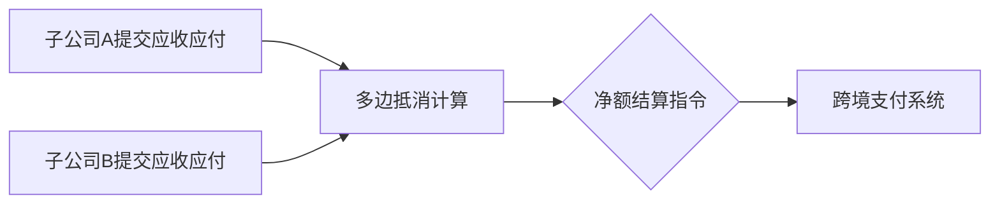

# 净额结算

## **什么是净额结算？**

**定义**：净额结算（Netting）是 **减少交易对手之间支付或债务风险的核心机制**。通过将多笔互相关联的应收/应付金额合并为单一净额，简化结算流程、降低信用风险敞口和提高资金效率。

**示例**：

- A公司欠B公司100万美元，B公司欠A公司70万美元 → **净额结算后**，A仅需支付B **30万美元**。

## **净额结算的四大类型**

| **类型** | **适用场景** | **行业应用** |
| --- | --- | --- |
| **1. 支付净额** | 同一交易对手间多笔同币种现金流对冲（如外汇交易） | 跨国企业跨境付款优化（减少SWIFT费用） |
| **2. 头寸净额** | 衍生品合约（如利率互换、期权）的市值风险敞口合并 | 投行降低市场风险（VaR计算） |
| **3. 清算净额** | 中央对手方（CCP）对多边交易的集中抵消 | 期货交易所每日结算（如CME、LCH） |
| **4. 破产净额** | 企业破产时，通过法律确认债权债务相抵 | 雷曼兄弟破产时的衍生品合约处理 |

## **关键应用场景**

1. **衍生品交易**（如ISDA主协议下的场外衍生品）
    - 例子：对冲基金与投行签署CSA（信用支持附件），每日按净额追加保证金。
2. **跨境贸易结算**
    - 跨国企业通过净额合并多个子公司的应付账款（如丰田全球供应链）。
3. **证券清算**
    - 中央对手方（如中国结算）对证券买卖净额进行货银对付（DVP）结算。
4. **银行间市场**（如外汇掉期）
    - CLS清算系统对全球55种货币的多边净额结算，日均处理超5万亿美元。

## **净额结算（Netting）的全流程详解**

### **1. 交易录入与匹配**

- **步骤**：
    1. **交易捕获**（Trade Capture）：各交易系统（如前台交易系统、ERP）将交易数据（对手方、金额、币种、期限）推送至净额结算模块。
    2. **身份匹配**：
    - 使用 **LEI（Legal Entity Identifier）** 确定对手方法人实体。
    - 通过 **交易参考号**（如Swap ID、合同编号）确认属于同一协议下的交易组。
    1. **业务匹配**：验证交易经济逻辑的可抵消性（如方向相反的同类型衍生品）。
- **案例**：高盛与摩根大通签署ISDA协议后，其外汇远期交易会被标记为同一对手方组，通过交易日期、方向、币种自动匹配。

### **2. 敞口计算与风险核对**

- **步骤**：
    1. **市值评估**（MTM, Mark-to-Market）：对每笔交易按市场价计算当前价值，汇总多币种头寸（如美元、欧元）。
    2. **敞口聚合**：按对手方组（Counterparty Group）合并所有正向（Positive）和负向（Negative）敞口。
    3. **风险限额校验**：检查净额后敞口是否超出信用额度和保证金覆盖率要求（如超过需触发追加）。
- **关键技术**：
    - 使用 **Python/Pandas** 或 **风险引擎**（如Murex、Algo Risk）进行敞口模拟。
    - 实时汇率整合（如Reuters FX Feed）。

### **3. 法律与协议确认**

- **步骤**：
    1. **主协议核查**：
    - 确认有效的 **ISDA主协议**（含净额条款）或内部协议（Intra-Company Agreement）。
    - 验证协议是否覆盖交易类型（如是否允许跨币种净额）。
    1. **法律合规性证明**：
    - 获取法务部门对跨司法辖区净额有效性的书面意见（Legal Opinion）。
    - 针对 **破产净额**（Close-out Netting）特别审核管辖地破产法的支持性。
- **案例**：中国企业在与欧洲对手方净额前，须由欧资律所出具欧盟EMIR框架下的净额可执行性意见书。

### **4. 净额计算与多币种处理**

- **步骤**：
    1. **净额逻辑执行**：
    - 单边净额（Bilateral Netting）：仅双边交易抵消。
    - 多边净额（Multilateral Netting）：三方以上交易通过中心节点（如CLS银行）抵消。
    1. **多币种转换**：
    - 按预设规则（如“优先按交易原币种抵消”）或汇率转换对冲剩余币种敞口。
    - 使用 **央行中间价** 或 **实时汇率** 进行换算。
    1. **生成净额结果**：输出净支付方、净接收方、币种及金额（如净支付USD 5M，净接收EUR 3.2M）。
- **示例**：
    
    
    | **交易对手** | **应收（USD）** | **应付（USD）** | **净方向** | **净额（USD）** |
    | --- | --- | --- | --- | --- |
    | Bank A | 12M | 8M | 应收 | +4M |
    | Bank B | 5M | 10M | 应付 | -5M |

### **5. 清算与结算执行**

- **步骤**：
    1. **清算指令生成**：
    - 按净额结果生成支付指令文件（如ISO 20022 XML格式）。
    - 针对 **中央清算对手方（CCP）**，上传头寸数据至清算系统（如LCH、DTCC）。
    1. **资金划转**：
    - 通过SWIFT、Fedwire或本地清算系统（如中国CNAPS）完成资金划拨。
    - 遵循 **DVP（Delivery vs Payment）** 或 **PVP（Payment vs Payment）** 原则。
    1. **账务处理**：更新财务系统中的应收应付科目（如应收账款从总额调整为净额）。

### **6. 对账与争议处理**

- **步骤**：
    1. **内部对账**：核对净额结果与原交易数据的完整性（如未匹配交易需人工排查）。
    2. **对手方确认**：发送净额报告（Netting Statement）供对手方签署确认，争议期通常为1~3工作日。
    3. **争议仲裁**：通过交易存证（如区块链记录）或第三方数据源（如Bloomberg）解决金额/汇率分歧。
- **风险控制**：
    - 设立 **争议阈值**（如差异超过0.1%触发人工复核）。
    - 记录争议日志用于审计追踪。

## **不同业务的净额流程差异**

### **1. 双边净额（Bilateral Netting）**

- **流程特点**：
    - 仅在两个对手方之间进行（无需CCP参与）。
    - 依赖双方签署的主协议（如ISDA）条款。
- **系统实现**：通过内部净额引擎直接计算，如使用 **TriOptima** 压缩冗余交易。

### **2. 多边净额（Multilateral Netting）**

- **流程特点**：
    - 由中央对手方（CCP）或净额服务商（如GTreasury）作为枢纽。
    - 适用于集团内多个子公司或生态链企业。
- **操作流程**：

### **3. 清算净额（Clearing Netting）**

- **适用场景**：交易所交易衍生品（如期货）通过CCP清算。
- **流程差异**：
    - **保证金计算**：按净额收取初始/变动保证金。
    - **违约处理**：CCP在对手方违约时继承净头寸。

## **Intra LE（Intra-Legal Entity）** 与 **Inter LE（Inter-Legal Entity）**

### **概念定义与核心差异**

**1. Intra LE净额结算**

- **定义**：同一法人实体（Legal Entity，LE）内部不同部门/业务线之间的交易对手风险抵消。
    
    **示例**：
    
    高盛美国（LE代码：GS_US）的交易台A与其股票部门之间的衍生品交易。
    
- **允许性条件**：
    - **法律合规**：所在司法辖区认可同一法人的内部互负债务抵消（通常适用民法或破产法中的抵消条款）。
    - **协议支持**：需签署 **内部主净额结算协议（Internal Master Netting Agreement, IMNA）**，明确内部头寸净额处理规则。

**2. Inter LE净额结算**

- **定义**：不同法人实体之间的交易对手风险抵消（即使属于同一集团）。
    
    **示例**：
    
    摩根大通银行（JPMorgan Chase Bank, NA）与摩根大通证券（JP Morgan Securities LLC）之间的交易。
    
- **允许性条件**：
    - **外部法律协议**：必须签订 **ISDA主协议（含净额结算条款）** 或其他行业标准协议。
    - **监管认可**：在破产场景中需管辖权法院承认净额有效性（例如美国《破产法》第11章下的“安全港”条款）。
    - **独立信用评估**：需按集团外实体处理，可能触发第三方信用支持（如保证金要求）。

### **对净额结算的关键影响**

**1. 风险敞口计量（Exposure Calculation）**

| **维度** | **Intra LE** | **Inter LE** |
| --- | --- | --- |
| **信用风险调整（CVA/DVA）** | 通常豁免（认为同一法人违约风险同源） | 须单独计提（视为独立违约概率） |
| **资本占用（RWA）** | 可合并计算（Basel III内部敞口可降低权重） | 需独立计算资本（若未实现有效净额则权重更高） |

**2. 现金流结算（Cash Settlement）**

| **场景** | **Intra LE** | **Inter LE** |
| --- | --- | --- |
| **应付/应收抵消** | 自动允许（系统内部勾稽） | 需满足跨境支付合规（如外汇管制）和集团资金政策 |
| **税务处理** | 视为内部转移，可延迟税负（需遵循转让定价规则） | 按独立交易定价，立即产生预提税或增值税义务 |

**3. 法律与监管要求**

| **要求** | **Intra LE** | **Inter LE** |
| --- | --- | --- |
| **协议强制性** | 可选（建议有IMNA以明确规则） | 强制（无ISDA主协议则无法主张净额） |
| **破产隔离有效性** | 一般无效（属于同一法人资产池） | 需“安全港”条款保护 |
| **监管报告要求** | 合并至法人层级（如FFIEC 009报告） | 需按对手方单独披露（如EMIR交易报告） |

### **实际应用场景与案例**

**1. 大型投行的利率互换组合管理**

- **Intra LE场景**：银行香港分行（LE: BOC_HK）的利率互换交易台与企业客户部借入相同对手方的利率头寸。
    
    **净额处理**：两个部门头寸可合并为净敞口，仅需对净额部分缴纳初始保证金。
    
- **Inter LE场景**：银行香港分行（LE: BOC_HK）与伦敦子行（LE: BOC_London）持有同一对冲基金的相反头寸。
    
    **净额争议**：若无跨实体净额协议，需分别计算敞口并追加全额保证金，资本占用上升。
    

**2. 跨国制造商的汇率风险管理**

- **Intra LE优化案例**：通用电气（GE）美国总部与其GE能源工业部门（同一LE）间的外汇远期合约可净额结算，消除内部美元/欧元波动风险。
- **Inter LE风险案例**：雷曼兄弟欧洲（LEH_EU）与雷曼美国（LEH_US）在2008年因无跨境净额协议，破产时无法抵消互负债务，导致全球债权人损失扩大。