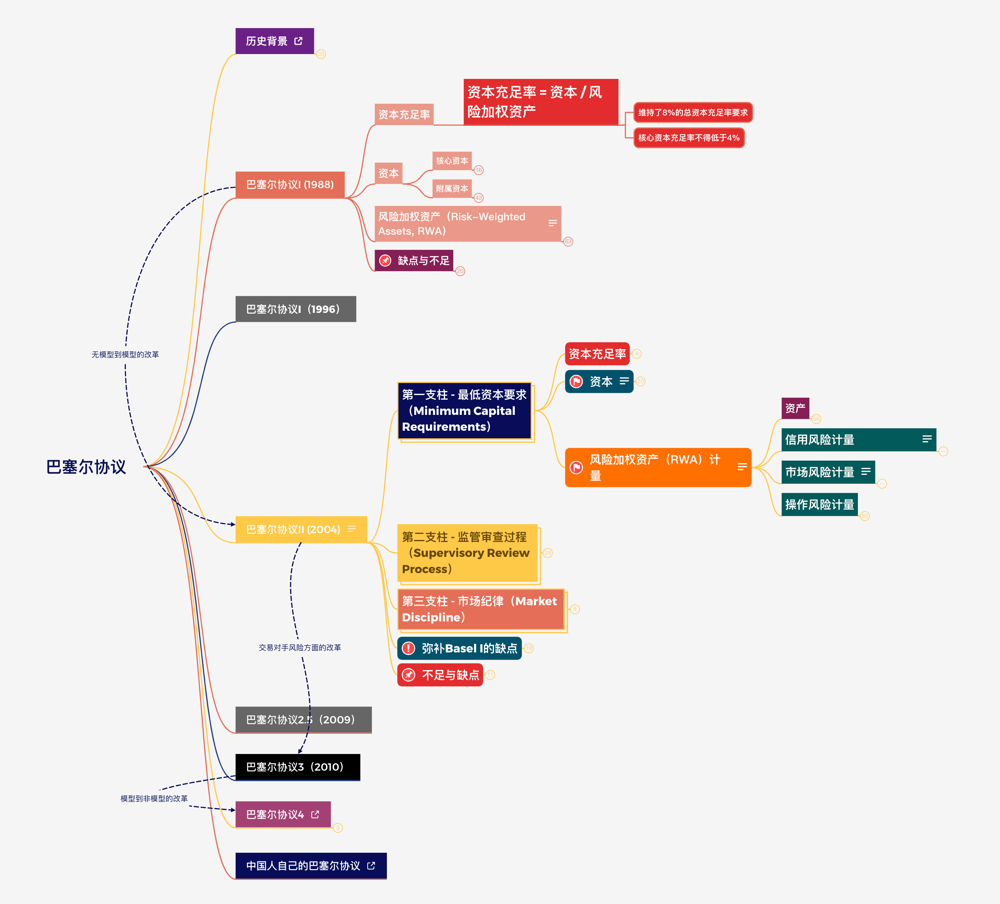

# 巴塞尔协议

## [历史背景](https://www.bis.org/bcbs/history.htm)

### 全球范围内的金融创新与金融自由化带来了一个严重的负面影响

- 金融风险的全球传染性

- 各国监管方式的差异

### 1975年2月，在国际清算银行的发起和主持下，十国集团及瑞士、卢森堡共同成立了“国际清算银行关于银行管理和监督行动常设委员会”，由各国银行监管当局的代表组成。后来委员会将其名称改为巴塞尔银行监管委员会。

### Herstatt银行和富兰克林银行倒闭的第二年，即1975年9月，第一个巴塞尔协议出台。

- 任何银行的国外机构都不能逃避监管

- 母国和东道国应共同承担的职责

### 83年5月，修改后的《巴塞尔协议》推出

- 明确了母国和东道国的监管责任和监督权力

- 分行、子行和合资银行的清偿能力、流动性、外汇活动及其头寸各由哪方负责等

### 1988年7月通过的《关于统一国际银行的资本计算和资本标准的报告》

- 资本的分类

- 风险权重的计算标准

- 1992年资本与资产的标准比例和过渡期的实施安排

- 各国监管当局自由决定的范围

###  巴塞尔协议II (2004)

- 引入了更为复杂的风险加权资产计量方法，更加准确地反映了银行的风险状况

- 增加了对市场风险和操作风险的监管要求

- 设立了三个支柱，分别为最低资本要求、监管审查和市场纪律

### 巴塞尔协议III (2010)

- 提高了资本充足率要求，普通股一级资本最低要求从4%提高到8%。

- 引入了流动性覆盖率和净稳定资金比率等流动性监管指标。

- 加强了对系统重要性银行的监管。

### 巴塞尔协议IV (2023)

- 修订了风险加权资产计量方法，提高了风险敏感度。

- 引入了内部模型法和标准法两种信用风险计量方法。

- 加强了对操作风险的监管。

## 巴塞尔协议I (1988)

### 资本充足率

- 资本充足率 = 资本 / 风险加权资产

	- 维持了8%的总资本充足率要求

	- 核心资本充足率不得低于4%

### 资本

- 核心资本

	- 实收资本（Paid-in Capital）

		- 普通股

			- 普通股可以通过发行股票吸收社会资金，也可以通过银行的盈余账户转入。

				- 假设一家银行的股东投入了100亿元的资本，那么该银行的普通股一级资本为100亿元。

	- 公开储备

		- 资本公积（Capital Surplus）

		  
		  资本公积的来源
		  股本溢价：这是资本公积最常见的来源之一。当公司发行新股时，如果发行价格高于股票的面值（或称为名义价值），那么超出部分就会计入资本公积。例如，如果一家公司发行面值为1元的股票，而发行价格为5元，那么每股就有4元的溢价收入计入资本公积。
		  资产重估增值：当公司对其持有的资产进行重估，并且市场价值高于账面价值时，资产的增值部分可以计入资本公积。
		  接受捐赠资产：公司接受的非货币性资产捐赠，其公允价值超过名义价值的部分，也可以计入资本公积。
		  其他来源：资本公积还可能包括因汇率变动导致的外币资本折算差额、股权投资差额等其他来源。
		  
		  资本公积的用途
		  
		  资本公积通常不用于分配股利，而是作为公司的储备资金，可以用于以下几个方面：
		  
		  转增股本：公司可以将资本公积转为股本，通过这种方式增加公司的注册资本。
		  弥补亏损：在一些情况下，资本公积可以用来弥补公司的累计亏损。
		  扩大再生产：资本公积可以用于公司的扩张和再投资，增强公司的资本实力和市场竞争力。
		  提高财务稳定性：资本公积作为一种储备，可以提高公司的财务稳定性和偿债能力。
		  
		  资本公积的重要性
		  
		  资本公积是公司财务健康的一个重要指标。它不仅反映了公司在资本市场的融资能力，也是公司未来发展潜力的一种体现。较高的资本公积通常意味着公司有更多的内部资源用于发展和应对潜在的市场风险。
		  
		  在中国，资本公积的管理和使用受到《公司法》和相关财经法规的规定。公司在使用资本公积时，必须遵守相关法律法规，并在财务报表中对其进行透明和准确的披露。通过了解资本公积的构成和用途，投资者和利益相关者可以更好地评估公司的财务状况和未来发展前景。
		  
		  
			- 核心资产中的资本公积，通常指的是企业在发行股票过程中产生的溢价收入，以及其他一些特定情况下形成的资本储备。资本公积是公司所有者权益的一部分，它反映了公司除了股本（实收资本）之外的额外资本储备。

				- ，如果一家公司发行面值为1元的股票，而发行价格为5元，那么每股就有4元的溢价收入计入资本公积。

		- 未分配利润（Retained Earnings）

		  核心资产中的未分配利润是指企业在经营活动中累积的、尚未分配给股东的利润部分，它是企业所有者权益中的一个重要组成部分。未分配利润的累积反映了企业在一定时期内的盈利能力和资本积累情况，同时也是企业未来扩张、投资和抵御风险的重要资金来源。以下是对核心资产中未分配利润的详细解释，以帮助您更好地理解这一概念：
		  
		  
		  未分配利润的形成
		  
		  未分配利润的形成主要通过以下步骤：
		  
		  盈利活动：企业通过销售产品或提供服务，在一定会计期间内实现盈利，形成净利润。
		  利润分配：企业根据股东大会的决议，将部分净利润以股息或红利的形式分配给股东。
		  留存利润：企业决定留存部分净利润不进行分配，这部分留存的利润就形成了未分配利润。
		  
		  未分配利润的作用
		  
		  未分配利润在企业运营和战略发展中具有多重作用：
		  
		  再投资：未分配利润可以用于企业的内部再投资，支持企业的有机增长和扩张，如购买新设备、技术升级、市场拓展等。
		  财务稳定性：未分配利润增加了企业的内部资金储备，提高了企业的财务稳定性和偿债能力，使企业在面对市场波动和不确定性时更有韧性。
		  风险管理：未分配利润作为企业内部的资金缓冲，可以在经营困难或市场低迷时用于维持企业的正常运营，帮助企业渡过难关。
		  资本积累：未分配利润的累积体现了企业的资本积累能力，有助于提高企业的市场价值和股东财富。
		  
		  未分配利润的管理
		  
		  企业对未分配利润的管理需要考虑以下因素：
		  
		  平衡股东利益：企业在决定留存利润时，需要平衡股东对即时回报的期望和企业长期发展的需求。
		  合规性：企业在处理未分配利润时，必须遵守相关的法律法规和会计准则，确保财务报告的准确性和透明度。
		  战略规划：企业应根据长期战略规划，合理安排未分配利润的使用，确保资金的有效利用和最大化回报。
		  信息披露：企业应在财务报表中充分披露未分配利润的变动情况，让股东和投资者了解企业的资金状况和盈利能力。
		  理解核心资产中的未分配利润对于评估企业的财务健康状况、盈利能力和未来发展潜力至关重要。未分配利润的合理管理和运用，能够帮助企业实现可持续发展，为股东创造长期价值。同时，未分配利润的水平也是投资者评价企业投资价值的重要指标之一。
		  
		  
			- 核心资产中的未分配利润是指企业在经营活动中累积的、尚未分配给股东的利润部分，它是企业所有者权益中的一个重要组成部分。

				- 假设有一家名为“TechFuture”的科技公司，在2023年度实现了5000万元的净利润。公司管理层在考虑了未来的发展规划和市场情况后，决定将其中的2000万元作为股利分配给股东，以回报投资者的支持和信任。剩余的3000万元则作为未分配利润留存于公司内部。

				  当然可以。以下是一个关于未分配利润的例子，以帮助您更直观地理解这一概念：
				  
				  
				  例子：某科技公司的未分配利润
				  
				  假设有一家名为“TechFuture”的科技公司，在2023年度实现了5000万元的净利润。公司管理层在考虑了未来的发展规划和市场情况后，决定将其中的2000万元作为股利分配给股东，以回报投资者的支持和信任。剩余的3000万元则作为未分配利润留存于公司内部。
				  
				  在这3000万元未分配利润中，公司决定：
				  
				  再投资：使用1000万元用于研发新产品和技术创新，以保持公司在市场上的竞争力和技术领先地位。
				  市场扩张：投入800万元用于市场推广和品牌建设，扩大市场份额，吸引更多的客户。
				  储备资金：留存剩余的1200万元作为储备资金，以备不时之需，比如应对突发事件、市场波动或作为未来投资机会的准备金。
				  通过这样的安排，TechFuture公司不仅能够给股东提供合理的回报，还能够保持公司的财务灵活性和稳健性，同时支持公司的长期发展目标。未分配利润的使用反映了公司管理层的战略规划能力和对公司未来发展的信心。
				  
				  在未来的会计期间，如果TechFuture公司继续保持盈利状态，未分配利润将继续累积，为公司提供更多的内部资金来源。同时，公司也可以根据实际情况调整利润分配政策和资金使用计划，以最大化股东价值和公司利益。
				  
				  这个例子展示了未分配利润在企业财务管理中的重要性，以及它如何被用于支持企业的增长和稳定。通过合理管理未分配利润，企业可以增强自身的财务实力，提高市场竞争力，并为股东创造更大的价值。
				  
			
		- 其他核心一级资本项目（Other Tier 1 Capital Instruments）

		  核心一级资本（Tier 1 Capital）是银行资本结构中最高质量和最稳定的资本形式，它包括实收资本（普通股）、资本公积、盈余公积、未分配利润以及一般风险准备等。除了这些常见的组成部分，其他核心一级资本项目可能包括以下几个方面：
		  
		  
		  1. 其他一级资本工具及其溢价
		  
		  这些是指除了普通股之外的其他资本工具，它们具有损失吸收能力，并且在银行清算时的偿还顺序位于债权人之后。这些工具可能包括优先股、可转换债券、可累积优先股等，它们通常具有固定的股息支付义务，并且在一定条件下可以转换为普通股。
		  
		  
		  2. 少数股东资本可计入部分
		  
		  当银行集团的子公司发行了其他一级资本工具，并且这些工具被第三方持有时，母公司可以将其计入集团整体的核心一级资本中。这部分资本反映了少数股东在子公司中的权益，是对母公司核心一级资本的补充。
		  
		  
		  理解其他核心一级资本项目的方法
		  
		  了解资本工具的性质：理解每种资本工具的特点，包括它们的损失吸收能力、转换特性、股息支付条件等。
		  关注监管要求：监管机构对银行资本的要求不断更新，了解最新的监管政策和标准对于理解其他核心一级资本项目至关重要。
		  分析风险管理：这些资本工具通常与银行的风险管理策略紧密相关，它们可以增强银行的资本基础，提高银行对风险的抵御能力。
		  考虑资本优化：银行可能会根据自身的资本结构和业务需求，选择发行不同类型的其他一级资本工具，以优化资本成本和资本效率。
		  通过深入了解这些其他核心一级资本项目，投资者和分析师可以更好地评估银行的资本充足性、财务稳定性和长期增长潜力。同时，这也有助于监管机构确保银行系统的稳健运行和金融安全。
		  
		  
			- 其他一级资本工具及其溢价

				- 这些是指除了普通股之外的其他资本工具，它们具有损失吸收能力，并且在银行清算时的偿还顺序位于债权人之后。这些工具可能包括优先股、可转换债券、可累积优先股等，它们通常具有固定的股息支付义务，并且在一定条件下可以转换为普通股。

			- 少数股东资本可计入部分

				- 当银行集团的子公司发行了其他一级资本工具，并且这些工具被第三方持有时，母公司可以将其计入集团整体的核心一级资本中。这部分资本反映了少数股东在子公司中的权益，是对母公司核心一级资本的补充。

- 附属资本

	- 未公开储备

	  未公开储备（Undisclosed Reserves）是银行附属资本（Tier 2 Capital）的一个组成部分，根据巴塞尔协议I的规定，它们是指那些虽未公开披露，但已反映在损益表上并为银行的监管机构所接受的储备。这些储备通常是银行为了应对未来可能出现的损失而设置的，它们不包括在公开储备中，但在计算资本充足率时被计入附属资本。
	  
	  未公开储备主要包括以下几个方面：
	  
	  未实现的证券重估储备：
	  这是指银行持有的证券或其他金融资产的市场价值上升，但这种增值尚未实现（即尚未出售资产），因此不能计入当期利润。这部分未实现的增值可以作为未公开储备的一部分。
	  其他未公开的准备金：
	  这可能包括银行为了应对未来潜在风险而设置的其他类型的准备金，这些准备金可能没有特定的用途，但被认为有助于增强银行的资本基础。
	  理解未公开储备的关键在于认识到它们是银行内部积累的资金，用于增强银行的资本充足率和提高其对潜在风险的抵御能力。未公开储备的存在有助于银行在面对不确定的市场环境和潜在损失时，保持资本的稳定性和充足性。
	  
	  需要注意的是，未公开储备的使用和计算受到监管机构的严格规定，银行必须按照监管要求进行披露和计算。此外，未公开储备的规模和构成可能会根据不同国家和地区的监管规定有所不同。在中国，未公开储备的管理和使用也受到中国银保监会等监管机构的监督和规定。
	  
	  
		- 未实现的证券重估储备

			- 这是指银行持有的证券或其他金融资产的市场价值上升，但这种增值尚未实现（即尚未出售资产），因此不能计入当期利润。这部分未实现的增值可以作为未公开储备的一部分。

		- 其他未公开的准备金

			- 这可能包括银行为了应对未来潜在风险而设置的其他类型的准备金，这些准备金可能没有特定的用途，但被认为有助于增强银行的资本基础。

	- 优先股

	  实收资本中的优先股是一种特殊类型的股份，它在公司的资本结构中具有某些类似于债权的特征，同时也具有股权的特征。在中国，根据《公司法》和中国证监会发布的相关规定，优先股股东通常享有优先于普通股股东分配公司利润和剩余财产的权利，但在公司决策管理等方面的权利受到限制。
	  
	  优先股的特征
	  优先分配权：在公司分配利润时，优先股股东有权先于普通股股东获得约定的股息。如果公司盈利，优先股股东通常可以获得固定的股息收入。
	  优先偿还权：在公司清算时，优先股股东的残余财产分配权也位于普通股股东之前，但在债权人之后。
	  权利限制：优先股股东通常不享有表决权或只有有限的表决权，这意味着他们通常不能参与公司的经营决策。
	  可赎回性：许多优先股具有可赎回性，即公司有权在特定条件下回购优先股股份，这类似于债务到期偿还本金。
	  实收资本中的优先股
	  
	  在公司的实收资本中，优先股可以作为一种股权融资工具，允许公司筹集资金同时限制新股东的表决权，保持现有股东的控制权。对于投资者而言，优先股提供了一种相对稳定的收益来源，因为他们可以获得固定的股息，并且在公司清算时享有优先权。
	  
	  法律和会计处理
	  
	  在法律上，优先股被视为一种股权证券，但在会计处理上，根据“实质重于形式”的原则，某些优先股可能会被视为金融负债。这取决于优先股的具体条款，如是否要求固定股息支付，以及公司是否有义务在特定情况下回购股份等。
	  
	  结论
	  
	  实收资本中的优先股是一种混合型金融工具，它结合了股权和债权的特点，为公司提供了一种灵活的融资方式，同时也为投资者提供了一种相对稳定且具有一定保障的投资选择。优先股的具体性质和处理方式需要根据公司法、证券法以及相关的监管规定来确定。在中国，优先股的发行和交易受到中国证监会的严格监管，确保市场的公平性和透明度。
	  
	  
		- 在公司的实收资本中，优先股可以作为一种股权融资工具，允许公司筹集资金同时限制新股东的表决权，保持现有股东的控制权。对于投资者而言，优先股提供了一种相对稳定的收益来源，因为他们可以获得固定的股息，并且在公司清算时享有优先权。

			- 例子1：非公开发行的优先股

				- 一家未上市的公司可能面向特定投资者发行优先股，以筹集资金用于扩大生产规模或研发新产品。这些优先股可能提供固定的股息回报，并在公司清算时优先于普通股股东获得资产的剩余价值。

			- 例子2：公开发行的优先股

				- 一家上市公司可能为了增加资本基础或优化资本结构，向公众投资者发行优先股。这些优先股可能在证券交易所上市交易，提供比普通股更为稳定的股息收入，同时在风险和回报方面为投资者提供了另一种选择。

			- 例子3：具有可转换特性的优先股

				- 某些优先股可能设计成可转换为普通股。这意味着持有者在未来可以按照预先确定的转换比率和条件，将其优先股转换为公司的普通股。这种类型的优先股为投资者提供了一种潜在的增值机会。

			- 例子4：具有累积股息特性的优先股

				- 一些优先股可能具有累积股息的特性，即如果某一年度公司未能支付股息，未支付的股息将累积到未来年度支付。这为优先股股东提供了额外的保护，确保他们在公司财务状况改善时能够获得应得的回报。

			- 例子5：具有回购选项的优先股

				- 公司可能发行具有回购选项的优先股，允许公司在未来某个时间点以预定价格回购这些股份。这可以作为公司资本管理策略的一部分，帮助公司调整其资本结构和成本。

	- 重估储备

	  重估储备（Revaluation Reserves）是银行附属资本（Tier 2 Capital）的一个组成部分，它主要指的是银行在对其持有的资产进行重估时，因市场价值上升而产生的增值部分。这种增值通常发生在银行持有的固定资产（如房地产、设备等）或投资（如股票、债券等）的市场价值超过其原始购买成本或账面价值时。
	  
	  在理解重估储备时，可以从以下几个方面进行：
	  
	  资产重估的目的：银行可能定期对其持有的长期资产进行重估，以反映其公允价值的变化。这有助于银行更准确地反映其财务状况，并确保资产负债表上的信息更加透明和真实。
	  重估储备的形成：当重估结果显示资产的市场价值高于其账面价值时，银行会将这种增值记入重估储备。这部分资金可以作为银行的资本储备，用于吸收潜在的损失或支持未来的业务发展。
	  监管要求：根据巴塞尔协议的规定，银行在计算附属资本时可以将一定比例的重估储备计入。但是，这部分资金通常有一定的限制，例如，可能只能计入重估增值的一部分，或者需要满足特定的条件才能计入。
	  风险管理和资本充足率：重估储备作为附属资本的一部分，有助于提高银行的资本充足率，这是衡量银行资本强度和风险承受能力的重要指标。通过维持一定的资本充足率，银行能够更好地抵御市场波动和潜在的信贷损失。
	  财务报告和透明度：银行需要在其财务报告中披露重估储备的相关信息，包括重估的方法、增值的金额以及相关的监管要求。这有助于投资者和其他利益相关者了解银行的财务状况和风险管理能力。
	  总之，重估储备是银行附属资本的一部分，它反映了银行持有资产的市场价值变化。通过合理管理和使用重估储备，银行可以增强其资本基础，提高对风险的抵御能力，并确保财务信息的真实性和透明度。同时，银行也需要遵守相关的监管要求，确保资本质量和资本充足率的合规性。
	  
	  
		- 当银行持有的资产（如房地产）的市场价值上升时，银行可以根据会计准则对这些资产进行重估，并把增值部分计入附属资本。

			- 资产重估的目的：银行可能定期对其持有的长期资产进行重估，以反映其公允价值的变化。这有助于银行更准确地反映其财务状况，并确保资产负债表上的信息更加透明和真实。

			- 重估储备的形成：当重估结果显示资产的市场价值高于其账面价值时，银行会将这种增值记入重估储备。这部分资金可以作为银行的资本储备，用于吸收潜在的损失或支持未来的业务发展。

			- 监管要求：根据巴塞尔协议的规定，银行在计算附属资本时可以将一定比例的重估储备计入。但是，这部分资金通常有一定的限制，例如，可能只能计入重估增值的一部分，或者需要满足特定的条件才能计入。

			- 风险管理和资本充足率：重估储备作为附属资本的一部分，有助于提高银行的资本充足率，这是衡量银行资本强度和风险承受能力的重要指标。通过维持一定的资本充足率，银行能够更好地抵御市场波动和潜在的信贷损失。

			- 财务报告和透明度：银行需要在其财务报告中披露重估储备的相关信息，包括重估的方法、增值的金额以及相关的监管要求。这有助于投资者和其他利益相关者了解银行的财务状况和风险管理能力。

	- 普通准备金

	  
	  普通准备金（General Provisions）是银行附属资本（Tier 2 Capital）的一个组成部分，它主要指的是银行为了应对潜在的信贷损失或其他经营风险而设置的资金储备。普通准备金是一种风险缓冲机制，用于吸收可能发生的损失，以保护银行的财务稳定性和持续运营能力。
	  
	  在理解普通准备金时，可以从以下几个方面进行：
	  
	  风险预防：普通准备金是银行为了预防未来可能出现的信贷损失或其他经营风险而设置的，它体现了银行对风险管理的重视和前瞻性。
	  资本结构的一部分：普通准备金作为附属资本的一部分，有助于提高银行的资本充足率，这是衡量银行资本强度和风险承受能力的重要指标。
	  监管要求：根据巴塞尔协议和其他监管规定，银行需要根据其风险敞口设定一定比例的普通准备金，并在财务报表中进行披露。
	  财务稳健性：通过设置普通准备金，银行增强了自身的财务稳健性，即使在面对不利经济环境或突发事件时，也能够维持正常运营。
	  透明度和信息披露：银行需要在其财务报告中明确披露普通准备金的设置情况和使用情况，这有助于投资者和其他利益相关者了解银行的风险管理状况和财务健康状况。
	  
		- 这是银行为了应对潜在的信贷损失而设置的准备金，可以计入附属资本。

	- 带有债务性质的资本工具

	  带有债务性质的资本工具（Subordinated Debt Instruments）是银行附属资本（Tier 2 Capital）的一个重要组成部分，它们是银行为了增加资本基础而发行的一种特殊类型的债务工具。这些工具在偿还顺序上具有次级性，意味着在银行清算或破产时，其偿还排在普通债权人和其他优先级更高的债务之后。
	  
	  在理解带有债务性质的资本工具时，可以从以下几个方面进行：
	  
	  次级性：这类工具的偿还权利位于普通债权人之后，这意味着在银行清算时，只有在满足了普通债权人和其他优先级更高的债权人的索赔之后，这些工具的持有人才能得到偿还。
	  资本增强：带有债务性质的资本工具可以增强银行的资本基础，提高银行的资本充足率，从而增强银行的稳定性和抗风险能力。
	  监管要求：根据巴塞尔协议和其他监管规定，这类工具通常有一定的期限要求，比如至少5年或更长时间，以确保银行能够长期保持较高的资本水平。
	  损失吸收能力：在银行面临财务压力时，这些工具由于其次级性，可以作为损失吸收的缓冲，保护普通债权人和其他优先级更高的债权人的利益。
	  投资者角度：对于投资者而言，带有债务性质的资本工具通常提供比普通债务更高的利率，以补偿其较高的风险性。然而，这也意味着在银行出现问题时，投资者可能面临较大的损失风险。
	  
		- 这包括银行发行的、具有债务特征的资本工具，如次级债券。这些工具通常具有较高的风险，因此被归类为附属资本。

		- 它们是银行为了增加资本基础而发行的一种特殊类型的债务工具。这些工具在偿还顺序上具有次级性，意味着在银行清算或破产时，其偿还排在普通债权人和其他优先级更高的债务之后。

	- 长期次级债务

	  长期次级债务（Long-term Subordinated Debt）是银行附属资本（Tier 2 Capital）的一个组成部分，它指的是银行发行的一种具有次级偿还权的长期债务工具。这种债务工具在银行清算、破产或其他类似情况下的偿还顺序中位于普通债权人之后，但在权益持有人之前。长期次级债务的期限通常较长，至少5年或以上，以确保银行能够长期维持其资本水平。
	  
	  在理解长期次级债务时，可以从以下几个方面进行：
	  
	  次级偿还权：长期次级债务的持有人在银行清算时的偿还权利位于普通债权人之后，这意味着如果银行遇到财务困难，这些债务工具的持有人将在普通债权人得到满足后才有可能获得偿还。
	  资本增强作用：长期次级债务有助于增强银行的资本基础，提高银行的资本充足率，从而提升银行的稳定性和抗风险能力。这是监管机构鼓励银行发行此类债务工具的原因之一。
	  监管要求：根据巴塞尔协议和其他监管规定，长期次级债务必须满足特定的条件才能被计入附属资本，例如期限要求、次级性要求等。
	  投资者角度：对于投资者而言，长期次级债务通常提供比普通债务更高的利率，以补偿其较高的风险性。然而，这也意味着在银行出现问题时，投资者可能面临较大的损失风险。
	  损失吸收机制：长期次级债务作为一种损失吸收机制，可以在银行面临财务压力时提供额外的缓冲，减少对其他债权人和权益持有人的影响。
	  
		- 次级偿还权：长期次级债务的持有人在银行清算时的偿还权利位于普通债权人之后，这意味着如果银行遇到财务困难，这些债务工具的持有人将在普通债权人得到满足后才有可能获得偿还。

		- 资本增强作用：长期次级债务有助于增强银行的资本基础，提高银行的资本充足率，从而提升银行的稳定性和抗风险能力。这是监管机构鼓励银行发行此类债务工具的原因之一。

		- 监管要求：根据巴塞尔协议和其他监管规定，长期次级债务必须满足特定的条件才能被计入附属资本，例如期限要求、次级性要求等。

		- 投资者角度：对于投资者而言，长期次级债务通常提供比普通债务更高的利率，以补偿其较高的风险性。然而，这也意味着在银行出现问题时，投资者可能面临较大的损失风险。

		- 损失吸收机制：长期次级债务作为一种损失吸收机制，可以在银行面临财务压力时提供额外的缓冲，减少对其他债权人和权益持有人的影响。

	- 资本扣除部分

	  资本扣除部分（Deductions from Capital）是银行资本计算中的一个特殊项目，它指的是在计算银行的监管资本时需要从总资本中扣除的某些项目。这些扣除项通常包括那些虽然对银行的财务状况有正面影响，但在监管资本计算中不被认可或被视为高风险的项目。资本扣除部分的设置是为了确保银行的资本质量，提高银行资本的损失吸收能力，并确保银行有足够的资本来抵御潜在的风险。
	  
	  在理解资本扣除部分时，可以从以下几个方面进行：
	  
	  监管目的：资本扣除部分的设置是为了确保银行资本的质量，防止银行过度依赖某些可能不稳定或风险较高的资本项目。
	  扣除项目：常见的扣除项目包括商誉（Goodwill）、递延税资产（Deferred Tax Assets）和其他无形资产。这些项目可能在会计上被视为资产，但在监管资本计算中需要被扣除，因为它们可能不具备足够的损失吸收能力。
	  商誉：商誉通常是指银行在并购其他公司时支付的超出净资产公允价值的金额。虽然商誉在会计上被视为无形资产，但在计算监管资本时通常需要全额扣除。
	  递延税资产：递延税资产是指银行因时间差异造成的税项资产。虽然这些资产在未来可能有助于减少银行的税负，但在监管资本计算中可能需要部分或全额扣除，因为它们的实现存在不确定性。
	  监管标准：不同国家和地区的监管机构可能对资本扣除部分有不同的规定和要求。银行需要遵守所在国家或地区的监管标准来计算其资本充足率。
	  
	  
		- 商誉是一种无形资产，它通常能增加银行的价值，但它又是一种虚拟资本，价值大小比较模糊。

		- 从总资本中扣除对从事银行业务和金融活动的附属机构的投资。

### 风险加权资产（Risk-Weighted Assets, RWA）

巴塞尔协议I（Basel I）引入了风险加权资产（Risk-Weighted Assets, RWA）的概念，这是为了确保银行的资本水平与其面临的风险相匹配。风险加权资产的计算逻辑基于对银行资产风险程度的评估，不同类型的资产根据其风险水平被赋予不同的风险权重。

以下是巴塞尔协议I中计算风险权重的基本逻辑：

风险识别：首先，监管机构识别出银行资产的主要风险类型，如信用风险、市场风险和操作风险。巴塞尔协议I主要关注信用风险。
风险权重分配：不同类型的资产根据其风险程度被分配不同的风险权重。例如，现金和中央银行存款被认为是风险最低的资产，因此被赋予0%的风险权重；而个人贷款、公司贷款等则根据其违约风险被赋予较高的风险权重。
资产分类：银行资产被分为几个主要类别，如主权债务、银行同业债权、公司债权、个人债权等。每个类别的资产根据其特性和违约概率进一步细分，并分配相应的风险权重。
风险权重计算：银行计算其每类资产的风险加权值，即资产金额乘以相应的风险权重。例如，如果一笔公司贷款的金额是100万元，且根据监管要求的风险权重是100%，那么这笔贷款的风险加权值也是100万元。
总风险加权资产：银行将所有资产的风险加权值相加，得到总风险加权资产。这是计算资本充足率的基础，即资本充足率=总资本/总风险加权资产。
资本要求：巴塞尔协议I规定了银行的最低资本要求，即银行的总资本（核心资本+附属资本）与风险加权资产之比必须达到一定的标准，最初设定为8%，其中核心资本至少要占4%。
通过这种风险加权的方法，巴塞尔协议I旨在鼓励银行更加关注其资产质量和风险管理，同时确保银行有足够的资本来吸收潜在的损失。这种方法也促进了银行之间的公平竞争，因为所有银行都需要根据同样的风险权重标准来计算其资本要求。

- 为了确保银行的资本水平与其面临的风险相匹配。风险加权资产的计算逻辑基于对银行资产风险程度的评估，不同类型的资产根据其风险水平被赋予不同的风险权重。

- 风险识别

	- 信用风险（Credit Risk）

		- 信用风险是指借款人或对手方未能履行合同义务，导致银行贷款和投资损失的风险。巴塞尔协议I通过风险权重资产的概念来识别信用风险，要求银行根据不同类型资产的风险程度分配不同的风险权重。例如，个人贷款、公司贷款、主权债务等都会被分配不同的风险权重。

	- 市场风险（Market Risk）

		- 虽然巴塞尔协议I主要关注信用风险，但它也为市场风险设定了基础框架

		- 市场风险是指由于市场价格或利率变动导致的潜在损失。监管机构会要求银行对交易账户中的市场风险进行识别和评估，并根据风险程度计提相应的资本。

	- 操作风险（Operational Risk）

		- 巴塞尔协议I没有为操作风险设定具体的资本要求，但它鼓励银行识别和管理操作风险。

		- 操作风险是指由于内部流程、人员、系统或外部事件失败、缺陷或中断导致的损失。监管机构会审查银行的内部控制和风险管理流程，以识别操作风险。

- 风险权重分配

	- 表内资产

	  巴塞尔协议I（Basel I）并没有直接对表内资产和表外资产进行详细规定，因为它主要关注的是银行的资本充足率和信用风险。不过，协议I通过风险加权资产（RWA）的概念间接影响了银行对表内和表外资产的管理。
	  
	  
	  表内资产（On-Balance Sheet Assets）
	  
	  表内资产是指直接记录在银行资产负债表上的资产，包括贷款、投资、现金等。巴塞尔协议I要求银行对这些资产按照信用风险的大小分配不同的风险权重，并计算风险加权资产总额。这个风险加权资产总额将用于确定银行的资本充足率，即资本与风险加权资产之比。
	  
	  
	  表外资产（Off-Balance Sheet Assets）
	  
	  表外资产是指不直接记录在银行资产负债表上的资产，但可能对银行的财务状况和风险敞口产生影响的资产。这些资产包括但不限于衍生品、担保、承诺等。虽然巴塞尔协议I没有专门针对表外资产的资本要求，但它鼓励银行对这些资产进行适当的风险管理。
	  
	  
	  巴塞尔协议I对表内外资产的影响
	  
	  巴塞尔协议I的实施促使银行更加关注其资产的风险管理，包括表内和表外资产。虽然协议主要关注的是表内资产的风险权重分配，但它也为后续的巴塞尔协议版本奠定了基础，后续版本（如巴塞尔II和巴塞尔III）对表外资产的风险管理和资本要求进行了更详细的规定。
	  
	  
	  总结
	  
	  巴塞尔协议I通过设定资本充足率要求和风险加权资产的概念，间接影响了银行对表内和表外资产的管理。虽然协议I本身没有详细规定表外资产的资本要求，但它为银行业的风险管理和监管提供了一个重要的框架，并为后续协议的发展奠定了基础。随着金融市场的发展和监管理念的进步，后续的巴塞尔协议版本对表外资产的风险管理和资本要求进行了更为严格的规定。
	  
	  
		- 主权债务

			- 中央政府债券：通常指国家或地区政府发行的债券，被认为具有很低的风险，因此也分配了0%的权重

			- 稳定的政府债券：一些国际组织或者特定条件下的政府债券，风险相对较低，被分配了20%的权重。

			- 由OECD国家成员国政府机构担保或全额支持的债券：0%

			- 其他OECD国家成员国政府机构的债券：10%

		- 银行同业债权

			- OECD国家成员国大型银行的债券（Aaa级评级）：10%

			- OECD国家成员国中小银行的债券（Aaa级和Aa1级评级）：20%

			- 其他银行的债券：50%

		- 现金 (Cash)

			- 巴塞尔协议I认为现金的风险极低，因此给予0%的风险权重。

		- 企业债券

			- Aaa级评级的企业债券：10%

			- Aaa级和Aa1级评级的企业债券：20%

			- Aa2级和A1级评级的企业债券：50%

			- 其他企业债券：100%

		- 其他资产

			- 未评级的资产：100%

			- 低于A1级评级的资产：100%

			- 房地产贷款：100%

		-  

	- 表外资产

	  巴塞尔协议I（Basel I）主要关注了银行的资本充足性和对风险资产的加权，但并未明确规定表外资产或对其进行特定的风险资产加权。在巴塞尔协议I中，主要的风险资产加权是针对表内资产，即在资产负债表中明确列示的资产，如贷款、投资和其他金融资产。
	  
	  
	  虽然巴塞尔协议I未对表外资产做出直接的风险资产加权规定，但随着金融市场的发展和监管的不断完善，后续的巴塞尔协议版本对表外风险的监管和资本要求也得到了加强。例如，巴塞尔协议II和巴塞尔协议III引入了更加细致的风险分类和资本要求，对表外风险进行了更为全面的考虑，并加强了对金融衍生品等表外业务的监管。
	  
	  
	  总体而言，巴塞尔协议I并未明确规定表外资产或对其进行特定的风险资产加权，但随着金融监管的不断完善，后续的巴塞尔协议版本可能对表外风险进行更为全面和细致的考量。
	  
		- 这些资产包括但不限于衍生品、担保、承诺等。虽然巴塞尔协议I没有专门针对表外资产的资本要求，但它鼓励银行对这些资产进行适当的风险管理。

		- 协议I通过风险加权资产（RWA）的概念间接影响了银行对表内和表外资产的管理。

- 资产分类

- 风险权重计算

	- 银行计算其每类资产的风险加权值，即资产金额乘以相应的风险权重。例如，如果一笔公司贷款的金额是100万元，且根据监管要求的风险权重是100%，那么这笔贷款的风险加权值也是100万元。

- 总风险加权资产

	- 银行将所有资产的风险加权值相加，得到总风险加权资产。这是计算资本充足率的基础，即资本充足率=总资本/总风险加权资产。

- 资本要求

	- 巴塞尔协议I规定了银行的最低资本要求，即银行的总资本（核心资本+附属资本）与风险加权资产之比必须达到一定的标准，最初设定为8%，其中核心资本至少要占4%。

### 缺点与不足

- 简化模型

	- 巴塞尔协议I采用了较为简化的模型来评估银行的资本充足性和风险水平，没有充分考虑到各种风险的复杂性和相互关联性。

- 风险敏感性不足

	- 巴塞尔协议I对不同类型的资产采用了统一的风险权重，未能充分反映不同资产的实际风险水平。例如，所有公司贷款无论信用评级如何，都被分配相同的风险权重，这忽视了信用风险的多样性。

- 对信用风险的简化处理

	- 巴塞尔协议I对信用风险的处理相对简化，主要通过静态的风险权重来评估资产的风险，没有考虑到不同类型资产的特性和动态的信用风险。

- 市场风险和操作风险未被充分考虑

	- 协议I主要关注信用风险，对市场风险和操作风险的关注不足。这导致银行在面对市场波动和操作失误时，资本要求可能不足以覆盖潜在损失。

- 顺周期性问题

	- 巴塞尔协议I的资本要求可能加剧经济周期波动。在经济繁荣时期，资产价值上升，银行可能减少资本储备；而在经济衰退时期，资产价值下降，银行可能需要增加资本，这可能加剧金融市场的波动。

- 对表外业务监管不足

	- 巴塞尔协议I未能有效监管银行的表外业务，如衍生品和资产证券化等。这些业务在2007-2008年金融危机中暴露出巨大风险，但协议I未能提供有效的监管框架。

- 缺乏对系统性风险的防范

	- 协议I未能充分考虑到系统性风险，即一家银行的问题可能迅速传播至整个金融系统。这在金融危机中导致了连锁反应，威胁到整个金融稳定。

- 监管套利和监管竞争

	- 由于各国监管实践的差异，银行可能通过监管套利来规避资本要求，选择在监管较松的国家或地区开展业务。这不仅增加了跨境监管的难度，也可能导致监管竞争，各国争相放松监管标准以吸引银行业务。

- 信息披露不足

	- 巴塞尔协议I对银行的信息披露要求不够严格，这限制了市场参与者和监管机构对银行风险状况的了解和评估。

- 对小型和中型银行的不适用性

	- 协议I的主要目标是全球大型银行，对于小型和中型银行的特定需求和风险特征考虑不足，这可能导致这些银行在实施资本要求时面临不公平的竞争环境。

## 巴塞尔协议I（1996）

## 巴塞尔协议II (2004)

巴塞尔协议II（Basel II）是国际银行监管委员会（Basel Committee on Banking Supervision, BCBS）于2004年推出的一系列银行监管改革措施，旨在加强银行业的风险管理和提升银行系统的稳健性。该协议在巴塞尔协议I的基础上进一步发展，构建了一个由三大支柱组成的现代资本监管体系，以更好地反映银行面临的风险，并确保银行具备足够的资本来抵御这些风险。

第一支柱：最低资本要求（Minimum Capital Requirements）

巴塞尔协议II在最低资本要求方面，更加细致地考虑了信用风险、市场风险和操作风险。对于信用风险的计量，提出了标准法和内部评级法两种方法：

标准法：要求银行采用外部信用评级结果来确定资产的风险权重。
内部评级法（IRB）：允许银行使用自己的风险评估模型来测算风险，分为初级法（Foundation IRB）和高级法（Advanced IRB）。初级法仅允许银行测算与每个借款人相关的违约概率，其他数值采用监管口径；而高级法则允许银行测算更多风险参数。
此外，巴塞尔协议II还对市场风险和操作风险的计量提供了不同层次的方案。市场风险的计量可以采用标准法或内部模型法（Internal Models Approach），而操作风险的计量则提供了基本指标法（Basic Indicator Approach, BIA）、标准法（Standardized Approach, TSA）和高级计量法（Advanced Measurement Approach, AMA）。

第二支柱：监管审查（Supervisory Review Process）

监管审查过程要求监管机构对银行的风险评估和资本充足性进行持续的监督和审查。这一支柱强调了监管机构与银行之间的互动，确保银行的内部风险管理过程与监管要求保持一致，并且银行有足够的资本来覆盖其风险敞口。

第三支柱：市场纪律（Market Discipline）

市场纪律旨在通过提高信息披露的透明度来增强市场的监督作用。银行需要定期公布其风险状况、资本结构和风险管理策略等信息，使投资者和其他市场参与者能够更好地评估银行的风险状况和资本充足性。

巴塞尔协议II的创新与挑战

巴塞尔协议II的主要创新在于引入了更为精细的风险评估方法，尤其是信用风险的内部评级法，以及对操作风险的计量。这些措施旨在使银行资本要求更加敏感地反映实际风险，从而提高银行系统的稳健性。

然而，巴塞尔协议II在2007-2008年的全球金融危机中暴露出一些缺陷，包括对交易账户风险控制不足、顺周期性问题、表外业务监管不足以及无法有效监管“影子银行”体系等。这些问题促使监管机构进一步修订和完善监管框架，最终导致了巴塞尔协议III的出台。

总的来说，巴塞尔协议II是国际银行监管史上的一个重要里程碑，它推动了银行业风险管理的进步，并为后续的监管改革奠定了基础。尽管存在一些挑战和不足，但其对提升银行资本充足性和风险管理水平的贡献是不容忽视的。

### 第一支柱 - 最低资本要求（Minimum Capital Requirements）

- 资本充足率

	- 资本充足率 = 资本 / 风险加权资产

		- 维持了8%的总资本充足率要求

		- 核心一级资本充足率不得低于2%

		- 一级资本充足率不得低于4%

- 资本

  巴塞尔协议II（Basel II）中的核心一级资本（Common Equity Tier 1 capital）是银行资本结构中质量最高、损失吸收能力最强的部分。核心一级资本的主要组成部分包括以下几个方面：
  
  普通股：这是银行最基本的股本形式，包括普通股及其溢价。普通股代表了股东对银行的所有权，具有最高的损失吸收能力，因为股东的索赔权排在债权人之后。
  例子：假设某银行发行了100万股普通股，每股面值为1元，市场价格为每股10元，那么普通股的账面值为100万，市场价值为1000万。
  留存收益：又称为未分配利润，指银行在一定时期内未分配给股东的利润。这部分资金可以用于再投资或作为损失时的缓冲。
  例子：如果上述银行在过去几年累计赚取了500万的利润，并且没有分配给股东，那么这500万就会计入留存收益。
  其他综合收益：包括银行在其他综合收益中记录的、未实现的收益和损失，这些收益和损失通常与可供出售金融资产的公允价值变动有关。
  例子：如果该银行持有的可供出售债券公允价值上升了100万，但尚未出售，那么这100万的未实现增值会计入其他综合收益。
  公开储备：指银行为特定目的设立的储备，如一般风险准备，用于吸收潜在损失。
  例子：银行可能根据监管要求或自身风险管理策略，设立了200万的风险准备金，这部分资金会计入公开储备。
  少数股东权益：如果银行有子公司，且母公司持有的股份不足100%，那么子公司发行的普通股中由第三方持有的部分也可以计入母公司的核心一级资本。
  例子：如果上述银行拥有一家子公司，持有其80%的股份，子公司发行了100万股普通股，其中20万股由其他股东持有，那么这20万股对应的价值也会计入母公司的核心一级资本。
  理解核心一级资本的关键在于认识到这些资本组成部分的质量和功能。它们必须是能够无条件吸收损失的资本，即在银行遇到财务困难时，能够首先用于弥补损失，保护债权人和存款人的利益。核心一级资本的这些组成部分都必须满足监管机构设定的条件，以确保银行资本的真实性和可靠性。通过这些例子，我们可以更具体地理解核心一级资本的构成和其在银行资本结构中的作用。
  
  
	- 核心一级资本（Common Equity Tier 1 capital）

		- 普通股

			- 这是银行最基本的股本形式，包括普通股及其溢价。普通股代表了股东对银行的所有权，具有最高的损失吸收能力，因为股东的索赔权排在债权人之后

		- 留存收益

			- 又称为未分配利润，指银行在一定时期内未分配给股东的利润。这部分资金可以用于再投资或作为损失时的缓冲。

				- 如果上述银行在过去几年累计赚取了500万的利润，并且没有分配给股东，那么这500万就会计入留存收益。

		- 其他综合收益

			- 包括银行在其他综合收益中记录的、未实现的收益和损失，这些收益和损失通常与可供出售金融资产的公允价值变动有关。

				- 如果该银行持有的可供出售债券公允价值上升了100万，但尚未出售，那么这100万的未实现增值会计入其他综合收益。

		- 公开储备

		  
		  公开储备
		  
		  定义：公开储备是指金融企业从税后利润中提取的一部分未分配利润，它们不包括在法定盈余公积或任意盈余公积中，而是作为银行权益类资本的重要组成部分。
		  组成：公开储备一般由留存盈余和资本盈余（如股票发行溢价）等组成。留存盈余是指银行未分配给股东的利润，而资本盈余则包括股票发行溢价和其他非经营性资本增值。
		  用途：公开储备是银行资本的一部分，可以增强银行的资本基础，提高银行的资本充足率。这部分资金在财务报表中体现为所有者权益的一部分。
		  透明度：公开储备的名称来源于其在财务报表中的披露方式，即这部分储备是公开披露的，与法定盈余公积和任意盈余公积等其他储备一起构成银行的内部储备。
		  
			- 指银行为特定目的设立的储备，如一般风险准备，用于吸收潜在损失。

		- 少数股东权益

		  
		  在巴塞尔协议II（Basel II）中，少数股东权益可以计入银行的一级资本（Tier 1 capital）或二级资本（Tier 2 capital），具体取决于这些权益所对应的资本工具的性质和特点。
		  
		  一级资本中的少数股东权益：如果少数股东持有的是子公司的普通股或者等同普通股的工具，这些工具在子公司的资本结构中被视为核心一级资本。因此，母公司可以将其所占比例的少数股东权益计入自己的核心一级资本中。
		  二级资本中的少数股东权益：如果少数股东持有的是子公司的次级资本工具，如次级债券或其他次级债务工具，这些工具在子公司的资本结构中被视为二级资本。相应地，母公司可以将这部分少数股东权益计入自己的二级资本中。
		  需要注意的是，少数股东权益只有在子公司的资本工具符合相应级别的资本定义时，才能被计入母公司的相应级别资本。此外，对于少数股东权益的计算，还需要遵守巴塞尔协议II中关于资本计算的具体规定和限制。
		  
		  举例来说，如果一家银行持有其子公司70%的股份，而子公司发行了一些优先股，这些优先股具有次级性，那么这些优先股中的30%（即少数股东所持有的部分）可以计入母银行的二级资本。同样，如果子公司发行的是普通股，而这些普通股被视为核心一级资本，那么母银行也可以将相应的少数股东所持有的普通股部分计入其核心一级资本。
		  
		  
			- 如果银行有子公司，且母公司持有的股份不足100%，那么子公司发行的普通股中由第三方持有的部分也可以计入母公司的核心一级资本。

	- 附加一级资本（Additional Tier 1）

		- 可转换优先股

			- 这是一种可以在特定条件下转换为普通股的优先股。它通常具有固定的股息支付，并且在银行资本不足时可以转换为普通股，从而增强银行的资本基础。

		- 可累积优先股

			- 这类优先股在银行未能支付股息时，可以累积未支付的股息，并在未来的盈利年份中优先获得支付。

		- 次级债务

			- 这是一种债务工具，其偿还顺序排在普通债权之后，但在股权之前。次级债务通常具有较长的期限，并且在银行资本不足时可以不支付利息。

			- 在附加一级资本中，次级债务通常指的是具有较高损失吸收能力的债务工具

		- 其他一级资本工具

			- 这包括其他可以计入附加一级资本的工具，如某些长期次级债务和具有损失吸收特性的其他金融工具。

	- 核心二级资本（Tier 2）

		- 次级债务

			- 是一种债务工具，其偿还顺序排在普通债权之后，但在股权之前。次级债务通常具有较长的期限，并且在银行资本不足时可以不支付利息。

			- 二级资本中的次级债务则更多地强调其作为银行资本结构中的次级组成部分，主要作为补充损失吸收工具

		- 一般准备金

		  
		  一般准备金
		  
		  定义：一般准备金是金融企业根据风险管理的需要，针对可能发生的损失而设立的一种准备金。它是金融企业为了弥补未来可能出现的未识别损失而设置的缓冲。
		  计提依据：一般准备金的计提通常基于金融企业的风险状况和损失经验。金融企业会根据其资产的风险程度和历史损失数据来确定计提的比例。
		  用途：一般准备金主要用于弥补尚未识别的可能性损失，它不是用来分红或转增资本的。这部分资金在财务报表中通常作为一项负债进行体现。
		  监管要求：金融企业的一般准备金计提通常受到监管机构的规定和指导，以确保金融企业有足够的准备金来应对潜在的风险。
		  
			- 这是银行为了应对潜在损失而设置的准备金，不包括为了满足监管要求而设立的特定准备金。

				- 银行根据监管要求和自身风险评估，设立了500万的一般准备金，用于覆盖潜在的信贷损失。

		- 未实现的证券重估储备

			- 这是银行持有的可供出售金融资产（AFSL）公允价值变动形成的未实现利得或损失。

				- 银行持有的债券市场价值上升，形成了200万的未实现利得，这部分利得可以计入二级资本。

		- 少数股东权益

			- 如果少数股东持有的是子公司的次级资本工具，如次级债券或其他次级债务工具，这些工具在子公司的资本结构中被视为二级资本

		- 其他二级资本工具

			- 这包括其他可以计入二级资本的工具，如某些长期次级债务和具有损失吸收特性的其他金融工具

				- 银行可能发行了一些具有特殊条款的金融工具，如在特定条件下可以转换为股本的债券，这些工具也可以计入二级资本。

	- 三级资本（Tier 3 Capital）

		- 短期次级债务（Short-term Subordinated Debt）

			- 这是三级资本的一个主要组成部分，通常具有较短的到期期限（少于五年）。这种债务的特点是在银行遇到财务困难时，其偿还优先级低于一级和二级资本。虽然它提供了一个资本缓冲，但是由于其短期性质，主要是用于市场风险的管理。

		- 长期无抵押债务

			- 一些情况下，长期无抵押债务（不属于传统的三级资本范畴）也可以用来对冲市场风险，尽管这更常见于二级资本。这类债务通过提供一个长期的资本来源，增强了银行面对市场波动的韧性。

		- 衍生金融工具

			- 包括期货、期权、互换等，银行可以利用这些工具对冲货币风险、利率风险和其他市场风险。虽然这些衍生品自身不构成资本，但它们是管理市场风险、尤其是交易账户中市场风险的有效工具。

		- 资本备付金（Capital Reserves）

			- 资本备付金（Capital Reserves）也可以被视为对市场风险提供缓冲的工具之一。它们是银行为了应对未来潜在损失而留出的资金，并可以在市场条件恶化时提供额外的财务支持。

	- 资本相比较Basel I 要求变化

	  巴塞尔协议II（Basel II）在资本定义和要求方面相较于巴塞尔协议I（Basel I）进行了显著的改进和扩展。这些变化旨在更准确地反映银行面临的风险，并确保银行具备足够的资本来抵御这些风险。以下是两个协议在资本定义和要求方面的主要区别：
	  
	  
	  巴塞尔协议I中的资本定义和要求
	  
	  资本组成：巴塞尔协议I将银行资本分为两级：核心资本（Tier 1）和附属资本（Tier 2）。
	  核心资本包括实收资本、公积金、留存收益等。
	  附属资本包括可转换优先股、可累积优先股、次级债务等。
	  风险加权资产：巴塞尔协议I引入了风险加权资产（Risk-Weighted Assets, RWA）的概念，根据不同类型的资产和信用风险分配不同的风险权重。
	  资本充足率要求：巴塞尔协议I规定，银行的总资本充足率不得低于8%，其中核心资本充足率不得低于4%。
	  
	  巴塞尔协议II中的资本定义和要求
	  
	  资本组成：巴塞尔协议II进一步细化了资本的定义，增加了对资本质量和流动性的要求。核心资本被进一步细分为核心一级资本（Common Equity Tier 1）和附加一级资本（Additional Tier 1），而附属资本则被归类为核心二级资本（Tier 2）。
	  风险加权资产：巴塞尔协议II在风险加权资产的计量上引入了更为精细的方法，包括信用风险、市场风险和操作风险。信用风险的计量方法包括标准法和内部评级法（IRB），后者允许银行使用自己的风险评估模型。
	  最低资本要求：巴塞尔协议II维持了8%的总资本充足率要求，但对核心一级资本充足率和附加一级资本充足率提出了新的要求。例如，核心一级资本至少要占总资本的40%，附加一级资本至少要占总资本的20%。
	  监管审查和市场纪律：巴塞尔协议II增加了监管审查过程和市场纪律两大支柱，要求银行提高信息披露的透明度，以便市场参与者能够更好地评估银行的风险状况和资本充足性。
	  流动性要求：巴塞尔协议II还引入了流动性覆盖率（Liquidity Coverage Ratio, LCR）等流动性要求，以确保银行在短期内能够满足其流动性需求。
	  总体来说，巴塞尔协议II在资本定义和要求方面更加注重风险敏感性和银行内部风险管理的强化。通过引入更为复杂的风险评估方法和更高的资本质量要求，巴塞尔协议II旨在提高银行系统的稳健性和抵御风险的能力。
	  
	  
		- 巴塞尔协议II进一步细化了资本的定义，增加了对资本质量和流动性的要求。核心资本被进一步细分为核心一级资本（Common Equity Tier 1）和附加一级资本（Additional Tier 1），而附属资本则被归类为核心二级资本（Tier 2）。

		- 在巴塞尔协议II中，优先股的分类取决于其具体特性。一些可转换优先股可能被计入一级资本（Tier 1 capital），尤其是如果它们具有在特定条件下转换为普通股的能力。然而，大多数优先股由于其次级性质，可能被归类为二级资本（Tier 2 capital）。

		- 总的来说，巴塞尔协议II在资本的定义和要求方面进行了更加精细化的调整，引入了新的资本分级，并提高了对资本质量和风险敏感性的要求。这些变化旨在使银行资本结构更加稳健，更好地反映银行面临的风险。

- 风险加权资产（RWA）计量

  巴塞尔协议II（Basel II）是一套国际银行监管标准，旨在通过更精细化的风险评估来加强银行业的稳定性。它在2004年推出，并于2006年开始实施，构成了现代资本监管体系的三大支柱：最低资本要求、监管当局的监督检查以及市场约束。在风险计量方面，巴塞尔协议II主要包括以下几个方面：
  
  信用风险计量：巴塞尔协议II对信用风险的计量提出了标准法和内部评级法两种方法。标准法要求银行根据外部信用评级结果确定资产的风险权重，而内部评级法则允许银行使用自己的方法来评估风险，并进一步细分为初级法和高级法。
  初级法：仅允许银行测算与每个借款人相关的违约概率，其他数值如违约损失率和风险敞口则采用监管机构提供的标准化数值。
  高级法：允许银行自行测算所有相关的风险参数，包括违约概率、违约损失率、风险敞口和资本要求。
  市场风险计量：巴塞尔协议II对市场风险的计量也提出了标准法和内部模型法两种方法。标准法根据资产的类型和市场波动性来确定风险权重，而内部模型法则允许银行使用自己的风险模型来计算市场风险资本要求。
  操作风险计量：巴塞尔协议II引入了操作风险的资本要求，其计量方法包括基本指标法、标准法和高级计量法。基本指标法以银行的总收入为基础计算操作风险资本，而标准法和高级计量法则考虑更多的业务因素和内部损失数据。
  关键信息理解：
  
  风险敏感性：巴塞尔协议II强调银行应根据自身的风险状况来确定资本要求，这意味着银行需要对自身的风险敞口有更深入的了解和评估。
  内部评级系统：银行可以建立自己的内部评级系统来评估信用风险，这要求银行具备相应的风险管理能力和内部控制机制。
  资本充足率：银行的资本充足率需要满足最低要求，以确保银行在面对潜在损失时有足够的资本缓冲。
  监管合规性：银行需要遵守监管机构的监督检查，确保其风险管理实践和资本要求符合规定。
  理解巴塞尔协议II中的风险计量，需要认识到这些规则是为了提高银行系统的稳健性，通过更精细化的风险评估来确定银行应持有的资本水平。银行应根据自身的风险状况和业务特点，选择合适的风险计量方法，并确保其风险管理实践符合监管要求。同时，银行还需要不断提升自身的风险管理能力，以适应不断变化的市场环境和监管要求。
  
  
  
  
  
  
  
  
	- 资产

		- 交易账簿（Trading Book）

		  交易账簿（Trading Book）是巴塞尔协议II（Basel II）中定义的一个概念，它指的是银行为了交易目的而持有的金融工具的集合。这些金融工具通常包括股票、债券、外汇、衍生品等，它们被用于短期交易以从市场波动中获利。交易账簿的管理和风险计量在巴塞尔协议II中有着严格的要求，旨在确保银行能够有效地识别、评估和控制交易活动带来的市场风险。
		  
		  
		  交易账簿的特点
		  
		  交易目的：
		  交易账簿中的金融工具主要是为了交易目的，而非长期持有。这与银行账簿（Banking Book）形成对比，后者包含的是为了长期投资、融资或对冲目的而持有的资产和负债。
		  市场敏感性：
		  交易账簿中的资产和负债对市场价格变动非常敏感，因此需要频繁地重新评估其价值。
		  风险管理：
		  银行需要对交易账簿进行严格的风险管理，包括市场风险、信用风险和流动性风险等。
		  
		  风险计量方法
		  
		  巴塞尔协议II为交易账簿提供了两种主要的市场风险计量方法：
		  
		  标准法（Standardized Approach(方法)）：
		  这种方法使用监管机构设定的风险权重来计算资本要求。
		  银行需要根据资产类别和市场波动性应用相应的风险权重。
		  内部模型法（Internal Models Approach(方法)）：
		  允许银行使用自己的风险模型来评估市场风险。
		  这种方法通常基于历史数据和市场变量的统计分析，如价值在风险（VaR）模型。
		  银行需要向监管机构证明其模型的有效性。
		  
		  监管要求
		  
		  风险监控：
		  银行必须对交易账簿的市场风险进行每日监控，并确保有足够的流动性缓冲。
		  内部控制：
		  银行需要建立强有力的内部控制和风险管理程序，以确保交易活动的合规性和风险可控性。
		  披露要求：
		  银行需要向监管机构和市场披露交易账簿的风险敞口和资本要求。
		  
		  交易账簿的挑战
		  
		  数据管理：
		  交易账簿中的金融工具通常涉及大量的市场数据，银行需要确保数据的准确性和完整性。
		  风险模型的复杂性：
		  内部模型法要求银行具备高级的风险管理技术和复杂的风险模型，这对银行的技术能力和专业知识提出了挑战。
		  监管合规：
		  银行需要不断更新其风险管理框架以适应监管要求的变化，这可能涉及大量的资源投入和系统升级。
		  
		  结论
		  
		  交易账簿在巴塞尔协议II中占有重要地位，它要求银行对交易活动进行严格的风险管理和监控。通过标准法和内部模型法，银行能够评估和管理交易账簿中的市场风险，同时满足监管机构的资本要求。尽管存在挑战，但这些要求有助于提高银行的稳健性，增强其在金融市场中的竞争力。
		  
		  
			- 特点

				- 指的是银行为了交易目的而持有的金融工具的集合

				- 这些金融工具通常包括股票、债券、外汇、衍生品等，它们被用于短期交易以从市场波动中获利。

				- 交易账簿的管理和风险计量在巴塞尔协议II中有着严格的要求，旨在确保银行能够有效地识别、评估和控制交易活动带来的市场风险。

			- 产品

				- 股票和股票衍生品

				- 债券和债券衍生品

				- 外汇交易

				- 商品衍生品

					- 如石油、黄金等商品的期货和期权交易

			- 市场敏感性

				- 交易账簿中的资产和负债对市场价格变动非常敏感，因此需要频繁地重新评估其价值。

				- 银行需要对交易账簿进行严格的风险管理，包括市场风险、信用风险和流动性风险等。

			- 风险监控

				- 银行必须对交易账簿的市场风险进行每日监控，并确保有足够的流动性缓冲。

				- 银行需要向监管机构和市场披露交易账簿的风险敞口和资本要求。

			- 挑战

				- 交易账簿中的金融工具通常涉及大量的市场数据，银行需要确保数据的准确性和完整性。

				- 内部模型法要求银行具备高级的风险管理技术和复杂的风险模型，这对银行的技术能力和专业知识提出了挑战。

				- 银行需要不断更新其风险管理框架以适应监管要求的变化，这可能涉及大量的资源投入和系统升级。

		- 银行账簿（Banking Book）

		  在《巴塞尔协议II》综合版本中，关于银行账簿（Banking Book）的信息主要涉及市场风险、信用风险和资本要求。以下是与银行账簿相关的信息提取：
		  
		  市场风险：
		  银行账簿中的信用风险暴露需要计算市场风险资本要求，这部分资本要求是独立于交易账户（Trading Book）的市场风险计算的。
		  对于银行账簿中的某些金融工具，如结构性产品或包含衍生组件的金融工具，可能需要同时考虑交易账户的市场风险和银行账户的信用风险。
		  信用风险：
		  银行账簿中的信用风险需要根据《巴塞尔协议II》的标准方法或内部评级基础（IRB）方法来计算资本要求。
		  银行账簿中的信用风险暴露包括贷款、承诺、信用证等，这些都需要按照信用风险的权重来计算资本要求。
		  资本要求：
		  银行账簿的资本要求旨在覆盖银行业务中的信用风险，包括对个人、公司、主权和银行的暴露。
		  银行需要对银行账簿中的所有信用风险暴露进行资本覆盖，包括对非并表银行集团成员的资本要求。
		  对冲和风险缓解：
		  在银行账簿中，银行可能使用信用衍生品、保证和抵押品等信用风险缓解技术来减少潜在的信用风险暴露。
		  银行账簿中的信用风险缓解需要符合一定的监管标准，以便在计算资本要求时得到认可。
		  披露要求：
		  银行需要向监管机构披露银行账簿中的信用风险暴露和资本要求的相关信息，以便监管机构能够评估银行的资本充足性和风险管理实践。
		  监管审查：
		  监管机构将对银行的银行账簿进行审查，确保银行的资本要求与实际风险状况相匹配，并确保银行遵守相关的风险管理规定。
		  请注意，这些信息是基于文件内容的摘要，具体的资本计算方法、风险评估技术和监管标准需要根据《巴塞尔协议II》的详细规定来执行。在向领导汇报时，可以根据上述点进行详细阐述，并提供具体的实施建议和银行的风险管理措施。如果需要更详细的信息或具体的计算方法，建议直接参考《巴塞尔协议II》的相关章节和附录。
		  
		  
			- 特点

				- 银行账簿主要关注长期持有的资产和负债，如贷款、存款和债券。

				- 银行账簿包含银行为了长期投资、对冲或融资目的而持有的金融工具，如贷款、存款等。这些资产和负债通常具有较长的期限。

			- 产品

				- 贷款和信贷产品

				- 存款产品

				- 支付和结算服务

				- 零售和商业银行服务

				- 资产管理和财富管理产品

				- 保险和保障产品

				- 资本市场服务

					- 债券发行：帮助政府或企业发行债券以筹集资金。

					- 贷款和债务管理：为债务人提供管理和偿还贷款的服务。

	- 信用风险计量

	  巴塞尔协议II（Basel II）是一套国际银行监管标准，旨在通过更精细化的风险评估来加强银行业的稳定性。在信用风险计量方面，巴塞尔协议II提出了标准法和内部评级法两种主要方法，以及它们的不同变体。以下是对这两种方法的详细介绍：
	  
	  
	  1. 标准法（Standardized Approach）
	  
	  标准法要求银行根据外部信用评级机构的评级结果来确定资产的风险权重。这种方法依赖于评级机构对债务人的信用风险评估，将不同类型的资产分配到相应的风险权重类别中。标准法的主要特点包括：
	  
	  外部评级的使用：银行必须使用认可的外部信用评级机构提供的评级结果来确定资产的风险权重。
	  风险权重的分类：资产根据信用评级被分为不同的风险权重类别，例如，投资级企业可能被分配较低的风险权重，而非投资级企业则被分配较高的风险权重。
	  简化的计量：标准法相对于内部评级法来说，计算过程更为简单，因为它主要依赖于外部评级，而不需要银行自行开发复杂的内部评级系统。
	  
	  2. 内部评级法（Internal Ratings-Based Approach）
	  
	  内部评级法允许银行使用自己的信用风险评估系统来确定风险权重。这种方法更加灵活，允许银行根据自己的风险管理实践来评估信用风险。内部评级法分为两个层次：
	  
	  内部评级法初级法（Foundation IRB）：在这种方法中，银行仅使用自己的违约概率（Probability of Default, PD）估计，而其他风险参数（如违约损失率Loss Given Default, LGD，和风险敞口Exposure at Default, EAD）则采用监管机构提供的标准化数值。
	  内部评级法高级法（Advanced IRB）：与初级法相比，高级法允许银行自行测算所有相关的风险参数，包括PD、LGD和EAD。这要求银行具备更为成熟的风险管理和计量能力。
	  
	  巴塞尔协议II的主要创新
	  
	  巴塞尔协议II的主要创新在于对信用风险和操作风险的计量规定了多种方法，提高了资本要求的风险敏感度。信用风险的计量可以选择标准法、内部初级法和内部高级法，而操作风险的计量可以选择基本指标法、标准法和高级计量法。
	  
	  
	  对银行业的影响
	  
	  巴塞尔协议II的实施对银行业产生了深远的影响，特别是在风险管理和资本充足率方面。它要求银行更加精细化地评估和管理信用风险，从而提高了银行系统的稳健性。同时，协议也鼓励银行加大对中小企业的贷款投放，支持实体经济的发展。
	  
	  
	  结论
	  
	  巴塞尔协议II在信用风险计量方面提出了标准法和内部评级法两种方法，旨在通过更精细化的风险评估来确定银行的资本要求。这些方法的实施有助于提高银行对信用风险的认识和管理能力，同时也促进了银行业的稳健发展。然而，巴塞尔协议II在2007-2008年金融危机中暴露出一些缺陷，如对交易账户风险控制不足、顺周期性问题、表外业务监管不足以及无法有效监管“影子银行”体系等，这些问题在后续的巴塞尔协议III中得到了进一步的改进和完善。
	  
	  
		- 标准法

			- 标准法主要依赖外部信用评级机构对债务人的信用风险进行评估，并根据评级结果来确定资产的风险权重。

			- 实施行为

				- 评级获取

					- 银行需要从认可的信用评级机构获取债务人的信用评级。如果债务人没有外部评级，银行需要按照监管要求使用适当的替代方法来确定风险权重。

				- 资产分类

					- 银行需要将其资产按照债务人类型进行分类，并根据外部评级结果确定每类资产的风险权重。

				- 风险加权资产计算

					- 银行将使用确定的风险权重来计算每类资产的风险加权值。这是通过将资产的名义金额乘以相应的风险权重来完成的。

				- 资本要求

					- 根据计算出的风险加权资产总额，银行需要持有足够的资本以满足最低资本要求。这一要求旨在确保银行有足够的资本缓冲来吸收潜在的信用损失。

				- 监管报告和监督

					- 银行需要定期向监管机构报告其风险加权资产的计算和资本充足率情况。监管机构将对银行的风险管理实践进行监督，确保其符合标准法的规定。

			- 优势

				- 简单易懂

					- 标准法的操作相对简单，易于理解和实施。它依赖于外部信用评级机构提供的评级结果来确定资产的风险权重，这些评级结果是公开透明的，便于银行和监管机构使用。

				- 减少主观性

					- 由于标准法主要依赖外部评级，这减少了银行在内部评级法中可能存在的主观判断，从而降低了风险评估过程中的人为偏差。

				- 一致性

					- 标准法提供了统一的风险权重分类，有助于实现不同银行间资本要求的一致性和可比性。

				- 监管合规性

					- 标准法符合国际监管标准，有助于银行满足监管要求，提高监管合规性。

			- 缺点

				- 依赖外部评级

					- 标准法过度依赖外部信用评级机构的评级结果，这可能导致银行对评级机构的过度依赖，忽视自身的信用风险评估能力。

				- 评级滞后性

					- 外部信用评级可能存在滞后性，不能及时反映债务人信用状况的变化，从而影响风险权重的准确性。

				- 评级机构的局限性

					- 评级机构可能存在利益冲突，或者评级方法可能不适用于所有类型的资产，这可能影响评级结果的客观性和准确性。

				- 缺乏灵活性

					- 标准法可能不适用于所有银行和资产类型，特别是对于那些具有特殊风险特征的资产，标准法可能无法提供足够的风险敏感度。

				- 对市场变化的响应不足

					- 标准法的风险权重分类可能不足以反映市场条件的快速变化，导致银行在面对市场波动时无法及时调整风险管理策略。

				- 资本分配可能不精确

					- 由于标准法使用固定的权重分类，可能无法精确反映个别资产的实际风险水平，导致资本分配不够精确。

		- 内部评级法初级法（Foundation Internal Ratings-Based Approach,F-IRB）

		  巴塞尔协议II中的内部评级法初级法（Foundation IRB）是一种信用风险计量方法，它允许银行使用自己的信用风险评估系统来确定风险权重。这种方法的目的是提高银行对信用风险的认识和管理能力，同时减少对外部信用评级的依赖。以下是内部评级法初级法的具体逻辑：
		  
		  
		  1. 违约概率（Probability of Default, PD）的测算
		  
		  自主测算：银行需要建立自己的模型来评估借款人在未来一定时间内违约的可能性，即违约概率（PD）。
		  数据要求：为了准确测算PD，银行需要收集和分析大量的历史信用数据，包括借款人的财务状况、偿债记录、经营状况等。
		  模型建立：银行应开发和维护一个统计模型，该模型能够根据历史数据和其他相关信息来预测借款人的违约概率。
		  
		  2. 风险参数的标准化
		  
		  其他风险参数：除了PD，其他风险参数如违约损失率（Loss Given Default, LGD）、风险敞口（Exposure at Default, EAD）和违约风险敞口（Maturity, M）由监管机构提供标准化的数值。
		  监管一致性：这些标准化的数值旨在确保不同银行在计算风险权重时的一致性和可比性。
		  
		  3. 风险权重的确定
		  
		  风险加权资产：银行将使用确定的PD和其他标准化风险参数来计算风险加权资产（RWA）。这是通过将名义贷款金额乘以相应的风险权重来完成的。
		  资本要求：根据计算出的风险加权资产总额，银行需要持有足够的资本以满足最低资本要求。
		  
		  4. 监管合规性和监督检查
		  
		  监管监督：银行需要定期向监管机构报告其风险加权资产的计算和资本充足率情况。监管机构将对银行的风险管理实践进行监督，确保其符合内部评级法初级法的规定。
		  内部控制：银行应建立强有力的内部控制和审计程序，以确保内部评级法的实施符合监管要求。
		  
		  5. 优势与挑战
		  
		  优势：内部评级法初级法提高了银行对信用风险的敏感度，使银行能够更准确地反映其承担的风险。
		  挑战：这种方法要求银行具备较强的风险管理和计量能力，同时需要持续的数据处理和模型维护。
		  
		  结论
		  
		  内部评级法初级法是巴塞尔协议II中对信用风险计量的一种方法，它通过允许银行自主测算违约概率，并结合监管机构提供的其他风险参数来确定风险权重。这种方法旨在提高银行信用风险管理的精细化程度，同时确保监管的一致性和透明度。然而，它也带来了对银行风险管理能力的挑战，要求银行不断提升自身的风险评估和计量能力。
		  
		  
			- 违约概率（Probability of Default, PD）的测算

			  巴塞尔协议II中的内部评级法初级法（Foundation IRB）在信用风险计量方面引入了银行自身对违约概率（Probability of Default, PD）的测算。以下是关于违约概率测算的具体逻辑：
			  
			  
			  1. 违约概率（PD）的定义
			  
			  概念：违约概率是指在特定时间内，债务人或对手方未能履行合同义务，导致违约的预期概率。
			  重要性：PD是信用风险评估中的核心参数，直接影响到银行资产的风险加权价值和所需的资本准备。
			  
			  2. PD测算的方法论
			  
			  数据收集：银行需要收集和整理大量历史信用数据，包括贷款历史、违约记录、借款人的财务状况等。
			  模型建立：银行应开发和应用统计模型来分析数据，估计违约概率。这些模型可以是简单的历史违约率模型，也可以是更复杂的信用评分模型。
			  参数估计：通过模型分析，银行可以估计出不同借款人或资产类别的违约概率。
			  
			  3. PD测算的监管要求
			  
			  监管标准：巴塞尔协议II为内部评级法初级法提供了一定的监管框架和指导原则，确保银行的PD测算具有一致性和可比性。
			  验证和审查：银行需要定期对PD模型进行验证和审查，确保其准确性和可靠性。
			  
			  4. PD测算与其他风险参数的关系
			  
			  风险权重：银行使用PD以及其他由监管机构提供的标准化参数（如违约损失率LGD和风险敞口EAD）来计算风险加权资产。
			  资本要求：风险加权资产的计算结果决定了银行必须持有的最低资本水平，以满足监管要求。
			  
			  5. PD测算的实施挑战
			  
			  数据质量：高质量的数据是准确测算PD的关键。银行需要确保数据的完整性、准确性和相关性。
			  模型复杂性：建立和维护一个有效的PD模型需要专业的统计和风险管理知识。
			  监管合规：银行需要确保其PD测算方法符合监管要求，并能够承受监管审查。
			  
			  结论
			  
			  内部评级法初级法允许银行根据自身的风险评估系统来测算违约概率，这提高了信用风险管理的精细化和个性化。然而，这也要求银行具备强大的数据分析能力和风险管理专业知识，以确保PD测算的准确性和合规性。通过这种方法，银行能够更好地理解和管理信用风险，从而提高整个银行系统的稳健性。
			  
			  
				- 违约概率是指在特定时间内，债务人或对手方未能履行合同义务，导致违约的预期概率。

					- PD是信用风险评估中的核心参数，直接影响到银行资产的风险加权价值和所需的资本准备。

				- 具体测算的逻辑

					- 数据收集

					  在实施内部评级法时，确保数据的质量和完整性是至关重要的，因为它直接影响到风险评估的准确性和资本要求的合理性。以下是银行可以采取的措施来确保数据的质量和完整性：
					  
					  
					  强化数据基础
					  
					  数据清洗和补录：银行需要对现有数据进行清洗，以消除错误和不一致性，并补录缺失的历史数据，以确保数据的完整性和历史观察期的充分性。
					  建立严格的数据标准：制定和执行严格的数据标准和处理流程，确保数据的一致性和准确性。
					  数据质量管理规章：建立和维护数据质量管理规章，规范数据的收集、存储、处理和更新过程。
					  及时性和准确性：确保数据的及时更新和准确性，以便能够反映最新的风险状况。
					  
					  加快内部评级体系和风险计量模型的开发
					  
					  风险计量模型的开发：根据新资本协议的要求，开发适合银行资产组合的信用风险和市场风险计量模型。
					  返回检验：对已开发的风险计量模型进行返回检验，验证模型的预测能力和稳健性。
					  推广风险量化结果的应用：将风险量化结果应用于战略规划、风险管理和报告体系中，提高风险管理的全面性和一致性。
					  
					  推进风险管理组织体系和流程整合
					  
					  建立完善的操作流程：确保内部评级结果的独立性、公正性和一致性。
					  组织结构调整：根据新资本协议的要求，调整内部组织结构，确保风险管理流程的顺畅和高效。
					  
					  提高文档化水平
					  
					  记录和文档管理：建立详细的文档记录，记录内部评级体系和风险计量模型的设计、操作细节以及遵守最低标准的情况。
					  文档审查：定期审查和更新文档，确保其反映当前的风险管理实践和监管要求。
					  
					  注重人才储备和培养
					  
					  招募专业人员：招募具有相关专业知识和技能的人才，优化人才结构。
					  培训和教育：制定培训计划，提高业务人员对新资本协议和内部评级法的理解，确保内部评级法的有效实施。
					  通过上述措施，银行可以确保在实施内部评级法时，数据的质量和完整性得到有效保障，从而提高风险管理的准确性和资本要求的合理性。
					  
					  
						- 数据清洗和补录

							- 银行需要对现有数据进行清洗，以消除错误和不一致性，并补录缺失的历史数据，以确保数据的完整性和历史观察期的充分性。

						- 建立严格的数据标准

							- 制定和执行严格的数据标准和处理流程，确保数据的一致性和准确性。

						- 数据质量管理规章

							- 建立和维护数据质量管理规章，规范数据的收集、存储、处理和更新过程。

						- 及时性和准确性

							- 确保数据的及时更新和准确性，以便能够反映最新的风险状况。

						- 具体识别办法

						  
						  对于内部评级法中的数据进行有效的清洗和补录是确保数据质量和完整性的关键步骤。以下是一些具体的步骤和方法：
						  
						  
						  1. 数据审查与识别
						  
						  初步审查：首先对现有数据进行初步审查，以识别数据中存在的常见问题，如缺失值、重复记录、错误格式、异常值等。
						  数据质量评估：使用统计方法和数据质量评估工具来量化数据问题的程度，并确定需要优先解决的问题。
						  
						  2. 数据清洗
						  
						  去重：删除重复的记录，确保每条数据的唯一性。
						  格式化：对数据进行格式化处理，确保所有数据遵循统一的格式标准。
						  异常值处理：通过箱线图、Z-Score等方法识别并处理异常值，根据业务逻辑决定是修正还是删除。
						  缺失值处理：对于缺失的数据，可以采用插值、最近邻法、均值/中位数/众数填充等方法进行补全，或者使用预测模型基于其他变量预测缺失值。
						  
						  3. 数据补录
						  
						  历史数据整合：整合历史数据源，如交易记录、财务报表等，以补录缺失的历史数据。
						  外部数据源：如果内部数据不完整，可以考虑使用外部数据源进行补充，如信用局数据、公共记录等。
						  数据融合：使用数据融合技术将来自不同来源的数据合并，以提供更完整的数据视图。
						  
						  4. 数据验证
						  
						  准确性验证：对清洗和补录后的数据进行验证，确保数据的准确性和一致性。
						  完整性检查：检查数据是否完整，所有必要的字段是否都已填充。
						  一致性检查：确保数据在不同数据集中保持一致，例如客户信息在所有相关表中应保持一致。
						  
						  5. 数据监控与持续改进
						  
						  建立数据监控机制：定期监控数据质量，及时发现并解决新出现的数据问题。
						  反馈循环：建立反馈机制，将数据清洗和补录的经验教训用于持续改进数据管理流程。
						  
						  6. 技术和工具的应用
						  
						  自动化工具：使用自动化数据清洗和补录工具，如ETL工具、数据质量管理软件等，以提高效率和准确性。
						  人工智能和机器学习：利用人工智能和机器学习技术来识别数据模式、预测缺失值和异常值，提高数据清洗和补录的智能化水平。
						  通过上述步骤和方法，银行可以有效地对内部评级法中的数据进行清洗和补录，从而确保数据的质量和完整性，为风险管理和决策提供可靠的数据支持。
						  
						  
							- ...

					- 模型建立

						- 按照模型的技术特点

							- 单点估计模型

								- 这类模型通常基于历史数据，通过统计分析来估计违约概率。它们可以是简单的历史违约率模型，也可以是更复杂的回归分析模型。例如，逻辑回归（Logistic Regression）是一种常用的单点估计模型，它通过分析借款人的财务指标和其他相关因素来预测违约概率。

							- 信用评分模型

								- 信用评分模型是另一种广泛使用的违约概率测算方法。这些模型通过为借款人的信用特征打分，并根据分数来估计违约概率。信用评分模型可以是内部开发的，也可以是基于市场可用的信用评分系统，如FICO评分。

							- 机器学习模型

								- 随着大数据和人工智能技术的发展，越来越多的银行开始使用机器学习模型来测算违约概率。这些模型能够处理大量复杂的数据集，并从中学习借款人违约的模式。常见的机器学习模型包括随机森林（Random Forest）、支持向量机（SVM）、神经网络（Neural Networks）等。

							- 经济周期模型

								- 这类模型考虑了宏观经济因素对违约概率的影响。它们通常基于经济周期理论，通过分析宏观经济指标（如GDP增长率、失业率等）来预测违约概率的变化趋势。

							- 强度模型（Survival Models）

								- 强度模型，如Cox比例风险模型，用于分析和预测违约时间。这些模型不仅估计违约概率，还考虑了违约发生的时间分布。

						- 按照行业的业务特点

							- 创业担保类信贷

								- 这类贷款通常面向初创企业或新成立的小微企业。由于这类企业往往缺乏长期的财务记录和信用历史，传统的信用评分模型可能不适用。在这种情况下，可以考虑使用创业评分模型，这些模型通常会结合创始人的个人信用记录、行业经验、市场潜力和商业计划等因素来评估违约风险。

							- 联保类信贷

								- 联保贷款涉及多个借款人共同承担还款责任。这类贷款的风险评估需要考虑借款人之间的关联性和相互影响。网络分析和关联模型可能更适合这类贷款，它们可以识别借款人之间的潜在关系，并评估整个联保网络的信用风险。

							- 供应链类信贷

								- 供应链贷款依赖于供应链中的核心企业信用状况和供应链的整体稳定性。结构性信用风险模型，如信用风险转移（CRT）和信用违约互换（CDS），可以用来评估供应链中的风险传播和违约概率。

							- 公共行为数据类信贷

								- 这类贷款依赖于借款人的公共行为数据，如税务记录、社会保障缴纳情况等。大数据分析和机器学习模型，如随机森林、神经网络等，可以处理大量的非传统信用数据，并从中挖掘出违约概率的预测因子。

							- 传统抵押担保类信贷

								- 对于有形资产作为抵押的贷款，传统的信用评分模型，如Logistic回归、决策树等，仍然是有效的。这些模型可以结合借款人的财务状况、偿债能力、资产价值等因素来评估违约风险。

							- 贸易类信贷

								- 贸易贷款通常与国际贸易相关，面临的风险包括汇率风险、政治风险等。风险调整的违约概率模型，如考虑宏观经济因素的结构性模型，可能更适合评估这类贷款的风险。

					- 参数估计

			- 风险参数的标准化

				- 违约概率（PD）的自主测算

					- PD的测算结果反映了银行对借款人信用风险的评估

				- 违约损失率（LGD）的标准化

					- 监管机构根据不同类型的贷款和抵押品特征，提供了标准化的LGD数值。

					- LGD的计算方法和监管机构的考虑因素

						- 历史损失数据

							- 监管机构会收集和分析银行在历史上的违约贷款损失情况，包括已实现的损失率和回收情况。这些数据帮助监管机构了解在不同类型贷款违约时，银行实际遭受的平均损失比例。

						- 贷款类型和担保情况

							- 不同类型的贷款（如公司贷款、个人贷款、住房抵押贷款等）和担保情况（如有担保、无担保）会对LGD产生显著影响。

								- 监管机构会根据贷款的特性和担保的充足性来设定不同的LGD标准值。

						- 经济和市场条件

							- 经济环境和市场条件的变化会影响借款人的还款能力和银行的损失回收能力。监管机构在设定LGD时会考虑宏观经济因素和市场流动性状况。

						- 国际比较和最佳实践

							- 监管机构还会参考其他国家和国际上的类似实践，以及国际银行监管组织（如巴塞尔委员会）的指导原则和建议。

						- 审慎监管原则

							- 在计算LGD时，监管机构会遵循审慎监管原则，确保银行有足够的资本和准备金来吸收潜在的信用损失。

					- 不同类型贷款的LGD标准值有何差异

						- 公司贷款

							- 对于公司贷款，巴塞尔协议II提供了不同的LGD值，这取决于贷款是否有担保。例如，有担保的公司贷款可能会有较低的LGD值，因为存在抵押品或其他担保物可以减少银行在违约情况下的损失。

							- 对于无担保的公司贷款，LGD值可能会较高，因为缺乏担保物，银行在违约情况下可能面临更大的损失。

						- 个人贷款

							- 个人贷款的LGD值也会根据是否有担保和贷款的目的（如消费贷款、个人经营贷款等）而有所不同。一般来说，有担保的个人贷款（如抵押贷款）的LGD值会低于无担保的个人贷款（如信用卡债务或无担保个人贷款）。

						- 住房抵押贷款

							- 对于住房抵押贷款，LGD值通常会考虑房产的价值、地理位置、市场状况等因素。如果房产价值高于贷款金额，LGD值可能会较低，因为银行可以通过出售抵押房产来回收大部分或全部贷款。

							- 巴塞尔协议II还可能根据贷款价值比（LTV）来调整LGD值，较高的LTV可能意味着较高的LGD值。

						- 商业房地产贷款

							- 商业房地产贷款的LGD值会受到物业类型、位置、租赁情况等因素的影响。例如，位于经济繁荣地区的商业物业可能具有较低的LGD值，因为这些物业的租赁市场较为稳定，银行在违约情况下的损失可能较小。

						- 其他贷款类型

							- 对于其他类型的贷款，如农业贷款、学生贷款等，巴塞尔协议II也可能提供特定的LGD值，以反映这些贷款的特殊风险特征。

				- 风险敞口（EAD）的确定

				  风险敞口（Exposure at Default, EAD）是信用风险管理中的一个重要概念，它指的是在债务人或对手方违约时，银行可能面临的最大潜在信用风险损失金额。简而言之，风险敞口是银行在对方违约情况下可能遭受的损失的估计值。
				  
				  
				  风险敞口的计算和重要性
				  
				  计算方法：风险敞口的计算通常基于债务人的未偿还贷款余额、信用额度、衍生品的名义价值或其他信用风险敞口。在实际操作中，风险敞口可能会受到多种因素的影响，如贷款的剩余期限、还款计划、担保品价值、衍生品的特定条款等。
				  信用风险评估：风险敞口是评估信用风险的关键组成部分，它帮助银行了解在极端情况下可能遭受的最大损失，从而确定需要持有的资本充足率和风险准备金。
				  资本要求：根据巴塞尔协议等国际银行监管标准，银行需要根据风险敞口计算资本要求，以确保银行有足够的资本来吸收潜在的信用损失。
				  风险管理：风险敞口的概念也用于日常的风险管理工作中，如限额管理、风险监控和信贷决策等。通过对风险敞口的监控和管理，银行可以更好地控制信用风险，避免过度集中和潜在的大规模损失。
				  
				  风险敞口与违约概率、违约损失率的关系
				  
				  风险敞口与违约概率（Probability of Default, PD）和违约损失率（Loss Given Default, LGD）一起构成了信用风险评估的三大核心要素：
				  
				  违约概率：预测债务人在一定时间内违约的可能性。
				  违约损失率：在违约发生时，银行可能遭受的损失占风险敞口的比例。
				  风险敞口：银行在违约情况下可能面临的最大损失金额。
				  这三个要素共同决定了银行面临的信用风险大小，以及银行需要为此保留的资本和风险缓冲。通过准确计算和理解这些风险参数，银行可以更有效地管理信用风险，确保其稳健运营。
				  
				  
					- 监管机构提供了标准化的EAD计算方法，通常是名义贷款金额乘以一个调整因子

					- 其具体的考虑因素、标准与上面相似

				- 剩余期限调整因子（M）的标准化

					- 监管机构根据贷款的类型和期限，提供了标准化的M计算公式。

			- 风险权重的确定

				- 银行将使用以下公式来计算每笔贷款的风险加权资产： RWA=EAD×PD×LGD×M

				- 银行需要对所有贷款分别计算RWA，然后将所有贷款的RWA加总，得到整个银行的总风险加权资产。

			- 监管合规性和监督检查

				- 风险敏感性：内部评级法初级法旨在提高银行对信用风险的敏感性，使其运作更有效。银行需要证明其内部评级系统能够有效反映信用风险的变化。

				- 监管审查：监管机构将定期对银行的内部评级系统进行审查，以确保其符合监管要求。这包括对银行的PD模型、风险参数的使用和资本计算的准确性进行验证。

				- 信息披露：银行需要向监管机构及时公开披露资本结构、风险敞口、资本充足比率、风险管理战略等相关信息，以增强市场约束。

				- 监管报告：银行需要定期向监管机构提交关于内部评级法实施情况的报告，包括风险参数的测算结果、资本要求的计算等。

			- 优缺点

				- 简化的操作

				- 较低的数据要求

				- 易于实施

				- 风险敏感性较低：由于初级法使用标准化的LGD和EAD数值，可能无法充分反映银行实际的风险状况，导致风险敏感性较低。

				- 可能的资本配置不准确：由于风险参数的标准化，初级法可能导致资本配置不够精确，无法最优地反映银行的风险状况。

		- 内部评级法高级法（Advanced IRB）

			- 违约概率（Probability of Default, PD）的测算

			  巴塞尔协议II中的内部评级法初级法（Foundation IRB）在信用风险计量方面引入了银行自身对违约概率（Probability of Default, PD）的测算。以下是关于违约概率测算的具体逻辑：
			  
			  
			  1. 违约概率（PD）的定义
			  
			  概念：违约概率是指在特定时间内，债务人或对手方未能履行合同义务，导致违约的预期概率。
			  重要性：PD是信用风险评估中的核心参数，直接影响到银行资产的风险加权价值和所需的资本准备。
			  
			  2. PD测算的方法论
			  
			  数据收集：银行需要收集和整理大量历史信用数据，包括贷款历史、违约记录、借款人的财务状况等。
			  模型建立：银行应开发和应用统计模型来分析数据，估计违约概率。这些模型可以是简单的历史违约率模型，也可以是更复杂的信用评分模型。
			  参数估计：通过模型分析，银行可以估计出不同借款人或资产类别的违约概率。
			  
			  3. PD测算的监管要求
			  
			  监管标准：巴塞尔协议II为内部评级法初级法提供了一定的监管框架和指导原则，确保银行的PD测算具有一致性和可比性。
			  验证和审查：银行需要定期对PD模型进行验证和审查，确保其准确性和可靠性。
			  
			  4. PD测算与其他风险参数的关系
			  
			  风险权重：银行使用PD以及其他由监管机构提供的标准化参数（如违约损失率LGD和风险敞口EAD）来计算风险加权资产。
			  资本要求：风险加权资产的计算结果决定了银行必须持有的最低资本水平，以满足监管要求。
			  
			  5. PD测算的实施挑战
			  
			  数据质量：高质量的数据是准确测算PD的关键。银行需要确保数据的完整性、准确性和相关性。
			  模型复杂性：建立和维护一个有效的PD模型需要专业的统计和风险管理知识。
			  监管合规：银行需要确保其PD测算方法符合监管要求，并能够承受监管审查。
			  
			  结论
			  
			  内部评级法初级法允许银行根据自身的风险评估系统来测算违约概率，这提高了信用风险管理的精细化和个性化。然而，这也要求银行具备强大的数据分析能力和风险管理专业知识，以确保PD测算的准确性和合规性。通过这种方法，银行能够更好地理解和管理信用风险，从而提高整个银行系统的稳健性。
			  
			  
				- 违约概率是指在特定时间内，债务人或对手方未能履行合同义务，导致违约的预期概率。

					- PD是信用风险评估中的核心参数，直接影响到银行资产的风险加权价值和所需的资本准备。

				- 具体测算的逻辑

					- 数据收集

					  在实施内部评级法时，确保数据的质量和完整性是至关重要的，因为它直接影响到风险评估的准确性和资本要求的合理性。以下是银行可以采取的措施来确保数据的质量和完整性：
					  
					  
					  强化数据基础
					  
					  数据清洗和补录：银行需要对现有数据进行清洗，以消除错误和不一致性，并补录缺失的历史数据，以确保数据的完整性和历史观察期的充分性。
					  建立严格的数据标准：制定和执行严格的数据标准和处理流程，确保数据的一致性和准确性。
					  数据质量管理规章：建立和维护数据质量管理规章，规范数据的收集、存储、处理和更新过程。
					  及时性和准确性：确保数据的及时更新和准确性，以便能够反映最新的风险状况。
					  
					  加快内部评级体系和风险计量模型的开发
					  
					  风险计量模型的开发：根据新资本协议的要求，开发适合银行资产组合的信用风险和市场风险计量模型。
					  返回检验：对已开发的风险计量模型进行返回检验，验证模型的预测能力和稳健性。
					  推广风险量化结果的应用：将风险量化结果应用于战略规划、风险管理和报告体系中，提高风险管理的全面性和一致性。
					  
					  推进风险管理组织体系和流程整合
					  
					  建立完善的操作流程：确保内部评级结果的独立性、公正性和一致性。
					  组织结构调整：根据新资本协议的要求，调整内部组织结构，确保风险管理流程的顺畅和高效。
					  
					  提高文档化水平
					  
					  记录和文档管理：建立详细的文档记录，记录内部评级体系和风险计量模型的设计、操作细节以及遵守最低标准的情况。
					  文档审查：定期审查和更新文档，确保其反映当前的风险管理实践和监管要求。
					  
					  注重人才储备和培养
					  
					  招募专业人员：招募具有相关专业知识和技能的人才，优化人才结构。
					  培训和教育：制定培训计划，提高业务人员对新资本协议和内部评级法的理解，确保内部评级法的有效实施。
					  通过上述措施，银行可以确保在实施内部评级法时，数据的质量和完整性得到有效保障，从而提高风险管理的准确性和资本要求的合理性。
					  
					  
						- 数据清洗和补录

							- 银行需要对现有数据进行清洗，以消除错误和不一致性，并补录缺失的历史数据，以确保数据的完整性和历史观察期的充分性。

						- 建立严格的数据标准

							- 制定和执行严格的数据标准和处理流程，确保数据的一致性和准确性。

						- 数据质量管理规章

							- 建立和维护数据质量管理规章，规范数据的收集、存储、处理和更新过程。

						- 及时性和准确性

							- 确保数据的及时更新和准确性，以便能够反映最新的风险状况。

						- 具体识别办法

						  
						  对于内部评级法中的数据进行有效的清洗和补录是确保数据质量和完整性的关键步骤。以下是一些具体的步骤和方法：
						  
						  
						  1. 数据审查与识别
						  
						  初步审查：首先对现有数据进行初步审查，以识别数据中存在的常见问题，如缺失值、重复记录、错误格式、异常值等。
						  数据质量评估：使用统计方法和数据质量评估工具来量化数据问题的程度，并确定需要优先解决的问题。
						  
						  2. 数据清洗
						  
						  去重：删除重复的记录，确保每条数据的唯一性。
						  格式化：对数据进行格式化处理，确保所有数据遵循统一的格式标准。
						  异常值处理：通过箱线图、Z-Score等方法识别并处理异常值，根据业务逻辑决定是修正还是删除。
						  缺失值处理：对于缺失的数据，可以采用插值、最近邻法、均值/中位数/众数填充等方法进行补全，或者使用预测模型基于其他变量预测缺失值。
						  
						  3. 数据补录
						  
						  历史数据整合：整合历史数据源，如交易记录、财务报表等，以补录缺失的历史数据。
						  外部数据源：如果内部数据不完整，可以考虑使用外部数据源进行补充，如信用局数据、公共记录等。
						  数据融合：使用数据融合技术将来自不同来源的数据合并，以提供更完整的数据视图。
						  
						  4. 数据验证
						  
						  准确性验证：对清洗和补录后的数据进行验证，确保数据的准确性和一致性。
						  完整性检查：检查数据是否完整，所有必要的字段是否都已填充。
						  一致性检查：确保数据在不同数据集中保持一致，例如客户信息在所有相关表中应保持一致。
						  
						  5. 数据监控与持续改进
						  
						  建立数据监控机制：定期监控数据质量，及时发现并解决新出现的数据问题。
						  反馈循环：建立反馈机制，将数据清洗和补录的经验教训用于持续改进数据管理流程。
						  
						  6. 技术和工具的应用
						  
						  自动化工具：使用自动化数据清洗和补录工具，如ETL工具、数据质量管理软件等，以提高效率和准确性。
						  人工智能和机器学习：利用人工智能和机器学习技术来识别数据模式、预测缺失值和异常值，提高数据清洗和补录的智能化水平。
						  通过上述步骤和方法，银行可以有效地对内部评级法中的数据进行清洗和补录，从而确保数据的质量和完整性，为风险管理和决策提供可靠的数据支持。
						  
						  
							- ...

					- 模型建立

						- 按照模型的技术特点

							- 单点估计模型

								- 这类模型通常基于历史数据，通过统计分析来估计违约概率。它们可以是简单的历史违约率模型，也可以是更复杂的回归分析模型。例如，逻辑回归（Logistic Regression）是一种常用的单点估计模型，它通过分析借款人的财务指标和其他相关因素来预测违约概率。

							- 信用评分模型

								- 信用评分模型是另一种广泛使用的违约概率测算方法。这些模型通过为借款人的信用特征打分，并根据分数来估计违约概率。信用评分模型可以是内部开发的，也可以是基于市场可用的信用评分系统，如FICO评分。

							- 机器学习模型

								- 随着大数据和人工智能技术的发展，越来越多的银行开始使用机器学习模型来测算违约概率。这些模型能够处理大量复杂的数据集，并从中学习借款人违约的模式。常见的机器学习模型包括随机森林（Random Forest）、支持向量机（SVM）、神经网络（Neural Networks）等。

							- 经济周期模型

								- 这类模型考虑了宏观经济因素对违约概率的影响。它们通常基于经济周期理论，通过分析宏观经济指标（如GDP增长率、失业率等）来预测违约概率的变化趋势。

							- 强度模型（Survival Models）

								- 强度模型，如Cox比例风险模型，用于分析和预测违约时间。这些模型不仅估计违约概率，还考虑了违约发生的时间分布。

						- 按照行业的业务特点

							- 创业担保类信贷

								- 这类贷款通常面向初创企业或新成立的小微企业。由于这类企业往往缺乏长期的财务记录和信用历史，传统的信用评分模型可能不适用。在这种情况下，可以考虑使用创业评分模型，这些模型通常会结合创始人的个人信用记录、行业经验、市场潜力和商业计划等因素来评估违约风险。

							- 联保类信贷

								- 联保贷款涉及多个借款人共同承担还款责任。这类贷款的风险评估需要考虑借款人之间的关联性和相互影响。网络分析和关联模型可能更适合这类贷款，它们可以识别借款人之间的潜在关系，并评估整个联保网络的信用风险。

							- 供应链类信贷

								- 供应链贷款依赖于供应链中的核心企业信用状况和供应链的整体稳定性。结构性信用风险模型，如信用风险转移（CRT）和信用违约互换（CDS），可以用来评估供应链中的风险传播和违约概率。

							- 公共行为数据类信贷

								- 这类贷款依赖于借款人的公共行为数据，如税务记录、社会保障缴纳情况等。大数据分析和机器学习模型，如随机森林、神经网络等，可以处理大量的非传统信用数据，并从中挖掘出违约概率的预测因子。

							- 传统抵押担保类信贷

								- 对于有形资产作为抵押的贷款，传统的信用评分模型，如Logistic回归、决策树等，仍然是有效的。这些模型可以结合借款人的财务状况、偿债能力、资产价值等因素来评估违约风险。

							- 贸易类信贷

								- 贸易贷款通常与国际贸易相关，面临的风险包括汇率风险、政治风险等。风险调整的违约概率模型，如考虑宏观经济因素的结构性模型，可能更适合评估这类贷款的风险。

					- 参数估计

			- 违约损失率（Loss Given Default, LGD）的测算

			  在巴塞尔协议II中，内部评级法高级法（Advanced IRB Approach）要求银行自行测算信用风险的关键参数，包括违约概率（PD）、违约损失率（LGD）、风险敞口（EAD）和违约风险敞口（M）。违约损失率（LGD）是衡量在借款人违约情况下银行可能遭受的损失的比例，它是信用风险计量中的一个重要参数。
			  
			  
			  违约损失率（LGD）的计算要求
			  
			  定义：LGD是指在借款人违约的情况下，银行能够从债务人或其担保物中回收的金额占未偿还贷款总额的比例。它反映了银行在违约情况下可能遭受的损失程度。
			  计算方法：巴塞尔协议II要求银行使用自己的数据和模型来估计LGD。这通常涉及到对历史违约事件的分析，包括违约后的回收金额、法律程序、抵押品的清算价值等因素。
			  考虑因素：在计算LGD时，银行需要考虑多种因素，如贷款的类型、担保情况、借款人的信用状况、市场条件、法律环境等。
			  监管要求：巴塞尔协议II提供了一些指导原则和框架，帮助银行确定LGD的计算方法。银行需要确保其LGD的计算方法符合监管要求，并能够承受监管审查。
			  
			  违约损失率（LGD）的测算方法框架
			  
			  传统方法的不足：传统的LGD测算方法可能无法充分反映经济周期的影响，特别是在经济衰退期，LGD可能会显著上升。
			  新方法框架：为了解决这个问题，提出了一种新的测算方法框架，该框架类似于条件PD的计算思想，考虑了经济周期对LGD的影响。
			  适应性：新框架需要能够适应不同银行的实际情况，包括银行的业务结构、风险管理能力、数据可用性等。
			  
			  结论
			  
			  违约损失率（LGD）的准确测算对于银行的信用风险管理和资本充足率的确定至关重要。巴塞尔协议II鼓励银行采用更为精细化和经济周期适应性强的LGD测算方法，以提高资本要求的风险敏感度。银行需要投入资源开发和维护LGD模型，确保其符合监管要求，并能够有效地反映银行面临的信用风险。通过这些努力，银行能够更好地理解和管理信用风险，从而提高整个银行系统的稳健性。
			  
			  
				- LGD是指在借款人违约的情况下，银行能够从债务人或其担保物中回收的金额占未偿还贷款总额的比例。它反映了银行在违约情况下可能遭受的损失程度

				- 模型建立

					- 在银行业中，计算违约损失率（LGD）的模型需要综合考虑多种因素，包括债务人的信用状况、贷款的担保情况、法律环境、经济周期等。

					- 统计计量模型

						- 这类模型通常基于历史数据，使用统计方法来估计LGD。例如，可以采用逻辑回归、线性回归、生存分析等方法来分析违约和损失的历史数据，从而预测未来的LGD。这些模型可以进一步细分

							- 逻辑回归模型：适用于二元因变量（如违约或未违约）的情况，可以处理各种类型的解释变量，包括连续变量和分类变量。

							- 生存分析模型：特别适用于分析违约时间的分布，如使用Cox比例风险模型来评估违约时间的影响因素。

					- 混合模型

						- 混合模型结合了统计计量模型和专家判断。在这种模型中，首先使用统计方法估计LGD的基础值，然后通过专家调整来考虑模型可能未能捕捉到的其他因素，如宏观经济周期、行业特定风险等。这种模型的优点是能够结合定量分析和定性判断，提高LGD预测的准确性和稳健性。

					- Merton-Vasicek模型

						- 这是一个结合了Merton模型和Vasicek模型特点的信用风险评估方法。Merton模型基于公司的资产负债表和市场价值来估计违约概率，而Vasicek模型则引入了宏观因素对信用风险的影响。这种模型通过计算企业的违约距离（Distance-to-Default）和宏观影响因子（ASRF）来预测违约概率，进而估算LGD。

							- 起源于90年代末期一些欧洲和美国的银行，当时为了提升业务管理的能力，各银行等机构开发了一些不同的投资组合的模型

							- 包括JP Morgan开发的Credit Metrics。另外两个是Credit Suisse开发的Credit Risk+，还有是麦肯锡提出一个计量经济学的模型，这也是一个组合模型。第4个模型影响也比较大，因为它是一个商业模型，所以它的影响比较局限，但当时在业内使用得比较广泛，这就是KMV公司开发的Portfolio Manager（KMV后被穆迪收购，变为Moody’s KMV）。

								- 4个模型的原理都是基于一种因子模型，因子模型是有一些系统性因素，同时有一些特定性因素。4个模型的假设都是在系统性因素实现的前提下，特质风险是独立的。

					- 4. 机器学习模型

						- 随着大数据和人工智能技术的发展，越来越多的银行开始使用机器学习模型来测算LGD。这些模型能够处理大量复杂的数据集，并从中学习借款人违约的模式。例如，随机森林、支持向量机（SVM）、神经网络等机器学习算法可以用于分析和预测LGD。

							-  对机器学习的预测结果，往往有可解释性要求。

					- 5. 宏观经济模型

						- 这类模型考虑宏观经济因素对LGD的影响。例如，可以使用向量自回归（VAR）模型来预测宏观经济指标，并将其作为输入变量来估计LGD。这种方法可以帮助银行在不同经济情景下评估信用风险。

							- 现在的众多模型都把这个作为其中一个很重要的指标参与到模型的计算中。

				- LGD与市场波动

					- 信用风险与市场风险的关联

						- 信用风险和市场风险在金融市场中是相互关联的。例如，经济衰退或市场动荡可能导致企业收入下降和违约概率增加，这会提高LGD的预期值。同时，市场风险的增加（如股票市场的波动性增加）也可能影响企业的财务状况和债务偿还能力，从而影响LGD。

					- 2. 信用衍生品市场

						- 在信用衍生品市场中，LGD是定价和风险管理的关键变量。市场风险的波动可能会导致信用衍生品（如信用违约互换CDS）的价格变动，进而影响LGD的预期值和市场风险的波动率。

					- 3. 资产价格的影响

						- LGD的变动可能会影响资产的价格，尤其是在使用抵质押品来减少潜在损失的情况下。市场风险的增加可能会导致抵质押品价值下降，从而增加LGD，并可能引发市场对信用风险的重新评估，导致市场风险波动率的增加。

					- 4. 投资者情绪和预期

						- 市场风险的波动率受到投资者情绪和预期的影响。如果市场预期未来信用事件的频率和严重性将会增加，可能会导致投资者要求更高的风险溢价，这会反映在信用衍生品的价格上，从而影响LGD的预期值。

					- 5. 监管要求和资本充足率

						- 监管机构可能要求银行根据LGD的变化调整其资本充足率。市场风险的增加可能会导致银行需要增加资本以满足监管要求，这可能会影响银行的资本结构和市场行为，进而影响市场风险的波动率。

			- 风险敞口（Exposure at Default, EAD）的测算

			  在巴塞尔协议II中，高级法（Advanced IRB Approach）用于信用风险的计量，其中包括对风险敞口（Exposure at Default, EAD）的计算。风险敞口是指在债务人违约时，银行可能面临的最大信用风险暴露量。以下是风险敞口计算的具体过程和理解这些模型的方法，以及一些具体的例子来辅助理解。
			  
			  
			  风险敞口（EAD）计算过程
			  
			  确定贷款类型：首先，银行需要确定贷款的类型，如公司贷款、个人贷款、住房抵押贷款等，因为不同类型的贷款有不同的风险敞口计算方法。
			  收集数据：银行需要收集与贷款相关的数据，包括贷款余额、剩余期限、还款计划、担保情况等。
			  选择计算方法：根据贷款类型和担保情况，选择适当的EAD计算方法。对于无担保贷款，EAD通常等于未偿还贷款余额；对于有担保贷款，EAD可能会根据担保品的价值进行调整。
			  应用模型：使用统计和计量经济学模型来估计EAD。例如，对于有担保的贷款，可以使用回归模型来估计在违约情况下担保品的价值。
			  考虑经济周期：经济周期对EAD有影响，银行需要考虑在不同经济环境下的EAD变化。
			  监管审查：银行的EAD计算方法需要符合监管要求，并能够承受监管审查。
			  
			  理解模型的方法
			  
			  理解风险敞口的概念：风险敞口是银行在债务人违约时可能遭受的最大损失，因此理解这一概念对于风险管理至关重要。
			  学习统计和计量经济学方法：这些方法有助于银行估计和预测EAD，需要对这些方法有一定的了解和掌握。
			  关注经济周期的影响：经济环境的变化会影响借款人的还款能力和银行的损失回收能力，因此在计算EAD时需要考虑经济周期的因素。
			  
			  具体例子
			  
			  公司贷款：假设银行向一家公司提供了1000万元的贷款，剩余期限为5年。如果这笔贷款没有任何担保，那么在违约情况下，银行的风险敞口就是1000万元。如果贷款有担保，比如公司的某项资产，银行需要评估这项资产在违约时的价值，并据此调整风险敞口。
			  个人住房抵押贷款：假设银行向个人发放了一笔住房抵押贷款，贷款余额为500万元，抵押房产的评估价值为600万元。银行可能会根据房产的流动性和市场条件来估计在违约时能够回收的金额，如果估计回收率为80%，那么EAD将是500万元的80%，即400万元。
			  通过上述过程和例子，我们可以看到风险敞口的计算是一个结合了数据分析、模型应用和经济周期考虑的复杂过程。银行需要准确计算风险敞口，以便合理评估信用风险并确定适当的资本要求。
			  
			  
				- 收集数据

					- 确定贷款类型：首先，银行需要确定贷款的类型，如公司贷款、个人贷款、住房抵押贷款等，因为不同类型的贷款有不同的风险敞口计算方法。

					- 收集数据：银行需要收集与贷款相关的数据，包括贷款余额、剩余期限、还款计划、担保情况等。

				- 选择计算方法与模型分析

					- 选择计算方法：根据贷款类型和担保情况，选择适当的EAD计算方法。对于无担保贷款，EAD通常等于未偿还贷款余额；对于有担保贷款，EAD可能会根据担保品的价值进行调整。

					- 模型

						- 未偿还贷款余额模型

							- 对于无担保的贷款，最简单的EAD计算方法可能是未偿还贷款余额。这意味着在违约情况下，银行面临的风险敞口等于贷款的当前未偿还金额。

						- 折扣现金流模型

						  
						  折扣现金流模型的核心概念
						  
						  未来现金流预测：模型首先预测贷款期间内借款人的预期现金流，这通常基于借款人的历史财务表现和未来的业务计划。
						  现金流的不确定性：由于未来现金流存在不确定性，模型需要对这些现金流进行风险调整，以反映可能的违约风险。
						  担保品价值评估：对于有担保的贷款，模型会评估担保品的当前市场价值和流动性，以确定在违约情况下银行可能回收的金额。
						  折现率：模型使用适当的折现率将未来现金流折现到当前价值。折现率通常包括无风险利率和风险溢价，以反映贷款的信用风险。
						  
						  折扣现金流模型的计算步骤
						  
						  现金流预测：基于借款人的财务状况和市场条件，预测未来的现金流入和流出。
						  风险调整：对预测的现金流进行风险调整，以反映潜在的违约风险。这可能包括调整现金流的大小或概率。
						  担保品价值分析：分析担保品的类型、市场价值、流动性和可能的回收率。
						  折现计算：使用折现率将调整后的现金流折现到当前价值，得到担保品的预期回收金额。
						  EAD确定：将担保品的预期回收金额与未偿还贷款余额相比较，确定银行在违约情况下的风险敞口。
						  
							- 对于有担保的贷款，银行可能会使用折扣现金流模型来估计EAD。这种模型考虑了担保品的价值和流动性，通过对未来现金流的现值进行折扣来计算风险敞口。

								- 未来现金流预测：模型首先预测贷款期间内借款人的预期现金流，这通常基于借款人的历史财务表现和未来的业务计划。

								- 现金流的不确定性：由于未来现金流存在不确定性，模型需要对这些现金流进行风险调整，以反映可能的违约风险。

								- 担保品价值评估：对于有担保的贷款，模型会评估担保品的当前市场价值和流动性，以确定在违约情况下银行可能回收的金额。

								- 折现率：模型使用适当的折现率将未来现金流折现到当前价值。折现率通常包括无风险利率和风险溢价，以反映贷款的信用风险。

						- 信用风险模拟模型

							- 银行可能会使用蒙特卡洛模拟或其他信用风险模拟模型来估计EAD。这些模型通过模拟不同的违约情景和回收率来计算平均的风险敞口。

						- 回归分析模型

							- 银行可以使用回归分析来估计EAD与贷款特征（如贷款期限、借款人信用评分、担保情况等）之间的关系。这种方法可以帮助银行理解不同因素对风险敞口的影响。

						- 信用衍生品定价模型

							- 对于涉及信用衍生品的贷款，银行可能会使用信用衍生品定价模型（如CDS定价模型）来估计EAD。这些模型考虑了信用保护的成本和信用事件的影响。

						- 经济资本模型

							- 银行可能会将EAD的计算与经济资本模型相结合，以确保资本充足率能够覆盖潜在的信用风险。这种模型将风险敞口与银行的整体资本结构相联系。

						- 风险调整的资本模型

							- 在考虑经济周期对信用风险的影响时，银行可能会使用风险调整的资本模型来计算EAD。这些模型通常会根据经济周期的不同阶段调整风险权重。

				- 考虑经济周期

					- 经济周期对EAD有影响，银行需要考虑在不同经济环境下的EAD变化。

			- 剩余期限调整因子（Maturity Adjustment）

			  在巴塞尔协议II中，内部评级法高级法（IRB Advanced Approach）对风险权重的计算考虑了剩余期限调整因子，这是因为贷款的信用风险可能会随着时间的推移而发生变化。剩余期限调整因子（Maturity Adjustment）是用来调整那些具有较长剩余期限贷款的风险权重，以反映这些贷款在不同时间段内可能面临的不同风险水平。
			  
			  剩余期限调整因子的信息主要包括以下几个方面：
			  
			  期限分段：
			  通常，银行贷款会根据剩余期限被分为几个时间段，例如1年以下、1-5年、5年以上等。每个时间段都会有不同的风险权重调整因子。
			  风险权重调整：
			  根据贷款的剩余期限，银行需要应用相应的调整因子来计算风险权重。较长期限的贷款通常被认为具有更高的风险，因为它们面临更多的不确定性和潜在的违约可能性。
			  监管要求：
			  监管机构会设定具体的参数和方法来指导银行如何计算剩余期限调整因子。这些要求确保了不同银行之间的风险权重计算具有一定的一致性和可比性。
			  风险管理实践：
			  银行在实施内部评级法高级法时，需要结合自己的风险管理实践和历史数据来确定剩余期限调整因子。这要求银行具备较强的风险量化能力和数据分析能力。
			  资本规划：
			  剩余期限调整因子对银行的资本规划有重要影响。银行需要确保其资本水平能够覆盖不同期限贷款的风险，以满足监管要求并保持稳健的资本充足率。
			  在巴塞尔协议III中，对内部评级法高级法的风险权重计算方法进行了更新和改进，以提高风险敏感性和简化计量过程。这些更新可能包括对剩余期限调整因子的调整，以更好地反映贷款的实际风险状况。然而，具体的调整因子和计算方法可能会随着监管环境的变化而变化，因此银行需要持续关注监管动态，并根据最新的监管要求调整其风险管理和资本规划策略。
			  
			  
				- 期限分段

				  监管机构在实施巴塞尔协议的过程中，会根据贷款的剩余期限将贷款分为不同的时间段，这些时间段的具体划分可能会根据不同监管机构的规定和贷款类型有所差异。通常情况下，贷款的剩余期限会被分为以下几个主要时间段：
				  
				  短期贷款：通常指剩余期限在1年以下（含1年）的贷款。这类贷款的风险权重相对较低，因为短期内贷款的偿还可能性较高，风险较小。
				  中期贷款：剩余期限在1年以上至5年以下（含5年）的贷款。这类贷款的风险权重会高于短期贷款，因为随着时间的推移，贷款面临的不确定性和潜在风险增加。
				  长期贷款：剩余期限超过5年的贷款。长期贷款的风险权重通常是最高的，因为这类贷款面临的市场变化、经济波动和借款人信用状况变化的风险更大。
				  在巴塞尔协议II和巴塞尔协议III中，监管机构会根据这些不同的时间段来调整贷款的风险权重，以反映不同期限贷款的实际风险水平。例如，在巴塞尔协议III的最终方案中，对于风险加权资产的计量方法进行了更新，包括对次级债务的风险权重进行调整，以提高资本充足率的可比性。
				  
				  需要注意的是，具体的时间段划分和风险权重的设定可能会随着监管环境的变化和监管机构的具体要求而有所调整。因此，银行和金融机构需要密切关注监管机构发布的最新指导文件和规定，以确保其风险管理和资本规划符合最新的监管要求。
				  
				  
					- 短期贷款：通常指剩余期限在1年以下（含1年）的贷款。这类贷款的风险权重相对较低，因为短期内贷款的偿还可能性较高，风险较小。

					- 中期贷款：剩余期限在1年以上至5年以下（含5年）的贷款。这类贷款的风险权重会高于短期贷款，因为随着时间的推移，贷款面临的不确定性和潜在风险增加。

					- 长期贷款：剩余期限超过5年的贷款。长期贷款的风险权重通常是最高的，因为这类贷款面临的市场变化、经济波动和借款人信用状况变化的风险更大。

				- 监管机构会设定具体的参数和方法来指导银行如何计算剩余期限调整因子

			- 风险权重的确定

				- PD × LGD × EAD × M × (1 - m)

				- 银行需要对所有贷款分别计算RWA，然后将所有贷款的RWA加总，得到整个银行的总风险加权资产。

			- 监管合规性和监督检查

				- 风险敏感性：内部评级法初级法旨在提高银行对信用风险的敏感性，使其运作更有效。银行需要证明其内部评级系统能够有效反映信用风险的变化。

				- 监管审查：监管机构将定期对银行的内部评级系统进行审查，以确保其符合监管要求。这包括对银行的PD模型、风险参数的使用和资本计算的准确性进行验证。

				- 信息披露：银行需要向监管机构及时公开披露资本结构、风险敞口、资本充足比率、风险管理战略等相关信息，以增强市场约束。

				- 监管报告：银行需要定期向监管机构提交关于内部评级法实施情况的报告，包括风险参数的测算结果、资本要求的计算等。

			- 优缺点

				- 风险敏感性

					- 内部评级法高级法允许银行使用自己的违约概率（PD）、违约损失率（LGD）和违约风险敞口（EAD）的估计，这可以更准确地反映银行面临的实际信用风险。

				- 灵活性

					- 内部评级法高级法允许银行使用自己的违约概率（PD）、违约损失率（LGD）和违约风险敞口（EAD）的估计，这可以更准确地反映银行面临的实际信用风险。

				- 资本节约

					- 对于风险管理良好的银行，内部评级法高级法可能有助于降低所需的资本充足率，因为它可以更精确地识别和量化风险。

				- 风险管理提升

					- 高级法鼓励银行建立和完善内部风险评估和风险管理流程，有助于提高银行的整体风险管理水平

				- 复杂性和成本

					- 实施内部评级法高级法需要银行投入大量资源来开发和维护复杂的风险评估模型，这对于小型银行可能是一个挑战。

				- 数据要求

					- 高级法对数据的质量和数量有很高的要求，银行需要有足够的历史数据来支持其风险评估模型，这对于数据收集和处理能力提出了挑战。

				- 监管合规性

					- 银行需要确保其内部评级系统符合监管机构的要求，这可能需要额外的合规努力和监管沟通。

				- 模型风险

					- 内部评级法高级法依赖于银行的内部模型，如果模型存在缺陷或未能准确反映风险，可能导致资本充足率的误判。

				- 顺周期性问题

					- 在经济繁荣时期，银行可能倾向于低估风险，导致资本要求降低，这可能加剧经济周期的波动。

				- 监管套利

					- 由于不同银行可能采用不同的风险评估方法，可能导致监管套利，即银行可能通过调整风险参数来优化资本要求。

	- 市场风险计量

	  巴塞尔协议II（Basel II）对市场风险的定义
	  巴塞尔协议II（Basel II）对市场风险的定义和计量是在现代银行监管体系中的一个重要组成部分，旨在提高银行对市场波动的抵御能力。市场风险是指由于市场价格或利率变动导致的潜在损失风险，这种风险主要关联到银行交易账簿中的金融工具，包括但不限于股票、债券、外汇和衍生品等。
	  
	  在巴塞尔协议II中，市场风险的计量和管理遵循以下几个关键方面：
	  
	  风险分类：
	  市场风险被进一步细分为利率风险、外汇风险、股票价格风险和商品价格风险等。
	  利率风险涉及银行投资组合中的利率敏感性资产和负债的价值变动。
	  外汇风险涉及外币资产和负债的价值变动，由于汇率波动造成的风险。
	  股票价格风险涉及股票和股票相关衍生品的市场价值变动。
	  商品价格风险涉及商品衍生品和其他商品相关金融工具的市场价值变动。
	  计量方法：
	  巴塞尔协议II提供了多种计量市场风险的方法，包括标准法和内部模型法。
	  标准法要求银行根据监管机构设定的风险权重来计算资本要求，这些权重基于资产类别和市场波动性。
	  内部模型法允许银行使用自己的风险模型来评估市场风险，但需要得到监管机构的批准和定期审查。
	  资本要求：
	  市场风险的资本要求是基于银行的市场风险敞口和潜在损失来确定的。
	  资本要求的目的是确保银行有足够的资本缓冲来吸收市场波动带来的潜在损失。
	  监管审查和透明度：
	  监管机构会对银行的市场风险管理进行审查，确保银行的市场风险计量方法和资本要求的准确性和合理性。
	  银行需要向监管机构提供详细的市场风险报告，包括风险敞口、资本要求和风险管理策略等。
	  风险管理框架：
	  巴塞尔协议II强调了风险管理框架的重要性，要求银行建立有效的内部控制系统来识别、评估、监控和控制市场风险。
	  银行需要定期进行压力测试和情景分析，以评估极端市场条件下的风险敞口。
	  通过这些定义和计量方法，巴塞尔协议II旨在确保银行能够更好地理解和管理市场风险，从而提高整个金融系统的稳定性和抗风险能力。
	  
	  巴塞尔协议II（Basel II）对市场风险的计算
	  巴塞尔协议II（Basel II）对市场风险的计算是一个复杂的过程，旨在确保银行能够充分识别和覆盖其交易账簿中的市场风险。市场风险主要包括利率风险、外汇风险、股票价格风险和商品价格风险。以下是巴塞尔协议II中计算市场风险的详细方法：
	  1. 风险分类
	  巴塞尔协议II将市场风险分为以下几类：
	  利率风险：与利率变动相关的风险，影响银行持有的利率敏感性资产和负债。
	  外汇风险：与货币汇率波动相关的风险，影响外币资产和负债的价值。
	  股票价格风险：与股票市场波动相关的风险，影响股票和股票衍生品的价值。
	  商品价格风险：与商品价格变动相关的风险，影响商品衍生品和其他商品相关金融工具的价值。
	  2. 计量方法
	  巴塞尔协议II提供了两种主要的市场风险计量方法：
	  标准法（Standardized Approach(方法)）：
	  标准法要求银行根据监管机构设定的风险权重来计算资本要求。
	  银行需要将金融工具分类，并应用相应的风险权重。
	  风险权重基于资产类别和市场波动性，由监管机构提供。
	  内部模型法（Internal Models Approach(方法)）：
	  内部模型法允许银行使用自己的风险模型来评估市场风险。
	  银行需要向监管机构证明其模型的有效性，并且模型需要能够准确捕捉市场风险的变化。
	  内部模型通常基于历史数据和市场变量的统计分析，如价值在风险（VaR）模型。
	  3. 资本要求
	  市场风险的资本要求是基于银行的市场风险敞口和潜在损失来确定的。
	  资本要求的目的是确保银行有足够的资本缓冲来吸收市场波动带来的潜在损失。
	  银行需要持有足够的资本以覆盖其市场风险，确保其稳健性。
	  4. 监管审查和透明度
	  监管机构会对银行的市场风险管理进行审查，确保计量方法和资本要求的准确性和合理性。
	  银行需要向监管机构提供详细的市场风险报告，包括风险敞口、资本要求和风险管理策略等。
	  5. 风险管理框架
	  巴塞尔协议II强调了风险管理框架的重要性，要求银行建立有效的内部控制系统来识别、评估、监控和控制市场风险。
	  银行需要定期进行压力测试和情景分析，以评估极端市场条件下的风险敞口。
	  通过上述方法，巴塞尔协议II旨在提高银行对市场风险的认识和管理能力，从而增强金融系统的稳定性和抗风险能力。
	  
	  关键信息
	  
	  根据提供的文本内容，巴塞尔协议II（Basel II）中的市场风险部分包含以下关键信息：
	  
	  市场风险定义：
	  市场风险被定义为由于市场价格变动导致的银行账户内外部头寸的潜在损失风险。
	  资本要求：
	  市场风险的资本要求旨在覆盖由于市场利率变动、股票价格波动、外汇汇率变化和商品价格波动所带来的风险。
	  风险测量方法：
	  银行可以选择使用标准方法或内部模型方法来测量市场风险。内部模型方法需要得到监管机构的批准，并满足一系列定量和定性标准。
	  交易账簿：
	  交易账簿包括以交易目的持有的金融工具和商品，这些头寸需要频繁且准确地估值，并且投资组合需要积极管理。
	  审慎估值指导：
	  提供了关于交易账簿头寸审慎估值的指导，特别强调了对较不流动头寸的估值。
	  市场风险的组成部分：
	  市场风险的组成部分包括利率风险、股权投资风险、外汇风险和商品价格风险。
	  资本计算：
	  银行需要计算市场风险的资本要求，并将其与其他风险类别（如信用风险和操作风险）的资本要求结合起来，以确定整体的资本充足性。
	  披露要求：
	  银行需要披露其市场风险管理的详细信息，包括资本要求的计算方法和风险管理实践。
	  监管审查：
	  监管机构将审查银行的市场风险管理模型和资本计算方法，确保它们符合监管标准。
	  过渡安排：
	  银行在过渡期内可以选择使用标准方法和内部模型方法的组合来测量市场风险，但最终需要过渡到单一方法。
	  这些信息概述了巴塞尔协议II中关于市场风险的关键要素，包括风险的定义、资本要求的确定、风险测量的方法以及监管和披露要求。这些规定旨在确保银行能够识别、量化并抵御市场风险，从而维护金融系统的稳定性。
	  
	  
	  
	  
		- 市场风险是由于市场价格变动（包括利率、股票价格、外汇汇率和商品价格）可能导致的银行资产负债表内和表外头寸的损失风险。

		- 交易账簿（Trading Book）

		  交易账簿（Trading Book）是巴塞尔协议II（Basel II）中定义的一个概念，它指的是银行为了交易目的而持有的金融工具的集合。这些金融工具通常包括股票、债券、外汇、衍生品等，它们被用于短期交易以从市场波动中获利。交易账簿的管理和风险计量在巴塞尔协议II中有着严格的要求，旨在确保银行能够有效地识别、评估和控制交易活动带来的市场风险。
		  
		  
		  交易账簿的特点
		  
		  交易目的：
		  交易账簿中的金融工具主要是为了交易目的，而非长期持有。这与银行账簿（Banking Book）形成对比，后者包含的是为了长期投资、融资或对冲目的而持有的资产和负债。
		  市场敏感性：
		  交易账簿中的资产和负债对市场价格变动非常敏感，因此需要频繁地重新评估其价值。
		  风险管理：
		  银行需要对交易账簿进行严格的风险管理，包括市场风险、信用风险和流动性风险等。
		  
		  风险计量方法
		  
		  巴塞尔协议II为交易账簿提供了两种主要的市场风险计量方法：
		  
		  标准法（Standardized Approach(方法)）：
		  这种方法使用监管机构设定的风险权重来计算资本要求。
		  银行需要根据资产类别和市场波动性应用相应的风险权重。
		  内部模型法（Internal Models Approach(方法)）：
		  允许银行使用自己的风险模型来评估市场风险。
		  这种方法通常基于历史数据和市场变量的统计分析，如价值在风险（VaR）模型。
		  银行需要向监管机构证明其模型的有效性。
		  
		  监管要求
		  
		  风险监控：
		  银行必须对交易账簿的市场风险进行每日监控，并确保有足够的流动性缓冲。
		  内部控制：
		  银行需要建立强有力的内部控制和风险管理程序，以确保交易活动的合规性和风险可控性。
		  披露要求：
		  银行需要向监管机构和市场披露交易账簿的风险敞口和资本要求。
		  
		  交易账簿的挑战
		  
		  数据管理：
		  交易账簿中的金融工具通常涉及大量的市场数据，银行需要确保数据的准确性和完整性。
		  风险模型的复杂性：
		  内部模型法要求银行具备高级的风险管理技术和复杂的风险模型，这对银行的技术能力和专业知识提出了挑战。
		  监管合规：
		  银行需要不断更新其风险管理框架以适应监管要求的变化，这可能涉及大量的资源投入和系统升级。
		  
		  结论
		  
		  交易账簿在巴塞尔协议II中占有重要地位，它要求银行对交易活动进行严格的风险管理和监控。通过标准法和内部模型法，银行能够评估和管理交易账簿中的市场风险，同时满足监管机构的资本要求。尽管存在挑战，但这些要求有助于提高银行的稳健性，增强其在金融市场中的竞争力。
		  
		  
			- 特点

				- 指的是银行为了交易目的而持有的金融工具的集合

				- 这些金融工具通常包括股票、债券、外汇、衍生品等，它们被用于短期交易以从市场波动中获利。

				- 交易账簿的管理和风险计量在巴塞尔协议II中有着严格的要求，旨在确保银行能够有效地识别、评估和控制交易活动带来的市场风险。

			- 产品

				- 金融工具头寸（Financial Instruments Positions）

					- 外汇交易

					- 股票和股票衍生品

						- 投资者购买公司的股票，预期公司价值将增长，从而股票价格上升。持有股票的头寸称为多头头寸，而卖空股票（借入股票后卖出，期望在未来以更低价格买回）的头寸称为空头头寸。

					- 债券和债券衍生品

						- 债券是公司或政府发行的债务工具。投资者购买债券相当于向发行者借款，预期将通过定期的利息支付和到期时的本金偿还获得回报。债券头寸的风险与利率变动密切相关。

				- 商品头寸（Commodity Positions）

					- 金属（Metals）

						- 商品如黄金、铜、铝等金属，通常在全球交易所交易。投资者可能会根据对供需状况和市场情绪的判断，持有金属的多头或空头头寸。

					- 能源（Energy）

					- 农产品（Agricultural Products）

						- 农产品如小麦、玉米、咖啡等，其价格受到天气、作物产量和全球需求的影响。投资者可能会根据这些因素来决定持有农产品的多头或空头头寸。

					- 商品衍生品

						- 如石油、黄金等商品的期货和期权交易

			- 市场敏感性

				- 交易账簿中的资产和负债对市场价格变动非常敏感，因此需要频繁地重新评估其价值。

				- 银行需要对交易账簿进行严格的风险管理，包括市场风险、信用风险和流动性风险等。

			- 风险监控

				- 银行必须对交易账簿的市场风险进行每日监控，并确保有足够的流动性缓冲。

				- 银行需要向监管机构和市场披露交易账簿的风险敞口和资本要求。

			- 挑战

				- 交易账簿中的金融工具通常涉及大量的市场数据，银行需要确保数据的准确性和完整性。

				- 内部模型法要求银行具备高级的风险管理技术和复杂的风险模型，这对银行的技术能力和专业知识提出了挑战。

				- 银行需要不断更新其风险管理框架以适应监管要求的变化，这可能涉及大量的资源投入和系统升级。

		- 公允价值（Fair Value）

			- Fair Value（公允价值）是指在市场参与者之间的交易中，作为出售一项资产或清偿一项负债的价格。它是根据市场参与者在特定时间点对资产或负债的预期价值，反映了资产或负债的当前价值。

			- 根据国际会计准则（IFRS）和美国通用会计准则（GAAP），公允价值是会计报表中资产和负债的重要衡量标准之一。

			- 公允价值计算方法

				- 市场报价法（Market Approach）

					- 这是最直接的方法，通过市场上类似资产或负债的实际交易价格或报价来确定公允价值。具有很高的市场参照性和可比性。这种方法通常适用于流动性高、市场活跃的资产和负债。

					- 局限

						- 可能存在交易价格的波动或者非理性因素影响的情况，导致不够准确。

					- 计算流程

						- 收集市场上类似资产或负债的实际交易价格或报价数据。

						- 根据收集到的数据，计算相似资产或负债的平均价格或价值。

						- 将计算得到的平均价格或价值作为目标资产或负债的公允价值。

							- 对所选的市场数据进行加权平均或简单平均，得出类似资产或负债的平均价格或价值。加权平均可根据交易量、市场份额等因素进行加权处理。

								- 简单加权平均：

									- 在简单加权平均中，每个数据点的权重是相等的。计算公式如下

									-  

								- 加权移动平均：

									- 在加权移动平均中，较近期的数据通常被赋予较大的权重，而较远期的数据被赋予较小的权重。常见的加权移动平均方法包括指数加权移动平均和线性加权移动平均。

									- 指数加权移动平均

										- 新的数据点权重随着时间的推移呈指数级衰减，通常使用指数函数来确定权重。

										-  

									- 线性加权移动平均

										- 每个数据点的权重随着时间的推移呈线性衰减，通常采用线性函数来确定权重。

										-  

				- 收益法（Income Approach）

					- 这种方法基于资产或负债未来现金流量的预期收益来确定公允价值，将未来现金流量折现回现值。

					- 基于未来现金流量的折现，考虑了资产或负债的未来盈利能力，能够提供长期视角。

					- 适用于各种类型的资产，尤其是收益型资产，可以灵活应用于不同情况。

					- 常用的估值技术包括：

						- 折现现金流量法（Discounted Cash Flow, DCF）： 将未来现金流量按照适当的折现率折现回现值，以确定资产或负债的现值。

						- 盈利能力法（Capitalization of Earnings）： 将未来现金流量按照适当的盈利率资本化，以确定资产或负债的价值。

					- 计算流程

						- 预测目标资产或负债未来的现金流量，通常包括预期的收入、支出、利润等。

						- 选择适当的折现率，将未来现金流量折现为现值。折现率一般考虑资产或负债的风险、市场利率等因素。

							- 确定适当的折现率是收益法中至关重要的一步，它直接影响到对未来现金流量的现值估计。

							- 识别适用的折现率类型：

								- 资本资产定价模型（CAPM）： 适用于估值资产的风险调整折现率。

								- 权益资本成本（Cost of Equity）： 用于估值股权的折现率。

								- 债务成本（Cost of Debt）： 用于估值债务的折现率。

								- 加权平均资本成本（Weighted Average Cost of Capital, WACC）： 适用于整体企业估值的折现率。

							- 估算无风险利率

								- 确定无风险利率，通常使用政府债券或其他低风险债券利率作为无风险利率的参考。

							- 评估风险溢价

								- 根据资产或项目的特性和风险水平，评估风险溢价，即超过无风险利率的部分。

								- 评估风险溢价可以考虑企业风险、行业风险、市场风险等因素。

							- 计算资产的贝塔系数（Beta）

								- 对于CAPM模型，计算资产的贝塔系数，即资产相对于市场整体波动的风险度量。

							- 应用折现率

								- 将无风险利率与相应的风险溢价结合，计算出适用于资产或项目的折现率。

								- 对于CAPM模型，使用以下公式计算资产的折现率：

								- 折现率=无风险利率+贝塔系数×(市场风险溢价)

								- 对于WACC，根据资本结构中权益和债务的比例，分别计算权益资本成本和债务成本，并进行加权平均，得到综合的折现率。

							- 对于关键参数，进行敏感性分析，评估不同折现率水平对估值结果的影响程度。

						- 将折现后的现值相加，得出资产或负债的总公允价值。

					- 局限

						- 对未来现金流量的预测需要依赖于假设，存在较大的不确定性。

						- 需要选择合适的折现率或盈利率，对估值结果有较大影响。

				- 成本法（Cost Approach）

					- 这种方法基于资产或负债的重建或复制成本来确定公允价值，适用于不活跃市场中的资产。

					- 对于实物资产，基于重建或复制成本较为直观。

					- 常用的估值技术包括：

						- 重置成本法（Replacement Cost）： 根据资产的重建成本来确定其公允价值。

						- 复制成本法（Replication Cost）： 根据资产的复制成本来确定其公允价值，即创建一个与被估价资产相似的资产所需的成本。

					- 局限

						- 可能忽略了资产或负债的市场价值，特别是在市场情况发生变化时。

						- 对于无形资产或特殊性很强的资产，可能难以准确确定重建或复制成本。

					- 计算步骤

						- 确定目标资产或负债的重建或复制成本，包括直接成本和间接成本等。

						- 对直接成本进行评估，如劳动力、材料成本等。对间接成本进行适当分摊。

						- 考虑折旧、剩余价值等因素，确定资产或负债的净重建或净复制成本。

						- 将净重建或净复制成本作为资产或负债的公允价值。

			- 优势

				- 公允价值基于市场价格或可观察市场数据进行估算，能够较好地反映市场对资产价值的认知和预期。

				- 公允价值的估算过程相对透明和公正，依赖于公开的市场数据和交易信息，有利于提高资产估值的透明度和公正性。

				- 公允价值适用于流动性较好的资产，能够较准确地反映资产在市场上的买卖价格，便于投资者进行交易和决策。

				- 公允价值作为一种国际通用的会计准则，被广泛应用于金融报表编制和资产估值，有利于提高国际金融市场的一致性和比较性。

			- 局限

				- 在市场不活跃或不确定的情况下，公允价值的估算可能存在较大的不确定性，难以准确反映资产的真实价值。

				- 对于非流动性资产或市场流动性较差的资产，公允价值的估算可能不准确，无法充分反映资产的真实价值。

				- 公允价值的估算通常依赖于各种金融模型和假设，这些假设可能与实际情况存在差异，导致估值结果偏差。

				- 公允价值可能受到短期市场波动的影响，导致资产的公允价值在短期内出现较大波动，难以反映资产的长期价值。

				- 对于长期投资或持有至到期的金融资产，公允价值的估算可能无法充分反映资产的长期价值，尤其是在市场短期波动较大的情况下。

		- 标准法

		  巴塞尔协议II中对于市场风险计量的标准法模型（Standardized Approach to Market Risk）提供了一套标准化的风险权重和资本要求，用于评估银行交易账簿中的市场风险。以下是标准法模型的一些关键信息：
		  
		  风险分类:
		  标准法将金融资产和负债分为几个主要类别，包括利率产品、外汇、股票、商品和衍生品。
		  每个类别根据其特性和风险程度进一步细分，例如，利率产品可以细分为政府债券、公司债券、抵押贷款等。
		  风险权重:
		  每个金融工具根据其信用评级和市场行为被分配一个风险权重。例如，政府债券可能有较低的风险权重，而高收益公司债券可能有较高的风险权重。
		  风险权重通常是根据历史数据和市场经验确定的，反映了不同类别资产的违约概率和市场波动性。
		  敞口计算:
		  标准法要求银行计算其交易账簿中每个金融工具的名义敞口或市场价值。
		  对于衍生品，敞口通常是名义金额或公允价值，取决于其对冲的有效性。
		  资本要求:
		  银行必须根据每个金融工具的风险权重计算资本要求。这是通过将敞口乘以相应的风险权重来完成的。
		  所有金融工具的风险加权资产总和构成了银行交易账簿的市场风险资本要求。
		  对冲和抵消:
		  标准法允许在一定条件下对冲和抵消风险。例如，银行可以使用衍生品来对冲其利率或外汇风险，从而减少所需的资本。
		  对冲的有效性需要满足特定的监管标准，包括对冲工具的信用评级和流动性。
		  监管监督:
		  监管机构负责监督银行实施标准法的过程，确保其遵守规定的风险权重和资本要求。
		  银行需要向监管机构提供详细的风险管理报告，包括市场风险敞口、资本要求和对冲策略。
		  标准法模型的目的是为银行提供一个简单、透明且一致的方法来计量市场风险。这种方法减少了对银行内部模型的依赖，使得监管机构能够更容易地比较不同银行的风险状况。然而，标准法也被批评为可能不够灵活，无法充分反映银行的特定风险状况和风险管理实践。因此，巴塞尔协议II还提供了内部模型法作为替代方法，允许银行使用自己的风险计量模型来满足资本要求。
		  
		  
			- 实施行为

				- 风险分类

					- 利率风险

					- 外汇风险

					- 股票价格风险

					- 商品价格风险

				- 风险权重的确定

					- 利率风险

						- 政府证券

							- AAA至AA级：0%

							- A级至BBB级：0.25%

							- BB+级至B级：1.00%

							- B-级以下：8.00%

							- 未评级：12.00%

						- 合格投资等级证券

							- 剩余期限至最终期限6个月或更少：0.25%

							- 剩余期限至最终期限大于6个月，最高且包括24个月：1.00%

							- 剩余期限至最终期限超过24个月：1.60%

					- 外汇风险

					  在巴塞尔协议II中，市场风险的标准法计算对外汇风险的评估涉及特定的规则和步骤。以下是外汇风险风险权重计算的更详细信息：
					  
					  
					  外汇风险的组成部分：
					  
					  外汇风险的评估通常包括两个主要部分：即期外汇风险和远期外汇风险。
					  
					  即期外汇风险:
					  涉及银行持有的未对冲的即期外汇头寸，即那些未通过外汇交易结算的外币资产和负债。
					  远期外汇风险:
					  涉及银行持有的未对冲的远期外汇合约，这些合约可能包括远期汇率协议、远期外汇合同等。
					  
					  风险权重的确定：
					  
					  外汇风险的风险权重是根据货币对的波动性来确定的。巴塞尔协议II提供了一套标准化的风险权重，这些权重反映了不同货币对的波动性和潜在风险。
					  
					  
					  计算方法：
					  
					  净额计算:
					  银行首先计算每种货币的净外汇敞口，即所有该货币的资产减去所有该货币的负债。
					  对于每种货币，银行需要分别计算净多头头寸和净空头头寸。
					  应用风险权重:
					  根据巴塞尔协议II的规定，每种货币的净外汇敞口将乘以相应的风险权重。
					  风险权重通常是根据货币对的历史波动性来确定的，并且可能会根据监管机构的更新而调整。
					  资本要求的计算:
					  银行将每种货币的净外汇敞口乘以相应的风险权重，得到该货币的风险加权资产。
					  然后，将所有货币的风险加权资产加总，得到外汇风险的总资本要求。
					  
					  对冲和抵消：
					  
					  如果银行使用了对冲工具来减少外汇风险，如通过外汇掉期或期权进行对冲，那么这些对冲头寸可能会影响外汇风险的计算。
					  对冲的有效性需要满足特定的监管标准，包括对冲工具的信用评级和流动性。
					  如果对冲被认为有效，那么相关的外汇风险可能会被减少或消除，从而降低资本要求。
					  
					  监管要求：
					  
					  银行需要向监管机构报告其外汇风险敞口和资本要求。
					  监管机构可能会要求银行提供详细的风险管理报告，包括外汇风险的计量方法和对冲策略。
					  需要注意的是，巴塞尔协议II的具体规定可能会根据不同国家和地区的监管实践有所差异。因此，银行在计算外汇风险权重时，必须遵循其所在地监管机构的具体指导和要求。此外，随着市场条件的变化和监管政策的更新，风险权重和计算方法可能会进行调整。
					  
						- 确定外汇头寸

							- 即期外汇风险:

								- 涉及银行持有的未对冲的即期外汇头寸，即那些未通过外汇交易结算的外币资产和负债。

							- 远期外汇风险:

								- 涉及银行持有的未对冲的远期外汇合约，这些合约可能包括远期汇率协议、远期外汇合同等。

						- 净额计算

							- 银行首先计算每种货币的净外汇敞口，即所有该货币的资产减去所有该货币的负债。

							- 对于每种货币，银行需要分别计算净多头头寸和净空头头寸。

						- 风险权重的确定

							- 应用风险权重

								- 根据巴塞尔协议II的规定，每种货币的净外汇敞口将乘以相应的风险权重。

								- 风险权重通常是根据货币对的历史波动性来确定的，并且可能会根据监管机构的更新而调整。

							- 资本要求的计算

								- 银行将每种货币的净外汇敞口乘以相应的风险权重，得到该货币的风险加权资产。

								- 然后，将所有货币的风险加权资产加总，得到外汇风险的总资本要求。

						- 对冲和抵消

							- 如果对冲被认为有效，那么相关的外汇风险可能会被减少或消除，从而降低资本要求。

								- 如果银行使用了对冲工具来减少外汇风险，如通过外汇掉期或期权进行对冲，那么这些对冲头寸可能会影响外汇风险的计算。

								- 对冲的有效性需要满足特定的监管标准，包括对冲工具的信用评级和流动性。

					- 股票价格风险

					  在巴塞尔协议II中，市场风险的标准法计算对股票价格风险的评估涉及特定的规则和步骤。以下是股票价格风险风险权重计算的详细信息：
					  
					  
					  股票价格风险的定义：
					  
					  股票价格风险是指由于股票市场价格波动导致的银行资产和负债价值变化的风险。这种风险主要影响银行持有的股票投资和相关衍生品头寸。
					  
					  
					  计算股票价格风险的步骤：
					  
					  确定股票头寸:
					  银行需要确定其持有的所有股票和股票相关衍生品的头寸，包括直接持股和通过衍生品合约的间接敞口。
					  计算股票敞口:
					  银行计算每种股票或股票指数的敞口，通常是基于市场价值或公允价值。
					  应用风险权重:
					  根据巴塞尔协议II的规定，股票和股票指数的风险权重通常是固定的。例如，对于股票和股票指数，风险权重可能是8%。
					  计算资本要求:
					  银行将每种股票或股票指数的敞口乘以相应的风险权重，得到该股票或股票指数的风险加权资产。
					  然后，将所有股票和股票指数的风险加权资产加总，得到股票价格风险的总资本要求。
					  
					  对冲和抵消：
					  
					  如果银行使用了对冲工具来减少股票价格风险，如通过期权或期货合约进行对冲，那么这些对冲头寸可能会影响股票价格风险的计算。
					  对冲的有效性需要满足特定的监管标准，包括对冲工具的信用评级和流动性。
					  如果对冲被认为有效，那么相关的股票价格风险可能会被减少或消除，从而降低资本要求。
					  
					  监管要求：
					  
					  银行需要向监管机构报告其股票价格风险敞口和资本要求。
					  监管机构可能会要求银行提供详细的风险管理报告，包括股票价格风险的计量方法和对冲策略。
					  需要注意的是，巴塞尔协议II的具体规定可能会根据不同国家和地区的监管实践有所差异。因此，银行在计算股票价格风险权重时，必须遵循其所在地监管机构的具体指导和要求。此外，随着市场条件的变化和监管政策的更新，风险权重和计算方法可能会进行调整。银行应确保遵循最新的监管文件和指南来确定股票价格风险的资本要求。
					  
					  
						- 确定股票头寸:

							- 银行需要确定其持有的所有股票和股票相关衍生品的头寸，包括直接持股和通过衍生品合约的间接敞口。

						- 计算股票敞口:

							- 银行计算每种股票或股票指数的敞口，通常是基于市场价值或公允价值。

						- 应用风险权重:

							- 根据巴塞尔协议II的规定，股票和股票指数的风险权重通常是固定的。例如，对于股票和股票指数，风险权重可能是8%。

						- 计算资本要求:

							- 银行将每种股票或股票指数的敞口乘以相应的风险权重，得到该股票或股票指数的风险加权资产。

							- 然后，将所有股票和股票指数的风险加权资产加总，得到股票价格风险的总资本要求。

						- 对冲和抵消

							- 如果银行使用了对冲工具来减少股票价格风险，如通过期权或期货合约进行对冲，那么这些对冲头寸可能会影响股票价格风险的计算。

							- 对冲的有效性需要满足特定的监管标准，包括对冲工具的信用评级和流动性。

							- 如果对冲被认为有效，那么相关的股票价格风险可能会被减少或消除，从而降低资本要求。

					- 商品价格风险

						- 与上面几乎相同

						- 根据巴塞尔协议II的规定，商品价格的风险权重通常是固定的。例如，对于商品价格风险，风险权重可能是15%。

				- 风险加权资产计算

					- 银行将使用确定的风险权重来计算每类资产的风险加权值。这是通过将资产的名义金额乘以相应的风险权重来完成的。

				- 资本要求

					- 根据文本，银行需要根据每个金融工具的风险权重来计算资本要求。这是通过将金融工具的敞口（如名义金额或市场价值）乘以相应的风险权重来完成的。

					- 文本还提到了对于特定风险（如信用衍生品）的资本要求计算，这通常涉及到对冲的有效性评估。

				- 监管报告和监督

					- 银行需要定期向监管机构报告其风险加权资产的计算和资本充足率情况。监管机构将对银行的风险管理实践进行监督，确保其符合标准法的规定。

			- 优势

				- 简单性和透明度:

					- 通过使用统一的风险权重和计算方法，标准法允许监管机构在不同银行之间进行一致的比较，确保所有银行都遵循相同的标准。

					- 标准法促进了银行对市场风险的意识，鼓励银行开发和实施更为精细化的风险管理策略。

					- 对于那些可能缺乏开发和维护复杂内部模型能力的银行，标准法提供了一个可行的风险管理工具。

					- 标准法提供了一套明确和简化的风险权重和资本要求，使得银行和监管机构能够更容易理解和应用这些规则。

				- 风险敏感性:

					- 尽管相对简化，标准法仍然能够捕捉到不同资产类别的主要市场风险，如利率、外汇、股票和商品价格风险。

				- 监管合规性:

					- 标准法为银行提供了一个监管合规的框架，确保银行的资本水平与其面临的市场风险相匹配。

					- 标准法为监管机构提供了监督和评估银行市场风险管理实践的工具，有助于及时发现潜在的风险问题。

					- 虽然标准法为所有银行设定了基本框架，但它也允许银行根据自身的业务模式和风险状况进行一定程度的调整。

				- 风险管理基础:

					- 标准法要求银行对市场风险进行识别、评估和计量，为银行建立更先进的风险管理实践奠定了基础。

					- 通过确保银行为市场风险持有足够的资本，标准法有助于增强银行的财务稳健性和抵御市场波动的能力。

			- 缺点

				- 依赖外部评级

					- 标准法过度依赖外部信用评级机构的评级结果，这可能导致银行对评级机构的过度依赖，忽视自身的信用风险评估能力。

				- 评级滞后性

					- 外部信用评级可能存在滞后性，不能及时反映债务人信用状况的变化，从而影响风险权重的准确性。

				- 评级机构的局限性

					- 评级机构可能存在利益冲突，或者评级方法可能不适用于所有类型的资产，这可能影响评级结果的客观性和准确性。

				- 缺乏灵活性

					- 标准法可能不适用于所有银行和资产类型，特别是对于那些具有特殊风险特征的资产，标准法可能无法提供足够的风险敏感度。

				- 对市场变化的响应不足

					- 标准法的风险权重分类可能不足以反映市场条件的快速变化，导致银行在面对市场波动时无法及时调整风险管理策略。

				- 资本分配可能不精确

					- 由于标准法使用固定的权重分类，可能无法精确反映个别资产的实际风险水平，导致资本分配不够精确。

		- 内部模型法（Internal Models Approach）

		  巴塞尔协议II（Basel II）中的市场风险内部模型法（Internal Models Approach, IMA）允许银行使用自己的内部风险模型来计算市场风险资本要求。这种方法相较于标准法（Standardised Approach）更为复杂，但能更好地反映银行的风险状况。以下是市场风险内部模型法计算风险加权资产（Risk-Weighted Assets, RWA）的基本步骤和考虑因素：
		  
		  风险因子识别：首先，银行需要识别影响其市场风险的主要风险因子，如利率、汇率、股价和商品价格等。这些风险因子是市场变动对银行资产和负债价值影响的驱动因素。
		  风险价值（VaR）计算：银行使用历史数据和统计模型（如方差-协方差法、蒙特卡洛模拟等）来估计在一定的置信水平和时间范围内可能发生的最大损失，即VaR。VaR是内部模型法中的核心概念，用于衡量市场风险的大小。
		  风险敏感度测量：银行需要计算其资产和负债对各个风险因子的敏感度，这通常通过计算金融工具的价值相对于风险因子变动的变动率（即delta）来实现。对于更复杂的金融工具，可能需要使用二阶导数（即gamma）来捕捉非线性风险。
		  资本要求计算：银行将VaR结果与风险敏感度结合起来，计算市场风险资本要求。这通常涉及到将VaR乘以一个乘数（通常是10，代表置信水平为90%），然后根据风险因子的敏感度进行加权。
		  压力测试和回溯检验：为了确保模型的稳健性，银行还需要进行压力测试，模拟极端市场变动对银行的影响。同时，通过回溯检验，银行可以验证VaR模型的准确性，确保模型能够捕捉到实际发生的重大损失。
		  监管审查：监管机构会对银行的内部模型进行审查和验证，确保模型的准确性和可靠性。银行需要定期向监管机构报告其VaR计算结果，并接受监管机构的检查。
		  资本充足率计算：最终，银行将根据内部模型法计算出的市场风险资本要求与其他风险（如信用风险、操作风险）的资本要求合并，计算出整体的资本充足率。
		  需要注意的是，巴塞尔协议II中的市场风险内部模型法要求银行具备高度的风险管理能力和精细的数据管理能力。银行必须确保其内部模型能够准确反映市场风险，并且能够适应市场条件的变化。此外，监管机构可能会对银行的内部模型提出额外的要求，以确保模型的稳健性和一致性。
		  
		  
		  
			- 风险因子识别

			  银行识别影响其市场风险的主要风险因子是一个复杂的过程，涉及到对市场动态、银行业务结构和金融工具特性的深入理解。以下是银行通常采取的步骤和方法来识别这些风险因子：
			  
			  业务分析：首先，银行需要对其业务进行全面分析，了解各种业务活动如何受到市场因素的影响。这包括对投资组合、交易活动、资产负债结构等进行细致的审查。
			  市场研究：银行需要密切关注金融市场的动态，包括宏观经济指标、利率、汇率、股票市场指数、商品价格等。这些市场变量是影响市场风险的关键因素。
			  历史数据分析：通过对历史数据的分析，银行可以识别出在过去的市场变动中哪些因素对银行的财务状况产生了显著影响。这包括对历史市场事件的回顾，如金融危机、利率变动周期等。
			  风险模型建立：银行通常会建立风险模型来量化市场风险。这些模型可能包括多因子模型、VAR模型（Value at Risk）、压力测试等，用于评估不同风险因子对银行资本和收益的潜在影响。
			  敏感性分析：通过对金融工具进行敏感性分析，银行可以了解利率、汇率等风险因子的微小变动对金融工具价值的影响。这通常涉及到计算金融工具的delta（一阶导数）和gamma（二阶导数）。
			  风险治理框架：银行需要建立一个全面的风险治理框架，确保风险管理流程的透明性和有效性。这包括风险识别、风险评估、风险控制和风险监测等环节。
			  内部控制和报告：银行需要确保有一个健全的内部控制系统，对市场风险进行持续监控，并向管理层和监管机构提供准确的风险报告。
			  合规与监管要求：银行在识别风险因子时还需要考虑监管机构的要求，确保其风险管理实践符合相关法规和指导原则。
			  技术和系统支持：为了有效地识别和管理市场风险，银行需要投资于先进的技术和系统，如风险管理软件、数据分析工具等，以支持风险因子的识别和监控。
			  通过上述步骤，银行可以构建一个全面的风险管理框架，有效地识别和监控影响其市场风险的主要风险因子，从而提高其风险管理的能力和效率。
			  
			  
				- 业务分析：首先，银行需要对其业务进行全面分析，了解各种业务活动如何受到市场因素的影响。这包括对投资组合、交易活动、资产负债结构等进行细致的审查。

				- 市场研究：银行需要密切关注金融市场的动态，包括宏观经济指标、利率、汇率、股票市场指数、商品价格等。这些市场变量是影响市场风险的关键因素。

				- 历史数据分析：通过对历史数据的分析，银行可以识别出在过去的市场变动中哪些因素对银行的财务状况产生了显著影响。这包括对历史市场事件的回顾，如金融危机、利率变动周期等。

			- 风险价值（VaR）计算

			  风险价值（Value at Risk, VaR）是衡量金融资产或投资组合在一定置信水平和时间范围内可能遭受的最大损失的统计技术。VaR的计算是市场风险管理中的核心工具，它帮助银行和金融机构量化潜在的损失，并据此制定风险管理策略。以下是VaR计算中涉及的关键信息和概念：
			  
			  置信水平：VaR通常与特定的置信水平相关联，如95%或99%。这意味着在给定的置信水平下，预期损失不会超过VaR数值的概率。例如，95%置信水平的VaR表示，在100次中有95次，损失不会超过计算出的VaR值。
			  时间范围：VaR的计算还需要确定一个时间范围，如一天、一周或一个月。这个时间范围反映了损失可能发生的时间尺度，并对VaR的计算结果有重要影响。
			  历史数据：VaR的计算通常基于历史价格数据。通过分析过去的价格波动，可以估计未来可能发生的损失。历史模拟法是一种基于历史数据的VaR计算方法。
			  波动性和相关性：VaR模型需要估计资产或投资组合的波动性（标准差）以及不同资产之间的相关性。这些参数对于计算潜在损失至关重要。
			  风险因子：VaR模型需要识别和量化影响资产或投资组合价值的主要风险因子，如利率、汇率、股票价格等。
			  计算方法：VaR的计算可以采用多种方法，包括历史模拟法、方差-协方差法、蒙特卡洛模拟等。每种方法都有其优势和局限性，银行和金融机构会根据自身的需求和数据可用性选择最合适的方法。
			  极端事件：VaR通常假设市场变动遵循正态分布，但现实中市场可能会出现极端事件或“肥尾”现象，这些事件在传统的VaR模型中可能无法充分捕捉。因此，一些机构可能会采用条件VaR（CVaR）或预期尾部损失（Expected Shortfall, ES）等指标来补充VaR的不足。
			  监管要求：监管机构可能会对VaR的计算和应用提出特定的要求，如资本充足率计算、风险披露等。
			  模型验证：为了确保VaR模型的准确性和可靠性，银行需要进行模型验证，包括回溯测试和敏感性分析等。
			  风险管理策略：VaR的计算结果通常用于制定风险管理策略，包括资本配置、对冲策略和风险限额设置等。
			  VaR的计算是一个动态和迭代的过程，需要银行不断更新数据、调整模型和验证结果，以适应市场的变化和监管的要求。通过有效的VaR管理，银行可以更好地理解和控制市场风险，提高其整体的风险管理水平。
			  
			  
				- 衡量金融资产或投资组合在一定置信水平和时间范围内可能遭受的最大损失的统计技术

					-  

				- 统计学概念

					-  方差(Variance) 

						- 表征统计量（随机变量）对均值的误差（偏离度或离散度），方差越小离散度越小，统计量越接近统计平均值。

							-  

					- 标准差

						- 是离均差平方的算术平均数的算术平方根，用σ表示。标准差也被称为标准偏差，或者实验标准差，在概率统计中最常使用作为统计分布程度上的测量依据。

							-  

					- 协方差(Covariance) 

						- 协方差（Covariance）用于衡量两个变量的总体误差。如果两个变量的变化趋势一致，也就是说如果其中一个大于自身的期望值，另外一个也大于自身的期望值，那么两个变量之间的协方差就是正值。 如果两个变量的变化趋势相反，即其中一个大于自身的期望值，另外一个却小于自身的期望值，那么两个变量之间的协方差就是负值。

					- 相关系数(Coefficient) 

						- 统计学上常用是皮尔森相关系数(Pearson correlation coefficient)，定义为两个维度（特征）之间的协方差和标准差之比，用于度量两个维度之间的(线性)相关程度，其值介于 [-1, 1]之间。

				- [关键概念和逻辑](https://www.investopedia.com/terms/v/var.asp)

					- 置信水平

					  VaR（Value at Risk）模型是金融风险管理中一个非常重要的工具，它用于量化在正常市场条件下，一定置信水平和特定时间范围内，投资组合可能遭受的最大损失。VaR模型的数学原理和市场风险计量的适用性可以从以下几个方面来理解：
					  
					  概率论和统计学基础：
					  VaR模型的建立基于概率论和统计学原理。它通过对历史数据的分析，估计资产收益率的分布，从而推导出在特定置信水平下的最大潜在损失。VaR模型通常假设收益率遵循某种已知的概率分布（如正态分布），并利用该分布的性质来计算风险。
					  置信水平和时间范围：
					  VaR模型中的置信水平（如95%或99%）表示在计算损失时所采用的概率阈值。例如，95%置信水平的VaR意味着在100次模拟中，有95次损失不会超过计算出的VaR值。时间范围则是VaR计算中考虑的持有期限，它可以是一天、一周或一个月等。
					  风险量化：
					  VaR提供了一个量化的风险度量，使得风险管理者可以明确地了解在最坏情况下可能面临的损失。这种量化方法有助于银行和金融机构在风险管理、资本配置和战略决策中做出更加科学的选择。
					  风险比较和监管：
					  VaR模型提供了一种通用的风险度量方式，使得不同的金融机构和投资产品之间的风险可以进行比较。此外，监管机构可以使用VaR作为监管工具，确保金融机构持有足够的资本以抵御潜在的市场风险。
					  敏感性分析：
					  VaR模型可以用于进行敏感性分析，即分析关键风险因素（如利率、汇率、商品价格等）对潜在损失的影响。这有助于风险管理者识别和监控对投资组合影响最大的风险因子。
					  模型的局限性：
					  尽管VaR模型在市场风险计量中具有广泛的适用性，但它也有局限性。例如，VaR模型通常假设市场变动是连续和对称的，但实际上市场可能会出现跳跃、极端事件或非对称变动。此外，VaR模型无法提供超过VaR值的损失大小，即它无法完全描述尾部风险。
					  综上所述，VaR模型之所以适合市场风险计量，是因为它基于坚实的数学原理，提供了一个简单、直观且可比较的风险度量方法。然而，风险管理者在使用VaR模型时也需要注意其局限性，并结合其他风险度量工具（如压力测试、CVaR等）来获得更全面的风险评估。
					  
					  
						- 这意味着在给定的置信水平下，预期损失不会超过VaR数值的概率。例如，95%置信水平的VaR表示，在100次中有95次，损失不会超过计算出的VaR值。

					- 时间范围

						- 这个时间范围反映了损失可能发生的时间尺度，并对VaR的计算结果有重要影响。

					- 历史数据

						- 通过分析过去的价格波动，可以估计未来可能发生的损失。历史模拟法是一种基于历史数据的VaR计算方法。

					- 波动性和相关性

						- VaR模型需要估计资产或投资组合的波动性（标准差）以及不同资产之间的相关性。

					- 风险因子

						- VaR模型需要识别和量化影响资产或投资组合价值的主要风险因子，如利率、汇率、股票价格等。

					- 极端事件

						- 但现实中市场可能会出现极端事件或“肥尾”现象，这些事件在传统的VaR模型中可能无法充分捕捉。因此，一些机构可能会采用条件VaR（CVaR）或预期尾部损失（Expected Shortfall, ES）等指标来补充VaR的不足。

					- 模型验证

						- 为了确保VaR模型的准确性和可靠性，银行需要进行模型验证，包括回溯测试和敏感性分析等。

				- 风险价值（VaR）计算模型

				  在巴塞尔协议II中，市场风险的计算主要依赖于风险价值（Value at Risk, VaR）模型。VaR是一种统计技术，用于估计在给定的置信水平和时间范围内，金融资产或投资组合可能遭受的最大损失。在巴塞尔协议II的框架下，银行可以使用不同的方法来计算VaR，这些方法主要包括：
				  
				  历史模拟法（Historical Simulation）：
				  这种方法通过使用历史价格变动数据来估计未来可能的损失。它直接将历史时期的价格变动应用到当前的资产或投资组合价值上，从而得出可能的损失分布。历史模拟法简单易行，但假设历史会重演，可能无法充分捕捉市场的结构性变化。
				  方差-协方差法（Variance-Covariance Method）：
				  方差-协方差法是一种参数化方法，它假设资产收益率的分布是正态分布，并通过计算资产的方差和协方差来估计风险。这种方法需要较少的历史数据，但可能因为假设收益率分布的正态性而低估尾部风险。
				  蒙特卡洛模拟（Monte Carlo Simulation）：
				  蒙特卡洛模拟通过随机生成大量可能的价格路径来模拟资产价格的变动，并计算相应的损失分布。这种方法灵活性高，可以模拟复杂的金融工具和非线性风险，但计算过程较为复杂且需要大量的计算资源。
				  历史模拟与方差-协方差法的结合：
				  一些银行可能会结合历史模拟法和方差-协方差法，以利用两种方法的优势。例如，可以先使用历史模拟法来估计收益率的分布，然后再应用方差-协方差法来计算VaR。
				  极值理论（Extreme Value Theory）：
				  极值理论是一种统计方法，专注于分析和建模极端事件的概率分布。这种方法在处理金融市场中的尾部风险时特别有用，因为它不依赖于收益率分布的正态性假设。
				  条件VaR（Conditional VaR, CVaR）：
				  CVaR，也称为预期尾部损失（Expected Shortfall, ES），是在给定置信水平和时间范围下，超过VaR损失的平均损失。CVaR提供了对极端损失的更全面的度量，尤其是在尾部风险管理中更为重要。
				  需要注意的是，巴塞尔协议II允许银行使用内部模型来计算市场风险，但这些模型必须经过监管机构的审查和批准。此外，银行还需要进行回溯测试，以验证VaR模型的准确性和可靠性。随着金融市场的发展和监管要求的提高，巴塞尔协议III对市场风险的监管框架进行了进一步的改进和完善。
				  
				  
					- 历史方法

						- 通过使用历史数据来模拟和估计未来可能发生的市场风险。

						- 特点

							- 数据驱动

								- 历史模拟法完全依赖于历史市场数据，如价格、收益率等，来模拟资产或投资组合的未来表现。这种方法假设历史市场行为在一定程度上可以预示未来市场动态。

							- 简单直观

								- 历史模拟法相对简单和直观，不需要复杂的统计分布假设。它直接将历史时期的市场变动应用到当前的资产或投资组合价值上，从而得出可能的损失或收益。

							- 适用性

								- 历史模拟法适用于那些市场行为相对稳定、不易发生根本性变化的资产和市场。对于那些市场波动性大、经常发生极端事件的资产，可能需要结合其他方法（如蒙特卡洛模拟）来更全面地评估风险。

							- 通过历史数据中的最差表现来估计未来可能发生的最大损失。这种方法不依赖于收益率的分布假设，而是基于实际发生过的市场变动。

						- 计算流程

						  历史模拟法（Historical Simulation）是一种用于计算VaR（Value at Risk）的简单且直观的方法。它依赖于历史数据来模拟和估计未来可能发生的损失。以下是历史模拟法的具体计算流程和逻辑：
						  
						  
						  计算流程：
						  
						  数据收集：
						  收集相关资产或投资组合的历史价格数据。这些数据通常是一段时间内的日收盘价或其他适当的时间间隔数据。
						  计算收益率：
						  利用历史价格数据计算每个时间点的收益率。收益率通常是对数收益率，计算公式为：
						  
						  R_t = ln(P_t / P_{t-1})
						  其中，R_t 是第 t 期的收益率，P_t 是第 t 期的价格，P_{t-1} 是第 t-1 期的价格。
						  收益率排序：
						  将计算得到的收益率序列从低到高进行排序。这样做是为了找到在不同置信水平下可能发生的最大损失。
						  确定置信水平：
						  选择一个置信水平（例如95%、99%等），这代表了我们希望VaR覆盖的概率范围。
						  找到对应分位数：
						  根据所选置信水平，在排序后的收益率序列中找到相应的分位数。例如，对于95%置信水平，找到序列中95%位置的收益率。
						  计算VaR：
						  使用找到的分位数收益率，计算在该置信水平下的最大潜在损失。如果收益率是负数，表示损失，那么VaR就是初始投资金额乘以这个收益率。
						  
						  计算逻辑：
						  
						  历史重演假设：
						  历史模拟法的基本假设是“历史会重复其本身”，即未来的市场行为会在一定程度上遵循过去的走势。
						  最大损失估计：
						  通过历史数据中的最差表现来估计未来可能发生的最大损失。这种方法不依赖于收益率的分布假设，而是基于实际发生过的市场变动。
						  置信水平选择：
						  根据风险管理的需求和风险承受能力，选择合适的置信水平。更高的置信水平意味着更低的风险（更大的置信区间），但也可能错过一些市场机会。
						  损失量化：
						  VaR提供了一个量化的损失估计，使得风险管理者可以明确地了解在最坏情况下可能面临的损失规模。
						  风险比较：
						  VaR允许在同一时间对不同的资产或投资组合进行风险比较，因为它提供了一个通用的风险度量。
						  总结来说，历史模拟法是一种基于历史数据来估计未来潜在损失的VaR计算方法。它简单、直观，易于理解和实施，但需要意识到其局限性，特别是在面对市场结构性变化和极端事件时。在使用历史模拟法时，风险管理者应该结合其他风险评估工具和市场情况来获得更全面的风险分析。
						  
						  
						  
						  
						  
						  
						  
						  
							- 数据收集

								- 收集相关资产或投资组合的历史价格数据。这些数据通常是一段时间内的日收盘价或其他适当的时间间隔数据。

							- 计算收益率

								- 利用历史价格数据计算每个时间点的收益率。收益率通常是对数收益率，计算公式为：

								- R_t = ln(P_t / P_{t-1})

									- 其中，R_t 是第 t 期的收益率，P_t 是第 t 期的价格，P_{t-1} 是第 t-1 期的价格。

							- 收益率排序

								- 将计算得到的收益率序列从低到高进行排序。这样做是为了找到在不同置信水平下可能发生的最大损失。

							- 确定置信水平

								- 选择一个置信水平（例如95%、99%等），这代表了我们希望VaR覆盖的概率范围。

							- 找到对应分位数

								- 根据所选置信水平，在排序后的收益率序列中找到相应的分位数。例如，对于95%置信水平，找到序列中95%位置的收益率。

							- 计算VaR

								- 使用找到的分位数收益率，计算在该置信水平下的最大潜在损失。如果收益率是负数，表示损失，那么VaR就是初始投资金额乘以这个收益率。

						- 局限

							- 历史数据的代表性：历史模拟法完全依赖于历史数据，如果历史数据不能很好地代表未来市场行为，那么VaR的预测可能不准确。

							- 时间序列特性忽略：该方法通常使用单日收益率进行分析，可能忽略了时间序列数据的特性，如自相关性和波动性聚集。

							- 极端事件的捕捉：虽然历史模拟法可以捕捉过去的极端事件，但它无法预测未来可能出现的新的极端情况。

					- 方差-协方差法

						- 特点

							- 参数化方法

								- 方差-协方差法是一种参数化的风险度量方法，它依赖于资产收益率的历史统计数据（如均值、方差和协方差）来估计风险。这种方法不需要复杂的模拟或蒙特卡洛模拟，计算过程相对简单。

							- 正态分布假设

								- 该方法假设资产收益率遵循正态分布，这使得风险度量可以通过已知的正态分布性质来完成。这种假设简化了计算，但也可能导致对极端事件（尾部风险）的低估。

							- 适用性

								- 方差-协方差法适用于那些价格变动相对稳定、不经常发生极端事件的市场和资产。对于那些市场波动性大、经常发生极端事件的资产，可能需要使用其他方法（如历史模拟法或蒙特卡洛模拟法）来更全面地评估风险。

							- 投资组合风险的考虑

								- 方差-协方差法能够考虑投资组合中不同资产之间的相关性，通过协方差矩阵来衡量资产间的共同风险。这使得该方法在评估多元化投资组合的整体风险时非常有效。

							- 计算效率

								- 由于方差-协方差法的计算主要依赖于统计参数，因此它可以快速地为大量资产和复杂的投资组合提供风险度量。这使得该方法在需要快速评估风险的场合（如实时交易和风险监控）中非常有用。

						- 计算流程

						  方差-协方差法是金融风险管理中计算VaR（Value at Risk）的一种流行方法，它依赖于资产收益率的统计特性。以下是方差-协方差法的具体计算流程，包括每个步骤的详细描述：
						  
						  
						  1. 数据收集与准备
						  
						  在开始计算之前，需要收集相关资产或投资组合的历史价格数据。这些数据通常包括一段时间内的日收盘价或其他适当的时间间隔数据。确保数据的准确性和完整性是非常重要的，因为后续的计算将完全依赖于这些历史数据。
						  
						  
						  2. 计算日收益率
						  
						  使用历史价格数据计算每个资产的日收益率。日收益率可以通过以下公式计算：
						  
						  
						  R_t = (P_t - P_{t-1}) / P_{t-1}
						  其中 R_t 是第 t 天的收益率，P_t 是第 t 天的价格，P_{t-1} 是第 t-1 天的价格。
						  
						  
						  3. 计算收益率的统计特性
						  
						  对于每个资产，计算其收益率的样本均值（μ）和样本标准差（σ）。样本均值反映了资产的平均回报，而样本标准差衡量了回报的波动性或风险。
						  
						  
						  4. 构建协方差矩阵
						  
						  如果投资组合包含多个资产，需要计算资产收益率之间的协方差矩阵。协方差矩阵是一个方阵，其元素 C_{ij} 表示资产 i 和资产 j 收益率之间的协方差。协方差可以通过以下公式计算：
						  
						  
						  C_{ij} = Σ((R_i - μ_i) * (R_j - μ_j)) / (N - 1)
						  其中 R_i 和 R_j 分别是资产 i 和资产 j 的收益率，μ_i 和 μ_j 是它们的均值，N 是观测值的数量。
						  
						  
						  5. 计算投资组合的总体风险
						  
						  使用协方差矩阵和资产权重计算投资组合的总体风险。投资组合的方差（σ_p^2）可以通过以下公式计算：
						  
						  
						  σ_p^2 = Σ(w_i * w_j * C_{ij})
						  其中 w_i 和 w_j 是资产 i 和资产 j 在投资组合中的权重。
						  
						  
						  6. 确定VaR的置信水平和时间范围
						  
						  选择一个置信水平（如95%或99%），这代表了我们希望VaR覆盖的概率范围。同时，确定计算VaR的时间范围，如一天、一周或一个月。
						  
						  
						  7. 计算VaR
						  
						  使用投资组合的方差和置信水平，通过正态分布的分位数来计算VaR。VaR的计算公式如下：
						  
						  
						  VaR = -μ_p + Z * σ_p
						  其中 μ_p 是投资组合的预期收益率，Z 是置信水平对应的Z分数（例如，95%置信水平对应的Z分数约为1.645），σ_p 是投资组合的标准差。注意，这里使用负号是因为我们通常对损失感兴趣。
						  
						  
						  8. 结果解释与应用
						  
						  得到的VaR值表示在给定的置信水平和时间范围内，预期的最大损失不会超过这个数值。风险管理者可以使用这个数值来评估风险、制定风险管理策略或满足监管要求。
						  
						  方差-协方差法的计算相对简单，但它依赖于收益率分布的正态性假设。在实际应用中，可能需要考虑收益率分布的非正态特性，如使用条件VaR（CVaR）或预期尾部损失（ES）等指标来补充VaR的不足。此外，风险管理者还应定期更新模型参数，以反映最新的市场信息。
						  
						  
							- 数据收集

								- 在开始计算之前，需要收集相关资产或投资组合的历史价格数据。这些数据通常包括一段时间内的日收盘价或其他适当的时间间隔数据。确保数据的准确性和完整性是非常重要的，因为后续的计算将完全依赖于这些历史数据。

							- 计算收益率

								- 利用历史价格数据计算每个时间点的收益率。收益率通常是对数收益率，计算公式为：

								- R_t = (P_t - P_{t-1}) / P_{t-1}

									- 其中 R_t 是第 t 天的收益率，P_t 是第 t 天的价格，P_{t-1} 是第 t-1 天的价格。

							-  计算收益率的统计特性

								- 对于每个资产，计算其收益率的样本均值（μ）和样本标准差（σ）。样本均值反映了资产的平均回报，而样本标准差衡量了回报的波动性或风险。

							- 构建协方差矩阵

								- 如果投资组合包含多个资产，需要计算资产收益率之间的协方差矩阵。协方差矩阵是一个方阵，其元素 C_{ij} 表示资产 i 和资产 j 收益率之间的协方差。

								- C_{ij} = Σ((R_i - μ_i) * (R_j - μ_j)) / (N - 1)

									- 其中 R_i 和 R_j 分别是资产 i 和资产 j 的收益率，μ_i 和 μ_j 是它们的均值，N 是观测值的数量。

							- 计算投资组合的总体风险

								- 使用协方差矩阵和资产权重计算投资组合的总体风险。投资组合的方差（σ_p^2）可以通过以下公式计算：

								- σ_p^2 = Σ(w_i * w_j * C_{ij})

									- 其中 w_i 和 w_j 是资产 i 和资产 j 在投资组合中的权重。

							- 确定置信水平

								- 选择一个置信水平（如95%或99%），这代表了我们希望VaR覆盖的概率范围。同时，确定计算VaR的时间范围，如一天、一周或一个月。

							- 计算VaR

								- 使用投资组合的方差和置信水平，通过正态分布的分位数来计算VaR。VaR的计算公式如下：

								- VaR = -μ_p + Z * σ_p

									- 其中 μ_p 是投资组合的预期收益率，Z 是置信水平对应的Z分数（例如，95%置信水平对应的Z分数约为1.645），σ_p 是投资组合的标准差。注意，这里使用负号是因为我们通常对损失感兴趣。

									- 其中 μ_p 是投资组合的预期收益率，Z 是置信水平对应的Z分数（例如，95%置信水平对应的Z分数约为1.645），σ_p 是投资组合的标准差。注意，这里使用负号是因为我们通常对损失感兴趣。

						- 局限

							- 正态分布假设：方差-协方差法假设资产收益率服从正态分布，但在实际市场中，收益率分布可能是非对称的，具有厚尾特性，这可能导致VaR低估极端损失的风险。

							- 稳定性假设：该方法假设市场波动性和相关性在短期内稳定，但市场条件的变化可能会打破这种稳定性，影响VaR的准确性。

							- 参数估计误差：方差-协方差法依赖于历史数据中的参数估计，如均值和标准差，这些参数的微小变化可能导致VaR的显著差异。

								- 尽管参数估计是通过历史数据精确计算的，但它们仍然只是对未来市场行为的一个估计

								- 在实际应用中，风险管理者需要意识到这些局限性，并定期重新评估和调整参数，以适应市场的变化。

					- 蒙特卡罗法

					  蒙特卡罗模拟是一种基于随机抽样和概率统计原理的风险评估方法，广泛应用于金融领域中的风险价值（Value at Risk, VaR）计算。该模型通过模拟资产价格的随机路径来预测未来可能发生的损失。以下是蒙特卡罗模型在VaR计算中的一些关键信息和具体的计算流程：
					  
					  
					  关键信息：
					  
					  随机变量的使用：
					  蒙特卡罗模型使用随机变量来模拟资产价格或收益率的未来路径。这些随机变量通常基于资产的历史数据生成，包括期望收益率和波动率。
					  多次模拟：
					  通过成千上万次的模拟，蒙特卡罗模型可以生成资产价格或收益率的概率分布，从而估计在不同置信水平下的潜在损失。
					  灵活性：
					  该模型非常灵活，可以模拟复杂的金融工具和非线性风险，包括期权、衍生品和其他复杂的投资组合。
					  风险和不确定性的量化：
					  蒙特卡罗模拟不仅可以用于计算VaR，还可以用于评估风险和不确定性的其他方面，如价格波动、信用风险和流动性风险。
					  
					  计算流程：
					  
					  数据准备：
					  收集相关资产的历史价格数据，并计算其历史平均收益率（μ）和波动率（σ）。
					  设定模拟参数：
					  确定模拟的时间范围（Δt），例如一天、一周或一个月，以及模拟的次数（N），这通常是一个较大的数字，如10,000次或更多。
					  生成随机收益率：
					  使用随机数生成器产生一组服从标准正态分布的随机变量（ε），每个随机变量代表一个时间步长内的资产收益率变动。
					  计算模拟路径：
					  基于历史平均收益率和波动率，以及生成的随机收益率，计算每个时间步长的资产价格或收益率。公式如下：
					  
					  ΔS = S * (μ * Δt + σ * ε * √Δt)
					  S_t = S_{t-1} * (1 + ΔS)
					  其中，S 是资产的当前价格，ΔS 是价格变动，μ 是期望收益率，σ 是波动率，ε 是随机收益率变动，√Δt 是时间步长的平方根。
					  重复模拟：
					  重复上述步骤N次，生成N个资产价格或收益率的模拟路径。
					  计算VaR：
					  根据模拟结果，确定在特定置信水平下的分位数，从而计算VaR。例如，在95%置信水平下，VaR是模拟结果中最小的5%损失。
					  结果分析：
					  分析模拟结果，包括损失分布、VaR值以及可能的极端损失情况。此外，可以通过可视化工具（如直方图和累积分布图）来展示模拟结果。
					  蒙特卡罗模型在VaR计算中的一个主要优势是其能够处理复杂的金融工具和非线性风险。然而，这种方法也需要大量的计算资源，并且对历史数据的质量和数量有一定要求。在实际应用中，风险管理者需要结合市场情况和监管要求，定期更新模型参数，以确保风险评估的准确性和有效性。
					  
					  
						- [使用重复采样来获得某些现象（或行为）的统计特性](https://zhuanlan.zhihu.com/p/615887531)

							-  

						- 特点

							- 随机变量的使用：

								- 蒙特卡罗模型使用随机变量来模拟资产价格或收益率的未来路径。这些随机变量通常基于资产的历史数据生成，包括期望收益率和波动率。

							- 多次模拟：

								- 通过成千上万次的模拟，蒙特卡罗模型可以生成资产价格或收益率的概率分布，从而估计在不同置信水平下的潜在损失。

							- 灵活性：

								- 该模型非常灵活，可以模拟复杂的金融工具和非线性风险，包括期权、衍生品和其他复杂的投资组合。

							- 风险和不确定性的量化：

								- 蒙特卡罗模拟不仅可以用于计算VaR，还可以用于评估风险和不确定性的其他方面，如价格波动、信用风险和流动性风险。

						- 计算过程

							- 数据准备与分析

								- 首先，收集所关注金融资产的历史价格数据。这些数据通常包括一段时间内的日收盘价或其他时间间隔的价格数据。通过这些数据，计算资产的历史收益率，并进一步估计资产的平均收益率（μ）和波动率（σ）。

							- 确定模拟参数

								- 设置模拟的关键参数，包括模拟的时间范围（Δt，例如一天、一周）和模拟的次数（N，通常是数千到数万次）。同时，确定所需的置信水平（例如95%或99%）和时间范围（例如10天、1个月）来计算VaR。

							- 生成随机扰动项

								- 在蒙特卡罗模型中，使用随机数生成器产生一系列服从标准正态分布的随机扰动项（ε）。这些随机扰动项代表了资产收益率中的不确定性部分。

								  在蒙特卡罗法中，随机扰动项（也称为随机冲击或噪声项）是用来模拟资产价格或收益率变动的随机性的关键组成部分。这些扰动项代表了市场变动中的不确定性和不可预测性，是蒙特卡罗模拟中用于生成资产价格路径的基础。
								  
								  以下是对随机扰动项的深入理解：
								  
								  
								  随机扰动项的性质：
								  
								  随机性：随机扰动项是随机变量，它们没有固定的模式或趋势，反映了市场中的随机波动。
								  独立性：在许多模型中，假设随机扰动项之间是独立的，即一个时期的扰动不会影响另一个时期的扰动。
								  正态分布：在标准的金融模型中，随机扰动项通常假设服从标准正态分布，即均值为0，单位方差的对称分布。这种假设简化了数学处理，并允许使用正态分布的性质进行计算。
								  
								  随机扰动项在蒙特卡罗法中的作用：
								  
								  模拟价格路径：通过将随机扰动项与资产的预期收益率和波动率结合起来，可以模拟出资产价格或收益率的未来路径。这些路径用于估计资产在不同情况下的表现。
								  风险评估：通过成千上万次的模拟，可以生成资产价格或收益率的概率分布，从而估计在不同置信水平下的潜在损失，包括VaR和其他风险度量。
								  不确定性量化：随机扰动项使得我们能够量化市场的不确定性，了解在不同情景下资产表现的概率。
								  
								  如何生成随机扰动项：
								  
								  在实际应用中，随机扰动项通常通过以下步骤生成：
								  
								  选择分布：确定模拟中使用的随机分布。在金融模型中，通常选择标准正态分布。
								  生成随机数：使用随机数生成器（如伪随机数生成器）产生一系列随机数，这些随机数服从所选的分布。
								  调整扰动项：将生成的随机数转换为与资产收益率相关的随机扰动项。这通常涉及到缩放（乘以波动率）和平移（加上预期收益率）。
								  
								  结论：
								  
								  随机扰动项是蒙特卡罗模拟中不可或缺的一部分，它们代表了市场的随机性和不确定性。通过理解随机扰动项的性质和作用，我们可以更好地利用蒙特卡罗法来模拟资产价格变动，评估市场风险，并为风险管理提供决策支持。在实际应用中，风险管理者需要确保随机扰动项的生成过程既符合模型假设，又能反映市场的真实特性。
								  
								  举例
								  要以股票为例使用蒙特卡罗法进行模拟，您需要按照以下步骤添加随机扰动项：
								  
								  
								  1. 确定模型参数
								  
								  首先，您需要确定股票价格变动的模型参数。这通常包括股票的预期收益率（μ）和波动率（σ）。这些参数可以从历史数据中估计得到。
								  
								  
								  2. 生成随机扰动项
								  
								  随机扰动项通常假设服从标准正态分布，即均值为0，方差为1。您可以使用编程语言中的随机数生成器（如Python中的numpy.random.normal函数）来生成这些随机扰动项。
								  
								  
								  3. 模拟价格变动
								  
								  使用下面的公式来模拟股票价格的变动：
								  
								  
								  P_t+1 = P_t * (1 + μ * Δt + σ * ε_t * √Δt)
								  其中：
								  
								  P_t 是时间 t 的股票价格。
								  P_t+1 是时间 t+1 的预测股票价格。
								  μ 是股票的预期收益率。
								  σ 是股票的波动率。
								  ε_t 是时间 t 的随机扰动项。
								  Δt 是时间间隔，例如，如果模拟日收益率，则 Δt 可能为 1/252（一年中的交易日数量）。
								  
								  4. 确定随机扰动项的值
								  
								  随机扰动项 ε_t 的值是通过随机数生成器产生的。每次模拟时，您都会生成一个新的 ε_t 值。这些值是随机的，但在模拟过程中保持一致的分布特性。
								  
								  
								  5. 重复模拟
								  
								  重复上述步骤多次（例如，10,000次），每次都使用新的随机扰动项来模拟股票价格的变动。这样可以生成股票价格的概率分布。
								  
								  
								  6. 计算风险度量
								  
								  使用模拟出的股票价格分布来计算VaR或其他风险度量。例如，如果您想要计算95%置信水平下的VaR，您需要找到模拟价格分布中的5%分位数。
								  
								  
								  示例代码（Python）：
								  
								  
								  import numpy as np
								  
								  # 假设参数
								  mu = 0.01  # 预期日收益率
								  sigma = 0.15  # 日波动率
								  delta_t = 1/252  # 一天的时间间隔
								  
								  # 初始股票价格
								  P_t = 100.0
								  
								  # 模拟次数
								  N = 10000
								  
								  # 生成随机扰动项
								  epsilon = np.random.normal(0, 1, N)
								  
								  # 模拟价格路径
								  simulated_prices = [P_t]
								  for _ in range(1, N):
								      P_t = P_t * (1 + mu * delta_t + sigma * epsilon[_] * np.sqrt(delta_t))
								      simulated_prices.append(P_t)
								  
								  # 计算VaR
								  VaR = np.percentile(simulated_prices, 95)  # 95%置信水平下的VaR
								  在这个示例中，我们首先定义了股票的预期收益率和波动率，然后生成了一系列随机扰动项，并使用这些扰动项来模拟股票价格的变动。最后，我们计算了95%置信水平下的VaR。这个过程可以重复多次，以提高模拟结果的准确性和可靠性。
								  
								  
								  
								  
									- 标准正态分布的随机数：使用伪随机数生成器产生的随机数，这些数服从标准正态分布。

									- 随机抽样：从实际市场数据中随机抽取样本，以模拟市场变动的随机性。

									- 噪声生成函数：使用特定的数学函数或算法生成的随机序列，这些序列模拟了市场的随机波动。

									- 历史数据的随机化：通过对历史价格或收益率数据进行随机化处理，生成模拟序列。

							- 构建资产价格路径

								- 使用以下公式，根据每个时间步长的随机扰动项，计算资产价格的变动：

								- ΔS = S * (μ * Δt + σ * ε * √Δt)

									- 其中，ΔS 是资产价格的变动，S 是当前资产价格，μ 是资产的平均收益率，σ 是资产的波动率，ε 是随机扰动项，√Δt 是时间步长的平方根。

							- 迭代模拟过程

								- 迭代上述价格变动公式，逐步构建资产在模拟期间的价格路径。对于每次模拟，从初始价格开始，逐步计算每个时间步长结束时的资产价格，直到模拟期结束。

							- 计算投资组合的模拟收益

								- 如果考虑的是投资组合，需要根据投资组合中各资产的权重，计算投资组合在每个时间步长结束时的价值。这涉及到将每个资产的变动加权求和。

							- 确定VaR

								- 根据模拟得到的价格路径，确定在特定置信水平下的VaR。这通常涉及到对所有模拟路径的收益进行排序，并找到对应于所需置信水平的分位数。例如，在95%置信水平下，VaR是模拟收益分布中的5%分位数。

						- 局限

							- 计算复杂性：蒙特卡洛法需要大量的模拟和计算资源，对于计算能力有限的机构来说，这可能是一个挑战。

							- 模型假设：尽管蒙特卡洛法可以处理非线性和复杂的金融工具，但它仍然依赖于某些模型假设，如随机过程的选择和参数估计。

							- 极端事件的模拟：蒙特卡洛法虽然能够模拟极端事件，但可能需要对极端事件的概率分布进行假设，这可能影响模拟结果的准确性。

					- 历史模拟与方差-协方差法的结合

						- 历史模拟法和方差-协方差法结合的VaR模型是一种混合方法，它试图结合两种方法的优势，以提高风险评估的准确性和鲁棒性

					- 衰减因子法

					  衰减因子法（Decay Factor Method）是计算VaR（Value at Risk）时用于估计风险矩阵中协方差矩阵的一种方法。它通过给予历史数据中的样本不同的权重来反映最近市场变动的重要性。以下是衰减因子法的一些关键信息和特点：
					  
					  
					  1. 衰减因子（Decay Factor）λ
					  
					  衰减因子是一个介于0和1之间的数，用于确定历史数据中各个样本的权重。
					  衰减因子决定了信息的“半衰期”，即经过多长时间，旧数据的权重会降低到原来的一半。
					  例如，λ=0.94意味着每天的数据权重会衰减到前一天的94%，λ=0.97则意味着大约每两周（半衰期约为10天）权重会减半。
					  
					  2. 计算协方差矩阵
					  
					  使用衰减因子法计算协方差矩阵时，会根据每个历史数据点的权重来调整其对协方差矩阵的贡献。
					  协方差矩阵的元素表示不同风险因子之间的相关性，是VaR模型中风险因子分析的基础。
					  
					  3. 权重分配
					  
					  越近期的数据权重越大，这意味着模型更加重视最新的市场信息。
					  权重的计算公式为：
					  w_t = (1 - \lambda) \times \lambda^{(t-1)}w
					  t​=(1−λ)×λ
					  (t−1)，其中 
					  w_tw
					  t​ 是时间 
					  tt 的数据权重。
					  
					  4. 优点
					  
					  衰减因子法能够平滑历史数据中的波动，减少极端事件对VaR估计的短期影响。
					  该方法提供了一种在风险矩阵估计中动态调整历史数据重要性的方式。
					  
					  5. 局限性
					  
					  衰减因子法可能会过度强调近期数据，忽略长期趋势和周期性变化。
					  选择合适的衰减因子是一个挑战，需要根据市场特性和风险管理目标来确定。
					  
					  6. 实际应用
					  
					  在实际应用中，银行和金融机构可能会结合其他方法（如GARCH模型、历史模拟法）来提高VaR估计的准确性。
					  衰减因子法在风险矩阵的构建中是指数移动平均法的一种特例，它简化了计算过程，但可能牺牲了一些精确度。
					  
					  7. 监管要求
					  
					  在监管环境中，VaR的计算需要满足特定的要求，如巴塞尔协议等，这些要求可能会对使用衰减因子法的方式和参数选择有所限制。
					  衰减因子法是一种实用的VaR计算方法，它通过调整历史数据的权重来反映市场的最新变动，有助于风险管理者更好地理解和预测潜在的市场风险。然而，风险管理者在使用该方法时需要谨慎选择衰减因子，并可能需要结合其他风险评估工具来获得更全面的风险分析。
					  
					  
						- 特点

						  衰减因子法（Decay Factor Method）在VaR（Value at Risk）模型中用于计算风险矩阵的协方差矩阵时具有以下特点：
						  
						  
						  1. 动态权重分配
						  
						  衰减因子法通过给予历史数据不同的权重来反映最近市场变动的重要性。越近期的数据被赋予更高的权重，而较旧的数据权重逐渐减小。
						  
						  2. 灵活性
						  
						  衰减因子可以根据市场的变化和风险管理的需求进行调整，使得模型能够适应不同的市场条件和风险偏好。
						  
						  3. 简单易行
						  
						  与其他更复杂的风险评估模型（如GARCH模型）相比，衰减因子法的计算过程相对简单，易于理解和实施。
						  
						  4. 平滑历史数据
						  
						  通过衰减因子法，可以平滑历史数据中的极端波动，减少极端事件对VaR估计的短期影响，从而提供更稳定的风险度量。
						  
						  5. 减少尾部风险的影响
						  
						  由于衰减因子法减少了极端历史事件的权重，它可能不如其他方法那样敏感于尾部风险，这可能导致对极端损失的估计不足。
						  
						  6. 适用于不同时间尺度
						  
						  衰减因子法可以适用于不同的时间尺度，例如日VaR、周VaR或月VaR，只需调整衰减因子以匹配所需的时间范围。
						  
						  7. 需要合理选择衰减因子
						  
						  衰减因子的选择对模型的准确性至关重要。选择过高的衰减因子可能导致模型对市场变化反应迟钝，而选择过低的衰减因子可能导致模型过于敏感。
						  
						  8. 监管接受度
						  
						  衰减因子法因其简单性和透明度而被监管机构接受，可以用于满足监管要求的风险评估和资本分配。
						  
						  9. 可能需要结合其他方法
						  
						  由于衰减因子法可能无法完全捕捉市场的非线性和极端风险，风险管理者可能需要结合其他风险评估工具（如压力测试、蒙特卡洛模拟等）来获得更全面的风险分析。
						  衰减因子法在VaR模型中的应用提供了一种平衡简单性和实用性的方法，适用于需要快速、有效风险评估的金融机构。然而，风险管理者应该意识到该方法的局限性，并根据实际情况进行适当的调整和补充。
						  
						  
							- 衰减因子（Decay Factor）λ

								- 衰减因子是一个介于0和1之间的数，用于确定历史数据中各个样本的权重。

								- 衰减因子决定了信息的“半衰期”，即经过多长时间，旧数据的权重会降低到原来的一半。

								- 例如，λ=0.94意味着每天的数据权重会衰减到前一天的94%，λ=0.97则意味着大约每两周（半衰期约为10天）权重会减半。

								- 理解衰减因子的含义

									- 衰减因子λ是一个介于0和1之间的数值，它表示信息的“半衰期”。具体来说，如果λ=0.94，那么每过一个时间单位（如一天），历史数据的权重就会减少到原来的94%。

								- 考虑市场特性

									- 在选择衰减因子时，需要考虑市场的特性和波动性。对于快速变化的市场，可能需要选择一个较小的衰减因子，以确保模型能够迅速反映市场的最新动态。对于较为稳定的市场，可以选择较大的衰减因子。

							- 衰减因子（Decay Factor）值的确定

								- 在确定衰减因子时，可以参考行业标准和监管要求。例如，RiskMetrics技术（一种广泛使用的VaR计算方法）推荐对于日VaR使用λ=0.94，对于周VaR使用λ=0.97。

								- 在选择衰减因子时，需要考虑市场的特性和波动性。对于快速变化的市场，可能需要选择一个较小的衰减因子，以确保模型能够迅速反映市场的最新动态。对于较为稳定的市场，可以选择较大的衰减因子。

								- 通过分析历史数据，可以观察不同衰减因子对协方差矩阵的影响。可以通过回测来评估不同衰减因子对VaR预测准确性的影响。

								- 衰减因子的选择还应与风险管理的目标相一致。如果风险管理的重点在于捕捉短期波动，那么可能需要选择较小的衰减因子。如果更关注长期趋势，那么较大的衰减因子可能更为合适。

							- 动态权重分配

								- 衰减因子法通过给予历史数据不同的权重来反映最近市场变动的重要性。越近期的数据被赋予更高的权重，而较旧的数据权重逐渐减小。

							- 灵活性

								- 衰减因子可以根据市场的变化和风险管理的需求进行调整，使得模型能够适应不同的市场条件和风险偏好。

							- 平滑历史数据

								- 通过衰减因子法，可以平滑历史数据中的极端波动，减少极端事件对VaR估计的短期影响，从而提供更稳定的风险度量。

							- 减少尾部风险的影响

								- 由于衰减因子法减少了极端历史事件的权重，它可能不如其他方法那样敏感于尾部风险，这可能导致对极端损失的估计不足。

						- 计算流程

						  方差-协方差法是金融风险管理中计算VaR（Value at Risk）的一种流行方法，它依赖于资产收益率的统计特性。以下是方差-协方差法的具体计算流程，包括每个步骤的详细描述：
						  
						  
						  1. 数据收集与准备
						  
						  在开始计算之前，需要收集相关资产或投资组合的历史价格数据。这些数据通常包括一段时间内的日收盘价或其他适当的时间间隔数据。确保数据的准确性和完整性是非常重要的，因为后续的计算将完全依赖于这些历史数据。
						  
						  
						  2. 计算日收益率
						  
						  使用历史价格数据计算每个资产的日收益率。日收益率可以通过以下公式计算：
						  
						  
						  R_t = (P_t - P_{t-1}) / P_{t-1}
						  其中 R_t 是第 t 天的收益率，P_t 是第 t 天的价格，P_{t-1} 是第 t-1 天的价格。
						  
						  
						  3. 计算收益率的统计特性
						  
						  对于每个资产，计算其收益率的样本均值（μ）和样本标准差（σ）。样本均值反映了资产的平均回报，而样本标准差衡量了回报的波动性或风险。
						  
						  
						  4. 构建协方差矩阵
						  
						  如果投资组合包含多个资产，需要计算资产收益率之间的协方差矩阵。协方差矩阵是一个方阵，其元素 C_{ij} 表示资产 i 和资产 j 收益率之间的协方差。协方差可以通过以下公式计算：
						  
						  
						  C_{ij} = Σ((R_i - μ_i) * (R_j - μ_j)) / (N - 1)
						  其中 R_i 和 R_j 分别是资产 i 和资产 j 的收益率，μ_i 和 μ_j 是它们的均值，N 是观测值的数量。
						  
						  
						  5. 计算投资组合的总体风险
						  
						  使用协方差矩阵和资产权重计算投资组合的总体风险。投资组合的方差（σ_p^2）可以通过以下公式计算：
						  
						  
						  σ_p^2 = Σ(w_i * w_j * C_{ij})
						  其中 w_i 和 w_j 是资产 i 和资产 j 在投资组合中的权重。
						  
						  
						  6. 确定VaR的置信水平和时间范围
						  
						  选择一个置信水平（如95%或99%），这代表了我们希望VaR覆盖的概率范围。同时，确定计算VaR的时间范围，如一天、一周或一个月。
						  
						  
						  7. 计算VaR
						  
						  使用投资组合的方差和置信水平，通过正态分布的分位数来计算VaR。VaR的计算公式如下：
						  
						  
						  VaR = -μ_p + Z * σ_p
						  其中 μ_p 是投资组合的预期收益率，Z 是置信水平对应的Z分数（例如，95%置信水平对应的Z分数约为1.645），σ_p 是投资组合的标准差。注意，这里使用负号是因为我们通常对损失感兴趣。
						  
						  
						  8. 结果解释与应用
						  
						  得到的VaR值表示在给定的置信水平和时间范围内，预期的最大损失不会超过这个数值。风险管理者可以使用这个数值来评估风险、制定风险管理策略或满足监管要求。
						  
						  方差-协方差法的计算相对简单，但它依赖于收益率分布的正态性假设。在实际应用中，可能需要考虑收益率分布的非正态特性，如使用条件VaR（CVaR）或预期尾部损失（ES）等指标来补充VaR的不足。此外，风险管理者还应定期更新模型参数，以反映最新的市场信息。
						  
						  
							- 确定衰减因子（λ）

								- 选择一个衰减因子λ，它是一个介于0和1之间的数值，用于确定历史数据的权重。λ的选择取决于市场特性、风险管理目标和历史数据的可靠性。

							- 收集历史数据

								- 收集所需分析的金融资产或投资组合的历史价格或收益率数据。

							- 计算收益率

								- 利用历史价格数据计算每个时间点的收益率。通常使用对数收益率，计算公式为：

								- R_t = ln(P_t / P_{t-1})

									- 其中 R_t 是第 t 个时间点的收益率，P_t 是第 t 个时间点的价格。

							- 计算权重

								- 根据衰减因子λ和时间步长，计算每个历史收益率的权重。权重计算公式为：

								- w_t = (1 - λ) * λ^(t-1)

								- 其中 w_t 是第 t 个时间点的权重。

							- 计算加权收益率

								- 使用计算出的权重对历史收益率进行加权，以反映近期数据的重要性。加权收益率的计算公式为：

								- r_t^w = R_t * w_t

									- 其中 r_t^w 是加权后的收益率。

							- 估计协方差矩阵

								- 利用加权收益率来估计资产之间的协方差矩阵。协方差矩阵的元素表示不同资产之间的相关性，计算公式为：

								- Cov(R_i, R_j) = Σ(r_t^w(i) * r_t^w(j)) / (N - 1)

									- 其中 R_i 和 R_j 分别是资产 i 和 j 的加权收益率序列，Σ 表示求和，N 是观测值的数量。

							- 计算VaR

								- 使用估计出的协方差矩阵和VaR模型来计算投资组合的潜在最大损失。这通常涉及到确定投资组合的权重和计算在特定置信水平下的损失分位数。

						- 局限

						  衰减因子法（Decay Factor Method）是一种在金融风险管理中用于估计风险矩阵协方差矩阵的技术，它通过给予近期数据更高的权重来反映市场的最新动态。尽管这种方法具有一定的优势，但也存在一些局限性：
						  
						  
						  1. 依赖历史数据
						  
						  衰减因子法依赖于历史数据的质量和代表性。如果历史数据不能很好地反映未来的市场行为，那么基于这些数据的VaR估计可能会不准确。
						  
						  2. 权重分配的主观性
						  
						  衰减因子的选择具有一定的主观性，不同的机构可能会根据不同的风险管理策略和市场理解选择不同的衰减因子，这可能导致不同的风险评估结果。
						  
						  3. 可能忽略长期趋势
						  
						  由于衰减因子法更多地关注近期数据，可能会忽略长期趋势和周期性变化，这在某些市场环境下可能导致风险评估的偏差。
						  
						  4. 对极端事件的处理
						  
						  衰减因子法可能会减少极端事件的权重，从而可能低估尾部风险。在市场出现极端波动时，这种方法可能无法提供足够的风险预警。
						  
						  5. 需要定期调整
						  
						  市场条件的变化可能需要对衰减因子进行定期调整，以保持VaR模型的准确性。这可能需要额外的资源和专业知识。
						  
						  6. 计算复杂性
						  
						  尽管衰减因子法相对简单，但在处理大量数据和复杂投资组合时，计算协方差矩阵仍然可能变得复杂和耗时。
						  
						  7. 监管要求的适应性
						  
						  在某些监管环境中，可能需要使用特定的方法或参数来计算VaR。衰减因子法可能需要调整以满足这些监管要求。
						  
						  8. 模型验证和回溯
						  
						  衰减因子法需要通过回溯测试来验证其预测能力。如果模型未能准确预测过去的市场事件，那么其对未来风险的预测也可能不可靠。
						  
						  总结
						  
						  衰减因子法在VaR模型中的应用提供了一种考虑市场动态变化的方法，但它也有局限性，特别是在处理极端事件和长期趋势方面。风险管理者需要意识到这些局限性，并可能需要结合其他风险评估工具和方法来获得更全面的风险分析。此外，定期的模型验证和调整也是确保风险评估准确性的关键。
						  
						  
							- 权重分配的主观性

								- 衰减因子的选择具有一定的主观性，不同的机构可能会根据不同的风险管理策略和市场理解选择不同的衰减因子，这可能导致不同的风险评估结果。

							- 可能忽略长期趋势

								- 由于衰减因子法更多地关注近期数据，可能会忽略长期趋势和周期性变化，这在某些市场环境下可能导致风险评估的偏差。

							- 对极端事件的处理

								- 衰减因子法可能会减少极端事件的权重，从而可能低估尾部风险。在市场出现极端波动时，这种方法可能无法提供足够的风险预警。

							- 计算复杂性

								- 尽管衰减因子法相对简单，但在处理大量数据和复杂投资组合时，计算协方差矩阵仍然可能变得复杂和耗时。

					- 自回归条件异方差模型（ARCH）

						- [描述和建模时间序列数据中的波动性聚集现象](https://en.wikipedia.org/wiki/Autoregressive_conditional_heteroskedasticity)

					- 广义自回归条件异方差模型（GARCH）模型

						- 特点

						  衰减因子法（Decay Factor Method）在VaR（Value at Risk）模型中用于计算风险矩阵的协方差矩阵时具有以下特点：
						  
						  
						  1. 动态权重分配
						  
						  衰减因子法通过给予历史数据不同的权重来反映最近市场变动的重要性。越近期的数据被赋予更高的权重，而较旧的数据权重逐渐减小。
						  
						  2. 灵活性
						  
						  衰减因子可以根据市场的变化和风险管理的需求进行调整，使得模型能够适应不同的市场条件和风险偏好。
						  
						  3. 简单易行
						  
						  与其他更复杂的风险评估模型（如GARCH模型）相比，衰减因子法的计算过程相对简单，易于理解和实施。
						  
						  4. 平滑历史数据
						  
						  通过衰减因子法，可以平滑历史数据中的极端波动，减少极端事件对VaR估计的短期影响，从而提供更稳定的风险度量。
						  
						  5. 减少尾部风险的影响
						  
						  由于衰减因子法减少了极端历史事件的权重，它可能不如其他方法那样敏感于尾部风险，这可能导致对极端损失的估计不足。
						  
						  6. 适用于不同时间尺度
						  
						  衰减因子法可以适用于不同的时间尺度，例如日VaR、周VaR或月VaR，只需调整衰减因子以匹配所需的时间范围。
						  
						  7. 需要合理选择衰减因子
						  
						  衰减因子的选择对模型的准确性至关重要。选择过高的衰减因子可能导致模型对市场变化反应迟钝，而选择过低的衰减因子可能导致模型过于敏感。
						  
						  8. 监管接受度
						  
						  衰减因子法因其简单性和透明度而被监管机构接受，可以用于满足监管要求的风险评估和资本分配。
						  
						  9. 可能需要结合其他方法
						  
						  由于衰减因子法可能无法完全捕捉市场的非线性和极端风险，风险管理者可能需要结合其他风险评估工具（如压力测试、蒙特卡洛模拟等）来获得更全面的风险分析。
						  衰减因子法在VaR模型中的应用提供了一种平衡简单性和实用性的方法，适用于需要快速、有效风险评估的金融机构。然而，风险管理者应该意识到该方法的局限性，并根据实际情况进行适当的调整和补充。
						  
						  
							- 波动性聚集：ARCH模型能够捕捉时间序列数据中的波动性聚集现象，即大的价格变动往往跟随着大的价格变动，小的价格变动跟随着小的价格变动。

							- 条件异方差：ARCH模型的核心在于它假设时间序列的条件方差是随时间变化的，并且这种变化与过去的信息有关。

								- 在ARCH模型中，条件方差不是固定不变的，而是根据过去的信息动态调整的。这意味着模型能够适应时间序列的波动性变化。

							- 自回归结构：ARCH模型在估计条件方差时使用了自回归结构，即当前的波动性依赖于过去的波动性和过去的误差项。

							- 平方残差：ARCH模型中的条件方差是过去误差项平方的加权和，这些误差项是时间序列的残差。

							- 时间序列的特性：ARCH模型适用于那些表现出波动性聚集特性的金融时间序列数据，如股票收益率、汇率等。

						- 计算流程

						  方差-协方差法是金融风险管理中计算VaR（Value at Risk）的一种流行方法，它依赖于资产收益率的统计特性。以下是方差-协方差法的具体计算流程，包括每个步骤的详细描述：
						  
						  
						  1. 数据收集与准备
						  
						  在开始计算之前，需要收集相关资产或投资组合的历史价格数据。这些数据通常包括一段时间内的日收盘价或其他适当的时间间隔数据。确保数据的准确性和完整性是非常重要的，因为后续的计算将完全依赖于这些历史数据。
						  
						  
						  2. 计算日收益率
						  
						  使用历史价格数据计算每个资产的日收益率。日收益率可以通过以下公式计算：
						  
						  
						  R_t = (P_t - P_{t-1}) / P_{t-1}
						  其中 R_t 是第 t 天的收益率，P_t 是第 t 天的价格，P_{t-1} 是第 t-1 天的价格。
						  
						  
						  3. 计算收益率的统计特性
						  
						  对于每个资产，计算其收益率的样本均值（μ）和样本标准差（σ）。样本均值反映了资产的平均回报，而样本标准差衡量了回报的波动性或风险。
						  
						  
						  4. 构建协方差矩阵
						  
						  如果投资组合包含多个资产，需要计算资产收益率之间的协方差矩阵。协方差矩阵是一个方阵，其元素 C_{ij} 表示资产 i 和资产 j 收益率之间的协方差。协方差可以通过以下公式计算：
						  
						  
						  C_{ij} = Σ((R_i - μ_i) * (R_j - μ_j)) / (N - 1)
						  其中 R_i 和 R_j 分别是资产 i 和资产 j 的收益率，μ_i 和 μ_j 是它们的均值，N 是观测值的数量。
						  
						  
						  5. 计算投资组合的总体风险
						  
						  使用协方差矩阵和资产权重计算投资组合的总体风险。投资组合的方差（σ_p^2）可以通过以下公式计算：
						  
						  
						  σ_p^2 = Σ(w_i * w_j * C_{ij})
						  其中 w_i 和 w_j 是资产 i 和资产 j 在投资组合中的权重。
						  
						  
						  6. 确定VaR的置信水平和时间范围
						  
						  选择一个置信水平（如95%或99%），这代表了我们希望VaR覆盖的概率范围。同时，确定计算VaR的时间范围，如一天、一周或一个月。
						  
						  
						  7. 计算VaR
						  
						  使用投资组合的方差和置信水平，通过正态分布的分位数来计算VaR。VaR的计算公式如下：
						  
						  
						  VaR = -μ_p + Z * σ_p
						  其中 μ_p 是投资组合的预期收益率，Z 是置信水平对应的Z分数（例如，95%置信水平对应的Z分数约为1.645），σ_p 是投资组合的标准差。注意，这里使用负号是因为我们通常对损失感兴趣。
						  
						  
						  8. 结果解释与应用
						  
						  得到的VaR值表示在给定的置信水平和时间范围内，预期的最大损失不会超过这个数值。风险管理者可以使用这个数值来评估风险、制定风险管理策略或满足监管要求。
						  
						  方差-协方差法的计算相对简单，但它依赖于收益率分布的正态性假设。在实际应用中，可能需要考虑收益率分布的非正态特性，如使用条件VaR（CVaR）或预期尾部损失（ES）等指标来补充VaR的不足。此外，风险管理者还应定期更新模型参数，以反映最新的市场信息。
						  
						  
							- 确定衰减因子（λ）

							- 收集历史数据

							- 计算收益率

							- 计算权重

							- 计算加权收益率

							- 估计协方差矩阵

							- 计算VaR

						- 局限

						  衰减因子法（Decay Factor Method）是一种在金融风险管理中用于估计风险矩阵协方差矩阵的技术，它通过给予近期数据更高的权重来反映市场的最新动态。尽管这种方法具有一定的优势，但也存在一些局限性：
						  
						  
						  1. 依赖历史数据
						  
						  衰减因子法依赖于历史数据的质量和代表性。如果历史数据不能很好地反映未来的市场行为，那么基于这些数据的VaR估计可能会不准确。
						  
						  2. 权重分配的主观性
						  
						  衰减因子的选择具有一定的主观性，不同的机构可能会根据不同的风险管理策略和市场理解选择不同的衰减因子，这可能导致不同的风险评估结果。
						  
						  3. 可能忽略长期趋势
						  
						  由于衰减因子法更多地关注近期数据，可能会忽略长期趋势和周期性变化，这在某些市场环境下可能导致风险评估的偏差。
						  
						  4. 对极端事件的处理
						  
						  衰减因子法可能会减少极端事件的权重，从而可能低估尾部风险。在市场出现极端波动时，这种方法可能无法提供足够的风险预警。
						  
						  5. 需要定期调整
						  
						  市场条件的变化可能需要对衰减因子进行定期调整，以保持VaR模型的准确性。这可能需要额外的资源和专业知识。
						  
						  6. 计算复杂性
						  
						  尽管衰减因子法相对简单，但在处理大量数据和复杂投资组合时，计算协方差矩阵仍然可能变得复杂和耗时。
						  
						  7. 监管要求的适应性
						  
						  在某些监管环境中，可能需要使用特定的方法或参数来计算VaR。衰减因子法可能需要调整以满足这些监管要求。
						  
						  8. 模型验证和回溯
						  
						  衰减因子法需要通过回溯测试来验证其预测能力。如果模型未能准确预测过去的市场事件，那么其对未来风险的预测也可能不可靠。
						  
						  总结
						  
						  衰减因子法在VaR模型中的应用提供了一种考虑市场动态变化的方法，但它也有局限性，特别是在处理极端事件和长期趋势方面。风险管理者需要意识到这些局限性，并可能需要结合其他风险评估工具和方法来获得更全面的风险分析。此外，定期的模型验证和调整也是确保风险评估准确性的关键。
						  
					
				- VaR的局限性

				  VaR（Value at Risk），即风险价值，是一种广泛应用于金融领域的风险管理工具，用于量化在正常市场条件下，一定时间内投资组合可能遭受的最大损失。尽管VaR是一个有用的工具，但它也有一些局限性和缺点。以下是VaR的主要局限性的详细分析：
				  
				  
				  1. 无法捕捉尾部风险（Tail Risk）
				  
				  VaR通常假设金融资产收益的分布是正态分布，但实际上，市场收益往往呈现出“肥尾”特性，即极端损失事件（尾部风险）发生的概率比正态分布预期的要高。VaR无法准确捕捉这些极端事件的风险，因此可能低估了实际风险水平。
				  
				  
				  2. 缺乏对损失的上限
				  
				  VaR给出的是在给定置信水平和时间范围内可能发生的最大损失，但它并不提供超过这一损失的潜在风险。这意味着，即使VaR显示了一个较低的潜在损失，实际损失也可能远远超过这一数值。
				  
				  
				  3. 条件性
				  
				  VaR是一个条件性指标，它基于历史数据和当前市场状况来预测未来风险。然而，市场状况是动态变化的，历史数据并不总是能够准确预测未来事件。因此，VaR可能无法适应市场环境的快速变化。
				  
				  
				  4. 忽略时间维度
				  
				  VaR通常关注特定时间范围内的风险，例如一天或一周。然而，风险可能会随时间累积，长期风险可能被忽视。此外，VaR不考虑在评估周期内风险的变化，这可能导致对短期波动的反应过度，而忽视了长期趋势。
				  
				  
				  5. 无法处理非线性风险
				  
				  VaR是基于线性模型来计算的，它假设资产价格变动是线性的。然而，许多金融衍生品和复杂投资策略涉及非线性风险，VaR在这些情况下可能无法提供准确的风险评估。
				  
				  
				  6. 过度依赖历史数据
				  
				  VaR模型通常依赖历史数据来估计未来的风险。如果历史数据不充分或不具代表性，VaR模型可能无法准确反映实际风险。此外，市场结构和投资者行为的变化可能导致历史数据不再适用。
				  
				  
				  7. 无法比较不同类型的风险
				  
				  VaR提供了一个量化的风险度量，但它并不容易比较不同类型的资产或投资组合之间的风险。例如，不同资产的VaR值可能无法直接比较，因为它们可能基于不同的时间范围和置信水平。
				  
				  
				  8. 可能导致过度自信
				  
				  VaR可能给投资者和风险管理者一种错觉，认为他们已经完全理解并控制了风险。这种过度自信可能导致对潜在风险的忽视，从而在市场出现意外波动时造成更大的损失。
				  
				  
				  结论
				  
				  尽管VaR是一个有用的工具，用于快速评估市场风险，但它并不是完美无缺的。金融机构在使用VaR时，应该意识到其局限性，并结合其他风险管理工具和指标，如压力测试、条件VaR（CVaR）等，来获得更全面的风险评估。通过多元化的风险管理方法，可以更有效地识别、评估和控制金融风险。
				  
				  补充工具
				  VaR（Value at Risk）作为金融风险管理中的一个重要工具，虽然在评估市场风险方面发挥了巨大作用，但它的局限性也催生了一系列其他风险指标的发展，以提供更全面的风险评估。以下是VaR的一些局限性以及相应的补充风险指标：
				  
				  
				  1. 尾部风险的忽视
				  
				  局限性描述：VaR假设资产收益分布是正态的，因此它可能低估极端事件（尾部风险）的影响。
				  
				  补充指标：
				  
				  CVaR (Conditional Value at Risk) 或 Expected Shortfall (ES)：这些指标在VaR的基础上进一步考虑了超过VaR阈值的损失，提供了对尾部风险的度量。
				  Stress Testing：通过模拟极端但合理的市场情况，评估在这些情景下的投资组合表现，以补充VaR在尾部风险评估中的不足。
				  
				  2. 市场非正常运行情况下的无效性
				  
				  局限性描述：VaR的有效性建立在市场正常运行的前提下，对于市场突发事件或极端情况的预测能力有限。
				  
				  补充指标：
				  
				  Scenario Analysis：通过设定一系列可能的市场情景，评估在这些情景下的投资组合风险，有助于捕捉市场非正常运行时的风险。
				  Sensitivity Analysis：通过分析关键市场变量的变化对投资组合的影响，来评估市场异常情况下的风险。
				  
				  3. 无法充分利用信息
				  
				  局限性描述：VaR可能未能充分利用所有可用信息，如市场结构变化、宏观经济因素等。
				  
				  补充指标：
				  
				  Risk Contributions：通过将投资组合风险分配给各个资产或因子，可以更好地理解风险来源并进行风险管理。
				  Multi-Factor Models：使用多因子模型来捕捉市场风险的多个维度，包括宏观经济因素、行业特定风险等。
				  
				  4. 只能度量可交易资产的市场风险
				  
				  局限性描述：VaR通常适用于有活跃市场价格的可交易资产，对于不可交易资产的市场风险评估能力有限。
				  
				  补充指标：
				  
				  Liquidity Risk Measures：如流动性调整的VaR (LVaR)，考虑资产流动性对风险的影响。
				  Credit Valuation Adjustment (CVA) 和 Debt Valuation Adjustment (DVA)：用于评估信用风险和债务风险，适用于不可交易资产。
				  
				  5. 可能让监管者和高管低估市场风险
				  
				  局限性描述：VaR的简化表示可能导致对市场风险的低估，特别是当监管者和高管对VaR的局限性理解不足时。
				  
				  补充指标：
				  
				  Risk-Adjusted Performance Metrics：如RAROC (Risk-Adjusted Return on Capital)，将风险因素纳入绩效评估，以更全面地反映投资组合的表现。
				  Comprehensive Risk Reporting：提供包括VaR在内的多种风险指标的综合报告，帮助监管者和高管更全面地理解风险。
				  
				  结论
				  
				  尽管VaR存在局限性，但通过结合其他风险指标和工具，可以更全面地评估和管理金融风险。金融机构和监管部门应认识到VaR的局限性，并采用多种风险管理工具和方法，以实现对市场风险的有效监控和管理。通过这种多元化的风险管理策略，可以更好地保护金融机构免受潜在风险的影响，并促进金融市场的稳定和健康发展。
				  
				  
					- 无法捕捉尾部风险（Tail Risk）

						- VaR通常假设金融资产收益的分布是正态分布，但实际上，市场收益往往呈现出“肥尾”特性，即极端损失事件（尾部风险）发生的概率比正态分布预期的要高。VaR无法准确捕捉这些极端事件的风险，因此可能低估了实际风险水平。

						- 补充指标

							- CVaR (Conditional Value at Risk) 或 Expected Shortfall (ES)：这些指标在VaR的基础上进一步考虑了超过VaR阈值的损失，提供了对尾部风险的度量。

							- Stress Testing：通过模拟极端但合理的市场情况，评估在这些情景下的投资组合表现，以补充VaR在尾部风险评估中的不足。

					- 缺乏对损失的上限

						- VaR给出的是在给定置信水平和时间范围内可能发生的最大损失，但它并不提供超过这一损失的潜在风险。这意味着，即使VaR显示了一个较低的潜在损失，实际损失也可能远远超过这一数值。

						- 补充指标

							- CVaR (Conditional Value at Risk) 或 Expected Shortfall (ES)：这些指标在VaR的基础上进一步考虑了超过VaR阈值的损失，提供了对尾部风险的度量。

					- 市场非正常运行情况下的无效性

						- VaR的有效性建立在市场正常运行的前提下，对于市场突发事件或极端情况的预测能力有限。

						- 补充指标：

							- Scenario Analysis：通过设定一系列可能的市场情景，评估在这些情景下的投资组合风险，有助于捕捉市场非正常运行时的风险。

							- Sensitivity Analysis：通过分析关键市场变量的变化对投资组合的影响，来评估市场异常情况下的风险。

					- 只能度量可交易资产的市场风险

						- VaR通常适用于有活跃市场价格的可交易资产，对于不可交易资产的市场风险评估能力有限。

						- 补充指标：

							- Liquidity Risk Measures：如流动性调整的VaR (LVaR)，考虑资产流动性对风险的影响。

							- Credit Valuation Adjustment (CVA) 和 Debt Valuation Adjustment (DVA)：用于评估信用风险和债务风险，适用于不可交易资产。

					- 条件性

						- VaR是一个条件性指标，它基于历史数据和当前市场状况来预测未来风险。然而，市场状况是动态变化的，历史数据并不总是能够准确预测未来事件。因此，VaR可能无法适应市场环境的快速变化。

					- 忽略时间维度

						- VaR通常关注特定时间范围内的风险，例如一天或一周。然而，风险可能会随时间累积，长期风险可能被忽视。此外，VaR不考虑在评估周期内风险的变化，这可能导致对短期波动的反应过度，而忽视了长期趋势。

					- 无法处理非线性风险

						- VaR是基于线性模型来计算的，它假设资产价格变动是线性的。然而，许多金融衍生品和复杂投资策略涉及非线性风险，VaR在这些情况下可能无法提供准确的风险评估。

					- 无法比较不同类型的风险

						- VaR提供了一个量化的风险度量，但它并不容易比较不同类型的资产或投资组合之间的风险。例如，不同资产的VaR值可能无法直接比较，因为它们可能基于不同的时间范围和置信水平。

					- 可能导致过度自信

						- VaR可能给投资者和风险管理者一种错觉，认为他们已经完全理解并控制了风险。这种过度自信可能导致对潜在风险的忽视，从而在市场出现意外波动时造成更大的损失。

						- 补充指标：

							- Risk-Adjusted Performance Metrics：如RAROC (Risk-Adjusted Return on Capital)，将风险因素纳入绩效评估，以更全面地反映投资组合的表现。

							- Comprehensive Risk Reporting：提供包括VaR在内的多种风险指标的综合报告，帮助监管者和高管更全面地理解风险。

			- 其他市场风险度量指标

				- 条件风险价值（Conditional Value at Risk, CVaR）：

				  
				  找到了 4 篇资料作为参考：
				  
				  
				  CVaR（Conditional Value at Risk），也称为条件风险价值或期望短缺，是一种在金融风险管理中用于衡量市场风险的工具。CVaR在VaR（Value at Risk）的基础上进一步考虑了超过VaR阈值的损失的平均值，提供了对尾部风险的更全面评估。以下是关于CVaR的一些关键信息：
				  
				  
				  CVaR的定义
				  
				  CVaR是在给定置信水平下，超过VaR值的损失的条件期望。具体来说，如果我们有一个损失分布，VaR是在置信水平α下的分位数，而CVaR是在损失超过VaR值的情况下的平均损失。
				  
				  
				  CVaR的计算
				  
				  CVaR可以通过以下步骤计算：
				  
				  确定VaR值，即在置信水平α下的最大潜在损失。
				  计算超过VaR值的损失的平均值。
				  数学上，CVaR可以表示为：
				  
				  
				  CVaR_α = E(-X | -X ≥ VaR_α)
				  其中，X 表示损失，VaR_α 是在置信水平α下的VaR值。
				  
				  
				  CVaR的性质
				  
				  一致性风险度量：CVaR满足一致性公理，即投资组合的风险不大于其组成部分的风险之和。
				  次可加性：CVaR具有次可加性，这意味着多个投资组合的CVaR之和小于它们合并后的CVaR。
				  平移不变性：CVaR对于损失的平移是不变的，即投资组合的CVaR与其损失加上或减去一个常数相等。
				  正齐次性：CVaR对于损失的缩放是齐次的，即投资组合的CVaR与其损失乘以一个正数因子相等。
				  
				  CVaR的优缺点
				  
				  优点：
				  提供了超过VaR阈值的尾部风险的度量。
				  是一种一致性风险度量，满足风险分散化的原则。
				  由于其凸性，基于CVaR的投资组合优化问题存在最小风险解。
				  缺点：
				  对于非正态分布的数据，CVaR的计算可能需要更复杂的统计方法。
				  与VaR相比，CVaR的计算可能更为复杂和资源密集。
				  
				  CVaR的应用
				  
				  CVaR在金融领域的应用包括：
				  
				  投资组合优化：使用CVaR作为风险度量，可以帮助投资者在风险和收益之间找到平衡。
				  风险资本分配：金融机构可以使用CVaR来确定为抵御市场风险所需的资本量。
				  风险限额设定：CVaR可以用于设定交易员或业务部门的风险限额，以防止过度投机行为。
				  
				  结论
				  
				  CVaR是一种重要的风险度量工具，它在VaR的基础上提供了对尾部风险的更深入理解。尽管CVaR在计算上可能比VaR更复杂，但它的一致性和凸性特性使其成为金融风险管理中的一个有力工具。随着金融市场的发展和风险管理技术的进步，CVaR的应用前景广阔，可能会逐渐取代VaR成为金融风险评估的主流方法。
				  
				  
					- CVaR，也称为预期尾部损失（Expected Shortfall, ES），是在给定置信水平和时间范围下，超过VaR损失的平均损失。CVaR提供了对极端损失的更全面的度量，尤其是在尾部风险管理中更为重要。

					- CVaR是一种重要的风险度量工具，它在VaR的基础上提供了对尾部风险的更深入理解。尽管CVaR在计算上可能比VaR更复杂，但它的一致性和凸性特性使其成为金融风险管理中的一个有力工具。

					- 随着金融市场的发展和风险管理技术的进步，CVaR的应用前景广阔，可能会逐渐取代VaR成为金融风险评估的主流方法。

					- 具体计算方法

						- 历史模拟法（Historical Simulation）

							- 确定VaR阈值。

							- 从历史数据中找出所有超过该VaR阈值的损失。

							- 对这些超过VaR的损失计算平均值，得到CVaR。

						- 方差-协方差法（Variance-Covariance Method）

							- 首先，使用方差-协方差法计算VaR值。

							- 在给定置信水平下，从收益率分布中找到超过VaR阈值的损失。

							- 计算这些超过VaR阈值的损失的平均值，即CVaR。这可以通过数值积分或蒙特卡洛模拟来完成

						- 蒙特卡洛模拟法（Monte Carlo Simulation）

							- 首先，使用蒙特卡洛模拟生成一系列资产价格路径。

							- 然后，根据这些路径计算VaR值。

							- 接着，从模拟结果中提取超过VaR阈值的损失。

							- 最后，计算这些损失的平均值，得到CVaR。

						- GARCH模型（Generalized Autoregressive Conditional Heteroskedasticity）

						- 极值理论（Extreme Value Theory）

							- 使用极值理论估计极端损失的概率分布。

							- 确定VaR阈值。

							- 从极端损失分布中计算超过VaR阈值的平均损失，得到CVaR。

				- [波动率](https://www.math.pku.edu.cn/teachers/lidf/course/fts/ftsnotes/html/_ftsnotes/fts-volamodintro.html#fts-volamodintro)

					- 波动率(volatility)指的是资产价格的波动强弱程度

					- 波动率不能直接观测， 可以从资产收益率中看出波动率的一些特征。

						- 存在波动率聚集(volatility clustering)

						- 波动率随时间连续变化，一般不出现波动率的跳跃式变动

						- 波动率一般在固定的范围内变化，意味着动态的波动率是平稳的

						- 在资产价格大幅上扬和大幅下跌两种情形下， 波动率的反映不同， 大幅下跌时波动率一般也更大， 这种现象称为杠杆效应（leverage effect）

					- 类似于利率， 度量波动率的时间区间一般也取为一年， 波动率一般是年化波动率。 如果有了日波动率， 可以将其乘以(252开根号)转换成年化的波动率。

					- 对资产收益率序列建立波动率模型需要如下四个步骤：

						- 通过检验序列的自相关性建立均值的方程， 必要时还可以引入适当的解释变量；

							- 波动率计算模型

						- 对均值方程的残差作白噪声检验， 通过后，对残差检验ARCH效应；

						- 如果ARCH效应检验结果显著， 则指定一个波动率模型， 对均值方程和波动率方程进行联合估计；

						- 对得到的模型进行验证， 需要时做改进。

					- 计算波动率要先计算收益率

						- 资产收益率的计算也很复杂，这里不展开了。

						- 简单收益率

							- 单期简单毛收益率

							- 单期简单净收益率

							- K期简单毛收益率

							- K期净收益率

						- 连续复利收益率

						- 现值分析

						- 资产组合收益率

						- 红利支付与收益率

						- 超额收益率

					- 波动率为什么使用对数收益率

						- 连续性和可加性：

							- 对数收益率是连续的，这使得它在数学处理和统计分析中更为方便。对数收益率可以直接相加来计算累积收益，这对于构建投资组合和评估策略非常重要。例如，如果你想知道连续两天的总收益率，你只需将两天的对数收益率相加即可得到总的对数收益率。

						- 比例变化的一致性：

							- 对数收益率表示的是价格变化的百分比，并且这种百分比是与初始价格无关的。这意味着，无论资产的价格水平如何，对数收益率都能提供一致的比例变化度量。这对于比较不同价格水平的资产或市场变动非常有用。

						- 减少极端值的影响：

							- 对数收益率的分布通常比价格变化或百分比收益率的分布更加稳定，极端值（如大幅涨跌）的影响较小。这有助于减少异常值对统计分析和模型估计的扭曲效应。

						- 数学性质：

							- 对数收益率具有良好的数学性质，它们是对称分布的，并且具有有限的方差。这使得对数收益率更适合用于统计模型，如均值-方差分析、资本资产定价模型（CAPM）和套利定价理论（APT）等。

						- 几何平均收益率：

							- 对数收益率的另一个重要性质是，它们可以用来计算几何平均收益率，这对于长期投资的复利计算非常重要。几何平均收益率考虑了所有期间的收益率，而不仅仅是最终的总收益。

					- 波动率计算的简单模型

						- 日频数据计算月频波动率

							- 日频数据计算月频波动率是一种常用的金融时间序列分析方法，它允许我们从每天的收益率数据中得到整个月的波动率估计。

							- 收益率的计算

								- 首先，我们需要计算每个交易日的对数收益率。对数收益率是指第 t 个月的第 i个交易日的收益率。

								-  

							- 月收益率的聚合

								- 接下来，我们需要将一个月内所有交易日的对数收益率相加

								-  

							- 条件方差的估计

								- 月收益率的条件方差是衡量月波动率的关键。根据条件方差的定义，我们需要估计在给定所有先前信息  的条件下，月收益率的方差。如果我们假设日收益率是独立同分布的白噪声，那么它们之间没有相关性，协方差为零，方差的估计将大大简化。

								-  

							- 样本方差的计算

								-  

							- 月波动率的估计

								- 月波动率的估计值是条件方差的平方根

						- 使用高频数据计算低频收益率波动率

							- 使用高频数据计算低频收益率波动率是一种称为“实现波动率”（realized volatility）的方法。这种方法利用了高频率的价格数据（例如，分钟级或秒级数据）来估计在较长时间尺度（如日、周或月）上的波动率。

							- 数据收集

								- 首先，收集所需分析期间的高频价格数据。这些数据通常包括连续的时间戳和相应的价格点。例如，对于股票，你可能需要每分钟的收盘价或交易价格。

							- 计算高频频次的收益率

								- 使用以下公式计算高频频次的对数收益率

								-  

							- 计算时间窗口内的收益率

								- 选择一个时间窗口（例如，一天），并计算该窗口内所有高频频次收益率的平均值或总和。这取决于你想要计算的是简单平均波动率还是累积波动率。

							- 计算实现波动率

								-  

							- 考虑时间加权

								- 如果你使用的是不同长度的时间窗口（例如，交易日中的上午和下午），你可能需要对每个窗口的实现波动率进行加权，以反映每个窗口在总分析期间内的相对重要性。

							- 聚合到低频

								- 如果你想要计算的是月波动率，你需要将每天的实现波动率聚合起来。这可以通过计算每天波动率的平均值来完成：

								-  

						- OHLC数据估计波动率

							- 使用OHLC（开盘价、最高价、最低价、收盘价）数据估计波动率是金融市场分析中的一种常见方法。这种方法利用了交易日内价格的极端值来捕捉市场波动性。

							- 计算日收益率

								- 使用OHLC数据计算日收益率。有多种方法可以做到这一点，但最常见的是基于开盘价和收盘价的简单收益率计算

							- 计算价格范围

								- 接下来，计算交易日内的价格范围，即最高价和最低价之间的差值

							- 估计波动率

								- 使用价格范围来估计波动率。有多种不同的估计方法

								- 一种常见的方法是使用Parkinson方法，它基于以下公式：

									-  

								- 另一种流行的方法是Garman-Klass方法，它考虑了开盘价和收盘价的相对权重

									-  

							- 聚合波动率估计

								- 如果你想要计算一段时间（如一个月或一年）的波动率，你需要将每天的波动率估计聚合起来。

						- 为了更好地捕捉波动率的动态特性和时间依赖性，

						- ARCH模型：

							- 由Engle提出，用于捕捉时间序列数据的条件异方差性。它假设当前的方差是过去误差项的函数。

						- GARCH模型：

							- 由Bollerslev提出，是ARCH模型的推广。它允许当前的方差不仅依赖于过去的误差项，还依赖于过去的方差，从而更好地捕捉波动聚集现象。

						- EGARCH模型：

							- 对GARCH模型进行了改进，允许波动率对信息的不对称性做出反应，即所谓的杠杆效应（leverage effect），即负面信息和正面信息对波动率的影响不同。

						- GJR-GARCH模型：

							- 由Glosten, Jagannathan, and Runkle提出，它考虑了极端价格变动对波动率的影响，特别是在模型中引入了对价格下跌和上涨的不同反应。

						- APARCH模型：

							- 是不对称GARCH模型的一种，它通过引入一个参数来控制好/坏消息对波动率的不同影响，这个参数可以捕捉到杠杆效应。

				- 预期损失（Expected Loss, EL）

				- 压力测试（Stress Testing）：

				  压力测试是一种风险管理工具，用于评估金融机构在极端但可能发生的情景下的表现。在市场风险计量中，压力测试可以帮助识别和量化潜在的市场变动对金融机构资产负债表、盈利能力和资本水平的影响。以下是进行市场风险压力测试的一般步骤：
				  
				  
				  1. 确定压力测试的目标和范围
				  
				  明确压力测试的目的，例如评估市场风险、信用风险、流动性风险等。
				  确定测试的范围，包括需要测试的金融产品、业务线和地理区域。
				  
				  2. 设定压力情景
				  
				  根据历史数据、市场分析和专家意见，设计一系列极端但可信的市场变动情景。
				  情景可能包括利率变动、汇率波动、股票市场下跌、商品价格变动等。
				  
				  3. 选择适当的风险因子
				  
				  确定影响金融机构市场风险的主要风险因子。
				  风险因子可能包括市场利率、汇率、股票指数、商品价格等。
				  
				  4. 构建压力测试模型
				  
				  使用统计和金融模型来量化风险因子变动对金融机构的影响。
				  模型可能包括VaR模型、蒙特卡洛模拟、敏感性分析等。
				  
				  5. 执行压力测试
				  
				  应用压力情景和风险因子，通过模型计算金融机构在各种情景下的潜在损失。
				  评估金融机构的资本充足性、流动性状况和盈利能力。
				  
				  6. 分析结果并制定应对措施
				  
				  分析压力测试结果，识别金融机构的脆弱性和潜在风险点。
				  根据测试结果，制定风险缓解措施和应急计划，以提高金融机构的风险抵御能力。
				  
				  7. 报告和沟通
				  
				  将压力测试结果和应对措施报告给管理层和监管机构。
				  与相关部门和团队沟通，确保风险管理措施得到有效执行。
				  
				  8. 持续监控和更新
				  
				  定期更新压力测试情景和模型，以反映市场的最新发展和变化。
				  持续监控市场动态和金融机构的风险状况，确保压力测试的准确性和相关性。
				  压力测试是一个动态的过程，需要金融机构根据自身的风险状况和市场环境不断调整和完善。通过有效的压力测试，金融机构可以更好地理解和准备应对潜在的市场风险，从而提高其整体的风险管理能力和稳健性。
				  
				  
					- 压力测试是一种模拟极端但可信的市场情况对金融机构的影响的方法。它不依赖于统计模型，而是通过设定特定的不利市场情景来评估潜在的风险。

				- 极值理论（Extreme Value Theory，简称EVT）

				  极值理论（Extreme Value Theory，简称EVT）是统计学中用于分析和建模极端事件概率分布的一个分支。在金融领域，极值理论被应用于VaR（Value at Risk）模型中，特别是在评估和管理尾部风险时。以下是极值理论模型在VaR计算中的一些关键信息：
				  
				  
				  极值理论的基本概念
				  
				  极端事件：极值理论专注于研究那些在正常分布中出现概率极低的极端事件。
				  尾部行为：极值理论假设金融资产收益率的尾部行为可以用特定的分布来描述，如Pareto分布、Gumbel分布、Frechet分布等。
				  
				  极值理论模型的特点
				  
				  非参数方法：极值理论通常不需要对数据的分布做出严格假设，这使得它在处理具有非正态尾部的金融数据时非常有用。
				  长尾分布：极值理论能够捕捉到金融收益率分布的长尾特性，即极端损失的概率可能比正态分布预期的要高。
				  
				  极值理论模型的VaR计算
				  
				  数据收集：收集足够的历史数据，以确保能够捕捉到极端事件。
				  阈值选择：确定一个阈值，该阈值以上的观测值被认为是极端事件。
				  尾部拟合：使用极值理论中的分布对超过阈值的尾部数据进行拟合。
				  参数估计：估计拟合分布的参数，如位置参数、尺度参数和形状参数。
				  VaR计算：根据拟合的分布和所需的置信水平，计算VaR值。
				  
				  极值理论模型的应用
				  
				  风险管理：极值理论提供了一种评估和管理极端市场风险的方法。
				  资本要求：金融机构可以使用极值理论模型来确定所需的风险资本，以抵御极端事件。
				  监管合规：在某些监管框架下，极值理论模型可能被用作计算市场风险资本要求的工具。
				  
				  极值理论模型的局限性
				  
				  数据要求：极值理论模型需要大量的数据来准确估计尾部分布，特别是在极端事件较少的情况下。
				  模型复杂性：极值理论模型可能比其他VaR模型更复杂，需要专业的统计知识和计算资源。
				  
				  结论
				  
				  极值理论模型是VaR计算中一个重要的工具，特别是在处理尾部风险时。它能够提供对极端市场事件的深入理解和评估，帮助金融机构更好地准备和管理潜在的重大损失。然而，极值理论模型的应用需要大量的历史数据和复杂的统计分析，因此在实践中可能需要结合其他风险评估方法来获得更全面的风险管理。
				  
				  
					- 流动性覆盖率（Liquidity Coverage Ratio, LCR）和净稳定资金比率（Net Stable Funding Ratio, NSFR）等指标用于评估金融机构在压力情况下维持运营的能力。

				- 风险价值的敏感度（VaR Sensitivity）：

					- VaR敏感度是指VaR对市场参数变化的敏感程度。通过分析VaR对关键风险因子的微小变动的反应，可以更好地理解风险因子对潜在损失的影响。

				- 风险价值的置信区间（VaR Confidence Interval）：

					- VaR置信区间提供了对VaR估计不确定性的度量。它表示在一定置信水平下，VaR估计可能的波动范围。

				- 风险调整收益率（Risk-Adjusted Return）：

					- 风险调整收益率考虑了投资的风险，通过从投资收益中扣除风险成本来评估投资的实际效益。

				- 贝塔系数（Beta）：

					- 贝塔系数是衡量单个资产或投资组合相对于市场整体风险的指标。它反映了资产收益与市场收益之间的相关性。

				- 夏普比率（Sharpe Ratio）：

					- 夏普比率是衡量风险调整后收益的指标，通过投资组合的超额收益（超过无风险利率的收益）与其总风险（标准差）的比率来计算。

				- 流动性风险指标：

					- 流动性覆盖率（Liquidity Coverage Ratio, LCR）和净稳定资金比率（Net Stable Funding Ratio, NSFR）等指标用于评估金融机构在压力情况下维持运营的能力。

			- 风险敏感度测量

				- 巴塞尔协议二中定义的敏感性因素

				  敏感性分析通过构建不同的市场情景来评估银行或投资组合在各种假设条件下的表现。这些情景通常是基于历史事件、市场观察或极端但可信的市场变动假设。以下是一些常见的市场情景，用于敏感性分析：
				  
				  利率变动:
				  利率上升或下降的情景，可能包括短期和长期利率的变化，以及不同国家和货币的利率变化。
				  股票市场波动:
				  股票市场整体上涨或下跌的情景，可能涉及特定地区或全球市场，以及不同行业或板块的表现。
				  外汇汇率变化:
				  货币对之间的汇率变动，可能包括主要货币或新兴市场货币的大幅升值或贬值。
				  商品价格波动:
				  能源、金属、农产品等商品价格的显著上涨或下跌，可能受到供需变化、政治事件或自然灾害的影响。
				  信用风险事件:
				  信用评级下降、违约或信用利差扩大的情景，可能影响债券价格和信用衍生品的价值。
				  流动性枯竭:
				  市场流动性突然减少，导致资产难以买卖，价格波动加剧的情景。
				  经济衰退:
				  宏观经济指标恶化，如GDP增长放缓、失业率上升等，可能影响整个金融市场的表现。
				  政策变化:
				  中央银行政策、财政政策或监管环境的变化，可能影响市场利率、资产价格和投资者行为。
				  地缘政治事件:
				  国际冲突、恐怖袭击、政治不稳定等事件，可能导致市场不确定性增加和资产价格波动。
				  技术或市场结构变化:
				  技术突破、市场规则变更或新的金融工具的出现，可能改变市场行为和风险敞口。
				  极端市场事件:
				  黑天鹅事件，即极不可能但一旦发生会产生巨大影响的未知事件。
				  在进行敏感性分析时，银行和金融机构会根据这些情景对投资组合进行压力测试，以评估在各种极端或不利条件下的潜在损失和风险敞口。这有助于它们制定风险缓解策略，确保在面对市场不确定性时保持稳健。
				  
				  
					- 利率变动

					- 股票市场波动

					- 外汇汇率变化

					- 商品价格波动

					- 信用风险事件

					- 流动性枯竭

					- 经济衰退

					- 政策变化

					- 地缘政治事件

					- 极端市场事件

				- 银行必须计算关键的敏感度指标，来评估市场变量变动对资产和负债价值的影响。

				- 风险敏感度指标

					- 在市场风险测量中，使用敏感度因素进行量化分析的指标主要包括以下几种：

					- Delta (Δ):

						- Delta是衡量金融衍生品或证券组合价值相对于基础资产价格变动的敏感度指标。例如，对于期权和期货合约，Delta表示标的资产价格变动一个单位时，衍生品价值的变动量。

					- Gamma (Γ):

						- Gamma是Delta的二阶导数，即Delta对标的资产价格变动的敏感度。它衡量的是Delta本身的变化率，可以用来评估市场变动对Delta估计的影响。

					- Vega (ν):

						- Vega衡量的是期权或衍生品价值相对于波动率变动的敏感度。当市场波动率发生变化时，Vega可以帮助估计期权价值的变动。

					- Theta (Θ):

						- Theta衡量的是时间流逝对期权或衍生品价值的影响。它反映了随着到期日临近，期权价值的变化情况。

					- Rho (ρ):

						- Rho衡量的是利率变动对期权或衍生品价值的影响。对于利率敏感的金融工具，Rho可以帮助评估利率变化对价值的潜在影响。

					- Basis Risk:

						- Basis Risk是指在进行套期保值时，被对冲资产的价格变动与用于对冲的衍生品价格变动之间的差异风险。这涉及到对冲策略的有效性和套期保值工具的选择。

					- Bucketed Risk Measures:

						- 在对投资组合进行分段（bucketing）时，可以对每个分段内的资产进行敏感度分析，以评估不同市场情况下的风险敞口。

					- Key Rate Duration (KRD):

						- KRD是一种用于衡量固定收益投资组合对特定关键利率变动的敏感度的工具。它可以帮助评估利率变化对投资组合的影响。

					- Sensitivity Analysis of Scenarios:

						- 在进行情景分析时，可以通过改变不同的市场变量（如利率、汇率、股票价格等），来分析这些变量变动对投资组合价值的影响。

					- 银行必须计算关键的敏感度指标，如Delta（Δ）、Gamma（Γ）、Vega（ν）、Theta（Θ）等，来评估市场变量变动对资产和负债价值的影响。

				- 敏感性分析

				  敏感性分析是市场分析中的一种重要工具，它用于评估金融资产或投资组合对特定市场变量变化的敏感程度。这种分析可以帮助投资者和风险管理者了解资产价值可能如何响应市场条件的变化，从而做出更明智的投资决策和风险控制策略。以下是敏感性分析的关键要素：
				  
				  
				  敏感性分析的目的和重要性：
				  
				  风险评估：敏感性分析帮助投资者和银行评估其投资组合对市场波动的敏感性，从而更好地理解潜在的市场风险。
				  决策支持：通过了解不同市场变量对投资回报的影响，投资者可以做出更加合理的投资选择。
				  风险管理：银行和金融机构使用敏感性分析来确定资本充足性和对冲策略，以保护其资产免受不利市场变动的影响。
				  
				  敏感性分析的类型：
				  
				  久期（Duration）：
				  久期是衡量固定收益证券（如债券）价格对利率变动敏感性的指标。它表示债券价格对于利率变化的平均时间加权。
				  麦考利久期：衡量债券收回本金所需的平均时间。
				  修正久期：考虑了债券的凸性，是对债券价格对利率变动敏感性的更精确度量。
				  贝塔（Beta）：
				  贝塔是衡量单个股票或投资组合相对于整个市场波动的指标。一个高于1的贝塔值表示股票价格波动性大于市场平均水平，而低于1的贝塔值则表示波动性较小。
				  贝塔值用于计算资本资产定价模型（CAPM）中的预期回报，并评估市场风险。
				  波动率（Volatility）：
				  波动率是衡量资产价格变动幅度的指标，通常以标准差表示。高波动率意味着资产价格不稳定，风险较高。
				  在期权定价和风险管理中，波动率是一个关键输入变量。
				  相关性（Correlation）：
				  相关性衡量两个资产价格变动之间的关系。正值表示正相关，即一个资产价格上涨时，另一个资产价格也上涨；负值表示负相关。
				  相关性分析有助于构建多元化投资组合，降低非系统性风险。
				  
				  敏感性分析的实施步骤：
				  
				  选择市场变量：确定影响投资组合的主要市场变量，如利率、汇率、商品价格等。
				  确定敏感性指标：选择合适的敏感性指标，如久期、贝塔、波动率等，来衡量资产对选定市场变量的敏感性。
				  数据收集和计算：收集必要的市场数据和资产价格信息，计算敏感性指标。
				  分析和解释：分析敏感性指标的结果，解释资产对市场变动的可能反应。
				  风险调整：根据敏感性分析的结果，调整投资策略和风险管理措施。
				  敏感性分析是市场风险管理的基础，它为投资者提供了一种量化和理解市场风险的方法。通过这种方法，投资者可以更好地准备应对市场的不确定性，并制定相应的风险缓解策略。
				  
				  
					- 评估金融资产或投资组合对特定市场变量变化的敏感程度

						- 通过了解不同市场变量对投资回报的影响，投资者可以做出更加合理的投资选择。

						- 银行和金融机构使用敏感性分析来确定资本充足性和对冲策略，以保护其资产免受不利市场变动的影响。

					- 巴塞尔协议二中定义的敏感性因素

					  敏感性分析通过构建不同的市场情景来评估银行或投资组合在各种假设条件下的表现。这些情景通常是基于历史事件、市场观察或极端但可信的市场变动假设。以下是一些常见的市场情景，用于敏感性分析：
					  
					  利率变动:
					  利率上升或下降的情景，可能包括短期和长期利率的变化，以及不同国家和货币的利率变化。
					  股票市场波动:
					  股票市场整体上涨或下跌的情景，可能涉及特定地区或全球市场，以及不同行业或板块的表现。
					  外汇汇率变化:
					  货币对之间的汇率变动，可能包括主要货币或新兴市场货币的大幅升值或贬值。
					  商品价格波动:
					  能源、金属、农产品等商品价格的显著上涨或下跌，可能受到供需变化、政治事件或自然灾害的影响。
					  信用风险事件:
					  信用评级下降、违约或信用利差扩大的情景，可能影响债券价格和信用衍生品的价值。
					  流动性枯竭:
					  市场流动性突然减少，导致资产难以买卖，价格波动加剧的情景。
					  经济衰退:
					  宏观经济指标恶化，如GDP增长放缓、失业率上升等，可能影响整个金融市场的表现。
					  政策变化:
					  中央银行政策、财政政策或监管环境的变化，可能影响市场利率、资产价格和投资者行为。
					  地缘政治事件:
					  国际冲突、恐怖袭击、政治不稳定等事件，可能导致市场不确定性增加和资产价格波动。
					  技术或市场结构变化:
					  技术突破、市场规则变更或新的金融工具的出现，可能改变市场行为和风险敞口。
					  极端市场事件:
					  黑天鹅事件，即极不可能但一旦发生会产生巨大影响的未知事件。
					  在进行敏感性分析时，银行和金融机构会根据这些情景对投资组合进行压力测试，以评估在各种极端或不利条件下的潜在损失和风险敞口。这有助于它们制定风险缓解策略，确保在面对市场不确定性时保持稳健。
					  
					  
						- 利率变动

						- 股票市场波动

						- 外汇汇率变化

						- 商品价格波动

						- 信用风险事件

						- 流动性枯竭

						- 经济衰退

						- 政策变化

						- 地缘政治事件

						- 极端市场事件

					- 敏感性分析指标

						- 利率风险敏感性分析

							- 久期（Duration）

							  Duration，即久期，是固定收益证券分析中的一个核心概念，用于衡量债券价格对利率变动的敏感性。久期的概念也可以扩展到其他类型的金融资产，如抵押贷款、资产支持证券等。以下是关于久期的详细信息：
							  
							  
							  久期的类型：
							  
							  Macaulay Duration:
							  由弗雷德里克·麦考利（Frederick Macaulay）提出，是衡量债券平均到期期限的一种方法。它考虑了债券的所有现金流（包括利息支付和本金偿还）的时间价值。
							  计算方法是将每期现金流的现值乘以该现金流发生的时间点，然后将这些乘积加总，并除以债券的当前市场价格。
							  Modified Duration:
							  修改久期是麦考利久期对利率变动的百分比变化的敏感性度量。它表示债券价格对于利率变动1%时的大致百分比变化。
							  计算方法是将麦考利久期除以1加利率变动的百分比。例如，如果利率变动1%，债券价格的百分比变化大约等于修改久期。
							  Effective Duration:
							  有效久期是衡量包含嵌入期权（如可赎回债券）的债券价格对利率变动敏感性的方法。由于嵌入期权的存在，有效久期通常小于麦考利久期。
							  计算有效久期时，需要考虑债券发行人行使嵌入期权的可能性，这通常通过二叉树模型或其他期权定价模型来实现。
							  
							  久期的应用：
							  
							  风险管理：久期是银行和金融机构管理利率风险的关键工具。通过久期匹配，机构可以平衡资产和负债的久期，减少利率变动对净现值的影响。
							  投资策略：投资者使用久期来构建与市场预期相一致的投资组合。例如，如果预期利率将上升，投资者可能会选择久期较短的债券，以减少价格波动。
							  资产定价：久期也用于资产定价模型，如资本资产定价模型（CAPM）和多因素模型，帮助投资者确定资产的预期回报。
							  
							  久期的局限性：
							  
							  非线性关系：久期假设债券价格与利率之间的关系是线性的，但实际上，这种关系是非线性的，特别是在利率大幅变动时。
							  忽略现金流的时间价值：久期计算通常忽略了现金流的时间价值，这可能导致对久期的估计不够精确。
							  复杂结构：对于包含复杂现金流的金融工具，如可转换债券或具有多个嵌入期权的债券，久期的计算可能更加复杂。
							  久期是一个强大的工具，可以帮助投资者和风险管理者理解和量化固定收益证券的市场风险。然而，为了获得更准确的风险评估，可能需要结合其他风险管理工具和分析方法。
							  
							  
								- 表示债券价格对于利率变化的平均时间加权。

								- 久期是衡量固定收益证券价格对市场利率变动的敏感性的指标

									- 它表示投资者平均回收投资的时间，或者说是债券现金流的加权平均到期时间。

									- 久期越长，债券价格对利率变动的敏感性越高。

								- 久期计算模型

									- Macaulay Duration

										- 由弗雷德里克·麦考利（Frederick Macaulay）提出，是衡量债券平均到期期限的一种方法。它考虑了债券的所有现金流（包括利息支付和本金偿还）的时间价值。

										- 计算每期现金流的现值：将每期的利息支付和最终的本金偿还按照当前的利率（即到期收益率）折现到当前价值。

										- 计算加权平均到期时间：将每期现金流的现值乘以各自的时间点，然后将这些乘积加总，并除以债券的当前市场价格。

										-  

									- 修正久期（Modified Duration）

										- 修改久期是麦考利久期对利率变动的百分比变化的敏感性度量。它表示债券价格对于利率变动1%时的大致百分比变化。

										- 计算方法是将麦考利久期除以1加利率变动的百分比。例如，如果利率变动1%，债券价格的百分比变化大约等于修改久期。

										-  

									- 有效久期（Effective Duration）

										- 有效久期是衡量包含嵌入期权（如可赎回债券）的债券价格对利率变动敏感性的方法。由于嵌入期权的存在，有效久期通常小于麦考利久期。

										- 构建二叉树模型：对于包含嵌入期权的债券，可以使用二叉树模型来模拟债券价格和利率变动之间的关系。

										- 计算期权调整后的久期：通过考虑期权行使对现金流的影响，计算债券的久期。

									- 关键利率久期（Key Rate Duration）：用于衡量债券价格对特定利率水平变动的敏感性。

								- 久期的局限性：

									- 非线性关系：久期假设债券价格与利率之间的关系是线性的，但实际上，这种关系是非线性的，特别是在利率大幅变动时。

									- 忽略现金流的时间价值：久期计算通常忽略了现金流的时间价值，这可能导致对久期的估计不够精确。

									- 复杂结构：对于包含复杂现金流的金融工具，如可转换债券或具有多个嵌入期权的债券，久期的计算可能更加复杂。

							- 基点价值（BPV，Basis Point Value）

								- 表示当市场利率变动一个基点（0.01%）时，金融资产价格的变动量

								- BPV是久期（Duration）概念的一个衍生，提供了一个更精细的度量，特别是在评估小幅度利率变动对资产价格影响时。

								-  

									- DV01 是Dollar Value of 01，即利率变动1个基点时债券价格的变动量，可以通过久期计算得出。

										- Modified Duration（修正久期）是考虑了债券的凸性（Convexity）后的久期调整值，它提供了更准确的利率变动对债券价格影响的度量。

									- Price 是债券的当前市场价格。

							- 凸性（Convexity）

							  
							  凸性（Convexity）是固定收益证券分析中的一个重要概念，用于衡量债券价格对利率变化的二阶敏感性，即债券价格对利率变化的曲率。凸性是对久期（Duration）概念的扩展，提供了更为精确的风险评估，尤其是在利率变动较大时。
							  
							  
							  凸性的定义和计算
							  
							  凸性表示当市场利率发生变化时，债券价格变化的加速度。具体来说，如果利率下降，债券价格将上升；但如果利率上升，债券价格将下降。凸性衡量的是这种价格变化的加速度，即价格对利率变化的二阶导数。
							  
							  
							  凸性的应用
							  
							  风险管理：凸性帮助投资者评估利率变动对债券价格的影响。高凸性的债券在利率上升时价格下降的幅度会比低凸性的债券小，反之亦然。因此，投资者可以利用凸性来管理利率风险。
							  资产定价：凸性是资产定价模型（如资本资产定价模型CAPM）中的一个关键参数，用于计算债券的预期收益和风险。
							  投资策略：投资者可以根据债券的凸性来制定投资策略，选择在不同市场环境下表现最佳的债券。
							  对冲策略：凸性可以用来构建免疫策略，即通过调整债券组合的久期和凸性，使其对利率变动不敏感，从而保护投资组合免受利率变动的影响。
							  
							  凸性与久期的关系
							  
							  久期和凸性通常一起使用，以更全面地评估债券的利率风险。久期提供了债券价格对利率变化的一阶近似，而凸性则提供了二阶近似。在利率变动较小的情况下，久期是一个很好的近似，但在利率变动较大时，考虑凸性则更为重要。
							  
							  总的来说，凸性是固定收益投资者评估和管理利率风险的重要工具。通过了解债券的凸性，投资者可以更好地预测市场利率变动对债券价格的影响，并据此制定相应的投资和风险管理策略。
							  
							  
								- 凸性是对久期（Duration）概念的扩展，提供了更为精确的风险评估，尤其是在利率变动较大时。

								- 如果利率下降，债券价格将上升；但如果利率上升，债券价格将下降。凸性衡量的是这种价格变化的加速度，即价格对利率变化的二阶导数。

								-  

								- 凸性帮助投资者评估利率变动对债券价格的影响。高凸性的债券在利率上升时价格下降的幅度会比低凸性的债券小，反之亦然。因此，投资者可以利用凸性来管理利率风险。

									- 投资策略：投资者可以根据债券的凸性来制定投资策略，选择在不同市场环境下表现最佳的债券。

									- 对冲策略：凸性可以用来构建免疫策略，即通过调整债券组合的久期和凸性，使其对利率变动不敏感，从而保护投资组合免受利率变动的影响。

						- 汇率风险敏感性分析

						- 股票价格风险敏感性分析

							- Beta敏感性分析

							  
							  Beta（贝塔）敏感性分析是金融市场分析中用于评估单个股票或投资组合相对于整个市场波动的敏感性的一种方法。Beta是资本资产定价模型（Capital Asset Pricing Model, CAPM）中的一个重要参数，它衡量了资产收益相对于市场基准（如市场指数）的波动性。以下是Beta敏感性分析的详细解释：
							  
							  
							  Beta的计算：
							  
							  Beta是通过回归分析计算得出的，通常将个别股票或投资组合的收益率对市场基准的收益率进行回归，Beta值即为回归系数。
							  
							  Beta的含义：
							  
							  Beta = 1：表示资产的波动性与市场相同，即资产是市场的一部分。
							  Beta > 1：表示资产的价格波动性大于市场平均水平，是高风险资产。
							  Beta < 1：表示资产的价格波动性小于市场平均水平，是低风险资产。
							  Beta = 0：表示资产与市场波动无关，可能是无风险资产。
							  
							  敏感性分析中的Beta应用：
							  
							  投资组合构建：通过分析不同资产的Beta值，投资者可以构建风险水平符合其风险偏好的投资组合。
							  风险管理：Beta值帮助投资者和风险管理者了解市场变动对投资组合的影响，从而进行风险控制和资产配置。
							  资本成本计算：在CAPM中，Beta用于计算公司的权益成本，进而评估公司的资本成本。
							  
							  敏感性分析的步骤：
							  
							  数据收集：收集所分析资产和市场基准的历史收益率数据。
							  回归分析：使用统计软件对资产收益率对市场收益率进行回归分析，得到Beta值。
							  结果解释：根据Beta值，分析资产相对于市场的敏感性，并制定相应的投资策略。
							  风险调整：根据Beta值的高低，调整投资组合或企业的资本结构，以管理风险。
							  
							  Beta的局限性：
							  
							  市场条件变化：Beta值可能随市场条件的变化而变化，因此需要定期重新计算。
							  历史数据依赖：Beta值基于历史数据计算，可能无法准确预测未来的风险。
							  非线性关系：Beta假设资产与市场之间的关系是线性的，但实际上市场行为可能更加复杂。
							  Beta敏感性分析是理解和管理市场风险的重要工具，它为投资者提供了一种量化市场风险的方法。然而，投资者在使用Beta进行敏感性分析时，应考虑到其局限性，并结合其他风险管理工具和市场分析方法。
							  
							  
								- 金融市场分析中用于评估单个股票或投资组合相对于整个市场波动的敏感性的一种方法

								- Beta是资本资产定价模型（Capital Asset Pricing Model, CAPM）中的一个重要参数，它衡量了资产收益相对于市场基准（如市场指数）的波动性

								-  

								- Beta的含义：

									- Beta = 1：表示资产的波动性与市场相同，即资产是市场的一部分。

									- Beta > 1：表示资产的价格波动性大于市场平均水平，是高风险资产。

									- Beta < 1：表示资产的价格波动性小于市场平均水平，是低风险资产。

									- Beta = 0：表示资产与市场波动无关，可能是无风险资产。

								- Beta的局限性：

									- 市场条件变化：Beta值可能随市场条件的变化而变化，因此需要定期重新计算。

									- 历史数据依赖：Beta值基于历史数据计算，可能无法准确预测未来的风险。

									- 非线性关系：Beta假设资产与市场之间的关系是线性的，但实际上市场行为可能更加复杂。

							- 股票弹性（Stock Elasticity）

								- 股票弹性通常是指股票价格对某个经济指标变化的反应程度。它可以通过以下公式计算：

								- 弹性 = 股票价格的百分比变化 / 经济指标的百分比变化

								- 类型

									- 价格弹性：衡量股票价格对市场供需变化的反应。

									- 收入弹性：衡量股票价格对投资者收入变化的反应。

									- 利率弹性：衡量股票价格对利率变动的反应，特别是对于那些高负债的公司或行业。

									- GDP弹性：衡量股票价格对国内生产总值（GDP）变化的反应。

								- 局限性：

									- 历史数据的依赖性：股票弹性的计算通常基于历史数据，可能无法准确预测未来的股票行为。

									- 市场条件的变化：市场条件的变化可能导致股票弹性的变动，因此需要定期重新评估。

									- 宏观经济因素的复杂性：宏观经济因素之间可能存在相互作用，这使得股票弹性的预测变得更加复杂。

						- 商品价格风险敏感性分析

							- 商品敞口分析

						- 综合市场风险敏感性分析

				- 哪些VaR使用到了敏感性因素

				  是的，敏感度指标可以与VaR模型结合使用，以更全面地评估和管理市场风险。这种结合使用可以帮助银行和金融机构捕捉到风险因素之间的相关性和联合变动对投资组合潜在损失的影响。以下是如何结合使用敏感度指标和VaR模型的方法：
				  
				  多因素VaR:
				  在这种方法中，VaR模型不仅考虑单一风险因素（如单一资产价格或利率）的变动，而是同时考虑多个风险因素的联合分布。例如，一个多因素VaR模型可能会同时考虑股票价格、利率和外汇汇率的变动。
				  参数VaR与非参数VaR:
				  参数VaR模型假设风险因素的分布（如正态分布），并使用敏感度指标（如Delta、Gamma）来量化这些分布的变化。非参数VaR模型则不依赖于特定的分布假设，而是直接从历史数据或模拟数据中估计损失分布。
				  蒙特卡洛VaR:
				  蒙特卡洛模拟可以用来生成风险因素的随机价格路径，并结合敏感度指标来评估这些路径对投资组合价值的影响。这种方法可以捕捉到非线性关系和极端事件的影响。
				  条件VaR (CVaR) 或 Expected Shortfall (ES):
				  CVaR或ES是VaR的扩展，它们不仅提供了在特定置信水平下的潜在最大损失估计，还考虑了超过VaR阈值的损失的平均或预期值。这些指标可以结合敏感度指标来更好地理解尾部风险。
				  风险贡献分析:
				  通过分析投资组合中各个成分对整体VaR的贡献，可以识别对整体风险敞口贡献最大的资产或策略。这可以帮助决策者调整投资组合以降低风险。
				  结合使用敏感度指标和VaR模型可以使风险管理更为精细，不仅能够识别和量化单个风险因素的影响，还能够评估多个风险因素相互作用时的潜在影响。这种方法特别适用于复杂的投资组合和多变的市场环境，有助于银行和金融机构更好地准备和应对潜在的市场风险。
				  
					- 多因素VaR:

						- 在这种方法中，VaR模型不仅考虑单一风险因素（如单一资产价格或利率）的变动，而是同时考虑多个风险因素的联合分布。例如，一个多因素VaR模型可能会同时考虑股票价格、利率和外汇汇率的变动。

					- 参数VaR与非参数VaR:

						- 参数VaR模型假设风险因素的分布（如正态分布），并使用敏感度指标（如Delta、Gamma）来量化这些分布的变化。非参数VaR模型则不依赖于特定的分布假设，而是直接从历史数据或模拟数据中估计损失分布。

					- 蒙特卡洛VaR:

						- 蒙特卡洛模拟可以用来生成风险因素的随机价格路径，并结合敏感度指标来评估这些路径对投资组合价值的影响。这种方法可以捕捉到非线性关系和极端事件的影响。

					- 条件VaR (CVaR) 或 Expected Shortfall (ES):

						- CVaR或ES是VaR的扩展，它们不仅提供了在特定置信水平下的潜在最大损失估计，还考虑了超过VaR阈值的损失的平均或预期值。这些指标可以结合敏感度指标来更好地理解尾部风险。

					- 风险贡献分析:

						- 通过分析投资组合中各个成分对整体VaR的贡献，可以识别对整体风险敞口贡献最大的资产或策略。这可以帮助决策者调整投资组合以降低风险。

				- 风险敏感度测量VaR模型的关联性

				  市场风险的度量，市场风险的风险敏感性度量
				  市场风险的度量和市场风险的风险敏感性度量是相关但不完全相同的概念。
				  
				  市场风险的度量通常指的是对银行整体市场风险水平的评估，它包括了对银行交易账簿和非交易账簿中由于市场价格或利率变动而可能产生的潜在损失的量化。这通常涉及到计算资本要求，以确保银行有足够的资本缓冲来抵御这些潜在损失。
				  
				  而市场风险的风险敏感性度量则更侧重于评估银行市场风险的波动性和变动性。它通常涉及到对银行投资组合中各种金融工具的价格变动敏感性的分析，例如，利率变动、股票价格波动、货币汇率变化等对银行资本和收益的影响。风险敏感性度量可以帮助银行理解在不同市场情景下可能面临的风险水平，并据此进行风险管理和资本配置。
				  
				  在文档中提到的市场风险度量方法，如标准方法和内部模型方法，虽然直接关注的是风险的量化和资本要求的计算，但这些方法也间接反映了银行对市场风险敏感性的考量，因为它们需要考虑不同金融工具的价格变动对银行整体风险状况的影响。例如，内部模型方法需要银行使用自己的风险管理模型来量化市场风险，这通常涉及到对风险因素的敏感性分析。
				  
				  总的来说，市场风险的度量提供了一个整体的风险水平评估，而风险敏感性度量则更深入地分析了导致这些风险变动的具体因素。两者都是银行市场风险管理的重要组成部分。
				  
				  内部模型方法需要银行使用自己的风险管理模型来量化市场风险，这通常涉及到对风险因素的敏感性分析。我应该怎么理解：量化市场风险，通常涉及到对风险因素的敏感性分析
				  
				  "量化市场风险"通常指的是使用数学模型和统计方法来估算市场风险的大小。这包括识别和评估可能导致投资价值下降的市场变量，如利率、股票价格、货币汇率和商品价格等。量化的过程涉及将这些市场变量的潜在变动转换为对银行资本或收益的潜在影响的数值估计。
				  
				  而"风险因素的敏感性分析"则是指评估银行投资组合对于这些市场变量变动的敏感程度。具体来说，它涉及了解和测量当市场条件发生变化时，银行的财务状况（如利润、亏损、资本充足率等）将如何受到影响。敏感性分析通常通过构建不同的市场情景（例如，利率上升、股票市场下跌等）并使用内部模型来预测这些情景对银行的影响来进行。
				  
				  在内部模型方法中，银行需要开发和使用自己的风险管理模型，这些模型能够考虑到银行特定的投资组合构成和市场行为。通过对风险因素的敏感性分析，银行可以更好地理解其面临的市场风险，并据此进行风险管理和资本配置。例如，如果一个银行的投资组合对利率变动非常敏感，那么在利率上升时，银行可能需要增加资本以保护其免受潜在损失的影响。
				  
				  总结来说，"量化市场风险"是对风险大小的数值估计，而"风险因素的敏感性分析"则是对银行在不同市场变动下可能受到的影响进行评估。两者结合使用，可以帮助银行更全面地理解和管理其市场风险。
				  
				  但是VaR模型其实并不需要风险因素的介入就可以分析。因为他是根据历史的交易通过引入假设，预估未来在一定的置信度的最大可能损失。
				  您提到的Value at Risk (VaR)模型是一种特定的市场风险量化方法，它确实不需要显式地建模风险因素。VaR模型通过分析历史数据来估计在给定的置信水平和时间范围内可能发生的最大损失。这种方法基于过去的市场行为和价格变动来预测未来的风险暴露，而不需要对特定的市场风险因素进行假设或建模。
				  
				  VaR模型的核心在于确定一个损失的阈值，这个阈值表示在指定的置信水平下，预期损失不会超过的金额。例如，一个银行可能会计算一个1天时间范围、95%置信水平的VaR值为100万美元，这意味着在正常市场条件下，该银行预计其交易账簿的单日损失有95%的概率不会超过100万美元。
				  
				  尽管VaR提供了一个简洁的损失预测，但它也有局限性，特别是在评估尾部风险（即极端但不太可能发生的事件）时。因此，银行和监管机构通常会补充VaR模型，使用其他风险敏感性度量方法或压力测试来捕捉VaR模型可能未能充分考虑的风险。
				  
				  总的来说，VaR模型是一种重要的市场风险量化工具，它通过历史数据来预测潜在损失，而不依赖于对市场风险因素的直接建模。然而，为了全面评估市场风险，银行可能需要结合VaR模型和其他风险管理工具和方法。
				  
				  有哪些模型或者指标用来补充VaR的局限性
				  VaR（Value at Risk）模型虽然是金融风险管理中常用的工具，但它确实存在一些局限性，特别是在捕捉尾部风险和极端事件方面。为了补充VaR的不足，银行和金融机构通常会使用以下模型或指标：
				  
				  条件VaR (CVaR) 或 Expected Shortfall (ES):
				  CVaR是在给定VaR阈值之外的平均损失，而ES是在给定VaR阈值之外的预期损失。这两种指标都试图提供对尾部风险的更多信息。
				  压力测试 (Stress Testing):
				  压力测试涉及将极端但可信的市场情景应用于当前的投资组合，以评估在这些特定情况下可能发生的损失。这有助于识别和准备应对潜在的金融危机或市场动荡。
				  情景分析 (Scenario Analysis):
				  情景分析类似于压力测试，但它更侧重于分析特定事件或市场变动对银行财务状况的影响，而不是仅仅关注潜在损失的量化。
				  蒙特卡洛模拟 (Monte Carlo Simulation):
				  通过模拟随机价格路径来评估潜在的市场风险和损失分布。这种方法可以捕捉非线性风险和复杂的投资组合行为。
				  历史模拟 (Historical Simulation):
				  使用历史数据来模拟市场变动对投资组合的影响。这种方法简单直接，但受限于历史数据的代表性。
				  极值理论 (Extreme Value Theory, EVT):
				  极值理论专注于分析和建模数据中的极端事件，它可以用来估计罕见事件的概率和潜在影响。
				  风险贡献 (Risk Contribution) 和成分风险 (Component VaR):
				  这些方法评估投资组合中各个成分对总VaR的贡献，有助于识别和监控关键风险源。
				  贝叶斯方法 (Bayesian Methods):
				  贝叶斯方法可以结合历史数据和市场专家的主观判断，以更新风险评估和预测。
				  流动性风险指标:
				  考虑到流动性风险对市场风险的影响，特别是在市场紧张时期，银行可能会监控流动性覆盖率 (LCR) 和净稳定资金比率 (NSFR) 等指标。
				  监管指标:
				  例如杠杆率和流动性覆盖率等监管指标，虽然它们不是直接的风险敏感性度量工具，但可以帮助确保银行在面对市场波动时保持稳健。
				  这些补充方法和指标提供了对市场风险不同方面的深入理解，帮助银行更全面地评估和管理其风险敞口。在实践中，银行通常会结合使用多种工具，以获得对市场风险的最准确和全面的视图。
				  
				  
					- 市场风险的度量通常指的是对银行整体市场风险水平的评估，它包括了对银行交易账簿和非交易账簿中由于市场价格或利率变动而可能产生的潜在损失的量化。这通常涉及到计算资本要求，以确保银行有足够的资本缓冲来抵御这些潜在损失。

					- 而市场风险的风险敏感性度量则更侧重于评估银行市场风险的波动性和变动性。它通常涉及到对银行投资组合中各种金融工具的价格变动敏感性的分析，例如，利率变动、股票价格波动、货币汇率变化等对银行资本和收益的影响。风险敏感性度量可以帮助银行理解在不同市场情景下可能面临的风险水平，并据此进行风险管理和资本配置。

			- 压力测试

				- 压力测试是评估银行在极端不利市场条件下可能面临的风险和潜在损失的一种方法

				- 压力测试的主要目的是评估银行在面临极端市场变动时的稳健性，确保银行能够承受潜在的大规模资产价值下跌和收入减少。

				- 它有助于银行识别潜在的系统性风险，并对资本充足性进行评估，以确保银行在面对市场动荡时能够维持运营。

				- 类型

					- 专家情景

						- 专家情景是由业内专家设计的极端市场变动情景，用以模拟可能在未来出现的市场状况。

						- 结合市场专家的判断和预测来设定参数，特别是在考虑未来可能发生的市场变动时。

					- 历史情景

						- 历史情景是基于历史上真实发生的市场事件，用以测试银行在过去已知极端情况下的表现。

						- 通过分析历史数据来确定参数的合理范围，例如，通过历史市场波动性来设定利率变动的幅度。

					- 混合情景

						- 混合情景则是结合了专家情景和历史情景的特点，创造出新的市场变动情景。

				- 测试的执行和结果分析

					- 银行需要根据这些情景设立相应的参数，并执行压力测试，以评估其资本和流动性状况。

					- 结果分析包括对测试结果的详细审查，以及对银行资本充足性和流动性状况的评估。

					- 银行应根据压力测试的结果调整其风险管理策略和资本规划，确保在面对潜在市场风险时具备足够的抵御能力。

				- 参数选择

					- 参数的敏感性分析：

						- 在设定参数时，银行需要进行敏感性分析，以评估不同参数变动对银行资本和流动性状况的影响。

						- 这包括对单一参数的变动进行分析，也包括对多个参数同时变动的情境分析。

					- 参数的分类：

						- 市场风险参数：包括利率、汇率、股票价格、商品价格等市场因素的变化。这些参数应根据市场的历史波动性和潜在的未来变动来设定。

						- 信用风险参数：涉及违约概率（PD）、违约损失率（LGD）、敞口（EAD）等，这些参数应基于银行的信用风险模型和历史数据来确定。

						- 流动性风险参数：包括资金成本、市场流动性等，这些参数应考虑在极端情况下银行可能面临的流动性压力。

						- 操作风险参数：涉及内部流程、人员、系统、外部事件等可能导致损失的因素，这些参数应基于银行的操作风险管理框架和历史损失数据来设定。

				- 监管要求

					- 银行应根据压力测试结果来调整其资本储备和流动性缓冲，以满足潜在风险的需求。

					- 银行应确保压力测试参数的设定过程透明，并且有详细的文档记录，以便监管机构和内部审计部门进行审查。

					- 这有助于提高压力测试的可信度，并确保测试结果能够被有效地用于风险管理和决策制定。

					- 监管机构可能会提供一些指导性的参数设定方法或标准，银行需要在这些要求的框架内进行参数设定。

					- 巴塞尔协议II要求银行必须进行压力测试，并将其纳入风险管理和决策过程中。

					- 监管机构会对银行的压力测试方法和结果进行审查，以确保其充分性和有效性。

			- 回溯检验

			  在巴塞尔协议II中，市场风险内部模型法（Internal Models Approach, IMA）的模型回溯检验是一个关键的监管要求，旨在验证银行内部模型的准确性和可靠性。回溯检验涉及将模型的历史表现与实际发生的损失进行比较，以确保模型能够充分捕捉和预测潜在的市场风险。以下是关于市场风险内部模型法中模型回溯检验的一些详细信息：
			  
			  回溯检验的目的：
			  验证内部模型在过去的市场条件下的表现，确保模型能够准确预测实际损失。
			  评估模型在极端市场情况下的稳健性，确保模型在不利市场条件下仍能有效工作。
			  回溯检验的执行：
			  银行需要定期执行回溯检验，通常是在每个季度或每年进行一次。
			  回溯检验涉及将模型在过去一段时间内的预测结果与实际发生的损失进行比较。
			  回溯检验的比较：
			  比较模型预测的最大潜在损失（如VaR）与实际发生的损失。
			  分析模型预测的频率和幅度与实际损失的一致性。
			  回溯检验的结果分析：
			  如果模型预测的损失与实际损失相符，这表明模型具有较好的准确性和可靠性。
			  如果模型预测的损失低于实际损失，这可能表明模型存在低估风险的问题。
			  监管要求：
			  监管机构要求银行对回溯检验的结果进行详细分析，并在必要时对模型进行调整。
			  银行需要向监管机构报告回溯检验的结果，并提供模型调整的证据和理由。
			  模型调整：
			  如果回溯检验显示模型未能准确预测风险，银行需要对模型进行调整，可能包括参数的重新估计、模型结构的改进或采用新的计量方法。
			  银行还需要确保模型调整后能够更好地反映市场风险的实际状况。
			  透明度和披露：
			  银行需要在其年度报告中披露回溯检验的结果和模型调整的情况，以提高信息的透明度。
			  监管机构可能会对银行的披露内容进行审查，以确保其符合监管要求。
			  通过回溯检验，监管机构和银行能够确保内部模型法在市场风险管理中的有效性，提高银行对市场风险的识别、评估和控制能力。这有助于银行在面对市场波动时保持稳健，同时也增强了市场对银行风险管理能力的信心。
			  
			- 资本要求计算
			
	  在巴塞尔协议II和III的框架下，市场风险资本的计算基于内部模型法（Internal Models Approach, IMA）的核心是价值在风险（Value at Risk, VaR）的计算。VaR是一种统计技术，用于估计在给定的置信水平和时间范围内，银行可能遭受的最大损失。然而，VaR本身并不直接等同于监管要求的市场风险资本。监管机构要求银行对VaR结果进行一系列调整，以确保资本的充足性和反映潜在的尾部风险。
			  
			  以下是将VaR结果调整为最终市场风险资本要求的具体步骤和考虑因素：
			  
			  确定VaR参数：
			  首先，银行需要确定VaR模型的参数，包括置信水平（如95%或99%）和时间范围（如10天或20天）。
			  这些参数将影响VaR模型的输出，即在给定置信水平和时间范围内可能发生的最大损失。
			  计算VaR：
			  使用历史数据和市场信息，银行运行内部模型计算VaR值。
			  VaR值表示在正常市场条件下，银行可能遭受的最大损失，而不超出设定的置信水平。
			  监管要求的调整：
			  监管机构要求银行对VaR结果进行调整，以反映模型可能未能完全捕捉到的风险，特别是极端市场条件下的尾部风险。
			  调整可能包括对VaR值的放大，以考虑模型的不确定性和极端事件的可能性。
			  资本附加：
			  监管机构可能会要求银行在VaR基础上加上一个固定的资本附加（capital add-on），以确保资本要求能够覆盖极端市场情况下的潜在损失。
			  这个附加通常是基于历史数据和市场经验来确定的。
			  返回检验：
			  银行需要定期对内部模型进行返回检验（back-testing），即将实际发生的损失与VaR预测进行比较。
			  如果实际损失超过VaR预测的次数超过一定阈值，表明模型可能存在缺陷，银行需要对模型进行调整。
			  风险因子的合格性测试：
			  新的监管框架要求对风险因子进行合格性测试，以确保内部模型使用的因子能够准确反映市场风险。
			  不合格的风险因子需要额外的资本要求。
			  系统和操作风险的考虑：
			  在计算市场风险资本时，银行还需要考虑由于系统和操作问题导致的潜在损失。
			  这可能需要额外的资本分配来覆盖非市场风险因素。
			  最终资本要求的确定：
			  经过上述调整后，银行得到的资本要求将更加全面地反映市场风险。
			  这个最终的市场风险资本要求将用于满足监管机构的资本充足率要求。
			  需要注意的是，具体的调整方法和资本要求可能会根据不同国家和地区的监管环境有所差异。此外，随着金融市场的发展和监管要求的变化，市场风险的计量方法和资本要求也在不断地更新和完善。银行需要持续关注监管动态，并根据最新的监管要求调整其内部模型和资本计算方法。
			  
			  
				- 确定VaR参数：
			
			- 首先，银行需要确定VaR模型的参数，包括置信水平（如95%或99%）和时间范围（如10天或20天）。
			
			- 这些参数将影响VaR模型的输出，即在给定置信水平和时间范围内可能发生的最大损失。
			
		- 计算VaR：
			
			- 使用历史数据和市场信息，银行运行内部模型计算VaR值。
			
			- VaR值表示在正常市场条件下，银行可能遭受的最大损失，而不超出设定的置信水平。
			
		- 监管要求的调整：
			
			- 监管机构要求银行对VaR结果进行调整，以反映模型可能未能完全捕捉到的风险，特别是极端市场条件下的尾部风险。
			
			- 调整可能包括对VaR值的放大，以考虑模型的不确定性和极端事件的可能性。
			
		- 资本附加：
			
			- 监管机构可能会要求银行在VaR基础上加上一个固定的资本附加（capital add-on），以确保资本要求能够覆盖极端市场情况下的潜在损失。
			
			- 这个附加通常是基于历史数据和市场经验来确定的。
			
		- 返回检验：
			
			- 银行需要定期对内部模型进行返回检验（back-testing），即将实际发生的损失与VaR预测进行比较。
			
			- 如果实际损失超过VaR预测的次数超过一定阈值，表明模型可能存在缺陷，银行需要对模型进行调整。
			
		- 风险因子的合格性测试：
			
			- 新的监管框架要求对风险因子进行合格性测试，以确保内部模型使用的因子能够准确反映市场风险。
			
			- 不合格的风险因子需要额外的资本要求。
			
	- 监管审查
			
		- 提升风险计量的精细化和敏感性：
			
			- 监管机构推动银行采用更为精细化的风险计量方法，如敏感度资本（Sensitivity Capital）和预期尾部损失（Expected Shortfall, ES）。
			
			- 新的监管标准强调风险计量的敏感性，要求银行考虑市场变化对资本要求的影响，特别是在极端市场情况下。
			
		- 强化模型验证和持续监控
			
			- 监管机构要求银行对市场风险计量模型进行严格的验证，包括返回检验和损益归因测试，以确保模型的准确性和可靠性。
			
			- 监管机构强调日常风险管理中的持续验证，要求银行定期对模型进行审查和调整，以适应市场的变化。
			
		- 推动信息披露和透明度
			
			- 监管机构要求银行公开披露市场风险的计量结果和相关政策，提高市场和监管机构的透明度。
			
			- 监管机构通过公开披露和比较银行的市场风险资本要求，促进银行之间的竞争和监管的有效性。
			
	- 资本充足率计算
		
- 操作风险计量
	
	- 操作风险是指由于内部程序、员工、信息科技系统存在问题以及外部事件造成损失的风险，包括法律风险，但不包括战略风险和声誉风险。
	
	- 基本指标法（Basic Indicator Approach, BIA）
	
		- 银行需要计算过去三年中每一年的年度毛收入（Gross Income，GI）。
	
			- 毛收入是指银行在一定时期内从其业务活动中获得的总收入，包括净利息收入和净非利息收入。
	
			- 净利息收入：这是银行从贷款和其他利息产生资产中获得的收入，减去支付给存款者和其他债权人的利息支出。
	
			- 净非利息收入：这包括银行从非利息产生活动（如手续费、佣金、投资收益等）中获得的收入。
	
			- 排除项
	
				- 任何准备金（例如，未付利息的准备金）。
	
				- 从银行账簿中出售证券实现的利润或亏损。
	
				- 非常规或不规则项目。
	
				- 来自保险的收入。
	
		- 毛收入应包括来自银行业务的所有收入，包括来自外包服务提供者支付的费用。然而，从银行提供外包服务收到的费用应计入毛收入的定义中。
	
		- 计算资本费用：最后，将上述乘积结果作为操作风险的资本费用（KBIA）。这个费用是银行必须持有的资本金额，用于覆盖操作风险。
	
		-  
	
	- 标准法（Standardized Approach, TSA）
	
		- 首先，银行的业务活动被划分为不同的业务线，如公司金融、交易与销售、零售银行、商业银行、支付与结算、代理服务、资产管理和零售经纪等。
	
		- 对于每个业务线，银行需要计算过去三年的年度总收入（Gross Income），这通常包括净利息收入加上净非利息收入。
	
		- 对于每个业务线，银行将总收入乘以相应的Beta因子，得到该业务线的资本费用。
	
			- 分配因子
	
				- 每个业务线都有一个与之关联的分配因子（Beta），这是一个固定百分比，由巴塞尔委员会设定，用来表示该业务线的资本要求与总收入之间的比例关系。
	
				- 公司金融（Corporate finance）：18%
	
				- 交易和销售（Trading and sales）：18%
	
				- 零售银行（Retail banking）：12%
	
				- 商业银行（Commercial banking）：15%
	
				- 支付和结算（Payment and settlement）：18%
	
				- 代理服务（Agency services）：15%
	
				- 资产管理（Asset management）：12%
	
				- 零售经纪（Retail brokerage）：12%
	
		- 最后，银行将所有业务线的资本费用相加，得到操作风险的总资本要求。
	
	- 高级计量法（Advanced Measurement Approach, AMA）。
	
		- 高级测量方法（Advanced Measurement Approaches, AMA）是一种更为复杂和定制化的操作风险资本计算方法，它允许银行根据自己的业务特性和风险状况来量化操作风险并计算相应的资本要求。
	
		- 风险管理框架
	
			- 银行必须建立一个独立的风险管理框架，由专门的操作风险管理团队负责。
	
			- 该框架应包括政策、程序、控制措施和报告系统，以确保操作风险得到有效管理。
	
		- 数据收集
	
			- 银行需要收集内部数据（如历史损失数据）和外部数据（如行业损失数据）。
	
			- 内部数据应至少包含五年的观察期，以确保有足够的历史信息来估计潜在的损失事件。
	
		- 风险评估方法
	
			- 银行应使用统计模型、场景分析和业务环境及内部控制因素来评估操作风险。
	
			- 场景分析应结合专家意见，评估高严重性的损失事件。
	
			- 银行应使用内部数据和外部数据来校准和验证其风险评估模型。
	
		- 资本分配
	
			- 银行必须能够将经济资本分配到各个业务线和风险单元。
	
			- 资本分配应基于风险评估，同时激励业务线改进风险管理实践。
	
		- 风险量化
	
			- 使用统计模型和算法来量化风险
	
				- 损失分布模型（Loss Distribution Approach, LDA）：
	
					- 这是一种统计模型，通过分析历史损失数据的分布来预测未来潜在损失的大小和频率。
	
					- LDA通常使用极值理论（Extreme Value Theory）来估计尾部损失，即那些罕见但影响重大的事件。
	
				- 风险和控制自评模型（Risk and Control Self-Assessment, RCA）：
	
					- 该模型依赖于银行各部门对其操作风险和控制措施的自我评估。
	
					- RCA通常结合了定性和定量的评估，以识别和评估操作风险。
	
				- 场景分析模型（Scenario Analysis Model）：
	
					- 通过构建和分析不同的风险场景，评估它们对银行财务和运营的影响。
	
					- 场景分析可以帮助银行理解极端事件和压力情况下的潜在风险。
	
				- 贝叶斯网络模型（Bayesian Network Model）：
	
					- 贝叶斯网络是一种图形模型，能够表示变量之间的条件依赖关系，并用于预测和推理。
	
					- 在操作风险管理中，贝叶斯网络可以用来评估不同风险因素如何相互作用并导致损失。
	
				- 蒙特卡洛模拟（Monte Carlo Simulation）：
	
					- 通过模拟大量随机样本来预测风险事件的概率分布和潜在损失。
	
					- 蒙特卡洛模拟可以用来评估复杂风险配置的不确定性和资本需求。
	
				- 经济资本分配模型（Economic Capital Allocation Model）：
	
					- 该模型旨在确定银行需要持有多少资本以覆盖预期和非预期的操作风险损失。
	
					- 经济资本模型通常基于风险价值（Value at Risk, VaR）或其他风险度量来计算资本要求。
	
				- 内部测量模型（Internal Measurement Models）：
	
					- 这些模型结合了多种数据源和分析技术，以量化操作风险并计算资本要求。
	
					- 内部测量模型可能包括统计模型、预测市场分析和敏感性分析等。
	
				- 监管资本模型（Regulatory Capital Models）：
	
					- 这些模型遵循监管机构设定的标准和方法来计算操作风险资本要求。
	
					- 监管资本模型可能包括基本指标法、标准化方法或高级计量方法等。
	
		- 系统验证和审查
	
			- 银行的操作风险测量系统必须经过内部审计和/或外部审计的验证。
	
			- 验证过程应确保系统的准确性、完整性和一致性。
	
		- 监管批准和监督
	
			- 银行必须获得监管机构的批准才能使用AMA。
	
			- 监管机构将评估银行的方法是否符合监管要求，并确保其适当性和可靠性。
	
		- 持续监控和报告：
	
			- 银行应持续监控操作风险和资本水平，并定期向监管机构报告。
	
			- 监控应包括对风险评估模型的持续改进和更新。
	
	- 混合模型
	
		- 操作风险的资本要求可以部分使用AMA，即在银行的部分业务中使用AMA，而在其余业务中使用基本指标法或标准化方法（Partial use）

### 第二支柱 - 监管审查过程（Supervisory Review Process）

- 监管机构负责审查银行的风险管理框架，包括其风险识别、评估、监测和控制流程。

	- 确保银行充分识别、评估和管理其风险，并持有足够资本以支持其运营

- 监管机构将评估银行是否具备有效的内部控制系统和足够的资本来抵御其面临的风险。

- 确保银行的资本要求不仅是基于最低标准，而且还要考虑到银行的具体情况和风险状况，从而使银行能够更加稳健地运营，并为潜在的损失提供足够的缓冲。

- 重要性

	- 第二支柱强调监管机构在确保银行内部风险评估和资本分配的充分性和适当性方面的作用。

	- 监管审查过程是对第一支柱（最低资本要求）的补充，确保银行不仅遵守最低标准，而且能够适应不断变化的风险状况。

- 审查内容

	- 审查银行的资本充足性，包括资本是否足以覆盖信用风险、市场风险和操作风险。

	- 评估银行的风险评估模型和方法的准确性和可靠性。

	- 检查银行是否定期进行压力测试和情景分析，以评估在极端情况下的表现。

- 风险管理评估

	- 监管机构将评估银行的风险管理策略和程序，包括对市场变化的敏感性和对新出现风险的响应能力。

	- 审查银行是否有适当的程序来识别和减轻其风险敞口。

- 内部控制的审查

	- 监管机构将检查银行的内部控制系统，确保它们能够有效地支持风险管理过程。

	- 这包括审查银行的合规性、审计和监督机制。

- 监管行动

	- 如果监管机构发现银行的资本水平不足或风险管理不当，它可以要求银行采取措施来增强其资本基础或改进其风险管理实践。

	- 监管机构还可以采取更正措施，如限制分红、要求增加资本或在极端情况下接管银行。

- 透明度和披露

	- 虽然第三支柱主要关注市场纪律，但第二支柱也强调透明度和披露的重要性，以便监管机构可以有效地进行审查。

- 合作与沟通

	- 鼓励银行与监管机构之间的开放沟通和合作，以便监管机构可以更好地理解银行的风险状况和资本需求。

### 第三支柱 - 市场纪律（Market Discipline）

- 通过增强银行信息披露的透明度来发挥市场力量的作用，以促进银行体系的稳健性

- 第三支柱基于提高透明度的原则，要求银行披露足够的信息，以便市场参与者（如投资者、债权人和分析师）能够对银行的风险状况和资本充足性做出知情的评估和决策。

- 披露内容

	- 银行需披露与资本相关的重要信息，包括资本结构、风险敞口、风险管理实践和资本充足率。

	- 披露的信息还应涵盖银行面临的主要风险类型，如信用风险、市场风险和操作风险，以及银行如何管理这些风险。

- 信息的质量和及时性

	- 披露的信息应准确、及时，并以一种能够让市场参与者理解和使用的格式呈现。

	- 银行应定期更新披露的信息，以反映其风险状况和资本水平的任何重大变化。

### 弥补Basel I的缺点

- 引入了内部评级方法和基本指标法等更加精细化的资本计量方法，允许银行根据自身风险水平进行更准确的资本计量。

	- Basel II引入了更加风险敏感的资本要求，特别是通过内部评级基础方法（IRB）允许银行使用自己的信用风险评估系统来确定资本要求，这使得资本水平能更准确地反映银行实际的风险状况。

	- Basel I未对操作风险设定具体的资本要求，而Basel II增加了对操作风险的资本要求，使银行必须为其可能发生的操作风险事件持有资本。

	- Basel II扩展了对市场风险的覆盖，包括交易账户和银行账户中的市场风险，以及对外汇、商品和股权的风险敞口。

	- 新框架认可了信用衍生品和其他风险缓解工具的使用，允许银行考虑这些工具在减少信用风险敞口中的作用，从而可能降低所需的资本。

	- Basel II引入了对银行账户（非交易账户）中利率风险和外汇风险的资本要求，而Basel I主要关注交易账户的风险。

- Basel II强调了监管审查过程的重要性，要求监管机构定期评估银行的风险管理和资本充足性。同时，通过增强信息披露要求，促进市场纪律对银行行为的约束。

	- 通过提出更具体、更严格的监管要求，加强了国际间对银行监管的一体化，提高了全球金融体系的稳定性和可持续性。

- 虽然Basel I也关注流动性风险，但Basel II更加强调压力测试和流动性风险管理，要求银行评估在极端情况下的资本充足性和流动性状况。

- Basel II旨在通过更加精细化和全面的风险管理方法，提高银行监管的有效性，减少金融体系的脆弱性，并增强银行对潜在冲击的抵御能力。这些改进旨在防止系统性风险的积累，提高银行体系的整体稳定性。

### 不足与缺点

- 风险模型的可靠性

	- 内部评级法（IRB）依赖于银行的内部风险模型，这些模型的准确性和可靠性受到质疑，尤其是在金融危机期间。

- 对市场风险的覆盖不足：

	- 一些批评者认为Basel II对市场风险的覆盖仍然不足，尤其是在考虑到金融市场的动态性和复杂性。

	- 尽管Basel II引入了流动性监测，但在2007-2008年全球金融危机期间，流动性风险的管理仍然是一个挑战。

- 顺周期性

	- 资本要求可能具有顺周期性，即在经济衰退期间，银行可能被迫出售资产以满足资本要求，从而加剧市场的压力。

- 对操作风险的覆盖不足

	- 尽管Basel II引入了操作风险的资本要求，但操作风险的量化和评估仍然是一个挑战，且实际损失可能超出预期。

- 压力测试的局限性

	- 压力测试是评估银行在极端情况下资本充足性的重要工具，但其设计和实施存在局限性，可能无法完全捕捉到所有的风险情景。

## 巴塞尔协议2.5（2009）

## 巴塞尔协议3（2010）

## [巴塞尔协议4](https://www.cfrisk.org/course/13254)

### 在美国Basel IV下，内部模型的适用范围将受到进一步压缩

- 未来的Basel IV有一种极端的可能性是计算信用风险的RWA，这个被大家熟知的公式，有可能会在美国的Basel IV中完全消失。

### 交易对手类资产（如衍生品、回购、逆回购等）的监管成本将会继续增加，对市场以及客户业务产生影响。 

## [中国人自己的巴塞尔协议](https://www.cbirc.gov.cn/cn/view/pages/rulesDetail.html?docId=1134197&itemId=4214&generaltype=1)

## 银行的资产负债表

资产负债表是企业或个人在特定时间点上的财务报表，它显示了其资产、负债和所有者权益的情况。资产负债表按照资产、负债和所有者权益的账户结构编制，展示了一个经济主体在某一时间点上的财务状况。

资产负债表通常按照以下的结构来编制：

资产（Assets）：资产是企业拥有的资源或具有潜在经济利益的权益。资产通常分为两大类：
流动资产（Current Assets）：指能够在较短时间内（通常在一年内）变现或转换为现金的资产，包括现金、应收账款、存货等。
非流动资产（Non-current Assets）：指预计在较长时间内使用或持有的资产，包括固定资产、投资、无形资产等。
负债（Liabilities）：负债是企业对外的债务或经济义务，需要偿还给债权人的金额。负债通常分为两大类：
流动负债（Current Liabilities）：指在较短时间内（通常在一年内）到期偿还的债务，包括应付账款、短期借款等。
非流动负债（Non-current Liabilities）：指在较长时间内到期偿还的债务，如长期借款、应付债券等。
所有者权益（Owner's Equity）：所有者权益是企业资产扣除负债后剩余的部分，代表了企业对于所有者的经济利益。所有者权益包括：
股本（Capital）：投入企业的资本。
留存收益（Retained Earnings）：企业在经营中所产生的未分配利润。
其他权益项目（Other Equity Items）：包括其他股东权益项目。

资产负债表是财务报表中的重要组成部分之一，它提供了企业在特定时间点上的财务状况概览。通过资产负债表，人们可以了解到企业的资产规模、负债程度以及所有者权益的情况，从而评估企业的偿债能力和财务稳定性。

### 债务

银行的资产负债表中的债务通常包括两种类型的负债：流动负债和非流动负债。这些债务反映了银行对外部借款人或存款人的经济义务，需要在未来的某个时间点偿还。

- 流动负债（Current Liabilities）

	- 存款（Deposits）：包括各种类型的存款，如活期存款、定期存款、储蓄存款等。这是银行从客户手中收到的资金，客户有权要求银行随时或在短期内返还存款。

	- 应付账款（Accounts Payable）：银行需要支付给供应商、服务提供商或其他合同方的欠款，如未结算的账单、未支付的费用等。

	- 短期借款（Short-term Borrowings）：银行从其他金融机构或市场上融资的短期贷款，通常用于满足流动性需求或临时性资金周转。

	- 未清算款项（Unsettled Funds）：尚未结算的交易或未完成的清算过程中产生的债务。

- 非流动负债（Non-current Liabilities）

	- 长期借款（Long-term Borrowings）：银行从其他金融机构、债券市场或其他资本市场上获得的长期贷款或债券，通常具有较长的偿还期限。

	- 应付债券（Bonds Payable）：银行发行的债券，持有人有权要求在未来的某个时间点偿还本金和利息。

	- 金融债务（Financial Liabilities）：包括各种金融工具所产生的债务，如金融衍生品、金融租赁合同等。

### 资产

- 现金及银行存款（Cash and Due from Banks）：银行持有的现金和存放在其他银行的存款，用于满足日常资金需求和支付客户的存款和债务。

- 存放在中央银行的存款（Deposits with Central Banks）：银行在中央银行的账户中持有的存款，通常用于结算、支付清算和履行法定准备金要求。

- 证券投资（Investment Securities）：银行持有的各种投资证券，包括政府债券、公司债券、股票、债券基金等，用于投资获得投资收益或提供流动性。

- 贷款和垫款（Loans and Advances）：银行向客户发放的各类贷款和信用额度，包括个人贷款、商业贷款、抵押贷款等，是银行主要的资产来源之一。

- 应收款项（Receivables）：银行待收取的各种款项，如应收利息、应收款项的滞纳金、逾期款项等。

- 金融资产（Financial Assets）：包括各种金融衍生品、资产支持证券、拆借资产等，用于对冲风险、投机或交易目的。

- 固定资产（Fixed Assets）：银行拥有的房地产、设备、办公家具等长期使用的固定资产，通常以成本减去累计折旧后的净值计入资产负债表。

- 无形资产（Intangible Assets）：银行拥有的无形资产，如商誉、专利、商标、软件等，通常以成本减去累计摊销后的净值计入资产负债表。

### 所有者权益

银行的资产负债表中的所有者权益部分通常包含以下几个主要分类，从业者在阅读这份资产负债表时，主要期待从所有者权益中获取以下信息：

所有者权益的分类：

实收资本（或股本）：
反映股东实际投入的资本金额，包括普通股和优先股。
信息期待：了解银行的注册资本规模和股东结构。
资本公积：
包括股票发行溢价、资产重估增值等形成的资本储备。
信息期待：评估银行资本的增值情况和潜在的资本补充能力。
盈余公积：
从利润中提取的部分，用于补充资本或覆盖损失。
信息期待：了解银行的利润留存情况和资本积累能力。
未分配利润：
银行留存的历年累计利润，未分配给股东的部分。
信息期待：判断银行的盈利能力和利润分配政策。
一般风险准备：
银行为应对潜在的信贷损失或其他风险而设置的准备金。
信息期待：评估银行的风险管理状况和潜在风险抵御能力。
少数股东权益：
反映在合并报表中，非控股股东在子公司中的权益部分。
信息期待：了解子公司的财务状况和非控股股东的权益变动。
其他权益项目：
可能包括外币报表折算差额、股东捐赠资产等其他所有者权益相关项目。
信息期待：获取银行其他权益变动的详细信息。

从业者期待获取的信息：

资本充足性：
通过分析所有者权益的各个组成部分，评估银行的资本充足率和资本实力。
盈利能力：
通过未分配利润和盈余公积的变动，了解银行的盈利能力和利润再投资情况。
风险管理：
通过一般风险准备的规模，判断银行对潜在风险的准备程度和风险管理能力。
股东结构：
通过实收资本和少数股东权益的分析，了解银行的股东结构和控制权分布。
财务稳健性：
综合所有者权益的各项数据，评估银行的整体财务稳健性和长期发展潜力。
监管合规性：
检查所有者权益的变动是否符合监管要求，如资本充足率、杠杆率等监管指标。
市场信心：
通过分析所有者权益的稳定性和增长趋势，判断市场对银行的信心和投资价值。
从业者通过阅读和分析银行的资产负债表中的所有者权益部分，可以获取关于银行财务状况、风险管理、盈利能力、股东结构和市场信心等多方面的重要信息，这些信息对于银行的经营决策、投资分析和风险评估至关重要。

- 实收资本（股本）：股东投入的资本，包括普通股和优先股。

- 资本公积：股票发行溢价、资产重估增值等形成的资本储备。

- 盈余公积：从利润中提取的部分，用于补充资本或覆盖损失。

- 未分配利润：银行留存的历年累计利润，未分配给股东的部分。

- 其他权益项目：包括外币报表折算差额等其他所有者权益相关项目。

## 次级债务

次级债务（Subordinated Debt）
是一种特殊类型的债务工具，它在债务人的资本结构中具有次级的偿还优先级。这意味着，在债务人（如银行或其他金融机构）清算或破产的情况下，次级债务的持有者在普通债权人（如存款人和其他无担保债权人）之后获得偿还。

次级债务的主要特点

偿还优先级：次级债务的偿还权排在普通债务之后，这意味着在清算过程中，只有在普通债务得到完全偿还后，次级债务持有者才有可能获得偿还。
固定期限：次级债务通常具有固定的期限，不低于5年（包括5年），这使得它成为一种中长期的融资工具。
不用于日常经营损失：次级债务不用于弥补债务人的日常经营损失，它更多地被用作资本结构的一部分，以增强债务人的资本基础。
灵活性：次级债务的条款和条件较为灵活，可以根据借贷双方的协议进行调整，而不需要监管层的审批。
计入净资本：在金融机构中，长期次级债务可以按一定比例计入净资本，有助于提高资本充足率和流动性水平。
风险与收益：由于次级债务的次级偿还权，它通常提供比普通债务更高的利率，以补偿较高的风险。

次级债务的作用

次级债务对于金融机构，尤其是银行来说，是一种重要的资本补充工具。它可以增强银行的资本基础，提高银行的资本充足率，从而满足监管要求。此外，次级债务还可以提供一种相对稳定的资金来源，有助于银行降低融资成本和加强市场约束力。

次级债务的管理规定

根据中国证券监督管理委员会（CSRC）的规定，证券公司次级债务的管理规定包括了次级债务的定义、发行条件、发行程序、信息披露要求以及风险控制措施等内容。这些规定旨在规范证券公司次级债务的管理，保护投资者的合法权益，并维护金融市场的稳定。

结论

次级债务是一种在金融机构资本结构中具有重要作用的债务工具。它通过提供次级偿还权，为金融机构提供了一种补充资本的方式，同时也为投资者提供了相对较高的收益机会。然而，由于其较高的风险性，次级债务的投资者通常是风险承受能力较强的机构投资者。监管机构通过制定相关管理规定，确保次级债务的发行和使用符合监管要求，保护投资者利益，并促进金融市场的健康发展。

次级债务（Subordinated Debt）在巴塞尔协议II中同时出现在附加一级资本（Additional Tier 1 capital）和二级资本（Tier 2 capital）的分类中，原因在于次级债务具有不同的特点和条款，使其能够适应不同级别的资本要求和损失吸收能力。

附加一级资本中的次级债务

在附加一级资本中，次级债务通常指的是具有较高损失吸收能力的债务工具。这些债务工具在银行资本结构中位于核心一级资本之下，但在二级资本之上。附加一级资本中的次级债务通常具有以下特点：

可转换性：某些次级债务可能具有在特定条件下转换为普通股的能力，这使得它们在银行资本不足时能够提供额外的资本支持。
次级性：次级债务在偿还顺序上排在普通债权之后，这意味着在银行清算时，次级债务的持有者在普通债权人之后获得偿还。
期限：这类债务通常具有较长的期限，能够为银行提供稳定的资金来源。

二级资本中的次级债务

二级资本中的次级债务则更多地强调其作为银行资本结构中的次级组成部分，主要作为补充损失吸收工具。二级资本中的次级债务具有以下特点：

损失吸收能力：二级资本中的次级债务在银行面临财务压力时，能够吸收损失，但其损失吸收能力低于一级资本。
次级性：与附加一级资本中的次级债务相同，二级资本中的次级债务在偿还顺序上也是次级的。
期限：这类债务同样通常具有较长的期限，但可能在某些条件下允许提前偿还或暂停支付利息，以适应银行的资本管理需要。
次级债务之所以能够在两个不同的分类中出现，是因为它可以根据其具体条款和条件被设计为满足不同级别的资本要求。这种灵活性使得银行能够根据自身的资本结构和风险管理策略，选择合适的次级债务工具来满足监管要求，同时优化自身的资本配置。通过这种方式，银行能够提高其资本的质量和总体的损失吸收能力，增强其抵御风险的能力。

### 它在债务人的资本结构中具有次级的偿还优先级。

- 这意味着，在债务人（如银行或其他金融机构）清算或破产的情况下，次级债务的持有者在普通债权人（如存款人和其他无担保债权人）之后获得偿还。

### 主要特点

- 偿还优先级：次级债务的偿还权排在普通债务之后，这意味着在清算过程中，只有在普通债务得到完全偿还后，次级债务持有者才有可能获得偿还。

- 固定期限：次级债务通常具有固定的期限，不低于5年（包括5年），这使得它成为一种中长期的融资工具。

- 不用于日常经营损失：次级债务不用于弥补债务人的日常经营损失，它更多地被用作资本结构的一部分，以增强债务人的资本基础。

- 灵活性：次级债务的条款和条件较为灵活，可以根据借贷双方的协议进行调整，而不需要监管层的审批。

- 计入净资本：在金融机构中，长期次级债务可以按一定比例计入净资本，有助于提高资本充足率和流动性水平。

- 风险与收益：由于次级债务的次级偿还权，它通常提供比普通债务更高的利率，以补偿较高的风险。

### 为什么可以出现在多个分类中

- 可以根据其具体条款和条件被设计为满足不同级别的资本要求

- 附加一级资本（Additional Tier 1 capital）中的次级债务

	- 某些次级债务可能具有在特定条件下转换为普通股的能力，这使得它们在银行资本不足时能够提供额外的资本支持。

- 二级资本（Tier 2 capital）中的次级债务

	- 二级资本中的次级债务在银行面临财务压力时，能够吸收损失，但其损失吸收能力低于一级资本。

	- 但可能在某些条件下允许提前偿还或暂停支付利息，以适应银行的资本管理需要。

	- 这类债务同样通常相较于附加一级资本的次级债务有更长的期限

## 少数股东权益

在巴塞尔协议II（Basel II）中，少数股东权益可以计入银行的一级资本（Tier 1 capital）或二级资本（Tier 2 capital），具体取决于这些权益所对应的资本工具的性质和特点。

一级资本中的少数股东权益：如果少数股东持有的是子公司的普通股或者等同普通股的工具，这些工具在子公司的资本结构中被视为核心一级资本。因此，母公司可以将其所占比例的少数股东权益计入自己的核心一级资本中。
二级资本中的少数股东权益：如果少数股东持有的是子公司的次级资本工具，如次级债券或其他次级债务工具，这些工具在子公司的资本结构中被视为二级资本。相应地，母公司可以将这部分少数股东权益计入自己的二级资本中。
需要注意的是，少数股东权益只有在子公司的资本工具符合相应级别的资本定义时，才能被计入母公司的相应级别资本。此外，对于少数股东权益的计算，还需要遵守巴塞尔协议II中关于资本计算的具体规定和限制。

举例来说，如果一家银行持有其子公司70%的股份，而子公司发行了一些优先股，这些优先股具有次级性，那么这些优先股中的30%（即少数股东所持有的部分）可以计入母银行的二级资本。同样，如果子公司发行的是普通股，而这些普通股被视为核心一级资本，那么母银行也可以将相应的少数股东所持有的普通股部分计入其核心一级资本。

什么是少数股东权益（Minority Interest）

少数股东权益（Minority Interest），也称为少数股东权益，是指在合并财务报表中，母公司以外的股东在子公司中所持有的权益部分。在集团公司结构中，母公司通常持有子公司大部分股份，但可能不是100%，这时子公司的财务报表中就会反映出除了母公司之外的其他股东（即少数股东）所持有的股份对应的权益。

少数股东权益的主要特点包括：

所有权：少数股东权益代表了少数股东对子公司净资产的所有权。尽管他们对子公司的控制权有限，但他们有权获得子公司利润分配的一部分。
财务报表体现：在合并财务报表中，子公司的全部资产、负债、收入和费用都会被计入，包括少数股东所持有的股份对应的部分。因此，少数股东权益会在合并资产负债表中单独列示，作为所有者权益下的一个减项。
利润分配：当子公司盈利时，少数股东有权按照其持股比例获得分红。但是，分红政策通常由母公司控制的董事会决定。
损失吸收：在子公司发生亏损时，少数股东权益也会相应减少，反映了少数股东承担的损失部分。
并购影响：在并购交易中，少数股东权益的处理可能会影响交易的结构和成本。例如，母公司可能需要购买少数股东的股份，或者在进行股权重组时考虑少数股东的利益。
在银行和金融机构的资本管理中，少数股东权益的处理尤为重要。根据巴塞尔协议的相关规定，如果子公司中的少数股东所持有的资本工具符合特定级别的资本要求，那么这部分少数股东权益可以计入银行集团的相应级别资本中，从而影响银行的资本充足率和风险承受能力。这种做法有助于确保银行资本的质量和监管合规性。

### 核心一级资本中少数股东权益

- 在核心一级资本中，少数股东权益可能包括子公司发行的普通股或其他类似权益工具中由少数股东持有的部分。这些工具通常具有较高的损失吸收能力，因为它们在清算过程中的偿还顺序排在债权人之后。根据巴塞尔协议的规定，如果这些少数股东持有的工具符合核心一级资本的定义和质量要求，那么这部分少数股东权益可以计入核心一级资本。

	- 如果子公司发行的是普通股，而这些普通股被视为核心一级资本，那么母银行也可以将相应的少数股东所持有的普通股部分计入其核心一级资本。

### 二级资本中少数股东权益

- 在二级资本中，少数股东权益可能包括子公司发行的次级债务或其他次级资本工具中由少数股东持有的部分。这些工具在银行资本结构中起到次级损失吸收的作用，即在银行遇到财务困难时，它们可以被用来吸收损失，但它们的损失吸收能力低于一级资本。如果这些少数股东持有的工具符合二级资本的定义和质量要求，那么这部分少数股东权益可以计入二级资本。

	- 如果一家银行持有其子公司70%的股份，而子公司发行了一些优先股，这些优先股具有次级性，那么这些优先股中的30%（即少数股东所持有的部分）可以计入母银行的二级资本。

### 为什么少数股东权益会出现在核心一级资本和二级资本中

- 少数股东权益之所以会出现在核心一级资本和二级资本中，是因为它们代表了银行集团内部不同层级的资本结构。在合并财务报表中，银行需要将所有子公司的资本工具计入，包括那些由少数股东持有的资本工具。这样做的目的是为了全面反映银行集团的整体资本状况和风险承受能力。

