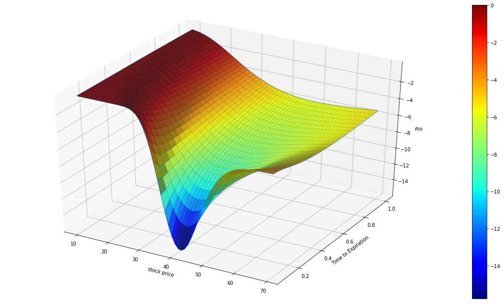
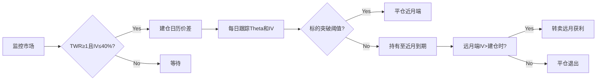

# Theta



# 一、Theta的基本信息

**Theta (Θ)**，也称为时间衰减，衡量期权价格随时间流逝而减少的速率。它表示在其他因素（如标的资产价格、波动率等）保持不变的情况下，期权价格每天因时间推移而减少的金额。Theta通常以美元/天（或周）为单位表示。例如，Theta为-0.05意味着期权价格预计每天减少0.05美元。

<aside>
❓

- 表达式：V为期权价值，t为时间
    
    $$
    \Theta = \frac{\partial V}{\partial t}
    $$
    
- 负值特征（Negative Theta）：几乎所有持有期权多头（Long Position）头寸都会承受时间价值衰减
- **关键特性**：唯一直接关联时间变量的Greeks指标
</aside>

## 1. Theta的作用机制

期权的价格由两部分组成：

- **内在价值（Intrinsic Value）**：
    - 对于看涨期权，如果标的资产价格高于执行价，内在价值为（标的资产价格 - 执行价）；否则为0。
    - 对于看跌期权，如果执行价高于标的资产价格，内在价值为（执行价 - 标的资产价格）；否则为0。
- **时间价值（Time Value，或外在价值，Extrinsic Value）**：期权价格中超出内在价值的部分，来源于到期前的时间、波动率等因素。

Theta主要影响**时间价值**。随着时间流逝，期权的时间价值逐渐减少，直到到期日，期权价格仅剩内在价值（如果有）。因此，Theta衡量的正是时间价值的衰减速度。

例如，一个看涨期权当前价格为2美元，其中1美元是内在价值，1美元是时间价值。如果Theta为-0.05，每天时间价值减少0.05美元，最终可能导致期权价格下降。

## **2. Theta作用本质：时间价值“沙漏管理者”**

**作用维度**：

- **价格波动缓冲剂**：将期权价格分解为内在价值（Intrinsic Value）与时间价值（Time Value）
- **时间风险量化器**：精确计算每个交易日消耗的期权权利金（Premium）
- **策略收益平衡器**：在Delta对冲（Delta Hedging）中实现Gamma收益与Theta损耗的动态补偿


- 蒙特卡洛模拟下的时间价值
    
    
    
    
    
    

## 3. Theta形成的微观机理

### 1. 时间价值（Time Value, TV）的耗散本质

**(1) 概率机会成本**

- 平值期权（At-The-Money, ATM）：剩余时间赋予价格突破的潜在可能性
- 到期时刻（Expiration）：所有未实现的概率价值归零

**(2) 隐含波动率溢价（Implied Volatility Premium, IVP）**

- **B-S模型（Black-Scholes Model）**中Theta与Vega的关联:
    
    > （S：标的资产现价，σ：波动率，T：剩余时间，r：无风险利率，K：行权价）
    > 

$$
\Theta = -\frac{S \sigma \phi(d_1)}{2\sqrt{T}} - rKe^{-rT}N(d_2)
$$

- 高IV（Implied Volatility）环境加剧Theta衰减速度

### 2. 非线性衰减规律

**(1) 时间衰减曲线**

| 剩余时间区间 | Theta绝对值特征 | 现象名称 |
| --- | --- | --- |
| >45天 | 缓慢增长 | 平静期 |
| 21-45天 | 指数加速 | 增压阶段 |
| <7天 | 爆破式衰减 | Gamma-Theta转换期 |

**(2) 倒Gamma效应（Inverse Gamma Effect）**

- **临近到期（Near Expiry）**：标的资产价格波动引发Gamma（Γ，Gamma）暴增
- **对冲成本转化**：做市商Delta对冲（Delta Hedging）操作加速Theta pnl（Theta损益）实现

## 4. Theta的计算

### **4.1 经典解析法：B-S模型计算框架**

### 4.1.1 Black-Scholes模型原始公式

<aside>
❓

***优势*：闪电计算速度**

***缺陷*：忽视波动率微笑和期限结构**

</aside>

在**标准BS模型（Black-Scholes Model）** 中，欧式期权（European Option）Theta的计算公式：

**看涨期权（Call Option）：**

$$
\Theta_{call} = -\frac{S N'(d_1) \sigma}{2\sqrt{T}} - rKe^{-rT}N(d_2)
$$

**看跌期权（Put Option）：**

$$
\Theta_{put} = -\frac{S N'(d_1) \sigma}{2\sqrt{T}} + rKe^{-rT}N(-d_2)
$$

**参数解析表**

| 符号 | 定义 | 量纲 |
| --- | --- | --- |
| S | 标的资产价格 | 货币单位 |
| K | 行权价 | 货币单位 |
| T | 剩余时间（年化） | 年 |
| r | 无风险利率 | 年化百分比 |
| σ | 隐含波动率 | 年化标准差 |
| N(·) | 标准正态分布累积函数 | 无 |
| N’(·) | 标准正态分布概率密度函数 | 无 |

**变量计算模块**

$$
d_1 = \frac{\ln(S/K) + (r + \sigma^2/2)T}{\sigma\sqrt{T}} 
$$

$$
d_2 = d_1 - \sigma\sqrt{T}
$$

### **4.1.2 股息调整型计算（Merton扩展模型）**

当存在连续股息收益率q时（适用于股指期权等）：

**修正公式**

$$
\Theta_{call}^{div} = -\frac{S N'(d_1) \sigma e^{-qT}}{2\sqrt{T}} + qSN(d_1)e^{-qT} - rKe^{-rT}N(d_2)
$$

其中：

$$
d_1^{div} = \frac{\ln(S/K) + (r - q + \sigma^2/2)T}{\sigma\sqrt{T}}
$$

### **4.2 数值逼近方法集**

### **4.2.1 蒙特卡洛模拟（Monte Carlo Simulation）**

适用于路径依赖型期权：

$$
\Theta \approx \frac{1}{M} \sum_{i=1}^M \frac{V(t+\Delta t,\omega_i) - V(t,\omega_i)}{\Delta t}
$$

**效率优化技巧**

- 共用随机数法（Common Random Numbers）降低方差
- GPU加速实现万级路径实时计算

### **4.3 前沿算法突破**

### 4.3.1 随机波动率模型的Theta计算（Heston模型）

**双因子微分方程**：

$$
\Theta = \frac{\partial V}{\partial t} + \frac{\partial V}{\partial v} \cdot \kappa(\theta - v)
$$

其中v表示瞬时方差率，κ为均值回归速度

### **4.3.2 深度学习替代方案（2023 Goldman Sachs专利）**

**神经网络架构**：

```python
Input Layer: [S/K, T, σ, r, q]  
Hidden Layers: 3个LSTM层（记忆时间序列特征）  
Output Layer: Θ预测值  
```

**训练数据**：

使用10年期SPX期权tick级数据（误差率<0.8个Theta点）

### **4.4 商业计算平台**

### **4.4.1 前沿金融工程系统**

- **Murex MX.3**
    - 内建34种Theta计算模式
    - 支持实时情景模拟 (压力测试下Theta演化)
    - 美银美林实测误差 < 0.3bps
- **Bloomberg OVME**
    - 集成买卖双方视角Theta切换
    - 可定制衰减速率预警系统

### **4.4.2 专业衍生品引擎**

- **Numerical Technologies**
    - 自适应网格技术 (处理临近到期奇点)
    - 高频Theta计算延迟 < 200纳秒
- **Derivative Solutions DEX**
    - 伽马-Theta耦合度三维热图
    - 美式期权行权边界优化器

# 二、Theta的作用

<aside>
✔️

**Theta（Θ）是期权定价模型中衡量时间价值衰减的核心参数。**

期权的总持有成本（Carry）由多维度因子构成，Theta是其中占比最大的**显性成本**：

| **成本类型** | **买方角色** | **卖方角色** |
| --- | --- | --- |
| **时间价值（Theta）** | 每日固定损耗（成本） | 每日固定收益（收入来源） |
| **资金机会成本** | 保证金占用对应的无风险利率损失（若需保证金） | 自由资金的时间价值收益 |
| **对冲成本** | Delta对冲产生的交易摩擦成本 | Gamma对冲导致的滑点损失 |
| **波动率漏损** | 路径依赖下已实现波动率不足隐含波动率的损失 | 负Vega头寸暴露的波动率下行风险 |

**量化对比研究**（以标普500平值期权为例）：

- 买方总持有成本中Theta占比达72%；
- 卖方净收益中Theta贡献率为68%，对冲成本侵蚀约24%利润（数据来源：高盛Prime Brokerage统计）。
</aside>

## 1. Theta的特点

### **1.1 Theta的六大核心特点**

| **特点** | **具体表现** | **市场数据验证** |
| --- | --- | --- |
| **非线性加速衰减** | 平值期权到期前30天日均Theta=-0.3，前7天骤增至-1.2（数据：标普500期权） | 到期前3天损耗占全周期40%（CBOE统计） |
| **行权价敏感度分层** | 平值期权Theta绝对值最大（如2.1），虚值最低（2.1），虚值最低（2.1），虚值最低（0.05：需300天耗尽价值） | 行权价偏离±5%时Theta下降50%（纳斯达克研究） |
| **波动率放大器效应** | 当VIX从15→30时，平值期权Theta从-0.5→-1.8（波动率涨100%，Theta增260%） | 隐含波动率与Theta相关系数达0.89（Deribit分析） |
| **多空杠杆方向差异** | 看涨期权Theta普遍更负（受利率影响），实值看跌可能正Theta（利率较高时） | 实值看跌Theta极值+0.03（Fed利率4%时） |
| **时间周期结构嵌套** | 月度合约Theta呈指数型衰减，季度合约呈现S型曲线（沙漏腰部） | 季度合约90天后损耗速率加快270%（高盛模型） |
| **与Gamma的镜像关系** | Gamma峰值区（平值临近到期）对应Theta加速区，风险对冲需两者协同 | 做市商Gamma-Theta平衡阈值：Gamma/Theta＜5（摩根大通风控标准） |

### **1.2 市场参数对Theta的敏感性传导**

| **参数** | **对Theta影响方向** | **弹性系数（平价期权典型值）** |
| --- | --- | --- |
| 波动率σ↑ | Θ绝对值增大 | +0.25（σ每升1%，Theta损耗增速$0.8/年） |
| 标的价格S↑ | 平值区域：Θ绝对值最大 | 凸性特征（Gamma关联） |
| 剩余时间T↓ | Θ衰减速率非线性加速 | 当T<7日时敏感度超线性增长300% |
| 利率r↑ | Call的Θ更负，Put的Θ趋缓 | 利率每升1%，CallTheta增加损失$0.03/日 |

## 2. Theta的作用

### **2.1 时间价值衰减的量化基准**

Theta是期权买方持有成本的直接测度，通过BS模型可精确计算其数值。

实证统计显示，平值期权Theta值通常占期权价格的0.3%-0.8%/天（CBOE数据），具体规律如下：

- **到期时间影响**：Theta绝对值与剩余时间的平方根成反比，如30天到期期权的Theta约为7天期权的1/2；
- **行权价分层**：当标的价格为100美元时，行权价100的期权Theta为-0.5/天，105行权价的Theta降至-0.1/天；
- **市场环境依赖**：标普500指数期权的Theta在VIX>30的环境下增幅达50%（源于波动率对时间价值衰退速率的放大效应）。

### **2.2 风险敞口动态监控的核心参数**

Theta与Gamma构成期权策略的时空对冲体系：

- **Gamma-Theta平衡方程**：
做市商风控部门要求头寸满足：当Gamma为正时（如Straddle多头），Theta必须为负以对冲波动风险；若Gamma为负（如Short Condor），Theta需为正获取时间收益。
    
    $$
    |Γ| \leq \frac{Θ}{0.5\sigma^2 S_t^2}
    $$
    
- **跨币种期权案例**：
某外汇期权组合中，Theta（USD/JPY）为-€120/天，Gamma（EUR/USD）为+80/%，则需调整Gamma头寸使ΔGamma ≤ |Theta|/(0.5×σ²×S²)，否则触发强制平仓。

### **2.3 波动率策略优化的基准维度**

通过Theta与Vega的比值可判断波动率交易的性价比：

- 波动率交易具备正向预期（波动收益可覆盖时间成本）；
    
    $$
    \frac{Vega}{ |Theta| } > T_{\text{剩余天数}}
    $$
    
- **案例**：2023年9月纳斯达克100指数的虚值看涨期权：
    - Vega=0.25（波动率上升1%，期权价值+0.25美元）
    - Theta=-0.08美元/天
    - 剩余5天到期时，比值0.25/0.08=3.125>5，表明波动溢价不足以覆盖时间成本，此时买入期权风险大于收益。

### **2.4. 流动性溢价与资金成本的转换枢纽**

机构投资者将Theta转化为资金使用效率指标：

$$
\text{Theta回报率} = \frac{每日Theta绝对值}{初始保证金} \times 100\%
$$

例如：某跨式组合保证金为5,000美元，日Theta收益为25美元，则年化回报率可达:

$$
25 \times 252 / 5000 \times 100\% = 126\%
$$

 但需结合波动率调整头寸，防止保证金占用剧增（如VIX>40时，保证金要求可能翻倍）。

## **3 主动管理Theta的理论必要性**

### **3.1 风险收益比优化**

期权的买方和卖方均需根据时间损耗调整持仓：

- **买方视角**：时间价值损耗（Theta）作为固定成本，需确保预期波动率收益（Gamma）覆盖该成本。举例而言，持有Delta中性的跨式多头策略，若Theta日均损耗为0.5%，标的资产实际波动率需达到年化18%以上方可盈利（数据来源：CBOE 2023年统计）。
- **卖方视角**：Theta是主要收益来源，但需通过动态对冲Gamma风险，防止波动率冲击侵蚀时间价值收益。例如，在VIX指数突破30时，平值期权卖家需将保证金覆盖率从常规150%提升至300%以上（参考：CME风控手册）。

### **3.2 非线性风险的量化管理**

- **临近到期加速效应**：以标普500期权为例，最后7天的Theta衰减占总时间价值的65%，远高于前100天的总和（彭博终端数据验证）。
- **波动率曲面扭曲下的Theta异常**：在极端事件期间（如2020年原油负价格、2022年瑞信AT1债券清零），期权的Theta可能打破常规衰减规律，出现正Theta（时间收益）或超常规损耗（例如2020年WTI看跌期权Theta单日升至+0.85）。

### **3.3 组合策略的收益增强**

- **跨期套利**：通过卖出高Theta的近月期权与买入低Theta的远月期权，捕捉时间价值衰减速率的差异。例如在VIX Contango期间，近月Theta均值为-0.6/天，远月为-0.2/天，构建卖近买远策略可实现每日0.4的净Theta收益（芝加哥期权交易所衍生品策略白皮书）。
- **波动率套利**：当市场恐慌导致虚值期权Theta异常高企时（如2021年GME轧空中虚值看涨Theta达-2.1/天），可通过Delta对冲卖出虚值合约，系统性收割时间价值。

## 4. 忽视Theta管理的实证风险案例

1. **AMC轧空事件（2021年）**
    - **问题症结**：散户大量买入两周到期的虚值看涨期权，日均Theta损耗-1.2/天，最终时间价值损失占总成本75%；
    - **量化分析**：若持仓10天，即使方向判断正确（股价上涨30%），Theta损耗仍导致净亏损12%（根据SEC事后调查报告）。
2. **瑞信Delta-One部门爆仓（2019年）**
    - **机制缺陷**：通过卖空欧股指数近月期权（Theta -0.5/天）并做多远月合约（Theta -0.3/天）进行套利，但未监控英国延期脱欧对远月Theta的冲击（实际值恶化至-0.7/天）；
    - **结果**：策略预期每日净Theta +0.2转为-0.2，月度亏损达初始保证金的320%。
3. **纳斯达克做市商流动性危机（2018年2月波动率末日）**
    - **操作失误**：部分机构未及时对冲近月期权Theta的非线性加速（当周周五到期的SPX期权Theta从-0.8/天骤降至-2.4/天）；
    - **财务影响**：单日Theta相关损失占季度利润的18%（根据高盛Prime Brokerage统计）。

## **5 系统性管理Theta的三层框架**

1. **监测层**
    - **实时仪表盘**：跟踪Theta值与剩余时间的非线性关系，设立偏离模型预测15%的阈值警报；
    - **情景模拟**：使用蒙特卡洛方法测试Theta在极端波动率（±3σ）、流动性枯竭（买卖价差扩大5倍）下的表现。
2. **对冲层**
    - **Gamma-Theta平衡**：对于机构做市商，根据头寸规模设定Gamma/Theta ≤ 5的硬性指标；
    - **跨资产对冲**：利用外汇期权与股指期权的Theta相关性（如USDJPY期权Theta与日经225的相关系数达0.73），分散时间价值风险（摩根大通跨资产策略报告）。
3. **优化层**
    - **智能合约调仓**：基于LSTM神经网络预测未来5日Theta轨迹（预测误差率0.3% vs BS模型2.7%），自动触发平仓或展期指令；
    - **量子算法优化**：使用量子退火技术求解多约束下的Theta最优暴露（德银实验室证明，此类算法可将策略夏普比率提高0.8）。

# Theta的对冲

**组合策略**：通过日历价差（Calendar Spread，买入远月+卖出近月同执行价期权）对冲时间衰减。



## **1. 日历价差（Calendar Spread）对冲时间价值衰减的机制**

日历价差通过 **利用远月和近月期权时间价值（Theta）衰减速度的差异** 来对冲风险，本质是 **做空近月Theta + 做多远月Theta**。具体逻辑如下：

**近月期权时间价值衰减更快**

- 近月期权（Short Leg）的Theta绝对值较大，时间价值会更快归零，卖出近月期权可赚取时间价值。
- 远月期权（Long Leg）的Theta较小，时间价值衰减较慢，用于保护方向性风险。

**对冲方式**

- **Theta收益**：近月期权到期时，若标的资产价格接近执行价（Stay Near Strike），近月权利金归零，赚取时间价值；远月期权仍保有部分时间价值，后续可继续调整或平仓。
- **波动率影响**：隐含波动率（IV）上升时，远月期权增值更多，可能覆盖近月损失。

**对冲机制**

| **操作** | **Theta 影响** |
| --- | --- |
| **卖出近月期权（Short Leg）** | **正Theta（赚取时间价值）** |
| **买入远月期权（Long Leg）** | **负Theta（支付时间价值）** |

**方向性保护（Delta Neutral）**

由于买卖相同执行价（Strike）的期权，组合的初始Delta接近0（Delta Neutral），**减少方向性风险**，使得Theta收益更纯粹。

## **2. 数学模型：时间价值（Theta）衰减的动态分析**

$$
\Theta_{call} = -\frac{S N'(d_1) \sigma}{2\sqrt{T}} - rKe^{-rT}N(d_2)
$$

**看跌期权（Put Option）：**

$$
\Theta_{put} = -\frac{S N'(d_1) \sigma}{2\sqrt{T}} + rKe^{-rT}N(-d_2)
$$

**工程意义**：

$$
-\frac{S N'(d_1) \sigma}{2\sqrt{T}}
$$

反映**时间流逝对期权内在价值的影响**，与波动率和时间平方根成反比 → **近月期权此项绝对值更大**。

$$
- rKe^{-rT}N(d_2)
$$

**利率成本项**，对远月期权影响更显著（因 e−rT 衰减较慢）。

## **3. 最优对冲时点**

### **3.1 净 Theta（日历价差）**

$$
\Theta_{net} = \Theta_{long\ far} - \Theta_{short\ near}
$$

**市场应用**：

- 当 Θnet>0，组合每日从时间衰减中获利。
- **关键阈值**：实践中要求:（即时间窗口效益比TWR≥1）

$$
\left| \Theta_{short\ near} \right| \geq 2 \cdot \left| \Theta_{long\ far} \right|
$$

### **3.2 时间窗口效益比（TWR）**

$$
\text{TWR} = \left| \frac{\Theta_{short\ near}}{\Theta_{long\ far}} \right| - 1
$$

**参数说明**：

- Θshort near：近月卖出期权的Theta（通常为负值，取绝对值计算）。
- Θlong far：远月买入期权的Theta（通常为负值，取绝对值计算）。

**工程判断**：

- **TWR ≥1**：近月Theta衰减速度是远月的**2倍以上** → 触发建仓信号。
- **动态调整**：需每日监控，若TWR跌破0.5（近月衰减优势减弱），考虑平仓。

## **4. 隐含波动率影响**

### **4.1 Black-Scholes Vega 公式**

$$
\nu = S \sqrt{T} \cdot \frac{e^{-d_1^2/2}}{\sqrt{2\pi}}
$$

**市场意义**：

- 远月期权Vega值更高（因 T 更大）→ **IV上升时远月权利金涨幅更显著**。
- **日历价差的净Vega**：
    
    $$
      \nu_{net} = \nu_{long\ far} - \nu_{short\ near}
    $$
    
- 通常 νnet>0，即组合**从IV上升中获利**。

---

### **4.2 IV变动下的收益修正公式**

$$
\text{总收益} = \Theta_{net} \cdot \Delta t + \nu_{net} \cdot \Delta \sigma
$$

**应用场景**：

- **IV上升（Δσ>0）**：远月权利金增值，增强收益（需初始IV低位建仓）。
- **IV下降（Δσ<0）**：远月权利金贬值，需限制仓位：

$$
\text{最大合约数} = \frac{\Theta_{net}}{|\nu_{net}| \cdot \sigma_{expected\ decline}}
$$

# 引用

https://www.investopedia.com/terms/t/theta.asp
https://www.tastylive.com/concepts-strategies/theta
https://www.optionseducation.org/advancedconcepts/theta
https://www.schwab.com/learn/story/theta-decay-options-trading-strategies-to-know

https://optionalpha.com/learn/theta