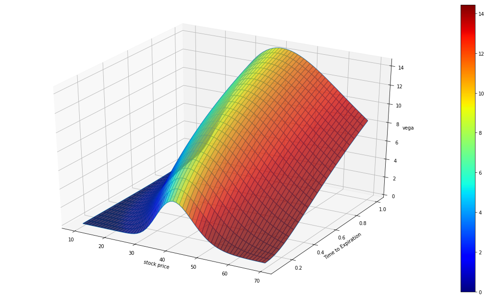

# Vega

# 一、基础定义

[波动率](../%E6%B3%A2%E5%8A%A8%E7%8E%87%201bcd848d208680259607fb32c97d92ba.md)

用于衡量期权价格对标的资产**隐含波动率**（Implied Volatility, IV）变化的敏感性。

<aside>
👉🏻

- **数学表达**：

$$
  \text{Vega} = \frac{\partial \text{期权价格}}{\partial \sigma}
$$

其中，σ（sigma）代表隐含波动率。

**含义**：Vega表示隐含波动率每上升1个百分点（如从20%升至21%），期权价格的理论变化值（以相同货币单位计）。

</aside>

## **2. 直观解释**

可以把Vega想象成**期权对市场“恐慌指数”的敏感度**：

- **隐含波动率（IV）** ≈ 市场预期未来波动的不确定性（类似于“恐慌情绪”）。
- Vega告诉我们，**如果市场变得更动荡（IV上升）**，你的期权价值会**涨多少**（买方受益）或**亏多少**（卖方受损）。

✅ **举例**：

- **假设** 某期权的Vega=0.10，当前隐含波动率=25%。
- **如果IV上升1%至26%** → 期权价格**+$0.10**（无论Call还是Put）。
- **如果IV暴跌5%至20%** → 期权价格**-$0.50**（卖方因此赚钱）。

**关键点**：

- Vega是**期权买家**的潜在盟友（IV↑ → 期权更贵）。
- Vega是**期权卖家**的隐藏敌人（IV↑ → 亏损风险增大）。

## **3. Vega的主要特性**

### **3.1 对所有期权均为正（Always Positive）**

- **看涨期权（Call）和看跌期权（Put）的Vega都是正值**。
- 这是因为**更高的波动率**（IV↑）意味着标的资产未来波动可能更大，无论涨跌都**增加期权的潜在盈利机会**，所以期权价值随之提高。

> 对比其他希腊字母：
> 
> - Delta（Call +, Put -）
> - Theta（通常为负，时间损耗）
> - **Vega（永远为正）**

### **3.2 平值期权（ATM）Vega最大**

- 平值（At-the-Money, ATM）期权的Vega通常高于**价内（ITM）或价外（OTM）期权**，因为市场对ATM期权的行权与否**最不确定**，使其对波动率变化最敏感。

### **3.3 长期期权（LEAPS）比短期期权Vega更大**

- **到期时间越长，Vega越大**。因为长期期权有更多时间受到波动率变化的影响。
- **短期期权（如周权）Vega很小**，因为IV对即将到期的合约影响有限。

### **3.4 Vega与波动率水平的关系（Non-Linearity）**

- **在高波动率环境（如IV>50%）时，Vega的边际影响可能递减**，因为市场已经预期剧烈震荡，进一步增加IV对价格的推动减弱。
- **在低波动率时（IV<15%），Vega的敏感性更强**，因为小幅IV上升就能显著影响期权价格。

## **4. 关键对比（Vega vs. 其他希腊字母）**

| **希腊字母** | **衡量对象** | **买方（Long）** | **卖方（Short）** |
| --- | --- | --- | --- |
| **Delta** | 标的价格变化 | Call +, Put - | 反向对冲 |
| **Gamma** | Delta变化速度 | 加速收益 | 加速亏损 |
| **Theta** | 时间损耗 | 每天亏损 | 每天赚钱 |
| **Vega** | 隐含波动率变化 | **喜欢** | **害怕** |