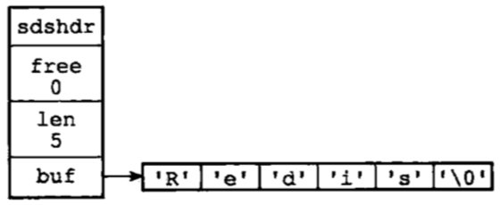

# redis数据结构与对象

## 1. 简单动态字符串

Redis 没有直接使用 C 语言传统的字符串表示（以空字符结尾的字符数组，以下简称 C 字符串）， 而是自己构建了一种名为简单动态字符串（simple dynamic string，SDS）的抽象类型， 并将 SDS 用作 Redis 的默认字符串表示。

### 1.1 简单动态字符串定义

```c
struct sdshdr {
    // 记录 buf 数组中已使用字节的数量
    // 等于 SDS 所保存字符串的长度
    int len;

    // 记录 buf 数组中未使用字节的数量
    int free;

    // 字节数组，用于保存字符串
    char buf[];

};
```

SDS实例如下：



### 1.2 SDS与C语言字符串区别

根据传统， C 语言使用长度为 N+1 的字符数组来表示长度为 N 的字符串， 并且字符数组的最后一个元素总是空字符 '\0'C语言字符串。

<u>C 语言使用的这种简单的字符串表示方式， 并不能满足 Redis 对字符串在安全性、效率、以及功能方面的要求，接下来详细对比 C 字符串和 SDS 之间的区别， 并说明 SDS 比 C 字符串更适用于 Redis 的原因</u>，如下：

<u>**常数复杂度获取字符串长**</u>

- C 字符串并不记录自身的长度信息， 所以为了获取一个 C 字符串的长度， 程序必须遍历整个字符串， 对遇到的每个字符进行计数， 直到遇到代表字符串结尾的空字符为止， 这个操作的复杂度为 O(N) 
- SDS 在 len 属性中记录了 SDS 本身的长度， 所以获取一个 SDS 长度的复杂度仅为 O(1)；

**<u>杜绝缓存溢出</u>**

- C 字符串不记录自身长度带来的另一个问题是容易造成缓冲区溢出（buffer overflow）。举个例子， *strcat(char *dest, const char *src)函数可以将 src 字符串中的内容拼接到 dest 字符串的末尾：假设dest 内存分配的空间不足以容纳 src 字符串中的所有内容，  就会产生缓冲区溢出
- 与 C 字符串不同， SDS 的空间分配策略完全杜绝了发生缓冲区溢出的可能性： 当对 SDS 进行修改时，若空间不足时， API 会自动将 SDS 的空间进行扩展， 然后才执行实际的修改操作， 所以也不会出现缓冲区溢出问题。

**<u>减少修改字符串时带来的内存重分配次数</u>**    

C 字符串的长度和底层数组的长度之间存在关联性：对于一个包含了 N 个字符的 C 字符串来说， 这个 C 字符串的底层实现总是一个 N+1 个字符长的数组（额外的一个字符空间用于保存空字符）， **所以每次增长或者缩短一个 C 字符串， 程序都总要对保存这个 C 字符串的数组进行一次内存重分配操作。**

为了避免 C 字符串的这种缺陷， **SDS 通过未使用空间解除了字符串长度和底层数组长度之间的关联： 在 SDS 中， buf 数组的长度不一定就是字符数量加一， 数组里面可以包含未使用的字节， 而这些字节的数量就由 SDS 的 free 属性记录。**

通过未使用空间， SDS 实现了空间预分配和惰性空间释放两种优化策略。

- 空间预分配用于优化 SDS 的字符串增长操作： <u>当 SDS 的 API 对一个 SDS 进行修改， 并且需要对 SDS 进行空间扩展的时候， 程序不仅会为 SDS 分配修改所必须要的空间， 还会为 SDS 分配额外的未使用空间。</u>

  其中， 额外分配的未使用空间数量由以下公式决定：

  - <u>如果对 SDS 进行修改之后， SDS 的长度（也即是 len 属性的值）小于 1 MB ， 那么程序分配和 len 属性同样大小的未使用空间， 这时 SDS len 属性的值将和 free 属性的值相同。</u> 
  - <u>如果对 SDS 进行修改之后， SDS 的长度将大于等于 1 MB ， 那么程序会分配 1 MB 的未使用空间。</u> 

- 惰性空间释放用于优化 SDS 的字符串缩短操作： 当 SDS 的 API 需要缩短 SDS 保存的字符串时， 程序并不立即使用内存重分配来回收缩短后多出来的字节， 而是使用 free 属性将这些字节的数量记录起来， 并等待将来使用。

## 2. 链表

### 2.1 链表节点定义

多个 listNode 可以通过 prev 和 next 指针组成双端链表。

```c
typedef struct listNode {

    // 前置节点
    struct listNode *prev;

    // 后置节点
    struct listNode *next;

    // 节点的值
    void *value;

} listNode;

```

链表节点实例如下：


### 2.2 Redis 的链表定义

```c
typedef struct list {

    // 表头节点
    listNode *head;

    // 表尾节点
    listNode *tail;

    // 链表所包含的节点数量
    unsigned long len;

    // 节点值复制函数
    void *(*dup)(void *ptr);

    // 节点值释放函数
    void (*free)(void *ptr);

    // 节点值对比函数
    int (*match)(void *ptr, void *key);

} list;
```

链表实例如下：


### Redis的链表特性

- 双端： 链表节点带有 prev 和 next 指针， 获取某个节点的前置节点和后置节点的复杂度都是 O(1) 。
- 无环： 表头节点的 prev 指针和表尾节点的 next 指针都指向 NULL ， 对链表的访问以 NULL 为终点。
- 带表头指针和表尾指针： 通过 list 结构的 head 指针和 tail 指针， 程序获取链表的表头节点和表尾节点的复杂度为 O(1) 。
- 带链表长度计数器： 程序使用 list 结构的 len 属性来对 list 持有的链表节点进行计数， 程序获取链表中节点数量的复杂度为 O(1) 。
- 多态： 链表节点使用 void* 指针来保存节点值， 并且可以通过 list 结构的 dup 、 free 、 match 三个属性为节点值设置类型特定函数， 所以链表可以用于保存各种不同类型的值。

##  3. 字典

Redis 的字典使用哈希表作为底层实现， 一个哈希表里面可以有多个哈希表节点， 而每个哈希表节点就保存了字典中的一个键值对。

### 3.1 哈希表定义

- table 属性是一个数组， 数组中的每个元素都是一个指向 dict.h/dictEntry 结构的指针， 每个 dictEntry 结构保存着一个键值对。
- size 属性记录了哈希表的大小， 也即是 table 数组的大小， 而 used 属性则记录了哈希表目前已有节点（键值对）的数量。
- sizemask 属性的值总是等于 size - 1 ， 这个属性和哈希值一起决定一个键应该被放到 table 数组的哪个索引上面。

```c
typedef struct dictht {

    // 哈希表数组
    dictEntry **table;

    // 哈希表大小
    unsigned long size;

    // 哈希表大小掩码，用于计算索引值
    // 总是等于 size - 1
    unsigned long sizemask;

    // 该哈希表已有节点的数量
    unsigned long used;

} dictht;

```

### 3.2哈希节点定义

- key 属性保存着键值对中的键， 而 v 属性则保存着键值对中的值， 其中键值对的值可以是一个指针， 或者是一个 uint64_t 整数， 又或者是一个 int64_t 整数。
- next 属性是指向另一个哈希表节点的指针。Redis 的哈希表使用链地址法（separate chaining）来解决键冲突： 每个哈希表节点都有一个 next 指针， 多个哈希表节点可以用 next 指针构成一个单向链表， 被分配到同一个索引上的多个节点可以用这个单向链表连接起来， 这就解决了键冲突的问题。

```c
typedef struct dictEntry {

    // 键
    void *key;

    // 值
    union {
        void *val;
        uint64_t u64;
        int64_t s64;
    } v;

    // 指向下个哈希表节点，形成链表
    struct dictEntry *next;
} dictEntry;

```

哈希表实例如下：


### 3.3字典定义

- type 属性是一个指向 dictType 结构的指针， 每个 dictType 结构保存了一簇用于操作特定类型键值对的函数， Redis 会为用途不同的字典设置不同的类型特定函数。
- 而 privdata 属性则保存了需要传给那些类型特定函数的可选参数。
- ht 属性是一个包含两个项的数组， 数组中的每个项都是一个 dictht 哈希表， 一般情况下， 字典只使用 ht[0] 哈希表， ht[1] 哈希表只会在对 ht[0] 哈希表进行 rehash 时使用。
- 除了 ht[1] 之外， 另一个和 rehash 有关的属性就是 rehashidx ： 它记录了 rehash 目前的进度， 如果目前没有在进行 rehash ， 那么它的值为 -1 。

```c
typedef struct dict {

    // 类型特定函数
    dictType *type;

    // 私有数据
    void *privdata;

    // 哈希表
    dictht ht[2];

    // rehash 索引
    // 当不在 rehash 时，值为 -1
    int rehashidx; /* rehashing not in progress if rehashidx == -1 */

} dict;

```

其中，type 属性和 privdata 属性是针对不同类型的键值对， 为创建多态字典而设置的：

```c
typedef struct dictType {

    // 计算哈希值的函数
    unsigned int (*hashFunction)(const void *key);

    // 复制键的函数
    void *(*keyDup)(void *privdata, const void *key);

    // 复制值的函数
    void *(*valDup)(void *privdata, const void *obj);

    // 对比键的函数
    int (*keyCompare)(void *privdata, const void *key1, const void *key2);

    // 销毁键的函数
    void (*keyDestructor)(void *privdata, void *key);

    // 销毁值的函数
    void (*valDestructor)(void *privdata, void *obj);

} dictType;

```

字典实例如下：


### 3.4.渐进式rehash

随着操作的不断执行， 哈希表保存的键值对会逐渐地增多或者减少， 为了让哈希表的负载因子（load factor）维持在一个合理的范围之内， 当哈希表保存的键值对数量太多或者太少时， 程序需要对哈希表的大小进行相应的扩展或者收缩。

其中，哈希表的负载因子公式如下：

```c
# 负载因子 = 哈希表已保存节点数量 / 哈希表大小 
load_factor = ht[0].used / ht[0].size
```

对字典的哈希表执行 rehash 的步骤如下：

1. 为字典的 ht[1] 哈希表分配空间， 这个哈希表的空间大小取决于要执行的操作， 以及 ht[0] 当前包含的键值对数量 （也即是 ht[0].used 属性的值）：
   1. 如果执行的是扩展操作， 那么 ht[1] 的大小为第一个大于等于 ht[0].used * 2 的 2^n （2 的 n 次方幂）；
   2. 如果执行的是收缩操作， 那么 ht[1] 的大小为第一个大于等于 ht[0].used 的 2^n 。
2. 将保存在 ht[0] 中的所有键值对 rehash 到 ht[1] 上面： rehash 指的是重新计算键的哈希值和索引值， 然后将键值对放置到 ht[1] 哈希表的指定位置上。
   1. 在字典中维持一个索引计数器变量 rehashidx ， 并将它的值设置为 0 ， 表示 rehash 工作正式开始。
   2. 在 rehash 进行期间， 每次对字典执行添加、删除、查找或者更新操作时， 程序除了执行指定的操作以外， 还会顺带将 ht[0] 哈希表在 rehashidx 索引上的所有键值对 rehash 到 ht[1] ， 当 rehashidx 索引的数据rehash 工作完成之后， 程序将 rehashidx 属性的值增一。
   3. 随着字典操作的不断执行， 最终在某个时间点上， ht[0] 的所有键值对都会被 rehash 至 ht[1] ， 这时程序将 rehashidx 属性的值设为 -1 ， 表示 rehash 操作已完成。
3. 当 ht[0] 包含的所有键值对都迁移到了 ht[1] 之后 （ht[0] 变为空表）， 释放 ht[0] ， 将 ht[1] 设置为 ht[0] ， 并在 ht[1] 新创建一个空白哈希表， 为下一次 rehash 做准备。

**<u>渐进式rehash流程图如下</u>**

<u>1.初始态字典</u>                                                                                                    


 <u>2.迁移rehash索引0的键值对</u>


<u>3.迁移rehash索引1的键值对</u>


4.rehash不断进行，直至迁移完所有索引对应的键值对数据

5.rehash之后的字典


## 4. 跳跃表

简单的来说跳跃表就是建立多级索引，提高查询效率。经典的跳跃表图示，如下：


```c
//保证下一级索引向上一级索引的晋升概率为SKIPLIST_P
private int randomLevel() {
  int level = 1;
  // 当 level < MAX_LEVEL，且随机数小于设定的晋升概率时，level + 1
  while (Math.random() < SKIPLIST_P && level < MAX_LEVEL)
    level += 1;
  return level;
}
```

### 4.1跳跃表定义

- 头指针header和尾指针tail。
- 链表长度length，即链表包含的节点总数。注意，新创建的skiplist包含一个空的头指针，这个头指针不包含在length计数中。
- level表示skiplist的总层数，即所有节点层数的最大值。

图示如下：

.png)

```c
typedef struct zskiplist {

    // 表头节点和表尾节点
    struct zskiplistNode *header, *tail;

    // 表中节点的数量
    unsigned long length;

    // 表中层数最大的节点的层数
    int level;

} zskiplist;
```

### 4.2跳跃表节点定义

- obj字段存放的是节点数据。
- score字段是数据对应的分数。
- backward字段是指向链表前一个节点的指针（前向指针）。节点只有1个前向指针，所以只有第1层链表是一个双向链表。
- level[]存放指向各层链表后一个节点的指针（后向指针）。每层对应1个后向指针，用forward字段表示。
- 每个后向指针还对应了一个span值，它表示当前的指针跨越了多少个节点。span用于计算元素排名(rank)。

**查询指定排名举例**

假设我们在这个skiplist中查找score=89.0的元素（即Bob的成绩数据）

从小到大的排名：在查找路径中，我们会跨域图中标红的指针，这些指针上面的span值累加起来，就得到了Bob的排名(2+2+1)-1=4（减1是因为rank值以0起始）。

从大到小的排名：只需要用skiplist长度减去查找路径上的span累加值，即6-(2+2+1)=1。

```c
typedef struct zskiplistNode {

    // 后退指针
    struct zskiplistNode *backward;

    // 分值
    double score;

    // 成员对象
    robj *obj;

    // 层
    struct zskiplistLevel {

        // 前进指针
        struct zskiplistNode *forward;

        // 跨度
        unsigned int span;

    } level[];

} zskiplistNode;
```

## 5. 整数集合

整数集合（intset）是 Redis 用于保存整数值的集合抽象数据结构， 它可以保存类型为 int16_t 、 int32_t 或者 int64_t 的整数值， 并且保证集合中不会出现重复元素。

### 5.1 整数集合定义

- contents 数组是整数集合的底层实现： 整数集合的每个元素都是 contents 数组的一个数组项（item）， 各个项在数组中按值的大小从小到大有序地排列， 并且数组中不包含任何重复项。
- length 属性记录了整数集合包含的元素数量， 也即是 contents 数组的长度。

content 字段虽然被定义成指向一个 int8_t 类型数据的指针，但实际上 redis 无论是读取数组元素还是新增元素进去都依赖 encoding 和 length 两个字段直接操作的内存。

**encoding取值类型**

- 如果 encoding 属性的值为 INTSET_ENC_INT16 ， 那么 contents 就是一个 int16_t 类型的数组， 数组里的每个项都是一个 int16_t 类型的整数值 （最小值为 -32,768 ，最大值为 32,767 ）。
- 如果 encoding 属性的值为 INTSET_ENC_INT32 ， 那么 contents 就是一个 int32_t 类型的数组， 数组里的每个项都是一个 int32_t 类型的整数值 （最小值为 -2,147,483,648 ，最大值为 2,147,483,647 ）。
- 如果 encoding 属性的值为 INTSET_ENC_INT64 ， 那么 contents 就是一个 int64_t 类型的数组， 数组里的每个项都是一个 int64_t 类型的整数值 （最小值为 -9,223,372,036,854,775,808 ，最大值为 9,223,372,036,854,775,807 ）。

```c
typedef struct intset {

    // 编码方式
    uint32_t encoding;

    // 集合包含的元素数量
    uint32_t length;

    // 保存元素的数组
    int8_t contents[];

} intset;
```

int16_t 类型整数集合示例，如下：


### 5.2.升级

每当我们要将一个新元素添加到整数集合里面， 并且新元素的类型比整数集合现有所有元素的类型都要长时， 整数集合需要先进行升级（upgrade）， 然后才能将新元素添加到整数集合里面。步骤如下：

- 根据新元素的类型， 扩展整数集合底层数组的空间大小， 并为新元素分配空间。
- 将底层数组现有的所有元素都转换成与新元素相同的类型， 并将类型转换后的元素放置到正确的位上， 而且在放置元素的过程中， 需要继续维持底层数组的有序性质不变。
- 将新元素添加到底层数组里面。

**升级举例**

举个例子， 假设现在有一个 INTSET_ENC_INT16 编码的整数集合， 集合中包含三个 int16_t 类型的元素。现在， 假设我们要将类型为 int32_t 的整数值 65535 添加到整数集合里面。插入流程如下

1.分配新的空间


2.调整原有元素位置


3.添加新元素


## 6. 压缩列表

### 6.1 压缩列表的定义

**压缩列表（ziplist）**本质上就是一个字节数组，是Redis为了节约内存而设计的一种线性数据结构，可以包含任意多个元素，每个元素可以是一个字节数组或一个整数。这块内存物理上是连续的，逻辑上被分为逻辑划分为多个字段，如图所示：


字段含义如下：

- **zlbytes**：压缩列表的字节长度，占4个字节，因此压缩列表最长(2^32)-1字节；
- **zltail**：压缩列表尾元素相对于压缩列表起始地址的偏移量，占4个字节；
- **zllen**：压缩列表的元素数目，占两个字节；
- **entryX**：压缩列表存储的若干个元素，可以为字节数组或者整数；entry的编码结构后面详述；
- **zlend**：压缩列表的结尾，占一个字节，恒为**0xFF**。

###  6.2压缩节点定义

每个压缩列表节点都由 previous_entry_length 、 encoding 、 content 三个部分组成， 如图所示：


- previous_entry_length：节点的 previous_entry_length 属性以字节为单位， 记录了压缩列表中前一个节点的长度。
- encoding：节点的 encoding 属性记录了节点的 content 属性所保存数据的类型以及长度。
  - 一字节、两字节或者五字节长， 值的最高位为 00 、 01 或者 10 的是字节数组编码： 这种编码表示节点的 content 属性保存着字节数组， 数组的长度由编码除去最高两位之后的其他位记录；
  - 一字节长， 值的最高位以 11 开头的是整数编码： 这种编码表示节点的 content 属性保存着整数值， 整数值的类型和长度由编码除去最高两位之后的其他位记录；
-  content ：负责保存节点的值， 节点值可以是一个字节数组或者整数， 值的类型和长度由节点的 encoding 属性决定。

## 7. 对象系统

上面介绍了 6 种底层数据结构，Redis 并没有直接使用这些数据结构来实现键值数据库，而是基于这些数据结构创建了一个对象系统。这个系统包含字符串对象、列表对象、哈希对象、集合对象和有序集合对象这五种类型的对象， 每种对象都用到了

至少一种我们前面所介绍的数据结构。

通过这五种不同类型的对象， Redis 可以在执行命令之前， 根据对象的类型来判断一个对象是否可以执行给定的命令。 使用对象的另一个好处是， 我们可以针对不同的使用场景， 为对象设置多种不同的数据结构实现， 从而优化对象在不同场景下的使用效率。

### 7.1 对象定义

- 对象的 type 属性记录了对象的类型， 这个属性的值可以是下表列出的常量的其中一个。

  

- encoding 属性记录了对象所使用的编码， 也即是说这个对象使用了什么数据结构作为对象的底层实现， 这个属性的值可以是下表的常量的其中一个。

  

- 对象的 ptr 指针指向对象的底层实现数据结构， 而这些数据结构由对象的 encoding 属性决定。

```c
typedef struct redisObject {

    // 类型
    unsigned type:4;

    // 编码
    unsigned encoding:4;

    // 指向底层实现数据结构的指针
    void *ptr;
  
  // 引用计数
    int refcount;
  
    //对象空转时长
  unsigned lru:22;

} robj;

```

### 7.2 字符串对象

字符串对象的编码可以是 int 、 raw 或者 embstr 

#### 7.2.1 int编码的字符串对象

如果一个字符串对象保存的是整数值， 并且这个整数值可以用 long 类型来表示， 那么字符串对象会将整数值保存在字符串对象结构的 ptr 属性里面（将 void* 转换成 long )，并将字符串对象的编码设置为 int 。


#### 7.2.2 raw编码字符串

如果字符串对象保存的是一个字符串值， 并且这个字符串值的长度大于 39 字节， 那么字符串对象将使用一个简单动态字符串（SDS）来保存这个字符串值， 并将对象的编码设置为 raw 。


#### 7.2.3 embstr编码字符串

如果字符串对象保存的是一个字符串值， 并且这个字符串值的长度小于等于 39 字节， 那么字符串对象将使用 embstr 编码的方式来保存这个字符串值。

图示如下：


**embstr 编码优势**

1. embstr 编码将创建字符串对象所需的内存分配次数从 raw 编码的两次降低为一次。
2. 释放 embstr 编码的字符串对象只需要调用一次内存释放函数， 而释放 raw 编码的字符串对象需要调用两次内存释放函数。
3. 因为 embstr 编码的字符串对象的所有数据都保存在一块连续的内存里面， 所以这种编码的字符串对象比起 raw 编码的字符串对象能够更好地利用缓存带来的优势。

### 7.3列表对象

列表对象的编码可以是 ziplist 或者 linkedlist 。

当列表对象可以同时满足以下两个条件时， 列表对象使用 ziplist 编码：

1. 列表对象保存的所有字符串元素的长度都小于 64 字节；
2. 列表对象保存的元素数量小于 512 个；

不能满足这两个条件的列表对象需要使用 linkedlist 编码。

#### 7.3.1 ziplist编码的列表对象

.png)

#### 7.3.2 linkedlist编码的列表对象


### 7.4 哈希对象

哈希对象的编码可以是 ziplist 或者 hashtable 。

当哈希对象可以同时满足以下两个条件时， 哈希对象使用 ziplist 编码：

- 哈希对象保存的所有键值对的键和值的字符串长度都小于 64 字节；
- 哈希对象保存的键值对数量小于 512 个；

不能满足这两个条件的哈希对象需要使用 hashtable 编码。

#### 7.4.1ziplist 编码的哈希对象

ziplist 编码的哈希对象使用压缩列表作为底层实现， 每当有新的键值对要加入到哈希对象时， 程序会先将保存了键的压缩列表节点推入到压缩列表表尾， 然后再将保存了值的压缩列表节点推入到压缩列表表尾，

.png)

#### 7.4.2 hashtable 编码的哈希对象

hashtable 编码的哈希对象使用字典作为底层实现， 哈希对象中的每个键值对都使用一个字典键值对来保存：

.png)

### 7.5 集合对象

集合对象的编码可以使用 intset 或者 hashtable。

当集合对象可以同时满足以下两个条件时，对象使用 intset 编码:

- 集合对象保存的所有元素都是整数值。
- 集合对象保存的元素数量不超过512个。

否则使用 dict 进行编码。

#### 7.5.1 intset编码的集合对象

intset 编码的集合对象使用整数集合作为底层实现， 集合对象包含的所有元素都被保存在整数集合里面。


#### 7.5.2 hashtable的集合对象

hashtable 编码的集合对象使用字典作为底层实现， 字典的每个键都是一个字符串对象， 每个字符串对象包含了一个集合元素， 而字典的值则全部被设置为 NULL 。


### 7.6 有序集合对象

有序集合的编码可以是 ziplist 或者 skiplist 。

当有序集合对象可以同时满足以下两个条件时，对象使用 ziplist 编码：

- 有序集合保存的元素数量少于128个；

- 有序集合保存的所有元素的长度都小于64字节。

否则使用 skiplist 编码。

#### 7.6.1 ziplist 编码的有序集合对象

ziplist 编码的有序集合对象使用压缩列表作为底层实现， 每个集合元素使用两个紧挨在一起的压缩列表节点来保存， 第一个节点保存元素的成员（member）， 而第二个元素则保存元素的分值（score）。

.png)

#### 7.6.2 skiplist编码的有序集合对象

skiplist 编码的有序集合对象使用 zset 结构作为底层实现， 一个 zset 结构同时包含一个字典和一个跳跃表。

- zset 结构中的 zsl 跳跃表按分值从小到大保存了所有集合元素， 每个跳跃表节点都保存了一个集合元素： 跳跃表节点的 object 属性保存了元素的成员， 而跳跃表节点的 score 属性则保存了元素的分值。 通过这个跳跃表， 程序可以对有序集合进行范围型操作， 比如 ZRANK 、 ZRANGE 等命令就是基于跳跃表 API 来实现的。
-  zset 结构中的 dict 字典为有序集合创建了一个从成员到分值的映射， 字典中的每个键值对都保存了一个集合元素： 字典的键保存了元素的成员， 而字典的值则保存了元素的分值。 通过这个字典， 程序可以用 O(1) 复杂度查找给定成员的分值， ZSCORE 命令就是根据这一特性实现的。

```c
typedef struct zset {

    zskiplist *zsl;

    dict *dict;

} zset;

```

图示如下：


### 7.7 内存回收与对象共享

因为 C 语言并不具备自动的内存回收功能， 所以 Redis 在自己的对象系统中构建了一个引用计数（[reference counting](http://en.wikipedia.org/wiki/Reference_counting)）技术实现的内存回收机制， 通过这一机制， 程序可以通过跟踪对象的引用计数信息， 自动释放对象并进行内存回收。

每个对象的引用计数信息由 redisObject 结构的 refcount 属性记录。

- 当对象被一个新程序使用时， refcount会被增一；

- 当对象不再被一个程序使用时，refcount会被减一；

- 当对象的refcount变为 0 时， 对象所占用的内存会被释放。

  定义如下：

  ```c
  typedef struct redisObject {  
    
  // 指向底层实现数据结构的指针  
  void *ptr;  
    
  // 引用计数
  int refCount
  // ...  
  
  } robj; 
      
  ```

  **因为redis对象之间没有深层次的嵌套，因此也就不存在循环引用的隐患。**

  纵观redis的对象，发现他们用不同的数据结构来实现，所以顶多有一个指向底层的实现数据结构的指针，既然redis对象里面不可以再定义一个别的引用，那么久不会出现循环引用的问题了。

  > 具体可以参见文章：[如何解决引用计数的循环引用问题][https://blog.csdn.net/weixin_43958091/article/details/105163643]

除了用于实现引用计数内存回收机制之外，对象的引用计数还带有**对象共享的作用**。Redis对整数 0-9999(共1W个整数)做了缓存。

## 7.8对象的空转时长

lru ：该属性记录了对象最后一次被命令程序访问的时间。

```c
typedef struct redisObject {

    // ...

    unsigned lru:22;

    // ...

} robj;

```

键的空转时长还有另外一项作用： 如果服务器打开了 maxmemory 选项， 并且服务器用于回收内存的算法为 volatile-lru 或者 allkeys-lru ， 那么当服务器占用的内存数超过了 maxmemory 选项所设置的上限值时， 空转时长较高的那部分键会优先被服务器释放， 从而回收内存。