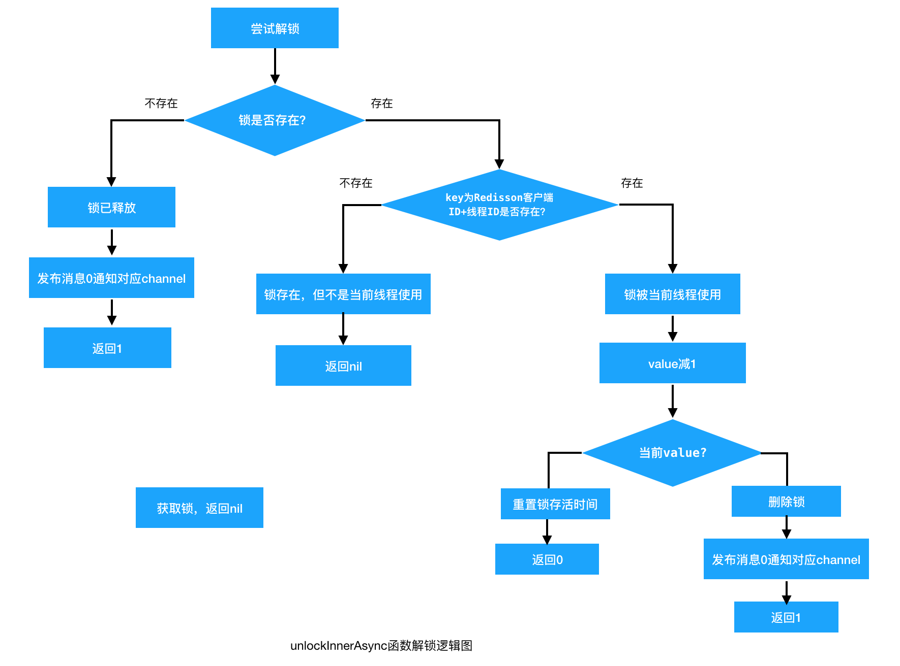
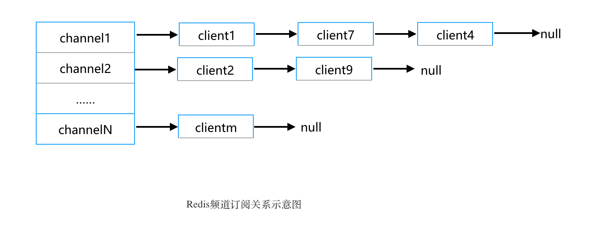

# Redis典型应用

Redis因其高性能、丰富的数据结构等特性在互联网中有着广泛应用：应用最多的领域是缓存，同时也是分布式锁常用的实现方式，除此之外Redis还可以应用于实现消息队列、排行榜、网站统计等，总结如下图：


本文对其中几个典型应用的原理和实现方式进行详细介绍。

## 1. 分布式缓存

**缓存是Redis最常见的应用场景，主要是基于其高效的读写性能，且Redis内部支持事务，在使用时能够有效保证数据的一致性，同时持久化和主备机制保证了数据的高可用性。**

Redis用作缓存性能高、读写速度快，Redis高效的原因总结如下：

- <u>Redis是基于内存数据库，绝大部分请求都是纯粹的内存操作，因此非常快速；</u>

- <u>Redis多样的数据结构，每种数据结构处理适合的数据应用</u>，相对于数据库只有Table，MongoDB只有JSON一种结构处理速度自然比较好；

- <u>Redis使用的是非阻塞IO，IO多路复用：将数据库的开、关、读、写都转换成了事件，</u>利用 select、poll、epoll 具备监听事件流的能力；

- <u>Redis采用单线程处理命令，避免了不必要的上下文切换和竞争条件，也不存在多进程切换导致的CPU消耗。</u>

  > 这里稍作解释：<u>多线程的本质是CPU模拟出多个线程来，模拟的代价就是CPU要进行上下文切换；</u>举例，假设CPU主频为2.5GHZ，即每秒可以执行2.5*10^9个指令，每个指令执行时间也仅0.4ns，而一次上下文切换时间却大概需要2000ns；在涉及下层存储等慢速情况下，如磁盘I/O交互时，线程等待磁盘数据读取或写入，空闲的CPU就可以再服务于其它线程，这种情况下多线程效率才会高于单线程。但是**Redis是纯粹内存操作的，引入多线程带来的上下文切换时间要远大于串行执行指令的时间，所以Redis采用单线程可以带来更高的效率。**

Redis相比其他缓存，另一个非常大的优势，就是支持多种数据类型。

## 2. Redis分布式锁

互联网信息技术不断发展，传统集中式系统已逐渐无法满足要求，分布式系统被利用在越来越多的场景中。分布式系统会面临共享资源、同步访问等问题，传统的锁或者synchronized代码块只能解决单机同步访问问题。但对于如电商平台秒杀库存扣减、共同组队玩一个游戏等，多系统共同访问会伴随脏数据的产生，这个时候就需要分布式锁来解决。

分布式锁：为分布式应用多个节点对共享资源的排他式访问而设定的锁就是分布式锁，其实就是保证共享资源某一时刻只能被某台机器JVM进程下某个线程访问。

<u>分布式锁可以基于很多种方式实现，数据库锁、ZooKeeper、Redis...不管哪种方式，基本原理是不变的：**用一个状态值表示锁，对锁的占用和释放通过状态值来标识。**</u>

### 2.1 Redis实现分布式锁的原理

Redis做分布式锁实现起来比较简单，实现方式：

1. <u>获取锁的时候，使用SETNX加锁，同时设置一个超时时间（SET命令加NX选项，加上超时时间），超过该时间则自动释放锁，锁的value值可以设置为客户端的标识，释放锁的时候进行判断；</u>
2. <u>释放锁的时候，通过客户端标识判断是不是该锁，若是该锁，则执行DEL进行锁释放。</u>

#### 2.1.1 加锁

加锁原理，利用SET命令：

```shell
SET KEY VALUE [NX|XX] [EX seconds] [PX milliseconds] 
```

<u>由于**SET**命令加上选项已经可以完全取代SETNX, SETEX, PSETEX的功能，所以在将来的版本中，redis可能会不推荐使用并且最终抛弃这几个命令。</u>

如果key不存在就设置key，同时设置NX和EX（或PX）属性以及过期时间。方法参数解释：

> 1. 第一个为key，即锁名称，key是唯一的；
> 2. 第二个为value，传的是请求Id，通过给value赋值为requestId，就知道这把锁是哪个客户端请求加的，在解锁的时候可以利用该值判断是否为同一客户端；
> 3. 第三个为nxxx，这个参数我们填的是NX，意思是SET IF NOT EXIST，当key不存在时，进行set操作；若key已经存在，则不做任何操作，保证了只有一个客户端持有锁，即满足互斥性；
> 4. 第四个为expx，这个参数传EX或PX，意思是要给这个key加一个过期的设置，单位为秒或毫秒；
> 5. 第五个为time，与第四个参数相呼应，代表key的过期时间，设置过期时间，是为了避免死锁的发生。

**Set执行逻辑**

那么SET命令是如何执行的呢？setCommand函数是server端解析客户端的**SET**命令，不论是单纯的SET，还是有NX或PX附加属性，或是附加了过期时间参数，都是一条命令发到server端，而后server端在setCommand方法里，对传进来的参数进行遍历，判断是不是要set if not existed，是不是设置了过期时间，单位是秒还是毫秒等等。最后再去调用setGenericCommand方法，往内存设置值。Redis server虽然也是分步去设置key值和过期时间，但Redis是单线程处理命令的，Redis执行这段函数的过程中，不可能有精力去执行其他函数，所以，就算是分成多个个动作去执行，也不影响命令的原子性。


再来看setGenericCommand函数的处理流程：

|                                                              |                                                              |
| ------------------------------------------------------------ | ------------------------------------------------------------ |
|  |  |

执行上面的SET方法会有两种结果：

1. 当前没有锁（key不存在），那么就执行加锁操作，并对锁设置有效期；
2. 已经有锁存在，不做任何操作。

这里要注意一定不要把设置key和过期时间分成SETNX和EXPIRE两个命令执行，由于这是两条Redis命令，不具有原子性，如果在 NX 之后程序突然崩溃，导致锁没有设置过期时间，那么将会发生死锁。

#### 2.1.2 解锁

##### 解锁的“错误姿势”

"DEL key"命令

> DEL key [key ...]

加锁是SET key，那么解锁用"DEL key"命令，将表示锁的key删除。但考虑到实际情况，通常不能简单的删除key，否则会导致任何客户端都可以解锁，即使这把锁不是它的。

举例，若设置锁的超时时间不合理，客户端A锁过期时间为2s，锁过期之后客户端B获得了该锁，A执行完成任务用del命令解锁的话删除的就是客户端B的锁，如下图所示：


 那么是否可以利用代码判断客户端标识呢？利用if语句进行判断，只有当锁的客户端标识与解锁命令发起的客户端相同，才能进行解锁，如下代码所示：

if判断客户端标识解锁

```java
   public void unlock(String key, String requestId) {
        if (requestId.equals(jedis.getResource().get(key))) {
            jedis.getResource().del(key);
        }
    }
```

上面代码的实现解锁也是错误的，如果客户端A持有锁，并现在执行解锁操作，if判断标识相等；但此时A的锁过期了，且客户端B与此同时获得了锁，A再执行del的操作，实际上是删除了客户端B的锁，示意图如下：


##### “正确姿势”--利用lua命令解锁

Redis 2.6之后支持的功能，可以将一段Lua脚本发送到Redis服务器运行。Redis本身可提供丰富的指令集之外，同时还支持自定义扩充指令，即用户可以向服务器发送 Lua 脚本来执行自定义动作。Redis 服务器单线程原子性地执行 Lua 脚本，保证 Lua 脚本在处理的过程中不会被其它任意请求打断。

Redis使用lua脚本的好处：

- 减少网络开销，可以将多个请求通过脚本的形式一次发送，减少网络时延；
- 原子操作，Redis会将整个脚本作为一个整体执行，中间不会被其他命令插入，因此在编写脚本的过程中无需担心会出现竞态条件，无需使用事务；
- 复用，客户端发送的脚本可以存在Redis服务器上，其他客户端可以复用这一脚本而不需要使用代码完成相同的逻辑。

下面就是用来解锁的Lua脚本：

上述参数中，KEYS[1]赋值为锁名称lockKey，get命令获取lockKey对应的value值（即该锁对应的客户端标识），ARGV[1]赋值为解锁请求的客户端标识，若二者相等才执行del命令解锁。在eval命令执行Lua代码的时候，Lua代码将被当成一个命令去执行，并且直到eval命令执行完成，Redis才会执行其他命令，实现原子性解锁。举例，当前有个库存锁“stockLock”，客户端A已持有，加锁时设置的value值为客户端A的标识"client-a"；那么解锁的时间就会判断“stockLock”的value值是否为"client-a"，确认标识之后才能del命令删除key值，解锁成功。

### 2.2 Redisson分布式锁

Redis分布式锁性能高效、利用集群可避免单点故障；Redis命令支持友好、实现方便。上面加解锁已经可以满足一般场景下分布式锁的需求，但仍有些方面可以进一步优化：

- 锁的失效时间（过期时间）设置，在高并发下分布式锁实现中，key的过期时间肯定不能设置的太长，否则会影响后续线程持有该锁；但如果设置过期时间很短，直到key过期，持有该锁的线程还未执行完任务；
- 获取锁是非阻塞的，无论成功还是失败就直接返回，需要加额外的逻辑实现阻塞锁；
- 若需要锁具备可重入性，也需要额外的逻辑实现；

Redisson是Redis官网推荐的java语言实现分布式锁的项目，是一个在Redis的基础上实现的Java驻内存数据网格（In-Memory Data Grid）。对于上面提出的问题，Redisson都提供了相应的优化方案。项目中可以直接引入Redisson，使用其已经实现的各种分布式锁。当然也可以借鉴其实现思路，在自己代码中用Redis实现多种类的分布式锁。

针对上面Redis实现过程中需要注意的问题，Redisson通过以下方式来优化解决：

- 失效时间：如果某个线程在失效时间内，还未执行完成，守护线程自动设置一个新失效时间，直到该线程执行完成或释放；
- 阻塞锁： 通过订阅消息和while循环去实现阻塞锁代码；
- Redisson锁本身自带可重入性质，相同线程可以对同一把锁递归调用。

**1.加锁** 

以无参的trylock()函数来进行举例说明：


其中，获取锁调用的是tryLockInnerAsync函数，源码如下：


上面tryLockInnerAsync函数中用到的Redis命令有：

**HSET命令**

> **HSET dict key value**

与SET命令不同的是操作的数据类型不同，SET操作的是字符串，而HSET操作的是哈希（字典）类型。将哈希表 dict 中的key对应值设为value ；如果哈希表dict不存在，一个新的哈希表被创建。

**HINCRBY命令**

> **HINCRBY dict key increment**

为哈希表dict中key对应的值加上增量increment 。

举例来说明，我们新建一个Redisson的锁用来锁商品库存，RLock lock0 = redisson.getLock("stockLock");  lock0对应的锁名称getName()即为“stockLock”，Redisson对应分布锁内存结构如下：


Redisson锁有可重入机制，即同一个线程在外层方法获取锁的时候再进入该线程的内层方法自动获取锁，无需再次申请，但需要记录重入次数。

那么如何判断是同一个线程呢？Redisson中是用Redisson客户端ID+线程ID，getLockName(long threadId)方法获取。其中Redisson客户端ID在创建该Redisson实例时就唯一标识了；在分布式环境中，不同节点的线程ID可能会相同，但是用Redisson客户端ID+线程ID就不会出现重复。

函数主体是一段lua脚本来尝试获取锁。上面tryLockInnerAsync函数lua脚本中参数KEY[1]即getName方法获取的锁名称，对应举例中的“stockLock”。两个变量，ARGV[1]leaseTime，锁失效时间；ARGV[2]即为Redisson客户端ID+线程ID。执行lua脚本tryLockInnerAsync获取锁的逻辑图如下：


如果通过 exists 命令发现当前 key 不存在，即锁没被占用，则执行 hset 写入 Hash 类型数据 **key：**全局锁名称；**field:** Redisson客户端ID+线程ID,；**value:**锁重入次数。并执行 pexpire 对该 key 设置失效时间，返回空值 nil，至此获取锁成功；如果通过 hexists 命令发现 Redis 中已经存在当前 key 和 field 的 Hash 数据，说明当前线程之前已经获取到锁，这里的锁是**可重入**的，执行 hincrby 对当前 key field 的值**加一**，并重新设置失效时间，返回空值，至此重入获取锁成功；最后是锁已被占用的情况，即当前 key 已经存在，但是 Hash 中的 field 与当前值不同，则执行 pttl 获取锁的剩余ttl并返回，至此获取锁失败。

延时任务函数scheduleExpirationRenewal，源码如下：


添加一个netty的Timeout回调任务，注册延时任务，在1/3 失效时间时触发，将锁的失效时间进行重置。

**2.解锁**


最终调用的是unlockInnerAsync函数进行解锁，源码如下：


函数主体也是一段lua脚本来释放锁。

两个key，key[1]全局锁名称，key[2]是getChannelName获取的指定的信息频道channel；

变量有三个，ARGV[1]是发布在频道channel的解锁消息，值为0；ARGV[2] 锁失效时间；ARGV[3]是Redisson客户端ID+线程ID。



通过 exists 命令发现该锁不存在，即已被释放，发布信息解锁消息通知到指定的频道channel，同时返回1；如果锁存在，则判断锁是否被当前线程使用，如果不是直接返回nil；如果锁被当前线程使用，则将field域对应的value值减1；减1后的value值和0进行比较，如果大于0，重置失效时间，返回0；否则则认为该锁已被当前线程释放，删除锁，发布解锁消息，返回1；如果上面条件都没有命中返回nil。

分析完Redisson加锁解锁的过程，再回到上面Redis实现分布式锁需要注意的问题，Redisson解决方式总结如下：

- **锁过期时间设置**

  Redisson设置监控程序，在scheduleExpirationRenewal函数中，使用Netty的Timeout回调任务，每隔1/3失效时间（internalLockLeaseTime ）毫秒执行一次，检查线程是否执行完毕，并重置超时时间。

-  **可重入**

  通上述加锁、解锁过程中的源码分析，Redisson的可重入是通过哈希表类型维护的，Redisson客户端ID+线程ID是分布式锁的唯一标识，value值是对应的重入次数。

- **阻塞锁**

  非阻塞获取锁，如果获取不到锁就马上返回；阻塞锁是指当线程尝试获取锁失败时，在设置的超时时间内进行等待阻塞。上面无参的trylock即是非阻塞锁，阻塞锁可以通过Redisson中带参数的trylock来实现，源码如下：

   

  在上面阻塞锁代码需要等待的场景主要有两个个地方，首先是在订阅时，等待订阅命令必须在指定的时间内完成；

  其次是在while循环里，getEntry(threadId).getLatch()是获取RedissonLockEntry对象的信号量Semaphore属性，后面的tryAcquire是在指定时间内获取信号量消息，即通过信号量进行阻塞等待。

  RedissonFairLock是基于Redis的分布式可重入公平锁，它保证了当多个Redisson客户端线程同时请求加锁时，优先分配给先发出请求的线程。此外基于Redisson实现的还有RedissonMultiLock、RedissonRedLock、RReadWriteLock等等，限于篇幅本文就不在此一一介绍，有兴趣的同学可以阅读相关源码学习。                          

### 2.3 集群环境 Redis分布式锁RedLock

上面的分布式锁在只有一个Redis实例的情况下安全性足以保证，但在集群环境中，却不能做到足够安全。


如图所示，若client1申请分布式锁成功，主节点故障挂掉，但是锁信息还未及时同步到从节点；此时Slave通过选举竞争成为新的主节点，若client2此时申请同一把分布锁，由于New Master内部没有该锁，于是client2申请锁成功，同一把锁被两个客户端拥有，违反了分布锁的互斥性，带来了不安全性。

上述情况只有在客户端申请锁成功瞬间，主机宕掉且未及时同步锁信息到从节点才会发生，发生概率很低且持续时间短，多数业务系统都可以容忍。

不过，Redis作者Antirez不甘于此，提出了RedLock算法来解决集群环境下Redis分布锁安全性问题，[Distributed locks with Redis](https://redis.io/topics/distlock) 官网对算法过程有详细介绍，本文简单描述一下：


RedLock算法的核心是“大多数机制”，需要提供多个Redis主节点，并且这些Redis节点相互独立；加锁时半数以上节点加锁成功才会认为申请锁成功。

如图我们假设N=5，另外图中的从节点只是示意，实际情况中一个Master可能对应不止一个Slave节点。

1. 以毫秒为单位获取当前时间startTime；
2.  按顺序依次向上面5个主Redis节点发送获取锁命令，客户端在等待每个Redis响应时都会有超时时间，当然设置的这个超时时间要相较于锁的过期时间小很多。例如，锁的过期时间LeaseTime为10s，那么客户端等待的超时时间可以设置为5～50ms之间，这样防止在某个故障的master节点上长时间阻塞，如果当前Redis实例未能在超时时间范围内获取到锁，就认为当前节点获取锁失败，立即与下一个节点交互；
3.  RedLock利用“大多数机制”，需要获取至少超过半数主节点Redis实例的锁，N=5的时，至少需要获取3个实例的锁；记录下获取到3个锁时的时间endTime，endTime - startTime < LeaseTime，即获取到锁的时间小于锁的过期时间，则认为获取锁成功；
4. 若获取不到超过半数节点的锁，或者获取到锁的时间大于锁的过期时间，则都认为获取该分布锁失败；
5. 如果获取锁失败，则需要向所有的Master节点发送Lua脚本解锁命令。

RedLock算法比较复杂，不过已经有很多开源库对其进行了封装，用户可以比较方便的使用，如[Redlock-rb](https://github.com/antirez/redlock-rb)、[Redlock-py](https://github.com/SPSCommerce/redlock-py)、以及2.2节提到的Redisson。

如果对效率和性能要求较高，可用性没有那么严苛，那么使用Redis单机分布式锁加上 Master Slave；使用RedLock需要更多的Redis实例，需要考虑出错重试、时钟漂移等实现细节，且运维等也需要成本；Redlock 并不是设计用来保持强一致性的，对于强一致性需求可以选择更合适的框架，例如 Zookeeper。

## 3.Redis队列

### 3.1 消息队列简介


队列是单个服务实例内部使用，如一个jvm实例内部可以使用Deque、LinkedList、PriorityQueue、ArrayBlockingQueue、LinkedBlockingQueue等等。消息队列一般适用于分布式系统的消息存储和传递，目前使用较多的消息队列有ActiveMQ，RabbitMQ，ZeroMQ，Kafka，MetaMQ，RocketMQ等，它们有不同的技术实现，适用于各种场景的消息任务分发，但本质都是为生产者和消费者消息传递建立桥梁。

在业务的实现过程中，即使没有大量流量，解耦和异步化几乎也是处处需要，此时MQ就显得尤为重要。但与此同时MQ也是一个较重的组件，例如使用RabbitMQ就必须为它搭建一个服务器，如果要考虑可用性，就要为服务端建立一个集群，且发送消息的过程也较复杂。所幸的是，Redis提供的list数据结构非常适合做消息队列，如果中小型业务中已经使用Redis缓存，就可以直接使用Redis实现轻量级消息队列。

使用Redis实现消息队列有以下优势：

-  Redis已经广泛运用于各大系统中，无需再次引入其他第三方框架；
-  Redis是基于内存存储的，生产者和消费者的存取速度都非常快；
-  Redis消息队列，发送和接收消息的实现都很简单。

### 3.2 Redis实现轻量级消息队列

#### 3.2.1 Redis的PUSH/POP机制

列表类型(List)用于存储一个有序的字符串列表，常用的操作是向队列两端添加元素或者获得列表的某一片段。列表内部使用的是双向链表（double linked list）实现的，所以向列表两端添加元素的时间复杂度是O(1),获取越接近列表两端的元素的速度越快。Redis队列添加或获取元素都是十分高效的。

**生产消息LPUSH命令**

> LPUSH key value [value ...]

LPUSH的作用是将一个或多个值 value 插入到列表 key 的表头。如将Tony添加到朋友列表：redis> LPUSH friends Tony。RPUSH与LPUSH作用是一样的，区别是操作列表key 的表尾。

**消费消息RPOP命令**

> RPOP key  [key ...] 

RPOP 移除并返回列表 key 的尾元素；LPOP移除并返回列表 key 的头元素。

综上，可以使用LPUSH/RPUSH操作入队列，使用LPOP/RPOP命令出队列。


**阻塞读取消息BRPOP命令**

> BRPOP key  [key ...] timeout

BRPOP是列表的阻塞式(blocking)弹出, 当给定列表内没有任何元素可供弹出的时候，连接将被BRPOP命令阻塞，直到等待超时或发现可弹出元素为止，示例：redis>BRPOP mylist 1000

使用RPOP命令读取消息时，客户端需要不停地调用RPOP命令查看是否又消息，如果队列为空，会陷入到死循环，会造成资源的空耗；使用BRPOP命令，在消息队列为空时阻塞休眠，当有消息时又被唤醒开始进行消息的读取。

#### 3.2.2 Redis的RPOPLPUSH

消费者用RPOP或BRPOP命令取出队列中的元素，若消费者程序在取出元素之后崩溃了，此时消息已被取出且没有正确处理，会造成该消息的丢失，因此会带来业务数据的丢失或状态不一致。

可以通过Redis的**RPOPLPUSH**命令提供队列的备份机制：消费者程序在从主消息队列中取出消息之后再将其插入到备份队列中，直到消费者程序完成正常的处理逻辑后再将该消息从备份队列中删除。同时还可以提供一个守护进程，当发现备份队列中的消息过期时，可以重新将其再放回到主消息队列中，以便其它的消费者程序继续处理。**RPOPLPUSH**命令执行过程示意图如下：


 **RPOPLPSUH命令**

> RPOPLPUSH source destination

命令**RPOPLPUSH**在一个原子时间内，执行以下两个动作：

- 将列表 source 最后一个元素(尾元素)弹出，返回给客户端调用者；
- 将 source 弹出的元素插入到列表 destination ，作为 destination 列表的的头元素。

**举例：**

两个列表，source列表里包含的元素是a、b、c；destination为备份列表；执行“RPOPLPUSH source destination”命令后，source中c元素被弹出，返回给客户端；同时会将c弹入destination列表，此时destination列表元素为c。

#### 3.2.3 Redis的PubSub机制

上面的PUSH/POP机制不支持消息多播传递，Redis使用了PubSub发布订阅模式来支持多播消息的传递，下面进行介绍。

**订阅频道SUBSCRIBE命令**

> SUBSCRIBE channel [channel ...]

SUBSCRIBE用于订阅一个或多个频道的信息，即subscribe channel1，channel2...。

Redis将频道的订阅关系保存到pubsub_channels字典结构里，如下图：

  

订阅频道的源码如下：


执行SUBSCRIBE命令，如果频道channel已有其它订阅者，Redis将客户端client添加到订阅者链表尾部；如果频道首次被订阅，那么在pubsub_channels创建对应channel的键，然后将client添加到链表中，举例如下图：


**发布消息PUBLISH命令**

> PUBLISH channel msg

PUBLISH命令用于将消息msg发布到相应的频道，命令执行的源码如下：


Redis如果处于集群模式，则将消息向所有集群节点进行广播；Redis如果是非集群（即一般的主备机模式），则需要在客户端中增加REDIS_FORCE_REPL标记，以便PUBLISH命令之后能传递给从节点。

具体发现消息的函数是pubsubPublishMessage，源码如下。在发送完所有订阅的client列表之后，如果有和当前频道匹配的其它频道，那么订阅这些模糊匹配的频道的客户端也会收到通知消息。关于模糊匹配的知识本文不再过多介绍。


### 3.3 Redis消息队列的局限

1、Redis不是专业的消息队列，没有ACK机制；

2、Redis数据库容量受到物理内存的限制，不能用作海量数据的高性能读写；

3、Redis不支持消费者的负载均衡、不提供队列监控和流量控制等消息队列的高级功能，均需要自己实现；

4、Redis的PubSub发布消息不提供消息持久化，如果订阅者client不在线，该消息就会丢失；

综上，Redis消息队列仅适用于轻量级、对时延有高要求、但是对消息可靠性不做高要求的场景。

## 4. Redis排行榜

排行榜是业务应用开发中常见的一个场景，如：游戏中的玩家等级排名、分数排名；球赛竞猜积分排行榜；以及电商应用中商品销量、好评等排行。排行榜要求系统能够满足实时、高效的要求，如果每次去查数据库，显然很难满足性能要求，同时会对数据库造成较大压力。

对于排行榜需求，Redis中有一种数据结构—有序集合（sorted set）非常适合，且Redis自带的ZADD命令可以直接实现按得分排序、ZREVRANGE命令能够按照得分来获取前N名用户，ZRANK可以用来获取用户排名，所以能够利用Redis十分方便地实现排行榜的功能。

### 4.1 sorted set简介

sorted set和set类型极为相似，它们都是字符串集合、都不允许相同元素出现在同一集合里。不同的是sorted set每个元素都会关联一个double类型的分数，Redis正是通过关联的分数对集合中的成员进行排序的，尽管sorted set成员必须唯一，但是关联的分数却是可以重复的。

sorted set通过SkipList(跳跃表)和HashTable(哈希表)的双端口数据结构实现，删除、添加和更新一个元素的时间复杂度为O(log(N))，都是非常快速的操作；又由于成员的位置都是有序的，所以访问一个元素并获取其分数值时间复杂度为O(1)；当要求排序的时候，Redis无需要做任何工作了，因为已经全部排好序了。

### 4.2 Redis排序相关命令

Redis中与sorted set集合相关的命令有ZADD、ZCARD、ZCOUNT、ZINCRBY、ZRANGE、ZRANGEBYSCORE、ZRANK 、ZREM、ZREMRANGEBYRANK、ZREMRANGEBYSCORE、ZREVRANGE、ZREVRANGEBYSCORE、ZREVRANK、ZSCORE、ZUNIONSTORE、ZINTERSTORE、ZSCAN、ZRANGEBYLEX、ZLEXCOUNT、ZREMRANGEBYLEX等。鉴于篇幅限制，本文对几个最常用的排序命令进行阐述并举例，其他相关命令有兴趣同学可在Redis官网上进行阅读学习。

**ZADD 设置元素分数**

> ZADD key score member [[score member] [score member] ...]

将一个或多个 member 元素及其 score 值加入到有序集 key 当中，如果某个 member 已经是有序集的成员，那么更新这个 member 的 score 值。

举例：

添加一个游戏玩家的分数

```
127.0.0.1:6379> ZADD pageRank 89 user1
(integer) 1
127.0.0.1:6379> 
```

添加多个游戏玩家分数并更新user1

```
127.0.0.1:6379> ZADD pageRank 90 user1 88 user2 100 user3 80 user4
(integer) 3
127.0.0.1:6379> 
```

 **ZSCORE 查看元素分数**

> ZSCORE key member

返回有序集 key 中，成员 member 的 score 值。

举例：

查看游戏玩家分数

```
127.0.0.1:6379> ZSCORE pageRank user1
"90"
127.0.0.1:6379> ZSCORE pageRank user2
"88"
127.0.0.1:6379> ZSCORE pageRank user3
"100"
127.0.0.1:6379> ZSCORE pageRank user4
"80"
127.0.0.1:6379> 
```

**ZREVRANGE 按名次查看排行榜**

> ZREVRANGE key start stop [WITHSCORES]

返回有序集 key 中指定区间内的成员，其中成员的位置按 score 值递减(从大到小)来排列，具有相同 score 值的成员按字典序的逆序排列。

由于排行榜一般按照分数由高到低排序，所以我们用ZREVRANGE；如果需要按照分数由低到高排序，可以使用ZRANGE命令。除了排序方式不同外，ZRANGE与ZREVRANGE命令完全一致。

举例：

查看前3名游戏玩家分数

```
127.0.0.1:6379> ZREVRANGE pageRank 0 2 WITHSCORES
1) "user3"
2) "100"
3) "user1"
4) "90"
5) "user2"
6) "88"
127.0.0.1:6379> ZREVRANGE pageRank 0 2
1) "user3"
2) "user1"
3) "user2"
```

查看所有玩家分数排行榜

```
127.0.0.1:6379> ZREVRANGE pageRank 0 -1 WITHSCORES
1) "user3"
2) "100"
3) "user1"
4) "90"
5) "user2"
6) "88"
7) "user4"
8) "80"
127.0.0.1:6379> 
```

**ZREVRANK查看元素排名**

> ZREVRANK key member

返回有序集 key 中成员 member 的排名。其中有序集成员按 score 值递减(从大到小)排序， score 值最大的成员排名为 0 。使用命令ZRANK可以获得成员按 score 值递增(从小到大)排列的排名。

举例：

查看游戏玩家排名

```
127.0.0.1:6379> ZREVRANK pageRank user3
(integer) 0
127.0.0.1:6379> ZREVRANK pageRank user4
(integer) 3
127.0.0.1:6379>
```

 **ZINCRBY 增减元素分数**

> ZINCRBY key increment member

为有序集 key 的成员 member 的 score 值加上增量 increment 。可以通过传递一个负数值 increment ，让 score 减去相应的值，比如 ZINCRBY key -5 member ，就是让 member 的 score 值减去 5 。

举例：

增减游戏玩家分数

```
127.0.0.1:6379> ZINCRBY pageRank 16 user4
"96"
127.0.0.1:6379> ZREVRANGE pageRank 0 -1 WITHSCORES
1) "user3"
2) "100"
3) "user4"
4) "96"
5) "user1"
6) "90"
7) "user2"
8) "88"
127.0.0.1:6379> 
```

 **ZREM 移除元素**

> ZREM key member [member ...]

移除有序集 key 中的一个或多个成员，不存在的成员将被忽略。

举例：

移除某个游戏玩家

```
127.0.0.1:6379> ZREM pageRank user4
(integer) 1
127.0.0.1:6379> ZREVRANGE pageRank 0 -1 WITHSCORES
1) "user3"
2) "100"
3) "user1"
4) "90"
5) "user2"
6) "88"
127.0.0.1:6379> 
```

具体在工程中实现排行榜时还要考虑到：

- 在分数相同时，Redis按照根据集合成员自身的字典顺序来排序，但这可能不能满足实际应用需要，需要额外实现；

- 可以利用Redis的主备机制，实现负载均衡。排行榜一般读多写少，可以对 master 进行写入操作，然后对多个 slave 进行读取操作。

总结来看，Redis的有序集合是一个非常高效的数据结构，排行榜是其典型应用，用来替代数据库的实现方式可以大大提升性能。

## 5. Redis项目列表

在Web应用中“列出动态列表”、“列出回复列表”、“关注列表”、“粉丝列表”等查询非常普遍。

> SELECT * FROM foo WHERE ... ORDER BY time DESC LIMIT 10

上面SQL语句常用来显示最新条目，但随着数据的增多，访问速度会越来越慢。Redis使用的是常驻内存的缓存，速度非常快，我们可以用Redis来实现主页的项目列表展示。

列表中的条目都设定一个唯一的递增ID字段，每次发表新评论或动态时，将条目ID通过LPUSH命令添加到Redis列表里（LPUSH命令在前文消息队列中已有介绍，在此不再赘述），同时可以用Redis的LTRIM命令来限制缓存容量，如果用户检索数量超过这个阈值，再向数据库发起请求访问。

**LTRIM**

> LTRIM key start stop

对一个列表进行范围限制，不在start和stop下标指定区间范围内的元素将被删除。

**举例**：

 LTRIM comments 0 4999

Redis的评论列表comments保留最新5000条记录，超过这个数量的才需要向数据库发起查询请求。

每次我们需要获取最新评论的项目范围时，利用LRANGE命令。

**LRANGE**

> LRANGE key start stop

返回列表 key 中指定区间内的元素，区间以偏移量 start 和 stop 指定。

下面是获取最新评论的伪代码：

获取最新评论列表

```
FUNCTION get_latest_comments(start, num_items):  
    id_list = redis.lrange("latest.comments",start,start+num_items - 1)  
    IF id_list.length < num_items  
        id_list = SQL_DB("SELECT ... ORDER BY time LIMIT ...")  
    END  
    RETURN id_list  
END  
```

## 6.网站的PV/UV统计

在各种大型网站中一般都需要进行PV、UV的统计；PV（Page View）即页面浏览量或点击量，统计页面的累计访问量；UV（Unique visitor）是统计浏览某个网页的独立访客数量，可以通过用户Id+cookie的方式对独立访客进行标识。

统计当日PV是网站计数器功能，可以利用Redis的Incr命令来实现，将key值设置为当天日期；统计当日UV的话，同一个用户一天之内的多次请求只能增加一个UV值，因此需要去重，我们分别用Redis的BitMap和HyperLogLog结构来实现。

### 6.1 计数器统计PV

Redis Incr 命令将 key 中储存的数字值增一。 

> INCR key

如果 key 不存在，那么 key 的值会先被初始化为 0 ，然后再执行 INCR 操作。 

PV一般要按时间统计，如页面访问数量需要按天统计，只需将日期带入计数器 key 就可以。

按天统计访问数量

```
 # 假定操作 2019-03-26 数据
 get total_pv:2019-03-26
 # 2018-12-26 注册用户数增加一位
 incr total_pv:2019-01-26
 # 设置 48 小时过期时间 172800 = 48 * 60 * 60
 expire total_pv:2019-01-26 172800
```

限速器是特殊化的计算器，通过统计网站在最近N分钟内点击次数、数据库最近N秒内处理的读写请求数量，能够注意到流量增减情况，可以对系统进行流量限制或者升级，从而防止系统因为负荷超载而崩溃。

### 6.2 Redis BitMap统计UV

Redis的位图就是一个由二进制位组成的数组，数组的每个单元只能存储 0和1，数组的下标在Bitmap中叫做偏移量。通过将数组中的每个二进制位与用户 ID 进行一一对应， 可以使用位图去记录每个用户当日是否访问，存储的1的个数就是UV数量。

首先以当天的日期加固定的前缀作为key，建立一个Bitmap。每一位二进制的offset做为一个用户ID的标识，当今天用户访问时就将Bitmap中标识此用户的二进制（value）从0置为1。


当统计某一天用户访问数量时，直接BITCOUNT那天对应的key，Redis BitMap中常用命令如下：

**SETBIT 设置偏移量**

> SETBIT key offset value

对 key 所储存的字符串值，设置或清除指定偏移量上的位(bit)。

**GETBIT 获取偏移量**

> GETBIT key offset

对 key 所储存的字符串值，获取指定偏移量上的位(bit)。当 offset 比字符串值的长度大，或者 key 不存在时，返回 0 。

 **BITCOUNT 获取指定范围值为1的位个数**

> BITCOUNT key [start] [end]

统计指定key范围区间值为1的位个数，不设置 [start] [end]，给定的整个字符串都会被进行计数；指定额外的 start 或 end 参数，可以让计数只在特定的范围内进行。

### 6.3 HyperLogLog 统计UV

Bitmap已经相对节约内存了，但如果页面访问量非常大，例如用户规模达到1亿，那么用于统计单个页面的UV内存占用需要100000000/8/1024/1024 ≈ 12M；若分别统计多个页面，则内存占用会线性增加。如果我们只需要每天的UV大致统计数量，并不需要精确知道那些用户访问，有没有更好的解决方案呢？

Redis 在 2.8.9 版本添加了 HyperLogLog 结构。HyperLogLog 是用来做基数估计的算法，Redis中HyperLogLog用12K字节的内存占用，可以计算接近 264 个不同元素的基数（UV）。

#### 6.3.1 HyperLogLog实现原理

1. 伯努利过程 

   投掷一次硬币出现正、反两面的概率均为1/2。如果不断的投掷硬币，直到出现一次正面，在这样的一个过程中，投掷一次得到正面的概率为1/2，投掷两次才得到正面的概率为(1/2)^2。依次类推，投掷k次才得到一次正面的概率为(1/2)^k，将这种抛硬币多次直到出现正面的过程记为一次伯努利过程。对于n次伯努利过程，我们会得到n个出现正面的投掷次数值k1,k2……kn，其中最大值记为kmax，那么可以得到下面结论：

   - 进行n次伯努利过程，所有投掷次数都不大于（小于等于）kmax的概率 ：

     在一次伯努利过程中，投掷次数大于k的概率为(1/2)^k，也就是投了k次反面的概率。因此，在一次过程中投掷次数不大于k的概率为1−(1/2)^k，因此n次伯努利过程所有投掷次数都不大于k的概率为 

     P(X <= kmax)=(1−1/2kmax)n

   - 进行n次伯努利过程，至少有一次大于等于kmax的概率：

     P(X  >= kmax)=1−(1−1/2kmax−1)n

   从上述公式中可得出结论：当n远小于2kmax时，P(X≥kmax)≈0，即所有投掷次数都小于k；当n远大于2kmax时，P(X≤kmax)≈0，即所有投掷次数都大于k。因此，我们似乎就可以用2^kmax的值来粗略估计n的大小。 以上结论可以总结为：进行了n次抛硬币实验，每次分别记录下第一次抛到正面的抛掷次数k，那么可以用n次实验中最大的抛掷次数kmax 来预估实验组数量：n = 2kmax

2. 比特串的基数估计

   在UV统计里，我们需要统计一组集合中不重复元素的个数。可以利用哈希算法将集合中的数据转换成0和1构成的二进制数串，那么一个二进制串可以类比为一次抛硬币实验，1是抛到正面，0是反面。

   Redis 里使用 MurmurHash2 算法来计算集合数据的哈希值，该算法有很好的均匀性，即使输入集合数据按规律排列，哈希之后仍能保证数据随机分布，因此可以保证每bit出现0或1的概率均为1/2，Redis中采用的是MurmurHash2固定64比特版本，另外该算法的计算速度也较快。

   

   HLL算法思想的核心就在于通过保留少量的比特信息，来估计或观察消息流。二进制串中从低位开始第一个1出现的位置可以理解为抛硬币试验中第一次出现正面的抛掷次数k，那么基于上面的结论，我们可以通过多次抛硬币实验的最大抛到正面的次数来预估总共进行了多少次实验，同样可以通过第一个1出现位置的最大值kmax来预估总共有多少个不同的数字（整体基数）。

   网上很多博客或文章统计的都是末尾0的个数而非第一个1出现的位置，这样是有失准确的；关于k的值，Redis源码中（hllPatLen函数内部）也有备注，

   > *Note that the final "1" ending the sequence of zeroes must be included in the count, so if we find "001" the count is 3, and the smallest count possible is no zeroes at all, just a 1 bit
   > at the first position, that is a count of 1.*

3. 分桶平均 

   如果直接应用上面的HLL方法进行基数估计会由于偶然性带来较大的误差，因此HLL算法采用分桶平均的方法来消减偶然性的误差、提高估计的准确度。先把数据分成若干个分组（桶bucket），估计每个分组的基数，然后用所有分组基数的平均数来估计总的基数。Redis中桶的个数是16384，对于每个哈希值（64比特），14位作为桶编号用来定位数据分布的桶位置，剩余的50比特即伯努利过程，每个桶对应6bit大小，记录kmax。

   举例说明，若UV值通过Hash算法得到比特串“10110000 00000000   01101100 00000100 00101001 11000000 00000100 00011101”，后面14位确定桶编号，即bucket=1053，前面的50比特伯努利过程，该例中kmax=9，那么UV基数估计为29

   多个桶用平均数计算，HLL采用的是调和平均方法，然后再基于因子修正公式计算得出，调和平均较之于几何平均有更高的精度，具体数学公式和原理分析有兴趣的读者可以参考 [解读Cardinality Estimation算法（第四部分：HyperLogLog Counting及Adaptive Counting）](http://blog.codinglabs.org/articles/algorithms-for-cardinality-estimation-part-iv.html)

4. 空间使用

   Redis中Hyperloglog的结构如下：

   

   Redis中规定分分桶个数16384，每个桶的kmax用6bit空间来存放，6*16384/8 字节，再加上结构头等数据，加起来一共12304个字节；用12K字节的内存占用，即可计算接近 264 个不同元素的基数。这和基数越大占用内存越大的其它计算基数的方式形成鲜明对比。

   但Redis对应内存的节约还不止于此，12K字节内存是encoding=HLL_DENSE(密集)模式下的内存占用；对于基数值比较少，大多数桶的计数值kmax为0的情况，Redis采用HLL_SPARSE稀疏模式的存储，稀疏存储的空间占用远小于12K字节。对密集存储和稀疏存储方式，本文做简单介绍：

   **密集存储**的结构很简单，就是连续的16384个6比特连起来的位图。

   

   **稀疏存储**针对的就是很多的桶计数值为0的情况，因此会有大量连续0的情况出现。

   

   如果连续计数值为0的桶，Redis会存储为00xxxxxx，00是前缀标识，后面的6比特值加1（加1是因为数量全0是没有意义的）表示连续0的个数，6比特最多表示64个桶计数连续为0；为了表示更多位的连续0个数，Redis又设计了16位的01xxxxxx xxxxxxxx形式，01是前缀标识，后面14比特值加1表示连续0的个数，这样最大能表示16384个桶连续计数为0，即Hyperloglog初始化状态。

   如果计数值为非0的桶，Redis用1vvvvvxx的形式表示，第一位1是前缀标识，中间5比特是桶的计数值，最后两位（值加1）是表示这样计数值连续的个数。一个1vvvvvxx记录的非0桶的最大连续个数是4，中间5比特计数值最大只能表示到32，如果当某个桶的计数值超过32，Redis会转换为密集模式进行存储。

   只要以下条件满足其一，Redis就会从稀疏存储转换为密集存储：

   1）任意一个桶的计数值超过32；

   2）稀疏存储占用的字节数超过hll_sparse_max_bytes值，默认是3000字节（可配置调整）。

#### 6.3.2 Redis Hyperloglog命令源码解析

**添加元素 PFADD 命令**

> PFADD key element [element ...]

将任意数量的元素添加到指定的 HyperLogLog 里，名称为key。

HyperLogLog 内部可能会被更新， 若HyperLogLog 估计的基数在命令执行之后出现了变化返回 1，否则返回 0。

添加元素命令实现的Redis源码如下：


继续看添加元素的hllAdd函数实现：


根据encoding值进行判断，如果为HLL_DENSE（值为0）进入密集模式，为HLL_SPARSE（值为1）则进入稀疏模式，其他情况无效直接返回-1。

以HLL_DENSE密集模式为例：


调用hllPatLen函数计算元素经过哈希之后第一个1出现的位置，如果计数值发生变化，则进行更新并返回1，没有变化则返回0，hllPatLen函数源码如下：


上面是最新的Redis5.0的hllPatLen函数写法，hash右移和bit初始值较之前Redis版本稍作改动，增强了代码可读性，但逻辑仍一致。

**计算基数 PFCOUNT命令**

> PFCOUNT key [key ...]

当PFCOUNT命令作用于单个键时，返回储存在给定键的 HyperLogLog 的基数估计， 如果键不存在，那么返回 0；当PFCOUNT命令作用于多个键时，则需要合并所有的键（求并集），然后计算其基数，源码如下：


## 结语

Redis 这些年不断地增加新功能和优化改进，让它变得更灵活场景适应性更多的同时，也让我们在使用时需要更细致的思考。

本文只是希望能够抛砖引玉。 

## 参考文献

[Redis基础知识](https://km.sankuai.com/page/133726368)

[神奇的HyperLogLog算法](http://www.rainybowe.com/blog/2017/07/13/神奇的HyperLogLog算法/index.html)

[Sketch of the Day: HyperLogLog — Cornerstone of a Big Data Infrastructure](https://research.neustar.biz/2012/10/25/sketch-of-the-day-hyperloglog-cornerstone-of-a-big-data-infrastructure/)

[Antirez博客](http://antirez.com/latest/0)

[Redis官网](https://redis.io/)

[缓存那些事](https://tech.meituan.com/2017/03/17/cache-about.html)

《Redis设计与实现》

《Redis深度历险--核心原理和应用实践》