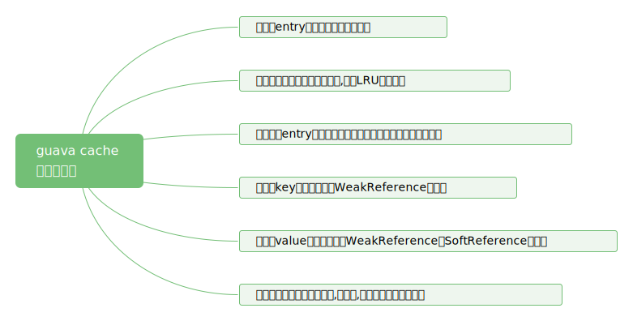
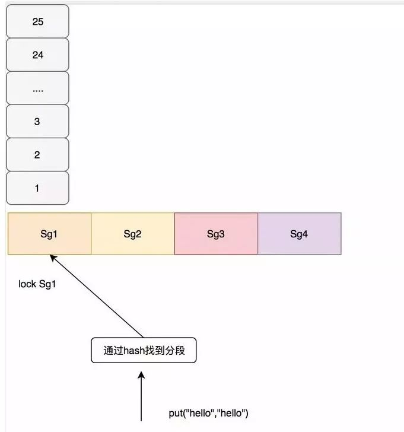
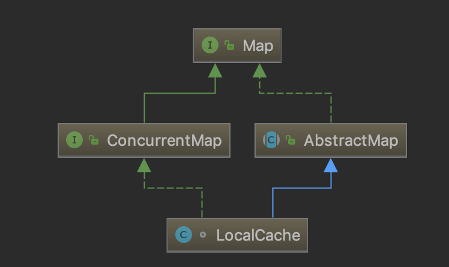
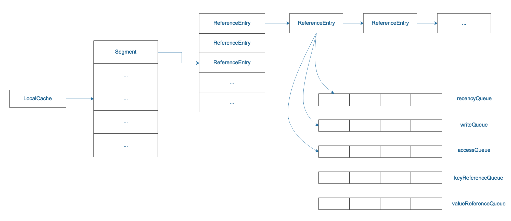
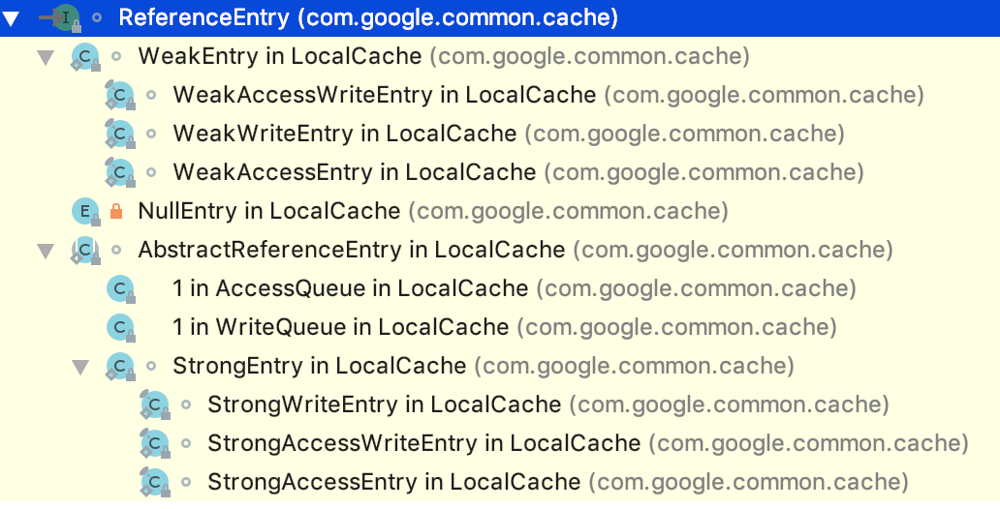
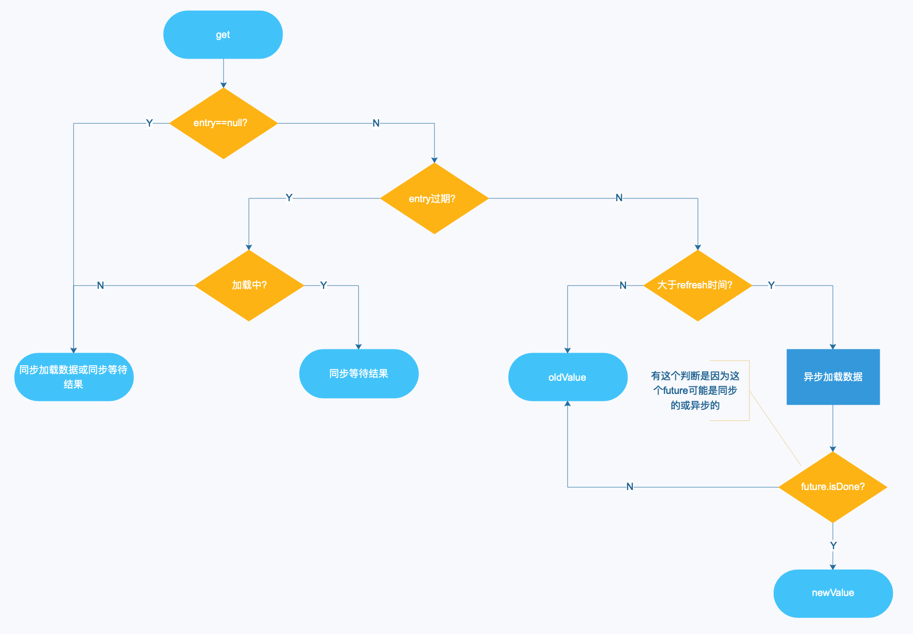

## 一、是什么

### 1.1 非官方定义

Guava Cache是一款非常优秀本地缓存，使用起来非常灵活，功能也十分强大。Guava Cache说简单点就是一个支持LRU的ConcurrentHashMap，**并提供了基于容量，时间和引用的缓存回收方式。**

当项目中需要使用local cache的时候，一般都会通过基于 ConcurrentHashMap或者LinkedHashMap来实现自己的LRU Cache。在造轮子过程中，一般都需要解决以下问题：

1. **内存是有限的，所以需要限定缓存的最大容量**
2. **过期/淘汰策略下，如何清除“太旧”的缓存entry**
3. **并发性下，如何应对并发读写**

cache的优劣基本取决于如何优雅高效地解决上面这些问题。Guava Cache是一个本地内存缓存实现，很好地解决了这些问题，它提供了线程安全的实现机制。整体上来说Guava cache 简单易用，性能不错。

### 1.2 使用场景

Guava Cache是在本地内存中缓存数据，相比较于数据库或redis存储,减少了磁盘IO和网络传输，因此会更加高效。Guava官网介绍，下面的这几种情况可以考虑使用Guava Cache：

1. 愿意消耗一些内存空间来提升速度。
2. 某些键会被多次查询。
3. 缓存中存放的数据总量不会超出内存容量。
4. 本地内存缓存,不会保存到文件或外部服务器

所以，将频繁用到的少量数据存储到Guava Cache中，以改善程序性能。下面对Guava Cache的用法进行详细的介绍。

### Guava Cache特性



## 二、使用的一些简介

### 2.1 缓存的创建和查询

Guava Cache提供了非常友好的基于Builder构建者模式的构造器，用户只需要根据需求设置好各种参数即可使用。Guava Cache提供了两种方式创建一个Cache。

#### Cache 对外暴露的接口

```java
public interface Cache<K, V> {
    V getIfPresent(@CompatibleWith("K") Object key);
    V get(K key, Callable<? extends V> loader) throws ExecutionException;
    ImmutableMap<K, V> getAllPresent(Iterable<?> keys);
    void put(K key, V value);
    void putAll(Map<? extends K, ? extends V> m);
    void invalidate(@CompatibleWith("K") Object key);
    void invalidateAll(Iterable<?> keys);
    void invalidateAll();
    long size();
    CacheStats stats();
    ConcurrentMap<K, V> asMap();
    void cleanUp();
}
```

#### CacheLoader

上面我们说到，Guava具备自动将数据加载到节点的能力。这个自动加载只针对LoadingCache适用, LoadingCache是com.google.common.cache.Cache的子类接口.

相比较于Cache，当使用get方法从LoadingCache中读取一个指定key的记录时，如果该记录不存在，则LoadingCache可以自动执行加载数据到缓存的操作。

```java
public interface LoadingCache<K, V> extends Cache<K, V>, Function<K, V> {
  V get(K key) throws ExecutionException;
  V getUnchecked(K key);
  ImmutableMap<K, V> getAll(Iterable<? extends K> keys) throws ExecutionException;

  @Deprecated
  @Override
  V apply(K key);

  void refresh(K key);
  
  @Override
  ConcurrentMap<K, V> asMap();
}
```

CacheLoader可以理解为一个固定的加载器，在创建Cache时指定，然后简单地重写V load(K key) throws Exception方法，就可以达到当检索不存在的时候，会自动的加载数据的。例子代码如下：

```java
//创建一个LoadingCache，并可以进行一些简单的缓存配置
private static LoadingCache<String, String > loadingCache = CacheBuilder.newBuilder()
            //最大容量为100（基于容量进行回收）
            .maximumSize(100)
            //配置写入后多久使缓存过期-下文会讲述
            .expireAfterWrite(150, TimeUnit.SECONDS)
            //配置写入后多久刷新缓存-下文会讲述
            .refreshAfterWrite(1, TimeUnit.SECONDS)
            //key使用弱引用-WeakReference
            .weakKeys()
            //当Entry被移除时的监听器
            .removalListener(notification -> log.info("notification={}", GsonUtil.toJson(notification)))
            //创建一个CacheLoader，重写load方法，以实现"当get时缓存不存在，则load，放到缓存，并返回"的效果
            .build(new CacheLoader<String, String>() {
                // 重点，自动写缓存数据的方法，必须要实现
                @Override
                public String load(String key) throws Exception {
                    return "value_" + key;
                }
                // 异步刷新缓存-下文会讲述
                @Override
                public ListenableFuture<String> reload(String key, String oldValue) throws Exception {
                    return super.reload(key, oldValue);
                }
            });

@Test
public void getTest() throws Exception {
    //测试例子，调用其get方法，cache会自动加载并返回
    String value = loadingCache.get("1");
    //返回value_1
    log.info("value={}", value);
}
```

##### 使用Callable

在上面的build方法中是可以不用创建CacheLoader的，不管有没有CacheLoader，都是支持Callable的。Callable在get时可以指定，效果跟CacheLoader一样，区别就是两者定义的时间点不一样，Callable更加灵活，可以理解为Callable是对CacheLoader的扩展。例子代码如下：

```java
@Test
public void callableTest() throws Exception {
    String key = "1";
    //loadingCache的定义跟上一面一样
    //get时定义一个Callable
    String value = loadingCache.get(key, new Callable<String>() {
        @Override
        public String call() throws Exception {
            return "call_" + key;
        }
    });
    log.info("call value={}", value);
}
```

#### Get方法

Cache的get方法有两个参数，第一个参数是要从Cache中获取记录的key，第二个记录是一个Callable对象。get方法的语义为:

> [!important]
> **从缓存中获取 -> 加载 -> 缓存 -> 返回**

当缓存中已经存在key对应的记录时，get方法直接返回key对应的记录。如果缓存中不包含key对应的记录，Guava会启动一个线程执行Callable对象中的call方法，call方法的返回值会作为key对应的值被存储到缓存中，并且被get方法返回。这个过程是原子的:

```java
@RequestMapping(value = "/get")
public Person get(int id) throws ExecutionException {
    Person person = cache.get(id, () -> {
        log.info("get person from db,id={}", id);
        return getFromDB(id);
    });
    return person;
}
```

在 Guava Cache 中对于写操作直接在segment上加锁，对于读操作，如果读取的数据没有过期，且已经加载就绪，不需要进行加锁，如果没有读到会再次加锁进行二次读，如果还没有,需要进行缓存加载，也就是通过配置的 CacheLoader，在业务中通常配置从数据库中查询。 如下图所示：



### 2.2 缓存的回收策略

> 一个残酷的现实是，我们几乎一定没有足够的内存缓存所有数据。你你必须决定：什么时候某个缓存项就不值得保留了？Guava Cache提供了三种基本的缓存回收方式：基于容量回收、定时回收和基于引用回收。
>
> FROM [Guava-缓存][guava-tutorial]

> 这里缓存回收和缓存过期是一个概念

由于本地缓存是将计算结果缓存到内存中，所以需要设置一个最大容量来防止出现内存溢出的情况。这个容量可以是缓存对象的数量，也可以是一个具体的内存大小。

1. **FIFO**：First In First Out，先进先出。
   一般采用队列的方式实现。这种淘汰策略仅仅是保证了缓存数量不超过所设置的阈值，而完全没有考虑缓存的命中率。**所以在这种策略极少被使用**。
2. **LRU**：Least Recently Used，最近最少使用；
   该算法其核心思想是“如果数据最近被访问过，那么将来被访问的几率也更高”。所以该算法是淘汰最后一次使用时间离当前最久的缓存数据，保留最近访问的数据。所以该种算法非常适合缓存“热点数据”。
   但是该算法在缓存周期性数据时，就会出现缓存污染，也就是淘汰了即将访问的数据，反而把不常用的数据读取到缓存中。
   为了解决这个问题，后续也出现了如LRU-K，Two queues，Multi Queue等进阶算法。
3. **LFU**：Least Frequently Used，最不经常使用。
   该算法的核心思想是“如果数据在以前被访问的次数最多，那么将来被访问的几率就会更高”。所以该算法淘汰的是历史访问次数最少的数据。
   一般情况下，LFU效率要优于LRU，且能够避免周期性或者偶发性的操作导致缓存命中率下降的问题。但LFU需要记录数据的历史访问记录，一旦数据访问模式改变，LFU需要更长时间来适用新的访问模式，即：LFU存在历史数据影响将来数据的“缓存污染”效用。后续也出现LFU*，LFU-Aging，*Window-LFU*等改进算法。

合理的使用淘汰算法能够很明显的提升缓存命中率，但是也不应该一味的追求命中率，而是应**在命中率和资源消耗中找到一个平衡**。

#### 基于容量的回收（size-based eviction）

如果要规定缓存项的数目不超过固定值，只需使用[`CacheBuilder.maximumSize(long)`](http://docs.guava-libraries.googlecode.com/git-history/release/javadoc/com/google/common/cache/CacheBuilder.html#maximumSize(long))。缓存将尝试回收最近没有使用(LFU)或总体上很少使用的缓存项。

> **警告**：在缓存项的数目达到限定值之前，缓存就可能进行回收操作。通常来说，这种情况发生在缓存项的数目逼近限定值时。

另外，不同的缓存项有不同的“权重”（weights）——例如，如果你的缓存值，占据完全不同的内存空间，你可以使用[`CacheBuilder.weigher(Weigher)`](http://docs.guava-libraries.googlecode.com/git-history/release/javadoc/com/…ommon/cache/CacheBuilder.html#weigher(com.google.common.cache.Weigher))指定一个权重函数，并且用[`CacheBuilder.maximumWeight(long)`](http://docs.guava-libraries.googlecode.com/git-history/release/javadoc/com/google/common/cache/CacheBuilder.html#maximumWeight(long))指定最大总重。在权重限定场景中，除了要注意回收也是在重量逼近限定值时就进行了，还要知道重量是在缓存创建时计算的，因此要考虑重量计算的复杂度。

> 一般来说，在创建缓存时，就指定了基于数据容量和权重容量了。

```java
LoadingCache<Key, Graph> graphs = CacheBuilder.newBuilder()
        .maximumWeight(100000)
        .weigher(new Weigher<Key, Graph>() {
            public int weigh(Key k, Graph g) {
                return g.vertices().size();
            }
        })
        .build(
            new CacheLoader<Key, Graph>() {
                public Graph load(Key key) { // no checked exception
                    return createExpensiveGraph(key);
                }
            });
```

#### 定时回收（Timed Eviction）

`CacheBuilder`提供两种定时回收的方法：

##### ExpireAfterWrite

缓存项在给定时间内没有被写访问（创建或覆盖），则回收。如果认为缓存数据总是在固定时候后变得陈旧不可用，这种回收方式是可取的。

```java
CacheBuilder.newBuilder()
    .expireAfterWrite(10, TimeUnit.MINUTES) // 写入10分钟后过期
    .build();

// java8后可以使用Duration设置
CacheBuilder.newBuilder()
    .expireAfterWrite(Duration.ofMinutes(10))
    .build();
```

注意: **guava cache的定时失效（或刷新）,guava cache并没使用额外的线程去做定时清理和加载的功能，而是依赖于查询/写入请求。** 在查询的时候去比对上次更新的时间，如超过指定时间则进行加载或刷新。**所以如果使用refreshAfterWrite，在吞吐量很低的情况下，如很长一段时间内没有查询之后，查询有可能会得到一个旧值。**

Guava这样做的原因在于：**如果要自动地持续清理缓存，就必须有一个线程，这个线程会和用户操作竞争,进行全局加锁。** 此外，某些环境下线程创建可能受限制，这样CacheBuilder就不可用了。

相反，Guava cache把选择权交到使用者手里。如果缓存是高吞吐的，那就无需担心缓存的维护和清理等工作。如果缓存只会偶尔有写操作，而又不想清理工作阻碍了读操作，那么可以创建自己的维护线程，以固定的时间间隔调用Cache.cleanUp()。进而通过ScheduledExecutorService实现这样的定时调度。

##### ExpireAfterAccess

缓存项在给定时间内没有被读/写访问，则回收。请注意这种缓存的回收顺序和基于大小回收一样。这有点类似于servlet中的session过期时间,例如构建一个在10分钟内未访问则过期的缓存：

```java
CacheBuilder.newBuilder()
    .expireAfterAccess(10, TimeUnit.MINUTES) //在10分钟内未访问则过期
    .build();

// java8后可以使用Duration设置
CacheBuilder.newBuilder()
    .expireAfterAccess(Duration.ofMinutes(10))
    .build();
```

如下文所讨论，定时回收周期性地在写操作中执行，偶尔在读操作中执行。

> 对定时回收进行测试时，不一定非得花费两秒钟去测试两秒的过期。你可以使用[`Ticker`](http://docs.guava-libraries.googlecode.com/git-history/release/javadoc/com/google/common/base/Ticker.html)接口和[`CacheBuilder.ticker(Ticker)`](http://docs.guava-libraries.googlecode.com/git-history/release/javadoc/com/…e/common/cache/CacheBuilder.html#ticker(com.google.common.base.Ticker))方法在缓存中自定义一个时间源，而不是非得用系统时钟。

#### 基于引用的回收（Reference-based Eviction）

基于引用的淘汰策略，是java中独有的。在java中有对象自动回收机制，依据程序员创建对象的方式不同，**将对象由强到弱分为强引用、软引用、弱引用、虚引用**。对于这几种引用区别如下：

> **强引用：**强引用是使用最普遍的引用。如果一个对象具有强引用，那垃圾回收器绝不会回收它。
>
> ```java
> Object o = new Object(); // 强引用
> ```
>
> **软引用**: 相对于强引用，软引用是一种不稳定的引用方式，如果一个对象具有软引用，当内存充足时，GC不会主动回收软引用对象，而当内存不足时软引用对象就会被回收。
>
> > 使用软引用能防止内存泄露，增强程序的健壮性。但是一定要做好null检测。
>
> ```java
> SoftReference<Object> softRef=new SoftReference<Object>(new Object()); // 软引用 
> Object object = softRef.get(); // 获取软引用
> ```
>
> **弱引用**: 弱引用是一种比软引用更不稳定的引用方式，因为无论内存是否充足，弱引用对象都有可能被回收。
>
> ```java
> WeakReference<Object> weakRef = new WeakReference<Object>(new Object()); // 弱引用 
> Object obj = weakRef.get(); // 获取弱引用
> ```
>
> **虚引用**PhantomReference: 虚引用这种引用方式就是形同虚设，因为如果一个对象仅持有虚引用，PhantomReference.get()总是返回null,它就和没有任何引用一样。在实践中也几乎没有使用。

在Guava中，软/弱引用的缓存淘汰方式。使用这种方式能够极大的提高内存的利用率，并且不会出现内存溢出的异常。

```java
CacheBuilder.newBuilder() 
  .weakKeys() // 使用弱引用存储键。当键没有其它（强或软）引用时，该缓存可能会被回收。 
  .weakValues() // 使用弱引用存储值。当值没有其它（强或软）引用时，该缓存可能会被回收。 
  .softValues() // 使用软引用存储值。当内存不足并且该值没有被其它强引用引用时，该缓存就会被回收 
  .build();
```

通过使用弱引用的键、或弱引用的值、或软引用的值，Guava Cache可以把缓存设置为允许垃圾回收：

- [`CacheBuilder.weakKeys()`](http://docs.guava-libraries.googlecode.com/git/javadoc/com/google/common/cache/CacheBuilder.html#weakKeys())：使用弱引用存储键。当键没有其它（强或软）引用时，缓存项可以被垃圾回收。因为垃圾回收仅依赖恒等式（==），使用弱引用键的缓存用==而不是equals比较键。
- [`CacheBuilder.weakValues()`](http://docs.guava-libraries.googlecode.com/git/javadoc/com/google/common/cache/CacheBuilder.html#weakValues())：使用弱引用存储值。当值没有其它（强或软）引用时，缓存项可以被垃圾回收。因为垃圾回收仅依赖恒等式（==），使用弱引用值的缓存用==而不是equals比较值。
- [`CacheBuilder.softValues()`](http://docs.guava-libraries.googlecode.com/git/javadoc/com/google/common/cache/CacheBuilder.html#softValues())：使用软引用存储值。软引用只有在响应内存需要时，才按照全局最近最少使用的顺序回收。考虑到使用软引用的性能影响，我们通常建议使用更有性能预测性的缓存大小限定（见上文，基于容量回收）。使用软引用值的缓存同样用==而不是equals比较值。

#### 显式清楚

任何时候，你都可以显式地清除缓存项，而不是等到它被回收：

- 个别清除：[`Cache.invalidate(key)`](http://docs.guava-libraries.googlecode.com/git/javadoc/com/google/common/cache/Cache.html#invalidate(java.lang.Object))
- 批量清除：[`Cache.invalidateAll(keys)`](http://docs.guava-libraries.googlecode.com/git/javadoc/com/google/common/cache/Cache.html#invalidateAll(java.lang.Iterable))
- 清除所有缓存项：[`Cache.invalidateAll()`](http://docs.guava-libraries.googlecode.com/git/javadoc/com/google/common/cache/Cache.html#invalidateAll())

```java
// 构建一个缓存 
Cache<String, String> cache = CacheBuilder.newBuilder().build(); 

// 淘汰key为k1的缓存 
cache.invalidate("k1"); 

// 批量淘汰key为k1、k2的缓存 
List<String> invalidateKeys = new ArrayList<>(); 
invalidateKeys.add("k1"); 
invalidateKeys.add("k2"); 
cache.invalidateAll(invalidateKeys); 

// 淘汰所有缓存 
cache.invalidateAll();
```

### 2.3 缓存的刷新策略

刷新和回收不太一样。正如[LoadingCache.refresh(K)](http://docs.guava-libraries.googlecode.com/git-history/release/javadoc/com/google/common/cache/LoadingCache.html#refresh(K))所声明，**刷新表示为键加载新值，这个过程可以是异步的。在刷新操作进行时，缓存仍然可以向其他线程返回旧值，而不像回收操作，读缓存的线程必须等待新值加载完成。**

如果刷新过程抛出异常，缓存将保留旧值，而异常会在记录到日志后被丢弃（swallowed）。

重载 [CacheLoader.reload(K, V)](http://docs.guava-libraries.googlecode.com/git-history/release/javadoc/com/google/common/cache/CacheLoader.html#reload(K, V)) 可以扩展刷新时的行为，这个方法允许开发者在计算新值时使用旧的值。

```java
//有些键不需要刷新，并且我们希望刷新是异步完成的
LoadingCache<Key, Graph> graphs = CacheBuilder.newBuilder()
        .maximumSize(1000)
        .refreshAfterWrite(1, TimeUnit.MINUTES)
        .build(
            new CacheLoader<Key, Graph>() {
                public Graph load(Key key) { // no checked exception
                    return getGraphFromDatabase(key);
                }

                public ListenableFuture<Key, Graph> reload(final Key key, Graph prevGraph) {
                    if (neverNeedsRefresh(key)) {
                        return Futures.immediateFuture(prevGraph);
                    }else{
                        // asynchronous!
                        ListenableFutureTask<Key, Graph> task=ListenableFutureTask.create(new Callable<Key, Graph>() {
                            public Graph call() {
                                return getGraphFromDatabase(key);
                            }
                        });
                        executor.execute(task);
                        return task;
                    }
                }
            });
```

[CacheBuilder.refreshAfterWrite(long, TimeUnit)](http://docs.guava-libraries.googlecode.com/git-history/release/javadoc/com/…eBuilder.html#refreshAfterWrite(long, java.util.concurrent.TimeUnit))可以为缓存增加自动定时刷新功能。和expireAfterWrite相反，refreshAfterWrite通过定时刷新可以让缓存项保持可用，<u>但请注意：缓存项只有在被检索时才会真正刷新（如果CacheLoader.refresh实现为异步，那么检索不会被刷新拖慢）。因此，如果你在缓存上同时声明expireAfterWrite和refreshAfterWrite，**缓存并不会因为刷新盲目地定时重置，如果缓存项没有被检索，那刷新就不会真的发生，缓存项在过期时间后也变得可以回收。**</u>

### 2.4 其他特性

#### 统计

[`CacheBuilder.recordStats()`](http://docs.guava-libraries.googlecode.com/git-history/release12/javadoc/com/google/common/cache/CacheBuilder.html#recordStats())用来开启Guava Cache的统计功能。统计打开后，[`Cache.stats()`](http://docs.guava-libraries.googlecode.com/git/javadoc/com/google/common/cache/Cache.html#stats())方法会返回[`CacheStats`](http://docs.guava-libraries.googlecode.com/git/javadoc/com/google/common/cache/CacheStats.html)对象以提供如下统计信息：

- [`hitRate()`](http://docs.guava-libraries.googlecode.com/git/javadoc/com/google/common/cache/CacheStats.html#hitRate())：缓存命中率；
- [`averageLoadPenalty()`](http://docs.guava-libraries.googlecode.com/git/javadoc/com/google/common/cache/CacheStats.html#averageLoadPenalty())：加载新值的平均时间，单位为纳秒；
- [`evictionCount()`](http://docs.guava-libraries.googlecode.com/git/javadoc/com/google/common/cache/CacheStats.html#evictionCount())：缓存项被回收的总数，不包括显式清除。

此外，还有其他很多统计信息。这些统计信息对于调整缓存设置是至关重要的，在性能要求高的应用中我们建议密切关注这些数据。

#### 视图

asMap视图提供了缓存的ConcurrentMap形式，但asMap视图与缓存的交互需要注意：

- cache.asMap()包含当前所有加载到缓存的项。因此相应地，cache.asMap().keySet()包含当前所有已加载键;
- **asMap().get(key)实质上等同于cache.getIfPresent(key)，而且不会引起缓存项的加载。这和Map的语义约定一致。**
- **所有读写操作都会重置相关缓存项的访问时间**，包括Cache.asMap().get(Object)方法和Cache.asMap().put(K, V)方法，但不包括Cache.asMap().containsKey(Object)方法，也不包括在Cache.asMap()的集合视图上的操作。比如，遍历Cache.asMap().entrySet()不会重置缓存项的读取时间。

## 三、架构和原理

### Guava的结构



可以看出cache的结构特点:

- 核心数据结构和算法和JDK 1.7版本的ConcurrentHashMap基本一致使用多个segments方式的细粒度锁,保证线程安全的同时,又支持高并发场景的需求
- Cache本质是一个Map,存储键值对的集合,区别在于需要处理过期,删除,动态加载缓存等逻辑

#### Cache 数据结构

Guava Cache的数据结构跟JDK1.7的ConcurrentHashMap类似，如下图所示：



Cache的重要属性：

```java
//Map的数组
final Segment<K, V>[] segments;
//并发量，即segments数组的大小
final int concurrencyLevel;
//key的比较策略，跟key的引用类型有关
final Equivalence<Object> keyEquivalence;
//value的比较策略，跟value的引用类型有关
final Equivalence<Object> valueEquivalence;
//key的强度，即引用类型的强弱
final Strength keyStrength;
//value的强度，即引用类型的强弱
final Strength valueStrength;
//访问后的过期时间，设置了expireAfterAccess就有
final long expireAfterAccessNanos;
//写入后的过期时间，设置了expireAfterWrite就有
final long expireAfterWriteNanos;
//刷新时间，设置了refreshAfterWrite就有
final long refreshNanos;
//removal的事件队列，缓存过期后先放到该队列
final Queue<RemovalNotification<K, V>> removalNotificationQueue;
//设置的removalListener
final RemovalListener<K, V> removalListener;
//时间器
final Ticker ticker;
//创建Entry的工厂，根据引用类型不同
final EntryFactory entryFactory;
```

#### Segment

从上面可以看出LocalCache这个Map就是维护一个Segment数组。Segment是一个ReentrantLock：

```java
static class Segment<K, V> extends ReentrantLock
```

看看Segment的重要属性：

```java
//LocalCache
final LocalCache<K, V> map;
//segment存放元素的数量
volatile int count;
//修改、更新的数量，用来做弱一致性
int modCount;
//扩容用
int threshold;
//segment维护的数组，用来存放Entry。这里使用AtomicReferenceArray是因为要用CAS来保证原子性
volatile @MonotonicNonNull AtomicReferenceArray<ReferenceEntry<K, V>> table;
//如果key是弱引用的话，那么被GC回收后，就会放到ReferenceQueue，要根据这个queue做一些清理工作
final @Nullable ReferenceQueue<K> keyReferenceQueue;
//跟上同理
final @Nullable ReferenceQueue<V> valueReferenceQueue;
//如果一个元素新写入，则会记到这个队列的尾部，用来做expire
@GuardedBy("this")
final Queue<ReferenceEntry<K, V>> writeQueue;
//读、写都会放到这个队列，用来进行LRU替换算法
@GuardedBy("this")
final Queue<ReferenceEntry<K, V>> accessQueue;
//记录哪些entry被访问，用于accessQueue的更新。
final Queue<ReferenceEntry<K, V>> recencyQueue;
```

#### ReferenceEntry

ReferenceEntry就是一个Entry的引用，有几种引用类型：



我们拿StrongEntry为例，看看有哪些属性：

```java
final K key;
final int hash;
//指向下一个Entry，说明这里用的链表（从上图可以看出）
final @Nullable ReferenceEntry<K, V> next;
//value
volatile ValueReference<K, V> valueReference = unset();
```

### 源码分析

#### Get操作

我们从LoadingCache的get(key)方法入手：

```java
//LocalLoadingCache的get方法，直接调用LocalCache
public V get(K key) throws ExecutionException {
      return localCache.getOrLoad(key);
    }
```

这个方法会进入到下面的流程：

LocalCache：

```java
V getOrLoad(K key) throws ExecutionException {
    return get(key, defaultLoader);
  }

V get(K key, CacheLoader<? super K, V> loader) throws ExecutionException {
    //根据key获取hash值
    int hash = hash(checkNotNull(key));
    //通过hash定位到是哪个Segment，然后是Segment的get方法
    return segmentFor(hash).get(key, hash, loader);
  }
```

Segment：

```java
V get(K key, int hash, CacheLoader<? super K, V> loader) throws ExecutionException {
      checkNotNull(key);
      checkNotNull(loader);
      try {
        //这里是进行快速判断，如果count != 0则说明呀已经有数据
        if (count != 0) {
          //根据hash定位到table的第一个Entry
          ReferenceEntry<K, V> e = getEntry(key, hash);
          if (e != null) {
            //跟currentTimeMillis类似
            long now = map.ticker.read();
            //获取还没过期的value，如果过期了，则返回null。getLiveValue下面展开
            V value = getLiveValue(e, now);
            //Entry还没过期
            if (value != null) {
              //记录被访问过
              recordRead(e, now);
              //命中率统计
              statsCounter.recordHits(1);
              //判断是否需要刷新，如果需要刷新，那么会去异步刷新，且返回旧值。scheduleRefresh下面展开
              return scheduleRefresh(e, key, hash, value, now, loader);
            }
            
            ValueReference<K, V> valueReference = e.getValueReference();
            /* 如果entry过期了且数据还在加载中，则等待直到加载完成。这里的ValueReference是LoadingValueReference，
             * 其waitForValue方法是调用内部的Future的get方法，具体读者可以点进去看。
             */
            if (valueReference.isLoading()) {
              return waitForLoadingValue(e, key, valueReference);
            }
          }
        }
        
        //重点方法。lockedGetOrLoad下面展开
        //走到这一步表示: 之前没有写入过数据 || 数据已经过期 || 数据不是在加载中。
        return lockedGetOrLoad(key, hash, loader);
      } catch (ExecutionException ee) {
        Throwable cause = ee.getCause();
        if (cause instanceof Error) {
          throw new ExecutionError((Error) cause);
        } else if (cause instanceof RuntimeException) {
          throw new UncheckedExecutionException(cause);
        }
        throw ee;
      } finally {
        postReadCleanup();
      }
    }

    //getLiveValue
    V getLiveValue(ReferenceEntry<K, V> entry, long now) {
      //被GC回收了
      if (entry.getKey() == null) {
        //
        tryDrainReferenceQueues();
        return null;
      }
      V value = entry.getValueReference().get();
      //被GC回收了
      if (value == null) {
        tryDrainReferenceQueues();
        return null;
      }
      //判断是否过期
      if (map.isExpired(entry, now)) {
        tryExpireEntries(now);
        return null;
      }
      return value;
    }

    //isExpired，判断Entry是否过期
    boolean isExpired(ReferenceEntry<K, V> entry, long now) {
      checkNotNull(entry);
      //如果配置了expireAfterAccess，用当前时间跟entry的accessTime比较
      if (expiresAfterAccess() && (now - entry.getAccessTime() >= expireAfterAccessNanos)) {
        return true;
      }
      //如果配置了expireAfterWrite，用当前时间跟entry的writeTime比较
      if (expiresAfterWrite() && (now - entry.getWriteTime() >= expireAfterWriteNanos)) {
        return true;
      }
      return false;
    }
```

##### scheduleRefresh

从get的流程得知，如果entry还没过期，则会进入此方法，尝试去刷新数据。

```java
 V scheduleRefresh(
      ReferenceEntry<K, V> entry,
      K key,
      int hash,
      V oldValue,
      long now,
      CacheLoader<? super K, V> loader) {
    //1、是否配置了refreshAfterWrite
    //2、用writeTime判断是否达到刷新的时间
    //3、是否在加载中，如果是则没必要再进行刷新
    if (map.refreshes()
        && (now - entry.getWriteTime() > map.refreshNanos)
        && !entry.getValueReference().isLoading()) {
      //异步刷新数据。refresh下面展开
      V newValue = refresh(key, hash, loader, true);
      //返回新值
      if (newValue != null) {
        return newValue;
      }
    }
    //否则返回旧值
    return oldValue;
  }

//refresh
V refresh(K key, int hash, CacheLoader<? super K, V> loader, boolean checkTime) {
    //为key插入一个LoadingValueReference，实质是把对应Entry的ValueReference替换为新建的LoadingValueReference。insertLoadingValueReference下面展开
    final LoadingValueReference<K, V> loadingValueReference =
        insertLoadingValueReference(key, hash, checkTime);
    if (loadingValueReference == null) {
      return null;
    }
    //通过loader异步加载数据，这里返回的是Future。loadAsync下面展开
    ListenableFuture<V> result = loadAsync(key, hash, loadingValueReference, loader);
    //这里立即判断Future是否已经完成，如果是则返回结果。否则返回null。因为是可能返回immediateFuture或者ListenableFuture。
    //这里的官方注释是: Returns the newly refreshed value associated with key if it was refreshed inline, or null if another thread is performing the refresh or if an error occurs during
    if (result.isDone()) {
      try {
        return Uninterruptibles.getUninterruptibly(result);
      } catch (Throwable t) {
        // don't let refresh exceptions propagate; error was already logged
      }
    }
    return null;
  }

//insertLoadingValueReference方法。
  //这个方法虽然看上去有点长，但其实挺简单的，如果你熟悉HashMap的话。
LoadingValueReference<K, V> insertLoadingValueReference(
      final K key, final int hash, boolean checkTime) {
    ReferenceEntry<K, V> e = null;
    //把segment上锁
    lock();
    try {
      long now = map.ticker.read();
      //做一些清理工作
      preWriteCleanup(now);

      AtomicReferenceArray<ReferenceEntry<K, V>> table = this.table;
      int index = hash & (table.length() - 1);
      ReferenceEntry<K, V> first = table.get(index);
      
      //如果key对应的entry存在
      for (e = first; e != null; e = e.getNext()) {
        K entryKey = e.getKey();
        //通过key定位到entry
        if (e.getHash() == hash
            && entryKey != null
            && map.keyEquivalence.equivalent(key, entryKey)) {
          
          ValueReference<K, V> valueReference = e.getValueReference();
          //如果是在加载中，或者还没达到刷新时间，则返回null
          //这里对这个判断再进行了一次，我认为是上锁lock了，再重新获取now，对时间的判断更加准确
          if (valueReference.isLoading()
              || (checkTime && (now - e.getWriteTime() < map.refreshNanos))) {

            return null;
          }
          
          //new一个LoadingValueReference，然后把entry的valueReference替换掉。
          ++modCount;
          LoadingValueReference<K, V> loadingValueReference =
              new LoadingValueReference<>(valueReference);
          e.setValueReference(loadingValueReference);
          return loadingValueReference;
        }
      }
      
      ////如果key对应的entry不存在，则新建一个Entry，操作跟上面一样。
      ++modCount;
      LoadingValueReference<K, V> loadingValueReference = new LoadingValueReference<>();
      e = newEntry(key, hash, first);
      e.setValueReference(loadingValueReference);
      table.set(index, e);
      return loadingValueReference;
    } finally {
      unlock();
      postWriteCleanup();
    }
  }

//loadAsync
ListenableFuture<V> loadAsync(
      final K key,
      final int hash,
      final LoadingValueReference<K, V> loadingValueReference,
      CacheLoader<? super K, V> loader) {
    //通过loadFuture返回ListenableFuture。loadFuture下面展开
    final ListenableFuture<V> loadingFuture = loadingValueReference.loadFuture(key, loader);
    //对ListenableFuture添加listener，当数据加载完后的后续处理。
    loadingFuture.addListener(
        new Runnable() {
          @Override
          public void run() {
            try {
              //这里主要是把newValue set到entry中。还涉及其他一系列操作，读者可自行阅读。
              getAndRecordStats(key, hash, loadingValueReference, loadingFuture);
            } catch (Throwable t) {
              logger.log(Level.WARNING, "Exception thrown during refresh", t);
              loadingValueReference.setException(t);
            }
          }
        },
        directExecutor());
    return loadingFuture;
  }

//loadFuture
public ListenableFuture<V> loadFuture(K key, CacheLoader<? super K, V> loader) {
    try {
      stopwatch.start();
      //这个oldValue指的是插入LoadingValueReference之前的ValueReference，如果entry是新的，那么oldValue就是unset，即get返回null。
      V previousValue = oldValue.get();
      //这里要注意***
      //如果上一个value为null，则调用loader的load方法，这个load方法是同步的。
      //这里需要使用同步加载的原因是，在上面的“缓存失效机制”也说了，即使用异步，但是还没有oldValue也是没用的。如果在系统启动时来高并发请求的话，那么所有的请求都会阻塞，所以给热点数据预加热是很有必要的。
      if (previousValue == null) {
        V newValue = loader.load(key);
        return set(newValue) ? futureValue : Futures.immediateFuture(newValue);
      }
      //否则，使用reload进行异步加载
      ListenableFuture<V> newValue = loader.reload(key, previousValue);
      if (newValue == null) {
        return Futures.immediateFuture(null);
      }
      
      return transform(
          newValue,
          new com.google.common.base.Function<V, V>() {
            @Override
            public V apply(V newValue) {
              LoadingValueReference.this.set(newValue);
              return newValue;
            }
          },
          directExecutor());
    } catch (Throwable t) {
      ListenableFuture<V> result = setException(t) ? futureValue : fullyFailedFuture(t);
      if (t instanceof InterruptedException) {
        Thread.currentThread().interrupt();
      }
      return result;
    }
  }
```

##### lockedGetOrLoad

如果之前没有(写入过数据 || 数据已经过期 || 数据不是在加载中)，则会调用lockedGetOrLoad这个方法：

> 缓存防止击穿也是在这里做的

```java
V lockedGetOrLoad(K key, int hash, CacheLoader<? super K, V> loader) throws ExecutionException {
    ReferenceEntry<K, V> e;
    ValueReference<K, V> valueReference = null;
    LoadingValueReference<K, V> loadingValueReference = null;
    //用来判断是否需要创建一个新的Entry
    boolean createNewEntry = true;
    //segment上锁
    lock();
    try {
      // re-read ticker once inside the lock
      long now = map.ticker.read();
      //做一些清理工作
      preWriteCleanup(now);

      int newCount = this.count - 1;
      AtomicReferenceArray<ReferenceEntry<K, V>> table = this.table;
      int index = hash & (table.length() - 1);
      ReferenceEntry<K, V> first = table.get(index);

      //通过key定位entry
      for (e = first; e != null; e = e.getNext()) {
        K entryKey = e.getKey();
        if (e.getHash() == hash
            && entryKey != null
            && map.keyEquivalence.equivalent(key, entryKey)) {
          //找到entry
          valueReference = e.getValueReference();
          //如果value在加载中则不需要重复创建entry
          if (valueReference.isLoading()) {
            createNewEntry = false;
          } else {
            V value = valueReference.get();
            //value为null说明已经过期且被清理掉了
            if (value == null) {
              //写通知queue
              enqueueNotification(
                  entryKey, hash, value, valueReference.getWeight(), RemovalCause.COLLECTED);
            //过期但还没被清理
            } else if (map.isExpired(e, now)) {
              //写通知queue
              // This is a duplicate check, as preWriteCleanup already purged expired
              // entries, but let's accommodate an incorrect expiration queue.
              enqueueNotification(
                  entryKey, hash, value, valueReference.getWeight(), RemovalCause.EXPIRED);
            } else {
              recordLockedRead(e, now);
              statsCounter.recordHits(1);
              /* 其他情况则直接返回value
               * 来到这步，是不是觉得有点奇怪，我们分析一下: 
               * 进入lockedGetOrLoad方法的条件是数据已经过期 || 数据不是在加载中，但是在lock之前都有可能发生并发，
               * 进而改变entry的状态，所以在上面中再次判断了isLoading和isExpired。所以来到这步说明，
               * 原来数据是过期的且在加载中，lock的前一刻加载完成了，到了这步就有值了。
               */
              return value;
            }
            
            writeQueue.remove(e);
            accessQueue.remove(e);
            this.count = newCount; // write-volatile
          }
          break;
        }
      }
      //创建一个Entry，且set一个新的LoadingValueReference。
      if (createNewEntry) {
        loadingValueReference = new LoadingValueReference<>();

        if (e == null) {
          e = newEntry(key, hash, first);
          e.setValueReference(loadingValueReference);
          table.set(index, e);
        } else {
          e.setValueReference(loadingValueReference);
        }
      }
    } finally {
      unlock();
      postWriteCleanup();
    }
  // 同步加载数据。里面的方法都是在上面有提及过的，读者可自行阅读。
    if (createNewEntry) {
      try {
        synchronized (e) {
          return loadSync(key, hash, loadingValueReference, loader);
        }
      } finally {
        statsCounter.recordMisses(1);
      }
    } else {
      // The entry already exists. Wait for loading.
      return waitForLoadingValue(e, key, valueReference);
    }
  }
```

##### 流程图

通过分析get的主流程代码，我们来画一下流程图：



#### put操作

看懂了get的代码后，put的代码就显得很简单了。其主要工作是在put方法上：

```java
V put(K key, int hash, V value, boolean onlyIfAbsent) {
    //Segment上锁
    lock();
    try {
      long now = map.ticker.read();
      preWriteCleanup(now);

      int newCount = this.count + 1;
      if (newCount > this.threshold) { // ensure capacity
        expand();
        newCount = this.count + 1;
      }

      AtomicReferenceArray<ReferenceEntry<K, V>> table = this.table;
      int index = hash & (table.length() - 1);
      ReferenceEntry<K, V> first = table.get(index);

      //根据key找entry
      for (ReferenceEntry<K, V> e = first; e != null; e = e.getNext()) {
        K entryKey = e.getKey();
        if (e.getHash() == hash
            && entryKey != null
            && map.keyEquivalence.equivalent(key, entryKey)) {

          //定位到entry
          ValueReference<K, V> valueReference = e.getValueReference();
          V entryValue = valueReference.get();
          //value为null说明entry已经过期且被回收或清理掉
          if (entryValue == null) {
            ++modCount;
            if (valueReference.isActive()) {
              enqueueNotification(
                  key, hash, entryValue, valueReference.getWeight(), RemovalCause.COLLECTED);
              //设值
              setValue(e, key, value, now);
              newCount = this.count; // count remains unchanged
            } else {
              setValue(e, key, value, now);
              newCount = this.count + 1;
            }
            this.count = newCount; // write-volatile
            evictEntries(e);
            return null;
          } else if (onlyIfAbsent) {
            //如果是onlyIfAbsent选项则返回旧值
            recordLockedRead(e, now);
            return entryValue;
          } else {
            //不是onlyIfAbsent，设值
            ++modCount;
            enqueueNotification(
                key, hash, entryValue, valueReference.getWeight(), RemovalCause.REPLACED);
            setValue(e, key, value, now);
            evictEntries(e);
            return entryValue;
          }
        }
      }
      
      //没有找到entry，则新建一个Entry并设值
      ++modCount;
      ReferenceEntry<K, V> newEntry = newEntry(key, hash, first);
      setValue(newEntry, key, value, now);
      table.set(index, newEntry);
      newCount = this.count + 1;
      this.count = newCount; // write-volatile
      evictEntries(newEntry);
      return null;
    } finally {
      unlock();
      postWriteCleanup();
    }
  }
```

put的流程相对get来说没有那么复杂。

## 最佳实践

关于最佳实践，在上面的“缓存失效机制”中得知，看来使用refreshAfterWrite是一个不错的选择，但是从上面get的源码分析和流程图看出，或者了解Guava Cache都知道，Guava Cache是没有定时器或额外的线程去做清理或加载操作的，都是通过get来触发的，目的是降低复杂性和减少对系统的资源消耗。

那么只使用refreshAfterWrite或配置不当的话，会带来一个问题：如果一个key很长时间没有访问，这时来一个请求的话会返回旧值，这个好像不是很符合我们的预想，在并发下返回旧值是为了不阻塞，但是在这个场景下，感觉有足够的时间和资源让我们去刷新数据。

结合get的流程图，在get的时候，是先判断过期，再判断refresh，即如果过期了会优先调用 load 方法（阻塞其他线程），在不过期情况下且过了refresh时间才去做 reload （异步加载，同时返回旧值），所以推荐的设置是 refresh < expire，这个设置还可以解决一个场景就是，如果长时间没有访问缓存，可以保证 expire 后可以取到最新的值，而不是因为 refresh 取到旧值。

## 四、对比

省略，这个只是前菜，大菜还没上呢...

## 五、引用

主要参考文档：

- [Guava Cache实现原理及最佳实践](https://albenw.github.io/posts/df42dc84/)
- [分布式系统缓存系列之guava cache](https://www.cnblogs.com/linlinismine/p/9349343.html)
- [guava-tutorial](https://wizardforcel.gitbooks.io/guava-tutorial/content/13.html)

其他参考文档：


- [缓存那些事](https://tech.meituan.com/2017/03/17/cache-about.html)

- [CachesExplained](https://github.com/google/guava/wiki/CachesExplained)

- [一文深入了解：分布式系统中的缓存架构](https://juejin.im/entry/5b59615a5188251af86bf5c9)

- [缓存淘汰算法 - LRU](https://johng.cn/lru-brief/)

- [缓存淘汰算法系列之2——LFU类](https://blog.csdn.net/yunhua_lee/article/details/7648549)

- [使用Guava cache构建本地缓存](https://my.oschina.net/u/2270476/blog/1805749)

- [缓存](https://wizardforcel.gitbooks.io/guava-tutorial/content/13.html)

- [分布式系统缓存系列之guava cache](https://www.cnblogs.com/linlinismine/p/9349343.html)