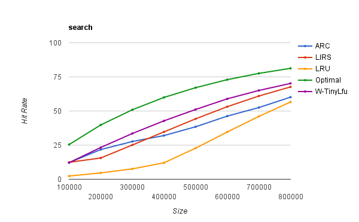
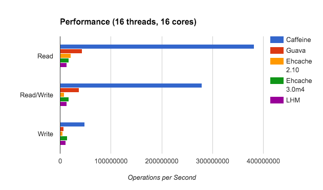
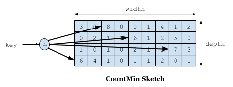
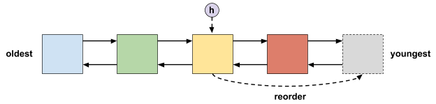
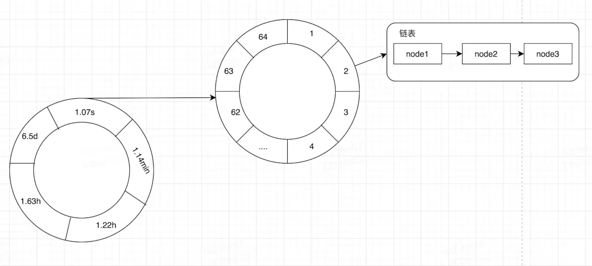
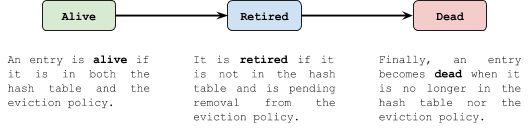
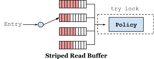

# Caffeine

## 一、Caffeine是什么

**Caffeine是一种高性能，近似最优命中的本地缓存。**

简单点说类似于自己实现的ConcurrentHashMap，是使用Java8重写的基于Guava和[ConcurrentLinkedHashMap](https://code.google.com/p/concurrentlinkedhashmap)的本地缓存，且在Spring Boot 2.0(spring 5)中已取代Guava,那么就没有理由怀疑Caffeine的性能了。Guava Cache 的功能的确是很强大，满足了绝大多数人的需求，但是其本质上还是使用 LRU 淘汰算法对ConcurrentHashMap的一层封装，所以在与其他较为优良的淘汰算法的对比中就相形见绌了。而 Caffeine Cache 实现了 W-TinyLFU(LFU+LRU 算法的变种)。

本文将从淘汰策略、过期策略、并发控制等方面为大家揭开Caffeine的神秘面纱。

> 如果大家有兴趣，可以先看一下Guava的设计实现。

## 二、Caffeine缓存的使用
### 2.1、Population自动填充加载
Caffeine 为我们提供了4种填充策略：**<u>手动、自动同步、手动异步、异步自动</u>**。

#### 1.手动加载

```java
Cache<Key, Graph> cache = Caffeine.newBuilder()
    .expireAfterWrite(10, TimeUnit.MINUTES)
    .maximumSize(10_000)
    .build();
// Lookup an entry, or null if not found
Graph graph = cache.getIfPresent(key);
// Lookup and compute an entry if absent, or null if not computable
graph = cache.get(key, k -> createExpensiveGraph(key));
// Insert or update an entry
cache.put(key, graph);
// Remove an entry
cache.invalidate(key);
```
<u>Cache接口允许显式的去控制缓存的获取，更新和删除。</u>

我们可以通过cache.getIfPresent(key) 方法来获取一个key的值，通过cache.put(key, value)方法显式的将数据放入缓存，但是会覆盖缓原来key的数据。<u>建议使用cache.get(key，k – > value) 的方式，get 方法将一个参数为 key 的 Function (createExpensiveGraph) 作为参数传入。如果缓存中不存在该Key，则调用这个 Function 函数，并将返回值作为该缓存的值插入缓存中。</u>**get 方法是以阻塞方式执行调用，即使多个线程同时请求该值也只会调用一次Function方法。这样可以避免与其他线程的写入竞争**，这也是为什么使用 get 优于 getIfPresent 的原因。

注意：如果调用该方法返回NULL（如上面的 createExpensiveGraph 方法），则cache.get返回null，如果调用该方法抛出异常，则get方法也会抛出异常。

可以使用Cache.asMap() 方法获取ConcurrentMap进而对缓存进行一些更改。

#### 2.同步加载（Loading）

```java
LoadingCache<Key, Graph> cache = Caffeine.newBuilder()
    .maximumSize(10_000)
    .expireAfterWrite(10, TimeUnit.MINUTES)
    .build(key -> createExpensiveGraph(key));

// Lookup and compute an entry if absent, or null if not computable
Graph graph = cache.get(key);
// Lookup and compute entries that are absent
Map<Key, Graph> graphs = cache.getAll(keys);
```

和guava cache相同,LoadingCache是使用CacheLoader来构建的缓存。

批量查找可以使用getAll方法。默认情况下，getAll将会对缓存中没有值的key分别调用CacheLoader.load方法来构建缓存的值。我们可以重写CacheLoader.loadAll方法来提高getAll的效率。

#### 3.异步手动加载Asynchronous (Manual)
```java
AsyncCache<Key, Graph> cache = Caffeine.newBuilder()
    .expireAfterWrite(10, TimeUnit.MINUTES)
    .maximumSize(10_000)
    .buildAsync();

// Lookup and asynchronously compute an entry if absent
CompletableFuture<Graph> graph = cache.get(key, k -> createExpensiveGraph(key));
```

AsyncLoadingCache异步加载使用Executor去调用方法并返回一个CompletableFuture。异步加载缓存使用了响应式编程模型。

如果要以同步方式调用时，应提供CacheLoader。要以异步表示时，应该提供一个AsyncCacheLoader，并返回一个CompletableFuture。

synchronous()这个方法提供了一个阻塞缓存的视图LoadingCache,直到异步计算完成。调用该方法后就相当于将一个异步加载的缓存AsyncLoadingCache转换成了一个同步加载的缓存LoadingCache。

默认使用ForkJoinPool.commonPool()来执行异步线程，但是我们可以通过Caffeine.executor(Executor) 方法来替换为指定线程池。

#### 4.异步自动加载 Asynchronously Loading
```java
AsyncLoadingCache<Key, Graph> cache = Caffeine.newBuilder()
    .maximumSize(10_000)
    .expireAfterWrite(10, TimeUnit.MINUTES)
    // Either: Build with a synchronous computation that is wrapped as asynchronous 
    .buildAsync(key -> createExpensiveGraph(key));
    // Or: Build with a asynchronous computation that returns a future
    .buildAsync((key, executor) -> createExpensiveGraphAsync(key, executor));

// Lookup and asynchronously compute an entry if absent
CompletableFuture<Graph> graph = cache.get(key);
// Lookup and asynchronously compute entries that are absent
CompletableFuture<Map<Key, Graph>> graphs = cache.getAll(keys);
```
AsyncLoadingCache是使用AsyncCacheLoader来构建的异步缓存,和同步加载的方式类似,异步自动加载需要一个AsyncCacheLoader,并返回CompletableFuture

### 二、Eviction淘汰策略

Caffeine提供三种淘汰策略：基于大小（size-based），基于时间（time-based）和基于引用（reference-based）。

#### 1.基于大小（size-based）
```java
// Evict based on the number of entries in the cache
LoadingCache<Key, Graph> graphs = Caffeine.newBuilder()
    .maximumSize(10_000)
    .build(key -> createExpensiveGraph(key));

// Evict based on the number of vertices in the cache
LoadingCache<Key, Graph> graphs = Caffeine.newBuilder()
    .maximumWeight(10_000)
    .weigher((Key key, Graph graph) -> graph.vertices().size())
    .build(key -> createExpensiveGraph(key));
```

基于大小淘汰，有两种方式：一种是基于缓存数量大小，一种是基于缓存的权重。

使用Caffeine.maximumSize(long)方法来指定缓存的最大容量。当缓存超出这个容量的时候，会使用Window-TinyLfu策略来删除缓存。

可以使用权重的策略来进行驱逐，可以使用Caffeine.weigher(Weigher)来指定权重函数，使用Caffeine.maximumWeight(long) 函数来指定缓存最大权重值。maximumWeight与maximumSize不可以同时使用。

#### 2.基于时间（time-based）

```java
// 基于固定的过期策略进行淘汰
LoadingCache<Key, Graph> graphs = Caffeine.newBuilder()
    .expireAfterAccess(5, TimeUnit.MINUTES)
    .build(key -> createExpensiveGraph(key));

LoadingCache<Key, Graph> graphs = Caffeine.newBuilder()
    .expireAfterWrite(10, TimeUnit.MINUTES)
    .build(key -> createExpensiveGraph(key));

// 基于动态的过期策略进行淘汰
LoadingCache<Key, Graph> graphs = Caffeine.newBuilder()
    .expireAfter(new Expiry<Key, Graph>() {
      public long expireAfterCreate(Key key, Graph graph, long currentTime) {
        // Use wall clock time, rather than nanotime, if from an external resource
        long seconds = graph.creationDate().plusHours(5)
            .minus(System.currentTimeMillis(), MILLIS)
            .toEpochSecond();
        return TimeUnit.SECONDS.toNanos(seconds);
      }
      public long expireAfterUpdate(Key key, Graph graph, 
          long currentTime, long currentDuration) {
        return currentDuration;
      }
      public long expireAfterRead(Key key, Graph graph,
          long currentTime, long currentDuration) {
        return currentDuration;
      }
    })
    .build(key -> createExpensiveGraph(key));
```

Caffeine提供了三种定时驱逐策略：

1. expireAfterAccess(long, TimeUnit):在最后一次访问或者写入后开始计时，在指定的时间后过期。假如一直有请求访问该key，那么这个缓存将一直不会过期。
2. expireAfterWrite(long, TimeUnit): 在最后一次写入缓存后开始计时，在指定的时间后过期。
3. expireAfter(Expiry): 自定义策略，过期时间由Expiry实现计算。

通过在写入和偶尔在读取的期间来定期维护过期处理,过期事件的调度和触发都以O(1)进行。

对于准时过期，而不是依赖其他缓存活动来触发常规的维护，请使用调度程序接口和Caffeine.Scheduler（Scheduler）方法指定调度线程.

#### 3.基于引用（reference-based）

```java
// Evict when neither the key nor value are strongly reachable
LoadingCache<Key, Graph> graphs = Caffeine.newBuilder()
    .weakKeys()
    .weakValues()
    .build(key -> createExpensiveGraph(key));

// Evict when the garbage collector needs to free memory
LoadingCache<Key, Graph> graphs = Caffeine.newBuilder()
    .softValues()
    .build(key -> createExpensiveGraph(key));
```

Java4种引用的级别由高到低依次为：<u>强引用 > 软引用 > 弱引用 > 虚引用</u>

> - **强引用**: JVM停止运行时才终止回收
> - **软引用**: 在内存不足时对象缓存被回收
> - **弱引用**: 在垃圾回收时,gc运行后被回收
> - **虚引用**: 引用不到对象

将缓存的淘汰配置成基于GC进行淘汰回收。我们可以将key 和 value 配置为弱引用或只将值配置成软引用。注意：AsyncLoadingCache不支持弱引用和软引用。

Caffeine.weakKeys() 使用弱引用存储key。如果没有其他地方对该key有强引用，那么该缓存就会被垃圾回收器回收。由于垃圾回收器只依赖于身份(identity)相等，因此这会导致整个缓存使用身份 (==) 相等来比较 key，而不是使用 equals()。

Caffeine.weakValues() 使用弱引用存储value。如果没有其他地方对该value有强引用，那么该缓存就会被垃圾回收器回收。由于垃圾回收器用==判断相同，因此这会导致整个缓存也使用(==) 相等来比较 key，而不是使用 equals()。

Caffeine.softValues() 使用软引用存储value。当内存满了过后，软引用的对象以将使用最近最少使用(least-recently-used ) 的方式进行垃圾回收。由于使用软引用是需要等到内存满了才进行回收，所以通常建议给缓存配置一个使用内存的最大值。 softValues() 将使用 (==) 而不是equals() 来比较值。

### 三、Removal删除

- 淘汰（eviction）：由于满足了某种淘汰策略，后台自动进行的淘汰操作
- 无效（invalidation）：表示由调用方手动使缓存失效
- 删除（removal）：淘汰或无效操作的产生的结果

在任何时候，都可以明确地使缓存无效，而不用等待缓存被淘汰。
```java
// individual key
cache.invalidate(key)
// bulk keys 批量
cache.invalidateAll(keys)
// all keys
cache.invalidateAll()
```

删除监听器

```java
Cache<Key, Graph> graphs = Caffeine.newBuilder()
    .removalListener((Key key, Graph graph, RemovalCause cause) ->
        System.out.printf("Key %s was removed (%s)%n", key, cause))
    .build();
```

通过Caffeine.removalListener(RemovalListener) 为缓存指定一个删除监听，以便在删除数据时执行某些操作。 RemovalListener可以获取到key、value和RemovalCause（删除的原因）。

监听器的操作是使用Executor来异步执行的。默认执行程序是ForkJoinPool.commonPool()，可以通过Caffeine.executor(Executor)覆盖。当操作必须与删除同步执行时，请改为使用CacheWrite，CacheWrite将在下面说明。**注意**：由RemovalListener抛出的任何异常都会被记录（使用Logger）但并不会抛出。

### 四、Refresh刷新策略
```java
LoadingCache<Key, Graph> graphs = Caffeine.newBuilder()
    .maximumSize(10_000)
    // 指定在创建缓存或者最近一次更新缓存后经过固定的时间间隔，刷新缓存
    .refreshAfterWrite(1, TimeUnit.MINUTES)
    .build(key -> createExpensiveGraph(key));
```

刷新和淘汰是不一样的。刷新的是通过LoadingCache.refresh(key)方法来指定，并通过调用CacheLoader.reload方法来执行，刷新key会异步地为这个key加载新的value，并返回旧的值（如果有的话）。淘汰会阻塞查询操作直到淘汰作完成才会进行其他操作。

与expireAfterWrite不同的是，refreshAfterWrite在查询数据的时候判断该数据是不是符合查询条件，如果符合条件该缓存就会去执行刷新操作。例如，可以在同一个缓存中同时指定refreshAfterWrite和expireAfterWrite，只有当数据具备刷新条件的时候才会去刷新数据，不会盲目去执行刷新操作。如果数据在刷新后就一直没有被再次查询，那么该数据也会过期。

刷新操作是使用Executor异步执行的。默认执行程序是ForkJoinPool.commonPool()，可以通过Caffeine.executor(Executor)覆盖。如果刷新时引发异常，则使用log记录日志，并不会抛出。

#### Writer

```java
LoadingCache<Key, Graph> graphs = Caffeine.newBuilder()
  .writer(new CacheWriter<Key, Graph>() {
    @Override public void write(Key key, Graph graph) {
      // write to storage or secondary cache
    }
    @Override public void delete(Key key, Graph graph, RemovalCause cause) {
      // delete from storage or secondary cache
    }
  })
  .build(key -> createExpensiveGraph(key));
```
CacheWriter允许缓存充当一个底层资源的代理，当与CacheLoader结合使用时，所有对缓存的读写操作都可以通过Writer进行传递。Writer可以把操作缓存和操作外部资源扩展成一个同步的原子性操作。并且在缓存写入完成之前，它将会阻塞后续的更新缓存操作，但是读取（get）将直接返回原有的值。如果写入程序失败，那么原有的key和value的映射将保持不变，如果出现异常将直接抛给调用者。

CacheWriter可以同步的监听到缓存的创建、变更和删除操作。加载（例如LoadingCache.get）、重新加载（例如LoadingCache.refresh）和计算（例如Map.computeIfPresent）的操作不被CacheWriter监听到。

**注意**：CacheWriter不能与weakKeys或AsyncLoadingCache结合使用。

#### 可能的案例（Possible Use-Cases）

CacheWriter是复杂工作流的扩展点，需要外部资源来观察给定Key的变化顺序。这些用法Caffeine是支持的，但不是本地内置。

##### 写模式（Write Modes）

CacheWriter可以用来实现一个直接写（write-through ）或回写（write-back ）缓存的操作。

write-through式缓存中，写操作是一个同步的过程，只有写成功了才会去更新缓存。这避免了同时去更新资源和缓存的条件竞争。

write-back式缓存中，对外部资源的操作是在缓存更新后异步执行的。这样可以提高写入的吞吐量，避免数据不一致的风险，比如如果写入失败，则在缓存中保留无效的状态。这种方法可能有助于延迟写操作，直到指定的时间，限制写速率或批写操作。

通过对write-back进行扩展，我们可以实现以下特性：

- 批处理和合并操作
- 延迟操作并到一个特定的时间执行
- 如果超过阈值大小，则在定期刷新之前执行批处理
- 如果操作尚未刷新，则从写入后缓冲器（write-behind）加载
- 根据外部资源的特点，处理重审，速率限制和并发

##### 分层（Layering）

CacheWriter可能用来集成多个缓存进而实现多级缓存。

多级缓存的加载和写入可以使用系统外部高速缓存。这允许缓存使用一个小并且快速的缓存去调用一个大的并且速度相对慢一点的缓存。典型的off-heap、file-based和remote 缓存。

受害者缓存（Victim Cache）是一个多级缓存的变体，其中被删除的数据被写入二级缓存。这个delete(K, V, RemovalCause) 方法允许检查为什么该数据被删除，并作出相应的操作。

#### 同步监听器（Synchronous Listeners）

同步监听器会接收一个key在缓存中的进行了那些操作的通知。监听器可以阻止缓存操作，也可以将事件排队以异步的方式执行。这种类型的监听器最常用于复制或构建分布式缓存。

### 五、Statistics统计

```java
Cache<Key, Graph> graphs = Caffeine.newBuilder()
 .maximumSize(10_000)
 .recordStats()
 .build();
```

使用Caffeine.recordStats()，您可以打开统计信息收集。Cache.stats() 方法返回提供统计信息的CacheStats，如：

- hitRate()：返回命中与请求的比率
- hitCount(): 返回命中缓存的总数
- evictionCount()：缓存逐出的数量
- averageLoadPenalty()：加载新值所花费的平均时间

这些统计数据对于缓存优化至关重要，我们建议在性能关键的应用程序中密切关注这些统计数据。

缓存统计信息可以使用基于pull or push的方法与报告系统集成.基于pull的方法定期调用Cache.stats()并记录最新的快照,基于pusu的方法提供一个定制的statcounter，以便在缓存操作期间直接更新度量。

### 六、Cleanup清理

缓存的清理策略可以使用惰性删除和定时删除，但是也可以自己调用cache.cleanUp()方法手动触发一次回收操作。cache.cleanUp()是一个同步方法。

默认情况下，Caffeine不会“自动”或在值过期后立即执行清除.相反，它在写操作之后执行少量的维护工作，如果很少进行写操作，则偶尔在读操作之后执行维护工作。如果您的缓存是高吞吐量的，那么您不必担心执行缓存维护来清除过期缓存项。等如果您的缓存很少被读写，您可能希望利用一个外部线程，如下所述，在适当的时候调用cache.cleanUp()。

也可以提供一个调度程序，以便能够迅速删除过期的条目。过期事件之间的调度是利用批处理并在短时间内最小化执行.调度是最大的努力，不会对何时删除过期的条目做出任何硬

### 七、Policy策略
在创建缓存的时候，缓存的策略就指定好了。但是在运行时可以获得和修改该策略。这些策略可以通过一些选项[Optional](https://docs.oracle.com/javase/8/docs/api/java/util/Optional.html)来获取，以此来确定缓存是否支持该功能。

#### 1. 基于大小

```java
cache.policy().eviction().ifPresent(eviction -> {
  eviction.setMaximum(2 * eviction.getMaximum());
});
```

如果缓存配置的时基于权重来淘汰，那么我们可以使用weightedSize() 来获取当前权重。这与获取缓存中的记录数的Cache.estimatedSize() 方法有所不同。

缓存的最大值(maximum)或最大权重(weight)可以通过getMaximum()方法来读取，并使用setMaximum(long)进行调整。当缓存量达到新的阀值的时候缓存才会去淘汰缓存。

如果有需要,我们可以通过hottest(int) 和 coldest(int)方法来获取最有可能命中的数据和最有可能驱逐的数据快照。

#### 2. 基于时间

```java
cache.policy().expireAfterAccess().ifPresent(expiration -> ...);
cache.policy().expireAfterWrite().ifPresent(expiration -> ...);
cache.policy().expireVariably().ifPresent(expiration -> ...);
cache.policy().refreshAfterWrite().ifPresent(expiration -> ...);
```

ageOf(key,TimeUnit) 提供了从expireAfterAccess，expireAfterWrite或refreshAfterWrite策略的角度来看缓存项已经空闲的时间。最大持续时间可以从getExpiresAfter(TimeUnit)读取，并使用setExpiresAfter(long,TimeUnit)进行调整。

如果有需要,我们可以通过hottest(int) 和 coldest(int)方法来获取最有可能命中的数据和最有可能驱逐的数据快照。

##  Performance性能

### Design数据结构

在caffeine所有的数据都在ConcurrentHashMap中,这个和guava cache不同，guava cache是自己实现了个类似ConcurrentHashMap的结构。

```java
abstract class BoundedLocalCache<K, V> extends BLCHeader.DrainStatusRef<K, V> implements LocalCache<K, V> {
  final @Nullable RemovalListener<K, V> evictionListener;
  final @Nullable CacheLoader<K, V> cacheLoader;

  final ConcurrentHashMap<Object, Node<K, V>> data;
  final PerformCleanupTask drainBuffersTask;
  final Consumer<Node<K, V>> accessPolicy;
  final Buffer<Node<K, V>> readBuffer;
  final NodeFactory<K, V> nodeFactory;
  final ReentrantLock evictionLock;
  final Weigher<K, V> weigher;
  final Executor executor;
  final boolean isAsync;

  @Nullable Set<K> keySet;
  @Nullable Collection<V> values;
  @Nullable Set<Entry<K, V>> entrySet;
  @Nullable volatile ConcurrentMap<Object, CompletableFuture<?>> refreshes;  
}
```

ConcurrentHashMap 其实存储的是KeyReference-Node<K,V>形式

.png)


### Efficiency效率

Caffeine 实现了W-TinyLFU用于淘汰策略,Window TinyLfu是LFU+LRU 算法的变种,下面是查询时不同算法命中率的对比。



Optimal 是最理想的命中率，LRU 在几个算法中命中率最低。而W-TinyLFU 是最接近理想命中率的。

当然Caffeine不仅命中率 Caffeine 优于 Guava Cache，在读写吞吐量上也遥遥领先。



> Benchmarks数据见 https://github.com/ben-manes/caffeine/wiki/Benchmarks#read-100-1

## W-TinyLFU

在 LFU 中只要数据访问模式的概率分布随时间保持不变时，其命中率就能变得非常高。但当访问模式变化,使用LFU有一定局限性。所以出现了很多 LFU 的变种，基于时间周期进行频次衰减，或者在最近某个时间段内的频率。同样的 LFU 也会使用额外空间记录每一个数据访问的频率，即使数据没有在缓存中也需要记录，所以需要维护的额外空间很大。

再看 LRU ，LRU 可以很好的应对突发流量的情况，因为不需要累计数据频率。

所以 W-TinyLFU 结合了 LRU 和 LFU，以及其他的算法的一些特点。

首先是频率记录的问题，要实现的目标是利用有限的空间可以记录随时间变化的访问频率。在 W-TinyLFU 中使用 Count-Min Sketch 记录数据项的访问频率，而Sketch也是布隆过滤器的变种。



Count-Min Sketch使用一个计数器矩阵和多个散列函数。如果需要记录一个值，需要通过多种 hash 算法对其进行处理hash，然后在对应的 hash 算法的记录中+1，例如4个hash算法分别记录了一个值表示该key对应的频次,真正计算频率时,取4者中最小值作为频次,这也是 Count-Min Sketch名字的由来。这种模式在空间、效率和由于冲突而导致的错误率之间进行了权衡。多个hash算法取最小大大降低了冲突的概率

W-TinyLFU使用Count-Min Sketch作为过滤器，如果新缓存项的频率高于为其腾出空间而必须逐出的缓存项，则允许其进入。但不是立即过滤，准入窗口给了新缓存项一个预热机会,将新到的数据放入一个队列中，防止突发流量由于之前没有访问频率，而导致被淘汰。

W-TinyLFU使用分段LRU（SLRU）策略进行长期保留。一开始,缓存项在probation段，在随后的访问中将其提升到protected段（保护段占总容量的80%）,当protected段已满时，有的数据会被淘汰回试用段，这可能会级联触发probation段的淘汰,这种方式确保保留了访问间隔小的热数据，并且不经常访问冷数据被淘汰.


### 淘汰策略

在caffeine所有的数据都在ConcurrentHashMap中，这个和guava cache不同，guava cache是自己实现了个类似ConcurrentHashMap的结构。在caffeine中有三个记录引用的**LRU**队列:

- window队列:在caffeine中规定只能为缓存容量的%1,如果size=100,那这个队列的有效大小就等于1。这个队列中记录的是新到的数据，防止突发流量由于之前没有访问频率，而导致被淘汰。窗口队列，在这里很难被其他数据淘汰。
- Probation队列:叫做试用期队列，在这个队列就代表数据相对比较冷，马上就要被淘汰了。这个有效大小为size减去eden减去protected。
- Protected队列:保护队列，暂时不会被淘汰，但是，如果Probation队列没有数据了或者Protected数据满了，也将会被面临淘汰的尴尬局面。当然想要变成这个队列，需要把Probation访问一次之后，就会提升为Protected队列。这个有效大小为(size减去eden) X 80% 如果size =100，就会是79。

```java
  final AccessOrderDeque<Node<K, V>> accessOrderWindowDeque;

  final AccessOrderDeque<Node<K, V>> accessOrderProbationDeque;

  final AccessOrderDeque<Node<K, V>> accessOrderProtectedDeque;
```

.png)

这三个队列关系如下:
WindowProbationProtected1.新数据2.window降级3.升级4.降级5.淘汰

1. 所有的新数据都会进入window队列。
2. Window队列满了，从window淘汰进入Probation。
3. 如果在Probation中访问了其中某个数据，则这个数据升级为Protected。
4. 如果Protected满了又会继续降级为Probation。

对于发生数据淘汰的时候，会从Probation中进行淘汰。会把这个队列中的数据队头称为受害者victim，这个队头肯定是最早进入的，按照LRU队列的算法的话那他其实他就应该被淘汰，但是在这里只能叫他受害者，这个队列是Probation试用期队列，代表马上要淘汰了。这里会取出队尾叫候选者candidate。这里受害者会和攻击者进行PK决出应该被淘汰的。


### 过期策略

在Caffeine中分为两种缓存，一个是有界缓存，一个是无界缓存，无界缓存不需要过期并且没有界限。在有界缓存中提供了三个过期API:

- expireAfterWrite：代表着写了之后多久过期。
- expireAfterAccess: 代表着最后一次访问了之后多久过期。
- expireAfter:在expireAfter中需要自己实现Expiry接口，这个接口支持create,update,以及access了之后多久过期。注意这个API和前面两个API是互斥的。这里和前面两个API不同的是，需要你告诉缓存框架，他应该在具体的某个时间过期，也就是通过前面的重写create,update,以及access的方法，获取具体的过期时间。

caffeine只使用分开的(amortized) O(1)的算法，从简单的固定策略开始，然后添加了可变策略。

#### 固定过期

固定过期策略是当每个条目被同等对待时，例如统一设置了10分钟生存时间这种情况下，我们可以使用一个有时间限制的LRU列表，其中头部是最老的项，尾部是最年轻的项.

当缓存项的过期时间被重置时，该项将被移动到尾部，可以高效的完成将列表指针指向尾部的动作.我们依赖于这样一个事实去淘汰头部的entry，即头部之后的一切缓存项都是更年轻的.

这种策略支持访问和写入顺序，但前提是过期时间是固定的。



#### 动态过期

动态过期策略更具挑战性，因为每个entry的计算是不一样的,这通常发生在过期策略位于缓存外部时，例如来自第三方资源的http过期头.需要实现com.github.benmanes.caffeine.cache.Expiry

这需要排序，但由于分层计时轮的创造性，可以使用散列而不是通过比较来完成。

分层时间轮是一个由两个链表组成的数组，每个链表表示一个粗略的时间跨度。这样，项被散列到相应的bucket中，并将其按照大致的顺序排序.

通过使用多个时间轮，层次结构可以表示更大的时间范围，如天、小时、分钟和秒。当上一级轮子转动时，下一个桶被冲到下一级轮子上，这些items被重新hash到相应的放置。当最底层的轮子转动时，上一个桶中的项目将被淘汰.由于散列和级联，此策略在分开的(amortized )O(1)时间内实现，并提供了良好的性能

.png)

#### 分层时间轮

时间轮是什么呢？想必熟悉一些定时任务系统对其并不陌生，它是一个高效的处理定时任务的结构，可以简单的将其看做是一个多维数组。在Caffeine中是一个二层时间轮，也就是二维数组，其一维的数据表示较大的时间维度比如，秒，分，时，天等，其二维的数据表示该时间维度较小的时间维度，比如秒内的某个区间段。当定位到一个TimeWheel[i][j]之后，其数据结构其实是一个链表，记录着我们的Node。在Caffeine利用时间轮记录我们在某个时间过期的数据，然后去处理。

在Caffeine中的时间轮如上面所示。在插入数据的时候，根据重写的方法计算出他应该过期的时间，比如他应该在1536046571142时间过期，上一次处理过期时间是1536046571100，对其相减则得到42ms，然后将其放入时间轮，由于其小于1.07s，所以直接放入1.07s的位置，以及第二层的某个位置(需要经过一定的算法算出)，使用尾插法插入链表。

处理过期时间的时候会算出上一次处理的时间和当前处理的时间的差值，需要将其这个时间范围之内的所有时间轮的时间都进行处理，如果某个Node其实没有过期，那么就需要将其重新插入进时间轮。



### 并发性能
并发效率提升有两个难点:

1.由于在大多数的缓存策略中，数据的读取都会伴随对缓存状态的写操作，并发的缓存读取被视为一个难点问题。传统的解决方式是用同步锁。这可以通过将缓存的数据划成多个分区来进行锁拆分优化。不幸的是热点数据所持有的锁会比其他数据更常的被占有，在这种场景下锁拆分的性能提升也就没那么好了。当单个锁的竞争成为瓶颈后，接下来的经典的优化方式是只更新单个数据的元数据信息，以及使用随机采样、基于FIFO的驱逐策略来减少数据操作。这些策略会带来高性能的读和低性能的写，同时在选择驱逐对象时也比较困难。

2.另一种可行方案来自于数据库理论，通过提前提交日志的方式来扩展写的性能。写入操作先记入日志中，随后异步的批量执行，而不是立即写入到数据结构中。这种思想可以应用到缓存中，执行哈希表的操作，将操作记录到缓冲区，然后在合适的时机执行缓冲区中的内容。这个策略依然需要同步锁或者tryLock，不同的是把对锁的竞争转移到对缓冲区的追加写上。

在Caffeine中，有一组缓冲区被用来记录读写。一次访问首先会被因线程ID而异的哈希到stripped ring buffer上，当检测到竞争时，缓冲区会自动扩容。一个ring buffer容量满载后，会触发异步的执行操作，而后续的对该ring buffer的写入会被丢弃，直到这个ring buffer可被使用。虽然因为ring buffer容量满而无法被记录该访问，但缓存值依然会返回给调用方。这种策略信息的丢失不会带来大的影响，因为W-TinyLFU能识别出我们希望保存的热点数据。通过使用因线程而异的哈希算法替代在数据项的键上做哈希，缓存避免了瞬时的热点key的竞争问题。


在 Guava Cache 中其读写操作中夹杂着过期时间的处理，在一次 put 操作中有可能还会做淘汰/过期操作，所以其读写性能会受到一定影响。Caffeine 在读写操作上有优异的表现,主要是因为 Caffeine对这些事件的操作是通过异步操作，它将事件提交至队列，这里的队列的数据结构是 RingBuffer。然后会通过默认的 ForkJoinPool.commonPool()，或者自己配置线程池，进行取队列操作，再在进行后续的淘汰/过期操作。当然读写也是有不同的队列， Caffeine 认为缓存读比写多很多，所以对于写操作是所有线程共享一个 Ringbuffer。


写数据时，采用更传统的并发队列，每次变更会引起一次立即的执行。虽然数据的损失是不可接受的，但仍然有很多方法可以来优化写缓冲区。所有类型的缓冲区都被多个的线程写入，但却通过单个线程来执行。这种多生产者/单个消费者的模式允许了更简单、高效的算法来实现。


缓冲区和细粒度的写带来了单个数据项的操作乱序的竞态条件。插入、读取、更新、删除都可能被各种顺序的重放，如果这个策略控制的不合适，则可能引起问题(could retain dangling references.)。解决方案是通过状态机来定义单个数据项的生命周期。


Alive (存活)-->Retired退出-->Dead死亡



读Buffer

对于读操作比写操作更加频繁，为进一步减少竞争，caffeine为每个线程配备了一个RingBuffer：

●Striped ring buffers

- 根据线程ID决定哪一个Buffer,没有在数据项的键上做哈希，这样可以分散热点key,避免瞬时的热点key的竞争问题
- 当检测到竞争,有较多的追加失败，缓冲区会自动扩容
- 基于Java’s Striped64



写Buffer

Caffeine 认为缓存读比写多很多，所以对于写操作是所有线程共享一个 a growable circular array。

●有界的ArrayQueqe

- 必要时,ArrayQueqe容量从初始值增长到最大值
- 转发指针允许使用者发现新数组
- 内置JCTools里的 MpscGrowableArrayQueue 

●RingBuffer满之后反压

- Writers协助执行维护工作
- 因为需要写入速率远远大于重放速率,所以很少发生
- 立即触发维护周期


## Guava cache vs Caffeine选择

没有什么纠结的,Spring抛弃了guava,拥抱了caffeine,所以在2者之间能选择时,用脚趾头投票选择caffine.

那么我们看下caffeine的使用要求.

- java 8, caffeine基于java8开发,所以...
- 如果使用spring-cache声明,使用caffeine是需要Spring5的,5以下使用guava cache;如果是编程式,就没有限制,推荐caffeine

当然如果不需要过期/淘汰/刷新等特性,推荐直接使用ConcurrentHashMap,可以减少外部依赖.

# 参考文献

github地址https://github.com/ben-manes/caffeine

https://github.com/ben-manes/caffeine/wiki

[<<你应该知道的Java缓存进化史>>](https://mp.weixin.qq.com/s/DV5eSZtShs2twGe0UwzPuA)

深入解密来自未来的缓存-Caffeine https://juejin.im/post/5b8df63c6fb9a019e04ebaf4

Design Of A Modern Cache http://highscalability.com/blog/2016/1/25/design-of-a-modern-cache.html

Design Of A Modern Cache—Part Deux  http://highscalability.com/blog/2019/2/25/design-of-a-modern-cachepart-deux.html

TinyLFU: A Highly Efficient Cache Admission Policy https://arxiv.org/pdf/1512.00727.pdf