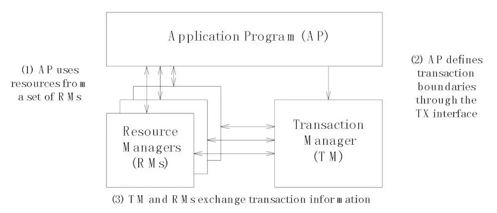

# x当我们在谈论分布式事务的时候，我们究竟在谈论什么

微服务兴起的这几年涌现出不少分布式事务框架，比如 ByteTCC、TCC-transaction、EasyTransaction 以及最近很火爆的 Seata。最近刚看了Seata的源码（v0.5.2），借机记录一下自己对分布式事务的一些理解。（3年前这类框架还没成熟，因项目需要自己也写过一个柔性事务框架）。本文分五部分，首先明确分布式事务概念的演变，然后简单说下为什么大家不用XA，第三部分阐述两阶段提交的“提升”，第四部分介绍Seata的架构的亮点与问题，第五部分谈下分布式事务的取舍。

限于篇幅一些网上可搜索的细节本文不展开阐述（例如XA、Saga、TCC、Seata等原理的的详细介绍）。

## 一、分布式事务的泛化

提起分布式事务，最早指涉及的是多个资源的数据库事务问题。

> wiki对分布式事务的定义：A distributed transaction is a database transaction in which two or more network hosts are involved

不过事务一词含义随着SOA架构逐渐扩大，根据上下文不同，可分为两类：

- System transaction
- Business transaction

前者多指数据库事务，后者则多对应一个业务交易。与此同时，分布式事务的含义也在泛化，尤其 SOA、微服务概念流行起来后，多指的是一个业务场景，需要编排很多独立部署的服务时，如何保证交易整体的原子性与一致性问题。这类分布式事务也称作长事务(long-lived transaction)，例如一个定行程的交易，它由购买航班、租车以及预订酒店构成，而航班预订可能需要一两天才能确认。为了统一对概念的理解，本文默认指的都是这类长事务。

分布式事务概念泛化的同时，也带来了一个技术问题，微服务下这类分布式事务的ACID该如何保证？是否仍然可以用传统两阶段提交/XA去解决？很可惜，基于数据库的XA有点像扶不起的阿斗，中看不中用。

## 二、为什么XA大家都不用？

其实也并非不用，例如在 IBM 大型机上基于 CICS 很多跨资源是基于 XA 协议实现的分布式事务，事实上 XA 也算分布式事务处理的规范了，但在为什么互联网中很少使用，究其原因我觉得有以下几个：

- 性能（阻塞性协议，增加响应时间、锁时间、死锁）；
- 数据库支持完善度（MySQL 5.7之前都有缺陷）；
- 协调者依赖独立的J2EE中间件（早期重量级Weblogic、Jboss、后期轻量级Atomikos、Narayana和Bitronix）；
- 运维复杂，DBA缺少这方面经验；
- 并不是所有资源都支持XA协议；
- 大厂懂所以不使用，小公司不懂所以不敢用。

> 准确讲XA是一个规范、协议，它只是定义了一系列的接口，只是目前大多数实现XA的都是数据库或者MQ，所以提起XA往往多指基于资源层的底层分布式事务解决方案。其实现在也有些数据分片框架或者中间件也支持XA协议，毕竟它的兼容性、普遍性更好。

## 三、两阶段提交的“提升”

基于数据库的 XA 协议本质上就是两阶段提交，但由于性能原因在互联网高并发场景下并不适用。如果数据库只能保证本地 ACID 时，那么其中出现交易异常后，如何实现整个交易原子性 A，从而保证一致性 C 呢？另外在处理过程中如何保证隔离性呢？

最直接的方法就是按照逻辑依次调用服务，但出现异常怎么办？那就对那些已经成功的进行补偿，补偿成功就一致了，这种朴素的模型就是 Saga。但 Saga 这种方式并不能保证隔离性，于是出现了 TCC。在实际交易逻辑前先做业务检查、对涉及到的业务资源进行“预留”，或者说是一种“中间状态”，如果都预留成功则完成这些预留资源的真正业务处理，典型的如票务座位等场景。

当然还有像 Ebay 提出的基于消息表，即可靠消息最终一致模型，但本质上这也属于 Saga 模式的一种特定实现，它的关键点有两个：

- 基于应用共享事务记录执行轨迹；
- 然后通过异步重试确保交易最终一致（这也使得这种方式不适用那些业务上允许补偿回滚的场景）。

这类分布式事务场景并不是微服务才出现的，在SOA时代其实就有了，常见的Saga、TCC、可靠消息最终一致等模型也都是很多年前就有了，只是最近几年随着微服务兴起，这些方案又重新被人关注了起来。

> 「Saga」参考链接：https://www.cs.cornell.edu/andru/cs711/2002fa/reading/sagas.pdf

仔细对比这些方案与 XA，会发现这些方案本质上都是将两阶段提交从资源层提升到了应用层。

- Saga 的核心就是补偿，一阶段就是服务的正常顺序调用（数据库事务正常提交），如果都执行成功，则第二阶段则什么都不做；但如果其中有执行发生异常，则依次调用其补偿服务（一般多逆序调用未已执行服务的反交易）来保证整个交易的一致性。应用实施成本一般。
- TCC 的特点在于业务资源检查与加锁，一阶段进行校验，资源锁定，如果第一阶段都成功，二阶段对锁定资源进行交易逻辑，否则，对锁定资源进行释放。应用实施成本较高。
- 基于可靠消息最终一致，一阶段服务正常调用，同时同事务记录消息表，二阶段则进行消息的投递，消费。应用实施成本较低。

具体到基于这些模型实现的分布式事务框架，也多借鉴了 DTP（Distributed Transaction Processing）模型。

> DTP（Distributed Transaction Processing）参考链接：http://pubs.opengroup.org/onlinepubs/009680699/toc.pdf

▲ DTP模型

- RM负责本地事务的提交，同时完成分支事务的注册、锁的判定，扮演事务参与者角色。
- TM负责整体事务的提交与回滚的指令的触发，扮演事务的总体协调者角色。

不同框架在实现时，各组件角色的功能、部署形态会根据需求进行调整，例如 TM 有的是以 jar 包形式与应用部署在一起，有的则剥离出来需要单独部署（例如 Seata 中将 TM 的主要功能放到一个逻辑上集中的Server 上，叫做 TC，Transaction Coordinator 

## 四、Seata 架构得与失

今年初，阿里发布了开源分布式事务框架 Fescar，后来跟蚂蚁 TCC 方案整合后改名为 Seata，目前版本虽然只到 0.6，但 GitHub star 已经过9k，一方面可见阿里在圈内推广能力，另外一方面也说明大家对阿里分布式事务框架的期待。Seata 的使用方式以及原理在其 github wiki 上已经阐述的很清晰，网上也已有很多源代码剖析的文章。接下来我们通过分析 Seata AT 模式原理，来看看它的亮点与问题。

「Seata的使用方式以及原理」参考链接：https://github.com/seata/seata/wiki，Seata对 MT 以及 TCC 的支持亮点有限，这两种模式更多是为了兼容已有应用生态。

Seata团队画了一个的详细调用流程图，对照此图阅读其源码会轻松很多。

.jpg)

相比与其它分布式事务框架，Seata 架构的亮点主要有几个：

- 应用层基于 SQL 解析实现了自动补偿，从而最大程度的降低业务侵入性；
- 将分布式事务中 TC（事务协调者）独立部署，负责事务的注册、回滚；
- 通过全局锁实现了写隔离与读隔离。

这些特性的具体实现机制其官网以及 github 上都有详细介绍，这里不展开介绍。我们看看Seata增加了哪些开销（纯内存运算类的忽略不计）：

一条 Update 的 SQL，则需要全局事务 xid 获取（与 TC 通讯）、before image（解析 SQL，查询一次数据库）、after image（查询一次数据库）、insert undo log（写一次数据库）、before commit（与TC通讯，判断锁冲突），这些操作都需要一次远程通讯 RPC，而且是同步的。

另外 undo log 写入时 blob 字段的插入性能也是不高的。**每条写SQL都会增加这么多开销，粗略估计会增加 5 倍响应时间**（二阶段虽然是异步的，但其实也会占用系统资源，网络、线程、数据库）。

前后镜像如何生成？通过 druid 解析SQL，然后复用业务 SQL 中的 where 条件，然后生成 Select SQL 执行。

为了进行自动补偿，需要对所有交易生成前后镜像并持久化，可是在实际业务场景下，这个是成功率有多高，或者说分布式事务失败需要回滚的有多少比率？这个比例在不同场景下是不一样的，考虑到执行事务编排前，很多都会校验业务的正确性，所以发生回滚的概率其实相对较低。按照二八原则预估，**即为了20%的交易回滚，需要将80%的成功交易的响应时间增加5倍，这样的代价相比于让应用开发一个补偿交易是否是值得？值得我们深思。**

业界还有种思路，通过数据库binlog恢复SQL执行前后镜像，这样省去了同步undo log生成记录，减少了性能损耗，同时对业务零侵入，个人感觉是一种更好的方式。

**1）热点数据**

Seata 在每个分支事务中会携带对应的锁信息，在 before commit 阶段会依次获取锁(因为需要将所有 SQL 执行完才能拿到所有锁信息，所以放在 commit 前判断)。相比 XA，Seata 虽然在一阶段成功后会释放数据库锁，但一阶段在 commit 前全局锁的判定也拉长了对数据锁的占有时间，这个开销比 XA 的 prepare 低多少需要根据实际业务场景进行测试。全局锁的引入实现了隔离性，但带来的问题就是阻塞，降低并发性，尤其是热点数据，这个问题会更加严重。

**2）回滚锁释放时间**

Seata 在回滚时，需要先删除各节点的 undo log，然后才能释放 TC 内存中的锁，所以如果第二阶段是回滚，释放锁的时间会更长。

**3）死锁问题**

Seata 的引入全局锁会额外增加死锁的风险，但如果实现死锁，会不断进行重试，最后靠等待全局锁超时，这种方式并不优雅，也延长了对数据库锁的占有时间。

「Seata 的引入全局锁会额外增加死锁的风险」参考链接：https://github.com/seata/awesome-seata/blob/master/wiki/en-us/Fescar-AT.md

1）对于部分采用Seata的应用，如何保证数据不脏读、幻读？

Seata提供了一个@GlobalLock的注解，可以提供轻量级全局锁判定的功能（不生成undo log），但还是需要集成使用Seata。
2）TC在逻辑上是单点，如何做到高可用、高性能还是需要后续版本不断优化。

3）单机多数据源跨服务目前不支持。

## 五、分布式事务的取舍

严格的ACID事务对隔离性的要求很高，在事务执行中必须将所有的资源锁定， 对于长事务来说，整个事务期间对数据的独占，将严重影响系统并发性能。因此，在高并发场景中，对 ACID 的部分特性进行放松从而提高性能，这便产生了 BASE 柔性事务。柔性事务的理念则是通过业务逻辑将互斥锁操作从资源层面上移至业务层面。通过放宽对强一致性要求，来换取系统吞吐量的提升。另外提供自动的异常恢复机制，可以在发生异常后也能确保事务的最终一致。

基于 XA 的分布式事务如果要严格保证 ACID，实际需要事务隔离级别为 SERLALIZABLE。

由上可见柔性事务需要应用层进行参与，因此这类分布式事务框架一个首要的功能就是怎么最大程度降低业务改造成本，然后就是尽可能提高性能（响应时间、吞吐），最好是保证隔离性。

一个好的分布式事务框架应用尽可能满足以下特性：

- 业务改造成本低；
- 性能损耗低；
- 隔离性保证完整。

但如同CAP，这三个特性是相互制衡的，往往只能满足其中两个，我们可以画一个三角约束：

.jpg)

基于业务补偿的Saga满足 1.2；TCC满足 2.3；Seata满足1.3。

当然如果我们要自己设计一个分布式事务框架，还需要考虑很多其它特性，在明确目标场景偏好后进行权衡取舍，这些特性包括但不限于以下：

- 业务侵入性（基于注解、XML，补偿逻辑）；
- 隔离性（写隔离/读隔离/读未提交，业务隔离/技术隔离）；
- TM/TC部署形态（单独部署、与应用部署一起）；
- 错误恢复（自动恢复、手动恢复）；
- 性能（回滚的概率、付出的代价,响应时间、吞吐）；
- 高可用（注册中心、数据库）；
- 持久化（数据库、文件、多副本一致算法）；
- 同步/异步（2PC执行方式）；
- 日志清理(自动、手动)；
- ......

## 六、结语

分布式事务一直是业界难题，难在于 CAP 定理，在于分布式系统 8 大错误假设，在于 FLP 不可能原理，在于我们习惯于单机事务 ACID 做对比。无论是数据库领域 XA、Google percolator 或 Calvin 模型，还是微服务下 Saga、TCC、可靠消息等方案，都没有完美解决分布式事务问题，它们不过是各自在性能、一致性、可用性等方面做取舍，寻求某些场景偏好下的权衡。

「分布式系统8大错误假设」参考链接：https://en.wikipedia.org/wiki/Fallacies_of_distributed_computing

「FLP不可能原理」参考链接：https://www.cnblogs.com/firstdream/p/6585923.html

其实由于网络的不确定性，分布式下很多问题都是难题，最好的方案是避免分布式事务:)

最后回到主题，Seata 解决了分布式事务难题了吗？看你最在意哪方面了。如果你希望业务尽量少感知，DB 操作简单，那它会给你带来惊喜；但如果你更看重响应时间，DB 写操作较多，调用链条较长，那它可能会让失望。最后希望 Seata 开源项目越做越好！