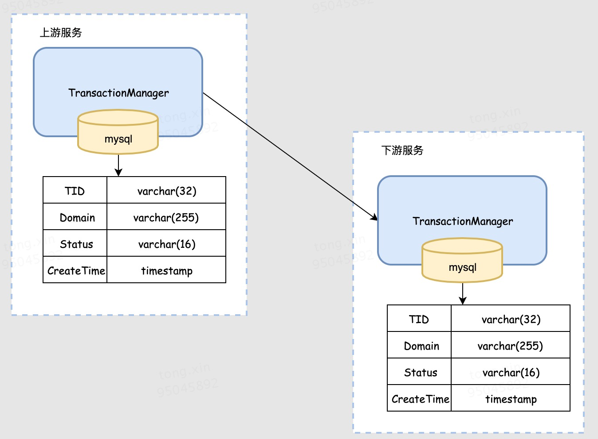

# 分布式事务

## 分布式事务理论

## 2PC

两阶段提交是指**2PC（two-phase commit protocol**）,2pc是一个非常经典的**强一致、中心化的原子提交协议**。这里所说的中心化是指协议中有两类节点：一个是中心化**协调者节点（coordinator）**和**N个参与者节点（partcipant）**。


第一阶段：事务管理器要求每个涉及到事务的数据库预提交(precommit)此操作，并反映是否可以提交.

第二阶段：事务协调器要求每个数据库提交数据，或者回滚数据。

### 第一阶段


就是在分布式事务的发起方在向分布式事务协调者（Coordinator）发送请求时，Coordinator首先会分别向参与者（Partcipant）节点A、参与这节点（Partcipant）节点B分别发送**事务预处理请求**，称之为**Prepare**，有些资料也叫"**Vote Request**"。

说的直白点就是问一下这些参与节点"**这件事你们能不能处理成功了**"，此时这些参与者节点一般来说就会打开本地数据库事务，然后开始执行数据库本地事务，但在执行完成后并不会立马提交数据库本地事务，而是先向Coordinator报告说：“我这边可以处理了/我这边不能处理”。

 如果所有的参与这节点都向协调者作了“**Vote Commit**”的反馈的话，那么此时流程就会进入第二个阶段了。

 ### 第二阶段 正常流程


如果所有参与者节点都向协调者报告说“我这边可以处理”，那么此时协调者就会向所有参与者节点发送“**全局提交确认通知（global_commit）**”，即你们都可以进行本地事务提交了，此时参与者节点就会完成自身本地数据库事务的提交，并最终将提交结果回复“ack”消息给Coordinator，然后Coordinator就会向调用方返回分布式事务处理完成的结果。

### 第二阶段：提交/执行阶段（异常流程）


相反，在第二阶段除了所有的参与者节点都反馈“我这边可以处理了”的情况外，也会有节点反馈说“我这边不能处理”的情况发生，此时参与者节点就会向协调者节点反馈“**Vote_Abort**”的消息。此时**分布式事务协调者节点**就会向所有的参与者节点发起事务回滚的消息（“**global_rollback**”），此时各个参与者节点就会回滚本地事务，释放资源，并且向协调者节点发送“ack”确认消息，协调者节点就会向调用方返回分布式事务处理失败的结果。

### 总结

总的来说，XA协议比较简单，成本较低，但是其单点问题，以及不能支持高并发(由于同步阻塞)依然是其最大的弱点。

优点：

> 简单，很简单。

缺点：

2PC 的核心目标是保证分布式事务的原子性（所有参与者要么全部提交，要么全部回滚），但其设计本身也带来了一系列显著的问题：

1. **同步阻塞（Blocking）**：
   - **问题描述**： 这是 2PC 最核心、最严重的缺点之一。在协议执行过程中，参与者在第一阶段（准备阶段）完成投票（发送 `Vote-Request` 响应）后，会**阻塞**并等待协调者最终的 `Global-Commit` 或 `Global-Abort` 命令。
   - 影响：
     - **资源锁定**： 在此期间，参与者为了保持事务状态（保证能提交或回滚），必须持有事务所涉及的所有资源（如数据库行锁、文件锁等）。其他试图访问这些资源的事务会被阻塞。
     - **性能瓶颈**： 如果协调者在发出 `Prepare` 请求后（或参与者投票后）发生故障、网络延迟或分区，所有参与者将长时间处于不确定的阻塞状态，无法释放资源。这会严重降低整个系统的并发吞吐量和响应时间。
     - **级联阻塞**： 一个被阻塞的事务可能持有其他事务需要的资源，导致阻塞效应在整个系统中蔓延。
2. **单点故障（Single Point of Failure - SPOF）**：
   - **问题描述**： 协调者扮演着协议的核心角色。如果协调者在决策（第二阶段）之前或决策过程中发生故障（崩溃、网络隔离），整个事务将陷入僵局。
   - 影响：
     - **第一阶段协调者故障**： 参与者已经投票（`Yes`）并进入阻塞状态，但协调者崩溃，没有发出第二阶段指令。参与者只能无限期等待或依赖超时机制（但这本身复杂且可能不一致）。
     - **第二阶段协调者故障**： 协调者可能已经做出决策（比如 `Commit`），但在发送给所有参与者之前崩溃。部分参与者可能收到了 `Commit` 并提交，部分没有收到。收到 `Commit` 的参与者提交后释放资源，但未收到的参与者仍处于阻塞状态。系统处于不一致状态（部分提交，部分未决）。
     - **恢复困难**： 虽然可以引入备份协调者，但准确恢复协调者的状态（特别是它是否已做出最终决策以及决策是什么）非常复杂且容易出错。
3. **数据不一致风险（Risk of Inconsistency）**：
   - **问题描述**： 在特定故障场景下，2PC 无法保证所有参与者最终达到一致的状态（都提交或都回滚）。
   - 典型场景：
     - **协调者与参与者网络分区**： 协调者做出 `Commit` 决策。网络分区导致部分参与者收到 `Commit` 并提交成功，另一部分参与者未收到指令（或只收到 `Prepare` 但未收到 `Commit`）。未收到 `Commit` 的参与者最终可能超时并自行回滚（导致部分提交部分回滚），或者永远阻塞。
     - **协调者故障后新协调者决策错误**： 如果协调者崩溃后选举了新协调者，新协调者需要询问参与者状态。但一个参与者在第一阶段投了 `Yes` 并处于阻塞状态，新协调者询问它时，它只能报告“已投票 `Yes` 但未收到最终指令”（`In-Doubt` 状态）。新协调者必须根据其他参与者的状态做决定。如果它错误地决定 `Abort`，而原协调者实际已决定 `Commit` 并且有参与者已经提交，就会导致不一致（部分提交部分回滚）。
   - **影响**： 这是最违背分布式事务初衷的问题，破坏了原子性保证，导致系统数据处于非预期状态，严重影响业务逻辑正确性。
4. **性能开销（Performance Overhead）**：
   - **问题描述**： 协议执行过程需要大量的网络通信和磁盘 I/O。
   - 影响：
     - **网络延迟**： 需要两轮广播（`Prepare` 和 `Commit`/`Abort`）以及相应的响应。在广域网或高延迟网络中，延迟显著增加。
     - **日志写入**： 为了保证协议自身的可靠性和故障恢复能力，协调者和参与者必须在关键点（如协调者发送 `Prepare` 前、参与者投票 `Yes` 后、协调者决策后、参与者执行 `Commit`/`Abort` 后）将状态持久化到日志（写磁盘）。这些同步写操作非常耗时。
     - **吞吐量限制**： 通信和日志开销限制了系统处理分布式事务的吞吐量。
5. **事务时间长导致的锁持有时间长**：
   - **问题描述**： 由于整个两阶段过程（网络通信、日志写入、可能的阻塞）耗时较长，参与者持有的资源锁（如数据库行锁）在整个协议执行期间都不能释放。
   - **影响**： 显著增加了资源争用和死锁的概率，进一步降低了系统的并发性能。长事务会放大这个问题。
6. **容错性不足（Limited Fault Tolerance）**：
   - **问题描述**： 协议本身对协调者故障的容忍度很低（见 SPOF）。虽然在参与者故障时，协调者可以根据超时和日志决定 `Abort`，但这仅限于发生在第一阶段（准备阶段之前或期间）。如果在第二阶段（提交阶段）参与者故障，情况会变得复杂。
   - **影响**： 需要额外的、复杂的恢复协议来处理各种故障组合场景，增加了实现的复杂性和潜在的不一致性风险。

## 3PC

3PC的过程分了三部分：

1. **canCommit**：是否有能力参与这次事务？是，进入下一步骤；否，退出

   

2. **preCommit**：协调者向参与者发送事务预提交，事务参与者开始执行事务操作，记录：undo、redo日志，发送消息给协调者：好了、好不了了

3. **doCommit**：commit事务 （如果长时间没有收到事务协调者的提交、回滚请求，超时机制：提交数据）

### 3PC 相比 2PC 的主要改进

1. **降低阻塞时间 & 增强系统可用性：**
   - **问题解决：** 2PC 的最大痛点在于参与者投票 `Yes` 后会**无限期阻塞**等待协调者指令。
   - 3PC 方案：引入了`PreCommit`阶段。
     - 如果协调者收到所有参与者的 `Yes` 投票，它会发送 `PreCommit` 消息（而非直接 `Commit`）。
     - 参与者收到 `PreCommit` 后，知道其他所有参与者也都投了 `Yes`，**事务最终一定会被提交**（除非协调者挂了且无法恢复）。
   - **效果：** 参与者进入 `PreCommit` 状态后，**不再无限期阻塞**。如果协调者故障或网络分区，参与者可以基于**超时机制**和自身状态**自动做出决定**（提交或中止），显著减少了阻塞时间和资源锁持有时间，提高了系统整体可用性。
2. **降低单点故障（协调者故障）的影响：**
   - **问题解决：** 2PC 中协调者崩溃可能导致参与者无限阻塞或数据不一致。
   - 3PC 方案：利用`PreCommit` 阶段提供的额外状态信息。
     - 参与者记录了自身状态（`Prepared` 或 `PreCommitted`）。
     - 引入了**参与者之间的通信机制**（或通过选举新协调者）。
   - 效果: 当协调者故障后：
     - 处于 `Prepared` 状态的参与者：知道尚未达成一致，可以安全超时后 `Abort`。
     - 处于 `PreCommitted` 状态的参与者：知道所有参与者都投了 `Yes`，可以安全超时后 `Commit`。
     - 新协调者可以查询参与者状态：如果**所有参与者**都处于 `PreCommitted` 状态，则新协调者可以发送 `DoCommit`；如果**有任何一个**处于 `Prepared` 状态，则可以发送 `Abort`。
   - **效果：** 大大降低了协调者故障导致系统僵局或**非预期不一致**的概率（虽然理论上仍存在特定边界情况下的不一致风险）。
3. **减少不确定性状态：**
   - **问题解决：** 2PC 中，参与者投 `Yes` 后进入 `In-Doubt` 状态，无法自主决策。
   - **3PC 方案：** `PreCommit` 阶段明确了事务的最终走向（只要进入 `PreCommitted`，提交就是确定的）。
   - **效果：** 参与者状态更清晰（`CanCommit?` -> `Prepared` -> `PreCommitted` -> `Committed`），减少了模糊状态，为故障恢复提供了更明确的依据。

### 3PC 仍然存在的缺陷

尽管 3PC 显著改进了 2PC，但它并非完美，也存在自身的问题：

1. **网络分区（Network Partition）下仍可能不一致：**
   - **问题描述：** 这是 3PC 最核心的缺陷。当发生**网络分区**（将参与者分成两个或多个无法通信的组），且分区发生时协调者恰好崩溃或处于关键状态时，**理论上仍可能发生数据不一致**。
   - 经典场景（协调者假死）：
     1. 协调者发送 `PreCommit` 给所有参与者。
     2. 部分参与者 `P1` 收到 `PreCommit` 并进入 `PreCommitted` 状态。
     3. 此时发生网络分区，协调者和另一部分参与者 `P2` 被隔离在一个分区中，`P1` 在另一个分区。
     4. `P1` 在分区内超时（未收到 `DoCommit`），根据协议它处于 `PreCommitted` 状态，于是**自行提交**。
     5. 协调者（或新选举的协调者）在它所在的分区发现 `P2` 没有响应或状态未知（可能还在等待 `PreCommit` 或 `DoCommit`），为了安全起见，它可能决定 `Abort` 事务，并通知 `P2` **回滚**。
   - **结果：** `P1` 提交了，`P2` 回滚了，**数据不一致！** 虽然发生概率较低（需要特定时序的分区和协调者崩溃），但理论上无法完全避免。
2. **性能开销更大：**
   - **问题描述：** 增加了一个网络通信轮次（`PreCommit`）。
   - **影响：** 相比 2PC，3PC 需要多一轮消息广播和确认。在低延迟网络中，这个开销相对较小；但在高延迟网络或大规模参与者场景下，**额外的网络延迟和资源消耗（CPU、带宽）** 会成为性能瓶颈，事务执行时间更长。
3. **实现更复杂：**
   - **问题描述：** 新增的状态（`Prepared`, `PreCommitted`）、更精细的状态转换逻辑、参与者之间的通信/协调机制（用于新协调者选举或状态查询）、更复杂的超时处理逻辑。
   - **影响：** 显著增加了协议的**实现难度、测试难度和维护成本**。状态机更复杂，日志记录点更多（每个状态转换都需要持久化日志以保证恢复），错误处理逻辑更繁琐。
4. **仍然存在协调者单点问题（虽缓解但未根除）：**
   - **问题描述：** 虽然 3PC 通过状态信息和超时机制极大缓解了协调者故障的影响（不再导致无限阻塞），但协调者仍然是协议执行的核心驱动点。
   - **影响：** 协调者故障后，选举新协调者和状态恢复过程本身**仍然存在延迟和复杂性**，并且在新协调者选举期间或状态恢复过程中，如果再次发生故障，情况会变得非常棘手。它降低了单点故障的破坏性，但没有消除单点本身。
5. **对时钟同步有更高要求：**
   - **问题描述：** 参与者依赖超时机制来自主决策（尤其是在 `PreCommitted` 状态超时后提交）。
   - **影响：** 如果不同参与者节点的**系统时钟偏差过大**，可能导致超时行为不一致，增加潜在的不确定性甚至不一致风险（尽管概率较低）。系统需要较好的时钟同步机制（如 NTP）。

## TCC (Try-Confirm-Cancel)

最早是由Pat Helland于2007年发表的一篇名为《Life beyond Distributed Transactions:an Apostate’s Opinion》的论文提出。
TCC事务机制相比于上面介绍的XA，解决了其几个缺点:

1. 解决了协调者单点，由主业务方发起并完成这个业务活动。业务活动管理器也变成多点，引入集群。
2. 同步阻塞:引入超时，超时后进行补偿，并且不会锁定整个资源，将资源转换为业务逻辑形式，粒度变小。
3. 数据一致性，有了补偿机制之后，由业务活动管理器控制一致性

### 过程

TCC编程模式本质上也是一种二阶段协议， 所有事务参与方都需要实现try、confirm/cancle接口。

- **Try阶段：**完成所有业务检查（一致性），预留业务资源(准隔离性)。 在这里承载了很大的工作，资源已经被冻结。不会被其他事务占用。
- **Confirm阶段：**确认执行业务操作，不做任何业务检查， 只使用Try阶段预留的业务资源。
- **Cancel阶段：**取消Try阶段预留的业务资源。


TCC事务处理流程和 2PC 二阶段提交类似，不过 2PC通常都是在跨库的DB层面，而TCC本质就是一个应用层面的2PC。

### 与2PC的区别


- **XA是资源层面的分布式事务，强一致性，在两阶段提交的整个过程中，一直会持有资源的锁。**

  XA事务中的两阶段提交内部过程是对开发者屏蔽的。而事务管理器在两阶段提交过程中，从prepare到commit/rollback过程中，资源实际上一直都是被加锁的。如果有其他人需要更新这两条记录，那么就必须等待锁释放。

- **TCC是业务层面的分布式事务，最终一致性，不会一直持有资源的锁。**

  TCC中的两阶段提交并没有对开发者完全屏蔽，也就是说从代码层面，开发者是可以感受到两阶段提交的存在。try、confirm/cancel在执行过程中，一般都会开启各自的本地事务，来保证方法内部业务逻辑的ACID特性。其中：

  - try过程的本地事务，是保证资源预留的业务逻辑的正确性。

  - confirm/cancel执行的本地事务逻辑确认/取消预留资源，以保证最终一致性，也就是所谓的`补偿型事务(Compensation-Based Transactions)`。


由于是多个独立的本地事务，因此不会对资源一直加锁。


### 实现TCC需要注意的点

1. 只要try阶段能成功，在confirm阶段一定能成功。这一点很重要，
2. 业务数据的可见性，就是在try阶段之后，confirm之前的状态下，如果其他事务需要读取被预留的资源数据，那么处于中间状态的业务数据该如何向用户展示，这是一个需要被考虑到的问题。比如说：用户在购买之前有200余额，第一个事务的try之后，要锁20块钱。如果在confirm阶段报错一直重试阶段，如何向用户显示余额的问题。
3. 业务数据的并发访问控制。


#### 事务悬挂 和 空Cancel

事务悬挂和空cancel是分布式事务场景下比较普遍，对于事务悬挂和空cancel可以在框架层面给出解决方案


***空cancel***: 上游服务对下游服务的try方法进行调用，在此时产生网络抖动等问题，导致try请求超时，上游服务调用cancel方法。此时网络恢复cancel方法先一步到达下游服务,下游服务需要成功执行空的cancel方法。

**事务悬挂:** 上游服务对下游服务的try方法进行调用，在此时产生网络抖动等问题，导致try请求超时，上游服务调用cancel方法。此时网络恢复cancel方法先一步到达下游服务，而try请求姗姗来迟，下游服务在cancel执行完成后执行了try方法。由于cancel已经执行完成，下游服务try方法中锁定的资源无法得到释放。

#### **解决方案**

其中一个方法是在TM中加入一张表，每当 try/confirm/cancel时，都根据TID(事务ID)对表内数据进行检索。(当然，这不是唯一的选择，甚至可能不会最好的选择。仔细探究的话，会发现，这种方式下，是不能完全保证事务悬挂都会被解决掉的。但是依旧不影响我们在线上大规模使用-每天十亿级别)

1. 如果已存在记录，则对记录中的status进行检查，如果status正确则继续执行，否则进入拒绝逻辑。
2. 如果未存在记录，则向表中插入一条记录，存放当前请求的TID、Domain、Status等信息。（如果不存在，就要插入，下面说明）


以空cancel这种方式（cancel请求先到）来举例说明：

1. 如果在库里没有查询到记录，就会在库里面插入一条记录。

   > 这里不能使用直接抛弃这次请求的方式，如果这样的话，后面的try到来了，因为没有记录。就会生成一条记录，会出现数据不一致，或者事务等待的情况出现。

2. 后面收到了try的请求，根据TID是可以查询到请求的，比对请求和查询到的status，会放弃这次请求。


#### Seata解决空回滚


如上图所示，全局事务开启后，参与者 A 分支注册完成之后会执行参与者一阶段 RPC 方法，如果此时参与者 A 所在的机器发生宕机，网络异常，都会造成 RPC 调用失败，即参与者 A 一阶段方法未成功执行，但是此时全局事务已经开启，Seata 必须要推进到终态，在全局事务回滚时会调用参与者 A 的 Cancel 方法，从而造成空回滚。

要想防止空回滚，那么必须在 Cancel 方法中识别这是一个空回滚，Seata 是如何做的呢？

Seata 的做法是新增一个 TCC 事务控制表，包含事务的 XID 和 BranchID 信息，在 Try 方法执行时插入一条记录，表示一阶段执行了，执行 Cancel 方法时读取这条记录，如果记录不存在，说明 Try 方法没有执行。

#### 幂等性设计


如上图所示，参与者 A 执行完二阶段之后，由于网络抖动或者宕机问题，会造成 TC 收不到参与者 A 执行二阶段的返回结果，TC 会重复发起调用，直到二阶段执行结果成功。

Seata 是如何处理幂等问题的呢？

同样的也是在 TCC 事务控制表中增加一个记录状态的字段 status，该字段有 3 个值，分别为：

1. tried：1
2. committed：2
3. rollbacked：3

二阶段 Confirm/Cancel 方法执行后，将状态改为 committed 或 rollbacked 状态。当重复调用二阶段 Confirm/Cancel 方法时，判断事务状态即可解决幂等问题。

#### Seata如何处理悬挂

悬挂指的是二阶段 Cancel 方法比 一阶段 Try 方法优先执行，由于允许空回滚的原因，在执行完二阶段 Cancel 方法之后直接空回滚返回成功，此时全局事务已结束，但是由于 Try 方法随后执行，这就会造成一阶段 Try 方法预留的资源永远无法提交和释放了。

那么悬挂是如何产生的呢？


如上图所示，在执行参与者 A 的一阶段 Try 方法时，出现网路拥堵，由于 Seata 全局事务有超时限制，执行 Try 方法超时后，TM 决议全局回滚，回滚完成后如果此时 RPC 请求才到达参与者 A，执行 Try 方法进行资源预留，从而造成悬挂。

Seata 是怎么处理悬挂的呢？

在 TCC 事务控制表记录状态的字段 status 中增加一个状态：

1. suspended：4

当执行二阶段 Cancel 方法时，如果发现 TCC 事务控制表没有相关记录，说明二阶段 Cancel 方法优先一阶段 Try 方法执行，因此插入一条 status=4 状态的记录，当一阶段 Try 方法后面执行时，判断 status=4 ，则说明有二阶段 Cancel 已执行，并返回 false 以阻止一阶段 Try 方法执行成功。

#### **二阶段（Confirm/Cancel）请求失败问题**

在 TCC（Try-Confirm-Cancel）模式中，若**一阶段（Try 阶段）成功**，但**某个下游服务未收到二阶段（Confirm/Cancel）请求**，会导致该服务处于**不一致的中间状态**（资源被预留但未确认或释放）。

##### 方案 1：**事务协调器（TC）的重试机制**

- **原理**
  TC 持久化记录事务状态（Try 成功 → 需触发 Confirm），并**异步重试**未完成的二阶段操作。

- 关键设计：

  - **重试队列**：将失败的 Confirm/Cancel 操作放入延迟队列，按指数退避策略重试。
  - **幂等性**：下游服务需保证 **Confirm/Cancel 操作的幂等性**（相同事务 ID 重复调用不改变结果）。

- 示例：

  ```java
  // 下游服务 Confirm 接口（幂等实现）
  @Transactional
  public void confirm(String txId) {
      // 1. 检查事务日志表
      if (txLogRepository.existsByTxIdAndStatus(txId, "CONFIRMED")) {
          return; // 已执行，直接返回
      }
      // 2. 执行业务逻辑（如解冻资金）
      accountService.unfreezeBalance(txId);
      // 3. 更新事务状态
      txLogRepository.save(new TxLog(txId, "CONFIRMED"));
  }
  
  ```

##### 方案 2：**事务状态恢复服务（Transaction Recovery Service）**

- **原理**
  部署独立服务，定时扫描**滞留的 Try 成功记录**，主动触发二阶段操作。

- 扫描策略：

  - 状态表设计：

    | 事务ID | 主业务服务 | 当前状态    | 最后更新时间        |
    | ------ | ---------- | ----------- | ------------------- |
    | TX1001 | OrderSvc   | TRY_SUCCESS | 2023-10-01 12:00:00 |

  - 恢复逻辑：

    ```sql
    -- 扫描滞留超过 N 分钟的事务
    SELECT * FROM tx_status WHERE status = 'TRY_SUCCESS'   AND last_updated < NOW() - INTERVAL '5 MINUTES';
    ```

##### 方案 3：**下游服务主动查询**

- **原理**
  下游服务在 Try 阶段后，若长时间未收到 Confirm/Cancel，**主动向 TC 查询事务状态**。

- 实现要点：

  - Try 阶段返回给下游服务的响应中包含 **TC 状态查询接口 URL**（如 `https://tc-service/status/{txId}`）。

  - 下游服务设置定时任务查询状态，例如：

    ```java
    def check_tx_status(tx_id):
        status = http.get(f"https://tc-service/status/{tx_id}")
        if status == "CONFIRMED":
            confirm(tx_id)
        elif status == "CANCELLED":
            cancel(tx_id)
    ```

##### 方案 4：**最终一致性兜底：对账系统**

- **适用场景**
  重试机制失效时（如数据永久丢失），通过离线对账修复数据。

- 操作步骤：

  1. **对账任务**：每30min扫描 Try 成功但未 Confirm/Cancel 的记录。

  2. **业务校验**：检查预留资源是否仍需生效（如订单是否已支付超时）。

  3. 人工干预：自动修复或通知运维处理。

     ```sql
     -- 对账SQL示例：查找未完成的库存预留
     SELECT o.order_id, i.locked_quantity
     FROM orders o
     JOIN inventory_locks i ON o.tx_id = i.tx_id
     WHERE o.status = 'PAYING' 
       AND o.create_time < NOW() - INTERVAL '1 DAY';
     
     ```

#### TCC 模式的优点

1. **高并发性能**
   - **异步化设计**：Try 阶段仅预留资源（如冻结资金），Confirm/Cancel 阶段可异步执行，避免长事务阻塞。
   - **减少锁竞争**：资源在 Try 阶段被**局部锁定**（非全局锁），降低死锁概率。例：电商下单时，库存 Try 阶段仅锁定 10 件库存，而非阻塞整个库存表。
2. **高可用性**
   - **故障容忍**：任一服务失败可通过 Cancel 回滚或重试机制恢复，无 2PC 的同步阻塞问题。
   - **服务自治**：各服务自行实现 TCC 接口，不依赖全局事务管理器（如 Seata 的 TC 仅协调不执行业务）。
3. **数据最终一致性保障**
   - **补偿机制兜底**：Cancel 操作提供业务回滚能力，结合重试+对账，确保数据最终一致。
4. **业务灵活性**
   - **可定制资源预留策略**：Try 阶段可按业务需求设计预留逻辑（如部分冻结、阶梯冻结）。例：跨境支付中 Try 阶段冻结汇率，Confirm 阶段按锁定汇率结算。

#### TCC 模式的缺点

1. **开发复杂度高**

   - **业务侵入性强**：需为每个事务**人工拆解** Try/Confirm/Cancel 逻辑，代码量增加 2-3 倍。
   - **状态机维护**：需记录事务状态（如 `try_success`、`confirmed`），增加存储与查询开销。

2. **设计难度大**

   **幂等性强制要求**：Confirm/Cancel 必须支持重复调用（网络重试可能导致多次触发）。

   - **空回滚问题**：Try 未执行时收到 Cancel 需跳过业务逻辑（需记录 Try 是否执行）。
   - **防悬挂问题**：Cancel 比 Try 先到达时，需丢弃后续 Try 请求。

3. **资源长期占用风险**

   - Try 阶段预留的资源（如冻结资金）需设置超时释放，否则可能造成资源死锁。

4. **运维成本高**

   - 需部署**事务协调器**（如 Seata TC）和**对账系统**，监控滞留事务。

#### TCC 的适用场景

1. 高并发短事务: 电商秒杀（库存冻结）、票务抢购。
2. 可以自定义资源隔离的业务
   - 金融场景：资金冻结（Try）、实际扣款（Confirm）、解冻（Cancel）。
   - 混合支付：组合优惠券+余额，Try 阶段并行锁定多账户。
3. 强一致性要求较高的场景
   - 跨行转账：Try 阶段验证双方账户，Confirm 执行转账。
4. 跨异构系统事务
   - 订单创建（MySQL）→ 发券（Redis）→ 消息通知（Kafka），各系统实现 TCC 接口。

#### **不适用场景**：

1. 老系统改造：业务无法拆分 Try/Confirm/Cancel 时（如依赖存储过程）。
2. 长周期事务：物流跟踪（耗时数天），资源预留超时风险高。
3. 无法提供幂等的服务：第三方接口不支持重试或状态查询。


## SAGA模式

Saga 模式是一种分布式异步事务，保证最终一致性事务，隶属于柔性事务的一种。Saga 事务模型又叫做长时间运行的事务（Long-running-transaction）, 它是由普林斯顿大学的 H.Garcia-Molina 等人提出，它描述的是另外一种在没有两阶段提交的的情况下解决分布式系统中复杂的业务事务问题。


**每个 Saga 由一系列 sub-transaction Ti （子事务、也叫分支事务）组成**，每个 Ti  都有对应的**补偿动作 Ci**，补偿动作用于撤销 Ti 造成的结果。可以看到，和 TCC 相比，Saga 没有“资源预留”动作，它的 Ti 就是直接提交到库。Saga 事务的执行顺序有两种：

1. （**正常情况下，一阶段流程**）T1, T2, T3, ..., Tn
2. （**异常情况下，一阶段 + 补偿流程**）T1, T2, ..., Tj, Cj,..., C2, C1，其中 0 < j <= n

Saga 定义了**两种恢复策略：**

1. **backward recovery，逆序回滚**：即上面提到的第二种执行顺序，其中 j 是发生错误的 sub-transaction，这种做法的效果是撤销掉之前所有成功的 sub-transation，使得整个 Saga 的执行结果撤销。
2. **forward recovery，向前重试**：适用于必须要成功的场景，执行顺序是类似于这样的：T1, T2, ..., Tj (失败), Tj (重试),..., Tn，其中 j 是发生错误的 sub-transaction，该情况下不需要 Ci。

### 强制要求

#### 一、核心强制要求（违反将导致系统不可用）

##### 1. **补偿操作必须幂等**

```java
// 错误示例：非幂等补偿（重复调用导致余额错误）
public void refund(Long userId, BigDecimal amount) {
    accountDao.addBalance(userId, amount); // 重复调用会导致多次退款
}

// 正确示例：通过事务ID保证幂等
public void refund(String sagaId, Long userId, BigDecimal amount) {
    if (compensationLog.exists(sagaId)) return; // 幂等校验
    accountDao.addBalance(userId, amount);
    compensationLog.save(sagaId); // 记录执行状态
}

```

**原因**：网络重试、系统重启可能导致补偿操作重复调用。

##### 2. **补偿操作必须可交换（Commutative）**

**规则**：

- 若事务执行序列：A → B → C
- 补偿序列必须满足：**Comp-C → Comp-B → Comp-A**
  （与执行顺序严格相反，且任意两步可交换顺序执行）

##### 3. **必须显式定义事务边界**

```yaml
# SAGA事务定义示例（Apache Camel Saga）
- id: order_flow
  steps:
    - name: reserve_inventory
      compensation: release_inventory  # 必须显式声明补偿操作
    - name: charge_payment
      compensation: refund_payment    # 每个操作需配对补偿

```

**禁止**：依赖数据库自动回滚（如JDBC事务），补偿操作需业务编码实现。

------

#### 二、数据一致性强制要求

##### 1. **业务数据需携带事务状态**

```sql
ALTER TABLE orders ADD COLUMN saga_status ENUM('PENDING','SUCCEEDED','COMPENSATED');
```

**原因**：补偿过程中断电时，重启后需能判断数据状态。

##### 2. **必须记录全局事务日志**

```sql
CREATE TABLE saga_log (
  saga_id VARCHAR(64) PRIMARY KEY,
  current_step VARCHAR(32) NOT NULL,
  status ENUM('EXECUTING','COMPENSATING','FAILED'),
  created_time TIMESTAMP DEFAULT CURRENT_TIMESTAMP
);

```

**记录点**：每个事务步骤的开始/结束、补偿触发点。

------

#### 三、运维层面强制要求

##### 1. **必须实现超时中断机制**

```java
// 事务执行超时控制（示例）
sagaCoordinator.start("create_order")
    .withTimeout(30, TimeUnit.SECONDS)  // 必须设置超时
    .step(orderService::create)
    .step(inventoryService::reserve);

```

**超时阈值**：通常为最长业务操作的 **2-3倍**。

##### 2. **必须暴露事务状态查询接口**

```java
@GetMapping("/saga/status/{sagaId}")
public SagaStatus getStatus(@PathVariable String sagaId) {
    return sagaRepository.findById(sagaId); // 运维可通过API查询状态
}
```

**必要性**：人工介入补偿失败的先决条件。

### 情景模拟

假设我们的服务逻辑架构是这个样子，现在我们的购买逻辑需要调用不同的远程服务完成：

.svg)

如果钱包服务发现余额不足，那么已经创建的订单该如何取消？

更糟的是，如果库存不足，我们需要回滚用户的扣款与订单，如果之前除了订单与钱包服务，还有其他的一些操作，我们通通都需要回滚。**因为我们需要保证数据的正确性，以及最终状态的一致。**

#### **解决方案**

基于我们叙述过的 Saga 事务模式，我们将购买逻辑抽象为一个全局事务：globalPurchaseTransaction，我们将三个子服务抽象为三个子事务：createOrder（cancelOrder）、payOrder（rollbackPayment）、deliverProduct（cancelDelivery），其中括号里是三个子事务的补偿方法。

那么，我们理想情况下的业务逻辑应该是：globalPurchaseTransaction 发起全局事务，全局事务顺序调用三个子事务的一阶段方法，**createOrder -> payOrder -> deliverProduct** 后完成业务逻辑；

如果 deliverProduct 出现异常，则回滚流程为：**createOrder -> payOrder -> deliverProduct -> cancelDelivery -> rollbackPayment -> cancelOrder，**流程图如下：

.svg)


如果创建订单异常，一般情况下，我们期望能够继续重试业务逻辑，而不是直接丢弃订单向用户返回失败，则整个流程应该向前继续重试：

**createOrder（异常） -> createOrder -> payOrder -> deliverProduct，**流程图如下：

.svg)

### 实现方案

#### **Saga分布式事务协调**

上面介绍了Saga的概念和事务恢复方式，每个事务存在多个子事务，每个子事务都有一个补偿事务，其在事务回滚的时候使用。由于子事务对应的操作在分布式的系统架构中会部署在不同的服务中，这些子事务为了完成共同的事务需要进行协同。

实际上在启动一个Saga事务时，协调逻辑会告诉第一个Saga参与者，也就是子事务，去执行本地事务。事务完成之后Saga的会按照执行顺序调用Saga的下一个参与的子事务。这个过程会一直持续到Saga事务执行完毕。

如果在执行子事务的过程中遇到子事务对应的本地事务失败，则Saga会按照相反的顺序执行补偿事务。通常来说我们把这种Saga执行事务的顺序称为个Saga的协调逻辑。这种协调逻辑有两种模式，编排（Choreography）和控制（Orchestration）分别如下：

**编排（Choreography）**：参与者（子事务）之间的调用、分配、决策和排序，通过交换事件进行进行。是一种去中心化的模式，参与者之间通过消息机制进行沟通，通过监听器的方式监听其他参与者发出的消息，从而执行后续的逻辑处理。由于没有中间协调点，靠参与靠自己进行相互协调。

**控制（Orchestration）**：Saga提供一个控制类，其方便参与者之前的协调工作。事务执行的命令从控制类发起，按照逻辑顺序请求Saga的参与者，从参与者那里接受到反馈以后，控制类在发起向其他参与者的调用。所有Saga的参与者都围绕这个控制类进行沟通和协调工作。

下面通过一个例子来介绍这两种协调模式，假设有一个下单的业务，从订单服务的创建订单操作发起，会依次调用支付服务中的支付订单，库存服务中的扣减库存以及发货服务中的发货操作，最终如果所有参与者（服务）中的操作（子事务）完成的话，整个下单事务就算完成。

#### 事件/编排Events/Choreography

**编排（Choreography）**，由于没有中心的控制类参与参与者操作之间的协调工作，因此通过消息发送的方式进行协调。


1. “订单服务”中执行“创建订单”操作，此时会发送一个“创建订单消息”到队列中。
2. “支付服务”监听到队列中的这个订单消息，调用“支付订单”的操作，同时也发送“只服务消息”到队列中。
3. “库存服务”在监听到“支付消息”之后会进行“扣减库存”的处理，并且发送“扣减库存消息”等待下一个消费者接受。
4. “发货服务”作为整个事务的最后一个子事务，在接到“扣减库存消息”以后会执行发货的子事务，完成事务以后会给“订单服务”发送“发货消息”，订单服务在接受到消息以后完成整个事务闭环，并且提交。

上面说的是事务执行成功的情况，如果事务执行失败那应该如何处理？


1. 假设在执行“发货”时子事务失败了，会发送“发货失败消息”。
2. 库存服务在接受到“发货失败消息”之后会执行“回滚库存”的操作，该操作将原来扣减的库存加回去，同时发送“扣减失败消息”。
3. “支付服务”在接受到“扣减失败消息”之后会执行“回滚支付”，进行退款的操作，同时发送“支付失败消息”。订单服务在接受到该消息以后将下单事务标记为失败。

##### **编排的优点**：

简单：每个子事务进行操作时只用发布事件消息，其他子事务监听处理。

松耦合：参与者（服务）之间通过订阅事件进行沟通，组合会更加灵活。

##### **当然也有一些缺点**：

理解困难：没有对业务流程进行完整的描述，要了解整个事务的执行过程需要通过阅读代码完成。增加开发人员理解和维护代码的难度。

存在服务的循环依赖：由于通过消息和事件进行沟通，参与者之间会存在循环依赖的情况。也就是A服务调用B服务，B服务又调用A服务的情况。这也增加了架构设计的复杂度，在设计初期需要认真考虑。

紧耦合风险：每个参与者执行的方法都依赖于上一步参与者发出的消息，但是上一步的参与者的所有消息都需要被订阅，才能了解参与者的真实状态，无形中增加了两个服务的耦合度。

#### Saga的命令/协调模式

**控制（Orchestration）**，其核心是定义一个控制类，它会告诉参与者（服务）应该执行哪些操作（子事务）。 Saga控制类通过命令以及异步回复的方式与参与者进行交互。


1. 订单服务执行下单事务时，向Saga协调器发送请求命令，Saga协调器接受到命令以后按照子事务执行的顺序调用服务中的方法。
2. 最开始执行“支付订单”的操作，调用“支付服务”中的“支付订单”操作，并且通过虚线的部分返回执行结果“支付完成”。
3. 接下来，执行“库存服务”中的“扣减库存”方法，同样通过虚线部分返回扣减完成的消息给“请求反馈“模块。
4. 紧接着就是执行“发货“命令，调用”发货服务“中的”发货“方法，并且返回”发货完成“的响应。
5. 最后，三个子事务都执行完毕以后，返回订单服务，完成整个分布式事务。

介绍完成成功完成事务之后，再来看看出现异常的情况。

如图6所示：


1. 在执行“发货”命令时发现“发货失败”，于是“发货服务”反馈给Saga协调器。
2. 此时协调器调用“库存服务”中的“回滚库存”操作，将扣减的库存恢复。
3. 然后调用“支付服务”中的“回滚支付”完成支付退款的工作。
4. 最后，通知订单服务事务处理失败。

需要指出的是控制模式也是基于事件驱动的，与编排模式一样会发送消息通知参与者执行命令，上面两个图中命令的执行和调用也是通过消息的方式进行。

##### **控制器设计的优点：**

**避免循环依赖：**在编排模式中存在参与者之间的循环调用，而中心控制类的方式可以避免这种情况的发生。

**降低复杂性：**所有事务交给控制器完成，它负责命令的执行和回复的处理，参与者只需要完成自身的任务，不用考虑处理消息的方式，降低参与者接入的复杂性。

**容易测试：**测试工作集中在集中控制类上，其他服务单独测试功能即可。

**容易扩展：**如果事务需要添加新步骤，只需修改控制类，保持事务复杂性保持线性，回滚更容易管理。

##### **控制器设计的缺点**：

**依赖控制器：**控制器中集中太多逻辑的风险。

**增加管理难度：**这种模式除了管理各个业务服务以外，还需要额外管理控制类服务，无形中增加了管理的难度和复杂度。而且存在单点风险，一旦控制器出现问题，整个业务就处于瘫痪中。

#### SAGA 对于ACID的保证

Saga对于ACID的保证和TCC一样：

- 原子性（Atomicity）：正常情况下保证。
- 一致性（Consistency），在某个时间点，会出现A库和B库的数据违反一致性要求的情况，但是最终是一致的。
- 隔离性（Isolation），在某个时间点，A事务能够读到B事务部分提交的结果。
- 持久性（Durability），和本地事务一样，只要commit则数据被持久。

Saga不提供ACID保证，因为原子性和隔离性不能得到满足。原论文描述如下：

>  full atomicity is not provided. That is, sagas may view the partial results of other sagas

通过saga log，saga可以保证一致性和持久性。

>  因为saga事务没有准备阶段，事务没有隔离，如果两个saga事务同时操作同一资源就会遇到我们操作多线程临界资源的的情况。因此会产生更新丢失，脏数据读取等问题。

####  和TCC对比

Saga相比TCC的缺点是缺少预留动作，导致补偿动作的实现比较麻烦：Ti就是commit，比如一个业务是发送邮件，在TCC模式下，先保存草稿（Try）再发送（Confirm），撤销的话直接删除草稿（Cancel）就行了。而Saga则就直接发送邮件了（Ti），如果要撤销则得再发送一份邮件说明撤销（Ci），实现起来有一些麻烦。

如果把上面的发邮件的例子换成：A服务在完成Ti后立即发送Event到ESB（企业服务总线，可以认为是一个消息中间件），下游服务监听到这个Event做自己的一些工作然后再发送Event到ESB，如果A服务执行补偿动作Ci，那么整个补偿动作的层级就很深。

不过没有预留动作也可以认为是优点：

- 有些业务很简单，套用TCC需要修改原来的业务逻辑，而Saga只需要添加一个补偿动作就行了。
- TCC最少通信次数为2n，而Saga为n（n=sub-transaction的数量）。
- 有些第三方服务没有Try接口，TCC模式实现起来就比较tricky了，而Saga则很简单。
- 没有预留动作就意味着不必担心资源释放的问题，异常处理起来也更简单（请对比Saga的恢复策略和TCC的异常处理）。

#### 注意事项

对于服务来说，实现Saga有以下这些要求：

1. **Ti和Ci是幂等的。**
2. **Ci必须是能够成功的，如果无法成功则需要人工介入。**
3. **Ti - Ci和Ci - Ti的执行结果必须是一样的：sub-transaction被撤销了。**

第一点要求Ti和Ci是幂等的，举个例子，假设在执行Ti的时候超时了，此时我们是不知道执行结果的，如果采用forward recovery策略就会再次发送Ti，那么就有可能出现Ti被执行了两次，所以要求Ti幂等。如果采用backward recovery策略就会发送Ci，而如果Ci也超时了，就会尝试再次发送Ci，那么就有可能出现Ci被执行两次，所以要求Ci幂等。

第二点要求Ci必须能够成功，这个很好理解，因为，如果Ci不能执行成功就意味着整个Saga无法完全撤销，这个是不允许的。但总会出现一些特殊情况比如Ci的代码有bug、服务长时间崩溃等，这个时候就需要人工介入了。

第三点乍看起来比较奇怪，举例说明，还是考虑Ti执行超时的场景，我们采用了backward recovery，发送一个Ci，那么就会有三种情况：

1. Ti的请求丢失了，服务之前没有、之后也不会执行Ti
2. Ti在Ci之前执行
3. Ci在Ti之前执行

第1种情况容易处理。对于第2、3种情况，则要求Ti和Ci是可交换的（commutative)，并且其最终结果都是sub-transaction被撤销。


## 引用

> [再有人问你分布式事务，把这篇扔给他][3]
> [6.0 柔性事务 ：TCC两阶段补偿型][4]


[3]:https://juejin.im/post/6844903647197806605
[4]:http://www.tianshouzhi.com/api/tutorials/distributed_transaction/388
