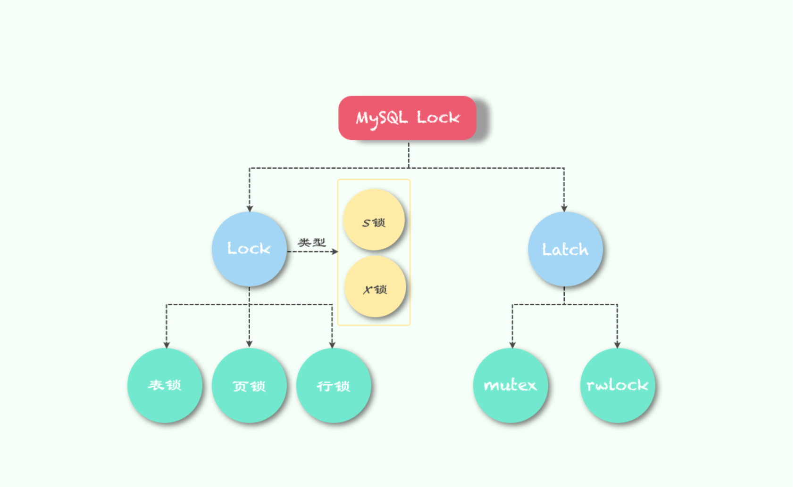
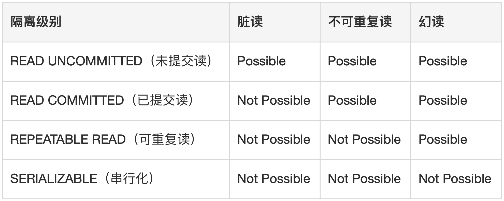

# 本地事务

本文尽量把这些事情讲清楚：

1. 事务是什么以及其特征
2. MySQL的事务是怎样保证的
3. 锁都有哪些，什么场景下会有什么变化
4. Spring是怎么跟事务交互的

# 0.引入

## 0.1 事务

### 0.1.1 事务起源

事务(Transaction)是访问并可能更新数据库中各种数据项的一个程序执行单元(unit)。在关系数据库中，一个事务由一组SQL语句组成。事务应该具有4个属性：原子性、一致性、隔离性、持久性。这四个属性通常称为ACID特性。

- **<u>原子性（atomicity）：</u>**一个事务是一个不可分割的工作单位，事务中包括的诸操作要么都做，要么都不做。
- **<u>一致性（consistency）：</u>**事务必须是使数据库从一个一致性状态变到另一个一致性状态，事务的中间状态不能被观察到的。
- **<u>隔离性（isolation）：</u>**一个事务的执行不能被其他事务干扰。即一个事务内部的操作及使用的数据对并发的其他事务是隔离的，并发执行的各个事务之间不能互相干扰。隔离性又分为四个级别：读未提交(read uncommitted)、读已提交(read committed，解决脏读)、可重复读(repeatable read，解决虚读)、串行化(serializable，解决幻读)。
- **<u>持久性（durability）：</u>**持久性也称永久性（permanence），指一个事务一旦提交，它对数据库中数据的改变就应该是永久性的。接下来的其他操作或故障不应该对其有任何影响。

### 0.1.2 事务的状态

数据库大概存在以下几个事务的状态：

- **<u>*活动的（active）*</u>** 事务对应的数据库操作正在执行过程中时，则称该事务处在活动的状态
- **<u>*部分提交（partially committed）*</u>** 当事务中的最后一个操作执行完成时，但由于操作都在内存中执行，所造成的影响并没有刷新到磁盘，我们将该事务状态称为部分提交
- **<u>*失败的（failed）*</u>** 当事务处于活动的或部分提交的状态时，如果遇到某些错误（数据库自身的错误、操作系统错误或直接断电等）而无法继续执行，或者人为停止当前事务的执行，我们就说该事务处于失败的状态
- **<u>*中止的（aborted）*</u>** 
  如果事务执行了半截而变为失败的状态，那么这时候应该已经对数据库中的数据造成了一些影响，而这些影响当然是要撤销的（也被称为回滚）。当回滚操作执行完毕后，也就是数据库恢复到了执行事务之前的状态，我们就说该事务处在了中止状态
- **<u>*提交的（committed）*</u>** 
  当一个处于部分提交的事务将修改过的数据同步到磁盘上后，我们就说该事务处于提交的状态。


活动的部分提交的失败的提交的中止的遇到错误或手动停止最后一个操作执行完刷盘出错刷盘成功回滚成功。

原子性需要保证一个事务中的操作，要么全部执行成功，要么都不成功，那么如果在事务执行失败时，或者人为想撤回修改时，把已经做的进行回滚

任何事务机制在实现时，都应该考虑事务的ACID特性，包括：本地事务、分布式事务。

## 0.2 锁

锁的类型可以大致分为以下场景：



.png)

本文主要介绍lock，也就是事务上的锁相关的内容。

### 0.2.1 锁的粒度

锁粒度主要是按照数据的维度来划分的，包括表锁、页锁、行锁。MySQL不同的存储引擎支持的锁粒度是不同的：

.png)

本文主要介绍InnoDB相关的锁。

### 2.2 意向锁

上节提到InnoDB 支持多种粒度的锁，也就是行锁和表锁。为了支持多粒度锁定，InnoDB 存储引擎引入了意向锁（Intention Lock）。

那什么是意向锁呢？我们在这里可以举一个例子：**如果没有意向锁，当已经有人使用行锁对表中的某一行进行修改时，如果另外一个请求要对全表进行修改，那么就需要对所有的行是否被锁定进行扫描，在这种情况下，效率是非常低的；不过，在引入意向锁之后，当有人使用行锁对表中的某一行进行修改之前，会先为表添加意向排他锁（IX），再为行记录添加排他锁（X），在这时如果有人尝试对全表进行修改就不需要判断表中的每一行数据是否被加锁了，只需要通过等待意向排他锁被释放就可以了。**

### 2.3 锁的兼容性

对数据的操作其实只有两种，也就是读和写，而数据库在实现锁时，也会对这两种操作使用不同的锁；InnoDB 实现了标准的行级锁，也就是共享锁（Shared Lock）和排他锁（Exclusive Lock）。

- 共享锁（读锁、S锁），允许事务读一行数据。
- 排他锁（写锁、X锁），允许事务删除或更新一行数据。

而它们的名字也暗示着各自的另外一个特性，共享锁之间是兼容的，而排他锁与其他任意锁都不兼容：

.png)

### 2.4 行锁的算法

1. **<u>Record Lock：</u>**行锁，单个行记录上的锁。
2. **<u>Gap Lock：</u>**间隙锁，锁定一个范围，但不包括记录本身。<u>GAP锁的目的，是为了防止幻读、防止间隙内有新数据插入、防止已存在的数据更新为间隙内的数据。</u>
3. **<u>Next-Key Lock：</u>**1+2，锁定一个范围，并且锁定记录本身。对于行的查询，都是采用该方法，<u>主要目的是解决幻读的问题。InnoDB默认加锁方式是next-key 锁。</u>

### 2.5 自增锁

<u>InnoDB存储引擎中，除了表锁、行锁外，还有一种特殊的锁是自增锁。**当表的主键为自增列时，多个并发事务通过自增锁来保证自增主键不会出现重复等现象。**</u>

首先对自增长的insert语句分类：

| 插入类型       | 说明                                                         |
| -------------- | ------------------------------------------------------------ |
| insert-like    | 所有的插入语句，如insert，replace，insert .. select等        |
| simple inserts | 插入前就能确定行数的语句。例如insert、replace（不包括insert .. on duplicate key update) |
| bulk inserts   | 插入前无法确定行数的语句。例如insert ... select, replace .. select ,load data |
| mixed inserts  | 插入语句中，一部分是自增长的，一部分是确定的。如insert into t1(c1,c2) values(1,'a'),(NULL,'b'); |

MySQL中通过参数**innodb_autoinc_lock_mode**控制自增锁的行为，其可选值为0、1、2：

| **innodb_autoinc lock_mode** | 说明                                                         |
| ---------------------------- | ------------------------------------------------------------ |
| 0                            | 此时自增锁是表锁级别的，并发度最低。insert-like语句都需要加锁，在SQL执行完成或者回滚后才会释放（不是在事务完成后），这种情况下对自增锁的并发竞争是比较大的 |
| 1                            | 此种情况下，并发度居中。对simple inserts语句做了优化，在获取到锁后，立即释放，不必再等待SQL执行完成。而对于bulk inserts语句仍然使用表级别的锁，等待SQL执行完后释放。 |
| 2                            | 此种情况下，并发度最高。insert-like语句不会使用表级别的自增锁，而是通过互斥量产生。多条语句可同时执行。但是在binlog日志为基于语句格式场景下，会出现主从不一致的现象。 |

# 1. MySQL事务实现

## 1.1 原子性保证

### 1.1.1 如何保证原子性

#### 1). undo log 引入

为了保证事务执行失败或人为撤销修改时，对数据库的修改也撤回，则需要知道事务执行过程中，到底对数据库做了那些修改，也就是需要我们有机制保证每当我们要对一条记录做改动时（这里的改动可以指INSERT、DELETE、UPDATE）把回滚时所需的东西都给记下来，比如：

- <u>你插入一条记录时，至少要把这条记录的主键值记下来，之后回滚的时候只需要把这个主键值对应的记录删掉就好了</u>
- <u>你删除了一条记录，至少要把这条记录中的内容都记下来，这样之后回滚时再把由这些内容组成的记录插入到表中就好了</u>
- <u>你修改了一条记录，至少要把修改这条记录前的旧值都记录下来，这样之后回滚时再把这条记录更新为旧值就好了</u>

而这些信息，就称为undo日志。

#### 2). 事务ID

由于一个事务会包含多个操作，则需要有一个东西串起事务执行的流程，这就是事务ID，如果某个事务执行过程中对某个表执行了增、删、改操作，那么InnoDB存储引擎会给它分配一个独一无二的事务id。

好了，有了事务ID，那到底如何串起对记录的修改呢，下面看下事务ID到底会和记录有啥关系。

.svg)

说明：

- **记录的额外信息：** 为了描述一条行记录而不得不加的额外信息，主要分为变长字段长度列表、NULL值列表和记录头信息三大类，与理解本文无关，可忽略
- **row_id**：隐藏列，如果行记录无主键或唯一索引，则innoDB默认加的一个行唯一标识，与理解本文无关，可忽略
- **trx_id**：隐藏列，事务ID
- **roll_pointer**：指向undo日志的指针
- **列数据：** 真正的用户数据，与理解本文无关，可忽略

#### 3). undo日志与行记录的关系

实际上在设计InnoDB的事务机制时，分情况，有很多中undo日志，我们以update操作为例（这个Update不更新主键也不更新用户列占用空间的大小）

准备工作：测试表

```sql
CREATE TABLE undo_demo (
    id INT NOT NULL,
    key1 VARCHAR(100),
    col VARCHAR(100),
    PRIMARY KEY (id),
    KEY idx_key1 (key1)
)Engine=InnoDB CHARSET=utf8;
```

假设已经插入一条记录:

```
INSERT INTO `undo_demo` (`id`, `key1`, `col`) VALUES(1, 'F22', '猛禽');
```

.svg)

开始更新：做一次数据更新

```
update undo_demo set key1='J20', col='威龙' where id = 1;
```

.svg)

可以看出，执行完更新操作后，它对应的UNDO日志与插入的undo日志串成了一个链表，这初步形成了版本链

#### 4). 从undo日志格式来看版本链

更新数据undo日志中存储的信息

.svg)

说明：

- *<u>每条undo日志中均存在一个old_roll_pointer，指向当前undo日志的前一条日志（插入类型的undo日志的old_roll_pointer为空）</u>*
- *<u>undo日志会记录具体是那条记录被更新（主键列及值）</u>*
- *<u>undo日志会记载被更新列及对应的值</u>*

**小结**：如果一个事务执行过程中出现错误，或者认为中止事务，mysql会基于当前事务ID，找到上一个版本的undo日志，执行事务回滚，保证原子性。



Tips：通过undo日志串起的版本链不仅仅用于事务回滚，后面还有大用！




实际上undo日志没有我们想象的那么简单，MySQL的设计者为了更好的利用存储空间，几乎针对不同的数据库变更场景，都设计了单独的undo日志格式，当然主要分为两大类：insert undolog，update undo log

- insert undo log：在日志格式上，insert undo log只记录了新增记录的主键列和值，并未记录新增记录的各列和值。

   - 为啥呢？我们要知道undo日志很大部分功能是为了回滚来做的，站在这个角度思考，数据插入要回滚，只需要知道插入的那条数据，然后删掉就好；
   - 当然了undo日志还与后面的MVCC有关系，但是MVCC模式下，实际上插入日志作为记录的最老版本，不会作为MVCC版本来使用，事务提交后，insert的undo日志就没用了，会被重用。

- update undo log：这个是广义的update操作带来的undo日志，实际上update undo日志分为是否更新主键、不更新主键的话，用户列对应的存储空间是否发生变更、删除操作，都会产生一条或多条undo日志

  - 删除操作：删除操作实际上会在底层有两个动作，第一步是将行记录置为删除态，称为delete_mark；第二步是将数据真正删除（实际上也不算），当该删除语句所在的事务提交后，会有专门的线程来将真正的记录删除掉，所谓真正的删除是将要被删除的记录移动到垃圾链表，这个过程是purge过程，实际上删除操作，事务这块真正涉及的是第一步。
  - 更新主键：更新主键，实际上会移动数据记录在数据页中的位置，所以innoDB的处理方式是先删除数据，然后再加一条，这里的删除是delete mark。

  - 不更新主键：
    - 就地更新：数据列对应的存储空间未发生变化，这就是例子里讲的。
    - 先删除旧记录，然后再插入新记录：这里的删除旧记录，不是delete mark，在不更新主键的情况下，如果有任何一个被更新的列更新前和更新后占用的存储空间大小不一致，那么就需要先把这条旧的记录从聚簇索引页面中删除掉，然后再根据更新后列的值创建一条新的记录插入到页面中



## 1.2 事务隔离级别与一致性保证

### 1.2.1 解决并发事务带来的问题

并发访问相同记录往往容易带来数据不一致的问题，分情况来描述：

- 脏读（Dirty Read）：如果一个事务读到了另一个未提交事务修改过的数据，那就意味着发生了脏读
- 不可重复读（No-Repeatable Read） ：**如果一个事务只能读到另一个已经提交的事务修改过的数据，并且其他事务每对该数据进行修改并提交后，该事务都能查询到最新值**

- 幻读（Phantom）：如果**一个事务先根据某些条件查询出一些记录，之后另一个事务又向表中插入了符合这些条件的记录，原先记录再次按照该条件查询时，能把另一个事务插入的记录也读出来，**幻读强调的是一个事务按照某个相同条件多次读取记录时，后读取时读到了之前没有读到的记录（其实这称之为不可重复读）
- 丢失更新：
  - 脏写：如果一个事务修改了另一个未提交事务修改过的数据
  - 第一类丢失更新：A事务撤销时，把已经提交的B事务的更新的事务覆盖了，这种错误可能会造成严重问题
  - 第二类丢失更新：A事务覆盖B事务已经提交的数据，造成B事务所做操作丢失

### 1.2.2 事务隔离级别

从前述并发执行事务带来的问题，按照严重程度：

**脏写 > 脏读 > 不可重复读 > 幻读**

我们知道MySQL是一个客户端／服务器架构的软件，对于同一个服务器来说，可以有若干个客户端与之连接，每个客户端与服务器连接上之后，就可以称之为一个会话（Session）。每个客户端都可以在自己的会话中向服务器发出请求语句，一个请求语句可能是某个事务的一部分，也就是对于服务器来说可能同时处理多个事务，理论上在某个事务对某个数据进行访问时，其他事务应该进行排队，当该事务提交之后，其他事务才可以继续访问这个数据。但是这样子的话对性能影响太大，我们既想保持事务的隔离性，又想让服务器在处理访问同一数据的多个事务时性能尽量高些，鱼和熊掌不可得兼，舍一部分隔离性而取性能者，SQL标准指定了四个隔离级别



> 关于脏写，脏写这个问题太严重了，不论是哪种隔离级别，都不允许脏写的情况发生

### 1.2.3 mysql一致性保证

总结以上的并发事务带来的问题，主要有以下几种场景：

- 读-读：并发读相同的记录，这对记录没有什么影响

- 写-写：相同事务相继对对相同记录做出改动，这种情况容易产生脏写

  解决办法：加锁

- 读-写或写-读：一个事务进行读操作，另一个事务做写操作，这种并发访问容易产生脏读、不可重复读、幻读情况

  解决办法：

  - 读操作利用多版本并发控制（MVCC），写操作加锁

    所谓MVCC就是通过在查询是生成ReadView，通过ReadView找到符合条件的记录版本（通过undo日志构建），其实类似于在生成ReadView的时候做了一次快照，查询语句只能读到在ReadView之前已提交的修改，在生成ReadView之前未提交的事务或者之后才开启的事务所做的更改是看不到的。而写操作肯定针对的是最新版本的记录，读记录的历史版本和改动记录的最新版本不冲突，也就是采用MVCC时，读-写操作并不冲突

  - 读、写操作都采用加锁的方式

  很明显，采用MVCC的话，读-写操作彼此不冲突，性能更高，采用加锁方式的话，读-写操作彼此需要排队执行，影响性能。一般情况下我们当然愿意采用MVCC来解决读-写操作并发执行的问题

  多说一句：这里的读，我们认为是普通的读数据方式（后面会提到的一致性读），mysql还提供特殊的读数据方式，读数据存在一定的独占性（这种方式后面会提到，称为锁定读），锁定读实际上可以配合写操作来解决丢失更新的问题

#### 1.2.3.1 MVCC

##### **1.2.3.1.1 版本链**

前面介绍了对InnoDB存储引擎来说，行记录存在两个必要的隐藏列：

- trx_id：每次一个事务对某条聚簇索引记录进行改动时，都会把该事务的事务id赋值给trx_id隐藏列。
- roll_pointer：每次对某条聚簇索引记录进行改动时，都会把旧的版本写入到undo日志中，然后这个隐藏列就相当于一个指针，可以通过它来找到该记录修改前的信息。

下面以这个表为例介绍：

```
CREATE TABLE `dynasty_demo` (
  `number` int(11) NOT NULL,
  `year` int(11) DEFAULT NULL,
  `dynasty` varchar(100) DEFAULT NULL,
  PRIMARY KEY (`number`)
) ENGINE=InnoDB DEFAULT CHARSET=utf8;
```

插入数据

```
INSERT INTO dynasty_demo VALUES(1, 618,'唐');
```

.svg)

假设后面事务200和300对这条记录做了update

对该记录的每次更新后，都会将旧值放到一条undo日志中，就算是该记录的一个版本，随着更新次数的增多，所有的版本都会被roll_pointer属性连接成一个链表，我们把这个链表称之为版本链，版本链的头节点就是当前记录最新的值。另外，每个版本中还包含生成该版本时对应的事务id

##### **1.2.3.1.2 ReadView**

对于使用READ UNCOMMITTED隔离级别的事务来说，由于可以读取到未提交的事务修改过的记录，所以直接读取记录的最新版本就好了；对于使用SERIALIZABLE隔离级别的事务来说，设计innoDB的大叔规定使用加锁的方式来访问记录；对于READ COMMITTED和REPEATABLE READ隔离级别的事务来说，都必须保证读到已经提交了的事务修改的记录，也就是说假如另一个事务已经修改了记录但是尚未提交，是不能直接读取最新版本的记录的，核心问题就是：**需要判断一下版本链中的哪个版本是当前事务可见的**，为此引入ReadView这个概念：

- m_ids：表示生成ReadView时当前系统中活跃的读写事务的事务id列表

- min_trx_id：表示在生成ReadView时当前系统中活跃的读写事务中最小的事务ID，也就是min_ids的最小值

- max_trx_id：表示生成ReadView时系统中应该分配给下一个事务的id值

  > max_trx_id并不是m_ids里的最大值，事务ID是递增分配的，比如现在有1，2，3三个事务，之后是事务ID为3的事务提交了。那么一个新的读事务在生成ReadView时，m_ids就包括1和2，min_trx_id的值就是1，max_trx_id的值就是4

- creator_trx_id：表示生成该ReadView的事务的事务ID

  > 只有在对表中的记录做改动时（执行INSERT、DELETE、UPDATE这些语句时）才会为事务分配事务id，否则在一个只读事务中的事务id值都默认为0。

有了ReadView，可以按照以下步骤进行版本控制：

- 如果被访问版本的trx_id属性与ReadView中的creator_trx_id相同，意味着当前事务在访问自己修改的记录，所以该版本可以被当前事务访问
- 如果被访问版本的trx_id属性小于ReadView中的min_trx_id值，表明生成该版本的事务在当前事务生成ReadView前已经提交了，所以该版本可以被当前事务访问
- 如果被访问版本的trx_id属性大于等于ReadView中的max_trx_id值，表明生成该版本的事务在当前事务生成ReadView后才开启，所以该版本不可被当前事务访问
- 如果被访问版本的trx_id属性在ReadView的min_trx_id和max_trx_id之间，那就需要判断trx_id是不是在m_ids列表中，如果在，说明创建ReadView时生成该版本的事务是活跃的，该版本不可被访问；如果不在，说明创建ReadView时生成该版本的事务已被提交，该版本可以被访问。

如果某个版本的数据对当前事务不可见的话，就顺着版本链找到下一个版本的数据，继续按照上边的步骤判断可见性，依此类推，直到版本链中的最后一个版本。如果最后一个版本也不可见的话，那么就意味着该条记录对该事务完全不可见，查询结果就不包含该记录

##### **1.2.3.1.3 RC级别与RR级别下ReadView区别**

前面说过，RR级别可以在一定程度控制幻读，这个实际上是通过MVCC来实现的，那同样都是MVCC实现，两个事物隔离级别是如何达到不一样的数据一致性要求呢？答案实际也很简单，就是生成ReadView的时机

**（1）READ COMMITTED——每次读取数据都生成一个ReadView**

假设现在系统中有两个事务ID分为100和200的事务执行

```
# Transaction 100
BEGIN;

UPDATE dynasty_demo SET year=960, dynasty = '宋' where number = 1;

UPDATE dynasty_demo SET year=1271, dynasty = '元' where number = 1;

# Transaction 200
BEGIN;

# 更新了一些别的表的记录
...
```

.svg)

假设有一个RC隔离级别的查询：

```
# 使用READ COMMITTED隔离级别的事务
BEGIN;

# SELECT1：Transaction 100、200未提交
SELECT * FROM dynasty_demo WHERE number = 1; 得到的结果是year=618 dynasty='唐'
```

说明：

这个SELECT1的执行过程如下：

- 在执行SELECT语句时会生成一个ReadView，ReadView的m_ids列表就是[100,200]，min_trx_id就是100，max_trx_id为201，creator_trx_id为0；
- 然后从版本链中挑选可见的记录，从图中可以看出，最新版本dynasty是'元'，该版本的trx_id值为100，在m_ids列表内，所以不符合可见性要求，根据roll_pointer跳到下一个版本。
- 下一个版本的列dynasty的内容是'宋'，该版本trx_id值也为100，也在m_ids列表内，所以也不符合要求，继续跳到下一个版本。
- 下一个版本的列dynasty的内容是'唐'，该版本的trx_id值为80，小于ReadView中的min_trx_id值100，所以这个版本是符合要求的，最后返回给用户的版本就是这条列dynasty为'唐'的记录

之后，我们把事务ID为100的事务和200的事务提交一下

```
# Transaction 100
BEGIN;

UPDATE dynasty_demo SET year=960, dynasty = '宋' where number = 1;

UPDATE dynasty_demo SET year=1271, dynasty = '元' where number = 1;

commit;
```

然后我们在trx200也做下修改，但是不提交

```
# Transaction 200
BEGIN;

# 更新了一些别的表的记录
...

UPDATE dynasty_demo SET year=1368, dynasty = '明' where number = 1;

UPDATE dynasty_demo SET year=1636, dynasty = '清' where number = 1;
```

此时再来看下number=1的记录

.svg)

然后再在RC级别下，查下number=1的记录

```
# 使用READ COMMITTED隔离级别的事务
BEGIN;

# SELECT1：Transaction 100、200均未提交
SELECT * FROM dynasty_demo WHERE number = 1; 得到的结果是year=618 dynasty='唐'

# SELECT2：Transaction 100提交，Transaction 200未提交
SELECT * FROM dynasty_demo WHERE number = 1; # 得到的列dynasty的值为'元'
```

这次，我们执行的是SELECT2，分析下：

- 在执行SELECT语句时会又单独生成一个ReadView，该ReadView的m_ids列表的内容就是[200]（事务id为100的那个事务已经提交了，所以再次生成快照时就没有它了），min_trx_id为200，max_trx_id为201，creator_trx_id为0。
- 然后从版本链中挑选可见的记录，从图中可以看出最新版本的dynasty值是'清'，该版本的trx_id值为200，在m_ids列表内，所以不符合可见性要求，根据roll_pointer跳到下一个版本
- 下一个版本的列dynasty的内容是'明'，该版本的trx_id值为200，也在m_ids列表内，所以也不符合要求，继续跳到下一个版本。
- 下一个版本的列dynasty的内容是'元'，该版本的trx_id值为100，小于ReadView中的min_trx_id值200，所以这个版本是符合要求的，最后返回给用户的版本就是这条列dynasty为'元'的记录

以此类推，如果之后事务id为200的记录也提交了，再次在使用READ COMMITTED隔离级别的事务中查询表hero中number值为1的记录时，得到的结果就是'清'了，具体流程我们就不分析了。

>  总结一下就是：**使用READ COMMITTED隔离级别的事务在每次查询开始时都会生成一个独立的ReadView。**


**（2）REPEATABLE READ——在第一次读取数据时生成ReadView**

>  RR级别：**对于使用REPEATABLE READ隔离级别来说，只会在第一次查询语句时生成ReadView**

不再详细分析，按照时间线分析如下

**小结**：MVCC（Multi-Version Concurrency Control ，多版本并发控制）指的就是在使用READ COMMITTD、REPEATABLE READ这两种隔离级别的事务在执行普通的SELECT操作时访问记录的版本链的过程，这样子可以使不同事务的读-写、写-读操作并发执行，从而提升系统性能。READ COMMITTD、REPEATABLE READ这两个隔离级别的一个很大不同就是：生成ReadView的时机不同，READ COMMITTD在每一次进行普通SELECT操作前都会生成一个ReadView，而REPEATABLE READ只在第一次进行普通SELECT操作前生成一个ReadView，之后的查询操作都重复使用这个ReadView就好了。

### 1.2.4 锁

通过MVCC我们基本可以解决读-写/写-读的并发事务带来的数据一致性问题，那么接下来我们需要考虑的是写-写场景下，如何解决并发事务的数据隔离性和一致性，以及我们在某些场景下为了解决丢失更新的问题，这种都是通过加锁来解决，在介绍锁之前，按照资源是否共享，将锁分类：

- 共享锁（Shared Locks），简称S锁。在事务读取一条记录时，需要先获取该记录的S锁
- 独占锁（Exclusive Locks），简称X锁。在事务改动一条记录时，需要先获取该记录的X锁

**兼容性****X****S**X不兼容不兼容S不兼容兼容

> Tips：这里实际上说的是行锁

#### 1.2.4.1 锁定读

支持对读操作加锁的查询语句：

加读共享锁

```
SELECT ... LOCK IN SHARE MODE;
```

加读共享锁

```
SELECT ... FOR UPDATE;
```

抛转引玉，介绍个用法：

假定存在多个服务更新某个表的字段，更新的逻辑都是先读某个字段，然后在其上进行修改，为了避免第一类丢失更新

代码块

```
begin;
select * from MARS_Status where launchId=123456;
update MARS_Status set status=1 where planId=123456;
commit;
```

Tips：这实际上是悲观锁的实现方式，由于使用了排他锁，可能会对性能有影响；所以，在业务代码真正的实现里，我们可以考虑使用乐观锁来实现

#### 1.2.4.2 多粒度锁

InnoDB既支持表锁，也支持行锁；表锁粒度较粗，但是实现简单，当然我们在真正的操作过程中，只需要锁几条记录，我们使用表锁没有必要

##### 1.2.4.2.1 表锁

在对某个表执行SELECT、INSERT、DELETE、UPDATE语句时，innoDB是不会为这个表添加表级的S锁或X锁。 
另外，对某个表执行ALTER TABLE、DROP TABLE这类的DDL时，其他事务对这个表并发执行SELECT、INSERT、DELETE、UPDATE的语句会发生阻塞，同理，某个事务中对某个表执行SELECT、INSERT、DELETE、UPDATE语句时，在其他会话中对这个表执行DDL语句也会发生阻塞。这个过程其实是通过在server层使用一种称之为元数据锁（英文名：Metadata Locks，简称MDL）来实现的。个人感觉，InnoDB存储引擎的表级S锁和X锁比较鸡肋（只在一些特殊场景会用到，比如崩溃恢复过程会用到）

##### 1.2.4.2.2 意向锁

前面我们说了表锁，但是加表锁是有条件的，比如，想对表上S锁，则需要保证表中没有行X锁；比如像对表上X锁，则需要保证表中没有行X锁和行S锁；那么如何确定行中没有X锁和S锁呢，遍历是不可能遍历的；那么就提出了一个意向锁（Intention Locks）的概念：

- 意向共享锁（Intention Shared Lock），简称IS锁。当事务准备在某条记录上加S锁时，需要先在表级别加一个IS锁。
- 意向独占锁（Intention Exclusive Lock，简称IX锁）。当事务准备在某条记录上加X锁时，需要先在表级别加一个IX锁

所以回到刚才的问题上

- 如果想对表上S锁，则需要保证表中没有行X锁，怎么办呢，看表是否存在IX锁，因为如果表中存在行记录加了X锁的话，肯定会先加个表级IX锁
- 如果想对表上X锁，则需要保证表中没有行X锁和行S锁，怎么办呢？看表是否存在IS锁或IX锁，因为如果表中存在行记录加了S锁或X锁的话，肯定会先加表级IS锁和IX锁

看下**表级别**各个锁的兼容性

> 总结一下：IS、IX锁是表级锁，它们的提出仅仅为了在之后加表级别的S锁和X锁时可以快速判断表中的记录是否被上锁，以避免用遍历的方式来查看表中有没有上锁的记录，也就是说其实IS锁和IX锁是兼容的，IX锁和IX锁是兼容的

##### 1.2.4.2.2 行锁

我们平常更多见到的应该是行锁，也就是某条记录上的锁，下面介绍下比较常见的行锁：

**（1）Record Locks**

Record Locks就是记录锁，仅仅是把一条记录锁上，官方的名字是LOCK_REC_NOT_GAP，为了区别后面的行锁，我们简称它为基本锁（本来想叫普通锁，奈何后面的next-key锁官方名字有ORDINARY👻）

.svg)

基本锁是有S锁和X锁之分的，让我们分别称之为S型基本锁和X型基本锁，对同一条记录加锁时，满足前面对行锁的兼容性原则

**（2）Gap锁**

之前说MySQL的**REPEATABLE READ**隔离级别可以解决幻读问题，解决方案有两种，可以使用MVCC解决，也可以使用加锁来解决。但是事务在首次执行读取数据时，那条幻影记录尚不存在，无法加基本锁，所以提出了Gap Locks锁，官方的类型名为LOCK_GAP，简称gap锁。

.svg)

以上的是在number范围(3,8)加了gap锁，表示在这个范围内不允许插入，当然不是一直不允许插入，如果gap锁所在事务提交后，number(3,8)的新纪录可以插入 
**注意：gap锁仅仅是为了防止插入幻影记录而提出的，如果你对一条记录加了gap锁（不论是共享gap锁还是独占gap锁），并不会限制其他事务对这条记录加基本锁或者继续加gap锁** 
所以gap锁管的是间隙，目的是为了防止幻读

**（3）Next-Key Locks**

有时候我们想既锁住某条记录，又想阻止其他事务在该记录前面的间隙插入新记录，设计了Next-Key Locks，官方名称为LOCK_ORDINARY，我们也可以简称为next-key锁，比方说我们把number值为8的那条记录加一个next-key锁的示意图如下：

.svg)

**next-key锁的本质就是一个基本锁和一个gap锁的合体，它既能保护该条记录，又能阻止别的事务将新记录插入被保护记录前边的间隙**

**（4）插入意向锁**

一个事务在插入一条记录时需要判断一下插入位置是不是被别的事务加了所谓的gap锁（next-key锁也包含gap锁），如果有的话，插入操作需要等待，直到拥有gap锁的那个事务提交；InnoDB在设计时，提出这种锁等待也需要设置锁接口，表明有事务想在某个间隙中插入新记录，但是现在在等待。InnoDB的就把这种类型的锁命名为Insert Intention Locks，官方的类型名称为：LOCK_INSERT_INTENTION，我们简称为插入意向锁

.svg)

下面简单介绍下加锁相关的原则和分析

- 一些原则：

  加锁分析的时候，我们需要设定一些前提：

  - 事务的隔离级别：隔离级别不同，对事务的隔离性和一致性要求不同，加锁逻辑必然也不相同，比如gap锁是RR级别为了防止幻读而设置的，那么RC就不会有
  - 语句执行时用的索引，执行时用的索引不同，可能会导致加锁顺序的不同
  - 查询条件
  - 具体执行的语句类型

- 一些建议：

  - 进行更新操作时，要注意查询条件以及会更新的列，比如通过主键更新数据，一般来说只会对应的主键索引加锁，那是如果更新的数据列中包含索引列，那还会对对应的索引列加锁，而如果同时有其他事务已经对相关二级索引列加锁了，那可能会造成锁等待，严重的可能会产生死锁；所以建议加锁的时候，同一个业务逻辑，查询条件和更新列尽量相同
  - 不建议加大范围的Gap锁（select * from xxx where id > xxx lock in share mode），这样很容易造成资源阻塞

# 2. 加锁分析

### 2.0 引入分析

在介绍完一些背景知识之后，本文接下来将选择几个有代表性的例子，来详细分析MySQL的加锁处理。当然，还是从最简单的例子说起。我们经常遇到的问题是，给定一个SQL，这个SQL加什么锁？就如同下面两条简单的SQL，他们加什么锁？

- **SQL1：select \* from t1 where id = 10;**
- **SQL2：delete from t1 where id = 10;**

针对这个问题，该怎么回答？

SQL1：不加锁。**因为MySQL是使用多版本并发控制的，读不加锁。** 这个没问题，那么第二个呢：对id = 10的记录加写锁 (走主键索引)。

这个答案对吗？即可能是正确的，也有可能是错误的，已知条件不足，这个问题没有答案。要回答这个问题，还缺少哪些前提条件？

- **前提一：id列是不是主键？**

- **前提二：当前系统的隔离级别是什么？**

- **前提三：id列如果不是主键，那么id列上有索引吗？**

- **前提四：id列上如果有二级索引，那么这个索引是唯一索引吗？**

- **前提五：两个SQL的执行计划是什么？索引扫描？全表扫描？**

没有这些前提，直接就给定一条SQL，然后问这个SQL会加什么锁，是无法得出结论的。下面本文将这些问题的答案进行组合，然后按照从易到难的顺序，逐个分析每种组合下，对应的SQL会加哪些锁。

**注：**下面的这些组合，我做了一个前提假设，也就是有索引时，执行计划一定会选择使用索引进行过滤 (索引扫描)。但实际情况会复杂很多，真正的执行计划，还是需要根据MySQL输出的为准。

- **组合一：id列是主键，RC隔离级别**
- **组合二：id列是二级唯一索引，RC隔离级别**
- **组合三：id列是二级非唯一索引，RC隔离级别**
- **组合四：id列上没有索引，RC隔离级别**
- **组合五：id列是主键，RR隔离级别**
- **组合六：id列是二级唯一索引，RR隔离级别**
- **组合七：id列是二级非唯一索引，RR隔离级别**
- **组合八：id列上没有索引，RR隔离级别**
- **组合九：Serializable隔离级别**

 排列组合还没有列举完全，但是看起来，已经很多了。真的有必要这么复杂吗？事实上，要分析加锁，就是需要这么复杂。但是从另一个角度来说，只要你选定了一种组合，SQL需要加哪些锁，其实也就确定了。接下来，就让我们来逐个分析这9种组合下的SQL加锁策略。

注：在前面八种组合下，也就是RC，RR隔离级别下，SQL1：select操作均不加锁，采用的是快照读，因此在下面的讨论中就忽略了，主要讨论SQL2：delete操作的加锁。

### 2.1 id主键+RC

这个组合，是最简单，最容易分析的组合。id是主键，Read Committed隔离级别，给定SQL：delete from t1 where id = 10; 只需要将主键上，id = 10的记录加上X锁即可。如下图所示：

.png)

**结论：**id是主键时，此SQL只需要在id=10这条记录上加X锁即可。

### 2.2 id唯一索引+RC

这个组合，id不是主键，而是一个Unique的二级索引键值。那么在RC隔离级别下，delete from t1 where id = 10; 需要加什么锁呢？见下图：

.png)

此组合中，id是unique索引，而主键是name列。此时，加锁的情况由于组合一有所不同。由于id是unique索引，因此delete语句会选择走id列的索引进行where条件的过滤，在找到id=10的记录后，首先会将unique索引上的id=10索引记录加上X锁，同时，会根据读取到的name列，回主键索引(聚簇索引)，然后将聚簇索引上的name = ‘d’ 对应的主键索引项加X锁。为什么聚簇索引上的记录也要加锁？试想一下，如果并发的一个SQL，是通过主键索引来更新：update t1 set id = 100 where name = ‘d’; 此时，如果delete语句没有将主键索引上的记录加锁，那么并发的update就会感知不到delete语句的存在，违背了同一记录上的更新/删除需要串行执行的约束。

**结论**：若id列是unique列，其上有unique索引。那么SQL需要加两个X锁，一个对应于id unique索引上的id = 10的记录，另一把锁对应于聚簇索引上的[name=’d’,id=10]的记录。

### 2.3 id非唯一索引+RC

相对于组合一、二，组合三又发生了变化，隔离级别仍旧是RC不变，但是id列上的约束又降低了，id列不再唯一，只有一个普通的索引。假设delete from t1 where id = 10; 语句，仍旧选择id列上的索引进行过滤where条件，那么此时会持有哪些锁？同样见下图：

.png)

根据此图，可以看到，首先，id列索引上，满足id = 10查询条件的记录，均已加锁。同时，这些记录对应的主键索引上的记录也都加上了锁。与组合二唯一的区别在于，组合二最多只有一个满足等值查询的记录，而组合三会将所有满足查询条件的记录都加锁。

**结论**：若id列上有非唯一索引，那么对应的所有满足SQL查询条件的记录，都会被加锁。同时，这些记录在主键索引上的记录，也会被加锁。

### 2.4 id无索引+RC

相对于前面三个组合，这是一个比较特殊的情况。id列上没有索引，where id = 10;这个过滤条件，没法通过索引进行过滤，那么只能走全表扫描做过滤。对应于这个组合，SQL会加什么锁？或者是换句话说，全表扫描时，会加什么锁？这个答案也有很多：有人说会在表上加X锁；有人说会将聚簇索引上，选择出来的id = 10;的记录加上X锁。那么实际情况呢？请看下图：

.png)

由于id列上没有索引，因此只能走聚簇索引，进行全部扫描。从图中可以看到，满足删除条件的记录有两条，但是，聚簇索引上所有的记录，都被加上了X锁。无论记录是否满足条件，全部被加上X锁。既不是加表锁，也不是在满足条件的记录上加行锁。

有人可能会问？为什么不是只在满足条件的记录上加锁呢？这是由于MySQL的实现决定的。如果一个条件无法通过索引快速过滤，那么存储引擎层面就会将所有记录加锁后返回，然后由MySQL Server层进行过滤。因此也就把所有的记录，都锁上了。

注：在实际的实现中，MySQL有一些改进，在MySQL Server过滤条件，发现不满足后，会调用unlock_row方法，把不满足条件的记录放锁 (违背了2PL的约束)。这样做，保证了最后只会持有满足条件记录上的锁，但是每条记录的加锁操作还是不能省略的。

**结论：**若id列上没有索引，SQL会走聚簇索引的全扫描进行过滤，由于过滤是由MySQL Server层面进行的。因此每条记录，无论是否满足条件，都会被加上X锁。但是，为了效率考量，MySQL做了优化，对于不满足条件的记录，会在判断后放锁，最终持有的，是满足条件的记录上的锁，但是不满足条件的记录上的加锁/放锁动作不会省略。同时，优化也违背了2PL的约束。

### 2.5 id主键+RR

上面的四个组合，都是在Read Committed隔离级别下的加锁行为，接下来的四个组合，是在Repeatable Read隔离级别下的加锁行为。

组合五，id列是主键列，Repeatable Read隔离级别，针对delete from t1 where id = 10; 这条SQL，加锁与组合一：[id主键，Read Committed]一致。

### 2.6 id唯一索引+RR

与组合五类似，组合六的加锁，与组合二：[id唯一索引，Read Committed]一致。两个X锁，id唯一索引满足条件的记录上一个，对应的聚簇索引上的记录一个。

### **3.4.7 id非唯一索引+RR**

还记得前面提到的MySQL的四种隔离级别的区别吗？RC隔离级别允许幻读，而RR隔离级别，解决了一部分幻读。但是在组合五、组合六中，加锁行为又是与RC下的加锁行为完全一致。那么RR隔离级别下，如何解决幻读呢？问题的答案，就在组合七中揭晓。

组合七，Repeatable Read隔离级别，id上有一个非唯一索引，执行delete from t1 where id = 10; 假设选择id列上的索引进行条件过滤，最后的加锁行为，是怎么样的呢？同样看下面这幅图：

.png)

此图，相对于组合三：[id列上非唯一锁，Read Committed]看似相同，其实却有很大的区别。最大的区别在于，这幅图中多了一个GAP锁，而且GAP锁看起来也不是加在记录上的，倒像是加载两条记录之间的位置，GAP锁有何用？

其实这个多出来的GAP锁，就是RR隔离级别，相对于RC隔离级别，不会出现幻读的关键。确实，GAP锁锁住的位置，也不是记录本身，而是两条记录之间的GAP。所谓幻读，就是同一个事务，连续做两次当前读 (例如：select * from t1 where id = 10 for update;)，那么这两次当前读返回的是完全相同的记录 (记录数量一致，记录本身也一致)，第二次的当前读，不会比第一次返回更多的记录 (幻象)。

如何保证两次当前读返回一致的记录，那就需要在第一次当前读与第二次当前读之间，其他的事务不会插入新的满足条件的记录并提交。为了实现这个功能，GAP锁应运而生。

如图中所示，有哪些位置可以插入新的满足条件的项 (id = 10)，考虑到B+树索引的有序性，满足条件的项一定是连续存放的。记录[6,c]之前，不会插入id=10的记录；[6,c]与[10,b]间可以插入[10, aa]；[10,b]与[10,d]间，可以插入新的[10,bb],[10,c]等；[10,d]与[11,f]间可以插入满足条件的[10,e],[10,z]等；而[11,f]之后也不会插入满足条件的记录。因此，为了保证[6,c]与[10,b]间，[10,b]与[10,d]间，[10,d]与[11,f]不会插入新的满足条件的记录，MySQL选择了用GAP锁，将这三个GAP给锁起来。

Insert操作，如insert [10,aa]，首先会定位到[6,c]与[10,b]间，然后在插入前，会检查这个GAP是否已经被锁上，如果被锁上，则Insert不能插入记录。因此，通过第一遍的当前读，不仅将满足条件的记录锁上 (X锁)，与组合三类似。同时还是增加3把GAP锁，将可能插入满足条件记录的3个GAP给锁上，保证后续的Insert不能插入新的id=10的记录，也就杜绝了同一事务的第二次当前读，出现幻象的情况。

有心的朋友看到这儿，可以会问：既然防止幻读，需要靠GAP锁的保护，为什么组合五、组合六，也是RR隔离级别，却不需要加GAP锁呢？

首先，这是一个好问题。其次，回答这个问题，也很简单。GAP锁的目的，是为了防止同一事务的两次当前读，出现幻读的情况。而组合五，id是主键；组合六，id是unique键，都能够保证唯一性。一个等值查询，最多只能返回一条记录，而且新的相同取值的记录，一定不会在新插入进来，因此也就避免了GAP锁的使用。其实，针对此问题，还有一个更深入的问题：如果组合五、组合六下，针对SQL：select * from t1 where id = 10 for update; 第一次查询，没有找到满足查询条件的记录，那么GAP锁是否还能够省略？此问题留给大家思考。

**结论：**Repeatable Read隔离级别下，id列上有一个非唯一索引，对应SQL：delete from t1 where id = 10; 首先，通过id索引定位到第一条满足查询条件的记录，加记录上的X锁，加GAP上的GAP锁，然后加主键聚簇索引上的记录X锁，然后返回；然后读取下一条，重复进行。直至进行到第一条不满足条件的记录[11,f]，此时，不需要加记录X锁，但是仍旧需要加GAP锁，最后返回结束。

### **3.4.8 id无索引+RR**

组合八，Repeatable Read隔离级别下的最后一种情况，id列上没有索引。此时SQL：delete from t1 where id = 10; 没有其他的路径可以选择，只能进行全表扫描。最终的加锁情况，如下图所示：

.png)

如图，这是一个很恐怖的现象。首先，聚簇索引上的所有记录，都被加上了X锁。其次，聚簇索引每条记录间的间隙(GAP)，也同时被加上了GAP锁。这个示例表，只有6条记录，一共需要6个记录锁，7个GAP锁。试想，如果表上有1000万条记录呢？

在这种情况下，这个表上，除了不加锁的快照读，其他任何加锁的并发SQL，均不能执行，不能更新，不能删除，不能插入，全表被锁死。

当然，跟组合四：[id无索引, Read Committed]类似，这个情况下，MySQL也做了一些优化，就是所谓的semi-consistent read。semi-consistent read开启的情况下，对于不满足查询条件的记录，MySQL会提前放锁。针对上面的这个用例，就是除了记录[d,10]，[g,10]之外，所有的记录锁都会被释放，同时不加GAP锁。semi-consistent read如何触发：要么是read committed隔离级别；要么是Repeatable Read隔离级别，同时设置了 [innodb_locks_unsafe_for_binlog](http://dev.mysql.com/doc/refman/5.5/en/innodb-parameters.html) 参数。

**结论：**在Repeatable Read隔离级别下，如果进行全表扫描的当前读，那么会锁上表中的所有记录，同时会锁上聚簇索引内的所有GAP，杜绝所有的并发 更新/删除/插入 操作。当然，也可以通过触发semi-consistent read，来缓解加锁开销与并发影响，但是semi-consistent read本身也会带来其他问题，不建议使用。

### **3.4.9 Serializable**

针对前面提到的简单的SQL，最后一个情况：Serializable隔离级别。对于SQL2：delete from t1 where id = 10; 来说，Serializable隔离级别与Repeatable Read隔离级别完全一致，因此不做介绍。

Serializable隔离级别，影响的是SQL1：select * from t1 where id = 10; 这条SQL，在RC，RR隔离级别下，都是快照读，不加锁。但是在Serializable隔离级别，SQL1会加读锁，也就是说快照读不复存在，MVCC并发控制降级为Lock-Based CC。

**结论：**在MySQL/InnoDB中，所谓的读不加锁，并不适用于所有的情况，而是隔离级别相关的。Serializable隔离级别，读不加锁就不再成立，所有的读操作，都是当前读。


# 参考

高性能MySQL

MySQL技术内幕：InnoDB存储引擎

Taobao数据库内核月报：http://mysql.taobao.org/monthly/

大神博客：https://blog.jcole.us/innodb/

非官方优化文：http://www.unofficialmysqlguide.com/introduction.html

BASE理论：https://queue.acm.org/detail.cfm?id=1394128

DTP模型：http://pubs.opengroup.org/onlinepubs/9294999599/toc.pdf

XA规范官方文档：http://pubs.opengroup.org/onlinepubs/009680699/toc.pdf