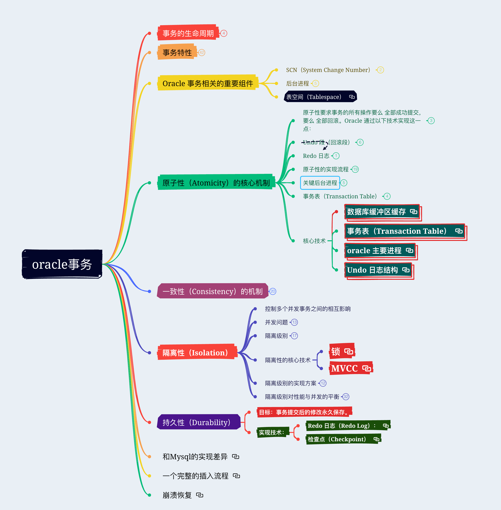

# Oracle事务

## 事务的生命周期

### 开始：事务从第一个 DML 操作（INSERT、UPDATE、DELETE）开始。

### 执行：修改数据，但这些修改暂时仅对当前事务可见（未提交）。

### 提交（COMMIT）：将修改永久保存到数据库。

### 回滚（ROLLBACK）：撤销未提交的修改。

## 事务特性

### 原子性（Atomicity）

- 目标：事务的所有操作要么全部成功，要么全部失败。

- 实现技术：

	- Undo 段（Undo Segments）：

		- 每个未提交的事务的修改会被记录到 Undo 段中。

		- 如果事务回滚，Oracle 使用 Undo 数据恢复原始值。

	- 事务表（Transaction Table）：

		- 跟踪事务的状态（已提交、未提交、回滚）。

		- 事务表（Transaction Table）

	- 数据库恢复机制：

		- 使用 Redo Log 和 Undo 数据，在系统崩溃时自动恢复未完成的事务。

### 一致性（Consistency）

- 目标：事务完成前后数据库必须保持一致状态（约束、规则）。

- 实现技术：

	- 约束（Constraints）：

		- 在事务提交前，Oracle 检查主键、外键、唯一性等约束是否被满足。

	- 锁机制（Locking）：

		- 通过锁（如行级锁、表级锁）确保事务修改的数据不会被其他事务干扰。

	- 读一致性（Read Consistency）：

		- 使用多版本并发控制（MVCC）和 Undo 数据，确保查询看到的数据版本一致。

### 隔离性（Isolation）

- 目标：多个并发事务之间互不干扰。隔离级别决定了事务间的可见性。

- 实现技术：

	- 多版本并发控制（MVCC）:

		- Oracle 为每个修改的数据块生成多个版本（基于 SCN，系统变更号）。

		- 查询根据 SCN 获取对应时间点的数据快照，避免脏读、不可重复读。

	- 锁机制（Locking）：

		- 行级锁（Row-Level Lock）：阻止其他事务修改同一行。

		- 表级锁（Table-Level Lock）：在 DDL 操作（如修改表结构）时使用。

	- 自动锁定管理：

		- Oracle 自动处理锁的获取和释放，避免死锁（需解决死锁时的自动回滚）。

### 持久性（Durability）

- 目标：事务提交后的修改永久保存。

- 实现技术：

	- Redo 日志（Redo Log）：

		- 记录事务的所有物理修改操作。

		- 提交事务时，Redo 日志会被强制写入磁盘（由 LGWR 进程完成）。

		- 在系统崩溃时，通过 Redo 日志恢复已提交的事务。

	- 日志缓冲（Log Buffer）：

		- 事务的 Redo 日志首先写入内存的 Log Buffer，再周期性或强制写入磁盘。

	- 检查点（Checkpoint）：

		- 由 CKPT 进程触发，同步内存中的脏数据块（Modified Buffer）到数据文件，加快恢复速度。

## Oracl​e 事务相关的重要组件

### SCN（System Change Number）

- 每个事务被分配一个唯一的 SCN，用于标识数据版本和时间点。

- SCN 用于实现读一致性和数据库恢复（如 Flashback 查询）。

### 后台进程

- LGWR（Log Writer）：将 Redo Log Buffer 中的内容写入 Redo Log Files。

- DBWn（Database Writer）：将脏数据块（Modified Buffer）写入数据文件。

- SMON（System Monitor）：负责实例恢复和清理临时段。

- PMON（Process Monitor）：监控用户进程，处理异常终止的事务和锁。

### 表空间（Tablespace）

## 原子性（Atomicity）的核心机制

### 原子性要求事务的所有操作要么 全部成功提交，要么 全部回滚。Oracle 通过以下技术实现这一点：

- Undo（回滚）段 ：存储事务修改前的数据副本，用于回滚未提交的事务。

- 事务状态跟踪：记录事务的活动状态（已提交或未提交）。

- 崩溃恢复：通过 Redo Log 和 Undo 段恢复未完成的事务。

### Undo 段（回滚段）

- Undo 日志结构

- Undo 段是实现原子性的核心组件，属于 Undo 表空间的一部分，专门用于保存事务修改前的数据镜像（旧值）。

- Undo 段的作用

	- 回滚未提交的事务：若事务未提交，使用 Undo 数据还原原始值。

	- 提供读一致性：其他会话读取数据时，Oracle 通过 Undo 段提供一致性视图（基于 MVCC）。

	- 支持事务恢复：数据库崩溃后，利用 Undo 数据回滚未提交的事务。

### Redo 日志

- undo日志的原子性由redo日志来保证

### 原子性的实现流程

- 事务进行中

- 事务修改数据时：

	- 每行数据的修改都会被写入 Undo 段，形成一条 回滚链。例如，更新两行数据：

	- Undo 段的每条记录均标记事务的 XID 和 SCN（系统变更号），用于标识操作和时间点。

- (2) 事务提交（COMMIT）

	- 提交时：

		- LGWR 进程将 Redo Log Buffer 中的变更强制写入磁盘的 Redo 日志文件（保证持久性）。

		- 事务状态（在 事务表）被标记为 已提交，释放 Undo 段空间（但不立即删除，需满足一致性读需求）。

		- 释放行级锁。

	- 提交完成：事务的修改对后续操作可见，Undo 数据仍保留一段时间（由 UNDO_RETENTION 参数控制）。

- (3) 事务回滚（ROLLBACK）

	- 回滚触发时：

		- Oracle 根据 XID 找到对应的 Undo 段。

		- 逆向应用 Undo 记录，将 Buffer Cache 中的修改撤销。

		- 释放占用的锁。

	- 回滚完成：数据恢复到事务前的状态。

- (4) 系统崩溃后的恢复

	- 前进阶段：通过 Redo Log 恢复所有已提交事务的修改（重做所有已提交操作）。

	- 回滚阶段：通过 Undo 段回滚未提交的事务（根据事务表的标识）。

### 关键后台进程

- LGWR（Log Writer）：将 Redo Log Buffer 的内容写入磁盘，保证事务持久性。

- SMON（System Monitor）：在实例重启时负责事务的崩溃恢复（回滚未提交事务）。

- DBWn（Database Writer）：异步将 Buffer Cache 的脏数据写入磁盘（与原子性无关，但影响持久性）。

### 事务表（Transaction Table）

- Oracle 使用 事务表（如 V$TRANSACTION）跟踪所有活动事务的状态：

	- 每个事务的状态：是否提交或回滚。

	- 关联的 Undo 段信息：XID、SCN、Undo 段地址等。

- 通过事务表，Oracle 可以快速定位未提交事务的 Undo 数据，确保回滚正确性。

### 核心技术

- 数据库缓冲区缓存

- 事务表（Transaction Table）

- oracle 主要进程

- Undo 日志结构

## 一致性（Consistency）的机制

### 确保事务执行前后，数据库始终处于逻辑上的有效状态（即遵守所有定义的数据约束、业务规则等），而不仅仅是数据的物理完整性

### 逻辑一致性（约束与规则）

- 数据约束

	- Oracle 强制在事务结束时验证所有定义的约束（如 COMMIT 时检查）：

	- 主键（Primary Key）：确保唯一性，不允许重复值和空值。

	- 外键（Foreign Key）：引用完整性，保证子表外键对应主表存在的记录。

	- 唯一性约束（Unique）：字段或字段组合的值唯一。

	- 检查约束（Check）：满足指定条件（如 salary > 0）。

	- 非空约束（NOT NULL）：字段必须有值。

- 触发器与存储过程

	- 触发器（Triggers）：在数据变更时自动执行逻辑（如级联更新）。

	- 存储过程（Stored Procedures）：封装业务规则，确保事务操作的逻辑完整性。

- 显式应用层逻辑

	- 应用代码需保证事务的逻辑正确性

### 读一致性（Read Consistency）

- 一致性读（Consistent Read）

	- 每个查询启动时分配一个 系统变更号（SCN），标识数据库的时间点。

	- 查询读取的数据版本必须满足 SCN ≤ 查询起始的 SCN。 

- 写一致性（Write Consistency）

	- 更新、删除操作会根据当前数据的状态动态调整，避免与其他事务的写冲突。

## 隔离性（Isolation）

### 控制多个并发事务之间的相互影响

### 并发问题

- 脏读（Dirty Read）

	- 一个事务读取了另一个未提交事务修改的数据（“脏数据”），可能读到后续被回滚的无效值。

	-  

- 不可重复读（Non-repeatable Read）

	- 指同一个事务中两次读取同一数据，结果因其他事务提交修改而不一致。

	-  

- 幻读（Phantom Read）

	- 是同一事务中两次执行相同范围的查询，返回的行数因其他事务插入或删除而变化。

		- 不可重复读针对单行数据值变化，幻读针对结果集的增减。

	-  

- 更新丢失（Lost Update）

	- 多个事务覆盖彼此的修改

	- 一般不关注此问题

### 隔离级别

- ANSI/SQL 标准

	- ANSI/SQL 标准通过四个隔离级别，提供了一个 层次化的并发控制框架，允许开发者在数据库一致性、并发性能和业务需求之间选择平衡。每个级别逐步解决更复杂的并发问题

	- READ UNCOMMITTED

		- 无任何一致性保证，可能读到未提交的事务数据。

		- 大多数数据库（如Oracle）甚至不支持该级别。

	- READ COMMITTED

		- 仅读取已提交数据，解决脏读。

		- 但同一事务中多次读同一行，可能因其他事务提交而值不同（不可重复读），或结果集变化（幻读）。

	- REPEATABLE READ

		- 保证同一事务中多次读取相同行的值一致（不可重复读问题解决）。

		- 但无法避免新增行（幻读），如其他事务插入符合条件的新行。

	- SERIALIZABLE

		- 完全串行化，完全解决三类问题，通过锁或快照隔离实现。

		- 缺点是并发性能最低，可能导致超时或死锁。

- Oracle支持的隔离级别

	- READ COMMITTED

	- SERIALIZABLE

### 隔离性的核心技术

- 锁

- MVCC

### 隔离级别的实现方案

- READ COMMITTED

	- 工作机制：

		- 每个查询独立获取SCN：在同一个事务中，每次执行SELECT语句时，Oracle会针对该查询获取当前系统中最新的SCN。这意味着，如果其他事务在两次查询之间提交了修改，后续查询将能看到新的变更。

		- 避免脏读：通过多版本控制（MVCC），保证只能看到已提交的数据。

	- 特点：

		- 可能发生不可重复读和幻读：多次查询的结果可能不同，因为SCN会变。

- SERIALIZABLE

	- 工作机制：

		- 事务开始时确定SCN：事务内部的所有查询都基于事务开始时的固定SCN，无视后续其他事务的提交。

		- 冲突检测：提交前检查是否因并发修改导致逻辑不一致（例如幻读），若冲突则回滚事务（报错ORA-08177）。

	- 特点：

		- 一致性快照：所有查询看到的是事务开始时的数据镜像，确保可重复读和防幻读。

### 隔离级别对性能与并发的平衡

- Oracle提供多种隔离级别（如Read Committed和Serializable），核心目标是允许用户在不同场景下权衡数据一致性与系统并发性能。

- 隔离级别的设计目的

	- 一致性（Correctness） vs 性能（Performance）的权衡

		- 高隔离级别（如Serializable）：优先保障逻辑一致性，放弃部分并发性能。

		- 低隔离级别（如Read Committed）：牺牲部分一致性，换取更高的吞吐量。

	- 不同的业务场景需求

		- Read Committed（读已提交）：

			- 适用场景：多数OLTP系统（如订单处理、实时交易）需要高并发和低延迟，允许中间的读操作看到最新提交的数据。

			- 牺牲点：可能发生不可重复读和幻读。

		- Serializable（串行化）：

			- 适用场景：财务报表生成、对账等需要严格一致性保证的操作。

			- 优势：通过快照和冲突检测完全避免幻读，但增加事务回滚和UNDO维护成本。

- Serializable隔离级别的UNDO开销

	- SCN固定与UNDO留存

		- Serializable事务的特性：

			- 事务开始时确定一个 固定SCN。

			- 事务内部所有查询均基于这个SCN对应的数据快照，无论后续其他事务是否提交变更。

			- 若其他事务修改了本事务查询范围内的数据，提交时将触发冲突检测（ORA-08177）。

		- 对UNDO的影响：

			- 需保留更久的UNDO数据：

			- 只有当所有活跃的Serializable事务结束后，其所需的UNDO数据才能被清理。如果存在长事务，UNDO表空间可能快速增长。

			- 示例：

				- 一个Serializable事务运行2小时，期间其他事务频繁更新数据。为了维护该事务的快照，Oracle需保留这2小时内所有相关修改的UNDO数据，即使这些修改已经提交。

	- 潜在性能影响

		- 查询延迟：

			- 需要从UNDO段中重构旧版本数据，可能导致（尤其是多表关联或全表扫描）查询变慢。

		- 空间压力：

			- UNDO表空间需足够大以支持长期快照，否则可能引发 ORA-01555（快照过旧） 错误。

	- UNDO参数优化

		- 为防止故障，Oracle提供了相关参数：

		- UNDO_RETENTION：指定UNDO数据至少保留时间（默认900秒），但Serializable事务可能导致UNDO被强制保留更久。

		- RETENTION GUARANTEE（UNDO表空间属性）：强制保留UNDO数据直至超过时间阈值或事务结束，但可能加大存储压力。

## 持久性（Durability）

### 目标：事务提交后的修改永久保存。

### 实现技术：

- Redo 日志（Redo Log）：

- 检查点（Checkpoint）

## 和Mysql的实现差异

## 一个完整的插入流程

## 崩溃恢复

