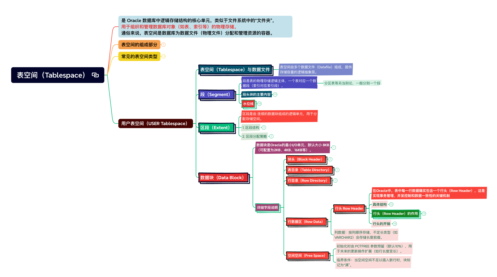

# 表空间（Tablespace）

## 是 Oracle 数据库中逻辑存储结构的核心单元，类似于文件系统中的“文件夹”，
用于组织和管理数据库对象（如表、索引等）的物理存储。
通俗来说，表空间是数据库为数据文件（物理文件）分配和管理资源的容器。

## 表空间的组成部分

### 数据文件（Data Files）

- 表空间由一个或多个物理的 .dbf 文件组成，文件存储在操作系统的磁盘上。

- 例如：users01.dbf、system01.dbf。

### 逻辑存储单元（Logical Units）

- 表空间内包含 段（Segments）（如表、索引等对象）和 区（Extents）（连续的数据块集合）。

## 常见的表空间类型

### 系统表空间（SYSTEM Tablespace）

- 存储 Oracle 核心数据（数据字典、PL/SQL 源码等）。

- 不可删除或重命名，是数据库启动的必备表空间。

### 用户表空间（USER Tablespace）

- 默认存储用户创建的表和索引（默认名为 USERS）。

- 示例：CREATE TABLE t1 (id NUMBER) TABLESPACE users;。

### 临时表空间（TEMP Tablespace）

- 用于存储临时数据（如排序中间结果、临时表）。

- 频繁关联 GROUP BY、ORDER BY 等 SQL 操作性能。

### Undo 表空间（UNDO Tablespace）

- 存储事务的回滚数据（Undo Records），用于支持原子性、一致性读和多版本控制。

### 大文件表空间（Bigfile Tablespace）

- 只能包含一个数据文件，但文件大小可达 TB 或 PB 级别（适用大型数据存储）。

## 用户表空间（USER Tablespace）

### 表空间（Tablespace）与数据文件

- 表空间由多个数据文件（Datafile）组成，提供存储容量的逻辑抽象层。

### 段（Segment）

- 段是表的物理存储逻辑主体，一个表对应一个数据段（索引对应索引段）。

	- 分区表等另当别论，一般分别一个段

- 段头块的主要内容

	- 段类型 (Segment Type)

		- 区分段用途（数据段、索引段、LOB段等）。

	- 段状态 (Segment Status)

		- 记录段是否在线（Online）或不可用（Offline）。

	- 区段分配链表 (Extent Map)	

		- 段的区段（Extent）列表（分配顺序及物理地址），用于快速定位区段位置。

	- 高水位线 (HWM)

		- 标记段内最远的已分配块（逻辑终点），所有全表扫描需读取到 HWM。

	- 低水位线 (LWM)

		- 标记段内最后一个真正包含数据的块（仅限某些存储特性场景）。

	- 事务槽 (Transaction Slots)

		- 记录该段上的并发事务信息（用于 ITL 管理），保障多事务的隔离性。

	- 空闲空间管理位图 (Free Space)	

		- 在 自动段空间管理（ASSM） 的表空间中，记录块的空闲空间分布（位图），替代旧式空闲列表（Free List）。

- 水位线

	- 水位线是段内部的物理存储标记，分为 高水位线（HWM） 和 低水位线（LWM）：

	- 1. 高水位线（High Water Mark, HWM）

		- 定义：HWM 是段内最后一个已被分配的块的逻辑边界（即已分配空间的终点）。所有全表扫描必须读取到 HWM 前的所有块，即使这些块可能大部分为空（已删除数据后的残余空间）。

		- 特点：

			- 只增不减：当数据插入需要新区块时，HWM 向高端推移。

			- 不会自动回退：即使删除大量数据，HWM 也无法自动回退（需手动操作）。

			- 影响全表扫描性能：HWM 以下的块会被全表扫描逻辑读取，即便其中大部分为空。

	- 2. 低水位线（Low Water Mark, LWM）

		- 定义：LWM 是段内最后一个实际包含有效数据的块的位置。在 ASSM 表空间 中引入，帮助快速定位有效数据区，优化回收机制。

		- 特点：

			- 动态调整：当数据删除时，Oracle 可能将 LWM 推进到有效数据的末尾，但 HWM 不变。

			- 对扫描的影响：某些操作（如空间回收）可基于 LWM 快速定位有效区域，但全表扫描依然以 HWM 为终点。

	- 高水位线（HWM）的实际影响

		- HWM 与全表扫描性能

			- 假设一个表的数据被频繁删除，HWM 仍停留在高位：

				- 即使有效数据仅占 1个块，全表扫描也会触发 I/O 浪费。

		- 检查 HWM 状态

			- 通过数据字典视图 DBA_SEGMENTS 和 DBA_TABLES 查看水位：

### 区段（Extent）

- 区段是由 连续的数据块组成的逻辑单元，用于分配存储空间。

- 1. 区段结构

	- 初始区段（Initial Extent）：建表时自动分配，大小由 INITIAL 参数指定（默认64KB，8个8KB块）。

	- 扩展区段（Next Extent）：当初始区段用满后，按 NEXT 参数大小分配新区段（默认自动管理）。

	- 区段链：所有区段通过指针链接成链表，方便追踪空间使用。

- 2. 区段分配策略

	- 本地管理表空间（Locally Managed Tablespace, LMT）：

	- 使用位图（Bitmap）（而非传统的字典管理）跟踪区段状态（空闲/已使用），减少空间管理开销。

### 数据块（Data Block）

- 数据块是Oracle的最小I/O单元，默认大小 8KB（可配置为2KB、4KB、16KB等）。

	- |------------------------------------------|
| 块头（Block Header）                                |
|------------------------------------------|
| 表目录（Table Directory）                         |
|------------------------------------------|
| 行目录（Row Directory）                           |
|------------------------------------------|
| 行数据区（Row Data）                               |
|------------------------------------------|
| 空闲空间（Free Space）                            |
|------------------------------------------|

- 详细字段说明

	- 块头（Block Header）

		- 元数据：块的SCN（记录最后一次修改）、块类型（数据块、索引块等）、块的物理地址。

		- 事务槽（ITL，Interested Transaction List）：记录在此块上活动的事务信息（事务ID、Undo记录指针等），支持行级锁和MVCC。

	- 表目录（Table Directory）

		- 仅当块属于聚簇表或分区表时存在，记录表的唯一标识。

	- 行目录（Row Directory）

		- 行条目索引：每个条目指向行数据区中的行起始位置（偏移量），类似“行指针列表”。

	- 行数据区（Row Data）

		- 行头 Row Header

			- 在Oracle中，表中每一行数据确实包含一个行头（Row Header），这是实现事务管理、并发控制和数据一致性的关键机制

			- 具体结构

				-  

				- UBA（Undo Block Address）

					- UBA 是数据行头和 Undo 块头中的地址标识符，指向一个具体的 Undo 块位置

					- 组成方式

						- Segment Number：Undo 段号。

						- Block Number：Undo 段中具体的块号。

						- Sequence Number：Undo 块的序列号（区分块的多次修改）。

					- 工作机制

						- 行的头（Row Header）中保存其最新 Undo 记录的 UBA。

						- 当查询需要一致性读时，通过该 UBA 找到对应的 Undo 记录。

						- 结合回滚链指针，沿着版本链进一步找到所需的历史版本。

			- 行头（Row Header）的作用

				- 每个数据行的头部包含一组元数据信息，主要用于实现以下功能：

				- 1. 锁管理（Locking）

					- 行级别锁：通过锁字节（Lock Byte）记录该行是否被锁定（如事务正在修改数据）。

					- 事务槽（ITL Entry）：在数据块头部的 Interested Transaction List（ITL） 中，记录持有该行锁的事务ID（XID）及其他信息（通过行头的地址指针关联）。

				- 2. 并发控制与一致性读

					- 行版本的指针：

						- 若该行被多次更新，行头中的 undo_ptr 会指向对应的Undo记录（前镜像），用于构造多版本数据。

					- SCN标记：行的最新修改对应的SCN（System Change Number），判断是否对当前查询可见。

				- 3. 空间管理

					- 行链信息（Row Chain）：如果行数据过长被切分到多个块（行链），行头保存链中下一块的地址。

					- 迁移行指示：若行被移动到新块（行迁移），行头记录新位置的地址（原始块保留指针）。

				- 4. 列信息及空值优化

					- 列数目及空值位图：记录行内列的数目及哪些列存储了空值（无需额外存储空值的列数据）。

			- 行头的开销

				- 存储开销计算示例

					- 假设一个表有 100万行 数据，平均每行的行头占用 10字节：

					- 总行头空间 = 100万行 × 10字节 = 10MB

					- 若实际数据列平均每行100字节：

					- 总数据空间 = 100万行 × (100字节 + 10字节) = 110MB

					- 行头占比 = 10/110 ≈ 9%

				- 2. 优化策略

					- 在以下场景中，可能需关注行头存储开销：

					- 极端小行的表（如仅1列、每行存储1字节的数据）：

						- 行头占比可能超过实际数据量（此时适合行压缩功能）。

					- 海量数据的表（如万亿级记录）：

						- 行头可能累积成较大的绝对存储量，需评估是否合理（如使用分区、列存储优化）。

				- 3. Oracle的优化设计

					- 块级空间重用：删除或更新后释放的行头空间会在同一块内被新数据重用。

					- 行压缩（Advanced Compression）：对行头及数据进行压缩，减少空间浪费。

					- PCTFREE参数管理：预留足够的块空间用于行头的动态扩展（如ITL条目增加）。

		- 列数据：按列顺序存储，不定长类型（如VARCHAR2）会存储长度前缀。

	- 空闲空间（Free Space）

		- 初始化时由 PCTFREE 参数预留（默认10%），用于未来的更新操作扩展（如行长度变长）。

		- 临界条件：当空闲空间不足以插入新行时，块标记为“满”。

