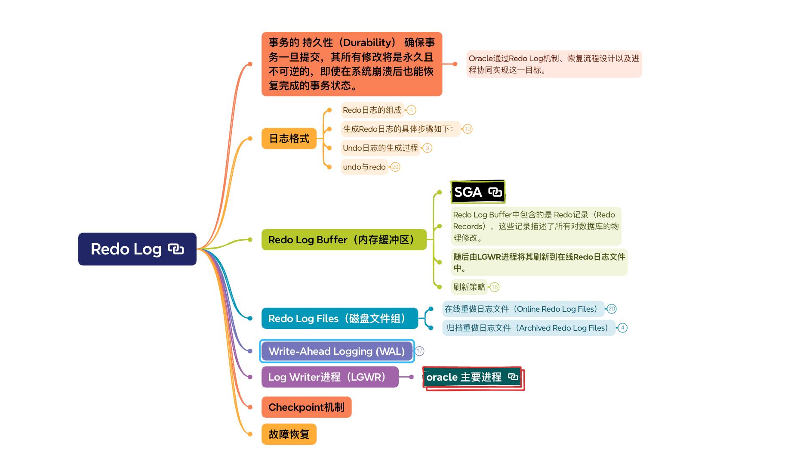

# Redo Log

## 事务的 持久性（Durability） 确保事务一旦提交，其所有修改将是永久且不可逆的，即使在系统崩溃后也能恢复完成的事务状态。

### Oracle通过Redo Log机制、恢复流程设计以及进程协同实现这一目标。

## 日志格式

### Redo日志的组成

- Redo日志记录了所有对数据库的 物理修改，无论事务是否提交。每次更新数据时，Redo日志会记录以下内容：

- 数据块地址（Data Block Address, DBA）：被修改的块的物理位置（文件号 + 块号）。

- 操作类型（Operation Type）：如 UPDATE、INSERT、DELETE 等。

- 新值（After Image）：数据块被修改后的内容。

### 生成Redo日志的具体步骤如下：

- 定位数据块：

	- 根据 id=1 找到对应的数据块（假设位于文件10，块543）。

- 生成Redo记录：

	- 记录数据块地址：DBA=file#=10, block#=543。

	- 记录操作类型：UPDATE。

	- 记录新值：salary=10000。

- 写入Redo Log Buffer：

	- Redo记录首先写入内存中的Redo Log Buffer。

- 刷新到磁盘：

	- 由LGWR进程将Redo记录写入在线Redo日志文件。

### Undo日志的生成过程

- 记录事务ID：XID=0x0001.001.00000001。

- 记录数据块地址：DBA=file#=10, block#=543。

- 记录旧值：salary=5000。

### undo与redo

- Redo Log的“物理修改”

	- Redo Log记录的是 数据块（Block） 的物理修改，即对磁盘数据文件的更改内容（具体字节的变化）。这种记录是低层次的，与物理存储结构直接相关。

	- 具体体现

		- 数据块的物理地址

			- Redo Log中的每个条目（Redo Record）都会包含：

			- 数据块地址（Data Block Address, DBA）：文件号（File#）和块号（Block#），定位到具体的物理位置。

			- 修改后的值（After Image）：数据块被改动后的完整内容。

		- 操作类型无关性

			- Redo Log不关心是“INSERT、UPDATE还是DELETE”，它只记录数据块的物理变更。例如：

			- 假设某数据块已被初始化为 AA BB CC DD，更新后变为 AA EE CC DD：

			- Redo Log会记录 块地址+修改后的字节序列（EE），不管这是由何种SQL操作导致的。

		- 崩溃恢复的重做（Redo）

			- 在实例崩溃后，Redo Log会被用来重新应用（Replay）所有已提交的事务，修复 物理数据块 到最新状态。

		- 示例场景：

			- 执行 UPDATE employees SET salary=10000 WHERE id=1;

			- 数据块修改：某数据块中的字节从 salary=5000 变为 10000。

			- Redo Log记录：

				- DBA=file#10, block#543 → salary=10000。

- Undo Log的“逻辑状态”

	- Undo Log记录的是事务的 逻辑操作前的状态（旧值），目的是支持事务回滚（Rollback）和读一致性查询（Read Consistency）。它是基于数据库逻辑（如行记录）而非物理块结构的。

	- 具体体现

		- 记录基于事务的操作逻辑

		- Undo Log记录的是 事务的回滚所需信息，例如：

			- 对于一行记录的 UPDATE，Undo Log保存完整的旧行数据，而非块级的修改。

	- 支持多版本并发控制（MVCC）

		- Undo Log通过保存数据的旧版本（Before Image），为并发事务提供读一致性视图。例如：

		- 事务A更新了一行，事务B在未提交前查询该行时，会从Undo Log中读取旧值。

	- 事务回滚

		- 如果事务未提交，数据库使用Undo Log中的逻辑状态，生成逆向操作（例如反向UPDATE）撤销修改。

## Redo Log Buffer（内存缓冲区）

### SGA

### Redo Log Buffer中包含的是 Redo记录（Redo Records），这些记录描述了所有对数据库的物理修改。

### 随后由LGWR进程将其刷新到在线Redo日志文件中。

### 刷新策略

- Redo Log Buffer的刷新策略由LGWR进程负责，确保Redo记录能够及时、高效地写入在线Redo日志文件。

- 刷新触发条件

	- 以下条件会触发LGWR进程将Redo Log Buffer的内容写入磁盘：

	- 事务提交（COMMIT）：

		- 用户提交事务时，LGWR必须将相关Redo记录写入磁盘，确保持久性。

	- Log Buffer满1/3或达到1MB：

		- 若Redo Log Buffer填充超过1/3或写入1MB数据，LGWR会主动刷新。

	- 每3秒自动刷新：

		- LGWR会定期（默认每3秒）将Redo Log Buffer的内容写入磁盘，减少未写入数据的丢失风险。

	- 日志切换（Log Switch）：

		- 当前日志组写满时，LGWR会先刷新Redo Log Buffer，再切换到下一组日志。

- 刷新过程中的关键技术

	- 批量写入（Batched Writes）：

		- LGWR会批量处理多个事务的Redo记录，减少I/O开销。

	- 异步刷新（Asynchronous Flush）：

		- 在默认情况下，LGWR的刷新操作是异步的，不会阻塞事务的执行。

	- 组提交（Group Commit）：

		- 多个事务提交时，LGWR会将它们的Redo记录一起写入磁盘，提高事务提交效率。

## Redo Log Files（磁盘文件组）

### 在线重做日志文件（Online Redo Log Files）

- 在线Redo日志文件是循环使用的

- 文件特征

	- 位置：通常位于 $ORACLE_BASE/oradata/<DB_NAME>/ 目录下，或使用ASM存储。

	- 文件命名：如 redo01.log、redo02.log 等。

	- 作用：临时存储当前数据库活动生成的Redo记录，用于实例崩溃恢复。

- 日志组（Log Groups）

	- 每个数据库至少需要 2组日志组（推荐创建3组及以上）。

	- 日志组由多个成员（Members）组成，成员之间是镜像关系（用于高可用）。

	- 日志组切换：当前日志组写满后，切换到下一组日志组。

- 日志成员（Log Members）

	- 每个日志组可以包含多个日志成员（推荐至少2个成员，分布于不同磁盘）。

	- 成员之间内容一致，避免单点故障。

	- 写入机制：LGWR进程将Redo记录写入当前日志组的所有成员。

- 日志文件结构

	- 每个在线Redo日志文件是一个连续的二进制文件，内部包含以下逻辑结构：

	- 文件头（Header）：

		- 包含元信息，如日志组号、日志序列号、SCN范围、创建时间等。

	- Redo记录块（Redo Record Blocks）：

		- 记录了所有事务生成的Redo记录。

		- 每个Redo记录包含 变化向量（Change Vectors），描述具体的块修改。

###  归档重做日志文件（Archived Redo Log Files）

- 文件特征

	- 位置：通常位于归档目录（如 $ORACLE_BASE/flash_recovery_area/<DB_NAME>/archivelog/）。

	- 文件命名：如 1_12345_123456789.arc，其中 1 是线程号，12345 是日志序列号。

	- 作用：在线Redo日志文件被覆盖前，将其内容归档，用于介质恢复和PITR（Point-in-Time Recovery）。

## Write-Ahead Logging (WAL)

### 是一种数据库事务管理机制，确保事务的持久性和崩溃恢复能力

### 核心原则

- 所有对数据库的修改必须先行记录在日志中，然后再写入数据文件。

- 事务持久性（Durability）：确保已提交事务的修改不会丢失。

- 崩溃恢复（Crash Recovery）：在实例崩溃后，能够将数据库恢复到一致状态。

- 数据一致性（Consistency）：通过日志记录修复部分写入（Partial Writes）和断裂块（Fractured Blocks）。

### WAL在Oracle中的实现

- Redo Log记录了所有对数据库的 物理修改，无论事务是否提交。它是WAL机制的核心组件，确保修改能够被持久化。

- Undo Log记录了事务修改前的 逻辑状态，用于回滚未提交的事务和提供读一致性。

### WAL的关键特性

- 日志先行（Log Before Data）

	- 原则：所有修改必须在日志中记录之后，才能写入数据文件。

	- 目的：确保即使数据文件写入失败，仍然可以通过日志恢复。

- 日志顺序写入（Sequential Log Writes）

	- Redo日志是顺序写入的，避免了随机写入的开销，提高了I/O效率。

- 日志归档（Log Archiving）

	- 在ARCHIVELOG模式下，Redo日志会被归档，用于介质恢复和PITR。

## Log Writer进程（LGWR）

### oracle 主要进程

## Checkpoint机制

## 故障恢复

