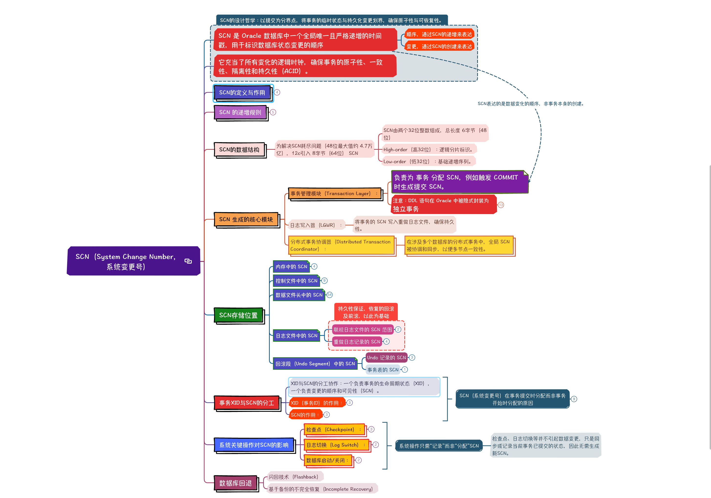

# SCN（System Change Number，系统变更号）

## SCN 是 Oracle 数据库中一个全局唯一且严格递增的时间戳，用于标识数据库状态变更的顺序

### 顺序，通过SCN的递增来表达

### 变更，通过SCN的创建来表达

## 它充当了所有变化的逻辑时钟，确保事务的原子性、一致性、隔离性和持久性（ACID）。

## SCN的定义与作用

### SCN是一个全局递增的时间戳，用于唯一标识数据库中的每一次变更事件（如事务提交、数据块修改）

### 全局一致性：协调多事务并发操作，确保读取的数据处于一致状态。

### 恢复排序：数据库恢复时，Redo记录按SCN顺序重放变更。

### 分布式事务：跨越多个数据库的事务通过SCN同步状态。

## SCN 的递增规则

### 递增规则：SCN 在实例中单调递增，但非严格“顺序加一”。

### 根据工作负载，SCN 可能按更大跨度递增（例如每次分配一批值以优化并发性能）。

### 生成逻辑：

- 单实例 Oracle：使用内存中的原子操作（如 Atomic Increment）生成 SCN。

- RAC（集群环境）：通过 Lamport 时钟算法 或 SCN 广播机制 协调集群各节点间的 SCN，确保全局递增。

## SCN的数据结构

### 为解决SCN耗尽问题（48位最大值约 4.7万亿），12c引入 8字节（64位） SCN

- SCN由两个32位整数组成，总长度 6字节（48位）

- High-order（高32位）：逻辑分片标识。

- Low-order（低32位）：基础递增序列。

## SCN 生成的核心模块

### 事务管理模块（Transaction Layer）：

- 负责为 事务 分配 SCN，例如触发 COMMIT 时生成提交 SCN。

- 注意：DDL 语句在 Oracle 中被隐式封装为 
	独立事务

	- 自动提交：即使未显式执行 COMMIT，DDL 操作会立即提交，无法回滚（DML 事务中未提交的修改也会被提交）。

	- 数据字典变更：DDL 操作的元数据修改（如创建表结构、修改约束）最终会修改 数据字典表（如 SYS.OBJ$、SYS.COL$ 等），这些变更需要被记录到重做日志（Redo Log）中。

	- DDL 操作中的 SCN 分配与使用

		- DDL 操作的执行流程

			- 隐式开启事务：Oracle 为 DDL 操作开启一个独立事务，分配一个事务 ID（XID）。

			- 修改数据字典：向 SYS.OBJ$ 插入新表记录，更新相关元数据表。

			- 生成 Redo 日志：所有数据字典修改被记录到 Redo Log，触发 LGWR 写入。

			- 隐式提交事务：DDL 操作自动提交，分配一个唯一的 SCN 作为提交标记。

		- DDL 操作生成的 SCN

			- 提交时分配 SCN：与 DML 事务类似，DDL 操作在提交时为其分配一个新的 SCN。

			- SCN 的作用：

				- 标记 DDL 操作提交的时间点，确保其修改的元数据对其他事务可见。

				- 作为恢复流程的基准点，确保可通过 Redo 和 Undo 重建数据字典到一致状态。

### 日志写入器（LGWR）：

- 将事务的 SCN 写入重做日志文件，确保持久性。

### 分布式事务协调器（Distributed Transaction Coordinator）：

- 在涉及多个数据库的分布式事务中，全局 SCN 被协调和同步，以便多节点一致性。

## SCN存储位置

### 内存中的 SCN

- kcsgscn 全局 SCN 变量

- 核心变量：在 Oracle 实例启动时，内存中存在一个全局的 SCN 变量（如 kcsgscn），基于原子操作递增，并实时反映当前最高 SCN。

- 作用：新事务提交时从此变量获取下一个 SCN，确保全局递增且唯一。

- 查询方法：通过 V$DATABASE.CURRENT_SCN 间接访问内存中的 SCN。

### 控制文件中的 SCN

- 全局检查点 SCN

	- 字段名：CHECKPOINT_CHANGE#

	- 作用：记录所有数据文件最后一次完整检查点的最低 SCN，用于确定恢复的起始点。

- 数据文件检查点 SCN

	- 字段名：CHECKPOINT_CHANGE#

	- 作用：记录每个数据文件的最后一次检查点 SCN，用于与控制文件的全局 SCN 对比。

- 归档日志的 SCN 范围

	- 字段名：FIRST_CHANGE#、NEXT_CHANGE#

	- 作用：记录每个归档日志文件的 SCN 范围，用于恢复时定位日志。

### 数据文件头中的 SCN

- 检查点 SCN

	- 字段名：CHECKPOINT_CHANGE#

	- 作用：记录该数据文件最后一次检查点的 SCN，与控制文件的全局 SCN 对比以检测不一致。

- 块头的 SCN

	- 每个数据块的头部包含 最后一次修改的 SCN，用于一致性读和 MVCC（多版本并发控制）：

	- 字段名：SCN

	- 作用：

		- 查询时比较块头的 SCN 与查询 SCN，判断该块是否可见。

		- 恢复时过滤掉晚于目标 SCN 的块。

	- 查看方法：通过块转储工具（如 BBED）直接查看物理块的 SCN。

- 行头的SCN

	- 行头中 SCN 的作用

		- 行头中的 SCN 信息是 MVCC 和一致性读的核心依据

	- 行级别 SCN：

		- 记录该行最后修改的 SCN（提交时分配）。

		- 查询时，通过比较 查询 SCN 和行头的 SCN，判断该行是否可见：

			- 行头 SCN ≤ 查询 SCN：该行可见。

			- 行头 SCN > 查询 SCN：通过 Undo 指针回溯旧版本，找到符合查询 SCN 的前镜像。

	- Undo 段的多版本链：

		- 当一行被多次修改时，每个旧版本数据通过 Undo 记录的指针链式连接，形成版本链。

		- 行头中的 Undo 指针指向该链的最新版本。

### 日志文件中的 SCN

- 联机日志文件的 SCN 范围

	- 字段名：FIRST_CHANGE#、NEXT_CHANGE#

	- 作用：记录每个日志组中所有日志记录的 SCN 范围，用于恢复时定位日志。

- 重做日志记录的 SCN

	- 每个重做日志记录包含一个 变更 SCN，用于标识该记录对应的数据库变更。

	- 作用：

		- 恢复时按 SCN 顺序重放日志。

		- 记录事务提交的 SCN。

### 回滚段（Undo Segment）中的 SCN

- Undo 记录的 SCN

	- 每个 Undo 记录包含一个 提交 SCN，标识该版本数据的提交时间点。

	- 作用：一致性读时，通过 Undo 记录回滚到查询 SCN 对应的旧版本。

	- 查询方法：通过 X$KTUXE 等内部表查看 Undo 记录的 SCN。

- 事务表的 SCN

	- 每个事务的 SYS.SMON_SCN_TIME 表记录事务的 SCN 与时间映射，用于时间点恢复或闪回查询。

## 事务XID与SCN的分工

### XID与SCN的分工协作：一个负责事务的生命周期状态（XID），一个负责变更的顺序和可见性（SCN）。

### XID（事务ID）的作用：

- 由事务启动时分配，唯一标识一个活跃事务的实例（Instance）和事务槽（Transaction Slot）。在数据块头的ITL（Interest Transaction List）中记录XID和SCN，用于：

- 行锁管理：标识哪些事务锁定了该行。

- 回滚定位：通过XID关联Undo段的旧版本数据。

### SCN的作用：

- 在提交时分配，确保事务的变更顺序可追溯，用于：

- 恢复排序：重做日志按SCN顺序决定恢复流程。

- 读一致性：查询基于SCN确定可见性快照。

## 系统关键操作对SCN的影响

### 检查点（Checkpoint）：

- 检查点进程（CKPT）触发DBWn将脏块写入磁盘，并更新数据文件头和控制文件中的 检查点SCN。

- 检查点SCN：标记当前已持久化的数据状态，并非新分配的SCN，而是当前最新的已提交事务SCN。

- 不递增全局SCN：检查点本身不会分配新的SCN，但推进恢复时需要使用最新的提交SCN作为参考点。

### 日志切换（Log Switch）：

- LGWR进程在切换重做日志组时记录当前的最高SCN到新日志文件头，归档日志中的SCN范围基于此。

- 触发SCN同步：归档日志必须包含完整的SCN轨迹，但这不会导致全局SCN递增。

### 数据库启动/关闭：

- 数据库实例启动时，控制文件中的检查点SCN被加载为初始SCN基数。

- 关闭时，当前最高SCN被保存到控制文件中，但不分配新的SCN。

## 数据库回退

### 闪回技术（Flashback）

### 基于备份的不完全恢复（Incomplete Recovery）

