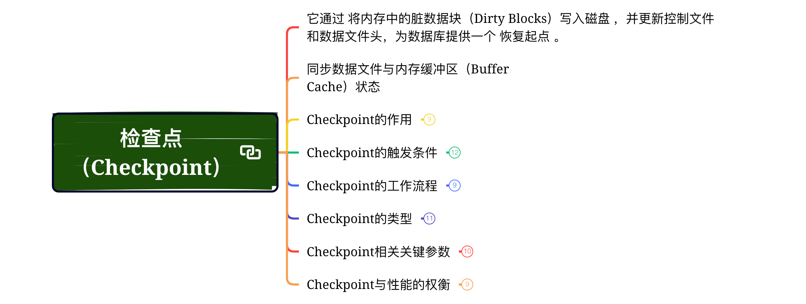

# 检查点（Checkpoint）

## 它通过 将内存中的脏数据块（Dirty Blocks）写入磁盘 ，并更新控制文件和数据文件头，为数据库提供一个 恢复起点 。

## 同步数据文件与内存缓冲区（Buffer Cache）状态

## Checkpoint的作用

### 1. 缩短崩溃恢复时间

- Checkpoint标记了所有在某一时间点之前已写入日志的已提交的数据块。

- 崩溃恢复时，只需从最后一个Checkpoint对应的Redo Log记录开始重放（Redo），显著减少恢复所需处理的日志量。

### 2. 保证数据文件一致性

- Checkpoint前，所有已提交事务的修改均已写入数据文件，确保数据文件与日志记录一致。

### 3. 统一数据库状态视图

- 控制文件和数据文件头中记录的Checkpoint SCN（系统变更号），用于标识数据库的一致性时间点。

### 4. 释放Redo日志空间

- 在归档日志模式下（ARCHIVELOG），Checkpoint触发后，旧的Redo日志可以被覆盖或删除。

## Checkpoint的触发条件

### 手动触发

###  自动触发

- Redo日志切换（Log Switch）：

	- 当日志组写满并切换到下一组时，触发Checkpoint。

- 时间间隔触发：

	- 通过参数 LOG_CHECKPOINT_TIMEOUT 设定时间间隔（单位为秒）。

- 日志量触发：

	- 当生成的Redo日志量达到 LOG_CHECKPOINT_INTERVAL（单位为数据块数量）。

- 关闭数据库时：

	- SHUTDOWN IMMEDIATE 或 SHUTDOWN TRANSACTIONAL 会触发完全Checkpoint。

- 表空间离线（Offline）：

	- 执行 ALTER TABLESPACE ... OFFLINE 时触发局部Checkpoint。

## Checkpoint的工作流程

### 以 完全检查点（Full Checkpoint） 为例，流程如下：

### 刷新脏块到磁盘（Disk Write）

- DBWn（Database Writer）进程将Buffer Cache中所有已提交的脏块写入数据文件。

- 确保所有Checkpoint SCN之前的修改均已持久化到磁盘。

### 更新控制文件和数据文件头

- 记录最新的Checkpoint SCN到控制文件（V$DATAFILE_HEADER.CHECKPOINT_CHANGE#）。

- 更新每个数据文件头中的Checkpoint SCN和时间戳。

### 清理Redo日志（可选）

- 如果处于NOARCHIVELOG模式，且日志组已不再需要，可能会被覆盖重用。

## Checkpoint的类型

### 1. 完全检查点（Full Checkpoint）

- 全库范围：强制所有脏块写入数据文件，更新所有数据文件头的Checkpoint SCN。

- 触发场景：手动执行、日志切换（依赖参数设置）、数据库关闭。

### 2. 增量检查点（Incremental Checkpoint）

- 渐进式更新：

	- 仅记录当前脏块的最早Change Vector（RBA, Redo Byte Address），而非立即刷新所有脏块。

	- CKPT进程定期更新控制文件中的检查点进度。

- 触发场景：主要由后台进程CKPT根据恢复时间目标（FAST_START_MTTR_TARGET）自动触发。

- 作用：减少完全Checkpoint的I/O压力，平衡恢复时间与性能。

### 3. 局部检查点（Partial Checkpoint）

- 针对特定对象：例如表空间离线或数据文件脱机。

## Checkpoint相关关键参数

### 1. FAST_START_MTTR_TARGET

- 功能：设定数据库的预期崩溃恢复时间（秒）。

- 原理：自动触发增量检查点，确保脏块数量足够少以满足恢复时间目标。

- 建议值：通常设置为 300（5分钟）。

### 2. LOG_CHECKPOINT_TIMEOUT

- 功能：每隔N秒触发一次Checkpoint。

- 风险：过短的值可能导致频繁I/O负载。

### 3. LOG_CHECKPOINT_INTERVAL

- 功能：当Redo日志生成的块数量达到参数设置值时触发Checkpoint。

- 单位：操作系统块数量（通常为512 Bytes）。

## Checkpoint与性能的权衡

### 1. 过高频率的Checkpoint

- 优点：缩短恢复时间，减少Redo日志占用量。

- 缺点：频繁内存刷盘增加I/O压力，影响联机事务性能。

### 2. 过低频率的Checkpoint

- 优点：减少I/O操作，提高事务吞吐量。

- 缺点：崩溃恢复时间变长，可能导致长时间停机。

### 最佳实践：

- 启用FAST_START_MTTR_TARGET，自动平衡恢复时间和性能。

- 在高并发OLTP场景中，避免设置固定间隔的Checkpoint（如LOG_CHECKPOINT_TIMEOUT）。

