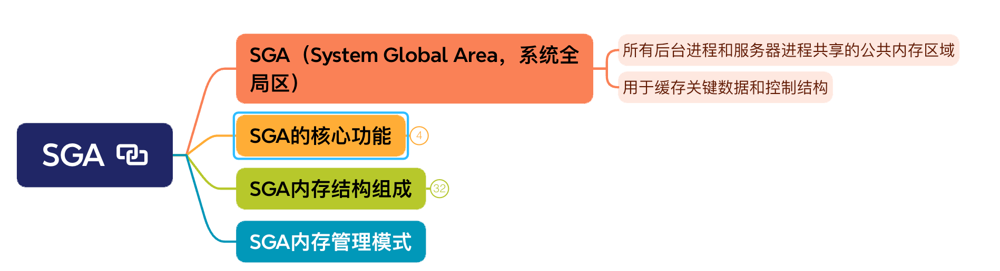

# SGA

## SGA（System Global Area，系统全局区）

### 所有后台进程和服务器进程共享的公共内存区域

### 用于缓存关键数据和控制结构

## SGA的核心功能

### 数据高速缓存：减少磁盘I/O，提升查询性能（如数据块的缓存）。

### 共享程序逻辑：重复利用解析后的SQL、PL/SQL代码（如共享池）。

### 事务持久性支持：管理Redo日志和Undo数据，确保ACID特性。

### 多实例协同（RAC）：在集群环境下跨节点共享资源。

## SGA内存结构组成

### SGA由多个子组件构成，各组件按需动态分配内存（取决于数据库版本和配置模式）

### 数据库缓冲区缓存

### 2. 共享池（Shared Pool）

- SQL和PL/SQL解析：缓存执行计划（Execution Plan）、解析树（Parse Tree）、游标（Cursor）。

- 数据字典缓存：存储表、索引的元数据（如USER_TABLES信息）。

- 关键子组件

	- Library Cache：存储SQL、PL/SQL的解析结果。

	- Data Dictionary Cache（Row Cache）：存储数据字典信息的行结构。

- 参数控制

	- SHARED_POOL_SIZE：初始分配大小（建议启用自动管理）。

### 3. Redo日志缓冲区（Redo Log Buffer）

- 临时存储事务产生的 Redo条目（Redo Entry），由 LGWR 进程定期写入Redo日志文件。

- 参数控制

	- LOG_BUFFER：缓冲区大小（静态参数，需重启生效），默认值通常为几十MB。

### 4. 大池（Large Pool）

- 分配大块内存供特定功能使用（需连续内存空间）：

- RMAN备份/恢复的I/O缓冲区。

- 并行查询进程间通信（RAC环境）。

- Shared Server模式的UGA（用户全局区）分配。

- 参数控制

	- LARGE_POOL_SIZE：显式配置大小（或由自动内存管理分配）。

### 5. Java池（Java Pool）

- 存储Java虚拟机（JVM）的会话数据（仅在使用Java存储过程或JServer时使用）。

- 参数控制

	- JAVA_POOL_SIZE：指定初始分配大小。

### 6. 流池（Streams Pool）

- 支持Oracle Streams或GoldenGate等高级复制功能。

- 参数控制

	- STREAMS_POOL_SIZE：显式配置或由自动内存管理分配。

### 7. 固定内存区（Fixed SGA）

- 存储数据库实例的 内部状态信息和控制结构（Oracle自行管理，不可配置）。

- 包括实例锁存器（Latches）的元数据、进程通信队列等。

## SGA内存管理模式

