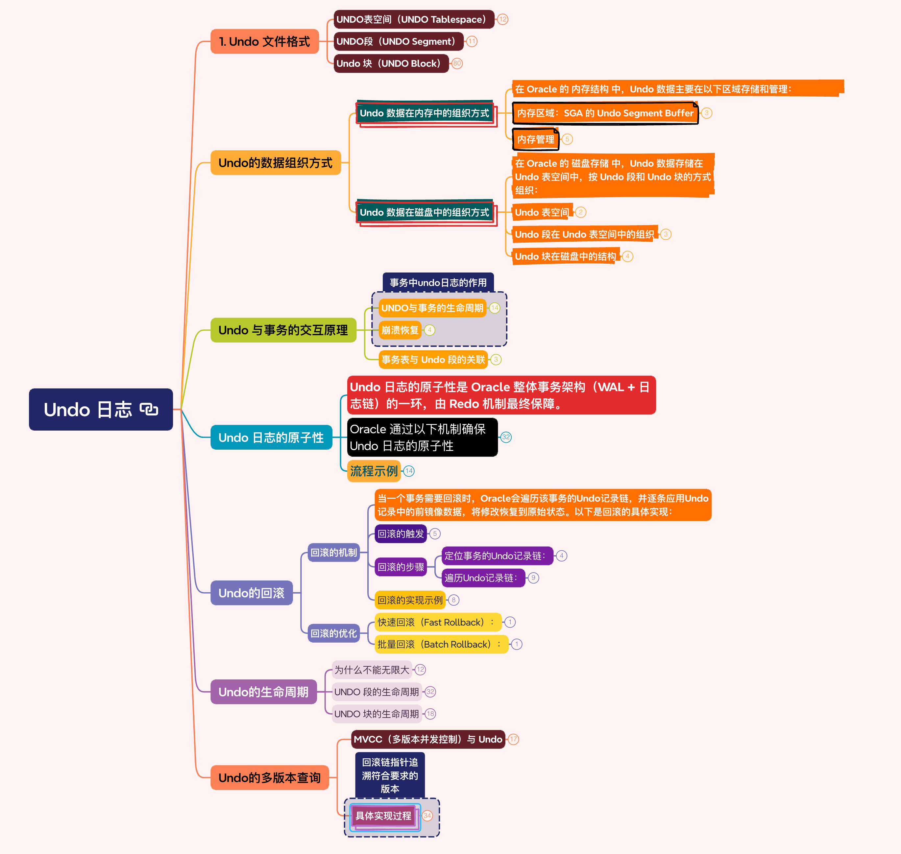

# Undo 日志

## 1. Undo 文件格式

### UNDO表空间（UNDO Tablespace）

- UNDO表空间是数据库中物理存储UNDO数据的逻辑容器，专门用于存储所有事务生成的UNDO记录。

- 一个数据库可以有多个 Undo 表空间，但同一时间只能有一个活动的 Undo 表空间。

- 核心作用：

	- 存储事务需要回滚的前镜像数据（旧数据）。

	- 支持长时间的读一致性（多版本一致性读取，即MVCC）。

	- 避免ORA-01555错误（快照过旧错误）。

- Undo 表空间的管理

	- 采用 自动 Undo 管理（AUM, Automatic Undo Management）：

		- Oracle 自动分配和回收 Undo 段。

		- 通过参数 UNDO_RETENTION 控制 Undo 数据的保留时间。

	- Undo 表空间的物理存储：

		- 由多个数据文件（.dbf）组成，与其他表空间类似。

### UNDO段（UNDO Segment）

- Undo 段存储在 Undo 表空间 中，其文件结构与普通数据文件类似，但专门用于存储事务的 回滚记录。每个 Undo 段由多个 Undo 块（Block）组成

- UNDO段（也称为回滚段，但只在手动管理模式下被显式管理）是UNDO表空间中的逻辑存储单元，
每个事务绑定到一个UNDO段来存储其UNDO记录。

- Undo 段（Undo Segments） 是 Undo 数据的逻辑存储单元

- Undo 段的大小是动态的，可以根据事务的需求自动扩展或收缩

- 核心作用：

	- 事务隔离：不同事务使用不同的UNDO段，或共享UNDO段中的UNDO块。

	- 按需扩展：UNDO段可以动态扩展（自动管理模式下）。

- 特点：

	- 自动分配：在AUM模式下，Oracle自动创建、分配和管理UNDO段，无需DBA干预。

	- 事务绑定：一个事务只能关联一个UNDO段，但一个UNDO段可以服务多个并发事务（除非设置了专用模式）。

	- 生命周期：UNDO段在事务完成（提交或回滚）后会被回收重用。

### Undo 块（UNDO Block）

- UNDO块是UNDO段中的最小物理存储单元，即Oracle数据块（通常为8KB或与数据库块大小一致），用于存储事务生成的UNDO记录。

- 存储单条或多条UNDO记录（前镜像数据、事务元数据等）。

- 特点：

	- 链式存储：一个事务的多个UNDO块以链表形式链接（通过Undo Block Pointer）。

	- 格式紧凑：UNDO块仅存储必要元数据（如事务ID、SCN、前镜像值等）。

	- 覆盖机制：已提交事务的UNDO块可以被新事务覆盖（取决于UNDO_RETENTION参数*）。

- Undo 块（UNDO Block）的组成

	- 块头（Block Header）

		- 事务槽（Transaction Slot）：

			- 记录事务的唯一标识符 XID（Transaction ID）。

				- Undo Segment Number：Undo 段编号。

				- Slot Number：事务槽号。

				- Sequence Number：序列号。

			- 事务状态（是否已提交、SCN、锁定信息等）。

		- 回滚记录（Undo Record）：

			- 行数据的旧值。

			- 被修改行的 ROWID 或 唯一标识。

			- 前镜像的指针（链表结构，链接同一事务的多个 Undo 记录）。

		- SCN（System Change Number）：

			- 标识数据变更的时间点，用于版本控制和一致性读。

		- Undo 类型（Undo Type）：

			- 标识操作类型

			- INSERT 对应的 Undo 记录是 DELETE。

			- DELETE 对应的 Undo 记录是 INSERT。

			- UPDATE 对应的 Undo 记录是反向 UPDATE。

		- 前向指针（Forward Pointer），后向指针（Backward Pointer）

			- 指向下一个 Undo 块，形成一个链式结构。

			- 用于事务回滚使用。

		- 块类型（Block Type）

			- 标识 Undo 块的类型。

	- Undo 记录（Undo Records）

		- 操作类型（Operation Code, Op Code）

			- 标识事务对数据行的操作类型。

			- INSERT（代码 0x12）：插入操作。

			- UPDATE（代码 0x1E）：更新操作。

			- DELETE（代码 0x2C）：删除操作。

		- 行地址（Rowid）

			- 大小：通常为 6 字节。

			- 作用：指向被修改行的原始物理地址（即数据块的 ROWID）。

			- 格式：由对象号（Data Object ID）、数据文件号、块号、行号组成。

		- 旧数据值（Old Data）

			- 大小：可变长度，取决于修改的列数和列类型。

			- 作用：保存修改前数据的旧值。

				- 对于 UPDATE 操作：存储被修改列的旧值。

				- 对于 DELETE 操作：存储完整行的旧值。

				- 对于 INSERT 操作：不需要存储旧值（直接记录事务是否需要回滚插入的行）。

		- 事务 ID（Transaction ID, XID）

			- 大小：通常为 8 字节。

			- 组成：

				- usn（Undo Segment Number）：Undo 段编号。

				- slot（Slot Number）：事务槽号。

				- seq（Sequence Number）：序列号。

			- 作用：唯一标识一个事务，用于关联事务及回滚数据。

		- 回滚链指针（Rollback Chain Pointer）

			- 大小：通常为 8 字节。

			- 作用：指向“前一个版本”的 Undo 记录地址（UBA），形成一个数据行的多版本链条。

			- 是一个指向 Undo 段中某个数据块的地址标识符

				- Segment Number：标识回滚段或 Undo 段的编号。

				- Block Number：标识数据块在段中的编号。

				- Sequence Number：标识数据块的序列号（用于区分同一个块的不同版本）。

			- 示例：

				- 假设事务 A 修改某行 → 事务 B 再次修改该行，每个事务的 Undo 记录通过此指针链接。

			- Prior UBA：

				- 在一些文档或视图中，这个指针可能直接以 PRIOR_UBA 字段命名。

			- Last UBA：

				- 旧版本中可能用类似的术语，但当前标准是 Rollback Chain Pointer。

		- 系统变更号（System Change Number, SCN）

			- 大小：6 或 8 字节（取决于 Oracle 版本）。

			- 作用：标记事务提交的时间点，用于一致性读和闪回操作。

		- 表信息（Table Information）

			- 大小：4 字节（数据对象号，Data Object ID）。

			- 作用：标识被修改行所属的表。

		- 用户信息（User Information）

			- 作用：记录执行事务的用户 ID（User ID）。

		- 其他控制信息

			- 描述：包括事务的提交标志、锁模式等辅助信息。

## Undo的数据组织方式

### Undo 数据在内存中的组织方式

- 在 Oracle 的 内存结构 中，Undo 数据主要在以下区域存储和管理：

- 内存区域：SGA 的 Undo Segment Buffer

	- Undo 段在 System Global Area (SGA) 的 Undo Segment Buffer 中被缓存。

	- 所有活动事务的 Undo 数据首先写入内存中的 Undo Segment Buffer，随后批量刷新到磁盘。

	- 内存中的 Undo 数据组织方式与磁盘中的 Undo 块一致。

- 内存管理

	- 事务写 Undo 数据：

		- 当事务修改数据时，Undo 数据会被写入活动 Undo 段的 Undo 块中。

		- 如果当前 Undo 块已写满，Oracle 会分配一个新的 Undo 块。

	- 后台进程刷新：

		- DBWn（Database Writer） 进程会将内存中的 Undo 块刷新到磁盘上的 Undo 表空间。

### Undo 数据在磁盘中的组织方式

- 在 Oracle 的 磁盘存储 中，Undo 数据存储在 Undo 表空间中，按 Undo 段和 Undo 块的方式组织：

- Undo 表空间

	- Undo 表空间是专门用于存储 Undo 数据的表空间。

	- 一个数据库可以有多个 Undo 表空间，但同一时间只能有一个活动的 Undo 表空间。

- Undo 段在 Undo 表空间中的组织

	- 每个 Undo 表空间包含多个 Undo 段。

	- 每个 Undo 段由多个 Undo 块组成。

	- Undo 段的大小是动态的，可以根据事务的需求自动扩展。

- Undo 块在磁盘中的结构

	- 块头（Block Header）：

		- 记录 Undo 块的元数据，例如块号、段号、事务 ID 等。

	- Undo 记录（Undo Records）：

		- 存储事务的实际 Undo 数据，包括旧数据值、事务元数据和操作类型。

## Undo 与事务的交互原理

### UNDO与事务的生命周期

- 事务开始时：

	- Oracle 分配一个 Undo 段 和一个事务槽（XID）。

- 执行 DML 操作时：

	- 生成回滚记录：每次修改数据前，旧数据会被写入 Undo 段的 Undo 记录。

	- 记录到 Redo Log：Undo 段的修改也会生成 Redo 日志（确保 Undo 自身的恢复）。

- 事务提交（COMMIT）：

	- LGWR 进程将 Redo Log Buffer 写入磁盘，确保持久性。

	- 已提交事务的 Undo 数据不会被立即清除，而是根据 UNDO_RETENTION 保留一段时间。

- 事务回滚（ROLLBACK）：

	- Oracle 从 Undo 段中逆向应用回滚记录，恢复数据到原始状态。

		- 找到事务关联的 Undo 段。

		- 根据回滚记录链，逆向撤销所有修改操作。

		- 释放事务占用的锁与资源。

### 崩溃恢复

- 若事务提交前系统崩溃，Oracle 在重启后 自动回滚未提交事务：

- 通过 事务表（Transaction Table） 识别未提交的事务。

- 利用 Undo 段中的回滚记录链恢复数据。

- 通过 Redo Log 同步已提交的修改（确保数据与日志一致）。

### 事务表与 Undo 段的关联

- Oracle 通过 事务表（Transaction Table） 维护事务的状态（如 V$TRANSACTION）：

- 每个事务的 XID、SCN、状态（提交或活跃）、关联的 Undo 段地址等。

- 在崩溃恢复时，SMON 进程利用事务表和 Undo 段回滚未提交事务。

## Undo 日志的原子性

### Undo 日志的原子性是 Oracle 整体事务架构（WAL + 日志链）的一环，由 Redo 机制最终保障。

### Oracle 通过以下机制确保 Undo 日志的原子性

- Redo 日志记录 Undo 的修改

	- 核心原则：

		- 所有对 Undo 段的修改也会生成 Redo 日志。

		- 包括：写入 Undo 块（Undo Record）和更新事务表（Transaction Table）的操作。

		- Redo 日志机制覆盖了所有数据库的修改（包括对 Undo 段的修改）。

	- 关键逻辑：

		- 顺序性：对 Undo 段的修改 先记录到 Redo 日志，再写入内存中的 Buffer Cache。

		- 持久性：事务提交时，LGWR 进程将 Redo 日志强制刷盘（这是持久性保障的核心）。

		- 恢复能力：崩溃后通过 Redo Log 恢复 Undo 段的状态，再通过 Undo 段回滚事务。

	- 记录内容

		- Undo 块的变更信息

			- Undo 块地址：

				- 记录 Undo 块所在的 表空间号（TSN）、数据文件号（Rel File Number）、块号（Block Number）。

			- Undo 块头的修改：

				- 事务槽（Transaction Slot）的分配（如事务的 XID）。

				- Undo 块的状态位（如是否已满）。

			- Undo 记录的插入：

				- 记录的旧数据值（如某行的原始 salary=8000）。

				- 操作的 Undo 类型（如 DELETE、INSERT 或 UPDATE 的反向操作）。

				- 关联的 ROWID 或唯一标识符（以定位目标数据块）。

				- 事务的 XID 和 SCN（系统变更号）。

			- 回滚链指针：

				- 一个事务可能分多次写入多个 Undo 块，Redo 日志会记录 Undo 记录之间链接的指针。

		- 事务表的修改

			- 事务状态更新：

				- 记录事务的状态变更（如标记为活动状态 ACTIVE）。

			- SCN 与时间范围：

				- 记录事务开始的 SCN 和提交的 SCN。

- WAL（Write-Ahead Logging）协议

	- Oracle 严格遵循 WAL（预写式日志） 原则：

	- 所有数据块的修改（包括 Undo 块的修改）必须先写入 Redo 日志，再写入内存或磁盘。

	- 防止不一致性：即使 Undo 段的修改未完全落盘，Redo 日志已记录完整操作步骤。

### 流程示例

- 步骤 1：生成 Undo 记录

	- 修改前：Oracle 将该行的旧值写入 Undo 段的 Undo 块。

	- 生成 Redo 日志：Undo 块的修改操作被记录到 Redo Log Buffer。

- 步骤 2：修改数据块

	- 新值写入内存：将新数据写入 Buffer Cache 中的数据块。

	- 生成 Redo 日志：数据块的修改也被记录到 Redo Log Buffer。

- 步骤 3：事务提交。刷盘顺序：

	- LGWR 将 Redo Log Buffer 中 所有事务相关的 Redo 日志（包括 Undo 修改日志）强制写入磁盘。

	- 确保 Undo 修改的原子性被持久化。

	- 异步写入数据文件：DBWn 进程稍后将脏数据块（包含 Undo 段和数据块的修改）写入磁盘。

- 崩溃恢复场景：

	- 若步骤 3 前系统崩溃：

	- Oracle 重启时通过 Redo 日志 重放 Undo 段和数据块的修改，恢复其完整性。

	- 发现事务 A 未提交，通过已恢复的 Undo 数据回滚事务。

## Undo的回滚

### 回滚的机制

- 当一个事务需要回滚时，Oracle会遍历该事务的Undo记录链，并逐条应用Undo记录中的前镜像数据，将修改恢复到原始状态。以下是回滚的具体实现：

- 回滚的触发

	- 显式回滚：用户执行ROLLBACK语句。

	- 隐式回滚：事务失败，Oracle自动触发回滚。

	- 崩溃恢复：实例崩溃后，Oracle在恢复阶段回滚未提交事务。

	- 死锁被检测到，事务被选为牺牲者。

	- 事务错误：如违反约束触发的自动回滚。

- 回滚的步骤

	- 定位事务的Undo记录链：

		- Oracle首先通过事务表找到该事务对应的事务槽。

		- 从事务槽中获取该事务的Undo记录链起始指针。

			- Oracle 通过事务的 XID（XID = usn.slot.seq）确定其绑定的 Undo 段号（usn）和对应槽位（slot）。

			- Undo 段的管理结构（如 v$transaction 视图）会记录事务的 Undo 段分配信息。

	- 遍历Undo记录链：

		- 从Undo记录链的头部（最近生成的Undo记录）开始，逐个处理Undo记录。

		- 对于每个Undo记录，Oracle会：

			- 读取前镜像数据（Before Image）。

			- 将其写回到对应的数据块中，恢复原始数据。

			- 生成 Compensating Redo：

				- 为保证恢复操作的持久性，将回滚操作本身写入 Redo 日志缓冲区。

		- 释放资源：

			- 回滚完成后，Oracle会释放该事务占用的Undo空间。

		- 更新事务表，将该事务槽标记为可用。

- 回滚的实现示例

	- 假设事务T1修改了表A的某一行，以下是回滚的流程：

	- 事务表查找：

		- Oracle在事务表中找到事务T1对应的Undo记录链起始指针。

	- Undo记录链遍历：

		- 从链头开始，Oracle读取Undo记录中的前镜像数据。

		- 将前镜像数据写回到表A的对应行中。

	- 资源释放：

		- 回滚完成后，Oracle释放T1的Undo记录链空间，并更新事务表。

### 回滚的优化

- 快速回滚（Fast Rollback）：

	- 如果事务在回滚过程中被中断或崩溃，Oracle会在实例恢复时继续回滚，确保一致性。

- 批量回滚（Batch Rollback）：

	- 对于大量Undo记录，Oracle会批量处理，提高回滚效率。

## Undo的生命周期

### 为什么不能无限大

- 资源的平衡：消耗、事务保证

- 性能严重下降

	- UNDO 段中数据过多会导致以下问题：

		- 链式遍历时间剧增：在多版本读（MVCC）场景中，遍历巨长的 UNDO 链会大幅增加查询延迟。

		- UNDO 段管理效率降低：Oracle 需要频繁扫描和管理大容量 UNDO 块，占用 CPU 和 I/O 资源。

- 数据一致性和恢复风险

	- 写入冲突问题：

		- 永久保留的 UNDO 数据可能包含已经被其他事务覆盖的老旧行版本，导致 MVCC 判断时出现逻辑混乱。

	- 事务恢复复杂性：

		- 崩溃恢复阶段需要扫描过多 UNDO 数据，增大恢复时间窗口。

- 存储成本不可控

	- 永久保留将导致 UNDO 表空间无限膨胀，存储管理成本极高。

### UNDO 段的生命周期

- UNDO 段是 UNDO 表空间中的逻辑结构，由若干个 UNDO 块组成。

- 1. 创建

	- 当 Oracle 的 自动 UNDO 管理（Automatic Undo Management, AUM） 检测到需要更多 UNDO 支持时，动态创建新的 UNDO 段。

	- 参数控制：

		- UNDO_TABLESPACE：指定 UNDO 表空间。

		- UNDO_RETENTION：设置 UNDO 数据保留时间。

	- 过程：

		- Oracle 后台进程（如 SMON）从 UNDO 表空间中分配连续的扩展区（Extent）。

		- 将扩展区初始化为 UNDO 段，并添加到活跃 UNDO 段池中。

- 2. 分配给事务

	- 当新事务启动时，Oracle 为其选择一个可用的 UNDO 段（通过轮询算法均衡负载）。

	- 事务绑定到分配的 UNDO 段，段内的事务槽表（Transaction Slot Table）记录活动事务的元数据。

	- 扩展性：

		- 如果事务修改大量数据导致 UNDO 段不足（块耗尽），UNDO 段会自动扩展额外的扩展区（Extent）。

- 3. 活动阶段（Active Usage）

	- 用户事务写入 Undo 记录：

		- 所有修改数据的操作（INSERT/UPDATE/DELETE）都会在 UNDO 块中生成 UNDO 记录。

		- 数据状态：

			- Active：事务未提交或未回滚的 UNDO 数据。

			- Unexpired：事务已提交但尚未超过 UNDO_RETENTION 时间的 UNDO 数据。

			- Expired：超过保留时间的 UNDO 数据（可被覆写）。

- 4. 回收与重用

	- 回收条件：

		- 事务已完成（COMMIT/ROLLBACK）且 UNDO 数据已过期：

		- UNDO 段的扩展区被标记为 EXPIRED。

		- UNDO 表空间空间不足：优先覆盖 EXPIRED 状态的 UNDO 段块。

	- 回收过程：

		- SMON 后台进程周期性扫描 UNDO 段，释放过期块。

		- 收缩（Shrink） UNDO 段，将空闲扩展区返还给 UNDO 表空间。

		- 其他事务可复用已释放的 UNDO 块。

- 5. 销毁

	- 仅当 UNDO 表空间被强制收缩或数据库重建时，UNDO 段会被删除。

### UNDO 块的生命周期

- UNDO 块是 UNDO 段中的物理存储单元（大小与数据库块一致，通常为 8KB），生命周期如下：

- 1. 创建与初始化

	- UNDO 段首次分配扩展区时，初始化其包含的所有 UNDO 块。

	- 块头写入 UNDO 段的元数据（段号、事务槽表等）。

- 2. 事务使用阶段

	- 事务执行 DML 操作时，分配一个或多个 UNDO 块。

	- 在块内按顺序写入 UNDO 记录（操作类型、旧值、SCN 等）。

	- 链式管理：

		- 若块写满，新块被分配并与当前块链接（通过块头的前向/后向指针）。

- 3. 事务提交后的状态转换

	- Active → Unexpired：事务提交后，UNDO 数据需保留至少 UNDO_RETENTION 时间。

	- Unexpired → Expired：经过 UNDO_RETENTION 时间后，UNDO 数据标记为可回收。

	- 空间压力下的强制过期：

		- 如果 UNDO 表空间不足，Oracle 可能提前覆盖未过期的 UNDO 块（若未启用 RETENTION GUARANTEE）。

- 4. 回收与覆写

	- 块内所有 UNDO 记录均已过期，或空间压力需要回收。

	- 块被标记为 FREE，允许新事务覆写。

	- 新事务优先使用空闲块，而非扩展新的 UNDO 区。

## Undo的多版本查询

### MVCC（多版本并发控制）与 Undo

- MVCC 是 Oracle 实现高并发读写的核心技术，其核心依赖 Undo 段实现一致性读（Consistent Read）

- (1) 读操作的 SCN 标识

	- 每个查询开始时，Oracle 会生成一个 查询级 SCN，记录当前的数据库时间点。

		- 例如：查询开始时 SCN = 1000，要求看到 SCN <= 1000 的数据。

- (2) 数据的多版本生成

	- 当一个事务修改数据时，旧版本的数据被写入 Undo 段，形成一条 版本链。

		- 例如：当事务 A 将某行的工资从 8000 修改为 9000（SCN=1001）：

		- 当前数据块的版本为 SCN=1001（新值 9000）。

		- Undo 段中保存旧值 8000，对应 SCN=1000。

- (3) 一致性读的实现

	- 如果另一个查询的 SCN=1000 尝试读取该行：

	- Oracle 检查当前数据块的 SCN（1001），发现其大于查询的 SCN（1000）。

	- 通过 Undo 段中的旧值链（SCN=1000），找到所需版本的数据（8000）。

	- 返回旧值，确保读操作不会看到未提交或新提交的修改。

- (4) 关键特性

	- 无锁读取：读操作不需要锁（避免了与写操作的竞争）。

	- 版本链回溯：Undo 段中保留多版本数据，确保不同时间点的查询看到一致的数据快照。

### 具体实现过程

- MVCC的实现基于Undo 段 中的历史版本数据链（通过 UBA 和回滚链指针构建）

	-  

- 准备工作：查询的 SCN 确定

	- 当一个查询启动时，Oracle 会立即记录该查询的 一致性读 SCN（Query SCN）

	- 所有返回的数据必须满足：数据的 SCN ≤ Query SCN。

- 首次检查数据行的当前版本

	- 查询首先访问目标数据行：

	- 行头中的 UBA 会指向该行最新一次修改的 Undo 记录

	- 检查当前行版本的状态：

		- 版本符合要求

			- 未被修改：直接返回该行的当前值。

			- 被修改但未提交：需要通过 UBA 找到 Undo 记录中的旧值。

			- 已提交但修改时间SCN > Query SCN：需要回溯到更老的版本。

		- 版本不符合要求

			- 需要回溯到更老的版本。

- 如果当前行版本不满足一致性要求（例如其 SCN > Query SCN），则触发 MVCC 回溯机制

	- 步骤 1：根据行头 UBA 获取 Undo 块

		- 解析 UBA（例如 0x0001.3000.1）：

			- Segment Number（段号）：0x0001 → 定位到对应 Undo 段。

			- Block Number（块号）：0x3000 → 找到对应的 Undo 块。

			- Sequence Number（序列号）：0x0001 → 可能用于校验或版本标识。

	- 步骤 2：读取 Undo 记录

		- 提取 Undo 记录中的 SCN 和操作类型：

			- 若该 Undo 记录的 SCN ≤ Query SCN（例如 SCN=2500），则使用其旧值。

			- 若该记录未提交（Active）或其 SCN > Query SCN（例如 SCN=3000），继续回溯。

	- 步骤 3：沿回滚链指针回溯旧版本

		- 回滚链指针：从当前 Undo 记录中提取指向更老版本的 UBA（例如 Prior UBA = 0x0001.2000.1）。

		- 重复步骤 1~2，检查每个 Undo 记录的 SCN，直到找到满足条件的记录。

- 停止条件和结果

	- 匹配的版本：找到 SCN ≤ Query SCN 的 Undo 记录，将其旧值返回给查询。

	- 版本链断裂：

		- 若回滚链指针指向 NULL 且版本仍不满足：

			- 该行不存在于查询的 SCN 时刻（例如查询 SCN 早于行的插入时间）。

		- 若 Undo 记录已被覆盖：引发 ORA-01555: snapshot too old 错误。

