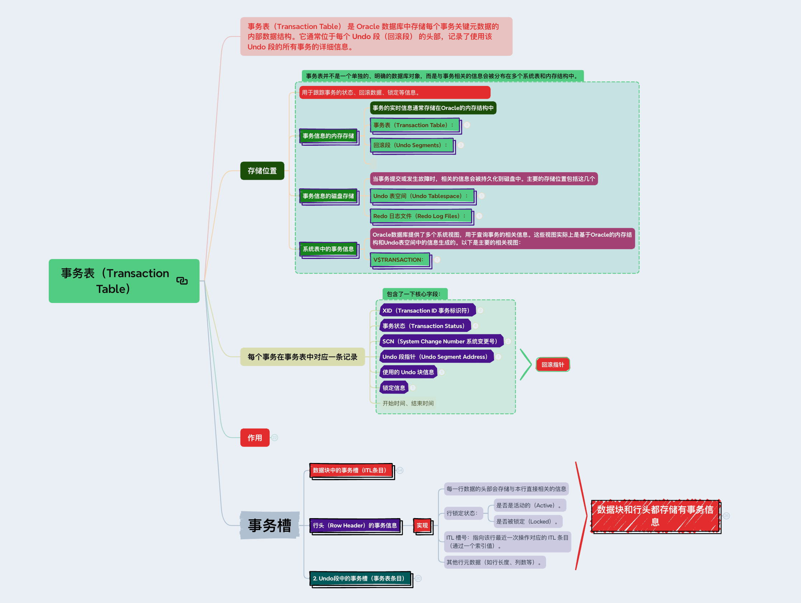

# 事务表（Transaction Table）

## 事务表（Transaction Table） 是 Oracle 数据库中存储每个事务关键元数据的内部数据结构。它通常位于每个 Undo 段（回滚段） 的头部，记录了使用该 Undo 段的所有事务的详细信息。

## 存储位置

### 用于跟踪事务的状态、回滚数据、锁定等信息。

### 事务信息的内存存储

- 事务的实时信息通常存储在Oracle的内存结构中

- 事务表（Transaction Table）：

	- 事务表是Oracle数据库在内存中的一种数据结构，位于 System Global Area (SGA) 的 Undo Segment 部分。

	- 每个事务在开始时会分配一个事务槽（Transaction Slot），记录事务的ID、状态（活动、已提交、回滚）、开始时间、回滚段信息等。

	- 这些信息用于快速访问事务的状态，以便在事务提交或回滚时进行处理。

- 回滚段（Undo Segments）：

	- 回滚段存储事务的 回滚数据，即事务在修改数据之前保存的旧值。

	- 回滚段也包含事务的相关信息，例如事务的ID、回滚段的编号等。

	- 这些信息主要用于实现事务的原子性（要么全部提交，要么全部回滚）和多版本读一致性（MVCC）。

### 事务信息的磁盘存储

- 当事务提交或发生故障时，相关的信息会被持久化到磁盘中。主要的存储位置包括这几个

- Undo 表空间（Undo Tablespace）：

	- 回滚数据最终会被写入到Undo表空间的 Undo Segment 中。

- Redo 日志文件（Redo Log Files）：

	- 当事务提交时，相关信息（如事务ID、提交时间等）会被写入Redo日志文件。

### 系统表中的事务信息

- Oracle数据库提供了多个系统视图，用于查询事务的相关信息。这些视图实际上是基于Oracle的内存结构和Undo表空间中的信息生成的。以下是主要的相关视图：

- V$TRANSACTION：

	- 这是Oracle的动态性能视图（Dynamic Performance View），用于显示当前活动事务的信息。

	- 存储位置：V$TRANSACTION是基于内存中的事务表（Transaction Table）信息生成的。

	- 主要字段：

		- XID：事务的唯一标识符。

		- STATUS：事务的状态（ACTIVE, COMMITTED, ROLLED BACK）。

		- START_TIME：事务的开始时间。

		- USED_UBLK：事务使用的回滚块的数量。

## 每个事务在事务表中对应一条记录

### XID（Transaction ID 事务标识符）

- 唯一标识事务的全局编号，由 Undo 段号 + Slot 号 + Wrap 号 组成。

- 例如：XID: 0x0012.011.00000001，表示使用第 18 号 Undo 段，槽位 11，序列码 1。

### 事务状态（Transaction Status）

- 标记事务的当前状态：

- ACTIVE：事务正在进行中（未提交）。

- COMMITTED：事务已提交。

- ROLLED BACK：事务已回滚。

### SCN（System Change Number 系统变更号）

- 记录事务的 开始 SCN 和 提交 SCN（若已提交）。

- 用于多版本并发控制（MVCC）和时间点恢复。

### Undo 段指针（Undo Segment Address）

- 指向事务对应的 Undo 段位置，包含该事务所有的回滚记录链。

### 使用的 Undo 块信息

- 记录事务生成的 Undo 记录所在的块地址和长度，形成一个链表结构，用于逆向回滚。

### 锁定信息

- 记录事务持有的行级锁（Row Locks），用于并发控制。

### 开始时间、结束时间

## 作用

### 事务表是 Oracle 实现事务管理、并发控制和崩溃恢复的核心组件，具体作用如下：

### 1. 支持事务原子性（Atomicity）

- 通过跟踪事务状态（提交或活动），当事务回滚或系统崩溃时，Oracle 根据事务表中的记录定位 Undo 数据，逆向恢复修改前的状态。

- 示例：

	- 事务 A 修改数据但未提交，系统崩溃恢复时，SMON 进程通过事务表发现该事务未提交，利用其对应的 Undo 数据回滚修改。

### 2. 实现多版本并发控制（MVCC）

- 事务表中的 SCN 标记数据变更的时间点，确保查询能够读取一致性的版本（Read Consistency）。

- 示例：

	- 查询触发时基于起始 SCN，若某行数据的当前 SCN 大于查询 SCN，Oracle 通过事务表中的 Undo 段指针获取旧版本数据。

### 3. 管理回滚段（Undo Segments）

- 每个事务分配到一个 Undo 段的某个 Slot（槽位），事务表记录其使用的 Undo 资源，便于高效定位和回收。

- 示例：

	- 事务提交后，其占用的 Undo 段槽位不会立即清除，而是根据 UNDO_RETENTION 参数保留一段时间。

### 4. 支持崩溃恢复

- 在崩溃恢复（Instance Recovery）时，事务表帮助 SMON 进程识别需要回滚的未提交事务。

- 步骤：

	- Redo 阶段：通过 Redo Log 重放所有已提交事务的修改。

	- Undo 阶段：根据事务表回滚未提交事务。

### 5. 锁管理

- 跟踪事务所持有的行级锁，确保并发操作时的数据一致性。

- 示例：

	- 事务 A 更新某行时，会在事务表中记录行锁，阻塞其他事务对该行的写操作。

## 事务槽

### 数据块中的事务槽（ITL条目）

- 数据块的头部包含一个 Interested Transaction List（ITL），即事务槽列表。

- 每个事务槽（ITL Entry） 记录了一个事务修改该数据块时所需的元数据信息。

- Interested Transaction List（ITL）

	- 一个数据块中可以包含 多条事务信息

	- 多个事务访问同一个数据块：

		- 如果一个数据块中有多行数据被不同的事务访问或修改，每个事务都会在 ITL 中占据一个 ITL 条目。

		- 例如，事务 A 修改了行 1，事务 B 修改了行 2，那么这两个事务都会在 ITL 中分别记录它们的信息。同时标记行头。

		- 那就就插入ITL，等待行锁。

	- ITL 条目的数量：

		- 每个数据块的 ITL 可以包含多个 ITL 条目，具体数量由以下参数决定：

		- INITRANS：指定数据块初始化时分配的 ITL 条目数量，默认值为 1 或 2。

		- MAXTRANS：指定数据块中最多可以分配的 ITL 条目数量（在高版本 Oracle 中已被废弃，默认值为 255）。

		- 如果 ITL 条目被用完，Oracle 会动态扩展 ITL，但扩展可能会引发数据块的碎片化。

	- ITL的生命周期

		- ITL 条目真正被 覆盖或重置 的条件为：

			- 对应事务已提交或回滚，且事务使用的 UNDO 段数据已过期。

			- 数据块中的空闲空间不足，导致 Oracle 必须重用旧 ITL 条目的位置。

		- ITL 条目的生命周期

			- 阶段 1：事务提交（COMMIT）或回滚（ROLLBACK）

				- 事务提交或回滚时：

					- ITL 条目中的事务状态会被标记为 COMMITTED 或 ROLLED BACK。

					- 在提交后，事务修改的行的锁会释放，但 ITL 条目本身 并不会立即被删除。

				- 保留原因：

					- 支持 一致性读（Read Consistency）：其他事务可能需要通过 ITL 条目访问回滚段（Undo Segment）来读取该事务提交前的旧版本数据。

					- 直到回滚段中的对应 UNDO 数据失效后，ITL 条目才会被重用或清除。

			- 阶段 2：数据块的空间重用

				- 当一个数据块中的行被覆盖（例如插入新行或更新旧行）或数据块被重新初始化（例如通过 ALTER TABLE SHRINK SPACE）时：

					- Oracle 会检查数据块中所有 INACTIVE 的 ITL 条目（即事务已提交或回滚）。

					- 如果这些 ITL 条目关联的 UNDO 数据已失效（如对应的 UNDO 段已被覆盖），则会将 ITL 条目标记为 可重用。

				- 可重用的 ITL 条目：

					- 会被新事务直接覆盖，无需删除原有 ITL 条目。

			- 阶段 3：系统后台进程清理

				- Oracle 的后台进程（如 DBWn 或 CKPT）在刷新脏块到磁盘时：

				- 可能会合并或清理不再需要的 ITL 条目，以优化磁盘空间。

	- ITL 条目（ITL Entry）

		- 内部实现

			- 每个ITL条目包含以下信息

			- 事务ID（XID）：唯一标识事务的ID。

			- Undo段地址（UBA）：指向Undo段中对应的Undo记录。

			- SCN（System Change Number）：事务提交时的时间戳，用于版本控制。

			- 事务状态（如活动ACTIVE、已提交COMMITTED、已回滚ROLLED BACK）。

			- 锁信息：行级锁的状态（例如哪些行被该事务锁定）。

	- 动态扩展 ITL：

		- 如果需要更多 ITL 条目，Oracle 会从数据块的空闲空间（Free Space）中分配新的 ITL 条目。

		- 如果数据块的空闲空间不足，可能会导致事务无法继续执行，并抛出 ORA-01555: snapshot too old 或 ORA-00060: deadlock detected 错误。

- 用途

	- 并发控制：

		- 当一个事务修改数据块中的行时，通过写入ITL条目来声明“事务正在操作此块”。

		- 后续事务访问该块时，根据ITL条目判断是否需等待锁释放或使用Undo数据构建一致性读。

	- 多版本控制（MVCC）：

		- 利用SCN判断数据的可见性。当一个查询开始（基于其SCN），未被提交或在其之后提交的事务变更将被忽略，通过Undo数据重建旧版本。

- 参数调优

	- INITRANS：定义块创建时初始的ITL数量（默认2）。

	- MAXTRANS：块允许的最大ITL数量（Oracle 10g后默认255）。若ITL不足，可能引发“ITL等待”，需调整参数或重组表。

### 行头（Row Header）的事务信息

- 实现

	- 每一行数据的头部会存储与本行直接相关的信息

	- 行锁定状态：

		- 是否是活动的（Active）。

		- 是否被锁定（Locked）。

	- ITL 槽号：指向该行最近一次操作对应的 ITL 条目（通过一个索引值）。

	- 其他行元数据（如行长度、列数等）。

### 2. Undo段中的事务槽（事务表条目）

- 定义

	- Undo段 用于存储事务的Undo数据（旧版本数据），支持回滚和读一致性。每个Undo段由多个块组成，其头块包含一个 事务表（Transaction Table）。

	- 事务槽 记录了使用该Undo段的事务状态和Undo记录的位置。

- 内部实现

	- 数据结构：每个事务槽（事务表条目）包含：

	- 事务ID（XID）和状态（活动、已提交、已回滚）。

	- Undo记录链指针：指向该事务的所有Undo记录的链表地址。

	- 开始和结束SCN：事务的生命周期时间戳。

- 用途

	- 事务回滚：

		- 回滚时，Oracle根据事务槽找到对应的Undo记录链，逆向执行Undo操作。

	- 读一致性：

		- 当查询需要旧版本数据时，通过事务槽定位到特定Undo记录来重构数据。

	- 崩溃恢复：

		- 在实例恢复中，Oracle通过扫描Undo段的事务槽，确定未提交事务以进行回滚，确保数据一致性。

- 管理

	- 自动Undo管理（AUM）：

		- 通过UNDO_TABLESPACE参数配置，Oracle自动管理Undo段的创建和回收。

	- 保留时间：

		- UNDO_RETENTION参数控制Undo数据的保留时间，避免长查询因Undo被覆盖而失败。

