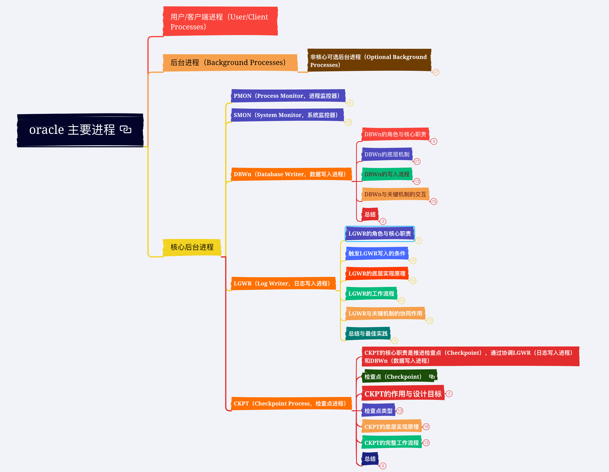

# oracle 主要进程

## 用户/客户端进程（User/Client Processes）

## 后台进程（Background Processes）

### 非核心可选后台进程（Optional Background Processes）

- 这些进程根据数据库配置或特定功能需求启用，而非实例运行的基础必需进程

- ARCn（归档进程，如ARC0、ARC1）

	- 作用：在开启**归档模式（ARCHIVELOG）**时，将已满的联机重做日志文件（Online Redo Log）复制到归档日志（Archive Log）。

	- 触发条件：联机日志组切换时。

	- 配置参数：

		- LOG_ARCHIVE_MAX_PROCESSES：控制最大归档进程数（默认值通常为2）。

		- LOG_ARCHIVE_DEST_n：指定归档目标路径。

- CJQ0（协调器进程）与Jnnn（作业队列进程，如J000、J001）

	- 作用：管理和执行周期性任务（如DBMS_JOB或DBMS_SCHEDULER调度的作业）。

	- 激活条件：

		- 使用定时任务功能时自动启用。

		- 参数JOB_QUEUE_PROCESSES控制Jnnn进程数量（默认值为0，禁用时需要调大）。

- RECO（分布式恢复进程）

	- 作用：在分布式事务（跨数据库事务）中，自动解决因网络中断或节点故障导致的未完成事务（如两阶段提交失败）。

	- 常见场景：分布式事务提交过程中某个节点宕机，RECO会自动回滚或提交事务。

	- 激活条件：数据库存在分布式事务时自动启用。

- QMNC（队列监控协调器）与Qnnn（队列监控进程，如Q000、Q001）

	- 作用：

		- QMNC协调和管理AQ消息队列的监控任务。

		- Qnnn子进程具体执行队列的传播、处理订阅通知等操作。

	- 激活条件：

		- 使用AQ功能时自动启用（需执行队列相关操作）。

	- 配置参数：

		- AQ_TM_PROCESSES：控制队列监控进程数量（默认值为1）。

- MMON（可管理性监控进程）与Mnnn（临时进程）

	- 作用：

		- 收集性能指标，生成ASH（Active Session History）和AWR（Automatic Workload Repository）快照。

		- 自动执行ADDM（Automatic Database Diagnostic Monitor）分析。

	- 触发条件：

		- 默认每小时生成一次AWR快照，通过STATISTICS_LEVEL参数配置数据收集级别。

- LSP0（逻辑备库进程）

	- 作用：在逻辑备库（Logical Standby）中，解析主库传输的Redo日志，转换为SQL语句在备库执行。

	- 激活条件：仅当逻辑备库模式启用时存在。

- DBRM（数据库资源管理进程）

	- 作用：执行资源管理计划（Resource Manager），控制CPU、并行度等资源分配。

	- 激活条件：启用资源管理器（RESOURCE_MANAGER_PLAN参数指定计划）时启用。

- DIAG（诊断守护进程）

	- 作用：监控实例健康状态（如hang检测），生成诊断转储文件。

- VKTM（虚拟时间管理进程）

	- 作用：提供高精度时间同步服务（如Flashback、SCN生成依赖）。

- FBDA（Flashback数据归档进程）

	- 作用：在启用Flashback Data Archive时，负责将历史数据归档到指定表空间。

- LMON（全局队列服务监控进程）：管理集群全局资源和节点状态。

- LMD（全局队列服务守护进程）：处理全局锁请求。

- LCKn（全局锁进程）：管理实例间的资源锁定。

- RMSn（资源管理进程）：协调集群资源分配（如服务优先级）。

## 核心后台进程

### PMON（Process Monitor，进程监控器）

- 核心职责：

	- 异常会话清理：当用户进程异常终止（如客户端断连、进程崩溃）时，PMON 负责回收该会话占用的资源（如内存、锁）。

	- 会话状态回滚：如果会话在事务未提交时终止，PMON 会回滚未提交的事务（即恢复至一致性状态）。

	- 注册失败清理：释放失效的监听注册信息，确保客户端能重新连接。

- 典型案例：

	- 用户执行一个长时间事务，中途断网导致会话中断 → PMON自动回滚未提交操作，释放该会话的锁和事务槽（Transaction Slot）。

### SMON（System Monitor，系统监控器）

- 核心职责：

	- 数据库异常关闭（如断电）后重启时，SMON 执行以下操作：

		- 前滚（Redo Apply）：基于重做日志（Redo Log）重放最后一次检查点（Checkpoint）后的操作，恢复已提交但未写入数据文件的修改。

		- 回滚（Undo Apply）：使用撤销段（Undo Segments）回滚未提交的事务。

- 空间管理：

	- 合并表空间中连续的未使用块（Free Space Coalescing），避免碎片化。

	- 清理临时表空间的残留临时段（Temporary Segments）。

	- 字典表维护：定期验证系统表空间（如 SYSTEM 表空间）的一致性。

- 典型案例：

	- 数据库崩溃后重启 → SMON 自动执行实例恢复，保证数据一致性。

### DBWn（Database Writer，数据写入进程）

- DBWn的角色与核心职责

	- DBWn是数据库缓冲区缓存（Buffer Cache）与物理数据文件之间的桥梁，主要职责是将缓冲区中的脏块异步写入数据文件，保证数据持久性。

	- 脏块（Dirty Block）：在Buffer Cache中被修改但未写入磁盘的数据块。

	- 异步写入：DBWn的写入操作不与事务提交同步（事务提交仅依赖LGWR刷写Redo Log）。

- DBWn的底层机制

	- Buffer Cache管理

		- Buffer Cache是内存区域，保存最近访问的数据块（Block）。

		- 数据库缓冲区缓存

	- DBWn的关键行为：

		- 将脏块从Buffer Cache写入数据文件（写操作完成后，脏块变为Clean块，但保留在Buffer Cache中）。

		- 维护LRU（Least Recently Used）链表，
优先淘汰最久未访问的Clean块，释放内存空间。

	- 写入触发条件

		- 检查点（Checkpoint）

			- CKPT进程触发检查点时，DBWn将所有脏块写入磁盘（全量检查点）或特定范围内的脏块（增量检查点）。

			- 增量检查点（默认方式）：仅写入由当前检查点SCN（System Change Number）之前的脏块。

		- 缓冲区空间不足

			- 当进程需要读取新块到Buffer Cache时，若发现可用缓冲区不足，触发DBWn清理脏块，释放空间。

		- 定时触发

			- 默认每隔3秒，DBWn会检查一次是否有需要写入的脏块。

		- 表空间操作

			- 执行ALTER TABLESPACE ... OFFLINE NORMAL或数据文件离线时，强制写入相关脏块。

	- 多DBWn进程的协作

		- 默认启动1个DBWn进程（DBW0），可通过参数DB_WRITER_PROCESSES配置多个进程（如DBW1、DBW2等），提升高负载下的写入效率。

		- 多进程工作方式：

			- Oracle将Buffer Cache的哈希链（Hash Chain）分片，每个DBWn进程负责特定范围的链，避免锁竞争。

			- 多进程并行写入数据文件（物理写入由操作系统调度）。

- DBWn的写入流程

	- 脏块标识

		- 每当事务修改Buffer Cache中的块时，将该块标记为脏块，并记录对应的Redo Log条目。

	- 脏块管理

		- 脏块被记录在检查点队列（Checkpoint Queue）中，按修改顺序（LRU+SCN）排序。

	- 触发写入

		- 检查点、定时器或缓冲区空间不足触发DBWn开始工作。

	- 块筛选与批量写入

		- DBWn从检查点队列中批量获取脏块（默认每次批量写入数百至数千个块）。

		- 使用异步I/O（如果操作系统支持）批量写入数据文件，减少磁盘寻址开销。

	- 数据文件同步

		- 写入完成后，DBWn更新控制文件和数据文件头中的检查点信息（SCN）。

	- 清理缓冲区状态

		- 完成写入的脏块变为Clean块，但仍可能继续被访问。

- DBWn与关键机制的交互

	- （1）与检查点（CKPT）进程的协作

		- 检查点触发场景：

			- 日志切换（Log Switch）。

			- 手动执行ALTER SYSTEM CHECKPOINT。

			- 根据FAST_START_MTTR_TARGET设定自动触发增量检查点。

		- 增量检查点流程：

			- CKPT进程不断更新控制文件中的检查点SCN（RBA，Redo Block Address）。

			- DBWn根据SCN将检查点队列中低于该SCN的脏块刷盘。

			- 减少实例恢复时需要回放的重做日志量。

	- （2）与LGWR进程的关系

		- 写入顺序约束：

		- 若某脏块的修改对应的Redo Log记录未被LGWR写入联机日志文件，DBWn不会将该脏块写入数据文件。

	- （3）多缓冲区池管理

		- 若配置多个Buffer Pool（KEEP、RECYCLE、DEFAULT），DBWn需分别处理各自池中的脏块。

		- KEEP池中的块可能优先保留在内存中（少写入），而RECYCLE池的块可能更快被淘汰。

- 总结

	- DBWn的本质作用：内存与磁盘间的异步数据同步，平衡性能与持久性。

	- 核心流程：脏块排队 → 批量触发 → 异步写入 → 状态更新。

	- 调优关键：避免磁盘I/O成为瓶颈，合理分配DBWn进程数量，优化检查点机制。

### LGWR（Log Writer，日志写入进程）

- LGWR的角色与核心职责

	- LGWR负责将重做日志缓冲区（Redo Log Buffer）中的变更记录写入联机重做日志文件（Online Redo Log Files），是保障事务持久性（Durability）的核心进程。

	- 重做日志：记录数据块的所有修改操作（包括未提交事务），用于崩溃恢复和实例恢复。

	- 关键作用：

		- 事务提交时，确保相关Redo日志持久化到磁盘。

		- 支持实例恢复时的前滚（Redo Apply）操作。

- 触发LGWR写入的条件

	- 事务提交（Commit）：

		- 提交事务时，事务对应的所有Redo条目必须由LGWR写入联机日志文件后，事务完成。

	- 每3秒定时写入：

		- 即使无事务提交，每隔3秒LGWR会主动刷新缓冲区。

	- 重做日志缓冲区满1/3或超过1MB：

		- 避免缓冲区被填满导致后续操作阻塞。

	- DBWn写入脏块前：

		- DBWn在写入脏块到数据文件前，需确保其对应Redo日志已写入（WAL原则，即先写日志）。

	- 日志切换（Log Switch）：

		- 当前联机日志组写满后，需切换到下一组，此时LGWR完成当前日志组的最终写入。

- LGWR的底层实现原理

	- （1）重做日志缓冲区（Redo Log Buffer）

		- 位置：位于SGA（系统全局区）中的循环内存区域。

		- 写入流程：

			- 用户事务修改数据块时，生成Redo记录并存入Redo Log Buffer。

			- Redo记录以线程（Thread）为单位按顺序存储（适用于RAC环境）。

			- 每个Redo记录包含SCN（System Change Number），标识变更顺序。

	- （2）Redo条目的结构

		- 变更类型（如INSERT/UPDATE/DELETE）。

		- 变更的数据块地址（数据文件号、块号）。

		- 修改前的数据（Undo信息）和修改后的数据。

		- 事务ID（XID）和SCN。

	- （3）Redo写入的原子性

		- LGWR按事务提交顺序批量写入多个事务的Redo条目，以减少I/O次数。

		- 写入的单位是联机日志文件的一个日志块（通常为512字节或与操作系统块大小对齐）。

- LGWR的工作流程

	- 缓冲区内容收集：

		- 事务生成Redo记录，存入Redo Log Buffer，形成连续的日志流。

	- 触发条件满足：

		- 事务提交、定时器到期、缓冲区满1/3或超1MB等条件触发LGWR。

	- 批量写入时机：

		- LGWR将缓冲区中从上次写入位置到当前写入点的所有Redo日志一次性写入联机日志文件。

		- 异步I/O利用：若操作系统支持，LGWR以异步方式提交多块写入（提高吞吐量）。

	- 日志文件切换：

		- 若当前联机日志组已写满，触发日志切换（Switch Logfile）：

			- LGWR关闭当前日志组，切换到下一个可用日志组。

			- 归档模式下，ARCH进程将已满的日志文件复制到归档目录。

	- 事务确认完成：

		- 事务提交后，在LGWR的写操作完成前，用户进程等待（通过log file sync事件），写入完成后返回成功响应。

- LGWR与关键机制的协同作用

	- （1）与事务提交的同步（Log File Sync）

		- 原理：事务提交时，必须等待LGWR将相关Redo条目写入联机日志文件。

		- 性能影响：

			- log file sync等待事件过高，可能表明LGWR写入延迟（存储吞吐量不足或日志文件配置不合理）。

	- （2）与DBWn的协作（Write-Ahead Logging, WAL）

		- 规则：DBWn在写入脏块前，必须确保对应的Redo日志已由LGWR写入磁盘。

		- 原因：若数据块已写入而Redo未写入，崩溃时无法恢复（数据文件状态与前滚不一致）。

	- （3）与ARCH进程的协同（归档模式）

		- 归档触发：当日志切换发生时，若开启归档模式（ARCHIVELOG），ARCH进程将已满的联机日志复制到归档目录。

		- 影响：

			- 若归档速度慢于日志生成速度，可能导致日志切换等待（log file switch (archiving needed)）。

			- 需通过配置足够的归档进程（ARCn）或优化归档存储避免瓶颈。

- 总结与最佳实践

	- LGWR的核心作用：确保Redo日志的持久化，保障事务的持久性和恢复能力。

	- 优化方向：

		- 将联机日志文件存放于低延迟、高吞吐的独立存储设备。

		- 设置合理日志文件大小（建议切换间隔在15~30分钟）。

		- 多路复用日志组（避免单点故障）。

	- 扩展知识：

		- 在RAC（Real Application Clusters）环境中，每个实例拥有独立的Redo线程和LGWR进程。

		- DG（Data Guard）通过传输Redo日志实现数据同步，依赖LGWR生成的日志流。

		- 通过深入理解LGWR的工作机制，DBA可以更有效地优化事务处理性能，确保数据库在高并发与高可靠性场景下平稳运行。

### CKPT（Checkpoint Process，检查点进程）

- CKPT的核心职责是推进检查点（Checkpoint），通过协调LGWR（日志写入进程）和DBWn（数据写入进程）

- 检查点（Checkpoint）

- CKPT的作用与设计目标

	- 数据一致性：将内存中的脏块（Dirty Blocks）写入数据文件，确保数据文件与控制文件、重做日志的一致性。

	- 缩短恢复时间：实例崩溃时，数据库恢复只需处理最近一次检查点之后的Redo日志。

	- 减少I/O尖峰：将脏块刷盘操作分散到检查点的多次增量推进中，避免突发性大规模写入。

- 检查点类型

	- 根据触发方式和应用场景，Oracle定义多种检查点类型：

	- 完全检查点（Full Checkpoint）：

		- 触发：ALTER SYSTEM CHECKPOINT、关闭数据库（NORMAL/IMMEDIATE方式）。

		- 动作：DBWn将所有脏块写入数据文件，更新数据文件头和控制文件的SCN。

		- 特点：耗时久，常见于维护操作。

	- 增量检查点（Incremental Checkpoint）：

		- 触发：定期触发（由参数控制），Redo Log切换，或根据 FAST_START_MTTR_TARGET 自动调节。

		- 动作：脏块按修改顺序（Checkpoint Queue）逐步写入磁盘，仅更新控制文件中检查点SCN（RBA）。

		- 特点：均衡I/O，默认模式。

	- 部分检查点（Partial Checkpoint）：

		- 触发：针对特定操作（如表空间离线、数据文件收缩）。

		- 动作：仅刷写与操作相关的脏块。

- CKPT的底层实现原理

	-  检查点的关键数据结构

		- 检查点队列（Checkpoint Queue）：

			- 脏块按事务提交顺序（SCN）排列的链表，DBWn按顺序刷脏块。

			- RBA（Redo Block Address）：记录检查点的截止位置（即脏块对应的最后Redo条目地址）。

			- 位图块（Bitmap Blocks）：在检查点队列中标识已刷新的脏块。

		- SCN（System Change Number）：

			- CKPT维护三个关键SCN：

			- Checkpoint SCN：控制文件中记录的当前检查点位置（表示所有更早SCN的修改已写入磁盘）。

			- On-Disk RBA：最后被DBWn刷盘的RBA。

			- Target RBA：根据 FAST_START_MTTR_TARGET 计算的目标RBA（用于控制恢复时间）。

	- 与DBWn进程的协作

		- 检查点触发DBWn的动作：

			- CKPT向DBWn发送需要刷新的脏块范围（基于RBA），DBWn异步写入对应的脏块。

		- 检查点推进条件：

			- 只有DBWn将指定RBA前的脏块完全写入后，CKPT才会更新Checkpoint SCN。

	- 与LGWR进程的协同

		- Redo日志切换触发检查点：

		- 每次切换日志组时，CKPT触发增量检查点以推进SCN，确保新日志组对应准确的恢复起点。

- CKPT的完整工作流程

	- 以下以增量检查点为例说明流程：

	- 触发检查点：

		- 由参数FAST_START_MTTR_TARGET设置的恢复时间目标决定触发频率。

		- 当LGWR完成日志写入并触发日志切换时，CKPT接管检查点推进。

	- 确定增量范围：

		- CKPT读取当前Checkpoint Queue中的最低RBA（LRBA），将此前的脏块视为需写入的范围。

	- 调度DBWn刷盘：

		- CKPT向DBWn发送增量范围内的脏块信息，DBWn分批次将脏块写入数据文件。

	- 更新检查点信息：

		- DBWn每完成一批写入，CKPT将刷新后的RBA更新至控制文件。

		- CKPT并不会直接写文件头：完全检查点才会更新所有数据文件头的SCN，而增量检查点只更新控制文件中的检查点位置。

	- 恢复边界推进：

		- 实例崩溃恢复时，SMON进程只需重放最后一次检查点后的Redo日志，缩短恢复时间。

- 总结

	- CKPT的本质作用：

		- 在性能与可靠性间寻求平衡，通过增量检查点机制最小化恢复时间，同时避免I/O压力激增。

	- 核心协作关系：

		- CKPT驱动DBWn刷脏块，协调LGWR的日志切换。

		- 增量检查点依赖Checkpoint Queue跟踪脏块刷新进度。

	- DBA的调优职责：

		- 根据业务场景调整FAST_START_MTTR_TARGET，监控检查点推进状态，确保数据库在崩溃后快速恢复且不影响事务处理性能。

		- 理解CKPT的实现细节对于设计高可用架构（如RAC、Data Guard）和优化OLTP系统有重要意义。例如，若系统有严格恢复时间要求（如金融交易系统），需精细控制FAST_START_MTTR_TARGET并验证恢复速度。

