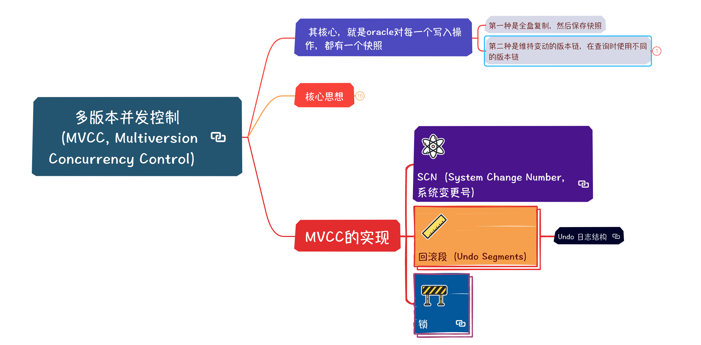

# 多版本并发控制（MVCC, Multiversion Concurrency Control）

##  其核心，就是oracle对每一个写入操作，都有一个快照

### 第一种是全盘复制，然后保存快照

### 第二种是维持变动的版本链，在查询时使用不同的版本链

- 显然，现在系统，所有系统都在使用这个方案

## 核心思想

### 多版本并发控制（MVCC）的核心是在数据库中维护数据的多个版本，用“数据快照”来服务并发操作。

### 读者（读取事务）无需等待写者（写入事务）完成，系统通过保存旧版本数据来保证在并发环境下读取到一致的数据视图

- 一致性度的问题

### MVCC让“读不会阻塞写，写也不会阻塞读”，从而提高并发性能

- 并发性能的问题

### 并发控制问题的解决

- 在传统加锁机制下，读写冲突会导致事务等待甚至死锁

- 而MVCC通过维护旧版本数据，读取操作遇到正在修改的数据时可以直接读取其旧版本，无需加锁等待，从根本上避免了脏读等并发一致性问题

	- 例如，在Oracle中每个查询在开始执行时获取一个系统改变号SCN快照，期间即使有其他事务提交新数据，该查询仍基于快照读取提交时的数据，不受并发修改影响​

### 相对锁机制的优势

- MVCC最大的优势是提高并发性和减少锁竞争

- 由于普通读操作无需加锁，多个事务可同时读写同一数据而不互相阻塞​

- 这带来了两方面好处

	- (1) 减少锁等待：读者不等待写者，写者也不因读锁而等待，因此数据库吞吐量和响应时间更好​

	- 2) 降低死锁概率：Oracle的MVCC配合细粒度行锁，使得只有访问相同数据行的事务才会相互竞争锁，大大降低了死锁发生的可能​

## MVCC的实现

### SCN（System Change Number，系统变更号）

### 回滚段（Undo Segments）

- Undo 日志结构

### 锁

