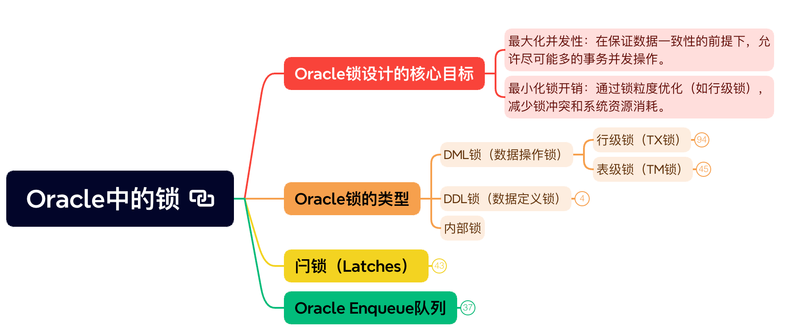

# Oracle中的锁

## Oracle锁设计的核心目标

### 最大化并发性：在保证数据一致性的前提下，允许尽可能多的事务并发操作。

### 最小化锁开销：通过锁粒度优化（如行级锁），减少锁冲突和系统资源消耗。

## Oracle锁的类型

### DML锁（数据操作锁）

- 行级锁（TX锁）

	- 作用场景：

		- 事务修改某行时（如UPDATE、DELETE），自动对该行加排他锁。

		- SELECT ... FOR UPDATE语句显式加共享行锁。

	- 实现原理：

		- 事务槽（ITL）管理：

			- 每个数据块头部包含Interested Transaction List（ITL），记录当前正在访问该块的事务信息。

			- TX锁的元数据存储在数据块头的ITL中，包括事务ID(Undo SCN)、锁模式等。

		- 行锁标志位：

			- 行数据头的lock byte标志位标识该行是否被锁定。

			- 若行被锁定，lock byte存储指向ITL槽的索引。

		- 竞争处理：

			- 事务A试图锁定已被事务B锁定的行，会进入enqueue wait状态。

			- 等待信息记录在v$session_wait，事件类型为enq: TX - row lock contention。

	- 数据结构

		- 每个数据块分为 头部（Header） 和 数据区（Row Data）

		- 块头（Block Header）：

			- ITL Entry（Interested Transaction List Entry）：

			- 每个ITL条目包含：

				- XID（Transaction ID）：当前事务的唯一标识（由Undo Segment+Transaction Slot组成）。

				- UBA（Undo Block Address）：指向该事务的Undo记录。

				- Flag：锁模式标记（是否已提交/回滚）。

				- ITL个数：由表的INITRANS和MAXTRANS参数控制初始和最大ITL条目数。

		- 行数据（Row Data）：

			- 行头（Row Header）：

			- Lock Byte：占用1字节，指向该行所属的ITL槽索引。

			- 若Lock Byte=0：行未被锁定。

			- 若Lock Byte=N（N>0）：指向块头第N个ITL条目。

		- +----------------------------+
| Block Header                          |
|   ITL Entries (ITL1~ITLN)          |
|   ...                                             |
+----------------------------+
| Row 1 Header (Lock Byte)     |     --> Lock Byte = 3 → 表示此行使用ITL3锁定
| Row 1 Data                              |
+----------------------------+
| Row 2 Header (Lock Byte)     |     --> Lock Byte = 0 → 未锁定
| Row 2 Data                              |
+----------------------------+

	- 行锁流程

		- 行锁的获取流程（以UPDATE为例）

			- 以下是事务修改一行数据时，行锁的详细处理流程：

			- 步骤1：定位目标行

				- 逻辑读（Logical Read）：

					- 事务通过索引找到目标行所在的数据块（若未缓存则触发物理读）。

				- 数据块状态检查：

					- 从Buffer Cache获取数据块，检查块的SCN是否满足事务的读一致性要求（通过Undo数据构造所需版本）。

			- 步骤2：检查行锁状态

				- 读取行头的Lock Byte：

					- 如果Lock Byte=0 👉 行未被锁定，进入锁定流程。

					- 如果Lock Byte=N 👉 行已被其他事务锁定，进入锁等待处理。

			- 步骤3：分配ITL槽（若需要）

				- ITL使用规则：

					- 现有ITL是否可复用？若存在已提交/回滚的ITL条目，覆盖其事务信息。

					- 若无可用ITL，尝试扩展ITL条目（需满足MAXTRANS限制）。

				- ITL竞争处理：

					- 若ITL不足且无法扩展，报错ORA-00060: deadlock detected（极端情况下）。

			- 步骤4：锁定目标行

				- 设置Lock Byte

					- 假设事务T1分配到ITL3：

					- Row Header: Lock Byte = 3 → 指向ITL3的条目。

				- 填充ITL条目

					- ITL3:
	XID = (Undo Segment#=5, Slot#=12)         --> 事务标识
	UBA = (Undo File=3, Block=456, Slot=1)    --> Undo记录地址
	Flag = 0x0A (Active)                      --> 事务状态

			- 步骤5：记录锁信息到Enqueue队列

				- 创建Enqueue资源

				- 持有锁模式：

					- LMODE=6（Exclusive Mode），表示排他锁。

			- 步骤6：修改数据与生成Redo/Undo

				- 修改数据：

					- 更新行数据，将旧值写入Undo记录。

				- Redo日志生成：

					- 记录Lock Byte修改和ITL变更到Redo流。

	- 锁冲突处理（行已被锁定）

		- 场景：

			- 事务T2尝试更新已被T1锁定行。

		- 步骤1：识别冲突

			- T2读取Lock Byte=3（指向T1的ITL3）。

			- 检查ITL3状态：发现XID对应的事务T1仍为ACTIVE。

		- 步骤2：加入锁等待队列

			- Enqueue排队：

			- 在enqueue资源上注册等待者（T2）。

			- Enqueue Resource (DBA=0x0012A3B4, Row=789):
Holder: T1 (SID=123, Mode=X)
Waiter: T2 (SID=456, Mode=X, Waiting Time=0.5s)

			- 会话状态变更：

				- T2的会话状态变为WAITING（通过v$session可见）。

				- 事件名称：enq: TX - row lock contention（v$session_wait）。

		- 步骤3：锁释放后的唤醒

			- T1释放锁：

				- 清空Lock Byte（设置为0）。

				- 标记ITL3为COMMITTED或ROLLED BACK。

			- Enqueue管理器：

				- 通知T2获取锁，重试操作。

	- 锁的释放流程

		- 场景：事务提交或回滚时释放锁。

		- 事务提交（COMMIT）：

		- 生成Commit SCN：

			- 将当前系统变更号（SCN）写入事务的Undo记录。

			- 释放行锁：

				- 清空行的Lock Byte 👉 置为0。

			- 延迟清理：

				- 为优化性能，Oracle可能延迟清除ITL条目（下次事务覆盖时可复用）。

			- 写Redo日志： 记录锁释放操作（避免恢复时重复锁定）。

		- 事务回滚（ROLLBACK）：

			- 逆向应用Undo： 将所有修改过的行恢复为旧值（通过Undo记录）。

			- 释放锁： 清空Lock Byte，释放ITL槽。

			- Enqueue清理： 通知所有等待者重新尝试获取锁。

- 表级锁（TM锁）

	- 表级锁模式分类与兼容性

		- 锁模式

		  | **锁模式**                     | **锁级别** | **代码** | **描述**                        | **典型操作**                                 |
		  | ------------------------------ | ---------- | -------- | ------------------------------- | -------------------------------------------- |
		  | **Row Share (RS)**             | 2          | TM-2     | 允许共享读，阻止排他锁（X）     | `SELECT ... FOR UPDATE`                      |
		  | **Row Exclusive (RX)**         | 3          | TM-3     | 允许其他事务修改非锁定行        | `INSERT`、`UPDATE`、`DELETE`（默认DML模式）  |
		  | **Share (S)**                  | 4          | TM-4     | 禁止任何修改操作                | `LOCK TABLE ... IN SHARE MODE`（共享读锁定） |
		  | **Share Row Exclusive（SRX）** | 5          | TM-5     | 部分共享控制，阻止其他DDL       | 复杂批量操作前的保护                         |
		  | **Exclusive (X)**              | 6          | TM-6     | 完全排他，禁止任何并发读写及DDL | `ALTER TABLE`、`DROP TABLE`、`TRUNCATE`      |
		  
			-  

		- 兼容性

			-  

	- Row Share (RS) 

		- 允许多个事务同时读取表，并防止其他事务对表加排他锁（X Lock）。

		- 典型场景

			- 显式锁定表（查询允许修改部分行）

			- LOCK TABLE employees IN ROW SHARE MODE;

				- 虽然主要加行级锁，但会同时持有表级的RS锁

		- 兼容性

			- 允许的并发请求：

				- 其他事务可以申请的锁模式：RS、RX、S、SRX。

			- 禁止的锁模式：

				- 排他锁（X）。

	- Row Exclusive (RX)

		- 允许其他事务修改非冲突行，但禁止其他事务加S、SRX、X锁。

		- 所有DML操作：

			- 当执行INSERT、UPDATE、DELETE时自动获取RX锁。

		- 示例冲突：

			- -- 事务A执行UPDATE（持有RX锁）：
UPDATE employees SET salary = 10000 WHERE id = 1;

-- 事务B尝试加S锁会被阻塞：
LOCK TABLE employees IN SHARE MODE; -- 等待RX释放

	- Share (S) 
	
		- 允许其他事务读取表，但禁止任何数据修改（DML）或结构变更（DDL）。
	
		- 典型场景
	
			- LOCK TABLE orders IN SHARE MODE; -- 阻塞所有DML
	
			- 维护数据静态快照：
	
			- 在生成报表或备份期间防止数据被修改。
	
		- 特殊规则：
	
			- 允许多个S锁共存：
	
			- -- 事务A和事务B可同时持有S锁：
LOCK TABLE t1 IN SHARE MODE; -- 事务A
LOCK TABLE t1 IN SHARE MODE; -- 事务B（未阻塞）

	- Share Row Exclusive (SRX)
	
		- 比S锁更具限制性，允许其他事务查询，但禁止对表进行大部分修改和结构变更。
	
		- 典型场景
	
			- 批处理前的预锁定：
	
			- 在执行需要表级互斥的批量操作前锁定表。
	
			- LOCK TABLE employees IN SHARE ROW EXCLUSIVE MODE;
	
	- Exclusive (X) 
	
		- 完全排他锁，禁止其他事务对表进行任何操作（DML、DDL、查询加锁等）。
	
		- 典型场景
	
			- DDL操作：
	
				- ALTER TABLE、DROP TABLE、TRUNCATE会自动加X锁。
	
			- ALTER TABLE customers ADD phone VARCHAR2(20); -- 隐式X锁
	
			- 强制独占维护窗口
	
				- LOCK TABLE transactions IN EXCLUSIVE MODE NOWAIT;

### DDL锁（数据定义锁）

- 排他DDL锁

	- 场景：CREATE/ALTER/DROP对象时，防止对象结构被并发修改。

- 共享DDL锁

	- 场景：编译存储过程时，依赖表的结构不能被修改。

### 内部锁

## 闩锁（Latches）

### Oracle数据库中用于保护共享内存结构（如数据缓冲块、库缓存）的短期轻量级锁，其设计目标是在高并发场景下快速协调对内存结构的访问，避免数据损坏。

### 与事务级的Enqueue锁不同，Latch不涉及事务隔离，仅用于物理内存的一致性维护。

### 闩锁的核心特征

- 作用对象：保护SGA（System Global Area）中的内存结构，如Buffer Cache、Shared Pool等。

- 短时持有：通常在微秒级内完成获取-释放循环，不像Enqueue锁需要等待事务提交。

- 自旋（Spin）等待：未获取Latch时，进程不会立即休眠，而是循环尝试（Spin），减少上下文切换。

- 无队列管理：与Enqueue不同，Latch没有记录等待者队列，多个等待者可能并发竞争。

### 获取流程

- 自旋次数（Spin Count）：由参数_spin_count控制（默认值依平台不同，通常为2000）。

- 避让机制：避免过多CPU空转，超过自旋次数后主动休眠（Sleep）。

-  

### 共享闩锁（Shared Latch）

- 部分Latches支持共享模式（如shared pool latch），允许多进程并发读，但写入需排他锁。

-  

### 常见闩锁类型及作用场景

- Cache Buffers Chains Latch

	- 功能：保护Buffer Cache中的哈希链（Hash Chain），定位数据块时需锁定该Latch。

	- 争用表现：高并发访问同一数据块时，可能导致latch: cache buffers chains等待事件。

	- 优化策略：

		- 增加Buffer Cache大小（减少哈希链长度）。

		- 热块分离：避免热点数据聚集在少数哈希桶。

- Shared Pool Latch

	- 功能：保护Shared Pool内存分配，如SQL解析、游标管理。

	- 争用表现：latch: shared pool高等待时间。

	- 优化策略：

		- 绑定变量：减少硬解析次数。

		- 调整Shared Pool大小（避免碎片化）。

- Library Cache Latch

	- 功能：管理库缓存（Library Cache）中SQL语句、PL/SQL对象的元数据。

	- 争用触发：频繁硬解析或未使用绑定变量。

	- 优化策略：同Shared Pool优化。

- Redo Copy/Allocation Latch

	- 功能：控制Redo日志缓冲区（Redo Log Buffer）的写入。

	- 争用表现：latch: redo allocation等待过高。

	- 优化策略：

		- 增加log_buffer大小。

		- 分散高频提交的事务。

### 闩锁的实现原理

- 内存结构

	- Latch在内存中表示为固定大小的二进制标识：

	- 状态标志：指示当前是否被持有（0=空闲，1=占用）。

	- 持有者PID：仅用于调试目的，非必要字段。

-  

## Oracle Enqueue队列

### Enqueue是Oracle用于管理共享资源访问请求的核心机制，其核心思想是通过队列（Queue）协调多会话对资源的并发访问。

### 与Latch（闩锁）不同，Enqueue适用于长时间持有的资源（如表、事务、数据块等），并支持复杂的等待和唤醒逻辑。

### Enqueue资源的类型

- Oracle定义了超过200种Enqueue类型，常见的有

-  

### Enqueue核心数据结构

- Enqueue资源的编码

	- 每个Enqueue资源通过三要素唯一标识：

		- Resource Type（类型）：如TX、TM、ST等。

		- ID1、ID2：根据资源类型动态计算的标识值。

	- 示例：

		- TX锁（行事务锁）：

			- ID1 = Undo segment号 + 事务槽号

			- ID2 = 事务槽的Wrap号（事务回滚次数）

		- TM锁（表锁）：

			- ID1 = 表的object_id（dba_objects.object_id）

			- ID2 = 始终为0

- Enqueue资源树（Resource Tree）

	- Oracle使用哈希表+链表管理所有Enqueue资源：

	- 哈希桶：

		- 根据Resource Type + ID1 + ID2的哈希值分配至不同的Bucket，减少锁竞争。

	- 资源链表：

		- 同一Bucket内的Enqueue资源按链表组织，每个资源节点包含：

		- 持有者列表（Owners）：当前持有该资源的会话及锁模式（LMODE）。

		- 等待者列表（Waiters）：请求该资源但未获准的会话队列（按优先级和请求顺序排序）。

-  

### Enqueue的等待管理

- 1. 等待队列的优先级

	- 优先级继承：

		- 若高优先级会话（如后台进程）加入等待队列，可被优先唤醒。

	- 超时参数：

		- enqueue_wait_timeout（默认不限制），长时间未获锁报错ORA-04036。

- 2. 死锁检测

	- Oracle通过 等待图（Wait-for Graph） 检测死锁：

		- 周期性地由后台进程 SMON 扫描资源依赖链。

		- 检测到循环等待时，自动选择代价低的事务回滚，解除死锁。

		- 死锁信息写入 alert.log 并生成跟踪文件。

