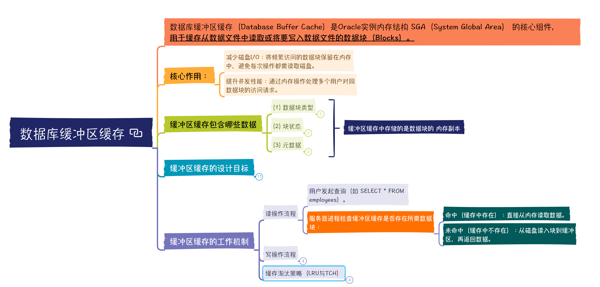

# 数据库缓冲区缓存

## 数据库缓冲区缓存（Database Buffer Cache）是Oracle实例内存结构 SGA（System Global Area） 的核心组件，
用于缓存从数据文件中读取或将要写入数据文件的数据块（Blocks）。

## 核心作用：

### 减少磁盘I/O：将频繁访问的数据块保留在内存中，避免每次操作都需读取磁盘。

### 提升并发性能：通过内存操作处理多个用户对同数据块的访问请求。

## 缓冲区缓存包含哪些数据

### (1) 数据块类型

- 表数据块：用户表中的行数据。

- 索引块：B-Tree、位图索引等结构的数据。

- 撤销段块（Undo Blocks）：支持事务回滚和一致性读的撤销数据。

- 临时块（Temporary Blocks）：排序或哈希连接操作产生的临时数据。

- 数据字典缓存块：系统表（数据字典）的元数据（如对象结构）。

### (2) 块状态

- 未修改块（Clean Blocks）：与磁盘上的数据一致。

- 已修改块（Dirty Blocks）：内存中被修改但未写入磁盘的脏块（仅修改来自事务操作）。

- 空闲块（Free Blocks）：未被使用的缓冲区，等待新数据填充。

### (3) 元数据

- 块的地址信息：标记数据块所属的数据文件号（File ID）和块号（Block ID）。

- 锁信息：记录缓冲区块的并发访问状态（如行级锁）。

- 修改状态：通过 SCN（System Change Number） 标识块的版本，保证一致性读。

## 缓冲区缓存的设计目标

### Oracle设计缓冲区的核心目标是为数据访问提供 高效的内存中转层

### 减少物理I/O，提升性能

- 磁盘访问延迟：读取磁盘需毫秒级时间，而内存访问仅需纳秒级。

- 缓存命中率：通过优化缓存大小与淘汰策略（如LRU），使频繁访问的块驻留内存，减少磁盘访问。

	- 如果命中率低（如<90%），需扩大缓存或优化访问模式。

### 支持高并发事务

- 共享访问：多个会话可同时读取同一缓冲区块（通过一致性读或当前模式读）而不阻塞。

- 写缓冲：事务提交时，数据修改先写入缓冲区（异步写脏块），降低事务延迟。

### 保障事务ACID特性

- 事务隔离：通过Undo段缓存实现多版本并发控制（MVCC），提供一致性读（Consistent Read）。

- 检查点机制：DBWn进程异步写脏块到磁盘，不会阻塞事务提交（仅依赖LGWR写Redo）。

## 缓冲区缓存的工作机制

### 读操作流程

- 用户发起查询（如 SELECT * FROM employees）。

- 服务器进程检查缓冲区缓存是否存在所需数据块：

	- 命中（缓存中存在）：直接从内存读取数据。

	- 未命中（缓存中不存在）：从磁盘读入块到缓冲区，再返回数据。

### 写操作流程

- 用户执行DML操作（如 UPDATE employees SET salary=…）。

- 服务器进程将目标数据块读入缓冲区，修改后标记为脏块。

- Redo日志记录由LGWR写入Redo Log Files（保证持久性）。

- 事务提交时，脏块继续留在内存中，由DBWn进程异步写入数据文件。

### 缓存淘汰策略（LRU与TCH）

- LRU链表（Least Recently Used）：

	- 优先淘汰最近最少使用的空闲块。

- 接触计数（TCH, Touch Count）：

	- 块每次被访问时，TCH值递增；高TCH的块被保留在热端（Hot End）。

