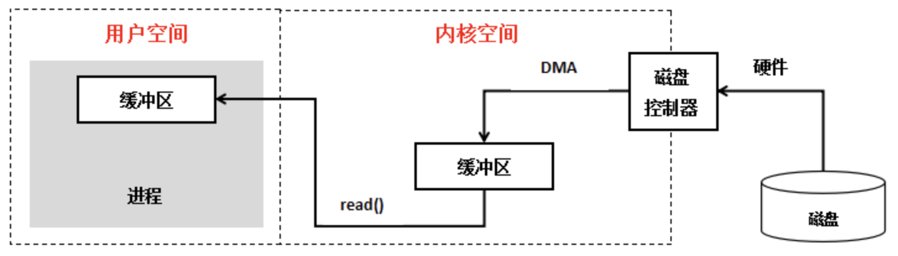

# 1. IO模型

# 2. 背景

我们在进行编程开发的时候，经常会涉及到同步，异步，阻塞，非阻塞，IO多路复用等概念，这几个概念有区别，但是有时候也容易混淆，如果不总结一下的话很容易受到困扰，下面就记录一下这几个概念的理解。

## 2.1. 操作系统IO交互



**DMA(Direct Memory Access)直接内存存取**

DMA是一种能够允许输入输出设备(input/output IO)直接访问主内存，绕开CPU快速操作内存的方法，这个过程由一个称为DMA控制器的芯片来管理。在DMA之前，一般是通过中断的方式来读取数据，这种方式比较吃CPU。缺点也比较多，现在一般不会有这种方式了，都是通过DMA的方式来直接控制。(但是虚拟主机好像还得用这种方式，硬件资源都是又外部的操作系统持有的)。

## 2.2. 用户空间和内核空间

现在操作系统都是采用虚拟存储器，那么对32位操作系统而言，它的寻址空间（虚拟存储空间）为4G（2的32次方）。操作系统的核心是内核，独立于普通的应用程序，可以访问受保护的内存空间，也有访问底层硬件设备的所有权限。**为了保证用户进程不能直接操作内核（kernel），保证内核的安全，操作系统将虚拟空间划分为两部分，一部分为内核空间，一部分为用户空间。**针对linux操作系统而言，将最高的1G字节（从虚拟地址0xC0000000到0xFFFFFFFF），供内核使用，称为内核空间，而将较低的3G字节（从虚拟地址0x00000000到0xBFFFFFFF），供各个进程使用，称为用户空间。

零拷贝是指是否有CPU参与的拷贝事件。

["Zero-copy" describes computer operations in which the **CPU does not perform the task of copying data** from one memory area to another.](https://en.wikipedia.org/wiki/Zero-copy#:~:text="Zero-copy" describes computer,a file over a network.)

# 3. Unix的IO模型

UNIX目前持有了这么几种IO模型:

- Blocking IO - 阻塞IO
- NoneBlocking IO - 非阻塞IO
- IO multiplexing - IO多路复用
- signal driven IO - 信号驱动IO
- asynchronous IO - 异步IO

## 3.1. 一、阻塞IO

同步阻塞 IO 模型是最常用的一个模型，也是最简单的模型。在linux中，默认情况下所有的socket都是blocking。它符合人们最常见的思考逻辑。阻塞就是进程 "被" 休息, CPU处理其它进程去了。

在这个IO模型中，用户空间的应用程序执行一个系统调用（recvform），这会导致应用程序阻塞，什么也不干，直到数据准备好，并且将数据从内核复制到用户进程，最后进程再处理数据，在等待数据到处理数据的两个阶段，整个进程都被阻塞。不能处理别的网络IO。调用应用程序处于一种不再消费 CPU 而只是简单等待响应的状态，因此从处理的角度来看，这是非常有效的。

当用户进程调用了recv()/recvfrom()这个系统调用：

1. kernel就开始了IO的第一个阶段：**准备数据**（对于网络IO来说，很多时候数据在一开始还没有到达。比如，还没有收到一个完整的UDP包。这个时候kernel就要等待足够的数据到来）。这个过程需要等待，也就是说数据被拷贝到操作系统内核的缓冲区中是需要一个过程的。而在用户进程这边，整个进程会被阻塞（当然，是进程自己选择的阻塞）。
2. 第二个阶段：**当kernel一直等到数据准备好了，它就会将数据从kernel中拷贝到用户内存，然后kernel返回结果，用户进程才解除block的状态**，重新运行起来。(注意，这里的过程可以解释成：内核线程把数据copy到用户线程之后，函数才会返回，函数返回之后，用户控件的进程才会接触挂起。)

.png)

我们可以简单的通过一个例子：这是一个从磁盘文件读取并且通过socket写出的过程，对应的系统调用如下：

1. 程序使用read()系统调用。系统由用户态转换为内核态(**第一次上线文切换**)，磁盘中的数据有DMA（Direct Memory Access)的方式读取到内核缓冲区(kernel buffer)。DMA过程中CPU不需要参与数据的读写，而是DMA处理器直接将硬盘数据通过总线传输到内存中。
2. 系统由内核态转换为用户态（**第二次上下文切换**），当程序要读取的数据已经完成写入内核缓冲区以后，程序会将数据由内核缓存区，写入用户缓存区），**这个过程需要CPU参与数据的读写。**
3. 程序使用write()系统调用。系统由用户态切换到内核态(**第三次上下文切换)**，数据从用户态缓冲区写入到网络缓冲区(Socket Buffer)，**这个过程需要CPU参与数据的读写。**
4. 系统由内核态切换到用户态（**第四次上下文切换**），**网络缓冲区的数据通过DMA的方式传输到网卡的驱动(存储缓冲区)中(protocol engine)**

> java.io.FileInputStream#read()就是一个阻塞读的方法，java.io包下面的大多数读写方法都是使用阻塞IO同步调用方式完成。可以查看当前方法的注释：Reads a byte of data from this input stream. This method **blocks** if no input is yet available.

可以看到，**传统的I/O方式会经过4次用户态和内核态的切换(上下文切换，更多请参考：**[上下文切换](https://km.sankuai.com/page/699522134)**)，两次CPU中内存中进行数据读写的过程**。这种拷贝过程相对来说比较消耗资源.

## 3.2. 二、同步非阻塞IO

在这种模型中，设备是以非阻塞的形式打开的。这意味着 IO 操作不会立即完成，**read 操作可能会返回一个错误代码**，说明这个命令不能立即满足（EAGAIN 或 EWOULDBLOCK）。非阻塞的recvform系统调用调用之后，进程并没有被阻塞，内核马上返回给进程，如果数据还没准备好，此时会返回一个error。进程在返回之后，可以干点别的事情，然后再发起recvform系统调用。这个过程称之为非阻塞IO.

可以看到，非阻塞IO的好处是，用户控件的应用可以立即从内核空间的系统调用中醒来，这之后并不会阻塞用户线程去处理其他工作，可以之后再次查询数据是否准备好，这期间，就是并行的过程。

但是如果非阻塞IO请求，用户线程醒来并不是处理其他事件，而是轮询结果数据是否准备好，这样可能并不如同步阻塞IO来的简单快速。

从上下文切换、和CPU拷贝过程来看的话,这个过程并没有发生什么变化.(可以简化成通过线程池的实现方式来理解非阻塞IO)。在实际工作中，我们使用同步非阻塞IO的例子比较少。也有一说把，多线程 + blocking IO 结合在一起算作非阻塞IO。

## 3.3. 三、多路复用IO

多路复用IO目前主要实现方式是：select、poll、epoll类型，poll是对select的一种增强，是在设计机制上是一样的。而select、poll、epoll本质上也都是同步I/O，因为他们都需要在读写事件就绪后自己负责进行读写，也就是说这个读写过程是阻塞的。

### 3.3.1. 设计思路

多路复用IO的设计灵感来自于：由于同步非阻塞方式需要不断主动轮询，轮询占据了很大一部分过程，轮询会消耗大量的CPU时间，而 “后台” 可能有多个任务在同时进行，如果轮训多个任务的完成状态，只要有任何一个任务完成，就去处理对应的中断。那么这就是所谓的 “IO 多路复用”。写标准，做实现，当前Unix下的select、poll、epoll就是因之而产生的。

### 3.3.2. 1、Selector

select()的机制中提供一种fd_set的数据结构，实际上是一个long类型的数组，每一个数组元素都能与一打开的文件句柄（不管是Socket句柄,还是其他文件或命名管道或设备句柄）建立联系，建立联系的工作由程序员完成，当调用select()时，由内核根据IO状态修改fd_set的内容，由此来通知执行了select()的进程哪一Socket或文件可读。

从流程上来看，使用select函数进行IO请求和同步阻塞模型没有太大的区别，甚至还多了添加监视socket，以及调用select函数的额外操作，效率更差。但是，使用select以后最大的优势是用户可以在一个线程内同时处理多个socket的IO请求。用户可以在一个线程内同时处理多个socket的IO请求。用户可以注册多个socket，然后不断地调用select读取被激活的socket，即可达到在同一个线程内同时处理多个IO请求的目的。而在同步阻塞模型中，必须通过多线程的方式才能达到这个目的。

#### 3.3.2.1. select机制的问题

1. 每次调用select，都需要把fd_set集合从用户态拷贝到内核态，如果fd_set集合很大时，那这个开销也很大  <- 拷贝数据开销
2. 同时每次调用select都需要在内核遍历传递进来的所有fd_set，如果fd_set集合很大时，那这个开销也很大  <- 遍历数据开销
3. 为了减少数据拷贝带来的性能损坏，内核对被监控的fd_set集合大小做了限制，并且这个是通过宏控制的，**大小不可改变(限制为1024)。**

### 3.3.3. 2、Poll

poll的机制与select类似，与select在本质上没有多大差别，管理多个描述符也是进行轮询，根据描述符的状态进行处理，但是poll没有最大文件描述符数量的限制。也就是说，poll只解决了上面的问题3，并没有解决问题1，2的性能开销问题。

下面是poll的函数原型：

```c
int poll(struct pollfd *fds, nfds_t nfds, int timeout);

typedef struct pollfd {
        int fd;                         // 需要被检测或选择的文件描述符
        short events;                   // 对文件描述符fd上感兴趣的事件
        short revents;                  // 文件描述符fd上当前实际发生的事件
} pollfd_t;
```

poll改变了文件描述符集合的描述方式，使用了pollfd结构而不是select的fd_set结构，使得poll支持的文件描述符集合限制远大于select的1024.

### 3.3.4. 3、Epoll

上面的问题其实也简单，就是维护队列和轮询队列的事情，没有分开处理。

epoll在Linux2.6内核正式提出，是基于事件驱动的I/O方式，相对于select来说，epoll没有描述符个数限制，使用一个文件描述符管理多个描述符，将用户关心的文件描述符的事件存放到内核的一个事件表中，这样在用户空间和内核空间的copy只需一次。

epoll是Linux内核为处理大批量文件描述符而作了改进的poll，是Linux下多路复用IO接口select/poll的增强版本，它能显著提高程序在大量并发连接中只有少量活跃的情况下的系统CPU利用率。**原因就是获取事件的时候，它无须遍历整个被侦听的描述符集(通过中断实践的方式，可以持有一个就绪事件的引用，只需要持有引用就行)，只要遍历那些被内核IO事件异步唤醒而加入Ready队列的描述符集合就行了**。epoll除了提供select/poll那种IO事件的水平触发（Level Triggered）外，还提供了边缘触发（Edge Triggered），这就使得用户空间程序有可能缓存IO状态，减少epoll_wait/epoll_pwait的调用，提高应用程序效率。

- **水平触发（LT）：**默认工作模式，即当epoll_wait检测到某描述符事件就绪并通知应用程序时，应用程序可以不立即处理该事件；下次调用epoll_wait时，会再次通知此事件
- **边缘触发（ET）：** 当epoll_wait检测到某描述符事件就绪并通知应用程序时，应用程序必须立即处理该事件。如果不处理，下次调用epoll_wait时，不会再次通知此事件

**epoll是Linux目前大规模网络并发程序开发的首选模型。在绝大多数情况下性能远超select和poll。目前流行的高性能web服务器Nginx正式依赖于epoll提供的高效网络套接字轮询服务。但是，在并发连接不高的情况下，多线程+阻塞I/O方式可能性能更好。**

**多路复用IO的特点从来不是更快处理请求、而是为了更多的处理连接。这一点至关重要，不要因为因小弃大。**

在I/O编程过程中，当需要同时处理多个客户端接入请求时，可以利用多线程或者I/O多路复用技术进行处理。I/O多路复用技术通过把多个I/O的阻塞复用到同一个processor的阻塞上，从而使得系统在单线程的情况下可以同时处理多个客户端请求。与传统的多线程/多进程模型比，I/O多路复用的最大优势是系统开销小，系统不需要创建新的额外进程或者线程，也不需要维护这些进程和线程的运行，降底了系统的维护工作量，节省了系统资源。

### 3.3.5. 4、总结

既然select，poll，epoll都是I/O多路复用的具体的实现，之所以现在同时存在，其实他们也是不同历史时期的产物

- select出现是1984年在BSD里面实现的
- 14年之后也就是1997年才实现了poll，select很长段时间已经满足需求
- 2002, 大神 Davide Libenzi 实现了epoll

## 3.4. 四、信号通知

## 3.5. 五、异步IO

java1.7提供了AIO的机制，AIO与NIO的机制上差不多，都是借助操作系统的能力，上层屏蔽了操作系统的复杂性。

鉴于和本文的关系不大，这里就不介绍了，如果有兴趣，可自行查阅。

# 4. 零拷贝

零拷贝在目前我们所了解的多个系统中间承担着重要的任务，比如说kafka。一般有这些好处：

- 减少甚至完全避免不必要的CPU拷贝，从而让CPU解脱出来去执行其他的任务
- 减少内存带宽的占用
- 通常零拷贝技术还能够减少用户空间和操作系统内核空间之间的上下文切换

零拷贝一般主要工作在场景：大批量的数据读写，这些数据一般来自磁盘或者socket。零拷贝实际的实现并没有真正的标准，取决于操作系统如何实现这一点。零拷贝完全依赖于操作系统。操作系统支持，就有；不支持，就没有。不依赖Java本身。下面说一下目前大致都存在哪些数据读写实现方式：

## 4.1. 一、传统IO

```java
read(diskfd, buf, BUF_SIZE);
write(sockfd, buf , n);
```

这一块儿在上面的传统IO说的比较多了，就不赘述了。

## 4.2. 二、mmap方式

```java
buf = mmap(diskfd, len);
write(sockfd, buf, len);
```

用程序调用mmap()，磁盘上的数据会通过DMA被拷贝的内核缓冲区，接着操作系统会把这段内核缓冲区与应用程序共享，这样就不需要把内核缓冲区的内容往用户空间拷贝。应用程序再调用write(),操作系统直接将内核缓冲区的内容拷贝到socket缓冲区中，这一切都发生在内核态，最后，socket缓冲区再把数据发到网卡去，可以通过一个图来形容：


这是使用的系统调用方法，**这种方式的I/O原理就是将用户缓冲区（user buffer）的内存地址和内核缓冲区（kernel buffer）的内存地址做一个映射，也就是说系统在用户态可以直接读取并操作内核空间的数据。**

1. mmap()系统调用首先会使用DMA的方式将磁盘数据读取到内核缓冲区，然后通过内存映射的方式，使用户缓冲区和内核读缓冲区的内存地址为同一内存地址，也就是说不需要CPU再讲数据从内核读缓冲区复制到用户缓冲区。
2. 当使用write()系统调用的时候，cpu将内核缓冲区（等同于用户缓冲区）的数据直接写入到网络发送缓冲区（socket buffer），然后通过DMA的方式将数据传入到网卡驱动程序中准备发送。

**可以看到这种内存映射的方式减少了CPU的读写次数，只有一次了，但是用户态到内核态的切换（上下文切换）依旧有四次。**

但是并不是说这个方式没有问题，他会存在一个最常见的问题，操作系统并不会对这个内核缓存做完全的保护，换句话来说，可能存在只是用了一部分就报错的问题。一般解决的办法是通过通过文件租借锁的方式：让内核时刻监控这个文件。

一般按照套路，如果一个解决方案存在问题，那么就是一定存在一个更好的解决方案。

## 4.3. 三、sendfile方式

通过sendfile()系统调用，可以做到内核空间内部直接进行I/O传输。

```c
sendfile(socket, file, len);
```

可以看一下上面的代码，上面的代码表明**，文件内容是不能修改的！！！ sendfile方式是不能修改文件内容的, 当前从用户空间的视角来看，是看不到文件的内容的。**

**实现方式大致是：**

1. sendfile系统调用将把**文件内容复制到DMA引擎的内核缓冲区中。**
2. 没有将数据复制到套接字缓冲区中。相反，只有带有关于数据的位置和长度的信息的描述符被追加到套接字缓冲区。**DMA引擎直接将数据从内核缓冲区传递到协议引擎，从而消除剩余的最终复制。**

细节就不展示了，因为相比较mmap更简单。通过sendfile实现的零拷贝I/O只使用了2次用户空间与内核空间的上下文切换，以及不需要任何的CPU参与的拷贝。

## 4.4. 四、操作系统定制

我查阅了以下资料上面的这些都是00年之前或者左右的一些实现了，是因为他是Unix like上的一些古老实现，现在一些付费、订阅、开源的Linux实现上对对零拷贝做了或多或少的一些优化。具体的细节就不展示了，有想法可以自行查找。

# 5. Java中的NIO使用的零拷贝

## 5.1. 一、FileChannel与零拷贝

**FileChannel中大量使用了我们上面所提及的零拷贝技术**
FileChannel的map方法会返回一个MappedByteBuffer。MappedByteBuffer是一个直接字节缓冲器，该缓冲器的内存是一个文件的内存映射区域。map方法底层是通过mmap实现的，因此将文件内存从磁盘读取到内核缓冲区后，用户空间和内核空间共享该缓冲区。MappedByteBuffer内存映射文件是一种允许Java程序直接从内存访问的一种特殊的文件。我们可以将整个文件或者整个文件的一部分映射到内存当中，那么接下来是由操作系统来进行相关的页面请求并将内存的修改写入到文件当中。我们的应用程序只需要处理内存的数据，这样可以实现非常迅速的I/O操作。

```java
File file = new File("test.zip");
RandomAccessFile raf = new RandomAccessFile(file, "rw");
FileChannel fileChannel = raf.getChannel();
MappedByteBuffer buffer = fileChannel.map(FileChannel.MapMode.READ_ONLY, 0, fileChannel.size());
```

实际上在工作中，我们使用的mmap这种方式是比较多的，也比较常见， 原因主要有以下：

1. BIO,可以把磁盘的文件经过内核空间，读到JVM空间，然后进行各种操作，最后再写到磁盘或是发送到网络，效率较慢但支持数据文件操作。
2. 零拷贝则是直接在内核空间完成文件读取并转到磁盘（或发送到网络）。由于它没有读取文件数据到JVM这一环，因此程序无法操作该文件数据，尽管效率很高！

而mmap兼具了上面的两个不同的优势。

**FileChannel的transferTo、transferFrom**
如果操作系统底层支持的话transferTo、transferFrom也会使用相关的零拷贝技术来实现数据的传输，底层使用的是sendFile()方法。所以，这里是否使用零拷贝必须依赖于底层的系统实现。

```java
File file = new File("test.zip");
RandomAccessFile raf = new RandomAccessFile(file, "rw");
FileChannel fileChannel = raf.getChannel();
SocketChannel socketChannel = SocketChannel.open(new InetSocketAddress("", 1234));
// 直接使用了transferTo()进行通道间的数据传输
fileChannel.transferTo(0, fileChannel.size(), socketChannel);
```

