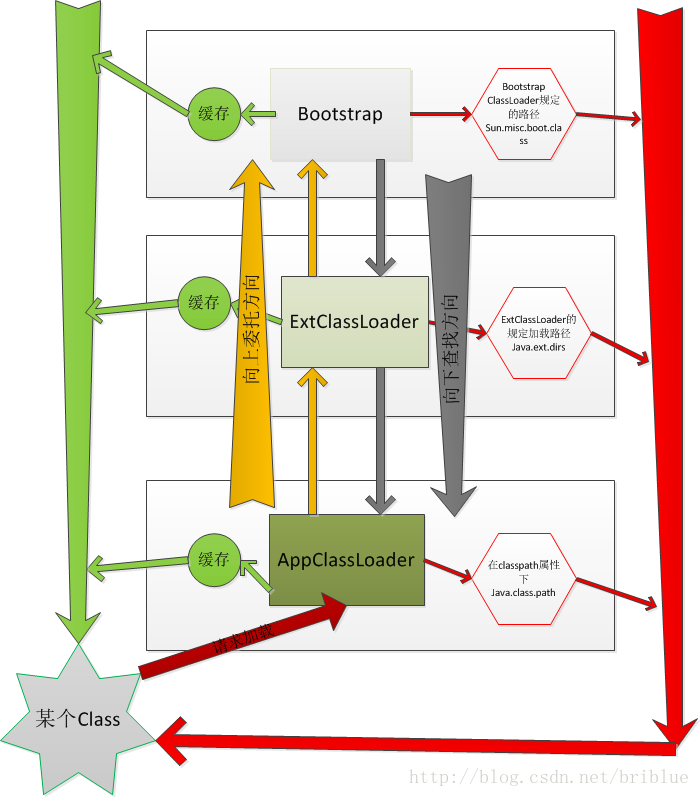

类加载器，普通的java开发者其实用到的不多，但对于某些框架开发者来说却非常常见。理解ClassLoader的加载机制，也有利于我们编写出更高效的代码。ClassLoader的具体作用就是将class文件加载到jvm虚拟机中去，程序就可以正确运行了。但是，jvm启动的时候，并不会一次性加载所有的class文件，而是根据需要去动态加载。

### Java默认提供的三个ClassLoader

1. **BootStrapLoader**  Bootstrap加载器是用C++语言写的，它是在Java虚拟机启动后初始化的，它主要负责加载%JAVA_HOME%/jre/lib,-Xbootclasspath参数指定的路径以及%JAVA_HOME%/jre/classes中的类。如：rt.jar、resources.jar、charsets.jar等。
2. **ExtClassLoader**. Bootstrap loader加载ExtClassLoader,并且将ExtClassLoader的父加载器设置为Bootstrap loader.ExtClassLoader是用Java写的，具体来说就是 sun.misc.Launcher$ExtClassLoader，ExtClassLoader主要加载%JAVA_HOME%/jre/lib/ext，此路径下的所有classes目录以及java.ext.dirs系统变量指定的路径中类库。只要jar包放置这个位置，就会被虚拟机加载。一个常见的、类似的问题是，你将mysql的低版本驱动不小心放置在这儿，但你的Web应用程序的lib下有一个新的jdbc驱动，但怎么都报错，譬如不支持JDBC2.0的 DataSource，这时你就要当心你的新jdbc可能并没有被加载。这就是ClassLoader的delegate现象。常见的有log4j、 common-log、dbcp会出现问题，因为它们很容易被人塞到这个ext目录，或是Tomcat下的common/lib目录。
3. **AppClassLoader**. Bootstrap loader加载完ExtClassLoader后，就会加载AppClassLoader,并且将AppClassLoader的父加载器指定为 ExtClassLoader。AppClassLoader也是用Java写成的，它的实现类是 sun.misc.Launcher$AppClassLoader，另外我们知道ClassLoader中有个getSystemClassLoader方法,此方法返回的正是AppClassLoader. AppClassLoader主要负责加载classpath所指定的位置的类或者是jar文档，它也是Java程序默认的类加载器。

> 一个应用程序总是由n多个类组成，Java程序启动时，并不是一次把所有的类全部加载后再运行，它总是先把保证程序运行的基础类一次性加载到jvm中，其它类等到jvm用到的时候再加载，这样的好处是节省了内存的开销，因为java最早就是为嵌入式系统而设计的，内存宝贵，这是一种可以理解的机制，而用到时再加载这也是java动态性的一种体现。

看sun.misc.Launcher,它是一个java虚拟机的入口应用。

```java
public class Launcher {
private static URLStreamHandlerFactory factory = new Launcher.Factory();
    private static Launcher launcher = new Launcher();
    private static String bootClassPath = System.getProperty("sun.boot.class.path");
    private ClassLoader loader;
    private static URLStreamHandler fileHandler;

    public Launcher() {
        Launcher.ExtClassLoader var1;
        try {
            var1 = Launcher.ExtClassLoader.getExtClassLoader();
        } catch (IOException var10) {
            throw new InternalError("Could not create extension class loader", var10);
        }
        try {
            this.loader = Launcher.AppClassLoader.getAppClassLoader(var1);
        } catch (IOException var9) {
            throw new InternalError("Could not create application class loader", var9);
        }

        Thread.currentThread().setContextClassLoader(this.loader);
        String var2 = System.getProperty("java.security.manager");
        if (var2 != null) {
          ···
        }
    }

}
```

- Launcher初始化了ExtClassLoader和AppClassLoader。
- Launcher中并没有看见BootstrapClassLoader，但通过System.getProperty("sun.boot.class.path")得到了字符串bootClassPath,这个应该就是BootstrapClassLoader加载的jar包路径。

```shell
System.out.println(System.getProperty("sun.boot.class.path"));

C:\Program Files\Java\jre1.8.0_91\lib\resources.jar;
C:\Program Files\Java\jre1.8.0_91\lib\rt.jar;
C:\Program Files\Java\jre1.8.0_91\lib\sunrsasign.jar;
C:\Program Files\Java\jre1.8.0_91\lib\jsse.jar;
C:\Program Files\Java\jre1.8.0_91\lib\jce.jar;
C:\Program Files\Java\jre1.8.0_91\lib\charsets.jar;
C:\Program Files\Java\jre1.8.0_91\lib\jfr.jar;
C:\Program Files\Java\jre1.8.0_91\classes
```

我们先前的内容有说过，可以指定-D java.ext.dirs参数来添加和改变ExtClassLoader的加载路径。这里我们通过可以编写测试代码。

```java
System.out.println(System.getProperty("java.ext.dirs"));

C:\Program Files\Java\jre1.8.0_91\lib\ext;C:\Windows\Sun\Java\lib\ext
```

可以看到AppClassLoader加载的就是java.class.path下的路径。我们同样打印它的值。

```java
System.out.println(System.getProperty("java.class.path"));

D:\workspace\ClassLoaderDemo\bin
```

为什么要有三个类加载器，一方面是分工，各自负责各自的区块，另一方面为了实现委托模型。

> 除了Java默认提供的三个ClassLoader之外，用户还可以根据需要定义自已的ClassLoader，而这些自定义的ClassLoader都必须继承自java.lang.ClassLoader类，也包括Java提供的另外二个ClassLoader（Extension ClassLoader和App ClassLoader）在内，但是Bootstrap ClassLoader不继承自ClassLoader，因为它不是一个普通的Java类，底层由C++编写，已嵌入到了JVM内核当中，当JVM启动后，Bootstrap ClassLoader也随着启动，负责加载完核心类库后，并构造Extension ClassLoader和App ClassLoader类加载器。

### 双亲委派模型

一个类加载器查找class和resource时，是通过“委托模式”进行的，它首先判断这个class是不是已经加载成功，如果没有的话它并不是自己进行查找，而是先通过父加载器，然后递归下去，直到Bootstrap ClassLoader，如果Bootstrap classloader找到了，直接返回，如果没有找到，则一级一级返回，最后到达自身去查找这些对象。这种机制就叫做双亲委托。

用序列描述一下：

1. 一个AppClassLoader查找资源时，先看看缓存是否有，缓存有从缓存中获取，否则委托给父加载器。
2. 递归，重复第1部的操作。
3. 如果ExtClassLoader也没有加载过，则由Bootstrap ClassLoader出面，它首先查找缓存，如果没有找到的话，就去找自己的规定的路径下，也就是sun.mic.boot.class下面的路径。找到就返回，没有找到，让子加载器自己去找。
4. Bootstrap ClassLoader如果没有查找成功，则ExtClassLoader自己在java.ext.dirs路径中去查找，查找成功就返回，查找不成功，再向下让子加载器找。
5. ExtClassLoader查找不成功，AppClassLoader就自己查找，在java.class.path路径下查找。找到就返回。如果没有找到就让子类找，如果没有子类会怎么样？抛出各种异常。

上面的序列，详细说明了双亲委托的加载流程。我们可以发现委托是从下向上，然后具体查找过程却是自上至下。



#### 重要方法

##### loadClass()

JDK文档中是这样写的，通过指定的全限定类名加载class，它通过同名的loadClass(String,boolean)方法。

```java
protected Class<?> loadClass(String name,
                             boolean resolve)
                      throws ClassNotFoundException
```

上面是方法原型，一般实现这个方法的步骤是:

1. 执行findLoadedClass(String)去检测这个class是不是已经加载过了。
2. 执行父加载器的loadClass方法。如果父加载器为null，则jvm内置的加载器去替代，也就是Bootstrap ClassLoader。这也解释了ExtClassLoader的parent为null,但仍然说Bootstrap ClassLoader是它的父加载器。
3. 如果向上委托父加载器没有加载成功，则通过findClass(String)查找。

如果class在上面的步骤中找到了，参数resolve又是true的话，那么loadClass()又会调用resolveClass(Class)这个方法来生成最终的Class对象。 我们可以从源代码看出这个步骤。

```java
protected Class<?> loadClass(String name, boolean resolve)
        throws ClassNotFoundException
    {
        synchronized (getClassLoadingLock(name)) {
            // 首先，检测是否已经加载
            Class<?> c = findLoadedClass(name);
            if (c == null) {
                long t0 = System.nanoTime();
                try {
                    if (parent != null) {
                        //父加载器不为空则调用父加载器的loadClass
                        c = parent.loadClass(name, false);
                    } else {
                        //父加载器为空则调用Bootstrap Classloader
                        c = findBootstrapClassOrNull(name);
                    }
                } catch (ClassNotFoundException e) {
                    // ClassNotFoundException thrown if class not found
                    // from the non-null parent class loader
                }

                if (c == null) {
                    // If still not found, then invoke findClass in order
                    // to find the class.
                    long t1 = System.nanoTime();
                    //父加载器没有找到，则调用findclass
                    c = findClass(name);

                    // this is the defining class loader; record the stats
                    sun.misc.PerfCounter.getParentDelegationTime().addTime(t1 - t0);
                    sun.misc.PerfCounter.getFindClassTime().addElapsedTimeFrom(t1);
                    sun.misc.PerfCounter.getFindClasses().increment();
                }
            }
            if (resolve) {
                //调用resolveClass()
                resolveClass(c);
            }
            return c;
        }
    }

```

代码解释了双亲委托。

另外，要注意的是如果要编写一个classLoader的子类，也就是自定义一个classloader，建议覆盖findClass()方法，而不要直接改写loadClass()方法。

### 自定义ClassLoader

- 编写一个类继承自ClassLoader抽象类。
- 复写它的findClass()方法。
- 在findClass()方法中调用defineClass()。

> 一个ClassLoader创建时如果没有指定parent，那么它的parent默认就是AppClassLoader。
上面说的是，如果自定义一个ClassLoader，默认的parent父加载器是AppClassLoader，因为这样就能够保证它能访问系统内置加载器加载成功的class文件。

```java
public class DiskClassLoader extends ClassLoader {

    private String mLibPath;

    public DiskClassLoader(String path) {
        // TODO Auto-generated constructor stub
        mLibPath = path;
    }

    @Override
    protected Class<?> findClass(String name) throws ClassNotFoundException {
        // TODO Auto-generated method stub

        String fileName = getFileName(name);

        File file = new File(mLibPath, fileName);

        try {
            FileInputStream is = new FileInputStream(file);

            ByteArrayOutputStream bos = new ByteArrayOutputStream();
            int len = 0;
            try {
                while ((len = is.read()) != -1) {
                    bos.write(len);
                }
            } catch (IOException e) {
                e.printStackTrace();
            }

            byte[] data = bos.toByteArray();
            is.close();
            bos.close();

            return defineClass(name, data, 0, data.length);

        } catch (IOException e) {
            // TODO Auto-generated catch block
            e.printStackTrace();
        }

        return super.findClass(name);
    }

    //获取要加载 的class文件名
    private String getFileName(String name) {
        // TODO Auto-generated method stub
        int index = name.lastIndexOf('.');
        if (index == -1) {
            return name + ".class";
        } else {
            return name.substring(index + 1) + ".class";
        }
    }

}
```

测试：

```java
public class ClassLoaderTest {

    public static void main(String[] args) {
        // TODO Auto-generated method stub

        //创建自定义classloader对象。
        DiskClassLoader diskLoader = new DiskClassLoader("D:\\lib");
        try {
            //加载class文件
            Class c = diskLoader.loadClass("com.frank.test.Test");

            if(c != null){
                try {
                    Object obj = c.newInstance();
                    Method method = c.getDeclaredMethod("say",null);
                    //通过反射调用Test类的say方法
                    method.invoke(obj, null);
                } catch (InstantiationException | IllegalAccessException
                        | NoSuchMethodException
                        | SecurityException |
                        IllegalArgumentException |
                        InvocationTargetException e) {
                    // TODO Auto-generated catch block
                    e.printStackTrace();
                }
            }
        } catch (ClassNotFoundException e) {
            // TODO Auto-generated catch block
            e.printStackTrace();
        }

    }

}
```

diskLoader.loadClass("com.frank.test.Test")中会最终调用到DiskClassLoader的findClass(String name);
所以，我们要做得就是复写findClass。

### Context ClassLoader 线程上下文类加载器

线程上下文类加载器（context class loader）是从 JDK 1.2 开始引入的。类 java.lang.Thread中的方法 getContextClassLoader()和 setContextClassLoader(ClassLoader cl)用来获取和设置线程的上下文类加载器。如果没有通过 setContextClassLoader(ClassLoader cl)方法进行设置的话，线程将继承其父线程的上下文类加载器。Java 应用运行的初始线程的上下文类加载器是系统类加载器。在线程中运行的代码可以通过此类加载器来加载类和资源。

前面提到的类加载器的代理模式并不能解决 Java 应用开发中会遇到的类加载器的全部问题。Java 提供了很多服务提供者接口（Service Provider Interface，SPI），允许第三方为这些接口提供实现。常见的 SPI 有 JDBC、JCE、JNDI、JAXP 和 JBI 等。这些 SPI 的接口由 Java 核心库来提供，如 JAXP 的 SPI 接口定义包含在 javax.xml.parsers包中。这些 SPI 的实现代码很可能是作为 Java 应用所依赖的 jar 包被包含进来，可以通过类路径（CLASSPATH）来找到，如实现了 JAXP SPI 的 Apache Xerces所包含的 jar 包。SPI 接口中的代码经常需要加载具体的实现类。如 JAXP 中的 javax.xml.parsers.DocumentBuilderFactory类中的 newInstance()方法用来生成一个新的 DocumentBuilderFactory的实例。这里的实例的真正的类是继承自 javax.xml.parsers.DocumentBuilderFactory，由 SPI 的实现所提供的。如在 Apache Xerces 中，实现的类是 org.apache.xerces.jaxp.DocumentBuilderFactoryImpl。而问题在于，SPI 的接口是 Java 核心库的一部分，是由引导类加载器来加载的；SPI 实现的 Java 类一般是由系统类加载器来加载的。引导类加载器是无法找到 SPI 的实现类的，因为它只加载 Java 的核心库。它也不能代理给系统类加载器，因为它是系统类加载器的祖先类加载器。也就是说，类加载器的代理模式无法解决这个问题。

线程上下文类加载器正好解决了这个问题。如果不做任何的设置，Java 应用的线程的上下文类加载器默认就是系统上下文类加载器。在 SPI 接口的代码中使用线程上下文类加载器，就可以成功的加载到 SPI 实现的类。线程上下文类加载器在很多 SPI 的实现中都会用到。

### 类加载器与Web容器

对于运行在 Java EE容器中的 Web 应用来说，类加载器的实现方式与一般的 Java 应用有所不同。不同的 Web 容器的实现方式也会有所不同。以 Apache Tomcat 来说，每个 Web 应用都有一个对应的类加载器实例。该类加载器也使用代理模式，所不同的是它是首先尝试去加载某个类，如果找不到再代理给父类加载器。这与一般类加载器的顺序是相反的。这是 Java Servlet 规范中的推荐做法，其目的是使得 Web 应用自己的类的优先级高于 Web 容器提供的类。这种代理模式的一个例外是：Java 核心库的类是不在查找范围之内的。这也是为了保证 Java 核心库的类型安全。

绝大多数情况下，Web 应用的开发人员不需要考虑与类加载器相关的细节。下面给出几条简单的原则：

1. 每个 Web 应用自己的 Java 类文件和使用的库的 jar 包，分别放在 WEB-INF/classes和 WEB-INF/lib目录下面。
2. 多个应用共享的 Java 类文件和 jar 包，分别放在 Web 容器指定的由所有 Web 应用共享的目录下面。
3. 当出现找不到类的错误时，检查当前类的类加载器和当前线程的上下文类加载器是否正确。

### 类加载器与OSGi

OSGi是 Java 上的动态模块系统。它为开发人员提供了面向服务和基于组件的运行环境，并提供标准的方式用来管理软件的生命周期。OSGi 已经被实现和部署在很多产品上，在开源社区也得到了广泛的支持。Eclipse就是基于OSGi 技术来构建的。

OSGi 中的每个模块（bundle）都包含 Java 包和类。模块可以声明它所依赖的需要导入（import）的其它模块的 Java 包和类（通过 Import-Package），也可以声明导出（export）自己的包和类，供其它模块使用（通过 Export-Package）。也就是说需要能够隐藏和共享一个模块中的某些 Java 包和类。这是通过 OSGi 特有的类加载器机制来实现的。OSGi 中的每个模块都有对应的一个类加载器。它负责加载模块自己包含的 Java 包和类。当它需要加载 Java 核心库的类时（以 java开头的包和类），它会代理给父类加载器（通常是启动类加载器）来完成。当它需要加载所导入的 Java 类时，它会代理给导出此 Java 类的模块来完成加载。模块也可以显式的声明某些 Java 包和类，必须由父类加载器来加载。只需要设置系统属性 org.osgi.framework.bootdelegation的值即可。

假设有两个模块 bundleA 和 bundleB，它们都有自己对应的类加载器 classLoaderA 和 classLoaderB。在 bundleA 中包含类 com.bundleA.Sample，并且该类被声明为导出的，也就是说可以被其它模块所使用的。bundleB 声明了导入 bundleA 提供的类 com.bundleA.Sample，并包含一个类 com.bundleB.NewSample继承自 com.bundleA.Sample。在 bundleB 启动的时候，其类加载器 classLoaderB 需要加载类 com.bundleB.NewSample，进而需要加载类 com.bundleA.Sample。由于 bundleB 声明了类 com.bundleA.Sample是导入的，classLoaderB 把加载类 com.bundleA.Sample的工作代理给导出该类的 bundleA 的类加载器 classLoaderA。classLoaderA 在其模块内部查找类 com.bundleA.Sample并定义它，所得到的类 com.bundleA.Sample实例就可以被所有声明导入了此类的模块使用。对于以 java开头的类，都是由父类加载器来加载的。如果声明了系统属性 org.osgi.framework.bootdelegation=com.example.core.\*，那么对于包 com.example.core中的类，都是由父类加载器来完成的。

OSGi 模块的这种类加载器结构，使得一个类的不同版本可以共存在 Java 虚拟机中，带来了很大的灵活性。不过它的这种不同，也会给开发人员带来一些麻烦，尤其当模块需要使用第三方提供的库的时候。下面提供几条比较好的建议：

1. 如果一个类库只有一个模块使用，把该类库的 jar 包放在模块中，在 Bundle-ClassPath中指明即可。
2. 如果一个类库被多个模块共用，可以为这个类库单独的创建一个模块，把其它模块需要用到的 Java 包声明为导出的。其它模块声明导入这些类。
3. 如果类库提供了 SPI 接口，并且利用线程上下文类加载器来加载 SPI 实现的 Java 类，有可能会找不到 Java 类。如果出现了 NoClassDefFoundError异常，首先检查当前线程的上下文类加载器是否正确。通过 Thread.currentThread().getContextClassLoader()就可以得到该类加载器。该类加载器应该是该模块对应的类加载器。如果不是的话，可以首先通过 class.getClassLoader()来得到模块对应的类加载器，再通过 Thread.currentThread().setContextClassLoader()来设置当前线程的上下文类加载器。

### 不遵循“双亲委托机制”的场景

上面说了双亲委托机制主要是为了实现不同的ClassLoader之间加载的类的交互问题，被大家公用的类就交由父加载器去加载，但是Java中确实也存在父类加载器加载的类需要用到子加载器加载的类的情况。下面我们就来说说这种情况的发生。

Java中有一个SPI(Service Provider Interface)标准,使用了SPI的库，比如JDBC，JNDI等，我们都知道JDBC需要第三方提供的驱动才可以，而驱动的jar包是放在我们应用程序本身的classpath的，而jdbc 本身的api是jdk提供的一部分，它已经被Bootstrap加载了，那第三方厂商提供的实现类怎么加载呢？这里面JAVA引入了线程上下文类加载的概 念，线程类加载器默认会从父线程继承，如果没有指定的话，默认就是系统类加载器（AppClassLoader）,这样的话当加载第三方驱动的时候，就可 以通过线程的上下文类加载器来加载。

另外为了实现更灵活的类加载器OSGI以及一些Java app server也打破了双亲委托机制。

引用：
<https://blog.csdn.net/briblue/article/details/54973413>
<https://www.cnblogs.com/doit8791/p/5820037.html>
<http://www.importnew.com/21189.html>

[1]:
