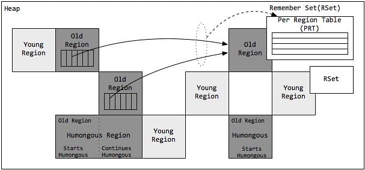
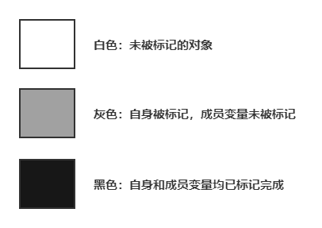

> G1垃圾回收器是在Java7 update 4之后引入的一个新的垃圾回收器。同优秀的CMS垃圾回收器一样，G1也是关注最小时延的垃圾回收器，也同样适合大尺寸堆内存的垃圾收集，官方在ZGC还没有出现时也推荐使用G1来代替选择CMS。G1最大的特点是引入分区的思路，弱化了分代的概念，合理利用垃圾收集各个周期的资源，解决了其他收集器甚至CMS的众多缺陷。@pdai

## 1. 概述

G1垃圾回收器是在Java7 update 4之后引入的一个新的垃圾回收器。G1是一个分代的，增量的，并行与并发的标记-复制垃圾回收器。它的设计目标是为了适应现在不断扩大的内存和不断增加的处理器数量，进一步降低暂停时间（pause time），同时兼顾良好的吞吐量。G1回收器和CMS比起来，有以下不同：

- G1垃圾回收器是**compacting**的，因此其回收得到的空间是连续的。这避免了CMS回收器因为不连续空间所造成的问题。如需要更大的堆空间，更多的floating garbage。连续空间意味着G1垃圾回收器可以不必采用空闲链表的内存分配方式，而可以直接采用bump-the-pointer的方式；
- G1回收器的内存与CMS回收器要求的内存模型有极大的不同。G1将内存划分一个个固定大小的region，每个region可以是年轻代、老年代的一个。**内存的回收是以region作为基本单位的**；
- G1还有一个及其重要的特性：**软实时**（soft real-time）。所谓的实时垃圾回收，是指在要求的时间内完成垃圾回收。<u>“软实时”则是指，用户可以指定垃圾回收时间的限时，G1会努力在这个时限内完成垃圾回收，但是G1并不担保每次都能在这个时限内完成垃圾回收。通过设定一个合理的目标，可以让达到90%以上的垃圾回收时间都在这个时限内。</u>

## 2. G1的内存模型

### 2.1 分区概念

G1分区示意图

#### 2.1.1 分区 Region

G1采用了分区(Region)的思路，将整个堆空间分成若干个大小相等的内存区域，每次分配对象空间将逐段地使用内存。因此，在堆的使用上，G1并不要求对象的存储一定是物理上连续的，只要逻辑上连续即可；每个分区也不会确定地为某个代服务，可以按需在年轻代和老年代之间切换。启动时可以通过参数-XX:G1HeapRegionSize=n可指定分区大小(1MB~32MB，且必须是2的幂)，默认将整堆划分为2048个分区。

每次垃圾回收的时候，G1会逐段地回收这些内存区域，而且不要求对象的存储在物理上是连续的，只要在逻辑上是连续的即可。这样的好处在于，分代垃圾收集将关注点聚焦在最近分配的对象上，无需全堆扫描，从而避免了对长生命周期对象的频繁拷贝。并且年轻代和老年代的垃圾回收过程相互独立，有助于降低系统整体的响应时间。

#### 2.1.2 卡片 Card

在每个分区内部又被分成了若干个大小为512 Byte卡片(Card)，标识堆内存最小可用粒度所有分区的卡片将会记录在全局卡片表(Global Card Table)中，分配的对象会占用物理上连续的若干个卡片，当查找对分区内对象的引用时便可通过记录卡片来查找该引用对象(见RSet)。每次对内存的回收，都是对指定分区的卡片进行处理。

对象的分配和回收都以卡片为基本单位进行，这个卡片的大小是可以进行设置和调整的。

#### 2.1.3 堆Heap

G1同样可以通过-Xms/-Xmx来指定堆空间大小。当发生年轻代收集或混合收集时，通过计算GC与应用的耗费时间比，自动调整堆空间大小。如果GC频率太高，则通过增加堆尺寸，来减少GC频率，相应地GC占用的时间也随之降低；目标参数-XX:GCTimeRatio即为GC与应用的耗费时间比，G1默认为9，而CMS默认为99，因为CMS的设计原则是耗费在GC上的时间尽可能的少。另外，当空间不足，如对象空间分配或转移失败时，G1会首先尝试增加堆空间，如果扩容失败，则发起担保的Full GC。Full GC后，堆尺寸计算结果也会调整堆空间。

### 2.2 分代模型

#### 2.2.1 分代垃圾收集

分代垃圾收集可以将关注点集中在最近被分配的对象上，而无需整堆扫描，避免长命对象的拷贝，同时独立收集有助于降低响应时间。虽然分区使得内存分配不再要求紧凑的内存空间，但G1依然使用了分代的思想。与其他垃圾收集器类似，G1将内存在逻辑上划分为年轻代和老年代，其中年轻代又划分为Eden空间和Survivor空间。**<u>但年轻代空间并不是固定不变的，当现有年轻代分区占满时，JVM会分配新的空闲分区加入到年轻代空间。</u>**

整个年轻代内存会在初始空间`-XX:G1NewSizePercent`(默认整堆5%)与最大空间(默认60%)之间动态变化，且由参数目标暂停时间`-XX:MaxGCPauseMillis`(默认200ms)、需要扩缩容的大小以`-XX:G1MaxNewSizePercent`及分区的已记忆集合(RSet)计算得到。当然，G1依然可以设置固定的年轻代大小(参数-XX:NewRatio、-Xmn)，但同时暂停目标将失去意义。

#### 2.2.2 本地分配缓冲 Local allocation buffer (Lab)

****

值得注意的是，由于分区的思想，每个线程均可以"认领"某个分区用于线程本地的内存分配，而不需要顾及分区是否连续。因此，每个应用线程和GC线程都会独立的使用分区，进而减少同步时间，提升GC效率，这个分区称为本地分配缓冲区(Lab)。

结合G1垃圾回收器来说，由于采用了分区（Region）的思想，所以每个线程都可以“认领”某个分区用于线程本地的内存分配，而无需顾忌内存空间是否连续。每个应用线程和GC线程都会独立的使用某个分区，从而减少同步所耗费的时间，提升GC效率，这个分区被称为”本地分配缓冲区“（Lab），除了Lab之外还有TLAB、PLAB和GCLAB等概念，如下：

- **TLAB（Threads Local Allocation Buffer，线程本地分配缓冲区）:** 每一个应用线程（App thread）都可以独占一个本地缓冲区（即Region）来创建对象，TLAB通常属于 Eden 空间，因为大部分对象会首先在 Eden 区被分配（大型对象除外）。
- **GCLab（\**\**GC Local Allocation Buffer，GC 本地缓冲区）:** 每个GC线程在进行垃圾收集时，同样可以独占一个本地缓冲区（GCLAB，即Region）用于转移对象，在每次回收过程中，对象会被复制到 Survivor 空间或老年代空间。
- **PLAB（\**\**Promotion Local allocation buffer，晋升本地缓冲区）:** 对于从 Eden 或 Survivor 空间晋升到 Survivor 或老年代空间的对象，即Old对象，同样有GC线程独占的本地缓冲区进行操作，该部分称为晋升本地缓冲区（PLAB）。

### 2.3 分区模型

G1对内存的使用以分区(Region)为单位，而对对象的分配则以卡片(Card)为单位。

#### 2.3.1 巨形对象Humongous Region

一个大小达到甚至超过分区大小一半的对象称为巨型对象(Humongous Object)。当线程为巨型分配空间时，不能简单在TLAB进行分配，因为巨型对象的移动成本很高，而且有可能一个分区不能容纳巨型对象。因此，巨型对象会直接在老年代分配，所占用的连续空间称为巨型分区(Humongous Region)。G1内部做了一个优化，一旦发现没有引用指向巨型对象，则可直接在年轻代收集周期中被回收。

巨型对象会独占一个、或多个连续分区，其中第一个分区被标记为开始巨型(StartsHumongous)，相邻连续分区被标记为连续巨型(ContinuesHumongous)。由于无法享受Lab带来的优化，并且确定一片连续的内存空间需要扫描整堆，因此确定巨型对象开始位置的成本非常高，如果可以，应用程序应避免生成巨型对象。

#### 2.3.2 已记忆集合Remember Set (RSet)

在串行和并行收集器中，GC通过整堆扫描，来确定对象是否处于可达路径中。然而G1为了避免STW式的整堆扫描，在每个分区记录了一个已记忆集合(RSet)，内部类似一个反向指针，记录引用分区内对象的卡片索引。当要回收该分区时，通过扫描分区的RSet，来确定引用本分区内的对象是否存活，进而确定本分区内的对象存活情况。

注意 Remember Set 不是直接记录对象地址，而是记录了那些对象所在的 Card 编号。所谓 Card 就是表示一小块（512 bytes）的内存空间，这里面很可能存在不止一个对象。但是这已经足够了：当我们需要确定当前 Region 有哪些对象存在外部引用时（这些对象是可达的，不能被回收），只要扫描一下这块 Card 中的所有对象即可，这比扫描所有 live objects 要容易的多。

事实上，并非所有的引用都需要记录在RSet中，如果一个分区确定需要扫描，那么无需RSet也可以无遗漏的得到引用关系。那么引用源自本分区的对象，当然不用落入RSet中；<u>同时，G1 GC每次都会对年轻代进行整体收集，因此引用源自年轻代的对象，也不需要在RSet中记录</u>。**<u>最后只有老年代的分区可能会有RSet记录，这些分区称为拥有RSet分区(an RSet’s owning region)。</u>**

#### 2.3.3 Per Region Table (PRT)

RSet在内部使用Per Region Table(PRT)记录分区的引用情况。由于RSet的记录要占用分区的空间，如果一个分区非常"受欢迎"，那么RSet占用的空间会上升，从而降低分区的可用空间。G1应对这个问题采用了改变RSet的密度的方式，在PRT中将会以三种模式记录引用：

| RSet储存状态                 | 描述                                                         | 实现方式描述                                                 |
| ---------------------------- | ------------------------------------------------------------ | ------------------------------------------------------------ |
| 稀疏模式（Sparse）           | 对于不那么热门的Region，直接记录引用对象的Card的索引，可以直接通过RSet找到对应对象，空间耗费最大，效率最高。 | 通过哈希表方式实现。数组的Key是当前Region的地址，而值是Card地址数组。 |
| 细粒度模式（Fine-grained）   | 记录引用对象的Region索引，可以通过RSet找到对应的Region.      | 通过Region地址链表实现，维护当前Region中所有Card的BitMap集合。当Card被引用时，对应的Bit被设置为1。同时，维护一个对应Region的索引数量，用于跟踪引用情况。 |
| 粗粒度模式（Coarse-grained） | 只记录引用情况，每个分区对应一个比特位，只记录了引用的存在与否，需要通过整堆扫描才能找出所有引用，因此扫描速度是最慢的。 | 通过BitMap来表示所有Region。如果有其他Region对当前Region有指针引用，就设置其对应的Bit为1，否则标记为0。 |

这种灵活的模式选择允许G1根据分区的特性和使用情况动态调整RSet的记录密度，以平衡空间占用和引用追踪的性能。这种策略的实施有助于在分区受欢迎的情况下最大限度地减少对可用空间的影响。

#### 2.3.4 RSet记录的引用类型

同时，由于G1垃圾回收器在YGC的时候会对所有的Eden区和Survivor区域都进行扫描和回收，因此，从年轻代到年轻代的引用是无需记录的。更多的引用关系如下：

| 引用关系               | 是否记录在RSet中 | 说明                                                         |
| ---------------------- | ---------------- | ------------------------------------------------------------ |
| 分区内部有引用关系     | 不记录           | 回收是针对一个分区进行的，回收时会遍历整个分区，无需记录分区内部引用关系。 |
| 新生代分区->新生代分区 | 不记录           | G1回收器在Young GC的时候会全量处理所有新生代分区，无需额外记录这一引用关系。 |
| 新生代分区->老生代分区 | 不记录           | YGC针对的是新生代分区，混合GC使用新生代分区作为根，FGC处理所有分区，无需额外记录这一引用关系。 |
| 老生代分区->新生代分区 | 记录             | YGC时有两种根，一是栈空间/全局空间变量的引用，另一是老生代分区到新生代分区的引用，需要记录。 |
| 老生代分区->老生代分区 | 记录             | 在混合GC时可能只有部分分区被回收，必须记录引用关系以快速找到活跃对象。 |

如上表所示，由于G1回收器不同类型的GC所处理的区域不同，并不是所有其它区域对本区域的引用关系都需要被记录的，简单来说只有“老年代分区到新生代分区”的引用、“老年代分区到老年代”分区的引用需要被RSet记录下来。

#### 2.3.5 RSet的作用

如果引用目标 Region 内对象的存活对象 **位于其他 Region（外部 Region）** 中，那么在回收目标 Region 时，GC **必须知道这些外部引用在哪里**，否则就会漏掉这些存活对象！

**传统分代 GC 的痛点：** 在老式分代 GC（如 Serial, Parallel, CMS）中，Young GC 需要扫描**整个老年代** (`Old Gen`) 来找出所有指向新生代 (`Young Gen`) 的引用（称为 `RSets` 或 `CardTable` 的目标区域），因为老年代是连续的。**这在老年代很大时（如 32G 堆中的 20G 老年代）会导致 Young GC 停顿时间非常长！**

G1 的解决方案：为每个 Region维护一个RSet。RSet 精确记录了谁（哪个外部 Region 的哪个 Card）引用了本 Region 的对象。这样，当回收一个特定 Region 时：**不再需要扫描整个堆！**只需要扫描：

- GC Roots。
- 目标 Region **内部**的对象图。
- **目标 Region 的 RSet 所指向的那些外部 Card（非常少量）** 中的对象，看看它们是否引用了目标 Region 的对象。

**<u>这样就实现了：</u>**

**实现精确的跨 Region 引用跟踪：** RSet 让 G1 知道，对于一个给定的目标 Region，哪些**外部 Region 的哪些微小部分（Card）** 可能包含指向它的引用。这是实现 **Region 级增量回收** 的基础。

大幅减少扫描范围：这是 RSet最核心、最强大的作用。尤其在以下场景：

- **Young GC：** 回收所有新生代 Region (Eden + Survivor) 时，**不需要扫描整个老年代**。只需要扫描新生代 Region 的 **RSet 所记录的那些老年代 Card**（通常只占老年代的极小一部分）。这在老年代巨大时节省的时间是惊人的。
- **Mixed GC：** 回收选中的老年代 Region `X` 时，不需要扫描其他老年代 Region `Y` 和 `Z` 的内部（除非它们恰好在 `X` 的 RSet 中被记录为引用者）。只需要扫描 `X` 内部的存活对象、GC Roots、以及 `X` 的 RSet 指向的那些外部 Card。

- **支持并发标记：** 在并发标记阶段，RSet 帮助标记线程在遍历对象图时，知道需要去哪些外部 Region 的哪些 Card 查找可能引用的对象，避免遍历整个堆。

#### 2.3.6 RSet的更新/创建

RSet **不是** 由写屏障直接更新的！更新 RSet 是一个相对较重的操作，它是由 **后台线程** 基于 **Dirty Card** 的信息来完成的。

1. **源头：引用修改 (Dirty Card)：** 应用线程修改引用 (`objA.field = objB`)，写屏障标记 `objA` 所在 Card 为 **Dirty** (如前所述)。

2. Dirty Card 发现：Concurrent Refinement Threads (并发优化线程)在后台运行。它们负责：

   - 从 **全局 Dirty Card 队列** 中取出 Dirty Card。
   - 或者，定期扫描 **Card Table** 查找 Dirty 条目。

3. **解析 Dirty Card：** Refinement 线程读取这个 Dirty Card 对应的 **512 字节内存块**。它解析这块内存中的所有对象，扫描这些对象的**所有引用字段**。

4. 识别跨 Region 引用：对于解析出的每个引用`objB`:

   - 获取 `objB` 所在的 Region (称为 **Target Region**)。
   - 获取 `objA` 所在的 Region (称为 **Source Region**)。

   <u>如果 Source Region != Target Region(即这是一个跨 Region 引用)，那么：</u>

   1. 获取 `objA` 在 Source Region 内部的地址，计算出它属于 Source Region 中的 **哪个 Card** (`SourceCard`)。
   2. **更新 Target Region 的 RSet：** 将 `(Source Region, SourceCard)` 这个信息 **添加** 到 **Target Region 的 RSet** 中。意思是：“Source Region 的 SourceCard 包含了指向我（Target Region）内对象的引用”。

5. **清除 Dirty 标记 (可能)：** 在处理完一个 Dirty Card 并更新了所有相关的 RSet 后，Refinement 线程可能会清除 Card Table 中该 Card 的 Dirty 标记（标记为干净），或者交给后续机制处理。

6. **RSet 内部维护：** RSet 的实现（如哈希表+位图）会负责高效地存储和查询这些 `(Source Region, SourceCard)` 信息。它通常只存储必要的信息，并可能进行压缩。

### 2.4 收集集合 (CSet)

CSet收集示意图

收集集合(CSet)代表每次GC暂停时回收的一系列目标分区。在任意一次收集暂停中，CSet所有分区都会被释放，内部存活的对象都会被转移到分配的空闲分区中。因此无论是年轻代收集，还是混合收集，工作的机制都是一致的。年轻代收集CSet只容纳年轻代分区，而混合收集会通过启发式算法，在老年代候选回收分区中，筛选出回收收益最高的分区添加到CSet中。

候选老年代分区的CSet准入条件，可以通过活跃度阈值-XX:G1MixedGCLiveThresholdPercent(默认85%)进行设置，从而拦截那些回收开销巨大的对象；同时，每次混合收集可以包含候选老年代分区，可根据CSet对堆的总大小占比-XX:G1OldCSetRegionThresholdPercent(默认10%)设置数量上限。

由上述可知，G1的收集都是根据CSet进行操作的，年轻代收集与混合收集没有明显的不同，最大的区别在于两种收集的触发条件。

#### 2.4.1 年轻代收集集合 CSet of Young Collection

应用线程不断活动后，年轻代空间会被逐渐填满。当JVM分配对象到Eden区域失败(Eden区已满)时，便会触发一次STW式的年轻代收集。在年轻代收集中，Eden分区存活的对象将被拷贝到Survivor分区；原有Survivor分区存活的对象，将根据任期阈值(tenuring threshold)分别晋升到PLAB中，新的survivor分区和老年代分区。而原有的年轻代分区将被整体回收掉。

同时，年轻代收集还负责维护对象的年龄(存活次数)，辅助判断老化(tenuring)对象晋升的时候是到Survivor分区还是到老年代分区。年轻代收集首先先将晋升对象尺寸总和、对象年龄信息维护到年龄表中，再根据年龄表、Survivor尺寸、Survivor填充容量-XX:TargetSurvivorRatio(默认50%)、最大任期阈值-XX:MaxTenuringThreshold(默认15)，计算出一个恰当的任期阈值，凡是超过任期阈值的对象都会被晋升到老年代。

#### 2.4.2 混合收集集合 CSet of Mixed Collection

年轻代收集不断活动后，老年代的空间也会被逐渐填充。当老年代占用空间超过整堆比IHOP阈值-XX:InitiatingHeapOccupancyPercent(默认45%)时，G1就会启动一次混合垃圾收集周期。为了满足暂停目标，G1可能不能一口气将所有的候选分区收集掉，因此G1可能会产生连续多次的混合收集与应用线程交替执行，每次STW的混合收集与年轻代收集过程相类似。

为了确定包含到年轻代收集集合CSet的老年代分区，JVM通过参数混合周期的最大总次数-XX:G1MixedGCCountTarget(默认8)、堆temper

#### 2.4.3 并发标记算法（三色标记法）

CMS和G1在并发标记时使用的是同一个算法：三色标记法，使用白灰黑三种颜色标记对象。白色是未标记；灰色自身被标记，引用的对象未标记；黑色自身与引用对象都已标记。

GC 开始前所有对象都是白色，GC 一开始所有根能够直达的对象被压到栈中，待搜索，此时颜色是灰色。然后灰色对象依次从栈中取出搜索子对象，子对象也会被涂为灰色，入栈。当其所有的子对象都涂为灰色之后该对象被涂为黑色。当 GC 结束之后灰色对象将全部没了，剩下黑色的为存活对象，白色的为垃圾。

#### 2.4.4 漏标问题

在remark过程中，黑色指向了白色，如果不对黑色重新扫描，则会漏标。会把白色D对象当作没有新引用指向从而回收掉。

并发标记过程中，Mutator删除了所有从灰色到白色的引用，会产生漏标。此时白色对象应该被回收

产生漏标问题的条件有两个：

- 黑色对象指向了白色对象
- 灰色对象指向白色对象的引用消失

所以要解决漏标问题，打破两个条件之一即可：

- **跟踪黑指向白的增加** incremental update：增量更新，关注引用的增加，把黑色重新标记为灰色，下次重新扫描属性。CMS采用该方法。
- **记录灰指向白的消失** SATB snapshot at the beginning：关注引用的删除，当灰–>白消失时，要把这个 引用 推到GC的堆栈，保证白还能被GC扫描到。G1采用该方法。

**为什么G1采用SATB而不用incremental update**？

因为采用incremental update把黑色重新标记为灰色后，之前扫描过的还要再扫描一遍，效率太低。G1有RSet与SATB相配合。Card Table里记录了RSet，RSet里记录了其他对象指向自己的引用，这样就不需要再扫描其他区域，只要扫描RSet就可以了。

也就是说 灰色–>白色 引用消失时，如果没有 黑色–>白色，引用会被push到堆栈，下次扫描时拿到这个引用，由于有RSet的存在，不需要扫描整个堆去查找指向白色的引用，效率比较高。SATB配合RSet浑然天成。

## 3. G1的活动周期

### 3.1 G1垃圾收集活动汇总

G1垃圾收集活动周期图

### 3.2 RSet的维护

由于不能整堆扫描，又需要计算分区确切的活跃度，因此，G1需要一个增量式的完全标记并发算法，通过维护RSet，得到准确的分区引用信息。在G1中，RSet的维护主要来源两个方面：写栅栏(Write Barrier)和并发优化线程(Concurrence Refinement Threads)

#### 3.2.1 栅栏Barrier

栅栏代码示意

我们首先介绍一下栅栏(Barrier)的概念。栅栏是指在原生代码片段中，当某些语句被执行时，栅栏代码也会被执行。而G1主要在赋值语句中，使用写前栅栏(Pre-Write Barrrier)和写后栅栏(Post-Write Barrrier)。事实上，写栅栏的指令序列开销非常昂贵，应用吞吐量也会根据栅栏复杂度而降低。

**写前栅栏 Pre-Write Barrrier**

即将执行一段赋值语句时，等式左侧对象将修改引用到另一个对象，那么等式左侧对象原先引用的对象所在分区将因此丧失一个引用，那么JVM就需要在赋值语句生效之前，记录丧失引用的对象。JVM并不会立即维护RSet，而是通过批量处理，在将来RSet更新(见SATB)。

**写后栅栏 Post-Write Barrrier**

当执行一段赋值语句后，等式右侧对象获取了左侧对象的引用，那么等式右侧对象所在分区的RSet也应该得到更新。同样为了降低开销，写后栅栏发生后，RSet也不会立即更新，同样只是记录此次更新日志，在将来批量处理(见Concurrence Refinement Threads)。

#### 3.2.2 起始快照算法Snapshot at the beginning (SATB)

Taiichi Tuasa贡献的增量式完全并发标记算法起始快照算法(SATB)，主要针对标记-清除垃圾收集器的并发标记阶段，非常适合G1的分区块的堆结构，同时解决了CMS的主要烦恼：重新标记暂停时间长带来的潜在风险。

SATB会创建一个对象图，相当于堆的逻辑快照，<u>从而确保并发标记阶段所有的垃圾对象都能通过快照被鉴别出来。</u> 当赋值语句发生时，应用将会改变了它的对象图，那么JVM需要记录被覆盖的对象。因此写前栅栏会在引用变更前，将值记录在SATB日志或缓冲区中。

每个线程都会独占一个SATB缓冲区，初始有256条记录空间。当空间用尽时，线程会分配新的SATB缓冲区继续使用，而原有的缓冲去则加入全局列表中。最终**<u>在并发标记阶段，并发标记线程(Concurrent Marking Threads)在标记的同时，还会定期检查和处理全局缓冲区列表的记录，然后根据标记位图分片的标记位，扫描引用字段来更新RSet。</u>**此过程又称为并发标记/SATB写前栅栏。

#### 3.2.3 并发优化线程Concurrence Refinement Threads

G1中使用基于Urs Hölzle的快速写栅栏，将栅栏开销缩减到2个额外的指令。栅栏将会更新一个card table type的结构来跟踪代间引用。

当赋值语句发生后，写后栅栏会先通过G1的过滤技术判断是否是跨分区的引用更新，并将跨分区更新对象的卡片加入缓冲区序列，即更新日志缓冲区或脏卡片队列。与SATB类似，一旦日志缓冲区用尽，则分配一个新的日志缓冲区，并将原来的缓冲区加入全局列表中。

并发优化线程(Concurrence Refinement Threads)，只专注扫描日志缓冲区记录的卡片来维护更新RSet，线程最大数目可通过`-XX:G1ConcRefinementThreads`(默认等于`-XX:ParellelGCThreads`)设置。并发优化线程永远是活跃的，一旦发现全局列表有记录存在，就开始并发处理。如果记录增长很快或者来不及处理，那么通过阈值`-X:G1ConcRefinementGreenZone/-XX:G1ConcRefinementYellowZone/-XX:G1ConcRefinementRedZone`，G1会用分层的方式调度，使更多的线程处理全局列表。如果并发优化线程也不能跟上缓冲区数量，则Mutator线程(Java应用线程)会挂起应用并被加进来帮助处理，直到全部处理完。因此，必须避免此类场景出现。

### 3.3 并发标记周期 Concurrent Marking Cycle

并发标记周期是G1中非常重要的阶段，这个阶段将会为混合收集周期识别垃圾最多的老年代分区。整个周期完成根标记、识别所有(可能)存活对象，并计算每个分区的活跃度，从而确定GC效率等级。

当达到IHOP阈值`-XX:InitiatingHeapOccupancyPercent`(老年代占整堆比，默认45%)时，便会触发并发标记周期。整个并发标记周期将由：

- 初始标记(Initial Mark)
- 根分区扫描(Root Region Scanning)
- 并发标记(Concurrent Marking)
- 重新标记(Remark)
- 清除(Cleanup)

几个阶段组成。其中，初始标记(随年轻代收集一起活动)、重新标记、清除是STW的。

> [!note]
> <u>而并发标记如果来不及标记存活对象，则可能在并发标记过程中，G1又触发了几次年轻代收集。</u>

#### 3.3.1 并发标记线程 Concurrent Marking Threads

并发标记位图过程

要标记存活的对象，每个分区都需要创建位图(Bitmap)信息来存储标记数据，来确定标记周期内被分配的对象。G1采用了两个位图Previous Bitmap、Next Bitmap，来存储标记数据，Previous位图存储上次的标记数据，Next位图在标记周期内不断变化更新，同时Previous位图的标记数据也越来越过时，当标记周期结束后Next位图便替换Previous位图，成为上次标记的位图。同时，每个分区通过顶部开始标记(TAMS)，来记录已标记过的内存范围。同样的，G1使用了两个顶部开始标记Previous TAMS(PTAMS)、Next TAMS(NTAMS)，记录已标记的范围。

在并发标记阶段，G1会根据参数`-XX:ConcGCThreads`(默认GC线程数的1/4，即`-XX:ParallelGCThreads/4`)，分配并发标记线程(Concurrent Marking Threads)，进行标记活动。每个并发线程一次只扫描一个分区，并通过"手指"指针的方式优化获取分区。并发标记线程是爆发式的，在给定的时间段拼命干活，然后休息一段时间，再拼命干活。

每个并发标记周期，在初始标记STW的最后，G1会分配一个空的Next位图和一个指向分区顶部(Top)的NTAMS标记。Previous位图记录的上次标记数据，上次的标记位置，即PTAMS，在PTAMS与分区底部(Bottom)的范围内，所有的存活对象都已被标记。那么，在PTAMS与Top之间的对象都将是隐式存活(Implicitly Live)对象。在并发标记阶段，Next位图吸收了Previous位图的标记数据，同时每个分区都会有新的对象分配，则Top与NTAMS分离，前往更高的地址空间。在并发标记的一次标记中，并发标记线程将找出NTAMS与PTAMS之间的所有存活对象，将标记数据存储在Next位图中。同时，在NTAMS与Top之间的对象即成为已标记对象。如此不断地更新Next位图信息，并在清除阶段与Previous位图交换角色。

### 3.4 年轻代收集/混合收集周期

年轻代收集和混合收集周期，是G1回收空间的主要活动。当应用运行开始时，堆内存可用空间还比较大，只会在年轻代满时，触发年轻代收集；随着老年代内存增长，当到达IHOP阈值`-XX:InitiatingHeapOccupancyPercent`(老年代占整堆比，默认45%)时，G1开始着手准备收集老年代空间。首先经历并发标记周期，识别出高收益的老年代分区，前文已述。但随后G1并不会马上开始一次混合收集，而是让应用线程先运行一段时间，等待触发一次年轻代收集。在这次STW中，G1将保准整理混合收集周期。接着再次让应用线程运行，当接下来的几次年轻代收集时，将会有老年代分区加入到CSet中，即触发混合收集，这些连续多次的混合收集称为混合收集周期(Mixed Collection Cycle)。

#### 3.4.1 GC工作线程数

GC工作线程数 `-XX:ParallelGCThreads`

JVM可以通过参数`-XX:ParallelGCThreads`进行指定GC工作的线程数量。参数`-XX:ParallelGCThreads`默认值并不是固定的，而是根据当前的CPU资源进行计算。如果用户没有指定，且CPU小于等于8，则默认与CPU核数相等；若CPU大于8，则默认JVM会经过计算得到一个小于CPU核数的线程数；当然也可以人工指定与CPU核数相等。

## 4. GC 过程

### 4.1 完全年轻代 GC

完全年轻代GC是只选择年轻代区域（Eden/Survivor）进入回收集合（Collection Set，简称CSet）进行回收的模式。年轻代GC的过程和其他的分代回收器差不多，新创建的对象分配至Eden区域，然后将标记存活的对象移动至Survivor区，达到晋升年龄的就晋升到老年代区域，然后清空原区域（不过这里可没有年轻代复制算法中两个Survivor的交换过程）。

**<u>Young GC 是一个 STW 事件，意味着在 GC 进行期间，所有应用线程都会被暂停。这个暂停发生在下面列出的整个过程中。</u>**

**核心目标：** 快速回收 Eden 和 Survivor 区中的死亡对象，释放空间供新对象分配，并将存活对象晋升（复制）到新的 Survivor 区或老年代。<u>**关键点：它处理所有 Eden Region 和所有 Survivor Region。**</u>

> G1的垃圾回收，逻辑上G1分为年轻代和老年代，但是它的比例不是固定的，只是逻辑上的区分，为了满足MaxGCPauseMillis 最大停顿时间限制，G1会自动调整两者之间的比例。这也是G1 JVM调优，不建议使用 -Xmn或者-XX:NewRatio去设定它们的比例的原因，由 G1自行调节，如果限制了年轻代的大小，那么设定的这个参数-MaxGCPauseMilli有可能会失效。

#### 4.1.1 如何尽力满足用户设定的停顿时间目标

G1 会尽最大努力满足停顿时间目标，但这与 Young GC 必须处理所有新生代 Region 并不存在根本性冲突。 G1 通过一系列精妙的设计和优化策略来**平衡**这两个看似矛盾的要求，尤其是在大堆（如 32G）场景下。

<u>新生代越大（Eden + Survivor Region 总数越多），扫描和复制所有存活对象所需的时间自然越长，可能超过设定的停顿时间目标。</u>当 Eden 区填满时，**必须**进行 Young GC 来回收空间，否则应用线程会因无法分配新对象而停顿。处理所有新生代 Region 是回收 Eden 和 Survivor 空间、完成对象晋升的必要步骤。

G1 并非简单地“硬扫”所有新生代 Region 而不顾时间，而是通过以下机制动态调整并努力满足目标：

##### **<u>动态调整新生代大小 (Adaptive Heap Sizing)</u>**

- G1 **最核心**的满足停顿时间的手段就是**动态调整新生代（特别是 Eden Region）的数量**。
- **目标导向：** G1 的停顿预测模型会持续监控每次 GC 的实际耗时。如果 Young GC 时间超过了 `MaxGCPauseMillis`，G1 会**减少**下一次 GC 周期可以使用的 **Eden Region 的数量**。
- 效果：减少 Eden Region 数量意味着：
  - 更频繁地触发 Young GC（因为较小的 Eden 更快填满）。
  - 但**每次 Young GC 需要处理的对象总量变少**（Eden + Survivor Region 总数减少）。
  - 因此，单次 Young GC 的停顿时间**缩短**。
- **反之亦然：** 如果 Young GC 时间远低于目标，G1 可能会增加 Eden Region 数量，让 GC 发生得不那么频繁（提高吞吐量），但单次停顿可能稍长（仍在目标内）。
- **大堆 (32G) 下的关键：** 在 32G 大堆上，G1 **不会**一开始就分配一个巨大的新生代。它会根据停顿目标，动态地将新生代控制在**一个它能在这个目标时间内处理完的规模**。虽然总堆很大，但**单次 Young GC 实际处理的新生代区域大小是被 G1 主动约束的**。

##### **<u>并行化与高效扫描</u>**

1. **并行复制：** Young GC 的“疏散”阶段（将存活对象从 Eden/Survivor 复制到新的 Survivor/老年代）是**高度并行化**的，利用多核 CPU 优势大幅加速。

2. RSet 优化老年代扫描：Young GC 需要扫描新生代对象，同时也需要扫描老年代中哪些对象引用了新生代（避免漏标存活对象）。G1 利用 RSet 实现了精准扫描：

   - 它**不需要扫描整个老年代**。

   - 它只扫描**那些 RSet 指出包含指向本次收集集合（CSet，即所有新生代 Region）引用的老年代卡片 (Card)**。这极大地减少了扫描范围，尤其在大堆老年代占比高时效果显著。

3. **卡片标记与增量处理：** 写屏障标记的脏卡片（Dirty Cards）会被后台的 Refinement 线程**并发处理**，提前解析引用关系并更新 RSet。这减少了 Young GC 时处理 RSet 的工作量。

##### **<u>停顿预测模型</u>**

- G1 维护一个复杂的模型，根据历史数据（如 Region 中存活对象的数量、复制对象的平均时间、RSet 处理时间等）**预测**下一次 GC（尤其是 Young GC）可能花费的时间。
- 这个预测模型是**动态调整新生代大小**的基础依据。G1 的目标是让预测时间接近但不超过 `MaxGCPauseMillis`。

##### **<u>增量处理与工作窃取</u>**

- 在 Young GC 的停顿期内，G1 会将任务划分给多个 GC 工作线程。
- 工作线程采用**工作窃取 (Work Stealing)** 算法，确保所有 CPU 核心都能高效利用，避免线程空闲，尽可能快地完成工作。

#### 4.1.2 根扫描 (Root Scanning)

枚举并扫描所有 **GC Roots**。这是所有可达对象的起点。找到所有**直接由 GC Roots 引用**的对象。这些对象是存活的，并且是后续对象图遍历的起点。

典型的 GC Roots 包括：

- <u>活跃线程的栈帧中的局部变量和操作数栈。</u>
- <u>已加载类的静态字段 (`static` fields)。</u>
- <u>JNI (Java Native Interface) 全局引用和局部引用。</u>
- <u>系统类加载器加载的类。</u>
- <u>虚拟机内部数据结构（如代码缓存、JVMTI 等持有的对象）。</u>

>  这是 STW 停顿的开始。停顿时间长短**高度依赖**于 Root 的数量和复杂度（如线程数、栈深度、静态变量数量、JNI 引用数量）。
>
> 优化：G1 会并行化此阶段（多 GC 线程同时扫描不同的 Root 集）。

> [!CAUTION]
>
>
> 通过跟扫描，关于新生代，可以发现有根：**<u>A、E两个对象</u>**

> [!note]
>
> 注意，这里只标记了 A/E两个对象，不包含D。这是因为，Young GC只扫描新生代。d

#### 4.1.3 处理 Dirty card/更新 RSet

G1 的写屏障 (Write Barrier) 在对象引用字段被修改时，会将修改发生的内存地址对应的 **Card** 标记为 “Dirty”，并将该 Dirty Card 加入一个或多个队列（如全局队列或线程本地队列）。

>  **关于Card**，我们前面有介绍过：G1 将堆内存（每个 Region 内部）进一步划分为固定大小的**小块**，称为 **Card**。默认大小通常是 **512 字节**。整个堆的 Card 大小相同。你可以把堆想象成一个巨大的表格，每个格子就是一个 Card。
>
> **Card Table（卡片表）** 是一个**全局的、具体的物理数据结构**（通常是 `byte[]` 或位图）。它的每个条目（Entry）对应堆中的一个 Card。
>
> **Dirty Card（脏卡片）** 是 Card Table 中某个条目的**状态**。当一个 Card 内的引用被修改时，其在 Card Table 中的对应条目会被标记为 “Dirty”。**Dirty Card 是 Card Table 数据结构中存储的具体值。**
>
>
> 如下图所示，在一个大小为1 GB的堆下，那么CardTable的长度为2097151 (1GB / 512B)；每个Region 大小为1 MB，每个Region都会对应2048个Card Page。
>
> 

这里面有至关重要的两个步骤：

- **处理 Dirty Card 队列：** GC 线程会处理这些队列中的 Dirty Cards。对于每个 Dirty Card，GC 线程需要解析该 Card 内存块内的所有对象，找出其中包含的**跨 Region 引用**。(前面也说过，新生代引用新生代，是不用记录的，因为Young GC会扫描全部的新生代。)

- **扫描 RSet (核心)：** 更关键的是，GC 线程需要扫描**本次 Young GC 回收集合 (Collection Set - CSet)** 中**所有 Region 的 RSet (Remembered Set)**。CSet 在 Young GC 中就是 *所有* Eden Region 和 *所有* Survivor Region。

  > **RSet 扫描目的：** 找出**老年代中哪些 Card 包含了指向本次 CSet (新生代) 中对象的引用**。这些老年代对象是 CSet 中新生代对象的“外部根”，它们引用的新生代对象是存活的。

如下图所示，区域B中的对象b引用了区域A中的对象a，这个引用关系跨了两个区域。b对象所在的CardPage为122，在区域A的RSet中，以区域B的地址作为key，b对象所在CardPage下标为value记录了这个引用关系，这样就完成了这个跨区域引用的记录。


为什么要做这么一个步骤呢？

- **避免全堆扫描：** 这是 G1 高效的关键！通过 RSet，Young GC **无需扫描整个老年代**就能精确找到所有引用了新生代存活对象的老年代引用点。只需扫描 RSet 记录的少量老年代 Card。
- **确保存活对象不被遗漏：** 如果老年代对象 A 引用了新生代对象 B，而 B 不在 GC Roots 直接引用链上，如果没有 RSet，B 会被错误回收。RSet 确保了 B 被正确标记为存活。


注意事项：

- 后台的 **Concurrent Refinement Threads** 会在应用运行时处理部分 Dirty Cards 并更新 RSet，减轻 Young GC STW 期间的工作量。但 Young GC STW 期间仍需处理剩余队列或进行最终扫描。
- **RSet 扫描的效率和准确性直接影响 Young GC 停顿时间。** 优化良好的 RSet（如使用哈希表或位图，只记录必要信息）非常重要。老年代引用新生代对象越多，此阶段耗时可能越长。

> [!CAUTION]
>
> 通过扫描Dirty Card、RSet，又发现根：**<u>D 对象</u>**

#### 4.1.4 对象图遍历与标记 (Object Graph Traversal & Marking)

从 **阶段 1 (Roots)** 和 **阶段 2 (RSet 找到的老年代引用点)** 找到的**所有存活对象**出发。使用**三色标记算法**（通常采用**广度优先搜索/BFS**或深度优先/DFS，实践中BFS更利于并行）递归遍历**本次 CSet (所有 Eden + Survivor Region) 内部**的对象图。

**标记**所有可达的对象为存活。未被标记的对象即为垃圾。标记信息通常记录在对象头或一个独立的位图 (Mark Bitmap) 中。

- 此阶段**仅标记 CSet (新生代) 内部的对象**。它确认了哪些新生代对象是存活的（需要复制），哪些是死亡的（可回收）。

- 它**不负责标记老年代对象**（除非老年代对象作为根或通过 RSet 被引用到，但标记动作仅限于确认其对年轻代对象的影响）。

> [!CAUTION]
>
> 通过遍历标记，又发现被引用的活对象：**<u>C、F 对象</u>**

至此，所有的对象的新生代环境的所有的对象，都被标记完成。

#### 4.1.5 存活对象复制/疏散 (Live Object Copying / Evacuation)

这是 Young GC 的**核心回收动作**。GC 线程将**阶段 3 标记为存活的对象**，从它们当前所在的 **源 Region (Source Region - Eden 或旧的 Survivor)** **复制**到**目标 Region (Destination Region)**。

**<u>目标 Region 选择：</u>**

- 大部分存活对象被复制到**新的 Survivor Region**。
- 如果对象的**年龄 (Age)** 达到了晋升阈值 (`-XX:MaxTenuringThreshold`)，或者 Survivor 区空间不足，对象会被直接**晋升 (Promote)** 复制到**老年代 Region**。

**<u>注意事项：</u>**

- <u>**高度并行化：** 复制任务被分配给多个 GC 工作线程并行执行，工作窃取保证效率。这是利用多核 CPU 的关键阶段。</u>
- <u>**晋升策略：** `MaxTenuringThreshold` 控制对象在 Survivor 区之间复制的次数（年龄增长）后才晋升老年代。G1 也有动态年龄判定（如果某年龄对象总大小超过 Survivor 区一半，则 >= 该年龄的对象直接晋升）。</u>
- <u>**空间分配担保：** 在复制前，G1 需要确保有足够的空闲 Region 作为目标（Survivor 和/或老年代）。如果空间不足，可能会触发更耗时的操作（如提前启动 Mixed GC 或 Full GC）。</u>
- <u>**复制开销：** 存活对象的数量 (`Live Data Size`) **直接决定**了此阶段的开销和停顿时间。存活对象越多，复制时间越长。这也是 G1 动态调整新生代大小的主要依据。</u>

复制完成后，**更新对象引用**：复制过程中对象的地址改变了，所有指向该旧地址的引用（包括新生代内部引用和老年代通过 RSet 记录的引用）都需要更新到新地址。这个引用更新发生在复制阶段本身或稍后的阶段。

#### 4.1.6 引用处理 (Reference Processing)

处理 Java 语言定义的特殊引用类型：

- **软引用 (SoftReference)：** 在内存不足时才会被回收。GC 会根据策略（如最近最少使用）决定是否清除。
- **弱引用 (WeakReference)：** 只要发生 GC 就会被清除。被清除的引用对象会被加入引用队列 (`ReferenceQueue`)。
- **虚引用 (PhantomReference)：** 主要用于跟踪对象被回收的状态，总是会被清除并加入队列。
- **Finalizer 引用：** 关联了 `finalize()` 方法的对象。如果对象被判定死亡，它会被加入 Finalizer 队列，由专门的 `Finalizer` 线程（优先级较低）稍后调用其 `finalize()` 方法。对象在调用 `finalize()` 后还有一次“复活”的机会（但不鼓励使用）。

注意事项：

- 此阶段可能增加停顿时间，特别是应用大量使用弱引用或存在很多待 `finalize` 的对象时。
- 开启 `-XX:+ParallelRefProcEnabled` 可以让引用处理并行化，显著减少停顿。
- `finalize()` 方法执行缓慢或阻塞会严重拖累系统。

#### 4.1.7 回收 Region / 元数据更新 (Region Reclamation & Metadata Update)

所有 **源 Region (Eden Region 和 旧的 Survivor Region)** 现在已被完全清空（存活对象已复制走）。将这些 Region 标记为 **Free Region**，加入 G1 的空闲 Region 列表。更新 G1 的内存管理元数据：

- 更新 **已提交内存 (Committed Memory)** 和 **已使用内存 (Used Memory)** 信息。
- 更新 **分配器 (Allocator)** 状态，为新对象分配做好准备（通常从空闲的 Eden Region 开始分配）。
- 更新 **Survivor 区** 的布局（新的 Survivor Region 集合）。
- 更新 **老年代占用比例**（如果有晋升发生）。

- 可能触发 **IHOP (Initiating Heap Occupancy Percent)** 的重新计算，影响并发标记周期的触发。

注意事项：

- 此阶段通常很快。
- 回收的 Region 可以立即用于后续的对象分配（主要是 Eden）。

#### 4.1.8 后置处理 (Post-Processing - Optional STW)

并非每次 Young GC 都有，但在特定情况下会触发一个短暂的额外 STW 停顿：

- **代码根引用处理 (Code Root Fixup)：** 如果启用了 **JVMCI (JVM Compiler Interface)** 编译器（如 Graal），可能需要处理编译代码中对已移动对象的引用。
- **选择 CSet (仅 Mixed GC)：** **这不是 Young GC 的一部分！** 在并发标记周期结束后的清除阶段 (`Cleanup`) 会选择 Mixed GC 的 CSet (包含新生代+选中的老年代)。Young GC 的 CSet 始终是 *所有* 新生代 Region。

### 4.2 并发标记周期 Concurrent Marking Cycle

G1 的**并发标记周期（Concurrent Marking Cycle）** 是 G1 垃圾回收器的核心机制之一，它是一个**与应用线程并发执行的、长时间运行的过程**，主要目标是**识别整个 Java 堆中所有存活的对象**，并为后续高效回收老年代空间（通过 **Mixed GC**）做准备。这是 G1 实现其“**Garbage-First**”（优先回收垃圾最多区域）理念的关键基础。

> [!caution]
>
> Mixed GC **依赖**于一个**已经完成**的 **并发标记周期（Concurrent Marking Cycle）** 提供的信息。没有有效的并发标记周期结果，Mixed GC 就无法正确选择高收益的老年代 Region。

#### 作用

##### **构建全堆存活对象图（核心目标）：**

遍历整个堆（包括所有 Eden、Survivor、Old 和 Humongous Region），标记出所有从 GC Roots 可达的对象，即存活对象。

这是后续决定哪些 Region 包含大量垃圾（即可回收空间多）的先决条件。只有知道哪些对象是存活的，才能准确计算每个 Region 的垃圾比例。

##### **为 Mixed GC 提供候选集（直接目的）：**

 在标记周期的最后阶段（**清除/Cleanup**），G1 会统计每个 **Old Region** 中**存活对象的比例**（`liveness = live_bytes / region_size`）。

G1 根据这个存活比例（或等价地，垃圾比例 `1 - liveness`），对老年代 Region 进行**排序**。垃圾比例越高的 Region，回收它们的“性价比”就越高（单位时间释放的空间最多）。这些高收益的 Region 会被选为后续 **Mixed GC** 的候选回收集（Collection Set, CSet）。

##### **识别并回收完全空闲的 Region（即时回收）：**

同样在 **清除/Cleanup** 阶段，G1 会识别出在标记过程中发现**没有任何存活对象**（即垃圾比例为 100%）的 Region。

这些完全空闲的 Region 会被**立即回收**并加入空闲 Region 列表，供后续分配（Eden, Survivor, Old）使用，无需等待 Mixed GC。这能快速释放部分空间。

##### **避免 Full GC（保障机制）：**

通过定期（在堆占用达到 IHOP 阈值时触发）执行并发标记周期和紧随其后的 Mixed GC，G1 能够**渐进式地、有计划地回收老年代空间**。

这大大降低了由于老年代空间耗尽而被迫触发一次长时间、STW 的 **Full GC** 的风险。Full GC 在 G1 中通常是单线程的（Serial Old），会导致非常长的停顿，严重影响应用响应时间。并发标记周期是 G1 避免 Full GC 策略的基石。

##### **支持类卸载和元数据清理（附加作用）：**

在并发标记周期的 **重新标记（Remark）** 阶段，G1 能够确认哪些 Java 类（`Class` 对象）和对应的类加载器不再被任何存活对象引用。

这使得 G1 能够在后续阶段（通常在 Full GC 或特殊的清理阶段，但优化后也可能在 Remark 或 Cleanup 后）安全地卸载这些不再使用的类和清理相关的元数据（如方法区/元空间），释放宝贵的内存资源。

#### 阶段 1：初始标记 (Initial Mark) - STW 暂停

初始标记(Initial Mark)负责标记所有能被直接可达的根对象(原生栈对象、全局对象、JNI对象)，根是对象图的起点，因此初始标记需要将Mutator线程(Java应用线程)暂停掉，也就是需要一个STW的时间段。

事实上，当达到IHOP阈值时，G1并不会立即发起并发标记周期，而是等待下一次年轻代收集，利用年轻代收集的STW时间段，完成初始标记，这种方式称为借道(Piggybacking)。在初始标记暂停中，分区的NTAMS都被设置到分区顶部Top，初始标记是并发执行，直到所有的分区处理完。

---

**<u>执行线程：</u>**  **GC 线程**（与应用线程无关）

**<u>执行阶段：</u>** 附着在一次 **Young GC 的 STW 停顿期内**执行（搭便车）。

**<u>这么做的目的：</u>**

- **搭便车：** 利用 Young GC 必然发生的根扫描，**省去一次独立 STW**。
- **启动标记：** 获取并发标记的**起点对象集**（灰色对象）。
- **核心产出：** 初始标记的存活对象集合。

> [!caution]
>
> **<u>与Young GC的跟扫描阶段 共享流程</u>**
>
> **共享STW阶段：**当并发标记周期启动时，初始标记阶段会"寄生"在**下一次Young GC的STW停顿**中执行。
>
> **同一组工作线程：**
>  Young GC的"根对象标记"（扫描GC Roots）和"初始标记"任务由**同一组并行GC工作线程 (Parallel GC Threads)** 同时执行：
>
> 1. STW开始时：JVM启动一组固定数量的 `GC worker` 线程（配置参数 `-XX:ParallelGCThreads`）。
> 2. 任务复用：
>    - 这些线程首先执行Young GC必需的**根扫描（Root Scanning）**（标记所有**根对象**：线程栈、JNI句柄、静态变量等）。
>    - 同时，G1利用这次扫描结果，将**根直接可达的对象**（也就是并发标记的起点）记录下来（设置标记位图）。

#### 阶段2：根分区扫描 Root Region Scanning

在初始标记暂停结束后，年轻代收集也完成的对象复制到Survivor的工作，应用线程开始活跃起来。<u>此时为了保证标记算法的正确性，所有新复制到Survivor分区的对象，都需要被扫描并标记成根，这个过程称为根分区扫描(Root Region Scanning)，同时扫描的Suvivor分区也被称为根分区(Root Region)。</u>

> [!note]
>
> 不与Young GC共享流程。发生在**Young GC的STW结束之后**，此时**应用线程已恢复运行**。
>
> 该任务由**独立的并发标记后台线程**（通常是 `G1 Concurrent Marker` 线程，如 `ConcurrentGCThreads`）执行，而非STW期间的 `GC worker` 线程。
>
> **对象范围特殊：**它扫描的是**初始标记中标记的Survivor分区（称为"根分区"）**。因为Survivor区的对象可能在并发标记期间被Young GC复制移动，需要确保这些变更被追踪（借助RSet）。

**关键约束：** **必须在下次 Young GC 前完成！**根分区扫描必须在下一次年轻代垃圾收集启动前完成(并发标记的过程中，可能会被若干次年轻代垃圾收集打断)，因为每次GC会产生新的存活对象集合。**<u>如果耗时过长，会阻塞下一次 Young GC 的触发。</u>**

识别出 Survivor -> Old 的引用，确保这些老年代对象在后续并发标记中被正确访问。

---

**<u>执行线程：</u>**  **后台 GC 线程**（Concurrent Marking Threads）

**<u>执行阶段：</u>** **应用线程运行期间**，与初始标记结束之后、并发标记开始之前。

**<u>这么做的目的：</u>** **确保老年代对象不被漏标：** Survivor 中的对象是“变化的根源”（Young GC 会移动它们）。扫描它们对老年代的引用，确保在后续并发标记中，这些被引用的老年代对象能被正确遍历。

#### 阶段3：并发标记 Concurrent Marking

这是**耗时最长**的核心阶段。多个标记线程**与应用线程并发运行**。

> 和应用线程并发执行，并发标记线程在并发标记阶段启动，由参数`-XX:ConcGCThreads`(默认GC线程数的1/4，即`-XX:ParallelGCThreads/4`)控制启动数量，每个线程每次只扫描一个分区，从而标记出存活对象图。

在这一阶段会处理Previous/Next标记位图，扫描标记对象的引用字段。同时，并发标记线程还会定期检查和处理STAB全局缓冲区列表的记录，更新对象引用信息。

> 参数`-XX:+ClassUnloadingWithConcurrentMark`会开启一个优化，如果一个类不可达(不是对象不可达)，则在重新标记阶段，这个类就会被直接卸载。

所有的标记任务必须在堆满前就完成扫描，如果并发标记耗时很长，那么有可能在并发标记过程中，又经历了几次年轻代收集。如果堆满前没有完成标记任务，则会触发担保机制，经历一次长时间的串行Full GC。

**算法：** 从 **初始标记** 和 **根分区扫描** 得到的根对象出发，使用**三色标记算法**（主要是处理灰色对象队列）递归遍历整个堆（所有 Region）的对象图，标记所有可达对象。

<u>**处理并发修改：**使用 SATB (Snapshot-At-The-Beginning) 算法：</u>

- 在标记开始时对堆中对象做一个**逻辑快照**，目标是标记这个快照中存活的对象。
- 并发期间**新分配的对象**默认被视为**存活**（隐式标记，通常分配在 TLABs/PLABs 或直接标记）。
- 并发期间**被删除的引用**（`A.c = null`）可能导致原引用对象死亡，但 SATB 能保证它在本轮标记中存活（属于快照），留待下一轮回收。
- 并发期间**新建立的引用**（`A.c = new C()`）由写屏障记录在 SATB 缓冲区队列中，留待 **重新标记** 阶段处理。

**输出** 近乎完整的全堆存活对象标记信息（快照视图）。

---

**<u>执行线程：</u>** **专用并发标记线程**（与应用线程**同时运行**）

**<u>执行阶段：</u>** 应用线程正常运行期间（根分区扫描完成后开始）。

**<u>这么做的目的：</u>** 

- **核心任务：** **构建全堆存活对象图谱**。这是识别“垃圾最多 Region”的基础。
- **降低 STW：** 最耗时的遍历工作**在后台完成**，极大减少 STW 总时间。
- **核心产出：** 近乎完整的堆存活状态（快照视图）。

#### SATB并发标记算法

在标记阶段，会使用到一个marking stack的东西。G1不断从marking stack中取出引用，递归扫描整个堆里的对象图，并且在bitmap上进行标记。这个递归过程采用的是深度遍历，会不断把对象的域入栈。

在并发标记阶段，因为应用还在运行，所以可能会有引用变更，包括现有引用指向别的对象，或者删除了一个引用，或者创建了一个新的对象等。G1采用的是使用SATB的并发标记算法。

> 在资料6中记录了使用SATB的两条原则：
>
> 1. All accessible cells at the beginning of the garbage collection are eventually marked during the marked phase;
> 2. Newly alocated cells during the garbage collection are never collected during the sweep phase of that garbage collection

在G1中，该算法的关键在于，如果在并发标记的时候，出现了引用修改（不包含新分配内存给对象），那么写屏障会把这些引用的原始值捕获下来，记录在log buffer中。而后再处理。后续的所有的标记，都是从原来的值出发，而不是从新的值出发的。

SATB是一个逻辑上存在概念，在实际中并没有任何真的实际的数据结构与之对应。叫这个名字，是因为，一旦进入了concurrent marking阶段，那么该在该阶段的运行过程中，即便应用修改了引用，但是因为SATB的写屏障记录下来了原始的值，在遍历整个堆查找存活对象的时候，使用的依然是原来的值。这就是在逻辑上保持了一个snapshot at the beginning of concurrent marking phase。

在处理新创建的对象，G1采用了不同的方式。G1用了两个TAMS变量了判断新创建的对象。一个叫做previous TAMS，一个叫做next TAMS。位于两者之间的对象就是新分配的对象。

并发标记阶段，bitmap和TAMS的作用如图：

该图的详细解释如下：

1. A是第一次marking cycle的initial marking阶段。next bitmap尚未标记任何存活对象，而此时的previous TAMS被初始化为region内存地址起始值，next TAMS被初始化为top。top实际上就是一个region未分配区域和已分配区域的分界点；
2. B是经过concurrent marking阶段之后，进入了remark阶段。此时存活对象的扫描已经完成了，因此next bitmap构造好了，刚好代表的是当下状态中region中的内存使用情况。注意的是，此时top已经不再与next TAMS重合了，top和next TAMS之间的就是在前面标记阶段之时，新分配的对象；
3. C代表的是clean up阶段。C和B比起来，next bitmap变成了previous bitmap，而在bitmap中标记为垃圾（也就是白色区域的）的对应的region的区域也被染成了浅灰色。这并不是指垃圾对象已经被清扫了，仅仅是标记出来了。同时next TAMS和previous TAMS也交换了角色；
4. D代表的是下一个marking cycle的initial marking阶段，该阶段和A类似，next TAMS重新被初始化为top的值；
5. EF就是BC的重复；

#### 阶段4：存活数据计算 Live Data Accounting

存活数据计算(Live Data Accounting)是标记操作的附加产物，只要一个对象被标记，同时会被计算字节数，并计入分区空间。只有NTAMS以下的对象会被标记和计算，在标记周期的最后，Next位图将被清空，等待下次标记周期。

#### 阶段5：重新标记 Remark

重新标记(Remark)是最后一个标记阶段。在该阶段中，G1需要一个暂停的时间，去处理剩下的SATB日志缓冲区和所有更新，找出所有未被访问的存活对象，同时安全完成存活数据计算。这个阶段也是并行执行的。

>  通过参数-XX:ParallelGCThread可设置GC暂停时可用的GC线程数。

同时，引用处理也是重新标记阶段的一部分，所有重度使用引用对象(弱引用、软引用、虚引用、最终引用)的应用都会在引用处理上产生开销。

---

**<u>执行线程：</u>** **GC 线程**（所有应用线程暂停）

**<u>执行阶段：</u>** 并发标记结束后，一个**独立且必须的 STW 停顿**。

**<u>这么做的目的：</u>** 

- **修正并发误差：** 处理应用线程并发修改导致的**漏标问题**（主要来自删除的引用）。
- **最终确认存活集：** 产出**精确的全堆存活对象集合**（Mark Bitmap 最终版）。
- **核心产出：** 最终准确的堆存活状态。

#### 阶段6：清除 Cleanup

清除(Clean)阶段也是STW的。Previous/Next标记位图、以及PTAMS/NTAMS，都会在清除阶段交换角色。清除阶段主要执行以下操作：

<u>STW的执行：</u>

- **整理堆分区**，为混合收集周期识别回收收益高(基于释放空间和暂停目标)的老年代分区集合；
- **识别所有空闲分区**，即发现无存活对象的分区。该分区可在清除阶段直接回收，无需等待下次收集周期。

<u>并发的执行：</u>

- **RSet梳理**，启发式算法会根据活跃度和RSet尺寸对分区定义不同等级，同时RSet数理也有助于发现无用的引用。参数`-XX:+PrintAdaptiveSizePolicy`可以开启打印启发式算法决策细节；

---

**<u>执行线程：</u>** **GC 线程**（STW 部分） + **后台线程**（并发部分）

**<u>这么做的目的：</u>** 

- **核心目标：** 为 **Mixed GC 提供回收依据**！没有这一步，Mixed GC 无法精准选择“垃圾优先”的 Region。
- **即时回收：** 立即释放**完全空闲 Region**，快速获得可用空间。
- 核心产出：
  - **Mixed GC 候选集：** 垃圾比例最高的老年代 Region 列表（后续 Mixed GC 从中挑选）。
  - **空闲 Region 列表更新。**

### 4.3 Mixed GC

Mixed GC 是 G1 垃圾回收器的核心特色之一，它在同一个回收周期内**同时回收新生代 Region（所有 Eden + Survivor）和精心挑选的部分老年代 Region**。其目标是在**可控的停顿时间内，高效地回收老年代空间**，避免老年代填满触发 Full GC。

Mixed GC **依赖**于一个**已经完成**的 **并发标记周期（Concurrent Marking Cycle）** 提供的信息。没有有效的并发标记周期结果，Mixed GC 就无法正确选择高收益的老年代 Region。

#### **前提条件：并发标记周期已完成**

**并发标记周期** 必须已经成功完成（经历了 Initial Mark -> Root Region Scanning -> Concurrent Marking -> Remark -> Cleanup）。

> [!important]
>
> 在Cleanup阶段：
>
> - 统计了每个 **老年代 Region 的存活对象比例** (`liveness = live_bytes / region_size`)。
> - 根据 `liveness`（或垃圾比例 `1 - liveness`）对老年代 Region 进行了**排序**，垃圾比例越高，回收收益越大。
> - 生成了一份**高收益老年代 Region 候选列表**。
> - 回收了**完全空闲**的 Region。

这份候选列表是后续 Mixed GC 选择回收集（CSet）中老年代部分的依据。

#### **阶段 1：Mixed GC 的触发**

**<u>触发条件：</u>**

- **主要：** 在并发标记周期完成后，当 G1 预测到**下一次仅进行 Young GC 可能无法满足分配需求**（例如，空闲空间不足，或者晋升压力大），或者**满足用户设定的启发式规则**时，G1 会决定启动 Mixed GC。
- **IHOP 影响：** 虽然 IHOP 主要触发并发标记周期，但 Mixed GC 的执行节奏也受堆占用率和空间需求驱动。通常并发标记周期完成后，如果老年代占用率仍然较高，G1 会尽快开始 Mixed GC 序列。

**触发时机：** 通常发生在 **Eden 区填满**，即将触发一次 GC 时。G1 判断这次 GC 应该是 Mixed GC 而非纯 Young GC。

**日志标识：** GC 日志中会明确标记为 `Pause (Mixed)`。

#### **阶段 2：选择回收集（Collection Set, CSet） - (STW 开始前或开始时)**

CSet 组成：
- **所有新生代 Region：** 必须包含**当前所有的 Eden Region 和 Survivor Region**。这是 Mixed GC 必然包含的部分，相当于同时执行了一次 Young GC。
- **选定的老年代 Region：** 从并发标记周期 **Cleanup** 阶段生成的高收益老年代 Region 候选列表中，选择**一组** Region 加入 CSet。

选择老年代 Region 的策略 (Garbage-First 核心)：
- **基于收益：** 优先选择**垃圾比例最高**（存活比例最低）的老年代 Region。目的是在单位时间内释放最多的空间。
- **基于停顿预测：** G1 的停顿预测模型会估算回收每个候选 Region 需要的时间（基于其存活对象数量、RSet 复杂度等）。
- 组合策略：G1 会从高收益候选列表的顶部（垃圾比例最高）开始选择 Region，累加预测的回收时间，直到满足以下任一条件：
  1. 达到**本次 GC 的停顿时间目标** (`-XX:MaxGCPauseMillis`)。
  2. 达到**可选老年代 Region 数量的上限**（内部启发式规则）。
  3. **候选列表耗尽**（所有高收益 Region 都已加入本轮 CSet，但这在大型堆中很少见）。
- **增量回收：** 一次 Mixed GC **不会回收所有候选的老年代 Region**。它会回收一部分（由停顿时间目标控制），剩余的候选 Region 会在**后续的 Mixed GC** 中回收。这就是**增量回收**模式。

**输出：** 确定本次 Mixed GC 的 CSet = {所有新生代 Region} + {选中的老年代 Region 1, 老年代 Region 2, ..., 老年代 Region N}。

#### **阶段 3：根扫描 (Root Scanning) - (STW)**

**任务：** 与 Young GC 相同，枚举并扫描所有 **GC Roots**（线程栈、静态变量、JNI 句柄、系统字典、VM 内部数据结构等），找到所有**直接可达**的对象。

**重要性：** 标记过程的起点。停顿时间受 Root 数量和复杂度影响。

**并行化：** 多 GC 线程并行扫描不同的 Root 集。

#### **阶段 4：处理 Dirty Card 队列 / RSet 扫描 (Process Dirty Cards / RSet Scanning) - (STW)**

任务：核心目的是找出所有可能指向本次 CSet 内对象的外部引用。**处理 Dirty Card 队列：** 处理应用线程运行期间写屏障积累的 Dirty Card（部分可能已被后台 Refinement 线程处理）。

<u>扫描 CSet 的 RSet： 这是最关键的部分：</u>

- 对于 CSet 中的每一个 Region (X)：
  - 查询 **Region X 的 RSet**。
  - RSet 会告诉 GC：哪些**外部 Region (Y)** 的哪些 **Card (Z)** 包含了指向 Region X 内对象的引用。
- GC 线程需要去扫描这些 **外部 Region (Y) 的指定 Card (Z)** 中的对象，找出它们指向 **CSet (特别是 Region X)** 的引用。这些引用指向的对象是 CSet 中的**潜在存活对象**（需要通过后续标记确认）。

**性能关键：** RSet 扫描的范围和效率**极大影响** Mixed GC 的停顿时间。优化良好的 RSet 结构（哈希表/位图）和后台 Refinement 线程的充分工作是基础。

#### **阶段 5：对象图遍历与标记 (Object Graph Traversal & Marking) - (STW)**

标记CSet 内部的所有存活对象。从 **阶段 3 (Roots)** 和 **阶段 4 (RSet 扫描找到的外部引用点)** 找到的所有指向 CSet 的存活对象出发。使用**三色标记算法**（BFS/DFS），递归遍历 **CSet 内部**（所有新生代 Region + 选中的老年代 Region）的对象图。**标记**所有可达的对象为存活。
- 此阶段**仅标记 CSet 内部的对象**。它确认了哪些 CSet 对象是存活的（需要复制或留在原位），哪些是死亡的（可回收）。
- 它**不负责标记 CSet 外部的老年代对象**（除非作为根或通过 RSet 被引用到，但标记动作仅限于确认其对 CSet 对象的影响）。

**并行化：** 高度并行化，工作窃取。

#### **阶段 6：存活对象复制/疏散 (Live Object Copying / Evacuation) - (STW)**

回收的核心动作，将标记的存活对象疏散（复制）到新的 Region。

新生代对象：
- 从当前 Eden/Survivor Region 复制到**新的 Survivor Region**。
- 如果年龄足够 (`-XX:MaxTenuringThreshold`) 或 Survivor 空间不足，则**晋升**到**老年代 Region**。

老年代对象：
- **关键区别：** 老年代对象**不一定**被复制！这是 Mixed GC 与 Young GC 的重要不同。
- **复制条件：** 只有被选入 **CSet 的老年代 Region** 中的存活对象才需要被复制。
- **目标：** 这些存活对象被复制到**新的、空闲的 Old Region** 中。
- **原地存活：** 未被选入 CSet 的老年代 Region 中的对象**保持原位不动**。

- **更新引用：** 复制过程中对象的地址改变了，所有指向该旧地址的引用（堆内引用和栈上引用）都需要**更新到新地址**。这个更新在复制阶段内或紧随其后完成。

- 注意事项：
  - 高度并行化（工作窃取）。
  - 老年代对象复制通常比新生代对象复制开销更大（对象更大、引用关系更复杂）。
  - **空间保证：** G1 需要在开始复制前确保有足够的空闲 Region（Survivor + Old）容纳所有预计存活的 CSet 对象。如果空间不足，可能会触发 Full GC（失败担保）。

#### **阶段 7：引用处理 (Reference Processing) - (STW)**

- **任务：** 处理软引用、弱引用、虚引用、Finalizer 引用。判断它们指向的对象（这些对象必须在 CSet 内）是否在这次 GC 中死亡，并进行相应处理（入队列、调用 finalize 等）。
- **注意事项：** 开启 `-XX:+ParallelRefProcEnabled` 可并行化加速。大量引用或缓慢的 `finalize()` 会增加停顿。

#### **阶段 8：回收 Region / 元数据更新 (Region Reclamation & Metadata Update) - (STW)**

- 任务：
  - 所有 **源 Region (CSet 中的 Region)** 现在已被清空（存活对象已复制走）。
  - 将这些 Region 标记为 **Free Region**，加入空闲 Region 列表。
  - 更新关键元数据：
    - 已提交/已使用内存量。
    - 分配器状态（新的 Eden 将从空闲 Region 开始分配）。
    - Survivor 区布局（新的 Survivor Region 集合）。
    - 老年代占用率（更新晋升和新复制过来的老年代对象）。
    - 更新 **CSet 中老年代 Region 的回收情况**。
- **输出：** 释放了 CSet 中所有 Region 的空间（新生代全清 + 选中的老年代 Region 清空）。

#### **阶段 9：后置处理与恢复 - (STW 结束)**

- **后置处理：** 可能包括处理 JVMCI 编译代码根引用等（通常短暂）。
- **恢复应用线程：** STW 暂停结束，应用线程恢复运行。
- **日志记录：** 记录 GC 暂停时间、回收空间量、晋升量、各代 Region 数量变化等关键指标。

#### **阶段 10：后续 Mixed GC 的触发 (循环)**

- **增量回收：** 一次 Mixed GC 只回收了**部分**高收益的老年代 Region（受停顿时间限制）。
- **剩余候选：** 并发标记周期 Cleanup 阶段生成的候选列表中，未被本轮回收的老年代 Region 仍然保留。
- **再次触发：** 当 Eden 再次填满（或满足其他启发式条件），并且仍有高收益老年代 Region 待回收时，G1 会触发**下一次 Mixed GC**。
- **新 CSet：** 新的 Mixed GC 会再次包含**所有当前新生代 Region**，并从**剩余的候选老年代 Region** 中选择一组加入 CSet（同样基于收益和停顿预测）。
- 循环结束：这个 Mixed GC 序列会持续进行，直到：
  1. 并发标记周期生成的所有候选老年代 Region 都被回收完。
  2. 空闲空间已足够，无需继续回收老年代。
  3. 触发了新的并发标记周期（当堆占用再次达到 IHOP 阈值）。

### 4.4 Full GC

G1 (Garbage-First) 垃圾收集器的设计目标是**尽量避免 Full GC (Full Garbage Collection)**，它主要通过高效的并发标记和增量式、可预测的疏散（复制）来实现这一目标。然而，在极端情况下，G1 仍然可能不得不进行一次 **STW (Stop-The-World)** 的、**单线程**的、**类似于 Serial Old GC** 的 Full GC。这个过程通常被称为 **G1 Full GC** 或 **G1 evacuation failure (to-space exhausted) GC**，它是 G1 的**最后手段**，性能开销极大，应极力避免。

> [!note]
>
> Java 10 通过迭代改进现有算法来减少完整 GC 的暂停时间。在 Java 10 G1 之前，完整 GC 都是在单线程中运行的。甚至32 核服务器及其 128GB 内存将停止并暂停，直到一个线程清理完垃圾。
>
> 在 Java 10 中，这一功能已得到改进，可以并行运行。GC 可以在多个线程上并行运行，尽管在完成之前仍会暂停 JVM 的进程。可通过`-XX:ParallelGCThreads`配置线程数。
>
> 这是对 Java 10 中 G1 算法的一项出色改进，应该能够减少大多数用户在最坏情况下的停顿时间。
>
> 这是否意味着 Java GC 停顿已成为过去？并非如此——它确实减少了问题，但由于 G1 的垃圾收集周期并非与应用程序并发运行，因此它仍然会定期暂停应用程序，并且 Full GC 停顿次数会随着堆大小的增加而增加。我们在上一篇博文中讨论过一些其他垃圾收集器，它们未来可能会解决这个问题。

#### 核心触发条件

G1 Full GC 最主要的触发原因是：**在准备进行年轻代收集或混合收集时，发现没有足够的空闲区域（Region）来容纳本次收集需要晋升的对象，或者无法为新的巨型对象分配空间，并且无法通过扩展堆或调整 IHOP 来避免。** 具体场景包括：

1. **晋升失败 (Promotion Failure)：** 在年轻代收集期间，老年代区域中没有足够的连续空闲空间来容纳所有需要从年轻代晋升的对象。
2. **疏散失败 (Evacuation Failure)：** 在混合收集期间，老年代区域中没有足够的连续空闲空间来容纳需要从候选回收集 (Collection Set - CSet) 中复制（疏散）出来的存活对象。
3. **巨型对象分配失败 (Humongous Allocation Failure)：** 尝试分配一个超过 Region 大小 50% 的巨型对象时，无法找到连续的、足够的空闲 Region 来容纳它。
4. **元空间耗尽 (Metaspace Exhaustion)：** 元空间 (Metaspace) 无法满足内存分配请求，并且无法通过卸载类来回收足够空间。
5. **系统显式调用 `System.gc()`：** 这通常也会触发一次 Full GC，具体行为取决于 JVM 参数（如 `-XX:+ExplicitGCInvokesConcurrent` 或 `-XX:+DisableExplicitGC`）。

## 总结

G1是一款非常优秀的垃圾收集器，不仅适合堆内存大的应用，同时也简化了调优的工作。通过主要的参数初始和最大堆空间、以及最大容忍的GC暂停目标，就能得到不错的性能；同时，我们也看到G1对内存空间的浪费较高，但通过**首先收集尽可能多的垃圾**(Garbage First)的设计原则，可以及时发现过期对象，从而让内存占用处于合理的水平。

虽然G1也有类似CMS的收集动作：初始标记、并发标记、重新标记、清除、转移回收，并且也以一个串行收集器做担保机制，但单纯地以类似前三种的过程描述显得并不是很妥当。

- G1的设计原则是"**首先收集尽可能多的垃圾**(Garbage First)"。因此，G1并不会等内存耗尽(串行、并行)或者快耗尽(CMS)的时候开始垃圾收集，而是在内部采用了启发式算法，在老年代找出具有高收集收益的分区进行收集。同时G1可以根据用户设置的暂停时间目标自动调整年轻代和总堆大小，暂停目标越短年轻代空间越小、总空间就越大；
- G1采用内存分区(Region)的思路，将内存划分为一个个相等大小的内存分区，回收时则以分区为单位进行回收，存活的对象复制到另一个空闲分区中。由于都是以相等大小的分区为单位进行操作，因此G1天然就是一种压缩方案(局部压缩)；
- G1虽然也是分代收集器，但整个内存分区不存在物理上的年轻代与老年代的区别，也不需要完全独立的survivor(to space)堆做复制准备。G1只有逻辑上的分代概念，或者说每个分区都可能随G1的运行在不同代之间前后切换；
- G1的收集都是STW的，但年轻代和老年代的收集界限比较模糊，采用了混合(mixed)收集的方式。即每次收集既可能只收集年轻代分区(年轻代收集)，也可能在收集年轻代的同时，包含部分老年代分区(混合收集)，这样即使堆内存很大时，也可以限制收集范围，从而降低停顿。
