# Java虚拟机（JVM）

> 虚拟机是一种抽象化的计算机，通过在实际的计算机上仿真模拟各种计算机功能来实现的。Java虚拟机有自己完善的硬体架构，如处理器、堆栈、寄存器等，还具有相应的指令系统。Java虚拟机屏蔽了与具体操作系统平台相关的信息，使得Java程序只需生成在Java虚拟机上运行的目标代码（字节码），就可以在多种平台上不加修改地运行。**Write Once，Run Anywhere**

除了一些概念性的东西外，其余的都是基于最常用的HotSpot虚拟机。

# JVM内存结构

和C/C++语言不同，Java通过虚拟机来对内存进行自动管理，避免了手动申请和释放内存的繁琐以及容易出错的问题，Java虚拟机把内存分为几个不同的数据区，如下：

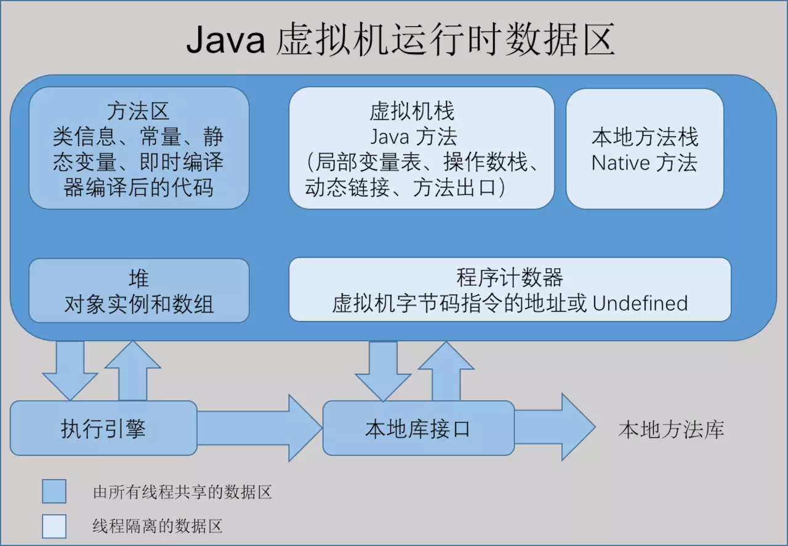

- 直接内存（DirectByteBuffer）

## 栈（Stack）

> JVM规范要求：**每个Java线程拥有自己私有独享的JVM栈**，JVM栈随着线程启动产生，线程结束而消亡。栈区内存由编译器自动分配释放，线程在执行一个方法时会创建一个对应的栈帧（Stack Frame），栈以帧为单位保存线程的状态，栈帧负责存储局部变量变量表、操作数栈、动态链接和方法返回地址等信息。

对于一个Java程序来说，它的运行就是通过对栈帧的操作来完成的 。一个方法被调用时，当前方法的栈帧会被压到当前线程的Java栈的栈顶，调用结束后弹出，JVM对栈只进行两种操作:以帧为单位的压栈和出栈（销毁）操作。基于这个特点，方法中的局部变量因此可以在不同的调用过程中具有不同的值，这个是递归调用的基础。

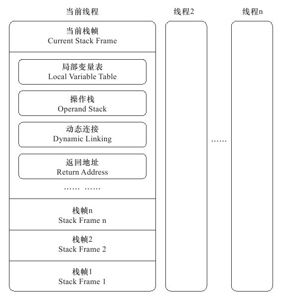

1. 限制了某一个方法的栈帧的生命周期不能超过其调用者，这样对于多线程共享的变量无法在栈中实现。
2. 栈帧中的数据大小在编译期必须确定，对于需要大小动态变化的对象无法很好支持，因此JVM栈中主要存放一些大小确定的基本类型的变量（int, short, long, byte, float, double, boolean, char)和对象句柄。

ps：在java中每new一个线程，jvm都是向操作系统请求new一个本地线程，此时操作系统会使用剩余的内存空间来为线程分配内存，而不是使用jvm的内存


## 堆（Heap）

JVM堆是被所有线程共享的一块内存区域，负责在编译时或运行时都无法确定存储要求的数据结构的内存分配，比如可变长度串和对象实例。堆中的内存可以按照任意顺序分配和释放，在Java中，堆的内存由JVM来自动管理。

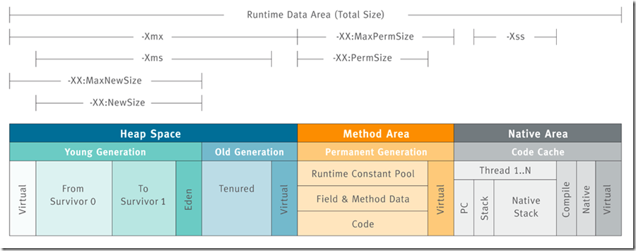


# 对象分配

### 对象内存布局（无锁态）

http://hg.openjdk.java.net/jdk8/jdk8/hotspot/file/87ee5ee27509/src/share/vm/oops/markOop.hpp

https://www.jianshu.com/p/3d38cba67f8b

https://blog.csdn.net/qq_32099833/article/details/103721326

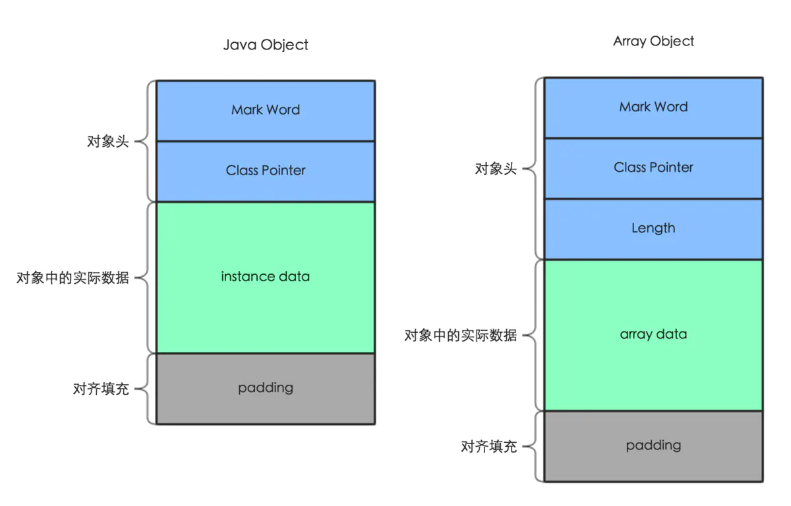

32-Bit JVM

```
|-------------------------------------------------------|--------------------|
|                  Mark Word (32 bits)                  |       State        |
|-------------------------------------------------------|--------------------|
| identity_hashcode:25 | age:4 | biased_lock:1 | lock:2 |       Normal       |
|-------------------------------------------------------|--------------------|
|  thread:23 | epoch:2 | age:4 | biased_lock:1 | lock:2 |       Biased       |
|-------------------------------------------------------|--------------------|
|               ptr_to_lock_record:30          | lock:2 | Lightweight Locked |
|-------------------------------------------------------|--------------------|
|               ptr_to_heavyweight_monitor:30  | lock:2 | Heavyweight Locked |
|-------------------------------------------------------|--------------------|
|                                              | lock:2 |    Marked for GC   |
|-------------------------------------------------------|--------------------|
```

64-Bit JVM

```
|------------------------------------------------------------------------------|--------------------|
|                                  Mark Word (64 bits)                         |       State        |
|------------------------------------------------------------------------------|--------------------|
| unused:25 | identity_hashcode:31 | unused:1 | age:4 | biased_lock:1 | lock:2 |       Normal       |
|------------------------------------------------------------------------------|--------------------|
| thread:54 |       epoch:2        | unused:1 | age:4 | biased_lock:1 | lock:2 |       Biased       |
|------------------------------------------------------------------------------|--------------------|
|                       ptr_to_lock_record:62                         | lock:2 | Lightweight Locked |
|------------------------------------------------------------------------------|--------------------|
|                     ptr_to_heavyweight_monitor:62                   | lock:2 | Heavyweight Locked |
|------------------------------------------------------------------------------|--------------------|
|                                                                     | lock:2 |    Marked for GC   |
|------------------------------------------------------------------------------|--------------------|
```

HotSpot虚拟机自动内存管理系统要求对象的起始地址必须是8字节的整数倍，主要目的是加快寻址？

8字节对齐，虽然有一定空间浪费，但对象寻址速度可以提高很多，另外想想为什么虚拟机对象最大年龄是15？设置超过15会怎么样？

> -XX:MaxTenuringThreshold=16

```
MaxTenuringThreshold of 16 is invalid; must be between 0 and 15
```

数组length占4字节，实际为32位有符号整数，所以数组最大长度被隐含为Integer.MAX_VALUE

### 对象内存布局

mac上使用的64-Bit JDK1.8，输出为小端模式

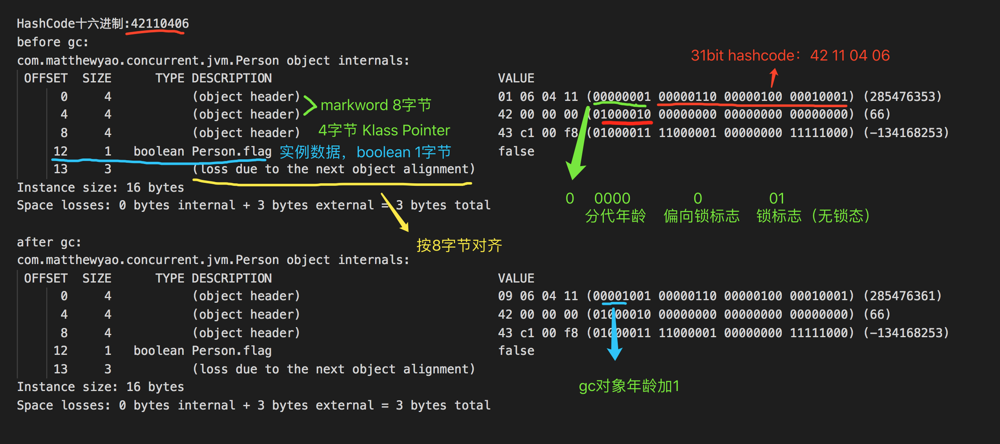

### 对象的访问定位

通过Java中的Reference类型来访问

#### 通过直接指针访问（HotSpot默认）

优点：对象寻址快，少一次指针定位

.jpg)

#### 通过句柄访问

优点：实例对象地址改变只需修改指针、GC时移动对象只需要修改指针不动reference

.jpg)

## 堆内存分配方式

堆内存分配方式分为“指针碰撞”与“空闲列表”两种，选择哪种分配方式由Java堆是否规整决定，而Java堆是否规整又由所采用的垃圾收集器是否带有压缩整理功能决定。

### 指针碰撞（Bump the Pointer）

如果堆内存是完全工整的，用过的内存和没用的内存各在一边每次分配的时候只需要将指针向空闲内存一方移动一段和内存大小相等区域即可。比如ParNew、Serial、G1这种带整理的垃圾回收器，由它们负责回收的区域就采用

“指针碰撞”方式来进行内存分配。

### 空闲列表（free list)

如果Java堆中的内存并不是规整的，已使用的内存和空闲的内存相互交错，虚拟机维护一个列表，记录上那些内存块是可用的，在分配的时候从列表中找到一块足够大的空间划分给对象实例，并更新列表上的记录。像CMS垃圾回

收器回收后并不对内存进行整理，因此老年代会存在较多的碎片，这样当需要在老年代进行内存分配是，采用的是“空闲列表”的方式。

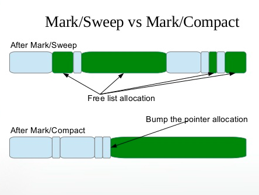

### 堆内存分配并发问题

由于堆内存是多线程共享的，因此不可避免的存在并发问题，JVM主要采用两种方案来解决并发问题：

#### TLAB（Thread Local Allocation Buffer）

JVM内存分配是一个比较频繁的动作，同步处理带来的失败重试会对分配性能有较大影响，因此从Java 1.6开始引入了TLAB技术，可以通过**-XX:+/-UseTLAB**来开启或者关闭（默认是开启的）。TLAB是线程的一块

私有内存，在线程初始化时，从堆中申请一块指定大小的内存，当前线程需要申请内存时，先从自己的TLAB中分配，容量不够时再通过同步处理从Eden区申请，大幅提升分配效率。

TLAB的管理是依靠三个指针：start、end、top。start与end标记了Eden中被该TLAB管理的区域，该区域不会被其他线程分配内存所使用，top是分配指针，开始时指向start的位置，随着内存分配的进行，慢慢

end靠近，当撞上end时触发TLAB refill，内存中Eden的结构大体为：

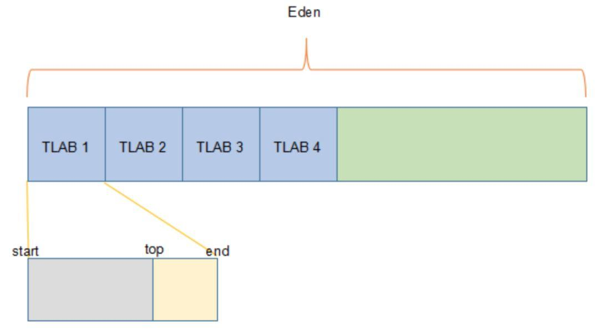

TLAB中分配规则（开启的情况下）：

1. TLAB剩余空间大于待分配对象大小，直接在TLAB上分配返回。
2. 如果TLAB剩余空间放不下对象，同时TLAB剩余空间大小大于允许的浪费阈值（refill_waste），那么本次放弃在TLAB上分配，直接在eden区进行慢分配，TLAB剩余空间留着下次继续使用。
3. 如果TLAB剩余空间放不下对象，同时TLAB剩余空间大小小于允许的浪费阈值，那么进入到“慢分配”过程：
   1. 丢弃当前TLAB。
   2. 从eden区裸空间重新分配一个新TLAB，然后对象再在新TLAB上分配。（这里从eden区新申请TLAB时，如果eden区空间不够，会触发YGC。）

#### 同步处理

JVM采用 CAS + 失败重试机制 来保证多线程内存分配的原子性

```c++
CASE(_new): {//遇到new指令
      ...
          if (UseTLAB) {//判断是否是TLAB的方式
            result = (oop) THREAD->tlab().allocate(obj_size);
          }
          //以下是内存分配多线程同步的CAS加失败重试的方案
          if (result == NULL) {//result为NULl，表示不是采用TLAB解决内存分配多线程的问题
            //直接在堆内存中的eden代中分配
      retry:
            // eden的top地址
            HeapWord* compare_to = *Universe::heap()->top_addr();
            // 分配内存后新的top地址
            HeapWord* new_top = compare_to + obj_size;
            // 新的top地址不超过eden的最大内存大小
            if (new_top <= *Universe::heap()->end_addr()) {
              //Atomic::cmpxchg_ptr是一个采用CAS的原子操作，用于将compare_to指针更新；
              if (Atomic::cmpxchg_ptr(new_top, Universe::heap()->top_addr(), compare_to) != compare_to) {
                goto retry;// CAS失败, 重试
              }
              result = (oop) compare_to;//内存分配成功
            }
          }
          //以下在设置对象头
          ...
      }
    //如果类没有被解析；则会进行一系列复杂的类加载、内存分配等操作；这是一种较慢的情况；
    ...
}
```

以上可知，一般情况下JVM中对象都是在堆中进行内存分配，但是在堆中分配内存虽然有TLAB类似的技术能降低同步带来的开销，但分配TLAB本身还是需要同步操作，另外堆中分配的对象在生命周期结束后需要

专门的垃圾回收器来清理，和栈中内存“方法退出即可销毁”的分配回收相比效率较低，那么有没有例外呢？


## JIT

即时编译器（Just In Time Compiler），也称为 JIT编译器，它的主要工作是把热点代码编译成与本地平台相关的机器码，并进行各种层次的优化，从而提高代码执行的效率。

那么什么是热点代码呢？我们知道虚拟机通过解释器（Interpreter）来执行字节码文件，当虚拟机发现某个方法或代码块的运行特别频繁时，就会把这些代码认定为“热点代码”（Hot Spot Code）。

这也就是HotSpot虚拟机的命名来源。


[为什么 JVM 不用 JIT 全程编译？-- R大](https://www.zhihu.com/question/37389356/answer/73820511)


### 逃逸分析

> 在计算机语言编译器优化原理中，逃逸分析是指分析指针动态范围的方法，它同编译器优化原理的指针分析和外形分析相关联。当变量（或者对象）在方法中分配后，其指针有可能被返回或者被全局引用，这样就会被其他方法或者线程所引用，这种现象称作指针（或者引用）的逃逸(Escape)。通俗点讲，如果一个对象的指针被多个方法或者线程引用时，那么我们就称这个对象的指针（或对象）的逃逸（Escape）。

逃逸分析(Escape Analysis)是一种代码分析，通过动态分析对象的作用域，可以分析出某个对象是否永远只在某个方法、线程的范围内，并没有“逃逸”出这个范围，为其它优化手段如栈上分配、标量替换和同步消除

等提供依据，发生逃逸行为的情况有两种：方法逃逸和线程逃逸。

- **方法逃逸：**方法中定义的对象被外部方法引用（如：作为调用参数或者返回值被其他方法引用到）
- **线程逃逸：**对象可以被其他线程访问到（如：实例变量、类变量等）

通过 **-XX:+DoEscapeAnalysis** 参数来控制“逃逸分析”是否开启，JDK 1.7以上默认开启。

[逃逸分析为何不能在编译期进行？ -- R大](https://www.zhihu.com/question/27963717/answer/38871719)


#### 栈上分配

如果确定一个对象不会逃逸出方法之外，假如能使用栈上分配这个对象，那大量的对象就会随着方法的结束而自动销毁了，垃圾收集系统的压力将会小很多。然而遗憾的是，由于实现复杂，目前的 HotSpot 虚拟机

还没有实现这项优化。


#### 同步消除

线程同步的消耗较大，通过“逃逸分析”，如果确定一个对象不会被其他线程访问到，那对这个对象的读写就不会存在并发问题，因此可以清除该对象的同步锁。

```java
public void sample() {
    Object lock = new Object();
    synchronized(lock) {
        System.out.println(lock);
    }
}
```

```java
public void sample() {
    Object lock = new Object();
    System.out.println(lock);
}
```

#### 标量替换

JIT经过“逃逸分析”发现一个对象只在方法内部使用不会被外界访问时，会在编译优化过程中把这个对象的成员变量拆解成若干个原始数据类型的标量来进行替代，这个过程就是“标量替换”。

```java
public void sayHi() {
    User user = new User(1, 14100L);
    System.out.println("Say Hi to:" + user.uid + "," + user.staffNum);
}
class User {
    private int uid;
    private long staffNum;
}
```

```java
public void sayHi() {
    int uid = 1;
    long staffNum = 14100L;
    System.out.println("Say Hi to:" + uid + "," + staffNum);
}
```

## 总结

由以上整理可知，虚拟机对象分配流程大概如下：首先如果开启栈上分配，JVM会先进行栈上分配，如果没有开启栈上分配或则不符合条件的则会进行TLAB分配，如果TLAB分配不成功，再尝试在eden区分配，如果对象满足了直接进入老年代的条件，那就直接分配在老年代。在eden区和老年代分配主要通过“指针碰撞”和“空闲列表”两种方式实现，通过CAS解决堆上“非TLAB方式分配”的并发问题。


所以，对象分配后用完了，怎么释放占用内存？

# 对象回收

## 识别垃圾对象

### 引用计数(Reference Counting)

引⽤计数的实现⽐较简单，核⼼就是给每⼀个对象增加⼀个引⽤计数器，当另⼀个对象引⽤当前对象时就给当前对象的引⽤计数+1，当有对象不再引⽤当前对象时，就将引⽤计数-1，当前对象的引⽤计数变成0时，递归地将该对象引⽤的⼦对象的引⽤计数-1，并把当前对象使⽤的内存区域释放到空闲链表中。

引用计数算法在实时性和执行效率方面有较大优势，类似python、perl、swift等语言都使用引用计数算法来实现GC。但由于在高并发时的性能较低等问题，对性能要求较高的系统一般不会采用引用计数算法。


可作为 GC Roots 的对象：

- 虚拟机栈(栈帧中的本地变量表)中引⽤的对象
- ⽅法区中类静态属性引⽤的对象
- ⽅法区中常量引⽤的对象
- 本地⽅法栈中 JNI(即⼀般说的 Native ⽅法) 引⽤的对象

这种⽅式有个很⼤的缺点, ⽆法解决对象循环依赖的问，任何作⽤域中都没有引⽤指向这些对象，但由于循环

引⽤, 导致引⽤计数⼀直⼤于零，如红⾊部分


### 根可达分析**（Tracing GC）**

从 GC Root 开始进行对象搜索，可以被搜索到的对象即为可达对象，此时还不足以判断对象是否存活/死亡，需要经过多次标记才能更加准确地确定，整个连通图之外的对象便可以作为垃圾被回收掉。目前 Java 中主流的虚拟机均采用此算法。

-0586272.png)

可作为 GC Roots 的对象

- 虚拟机栈(栈帧中的本地变量表)中引用的对象
- 方法区中类静态属性引用的对象
- 方法区中常量引用的对象
- 本地方法栈中 JNI(即一般说的 Native 方法) 引用的对象

### 标记-清除­ (Mark and Sweep)

JVM使用 ­ (Mark and Sweep algorithm), 来跟踪所有的可达对象(即存活对象), 确保所有不可达对象(non­reachable objects)占用的内存都能被重用。其中包含两步:

1. Marking (标记): 遍历所有的可达对象,并在本地内存(native)中分门别类记下。
2. Sweeping (清除): 这一步保证了,不可达对象所占用的内存, 在之后进行内存分配时可以重用。


而不好的地方在于, 垃圾收集过程中, 需要暂停应用程序的所有线程。假如不暂停,则对象间的引用关系会一直不停地发生变化, 那样就没法进行统计了。这种情况叫做 STW ( Stop The World pause , 全线暂停), 让应用程序暂时停止，让JVM进行内存清理工作。

### 碎片整理(Fragmenting and Compacting)

每次执行清除(sweeping), JVM 都必须保证不可达对象占用的内存能被回收重用。但这(最终)有可能会产生内存碎片(类似于磁盘碎片), 进而引发两个问题:

1. 写入操作越来越耗时, 因为寻找一块足够大的空闲内存会变得非常麻烦。
2. 在创建新对象时, JVM在连续的块中分配内存。如果碎片问题很严重, 直至没有空闲片段能存放下新创建的对象,就会发生内存分配错误(allocation failure)。


### 分代假设(Generational Hypothesis)

1. 弱分代假说：绝大多数对象都是朝生夕灭的
2. 强分代假说：熬过越多次垃圾回收的对象就越难消亡
3. 跨代引用假说：跨代引用相对于同代引用来说仅占极少数

IBM公司针对对象生命周期做了专门的研究：新生代中98%的对象熬不过第一轮收集

.png)

1. 大部分对象很快就不再使用
2. 还有一部分不会立即无用,但也不会持续(太)长时间

拆分为两个可清理的单独区域，由于对象特性不同，允许在不同区域采用不同的算法来大幅提高GC的性能，这就是分代收集策略。


### 内存结构

在1989年，Andrew Appel针对具备“朝生夕灭”特点的对象，提出了一种更优化的半区复制分代策略，现在称为“Appel式回收”。


- 分配担保


### 新生代(Eden区)

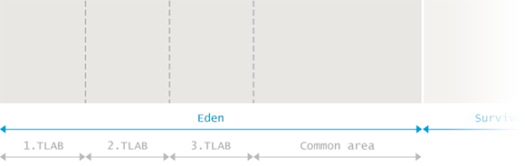

### 存活区(Survivor Spaces)


存活的对象会在两个存活区之间复制多次, 直到某些对象的存活 时间达到一定的阀值。分代理论假设, 存活超过一定 时间的对象很可能会继续存活更长时间。 这类“ 年老” 的对象因此被 (promoted )到老年代。提

的时候， 存活区的对象不再是复制到另一个存活区,而是 迁移到老年代, 并在老年代一直驻留,直到变为不可达对象。 为了确定一个对象是否“足够老”, 可以被提升(Promotion)到老年代，GC模块跟踪记录每个存活

对象存活的次数。每次分代GC完成后,存活对象的年龄就会增长。当年龄超过 (tenuring threshold), 就会被提升到老年代。 具体的提升阈值由JVM动态调整,但也可以用参数‐XX:+MaxTenuringThreshold 来指定上限。

### 永久代(PermGen)

在Java 8 之前有一个特殊的空间,称为“永久代”(Permanent Generation)。这是存储元数据(metadata)的地方,比如class 信息等。此外,这个区域中也保存有其他的数据和信息, 包括 内部化的字符串(internalized strings

等等。实际上这给Java开发者造成了很多麻烦,因为很难去计算这块区域到底需要占用多少内存空间。预测失败导致的结果就是产生 java.lang.OutOfMemoryError: Permgen space 这种形式的错误。

### 元数据区(Metaspace)

既然估算元数据所需空间那么复杂, Java 8直接删除了永久代(PermGen)，改用 Metaspace。元数据区位于本地内存，不再影响到普通的Java对象。

## 垃圾回收算法

### 标记可达对象(Marking Reachable Objects)

.png)

#### 标记-清除算法

标记-清除（Mark-and-Sweep）算法分为“标记（Mark）”和“清除（Sweep）”阶段：首先标记出所有不需要回收的对象，在标记完成后统一回收掉所有没有被标记的对象。

它是最基础的收集算法，后续的算法都是对其不足进行改进得到。这种垃圾收集算法会带来两个明显的问题：

1. **效率问题**：标记和清除两个过程效率都不高。
2. **空间问题**：标记清除后会产生大量不连续的内存碎片。


关于具体是标记可回收对象（不可达对象）还是不可回收对象（可达对象），众说纷纭，两种说法其实都没问题，我个人更倾向于是后者。

如果按照前者的理解，整个标记-清除过程大致是这样的：

1. 当一个对象被创建时，给一个标记位，假设为 0 (false)；
2. 在标记阶段，我们将所有可达对象（或用户可以引用的对象）的标记位设置为 1 (true)；
3. 扫描阶段清除的就是标记位为 0 (false)的对象。

#### 复制算法

为了解决标记-清除算法的效率和内存碎片问题，复制（Copying）收集算法出现了。它可以将内存分为大小相同的两块，每次使用其中的一块。当这一块的内存使用完后，就将还存活的对象复制到另一块去，然后再把使用的空间一次清理掉。这样就使每次的内存回收都是对内存区间的一半进行回收。


虽然改进了标记-清除算法，但依然存在下面这些问题：

- **可用内存变小**：可用内存缩小为原来的一半。
- **不适合老年代**：如果存活对象数量比较大，复制性能会变得很差。

#### 标记-整理算法

标记-整理（Mark-and-Compact）算法是根据老年代的特点提出的一种标记算法，标记过程仍然与“标记-清除”算法一样，但后续步骤不是直接对可回收对象回收，而是让所有存活的对象向一端移动，然后直接清理掉端边界以外的内存。


由于多了整理这一步，因此效率也不高，适合老年代这种垃圾回收频率不是很高的场景。

#### 分代收集算法

当前虚拟机的垃圾收集都采用分代收集算法，这种算法没有什么新的思想，只是根据对象存活周期的不同将内存分为几块。一般将 Java 堆分为新生代和老年代，这样我们就可以根据各个年代的特点选择合适的垃圾收集算法。

比如在新生代中，每次收集都会有大量对象死去，所以可以选择“复制”算法，只需要付出少量对象的复制成本就可以完成每次垃圾收集。而老年代的对象存活几率是比较高的，而且没有额外的空间对它进行分配担保，所以我们必须选择“标记-清除”或“标记-整理”算法进行垃圾收集。

#### Sweep(清除)


#### Compact(整理)


#### Copy(复制)


# GC详解

**如果说收集算法是内存回收的方法论，那么垃圾收集器就是内存回收的具体实现。**

Java虚拟机规范中对垃圾收集器应该如何实现并没有任何规定，因此不同的厂商、版本的虚拟机所提供的垃圾收集器都可能会有很大差别，并且一般都会提供参数供用户根据自己的应用特点和要求组合出各个年所使用的收集器。接下来讨论的收集器基于JDK1.7 Update 14 之后的HotSpot虚拟机，该虚拟机包含的所有收集器如下图所示：

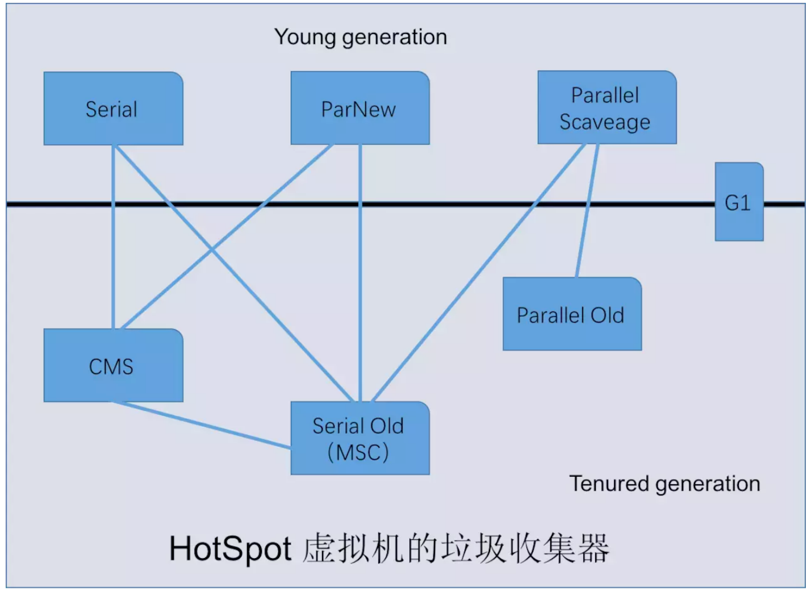


上图展示了7种作用于不同分代的收集器，如果两个收集器之间存在连线，就说明它们可以搭配使用。虚拟机所处的区域，则表示它是属于新生代收集器还是老年代收集器。Hotspot实现了如此多的收集器，正是因为目前并无完美的收集器出现，只是选择对具体应用最适合的收集器。


| 收集器                | 串行并行or并发 | 新生代/老年代 | 算法               | 目标             | 适用场景                                  |
| --------------------- | -------------- | ------------- | ------------------ | ---------------- | ----------------------------------------- |
| **Serial**            | 串行           | 新生代        | 复制               | 算法响应速度优先 | 单CPU环境下的Client模式                   |
| **Serial Old**        | 串行           | 老年代        | 标记-整理          | 响应速度优先     | 单CPU环境下的Client模式、CMS的后备预案    |
| **ParNew**并行        | 并行           | 新生代        | 复制算法           | 响应速度优先     | 多CPU环境时在Server模式下与CMS配合        |
| **Parallel Scavenge** | 并行           | 新生代        | 复制算法           | 吞吐量优先       | 在后台运算而不需要太多交互的任务          |
| **Parallel Old**      | 并行           | 老年代        | 标记-整理          | 吞吐量优先       | 在后台运算而不需要太多交互的任务          |
| **CMS**               | 并发           | 老年代        | 标记-清除          | 响应速度优先     | 集中在互联网站或B/S系统服务端上的Java应用 |
| **G1**                | 并发           | Both          | 标记-整理+复制算法 | 响应速度优先     | 面向服务端应用，将来替换CMS               |

可用的搭配组合，目前最常用的ParNew + CMS以及代表着未来的G1

### Serial收集器

Serial（串行）收集器是最基本、发展历史最悠久的收集器，它是采用复制算法的新生代收集器。它是一个单线程收集器，只会使用一个CPU或一条收集线程去完成垃圾收集工作，更重要的是它在进行垃圾收集时，必须暂停其他所有的工作线程，直至Serial收集器收集结束为止（“Stop The World”）。


### Serial Old收集器

Serial Old 是 Serial收集器的老年代版本，它同样是一个单线程收集器，使用“标记-整理”（Mark-Compact）Lisp2算法。

- 在JDK1.5 以及之前版本（Parallel Old诞生以前）中与Parallel Scavenge收集器搭配使用。
- 作为CMS收集器的后备预案，在并发收集发生Concurrent Mode Failure时使用。

.jpg)

### ParNew 收集器

ParNew收集器就是Serial收集器的多线程版本，除了了Serial收集器外，目前只有它能和CMS收集器（Concurrent Mark Sweep）配合工作。

.jpg)

### Parallel Scavenge/**Parallel Old**收集器

Parallel Scavenge收集器也是一个并行的多线程新生代收集器，它也使用复制算法。

Parallel Old收集器是Parallel Scavenge收集器的老年代版本，使用多线程和“标记-整理”算法。

.jpg)

## **CMS**（Concurrent Mark Sweep）**收集器**

CMS收集器是一种以获取最短回收停顿时间为目标的收集器，它非常符合那些集中在互联网站或者B/S系统的服务端上的Java应用，这些应用都非常重视服务的响应速度。从名字上（“Mark Sweep”）就可以看出它是基于“标记-清除”算法实现的。CMS收集器工作的整个流程分为以下4个步骤：

- **初始标记（CMS initial mark）**
- **并发标记（CMS concurrent mark）**
- **重新标记（CMS remark）**
- **并发清除（CMS concurrent sweep）**

.jpg)

**优点**：**并发收集**、**低停顿**

**缺点：**

- **无法处理浮动垃圾（Floating Garbage）** 由于CMS并发清理阶段用户线程还在运行着，伴随程序运行自然就还会有新的垃圾不断产生

- **标记-清除算法导致的空间碎片** CMS是一款基于“标记-清除”算法实现的收集器，这意味着收集结束时会有大量空间碎片产生。空间碎片过多时，将会给大对象分配带来很大麻烦，往往出现老年代空间剩余，

  无法找到足够大连续空间来分配当前对象。


## CMS GC Log

CMS的设计目标是避免在老年代垃圾收集时出现长时间的卡顿，主要通过两种手段来达成此目标：

1. 不对老年代进行整理, 而是使用空闲列表(free­lists)来管理内存空间的回收。
2. 在 mark ­and ­sweep (标记­清除) 阶段的大部分工作和应用线程一起并发执行。

```java
2015-05-26T16:23:07.219-0200: 64.322: [GC (Allocation Failure) 64.322: [ParNew: 613404K->68068K(613440K), 0.1020465 secs] 10885349K->10880154K(12514816K), 0.1021309 secs] [Times: user=0.78 sys=0.01, real=0.11 secs]
2015-05-26T16:23:07.321-0200: 64.425: [GC (CMS Initial Mark) [1 CMS-initial-mark: 10812086K(11901376K)] 10887844K(12514816K), 0.0001997 secs] [Times: user=0.00 sys=0.00, real=0.00 secs]
2015-05-26T16:23:07.321-0200: 64.425: [CMS-concurrent-mark-start]
2015-05-26T16:23:07.357-0200: 64.460: [CMS-concurrent-mark: 0.035/0.035 secs] [Times: user=0.07 sys=0.00, real=0.03 secs]
2015-05-26T16:23:07.357-0200: 64.460: [CMS-concurrent-preclean-start]
2015-05-26T16:23:07.373-0200: 64.476: [CMS-concurrent-preclean: 0.016/0.016 secs] [Times: user=0.02 sys=0.00, real=0.02 secs]
2015-05-26T16:23:07.373-0200: 64.476: [CMS-concurrent-abortable-preclean-start]
2015-05-26T16:23:08.446-0200: 65.550: [CMS-concurrent-abortable-preclean: 0.167/1.074 secs] [Times: user=0.20 sys=0.00, real=1.07 secs]
2015-05-26T16:23:08.447-0200: 65.550: [GC (CMS Final Remark) [YG occupancy: 387920 K (613440 K)]65.550: [Rescan (parallel) , 0.0085125 secs]65.559: [weak refs processing, 0.0000243 secs]65.559: [class unloading, 0.0013120 secs]65.560: [scrub symbol table, 0.0008345 secs]65.561: [scrub string table, 0.0001759 secs][1 CMS-remark: 10812086K(11901376K)] 11200006K(12514816K), 0.0110730 secs] [Times: user=0.06 sys=0.00, real=0.01 secs]
2015-05-26T16:23:08.458-0200: 65.561: [CMS-concurrent-sweep-start]
2015-05-26T16:23:08.485-0200: 65.588: [CMS-concurrent-sweep: 0.027/0.027 secs] [Times: user=0.03 sys=0.00, real=0.03 secs]
2015-05-26T16:23:08.485-0200: 65.589: [CMS-concurrent-reset-start]
2015-05-26T16:23:08.497-0200: 65.601: [CMS-concurrent-reset: 0.012/0.012 secs] [Times: user=0.01 sys=0.00, real=0.01 secs]
```

### 先看一个Minor GC日志

> 2015-05-26T16:23:07.219-0200: 64.322: [GC (Allocation Failure) 64.322: [ParNew: 613404K->68068K(613440K), 0.1020465 secs] 10885349K->10880154K(12514816K), 0.1021309 secs] [Times: user=0.78 sys=0.01, real=0.11 secs]

**<u>GC</u>** – 用来区分 Minor GC 还是 Full GC 的标志。 GC 表明这是一次 GC(Minor GC)

**<u>Allocation Failure</u>** – 触发垃圾收集的原因。本次GC事件, 是由于年轻代中没有适当的空间存放新的数据结构引起的。

**<u>613404K‐>68068K</u>** –在垃圾收集之前和之后的年轻代使用量。

(**<u>613440K</u>**) – 年轻代的总大小。


### CMS GC

#### 阶段1: Initial Mark(初始标记)

这是第一次STW事件，此阶段的目标是标记老年代中所有存活的对象, 包括 GC ROORS 的直接引用, 以及由年轻代中存活对象所引用的对象。 后者也非常重要, 因为老年代是独立进行回收的。


> 2015-05-26T16:23:07.321-0200: 64.425: [GC (CMS Initial Mark) [1 CMS-initial-mark: 10812086K(11901376K)] 10887844K(12514816K), 0.0001997 secs] [Times: user=0.00 sys=0.00, real=0.00 secs]

**<u>CMS Initial Mark</u>** – 垃圾回收的阶段名称为 “Initial Mark”。 标记所有的 GC Root。

**<u>10812086K</u>** –老年代的当前使用量。

(**<u>11901376K</u>**)  –老年代中可用内存总量。

**<u>10887844K</u>** –当前堆内存的使用量。

(**<u>12514816K</u>**) –可用堆的总大小。

#### 阶段2: Concurrent Mark(并发标记)

在此阶段, 垃圾收集器遍历老年代, 标记所有的存活对象, 从前一阶段 “Initial Mark” 找到的 root 根开始算起。 顾名思义, “并发标记”阶段, 就是与应用程序同时运行,不用暂停的阶段。 并非所有老年代中存

的对象都在此阶段被标记, 因为在标记过程中对象的引用关系还在发生变化。


>  2015-05-26T16:23:07.321-0200: 64.425: [CMS-concurrent-mark-start]
>
> 2015-05-26T16:23:07.357-0200: 64.460: [CMS-concurrent-mark: 0.035/0.035 secs] [Times: user=0.07 sys=0.00, real=0.03 secs]

#### 阶段3: Concurrent Preclean(并发预清理)

此阶段同样是与应用线程并行执行的, 不需要停止应用线程。 因为前一阶段是与程序并发进行的,可能有一些引用已经改变。如果在并发标记过程中发生了引用关系变化，JVM会通过Card Table将发生了改变的对象所在的区域标为“脏”区(这就是所谓的卡片标记，Card Marking)。


在预清理阶段,这些脏对象会被统计出来,从他们可达的对象也被标记下来。此阶段完成后用于标记的 card 也就被清空了。

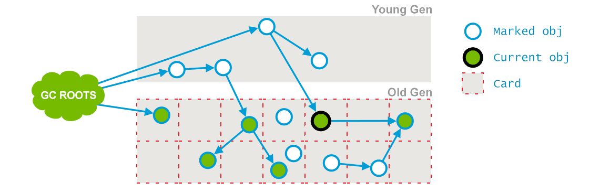

> 2015-05-26T16:23:07.357-0200: 64.460: [CMS-concurrent-preclean-start]
>
> 2015-05-26T16:23:07.373-0200: 64.476: [CMS-concurrent-preclean: 0.016/0.016 secs] [Times: user=0.02 sys=0.00, real=0.02 secs]

#### 阶段4: Concurrent Abortable Preclean(并发可取消的预清理)

此阶段也不停止应用线程. 本阶段尝试在 STW 的 Final Remark 之前尽可能地多做一些工作。**为什么需要这个阶段，存在的价值是什么？**

因为CMS GC的终极目标是降低垃圾回收时的暂停时间，所以在该阶段要尽最大的努力去处理那些在并发阶段被应用线程更新的老年代对象，这样在暂停的重新标记阶段就可以少处理一些，暂停时间也会相应的

低。在该阶段，主要循环的做两件事：

1. 处理 From 和 To 区的对象，标记可达的老年代对象
2. 和上一个阶段一样，扫描处理Dirty Card中的对象

当然了，这个逻辑不会一直循环下去，打断这个循环的条件有三个：

1. 可以设置最多循环的次数 CMSMaxAbortablePrecleanLoops，默认是0，意思没有循环次数的限制。
2. 如果执行这个逻辑的时间达到了阈值CMSMaxAbortablePrecleanTime，默认是5s，会退出循环。
3. 如果新生代Eden区的内存使用率达到了阈值CMSScheduleRemarkEdenPenetration，默认50%，会退出循环。

```c++
// concurrentMarkSweepGeneration.cpp#abortable_preclean()
if (get_eden_used() > CMSScheduleRemarkEdenSizeThreshold) {
  size_t loops = 0, workdone = 0, cumworkdone = 0, waited = 0;
  while (!(should_abort_preclean() ||
           ConcurrentMarkSweepThread::should_terminate())) {
    ...
    loops++;
    // Voluntarily terminate abortable preclean phase if we have
    // been at it for too long.
    if ((CMSMaxAbortablePrecleanLoops != 0) &&
        loops >= CMSMaxAbortablePrecleanLoops) {
      if (PrintGCDetails) {
        gclog_or_tty->print(" CMS: abort preclean due to loops ");
      }
      break;
    }
    if (pa.wallclock_millis() > CMSMaxAbortablePrecleanTime) {
      if (PrintGCDetails) {
        gclog_or_tty->print(" CMS: abort preclean due to time ");
      }
      break;
    }
    ...
}
```


#### 阶段5: Final Remark(最终标记)

这是此次GC事件中第二次(也是最后一次)STW阶段。本阶段的目标是完成老年代中所有存活对象的标记。因为之前的 preclean 阶段是并发的, 有可能无法跟上应用程序的变化速度。所以需要STW暂停来处理复杂情况。

> 2015-05-26T16:23:08.447-0200: 65.550: [GC **(CMS Final Remark)** [YG occupancy: 387920 K (613440 K)]65.550: [Rescan (parallel) , 0.0085125 secs]65.559: [weak refs processing, 0.0000243 secs]65.559: [class unloading, 0.0013120 secs]65.560: [scrub symbol table, 0.0008345 secs]65.561: [scrub string table, 0.0001759 secs][1 CMS-remark: 10812086K(11901376K)] 11200006K(12514816K), 0.0110730 secs] [Times: user=0.06 sys=0.00, real=0.01 secs]

#### 阶段6: Concurrent Sweep(并发清除)

此阶段与应用程序并发执行,不需要STW停顿。目的是删除未使用的对象, 并收回他们占用的空间。


#### 阶段7: Concurrent Reset(并发重置)

此阶段与应用程序并发执行,重置CMS算法相关的内部数据, 为下一次GC循环做准备。


## 两个异常情况

### promotion failed

GC日志中有时候会发现如下类似的带有“promotion failed”的日志，伴随着这类日志一般都会有较长的STW暂停时间，因此也会对线上应用造成较大影响。接下来对“promotion failed”这种GC异常情况进行一下分析，一个常见的promotion failed的gc日志示例：

> 2017-06-17T23:33:20.381+0800: 77708.486: [GC (Allocation Failure) 2017-06-17T23:33:20.382+0800: 77708.487: [ParNew **(promotion failed)**: 3774912K->3679034K(3774912K), 0.2991519 secs]2017-06-17T23:33:20.681+0800: 77708.786: [CMS: 3270027K->3522738K(6291456K), 1.9341892 secs] 6332035K->3522738K(10066368K), [Metaspace: 71553K->71553K(1116160K)], 2.2340311 secs] [Times: user=5.61 sys=0.06, real=2.24 secs]
>
> 2017-06-17T23:33:22.616+0800: 77710.721: Total time for which application threads were stopped: 2.2411722 seconds, Stopping threads took: 0.0002553 seconds

young GC时，对象需要从年轻代提升到年老代，但年老代可用空间由于各种原因存放不下这些对象，这时会抛出promotion failed，然后触发一次Full GC来对年老代和永久代（metaspace）进行回收，所以发生promotion failed时是会暂停业务线程引起停顿的，需要特别留意。主要有以下几种：

- 年轻代中对象到达一定年龄的对象在minor gc时会向年老代提升。
- minor gc时一个survivor空间无法装下所有年轻代存活的对象时，部分未到达年龄的对象也会向年老代提前提升。

#### Young GC的“悲观策略”

有的情况下，如果JVM判断本次young GC需要提升的大小年老代放不下就会放弃本次young GC，而是直接触发一次Full GC。这种情况被称为young GC的”悲观策略“。

CMS预测本次young gc需要promote的大小老年代是否可以放下的条件是：

1. 老年代可用空间大于gc_stats统计的新生代每次平均晋升的大小。
2. 老年代可以容纳目前新生代的所有对象。

采用CMS作为老年代垃圾回收器的时候，当发生promotion failed时会触发一次Full GC，一般是使用带标记整理的Serial Old GC来进行整个堆的垃圾回收。

### concurrent mode failure

有的时候GC日志中还会出现“concurrent mode failure”类似的异常，一般这种异常会伴随着较长的STW时间发生。出现这种情况的前提是使用了CMS作为年老代的垃圾回收器。CMS是一款并发收集器，GC回收

程和业务的用户线程是并发执行的（除了初始标记和重新标记外其他阶段都是可以和业务线程并行的），并发执行意味着在垃圾回收执行的同时还会不停有新的对象promote到年老代。在并发周期执行期间，用

的线程依然在运行，如果这时候如果应用线程向老年代请求分配的空间超过剩余的空间（担保失败），就会触发concurrent mode failure。

>  2018-05-05T15:32:56.818+0800: 101200.681: [GC (Allocation Failure) 2018-05-05T15:32:56.819+0800: 101200.682: [ParNew: 5242832K->5242832K(5242880K), 0.0000388 secs]2018-05 -05T15:32:56.819+0800: 101200.682: [CMS2018-05-05T15:32:56.873+0800: 101200.736: [CMS-concurrent-sweep: 0.212/0.240 secs] [Times: user=0.26 sys=0.00, real=0.23 secs] **(concurrent mode failure)**: 7033555K->7033541K(9437184K), 0.0766034 secs] 12276388K->12276374K(14680064K), [Metaspace: 75013K->75013K(1118208K)], 0.0777029 secs] [Times: user=0.00 sys=0.00, real=0.08 secs]


## G1（Garbage First）收集器

**通过把Java堆分成大小相等的多个独立区域，回收时计算出每个区域回收所获得的空间以及所需时间的经验值，根据记录两个值来判断哪个区域最具有回收价值，所以叫Garbage First（垃圾优先）。**

如果不计算维护Remembered Set的操作，G1收集器的运作大致可划分为以下几个步骤：

- **初始标记（Initial Marking）** 
- **并发标记（Concurrent Marking）**
- **最终标记（Final Marking）** 
- **筛选回收（Live Data Counting and Evacuation）** 

.jpg)

G1 有一些独特的实现，堆不再分成连续的年轻代和老年代空间，而是划分为多个(通常是2048个)可以存放对象的 (smaller heap regions)。每个小堆区都可能是 Eden区, Survivor区或者Old区。在逻辑上, 所有的Eden区和Survivor区合起来就是年轻代, 所有的Old区拼在一起那就是老年代。G1可以指定: 在任意 xx 毫秒的时间范围内, STW停顿不得超过 x 毫秒。 如: 任意1秒暂停时间不得超过5毫秒. Garbage­First GC 会尽力达成这目标(有很大的概率会满足, 但并不完全确定。

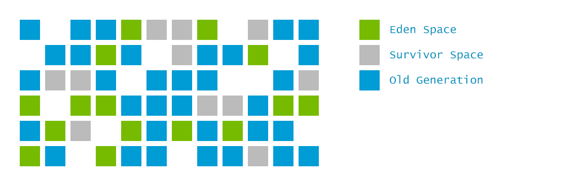

这样的划分使得 GC不必每次都去收集整个堆空间, 而是以增量的方式来处理: 每次只处理一部分小堆区,称为此次的回收集(collection set). 每次暂停都会收集所有年轻代的小堆区, 但可能只包含一部分老年代小堆区:


#### Remembered sets (历史记忆集)

https://stackoverflow.com/questions/19154607/how-actually-card-table-and-writer-barrier-works

用来支持不同的小堆区进行独立回收的。例如,在收集A、B、C区时, 我们必须要 知道是否有从D区或者E区指向其中的引用, 以确定他们的存活性. 但是遍历整个堆需要相当长的时间, 这就违背了增量收集的初衷, 因

必须采取某种优化手段. 其他GC算法有独立的 Card Table 来支持年轻代的垃圾收集一样, 而G1中使用的是 Remembered Sets。 

如下图所示, 每个小堆区都有一个 remembered set, 列出了从外部指向本区的所有引用。这些引用将被视为附加的 GC Roots。注意,在并发标记过程中,老年代中被确定为垃圾的对象会被忽略, 即使有外部引用指向们，因为在这种情况下引用者也是垃圾。

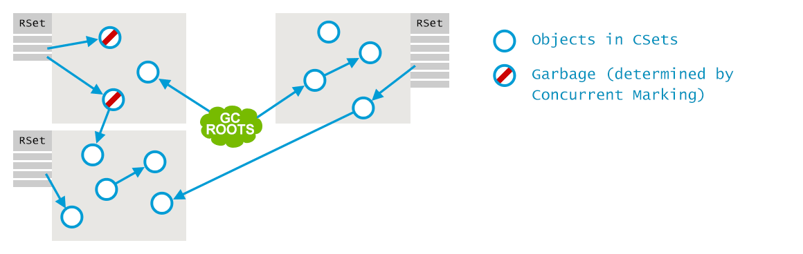

接下来的行为,和其他垃圾收集器一样: 多个GC线程并行地找出哪些是存活对象,确定哪些是垃圾:

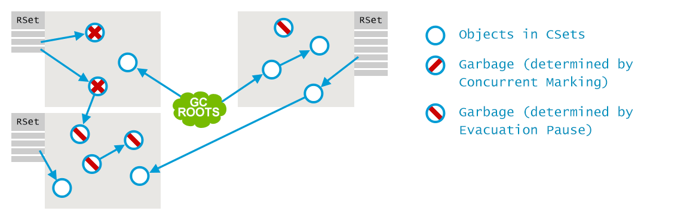

最后, 存活对象被转移到存活区(survivor regions), 在必要时会创建新的小堆区。现在空的小堆区被释放, 可用于存放新的对象了。

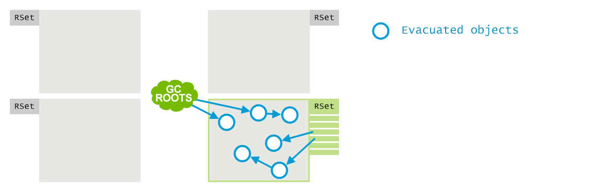


# 实战调优

### 排查基本思路

1. 一般都是Raptor先告警，上去看memory、gc等指标

2. 上jvm.sankuai.com上去打个堆栈，立马保留下现场

   1. 如果不用平台，那就自己去octo或avatar摘掉流量，然后登陆机器切换到sankuai账号，使用jmap堆转储再ftp到本地用mat打开

3. 如果是fullgc过多，一般是内存溢出，也可能是内存泄漏，通过oldgen.aftergc可以判断是不是泄漏

   1. 如果真的发生了内存泄漏，表象就是fullgc频繁且oldgen.after.fullgc比例非常高，这类问题一般比较少见，大多数也是短时间的泄漏，而不是程序真正的bug，

      之前有过数据库慢查询长连接，内存一直回收不掉，不过根本原因也不是真正的泄漏而是长连接

   2. 使用MAT的hitsgram查看对象的Path to GC Roots Reference，可以查看对象是如何被GC Roots引用到的，基本可以定位问题

4. 一般观察期间的PigeonService和URL等指标，如果是qps高导致的趋势会比较match；

   1. 再就是查看期间的长耗时的PigeonService、SQL等，低频但加载大量数据对象的请求

5. 如果memory看起来都是正常的，堆也不大，但持续fullgc，考虑是永久代/元数据区的溢出，一般是类加载，看classloading指标趋势

   1. 再者就是线程的滥用，sof不说很好判断，线程导致的oom

6. 最后都考虑到了但还是不行就看jvm参数吧，参数有没有不合理的（一般不会，都是固定模板，很少改参数），有没有可以调优的