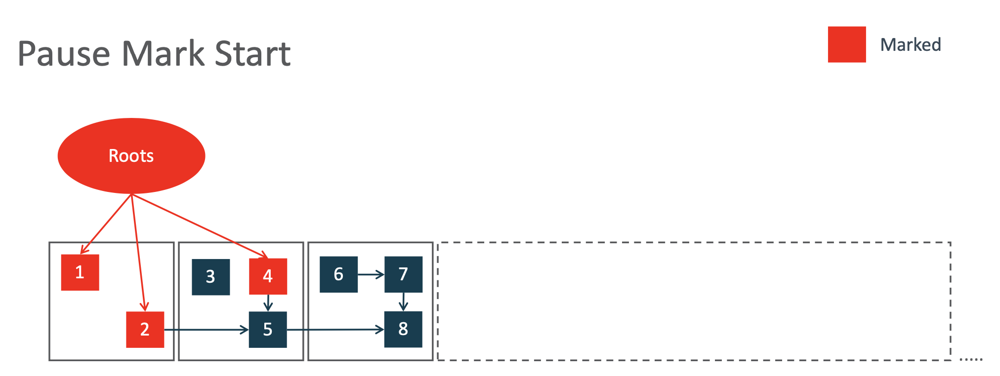
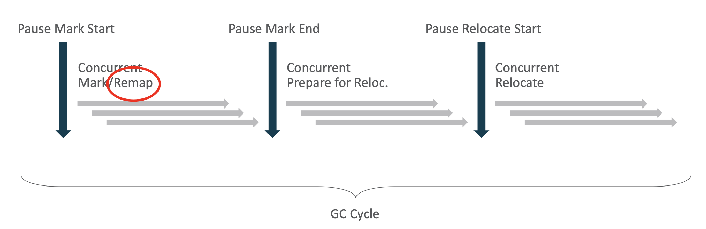

## 前言

ZGC 于 2017 由 Oracle 贡献给社区，在 JDK 11 及以上版本的各种 release 中几乎都包含该 GC。

[Shenandoah](https://wiki.openjdk.org/display/shenandoah/Main) 是 Red Hat 主导的另一个低延迟的 GC，也承诺 pause time 低于 10ms，这两个项目目前处于竞争状态。该 GC 在 Oracle JDK 中不存在，但是在其他几个主流厂商的 JDK 中都包含，具体内容请参考项目主页。

### ZGC 的 "Z" 代表什么？

ZGC 只是一个名字，**Z** 不代表任何含义，不要把它理解为最后一代 GC，随着大家的探索，技术总是存在更优解。

It doesn't stand for anything, ZGC is just a name. It was originally inspired by, or a homage to, ZFS (the filesystem) which in many ways was revolutionary when it first came out. Originally, ZFS was an acronym for "Zettabyte File System", but that meaning was abandoned and it was later said to not stand for anything. It's just a name. See [Jeff Bonwick's Blog](https://web.archive.org/web/20170223222515/https://blogs.oracle.com/bonwick/en_US/entry/you_say_zeta_i_say) for more details.

### ZGC 的读法，"zed gee see" or "zee gee see"?

怎么读都行，无所谓。

There's no preferred pronunciation, both are fine.

## ZGC 简单介绍

ZGC 的口号是：**A Scalable Low-Latency Garbage Collector**

- Scalable：可以管理小堆(8M)和大堆，支持 TB 级别的 heap size。
- Low-Latency：停顿时间永远不会超过 10ms，通常情况，都在 1-2ms 内。

对比前面几代 GC 的设计目标：

- Serial: Low Memory Footpoint
- Parallel: Througput
- CMS: 第一个 Concurrent GC（JDK14以后被删除）
- G1: Throughput/Latency Balance
- ZGC: Low Latency

### ZGC 的设计目标

  

- 达到 TB 级别的堆内存管理；
- 最大 10ms 的停顿时间；
- 易于调优、配置；
- 15% 以内的吞吐量下降（应该是相比于 default GC，也就是 G1)

### ZGC 一览

- Concurrent: 和 java 线程并发执行
- Tracing: ZGC 通过对象引用关系图可以知道哪些是活的对象，哪些是垃圾
- Compacting: 采用压缩算法，减少碎片
- Single generation: 没有使用分代（在 JDK21实现了分代）
- Region-based: 将 heap 分为一个个 region，在 GC 期间，可以只回收垃圾比较多的 region
- Load barriers 和 Colored pointers 用来实现 concurrency

## ZGC 设计

首先，我们先介绍 ZGC 的一个 GC 周期主要做哪些事情，然后介绍染色指针的技术细节。

### GC 周期

ZGC 在一个 GC 周期中，只有 3 次非常短暂的 STW。这是 ZGC 的杀手锏，也就是毫秒或亚毫秒级别的停顿时间。

10ms 的停顿时间是保守策略，通常情况都是在 2ms 以内。这个时间主要跟 GC Roots 的大小有关，说白了就是跟**线程数的大小**直接相关。

简单先分解一下这几个 GC 阶段：

1. 扫描线程堆栈，确定 GC roots，stop the world
2. 耗时的对象标记，concurrent
3. 同步检查点，因为在并发标记阶段，有新的对象产生，stop the world
4. 处理 soft, weak, phantom 引用，确定下一阶段要回收哪些 region 等，concurrent，耗时通常比较短
5. 扫描线程堆栈，找到那些引用了 relocation set 的 roots，因为这些对象即将被移动，stop the world
6. 复制压缩，concurrent，任务重，耗时长

### 染色指针设计

在介绍染色指针之前，我们要先知道一些基本的背景。

现在大部分平台都是 64 位的，意味着理论上最大寻址空间可以达到 2^64，这是一个很大的内存空间。

但是 JDK 通常会做一些优化，就是仅使用 32 位的地址空间，来得到最高的执行效率。但是我们知道 2^32=4G，也就是说 32 位最大寻址空间只能达到 4G，但是我们很多场景下，堆内存都是超过 4G 的，这就会牵扯到另一项技术，指针压缩。

通过 padding，可以让原本只有 4G 的地址空间支持 32G（padding=8位，支持`4G*8`）、64G（padding=16位，支持 `4G*16`）等更大的堆。

> 当然 padding 的副作用就是一些内存被白白浪费掉

使用了染色指针以后，会导致没法使用指针压缩，每个指针必须占用 64 位，意味着 ZGC 会需要更多的内存消耗。

染色指针，用空间换时间的思想。使用了指针中的 4 位来记录 metadata。告诉我们这个引用指向的对象的一些信息，比如这个对象是否被标记了，或者被移动了。

> 为什么不直接使用最高的 4 位来染色，这样设计岂不是最简单？因为 64 位寻址是理论最大值，需要 64 条地址总线来寻址，而目前还远没有达到这个规格的内存，所以硬件厂商实际并没有设置那么多的地址总线，通常有 50 根地址总线就不错了。

ZGC 目前支持 3 种指针 layout，也就是低位部分可以使用 42 位来支持 4TB 的内存（2^42=4TB），也可以使用 43 或 44 位，用于支持 8TB 或 16TB 内存。按照现在的硬件，这么大的内存空间，肯定是足够了，目前比较大的堆通常是几百 G 的规模。

下面，我们用 44 位的 layout 来进行实例介绍。

当我们要 new 一个对象的时候，首先需要申请一块堆内存，假设这块内存的起始地址是 `000...0001111`。

JVM 不是使用 `000...0001111`这个地址，而是申请了下面 3 个地址：

这三个虚拟地址指向同一个物理内存。下面示意了在 4TB layout 的情况下，三个不同视图空间的地址，指向了相同的一个堆内存。

### Load Barrier 介绍

Load Barrier 是由 JIT 在执行过程中插入的一小段代码，当我们需要从堆中加载一个对象引用的时候，此时需要插入 Load Barrier 的代码。如果 JVM 发现这个引用的颜色是 bad 的，会做一些特殊处理，实现自愈。

比如下面这段代码，我们从堆中加载 person.name 这个引用，此时我们需要检查 person.name 这个引用是否是正确的颜色，所以在这段代码的后面，会插入 load barrier：

下面是一段伪代码，我们通过指针中的 metadata 判断此引用是否是 bad 的：

当前 bad_bit_mask 是啥，取决于当前的 GC phase 是啥。如果是 bad，就需要走 slow_path 实现自愈。

> 据统计，Load barriers 的性能消耗大概在 5% 以内。

### GC Cycle 示例

首先，整个堆分为一个个 region，对象引用通常是非常复杂的。

在第一个 STW 期间，完成 GC Roots 的扫描：

然后开始进入并发扫描阶段，最终得到所有对象引用关系图：

然后进入第二次 STW，这里结束并发扫描过程，在示例中，对象图没有发生变化，但是通常来说，由于在并发扫描期间有新的对象产生，所以引用图是会有一些变化的。

然后开始并发压缩的前置准备阶段，这个阶段完成最重要的事情是对象引用的处理，以及确定接下来要做 relocation 的 region 是哪些，比如下图中，第 2 和第 3 个 region 被选中为将被移动的区域，因为它们的垃圾比较多。

然后要为这些区域建立 forwarding table 来记录存活对象被移动到哪里了：

接下来我们开始 relocation，首先是一次短暂的 STW，处理 GC Roots 引用的对象：

GC roots 引用了对象 **1，2，4**，其中 1 和 2 是不需要移动的，4 需要被移动到新的 region 的，最终形成如下：

第 2 个 region 的 forwarding table 记录了 4 的最新地址 4'。

处理完了 GC Roots 以后，开始做并发 relocation，这个过程通常比较长，但是我们的示例中，只有 5 和 8 是需要被移动的。

我们先把 5 移动到新的 region：

记录 forwarding table 5->5'，这样 2 在访问 5 的时候，可以通过这个信息，知道 5‘ 的地址；

此时第 2 个 region 就打扫干净了：

接下来，我们处理第 3 个 region，把 8 移动到新的 region：

此时第 3 个 region 也清空了。自此完成了这个 GC 周期所有的工作。

但是我们可以很明显地看出来一个问题，对象 4 -> 5 的引用需要绕一圈，从 region 2 的 forwarding table 中找 5' 的地址才能访问到 5。

如果有 java 线程在访问这个路径，那么 java 线程会帮助修复这个问题，因为 load barrier 会发现 5 被移动了，会进入到 slow path，找到最新的地址，并且更新这个引用关系实现自愈。如下：

当然，还剩下一个问题，主要就是 5 -> 8 此时也是长路径，2 -> 5 也是，它们还需要通过 forwarding table 的信息帮助寻址。这个问题会在下一个 GC Cycle 的 remap 阶段被修复：

remap 顾名思义，就是重新 map 最新的对象地址。这也是为什么，我们说 ZGC 的回收周期是重叠的：

下一个周期的 remap 结束后，我们才认为是上一个周期的完整结束。

下图示意了第二个 GC Cycle 的 remap 阶段将 2->5 和 5->8 的引用更新为最新状态：

然后就可以把 forwarding table 清掉了，这个过程会在压缩的前置准备阶段完成：

## ZGC 调优

首先，建议使用最新版本的 JDK，因为 ZGC 随着 JDK 一直在优化。目前 (2024.02) JDK 的最新版本是 21，其中长期维护版本是 8、11、17。

开启 ZGC：**-XX:+UseZGC**

JDK 14 以及之前的版本，需要添加 **-XX:+UnlockExperimentalVMOptions**

关于调优，ZGC 几乎没什么可做的，它的设计目标也是让更多的不了解 ZGC 细节的开发，可以非常容易地使用 ZGC。它被设计成非常 adaptive，通常我们只要调整堆内存即可：**-Xmx{size}**，如 -Xmx4G

另外我们可以设置并发期间 GC 的线程数，**-XX:ConcGCThreads={number}**，这个就有点微妙了，设置多了，GC 就会得到更多的 CPU 时间，应用就会被拖慢，设置少了，会导致一定的系统风险，因为所有的并发回收器，都有一个问题，一边 GC 在打扫一边应用在扔垃圾。通常使用 ZGC 的默认策略就行。

其他的几个参数简单介绍一下：

开启简单的 GC 日志 **-Xlog:gc**，打印出来的日志是这样的：

如果使用 **-Xlog:gc***，那么我们可以得到更加详细的日志信息，例如：

这里面记录了非常详细的信息，大家可以看一下，也可以从这里面了解一些 ZGC 的设计。

## ZGC 现状

当前到 JDK 21 已经解决了之前 roadmap 上的一些计划事项。

首先是达到了之前想要承诺的 pause time 低于 1ms，也就是说真正地做到了 pause time 与 GC Roots 大小也无关。

另外就是一直被诟病的没有使用分代算法，也在 JDK 21 实现了。

## Reference

ZGC 主页：https://wiki.openjdk.java.net/display/zgc

ZGC 调优介绍：https://docs.oracle.com/en/java/javase/21/gctuning/introduction-garbage-collection-tuning.html

ZGC 开发负责人 Per Liden 博客: [https://malloc.se](https://malloc.se/) 以及他对 ZGC 的介绍视频：https://www.youtube.com/watch?v=88E86quLmQA

本文大部分内容来自于 Per Liden 的这个 PPT：https://cr.openjdk.org/~pliden/slides/ZGC-PLMeetup-2019.pdf