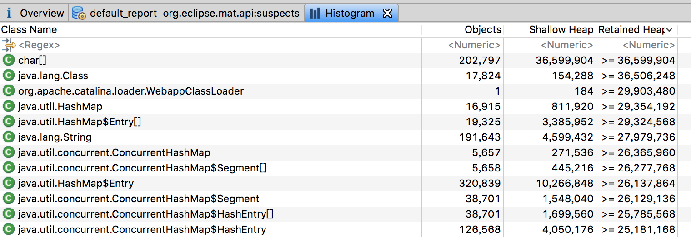
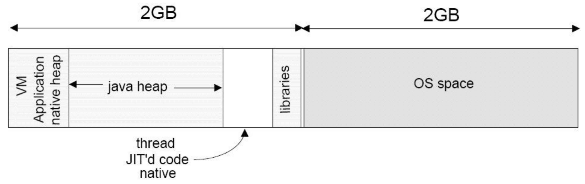
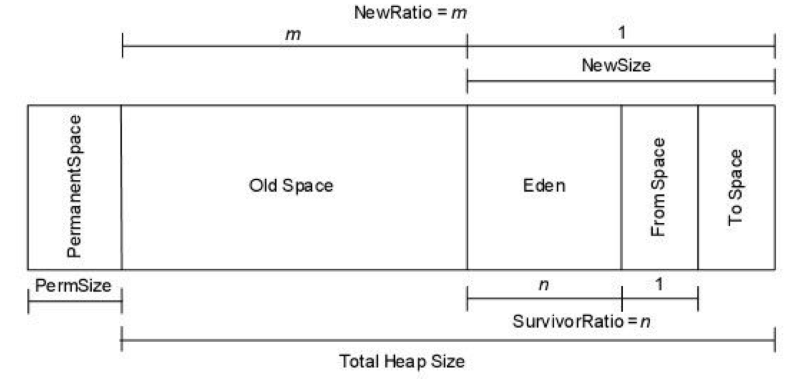
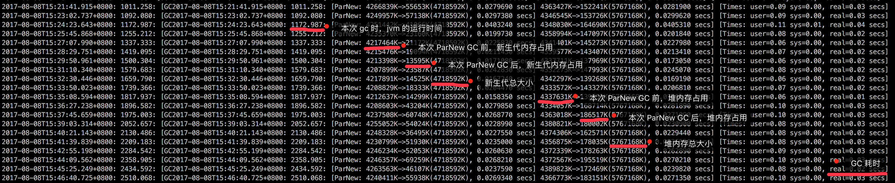
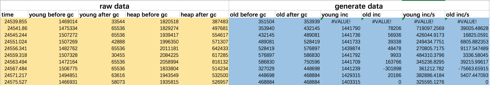
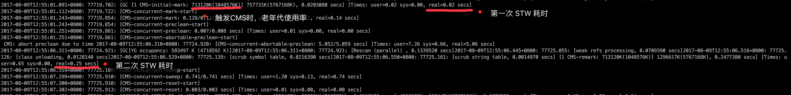
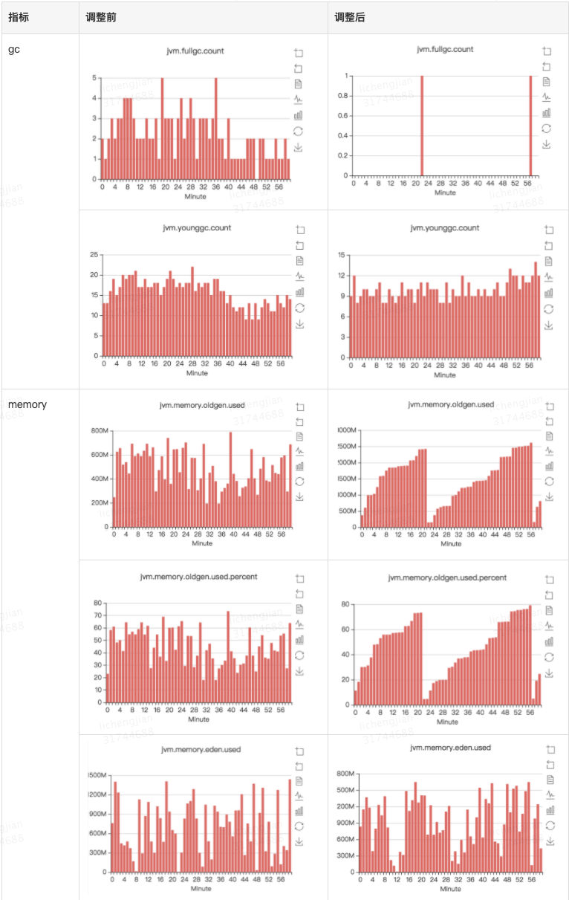

# **1、问题定位**

自从2018-08-20开始，midas-shopdiy-web应用就频繁地发送full gc告警消息


于是上cat上看了下确实是full gc越来越频繁，于是申请了一台机器的jvmdump分析了下，dump文件本身不大，才300+MB，看下对象分布也很均匀，不存在一些大对象，结合cat上oldgen memory分析，发现每次full gc后内存都能清掉，也可以排除内存泄漏的问题。



于是去看了下gc log，登录机器上看一下jvm配置：ps -ef|grep java，找到gc log的位置-Xloggc:/data/applogs/heap_trace.txt，然后分析下gc日志，从gc log分析的结果也基本一致，oldgen内存持续稳步地增长，但每次又都能gc掉。

# **2、优化思路**

### **2.1、Java内存模型**

Java 的内存通常分为堆内存和非堆内存，堆内存由 Java 对象使用，非堆内存 则用于存放 JNI、Java 线程对象等非 Java 数据。示意图如下所示：



堆内存分布如：



JVM Generational Collecting（分代）原理是这样的：把对象分为年轻代（Young）、 老年代（Tenured）、永久代（Perm），对不同生命周期的对象使用不同的算法。

最初为何要把GC堆划分为多个区域，以不同的频率来收集它们？本来就是为了让每次收集的效率都最大，针对不同区域内存的不同特性使用不同的GC算法。

### **2.1.1、Young（年轻代）**

- 年轻代分三个区。一个 Eden 区，两个 Survivor 区（Survivor 0和Survivor 1 ）。大部分对象在 Eden 区 中生成，年轻代的GC算法常见的是标记-复制算法，其中一个Survivor区用于复制Eden区和另一个Survivor区回收后的内存。JVM默认Eden和Survivor是8：1，也就是10%的新生代内存会被浪费，但是基于新生代对象“朝生夕亡”的特点，也算是新生代比较高效的GC算法。

### **2.1.2、Tenured（老年代）**

- 年老代存放从年轻代存活的对象（经历MaxTenuringThreshold次Minor GC的对象）。一般来说年老代存放的都是生命期较长的对象，也可能是为Survivor作分配担保而进入老年代的对象。

### **2.2、常见的web应用对象特征**

1. 一小部分对象几乎一直活着。这些可能是常用数据的本地缓存之类的；
2. 大部分对象创建出来没多久之后就没用了，这些很可能会响应一个web请求时创建出来的临时对象 ；
3. 最后可能还有一些中间的对象，创建出来之后不会马上就死，但也不会一直活着。

如果是这样的模式，那新生代可以设置得非常大，大到每次young GC的时候里面的多数对象(2)最好已经死了。 想像一下，如果young gen太小，每次满了就触发一次young GC，那么young GC就会很频繁，或许很多临时对象（2）正好还在被使用（还没死），young GC效率低次数多，且容易被晋升到老年代。要避免这样的情况，最好是就是把新生代设大一些。

而且我们需要老年代的内存足够容纳（1）和（2）晋升的这部分对象，这样就不容易触发老年代GC。最头疼的是（3）里的内存，这就需要结合各种工具和GC LOG来分析这部分对象的特征有针对性地优化

# **3、GC Log 简析**

JVM基于不同区域对象的生命周期特征使用不同的垃圾回收期，现在就介绍下我们项目中使用比较多的新生代ParNew GC和老年代CMS GC，已经分别介绍其GC Log

### **3.1、ParNew GC Log**



通过 ParNew GC log 计算单位时间内新生代和老年代内存增长速率

1. 用堆大小减新生代大小可得老年代大小
2. 用本次 GC 前新生代（老年代）大小减上次 GC 后新生代（老年代）大小可得本次 GC 距上次 GC 之间新增的内存对象大小
3. 用增长内存大小除以时间，可得单位时间内存增长速率

### **3.1.1、ParNew GC log 比较重要的数据**

1. GC 时间点
2. GC 前新生代
3. GC 后新生代
4. GC 前堆
5. GC 后堆

```cpp
tail -n 200 heap_trace.txt |grep ParNew|sed 's/.*+0800: \\([0-9]*\\.[0-9]*\\).*ParNew: \\([0-9]*\\)K->\\([0-9]*\\).*secs\\] \\([0-9]*\\)K->\\([0-9]*\\).*/\\1 \\2 \\3 \\4 \\5/g'
```



oldgen内存增长迅速且相对均匀，期间有一次CMS GC内存下降也迅速，结合web项目的特点，初步定位为新生代内存不够导致大量对象晋升至老年代

### **3.2、CMS GC Log**



CMS GC时机受两个jvm参数控制：

```bash
-XX:+UseCMSInitiatingOccupancyOnly
XX:CMSInitiatingOccupancyFraction
```

CMSInitiatingOccupancyFraction和UseCMSInitiatingOccupancyOnly组合使用，第一个参数指触发 CMS 的老年代内存使用比率，但如果不配置第二个参数的话，则只会在第一次 CMS GC时生效。

# **4、JVM调优**

联系运维发现是由于2017年7月左右为了调整一个jvm参数而给应用加上了一个puppet的方法，而该puppet方法限制了jvm堆内存的配置，所以新申请的机器无论内存多大都只能按2.5g的堆内存分配。所以重新扩容的机器虽然有8G的物理内存却也只有2.5G的堆。后面联系运维将puppet方法下掉，重新扩容应用，扩容的新机器就走新的jvm配置，同时将老机器下掉，可以看到调整前后的关键jvm参数对比。

### **4.1、JVM参数对比**

[Untitled](https://www.notion.so/ae7161e4ac8e40b48df5500e7e4896c2?pvs=21)

标红的是最关键的参数，-Xmx和-XX:CMSInitiatingOccupancyFraction调大了后，full gc次数明显降低，但新生代内存分配仍有些不足，仍有优化空间，不过目前已达到较为理想的效果，便不继续折腾。

### **4.2、调优效果**

由于falcon告警为sum(所有机器每分钟full gc次数) > 5，而调整前每分钟1~4次full gc很容易触发告警，调整后30min左右一次full gc，且oldgen内存增长也趋于线性，问题解决，可以看下调优前后的关键性能对比：



# **5、参考文档**

http://docs.sankuai.com/doc/arch_dp/cat/server/heartbeat/#14-jvm

[JVM调优一般方法论](https://km.sankuai.com/page/19325879)