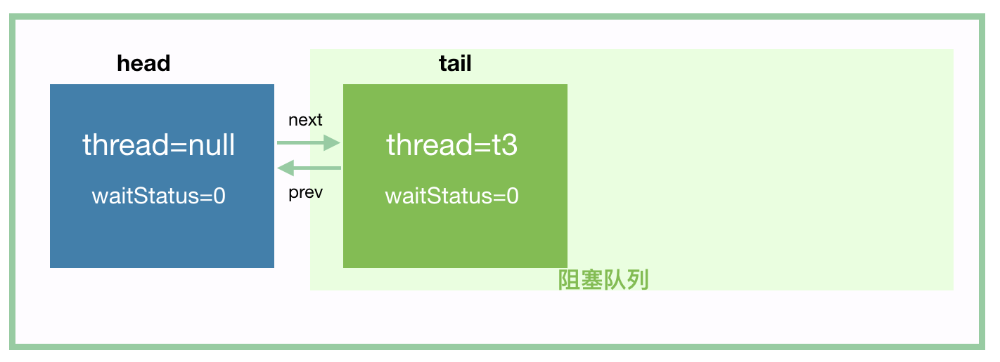
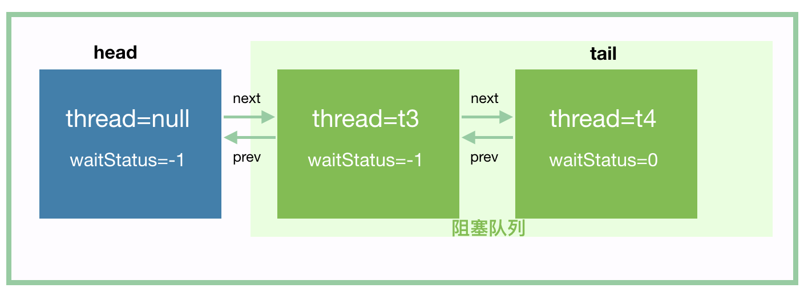
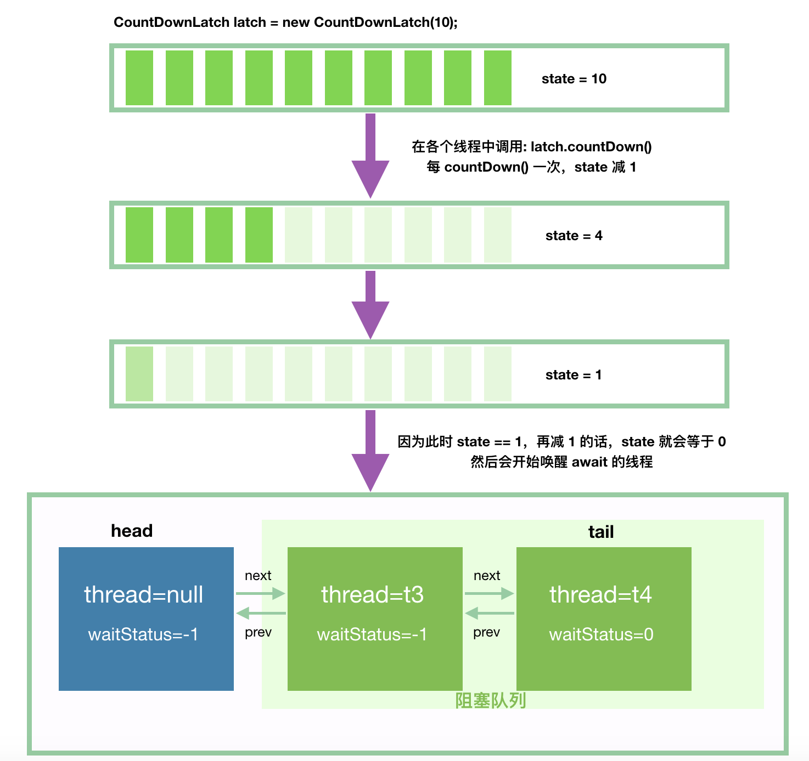

## CountDownLatch

---

CountDownLatch是通过一个计数器来实现的，计数器的初始值为线程的数量。每当一个线程完成了自己的任务后，计数器的值就会减1。当计数器值到达0时，它表示所有的线程已经完成了任务，然后在闭锁上等待的线程就可以恢复执行任务。


```
//Main thread start
//Create CountDownLatch for N threads
//Create and start N threads
//Main thread wait on latch
//N threads completes there tasks are returns
//Main thread resume execution
```

构造器中的计数值（count）实际上就是闭锁需要等待的线程数量。这个值只能被设置一次，而且CountDownLatch没有提供任何机制去重新设置这个计数值。

与CountDownLatch的第一次交互是主线程等待其他线程。主线程必须在启动其他线程后立即调用CountDownLatch.await()方法。这样主线程的操作就会在这个方法上阻塞，直到其他线程完成各自的任务。

其他N 个线程必须引用闭锁对象，因为他们需要通知CountDownLatch对象，他们已经完成了各自的任务。这种通知机制是通过 CountDownLatch.countDown()方法来完成的；每调用一次这个方法，在构造函数中初始化的count值就减1。所以当N个线程都调 用了这个方法，count的值等于0，然后主线程就能通过await()方法，恢复执行自己的任务。

##### 举例作用：

1. 实现最大的并行性：有时我们想同时启动多个线程，实现最大程度的并行性。例如，我们想测试一个单例类。如果我们创建一个初始计数为1的CountDownLatch，并让所有线程都在这个锁上等待，那么我们可以很轻松地完成测试。我们只需调用 一次countDown()方法就可以让所有的等待线程同时恢复执行。
2. 开始执行前等待n个线程完成各自任务：例如应用程序启动类要确保在处理用户请求前，所有N个外部系统已经启动和运行了。
3. 死锁检测：一个非常方便的使用场景是，你可以使用n个线程访问共享资源，在每次测试阶段的线程数目是不同的，并尝试产生死锁。

##### 代码：
you can find the code on the [github][1], get the result as you try:
```java
public class CountDownLatchLearn {
    public static void main(String[] args) {
        CountDownLatch countDownLatch = new CountDownLatch(10);
        for (int i = 0; i < 10; i++) {
            new Thread(new CountDownLatchThread(countDownLatch)).start();
        }

        System.out.println("waiting two threads running off.");
        try {
            countDownLatch.await();
            System.out.println("main thread running.");
            System.out.println("end.");
        } catch (InterruptedException e) {
            e.printStackTrace();
        }


    }
}

// you can create a new class named CountDownLatchThread.
class CountDownLatchThread implements Runnable {

    private CountDownLatch countDownLatch;

    public CountDownLatchThread(CountDownLatch countDownLatch) {
        this.countDownLatch = countDownLatch;
    }

    /**
     * When an object implementing interface <code>Runnable</code> is used
     * to create a thread, starting the thread causes the object's
     * <code>run</code> method to be called in that separately executing
     * thread.
     * <p>
     * The general contract of the method <code>run</code> is that it may
     * take any action whatsoever.
     *
     * @see Thread#run()
     */
    @Override
    public void run( ) {

        System.out.println("线程："+ Thread.currentThread().getName()+" is running.");
        try {
            Thread.sleep(1000);
            System.out.println("线程："+ Thread.currentThread().getName()+" finished.");

        } catch (InterruptedException e) {
            e.printStackTrace();
        }finally {
            countDownLatch.countDown();
        }

    }
}

```

### 使用例子

我们看下 Doug Lea 在 java doc 中给出的例子，这个例子非常实用，我经常会写到这个代码。

假设我们有 N ( N > 0 ) 个任务，那么我们会用 N 来初始化一个 CountDownLatch，然后将这个 latch 的引用传递到各个线程中，在每个线程完成了任务后，调用 latch.countDown() 代表完成了一个任务。

调用 latch.await() 的方法的线程会阻塞，直到所有的任务完成。

```java
class Driver2 { // ...
    void main() throws InterruptedException {
        CountDownLatch doneSignal = new CountDownLatch(N);
        Executor e = Executors.newFixedThreadPool(8);

        // 创建 N 个任务，提交给线程池来执行
        for (int i = 0; i < N; ++i) // create and start threads
            e.execute(new WorkerRunnable(doneSignal, i));

        // 等待所有的任务完成，这个方法才会返回
        doneSignal.await();           // wait for all to finish
    }
}

class WorkerRunnable implements Runnable {
    private final CountDownLatch doneSignal;
    private final int i;

    WorkerRunnable(CountDownLatch doneSignal, int i) {
        this.doneSignal = doneSignal;
        this.i = i;
    }

    public void run() {
        try {
            doWork(i);
            // 这个线程的任务完成了，调用 countDown 方法
            doneSignal.countDown();
        } catch (InterruptedException ex) {
        } // return;
    }

    void doWork() { ...}
}
```

所以说 CountDownLatch 非常实用，我们常常会将一个比较大的任务进行拆分，然后开启多个线程来执行，等所有线程都执行完了以后，再往下执行其他操作。这里例子中，**只有 main 线程调用了 await 方法**。

我们再来看另一个例子，这个例子很典型，用了两个 CountDownLatch：

```java
class Driver { // ...
    void main() throws InterruptedException {
        CountDownLatch startSignal = new CountDownLatch(1);
        CountDownLatch doneSignal = new CountDownLatch(N);
 
        for (int i = 0; i < N; ++i) // create and start threads
            new Thread(new Worker(startSignal, doneSignal)).start();

        // 这边插入一些代码，确保上面的每个线程先启动起来，才执行下面的代码。
        doSomethingElse();            // don't let run yet
        // 因为这里 N == 1，所以，只要调用一次，那么所有的 await 方法都可以通过
        startSignal.countDown();      // let all threads proceed
        doSomethingElse();
        // 等待所有任务结束
        doneSignal.await();           // wait for all to finish
    }
}

class Worker implements Runnable {
    private final CountDownLatch startSignal;
    private final CountDownLatch doneSignal;

    Worker(CountDownLatch startSignal, CountDownLatch doneSignal) {
        this.startSignal = startSignal;
        this.doneSignal = doneSignal;
    }

    public void run() {
        try {
            // 为了让所有线程同时开始任务，我们让所有线程先阻塞在这里
            // 等大家都准备好了，再打开这个门栓
            startSignal.await();
            doWork();
            doneSignal.countDown();
        } catch (InterruptedException ex) {
        } // return;
    }

    void doWork() { ...}
}
```

这个例子中，doneSignal 同第一个例子的使用，我们说说这里的 startSignal。N 个新开启的线程都调用了startSignal.await() 进行阻塞等待，它们阻塞在**栅栏**上，只有当条件满足的时候（startSignal.countDown()），它们才能同时通过这个栅栏，目的是让所有的线程站在一个起跑线上。


如果始终只有一个线程调用 await 方法等待任务完成，那么 CountDownLatch 就会简单很多，所以之后的源码分析读者一定要在脑海中构建出这么一个场景：有 m 个线程是做任务的，有 n 个线程在某个栅栏上等待这 m 个线程做完任务，直到所有 m 个任务完成后，n 个线程同时通过栅栏。

### 源码分析

构造方法，需要传入一个不小于 0 的整数：

```java
public CountDownLatch(int count) {
    if (count < 0) throw new IllegalArgumentException("count < 0");
    this.sync = new Sync(count);
}
// 老套路了，内部封装一个 Sync 类继承自 AQS
private static final class Sync extends AbstractQueuedSynchronizer {
    Sync(int count) {
        // 这样就 state == count 了
        setState(count);
    }
    ...
}
```

> 代码都是套路，先分析套路：AQS 里面的 state 是一个整数值，这边用一个 int count 参数其实初始化就是设置了这个值，所有调用了 await 方法的等待线程会挂起，然后有其他一些线程会做 state = state - 1 操作，当 state 减到 0 的同时，那个将 state 减为 0 的线程会负责唤醒 所有调用了 await 方法的线程。

对于 CountDownLatch，我们仅仅需要关心两个方法，一个是 countDown() 方法，另一个是 await() 方法。

countDown() 方法每次调用都会将 state 减 1，直到 state 的值为 0；而 await 是一个阻塞方法，当 state 减为 0 的时候，await 方法才会返回。await 可以被多个线程调用，读者这个时候脑子里要有个图：所有调用了 await 方法的线程阻塞在 AQS 的阻塞队列中，等待条件满足（state == 0），将线程从队列中一个个唤醒过来。

我们用以下程序来分析源码，t1 和 t2 负责调用 countDown() 方法，t3 和 t4 调用 await 方法阻塞：

```java
public class CountDownLatchDemo {

    public static void main(String[] args) {

        CountDownLatch latch = new CountDownLatch(2);

        Thread t1 = new Thread(new Runnable() {
            @Override
            public void run() {
                try {
                    Thread.sleep(5000);
                } catch (InterruptedException ignore) {
                }
                // 休息 5 秒后(模拟线程工作了 5 秒)，调用 countDown()
                latch.countDown();
            }
        }, "t1");

        Thread t2 = new Thread(new Runnable() {
            @Override
            public void run() {
                try {
                    Thread.sleep(10000);
                } catch (InterruptedException ignore) {
                }
                // 休息 10 秒后(模拟线程工作了 10 秒)，调用 countDown()
                latch.countDown();
            }
        }, "t2");

        t1.start();
        t2.start();

        Thread t3 = new Thread(new Runnable() {
            @Override
            public void run() {
                try {
                    // 阻塞，等待 state 减为 0
                    latch.await();
                    System.out.println("线程 t3 从 await 中返回了");
                } catch (InterruptedException e) {
                    System.out.println("线程 t3 await 被中断");
                    Thread.currentThread().interrupt();
                }
            }
        }, "t3");
        Thread t4 = new Thread(new Runnable() {
            @Override
            public void run() {
                try {
                    // 阻塞，等待 state 减为 0
                    latch.await();
                    System.out.println("线程 t4 从 await 中返回了");
                } catch (InterruptedException e) {
                    System.out.println("线程 t4 await 被中断");
                    Thread.currentThread().interrupt();
                }
            }
        }, "t4");

        t3.start();
        t4.start();
    }
}
```

上述程序，大概在过了 10 秒左右的时候，会输出：

```
线程 t3 从 await 中返回了
线程 t4 从 await 中返回了
```

> 这两条输出，顺序不是绝对的
>
> 后面的分析，我们假设 t3 先进入阻塞队列

接下来，我们按照流程一步一步走：先 await 等待，然后被唤醒，await 方法返回。

首先，我们来看 await() 方法，它代表线程阻塞，等待 state 的值减为 0。

```
public void await() throws InterruptedException {
    sync.acquireSharedInterruptibly(1);
}
public final void acquireSharedInterruptibly(int arg)
        throws InterruptedException {
    // 这也是老套路了，我在第二篇的中断那一节说过了
    if (Thread.interrupted())
        throw new InterruptedException();
    
    // t3 和 t4 调用 await 的时候，state 都大于 0（state 此时为 2）。
    // 也就是说，这个 if 返回 true，然后往里看
    if (tryAcquireShared(arg) < 0)
        doAcquireSharedInterruptibly(arg);
}
// 只有当 state == 0 的时候，这个方法才会返回 1
protected int tryAcquireShared(int acquires) {
    return (getState() == 0) ? 1 : -1;
}
```

从方法名我们就可以看出，这个方法是获取共享锁，并且此方法是可中断的（中断的时候抛出 InterruptedException 退出这个方法）。

```
private void doAcquireSharedInterruptibly(int arg)
    throws InterruptedException {
    // 1. 入队
    final Node node = addWaiter(Node.SHARED);
    boolean failed = true;
    try {
        for (;;) {
            final Node p = node.predecessor();
            if (p == head) {
                // 同上，只要 state 不等于 0，那么这个方法返回 -1
                int r = tryAcquireShared(arg);
                if (r >= 0) {
                    setHeadAndPropagate(node, r);
                    p.next = null; // help GC
                    failed = false;
                    return;
                }
            }
            // 2
            if (shouldParkAfterFailedAcquire(p, node) &&
                parkAndCheckInterrupt())
                throw new InterruptedException();
        }
    } finally {
        if (failed)
            cancelAcquire(node);
    }
}
```

我们来仔细分析这个方法，线程 t3 经过第 1 步 addWaiter 入队以后，我们应该可以得到这个：



由于 tryAcquireShared 这个方法会返回 -1，所以 if (r >= 0) 这个分支不会进去。到 shouldParkAfterFailedAcquire 的时候，t3 将 head 的 waitStatus 值设置为 -1，如下：


然后进入到 parkAndCheckInterrupt 的时候，t3 挂起。

我们再分析 t4 入队，t4 会将前驱节点 t3 所在节点的 waitStatus 设置为 -1，t4 入队后，应该是这样的：



然后，t4 也挂起。接下来，t3 和 t4 就等待唤醒了。

接下来，我们来看唤醒的流程。为了让下面的示意图更丰富些，我们假设用 10 初始化 CountDownLatch。



当然，我们的例子中，其实没有 10 个线程，只有 2 个线程 t1 和 t2，只是为了让图好看些罢了。

我们再一步步看具体的流程。首先，我们看 countDown() 方法:

```
public void countDown() {
    sync.releaseShared(1);
}
public final boolean releaseShared(int arg) {
    // 只有当 state 减为 0 的时候，tryReleaseShared 才返回 true
    // 否则只是简单的 state = state - 1 那么 countDown() 方法就结束了
    //    将 state 减到 0 的那个操作才是最复杂的，继续往下吧
    if (tryReleaseShared(arg)) {
        // 唤醒 await 的线程
        doReleaseShared();
        return true;
    }
    return false;
}
// 这个方法很简单，用自旋的方法实现 state 减 1
protected boolean tryReleaseShared(int releases) {
    for (;;) {
        int c = getState();
        if (c == 0)
            return false;
        int nextc = c-1;
        if (compareAndSetState(c, nextc))
            return nextc == 0;
    }
}
```

countDown 方法就是每次调用都将 state 值减 1，如果 state 减到 0 了，那么就调用下面的方法进行唤醒阻塞队列中的线程：

```
// 调用这个方法的时候，state == 0
// 这个方法先不要看所有的代码，按照思路往下到我写注释的地方，我们先跑通一个流程，其他的之后还会仔细分析
private void doReleaseShared() {
    for (;;) {
        Node h = head;
        if (h != null && h != tail) {
            int ws = h.waitStatus;
            // t3 入队的时候，已经将头节点的 waitStatus 设置为 Node.SIGNAL（-1） 了
            if (ws == Node.SIGNAL) {
                // 将 head 的 waitStatue 设置为 0
                if (!compareAndSetWaitStatus(h, Node.SIGNAL, 0))
                    continue;            // loop to recheck cases
                // 就是这里，唤醒 head 的后继节点，也就是阻塞队列中的第一个节点
                // 在这里，也就是唤醒 t3
                unparkSuccessor(h);
            }
            else if (ws == 0 &&
                     !compareAndSetWaitStatus(h, 0, Node.PROPAGATE)) // todo
                continue;                // loop on failed CAS
        }
        if (h == head)                   // loop if head changed
            break;
    }
}
```

一旦 t3 被唤醒后，我们继续回到 await 的这段代码，parkAndCheckInterrupt 返回，我们先不考虑中断的情况：

```
private void doAcquireSharedInterruptibly(int arg)
    throws InterruptedException {
    final Node node = addWaiter(Node.SHARED);
    boolean failed = true;
    try {
        for (;;) {
            final Node p = node.predecessor();
            if (p == head) {
                int r = tryAcquireShared(arg);
                if (r >= 0) {
                    setHeadAndPropagate(node, r); // 2. 这里是下一步
                    p.next = null; // help GC
                    failed = false;
                    return;
                }
            }
            if (shouldParkAfterFailedAcquire(p, node) &&
                // 1. 唤醒后这个方法返回
                parkAndCheckInterrupt())
                throw new InterruptedException();
        }
    } finally {
        if (failed)
            cancelAcquire(node);
    }
}
```

接下来，t3 会进到 setHeadAndPropagate(node, r) 这个方法，先把 head 给占了，然后唤醒队列中其他的线程：

```
private void setHeadAndPropagate(Node node, int propagate) {
    Node h = head; // Record old head for check below
    setHead(node);
  
    // 下面说的是，唤醒当前 node 之后的节点，即 t3 已经醒了，马上唤醒 t4
    // 类似的，如果 t4 后面还有 t5，那么 t4 醒了以后，马上将 t5 给唤醒了
    if (propagate > 0 || h == null || h.waitStatus < 0 ||
        (h = head) == null || h.waitStatus < 0) {
        Node s = node.next;
        if (s == null || s.isShared())
            // 又是这个方法，只是现在的 head 已经不是原来的空节点了，是 t3 的节点了
            doReleaseShared();
    }
}
```

又回到这个方法了，那么接下来，我们好好分析 doReleaseShared 这个方法，我们根据流程，头节点 head 此时是 t3 节点了：

```
// 调用这个方法的时候，state == 0
private void doReleaseShared() {
    for (;;) {
        Node h = head;
        // 1. h == null: 说明阻塞队列为空
        // 2. h == tail: 说明头结点可能是刚刚初始化的头节点，
        //   或者是普通线程节点，但是此节点既然是头节点了，那么代表已经被唤醒了，阻塞队列没有其他节点了
        // 所以这两种情况不需要进行唤醒后继节点
        if (h != null && h != tail) {
            int ws = h.waitStatus;
            // t4 将头节点(此时是 t3)的 waitStatus 设置为 Node.SIGNAL（-1） 了
            if (ws == Node.SIGNAL) {
                // 这里 CAS 失败的场景请看下面的解读
                if (!compareAndSetWaitStatus(h, Node.SIGNAL, 0))
                    continue;            // loop to recheck cases
                // 就是这里，唤醒 head 的后继节点，也就是阻塞队列中的第一个节点
                // 在这里，也就是唤醒 t4
                unparkSuccessor(h);
            }
            else if (ws == 0 &&
                     // 这个 CAS 失败的场景是：执行到这里的时候，刚好有一个节点入队，入队会将这个 ws 设置为 -1
                     !compareAndSetWaitStatus(h, 0, Node.PROPAGATE))
                continue;                // loop on failed CAS
        }
        // 如果到这里的时候，前面唤醒的线程已经占领了 head，那么再循环
        // 否则，就是 head 没变，那么退出循环，
        // 退出循环是不是意味着阻塞队列中的其他节点就不唤醒了？当然不是，唤醒的线程之后还是会调用这个方法的
        if (h == head)                   // loop if head changed
            break;
    }
}
```

我们分析下最后一个 if 语句，然后才能解释第一个 CAS 为什么可能会失败：

1. h == head：说明头节点还没有被刚刚用 unparkSuccessor 唤醒的线程（这里可以理解为 t4）占有，此时 break 退出循环。
2. h != head：头节点被刚刚唤醒的线程（这里可以理解为 t4）占有，那么这里重新进入下一轮循环，唤醒下一个节点（这里是 t4 ）。我们知道，等到 t4 被唤醒后，其实是会主动唤醒 t5、t6、t7...，那为什么这里要进行下一个循环来唤醒 t5 呢？我觉得是出于吞吐量的考虑。

满足上面的 2 的场景，那么我们就能知道为什么上面的 CAS 操作 compareAndSetWaitStatus(h, Node.SIGNAL, 0) 会失败了？

因为当前进行 for 循环的线程到这里的时候，可能刚刚唤醒的线程 t4 也刚刚好到这里了，那么就有可能 CAS 失败了。

for 循环第一轮的时候会唤醒 t4，t4 醒后会将自己设置为头节点，如果在 t4 设置头节点后，for 循环才跑到 if (h == head)，那么此时会返回 false，for 循环会进入下一轮。t4 唤醒后也会进入到这个方法里面，那么 for 循环第二轮和 t4 就有可能在这个 CAS 相遇，那么就只会有一个成功了。

[1]:https://github.com/twentyworld/learn/tree/master/JDKlearn/src/main/java/com/concurrent
