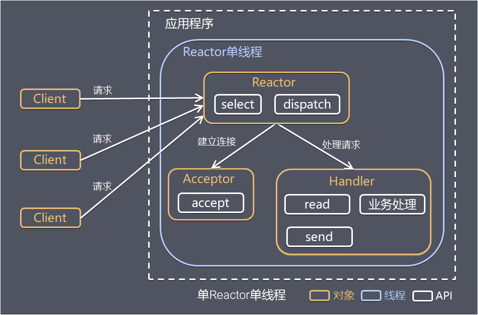
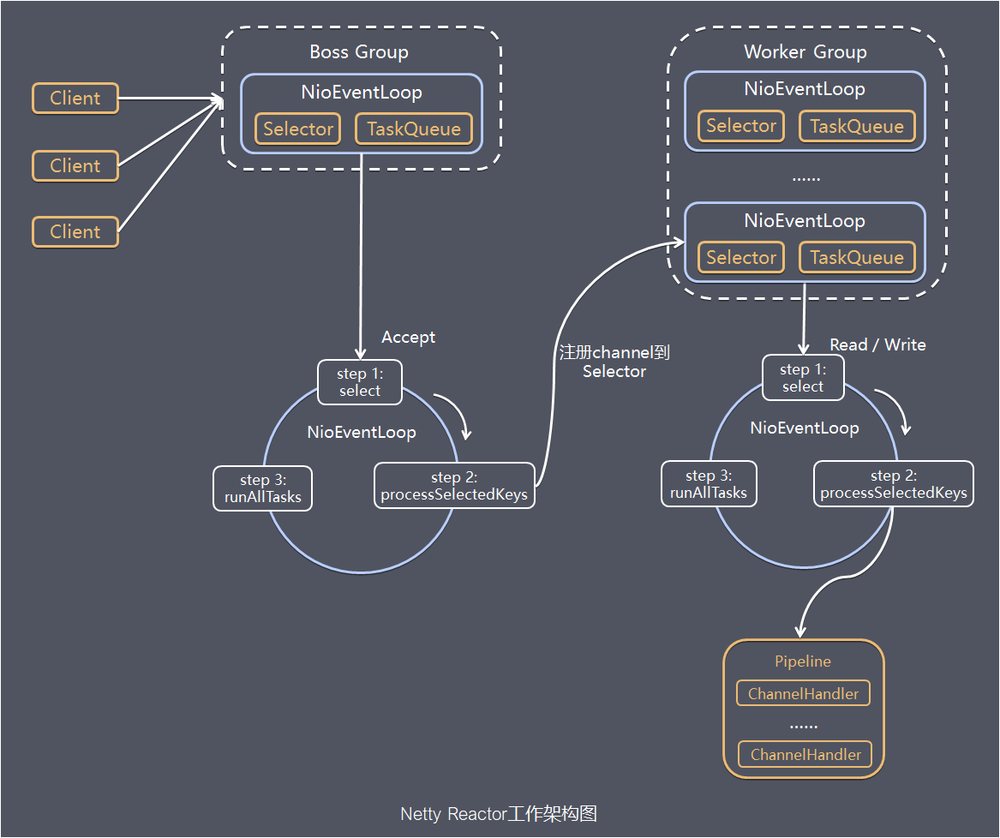
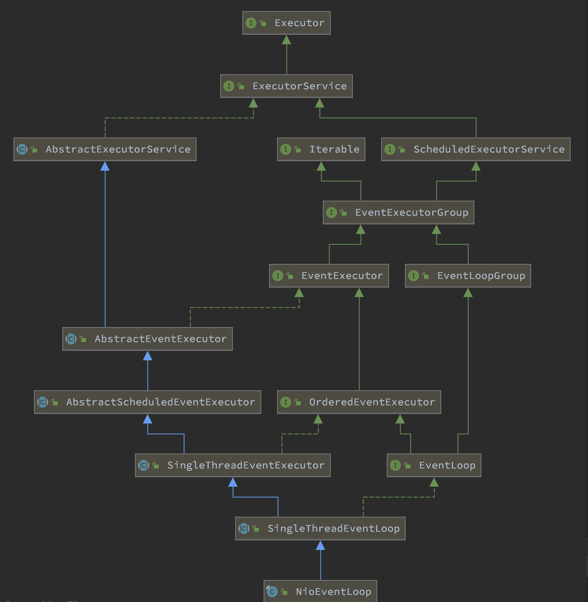
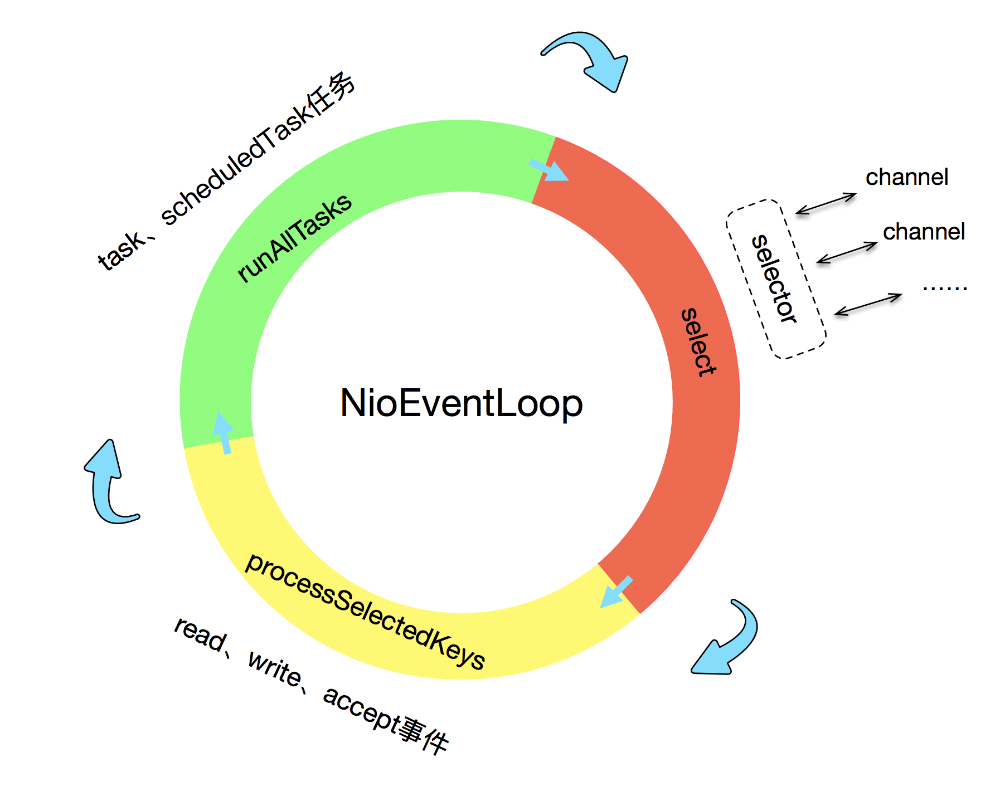
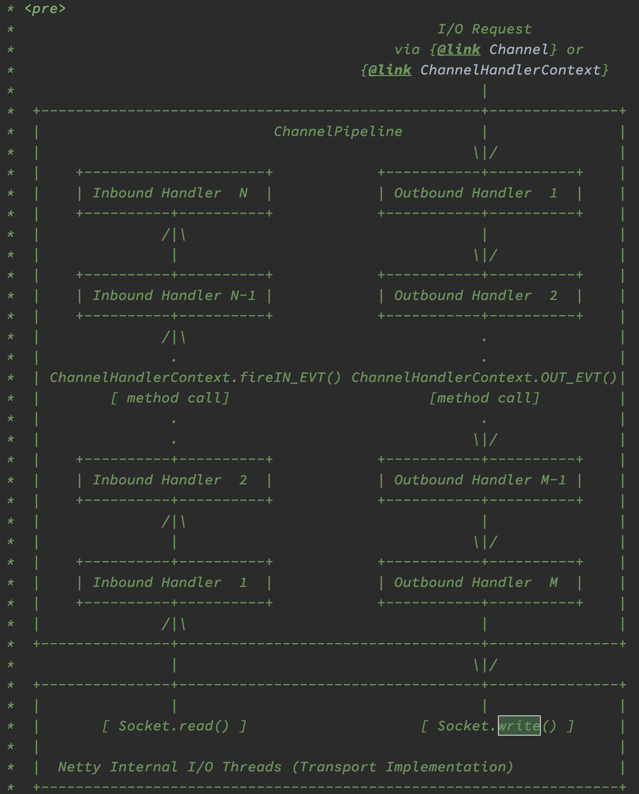

# 第一部分：Netty是什么

## 一、Netty

netty官网给了两个Netty定义：

> 1. Netty is *an **asynchronous event-driven network application framework*** for rapid development of maintainable high performance protocol servers & clients.
> 2. Netty is a **NIO client server framework** which enables quick and easy development of **network applications** such as protocol servers and clients. It greatly simplifies and streamlines network programming such as TCP and UDP socket server.

一言以蔽之：Netty是一个异步事件驱动网络抽象框架，遵守Apache License协议，Jboss开源的产品。

> 关于大家经常使用的Spring，其实也有一些比较有意思的地方
>
> Spring WebFlux是伴随Spring framework 5提出的网络框架解决方案，基于Netty实现。目前与Spring Web MVC并行。WebFlux作为VMware(Spring母公司)下一代主推的一种开源产品，目前是重点产品。而Spring Web MVC这种基于Servlet在多个benchmark场景测试中，均不如Spring WebFlux。

## 二、Java IO 模型

单独成篇，写在这里，[IO模型和零拷贝](https://km.sankuai.com/page/699430653)。Netty的代码里大量的使用JAVA NIO，<u>这里需要解释一下为什么不使用AIO的部分。其实支持过，后来发现：性能并不是多优越，基本持平，而且维护代价很高，就又从master分支剥离了</u>。IO模型是一个理论，理论下面一般会有很多的协议来具体设计一些理论，让理论适用于工业场景；协议下面会有实现，可以用来实践协议是否合理。

经常能听到大家讨论Netty和Tomcat之间的异同点，其实他俩最重要的差别是：Netty是一个网络通信框架，工作在传输层(TCP/UDP), 而Tomcat是工作在应用层的，是为了Http协议服务的，遵守Servlet协议。Tomcat NIO也使用了Netty。这俩根本不是一个场景的框架，没有可比性。

## 三、Netty在同类中的特征

在本人从事开发的这几年内，主要参与或者使用了这些个NIO框架：**Mina、Netty、Grizzly。**可以给一个定论，<u>他们都是基于JAVA NIO封装，性能本身之间差距不会超过10%。这时候一些平时看起来不重要的东西，现在成了最重要的了：</u>

这几个产品大同小异, 但是有一点：Netty要比Mina要好很多，主要有这么写个原因：

1. <u>这俩的设计者是同一个人，就是因为Mina有缺陷，而且很多时候，不好回头，所以转而搞了个Netty。</u>
2. **Netty的文档丰富度，社区活跃度，要远大于Mina。**Mina靠apache生存，而Netty靠jboss，和jboss的结合度非常高，Netty有对google protocal buf的支持，有更完整的ioc容器支持(spring,guice,jbossmc和osgi)
3. Netty快被所有项目引用了，Mina目前在github上的引用是2个，Netty是4万
4. 从我开发的角度，Netty写起来比较顺滑，Mina写的比较中规中矩, 就是各种按照共识来(又臭又长)。

当然，如果大家有机会，可以看一下一个产品叫vert.x，在我的视角里，是解决了Netty很多的问题：代码还是有点多、只能应用于网络、如果想直接提供Rest接口(这个很重要，一个比Netty还重要的协议)，比较复杂、<u>**偏底层，对新手不友好**</u>。而且代码写起来比较舒服。当然Grizzly其实有一个最重要的问题：他就是一个NIO的简单封装，这可基本上断了所有人使用Grizzly的路，大家其实还有点嫌弃Netty不太简单，Grizzly却又更繁琐的书写方式。

## 四、Netty的优缺点

最开始使用Netty的时候，可能感觉还不如NIO来的简单快速，而且本身代码封装的也差不多，但是实际上JAVA NIO的问题很多：

- <u>**JDK NIO的BUG，例如臭名昭著的epoll bug，它会导致Selector空轮询，最终导致CPU 100%。**</u> 官方声称在JDK 1.6版本的update18修复了该问题，但是直到JDK 1.7版本该问题仍旧存在，只不过该BUG发生概率降低了一些而已，它并没有得到根本性解决。
- <u>**可靠性能力补齐，工作量和难度都非常大。例如客户端面临断连重连、网络闪断、半包读写、失败缓存、网络拥塞和异常码流的处理等问题，NIO编程的特点是功能开发相对容易，但是可靠性能力补齐的工作量和难度都非常大。**</u>

Netty的优点：

1. <u>**API使用简单，开发门槛低；**</u>
2. <u>**功能强大，预置了多种编解码功能，支持多种主流协议；**</u>
3. <u>**定制能力强，可以通过ChannelHandler对通信框架进行灵活地扩展；**</u>
4. <u>**性能高，通过与其他业界主流的NIO框架对比，Netty的综合性能最优；**</u>
5. <u>**成熟、稳定，Netty修复了已经发现的所有JDK NIO BUG，业务开发人员不需要再为NIO的BUG而烦恼；**</u>
6. <u>**社区活跃，版本迭代周期短，发现的BUG可以被及时修复，同时，更多的新功能会加入；经历了大规模的商业应用考验，质量得到验证。Netty在互联网、大数据、网络游戏、企业应用、电信软件等众多行业已经得到了成功商用，证明它已经完全能够满足不同行业的商业应用了。**</u>

Netty有一个最重要的缺点：大版本不兼容。3.x/4.x同时维护，5.x放弃维护。主要原因是Netty抛弃了Jboss单独发展了.

缺点：缺点也很过分，一是对开发者在一定程度上不友好，二是内部实现，太过复杂，死抠性能，导致代码内部逻辑膨胀。（个人认为）

# 第二部分：Netty的使用

通过代码展示. 后续有时间把代码扔到code上吧。

- 实现channelActive()，channelRead()，channelInActive()，channelReadComplete(),exceptionCought()方法等对输入流进行处理；
- 实现write()，close()等方法对输出流进行处理


# 第三部分：Netty架构

## 一、Reactor线程模型

> 内容大体摘抄自：https://juejin.cn/post/6844903702550020109

Reactor是反应堆的意思，Reactor模型，是指通过一个或多个输入同时传递给服务处理器的服务请求的**事件驱动处理模式**。 服务端程序处理传入多路请求，并将它们同步分派给请求对应的处理线程，Reactor模式也叫Dispatcher模式，即I/O多了复用统一监听事件，收到事件后分发(Dispatch给某进程)。

Reactor 的线程模型有三种:

- 单线程模型
- 多线程模型
- 主从多线程模型

### 1.1、单线程模型

首先来看一下 **单线程模型**:



所谓单线程, 即 acceptor 处理和 handler 处理都在一个线程中处理. 这个模型的坏处显而易见: 当其中某个 handler 阻塞时, 会导致其他所有的 client 的 handler 都得不到执行, 并且更严重的是, handler 的阻塞也会导致整个服务不能接收新的 client 请求(因为 acceptor 也被阻塞了). 因为有这么多的缺陷, 因此单线程Reactor 模型用的比较少.

### 1.2、多线程模型

那么什么是 **多线程模型** 呢? Reactor 的多线程模型与单线程模型的区别就是 acceptor 是一个单独的线程处理, 并且有一组特定的 NIO 线程来负责各个客户端连接的 IO 操作. Reactor 多线程模型如下:


Reactor 多线程模型 有如下特点:

- **有专门一个线程, 即 Acceptor 线程用于监听客户端的TCP连接请求.**
- 客户端连接的 IO 操作都是由一个特定的 NIO 线程池负责. **每个客户端连接都与一个特定的 NIO 线程绑定, 因此在这个客户端连接中的所有 IO 操作都是在同一个线程中完成的.**
- 客户端连接有很多, 但是 NIO 线程数是比较少的, 因此一个 NIO 线程可以同时绑定到多个客户端连接中.

### 1.3、主从多线程模型

接下来我们再来看一下 Reactor 的主从多线程模型. 一般情况下, Reactor 的多线程模式已经可以很好的工作了, 但是我们考虑一下如下情况: 如果我们的服务器需要同时处理大量的客户端连接请求或我们需要在客户端连接时, 进行一些权限的检查, 那么单线程的 Acceptor 很有可能就处理不过来, 造成了大量的客户端不能连接到服务器. Reactor 的主从多线程模型就是在这样的情况下提出来的, 它的特点是: 服务器端接收客户端的连接请求不再是一个线程, 而是由一个独立的线程池组成. 它的线程模型如下:


可以看到, Reactor 的主从多线程模型和 Reactor 多线程模型很类似, 只不过 Reactor 的主从多线程模型的 acceptor 使用了线程池来处理大量的客户端请求.

## 一、Netty架构模型

Netty是一个异步网络通信框架，异步主要体现在对java Future的拓展，基于Future/Listener的回调机制完成了对事件的监听【我可以举一个简单的例子：CompletableFuture】。通过Channel完成了对数据的传输，使用NioEventLoop工作线程 通过执行ChanelHandler完成了对ChannelPipeline上的数据处理, 。当然这几句话，肯定是不太够的，下面会对这些概念逐一的说明，也算是对Netty的一些实现特性有一个大致的介绍。

当然，从底层的角度，如果大家有兴趣去看代码的话，会看到Netty内部使用了大量的内部类，其中一个比较注明的内部接口 Unsafe接口，是Netty内部持有NIO对象、执行NIO代码的地方。通过名字Unsafe也知道，不安全的代码，跟JDK的Unsafe差不多，不是说这份代码不安全，就是不推荐其他人用。这里面的代码可以找到正常写NIO代码的蛛丝马迹。

> 说说我对Netty架构的理解，或者这么说，使用NIO框架的底层逻辑，封装NIO代码，屏蔽复杂繁琐的逻辑(尤其是复杂反人类的内存API的逻辑)，然后加上对大量的从使用者的角度，抽象通用，合理制定接口。如果说每一份代码都有编码人员对世界的抽象理解，Netty的理解是：你就写你的handler就行，剩下的你不用懂。



大家可以主要看这个图，就是只有右下角的ChannelHandler需要用户实现，其他基本上都是实现好的。如果不需要特殊定制，基本不需要单独书写。

> 当然，以Netty的编码风格，基本能看到的地方都留有后路，方便开发者拓展。同时给了多种默认实现。

## 二、NioEventLoop 线程模型

NioEventLoop 类继承关系



这个话题轻易提不起来，突然介绍EventLoop的话，内容太多，我一点一点介绍吧，介绍到哪里，就从哪里开始。 从我接触Netty开始，NioEventLoop就算是Netty最重要的概念，也是所有设计中最重的。可以从上面的类继承关系中看到，NioEventLoop继承了大量的接口，实现了大量的数据能力，可以给出一些简单的定义：

1. NioEventLoop是一个单线程的线程池。 从这个类继承了SingleThreadEventLoop又实现了ExecutorService就可以知道。
2. EventLoop是可以提交任务的。因为他是一个线程池，所以完全可以提交任务。确切的来说，EventLoop是维护了一个任务队列的
3. NioEventLoop内部持有的线程，声明周期内。 在ThreadPoolExecutor里面，持有线程的方式是通过Worker这种内部类的方式持有一个Thread，在NioEventLoop里面，直接持有了一个Thread。
4. NioEventLoop内部持有一个Selector, 因为NioEventLoop需要执行IO任务

### 2.1 NioEventLoop 执行任务

NioEventLoop run()方法代码:

```java
public final class NioEventLoop extends SingleThreadEventLoop {

    @Override
    protected void run() {
        int selectCnt = 0;
        for (;;) {
            try {
                int strategy;
                try {
                    strategy = selectStrategy.calculateStrategy(selectNowSupplier, hasTasks());
                    switch (strategy) {
                    case SelectStrategy.CONTINUE:
                        continue;

                    case SelectStrategy.BUSY_WAIT:
                        // fall-through to SELECT since the busy-wait is not supported with NIO

                    case SelectStrategy.SELECT:
                        long curDeadlineNanos = nextScheduledTaskDeadlineNanos();
                        if (curDeadlineNanos == -1L) {
                            curDeadlineNanos = NONE; // nothing on the calendar
                        }
                        nextWakeupNanos.set(curDeadlineNanos);
                        try {
                            if (!hasTasks()) {
                                strategy = select(curDeadlineNanos);
                            }
                        } finally {
                            // This update is just to help block unnecessary selector wakeups
                            // so use of lazySet is ok (no race condition)
                            nextWakeupNanos.lazySet(AWAKE);
                        }
                        // fall through
                    default:
                    }
                } catch (IOException e) {
                    // If we receive an IOException here its because the Selector is messed up. Let's rebuild
                    // the selector and retry. https://github.com/netty/netty/issues/8566
                    rebuildSelector0();
                    selectCnt = 0;
                    handleLoopException(e);
                    continue;
                }

                selectCnt++;
                cancelledKeys = 0;
                needsToSelectAgain = false;
                final int ioRatio = this.ioRatio;
                boolean ranTasks;
                if (ioRatio == 100) {
                    try {
                        if (strategy > 0) {
                            processSelectedKeys();
                        }
                    } finally {
                        // Ensure we always run tasks.
                        ranTasks = runAllTasks();
                    }
                } else if (strategy > 0) {
                    final long ioStartTime = System.nanoTime();
                    try {
                        processSelectedKeys();
                    } finally {
                        // Ensure we always run tasks.
                        final long ioTime = System.nanoTime() - ioStartTime;
                        ranTasks = runAllTasks(ioTime * (100 - ioRatio) / ioRatio);
                    }
                } else {
                    ranTasks = runAllTasks(0); // This will run the minimum number of tasks
                }

                if (ranTasks || strategy > 0) {
                    if (selectCnt > MIN_PREMATURE_SELECTOR_RETURNS && logger.isDebugEnabled()) {
                        logger.debug("Selector.select() returned prematurely {} times in a row for Selector {}.",
                                selectCnt - 1, selector);
                    }
                    selectCnt = 0;
                } else if (unexpectedSelectorWakeup(selectCnt)) { // Unexpected wakeup (unusual case)
                    selectCnt = 0;
                }
            } catch (CancelledKeyException e) {
                // Harmless exception - log anyway
                if (logger.isDebugEnabled()) {
                    logger.debug(CancelledKeyException.class.getSimpleName() + " raised by a Selector {} - JDK bug?",
                            selector, e);
                }
            } catch (Throwable t) {
                handleLoopException(t);
            }
            // Always handle shutdown even if the loop processing threw an exception.
            try {
                if (isShuttingDown()) {
                    closeAll();
                    if (confirmShutdown()) {
                        return;
                    }
                }
            } catch (Throwable t) {
                handleLoopException(t);
            }
        }
    }
}
```

run方法中的代码看起来复杂，代码虽然多，但是都是各种if/else，他们可能没有接入sonar，能提交也是不容易。但其实主要的就只有三步：

1. 执行IO操作, 这里面又分为两块儿：
   - 轮询selector：轮询注册到reactor线程对应的selector上的所有channel的IO事件
   - 处理IO时间：轮询到了时间，就去处理事件
2. 执行任务操作：处理任务队列的task

关于这些逻辑的细节,可以看

#### 2.1.1  轮询IO事件

```java
select(wakenUp.getAndSet(false));
if (wakenUp.get()) {
      selector.wakeup();
}

```

在进行select操作过程中，wakenUp 表示是否应该唤醒正在阻塞的select操作，可以看到netty在进行一次新的loop之前，都会将wakeUp 被设置成false，标志新的一轮loop的开始。

其实轮询IO事件在jdk中很简单，就是selector.selectNow()或selector.select(timeout)方法，但是netty处理得非常麻烦，主要是因为netty需要处理任务队列中的任务和“丧心病狂”的性能优化。

因此，结束当前loop的轮询的条件有：

- 定时任务截止事时间快到了，中断本次轮询
- 轮询过程中发现有任务加入，中断本次轮询
- timeout时间内select到IO事件（select会阻塞，但是外部线程在execute任务会调用wakeup方法唤醒selector的阻塞）
- 用户主动唤醒（直接调用wakeup方法）

此外，netty还解决了jdk的一个nio bug，该bug会导致Selector一直空轮询，最终导致cpu 100%，nio server不可用。netty使用rebuildSelector来fix空轮询bug。

netty 会在每次进行 selector.select(timeoutMillis) 之前记录一下开始时间currentTimeNanos，在select之后记录一下结束时间，判断select操作是否至少持续了timeoutMillis秒，如果持续的时间大于等于timeoutMillis，说明就是一次有效的轮询，重置selectCnt标志，否则，表明该阻塞方法并没有阻塞这么长时间，可能触发了jdk的空轮询bug，当空轮询的次数超过一个阀值的时候，默认是512，就开始重建selector。

#### 2.1.2 处理轮询到的IO事件

处理IO事件的主体代码如下：

```java
private void processSelectedKeysOptimized(SelectionKey[] selectedKeys) {
        for (int i = 0;; i ++) {
          // 取出轮询到的SelectionKey
            final SelectionKey k = selectedKeys[i];
            if (k == null) {
                break;
            }
            // null out entry in the array to allow to have it GC'ed once the Channel close
          // 可以立即gc回收对象
            selectedKeys[i] = null;


```

从上面方法的名字就可以看出来，这是一个被优化过的处理轮询的方法。this.selectedKeys是一个set，与selector绑定，selector在调用select()族方法的时候，如果有IO事件发生，就会往this.selectedKeys中塞相应的selectionKey。而selectedKeys内部维护了两个SelectionKey[]数组，重写了set的add方法，在add的时候实际上是往数组里面塞SelectionKey。而在遍历时只用遍历数组而不是遍历set，可见netty对性能的极致优化。

处理轮询到的IO事件也主要是三步：

1. 取出轮询到的SelectionKey
2. 取出与客户端交互的channel对象，处理channel
3. 判断是否需要再次轮询

第一步上面已经说了，this.selectedKeys与selector绑定，如果有IO事件发生，就会往this.selectedKeys中塞相应的selectionKey。然后遍历selectedKeys，取出轮询到的SelectionKey。

第二步取出selectionKey中的attachment对象，这里attachment一般是AbstractNioChannel对象，AbstractNioChannel对象代表每一条连接，拿到这个对象就可以获取每条连接的所有信息了。然后来看看selectionKey是在哪里设置这个对象。

在AbstractNioChannel中有一个doRegister方法，这里将jdk的channel注册到selector上去，并且将自身设置到attachment上。这样再jdk轮询出某条SelectableChannel有IO事件发生时，就可以直接取出AbstractNioChannel了。

```java
selectionKey = javaChannel().register(eventLoop().selector, 0, this);
```

第二步最重要的就是处理channel，也就是真正到了处理轮询到的IO事件了，主体代码如下：

```java
private void processSelectedKey(SelectionKey k, AbstractNioChannel ch) {
        final AbstractNioChannel.NioUnsafe unsafe = ch.unsafe();
        // 先去掉一些无关代码
  // ……

        try {
            int readyOps = k.readyOps();
            // 首先完成连接操作
            if ((readyOps & SelectionKey.OP_CONNECT) != 0) {
                int ops = k.interestOps();
                ops &= ~SelectionKey.OP_CONNECT;
                k.interestOps(ops);

                unsafe.finishConnect();
            }

            // 处理write事件的flush
            if ((readyOps & SelectionKey.OP_WRITE) != 0) {
                // Call forceFlush which will also take care of clear the OP_WRITE once there is nothing left to write
                ch.unsafe().forceFlush();
            }

            // 处理读和新连接的accept事件
            if ((readyOps & (SelectionKey.OP_READ | SelectionKey.OP_ACCEPT)) != 0 || readyOps == 0) {
                unsafe.read();
                if (!ch.isOpen()) {
                    // Connection already closed - no need to handle write.
                    return;
                }
            }
        } catch (CancelledKeyException ignored) {
            unsafe.close(unsafe.voidPromise());
        }
    }
```

从这里也可以看出来netty所有关于IO操作都是通过内部的Unsafe来实现的。

processSelectedKey是一个很复杂的过程，简单讲解一下，也分成三步

1. 首先在读写之前都要先调用finishConnect，来确保与客户端连接上。这个过程最终会传递给channelHandler的channelActive方法，因此可以通过channelActive来验证有多少客户端在线。
2. 接下来是处理write事件的flush，注意，我们的write不是在这里做的，真正的write一般是封装成task去执行的。
3. 第三步是处理读和新连接的accept事件。netty将新连接的accept也当做一次read。对于boss NioEventLoop来说，新连接的accept事件在read的时候通过他的pipeline将连接扔给一个worker NioEventLoop处理；而worker NioEventLoop处理读事件，是通过他的pipeline将读取到的字节流传递给每个channelHandler来处理。

接下来是判断是否再次轮询，是根据needsToSelectAgain来判断的，当needsToSelectAgain为true，表示需要再次轮询。那么最重要的是看needsToSelectAgain什么时候为true。在NioEventLoop类中，只有在cancel方法中将needsToSelectAgain设置为true。而在AbstractNioChannel的doDeregister调用了eventLoop的cancel方法。

```java
protected void doDeregister() throws Exception {
        eventLoop().cancel(selectionKey());
    }
```

这个方法是在channel从selector上移除的时候，调用cancel函数将key取消，并且当被去掉的key到达 CLEANUP_INTERVAL = 256 的时候，设置needsToSelectAgain为true。

即netty每隔256次channel断线，重新清理一下selectionKey，保证现存的SelectionKey及时有效。

总结一下处理轮询到的IO事件的过程就是：

netty使用数组替换掉jdk原生的HashSet来保证IO事件的高效处理，每个SelectionKey上绑定了netty类AbstractChannel对象作为attachment，在处理每个SelectionKey的时候，就可以找到AbstractChannel，然后通过pipeline的方式将处理串行到ChannelHandler，回调到用户channelHandler的方法。

#### 2.1.3 处理任务队列的task

NioEventLoop三步曲的最后一步了，处理任务队列的task，按照惯例，先把代码的主流程贴出来。

```java
protected boolean runAllTasks(long timeoutNanos) {
        fetchFromScheduledTaskQueue();
        Runnable task = pollTask();
        if (task == null) {
            afterRunningAllTasks();
            return false;
        }

        final long deadline = ScheduledFutureTask.nanoTime() + timeoutNanos;
        long runTasks = 0;
        long lastExecutionTime;
        for (;;) {
            safeExecute(task);

            runTasks ++;

            if ((runTasks & 0x3F) == 0) {
                lastExecutionTime = ScheduledFutureTask.nanoTime();
                if (lastExecutionTime >= deadline) {
                    break;
                }
            }

            task = pollTask();
            if (task == null) {
                lastExecutionTime = ScheduledFutureTask.nanoTime();
                break;
            }
        }

        afterRunningAllTasks();
        this.lastExecutionTime = lastExecutionTime;
        return true;
    }
```

这个方法就是尽量在timeoutNanos时间内，将所有的任务都取出来run一遍。

而这个时间是怎么定的呢？

```java
final long ioStartTime = System.nanoTime();
try {
  processSelectedKeys();
} finally {
  // Ensure we always run tasks.
  final long ioTime = System.nanoTime() - ioStartTime;
  runAllTasks(ioTime * (100 - ioRatio) / ioRatio);
}

```

processSelectedKeys是处理轮询到的IO事件，ioRatio设定的是50，那么ioTime * (100 - ioRatio) / ioRatio = ioTime * (100 - 50) / 50 = ioTime，netty是希望最多在等同于处理IO事件的时间去处理task任务，严格控制了内部队列的执行时间。

NioEventLoop执行task的过程，同样可以分成几步：

1. 从scheduledTaskQueue转移定时任务到taskQueue
2. 计算本次任务循环的截止时间
3. 执行任务
4. 执行完任务后的工作

从上面可以看到NioEventLoop中至少有两种队列，taskQueue和scheduledTaskQueue。

EventLoop是一个Executor，因此用户可以向EventLoop提交task。在execute方法中，当EventLoop处于循环中或启动了循环后都会通过addTask(task)向EventLoop提交任务。EventLoop内部使用一个taskQueue将task保存起来。

```java
protected Queue<Runnable> newTaskQueue(int maxPendingTasks) {
   return new LinkedBlockingQueue<Runnable>(maxPendingTasks);
}
```

taskQueue是一个有界阻塞队列，在reactor线程内部用单线程来串行执行，最终真正执行的地方就是这个runAllTasks方法。

taskQueue最大的应用场景就是用户在channelHandler中获取到channel，然后通过channel.write()数据，这里会把write操作封装成一个WriteTask，然后通过eventLoop.execute(task)执行，实际上是给EventLoop提交了一个task，加入到taskQueue队列中

```java
private void write(Object msg, boolean flush, ChannelPromise promise) {
    AbstractChannelHandlerContext next = findContextOutbound();
    final Object m = pipeline.touch(msg, next);
  // executor就是eventLoop
    EventExecutor executor = next.executor();
    if (executor.inEventLoop()) {
      if (flush) {
        next.invokeWriteAndFlush(m, promise);
      } else {
        next.invokeWrite(m, promise);
      }
    } else {
      // inEventLoop返回false，执行这里的操作
      AbstractWriteTask task;
      if (flush) {
        task = WriteAndFlushTask.newInstance(next, m, promise);
      }  else {
        task = WriteTask.newInstance(next, m, promise);
      }
      // 将write操作封装成WriteTask，然后像eventLoop提交task
      safeExecute(executor, task, promise, m);
    }
}

```

同时，EventLoop也是一个ScheduledExecutorService，这意味着用户可以通过ScheduledFuture<?> schedule(Runnable command, long delay, TimeUnit unit)方法向EventLoop提交定时任务。因此，EventLoop内部也维护了一个优先级队列scheduledTaskQueue来保存提交的定时任务。

知道了NioEventLoop内部的任务队列后，再来看执行task的过程。

第一步，是将到期的定时任务转移到taskQueue中，只有在当前定时任务的截止时间已经到了，才会取出来。

然后第二步计算本次任务循环的截止时间deadline。

第三步真正去执行任务，先执行task的run方法，然后将runTasks加一，每执行完64（0x3F）个任务，就判断当前时间是否超过deadline，如果超过，就break，如果没有超过，就继续执行。

需要注意的是，这里如果任务没执行完break掉了，afterRunningAllTasks后，NioEventLoop就会重新开始一轮新的循环，没完成的任务仍然在taskQueue中，等待runAllTasks的时候去执行。

最后一步是afterRunningAllTasks，执行完所有任务后需要进行收尾，相当于一个钩子方法，可以作统计用。
最后总结一下处理任务队列的task的过程就是：

eventLoop是一个Executor，可以调用execute给eventLoop提交任务，NioEventLoop会在runAllTasks执行。NioEventLoop内部分为普通任务和定时任务，在执行过程中，NioEventLoop会把过期的定时任务从scheduledTaskQueue转移到taskQueue中，然后执行taskQueue中的任务，同时每隔64个任务检查是否该退出任务循环。



### 2.2 给EventLoop添加任务

目前EventLoop是可以添加两种任务的：普通任务和定时任务。看继承关系也能看的出来，首先NioEventLoop实现了接口ExecutorService，而且继承了抽象类AbstractScheduledEventExecutor.

### 2.3 EventLoop和Channel之间的关联

Netty 中, 每个 Channel 都有且仅有一个 EventLoop 与之关联. 但是请注意，这句话反过来不成立，因为一个eventLoop可能会被分配给超过一个Channel。具体的实现逻辑在：**io.netty.channel.AbstractChannel.AbstractUnsafe#register**

```
public abstract class AbstractChannel extends DefaultAttributeMap implements Channel {
    private volatile EventLoop eventLoop;
    protected abstract class AbstractUnsafe implements Unsafe {
      /* ...无关代码... */
            AbstractChannel.this.eventLoop = eventLoop;

            if (eventLoop.inEventLoop()) {
                register0(promise);
            } else {
                try {
                    eventLoop.execute(new Runnable() {
                        @Override
                        public void run() {
                            register0(promise);
                        }
                    });
                } catch (Throwable t) {
                    logger.warn(
                            "Force-closing a channel whose registration task was not accepted by an event loop: {}",
                            AbstractChannel.this, t);
                    closeForcibly();
                    closeFuture.setClosed();
                    safeSetFailure(promise, t);
                }
            }
        }
    }
}

```

**在channel初始化的过程中，会把Channel和EventLoop绑定关联关系。同时，会执行NioEventLoop.run()方法。**

*关于channel的一些点，下面会单独介绍。*

## 三、Future/Promise 回调机制

Java的Future大家应该比较清楚，以一种非阻塞的方式，快速返回。**但是这种方式一个比较大的缺点是用户必须通过.get()方式来获取结果。无法精确了解完成时间。**Netty扩展了Java的Future，**最主要的改进就是增加了监听器Listener接口，通过监听器可以让异步执行更加有效率，不需要通过get来等待异步执行结束，而是通过监听器回调来精确地控制异步执行结束的时间点。**ChannelFuture接口扩展了Netty的Future接口，表示一种没有返回值的异步调用，同时关联了Channel，跟一个Channel绑定。

一个简单的例子是：

```java
private void doConnect(final Logger logger,final String host, final int port) {
    ChannelFuture future = bootstrap.connect(new InetSocketAddress(host, port));

    future.addListener(new ChannelFutureListener() {
        public void operationComplete(ChannelFuture f) throws Exception {
            if (!f.isSuccess()) {
                logger.info("Started Tcp Client Failed");
                f.channel().eventLoop().schedule( new Runnable() {
                    @Override
                    public void run() {
                        doSomeThing();
                    }
                }, 200, TimeUnit.MILLISECONDS);
            }
        }
    });
}
```

Promise接口也扩展了Future接口，它表示一种可写的Future，可以通过setSeccess()方法或者setFailure()方法设置执行的状态；Promise通过状态的设置和检测器Listener的添加可以实现回调机制。

## 四、Channel、ChannelPipeline、ChannelHandler 

Channel相比较EventLoop更加一言难尽。主要内容太多了，这里主要介绍一下大家可能会遇到的三个关键接口：Channel、ChannelPipeline、ChannelHandler.

.png)

**先给大家一个简要的印象，上面是我通过debug截了一个线程方法栈，可以看到方法是从NioEventLoop的run方法开始执行的，**

**链路大致是：NioEventLoop.run -> NioEventLoop.processSelectedkeys -> ChannelPipeline -> HeadChannelHandler -> ChannelHandler.** 

### 4.1 Channel

Netty的抽象了一个顶层接口Channel相比原来NIO提供的Channel有更多的功能，当然也是相对复杂的。网络的IO操作包含read,write,flush,close,disconnect,connect,bind,config,localAddress,remoteAdress等IO的功能操作**。**但是如果只是看Channel的接口的话，是看不到这些接口的，**这些接口实际上是封装在Channel接口下一个Unsafe接口下的，这个接口提供了：操作NIO接口的能力，**通过通过内部类引用的方式，使得其可以轻松的访问所在外部类的字段，又可以提供能力给外面。接口暴露在io.netty.channel.Channel#unsafe。虽然不推荐使用，但是对一些特殊场景，还是很好用的。

#### 4.1.1 Channel的特征

如果大家有兴趣，可以看一下Channel都提供了哪些方法，我这里说一些比较重要的方法：

1. EventLoop eventLoop(); 每一个Channel 都会绑定一个eventLoop，而且会唯一绑定一个EventLoop, 甚至没有给哪怕Netty自己提供一个修改eventLoop的接口。
2. ChannelPipeline pipeline(); 每一个Channel都会绑定而且唯一绑定一个pipeline，这个是在初始化Channel的时候，写在构造函数里的。
3. Unsafe unsafe(); 提供一个在外部调用一些Channel上IO操作的方法。

#### 4.1.2 channel的生命周期

Netty 有一个简单但强大的状态模型，并完美映射到ChannelInboundHandler 的各个方法。下面是Channel 生命周期中四个不同的状态：

- **channelUnregistered()** :Channel已创建，还未注册到一个EventLoop上
- **channelRegistered()**: Channel已经注册到一个EventLoop上
- **channelActive()** :Channel是活跃状态（连接到某个远端），可以收发数据
- **channelInactive()**: Channel未连接到远端

一个Channel 正常的生命周期如下图所示。随着状态发生变化相应的事件产生。这些事件被转发到ChannelPipeline中的ChannelHandler 来触发相应的操作。

### 4.2 ChannelPipeline

上面我们说了ChannelPipeline是怎么创建的，他是在Channel创建的时候，构建方法new出来的。ChannelPipeline实际上是一个ChannelHandler的容器，它负责ChannelHandler的管理和事件的拦截与调度。

Netty将Channel的数据管道抽象为ChannelPipeline，消息在ChannelPipeline中间流动和传递。ChannelPipeline持有一个包含一系列事件拦截器ChannelHandler的链表，由ChannelHandler负责对事件进行拦截和处理。用户可以方便的增加和删除ChannelHandler来达到定制业务逻辑的目的，而不需要对现有的ChannelHandler进行修改。但是ChannelPipeline本身是不需要大家关注太多的，只需要了解这个概念：channelPipeline管理ChannelHandler。


通过上图我们可以看到, 一个 Channel 包含了一个 ChannelPipeline, 而 ChannelPipeline 中又维护了一个由 ChannelHandlerContext 组成的双向链表. 这个链表的头是 HeadContext, 链表的尾是 TailContext, 并且每个 ChannelHandlerContext 中又关联着一个 ChannelHandler.**最开始的时候 ChannelPipeline 中含有两个 ChannelHandlerContext(同时也是 ChannelHandler), 但是这个 Pipeline并不能实现什么特殊的功能, 因为我们还没有给它添加自定义的 ChannelHandler.**

> 通常来说, 我们在初始化Bootstrap的地方, 会添加我们自定义的 ChannelHandler,当然，并不是一定要这么做，Netty在设计ChannelHandler的时候，是考虑到可插拔、配置的，这个是可以在运行时，实时变动，甚至ChannelHandler本身也是可以控制下游的ChannelHandler的。

具体实现过程比较繁琐，链路比较长，但是代码上比较清楚，这里简要说明一下：

1. 我们在bootStrap里面，使用了ChannelInitializer这个帮助类，在流程上他会被添加到Head 和tail中间。
2. 在ChannelPipeline真正执行的地方，会fire下面的ChannelHandler，这里面会把handler真正的梳理一下，顺出来一个链路。

#### 4.2.1 ChannelPipeline事件流



这个是观望上对事件流的一种方式，当然，在Netty 5.x，重新设计了事件流，但是显然并不是很好，现在也放弃维护了。可以说这个模式，深入人心。

 inbound 事件和 outbound 事件的流向是不一样的, inbound 事件的流行是从下至上, 而 outbound 刚好相反, 是从上到下. 并且 inbound 的传递方式是通过调用相应的 **ChannelHandlerContext.fireIN_EVT()** 方法, 而 outbound 方法的的传递方式是通过调用 **ChannelHandlerContext.OUT_EVT()** 方法. 例如 **ChannelHandlerContext.fireChannelRegistered()** 调用会发送一个 **ChannelRegistered** 的 inbound 给下一个ChannelHandlerContext, 而 **ChannelHandlerContext.bind** 调用会发送一个 **bind** 的 outbound 事件给 下一个 ChannelHandlerContext.

Inbound 事件传播方法有:

> ChannelHandlerContext.fireChannelRegistered() 
>
> ChannelHandlerContext.fireChannelActive() 
>
> ChannelHandlerContext.fireChannelRead(Object) 
>
> ChannelHandlerContext.fireChannelReadComplete() 
>
> ChannelHandlerContext.fireExceptionCaught(Throwable) 
>
> ChannelHandlerContext.fireUserEventTriggered(Object) 
>
> ChannelHandlerContext.fireChannelWritabilityChanged() 
>
> ChannelHandlerContext.fireChannelInactive() 
>
> ChannelHandlerContext.fireChannelUnregistered()

Oubound 事件传输方法有:

> ChannelHandlerContext.bind(SocketAddress, ChannelPromise) 
>
> ChannelHandlerContext.connect(SocketAddress, SocketAddress, ChannelPromise) 
>
> ChannelHandlerContext.write(Object, ChannelPromise) 
>
> ChannelHandlerContext.flush() ChannelHandlerContext.read() 
>
> ChannelHandlerContext.disconnect(ChannelPromise) 
>
> ChannelHandlerContext.close(ChannelPromise)

### 4.3 ChannelHandler

 Netty中有3个实现了ChannelHandler接口的类，其中2个是接口（ChannelInboundHandler用来处理入站数据也就是接收数据、ChannelOutboundHandler用来处理出站数据也就是写数据），一个是抽象类ChannelHandlerAdapter类。

   ChannelHandler提供了在它的生命周期内添加或从ChannelPipeline中删除的方法：

   1.handlerAdded:ChannelHandler添加到实际上下文中准备处理事件。

   2.handlerRemoved：将ChannelHandler从实际上下文中删除，不再处理事件。

   3.exceptionCaught：处理抛出的异常。

   这三个方法都需要传递ChannelHandlerContext参数对象，每个ChannelHandler被添加到Channelpipeline时会自动创建ChannelHandlerContext。

   Netty还提供了一个实现了ChannelHandler的抽象类：ChannelHandlerAdapter类。他实现了父类的所有方法，基本上就是传递事件到pipeline中的下一个ChannelHandler直到结束。或者说一句真相：我们很多时候实现的是ChannelHandler，但是实际上执行Handler的是Context，Handler也只能接触到Context。想要往下传递事件，也需要依赖Context.

ChannelInboundHandler类的用法，它提供了一些方法来接收数据或Channel状态改变时被调用，下面是一些常用方法：

1. bind方法：channel绑定本地方法。
2. connect方法：Channel连接操作。
3. disconnect方法：Channel断开连接。
4. close方法：关闭Channel。
5. deregister方法：注销Channel方法
6. read方法：读取方法，实际是截获ChannelHandlerContext.read
7. write方法：写操作，实际是通过ChannelPipeline写事件，Channel.flush方法刷新到实际通道中
8. flush方法：刷新消息到通道。

ChannelOutboundHandler类的用法，它用来处理出站数据（写数据），它提供了以下几种方法：

### 4.4 最佳实践

1. **InboundHandler是通过fire事件决定是否要执行下一个InboundHandler，如果哪个InboundHandler没有调用fire事件，那么往后的Pipeline就断掉了。**
2. InboundHandler是按照Pipleline的加载顺序，顺序执行。
3. OutboundHandler是按照Pipeline的加载顺序，逆序执行。
4. **有效的InboundHandler是指通过fire事件能触达到的最后一个InboundHander。**
5. 如果想让所有的OutboundHandler都能被执行到，那么必须把OutboundHandler放在最后一个有效的InboundHandler之前。
6. 推荐的做法是通过addFirst加载所有OutboundHandler，再通过addLast加载所有InboundHandler。
7. OutboundHandler是通过write方法实现Pipeline的串联的。
8. 如果OutboundHandler在Pipeline的处理链上，其中一个OutboundHandler没有调用write方法，最终消息将不会发送出去。
9. ctx.writeAndFlush是从当前ChannelHandler开始，逆序向前执行OutboundHandler。
10. ctx.writeAndFlush所在ChannelHandler后面的OutboundHandler将不会被执行。
11. ctx.channel().writeAndFlush 是从最后一个OutboundHandler开始，依次逆序向前执行其他OutboundHandler，即使最后一个ChannelHandler是OutboundHandler，在InboundHandler之前，也会执行该OutbondHandler。
12. 千万不要在OutboundHandler的write方法里执行ctx.channel().writeAndFlush，否则就死循环了。  

## 五、ByteBuf 内存池

时间不够，先这样吧

## 六、Bootstrap

自己看吧，感觉没什么意思。就是个引导类，简化代码的。

# 第四部分：引用

1. [《Netty实战》](https://km.sankuai.com/page/192684559)、一本书，不怎么值得推荐，随手翻翻还可以。
2. [Netty学习系列](https://km.sankuai.com/page/31358805)
3. [Netty相关](https://km.sankuai.com/page/37843331)
4. [Netty 源码分析](https://github.com/yongshun/learn_netty_source_code)
5. [Netty 入门](https://km.sankuai.com/page/447057043)