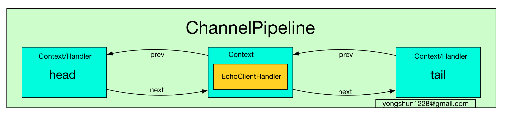
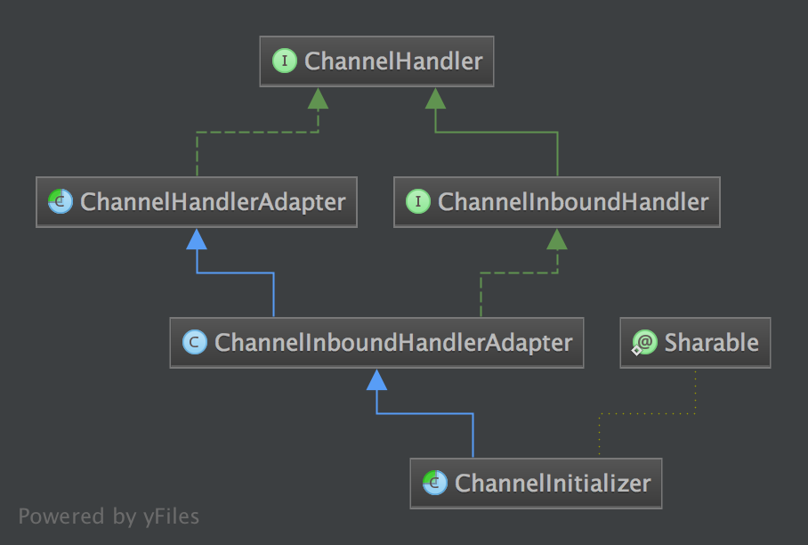
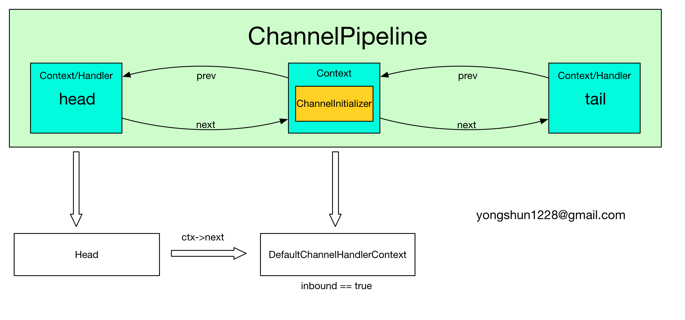
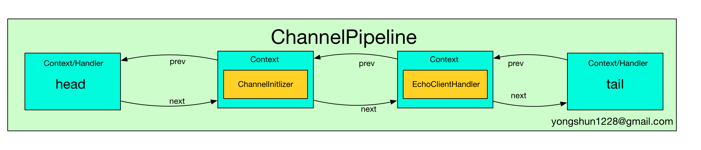
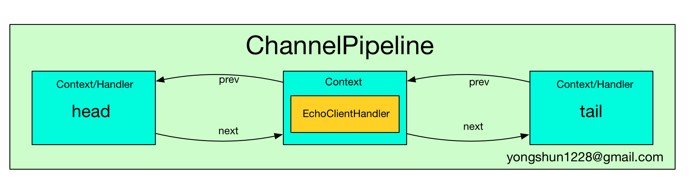
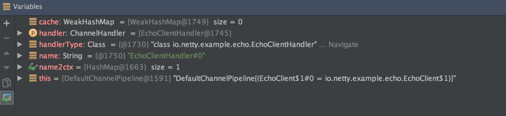
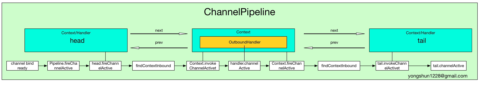

# ChannelPipeline

## Channel 与 ChannelPipeline

相信大家都知道了, 在  Netty 中每个 Channel 都有且仅有一个 ChannelPipeline 与之对应, 它们的组成关系如下:


通过上图我们可以看到, 一个 Channel 包含了一个 ChannelPipeline, 而 ChannelPipeline 中又维护了一个由 ChannelHandlerContext 组成的双向链表. 这个链表的头是 HeadContext, 链表的尾是 TailContext, 并且每个 ChannelHandlerContext 中又关联着一个 ChannelHandler.
上面的图示给了我们一个对 ChannelPipeline 的直观认识, 但是实际上 Netty 实现的 Channel 是否真的是这样的呢? 我们继续用源码说话.

在第一章 **Netty 源码分析之 一 揭开 Bootstrap 神秘的红盖头** 中, 我们已经知道了一个 Channel 的初始化的基本过程, 下面我们再回顾一下.
下面的代码是 AbstractChannel 构造器:

```
protected AbstractChannel(Channel parent) {
    this.parent = parent;
    unsafe = newUnsafe();
    pipeline = new DefaultChannelPipeline(this);
}
```

AbstractChannel 有一个 pipeline 字段, 在构造器中会初始化它为 DefaultChannelPipeline的实例. 这里的代码就印证了一点: `每个 Channel 都有一个 ChannelPipeline`.
接着我们跟踪一下 DefaultChannelPipeline 的初始化过程.
首先进入到 DefaultChannelPipeline 构造器中:

```
public DefaultChannelPipeline(AbstractChannel channel) {
    if (channel == null) {
        throw new NullPointerException("channel");
    }
    this.channel = channel;

    tail = new TailContext(this);
    head = new HeadContext(this);

    head.next = tail;
    tail.prev = head;
}
```

在 DefaultChannelPipeline 构造器中, 首先将与之关联的 Channel 保存到字段 channel 中, 然后实例化两个 ChannelHandlerContext, 一个是 HeadContext 实例 head, 另一个是 TailContext 实例 tail. 接着将 head 和 tail 互相指向, 构成一个双向链表.
`特别注意到, 我们在开始的示意图中, head 和 tail 并没有包含 ChannelHandler`, 这是因为 HeadContext 和 TailContext 继承于 AbstractChannelHandlerContext 的同时也实现了 ChannelHandler 接口了, 因此它们有 Context 和 Handler 的双重属性.

## ChannelPipeline 的初始化再探

在第一章的时候, 我们已经对 ChannelPipeline 的初始化有了一个大致的了解, 不过当时重点毕竟不在 ChannelPipeline 这里, 因此没有深入地分析它的初始化过程. 那么下面我们就来看一下具体的 ChannelPipeline 的初始化都做了哪些工作吧.

### ChannelPipeline 实例化过程

我们再来回顾一下, 在实例化一个 Channel 时, 会伴随着一个 ChannelPipeline 的实例化, 并且此 Channel 会与这个 ChannelPipeline 相互关联, 这一点可以通过NioSocketChannel 的父类 AbstractChannel 的构造器予以佐证:

```
protected AbstractChannel(Channel parent) {
    this.parent = parent;
    unsafe = newUnsafe();
    pipeline = new DefaultChannelPipeline(this);
}
```

当实例化一个 Channel(这里以 EchoClient 为例, 那么 Channel 就是 NioSocketChannel), 其 pipeline 字段就是我们新创建的 DefaultChannelPipeline 对象, 那么我们就来看一下 DefaultChannelPipeline 的构造方法吧:

```
public DefaultChannelPipeline(AbstractChannel channel) {
    if (channel == null) {
        throw new NullPointerException("channel");
    }
    this.channel = channel;

    tail = new TailContext(this);
    head = new HeadContext(this);

    head.next = tail;
    tail.prev = head;
}
```

可以看到, 在 DefaultChannelPipeline 的构造方法中, 将传入的 channel 赋值给字段 this.channel, 接着又实例化了两个特殊的字段: **tail** 与 **head**. 这两个字段是一个双向链表的头和尾. 其实在 DefaultChannelPipeline 中, 维护了一个以 AbstractChannelHandlerContext 为节点的双向链表, 这个链表是 Netty 实现 Pipeline 机制的关键.
再回顾一下 head 和 tail 的类层次结构:


从类层次结构图中可以很清楚地看到, head 实现了 **ChannelInboundHandler**, 而 tail 实现了 **ChannelOutboundHandler** 接口, 并且它们都实现了 **ChannelHandlerContext**  接口, 因此可以说 **head 和 tail 即是一个 ChannelHandler, 又是一个 ChannelHandlerContext.**

接着看一下 HeadContext 的构造器:

```
HeadContext(DefaultChannelPipeline pipeline) {
    super(pipeline, null, HEAD_NAME, false, true);
    unsafe = pipeline.channel().unsafe();
}
```

它调用了父类 AbstractChannelHandlerContext 的构造器, 并传入参数 inbound = false, outbound = true.
TailContext 的构造器与 HeadContext 的相反, 它调用了父类 AbstractChannelHandlerContext 的构造器, 并传入参数 inbound = true, outbound = false.
即 header 是一个 outboundHandler, 而 tail 是一个inboundHandler, 关于这一点, 大家要特别注意, 因为在后面的分析中, 我们会反复用到 inbound 和 outbound 这两个属性.

### 链表的节点 ChannelHandlerContext

### ChannelInitializer 的添加

上面一小节中, 我们已经分析了 Channel 的组成, 其中我们了解到, 最开始的时候 ChannelPipeline 中含有两个 ChannelHandlerContext(同时也是 ChannelHandler), 但是这个 Pipeline并不能实现什么特殊的功能, 因为我们还没有给它添加自定义的 ChannelHandler.
通常来说, 我们在初始化 Bootstrap, 会添加我们自定义的 ChannelHandler, 就以我们熟悉的 EchoClient 来举例吧:

```
Bootstrap b = new Bootstrap();
b.group(group)
 .channel(NioSocketChannel.class)
 .option(ChannelOption.TCP_NODELAY, true)
 .handler(new ChannelInitializer<SocketChannel>() {
     @Override
     public void initChannel(SocketChannel ch) throws Exception {
         ChannelPipeline p = ch.pipeline();
         p.addLast(new EchoClientHandler());
     }
 });
```

上面代码的初始化过程, 相信大家都不陌生. 在调用 handler 时, 传入了 ChannelInitializer 对象, 它提供了一个 initChannel 方法供我们初始化 ChannelHandler. 那么这个初始化过程是怎样的呢? 下面我们就来揭开它的神秘面纱.

ChannelInitializer 实现了 ChannelHandler, 那么它是在什么时候添加到 ChannelPipeline 中的呢? 进行了一番搜索后, 我们发现它是在 Bootstrap.init 方法中添加到 ChannelPipeline 中的.
其代码如下:

```
@Override
@SuppressWarnings("unchecked")
void init(Channel channel) throws Exception {
    ChannelPipeline p = channel.pipeline();
    p.addLast(handler());
    ...
}
```

上面的代码将 handler() 返回的 ChannelHandler 添加到 Pipeline 中, 而 handler() 返回的是handler 其实就是我们在初始化 Bootstrap 调用 handler 设置的 ChannelInitializer 实例, 因此这里就是将 ChannelInitializer 插入到了 Pipeline 的末端.
此时 Pipeline 的结构如下图所示:


有朋友可能就有疑惑了, 我明明插入的是一个 ChannelInitializer 实例, 为什么在 ChannelPipeline 中的双向链表中的元素却是一个 ChannelHandlerContext? 为了解答这个问题, 我们继续在代码中寻找答案吧.
我们刚才提到, 在 Bootstrap.init 中会调用 p.addLast() 方法, 将 ChannelInitializer 插入到链表末端:

```
@Override
public ChannelPipeline addLast(EventExecutorGroup group, final String name, ChannelHandler handler) {
    synchronized (this) {
        checkDuplicateName(name); // 检查此 handler 是否有重复的名字

        AbstractChannelHandlerContext newCtx = new DefaultChannelHandlerContext(this, group, name, handler);
        addLast0(name, newCtx);
    }

    return this;
}
```

addLast 有很多重载的方法, 我们关注这个比较重要的方法就可以了.
上面的 addLast 方法中, 首先检查这个 ChannelHandler 的名字是否是重复的, 如果不重复的话, 则为这个 Handler 创建一个对应的 DefaultChannelHandlerContext 实例, 并与之关联起来(Context 中有一个 handler 属性保存着对应的 Handler 实例). 判断此 Handler 是否重名的方法很简单: Netty 中有一个 **name2ctx** Map 字段, key 是 handler 的名字, 而 value 则是 handler 本身. 因此通过如下代码就可以判断一个 handler 是否重名了:

```
private void checkDuplicateName(String name) {
    if (name2ctx.containsKey(name)) {
        throw new IllegalArgumentException("Duplicate handler name: " + name);
    }
}
```

为了添加一个 handler 到 pipeline 中, 必须把此 handler 包装成 ChannelHandlerContext. 因此在上面的代码中我们可以看到新实例化了一个 newCtx 对象, 并将 handler 作为参数传递到构造方法中. 那么我们来看一下实例化的 DefaultChannelHandlerContext 到底有什么玄机吧.
首先看它的构造器:

```
DefaultChannelHandlerContext(
        DefaultChannelPipeline pipeline, EventExecutorGroup group, String name, ChannelHandler handler) {
    super(pipeline, group, name, isInbound(handler), isOutbound(handler));
    if (handler == null) {
        throw new NullPointerException("handler");
    }
    this.handler = handler;
}
```

DefaultChannelHandlerContext 的构造器中, 调用了两个很有意思的方法: **isInbound** 与 **isOutbound**, 这两个方法是做什么的呢?

```
private static boolean isInbound(ChannelHandler handler) {
    return handler instanceof ChannelInboundHandler;
}

private static boolean isOutbound(ChannelHandler handler) {
    return handler instanceof ChannelOutboundHandler;
}
```

从源码中可以看到, 当一个 handler 实现了 ChannelInboundHandler 接口, 则 isInbound 返回真; 相似地, 当一个 handler 实现了 ChannelOutboundHandler 接口, 则 isOutbound 就返回真.
而这两个 boolean 变量会传递到父类 AbstractChannelHandlerContext 中, 并初始化父类的两个字段: **inbound** 与 **outbound**.
那么这里的 ChannelInitializer 所对应的 DefaultChannelHandlerContext 的 inbound 与 inbound 字段分别是什么呢? 那就看一下 ChannelInitializer 到底实现了哪个接口不就行了? 如下是 ChannelInitializer 的类层次结构图:

可以清楚地看到, ChannelInitializer 仅仅实现了 ChannelInboundHandler 接口, 因此这里实例化的 DefaultChannelHandlerContext 的 inbound = true, outbound = false.
不就是 inbound 和 outbound 两个字段嘛, 为什么需要这么大费周章地分析一番? 其实这两个字段关系到 pipeline 的事件的流向与分类, 因此是十分关键的, 不过我在这里先卖个关子, 后面我们再来详细分析这两个字段所起的作用. 在这里, 读者只需要记住, **ChannelInitializer 所对应的 DefaultChannelHandlerContext 的 inbound = true, outbound = false** 即可.

当创建好 Context 后, 就将这个 Context 插入到 Pipeline 的双向链表中:

```
private void addLast0(final String name, AbstractChannelHandlerContext newCtx) {
    checkMultiplicity(newCtx);

    AbstractChannelHandlerContext prev = tail.prev;
    newCtx.prev = prev;
    newCtx.next = tail;
    prev.next = newCtx;
    tail.prev = newCtx;

    name2ctx.put(name, newCtx);

    callHandlerAdded(newCtx);
}
```

显然, 这个代码就是典型的双向链表的插入操作了. 当调用了 addLast 方法后, Netty 就会将此 handler 添加到双向链表中 tail 元素之前的位置.

## 自定义 ChannelHandler 的添加过程

在上一小节中, 我们已经分析了一个 ChannelInitializer 如何插入到 Pipeline 中的, 接下来就来探讨一下 ChannelInitializer 在哪里被调用, ChannelInitializer 的作用, 以及我们自定义的 ChannelHandler 是如何插入到 Pipeline 中的.

在 **Netty 源码分析之 一 揭开 Bootstrap 神秘的红盖头 (客户端)** 一章的 **channel 的注册过程** 小节中, 我们已经分析过 Channel 的注册过程了, 这里我们再简单地复习一下:

- 首先在 AbstractBootstrap.initAndRegister中, 通过 group().register(channel), 调用 MultithreadEventLoopGroup.register 方法
- 在MultithreadEventLoopGroup.register 中, 通过 next() 获取一个可用的 SingleThreadEventLoop, 然后调用它的 register
- 在 SingleThreadEventLoop.register 中, 通过 channel.unsafe().register(this, promise) 来获取 channel 的 unsafe() 底层操作对象, 然后调用它的 register.
- 在 AbstractUnsafe.register 方法中, 调用 register0 方法注册 Channel
- 在 AbstractUnsafe.register0 中, 调用 AbstractNioChannel#doRegister 方法
- AbstractNioChannel.doRegister 方法通过 javaChannel().register(eventLoop().selector, 0, this) 将 Channel 对应的 Java NIO SockerChannel 注册到一个 eventLoop 的 Selector 中, 并且将当前 Channel 作为 attachment.

而我们自定义 ChannelHandler 的添加过程, 发生在 AbstractUnsafe.register0 中, 在这个方法中调用了 pipeline.fireChannelRegistered() 方法, 其实现如下:

```
@Override
public ChannelPipeline fireChannelRegistered() {
    head.fireChannelRegistered();
    return this;
}
```

上面的代码很简单, 就是调用了 head.fireChannelRegistered() 方法而已.

>`关于上面代码的 head.fireXXX 的调用形式, 是 Netty 中 Pipeline 传递事件的常用方式, 我们以后会经常看到.`

还记得 head 的 类层次结构图不, head 是一个 AbstractChannelHandlerContext 实例, 并且它没有重写 fireChannelRegistered 方法, 因此 head.fireChannelRegistered 其实是调用的 AbstractChannelHandlerContext.fireChannelRegistered:

```
@Override
public ChannelHandlerContext fireChannelRegistered() {
    final AbstractChannelHandlerContext next = findContextInbound();
    EventExecutor executor = next.executor();
    if (executor.inEventLoop()) {
        next.invokeChannelRegistered();
    } else {
        executor.execute(new OneTimeTask() {
            @Override
            public void run() {
                next.invokeChannelRegistered();
            }
        });
    }
    return this;
}
```

这个方法的第一句是调用 findContextInbound 获取一个 Context, 那么它返回的 Context 到底是什么呢? 我们跟进代码中看一下:

```
private AbstractChannelHandlerContext findContextInbound() {
    AbstractChannelHandlerContext ctx = this;
    do {
        ctx = ctx.next;
    } while (!ctx.inbound);
    return ctx;
}
```

很显然, 这个代码会从 head 开始遍历 Pipeline 的双向链表, 然后找到第一个属性 inbound 为 true 的 ChannelHandlerContext 实例. 想起来了没? 我们在前面分析 ChannelInitializer 时, 花了大量的笔墨来分析了 inbound 和 outbound 属性, 你看现在这里就用上了. 回想一下, ChannelInitializer 实现了 ChannelInboudHandler, 因此它所对应的 ChannelHandlerContext 的 inbound 属性就是 true, 因此这里返回就是 ChannelInitializer 实例所对应的 ChannelHandlerContext. 即:


当获取到 inbound 的 Context 后, 就调用它的 invokeChannelRegistered 方法:

```
private void invokeChannelRegistered() {
    try {
        ((ChannelInboundHandler) handler()).channelRegistered(this);
    } catch (Throwable t) {
        notifyHandlerException(t);
    }
}
```

 我们已经强调过了, 每个 ChannelHandler 都与一个 ChannelHandlerContext 关联, 我们可以通过 ChannelHandlerContext 获取到对应的 ChannelHandler. 因此很显然了, 这里 handler() 返回的, 其实就是一开始我们实例化的 ChannelInitializer 对象, 并接着调用了 ChannelInitializer.channelRegistered 方法. 看到这里, 读者朋友是否会觉得有点眼熟呢? ChannelInitializer.channelRegistered 这个方法我们在第一章的时候已经大量地接触了, 但是我们并没有深入地分析这个方法的调用过程, 那么在这里读者朋友应该对它的调用有了更加深入的了解了吧.

那么这个方法中又有什么玄机呢? 继续看代码:

```
@Override
@SuppressWarnings("unchecked")
public final void channelRegistered(ChannelHandlerContext ctx) throws Exception {
    initChannel((C) ctx.channel());
    ctx.pipeline().remove(this);
    ctx.fireChannelRegistered();
}
```

initChannel 这个方法我们很熟悉了吧, 它就是我们在初始化 Bootstrap 时, 调用 handler 方法传入的匿名内部类所实现的方法:

```
.handler(new ChannelInitializer<SocketChannel>() {
     @Override
     public void initChannel(SocketChannel ch) throws Exception {
         ChannelPipeline p = ch.pipeline();
         p.addLast(new EchoClientHandler());
     }
 });
```

因此当调用了这个方法后, 我们自定义的 ChannelHandler 就插入到 Pipeline 了, 此时的 Pipeline 如下图所示:


当添加了自定义的 ChannelHandler 后, 会删除 ChannelInitializer 这个 ChannelHandler, 即 "ctx.pipeline().remove(this)", 因此最后的 Pipeline 如下:


好了, 到了这里, 我们的 **自定义 ChannelHandler 的添加过程** 也分析的查不多了.

## ChannelHandler 的名字

我们注意到, pipeline.addXXX 都有一个重载的方法, 例如 addLast, 它有一个重载的版本是:

```
ChannelPipeline addLast(String name, ChannelHandler handler);
```

第一个参数指定了所添加的 handler 的名字(更准确地说是 ChannelHandlerContext 的名字, 不过我们通常是以 handler 作为叙述的对象, 因此说成 handler 的名字便于理解). 那么 handler 的名字有什么用呢? 如果我们不设置name, 那么 handler 会有怎样的名字?
为了解答这些疑惑, 老规矩, 依然是从源码中找到答案.
我们还是以 addLast 方法为例:

```
@Override
public ChannelPipeline addLast(String name, ChannelHandler handler) {
    return addLast(null, name, handler);
}
```

这个方法会调用重载的 addLast 方法:

```
@Override
public ChannelPipeline addLast(EventExecutorGroup group, final String name, ChannelHandler handler) {
    synchronized (this) {
        checkDuplicateName(name);

        AbstractChannelHandlerContext newCtx = new DefaultChannelHandlerContext(this, group, name, handler);
        addLast0(name, newCtx);
    }

    return this;
}
```

第一个参数被设置为 null, 我们不关系它. 第二参数就是这个 handler 的名字. 看代码可知, 在添加一个 handler 之前, 需要调用 **checkDuplicateName** 方法来确定此 handler 的名字是否和已添加的 handler 的名字重复. 而这个 checkDuplicateName 方法我们在前面已经有提到, 这里再回顾一下:

```
private void checkDuplicateName(String name) {
    if (name2ctx.containsKey(name)) {
        throw new IllegalArgumentException("Duplicate handler name: " + name);
    }
}
```

Netty 判断一个 handler 的名字是否重复的依据很简单: DefaultChannelPipeline 中有一个 类型为 Map<String, AbstractChannelHandlerContext> 的 **name2ctx** 字段, 它的 key 是一个 handler 的名字, 而 value 则是这个 handler 所对应的 ChannelHandlerContext. 每当新添加一个 handler 时, 就会 put 到 name2ctx 中. 因此检查 name2ctx 中是否包含这个 name 即可.
当没有重名的 handler 时, 就为这个 handler 生成一个关联的 DefaultChannelHandlerContext 对象, 然后就将 name 和 newCtx 作为 key-value 对 放到 name2Ctx 中.

### 自动生成 handler 的名字

如果我们调用的是如下的 addLast 方法

```
ChannelPipeline addLast(ChannelHandler... handlers);
```

那么 Netty 会调用 generateName 为我们的 handler 自动生成一个名字:

```
private String generateName(ChannelHandler handler) {
    WeakHashMap<Class<?>, String> cache = nameCaches[(int) (Thread.currentThread().getId() % nameCaches.length)];
    Class<?> handlerType = handler.getClass();
    String name;
    synchronized (cache) {
        name = cache.get(handlerType);
        if (name == null) {
            name = generateName0(handlerType);
            cache.put(handlerType, name);
        }
    }

    synchronized (this) {
        // It's not very likely for a user to put more than one handler of the same type, but make sure to avoid
        // any name conflicts.  Note that we don't cache the names generated here.
        if (name2ctx.containsKey(name)) {
            String baseName = name.substring(0, name.length() - 1); // Strip the trailing '0'.
            for (int i = 1;; i ++) {
                String newName = baseName + i;
                if (!name2ctx.containsKey(newName)) {
                    name = newName;
                    break;
                }
            }
        }
    }

    return name;
}
```

而 generateName 会接着调用  **generateName0** 来实际产生一个 handler 的名字:

```
private static String generateName0(Class<?> handlerType) {
    return StringUtil.simpleClassName(handlerType) + "#0";
}
```

自动生成的名字的规则很简单, 就是 handler 的简单类名加上 "#0", 因此我们的 EchoClientHandler 的名字就是 "EchoClientHandler#0", 这一点也可以通过调试窗口佐证:


## 关于 Pipeline 的事件传输机制

前面章节中, 我们知道  AbstractChannelHandlerContext 中有 inbound 和 outbound 两个 boolean 变量, 分别用于标识 Context 所对应的 handler 的类型, 即:

- inbound 为真时, 表示对应的 ChannelHandler 实现了 ChannelInboundHandler 方法.
- outbound 为真时, 表示对应的 ChannelHandler 实现了 ChannelOutboundHandler 方法.

读者朋友肯定很疑惑了吧: 那究竟这两个字段有什么作用呢? 其实这还要从 ChannelPipeline 的传输的事件类型说起.
**Netty 的事件可以分为 Inbound 和 Outbound 事件.**

如下是从 Netty 官网上拷贝的一个图示:

```
                                             I/O Request
                                        via Channel or
                                    ChannelHandlerContext
                                                  |
+---------------------------------------------------+---------------+
|                           ChannelPipeline         |               |
|                                                  \|/              |
|    +---------------------+            +-----------+----------+    |
|    | Inbound Handler  N  |            | Outbound Handler  1  |    |
|    +----------+----------+            +-----------+----------+    |
|              /|\                                  |               |
|               |                                  \|/              |
|    +----------+----------+            +-----------+----------+    |
|    | Inbound Handler N-1 |            | Outbound Handler  2  |    |
|    +----------+----------+            +-----------+----------+    |
|              /|\                                  .               |
|               .                                   .               |
| ChannelHandlerContext.fireIN_EVT() ChannelHandlerContext.OUT_EVT()|
|        [ method call]                       [method call]         |
|               .                                   .               |
|               .                                  \|/              |
|    +----------+----------+            +-----------+----------+    |
|    | Inbound Handler  2  |            | Outbound Handler M-1 |    |
|    +----------+----------+            +-----------+----------+    |
|              /|\                                  |               |
|               |                                  \|/              |
|    +----------+----------+            +-----------+----------+    |
|    | Inbound Handler  1  |            | Outbound Handler  M  |    |
|    +----------+----------+            +-----------+----------+    |
|              /|\                                  |               |
+---------------+-----------------------------------+---------------+
              |                                  \|/
+---------------+-----------------------------------+---------------+
|               |                                   |               |
|       [ Socket.read() ]                    [ Socket.write() ]     |
|                                                                   |
|  Netty Internal I/O Threads (Transport Implementation)            |
+-------------------------------------------------------------------+
```

从上图可以看出, inbound 事件和 outbound 事件的流向是不一样的, inbound 事件的流行是从下至上, 而 outbound 刚好相反, 是从上到下. 并且 inbound 的传递方式是通过调用相应的 **ChannelHandlerContext.fireIN_EVT()** 方法, 而 outbound 方法的的传递方式是通过调用 **ChannelHandlerContext.OUT_EVT()** 方法. 例如 **ChannelHandlerContext.fireChannelRegistered()** 调用会发送一个 **ChannelRegistered** 的 inbound 给下一个ChannelHandlerContext, 而 **ChannelHandlerContext.bind** 调用会发送一个 **bind** 的 outbound 事件给 下一个 ChannelHandlerContext.

Inbound 事件传播方法有:

```
ChannelHandlerContext.fireChannelRegistered()
ChannelHandlerContext.fireChannelActive()
ChannelHandlerContext.fireChannelRead(Object)
ChannelHandlerContext.fireChannelReadComplete()
ChannelHandlerContext.fireExceptionCaught(Throwable)
ChannelHandlerContext.fireUserEventTriggered(Object)
ChannelHandlerContext.fireChannelWritabilityChanged()
ChannelHandlerContext.fireChannelInactive()
ChannelHandlerContext.fireChannelUnregistered()
```

Oubound 事件传输方法有:

```
ChannelHandlerContext.bind(SocketAddress, ChannelPromise)
ChannelHandlerContext.connect(SocketAddress, SocketAddress, ChannelPromise)
ChannelHandlerContext.write(Object, ChannelPromise)
ChannelHandlerContext.flush()
ChannelHandlerContext.read()
ChannelHandlerContext.disconnect(ChannelPromise)
ChannelHandlerContext.close(ChannelPromise)
```

`注意, 如果我们捕获了一个事件, 并且想让这个事件继续传递下去, 那么需要调用 Context 相应的传播方法.`
例如:

```
public class MyInboundHandler extends ChannelInboundHandlerAdapter {
    @Override
    public void channelActive(ChannelHandlerContext ctx) {
        System.out.println("Connected!");
        ctx.fireChannelActive();
    }
}

public clas MyOutboundHandler extends ChannelOutboundHandlerAdapter {
    @Override
    public void close(ChannelHandlerContext ctx, ChannelPromise promise) {
        System.out.println("Closing ..");
        ctx.close(promise);
    }
}
```

上面的例子中, MyInboundHandler 收到了一个 channelActive 事件, 它在处理后, 如果希望将事件继续传播下去, 那么需要接着调用 ctx.fireChannelActive().

### Outbound 操作(outbound operations of a channel)

`Outbound 事件都是请求事件(request event)`, 即请求某件事情的发生, 然后通过 Outbound 事件进行通知.
Outbound 事件的传播方向是 tail -> customContext -> head.

我们接下来以 connect 事件为例, 分析一下 Outbound 事件的传播机制.
首先, 当用户调用了 Bootstrap.connect 方法时, 就会触发一个 **Connect 请求事件**, 此调用会触发如下调用链:

```
Bootstrap.connect -> Bootstrap.doConnect -> Bootstrap.doConnect0 -> AbstractChannel.connect
```

继续跟踪的话, 我们就发现, AbstractChannel.connect 其实由调用了 DefaultChannelPipeline.connect 方法:

```
@Override
public ChannelFuture connect(SocketAddress remoteAddress, ChannelPromise promise) {
 return pipeline.connect(remoteAddress, promise);
}
```

而 pipeline.connect 的实现如下:

```
@Override
public ChannelFuture connect(SocketAddress remoteAddress, ChannelPromise promise) {
    return tail.connect(remoteAddress, promise);
}
```

可以看到, 当 outbound 事件(这里是 connect 事件)传递到 Pipeline 后, 它其实是以 tail 为起点开始传播的.
而 tail.connect 其实调用的是 AbstractChannelHandlerContext.connect 方法:

```
@Override
public ChannelFuture connect(
        final SocketAddress remoteAddress, final SocketAddress localAddress, final ChannelPromise promise) {
    ...
    final AbstractChannelHandlerContext next = findContextOutbound();
    EventExecutor executor = next.executor();
    ...
    next.invokeConnect(remoteAddress, localAddress, promise);
    ...
    return promise;
}
```

findContextOutbound() 顾名思义, 它的作用是以当前 Context 为起点, 向 Pipeline 中的 Context 双向链表的前端寻找第一个 **outbound** 属性为真的 Context(即关联着 ChannelOutboundHandler 的 Context), 然后返回.
它的实现如下:

```
private AbstractChannelHandlerContext findContextOutbound() {
    AbstractChannelHandlerContext ctx = this;
    do {
        ctx = ctx.prev;
    } while (!ctx.outbound);
    return ctx;
}
```

当我们找到了一个 outbound 的 Context 后, 就调用它的 invokeConnect 方法, 这个方法中会调用 Context 所关联着的 ChannelHandler 的 connect 方法:

```
private void invokeConnect(SocketAddress remoteAddress, SocketAddress localAddress, ChannelPromise promise) {
    try {
        ((ChannelOutboundHandler) handler()).connect(this, remoteAddress, localAddress, promise);
    } catch (Throwable t) {
        notifyOutboundHandlerException(t, promise);
    }
}
```

如果用户没有重写 ChannelHandler 的 connect 方法, 那么会调用 ChannelOutboundHandlerAdapter 所实现的方法:

```
@Override
public void connect(ChannelHandlerContext ctx, SocketAddress remoteAddress,
        SocketAddress localAddress, ChannelPromise promise) throws Exception {
    ctx.connect(remoteAddress, localAddress, promise);
}
```

我们看到, ChannelOutboundHandlerAdapter.connect 仅仅调用了 ctx.connect, 而这个调用又回到了:

```
Context.connect -> Connect.findContextOutbound -> next.invokeConnect -> handler.connect -> Context.connect
```

这样的循环中, 直到 connect 事件传递到DefaultChannelPipeline 的双向链表的头节点, 即 head 中. 为什么会传递到 head 中呢? 回想一下, head 实现了 ChannelOutboundHandler, 因此它的 outbound 属性是 true.
`因为 head 本身既是一个 ChannelHandlerContext, 又实现了 ChannelOutboundHandler 接口`, 因此当 connect 消息传递到 head 后, 会将消息转递到对应的 ChannelHandler 中处理, 而恰好, head 的 handler() 返回的就是 head 本身:

```
@Override
public ChannelHandler handler() {
    return this;
}
```

因此最终 connect 事件是在 head 中处理的. head 的 connect 事件处理方法如下:

```
@Override
public void connect(
        ChannelHandlerContext ctx,
        SocketAddress remoteAddress, SocketAddress localAddress,
        ChannelPromise promise) throws Exception {
    unsafe.connect(remoteAddress, localAddress, promise);
}
```

到这里, 整个 Connect 请求事件就结束了.
下面以一幅图来描述一个整个 Connect 请求事件的处理过程:


我们仅仅以 Connect 请求事件为例, 分析了 Outbound 事件的传播过程, 但是其实所有的 outbound 的事件传播都遵循着一样的传播规律, 读者可以试着分析一下其他的 outbound 事件, 体会一下它们的传播过程.

### Inbound 事件

Inbound 事件和 Outbound 事件的处理过程有点镜像.
`Inbound 事件是一个通知事件`, 即某件事已经发生了, 然后通过 Inbound 事件进行通知. Inbound 通常发生在 Channel 的状态的改变或 IO 事件就绪.
Inbound 的特点是它传播方向是 head -> customContext -> tail.

既然上面我们分析了 Connect 这个 Outbound 事件, 那么接着分析 Connect 事件后会发生什么 Inbound 事件, 并最终找到 Outbound 和 Inbound 事件之间的联系.

当 Connect 这个 Outbound 传播到 unsafe 后, 其实是在 AbstractNioUnsafe.connect 方法中进行处理的:

```
@Override
public final void connect(
        final SocketAddress remoteAddress, final SocketAddress localAddress, final ChannelPromise promise) {
    ...
    if (doConnect(remoteAddress, localAddress)) {
        fulfillConnectPromise(promise, wasActive);
    } else {
        ...
    }
    ...
}
```

在 AbstractNioUnsafe.connect 中, 首先调用 doConnect 方法进行实际上的 Socket 连接, 当连接上后, 会调用 fulfillConnectPromise 方法:

```
private void fulfillConnectPromise(ChannelPromise promise, boolean wasActive) {
    ...
    // Regardless if the connection attempt was cancelled, channelActive() event should be triggered,
    // because what happened is what happened.
    if (!wasActive && isActive()) {
        pipeline().fireChannelActive();
    }
    ...
}
```

我们看到, 在 fulfillConnectPromise 中, 会通过调用 pipeline().fireChannelActive() 将通道激活的消息(即 Socket 连接成功)发送出去.
`而这里, 当调用 pipeline.fireXXX 后, 就是 Inbound 事件的起点.`
因此当调用了 pipeline().fireChannelActive() 后, 就产生了一个 ChannelActive Inbound 事件, 我们就从这里开始看看这个 Inbound 事件是怎么传播的吧.

```
@Override
public ChannelPipeline fireChannelActive() {
    head.fireChannelActive();

    if (channel.config().isAutoRead()) {
        channel.read();
    }

    return this;
}
```

哈哈, 果然, 在 fireChannelActive 方法中, 调用的是 head.fireChannelActive, `因此可以证明了, Inbound 事件在 Pipeline 中传输的起点是 head.`
那么, 在 head.fireChannelActive() 中又做了什么呢?

```
@Override
public ChannelHandlerContext fireChannelActive() {
    final AbstractChannelHandlerContext next = findContextInbound();
    EventExecutor executor = next.executor();
    ...
    next.invokeChannelActive();
    ...
    return this;
}
```

上面的代码应该很熟悉了吧. 回想一下在 Outbound 事件(例如 Connect 事件)的传输过程中时, 我们也有类似的操作:

- 首先调用 findContextInbound, 从 Pipeline 的双向链表中中找到第一个属性 inbound 为真的 Context, 然后返回
- 调用这个 Context 的 invokeChannelActive

invokeChannelActive 方法如下:

```
private void invokeChannelActive() {
    try {
        ((ChannelInboundHandler) handler()).channelActive(this);
    } catch (Throwable t) {
        notifyHandlerException(t);
    }
}
```

这个方法和 Outbound 的对应方法(例如 invokeConnect) 如出一辙. 同 Outbound 一样, 如果用户没有重写 channelActive 方法, 那么会调用 ChannelInboundHandlerAdapter 的 channelActive 方法:

```
@Override
public void channelActive(ChannelHandlerContext ctx) throws Exception {
    ctx.fireChannelActive();
}
```

同样地, 在 ChannelInboundHandlerAdapter.channelActive 中, 仅仅调用了 ctx.fireChannelActive 方法, 因此就会有如下循环:

```
Context.fireChannelActive -> Connect.findContextInbound -> nextContext.invokeChannelActive -> nextHandler.channelActive -> nextContext.fireChannelActive
```

这样的循环中. 同理, tail 本身 既实现了 **ChannelInboundHandler** 接口, 又实现了 **ChannelHandlerContext** 接口, 因此当 channelActive 消息传递到 tail 后, 会将消息转递到对应的 ChannelHandler 中处理, 而恰好, tail 的 handler() 返回的就是 tail 本身:

```
@Override
public ChannelHandler handler() {
    return this;
}
```

因此 channelActive Inbound 事件最终是在 tail 中处理的, 我们看一下它的处理方法:

```
@Override
public void channelActive(ChannelHandlerContext ctx) throws Exception { }
```

TailContext.channelActive 方法是空的. 如果读者自行查看 TailContext 的 Inbound 处理方法时, 会发现, 它们的实现都是空的. 可见, 如果是 Inbound, 当用户没有实现自定义的处理器时, 那么默认是不处理的.

用一幅图来总结一下 Inbound 的传输过程吧:


### 总结

对于 Outbound事件:

- Outbound 事件是请求事件(由 Connect 发起一个请求, 并最终由 unsafe 处理这个请求)
- Outbound 事件的发起者是 Channel
- Outbound 事件的处理者是 unsafe
- Outbound 事件在 Pipeline 中的传输方向是 tail -> head.
- 在 ChannelHandler 中处理事件时, 如果这个 Handler 不是最后一个 Hnalder, 则需要调用 ctx.xxx (例如 ctx.connect) 将此事件继续传播下去. 如果不这样做, 那么此事件的传播会提前终止.
- Outbound 事件流: Context.OUT_EVT -> Connect.findContextOutbound -> nextContext.invokeOUT_EVT -> nextHandler.OUT_EVT -> nextContext.OUT_EVT

对于 Inbound 事件:

- Inbound 事件是通知事件, 当某件事情已经就绪后, 通知上层.
- Inbound 事件发起者是 unsafe
- Inbound 事件的处理者是 Channel, 如果用户没有实现自定义的处理方法, 那么Inbound 事件默认的处理者是 TailContext, 并且其处理方法是空实现.
- Inbound  事件在 Pipeline 中传输方向是 head -> tail
- 在 ChannelHandler 中处理事件时, 如果这个 Handler 不是最后一个 Hnalder, 则需要调用 ctx.fireIN_EVT (例如 ctx.fireChannelActive) 将此事件继续传播下去. 如果不这样做, 那么此事件的传播会提前终止.
- Outbound 事件流: Context.fireIN_EVT -> Connect.findContextInbound -> nextContext.invokeIN_EVT -> nextHandler.IN_EVT -> nextContext.fireIN_EVT

outbound 和 inbound 事件十分的镜像, 并且 Context 与 Handler 直接的调用关系是否容易混淆, 因此读者在阅读这里的源码时, 需要特别的注意.
