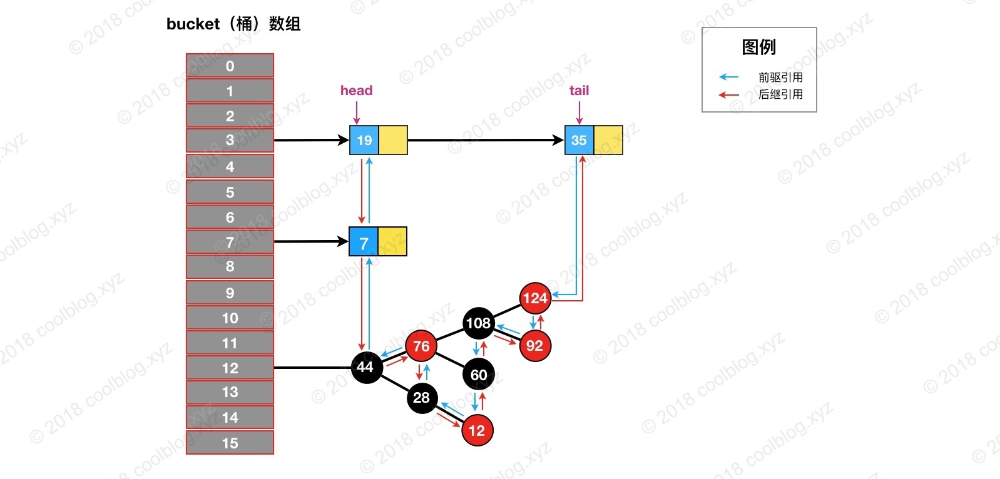

### 简介

> LinkedHashMap可以认为是HashMap+LinkedList，它既使用HashMap操作数据结构，又使用LinkedList维护插入元素的先后顺序，内部采用双向链表（doubly-linked list）的形式将所有元素（ entry ）连接起来。

LinkedHashMap继承了HashMap，允许放入key为null的元素，也允许插入value为null的元素。从名字上可以看出该容器是LinkedList和HashMap的混合体，也就是说它同时满足HashMap和LinkedList的某些特性，可将LinkedHashMap看作采用Linked list增强的HashMap。

`LinkedHashMap` 是 Java 提供的一个集合类，它继承自 `HashMap`，并在 `HashMap` 基础上维护一条双向链表，使得具备如下特性:

1. 支持遍历时会按照插入顺序有序进行迭代。
2. 支持按照元素访问顺序排序,适用于封装 LRU 缓存工具。
3. 因为内部使用双向链表维护各个节点，所以遍历时的效率和元素个数成正比，相较于和容量成正比的 HashMap 来说，迭代效率会高很多。

`LinkedHashMap` 逻辑结构如下图所示，它是在 `HashMap` 基础上在各个节点之间维护一条双向链表，使得原本散列在不同 bucket 上的节点、链表、红黑树有序关联起来。

打开 LinkedHashMap 源码，可以看到主要三个核心属性：

```php
public class LinkedHashMap<K,V>
    extends HashMap<K,V>
    implements Map<K,V>{

    /**双向链表的头节点*/
    transient LinkedHashMap.Entry<K,V> head;

    /**双向链表的尾节点*/
    transient LinkedHashMap.Entry<K,V> tail;

    /**
      * 1、如果accessOrder为true的话，则会把访问过的元素放在链表后面，放置顺序是访问的顺序
      * 2、如果accessOrder为false的话，则按插入顺序来遍历
      */
      final boolean accessOrder;
}
```

LinkedHashMap 在初始化阶段，默认按**插入顺序**来遍历

```csharp
public LinkedHashMap() {
        super();
        accessOrder = false;
}
```

LinkedHashMap 采用的 Hash 算法和 HashMap 相同，不同的是，它重新定义了数组中保存的元素Entry，该Entry除了保存当前对象的引用外，还保存了其上一个元素before和下一个元素after的引用，从而在哈希表的基础上又构成了双向链接列表。

源码如下：

```scala
static class Entry<K,V> extends HashMap.Node<K,V> {
        //before指的是链表前驱节点，after指的是链表后驱节点
        Entry<K,V> before, after;
        Entry(int hash, K key, V value, Node<K,V> next) {
            super(hash, key, value, next);
        }
}
```

### 原理

**LinkedHashMap 继承自 HashMap，所以它的底层仍然是基于拉链式散列结构。该结构由数组和链表或红黑树组成，**结构示意图大致如下：


**LinkedHashMap 在上面结构的基础上，增加了一条双向链表，使得上面的结构可以保持键值对的插入顺序。**同时通过对链表进行相应的操作，实现了访问顺序相关逻辑。其结构可能如下图：


上图中，淡蓝色的箭头表示前驱引用，红色箭头表示后继引用。每当有新键值对节点插入，新节点最终会接在 tail 引用指向的节点后面。而 tail 引用则会移动到新的节点上，这样一个双向链表就建立起来了。

上面的结构并不是很难理解，虽然引入了红黑树，导致结构看起来略为复杂了一些。但大家完全可以忽略红黑树，而只关注链表结构本身。

可以直观的看出，双向链表头部插入的数据为链表的入口，迭代器遍历方向是从链表的头部开始到链表尾部结束。


除了可以保迭代历顺序，这种结构还有一个好处：迭代LinkedHashMap时不需要像HashMap那样遍历整个table，而只需要直接遍历header指向的双向链表即可，也就是说LinkedHashMap的迭代时间就只跟entry的个数相关，而跟table的大小无关。

## 类结构解析

### Entry的继承体系


HashMap 的内部类 TreeNode 不继承它的一个内部类 Node，却继承自 Node 的子类 LinkedHashMap 内部类 Entry。LinkedHashMap 内部类 Entry 继承自 HashMap 内部类 Node，并新增了两个引用，分别是 before 和 after，是用于维护双向链表。同时，TreeNode 继承 LinkedHashMap 的内部类 Entry 后，就具备了和其他 Entry 一起组成链表的能力。但是当我们使用 HashMap 时，TreeNode 并不需要具备组成链表能力。如果继承 LinkedHashMap 内部类 Entry ，TreeNode 就多了两个用不到的引用，这样做不是会浪费空间吗？简单说明一下这个问题，这里这么做确实会浪费空间，但与 TreeNode 通过继承获取的组成链表的能力相比，这点浪费是值得的。在 HashMap 的设计思路注释中，有这样一段话：

> Because TreeNodes are about twice the size of regular nodes, we  use them only when bins contain enough nodes to warrant use (see TREEIFY_THRESHOLD). And when they become too small (due to removal or resizing) they are converted back to plain bins.  In usages with well-distributed user hashCodes, tree bins are rarely used. 

大致的意思是 TreeNode 对象的大小约是普通 Node 对象的2倍，我们仅在桶（bin）中包含足够多的节点时再使用。当桶中的节点数量变少时（取决于删除和扩容），TreeNode 会被转成 Node。当用户实现的 hashCode 方法具有良好分布性时，树类型的桶将会很少被使用。

通过上面的注释，我们可以了解到。**一般情况下，只要 hashCode 的实现不糟糕，Node 组成的链表很少会被转成由 TreeNode 组成的红黑树。也就是说 TreeNode 使用的并不多，浪费那点空间是可接受的。**假如 TreeNode 机制继承自 Node 类，那么它要想具备组成链表的能力，就需要 Node 去继承 LinkedHashMap 的内部类 Entry。这个时候就得不偿失了，浪费很多空间去获取不一定用得到的能力。

### 类层级关系图


`LinkedHashMap`继承自`HashMap`，大部分方法都是直接使用`HashMap`的。接着查看成员变量：

```java
// 双向链表的头部节点（最早插入的，年纪最大的节点）
transient LinkedHashMap.Entry<K,V> head;

// 双向链表的尾部节点（最新插入的，年纪最小的节点）
transient LinkedHashMap.Entry<K,V> tail;

// 用于控制访问顺序，为true时，按访问顺序；为false时，按插入顺序
final boolean accessOrder;
```

`**LinkedHashMap**`**继承自**`**HashMap**`**，所以内部存储数据的方式和**`**HashMap**`**一样，使用数组加链表（红黑树）的结构存储数据，**`**LinkedHashMap**`**和**`**HashMap**`**相比，额外的维护了一个双向链表，用于存储节点的顺序。这个双向链表的类型为**`**LinkedHashMap.Entry**`。

```java
static class Entry<K,V> extends HashMap.Node<K,V> {
    Entry<K,V> before, after;
    Entry(int hash, K key, V value, Node<K,V> next) {
        super(hash, key, value, next);
    }
}
```

LinkedHashMap.Entry类层级关系图：


`LinkedHashMap.Entry`继承自`HashMap`的`Node`类，新增了`before`和`after`属性，用于维护前继和后继节点，以此形成双向链表。

### **构造函数**

LinkedHashMap的构造函数其实没什么特别的，就是调用父类的构造器初始化HashMap的过程，只不过额外多了初始化LinkedHashMap的accessOrder属性的操作：

```java
public LinkedHashMap(int initialCapacity, float loadFactor) {
    super(initialCapacity, loadFactor);
    accessOrder = false;
}

public LinkedHashMap(int initialCapacity) {
    super(initialCapacity);
    accessOrder = false;
}

public LinkedHashMap() {
    super();
    accessOrder = false;
}

public LinkedHashMap(Map<? extends K, ? extends V> m) {
    super();
    accessOrder = false;
    putMapEntries(m, false);
}

public LinkedHashMap(int initialCapacity,
                     float loadFactor,
                     boolean accessOrder) {
    super(initialCapacity, loadFactor);
    this.accessOrder = accessOrder;
}
```

### 链表的建立过程

**链表的建立过程是在插入键值对节点时开始的，初始情况下，让 LinkedHashMap 的 head 和 tail 引用同时指向新节点，链表就算建立起来了。随后不断有新节点插入，通过将新节点接在 tail 引用指向节点的后面，即可实现链表的更新。**

Map 类型的集合类是通过 put(K,V) 方法插入键值对，LinkedHashMap 本身并没有覆写父类的 put 方法，而是直接使用了父类的实现。但在 HashMap 中，put 方法插入的是 HashMap 内部类 Node 类型的节点，该类型的节点并不具备与 LinkedHashMap 内部类 Entry 及其子类型节点组成链表的能力。那么，LinkedHashMap 是怎样建立链表的呢？在展开说明之前，我们先看一下 LinkedHashMap 插入操作相关的代码：

```java
// HashMap 中实现
public V put(K key, V value) {
    return putVal(hash(key), key, value, false, true);
}

// HashMap 中实现
final V putVal(int hash, K key, V value, boolean onlyIfAbsent,
               boolean evict) {
    Node<K,V>[] tab; Node<K,V> p; int n, i;
    if ((tab = table) == null || (n = tab.length) == 0) {...}
    // 通过节点 hash 定位节点所在的桶位置，并检测桶中是否包含节点引用
    if ((p = tab[i = (n - 1) & hash]) == null) {...}
    else {
        Node<K,V> e; K k;
        if (p.hash == hash &&
            ((k = p.key) == key || (key != null && key.equals(k))))
            e = p;
        else if (p instanceof TreeNode) {...}
        else {
            // 遍历链表，并统计链表长度
            for (int binCount = 0; ; ++binCount) {
                // 未在单链表中找到要插入的节点，将新节点接在单链表的后面
                if ((e = p.next) == null) {
                    p.next = newNode(hash, key, value, null);
                    if (binCount >= TREEIFY_THRESHOLD - 1) {...}
                    break;
                }
                // 插入的节点已经存在于单链表中
                if (e.hash == hash &&
                    ((k = e.key) == key || (key != null && key.equals(k))))
                    break;
                p = e;
            }
        }
        if (e != null) { // existing mapping for key
            V oldValue = e.value;
            if (!onlyIfAbsent || oldValue == null) {...}
            afterNodeAccess(e);    // 回调方法，后续说明
            return oldValue;
        }
    }
    ++modCount;
    if (++size > threshold) {...}
    afterNodeInsertion(evict);    // 回调方法，后续说明
    return null;
}

// HashMap 中实现
Node<K,V> newNode(int hash, K key, V value, Node<K,V> next) {
    return new Node<>(hash, key, value, next);
}

// LinkedHashMap 中覆写
Node<K,V> newNode(int hash, K key, V value, Node<K,V> e) {
    // 创建LinkedHashMap.Entry实例
    LinkedHashMap.Entry<K,V> p =
        new LinkedHashMap.Entry<K,V>(hash, key, value, e);
    // 将新节点放入LinkedHashMap维护的双向链表尾部
    linkNodeLast(p);
    return p;
}

// LinkedHashMap 中实现
private void linkNodeLast(LinkedHashMap.Entry<K,V> p) {
    LinkedHashMap.Entry<K,V> last = tail;
    tail = p;
    // 如果尾节点为空，说明双向链表是空的，所以将该节点赋值给头节点，双向链表得以初始化
    if (last == null)
        head = p;
    else {
        // 否则将该节点放到双向链表的尾部
        p.before = last;
        last.after = p;
    }
}
```

上面就是 LinkedHashMap 插入相关的源码，这里省略了部分非关键的代码。我根据上面的代码，可以知道 LinkedHashMap 插入操作的调用过程。如下：


我把 newNode 方法红色背景标注了出来，这一步比较关键。LinkedHashMap 覆写了该方法。在这个方法中，LinkedHashMap 创建了 Entry，并通过 linkNodeLast 方法将 Entry 接在双向链表的尾部，实现了双向链表的建立。双向链表建立之后，我们就可以按照插入顺序去遍历 LinkedHashMap。

```java
// Callbacks to allow LinkedHashMap post-actions
void afterNodeAccess(Node<K,V> p) { }
void afterNodeInsertion(boolean evict) { }
void afterNodeRemoval(Node<K,V> p) { }
```

根据这三个方法的注释可以看出，这些方法的用途是在增删查等操作后，通过回调的方式，让 LinkedHashMap 有机会做一些后置操作。

### 链表节点的删除过程

与插入操作一样，LinkedHashMap 删除操作相关的代码也是直接用父类的实现。在删除节点时，父类的删除逻辑并不会修复 LinkedHashMap 所维护的双向链表，这不是它的职责。那么删除及节点后，被删除的节点该如何从双链表中移除呢？当然，办法还算是有的。上一节最后提到 HashMap 中三个回调方法运行 LinkedHashMap 对一些操作做出响应。**所以，在删除及节点后，回调方法 `afterNodeRemoval` 会被调用。LinkedHashMap 覆写该方法，并在该方法中完成了移除被删除节点的操作。**相关源码如下：

```java
// HashMap 中实现
public V remove(Object key) {
    Node<K,V> e;
    return (e = removeNode(hash(key), key, null, false, true)) == null ?
        null : e.value;
}

// HashMap 中实现
final Node<K,V> removeNode(int hash, Object key, Object value,
                           boolean matchValue, boolean movable) {
    Node<K,V>[] tab; Node<K,V> p; int n, index;
    if ((tab = table) != null && (n = tab.length) > 0 &&
        (p = tab[index = (n - 1) & hash]) != null) {
        Node<K,V> node = null, e; K k; V v;
        if (p.hash == hash &&
            ((k = p.key) == key || (key != null && key.equals(k))))
            node = p;
        else if ((e = p.next) != null) {
            if (p instanceof TreeNode) {...}
            else {
                // 遍历单链表，寻找要删除的节点，并赋值给 node 变量
                do {
                    if (e.hash == hash &&
                        ((k = e.key) == key ||
                         (key != null && key.equals(k)))) {
                        node = e;
                        break;
                    }
                    p = e;
                } while ((e = e.next) != null);
            }
        }
        if (node != null && (!matchValue || (v = node.value) == value ||
                             (value != null && value.equals(v)))) {
            if (node instanceof TreeNode) {...}
            // 将要删除的节点从单链表中移除
            else if (node == p)
                tab[index] = node.next;
            else
                p.next = node.next;
            ++modCount;
            --size;
            afterNodeRemoval(node);    // 调用删除回调方法进行后续操作
            return node;
        }
    }
    return null;
}

// LinkedHashMap 中覆写
void afterNodeRemoval(Node<K,V> e) { // unlink
    LinkedHashMap.Entry<K,V> p =
        (LinkedHashMap.Entry<K,V>)e, b = p.before, a = p.after;
    // 将 p 节点的前驱后后继引用置空
    p.before = p.after = null;
    // b 为 null，表明 p 是头节点
    if (b == null)
        head = a;
    else
        b.after = a;
    // a 为 null，表明 p 是尾节点
    if (a == null)
        tail = b;
    else
        a.before = b;
}
```

删除的过程并不复杂，上面这么多代码其实就做了三件事：

1. 根据 hash 定位到桶位置
2. 遍历链表或调用红黑树相关的删除方法
3. 从 LinkedHashMap 维护的双链表中移除要删除的节点

举个例子说明一下，假如我们要删除下图键值为 3 的节点。


根据 hash 定位到该节点属于3号桶，然后在对3号桶保存的单链表进行遍历。找到要删除的节点后，先从单链表中移除该节点。如下：


然后再双向链表中移除该节点：


****

### 访问顺序的维护过程

默认情况下，LinkedHashMap 是按插入顺序维护链表。不过我们可以在初始化 LinkedHashMap，指定 accessOrder 参数为 true，即可让它按访问顺序维护链表。**访问顺序的原理上并不复杂，当我们调用`get/getOrDefault/replace`等方法时，只需要将这些方法访问的节点移动到链表的尾部即可。**相应的源码如下：

```java
// LinkedHashMap 中覆写
public V get(Object key) {
    Node<K,V> e;
    if ((e = getNode(hash(key), key)) == null)
        return null;
    // 如果 accessOrder 为 true，则调用 afterNodeAccess 将被访问节点移动到链表最后
    if (accessOrder)
        afterNodeAccess(e);
    return e.value;
}

// LinkedHashMap 中覆写
void afterNodeAccess(Node<K,V> e) { // move node to last
    LinkedHashMap.Entry<K,V> last;
    if (accessOrder && (last = tail) != e) {
        LinkedHashMap.Entry<K,V> p =
            (LinkedHashMap.Entry<K,V>)e, b = p.before, a = p.after;
        p.after = null;
        // 如果 b 为 null，表明 p 为头节点
        if (b == null)
            head = a;
        else
            b.after = a;
            
        if (a != null)
            a.before = b;
        /*
         * 这里存疑，父条件分支已经确保节点 e 不会是尾节点，
         * 那么 e.after 必然不会为 null，不知道 else 分支有什么作用
         */
        else
            last = b;
    
        if (last == null)
            head = p;
        else {
            // 将 p 接在链表的最后
            p.before = last;
            last.after = p;
        }
        tail = p;
        ++modCount;
    }
}
```

上面就是访问顺序的实现代码，并不复杂。下面举例演示一下，帮助大家理解。假设我们访问下图键值为3的节点，访问前结构为：


访问后，键值为3的节点将会被移动到双向链表的最后位置，其前驱和后继也会跟着更新。访问后的结构如下：


# 基于LinkedHashMap的LRUCache实现

那我们今天就说一下LRU算法，分两点来说一下。

1. LRU算法是要做什么？
2. 我们有没有什么简单的方法来实现LRU算法？

#### 先说说第一点，LRU算法是要做什么？

其实解释起来很简单，LRU就是**Least Recently Used**的缩写，翻译过来就是**“最近最少使用”**。也就是说LRU算法会将最近最少用的缓存移除，让给最新使用的缓存。而往往最常读取的，也就是读取次数最多的，所以利用好LRU算法，我们能够提供对热点数据的缓存效率，能够提高缓存服务的内存使用率。

#### 那如何来实现呢？

我们先来梳理一下，需要实现几个什么功能？

1. 限制缓存大小
2. 查询出最近最晚用的缓存
3. 给最近最少用的缓存做一个标识

今天我就利用`Java`的`LinkedHashMap`用非常简单的代码来实现基于LRU算法的Cache功能。

实现代码如下，加上`import`语句、注释和空行，也才不到20行的代码，就能够实现一个LRU算法的Cache：

```java
import java.util.LinkedHashMap;
import java.util.Map;

/**
 * 简单用LinkedHashMap来实现的LRU算法的缓存
 */
public class LRUCache<K, V> extends LinkedHashMap<K, V> {

    private int cacheSize;

    public LRUCache(int cacheSize) {
        super(16, (float) 0.75, true);
        this.cacheSize = cacheSize;
    }

    protected boolean removeEldestEntry(Map.Entry<K, V> eldest) {
        return size() > cacheSize;
    }
}
```

测试代码：

```java
import org.junit.Ignore;
import org.junit.Test;
import org.slf4j.Logger;
import org.slf4j.LoggerFactory;

public class LRUCacheTest {
    private static final Logger log = LoggerFactory.getLogger(LRUCacheTest.class);

    private static LRUCache<String, Integer> cache = new LRUCache<>(10);

    @Test
    public void test() {
        for (int i = 0; i < 10; i++) {
            cache.put("k" + i, i);
        }
        for (int i = 0; i < 10; i++) {
            String key = "k" + RandomUtil.getNum(0, 9);
        }

        log.info("all cache :'{}'",cache);

        cache.put("k" + 10, 10);

        log.info("After running the LRU algorithm cache :'{}'", cache);
    }

}
```
