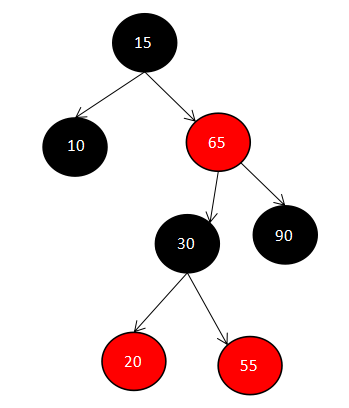

### 红黑树基本概念

先来了解一下二叉查找树的概念：

#### 二叉查找树

二叉查找树，也称有序二叉树（ordered binary tree），或已排序二叉树（sorted binary tree），是指一棵空树或者具有下列性质的二叉树：

- 若任意节点的左子树不空，则左子树上所有结点的值均小于它的根结点的值
- 若任意节点的右子树不空，则右子树上所有结点的值均大于它的根结点的值
- 任意节点的左、右子树也分别为二叉查找树
- 没有键值相等的节点（no duplicate nodes）

 因为一棵由n个结点随机构造的二叉查找树的高度为logn，所以顺理成章，二叉查找树的一般操作的执行时间为O(lgn)。但二叉查找树若退化成了一棵具有n个结点的线性链后，则这些操作最坏情况运行时间为O(n)，如下图情况：


红黑树是一种近似平衡的二叉树（不是高度的平衡树），它能够确保：**从根到叶子的最长路径不多于最短路径的两倍长**。红黑树虽然本质上是一棵二叉查找树，但它在二叉查找树的基础上增加了着色和相关的性质使得红黑树相对平衡，从而保证了红黑树的查找、插入、删除的时间复杂度最坏为O(log n)

红黑树的特点：

　　1、根节点与叶节点都是黑色节点，其中叶节点为null节点

　　2、不能有两个连续的红色节点

　　3、从根节点到所有叶子结点上的黑色节点数量相同

上述的特点导致红黑树是大致平衡的，保证了红黑树能够以O(log2n)的时间复杂度进行搜索、插入、删除。

#### 红黑树的应用场景

HashMap、LinkedHashMap，以O(1)的时间复杂度进行增删改查。但缺点是它们的统计性能时间复杂度不是很好，所有的统计必须遍历所有Entry，因此时间复杂度为O(N)。比如Map的Key有1、2、3、4、5、6、7，我现在要统计：

　　1.所有Key比3大的键值对有哪些？

　　2.Key最小的和Key最大的是哪两个？

就类似这些操作，HashMap和LinkedHashMap做得比较差，此时我们可以使用TreeMap。TreeMap的Key按照自然顺序进行排序或者根据创建映射时提供的Comparator接口进行排序。TreeMap为增、删、改、查这些操作提供了log(N)的时间开销，从存储角度而言，这比HashMap与LinkedHashMap的O(1)时间复杂度要差些；但是在统计性能上，TreeMap同样可以保证log(N)的时间开销，这又比HashMap与LinkedHashMap的O(N)时间复杂度好不少。

因此总结而言：如果只需要存储功能，使用HashMap与LinkedHashMap是一种更好的选择；如果还需要保证统计性能或者需要对Key按照一定规则进行排序，那么使用TreeMap是一种更好的选择。

下面展示一张红黑树的实例图：


可以看到根节点到所有NULL LEAF节点（即叶子节点）所经过的黑色节点都是2个。

另外从这张图上我们还能得到一个结论：红黑树并不是高度的平衡树。所谓平衡树指的是一棵空树或它的左右两个子树的高度差的绝对值不超过1，但是我们看：

　　**·** 最左边的路径0026-->0017-->0012-->0010-->0003-->NULL LEAF，它的高度为5

　　**·** 最后边的路径0026-->0041-->0047-->NULL LEAF，它的高度为3

左右子树的高度差值为2，因此红黑树并不是高度平衡的，它放弃了高度平衡的特性而只追求部分平衡，这种特性降低了插入、删除时对树旋转的要求，从而提升了树的整体性能。而其他平衡树比如AVL树虽然查找性能为性能是O(logn)，但是为了维护其平衡特性，可能要在插入、删除操作时进行多次的旋转，产生比较大的消耗。

### TreeMap的数据结构

下面是TreeMap的基本数据结构Entry的部分源码：

```java
static final class Entry<K,V> implements Map.Entry<K,V> {
        K key;
        V value;
        Entry<K,V> left;
        Entry<K,V> right;
        Entry<K,V> parent;
        boolean color = BLACK;
......
}
```

可以看出，Entry中除了基本的key、value之外，还有左节点、右节点以及父节点，另外还有颜色黑色为true，红色为false

### TreeMap添加数据图文详细解析

先从源码看put方法：

```java
public V put(K key, V value) {
        Entry<K,V> t = root;
        if (t == null) {
            compare(key, key); // type (and possibly null) check

            root = new Entry<>(key, value, null);
            size = 1;
            modCount++;
            return null;
        }
        int cmp;
        Entry<K,V> parent;
        // split comparator and comparable paths
        Comparator<? super K> cpr = comparator;
        if (cpr != null) {
            do {
                parent = t;
                cmp = cpr.compare(key, t.key);
                if (cmp < 0)
                    t = t.left;
                else if (cmp > 0)
                    t = t.right;
                else
                    return t.setValue(value);
            } while (t != null);
        }
        else {
            if (key == null)
                throw new NullPointerException();
            @SuppressWarnings("unchecked")
                Comparable<? super K> k = (Comparable<? super K>) key;
            do {
                parent = t;
                cmp = k.compareTo(t.key);
                if (cmp < 0)
                    t = t.left;
                else if (cmp > 0)
                    t = t.right;
                else
                    return t.setValue(value);
            } while (t != null);
        }
        Entry<K,V> e = new Entry<>(key, value, parent);
        if (cmp < 0)
            parent.left = e;
        else
            parent.right = e;
        fixAfterInsertion(e);
        size++;
        modCount++;
        return null;
    }
```

从这段代码，先总结一下TreeMap添加数据的几个步骤：

1. 获取根节点，根节点为空，产生一个根节点，将其着色为黑色，退出余下流程；
2. 获取比较器，如果传入的Comparator接口不为空，使用传入的Comparator接口实现类进行比较；如果传入的Comparator接口为空，将Key强转为Comparable接口进行比较；
3. 从根节点开始逐一依照规定的排序算法进行比较，取比较值cmp，如果cmp=0，表示插入的Key已存在；如果cmp>0，取当前节点的右子节点；如果cmp<0，取当前节点的左子节点；
4. 排除插入的Key已存在的情况，第（3）步的比较一直比较到当前节点t的左子节点或右子节点为null，此时t就是我们寻找到的节点，cmp>0则准备往t的右子节点插入新节点，cmp<0则准备往t的左子节点插入新节点；
5. new出一个新节点，默认为黑色，根据cmp的值向t的左边或者右边进行插入；
6. 插入之后进行修复，包括左旋、右旋、重新着色这些操作，让树保持平衡性

1~5步都比较简单，看代码就基本能理解，红黑树最核心的应当是第6步插入数据之后进行的修复工作，对应的Java代码是TreeMap中的fixAfterInsertion方法，下面看一下put每个数据之后TreeMap都做了什么操作，借此来理清TreeMap的实现原理。

#### fixAfterInsertion

```java
 1 private void fixAfterInsertion(Entry<K,V> x) {
 2     x.color = RED;
 3 
 4     while (x != null && x != root && x.parent.color == RED) {
 5         if (parentOf(x) == leftOf(parentOf(parentOf(x)))) {
 6             Entry<K,V> y = rightOf(parentOf(parentOf(x)));
 7             if (colorOf(y) == RED) {
 8                 setColor(parentOf(x), BLACK);
 9                 setColor(y, BLACK);
10                 setColor(parentOf(parentOf(x)), RED);
11                 x = parentOf(parentOf(x));
12             } else {
13                 if (x == rightOf(parentOf(x))) {
14                     x = parentOf(x);
15                     rotateLeft(x);
16                 }
17                 setColor(parentOf(x), BLACK);
18                 setColor(parentOf(parentOf(x)), RED);
19                 rotateRight(parentOf(parentOf(x)));
20             }
21         } else {
22             Entry<K,V> y = leftOf(parentOf(parentOf(x)));
23             if (colorOf(y) == RED) {
24                 setColor(parentOf(x), BLACK);
25                 setColor(y, BLACK);
26                 setColor(parentOf(parentOf(x)), RED);
27                 x = parentOf(parentOf(x));
28             } else {
29                 if (x == leftOf(parentOf(x))) {
30                     x = parentOf(x);
31                     rotateRight(x);
32                 }
33                 setColor(parentOf(x), BLACK);
34                 setColor(parentOf(parentOf(x)), RED);
35                 rotateLeft(parentOf(parentOf(x)));
36             }
37         }
38     }
39     root.color = BLACK;
40 }
```

上述代码用流程图来描述，便于理解：


在总结上述流程之前先说明几个概念：


上图从左到右依次是：左子树外侧插入、左子树内侧插入、右子树内侧插入、右子树外侧插入（这个就不解释了，思考一下就明白了）

再对上述的流程图进行总结（TreeMap的修复旋转）：

在插入判断之前，不论是左子树还是右子树都需要先判断x的叔父节点是否为红色如果为否才有下面的插入判断：

#### **if**

　　如果是叔父节点是红色则表示：**x的父节点和叔父节点都为红色，**则需要做**：**

　　　　1.将x的父节点、叔父节点着为黑色

　　　　2.将x的祖父节点着为红色

　　　　3.将root着为黑色

　　　　4.如果上述两步昨晚还存在两个红色节点连在一起，那么将x赋值为其祖父节点用于while条件重新判断，即从新开始判断（上述的if）

#### else

　　（1）左子树的内侧插入：

　　　　1.将x赋值为x的父节点

　　　　2.对x（实际上就是对原始x的父节点）进行一次左旋

　　　　3.对x的父节点着为黑色，对x的祖父节点着为红色

　　　　4.对x祖父节点进行一次右旋

　　（2）左子树的外侧插入：

　　　　1.x的父节点着为黑色

　　　　2.x的祖父节点着为红色

　　　　3.对x的祖父节点进行一次右旋

　　（3）右子树的内侧插入：

　　　　1.将x赋值为x的父节点

　　　　2.对x（实际上就是对x的父节点）进行一次右旋

　　　　3.x的父节点着为黑色，x的祖父节点着为红色

　　　　4.对x的祖父节点进行一次左旋

　　（4）右子树的外侧插入：

　　　　1.x的父节点着为黑色

　　　　2.x的祖父节点着为红色

　　　　3.对x的祖父节点进行一次左旋

接下来举个例子，向TreeMap中插入数据，利用图文来详细的解析插入操作：

```
　　　　 @Test
        public void testTreeMap() {
            TreeMap<Integer, String> treeMap = new TreeMap<Integer, String>();
            treeMap.put(10, "10");
            treeMap.put(90, "90");
            treeMap.put(15, "15");
            treeMap.put(65, "65");
            treeMap.put(20, "20");
            treeMap.put(55, "55");
            treeMap.put(30, "30");
            treeMap.put(40, "40");

            for (Map.Entry<Integer, String> entry : treeMap.entrySet()) {
                System.out.println(entry.getKey() + ":" + entry.getValue());
            }
        }
```

下面就通过图文的方式来模拟向TreeMap中添加数据：

#### put(10,"10")

首先是put(10,"10")，由于此时TreeMap中没有任何节点，所以10位根节点且为黑色，所以put之后的数据结构为：


#### put(90,"90")

90比10大，且新加入的元素都会被着为红色，所以加入90后不会触发fixAfterInsertion内的判断旋转，只是将其着为红色，就修正结束了，放入90后的数据结构为：


#### put(15,"15")

put(15,"15")由于15比10大，比90小，所以15应该插在90的左子节点上，默认的节点都是红色，所以插入15节点都的数据结构是：



显然，违反了上述红黑树的第二个特点：不能有两个连续的红色节点，此时15的插入首先只有父节点，没有叔父节点，所以走else，再判断为右子树的内侧插入，所以按照上述else中的（3）来执行旋转和着色：



1.将x赋值为x的父节点
2.对x（实际上就是对x的父节点）进行一次右旋

3.x的父节点着为黑色，x的祖父节点着为红色（此时x为90）

4.对x的祖父节点进行一次左旋
 
经过上述四个步骤之后，发现现在的数据结构符合红黑树的三个特点，即修正结束。

#### put(65,"65")

65比15大，比90小，故65应在90的左子节点上，默认新元素都为红色，插入后为：



发现违反了红黑树的第二条特点：不能有两个连续的红色节点，即需要调整。
此时发现：节点65的父节点和叔父节点都是红色，所以走if判断。

如果是叔父节点是红色则表示：**x的父节点和叔父节点都为红色，**则需要做**：**
1.将x的父节点、叔父节点着为黑色

2.将x的祖父节点着为红色

3.这里结束前有句：root.color = BLACK;所以将root = 15 着为黑色

发现符合红黑树的特点，修正完毕
#### put(20,"20")

由于20比15大，比65小，故20应该放在65的左子节点上，放入后的数据结构为：



发现违反了红黑树的第二条特点：不能有两个连续的红色节点，再判断发现这是左子树的外侧插入：


1.x的父节点着为黑色

2.x的祖父节点着为红色

3.对x的祖父节点进行一次右旋

发现符合红黑树的特点，修正结束

#### put(55,"55")

55比15大，比20大，所以55节点应该在节点20的右子节点，数据结构为：


发现违反了红黑树的第二条特点：不能有两个连续的红色节点，再判断发现55节点的叔父节点和父节点都为红色：

这里开始就不一步一步画出来了，直接一次调整到位：

　　　　1.将x的父节点、叔父节点着为黑色

　　　　2.将x的祖父节点着为红色

　　　　3.将root着为黑色


一次调整后发现符合红黑树的特点，修正结束

#### put(30,"30")

30比15大，比55小，所以30节点应该放在55节点的左子节点上，数据结构为：


发现违反了红黑树的第二条特点：不能有两个连续的红色节点，再判断发现这是右子树的内侧插入：

　　　　1.将x赋值为x的父节点

　　　　2.对x（实际上就是对x的父节点）进行一次右旋

　　　　3.x的父节点着为黑色，x的祖父节点着为红色

　　　　4.对x的祖父节点进行一次左旋



#### put(40,"40")

40比15大，比30大，比55小，所以40节点应该在55节点的左子节点上，数据结构为：


发现违反了红黑树的第二条特点：不能有两个连续的红色节点，再判断发现55节点的叔父节点和父节点都为红色：

　　　　1.将x的父节点、叔父节点着为黑色

　　　　2.将x的祖父节点着为红色

　　　　3.将root着为黑色

 

第一次调整结束后发现，30,65两个节点是红色相连所以还是需要再一次的调整：这次将30看做是新插入的元素，这样15--》65--》30，看做是30节点的右子树内侧插入：

　　　　1.将x赋值为x的父节点

　　　　2.对x（实际上就是对x的父节点）进行一次右旋


　　　　3.x的父节点着为黑色，x的祖父节点着为红色（此时x为65）


　　　　4.对x的祖父节点进行一次左旋


这次修正后，重新恢复红黑树的特性，修正结束。

上述就是添加旋转的过程，其实多动手画，画几遍就理解了。
