---

type: docs
---

在多线程环境下，使用 `HashMap` 进行 `put` 操作时存在丢失数据的情况，为了避免这种 bug 的隐患，强烈建议使用 `ConcurrentHashMap` 代替 `HashMap`。

`HashTable` 是一个线程安全的类，它使用 `synchronized` 来锁住整张 `Hash` 表来实现线程安全，即每次锁住整张表让线程独占，相当于所有线程进行读写时都去竞争一把锁，导致效率非常低下。

`ConcurrentHashMap` 可以做到读取数据不加锁，并且其内部的结构可以让其在进行写操作的时候能够将锁的粒度保持地尽量地小，允许多个修改操作并发进行，其关键在于使用了锁分离技术。它使用了多个锁来控制对 `hash` 表的不同部分进行的修改。`ConcurrentHashMap` 内部使用 `Segment` 来表示这些不同的部分，每个段其实就是一个小的 `Hashtable`，它们有自己的锁。只要多个修改操作发生在不同的段上，它们就可以并发进行。

## ConcurrentHashMap 1.7 简介

`java.util.concurrent.ConcurrentHashMap` 实现了 `java.util.Map` 接口，继承 `java.util.AbstractMap`。其中 `Map` 接口定义了键映射到值的规则，而 `AbstractMap` 类提供 `Map` 接口的骨干实现。

`ConcurrentHashMap` 提供了三个构造函数：

- `HashMap()：`构造一个具有默认初始容量 (16) 和默认加载因子 (0.75) 的空 HashMap。
- `HashMap(int initialCapacity)：`构造一个带指定初始容量和默认加载因子 (0.75) 的空 HashMap。
- `HashMap(int initialCapacity, float loadFactor)：`构造一个带指定初始容量和加载因子的空 HashMap。

`ConcurrentHashMap` 采用了非常精妙的**`分段锁`**策略，`ConcurrentHashMap` 的主干是个 `Segment` 数组。`Segment` 继承了 `ReentrantLock`，所以它就是一种可重入锁(ReentrantLock)。在 `ConcurrentHashMap` 中，一个 `Segment`就是一个子哈希表，`Segment` 里维护了一个 `HashEntry` 数组，并发环境下，对于不同 `Segment` 的数据进行操作是不用考虑锁竞争的。


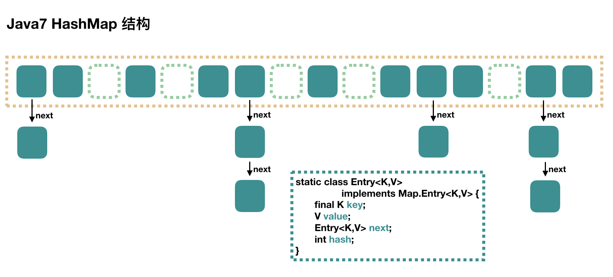

**concurrencyLevel**：并行级别、并发数、Segment 数，怎么翻译不重要，理解它。默认是 16，也就是说 ConcurrentHashMap 有 16 个 Segments，所以理论上，这个时候，最多可以同时支持 16 个线程并发写，只要它们的操作分别分布在不同的 Segment 上。这个值可以在初始化的时候设置为其他值，但是一旦初始化以后，它是不可以扩容的。

再具体到每个 Segment 内部，其实每个 Segment 很像之前介绍的 HashMap，不过它要保证线程安全，所以处理起来要麻烦些。

### 初始化

initialCapacity：初始容量，这个值指的是整个 ConcurrentHashMap 的初始容量，实际操作的时候需要平均分给每个 Segment。

loadFactor：负载因子，之前我们说了，Segment 数组不可以扩容，所以这个负载因子是给每个 Segment 内部使用的。

```java
public ConcurrentHashMap(int initialCapacity,
                         float loadFactor, int concurrencyLevel) {
    if (!(loadFactor > 0) || initialCapacity < 0 || concurrencyLevel <= 0)
        throw new IllegalArgumentException();
    if (concurrencyLevel > MAX_SEGMENTS)
        concurrencyLevel = MAX_SEGMENTS;
    // Find power-of-two sizes best matching arguments
    int sshift = 0;
    int ssize = 1;
    // 计算并行级别 ssize，因为要保持并行级别是 2 的 n 次方
    while (ssize < concurrencyLevel) {
        ++sshift;
        ssize <<= 1;
    }
    // 我们这里先不要那么烧脑，用默认值，concurrencyLevel 为 16，sshift 为 4
    // 那么计算出 segmentShift 为 28，segmentMask 为 15，后面会用到这两个值
    this.segmentShift = 32 - sshift;
    this.segmentMask = ssize - 1;
  
    if (initialCapacity > MAXIMUM_CAPACITY)
        initialCapacity = MAXIMUM_CAPACITY;
  
    // initialCapacity 是设置整个 map 初始的大小，
    // 这里根据 initialCapacity 计算 Segment 数组中每个位置可以分到的大小
    // 如 initialCapacity 为 64，那么每个 Segment 或称之为"槽"可以分到 4 个
    int c = initialCapacity / ssize;
    if (c * ssize < initialCapacity)
        ++c;
    // 默认 MIN_SEGMENT_TABLE_CAPACITY 是 2，这个值也是有讲究的，因为这样的话，对于具体的槽上，
    // 插入一个元素不至于扩容，插入第二个的时候才会扩容
    int cap = MIN_SEGMENT_TABLE_CAPACITY; 
    while (cap < c)
        cap <<= 1;

    // 创建 Segment 数组，
    // 并创建数组的第一个元素 segment[0]
    Segment<K,V> s0 =
        new Segment<K,V>(loadFactor, (int)(cap * loadFactor),
                         (HashEntry<K,V>[])new HashEntry[cap]);
    Segment<K,V>[] ss = (Segment<K,V>[])new Segment[ssize];
    // 往数组写入 segment[0]
    UNSAFE.putOrderedObject(ss, SBASE, s0); // ordered write of segments[0]
    this.segments = ss;
}
```

初始化完成，我们得到了一个 Segment 数组。

我们就当是用 new ConcurrentHashMap() 无参构造函数进行初始化的，那么初始化完成后：

- Segment 数组长度为 16，不可以扩容
- Segment[i] 的默认大小为 2，负载因子是 0.75，得出初始阈值为 1.5，也就是以后插入第一个元素不会触发扩容，插入第二个会进行第一次扩容
- 这里初始化了 segment[0]，其他位置还是 null，至于为什么要初始化 segment[0]，后面的代码会介绍
- 当前 segmentShift 的值为 32 - 4 = 28，segmentMask 为 16 - 1 = 15，姑且把它们简单翻译为**移位数**和**掩码**，这两个值马上就会用到

### put 过程分析

我们先看 put 的主流程，对于其中的一些关键细节操作，后面会进行详细介绍。

```java
public V put(K key, V value) {
    Segment<K,V> s;
    if (value == null)
        throw new NullPointerException();
    // 1. 计算 key 的 hash 值
    int hash = hash(key);
    // 2. 根据 hash 值找到 Segment 数组中的位置 j
    //    hash 是 32 位，无符号右移 segmentShift(28) 位，剩下高 4 位，
    //    然后和 segmentMask(15) 做一次与操作，也就是说 j 是 hash 值的高 4 位，也就是槽的数组下标
    int j = (hash >>> segmentShift) & segmentMask;
    // 刚刚说了，初始化的时候初始化了 segment[0]，但是其他位置还是 null，
    // ensureSegment(j) 对 segment[j] 进行初始化
    if ((s = (Segment<K,V>)UNSAFE.getObject          // nonvolatile; recheck
         (segments, (j << SSHIFT) + SBASE)) == null) //  in ensureSegment
        s = ensureSegment(j);
    // 3. 插入新值到 槽 s 中
    return s.put(key, hash, value, false);
}
```

第一层皮很简单，根据 hash 值很快就能找到相应的 Segment，之后就是 Segment 内部的 put 操作了。

Segment 内部是由 **数组+链表** 组成的。

```java
final V put(K key, int hash, V value, boolean onlyIfAbsent) {
    // 在往该 segment 写入前，需要先获取该 segment 的独占锁
    //    先看主流程，后面还会具体介绍这部分内容
    HashEntry<K,V> node = tryLock() ? null :
        scanAndLockForPut(key, hash, value);
    V oldValue;
    try {
        // 这个是 segment 内部的数组
        HashEntry<K,V>[] tab = table;
        // 再利用 hash 值，求应该放置的数组下标
        int index = (tab.length - 1) & hash;
        // first 是数组该位置处的链表的表头
        HashEntry<K,V> first = entryAt(tab, index);
        
        // 下面这串 for 循环虽然很长，不过也很好理解，想想该位置没有任何元素和已经存在一个链表这两种情况
        for (HashEntry<K,V> e = first;;) {
            if (e != null) {
                K k;
                if ((k = e.key) == key ||
                    (e.hash == hash && key.equals(k))) {
                    oldValue = e.value;
                    if (!onlyIfAbsent) {
                        // 覆盖旧值
                        e.value = value;
                        ++modCount;
                    }
                    break;
                }
                // 继续顺着链表走
                e = e.next;
            }
            else {
                // node 到底是不是 null，这个要看获取锁的过程，不过和这里都没有关系。
                // 如果不为 null，那就直接将它设置为链表表头；如果是null，初始化并设置为链表表头。
                if (node != null)
                    node.setNext(first);
                else
                    node = new HashEntry<K,V>(hash, key, value, first);
                
                int c = count + 1;
                // 如果超过了该 segment 的阈值，这个 segment 需要扩容
                if (c > threshold && tab.length < MAXIMUM_CAPACITY)
                    rehash(node); // 扩容后面也会具体分析
                else
                    // 没有达到阈值，将 node 放到数组 tab 的 index 位置，
                    // 其实就是将新的节点设置成原链表的表头
                    setEntryAt(tab, index, node);
                ++modCount;
                count = c;
                oldValue = null;
                break;
            }
        }
    } finally {
        // 解锁
        unlock();
    }
    return oldValue;
}
```

整体流程还是比较简单的，由于有独占锁的保护，所以 segment 内部的操作并不复杂。至于这里面的并发问题，我们稍后再进行介绍。

到这里 put 操作就结束了，接下来，我们说一说其中几步关键的操作。

#### 初始化槽: ensureSegment

ConcurrentHashMap 初始化的时候会初始化第一个槽 segment[0]，对于其他槽来说，在插入第一个值的时候进行初始化。

这里需要考虑并发，因为很可能会有多个线程同时进来初始化同一个槽 segment[k]，不过只要有一个成功了就可以。

```java
private Segment<K,V> ensureSegment(int k) {
    final Segment<K,V>[] ss = this.segments;
    long u = (k << SSHIFT) + SBASE; // raw offset
    Segment<K,V> seg;
    if ((seg = (Segment<K,V>)UNSAFE.getObjectVolatile(ss, u)) == null) {
        // 这里看到为什么之前要初始化 segment[0] 了，
        // 使用当前 segment[0] 处的数组长度和负载因子来初始化 segment[k]
        // 为什么要用“当前”，因为 segment[0] 可能早就扩容过了
        Segment<K,V> proto = ss[0];
        int cap = proto.table.length;
        float lf = proto.loadFactor;
        int threshold = (int)(cap * lf);
        
        // 初始化 segment[k] 内部的数组
        HashEntry<K,V>[] tab = (HashEntry<K,V>[])new HashEntry[cap];
        if ((seg = (Segment<K,V>)UNSAFE.getObjectVolatile(ss, u))
            == null) { // 再次检查一遍该槽是否被其他线程初始化了。
          
            Segment<K,V> s = new Segment<K,V>(lf, threshold, tab);
            // 使用 while 循环，内部用 CAS，当前线程成功设值或其他线程成功设值后，退出
            while ((seg = (Segment<K,V>)UNSAFE.getObjectVolatile(ss, u))
                   == null) {
                if (UNSAFE.compareAndSwapObject(ss, u, null, seg = s))
                    break;
            }
        }
    }
    return seg;
}
```

总的来说，ensureSegment(int k) 比较简单，对于并发操作使用 CAS 进行控制。

#### 获取写入锁: scanAndLockForPut

前面我们看到，在往某个 segment 中 put 的时候，首先会调用  node = tryLock() ? null : scanAndLockForPut(key, hash, value)，也就是说先进行一次 tryLock() 快速获取该 segment 的独占锁，如果失败，那么进入到 scanAndLockForPut 这个方法来获取锁。

下面我们来具体分析这个方法中是怎么控制加锁的。

```java
private HashEntry<K,V> scanAndLockForPut(K key, int hash, V value) {
    HashEntry<K,V> first = entryForHash(this, hash);
    HashEntry<K,V> e = first;
    HashEntry<K,V> node = null;
    int retries = -1; // negative while locating node
    
    // 循环获取锁
    while (!tryLock()) {
        HashEntry<K,V> f; // to recheck first below
        if (retries < 0) {
            if (e == null) {
                if (node == null) // speculatively create node
                    // 进到这里说明数组该位置的链表是空的，没有任何元素
                    // 当然，进到这里的另一个原因是 tryLock() 失败，所以该槽存在并发，不一定是该位置
                    node = new HashEntry<K,V>(hash, key, value, null);
                retries = 0;
            }
            else if (key.equals(e.key))
                retries = 0;
            else
                // 顺着链表往下走
                e = e.next;
        }
        // 重试次数如果超过 MAX_SCAN_RETRIES（单核1多核64），那么不抢了，进入到阻塞队列等待锁
        //    lock() 是阻塞方法，直到获取锁后返回
        else if (++retries > MAX_SCAN_RETRIES) {
            lock();
            break;
        }
        else if ((retries & 1) == 0 &&
                 // 这个时候是有大问题了，那就是有新的元素进到了链表，成为了新的表头
                 //     所以这边的策略是，相当于重新走一遍这个 scanAndLockForPut 方法
                 (f = entryForHash(this, hash)) != first) {
            e = first = f; // re-traverse if entry changed
            retries = -1;
        }
    }
    return node;
}
```

这个方法有两个出口，一个是 tryLock() 成功了，循环终止，另一个就是重试次数超过了 MAX_SCAN_RETRIES，进到 lock() 方法，此方法会阻塞等待，直到成功拿到独占锁。

这个方法就是看似复杂，但是其实就是做了一件事，那就是**获取该 segment 的独占锁**，如果需要的话顺便实例化了一下 node。

#### 扩容: rehash

重复一下，segment 数组不能扩容，扩容是 segment 数组某个位置内部的数组 HashEntry<K,V>[] 进行扩容，扩容后，容量为原来的 2 倍。

首先，我们要回顾一下触发扩容的地方，put 的时候，如果判断该值的插入会导致该 segment 的元素个数超过阈值，那么先进行扩容，再插值，读者这个时候可以回去 put 方法看一眼。

该方法不需要考虑并发，因为到这里的时候，是持有该 segment 的独占锁的。

```java
// 方法参数上的 node 是这次扩容后，需要添加到新的数组中的数据。
private void rehash(HashEntry<K,V> node) {
    HashEntry<K,V>[] oldTable = table;
    int oldCapacity = oldTable.length;
    // 2 倍
    int newCapacity = oldCapacity << 1;
    threshold = (int)(newCapacity * loadFactor);
    // 创建新数组
    HashEntry<K,V>[] newTable =
        (HashEntry<K,V>[]) new HashEntry[newCapacity];
    // 新的掩码，如从 16 扩容到 32，那么 sizeMask 为 31，对应二进制 ‘000...00011111’
    int sizeMask = newCapacity - 1;
    
    // 遍历原数组，老套路，将原数组位置 i 处的链表拆分到 新数组位置 i 和 i+oldCap 两个位置
    for (int i = 0; i < oldCapacity ; i++) {
        // e 是链表的第一个元素
        HashEntry<K,V> e = oldTable[i];
        if (e != null) {
            HashEntry<K,V> next = e.next;
            // 计算应该放置在新数组中的位置，
            // 假设原数组长度为 16，e 在 oldTable[3] 处，那么 idx 只可能是 3 或者是 3 + 16 = 19
            int idx = e.hash & sizeMask;
            if (next == null)   // 该位置处只有一个元素，那比较好办
                newTable[idx] = e;
            else { // Reuse consecutive sequence at same slot
                // e 是链表表头
                HashEntry<K,V> lastRun = e;
                // idx 是当前链表的头结点 e 的新位置
                int lastIdx = idx;

                // 下面这个 for 循环会找到一个 lastRun 节点，这个节点之后的所有元素是将要放到一起的
                for (HashEntry<K,V> last = next;
                     last != null;
                     last = last.next) {
                    int k = last.hash & sizeMask;
                    if (k != lastIdx) {
                        lastIdx = k;
                        lastRun = last;
                    }
                }
                // 将 lastRun 及其之后的所有节点组成的这个链表放到 lastIdx 这个位置
                newTable[lastIdx] = lastRun;
                // 下面的操作是处理 lastRun 之前的节点，
                //    这些节点可能分配在另一个链表中，也可能分配到上面的那个链表中
                for (HashEntry<K,V> p = e; p != lastRun; p = p.next) {
                    V v = p.value;
                    int h = p.hash;
                    int k = h & sizeMask;
                    HashEntry<K,V> n = newTable[k];
                    newTable[k] = new HashEntry<K,V>(h, p.key, v, n);
                }
            }
        }
    }
    // 将新来的 node 放到新数组中刚刚的 两个链表之一 的 头部
    int nodeIndex = node.hash & sizeMask; // add the new node
    node.setNext(newTable[nodeIndex]);
    newTable[nodeIndex] = node;
    table = newTable;
}
```

这里的扩容比之前的 HashMap 要复杂一些，代码难懂一点。上面有两个挨着的 for 循环，第一个 for 有什么用呢？

仔细一看发现，如果没有第一个 for 循环，也是可以工作的，但是，这个 for 循环下来，如果 lastRun 的后面还有比较多的节点，那么这次就是值得的。因为我们只需要克隆 lastRun 前面的节点，后面的一串节点跟着 lastRun 走就是了，不需要做任何操作。

我觉得 Doug Lea 的这个想法也是挺有意思的，不过比较坏的情况就是每次 lastRun 都是链表的最后一个元素或者很靠后的元素，那么这次遍历就有点浪费了。**不过 Doug Lea 也说了，根据统计，如果使用默认的阈值，大约只有 1/6 的节点需要克隆**。

### get 过程分析

相对于 put 来说，get 真的不要太简单。

1. 计算 hash 值，找到 segment 数组中的具体位置，或我们前面用的“槽”
2. 槽中也是一个数组，根据 hash 找到数组中具体的位置
3. 到这里是链表了，顺着链表进行查找即可

```java
public V get(Object key) {
    Segment<K,V> s; // manually integrate access methods to reduce overhead
    HashEntry<K,V>[] tab;
    // 1. hash 值
    int h = hash(key);
    long u = (((h >>> segmentShift) & segmentMask) << SSHIFT) + SBASE;
    // 2. 根据 hash 找到对应的 segment
    if ((s = (Segment<K,V>)UNSAFE.getObjectVolatile(segments, u)) != null &&
        (tab = s.table) != null) {
        // 3. 找到segment 内部数组相应位置的链表，遍历
        for (HashEntry<K,V> e = (HashEntry<K,V>) UNSAFE.getObjectVolatile
                 (tab, ((long)(((tab.length - 1) & h)) << TSHIFT) + TBASE);
             e != null; e = e.next) {
            K k;
            if ((k = e.key) == key || (e.hash == h && key.equals(k)))
                return e.value;
        }
    }
    return null;
}
```

### 并发问题分析

现在我们已经说完了 put 过程和 get 过程，我们可以看到 get 过程中是没有加锁的，那自然我们就需要去考虑并发问题。

添加节点的操作 put 和删除节点的操作 remove 都是要加 segment 上的独占锁的，所以它们之间自然不会有问题，我们需要考虑的问题就是 get 的时候在同一个 segment 中发生了 put 或 remove 操作。

1. put 操作的线程安全性。

   1. 初始化槽，这个我们之前就说过了，使用了 CAS 来初始化 Segment 中的数组。
   2. 添加节点到链表的操作是插入到表头的，所以，如果这个时候 get 操作在链表遍历的过程已经到了中间，是不会影响的。当然，另一个并发问题就是 get 操作在 put 之后，需要保证刚刚插入表头的节点被读取，这个依赖于 setEntryAt 方法中使用的 UNSAFE.putOrderedObject。
   3. 扩容。扩容是新创建了数组，然后进行迁移数据，最后面将 newTable 设置给属性 table。所以，如果 get 操作此时也在进行，那么也没关系，如果 get 先行，那么就是在旧的 table 上做查询操作；而 put 先行，那么 put 操作的可见性保证就是 table 使用了 volatile 关键字。

2. remove 操作的线程安全性。

   remove 操作我们没有分析源码，所以这里说的读者感兴趣的话还是需要到源码中去求实一下的。

   get 操作需要遍历链表，但是 remove 操作会"破坏"链表。

   如果 remove 破坏的节点 get 操作已经过去了，那么这里不存在任何问题。

   如果 remove 先破坏了一个节点，分两种情况考虑。  1、如果此节点是头结点，那么需要将头结点的 next 设置为数组该位置的元素，table 虽然使用了 volatile 修饰，但是 volatile 并不能提供数组内部操作的可见性保证，所以源码中使用了 UNSAFE 来操作数组，请看方法 setEntryAt。2、如果要删除的节点不是头结点，它会将要删除节点的后继节点接到前驱节点中，这里的并发保证就是 next 属性是 volatile 的。

## Java8 ConcurrentHashMap

Java7 中实现的 ConcurrentHashMap 说实话还是比较复杂的，Java8 对 ConcurrentHashMap 进行了比较大的改动。建议读者可以参考 Java8 中 HashMap 相对于 Java7 HashMap 的改动，对于 ConcurrentHashMap，Java8 也引入了红黑树。

**说实话，Java8 ConcurrentHashMap 源码真心不简单，最难的在于扩容，数据迁移操作不容易看懂。**

我们先用一个示意图来描述下其结构：


结构上和 Java8 的 HashMap 基本上一样，不过它要保证线程安全性，所以在源码上确实要复杂一些。

### JDK1.8 数据结构

JDK 1.7 已经解决了并发问题，并且能支持 N 个 `Segment` 这么多次数的并发，但依然存在 `HashMap` 在 1.7 版本中的问题。那么是什么问题呢？很明显那就是查询遍历链表效率太低。

因此 JDK 1.8 做了一些数据结构上的调整。在 JDK 1.8 中它摒弃了 `Segment` 的概念，而是启用了一种全新的方式实现，利用 `CAS` 算法。底层依然由“数组”+链表+红黑树的方式思想，但是为了做到并发，又增加了很多辅助的类，例如 `TreeBin`、`Traverser` 等对象内部类。

`ConcurrentHashMap` 包含了很多内部类，其中主要的内部类框架图如下图所示：

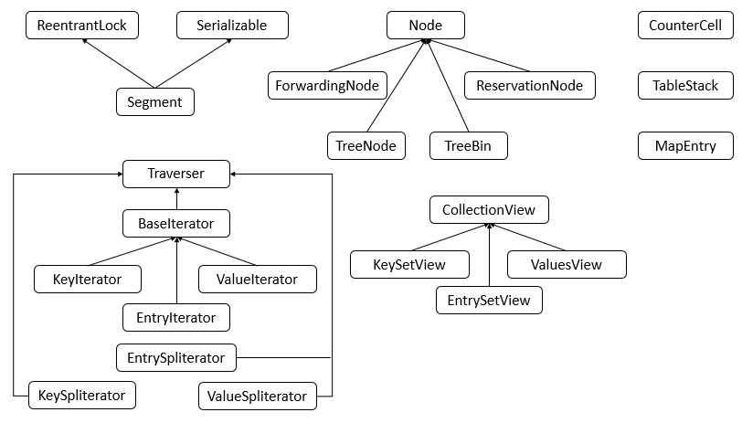

**JDK1.8中ConcurrentHashMap新增内部类**

下面对其中主要的内部类进行分析和讲解：

- **`Node：`**主要用于存储具体键值对，其子类有 `ForwardingNode`、`ReservationNode`、`TreeNode` 和 `TreeBin` 四个子类。四个子类具体的代码在之后的具体例子中进行分析讲解。
- **`Traverser：`**主要用于遍历操作，其子类有 `BaseIterator`、`KeySpliterator`、`ValueSpliterator`、`EntrySpliterator` 四个类，`BaseIterator` 用于遍历操作。`KeySplitertor`、`ValueSpliterator`、`EntrySpliterator` 则用于键、值、键值对的划分。
- **`CollectionView：`**是一个主要定义了视图操作的抽象类，其子类 `KeySetView`、`ValueSetView`、`EntrySetView` 分别表示键视图、值视图、键值对视图。对视图均可以进行操作。
- **`Segment：`**在 JDK1.8 中与之前的版本的 JDK 作用存在很大的差别，JDK 1.8 下，其在普通的 `ConcurrentHashMap` 操作中已经没有失效，其在序列化与反序列化的时候会发挥作用。
- **`CounterCell：`**主要用于对 `baseCount` 的计数。

#### 类中常量及字段

```java
public class ConcurrentHashMap<K, V> extends AbstractMap<K, V>
        implements ConcurrentMap<K, V>, Serializable {
    private static final long serialVersionUID = 7249069246763182397L;
    /** 表的最大容量 */
    private static final int MAXIMUM_CAPACITY = 1 << 30;
    /** 默认表的大小 */
    private static final int DEFAULT_CAPACITY = 16;
    /** 最大数组大小 */
    static final int MAX_ARRAY_SIZE = Integer.MAX_VALUE - 8;
    /** 默认并发数 */
    private static final int DEFAULT_CONCURRENCY_LEVEL = 16;
    /** 装载因子 */
    private static final float LOAD_FACTOR = 0.75f;
    /** 转化为红黑树的阈值 */
    static final int TREEIFY_THRESHOLD = 8;
    /** 由红黑树转化为链表的阈值 */
    static final int UNTREEIFY_THRESHOLD = 6;
    /** 转化为红黑树的表的最小容量 */
    static final int MIN_TREEIFY_CAPACITY = 64;
    /** 每次进行转移的最小值
    private static final int MIN_TRANSFER_STRIDE = 16;
    /** 生成sizeCtl所使用的bit位数 */
    private static int RESIZE_STAMP_BITS = 16;
    /** 进行扩容所允许的最大线程数 */
    private static final int MAX_RESIZERS = (1 << (32 - RESIZE_STAMP_BITS)) - 1;
    /** 记录sizeCtl中的大小所需要进行的偏移位数 */
    private static final int RESIZE_STAMP_SHIFT = 32 - RESIZE_STAMP_BITS;
    /** 一系列的标识 */
    static final int MOVED = -1; // hash for forwarding nodes
    static final int TREEBIN = -2; // hash for roots of trees
    static final int RESERVED = -3; // hash for transient reservations
    static final int HASH_BITS = 0x7fffffff; // usable bits of normal node hash
    /** 获取可用的CPU个数 */
    static final int NCPU = Runtime.getRuntime().availableProcessors();

    /** 进行序列化的属性 */
    private static final ObjectStreamField[] serialPersistentFields = {
            new ObjectStreamField("segments", Segment[].class),
            new ObjectStreamField("segmentMask", Integer.TYPE),
            new ObjectStreamField("segmentShift", Integer.TYPE)
    };

    /** 表 */
    transient volatile Node<K, V>[] table;
    /** 下一个表 */
    private transient volatile Node<K, V>[] nextTable;
    /** 基本计数 */
    private transient volatile long baseCount;
    /** 对表初始化和扩容控制 */
    private transient volatile int sizeCtl;
    /** 扩容下另一个表的索引 */
    private transient volatile int transferIndex;
    /** 旋转锁 */
    private transient volatile int cellsBusy;
    /** counterCell表 */
    private transient volatile CounterCell[] counterCells;

    // views
    private transient KeySetView<K, V> keySet;
    private transient ValuesView<K, V> values;
    private transient EntrySetView<K, V> entrySet;

    // Unsafe mechanics
    private static final sun.misc.Unsafe U;
    private static final long SIZECTL;
    private static final long TRANSFERINDEX;
    private static final long BASECOUNT;
    private static final long CELLSBUSY;
    private static final long CELLVALUE;
    private static final long ABASE;
    private static final int ASHIFT;

    static {
        try {
            U = sun.misc.Unsafe.getUnsafe();
            Class<?> k = ConcurrentHashMap.class;
            SIZECTL = U.objectFieldOffset
                    (k.getDeclaredField("sizeCtl"));
            TRANSFERINDEX = U.objectFieldOffset
                    (k.getDeclaredField("transferIndex"));
            BASECOUNT = U.objectFieldOffset
                    (k.getDeclaredField("baseCount"));
            CELLSBUSY = U.objectFieldOffset
                    (k.getDeclaredField("cellsBusy"));
            Class<?> ck = CounterCell.class;
            CELLVALUE = U.objectFieldOffset
                    (ck.getDeclaredField("value"));
            Class<?> ak = Node[].class;
            ABASE = U.arrayBaseOffset(ak);
            int scale = U.arrayIndexScale(ak);
            if ((scale & (scale - 1)) != 0)
                throw new Error("data type scale not a power of two");
            ASHIFT = 31 - Integer.numberOfLeadingZeros(scale);
        } catch (Exception e) {
            throw new Error(e);
        }
    }

}
```

> `ConcurrentHashMap` 的属性很多，其中不少属性在 `HashMap` 中就已经介绍过，而对于 `ConcurrentHashMap` 而言，添加了 `sun.misc.Unsafe` 实例，主要用于反射获取对象相应的字段。

### 初始化

```
// 这构造函数里，什么都不干
public ConcurrentHashMap() {
}
public ConcurrentHashMap(int initialCapacity) {
    if (initialCapacity < 0)
        throw new IllegalArgumentException();
    int cap = ((initialCapacity >= (MAXIMUM_CAPACITY >>> 1)) ?
               MAXIMUM_CAPACITY :
               tableSizeFor(initialCapacity + (initialCapacity >>> 1) + 1));
    this.sizeCtl = cap;
}
```

这个初始化方法有点意思，通过提供初始容量，计算了 sizeCtl，sizeCtl = 【 (1.5 * initialCapacity + 1)，然后向上取最近的 2 的 n 次方】。如 initialCapacity 为 10，那么得到 sizeCtl 为 16，如果 initialCapacity 为 11，得到 sizeCtl 为 32。

sizeCtl 这个属性使用的场景很多，不过只要跟着文章的思路来，就不会被它搞晕了。

如果你爱折腾，也可以看下另一个有三个参数的构造方法，这里我就不说了，大部分时候，我们会使用无参构造函数进行实例化，我们也按照这个思路来进行源码分析吧。

### put 源码分析

仔细地一行一行代码看下去：

```
public V put(K key, V value) {
    return putVal(key, value, false);
}
final V putVal(K key, V value, boolean onlyIfAbsent) {
    if (key == null || value == null) throw new NullPointerException();
    // 得到 hash 值
    int hash = spread(key.hashCode());
    // 用于记录相应链表的长度
    int binCount = 0;
    for (Node<K,V>[] tab = table;;) {
        Node<K,V> f; int n, i, fh;
        // 如果数组"空"，进行数组初始化
        if (tab == null || (n = tab.length) == 0)
            // 初始化数组，后面会详细介绍
            tab = initTable();
        
        // 找该 hash 值对应的数组下标，得到第一个节点 f
        else if ((f = tabAt(tab, i = (n - 1) & hash)) == null) {
            // 如果数组该位置为空，
            //    用一次 CAS 操作将这个新值放入其中即可，这个 put 操作差不多就结束了，可以拉到最后面了
            //    如果 CAS 失败，那就是有并发操作，进到下一个循环就好了
            if (casTabAt(tab, i, null,
                         new Node<K,V>(hash, key, value, null)))
                break;                   // no lock when adding to empty bin
        }
        // hash 居然可以等于 MOVED，这个需要到后面才能看明白，不过从名字上也能猜到，肯定是因为在扩容
        else if ((fh = f.hash) == MOVED)
            // 帮助数据迁移，这个等到看完数据迁移部分的介绍后，再理解这个就很简单了
            tab = helpTransfer(tab, f);
        
        else { // 到这里就是说，f 是该位置的头结点，而且不为空
            
            V oldVal = null;
            // 获取数组该位置的头结点的监视器锁
            synchronized (f) {
                if (tabAt(tab, i) == f) {
                    if (fh >= 0) { // 头结点的 hash 值大于 0，说明是链表
                        // 用于累加，记录链表的长度
                        binCount = 1;
                        // 遍历链表
                        for (Node<K,V> e = f;; ++binCount) {
                            K ek;
                            // 如果发现了"相等"的 key，判断是否要进行值覆盖，然后也就可以 break 了
                            if (e.hash == hash &&
                                ((ek = e.key) == key ||
                                 (ek != null && key.equals(ek)))) {
                                oldVal = e.val;
                                if (!onlyIfAbsent)
                                    e.val = value;
                                break;
                            }
                            // 到了链表的最末端，将这个新值放到链表的最后面
                            Node<K,V> pred = e;
                            if ((e = e.next) == null) {
                                pred.next = new Node<K,V>(hash, key,
                                                          value, null);
                                break;
                            }
                        }
                    }
                    else if (f instanceof TreeBin) { // 红黑树
                        Node<K,V> p;
                        binCount = 2;
                        // 调用红黑树的插值方法插入新节点
                        if ((p = ((TreeBin<K,V>)f).putTreeVal(hash, key,
                                                       value)) != null) {
                            oldVal = p.val;
                            if (!onlyIfAbsent)
                                p.val = value;
                        }
                    }
                }
            }

            if (binCount != 0) {
                // 判断是否要将链表转换为红黑树，临界值和 HashMap 一样，也是 8
                if (binCount >= TREEIFY_THRESHOLD)
                    // 这个方法和 HashMap 中稍微有一点点不同，那就是它不是一定会进行红黑树转换，
                    // 如果当前数组的长度小于 64，那么会选择进行数组扩容，而不是转换为红黑树
                    //    具体源码我们就不看了，扩容部分后面说
                    treeifyBin(tab, i);
                if (oldVal != null)
                    return oldVal;
                break;
            }
        }
    }
    // 
    addCount(1L, binCount);
    return null;
}
```

put 的主流程看完了，但是至少留下了几个问题，第一个是初始化，第二个是扩容，第三个是帮助数据迁移，这些我们都会在后面进行一一介绍。

#### 初始化数组：initTable

这个比较简单，主要就是初始化一个**合适大小**的数组，然后会设置 sizeCtl。

初始化方法中的并发问题是通过对 sizeCtl 进行一个 CAS 操作来控制的。

```
private final Node<K,V>[] initTable() {
    Node<K,V>[] tab; int sc;
    while ((tab = table) == null || tab.length == 0) {
        // 初始化的"功劳"被其他线程"抢去"了
        if ((sc = sizeCtl) < 0)
            Thread.yield(); // lost initialization race; just spin
        // CAS 一下，将 sizeCtl 设置为 -1，代表抢到了锁
        else if (U.compareAndSwapInt(this, SIZECTL, sc, -1)) {
            try {
                if ((tab = table) == null || tab.length == 0) {
                    // DEFAULT_CAPACITY 默认初始容量是 16
                    int n = (sc > 0) ? sc : DEFAULT_CAPACITY;
                    // 初始化数组，长度为 16 或初始化时提供的长度
                    Node<K,V>[] nt = (Node<K,V>[])new Node<?,?>[n];
                    // 将这个数组赋值给 table，table 是 volatile 的
                    table = tab = nt;
                    // 如果 n 为 16 的话，那么这里 sc = 12
                    // 其实就是 0.75 * n
                    sc = n - (n >>> 2);
                }
            } finally {
                // 设置 sizeCtl 为 sc，我们就当是 12 吧
                sizeCtl = sc;
            }
            break;
        }
    }
    return tab;
}
```

#### 链表转红黑树: treeifyBin

前面我们在 put 源码分析也说过，treeifyBin 不一定就会进行红黑树转换，也可能是仅仅做数组扩容。我们还是进行源码分析吧。

```
private final void treeifyBin(Node<K,V>[] tab, int index) {
    Node<K,V> b; int n, sc;
    if (tab != null) {
        // MIN_TREEIFY_CAPACITY 为 64
        // 所以，如果数组长度小于 64 的时候，其实也就是 32 或者 16 或者更小的时候，会进行数组扩容
        if ((n = tab.length) < MIN_TREEIFY_CAPACITY)
            // 后面我们再详细分析这个方法
            tryPresize(n << 1);
        // b 是头结点
        else if ((b = tabAt(tab, index)) != null && b.hash >= 0) {
            // 加锁
            synchronized (b) {
            
                if (tabAt(tab, index) == b) {
                    // 下面就是遍历链表，建立一颗红黑树
                    TreeNode<K,V> hd = null, tl = null;
                    for (Node<K,V> e = b; e != null; e = e.next) {
                        TreeNode<K,V> p =
                            new TreeNode<K,V>(e.hash, e.key, e.val,
                                              null, null);
                        if ((p.prev = tl) == null)
                            hd = p;
                        else
                            tl.next = p;
                        tl = p;
                    }
                    // 将红黑树设置到数组相应位置中
                    setTabAt(tab, index, new TreeBin<K,V>(hd));
                }
            }
        }
    }
}
```

### Put 流程分析

ConcurrentHashMap的数据结构与HashMap差不多，都是Node数组+红黑树+链表；ConcurrentHashMap中table的节点类型有 3 类：

- Node节点，是链表类型的节点；这类节点hash 大于 0 ；
- 在扩容时ConcurrentHashMap会有一个特殊的标志对象：ForwardingNode；hash值： MOVE(-1)
- 在生成红黑树时，会生成一个TreeBin对象放在table中；hash值：TREEBIN（-2）
  因此在put值时，会根据table中node的hash判断节点的类型；

- hash>=0，Node是链表类型的节点；
- hash=-2，是TreeBin,表示该table元素是红黑树的节点；
- hash=-1，是ForwardingNode；容器正在扩容
- hash = -3，是ReservationNode，在调用computeIfAbsent方法时可能会使用的占位对象

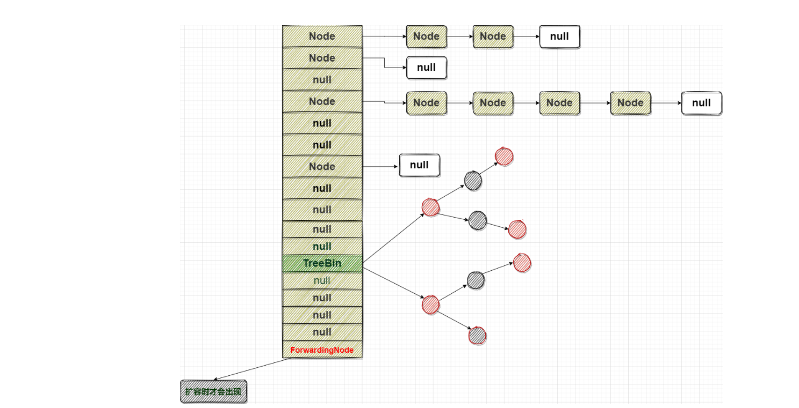

**ConcurrentHashMap和HashMap的put值过程有些类似，ConcurrentHashMap的结构也是table + 链表+ 红黑树；在put值时，锁粒度是table的元素；也就是说，当put值时定位到table的第 i 个元素，那么就会给table[i]上锁；**

其他线程在put值时也定位到 i 时就需要等待获取锁；如果是其他位置则不需要等待锁，可以进行put操作。

#### 1. 计算hash值

ConcurrentHashMap在put值的时候会计算key的hash值，和HashMap类似；在ConcurrentHashMap计算hash值的是spread方法

- 获取key的hashcode
- <u>利用hashcode的高16位与低16位做" ^ "位运算，让高位也参与位运算，增加离散型</u>
- 再与HASH_BITS位运算，这是int最大正整数:最高位为0，其余位置为1，用来与hash值做 " & "运算；得到的结果保证最高位为0，其余位置不变；这样就保证得到的hash值是一个非负数，举个例子：

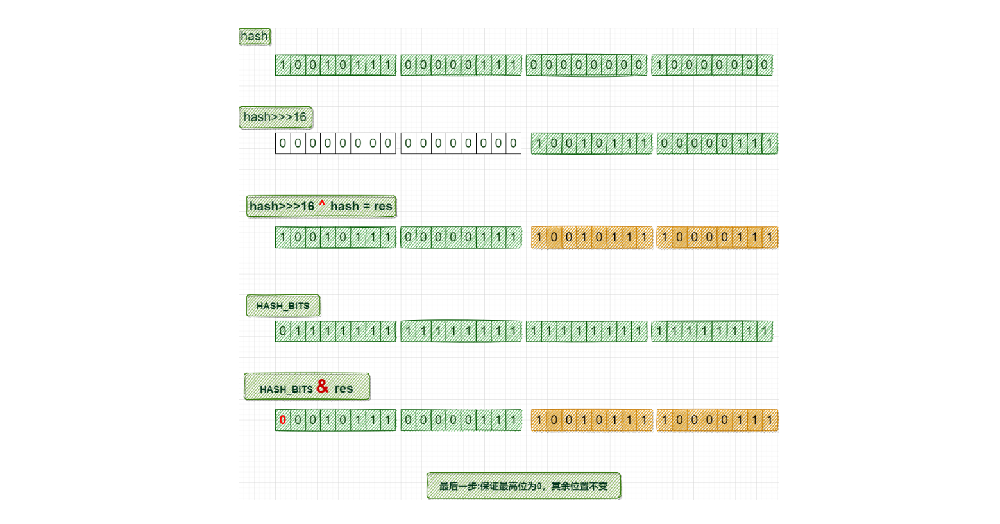

#### 2. initTable

在put值时有几个判断，与HashMap类似

- <u>判断table是否已经初始化了；如果是没有初始化，就会先初始化table，再往table中添加值；</u>
- <u>根据hash值，计算出key-value在table的位置i，判断table[i]是否已经插入了值；如果没有插入值，就将该key-value插入到table[i]中；</u>
- <u>判断table[i]的hash值是否是MOVE,如果是MOVE表示正在扩容(ForwardingNode的hash值就是MOVE)，需要该线程帮忙将旧容器的值移动到新容器中</u>
- <u>将key-value插入到链表或者红黑树中</u>
- <u>判断是否需要扩容</u>

##### 1) 初始化table

因为是多线程环境，就需要考虑到如果有多个线程同时初始化table的情况；假如现在有三个线程：A、B、C 同时判断到table == null。这个时候三个线程都会同时试图来初始化table，如果一个线程抢先修改了 sizeCtl，

他就可以初始化table，其余线程只需要等待初始化完成即可；

- 1、sizeCtl判断是否已经有线程初始化table，如果sizeCtl=-1，表示已经有线程对table初始化；这个时候会调用yield()让出cpu执行权
- 2、通过CAS修改sizeCtl=-1，初始化table

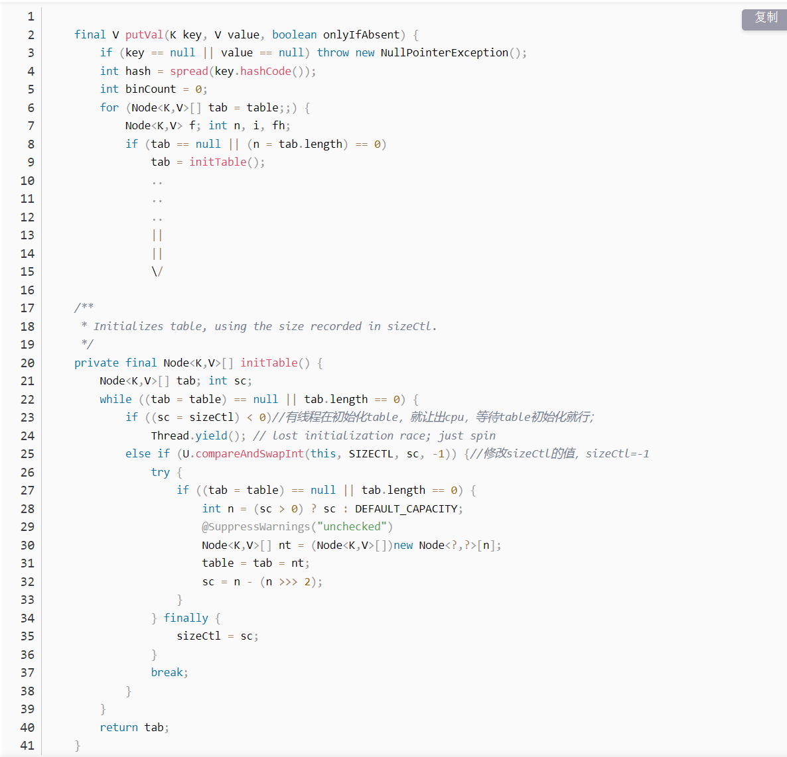

这段代码，有意思的是进入到初始化table的分支时 try{} finally{} 代码块还要判断 table==null，为什么呢 ？

> 可能是对应这样一个场景：现在有 A ，B，C三个线程都判断table=null进入到initTable，A，B线程先获取到sizeCtl =0，此时A抢先修改到sizeCtl =-1开始初始化，而B线程修改失败，再次通过循环获取sizeCtl =-1，调用yield()放弃cpu执行权，等待A线程初始化table；A线程初始化完成之后修改sizeCtl 的值，修改后的sizeCtl >0；
>
>
> 而C线程比A，B线程慢一点，当C线程获取到sizeCtl的值时，A线程已经完成了table的初始化sizeCtl >0，C线程获取到的sc=sizeCtl >0,因此不会进入到休眠状态，会尝试修改sizeCtl 的值，这个时候没有其他线程竞争修改值，因此会修改成功；又会将sizeCtl 的值修改为 -1 ，【此时：sc=A线程初始化之后sizeCtl 的值；sizeCtl =-1】
>
>
> 进入到try代码块，判断table!=null,不会再重新初始化table，进入finally块，sizeCtl =sc；将sizeCtl 的值还原到A线程初始化时候的值；添加的table=null的判断保证了只会有一个线程能初始化table；

流程：

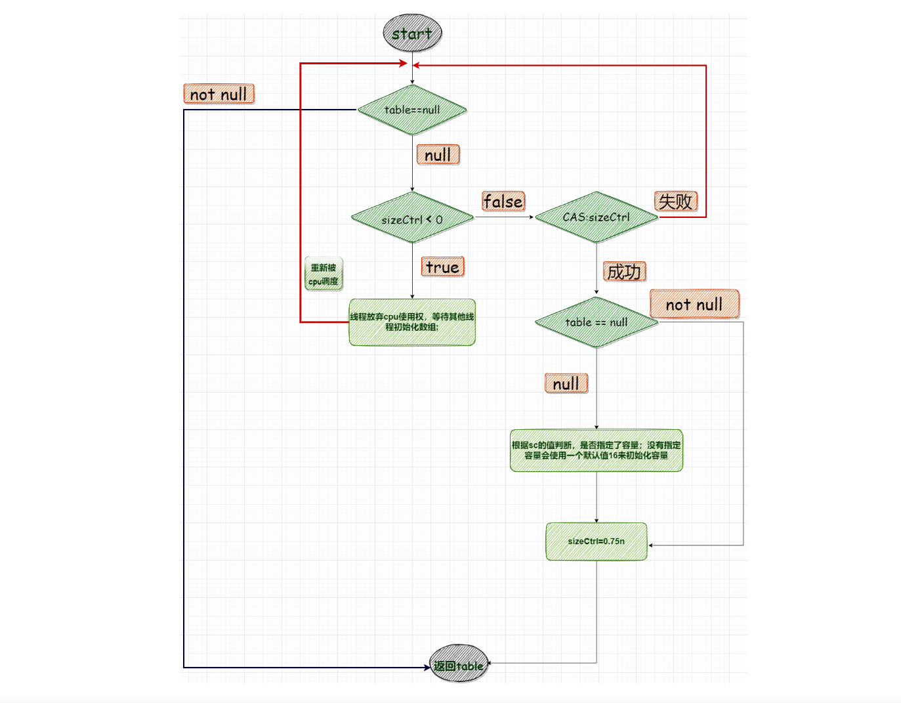

#### 3.通过hash值定位key-value位置

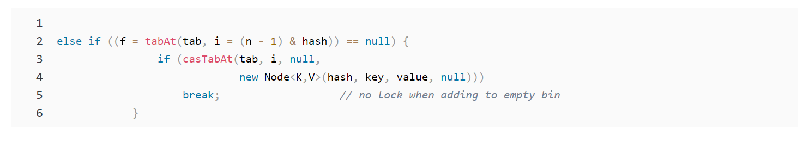

这个分支其实就是判断table[i] = null，就将key-value值包装程成Node对象，放到table[i]中即可；

- i = (n - 1) & hash；与HashMap一样，定位存储下标，因为使用了 & 运算，因此要求table的容量n一定是2的幂次倍；
- casTabAt（）将hash-key-value包装成node添加到table中，添加成功：返回true，进入分支break，结束put操作；不成功：进入下一次循环，继续put操作直到成功为止；

#### 4. 判断ConcurrentHashMap是否正在扩容

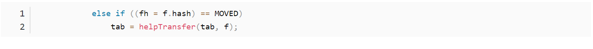

在上一个分支，如果table[i] != null,就会在接下来的分支中，首先通过node节点的hash值判断，table是否处于扩容状态，如果是扩容状态: hash == MOVE;
当判定在扩容时，会要求这个线程帮忙完成扩容:

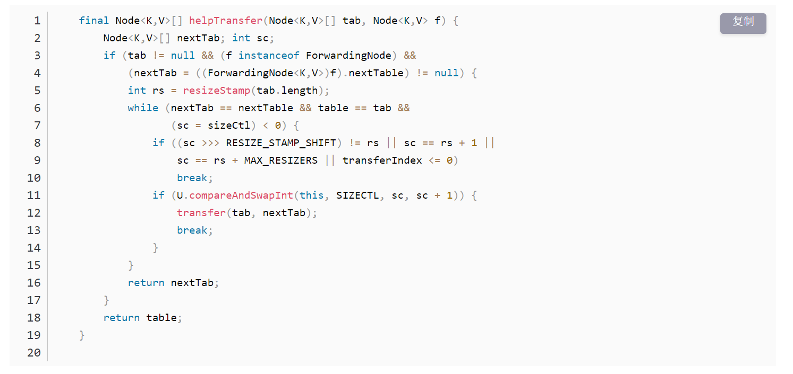

扩容暂时在这里不分析，在后面会讲到；因为扩容是添加node导致，在添加元素之后会判断是否需要扩容；在前面提到过，在扩容时会产生：ForwardingNode；它的hash值就是MOVE(-1)；由于扩容实在太复杂，

并且扩容的原因并不在这里；扩容触发条件是添加node之后size到达扩容阈值触发扩容；因此把扩容的部分放在最后；

#### 5. 判断节点的类型，并添加节点

判断节点类型，并添加值：

- 如果是链表，就将值打包成Node，添加到链表中；
- 如果是红黑树，就将值打包成TreeNode添加到红黑树中
  这个过程和 HashMap一样；唯一的区别是，在多线程环境下，在确定table的下标之后，会获取table[i]对象的锁，只能有一个线程在table[i]所在的链表或者红黑树put值；其他线程要在table[i]中put值需要等待获取锁；

```kotlin
// f = tabAt(tab, i = (n - 1) & hash)
 
        else {
            V oldVal = null;
            synchronized (f) {//获取table[i]的对象锁
                if (tabAt(tab, i) == f) {//判断是否被修改
                    if (fh >= 0) {//根据node的hash值判断是链表还是红黑树
                        binCount = 1;
                        for (Node<K,V> e = f;; ++binCount) {
                            K ek;
                           // 已经存在key，更新val，返回旧value
                            if (e.hash == hash &&
                                ((ek = e.key) == key ||
                                 (ek != null && key.equals(ek)))) {
                                oldVal = e.val;
                                if (!onlyIfAbsent)
                                    e.val = value;
                                break;
                            }
                            Node<K,V> pred = e;
                       // key在链表中不存在，将key-value打包成Node插入到链表表尾
                            if ((e = e.next) == null) {
                                pred.next = new Node<K,V>(hash, key,
                                                          value, null);
                                break;
                            }
                        }
                    }
                    else if (f instanceof TreeBin) {//红黑树
                        Node<K,V> p;
                        binCount = 2;
                        if ((p = ((TreeBin<K,V>)f).putTreeVal(hash, key,
                                                       value)) != null) {
                            oldVal = p.val;//p !=null ,说明在红黑树中已经存在key，只是更新了value；
                            if (!onlyIfAbsent)
                                p.val = value;
                        }
                    }
                }
            }
            if (binCount != 0) {
                if (binCount >= TREEIFY_THRESHOLD)
                    treeifyBin(tab, i);
                if (oldVal != null)
                    return oldVal;
                break;
            }
        }
    }
```

为了更好的看清上面代码的整体逻辑，去掉部分代码，留下一个大的框架：

```java
  //当有一个线程 ： A ，锁定table[i]时，其余线程如果也是锁定这个位置，就必须等A线程，put完成之后；
  //获取到table[i]的锁，才能在这个位置put值；
  synchronized (f) {
  //判断节点没有变动；如果变动了，就计入下一次循环；
  //f发生改变的几种情况：
  //1:有可能链表变成红黑树，
  //2:可能容器在扩容；
  //3:如果其他线程在之前进行了remove操作，导致f被删除，这种情况也不能直接put；
  //还有一种情况：就是key-value的值被修改，这种情况对下一个线程put值没有影响；
  //因此可以看到在很多地方，对节点进行操作前，都会先判断节点有没有改变；
   if (tabAt(tab, i) == f) {
    if(fh>=0){
     binCount=1;
     链表，会将新node添加到链表末尾，在这个过程中binCount会记录链表的长度，用来判断是否需要将链表修改为红黑树；
     还有一种情况是这个key已经存在，就直接更新value；
    }else if(f instanceof TreeBin){
     binCount=2;
     红黑树，这里的binCount就是只用来表示该线程抢到锁，已经put值了；
    }
   }
  }
 //说明已经添加了node；binCount=0是因为线程没有put值,
 //f已经被其他线程删除，或者是正在扩容，或者是由链表改成了红黑树。。
   if (binCount != 0) {
                if (binCount >= TREEIFY_THRESHOLD)//这里是用来判断链表需不需要改成红黑树;
                    treeifyBin(tab, i);
                if (oldVal != null)//key已经存在了，会将value更新；并返回旧值oldValue
                    return oldVal;
                break;
            }
```

#### 6. 表转换成红黑树

可以看到链表转换成红黑树是由treeifyBin方法中进行的；treeifyBin的流程：

- 判断table长度;如果len < 64,就将容器扩大2倍；
- len>=64;先将Node链表 -> TreeNode双向链表;再生成一个TreeBin对象放在table中；TreeBin的hash=-2；TreeBin的构造方法中将：链表 -> 红黑树；并且这个TreeBin对象包含链表转换前的头节点，以及转换后红黑树的根节点；

#### 7. ConcurrentHashMap多线程计数原理

先说下多线程计数的原理吧，这里没有直接使用CAS来更新size的值；是为什么呢 ？
先来看下使用直接使用CAS有什么利弊 ？

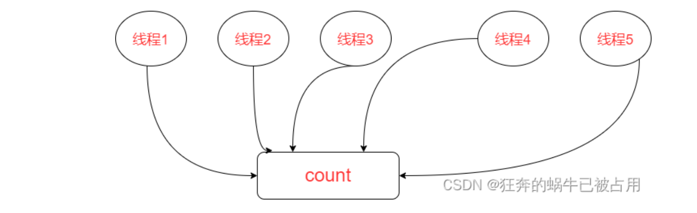

在多线程环境下，直接使用单一变量用CAS更新size虽然可以保证数据的正确性，但是效率不高；如果线程竞争比较激烈多个线程同时更改size，就需要多个线程排队更改值；可以看到并发特别高的话，这样的做法效率就不高了，会让其他线程消耗cpu做空循环，占用了cpu又没做事；
因此，ConcurrentHashMap采用了另一种高效的做法；设计了一种数据结构：基础值 + 数组；

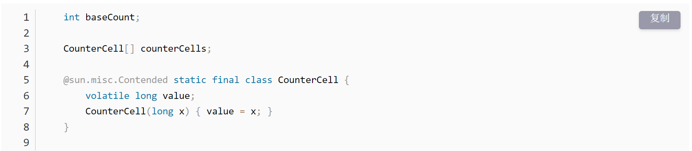

如果是多个线程同时put值需要更新size，进入到addCount中；这个时候仍然会先使用CAS更新baseCount，但是只有一个线程能更新成功；其余线程会分别将值更新到counterCells，如下图：

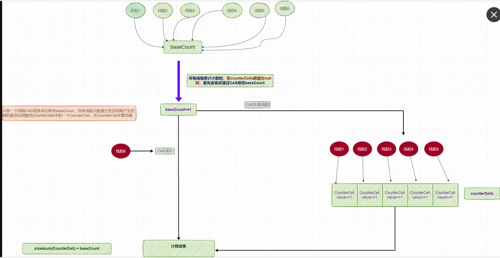

这就是ConcurrentHashMap在多线程环境下更新size的方法；相比直接使用CAS对一个变量更新，这种方法显然更高效；

ConcurrentHashMap的更新size的大体原理就是这样,但细节处有所不同；CounterCells数组是一个懒加载，也就是说，没有多个线程同时竞争修改baseCount时，不会生成CounterCells数组，直接用CAS修改baseCount；当有多个线程竞争修改baseCount时才会生成CounterCells数组，每个线程在各自的CounterCell中计数互不干扰；

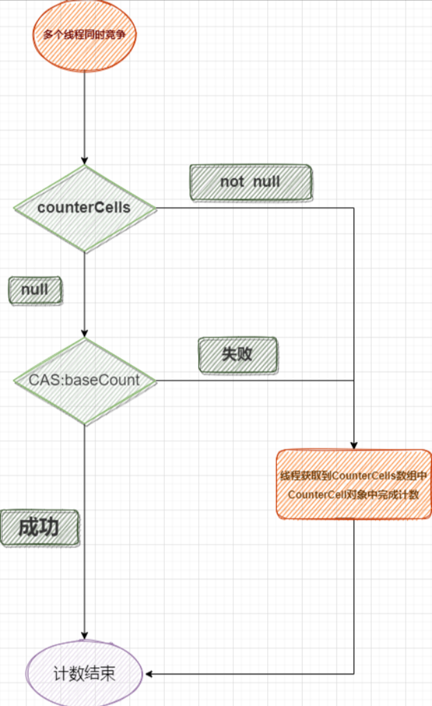

这里说明一下，即使生成了CounterCells数组，也不会立即将CounterCells数组中所有元素都初始化一个CounterCell对象；ConcurrentHashMap的设计突出一个懒加载，生成数组时的策略是这样，生成在CounterCell对象时也是需要用到时才生成CounterCell对象用于处理线程的计数；

#### 8.addCount的计数部分

addCount源码：

```java
   private final void addCount(long x, int check) {
        CounterCell[] as; long b, s;//b=baseCount,s = size;
        /**
  case 0:
    如果生成了counterCells数组，就直接通过线程定位到cell，在其中累加值;
        case 1:
          如果counterCells没有初始化(没有生成counterCells数组)就通过CAS更新baseCount的值;
        case 2:   
          counterCells==null && 更新baseCount的值失败;  一定有其他线程同时竞争更改baseCount的值，这个时候会生成
          counterCells数组；让更新失败的线程，在counterCells数组中更新累加;
        
        **/
        if ((as = counterCells) != null ||
            !U.compareAndSwapLong(this, BASECOUNT, b = baseCount, s = b + x)) {
            CounterCell a; long v; int m;
            boolean uncontended = true;
            /**
   1.as == null || (m = as.length - 1) < 0  ===> counterCells还没有初始化，说明是通过CAS更改baseCount失败从而进入
    到该分支，这个时候会进入到fullAddCount中具体操作；
   2. (a = as[ThreadLocalRandom.getProbe() & m]) == null ; 
    说明已经初始化了counterCells；
    【ThreadLocalRandom.getProbe() & m】通过线程私有的Random随机数生成器生成的随机数来确定处理线程的CounterCell;
    最后得到的处理对象：a==null，说明counterCells[i]==null没有对象；进入fullAddCount中累加;  
   3. 如果a != null,则用CAS来修改CounterCell中value的值；如果CAS修改失败，进入fullAddCount中处理；
     
   **/
            if (as == null || (m = as.length - 1) < 0 ||
                (a = as[ThreadLocalRandom.getProbe() & m]) == null ||
                !(uncontended =
                  U.compareAndSwapLong(a, CELLVALUE, v = a.value, v + x))) {
                fullAddCount(x, uncontended);
                return;
            }
            if (check <= 1)
                return;
            s = sumCount();
        }
*******************************************************************************************
    //扩容部分暂且省略。  
    }
```

流程图：

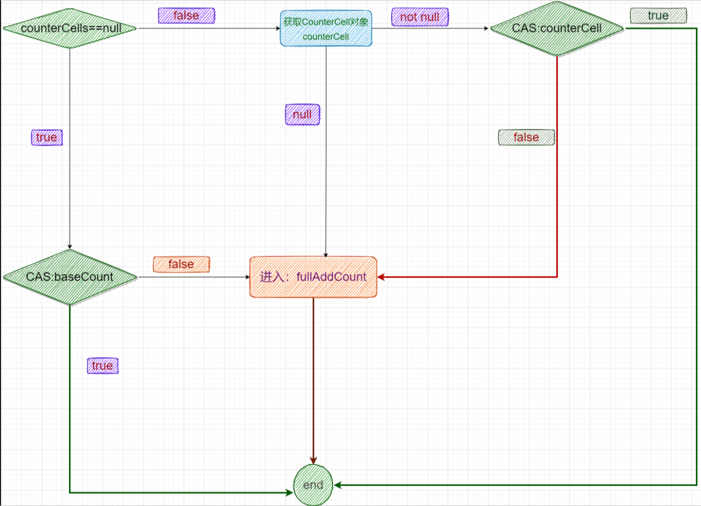

#### 9.多线程计数的核心fullAddCount

上图中可以看到，fullAddCount是核心方法，很多分支都会经过这个方法；关于cunterCells数组的初始化，扩容，以及cunterCell计数都在这里面；在看fullAddCount方法之前简单介绍fullAddCount处理的流程：

- 判断counterCells数组是否为空
  - counterCells为空，初始化counterCells数组；并生成CounterCell对象用于计数；
  - counterCells不为空，获取到CounterCell对象计数；如果对象为空，new一个对象来处理；如果计数失败，说明有多个线程在使用同一个CounterCell对象计数；这个时候将会扩容counterCells数组；（扩容长度最大到cpu的个数不再扩容）扩容之后再定位处理线程的计数；

下图是fullAddCount简易流程图：

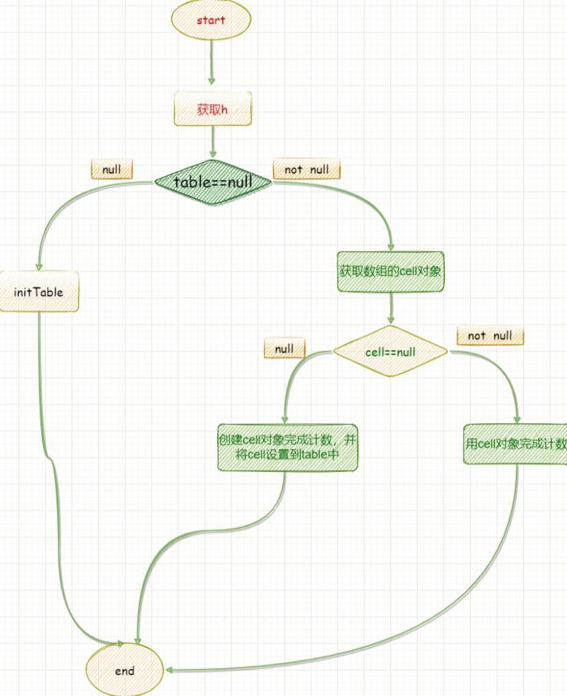

保留代码整体框架，省略掉部分代码：

```java
   private final void fullAddCount(long x, boolean wasUncontended) {
        int h;
        //每一个线程都可以通过ThreadLocalRandom，生成一个随机数，用来确定数组下标；
        if ((h = ThreadLocalRandom.getProbe()) == 0) {
            ThreadLocalRandom.localInit();      // force initialization
            h = ThreadLocalRandom.getProbe();
            wasUncontended = true;
        }
                   
        for (;;) {
            CounterCell[] as; CounterCell a; int n; long v;
            if ((as = counterCells) != null && (n = as.length) > 0) {
             数组非空的处理逻辑；

            }
            /**
   *
   *初始化counterCells数组
   *和initTable差不多，通过一个标志cellsBusy 的状态 来确定，有没有 线程初始化counterCells 数组
   *
   **/
            else if (cellsBusy == 0 && counterCells == as &&
                     U.compareAndSwapInt(this, CELLSBUSY, 0, 1)) {
                boolean init = false;
                try {                           // Initialize table
                    if (counterCells == as) {//判断是否已经初始化，因为cellsBusy 的状态会还原到0；
                        CounterCell[] rs = new CounterCell[2];//length = 2，从2开始。每次扩容都增加一倍；
                        rs[h & 1] = new CounterCell(x);// h & (n-1) = h & 1;定位下标；new对象累加值；
                        counterCells = rs;
                        init = true;
                    }
                } finally {
                    cellsBusy = 0;//状态还原
                }
                if (init)
                    break;
            }
            //当多个线程同时初始化counterCells 时，通过CAS竞争只有一个线程成功获取到初始化的权力，初始化数组；
            //其余没有初始化数组的线程进入这个分支，尝试更新baseCount;没有成功进入下一次循环继续尝试累加。
            else if (U.compareAndSwapLong(this, BASECOUNT, v = baseCount, v + x))
                break;                          // Fall back on using base
        }
    }
```

counterCells 数组非空时处理过程的简易流程图：

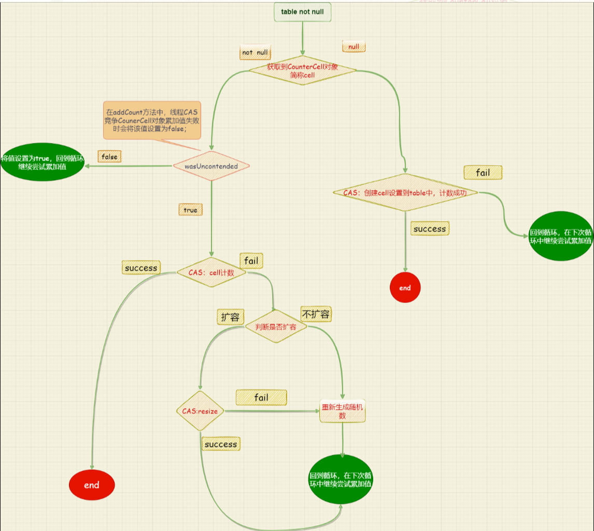

#### 10.fullAddCount简略流程图

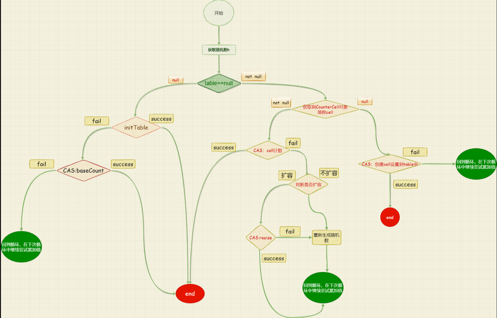

##### 为什么在线程在使用CounterCell对象计数时还是要使用CAS来更新值呢

原因有以下2点：

- 在counterCells数组长度大于并发线程个数时：两个线程生成的随机数h不同，但是有可能定位到数组的同一个下标；这个时候如果两个线程同时进入到fullAddCount更新size就会产生冲突；这个情况下，要判断数组长度是否小于cpu个数；如果小于cpu个数首先尝试扩容；扩容失败时，线程会重新产生一个随机数，来获取一个新的下标解决冲突问题；
- 在counterCells数组长度小于并发线程个数时；必然造成多个线程同时使用一个CounterCell；会通过扩容来解决冲突；（这种情况，必定是数组长度小于cpu个数）

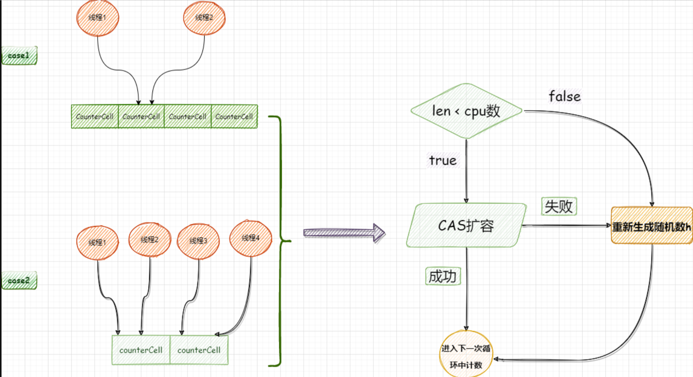

#### 11.ConcurrentHashMap获取size

ConcurrentHashMap不是直接通过获取一个变量来获取size的；因为记录的方法：维护一个变量 baseCount + CounterCell数组；因此在获取size时，需要将counterCells数组中value的值累加，再加上 baseCount。获取size的方法源码：

```java
      public int size() {
          long n = sumCount();
          return ((n < 0L) ? 0 :
                  (n > (long)Integer.MAX_VALUE) ? Integer.MAX_VALUE :
                  (int)n);//size超过int类型的范围，返回Integer.MAX_VALUE；没超过：long -> int;返回原值
                  
      }

      final long sumCount() {
          CounterCell[] as = counterCells; CounterCell a;
          long sum = baseCount;
          if (as != null) {//counterCells数组不为空，就累加counterCells数组的每一个CounterCell对象中value值；
              for (int i = 0; i < as.length; ++i) {
                  if ((a = as[i]) != null)
                      sum += a.value;
              }
          }
          return sum;
      }
```

### 扩容：tryPresize

如果说 Java8 ConcurrentHashMap 的源码不简单，那么说的就是扩容操作和迁移操作。

这个方法要完完全全看懂还需要看之后的 transfer 方法，读者应该提前知道这点。

这里的扩容也是做翻倍扩容的，扩容后数组容量为原来的 2 倍。

```java
// 首先要说明的是，方法参数 size 传进来的时候就已经翻了倍了
private final void tryPresize(int size) {
    // c：size 的 1.5 倍，再加 1，再往上取最近的 2 的 n 次方。
    int c = (size >= (MAXIMUM_CAPACITY >>> 1)) ? MAXIMUM_CAPACITY :
        tableSizeFor(size + (size >>> 1) + 1);
    int sc;
    while ((sc = sizeCtl) >= 0) {
        Node<K,V>[] tab = table; int n;
        
        // 这个 if 分支和之前说的初始化数组的代码基本上是一样的，在这里，我们可以不用管这块代码
        if (tab == null || (n = tab.length) == 0) {
            n = (sc > c) ? sc : c;
            if (U.compareAndSwapInt(this, SIZECTL, sc, -1)) {
                try {
                    if (table == tab) {
                        @SuppressWarnings("unchecked")
                        Node<K,V>[] nt = (Node<K,V>[])new Node<?,?>[n];
                        table = nt;
                        sc = n - (n >>> 2); // 0.75 * n
                    }
                } finally {
                    sizeCtl = sc;
                }
            }
        }
        else if (c <= sc || n >= MAXIMUM_CAPACITY)
            break;
        else if (tab == table) {
            // 我没看懂 rs 的真正含义是什么，不过也关系不大
            int rs = resizeStamp(n);
            
            if (sc < 0) {
                Node<K,V>[] nt;
                if ((sc >>> RESIZE_STAMP_SHIFT) != rs || sc == rs + 1 ||
                    sc == rs + MAX_RESIZERS || (nt = nextTable) == null ||
                    transferIndex <= 0)
                    break;
                // 2. 用 CAS 将 sizeCtl 加 1，然后执行 transfer 方法
                //    此时 nextTab 不为 null
                if (U.compareAndSwapInt(this, SIZECTL, sc, sc + 1))
                    transfer(tab, nt);
            }
            // 1. 将 sizeCtl 设置为 (rs << RESIZE_STAMP_SHIFT) + 2)
            //     我是没看懂这个值真正的意义是什么？不过可以计算出来的是，结果是一个比较大的负数
            //  调用 transfer 方法，此时 nextTab 参数为 null
            else if (U.compareAndSwapInt(this, SIZECTL, sc,
                                         (rs << RESIZE_STAMP_SHIFT) + 2))
                transfer(tab, null);
        }
    }
}
```

这个方法的核心在于 sizeCtl 值的操作，首先将其设置为一个负数，然后执行 transfer(tab, null)，再下一个循环将 sizeCtl 加 1，并执行 transfer(tab, nt)，之后可能是继续 sizeCtl 加 1，并执行 transfer(tab, nt)。

所以，可能的操作就是执行 **1 次 transfer(tab, null) + 多次 transfer(tab, nt)**，这里怎么结束循环的需要看完 transfer 源码才清楚。

#### 数据迁移：transfer

下面这个方法有点长，将原来的 tab 数组的元素迁移到新的 nextTab 数组中。

虽然我们之前说的 tryPresize 方法中多次调用 transfer 不涉及多线程，但是这个 transfer 方法可以在其他地方被调用，典型地，我们之前在说 put 方法的时候就说过了，请往上看 put 方法，是不是有个地方调用了 helpTransfer 方法，helpTransfer 方法会调用 transfer 方法的。

此方法支持多线程执行，外围调用此方法的时候，会保证第一个发起数据迁移的线程，nextTab 参数为 null，之后再调用此方法的时候，nextTab 不会为 null。

阅读源码之前，先要理解并发操作的机制。原数组长度为 n，所以我们有 n 个迁移任务，让每个线程每次负责一个小任务是最简单的，每做完一个任务再检测是否有其他没做完的任务，帮助迁移就可以了，而 Doug Lea 使用了一个 stride，简单理解就是**步长**，每个线程每次负责迁移其中的一部分，如每次迁移 16 个小任务。所以，我们就需要一个全局的调度者来安排哪个线程执行哪几个任务，这个就是属性 transferIndex 的作用。

第一个发起数据迁移的线程会将 transferIndex 指向原数组最后的位置，然后**从后往前**的 stride 个任务属于第一个线程，然后将 transferIndex 指向新的位置，再往前的 stride 个任务属于第二个线程，依此类推。当然，这里说的第二个线程不是真的一定指代了第二个线程，也可以是同一个线程，这个读者应该能理解吧。其实就是将一个大的迁移任务分为了一个个任务包。

```java
private final void transfer(Node<K,V>[] tab, Node<K,V>[] nextTab) {
    int n = tab.length, stride;
    
    // stride 在单核下直接等于 n，多核模式下为 (n>>>3)/NCPU，最小值是 16
    // stride 可以理解为”步长“，有 n 个位置是需要进行迁移的，
    //   将这 n 个任务分为多个任务包，每个任务包有 stride 个任务
    if ((stride = (NCPU > 1) ? (n >>> 3) / NCPU : n) < MIN_TRANSFER_STRIDE)
        stride = MIN_TRANSFER_STRIDE; // subdivide range

    // 如果 nextTab 为 null，先进行一次初始化
    //    前面我们说了，外围会保证第一个发起迁移的线程调用此方法时，参数 nextTab 为 null
    //    之后参与迁移的线程调用此方法时，nextTab 不会为 null
    if (nextTab == null) {
        try {
            // 容量翻倍
            Node<K,V>[] nt = (Node<K,V>[])new Node<?,?>[n << 1];
            nextTab = nt;
        } catch (Throwable ex) {      // try to cope with OOME
            sizeCtl = Integer.MAX_VALUE;
            return;
        }
        // nextTable 是 ConcurrentHashMap 中的属性
        nextTable = nextTab;
        // transferIndex 也是 ConcurrentHashMap 的属性，用于控制迁移的位置
        transferIndex = n;
    }
    
    int nextn = nextTab.length;
    
    // ForwardingNode 翻译过来就是正在被迁移的 Node
    // 这个构造方法会生成一个Node，key、value 和 next 都为 null，关键是 hash 为 MOVED
    // 后面我们会看到，原数组中位置 i 处的节点完成迁移工作后，
    //    就会将位置 i 处设置为这个 ForwardingNode，用来告诉其他线程该位置已经处理过了
    //    所以它其实相当于是一个标志。
    ForwardingNode<K,V> fwd = new ForwardingNode<K,V>(nextTab);
    

    // advance 指的是做完了一个位置的迁移工作，可以准备做下一个位置的了
    boolean advance = true;
    boolean finishing = false; // to ensure sweep before committing nextTab
    
    /*
     * 下面这个 for 循环，最难理解的在前面，而要看懂它们，应该先看懂后面的，然后再倒回来看
     * 
     */
    
    // i 是位置索引，bound 是边界，注意是从后往前
    for (int i = 0, bound = 0;;) {
        Node<K,V> f; int fh;
        
        // 下面这个 while 真的是不好理解
        // advance 为 true 表示可以进行下一个位置的迁移了
        //   简单理解结局：i 指向了 transferIndex，bound 指向了 transferIndex-stride
        while (advance) {
            int nextIndex, nextBound;
            if (--i >= bound || finishing)
                advance = false;
            
            // 将 transferIndex 值赋给 nextIndex
            // 这里 transferIndex 一旦小于等于 0，说明原数组的所有位置都有相应的线程去处理了
            else if ((nextIndex = transferIndex) <= 0) {
                i = -1;
                advance = false;
            }
            else if (U.compareAndSwapInt
                     (this, TRANSFERINDEX, nextIndex,
                      nextBound = (nextIndex > stride ?
                                   nextIndex - stride : 0))) {
                // 看括号中的代码，nextBound 是这次迁移任务的边界，注意，是从后往前
                bound = nextBound;
                i = nextIndex - 1;
                advance = false;
            }
        }
        if (i < 0 || i >= n || i + n >= nextn) {
            int sc;
            if (finishing) {
                // 所有的迁移操作已经完成
                nextTable = null;
                // 将新的 nextTab 赋值给 table 属性，完成迁移
                table = nextTab;
                // 重新计算 sizeCtl：n 是原数组长度，所以 sizeCtl 得出的值将是新数组长度的 0.75 倍
                sizeCtl = (n << 1) - (n >>> 1);
                return;
            }
            
            // 之前我们说过，sizeCtl 在迁移前会设置为 (rs << RESIZE_STAMP_SHIFT) + 2
            // 然后，每有一个线程参与迁移就会将 sizeCtl 加 1，
            // 这里使用 CAS 操作对 sizeCtl 进行减 1，代表做完了属于自己的任务
            if (U.compareAndSwapInt(this, SIZECTL, sc = sizeCtl, sc - 1)) {
                // 任务结束，方法退出
                if ((sc - 2) != resizeStamp(n) << RESIZE_STAMP_SHIFT)
                    return;
                
                // 到这里，说明 (sc - 2) == resizeStamp(n) << RESIZE_STAMP_SHIFT，
                // 也就是说，所有的迁移任务都做完了，也就会进入到上面的 if(finishing){} 分支了
                finishing = advance = true;
                i = n; // recheck before commit
            }
        }
        // 如果位置 i 处是空的，没有任何节点，那么放入刚刚初始化的 ForwardingNode ”空节点“
        else if ((f = tabAt(tab, i)) == null)
            advance = casTabAt(tab, i, null, fwd);
        // 该位置处是一个 ForwardingNode，代表该位置已经迁移过了
        else if ((fh = f.hash) == MOVED)
            advance = true; // already processed
        else {
            // 对数组该位置处的结点加锁，开始处理数组该位置处的迁移工作
            synchronized (f) {
                if (tabAt(tab, i) == f) {
                    Node<K,V> ln, hn;
                    // 头结点的 hash 大于 0，说明是链表的 Node 节点
                    if (fh >= 0) {
                        // 下面这一块和 Java7 中的 ConcurrentHashMap 迁移是差不多的，
                        // 需要将链表一分为二，
                        //   找到原链表中的 lastRun，然后 lastRun 及其之后的节点是一起进行迁移的
                        //   lastRun 之前的节点需要进行克隆，然后分到两个链表中
                        int runBit = fh & n;
                        Node<K,V> lastRun = f;
                        for (Node<K,V> p = f.next; p != null; p = p.next) {
                            int b = p.hash & n;
                            if (b != runBit) {
                                runBit = b;
                                lastRun = p;
                            }
                        }
                        if (runBit == 0) {
                            ln = lastRun;
                            hn = null;
                        }
                        else {
                            hn = lastRun;
                            ln = null;
                        }
                        for (Node<K,V> p = f; p != lastRun; p = p.next) {
                            int ph = p.hash; K pk = p.key; V pv = p.val;
                            if ((ph & n) == 0)
                                ln = new Node<K,V>(ph, pk, pv, ln);
                            else
                                hn = new Node<K,V>(ph, pk, pv, hn);
                        }
                        // 其中的一个链表放在新数组的位置 i
                        setTabAt(nextTab, i, ln);
                        // 另一个链表放在新数组的位置 i+n
                        setTabAt(nextTab, i + n, hn);
                        // 将原数组该位置处设置为 fwd，代表该位置已经处理完毕，
                        //    其他线程一旦看到该位置的 hash 值为 MOVED，就不会进行迁移了
                        setTabAt(tab, i, fwd);
                        // advance 设置为 true，代表该位置已经迁移完毕
                        advance = true;
                    }
                    else if (f instanceof TreeBin) {
                        // 红黑树的迁移
                        TreeBin<K,V> t = (TreeBin<K,V>)f;
                        TreeNode<K,V> lo = null, loTail = null;
                        TreeNode<K,V> hi = null, hiTail = null;
                        int lc = 0, hc = 0;
                        for (Node<K,V> e = t.first; e != null; e = e.next) {
                            int h = e.hash;
                            TreeNode<K,V> p = new TreeNode<K,V>
                                (h, e.key, e.val, null, null);
                            if ((h & n) == 0) {
                                if ((p.prev = loTail) == null)
                                    lo = p;
                                else
                                    loTail.next = p;
                                loTail = p;
                                ++lc;
                            }
                            else {
                                if ((p.prev = hiTail) == null)
                                    hi = p;
                                else
                                    hiTail.next = p;
                                hiTail = p;
                                ++hc;
                            }
                        }
                        // 如果一分为二后，节点数少于 8，那么将红黑树转换回链表
                        ln = (lc <= UNTREEIFY_THRESHOLD) ? untreeify(lo) :
                            (hc != 0) ? new TreeBin<K,V>(lo) : t;
                        hn = (hc <= UNTREEIFY_THRESHOLD) ? untreeify(hi) :
                            (lc != 0) ? new TreeBin<K,V>(hi) : t;
                        
                        // 将 ln 放置在新数组的位置 i
                        setTabAt(nextTab, i, ln);
                        // 将 hn 放置在新数组的位置 i+n
                        setTabAt(nextTab, i + n, hn);
                        // 将原数组该位置处设置为 fwd，代表该位置已经处理完毕，
                        //    其他线程一旦看到该位置的 hash 值为 MOVED，就不会进行迁移了
                        setTabAt(tab, i, fwd);
                        // advance 设置为 true，代表该位置已经迁移完毕
                        advance = true;
                    }
                }
            }
        }
    }
}
```

说到底，transfer 这个方法并没有实现所有的迁移任务，每次调用这个方法只实现了 transferIndex 往前 stride 个位置的迁移工作，其他的需要由外围来控制。

这个时候，再回去仔细看 tryPresize 方法可能就会更加清晰一些了。

### 扩容 流程分析

在ConcurrentHashMap中多个线程同时扩容时如何协同扩容呢 ？答案是：**<u>每个线程负责一部分固定的区域</u>**

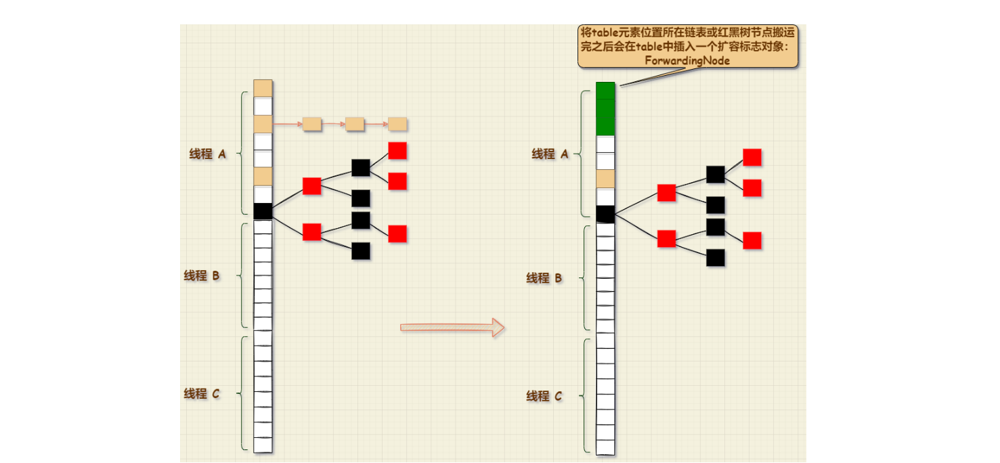

扩容的源码比较多，因此先对扩容流程有一个整体的印象；再读源码；

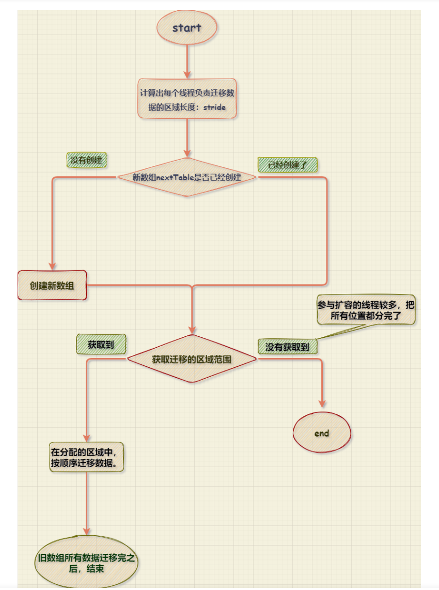


#### 1. ConcurrentHashMap扩容时新建数组

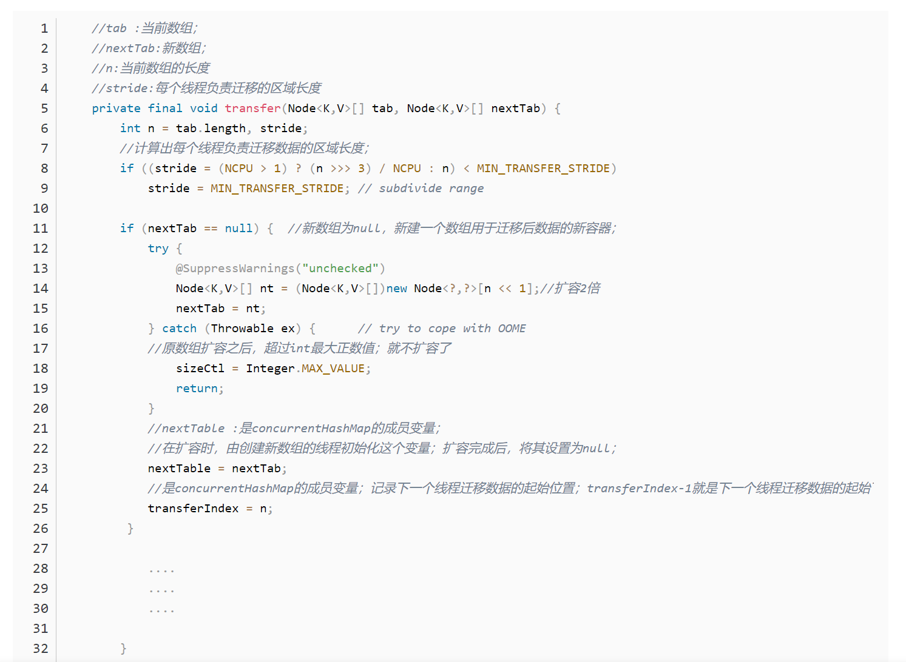


##### 1.1、每个线程负责的数据迁移区域的长度：stride

在ConcurrentHashMap中每个线程的数据迁移区域长度stride 不是一个固定值，stride 的值是根据：数组长度和cpu的个数决定的；

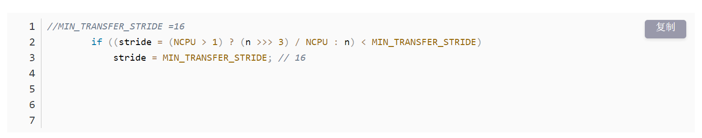

stride计算分2步：

- (NCPU > 1) ? (n >>> 3) / NCPU : n ；计算出stride的值
- 与默认值比较；小于默认值使用默认值；大于默认值使用计算出的值；

##### 1.2、关于transferIndex的说明

我们要确定一个线程的数据迁移区域，一个长度是不行的；还必须要知道一个数据迁移的起始的位置，这样才能通过：起始位置+长度；来确定迁移的范围；而transferIndex 就是确定线程迁移的起始位置；每个线程的起始位肯定都不同，因此这个变量会随着协助扩容的线程增加而不断的变化；

在ConcurrentHashMap中，分配区域是从数组的末端开始，从后往前配分区域，

- 第一个线程起始迁移数据的下标：transferIndex -1（数组最大下标），分配区域：[transfer-1，transfer-stride]，
- 第二线程的起始位置：（transferIndex - stride-1），分配区域：[transferIndex - stride-1，transferIndex - 2 * stride]，依次类推

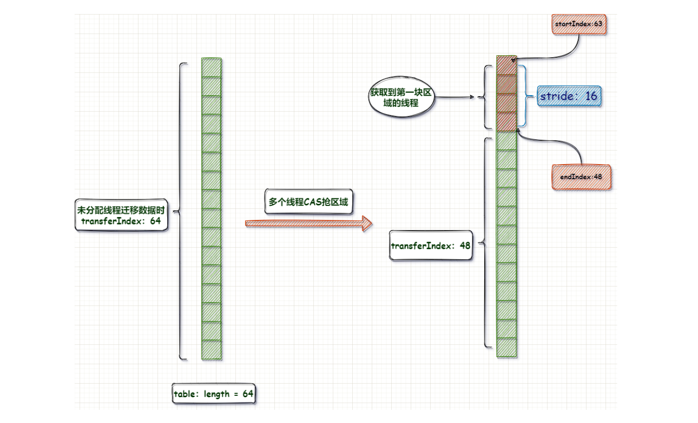

#### 2、ConcurrentHashMap扩容时获取迁移数据区域

当有新线程协助扩容时首先要获取到一个起始位置才能确定负责迁移数据的范围。ConcurrentHashMap是如何处理的？因为需要考虑到多个线程同时竞争同一个起始位置，因此要使用CAS竞争让线程抢位置，竞争失败的线程则进入循环下一次继续尝试获取一个起始位置；

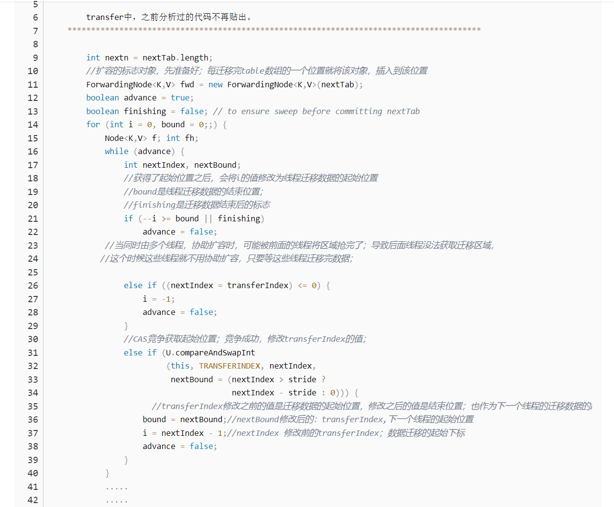

CAS 竞争位置，竞争成功之后由变量 i，bound 记录当前线程负责迁移数据的区域

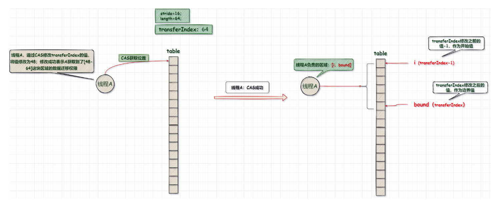

##### 总结

每个线程迁移数据时只能迁移获取到区域的数据：按顺序遍历的将获取到的区域： [i，bound]上每一个位置的数据完全迁移；但这里要注意下：i > bound ，迁移时顺序是 : i -> bound；


通过transferIndex 判断还有没有空闲的区域；transferIndex = 0 ；表示没有空闲区域了，所有区域都有线程负责迁移数据；


如果参与参与扩容的线程较多，那么可以将不同区域分配给不同线程；但如果参与扩容线程较少，那么线程完成了分配区域的数据迁移之后，获取下一块区域继续迁移数据，直到数据迁移完为止（为了保证在参与扩容线程很少时，也能将数据完全迁移）；

##### A、有较多线程参与扩容时：

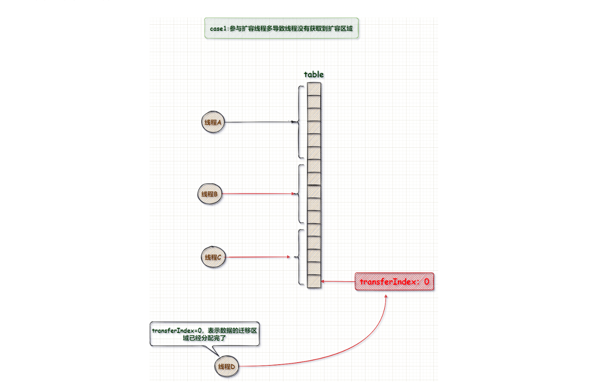

##### B、参与扩容线程较少：

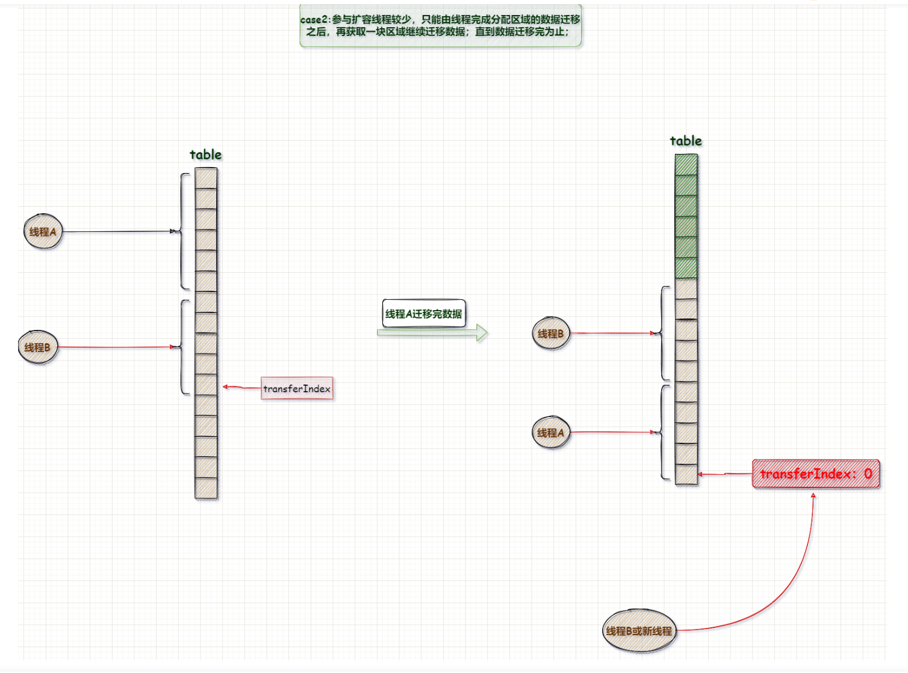

#### 3. 判断数据迁移是否结束

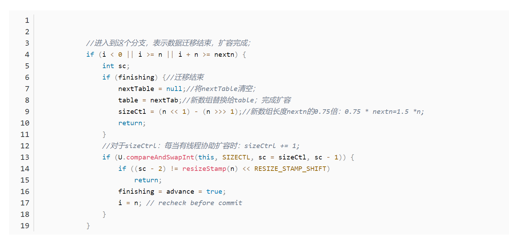

##### 3.1、每个线程完成自己区域内的数据迁移的判断条件

- i < 0 ;
- i >= n ;
- i + n >= nextn ;

**<u>对第一个条件 i < 0; 满足这个条件的有3种情况：</u>**

- 被分配到[0，stride]区域的线程，在完成数据迁移后，i 自减到 -1 ；
- 没有分配到 [0，stride] 区域的线程完成了分配区域的数据迁移之后，数组中没有空闲区域需要线程来迁移数据；这个时候会将i设置为-1，进入到这个分支；
- 没有分配到迁移区域的线程；也会将i设置为-1 ；


这三种情况都可以看作：当线程完成了分配区域内的数据迁移就会将 i 设置 为 -1；


关于判断条件 i >= n 和 i + n >= nextn 的疑惑

- 对于后面2个判断，感到有点疑惑；n = 旧数组的长度； nextn = 新数组长度; 在ConcurrentHashMap中，数组每次扩容都是2倍；因此：nextn = 2 * n；这就可以看出 i >= n 和 i + n >= nextn;是完全等价的；相当于一个条件，没有必要同时写这2个判断；
- 关于 i :取值范围是旧数组的下标区间[0,n-1]；i 的最大取值也就是(n-1) ;在这个分支内部设置了 i = n ； 即使是在这里将i 的值设置为n，但是进入下一次循环的时候，i自减1，到这个分支也不会出现 i = n 的情况，更没有 i > n 的情况出现；因此对什么时候出现 i >= n 的情况暂时还没想到；

##### 3.2、如何判断整个旧数组中的数据有没有迁移完

在ConcurrentHashMap中为了确定旧数组的数据被完全的迁移了，让最后一个完成数据迁移的线程在完成迁移之后，再重新遍历检查整个数组；遍历从后往前遍历 i : （n-1） -> 0 ; 在遍历过程中，发现有位置上的数据没有迁移，就迁移数据；这样当遍历结束之后，就可以确定整个数组的数据已经被迁移完了；

进入这个分支后，内部第一个分支的判断条件只有一个标志量：finishing=true； 表示整个数组的数据已经全部迁移完；这部分比较简单，数据迁移完之后更新了以下几个变量的值：

- nextTable=null，因为已经完成数据；
- 将扩容后的数组nextTab赋值给table；
- 设置扩容阈值 sizeCtrl = 0.75 * n；要看懂第二个分支里对sizeCtrl的处理就要了解在线程参与扩容前对sizeCtrl做了哪些处理？在线程扩容时对sizeCtrl的值做的处理：
- 创建扩容数组的线程，将sizeCtrl 的值设置为：sizeCtrl = ( resizeStamp(n) << RESIZE_STAMP_SHIFT ) + 2 ；
- 其余参与扩容的线程：每当有线程参与协助扩容 ：sizeCtrl += 1;


在上节分析过：进入该分支的线程，都已经完成了该线程所分配区域的数据迁移，并且此时旧数组中，没有还未分配的区域；也就是说所有区域都分配完了，自己区域内的数据也迁移完成；那么在完成了数据迁移之后，设置： sizeCtrl -= 1；表示有一个线程完成了数据迁移；对于判断条件：(sc - 2) != resizeStamp(n) << RESIZE_STAMP_SHIFT；


我们将公式稍作变形：sc != (resizeStamp(n) << RESIZE_STAMP_SHIFT) + 2 不等式的右边这正是创建扩容数组时给sizeCtrl的初始值；如果相等，那就说明这是最后一个线程；


在这第二个分支内做的处理：

- 如果不是最后一个退出扩容的线程，就直接退出扩容；
- 如果是最后一个退出扩容的线程：i = n ，finishing = true 扫描全表，检查是否有没被迁移的数据，如果有就将其迁移到新数组检查完整个数组之后，将table更新为新数组：nextTab完成扩容然后退出；

#### 5.ConcurrentHashMap的数据迁移

##### 5.1、ConcurrentHashMap数据迁移的原理

在讲这之前要搞清楚迁移数据时要解决的问题:同一条链表（红黑树）的节点在数组扩容之后可能不在同一条链表（红黑树）上；因此不能直接将链表头节点（红黑树root节点）迁移到新数组来完成这条链表（红黑树）的迁移。

在ConcurrentHashMap中，数组table的长度为2n大小。

在ConcurrentHashMap扩容时，线程在数据在迁移时：一条链表最多可能分化为 2条Node链表；因此在迁移链表时就只需要构造2条链表即可转移该链表所有的节点；

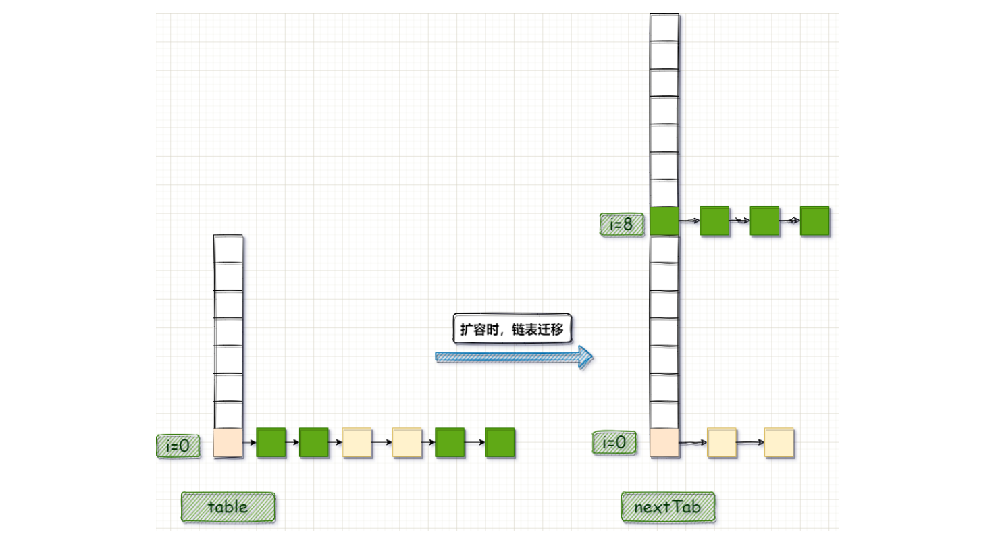

对于红黑树来说也是一样的：在同一棵红黑树上的节点对应了同一个数组位置，在扩容的时候，红黑树节点也只会有2个位置可以选择；因此红黑树也会分成 2条TreeNode链表；一个在原位置，一个在：i + n位置；你或许会有疑问，

明明是红黑树，怎么会分成2条链表？在由Node链表 -> 红黑树时；首先是将Node链表 -> TreeNode链表；然后将TreeNode链表 -> 红黑树；在转换成红黑树之后，保留了TreeNode链表的头节点；也就是说，TreeNode同时保存2种结构：

- TreeNode的链表结构，可以通过表头以及TreeNode中的next属性遍历整个链表；
- TreeNode的红黑树结构，可以通过root根节点以及左右子节点遍历整颗红黑树；


将TreeNode当成链表来看，就只关注TreeNode中的next属性，以表头first节点开始，通过next属性就可以遍历完整个TreeNode链表；


将TreeNode当成红黑树来看就不能关注next节点，要关注它的left，right子节点以及parent父节点这些属于树的属性；搜索方法也是依靠二叉搜索树从root节点通过左右子节点来遍历整颗红黑树；


最后还有一个问题：当红黑树put值时，怎么解决既在链插入又在红黑树中插入 ？

- 在链表上插入体现为：能成为链表中一个节点的next节点，或者链表中一个节点的前驱节点；
- 在红黑树的插入体现为：是成为某个红黑树节点的left/right节点；==》关键就是找到父节点；


在ConcurrentHashMap中，TreeNode链表的头节点是记录在TreeBin中的，因此它使用了非常简单高效的做法，直接将新插入的节点当作表头，将原头节点当作新表头的next节点；对于红黑树找父节点，就按照二叉搜索树的插入方法去找到parent节点即可；


最后，我们在迁移红黑树时，使用TreeNode的链表结构来遍历TreeNode链表，同时构建2个TreeNode链表来迁移数据；在将TreeNode链表遍历完之后，分别判断2条链表的长度，来决定应该重新构建红黑树还是将TreeNode转换成Node链表；

最后再分别将红黑树分裂形成的2个红黑树TreeBin或者是链表表头Node添加到新数组中；


TreeNode的结构：

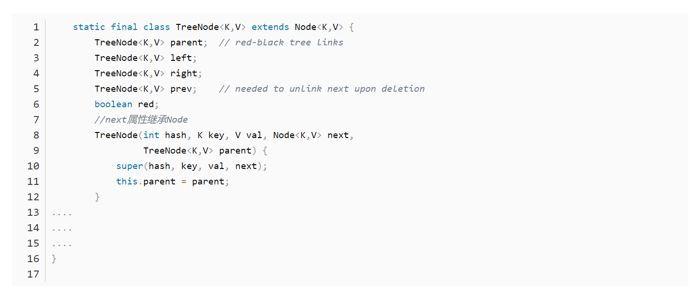

##### 5.2、ConcurrentHashMap数据迁移的源码分析

**<u>Node链表迁移的源码分析</u>**

```java
					//f = table[i];
					//fh = f.hash;
					//n = table.length;(旧数组长度)
					//ln:所在的链表的位置，没变还是在下标:i
                    //hn:链表所在位置：i+n；
					Node<K,V> ln, hn;
                    if (fh >= 0) {//Node的hash值不为负数
                    //只有0 和n两种取值；结果是0，表示扩容后位置不变；结果不为0，表示扩容后位置：i+n；
                        int runBit = fh & n;
                        Node<K,V> lastRun = f;
                        //循环遍历旧数组中，table[i]所在链表遍历链表找出lastRun
                        for (Node<K,V> p = f.next; p != null; p = p.next) {
                            int b = p.hash & n;
                            if (b != runBit) {
                                runBit = b;
                                lastRun = p;
                            }
                        }
                       
                       //根据runBit的值，给ln，hn赋值；
                        if (runBit == 0) {
                            ln = lastRun;
                            hn = null;
                        }
                        else {
                            hn = lastRun;
                            ln = null;
                        }
                       //遍历链表将节点分配到ln，hn中；
                       //新Node插入到表
                        for (Node<K,V> p = f; p != lastRun; p = p.next) {
                            int ph = p.hash; K pk = p.key; V pv = p.val;
                            if ((ph & n) == 0)
                                ln = new Node<K,V>(ph, pk, pv, ln);头
                            else
                                hn = new Node<K,V>(ph, pk, pv, hn);
                        }
                        //遍历完旧数组的链表后，重新生成了ln，hn2条链表；
                        //ln链表插入到新数组的下标：i
                        setTabAt(nextTab, i, ln);
                        // hn插入到：i+n位置；
                        setTabAt(nextTab, i + n, hn);
                        //并将旧数组的i位置插入扩容标志节点：ForwardingNode对象；
                        setTabAt(tab, i, fwd);
                        advance = true;
                    }
```


这里再简单提下：在ConcurrentHashMap中table数组可能存在四种Node节点

- Node:普通node节点，表示链表；节点的hash值大于0；
- ForWardingNode节点，扩容标志；hash = MOVE(-1);在这个对象中有nextTab对象，协助扩容时根据nextTab找到扩容后新数组；
- TreeBin节点，表示红黑树；hash = TREEBIN(-2)在这个对象中存储了TreeNode链表表头first，以及红黑树根节点root；
- 调用computeIfAbsent方法put值当hash定位到下标 i 时，table[i]=null,会使用：ReservationNode对象来占位；

##### 5.3、ConcurrentHashMap中如何确定节点在哪一条链表

在上一节中，分析到可以使用新数组的容量来计算出node节点迁移后的坐标；在ConcurrentHashMap迁移链表时分裂的2个新链表分别是：ln（下标：i），hn（下标：i+n）；在判断node节点应该在哪条链表不是直接使用下标判断，而是利用扩容后下标位置有没有发生改变来判断；没有改变就在ln链表，位置改变了就在hn链表；这个时候直接使用扩容后的容量计算出下标就不能直接区分坐标到底是变了还是没有变；因此ConcurrentHashMap使用了另一种方法来判断扩容后下标变不变：fh & n 即 hash & oldLength(旧数组长度)；这个方法可以直接计算出扩容后，node 坐标的位置的偏移量；

- fh & n = 0；扩容后下标不变；
- fh & n = n；扩容后下标位置改变（i + n）；

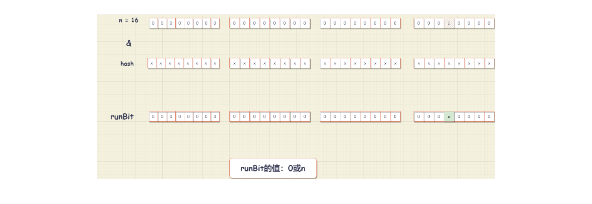

##### 5.4、lastRun和链表数据的迁移流程

lastRun是理解链表迁移的关键；要从整体来看lastRun，理解他在链表转移数据的过程有什么用；但是不好组织语言来描述；


我们知道一条链表上的节点，在扩容之后会分成2条链表；而这条链表上有哪些节点扩容之后位置要改变的哪些节点位置是不改变的，这两种节点在链表上的分布是不确定的；我们可以将连续相同的节点看作是一段链表（一个节点也是一段链表），那么这条链表就可以看作2种链表组合组成的；而lastRun，是指向最后一段链表的头节点；再配合runBit（偏移量）就可以确定最后一段链表属于哪种节点；因此可以看到再次遍历数组时，遍历到lastRun就结束遍历；


还是用一个例子，画出整个流程图就很好理解；

- 1、遍历链表找出lastRun：

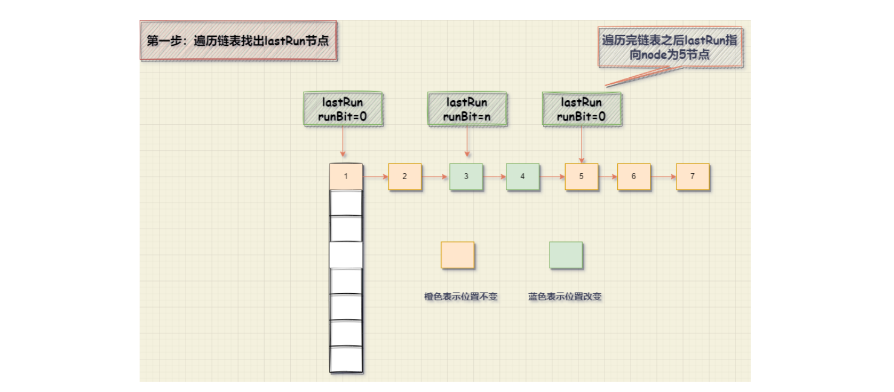

- 2、根据runBit的值来确定lastRun属于哪一条链表；
  - runBit = 0；位置不变属于ln链表 ：ln = lastRun；
  - runBit != 0; 位置改变属于hn链表 ： hn = lastRun;

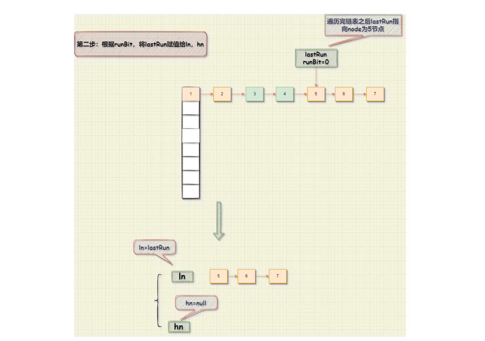

- 3、重新遍历链表，将链表中的节点根据hash值计算出的偏移量选择插入的链表：ln，hn中；新插入的节点插在表头；当next指针指向与lastRun相同的对象时遍历结束，此时链表所有的节点都已经迁移到两个新链表中了；

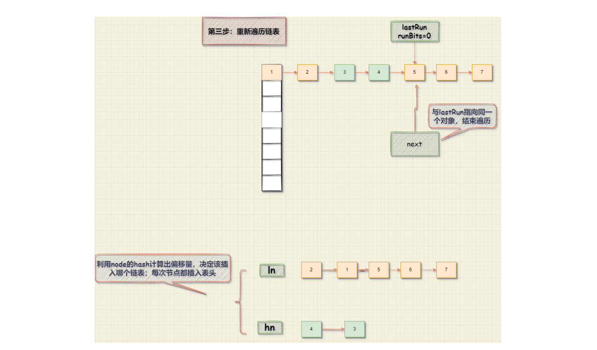

- 4、将ln，hn的值插入到新数组nextTab；将table[i] = ForwardingNode对象；

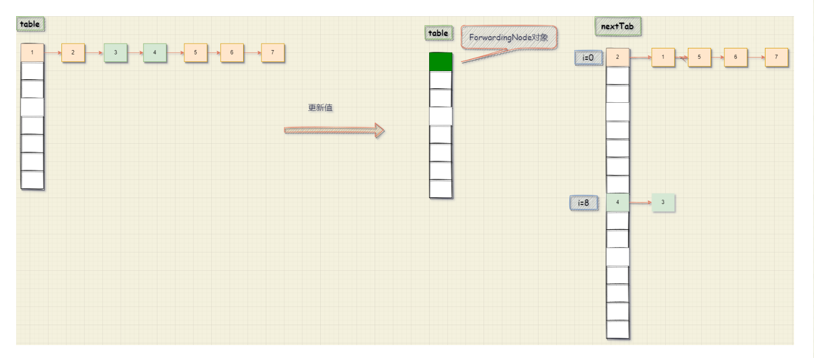

##### 5.5、红黑树迁移的源码分析

红黑树的迁移逻辑要比链表的迁移逻辑要简单得多（PS:这才是正常人的逻辑）；没那么多弯弯绕绕的逻辑，就是一把梭~在上面 数据迁移的原理部分，讲到过红黑树的TreeNode节点其实也维护了一个链表的结构；因此迁移时直接使用TreeNode的链表结构，迁移逻辑就会很简单了；


与Node链表的迁移不同；红黑树的迁移是直接循环遍历TreeNode链表，利用hash值计算偏移量来决定TreeNode应该放到哪个链表上；同时插入的位置是在表尾；因此可以看到源码中，一个链表由表头表尾共同维护；在遍历完整个TreeNode的节点之后，再判断TreeNode链表是否应该转换成红黑树，还是退化成Node链表；


源码：

```java
                    else if (f instanceof TreeBin) {//判断是不是红黑树节点
                        TreeBin<K,V> t = (TreeBin<K,V>)f;
                        //lo：TreeNode链表表头：下标位置不变：i
                        //loTail:表尾，每次插入节点都在表尾插入
                    
                        TreeNode<K,V> lo = null, loTail = null;
                        //hi：TreeNode链表表头：下标位置：i+n;
                        //hiTail :表尾，每次插入节点都在表尾插入
                        TreeNode<K,V> hi = null, hiTail = null;
                        int lc = 0, hc = 0;
                        for (Node<K,V> e = t.first; e != null; e = e.next) {
                            int h = e.hash;
                            TreeNode<K,V> p = new TreeNode<K,V>
                                (h, e.key, e.val, null, null);
                            if ((h & n) == 0) {//偏移量 = 0插入loTail
                                if ((p.prev = loTail) == null)
                                    lo = p;
                                else
                                    loTail.next = p;//lo链表插入表尾
                                loTail = p;//更新lo链表表尾
                                ++lc;//记录lo链表节点个数
                            }
                            else {//偏移量 != 0插入hiTail
                                if ((p.prev = hiTail) == null)
                                    hi = p;
                                else
                                    hiTail.next = p;//hi链表插入表尾
                                hiTail = p;//更新hi链表表尾
                                ++hc;//记录hi链表节点个数;
                            }
                        }
                        //分别判断ln，hn节点个数是否满足生成红黑树的条件；
                        //不满足则将TreeNode链表转换成Node链表；
                        //满足则将TreeNode节点重新生成红黑树；
                        ln = (lc <= UNTREEIFY_THRESHOLD) ? untreeify(lo) :
                            (hc != 0) ? new TreeBin<K,V>(lo) : t;
                        hn = (hc <= UNTREEIFY_THRESHOLD) ? untreeify(hi) :
                            (lc != 0) ? new TreeBin<K,V>(hi) : t;
                            //将ln，hn分别设置到新数组的i，i+n位置
                        setTabAt(nextTab, i, ln);
                        setTabAt(nextTab, i + n, hn);
                        //在table[i]中设置ForwardingNode对象;
                        setTabAt(tab, i, fwd);
                        advance = true;
                    }
```


流程：

- 1、遍历TreeNode链表，利用hash值计算扩容后偏移量（hash & n）；根据偏移量是否为0来选择将节点添加到哪个链表。新加入的节点放到链表表尾，同时统计链表元素个数；

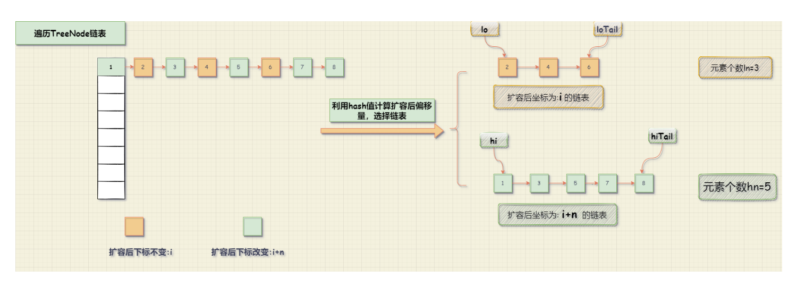

- 2、根据元素个数判断是否将链表转换成红黑树；
- 3、将：lo，hi分别迁移到新数组nextTab的：i，i+n位置；在旧数组table被迁移数据的位置：i，设置一个ForwardingNode对象；

#### 6.扩容逻辑的整体分析

只保留整体大框架，省略掉细节部分：

```java
    for (int i = 0, bound = 0;;) {
        Node<K,V> f; int fh;
        第一部分：线程获取迁移数据的区域
        while (advance) {
			  int nextIndex, nextBound;
            if (--i >= bound || finishing)
                advance = false;
            else if ((nextIndex = transferIndex) <= 0) {
                i = -1;
                advance = false;
            }
            else if (U.compareAndSwapInt
                     (this, TRANSFERINDEX, nextIndex,
                      nextBound = (nextIndex > stride ?
                                   nextIndex - stride : 0))) {
                bound = nextBound;
                i = nextIndex - 1;
                advance = false;
            }
        }
        第二部分：扩容结束的判断
        if (i < 0 || i >= n || i + n >= nextn) {
            int sc;
            if (finishing) {
                nextTable = null;
                table = nextTab;
                sizeCtl = (n << 1) - (n >>> 1);
                return;
            }
            if (U.compareAndSwapInt(this, SIZECTL, sc = sizeCtl, sc - 1)) {
                if ((sc - 2) != resizeStamp(n) << RESIZE_STAMP_SHIFT)
                    return;
                finishing = advance = true;
                i = n; // recheck before commit
            }
        }
		第三部分：判断table元素的节点类型；
        //如果table[i]=null,就将fwd对象填充到这个位置，表示正在扩容；
        //其他线程看到了会通过fwd中的信息找到nextTab协助扩容；
        else if ((f = tabAt(tab, i)) == null)
            advance = casTabAt(tab, i, null, fwd);
            //判断位置上的节点是否是ForwardingNode对象，如果是表示已经有线程迁移了该位置的数据
        else if ((fh = f.hash) == MOVED)
            advance = true; // already processed
            第四部分：迁移数据；
        else {
        	//获取锁
            synchronized (f) {
            //获取到对象f的锁之后，会对比：获得锁前后f对象有没有花生改变，如果发生改变，就不处理
                if (tabAt(tab, i) == f) {
                    Node<K,V> ln, hn;
                    if (fh >= 0) {
						处理链表
                    }
                    else if (f instanceof TreeBin) {
                    	处理红黑树

                    }
                }
            }
        }
    }
```

整体过程可以分为以下几部分：

- 获取数据迁移区域；
- 结束扩容的判断；
- 判断table[i]的类型：如果是null；就设置ForwardingNode对象
- 判断table[i]的类型：如果是ForwardingNode对象则，迁移下个位置的数据
- 迁移Node链表或红黑树的数据

#### 7、图解扩容

假设目前数组长度为8，数组的元素的个数为5。再放入一个元素就会触发扩容操作。

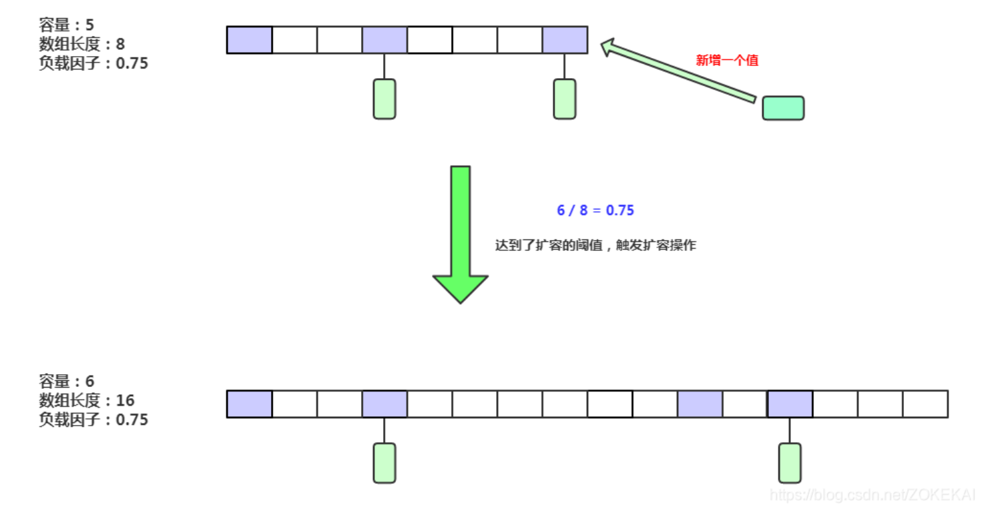

##### 扩容条件

(1) 元素个数达到扩容阈值。

(2) 调用 putAll 方法，但目前容量不足以存放所有元素时。

(3) 某条链表长度达到8，但数组长度却小于64时。


CPU核数与迁移任务hash桶数量分配(步长)的关系

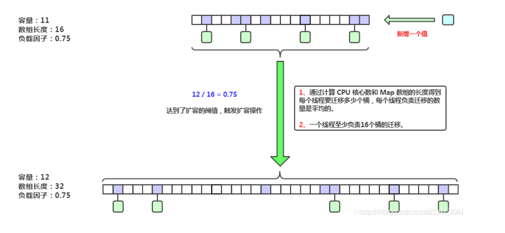

##### 单线程下线程的任务分配与迁移操作

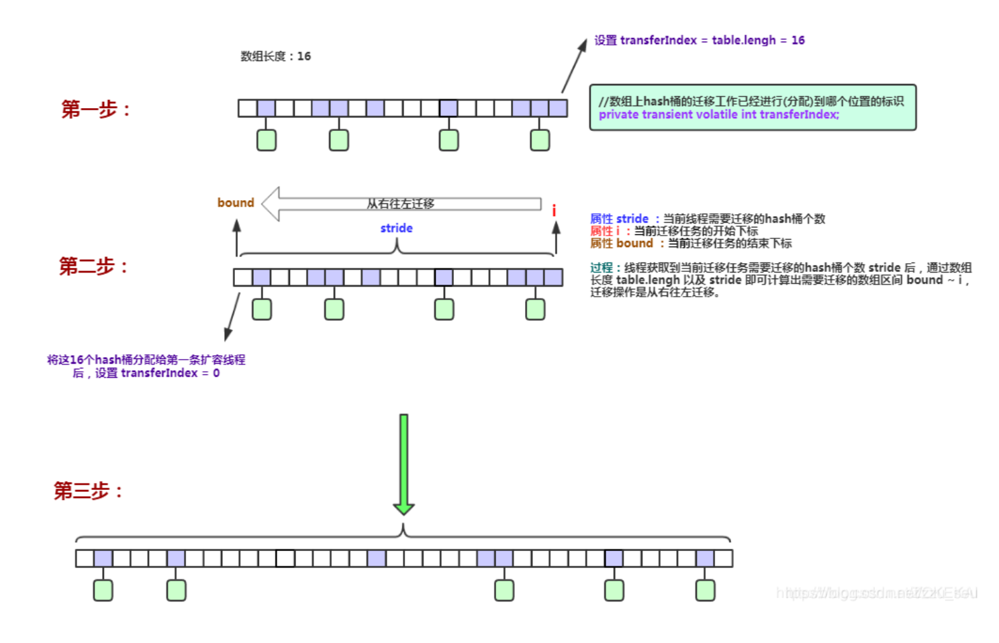

##### 多线程如何分配任务 

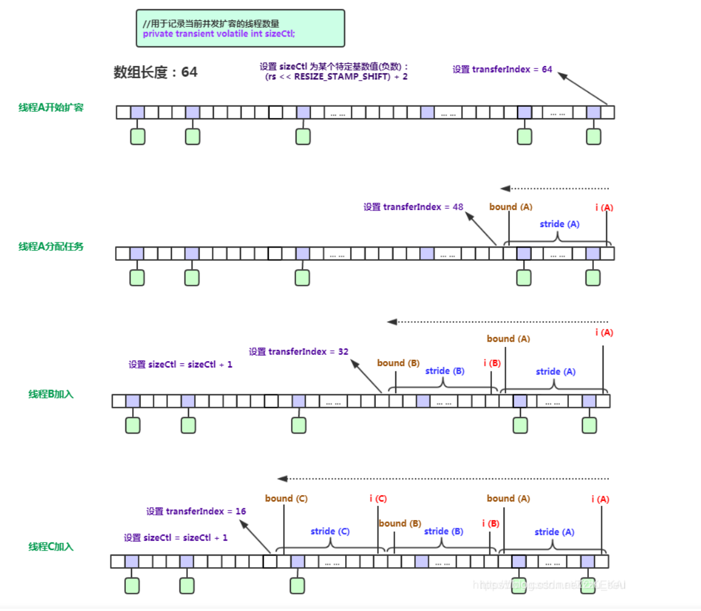

##### 普通链表如何进行数据迁移 

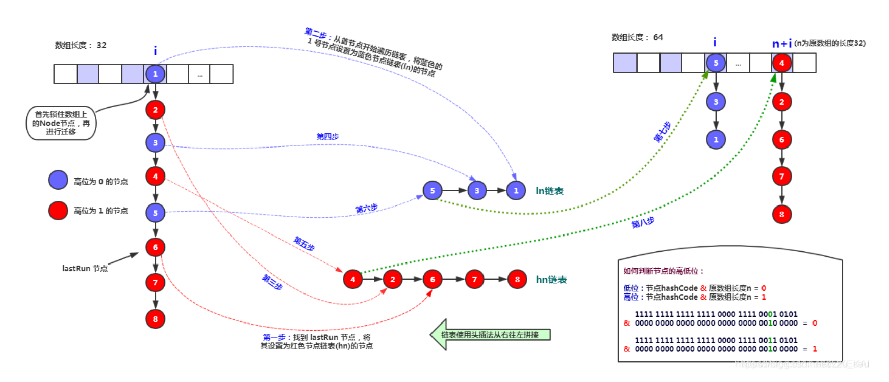

首先锁住数组上的Node节点，然后和HashMap1.8中一样，将链表拆分为高位链表和低位链表两个部分，然后复制到新的数组中


什么是 lastRun 节点 ？

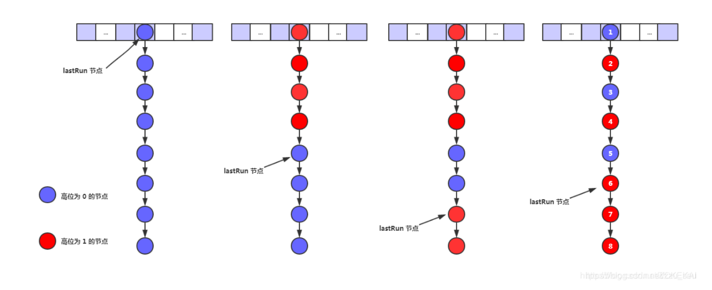

##### 红黑树如何迁移 

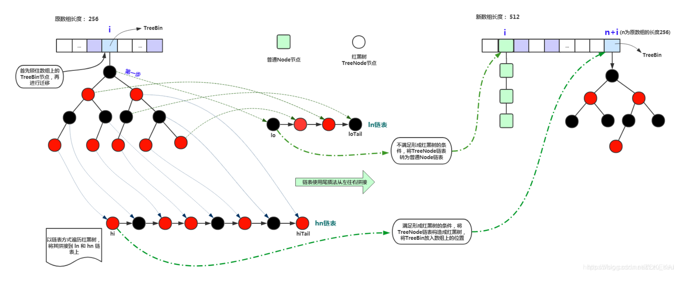


hash桶迁移中以及迁移后如何处理存取请求 ？

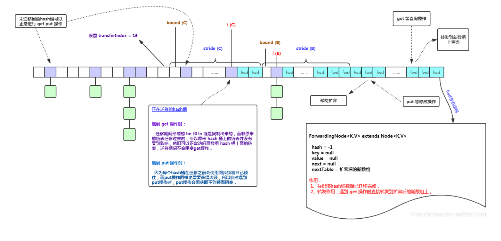


多线程迁移任务完成后的操作

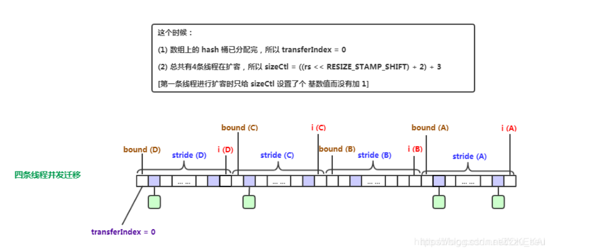

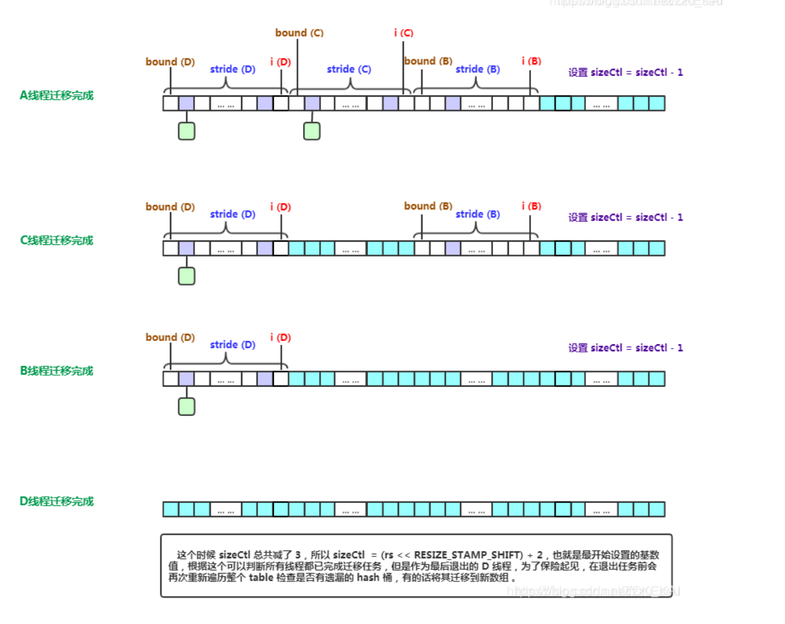

### get 过程分析

get 方法从来都是最简单的，这里也不例外：

1. 计算 hash 值
2. 根据 hash 值找到数组对应位置: (n - 1) & h
3. 根据该位置处结点性质进行相应查找
   - 如果该位置为 null，那么直接返回 null 就可以了
   - 如果该位置处的节点刚好就是我们需要的，返回该节点的值即可
   - 如果该位置节点的 hash 值小于 0，说明正在扩容，或者是红黑树，后面我们再介绍 find 方法
   - 如果以上 3 条都不满足，那就是链表，进行遍历比对即可

```
public V get(Object key) {
    Node<K,V>[] tab; Node<K,V> e, p; int n, eh; K ek;
    int h = spread(key.hashCode());
    if ((tab = table) != null && (n = tab.length) > 0 &&
        (e = tabAt(tab, (n - 1) & h)) != null) {
        // 判断头结点是否就是我们需要的节点
        if ((eh = e.hash) == h) {
            if ((ek = e.key) == key || (ek != null && key.equals(ek)))
                return e.val;
        }
        // 如果头结点的 hash 小于 0，说明 正在扩容，或者该位置是红黑树
        else if (eh < 0)
            // 参考 ForwardingNode.find(int h, Object k) 和 TreeBin.find(int h, Object k)
            return (p = e.find(h, key)) != null ? p.val : null;
        
        // 遍历链表
        while ((e = e.next) != null) {
            if (e.hash == h &&
                ((ek = e.key) == key || (ek != null && key.equals(ek))))
                return e.val;
        }
    }
    return null;
}
```

简单说一句，此方法的大部分内容都很简单，只有正好碰到扩容的情况，ForwardingNode.find(int h, Object k) 稍微复杂一些，不过在了解了数据迁移的过程后，这个也就不难了，所以限于篇幅这里也不展开说了。
