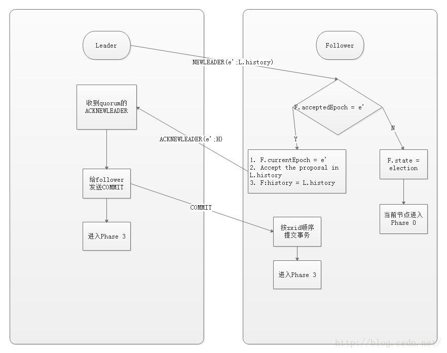

# 章节目录

# 1. zookeeper 是什么

依据官方网站：
> ZooKeeper is a centralized service for maintaining configuration information, naming, providing distributed synchronization, and providing group services.All of these kinds of services are used in some form or another by distributed applications. Each time they are implemented there is a lot of work that goes into fixing the bugs and race conditions that are inevitable. Because of the difficulty of implementing these kinds of services, applications initially usually skimp on them, which make them brittle in the presence of change and difficult to manage. Even when done correctly, different implementations of these services lead to management complexity when the applications are deployed.

翻译成中文，可以简单的来说：**Zookeeper是一个高性能，分布式的，开源分布式应用协调服务**。zookeeper主要开源实现了Google的Chubby。
<u>ZooKeeper是一个典型的分布式数据一致性的解决方案，分布式应用程序可以基于它实现诸如数据发布/订阅、负载均衡、命名服务。分布式协调/通知。集群管理、Master选举、分布式锁和分布式队列等功能。</u>它就像一个同时运行在很多主机上的文件系统，只要集群中有超过一半的主机有效，则这个“文件系统”上所有（有效）主机上面的数据都是一致的，其中内部数据看起来就像文件系统一样，也是/app1/p_1这种样式，只不过它每一层都是节点（Znode），比如app1这个节点，它既是数据本身（可以存放数据），也是“目录”，它的下一层的节点是它的子节点。我们对Zookeeper的操作也就是对这个结构的增删查改操作。


## 1.1. zookeeper的设计目标

1.**最终一致性**：<u>client不论连接到哪个Server，展示给它都是同一个视图，这是zookeeper最重要的功能。</u>

2.**可靠性**：<u>具有简单、健壮、良好的性能，如果消息m被到一台服务器接受，那么它将被所有的服务器接受。</u>

3.**实时性**：<u>Zookeeper保证客户端将在一个时间间隔范围内获得服务器的更新信息，或者服务器失效的信息。</u>但由于网络延时等原因，Zookeeper不能保证两个客户端能同时得到刚更新的数据，如果需要最新数据，应该在读数据之前调用sync()接口。

4.**等待无关（wait-free）**：<u>慢的或者失效的client不得干预快速的client的请求，使得每个client都能有效的等待</u>。

5.**原子性**：更新只能成功或者失败，没有中间状态。

6**.顺序性**：<u>包括全局有序和偏序两种：全局有序是指如果在一台服务器上消息a在消息b前发布，则在所有Server上消息a都将在消息b前被发布；偏序是指如果一个消息b在消息a后被同一个发送者发布，a必将排在b前面。</u>

关于更多的特性，可以去官网的概论查看，如果想获得更好的体验，[可点击前往][zookeepe-overview]。

# 2. Zookeeper的实现逻辑

## 2.1. Znode

### 2.1.1. znode的字段

> 关于官网中，对znode的描述在这篇文档里，如果有兴趣可以[点击前往][zookeeper-znode]。

znode主要有一下字段：

```c
struct{
    czxid;// create ZXID，即该数据节点被创建时的事务id
    mzxid;// modified ZXID，即该节点最终一次更新时的事务id
    pzxid;// 该节点的子节点列表最后一次修改时的事务id，只有子节点列表变更才会更新pZxid，子节点内容变更不会更新
    ctime;// create time，即该节点的创建时间
    mtime;// modified time，即该节点最后一次的更新时间
    version;// 数据节点内容版本号，节点创建时为0，每更新一次节点内容(不管内容有无变化)该版本号的值增加1
    cversion;//子节点版本号，当前节点的子节点每次变化时值增加1
    aversion;// 节点的ACL版本号，表示该节点ACL信息变更次数
    ephemeralOwner;// 创建该临时节点的会话的sessionId；如果当前节点为持久节点，则ephemeralOwner=0
    dataLength;// 数据节点内容长度
    numChildren;// 当前节点的子节点个数
}
```

一些关键的解释：

#### 2.1.1.1. zxid 说明

事务id。Zookeeper中每个变化都会产生一个全局唯一的zxid。通过它可确定更新操作的先后顺序。例如，zxid1小于zxid2，则说明zxid1操作先执行，zxid2后执行； zxid对于整个Zookeeper都是唯一的，即使操作的是不同的znode。

#### 2.1.1.2. version 说明

<u>就是本文上面字段中的version。</u>每一个znode都有一个数据版本号，每次对znode做更新操作时值自增。ZooKeeper中一些更新操作，例如setData和delete根据版本号有条件地执行。多个客户端对同一个znode进行更新操作时，因为数据版本号，才能保证更新操作的先后顺序性。例如，客户端A正在对znode节点做更新操作，此时如果另一个客户端B同时更新了这个znode，则A的版本号已经过期，那么A调用setData不会成功。

#### 2.1.1.3. ACL(Access Control List,访问控制列表 )

ZooKeeper提供了一套完善的ACL权限控制机制保障数据安全性。

- 对于身份认证，提供了以下几种方式。

| 身份认证方式 | 解释                                                         |
| ------------ | ------------------------------------------------------------ |
| world        | 默认方式，所有用户都可无条件访问，组合形式为：world:anyone:[permissions] |
| digest       | 用户名:密码认证方式，最常用，组合形式为：digest:username:BASE64(SHA1(password)):[permissions] |
| ip           | 对指定ip进行限制，组合形式为：ip:127.0.0.1:[permissions]     |
| auth         | 认证登录形式，需要用户获取权限后才可访问，组合形式为 auth:userpassword:[permissions] |

对于znode权限，提供了以下5种操作权限。

| 权限   | 简写 | 解释                                               |
| ------ | ---- | -------------------------------------------------- |
| CREATE | C    | 允许授权对象在当前节点下创建子节点                 |
| DELETE | D    | 允许授权对象在当前节点下删除子节点                 |
| WRITE  | W    | 允许授权对象在当前节点进行更新操作                 |
| READ   | R    | 允许授权对象在当前节点获取节点内容或获取子节点列表 |
| ADMIN  | A    | 允许授权对象对当前节点进行ACL相关的设置操作        |

### 2.1.2. zookeeper的节点类型

<u>在 ZooKeeper中,每个数据节点都是有生命周期的,其生命周期的长短取决于数据节点的节点类型。</u>

在 ZooKeeper中,节点类型可以分为**持久节点(PERSISTENT)、临时节点(EPHEMERAL)和顺序节点(SEQUENTIAL)三大类**,具体在节点创建过程中,通过组合使用,可以生成以下四种组合型节点类型:

#### 2.1.2.1. 持久节点

持久节点是 ZooKeeper中最常见的一种节点类型。<u>所谓持久节点,是指该数据节点被创建后，就会一直存在于 ZooKeeper服务器上，直到有删除操作来主动清除这个节点。</u>

#### 2.1.2.2. 持久顺序节点

持久顺序节点的基本特性和持久节点是一致的，额外的特性表现在顺序性上。<u>在ZooKeeper中，每个父节点都会为它的第一级子节点维护一份顺序，用于记录下每个子节点创建的先后顺序。</u> 基于这个顺序特性，**在创建子节点的时候，可以设置这个标记，那么在创建节点过程中,，ZooKeeper会自动为给定节点名加上一个数字后缀，作为一个新的、完整的节点名。**另外需要注意的是,这个数字后缀的上限是整型的最大值。

#### 2.1.2.3. 临时节点(EPHEMERAL)

<u>和持久节点不同的是，临时节点的生命周期和客户端的会话绑定在一起，也就是说，如果客户端会话失效，那么这个节点就会被自动清理掉。</u>注意，**这里提到的是客户端会话失效，而非TCP连接断开**。另外，ZooKeeper规定了不能基于临时节点来创建子节点，即临时节点只能作为叶子节点。

#### 2.1.2.4. 临时顺序节点(EPHEMERAL SEQUENTIAL)

临时顺序节点的基本特性和临时节点也是一致的，同样是在临时节点的基础上，添加了顺序的特性。

### 2.1.3. 节点客户端方法

略，可实验查看，本身方法不多，多为path方法和watch方法

## 2.2. Watches

> 同样，zookeeper官网也对watches做了一下详尽的介绍，如果感兴趣，[可以前往查看][zookeeper-watches]。
>
> 这里引入一篇文章，对于watches的描述比较细致，同时有关于zk是如何实现watches的，有兴趣可以点击前往：[[zookeeper]zookeeper系列三：zookeeper中watcher的使用及原理][https://blog.csdn.net/zkp_java/article/details/82711810]

  Zookeeper提供了数据的发布/订阅功能，多个订阅者可同时监听某一特定主题对象，当该主题对象的自身状态发生变化时(例如节点内容改变、节点下的子节点列表改变等)，会实时、主动通知所有订阅者。<u>该机制在被订阅对象发生变化时会异步通知客户端，因此客户端不必在Watcher注册后轮询阻塞，从而减轻了客户端压力。</u>

### 2.2.1. watches架构

Watcher实现由三个部分组成：

- Zookeeper服务端
- Zookeeper客户端
- 客户端的ZKWatchManager对象

客户端首先将Watcher注册到服务端，同时将Watcher对象保存到客户端的Watch管理器中。当ZooKeeper服务端监听的数据状态发生变化时，服务端会主动通知客户端，接着客户端的Watch管理器会触发相关Watcher来回调相应处理逻辑，从而完成整体的数据发布/订阅流程。


zk客户端向zk服务器注册watcher的同时，会将watcher对象存储在客户端的watchManager。

**Zk服务器触发watcher事件后，会向客户端发送通知，客户端线程从watchManager中回调watcher执行相应的功能。**

| 特性           | 说明                                                         |
| -------------- | ------------------------------------------------------------ |
| 客户端顺序回调 | **Watcher回调是顺序串行化执行的，只有回调后客户端才能看到最新的数据状态。一个Watcher回调逻辑不应该太多，以免影响别的watcher执行** |
| 轻量级         | WatchEvent是最小的通信单元，结构上只包含通知状态、事件类型和节点路径，并不会告诉数据节点变化前后的具体内容； |
| 时效性         | Watcher只有在当前session彻底失效时才会无效，若在session有效期内快速重连成功，则watcher依然存在，仍可接收到通知； |
| 一次性         | **Watcher是一次性的，一旦被触发就会移除，再次使用时需要重新注册** |

#### 2.2.1.1. 监听的作用域


加入小红旗是一个watcher，当小红旗被创建并注册到node1节点(会有相应的API实现)后，就会监听node1+node_a+node_b或node_a+node_b。**这里两种情况是因为在创建watcher注册时会有多种途径。并且watcher不能监听到孙节点**。**<u>请注意，watcher设置后，一旦触发一次后就会失效，如果要想一直监听，需要在process回调函数里重新注册相同的 watcher。</u>**

#### 2.2.1.2. watch注册流程


1. 客户端发送的请求中只包含是否需要注册Watcher，不会将Watcher实体发送
2. Packet构造函数中的参数WatchRegistration是Watcher的封装体，用于服务响应成功后将Watcher保存到ZKWatchManager中

#### 2.2.1.3. Watcher通知流程


### 2.2.2. watches 示例

具体实现就不说了，使用到了或者以后对这一块儿有迷惑的地方在深入的去说。

# 3. ZAB 选举与一致性

为了高可用和数据安全起见，zk集群一般都是由几个节点构成(由n/2+1，投票机制决定，肯定是奇数个节点)。多节点证明它们之间肯定会有数据的通信，同时，为了能够使zk集群对外是透明的，一个整体对外提供服务，那么客户端访问zk服务器的数据肯定是要数据同步，也即**数据一致性**。

zk集群是Leader/Follower模式来保证数据同步的。整个集群同一时刻只能有一个Leader，其他都是Follower或Observer。Leader是通过选举选出来的，这里涉及到ZAB协议(原子消息广播协议)。

## 3.1. 概念理解

> 概念理解copy自[品味Zookeeper之选举及数据一致性][https://www.jianshu.com/p/57fecbe70540], 写的比较形象。

为了更好理解下文，先说ZAB协议，它是选举过程和数据写入过程的基石。ZAB的核心是定义会改变zk服务器数据状态的事务请求的处理方式。

ZAB的理解：所有事务请求是由一个全局唯一的服务器来协调处理，这个的服务器就是Leader服务器，
 其它服务器都是Follower服务器或Observer服务器。Leader服务器负责将一个客户端的请求转换成那个一个**事务Proposalͧ(提议)**，将该Proposal分发给集群中所有的Follower服务器。然后Leader服务器需要等待所有Follower服务器的应答，当Leader服务器收到超过**半数**的Follower服务器进行了明确的应答后，Leader会再次向所有的Follower服务器分发Commit消息，要求其将前一个Proposal进行提交。

注意**事务提议**这个词，就类似 **人大代表大会提议** ，提议就代表会有应答，之间有通信。因此在zk的ZAB协议为了可靠性和可用性，会有**投票**，**应答**等操作来保证整个zk集群的正常运行。

总的来说就是，涉及到客户端对zk集群数据改变的行为都先由Leader统一响应，然后再把请求转换为事务转发给其他所有的Follower，Follower应答并处理事务，最后再反馈。如果客户端只是读请求，那么zk集群所有的节点都可以响应这个请求。

### 3.1.1. Zookeeper 服务器的角色

1. Leader: 事务请求的唯一调度和处理者，保证集群事务处理的顺序序性，集群内部各服务器的调度者。
2. Follower: 处理客户端非事务请求，转发事务请求给Leader服务器，参与事务请求Proposal的投票，参与Leader的选举投票。
3. Observer：处理客户端非事务请求，转发事务请求给Leader服务器，不参加任何形式的投票，包括选举和事务投票(超过半数确认)，Observer的存在是为了提高zk集群对外提供读性能的能力。


### 3.1.2. Zookeeper 服务器的状态

- LOOKING：寻找Leader状态，当服务器处于这种状态时，表示当前没有Leader，需要进入选举流程。

- FOLLOWING：从机状态，表明当前服务器角色是Follower

- OBSERVING：观察者状态，表明当前服务器角色是Observer

- LEADING：领导者状态，表明当前服务器角色是Leader

ServerState 类维护服务器四种状态。

zk服务器的状态是随着机器的变化而变化的。比如Leader宕机了，服务器状态就变为LOOKING，通过选举后，某机器成为Leader，服务器状态就转换为LEADING。其他情况类似。

### 3.1.3. Zookeeper 通信

zokeeper通信有两个特点：

1. 使用的通信协议是**TCP协议**。在集群中到底是怎么连接的呢？还记得在配置zookeeper时要创建一个data目录并在其他创建一个myid文件并写入唯一的数字吗？zk服务器的TCP连接方向就是依赖这个myid文件里面的数字大小排列。数小的向数大的发起TCP连接。比如有3个节点，myid文件内容分别为1,2,3。zk集群的tcp连接顺序是1向2发起TCP连接，2向3发起TCP连接。如果有n个节点，那么tcp连接顺序也以此类推。这样整个zk集群就会连接起来。

2. zk服务器是多端口的。例如配置如下：

   ```yaml
     tickTime=2000
     dataDir=/home/liangjf/app/zookeeper/data
     dataLogDir=/home/liangjf/app/zookeeper/log
     clientPort=2181
     initLimit=5
     syncLimit=2
     server.1=192.168.1.1:2888:3888
     server.2=192.168.1.2:2888:3888
     server.3=192.168.1.3:2888:3888
   ```

   - 第1个端口是通信和数据同步端口，默认是2888
   - 第2个端口是投票端口，默认是3888

### 3.1.4. Zookeeper 集群

在 zookeeper 中，客户端会随机连接到 zookeeper 集群中的一个节点，如果是读请求，就直接从当前节点中读取数据，如果是写请求，那么请求会被转发给 leader 提交事务，然后 leader 会广播事务，只要有超过半数节点写入成功，那么写请求就会被提交。

<u>通常 zookeeper 是由 2n+1 台 server 组成，每个 server 都知道彼此的存在</u>。对于 2n+1 台 server，只要有 n+1 台（大多数）server 可用，整个系统保持可用。我们已经了解到，一个 zookeeper 集群如果要对外提供可用的服务，那么集群中必须要有过半的机器正常工作并且彼此之间能够正常通信，基于这个特性，如果向搭建一个能够允许 F 台机器down 掉的集群，那么就要部署 2*F+1 台服务器构成的zookeeper 集群。

　**之所以要满足这样一个等式，是因为一个节点要成为集群中的 leader，需要有超过及群众过半数的节点支持，这个涉及到 leader 选举算法。同时也涉及到事务请求的提交投票。**

　<u>所有事务请求必须由一个全局唯一的服务器来协调处理，这个服务器就是 Leader 服务器，其他的服务器就是follower</u>。leader 服务器把客户端的失去请求转化成一个事务 Proposal（提议），并把这个 Proposal 分发给集群中的所有 Follower 服务器。之后 Leader 服务器需要等待所有Follower 服务器的反馈，一旦超过半数的 Follower 服务器进行了正确的反馈，那么 Leader 就会再次向所有的Follower 服务器发送 Commit 消息，要求各个 follower 节点对前面的一个 Proposal 进行提交;、

## 3.2. ZAB 协议

> 本文大量依赖文章:[ZAB协议选主过程详解][https://zhuanlan.zhihu.com/p/27335748],可点击前往以获得更好的体验。

**ZAB 协议是为分布式协调服务ZooKeeper专门设计的一种支持崩溃恢复的一致性协议。基于该协议，ZooKeeper 实现了一种主从模式的系统架构来保持集群中各个副本之间的数据一致性。**

<u>ZAB协议运行过程中，所有的客户端更新都发往Leader，Leader写入本地日志后再复制到所有的Follower节点。</u>

**一旦Leader节点故障无法工作，ZAB协议能够自动从Follower节点中重新选择出一个合适的替代者，这个过程被称为选主，选主也是ZAB协议中最为重要和复杂的过程。**

### 3.2.1. ZAB 协议上的一些基础概念

在描述详细的选主过程之前，有必要交代一些概念，以便对接下来的大段文字不会有丈二和尚的感觉。

#### 3.2.1.1. **election epoch**

<u>这是分布式系统中极其重要的概念，由于分布式系统的特点，无法使用精准的时钟来维护事件的先后顺序，因此，Lampert提出的Logical Clock就成为了界定事件顺序的最主要方式。</u>

<u>分布式系统中以消息标记事件，所谓的Logical Clock就是为每个消息加上一个逻辑的时间戳。在ZAB协议中，每个消息都被赋予了一个zxid，zxid全局唯一。</u> **<u> zxid有两部分组成：高32位是epoch，低32位是epoch内的自增id，由0开始。每次选出新的Leader，epoch会递增，同时zxid的低32位清0。</u>** 这其实像极了咱们古代封建王朝的君主更替，每一次的江山易主，君王更替。

#### 3.2.1.2. zxid

每个消息的编号，在分布式系统中，事件以消息来表示，事件发生的顺序以消息的编号来标记。在ZAB协议中，这就是zxid。<u>ZAB协议中，消息的编号只能由Leader节点来分配，这样的好处是我们就可以通过zxid来准确判断事件发生的先后，记住，是任意事件，这也是分布式系统中，由全局唯一的主节点来处理更新事件带来的极大好处。</u>

<u>分布式系统运行的过程中，Leader节点必然会发生改变，一致性协议必须能够正确处理这种情况，保证在Leader发生变化的时候，新的Leader期间，产生的zxid必须要大于老的Leader时生成的zxid。这就得通过上面说的epoch机制了，具体实现会在下面的选主过程中详细描述。</u>

这里，我们可以引入一个推论：**<u>在选主阶段，zookeeper对外不提供服务。因为zxid是由主节点来分配的。这一点很重要。</u>**

### 3.2.2. ZAB 协议的几个阶段

1. 发现(选举Leader过程)
2. 同步(选出Leader后，Follower和Observer需进行数据同步)
3. 广播(同步之后，集群对外工作响应请求，并进行消息广播，实现数据在集群节点的副本存储)

### 3.2.3. 触发选主的场景

一般在这些场景下会出现选主阶段：

1. **节点启动时**： 每个节点启动的时候状态都是LOOKING，处于观望状态，接下来就是要进行选主了。
2. **Leader节点异常**
3. **多数Follower节点异常**

#### 3.2.3.1. leader节点异常

Leader节点运行后会周期性地向Follower发送心跳信息（称之为ping），如果一个Follower未收到Leader节点的心跳信息，Follower节点的状态会从FOLLOWING转变为LOOKING。大致流程如下面的代码：

在Follower节点的主要处理流程中：

```java
void followLeader() throws InterruptedException {
try {
    ......
    while (this.isRunning()) {
        readPacket(qp);
        processPacket(qp);
    }
    // 如果上面的while循环内出现异常
    // 注意：长时间没有收到Leader的消息也是异常
} catch (Exception e) {
    // 出现异常就退出了while循环
    // 也就结束了Follower的处理流程
}
```

接下来进入节点运行的主循环：

```java
public void run() {
    while (running) {
        switch (getPeerState()) {
        case FOLLOWING:
            try {
                setFollower(makeFollower(logFactory));
                follower.followLeader();
            } catch (Exception e) {
                ......
            } finally {
                follower.shutdown();
                setFollower(null);
                // 状态更新为LOOKING
                updateServerState();
            }
            break;
            //......
    }
}
```

此后，该Follower就会再次进入选主阶段。

#### 3.2.3.2. 多数Follower节点异常

Leader节点也会检测Follower节点的状态，如果多数Follower节点不再响应Leader节点（可能是Leader节点与Follower节点之间产生了网络分区），那么Leader节点可能此时也不再是合法的Leader了，也必须要进行一次新的选主。

Leader节点启动时会接收Follower的主动连接请求，对于每一个Follower的新连接，Leader会创建一个LearnerHandler对象来处理与该Follower的消息通信。

LearnerHandler创建一个独立线程，在主循环内不停地接受Follower的消息并根据消息类型决定如何处理。除此以外，每收到Follower的消息时，便更新下一次消息的过期时间，这个过程在代码：

```java
public void run() {
    ......
    while (true) {
        qp = new QuorumPacket();
        ia.readRecord(qp, "packet");
        //......
        // 收到Follower的消息后
        // 设置下一个消息的过期时间
        tickOfNextAckDeadline = leader.self.tick.get() + leader.self.syncLimit;
        //......
    }
    //......
}
```

在Leader节点的主循环流程中，会判断多数派节点的消息状态，如下：

```java
void lead() throws IOException, InterruptedException {
    //......
    while (true) {
        //......
        // 判断每个每个Follower节点的状态
        // 是否与Leader保持同步
        for (LearnerHandler f : getLearners()) {
            if (f.synced()) {   
                syncedAckSet.addAck(f.getSid());
            }
        }
        //......
    }
    if (!tickSkip && !syncedAckSet.hasAllQuorums()) {
        // 如果失去了大多数Follower节点的认可，就跳出Leader主循环，进入选主流程
        break;
    }
    //......
}

// LearnerHandler::synced()逻辑
// 即判断当前是否已经过了期望得到的Follower的下一个消息的期限：tickOfNextAckDeadline
public boolean synced() {
    return isAlive() && leader.self.tick.get() <= tickOfNextAckDeadline;
}
```

## 3.3. ZAB 选主阶段

上面说了，选主阶段主要由以下场景可能构成:

1. **节点启动时**： 每个节点启动的时候状态都是LOOKING，处于观望状态，接下来就是要进行选主了。
2. **Leader节点异常**
3. **多数Follower节点异常**

下面会简述一下，这些场景下分别是怎么选举的。

### 3.3.1. 启动中的Leader选举

> 每个节点启动的时候状态都是 LOOKING，处于观望状态，接下来就开始进行选主流程进行 Leader 选举，至少需要两台机器，我们选取 3 台机器组成的服务器集群为例。在集群初始化阶段，当有一台服务器 Server1 启动时，它本身是无法进行和完成 Leader 选举，当第二台服务器 Server2 启动时，这个时候两台机器可以相互通信，每台机器都试图找到 Leader，于是进入 Leader 选举过程。

1. 每个 Server 发出一个投票。由于是初始情况，Server1和 Server2 都会将自己作为 Leader 服务器来进行投票，**每次投票会包含所推举的服务器的 myid 和 ZXID、epoch，** 使用(myid, ZXID,epoch)来表示，此时 Server1的投票为(1, 0, 0)，Server2 的投票为(2, 0, 0)，然后各自将这个投票发给集群中其他机器。

   > **<font color=red size=3>实际上 zxid里是包含了epoch的，我们在上面也有说到。所以上面的0是包含了epoch的，这里只是一种形象化的说话，请大家注意，实际上的样子应该是(1, 0)。如果给大家造成了困扰，敬请原谅</font>**

2. 每个server也需要接受来自各个服务器的投票。<u>集群的每个服务器收到投票后，首先判断该投票的有效性，如检查是否是本轮投票（epoch）、是否来自LOOKING状态的服务器。</u>

3. 处理投票。针对每一个投票，服务器都需要将别人的投票和自己的投票进行判断，PK 规则如下：

   - **优先检查 ZXID**。ZXID 比较大的服务器优先作为Leader。

   - **如果 ZXID 相同，那么就比较 myid**， myid 较大的服务器作为 Leader 服务器。

     > 对于 Server1 而言，它的投票是(1, 0)，接收 Server2的投票为(2, 0)，首先会比较两者的 ZXID，均为 0，再比较 myid，此时 Server2 的 myid 最大，于是更新自己的投票为(2, 0)，然后重新投票，对于 Server2 而言，<u>它不需要更新自己的投票，只是再次向集群中所有机器发出上一次投票信息即可。</u>

4. 统计投票。每次投票后，服务器都会统计投票信息，判断是否已经有过半机器接受到相同的投票信息，对于 Server1、Server2 而言，都统计出集群中已经有两台机器接受了(2, 0)的投票信息，此时便认为已经选出了 Leader。

5. 改变服务器状态。一旦确定了 Leader，每个服务器就会更新自己的状态，如果是 Follower，那么就变更为FOLLOWING，如果是 Leader，就变更为 LEADING。

### 3.3.2. 运行中的leader选举

> 上面说的是 启动过程中，leader是如何选举的。如果你看上面的选主场景，可以看到，实际上是有三个，但是后面两个都可以被拢成一个状态：leader失效了。(多数follower异常，并不是follower的问题，而是 leader的问题，比如说：收不到消息了，或者其他follower进行了新的一轮选主，并且选出了新的leader)

当集群中的 leader 服务器出现宕机或者不可用的情况时，那么整个集群将无法对外提供服务，而是进入新一轮的Leader 选举，服务器运行期间的 Leader 选举和启动时期的 Leader 选举基本过程是一致的。

1. 变更状态。Leader 挂后，余下的非 Observer 服务器都会将自己的服务器状态变更为 LOOKING，然后开始进入 Leader 选举过程。
2. 每个 Server 会发出一个投票。在运行期间，每个服务器上的 ZXID 可能不同，此时假定 Server1 的 ZXID 为123，Server3的ZXID为122；在第一轮投票中，Server1和 Server3 都会投自己，产生投票(1, 123，1)，(3, 122，1)，然后各自将投票发送给集群中所有机器。接收来自各个服务器的投票。与启动时过程相同。
3. 处理投票。与启动时过程相同，此时，Server1 将会成为 Leader。
4. 统计投票。与启动时过程相同。
5. 改变服务器的状态。与启动时过程相同

### 3.3.3. Leader选举的代码实现

> 本小节的代码主要是跟着这篇文章走的：[深入分析Zookeeper的Leader 选举实现原理][https://www.cnblogs.com/wuzhenzhao/p/9983231.html]，因为文章的描述比较多，直接贴在这里了，为了更好的体验，可点击前往。

上面我们对选举的流程做了一些比较简单的理论描述，如果大家感兴趣的话，在这一小节里面，对代码的实现做了一些描述。源码是（zookeeper-3.4.12）,我们从 QuorumPeerMain 类的 main 方法开始：

```java
public static void main(String[] args) {
        QuorumPeerMain main = new QuorumPeerMain();
        try {//初始化主要逻辑
            main.initializeAndRun(args);
        }
　　　　　//...异常捕获
        LOG.info("Exiting normally");
        System.exit(0);
    }
```

进入 main.initializeAndRun(args) 可以看到：

```java
protected void initializeAndRun(String[] args)
        throws ConfigException, IOException
    {
        QuorumPeerConfig config = new QuorumPeerConfig();
        if (args.length == 1) {
            config.parse(args[0]);
        }
        // 启动后台定时任务异步执行清除任务，删除垃圾数据
        // Start and schedule the the purge task
        DatadirCleanupManager purgeMgr = new DatadirCleanupManager(config
                .getDataDir(), config.getDataLogDir(), config
                .getSnapRetainCount(), config.getPurgeInterval());
        purgeMgr.start();
        //判断是集群还是单机
        if (args.length == 1 && config.servers.size() > 0) {
            // 集群
            runFromConfig(config);
        } else {
            LOG.warn("Either no config or no quorum defined in config, running "
                    + " in standalone mode");
            // there is only server in the quorum -- run as standalone
            //单机
            ZooKeeperServerMain.main(args);
        }
    }
```

进入集群启动模式下的方法：

```java
public void runFromConfig(QuorumPeerConfig config) throws IOException {
      try {
          ManagedUtil.registerLog4jMBeans();
      } catch (JMException e) {
          LOG.warn("Unable to register log4j JMX control", e);
      }
  
      LOG.info("Starting quorum peer");
      try {// 初始化NIOServerCnxnFactory
          ServerCnxnFactory cnxnFactory = ServerCnxnFactory.createFactory();
          cnxnFactory.configure(config.getClientPortAddress(),
                                config.getMaxClientCnxns());
         // 逻辑主线程 进行投票，选举
          quorumPeer = getQuorumPeer();
          // 进入一系列的配置
          quorumPeer.setQuorumPeers(config.getServers());
          quorumPeer.setTxnFactory(new FileTxnSnapLog(
                  new File(config.getDataLogDir()),
                  new File(config.getDataDir())));
          quorumPeer.setElectionType(config.getElectionAlg());
          quorumPeer.setMyid(config.getServerId()); //配置 myid
          quorumPeer.setTickTime(config.getTickTime());
          quorumPeer.setInitLimit(config.getInitLimit());
          quorumPeer.setSyncLimit(config.getSyncLimit());
          quorumPeer.setQuorumListenOnAllIPs(config.getQuorumListenOnAllIPs());
          quorumPeer.setCnxnFactory(cnxnFactory);
          quorumPeer.setQuorumVerifier(config.getQuorumVerifier());
          // 为客户端提供写的server 即2181访问端口的访问功能
          quorumPeer.setClientPortAddress(config.getClientPortAddress());
          quorumPeer.setMinSessionTimeout(config.getMinSessionTimeout());
          quorumPeer.setMaxSessionTimeout(config.getMaxSessionTimeout());
          quorumPeer.setZKDatabase(new ZKDatabase(quorumPeer.getTxnFactory()));
          quorumPeer.setLearnerType(config.getPeerType());
          quorumPeer.setSyncEnabled(config.getSyncEnabled());

          // sets quorum sasl authentication configurations
          quorumPeer.setQuorumSaslEnabled(config.quorumEnableSasl);
          if(quorumPeer.isQuorumSaslAuthEnabled()){
              quorumPeer.setQuorumServerSaslRequired(config.quorumServerRequireSasl);
              quorumPeer.setQuorumLearnerSaslRequired(config.quorumLearnerRequireSasl);
              quorumPeer.setQuorumServicePrincipal(config.quorumServicePrincipal);
              quorumPeer.setQuorumServerLoginContext(config.quorumServerLoginContext);
              quorumPeer.setQuorumLearnerLoginContext(config.quorumLearnerLoginContext);
          }

          quorumPeer.setQuorumCnxnThreadsSize(config.quorumCnxnThreadsSize);
         // 初始化的工作
          quorumPeer.initialize();
          // 启动主线程，QuorumPeer 重写了 Thread.start 方法
          quorumPeer.start();
          quorumPeer.join();//使得线程之间的并行执行变为串行执行
      } catch (InterruptedException e) {
          // warn, but generally this is ok
          LOG.warn("Quorum Peer interrupted", e);
      }
    }
```

重点可关注在最后几行中的方法 `quorumPeer.start();`, 这个方法重写了 Thread.start()方法

```java
@Override
public synchronized void start() {
        //载入本地DB数据 主要还是epoch
        loadDataBase();
　　　　　//启动ZooKeeperThread线程
        cnxnFactory.start();    
        //启动leader选举线程    
        startLeaderElection();
        super.start();
}
```

loadDataBase()方法主要的目的是从本地文件中恢复并获取最新的zxid。

```java
private void loadDataBase() {
        File updating = new File(getTxnFactory().getSnapDir(),
                                 UPDATING_EPOCH_FILENAME);
        try {//载入本地数据
            zkDb.loadDataBase();
            // load the epochs 加载ZXID
            long lastProcessedZxid = zkDb.getDataTree().lastProcessedZxid;
            // 根据zxid的高32位是epoch号，低32位是事务id进行抽离epoch号
            long epochOfZxid = ZxidUtils.getEpochFromZxid(lastProcessedZxid);
            try {//从${data}/version-2/currentEpochs文件中加载当前的epoch号
                currentEpoch = readLongFromFile(CURRENT_EPOCH_FILENAME);
                //从 zxid中提取的epoch比文件里的epoch要大的话，并且没有正在修改epoch
                if (epochOfZxid > currentEpoch && updating.exists()) {
                    setCurrentEpoch(epochOfZxid);//设置位大的epoch
                    if (!updating.delete()) {
                        throw new IOException("Failed to delete " +
                                              updating.toString());
                    }
                }
            } 
　　　　　　　 // ........
            //如果如果还比他大 抛出异常
            if (epochOfZxid > currentEpoch) {
                throw new IOException("The current epoch, " + ZxidUtils.zxidToString(currentEpoch) + ", is older than the last zxid, " + lastProcessedZxid);
            }
            try {//再比较 acceptedEpoch
                acceptedEpoch = readLongFromFile(ACCEPTED_EPOCH_FILENAME);
            }
            // ........
            if (acceptedEpoch < currentEpoch) {
                throw new IOException("The accepted epoch, " + ZxidUtils.zxidToString(acceptedEpoch) + " is less than the current epoch, " + ZxidUtils.zxidToString(currentEpoch));
            }
　　　　　　　// .......
}
```

还是上面的方法，其最重要的选举算法：`startLeaderElection();` 也是目前zookeeper优化后使用的选举算法：

```java
synchronized public void startLeaderElection() {
        try { // 根据myid zxid epoch 3个选举参数创建Voto 对象，准备选举
            currentVote = new Vote(myid, getLastLoggedZxid(), getCurrentEpoch());
        } catch(IOException e) {
            RuntimeException re = new RuntimeException(e.getMessage());
            re.setStackTrace(e.getStackTrace());
            throw re;
        }
        for (QuorumServer p : getView().values()) {
            if (p.id == myid) {
                myQuorumAddr = p.addr;
                break;
            }
        }
        if (myQuorumAddr == null) {
            throw new RuntimeException("My id " + myid + " not in the peer list");
        }
        if (electionType == 0) {//如果是这个选举策略，代表 LeaderElection选举策略
            try {//创建 UDP Socket
                udpSocket = new DatagramSocket(myQuorumAddr.getPort());
                responder = new ResponderThread();
                responder.start();
            } catch (SocketException e) {
                throw new RuntimeException(e);
            }
        }//根据类型创建选举算法
        this.electionAlg = createElectionAlgorithm(electionType);
    }
```

进入选举算法的初始化 createElectionAlgorithm()：配置选举算法，选举算法有 3 种，可以通过在 zoo.cfg 里面进行配置，默认是 FastLeaderElection 选举:

```java
protected Election createElectionAlgorithm(int electionAlgorithm){
        Election le=null;
        // 选择选举策略
        //TODO: use a factory rather than a switch
        switch (electionAlgorithm) {
        case 0:
            le = new LeaderElection(this);
            break;
        case 1:
            le = new AuthFastLeaderElection(this);
            break;
        case 2:
            le = new AuthFastLeaderElection(this, true);
            break;
        case 3://Leader选举IO负责类
            qcm = createCnxnManager();
            QuorumCnxManager.Listener listener = qcm.listener;
            if(listener != null){
                // 启动已绑定端口的选举线程，等待其他服务器连接
                listener.start();
                //基于 TCP的选举算法
                le = new FastLeaderElection(this, qcm);
            } else {
                LOG.error("Null listener when initializing cnx manager");
            }
            break;
        default:
            assert false;
        }
        return le;
    }
```

继续看 FastLeaderElection 的初始化动作，主要初始化了业务层的发送队列和接收队列 ：

```java
public FastLeaderElection(QuorumPeer self, QuorumCnxManager manager){
        this.stop = false;
        this.manager = manager;
        starter(self, manager);
}

// ***********************************************

private void starter(QuorumPeer self, QuorumCnxManager manager) {
        this.self = self;
        proposedLeader = -1;
        proposedZxid = -1;
       // 投票 发送队列 阻塞
        sendqueue = new LinkedBlockingQueue<ToSend>();
        // 投票 接受队列 阻塞
        recvqueue = new LinkedBlockingQueue<Notification>();
        this.messenger = new Messenger(manager);
}
```

FastLeaderElection 初始化完成以后，调用 super.start()，最终运行 QuorumPeer 的run 方法：

```java
public void run() {
        setName("QuorumPeer" + "[myid=" + getId() + "]" +
                cnxnFactory.getLocalAddress());
        // 省略通过JMX初始化。来监控一些属性的代码
        try {
            // Main loop  主循环
            while (running) {
                switch (getPeerState()) {
                case LOOKING: //LOOKING 状态，则进入选举
                    if (Boolean.getBoolean("readonlymode.enabled")) {
　　　　　　　　　　　　　　 // 创建 ReadOnlyZooKeeperServer，但是不立即启动
                        final ReadOnlyZooKeeperServer roZk = new ReadOnlyZooKeeperServer(
                                logFactory, this,
                                new ZooKeeperServer.BasicDataTreeBuilder(),
                                this.zkDb);
    　　　　　　　　　　　　//通过 Thread 异步解耦
                        Thread roZkMgr = new Thread() {
                            public void run() {
                                try {
                                    // lower-bound grace period to 2 secs
                                    sleep(Math.max(2000, tickTime));
                                    if (ServerState.LOOKING.equals(getPeerState())) {
                                        roZk.startup();
                                    }
　　　　　　　　　　　　　　　　　　　// .......　　
                            }
                        };
                        try {//启动
                            roZkMgr.start();
                            setBCVote(null);
                           // 通过策略模式来决定当前用那个算法选举
                            setCurrentVote(makeLEStrategy().lookForLeader());
                        // .........
                    } else {
                        try {
                            setBCVote(null);
                            setCurrentVote(makeLEStrategy().lookForLeader());
                        //........
                    }
                    break;
//****************************************************************************
                case OBSERVING: // Observing 针对 Observer角色的节点
                    try {
                        LOG.info("OBSERVING");
                        setObserver(makeObserver(logFactory));
                        observer.observeLeader();
                    } catch (Exception e) {
                        LOG.warn("Unexpected exception",e );                        
                    } finally {
                        observer.shutdown();
                        setObserver(null);
                        setPeerState(ServerState.LOOKING);
                    }
                    break;
//*****************************************************************************
                case FOLLOWING:// 从节点状态
                    try {
                        LOG.info("FOLLOWING");
                        setFollower(makeFollower(logFactory));
                        follower.followLeader();
                    } catch (Exception e) {
                        LOG.warn("Unexpected exception",e);
                    } finally {
                        follower.shutdown();
                        setFollower(null);
                        setPeerState(ServerState.LOOKING);
                    }
                    break;
//**********************************************************************
                case LEADING: // leader 节点
                    LOG.info("LEADING");
                    try {
                        setLeader(makeLeader(logFactory));
                        leader.lead();
                        setLeader(null);
                    } catch (Exception e) {
                        LOG.warn("Unexpected exception",e);
                    } finally {
                        if (leader != null) {
                            leader.shutdown("Forcing shutdown");
                            setLeader(null);
                        }
                        setPeerState(ServerState.LOOKING);
                    }
                    break;
                }
            }
        }
　　 // ..........
}
```

由于是刚刚启动，是 LOOKING 状态。所以走第一条分支。调用 setCurrentVote(makeLEStrategy().lookForLeader());，最终根据上一步选择的策略应该运行 FastLeaderElection 中的选举算法，看一下 lookForLeader（）；

```java
//开始选举 Leader
public Vote lookForLeader() throws InterruptedException {
　　　　 // ...省略一些代码
        try {
            // 收到的投票
            HashMap<Long, Vote> recvset = new HashMap<Long, Vote>();
            // 存储选举结果 
            HashMap<Long, Vote> outofelection = new HashMap<Long, Vote>();

            int notTimeout = finalizeWait;
 　　　　　　 // AtomicLong logicalclock = new AtomicLong();
            synchronized(this){
                logicalclock.incrementAndGet(); // 增加逻辑时钟
                // 修改自己的zxid epoch 
                updateProposal(getInitId(), getInitLastLoggedZxid(), getPeerEpoch());
            }
            sendNotifications(); // 发送投票

            // Loop in which we exchange notifications until we find a leader
            while ((self.getPeerState() == ServerState.LOOKING) &&
                    (!stop)){ // 主循环  直到选举出leader
                /*
                 * Remove next notification from queue, times out after 2 times
                 * the termination time
                 */
                //从IO进程里面 获取投票结果，自己的投票也在里面
                Notification n = recvqueue.poll(notTimeout,TimeUnit.MILLISECONDS);

                // 如果没有获取到足够的通知久一直发送自己的选票，也就是持续进行选举
                if(n == null){
                    // 如果空了 就继续发送  直到选举出leader
                    if(manager.haveDelivered()){
                        sendNotifications();
                    } else {
                    // 消息没发出去，可能其他集群没启动 继续尝试连接
                        manager.connectAll();
                    }
                    /// 延长超时时间 
                    int tmpTimeOut = notTimeout*2;
                    notTimeout = (tmpTimeOut < maxNotificationInterval?
                            tmpTimeOut : maxNotificationInterval);
                    LOG.info("Notification time out: " + notTimeout);
                }
                // 收到投票消息 查看是否属于本集群内的消息
                else if(self.getVotingView().containsKey(n.sid)) {
                    switch (n.state) {// 判断收到消息的节点状态
                    case LOOKING:
                        // If notification > current, replace and send messages out
                        // 判断epoch 是否大于 logicalclock ，如是，则是新一轮选举
                        if (n.electionEpoch > logicalclock.get()) {
                            logicalclock.set(n.electionEpoch); // 更新本地logicalclock
                            recvset.clear(); // 清空接受队列
                            // 一次性比较 myid epoch zxid 看此消息是否胜出
                            if(totalOrderPredicate(n.leader, n.zxid, n.peerEpoch, //此方法看下面代码
                                    getInitId(), getInitLastLoggedZxid(), getPeerEpoch())) {
                                //投票结束修改票据为 leader票据
                                updateProposal(n.leader, n.zxid, n.peerEpoch);
                            } else {//否则票据不变
                                updateProposal(getInitId(),
                                        getInitLastLoggedZxid(),
                                        getPeerEpoch());
                            }
                            sendNotifications(); // 继续广播票据，让其他节点知道我现在的投票
                         //如果是epoch小于当前  忽略
                        } else if (n.electionEpoch < logicalclock.get()) {
                            break;
                        //如果 epoch 相同 跟上面一样的比较 更新票据 广播票据
                        } else if (totalOrderPredicate(n.leader, n.zxid, n.peerEpoch,
                                proposedLeader, proposedZxid, proposedEpoch)) {
                            updateProposal(n.leader, n.zxid, n.peerEpoch);
                            sendNotifications();
                        }

                       // 把最终票据放进接受队列 用来做最后判断
                        recvset.put(n.sid, new Vote(n.leader, n.zxid, n.electionEpoch, n.peerEpoch));
                       // 判断选举是否结束 默认算法是否超过半数同意 见下面代码
                        if (termPredicate(recvset,
                                new Vote(proposedLeader, proposedZxid,
                                        logicalclock.get(), proposedEpoch))) {

                            // 一直等待 notification 到达 直到超时就返回null
　　　　　　　　　　　　　　　　 // final static int finalizeWait = 200;
                            while((n = recvqueue.poll(finalizeWait,
                                    TimeUnit.MILLISECONDS)) != null){
                                if(totalOrderPredicate(n.leader, n.zxid, n.peerEpoch,
                                        proposedLeader, proposedZxid, proposedEpoch)){
                                    recvqueue.put(n);
                                    break;
                                }
                            }
                            // 确定 leader 
                            if (n == null) {
                                // 修改状态
                                self.setPeerState((proposedLeader == self.getId()) ?
                                        ServerState.LEADING: learningState());
                                //返回最终投票结果
                                Vote endVote = new Vote(proposedLeader,
                                                        proposedZxid,
                                                        logicalclock.get(),
                                                        proposedEpoch);
                                leaveInstance(endVote);
                                return endVote;
                            }
                        }
                        break;
                    // 如果收到的选票状态 不是LOOKING 比如刚刚加入已经选举好的集群 
                    // Observer 不参与选举
                    case OBSERVING:
                        LOG.debug("Notification from observer: " + n.sid);
                        break;
                   
                    case FOLLOWING:
                    case LEADING:
                        // 判断 epoch 是否相同
                        if(n.electionEpoch == logicalclock.get()){
                            recvset.put(n.sid, new Vote(n.leader,
                                                          n.zxid,
                                                          n.electionEpoch,
                                                          n.peerEpoch));
                            // 投票是否结束 结束的话确认leader 是否有效
                            // 如果结束 修改自己的投票并且返回
                            if(ooePredicate(recvset, outofelection, n)) {
                                self.setPeerState((n.leader == self.getId()) ?
                                        ServerState.LEADING: learningState());

                                Vote endVote = new Vote(n.leader, 
                                        n.zxid, 
                                        n.electionEpoch, 
                                        n.peerEpoch);
                                leaveInstance(endVote);
                                return endVote;
                            }
                        }

                        //在加入一个已建立的集群之前，确认大多数人都在跟随同一个Leader。
                        outofelection.put(n.sid, new Vote(n.version,
                                                            n.leader,
                                                            n.zxid,
                                                            n.electionEpoch,
                                                            n.peerEpoch,
                                                            n.state));
           
                        if(ooePredicate(outofelection, outofelection, n)) {
                            synchronized(this){
                                logicalclock.set(n.electionEpoch);
                                self.setPeerState((n.leader == self.getId()) ?
                                        ServerState.LEADING: learningState());
                            }
                            Vote endVote = new Vote(n.leader,
                                                    n.zxid,
                                                    n.electionEpoch,
                                                    n.peerEpoch);
                            leaveInstance(endVote);
                            return endVote;
                        }
                        break;
                    default:
                        LOG.warn("Notification state unrecognized: {} (n.state), {} (n.sid)",
                                n.state, n.sid);
                        break;
                    }
                } else {
                    LOG.warn("Ignoring notification from non-cluster member " + n.sid);
                }
            }
            return null;
        } 
　　　// .......
}

```

以上代码就是整个选举的核心。

1. 首先更新logicalclock并通过 updateProposal 修改自己的选票信息，并且通过 sendNotifications 进行发送选票。
2. 进入主循环进行本轮投票。
3. 从recvqueue队列中获取一个投票信息，如果没有获取到足够的选票通知一直发送自己的选票，也就是持续进行选举，否则进入步骤4。
4. 判断投票信息中的选举状态：
   1. LOOKING状态：
      - 如果对方的Epoch大于本地的logicalclock，则更新本地的logicalclock并清空本地投票信息统计箱recvset，并将自己作为候选和投票中的leader进行比较，选择大的作为新的投票，然后广播出去，否则进入下面步骤2。
      - 如果对方的Epoch小于本地的logicalclock，则忽略对方的投票，重新进入下一轮选举流程，否则进入下面步骤3。
      - 如果对方的Epoch等于本地的logicalclock，则比较当前本地被推选的leader和投票中的leader，选择大的作为新的投票，然后广播出去。
      - 把对方的投票信息保存到本地投票统计箱recvset中，判断当前被选举的leader是否在投票中占了大多数（大于一半的server数量），如果是则需再等待finalizeWait时间（从recvqueue继续poll投票消息）看是否有人修改了leader的候选，如果有则再将该投票信息再放回recvqueue中并重新开始下一轮循环，否则确定角色，结束选举。
   2. OBSERVING状态：不参与选举。
   3. FOLLOWING/LEADING：
      - 如果对方的Epoch等于本地的logicalclock，把对方的投票信息保存到本地投票统计箱recvset中，判断对方的投票信息是否在recvset中占大多数并且确认自己确实为leader，如果是则确定角色，结束选举，否则进入下面步骤2。
      - 将对方的投票信息放入本地统计不参与投票信息箱outofelection中，判断对方的投票信息是否在outofelection中占大多数并且确认自己确实为leader，如果是则更新logicalclock为当前epoch，并确定角色，结束选举，否则进入下一轮选举。

## 3.4 Synchronization（同步阶段）

同步阶段主要是利用 leader 前一阶段获得的最新提议历史，同步集群中所有的副本。只有当 quorum 都同步完成，准 leader 才会成为真正的 leader。follower 只会接收 zxid 比自己的 lastZxid 大的提议。


完成Leader选举之后，在正式开始工作（即接收客户端的事务请求，然后提出新的提案）之前，**<u>Leader服务器会首先确认事务日志中的所有Proposal都已经被集群中过半的机器提交了，即是否完成数据同步。</u>**

集群中所有的正常运行的服务器，要么成为Leader，要么成为Follower并和Leader保持同步。Leader服务器需要确保所有的Follwer服务器能够接收到每一条事务Proposal，并且能够正确地将所有已经提交了的事务Proposal应用到内存数据库中。Leader服务器会为每一个Follower服务器都准备一个队列，并将没有被各Follower服务器同步的事务以Proposal消息形式逐个发送到Follower服务器，并在每一个Proposal消息后紧跟着再发送一个Commit消息，以表示这个事务已经被提交。

**<u>等到Follower服务器将所有尚未同步的事务Proposal都从Leader服务器上同步过来并成功应用到本地数据库中后，Leader服务器就会将改Follower服务器加入到真正可用的Follower列表中，并开始之后的其他流程。</u>**

ZAB协议如何处理那些需要被丢弃的事务Proposal的？

在ZAB协议的事务编号ZXID设计中，ZXID是一个64位数字，其中低32位可以看做一个简单的单调递增的计数器，针对客户端的每一个事务请求，Leader服务器在产生一个新的事务Proposal的时候，都会对改计数器进行加一操作；而高32位则代表了leader周期epoch的编号，每当选举产生一个新的Leader服务器，就会从这个Leader服务器取出本地日志中最大事务Proposal的ZXID，并从ZXID中解析出对应的epoch值，然后再对其进行加1操作，之后的编号就会作为新的epoch，并将低32位 **置0**来开始生成新的ZXID。ZAB协议中的这一通过epoch编号来区分Leader周期变化的策略，能够有效避免不同的Leader服务器错误的使用相同的ZXID编号提出不一样的事务的情况。

基于这样的策略，当一个包含了上一个Leader周期中尚未提交过的事务服务器启动时，肯定无法成为leader。因为当前集群中肯定包含一个Quorum集合，该集合中机器一定包含了更高的epoch的事务Proposal。

## Zab协议的事务

分布式事务就是指事务的参与者、支持事务的服务器、资源服务器以及事务管理器分别位于不同的分布式系统的不同节点之上。简单的说，就是一次大的操作由不同的小操作组成，这些小的操作分布在不同的服务器上，且属于不同的应用，分布式事务需要保证这些小操作要么全部成功，要么全部失败。本质上来说，分布式事务就是为了保证不同数据库的数据一致性。

> 为了保证事务的顺序一致性，zookeeper采用了递增的事务id号（zxid）来标识事务。所有的提议（proposal）都在被提出的时候加上了zxid。实现中zxid是一个64位的数字，它高32位是epoch(有点类似年代、年号)用来标识 leader关系是否改变，每次一个leader被选出来，它都会有一个新的epoch，标识当前属于那个leader的统治时期。低32位用于递增计数。

### 那么什么是zxid呢?

ZooKeeper状态的每一次改变, 都对应着一个递增的Transaction id, 该id称为zxid. 由于zxid的递增性质, 如果zxid1小于zxid2, 那么zxid1肯定先于zxid2发生.

创建任意节点, 或者更新任意节点的数据, 或者删除任意节点, 都会导致Zookeeper状态发生改变, 从而导致zxid的值增加.

### Zab协议的核心

Zab协议的核心：**定义了事务请求的处理方式**

1）所有的事务请求必须由一个全局唯一的服务器来协调处理，这样的服务器被叫做 **Leader服务器**。其他剩余的服务器则是 **Follower服务器**。

2）Leader服务器 负责将一个客户端事务请求，转换成一个 **事务Proposal**，并将该 Proposal 分发给集群中所有的 Follower 服务器，也就是向所有 Follower 节点发送数据广播请求（或数据复制）

3）分发之后, Leader服务器需要等待所有Follower服务器的反馈（Ack请求），**在Zab协议中，只要超过半数的Follower服务器进行了正确的反馈**后, 那么 Leader 就会再次向所有的 Follower服务器发送 Commit 消息，要求其将上一个 事务proposal 进行提交。 (注意：有点像2PC）

> 广播模式下只有主节点可以发送广播消息，如果某个从节点需要发送广播信息，也需要通过主节点进行。

### Zab协议的事务特点

消息广播阶段的数据写入策略，通过事务完成，有以下特点：

1）在zookeeper集群中，数据副本的传递策略就是采用消息广播模式。zookeeper中农数据副本的同步方式与二段提交相似，但是却又不同。二段提交要求协调者必须等到所有的参与者全部反馈ACK确认消息后，再发送commit消息。要求所有的参与者要么全部成功，要么全部失败。二段提交会产生严重的阻塞问题。

2）Zab协议中 Leader 等待 Follower 的ACK反馈消息是指“只要半数以上的Follower成功反馈即可，不需要收到全部Follower反馈”

### Zab协议的事务过程

消息广播具体步骤如下：

1）客户端发起一个写操作请求。

2）Leader 服务器将客户端的请求转化为事务 Proposal 提案，同时为每个 Proposal 分配一个全局的ID，即zxid。

3）Leader 服务器为每个 Follower 服务器分配一个单独的队列，然后将需要广播的 Proposal 依次放到队列中取，并且根据 FIFO 策略进行消息发送。

4）Follower 接收到 Proposal 后，会首先将其以事务日志的方式写入本地磁盘中，写入成功后向 Leader 反馈一个 Ack 响应消息。

5）Leader 接收到超过半数以上 Follower 的 Ack 响应消息后，即认为消息发送成功，可以发送 commit 消息。

6）Leader 向所有 Follower 广播 commit 消息，同时自身也会完成事务提交。Follower 接收到 commit 消息后，会将上一条事务提交。

**zookeeper 采用 Zab 协议的核心，就是只要有一台服务器提交了 Proposal，就要确保所有的服务器最终都能正确提交 Proposal。这也是 CAP/BASE 实现最终一致性的一个体现。**

**Leader 服务器与每一个 Follower 服务器之间都维护了一个单独的 FIFO 消息队列进行收发消息，使用队列消息可以做到异步解耦。 Leader 和 Follower 之间只需要往队列中发消息即可。如果使用同步的方式会引起阻塞，性能要下降很多。**


### Zab协议的事务过程图解

**1、主节点广播发送事务提交提议**


> 包括以下步骤：

> a.针对客户端的事务请求，leader服务器会先将该事务写到本地的log文件中
> b.然后，leader服务器会为这次请求生成对应的事务Proposal并且为这个事务Proposal分配一个全局递增的唯一的事务ID，即Zxid
> c.leader服务器会为每一个follower服务器都各自分配一个单独的队列，将需要广播的事务Proposal依次放入队列中，发送给每一个follower

**2、从节点接收到提议后，回复确认信息通知主节点**


包括以下步骤：

> d. 每一个follower在收到队列之后，会从队列中依次取出事务Proposal，写入本地的事务日志中。如果写成功了，则给leader返回一个ACK消息

3、主节点接收到超过法定数量从节点确认信息后，广播发送事务提交命令到从节点


> e. 当leader服务器接收到半数的follower的ACK相应之后，就会广播一个Commit消息给所有的follower以通知其进行事务提交，同时leader自身也进行事务提交

当然，在这种简化了的二阶段提交模型下，是无法处理Leader服务器崩溃退出而带来的数据不一致问题的，因此在ZAB协议中添加了另一个模式，即采用崩溃恢复模式来解决这个问题

整个消息广播协议是基于具有FIFO特性的TCP协议来进行网络通信的，因此能够很容易地保证消息广播过程中消息接收与发送的顺序性

zookeeper 服务实现中很重要的一点：顺序性。顺序请求，顺序响应；主节点事务顺序提交，从节点按顺序响应事务等等。

## 3.6 一个场景

>
> [!caution]
> 现在假设zookeeper有1-9这9台服务器。 所有的服务器都收到了提案，master：9在commit之后就宕机了。但是只有服务器8收到了commit消息。其他所有的服务器都没有收到。
>
> 现在谁会成为leader?

在这种情况下，**服务器8将成为新的领导者**。这一结果由ZooKeeper的领导者选举算法决定，该算法优先选择拥有最新状态的服务器。最新状态主要通过其已见并已提交的最高事务ID（zxid）来衡量。服务器8是唯一一个接收到并提交了最新事务的存活节点。尽管服务器1-7接收到了提案，但它们尚未将该事务标记为已提交。ZooKeeper原子广播（ZAB）协议的保证（包括消息全序和可靠交付）确保了旧领导者（服务器9）已提交的事务最终将由所有节点提交。新选举的领导者（服务器8）将协调同步阶段，使所有跟随者达到一致状态，从而确保集群的数据完整性和一致性。

### 3.6.1 ZooKeeper原子广播（ZAB）协议基础

ZooKeeper原子广播（ZAB）协议是支撑ZooKeeper复制和顺序保证的基础共识机制 。  

#### 3.6.1.1 提案、确认与提交阶段

所有客户端写请求首先被导向领导者节点，领导者将其转换为事务提案，然后广播给集群中的所有跟随者节点 。每个跟随者在收到提案后，会对其进行处理，写入本地事务日志，然后向领导者发送确认（ACK）消息 。  

当领导者从多数（法定数量）的跟随者那里收到ACK后，该事务即被系统视为已提交。随后，领导者会向所有跟随者广播一个明确的提交（COMMIT）消息，指示它们最终确定并应用该变更，从而将提案交付到它们的本地状态 。这种多阶段序列至关重要，它确保了写操作只有在达成分布式协议（多数共识）后才被视为成功和持久 。  

#### 3.6.1.2 事务ID（zxid）的重要性：纪元与计数器

ZooKeeper中的每个提案都通过唯一的事务ID（zxid）进行标识和时间戳，zxid是系统操作全序的明确指示符 。  

zxid是一个64位数字，由两个不同部分组成：高32位表示**纪元（epoch）**，低32位作为**计数器（counter）** 。纪元号在每次新领导者上任时都会递增，提供了一个全局递增的序列，用于跟踪领导权的变化。相比之下，计数器部分在特定纪元内为每个独立提案递增 。  

这种两部分结构至关重要，因为它确保了来自新纪元的任何提案始终被视为比旧纪元的任何提案“更新”，无论其计数器值如何。这种机制有效地防止了旧领导者的陈旧数据或冲突提案被接受 。在活跃消息传递期间，领导者只需递增其zxid即可为每个新提案获取唯一的zxid 。  

zxid的设计并非随意；它明确地划分为纪元和计数器  是一个深思熟虑的工程选择。纪元在每次领导权转换时递增 ，这意味着任何试图以旧纪元zxid断言领导权或提出事务的服务器，都将被已确认新纪元的跟随者明确拒绝。这种机制对于防止“脑裂”情况至关重要，即多个服务器可能错误地认为自己是合法的领导者，并确保系统即使在多次领导者变更的情况下也能以全局有序和连贯的方式持续前进。  

#### 3.6.1.3 理解法定数量（Quorum）机制

ZooKeeper中的法定数量被精确定义为必须同意特定操作（例如，确认提案或在选举中投票）的最小服务器数量，以便该操作被视为有效并继续进行 。  

对于一个总共有`T`台服务器的集群，默认的法定数量计算为多数，具体为`(T+1)/2` 。ZooKeeper默认使用多数法定数量，这是其一致性保证的基本方面 。  

形成和维护法定数量对于提交新的状态变更（确保系统活性）和成功选举新领导者从而保证一致性是绝对必要的。如果无法形成法定数量，ZooKeeper将无法提交新的状态变更，从而有效地停止进程 。  

`(T+1)/2`的严格法定数量规则  是ZooKeeper容错能力的基础。其数学特性确保了任意两个法定数量必然至少有一个服务器的交集。这种保证的重叠是防止不一致决策（安全性）和确保如果一个事务被一个法定数量提交，其状态对任何未来的法定数量都可见和可访问（活性和一致性）的关键基础。在领导者崩溃的特定情况下，这意味着即使领导者失败，关于事务已由法定数量确认的关键信息仍能持久地保存在足够数量的剩余节点中，从而使新领导者能够发现并完成该事务。  

ZAB协议将“提案”和“确认（ACK）”阶段与最终的“提交”阶段明确分离 ，这是一个重要的设计特征。虽然法定数量的ACK使事务“有资格”进行提交，并从系统角度表明其持久性，但领导者明确向跟随者发送COMMIT消息  标志着事务被视为最终确定并应用于本地状态的时间点。这种区别对于容错至关重要：如果领导者在收到法定数量ACK后但在向所有跟随者发送明确COMMIT消息之前崩溃，由于法定数量共识，该事务仍被系统视为已提交。随后的恢复过程负责确保其最终交付和应用于所有剩余节点，从而防止数据丢失。  

### 3.6.2部分提交消息传递对数据一致性的影响

尽管领导者崩溃且明确提交消息部分传递，ZooKeeper的ZAB协议提供了一个基本保证：“可靠交付——如果一个事务M被一台服务器提交，它最终将被所有服务器提交。” 。  

由于服务器9（旧领导者）**已内部提交**该事务（服务器8收到明确提交消息证实了这一点，这意味着一个法定数量已确认了该提案），该事务被认为是持久的，并且系统**不会**丢失它 。  

明确COMMIT消息的部分传递意味着服务器1-7在此时刻，在最新事务的**提交**状态上与服务器8暂时不一致。这是一种瞬态不一致，是ZooKeeper健壮的恢复机制专门设计用于在随后的领导者选举和同步阶段检测和解决的已知状态 。  

本场景强调了事务生命周期中“已收到提案”与“已提交事务”之间的关键区别。ZooKeeper中的事务生命周期包括不同的状态：提案、由法定数量确认，最后提交。系统认为事务在法定数量的跟随者确认提案后即“已提交” ，即使领导者尚未向所有跟随者广播明确的COMMIT消息。这意味着事务是持久的，不会被回滚。暂时的不一致源于明确COMMIT消息（而非初始提案）部分传递给其余跟随者。这种细致的理解至关重要，因为它解释了事务为何不会丢失，以及ZooKeeper的恢复机制如何专门设计以解决这种特定类型的瞬态状态分歧。  

领导者一旦崩溃，即使在明确提交消息完全广播之前，事务仍被视为已提交并持久，这揭示了ZooKeeper的核心设计原则。ZooKeeper优先考虑已提交状态（一旦法定数量共识达成）的持久性和完整性，然后依赖其健壮的恢复过程（领导者选举后进行数据同步）使所有剩余节点达到该全局一致的状态。这意味着在故障场景中，系统有意识地接受瞬态不一致，前提是它能可靠地保证最终一致性并防止任何数据丢失。这种权衡对于在分布式环境中保持高可用性和弹性至关重要。

### 3.6.4 服务器8将当选的原因

- **存活节点中最高的已提交zxid：** 服务器8拥有所有存活服务器中**已提交**的最高zxid。虽然服务器1-7的日志中也有相同的zxid值，但它们仅将其作为提案，而非已提交的事务。选举过程将偏向服务器8，因为其在该zxid下的状态更明确地先进和持久。

- **能够形成法定数量：** 初始集群包含9台服务器。9台服务器的法定数量要求是`(9+1)/2 = 5`台服务器。在服务器9崩溃后，仍有8台服务器在运行（服务器1-8）。由于`8 > 5`，剩余服务器之间仍然可以成功形成法定数量。作为候选者，服务器8可以从至少4台其他服务器（例如，服务器1、2、3、4）那里获得投票，以达到所需的5台服务器的法定数量（包括其自身） 。  

- **领导者选举算法偏好：** ZooKeeper领导者选举算法旨在选择最能确保系统持续一致性和进展的服务器。这本质上意味着偏好在存活集群中拥有最高zxid且已提交状态最完整的服务器。服务器8独特地满足了这一条件，使其成为新领导者的明确选择。

“最高zxid”标准在实践中隐式包含了“已提交”状态，以确定最合适的领导者。虽然引文明确指出领导者必须“已见最高的zxid” ，但在像本报告所述的故障场景中，实际应用意味着更深层次的解释。选举算法将有效地选择拥有该zxid最  

**先进已提交状态**的服务器。如果多台服务器具有相同的zxid数值，那么成功**提交**该事务的服务器在系统状态进展和持久性方面本质上是更“最新”的。这种细微但关键的解释确保了新领导者确实是最知情且最有能力可靠地继续操作而不丢失数据的。

### 3.6.5 什么是共识

1. **“共识”的定义：法定数量确认即为提交** 在ZooKeeper的ZAB（ZooKeeper原子广播）协议中，一个事务被认为是“提交”的，并不是当所有服务器都收到明确的COMMIT消息时，而是当**领导者从集群中的多数（即法定数量）跟随者那里收到对该提案的确认（ACK）时** 。  

   在您描述的场景中，旧领导者（服务器9）在宕机前，已经从法定数量的跟随者那里收到了对该提案的ACK。服务器8收到了明确的COMMIT消息，这正是旧领导者已经从法定数量那里获得确认的证据。这意味着，从整个ZooKeeper集群的角度来看，这个事务已经被**内部提交**并被认为是持久的，不会丢失 。  

2. **可靠交付保证** ZAB协议明确保证“可靠交付”：**如果一个事务M被一台服务器提交，它最终将被所有服务器提交** 。这意味着即使领导者在向所有跟随者广播明确的COMMIT消息之前崩溃，该事务也不会丢失。它已经被法定数量的节点所“知晓”并“确认”，因此是持久的。  

3. **领导者选举：选择拥有最新“已提交”状态的节点** 当服务器9宕机后，集群会触发新的领导者选举。选举算法的核心原则是选择拥有最高`zxid`的服务器 。虽然服务器1-7和服务器8都收到了相同的最新提案（具有相同的  

   `zxid`），但**只有服务器8真正收到了明确的COMMIT消息，并将其标记为“已提交”**。这意味着在所有存活的服务器中，服务器8拥有该事务最“先进”的已提交状态。因此，它被选为领导者，因为它代表了集群在旧领导者崩溃前所达到的最完整、最一致的状态 。  

4. **数据同步：新领导者的职责** 您提到的“8当选之后，就会把自身的数据，同步给全部服务器”是完全正确的，这正是ZooKeeper恢复机制的关键部分。 一旦服务器8被选为新领导者，它会进入“领导者激活”阶段，并随后启动“同步阶段” 。在这个阶段，新领导者（服务器8）会将其最新的、已提交的状态（包括那个之前只被服务器1-7提案但未提交的事务）同步给所有跟随者。服务器1-7会与服务器8同步，最终将该事务标记为已提交，从而使整个集群达到一致状态 。  

# 4. zookeeper的一些实现

## 4.1. 配置(注册)中心

## 4.2. 分布式锁

## 4.3. 分布式队列

## 4.4. 分布式ID生成

引用：

- [zookeeper官网][zookeepe-master]
- [品味Zookeeper之选举及数据一致性][https://www.jianshu.com/p/57fecbe70540]
- [一文了解Zookeeper的Watcher机制][https://www.jianshu.com/p/c68b6b241943]
- [ZAB协议选主过程详解][https://zhuanlan.zhihu.com/p/27335748]
- [[zookeeper]zookeeper系列三：zookeeper中watcher的使用及原理][https://blog.csdn.net/zkp_java/article/details/82711810]

[zookeepe-master]:https://zookeeper.apache.org/doc/current/zookeeperOver.html\

[zookeepe-overview]:https://zookeeper.apache.org/doc/current/zookeeperOver.html\

[zookeeper-znode ]:https://zookeeper.apache.org/doc/current/zookeeperProgrammers.html#sc_zkDataModel_znodes\
[zookeeper-watches]: https://zookeeper.apache.org/doc/r3.4.12/zookeeperProgrammers.html#ch_zkWatches\
[https://www.cnblogs.com/wuzhenzhao/p/9983231.html]: 
