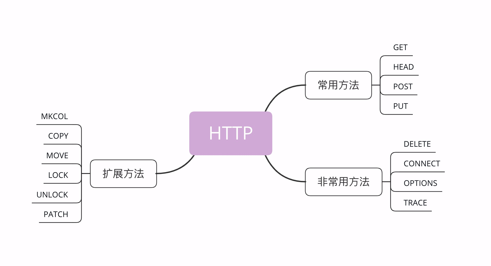

## 请求方法

它的实际含义就是客户端发出了一个“动作指令”，要求服务器端对 URI 定位的资源执行这个动作。

目前 HTTP/1.1 规定了八种方法，单词**都必须是大写的形式**，我先简单地列把它们列出来，后面再详细讲解。

1. <u>GET：获取资源，可以理解为读取或者下载数据；</u>
2. <u>HEAD：获取资源的元信息；</u>
3. <u>POST：向资源提交数据，相当于写入或上传数据；</u>
4. <u>PUT：类似 POST；</u>
5. <u>DELETE：删除资源；</u>
6. <u>CONNECT：建立特殊的连接隧道；</u>
7. <u>OPTIONS：列出可对资源实行的方法；</u>
8. <u>TRACE：追踪请求 - 响应的传输路径。</u>



客户端没有决定权，服务器掌控着所有资源，也就有绝对的决策权力。它收到 HTTP 请求报文后，看到里面的请求方法，可以执行也可以拒绝，或者改变动作的含义， HTTP 是一个“协议”，两边都要“商量着来”。

比如，你发起了一个 GET 请求，想获取“/orders”这个文件，但这个文件保密级别比较高，不是谁都能看的，服务器就可以有如下的几种响应方式：

1. **<u>假装这个文件不存在，直接返回一个 404 Not found 报文；</u>**
2. **<u>稍微友好一点，明确告诉你有这个文件，但不允许访问，返回一个 403 Forbidden；</u>**
3. **<u>再宽松一些，返回 405 Method Not Allowed，然后用 Allow 头告诉你可以用 HEAD 方法获取文件的元信息。</u>**

### GET/HEAD

它的含义是请求**从服务器获取资源**，这个资源既可以是静态的文本、页面、图片、视频，也可以是由 PHP、Java 动态生成的页面或者其他格式的数据。

**HEAD**方法与 GET 方法类似，也是请求从服务器获取资源，服务器的处理机制也是一样的，但服务器不会返回请求的实体数据，只会传回响应头，也就是资源的“元信息”。

> HEAD 方法可以看做是 GET 方法的一个“简化版”或者“轻量版”。因为它的响应头与 GET 完全相同，所以可以用在很多并不真正需要资源的场合，避免传输 body 数据的浪费。
>
> 比如，想要检查一个文件是否存在，**只要发个 HEAD 请求就可以了，没有必要用 GET 把整个文件都取下来。**再比如，要检查文件是否有最新版本，同样也应该用 HEAD，服务器会在响应头里把文件的修改时间传回来。

### POST/PUT

GET 和 HEAD 方法是从服务器获取数据，而 POST 和 PUT 方法则是相反操作，向 URI 指定的资源提交数据，数据就放在报文的 body 里。

POST 也是一个经常用到的请求方法，使用频率应该是仅次于 GET，应用的场景也非常多，只要向服务器发送数据，用的大多数都是 POST。

**<u>PUT 的作用与 POST 类似，也可以向服务器提交数据，但与 POST 存在微妙的不同，通常 POST 表示的是“新建”“create”的含义，而 PUT 则是“修改”“update”的含义。</u>**

### 其他方法

> 它们属于比较“冷僻”的方法，应用的不是很多。

**DELETE**方法指示服务器删除资源，因为这个动作危险性太大，所以通常服务器不会执行真正的删除操作，而是对资源做一个删除标记。当然，更多的时候服务器就直接不处理 DELETE 请求。

**CONNECT**是一个比较特殊的方法，要求服务器为客户端和另一台远程服务器建立一条特殊的连接隧道，这时 Web 服务器在中间充当了代理的角色。

**OPTIONS**方法要求服务器列出可对资源实行的操作方法，在响应头的 Allow 字段里返回。它的功能很有限，用处也不大，有的服务器（例如 Nginx）干脆就没有实现对它的支持。

**TRACE**方法多用于对 HTTP 链路的测试或诊断，可以显示出请求 - 响应的传输路径。它的本意是好的，但存在漏洞，会泄漏网站的信息，所以 Web 服务器通常也是禁止使用。

> 此外，还有一些得到了实际应用的请求方法（WebDAV），例如 MKCOL、COPY、MOVE、LOCK、UNLOCK、PATCH 等。如果有合适的场景，你也可以把它们应用到自己的系统里，比如用 LOCK 方法锁定资源暂时不允许修改，或者使用 PATCH 方法给资源打个小补丁，部分更新数据。但因为这些方法是非标准的，所以需要为客户端和服务器编写额外的代码才能添加支持。

### 安全与幂等

在 HTTP 协议里，所谓的“**安全**”是指请求方法不会“破坏”服务器上的资源，即不会对服务器上的资源造成实质的修改。

按照这个定义，只有 GET 和 HEAD 方法是“安全”的，因为它们是“只读”操作，只要服务器不故意曲解请求方法的处理方式，无论 GET 和 HEAD 操作多少次，服务器上的数据都是“安全的”。

而 POST/PUT/DELETE 操作会修改服务器上的资源，增加或删除数据，所以是“不安全”的。

所谓的“**幂等**”实际上是一个数学用语，被借用到了 HTTP 协议里，意思是多次执行相同的操作，结果也都是相同的，即多次“幂”后结果“相等”。

很显然，GET 和 HEAD 既是安全的也是幂等的，DELETE 可以多次删除同一个资源，效果都是“资源不存在”，所以也是幂等的。

按照 RFC 里的语义，POST 是“新增或提交数据”，多次提交数据会创建多个资源，所以不是幂等的；**<u>而 PUT 是“替换或更新数据”，多次更新一个资源，资源还是会第一次更新的状态，所以是幂等的。</u>**

## 响应状态码

要注意，它的名字是“状态码”而不是“错误码”。也就是说，它的含义不仅是错误，更重要的意义在于表达 HTTP 数据处理的“状态”，客户端可以依据代码适时转换处理状态，例如继续发送请求、切换协议，重定向跳转等，有那么点 TCP 状态转换的意思。

目前 RFC 标准里规定的状态码是三位数，所以取值范围就是从 000 到 999。**RFC 标准把状态码分成了五类，用数字的第一位表示分类**，这样状态码的实际可用范围就大大缩小了，由 000~999 变成了 100~599。

这五类的具体含义是：

- 1××：提示信息，表示目前是协议处理的中间状态，还需要后续的操作；
- 2××：成功，报文已经收到并被正确处理；
- 3××：重定向，资源位置发生变动，需要客户端重新发送请求；
- 4××：客户端错误，请求报文有误，服务器无法处理；
- 5××：服务器错误，服务器在处理请求时内部发生了错误。

> 在 HTTP 协议中，正确地理解并应用这些状态码不是客户端或服务器单方的责任，而是双方共同的责任。
>
> 客户端作为请求的发起方，获取响应报文后，<u>需要通过状态码知道请求是否被正确处理，是否要再次发送请求，如果出错了原因又是什么。</u>这样才能进行下一步的动作，要么发送新请求，要么改正错误重发请求。
>
> 服务器端作为请求的接收方，也应该很好地运用状态码。在处理请求时，<u>选择最恰当的状态码回复客户端，告知客户端处理的结果，指示客户端下一步应该如何行动。</u>特别是在出错的时候，尽量不要简单地返 400、500 这样意思含糊不清的状态码。

### 1××

1××类状态码属于提示信息，是协议处理的中间状态，实际能够用到的时候很少。

我们偶尔能够见到的是“**101 Switching Protocols**”。它的意思是客户端使用 Upgrade 头字段，要求在 HTTP 协议的基础上改成其他的协议继续通信，比如 WebSocket。而如果服务器也同意变更协议，就会发送状态码 101，但这之后的数据传输就不会再使用 HTTP 了。

### 2××

2××类状态码表示服务器收到并成功处理了客户端的请求，这也是客户端最愿意看到的状态码。

“**200 OK**”是最常见的成功状态码，表示一切正常，服务器如客户端所期望的那样返回了处理结果，如果是非 HEAD 请求，通常在响应头后都会有 body 数据。

**"201Created"**，该状态码表示已创建。成功请求并创建了新的资源，该请求已经被实现，而且有一个新的资源已经依据请求的需要而建立，且其 URI 已经随Location 头信息返回。

**"202 Accepted"**，状态码的响应的目的是允许服务器接受其他过程的请求（例如某个每天只执行一次的基于批处理的操作），而不必让客户端一直保持与服务器的连接直到批处理操作全部完成。一般情况下，用于异步处理请求返回。

“**204 No Content**”是另一个很常见的成功状态码，它的含义与“200 OK”基本相同，但响应头后没有 body 数据。所以对于 Web 服务器来说，正确地区分 200 和 204 是很必要的。

“**206 Partial Content**”是 HTTP 分块下载或断点续传的基础，在客户端发送“范围请求”、要求获取资源的部分数据时出现，它与 200 一样，也是服务器成功处理了请求，但 body 里的数据不是资源的全部，而是其中的一部分。

状态码 206 通常还会伴随着头字段“**Content-Range**”，表示响应报文里 body 数据的具体范围，供客户端确认，例如“Content-Range: bytes 0-99/2000”，意思是此次获取的是总计 2000 个字节的前 100 个字节。

### 3××

3××类状态码表示客户端请求的资源发生了变动，客户端必须用新的 URI 重新发送请求获取资源，也就是通常所说的“重定向”，包括著名的 301、302 跳转。

“**301 Moved Permanently**”俗称“永久重定向”，含义是此次请求的资源已经不存在了，需要改用改用新的 URI 再次访问。

与它类似的是“**302 Found**”，曾经的描述短语是“**Moved Temporarily**”，俗称“临时重定向”，意思是请求的资源还在，但需要暂时用另一个 URI 来访问。

301 和 302 都会在响应头里使用字段**Location**指明后续要跳转的 URI，最终的效果很相似，浏览器都会重定向到新的 URI。两者的根本区别在于语义，一个是“永久”，一个是“临时”，所以在场景、用法上差距很大。

比如，你的网站升级到了 HTTPS，原来的 HTTP 不打算用了，这就是“永久”的，所以要配置 301 跳转，把所有的 HTTP 流量都切换到 HTTPS。

再比如，今天夜里网站后台要系统维护，服务暂时不可用，这就属于“临时”的，可以配置成 302 跳转，把流量临时切换到一个静态通知页面，**浏览器看到这个 302 就知道这只是暂时的情况，不会做缓存优化，第二天还会访问原来的地址。**

“**304 Not Modified**” 是一个比较有意思的状态码，它用于 If-Modified-Since 等条件请求，表示资源未修改，用于缓存控制。它不具有通常的跳转含义，但可以理解成“重定向已到缓存的文件”（即“缓存重定向”）。

### 4××

4××类状态码表示客户端发送的请求报文有误，服务器无法处理，它就是真正的“错误码”含义了。

“**400 Bad Request**”是一个通用的错误码，表示请求报文有错误，但具体是数据格式错误、缺少请求头还是 URI 超长它没有明确说，只是一个笼统的错误，客户端看到 400 只会是“一头雾水”“不知所措”。所以，在开发 Web 应用时应当尽量避免给客户端返回 400，而是要用其他更有明确含义的状态码。

“**403 Forbidden**”实际上不是客户端的请求出错，而是表示服务器禁止访问资源。原因可能多种多样，例如信息敏感、法律禁止等，如果服务器友好一点，可以在 body 里详细说明拒绝请求的原因，不过现实中通常都是直接给一个“闭门羹”。

“**404 Not Found**”可能是我们最常看见也是最不愿意看到的一个状态码，它的原意是资源在本服务器上未找到，所以无法提供给客户端。但现在已经被“用滥了”，只要服务器“不高兴”就可以给出个 404，而我们也无从得知后面到底是真的未找到，还是有什么别的原因，某种程度上它比 403 还要令人讨厌。

4××里剩下的一些代码较明确地说明了错误的原因，都很好理解，开发中常用的有：

- **405 Method Not Allowed：不允许使用某些方法操作资源，例如不允许 POST 只能 GET；**
- **406 Not Acceptable：资源无法满足客户端请求的条件，例如请求中文但只有英文；**
- <u>408 Request Timeout：请求超时，服务器等待了过长的时间；</u>
- 409 Conflict：多个请求发生了冲突，可以理解为多线程并发时的竞态；
- 413 Request Entity Too Large：请求报文里的 body 太大；
- 414 Request-URI Too Long：请求行里的 URI 太大；
- <u>429 Too Many Requests：客户端发送了太多的请求，通常是由于服务器的限连策略；</u>
- 431 Request Header Fields Too Large：请求头某个字段或总体太大；

### 5××

5××类状态码表示客户端请求报文正确，但服务器在处理时内部发生了错误，无法返回应有的响应数据，是服务器端的“错误码”。

“**500 Internal Server Error**”与 400 类似，也是一个通用的错误码，服务器究竟发生了什么错误我们是不知道的。不过对于服务器来说这应该算是好事，通常不应该把服务器内部的详细信息，例如出错的函数调用栈告诉外界。虽然不利于调试，但能够防止黑客的窥探或者分析。

“**501 Not Implemented**”表示客户端请求的功能还不支持，这个错误码比 500 要“温和”一些，和“即将开业，敬请期待”的意思差不多，不过具体什么时候“开业”就不好说了。

> 一般如果不是重要接口，很少抛出501接口。很大体量的公司对社会开放的接口可能会提供这个有保留的状态码。

“**502 Bad Gateway**”通常是服务器作为网关或者代理时返回的错误码，表示服务器自身工作正常，访问后端服务器时发生了错误，但具体的错误原因也是不知道的。

“**503 Service Unavailable**”表示服务器当前很忙，暂时无法响应服务，我们上网时有时候遇到的“网络服务正忙，请稍后重试”的提示信息就是状态码 503。

503 是一个“临时”的状态，很可能过几秒钟后服务器就不那么忙了，可以继续提供服务，所以 503 响应报文里通常还会有一个“**Retry-After**”字段，指示客户端可以在多久以后再次尝试发送请求。

**”504 Gateway Timeout“** 与 502 Bad Gateway 类似，这个状态码一般是代理或网关服务器返回的，出现这个状态码意味着代理服务器在处理请求时超过了超时时间仍个没有从原始服务器接收到响应内容，也有可能是因为在解析原始服务器的域名时超时了。

**”505 HTTP Version Not Supported“** 客户端使用 HTTP 版本不被服务器支持，或者服务器拒绝支持客户端所使用的 HTTP 版本，使用向一个只支持 HTTP 1.0 的服务器发送了一个使用 HTTP 1.1 的请求，那么服务器可以响应 505 HTTP Version Not Supported。在 RFC 指出服务器如果发送了 505 HTTP Version Not Supported 状态码，那么同时也应该在响应中指出为什么客户端所用的 HTTP 版本不被支持以及服务器支持哪些协议的哪些版本。

## 实体数据

### 数据类型与编码

早在 HTTP 协议诞生之前就已经有了针对这种问题的解决方案，不过它是用在电子邮件系统里的，让电子邮件可以发送 ASCII 码以外的任意数据，方案的名字叫做“**多用途互联网邮件扩展**”（Multipurpose Internet Mail Extensions），简称为 MIME。

MIME 是一个很大的标准规范，但 HTTP 只“顺手牵羊”取了其中的一部分，用来标记 body 的数据类型，这就是我们平常总能听到的“**MIME type**”。

<u>MIME 把数据分成了八大类，每个大类下再细分出多个子类，形式是“type/subtype”的字符串，巧得很，刚好也符合了 HTTP 明文的特点，所以能够很容易地纳入 HTTP 头字段里。</u>

这里简单列举一下在 HTTP 里经常遇到的几个类别：

1. text：即文本格式的可读数据，我们最熟悉的应该就是 text/html 了，表示超文本文档，此外还有纯文本 text/plain、样式表 text/css 等。
2. image：即图像文件，有 image/gif、image/jpeg、image/png 等。
3. audio/video：音频和视频数据，例如 audio/mpeg、video/mp4 等。
4. application：数据格式不固定，可能是文本也可能是二进制，必须由上层应用程序来解释。

> 常见的有 application/json，application/javascript、application/pdf 等，另外，如果实在是不知道数据是什么类型，像刚才说的“黑盒”，就会是 application/octet-stream，即不透明的二进制数据。

但仅有 MIME type 还不够，因为 HTTP 在传输时为了节约带宽，有时候还会压缩数据，为了不要让浏览器继续“猜”，还需要有一个“Encoding type”，告诉数据是用的什么编码格式，这样对方才能正确解压缩，还原出原始的数据。

比起 MIME type 来说，Encoding type 就少了很多，常用的只有下面三种：

1. <u>gzip：GNU zip 压缩格式，也是互联网上最流行的压缩格式；</u>
2. <u>deflate：zlib（deflate）压缩格式，流行程度仅次于 gzip；</u>
3. <u>br：一种专门为 HTTP 优化的新压缩算法（Brotli）。</u>

### 数据类型使用的头字段

<u>HTTP 协议为此定义了两个 Accept 请求头字段和两个 Content 实体头字段，</u>用于客户端和服务器进行“**内容协商**”。也就是说，**客户端用 Accept 头告诉服务器希望接收什么样的数据，而服务器用 Content 头告诉客户端实际发送了什么样的数据。**


不过**Accept-Encoding/Content-Encoding是可以省略的**，如果请求报文里没有 Accept-Encoding 字段，就表示客户端不支持压缩数据；如果响应报文里没有 Content-Encoding 字段，就表示响应数据没有被压缩。

### 语言类型与编码

MIME type 和 Encoding type 解决了计算机理解 body 数据的问题，但互联网遍布全球，不同国家不同地区的人使用了很多不同的语言，虽然都是 text/html，但如何让浏览器显示出每个人都可理解可阅读的语言文字，这实际上就是“国际化”的问题。HTTP 采用了与数据类型相似的解决方案，又引入了两个概念：语言类型与字符集。

同样的，HTTP 协议也使用 Accept 请求头字段和 Content 实体头字段，用于客户端和服务器就语言与编码进行“**内容协商**”。

**Accept-Language**字段标记了客户端可理解的自然语言，也允许用“,”做分隔符列出多个类型，例如：

```
Accept-Language: zh-CN, zh, en
```

## HTTP传输大文件

### 数据压缩

通常浏览器在发送请求时都会带着“**Accept-Encoding**”头字段，里面是浏览器支持的压缩格式列表，例如 gzip、deflate、br 等，这样服务器就可以从中选择一种压缩算法，放进“**Content-Encoding**”响应头里，再把原数据压缩后发给浏览器。

<u>不过这个解决方法也有个缺点，gzip 等压缩算法通常只对文本文件有较好的压缩率，而图片、音频视频等多媒体数据本身就已经是高度压缩的，再用 gzip 处理也不会变小（甚至还有可能会增大一点），所以它就失效了。</u>

### 分块传输

压缩是把大文件整体变小，我们可以反过来思考，如果大文件整体不能变小，那就把它“拆开”，分解成多个小块，把这些小块分批发给浏览器，浏览器收到后再组装复原。

这种“**化整为零**”的思路在 HTTP 协议里就是“**chunked**”分块传输编码，在响应报文里用头字段“**Transfer-Encoding: chunked**”来表示，意思是报文里的 body 部分不是一次性发过来的，而是分成了许多的块（chunk）逐个发送。


下面我们来看一下分块传输的编码规则，其实也很简单，同样采用了明文的方式，很类似响应头。

1. <u>每个分块包含两个部分，长度头和数据块；</u>
2. <u>长度头是以 CRLF（回车换行，即\r\n）结尾的一行明文，用 16 进制数字表示长度；</u>
3. <u>数据块紧跟在长度头后，最后也用 CRLF 结尾，但数据不包含 CRLF；</u>
4. <u>最后用一个长度为 0 的块表示结束，即“0\r\n\r\n”。</u>

.png)


## HTTP的重定向和跳转

“**Location**”字段属于响应字段，必须出现在响应报文里。但只有配合 301/302 状态码才有意义，它**标记了服务器要求重定向的 URI**，这里就是要求浏览器跳转到“index.html”。

在“Location”里的 URI 既可以使用绝对 URI，也可以使用相对 URI。所谓“绝对 URI”，就是完整形式的 URI，包括 scheme、host:port、path 等。所谓“相对 URI”，就是省略了 scheme 和 host:port，只有 path 和 query 部分，是不完整的，但可以从请求上下文里计算得到。

### 重定向状态码

最常见的重定向状态码就是 301 和 302，另外还有几个不太常见的，例如 303、307、308 等。它们最终的效果都差不多，让浏览器跳转到新的 URI，但语义上有一些细微的差别，使用的时候要特别注意。

**301**俗称“永久重定向”（Moved Permanently），意思是原 URI 已经“永久”性地不存在了，今后的所有请求都必须改用新的 URI。

浏览器看到 301，就知道原来的 URI“过时”了，就会做适当的优化。比如历史记录、更新书签，下次可能就会直接用新的 URI 访问，省去了再次跳转的成本。搜索引擎的爬虫看到 301，也会更新索引库，不再使用老的 URI。

**302**俗称“临时重定向”（“Moved Temporarily”），意思是原 URI 处于“临时维护”状态，新的 URI 是起“顶包”作用的“临时工”。

浏览器或者爬虫看到 302，会认为原来的 URI 仍然有效，但暂时不可用，所以只会执行简单的跳转页面，不记录新的 URI，也不会有其他的多余动作，下次访问还是用原 URI。

301/302 是最常用的重定向状态码，在 3××里剩下的几个还有：

- 303 See Other：类似 302，但要求重定向后的请求改为 GET 方法，访问一个结果页面，避免 POST/PUT 重复操作；
- 307 Temporary Redirect：类似 302，但重定向后请求里的方法和实体不允许变动，含义比 302 更明确；
- 308 Permanent Redirect：类似 307，不允许重定向后的请求变动，但它是 301“永久重定向”的含义。

不过这三个状态码的接受程度较低，有的浏览器和服务器可能不支持，开发时应当慎重，测试确认浏览器的实际效果后才能使用。

### 重定向的相关问题

第一个问题是“**性能损耗**”。很明显，重定向的机制决定了一个跳转会有两次请求 - 应答，比正常的访问多了一次。

虽然 301/302 报文很小，但大量的跳转对服务器的影响也是不可忽视的。站内重定向还好说，可以长连接复用，站外重定向就要开两个连接，如果网络连接质量差，那成本可就高多了，会严重影响用户的体验。

所以重定向应当适度使用，决不能滥用。

第二个问题是“**循环跳转**”。如果重定向的策略设置欠考虑，可能会出现“A=>B=>C=>A”的无限循环，不停地在这个链路里转圈圈，后果可想而知。

所以 HTTP 协议特别规定，浏览器必须具有检测“循环跳转”的能力，在发现这种情况时应当停止发送请求并给出错误提示。

## HTTP的Cookie机制

### Cookie 的工作过程

这要用到两个字段：响应头字段**Set-Cookie**和请求头字段**Cookie**。

当用户通过浏览器第一次访问服务器的时候，服务器肯定是不知道他的身份的。所以，就要创建一个独特的身份标识数据，格式是“**key=value**”，然后放进 Set-Cookie 字段里，随着响应报文一同发给浏览器。

浏览器收到响应报文，看到里面有 Set-Cookie，知道这是服务器给的身份标识，于是就保存起来，下次再请求的时候就自动把这个值放进 Cookie 字段里发给服务器。

因为第二次请求里面有了 Cookie 字段，服务器就知道这个用户不是新人，之前来过，就可以拿出 Cookie 里的值，识别出用户的身份，然后提供个性化的服务。

> cookie是存储在浏览器内部的。如果从Chrome换成 Firefox 等其他浏览器，因为 Cookie 是存在 Chrome 里的，所以服务器就又“蒙圈”了，不知道你是谁，就会给 Firefox 再贴上小纸条。

### Cookie 的属性

####  Cookie 的生存周期

首先，我们应该**设置 Cookie 的生存周期**，也就是它的有效期，让它只能在一段时间内可用，就像是食品的“保鲜期”，一旦超过这个期限浏览器就认为是 Cookie 失效，在存储里删除，也不会发送给服务器。

Cookie 的有效期可以使用 Expires 和 Max-Age 两个属性来设置。

“**Expires**”俗称“过期时间”，用的是绝对时间点，可以理解为“截止日期”（deadline）。“**Max-Age**”用的是相对时间，单位是秒，浏览器用收到报文的时间点再加上 Max-Age，就可以得到失效的绝对时间。

<u>Expires 和 Max-Age 可以同时出现，两者的失效时间可以一致，也可以不一致，但**浏览器会优先采用 Max-Age 计算失效期**。</u>

#### **Cookie 的作用域**

作用域的设置比较简单，“**Domain**”和“**Path**”指定了 Cookie 所属的域名和路径，浏览器在发送 Cookie 前会从 URI 中提取出 host 和 path 部分，对比 Cookie 的属性。如果不满足条件，就不会在请求头里发送 Cookie。

#### **Cookie 的安全性**

写过前端的同学一定知道，在 JS 脚本里可以用 document.cookie 来读写 Cookie 数据，这就带来了安全隐患，有可能会导致“跨站脚本”（XSS）攻击窃取数据。

属性“**HttpOnly**”会告诉浏览器，此 Cookie 只能通过浏览器 HTTP 协议传输，禁止其他方式访问，浏览器的 JS 引擎就会禁用 document.cookie 等一切相关的 API，脚本攻击也就无从谈起了。

另一个属性“**SameSite**”可以防范“跨站请求伪造”（XSRF）攻击，设置成“SameSite=Strict”可以严格限定 Cookie 不能随着跳转链接跨站发送，而“SameSite=Lax”则略宽松一点，允许 GET/HEAD 等安全方法，但禁止 POST 跨站发送。

还有一个属性叫“**Secure**”，表示这个 Cookie 仅能用 HTTPS 协议加密传输，明文的 HTTP 协议会禁止发送。但 Cookie 本身不是加密的，浏览器里还是以明文的形式存在。

Chrome 开发者工具是查看 Cookie 的有力工具，在“Network-Cookies”里可以看到单个页面 Cookie 的各种属性，另一个“Application”面板里则能够方便地看到全站的所有 Cookie。

### Cookie 的应用

- Cookie 最基本的一个用途就是**身份识别**，保存用户的登录信息，实现会话事务。
- Cookie 的另一个常见用途是**广告跟踪**。你上网的时候肯定看过很多的广告图片，这些图片背后都是广告商网站（例如 Google），它会“偷偷地”给你贴上 Cookie 小纸条，这样你上其他的网站，别的广告就能用 Cookie 读出你的身份，然后做行为分析，再推给你广告。

## HTTP的缓存控制

由于链路漫长，网络时延不可控，浏览器使用 HTTP 获取资源的成本较高。所以，非常有必要把“来之不易”的数据缓存起来，下次再请求的时候尽可能地复用。这样，就可以避免多次请求 - 应答的通信成本，节约网络带宽，也可以加快响应速度。

整个流程翻译成 HTTP 就是：

1. <u>浏览器发现缓存无数据，于是发送请求，向服务器获取资源；</u>
2. <u>服务器响应请求，返回资源，同时标记资源的有效期；</u>
3. <u>浏览器缓存资源，等待下次重用。</u>

服务器标记资源有效期使用的头字段是“**Cache-Control**”，里面的值“**max-age=30**”就是资源的有效时间，相当于告诉浏览器，“这个页面只能缓存 30 秒，之后就算是过期，不能用。”

“Cache-Control”字段里的“max-age”和上一讲里 Cookie 有点像，都是标记资源的有效期。

但我必须提醒你注意，这里的 max-age 是“**生存时间**”（又叫“新鲜度”“缓存寿命”，类似 TTL，Time-To-Live），<u>时间的计算起点是响应报文的创建时刻（即 Date 字段，也就是离开服务器的时刻），而不是客户端收到报文的时刻，**也就是说包含了在链路传输过程中所有节点所停留的时间。**</u>

“max-age”是 HTTP 缓存控制最常用的属性，此外在响应报文里还可以用其他的属性来更精确地指示浏览器应该如何使用缓存：

- <u>no_store：**不允许缓存**，用于某些变化非常频繁的数据，例如秒杀页面；</u>
- <u>no_cache：它的字面含义容易与 no_store 搞混，实际的意思并不是不允许缓存，而是**可以缓存**，但在使用之前必须要去服务器验证是否过期，是否有最新的版本；</u>
- <u>must-revalidate：又是一个和 no_cache 相似的词，它的意思是如果缓存不过期就可以继续使用，但过期了如果还想用就必须去服务器验证。</u>

> 其实不止服务器可以发“Cache-Control”头，浏览器也可以发“Cache-Control”，也就是说请求 - 应答的双方都可以用这个字段进行缓存控制，互相协商缓存的使用策略。

### 条件请求

浏览器用“Cache-Control”做缓存控制只能是刷新数据，不能很好地利用缓存数据，又因为缓存会失效，使用前还必须要去服务器验证是否是最新版。

<u>浏览器可以用两个连续的请求组成“验证动作”：先是一个 HEAD，获取资源的修改时间等元信息，然后与缓存数据比较，如果没有改动就使用缓存，节省网络流量，否则就再发一个 GET 请求，获取最新的版本。</u>

但这样的两个请求网络成本太高了，所以 HTTP 协议就定义了一系列“**If**”开头的“**条件请求**”字段，专门用来检查验证资源是否过期，把两个请求才能完成的工作合并在一个请求里做。条件请求一共有 5 个头字段，我们最常用的是“**if-Modified-Since**”和“**If-None-Match**”这两个。<u>需要第一次的响应报文预先提供“**Last-modified**”和“**ETag**”，然后第二次请求时就可以带上缓存里的原值，验证资源是否是最新的。</u>

如果资源没有变，服务器就回应一个“**304 Not Modified**”，表示缓存依然有效，浏览器就可以更新一下有效期，然后放心大胆地使用缓存了。

“Last-modified”很好理解，就是文件的最后修改时间。<u>ETag 是“实体标签”（Entity Tag）的缩写，**是资源的一个唯一标识**，主要是用来解决修改时间无法准确区分文件变化的问题。</u>

**ETag 还有强弱之分。**强 ETag 要求资源在字节级别必须完全相符，弱 ETag 在值前有个“W/”标记，只要求资源在语义上没有变化，但内部可能会有部分发生了改变（例如 HTML 里的标签顺序调整，或者多了几个空格）。

## HTTP的代理服务

所谓的“代理服务”就是指服务本身不生产内容，而是处于中间位置转发上下游的请求和响应，具有双重身份：面向下游的用户时，表现为服务器，代表源服务器响应客户端的请求；而面向上游的源服务器时，又表现为客户端，代表客户端发送请求。

> 你也许听过这样一句至理名言：“计算机科学领域里的任何问题，都可以通过引入一个中间层来解决”

由于代理处在 HTTP 通信过程的中间位置，相应地就对上屏蔽了真实客户端，对下屏蔽了真实服务器，简单的说就是“**欺上瞒下**”。在这个中间层的“小天地”里就可以做很多的事情，为 HTTP 协议增加更多的灵活性，实现客户端和服务器的“双赢”。

### 代理的作用

- **负载均衡**: 因为在面向客户端时屏蔽了源服务器，客户端看到的只是代理服务器，源服务器究竟有多少台、是哪些 IP 地址都不知道。于是代理服务器就可以掌握请求分发的“大权”，决定由后面的哪台服务器来响应请求。

- **健康检查**：使用“心跳”等机制监控后端服务器，发现有故障就及时“踢出”集群，保证服务高可用；
- **安全防护**：保护被代理的后端服务器，限制 IP 地址或流量，抵御网络攻击和过载；
- **加密卸载**：对外网使用 SSL/TLS 加密通信认证，而在安全的内网不加密，消除加解密成本；
- **数据过滤**：拦截上下行的数据，任意指定策略修改请求或者响应；
- **内容缓存**：暂存、复用服务器响应。

### 代理相关头字段

> 代理的好处很多，但因为它“欺上瞒下”的特点，隐藏了真实客户端和服务器，如果双方想要获得这些“丢失”的原始信息。

代理服务器需要用字段“**Via**”标明代理的身份。

Via 是一个通用字段，请求头或响应头里都可以出现。每当报文经过一个代理节点，代理服务器就会把自身的信息追加到字段的末尾，就像是经手人盖了一个章。

Via 字段只解决了客户端和源服务器判断是否存在代理的问题，还不能知道对方的真实信息。

可惜的是 HTTP 标准里并没有为此定义头字段，但已经出现了很多“事实上的标准”，最常用的两个头字段是“**X-Forwarded-For**”和“**X-Real-IP**”。

“X-Forwarded-For”的字面意思是“为谁而转发”，形式上和“Via”差不多，也是每经过一个代理节点就会在字段里追加一个信息。但“Via”追加的是代理主机名（或者域名），而“X-Forwarded-For”追加的是请求方的 IP 地址。所以，在字段里最左边的 IP 地址就客户端的地址。

“X-Real-IP”是另一种获取客户端真实 IP 的手段，它的作用很简单，就是记录客户端 IP 地址，没有中间的代理信息，相当于是“X-Forwarded-For”的简化版。如果客户端和源服务器之间只有一个代理，那么这两个字段的值就是相同的。

## HTTPS

### 为什么要有 HTTPS？

简单的回答是“**因为 HTTP 不安全**”。

#### 什么是安全？

<u>**通常认为，如果通信过程具备了四个特性，就可以认为是“安全”的，这四个特性是：机密性、完整性，身份认证和不可否认。**</u>

- **机密性**（Secrecy/Confidentiality）是指对数据的“保密”，只能由可信的人访问，对其他人是不可见的“秘密”，简单来说就是不能让不相关的人看到不该看的东西。

- **完整性**（Integrity，也叫一致性）是指数据在传输过程中没有被窜改，不多也不少，“完完整整”地保持着原状。
- **身份认证**（Authentication）是指确认对方的真实身份，也就是“证明你真的是你”，保证消息只能发送给可信的人。
- **不可否认**（Non-repudiation/Undeniable），也叫不可抵赖，意思是不能否认已经发生过的行为，不能“说话不算数”“耍赖皮”。

它为 HTTP 增加了刚才所说的四大安全特性，秘密就在于 HTTPS 名字里的“S”，它把 HTTP 下层的传输协议由 TCP/IP 换成了 SSL/TLS，由“**HTTP over TCP/IP**”变成了“**HTTP over SSL/TLS**”，让 HTTP 运行在了安全的 SSL/TLS 协议上（可参考第 4 讲和第 5 讲），收发报文不再使用 Socket API，而是调用专门的安全接口。

#### SSL/TLS

SSL 即安全套接层（Secure Sockets Layer），在 OSI 模型中处于第 5 层（会话层），由网景公司于 1994 年发明，有 v2 和 v3 两个版本

SSL 发展到 v3 时已经证明了它自身是一个非常好的安全通信协议，于是互联网工程组 IETF 在 1999 年把它改名为 TLS（传输层安全，Transport Layer Security），正式标准化，版本号从 1.0 重新算起，所以 TLS1.0 实际上就是 SSLv3.1。

### 对称加密与非对称加密

#### 对称加密

**“对称加密”很好理解，就是指加密和解密时使用的密钥都是同一个，是“对称”的。**

TLS 里有非常多的对称加密算法可供选择，比如 RC4、DES、3DES、AES、ChaCha20 等，但前三种算法都被认为是不安全的，通常都禁止使用，目前常用的只有 AES 和 ChaCha20。

<u>AES 的意思是“高级加密标准”（Advanced Encryption Standard），密钥长度可以是 128、192 或 256。它是 DES 算法的替代者，安全强度很高，性能也很好，而且有的硬件还会做特殊优化，所以非常流行，是应用最广泛的对称加密算法。</u>

ChaCha20 是 Google 设计的另一种加密算法，密钥长度固定为 256 位，纯软件运行性能要超过 AES，曾经在移动客户端上比较流行，但 ARMv8 之后也加入了 AES 硬件优化，所以现在不再具有明显的优势，但仍然算得上是一个不错算法。

#### 非对称加密

对称加密看上去好像完美地实现了机密性，但其中有一个很大的问题：如何把密钥安全地传递给对方，术语叫“**密钥交换**”。所以，就出现了非对称加密（也叫公钥加密算法）。

它有两个密钥，一个叫“**公钥**”（public key），一个叫“**私钥**”（private key）。两个密钥是不同的，“不对称”，公钥可以公开给任何人使用，而私钥必须严格保密。

非对称加密算法的设计要比对称算法难得多，在 TLS 里只有很少的几种，比如 DH、DSA、RSA、ECC 等。

<u>RSA 可能是其中最著名的一个，几乎可以说是非对称加密的代名词，它的安全性基于“**整数分解**”的数学难题，使用两个超大素数的乘积作为生成密钥的材料，想要从公钥推算出私钥是非常困难的。</u>

10 年前 RSA 密钥的推荐长度是 1024，但随着计算机运算能力的提高，现在 1024 已经不安全，普遍认为至少要 2048 位。

<u>ECC（Elliptic Curve Cryptography）是非对称加密里的“后起之秀”，它基于“**椭圆曲线离散对数**”的数学难题，使用特定的曲线方程和基点生成公钥和私钥，子算法 ECDHE 用于密钥交换，ECDSA 用于数字签名。</u>

> 比起 RSA，ECC 在安全强度和性能上都有明显的优势。160 位的 ECC 相当于 1024 位的 RSA，而 224 位的 ECC 则相当于 2048 位的 RSA。因为密钥短，所以相应的计算量、消耗的内存和带宽也就少，加密解密的性能就上去了，对于现在的移动互联网非常有吸引力。

#### 混合加密

>  是不是认为可以抛弃对称加密，只用非对称加密来实现机密性呢？
>
> 很遗憾，虽然非对称加密没有“密钥交换”的问题，但因为它们都是基于复杂的数学难题，运算速度很慢，即使是 ECC 也要比 AES 差上好几个数量级。如果仅用非对称加密，虽然保证了安全，但通信速度极慢，实用性就变成了零。

那么，是不是能够把对称加密和非对称加密结合起来呢，两者互相取长补短，即能高效地加密解密，又能安全地密钥交换。这就是现在 TLS 里使用的**混合加密**方式，其实说穿了也很简单：

在通信刚开始的时候使用非对称算法，比如 RSA、ECDHE，首先解决密钥交换的问题。

然后用随机数产生对称算法使用的“**会话密钥**”（session key），再用公钥加密。因为会话密钥很短，通常只有 16 字节或 32 字节，所以慢一点也无所谓。

对方拿到密文后用私钥解密，取出会话密钥。这样，双方就实现了对称密钥的安全交换，后续就不再使用非对称加密，全都使用对称加密。

#### HTTPS只有加密还不够

对称加密和非对称加密，以及两者结合起来的混合加密，实现了机密性。但仅有机密性，离安全还差的很远。

黑客虽然拿不到会话密钥，无法破解密文，但可以通过窃听收集到足够多的密文，再尝试着修改、重组后发给网站。因为没有完整性保证，服务器只能“照单全收”。

另外，黑客也可以伪造身份发布公钥。如果你拿到了假的公钥，混合加密就完全失效了。

### 数字签名

实现完整性的手段主要是**摘要算法**（Digest Algorithm），也就是常说的散列函数、哈希函数（Hash Function）。

你可以把摘要算法近似地理解成一种特殊的压缩算法，它能够把任意长度的数据“压缩”成固定长度、而且独一无二的“摘要”字符串，就好像是给这段数据生成了一个数字“指纹”。

> 摘要算法实际上是把数据从一个“大空间”映射到了“小空间”，所以就存在“冲突”（collision，也叫碰撞）的可能性，好的摘要算法必须能够“抵抗冲突”，让这种可能性尽量地小。

你一定在日常工作中听过、或者用过 MD5（Message-Digest 5）、SHA-1（Secure Hash Algorithm 1），它们就是最常用的两个摘要算法，能够生成 16 字节和 20 字节长度的数字摘要。但这两个算法的安全强度比较低，不够安全，在 TLS 里已经被禁止使用了。

<u>目前 TLS 推荐使用的是 SHA-1 的后继者：SHA-2。</u>

<u>SHA-2 是一系列摘要算法的统称，总共有 6 种，常用的有 SHA224、SHA256、SHA384，分别能够生成 28 字节、32 字节、48 字节的摘要。</u>

#### 完整性

<u>摘要算法保证了“数字摘要”和原文是完全等价的。所以，我们只要在原文后附上它的摘要，就能够保证数据的完整性。</u>

不过摘要算法不具有机密性，如果明文传输，攻击者可以修改消息后把摘要也一起改了，网站还是鉴别不出完整性。<u>所以，真正的完整性必须要建立在机密性之上，在混合加密系统里用会话密钥加密消息和摘要，这样黑客无法得知明文，也就没有办法动手脚了。</u>

### 证书

有一个“**公钥的信任**”问题。因为谁都可以发布公钥，我们还缺少防止黑客伪造公钥的手段，也就是说，怎么来判断这个公钥就是你或者某宝的公钥呢？

<u>要终结这个“死循环”，**就必须引入“外力”，找一个公认的可信第三方，让它作为“信任的起点，递归的终点”，构建起公钥的信任链。**</u>

这个“第三方”就是我们常说的**CA**（Certificate Authority，证书认证机构）。具有极高的可信度，由它来给各个公钥签名，用自身的信誉来保证公钥无法伪造，是可信的。

CA 对公钥的签名认证也是有格式的，不是简单地把公钥绑定在持有者身份上就完事了，还要包含序列号、用途、颁发者、有效时间等等，把这些打成一个包再签名，完整地证明公钥关联的各种信息，形成“**数字证书**”（Certificate）。

知名的 CA 全世界就那么几家，比如 DigiCert、VeriSign、Entrust、Let’s Encrypt 等，它们签发的证书分 DV、OV、EV 三种，区别在于可信程度。

DV 是最低的，只是域名级别的可信，背后是谁不知道。EV 是最高的，经过了法律和审计的严格核查，可以证明网站拥有者的身份（在浏览器地址栏会显示出公司的名字，例如 Apple、GitHub 的网站）。

这还是信任链的问题。小一点的 CA 可以让大 CA 签名认证，<u>但链条的最后，也就是**Root CA**，就只能自己证明自己了，这个就叫“**自签名证书**”（Self-Signed Certificate）或者“**根证书**”（Root Certificate）。你必须相信，否则整个证书信任链就走不下去了。</u>

有了这个证书体系，操作系统和浏览器都内置了各大 CA 的根证书，上网的时候只要服务器发过来它的证书，就可以验证证书里的签名，顺着证书链（Certificate Chain）一层层地验证，直到找到根证书，就能够确定证书是可信的，从而里面的公钥也是可信的。

> 这里写的及其简化，以后如果遇到了，会针对这个场景，单独给这里关于证书详细的介绍一下。

### HTTPS建立连接

在 HTTP 协议里，建立连接后，浏览器会立即发送请求报文。但现在是 HTTPS 协议，它需要再用另外一个“握手”过程，在 TCP 上建立安全连接，之后才是收发 HTTP 报文。

#### TLS 协议的组成

TLS 包含几个子协议，你也可以理解为它是由几个不同职责的模块组成，比较常用的有记录协议、警报协议、握手协议、变更密码规范协议等。

**记录协议**（Record Protocol）规定了 TLS 收发数据的基本单位：记录（record）。它有点像是 TCP 里的 segment，所有的其他子协议都需要通过记录协议发出。但多个记录数据可以在一个 TCP 包里一次性发出，也并不需要像 TCP 那样返回 ACK。

**警报协议**（Alert Protocol）的职责是向对方发出警报信息，有点像是 HTTP 协议里的状态码。比如，protocol_version 就是不支持旧版本，bad_certificate 就是证书有问题，收到警报后另一方可以选择继续，也可以立即终止连接。

**握手协议**（Handshake Protocol）是 TLS 里最复杂的子协议，要比 TCP 的 SYN/ACK 复杂的多，浏览器和服务器会在握手过程中协商 TLS 版本号、随机数、密码套件等信息，然后交换证书和密钥参数，最终双方协商得到会话密钥，用于后续的混合加密系统。

#### 连接过程

1. 在 TCP 建立连接之后，浏览器会首先发一个“**Client Hello**”消息，也就是跟服务器“打招呼”。里面有客户端的版本号、支持的密码套件，还有一个**随机数（Client Random）**，用于后续生成会话密钥。

   ```yaml
   Handshake Protocol: Client Hello
       Version: TLS 1.2 (0x0303)
       Random: 1cbf803321fd2623408dfe…
       Cipher Suites (17 suites)
           Cipher Suite: TLS_ECDHE_RSA_WITH_AES_128_GCM_SHA256 (0xc02f)
           Cipher Suite: TLS_ECDHE_RSA_WITH_AES_256_GCM_SHA384 (0xc030)
   
   ```

2. 作为“礼尚往来”，服务器收到“Client Hello”后，会返回一个“Server Hello”消息。把版本号对一下，也给出一个**随机数（Server Random）**，然后从客户端的列表里选一个作为本次通信使用的密码套件，在这里它选择了“TLS_ECDHE_RSA_WITH_AES_256_GCM_SHA384”。

   ```yaml
   Handshake Protocol: Server Hello
       Version: TLS 1.2 (0x0303)
       Random: 0e6320f21bae50842e96…
       Cipher Suite: TLS_ECDHE_RSA_WITH_AES_256_GCM_SHA384 (0xc030)
   ```

3. 然后，服务器为了证明自己的身份，就把证书也发给了客户端（Server Certificate）。这个证书是CA签发的证书，这个证书里面有会包含公钥。当然，这里面会有自己的证书签名。

4. 之后是“**Server Hello Done**”消息，服务器说：“我逼逼完了”

5. 在客户端侧，客户端会根据证书来验证证书的有效性，完成对服务器的身份验证。

6. 然后，客户端按照密码套件的要求，也生成一个**椭圆曲线的公钥（Client Params）**，用“**Client Key Exchange**”消息发给服务器。

   > 现在客户端和服务器手里都拿到了密钥交换算法的两个参数（Client Params、Server Params），就用 ECDHE 算法一阵算，算出了一个新的东西，叫“**Pre-Master**”，其实也是一个随机数。
   >
   > 现在客户端和服务器手里有了三个随机数：**Client Random、Server Random 和 Pre-Master**。用这三个作为原始材料，就可以生成用于加密会 话的主密钥，叫“**Master Secret**”。
   >
   > 为什么非得这么麻烦，非要三个随机数呢？
   >
   > 这就必须说 TLS 的设计者考虑得非常周到了，他们不信任客户端或服务器伪随机数的可靠性，为了保证真正的“完全随机”“不可预测”，把三个不可靠的随机数混合起来，那么“随机”的程度就非常高了，足够让黑客难以猜测。

7. 有了主密钥和派生的会话密钥，握手就快结束了。客户端发一个“**Change Cipher Spec**”，然后再发一个“**Finished**”消息，把之前所有发送的数据做个摘要，再加密一下，让服务器做个验证。

8. 服务器也是同样的操作，发“**Change Cipher Spec**”和“**Finished**”消息，双方都验证加密解密 OK，握手正式结束，后面就收发被加密的 HTTP 请求和响应了。

#### 双向认证

到这里 TLS 握手就基本讲完了。

不过上面说的是“**单向认证**”握手过程，只认证了服务器的身份，而没有认证客户端的身份。这是因为通常单向认证通过后已经建立了安全通信，用账号、密码等简单的手段就能够确认用户的真实身份。

但为了防止账号、密码被盗，有的时候（比如网上银行）还会使用 U 盾给用户颁发客户端证书，实现“**双向认证**”，这样会更加安全。

双向认证的流程也没有太多变化，只是在“**Server Hello Done**”之后，“**Client Key Exchange**”之前，客户端要发送“**Client Certificate**”消息，服务器收到后也把证书链走一遍，验证客户端的身份。


