作为一名程序员，尤其是Java程序员，那必须得了解并掌握`HTTP/HTTPS`相关知识。因为在如今计算机网络通信中，`HTTP`协议的作用功不可没，无论是日常上网追剧、冲浪、亦或是接口开发、调用等，必然存在`HTTP`的“影子”在内。尤其对于`WEB`开发者而言，`HTTP`几乎是每天会打交道的东西。

## 一、HTTP超文本传输协议

  `HTTP`全称为`Hyper Text Transfer Protocol`超文本传输协议，它是基于`TCP`传输协议构建的应用层协议，作为支撑万维网`www`的核心协议，为了保证其效率及处理大量事务的能力，因此在设计时，`HTTP`被制定成为一种无状态协议，也就是说：**`HTTP`本身不会对发送过的请求和相应的通信状态进行持久化处理**。

> 也正因`HTTP`的无状态特征，所以在有些需要保持状态的场景中，则需要引入其他技术来实现，比如需要保持“登录状态、授权状态”时，需要配合`Cookie`来实现记录与管理状态。

`HTTP`于1990年提出后，经过多年的完善和扩展，目前已经存在多个主流版本的迭代：

目前`HTTP`主流应用版本还是`HTTP/1.1、2.0`。

### 1.1、HTTP协议工作流程

  `HTTP`核心由请求与响应构成，是一种典型基于客户端和服务器模型的协议，在目前的网络中，浏览器作为`HTTP`协议的主要载体，一般来说，“从浏览器发出请求到服务器返回响应”，这个过程被称为一次`HTTP`操作，也被称为一个事务，其具体过程如下：
 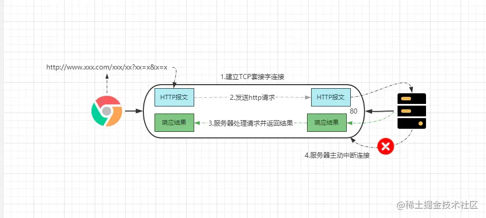

- ①客户端连接`WEB`服务器：浏览器与服务器的`HTTP/80`端口建立一个套接字连接。
- ②发送`HTTP`请求：根据用户的`URL`，通过套接字连接向服务器发送对应的请求报文。
- ③服务器处理请求并返回响应结果：解析请求、定位资源、执行逻辑后将结果写到套接字，客户端从套接字中获取结果。
- ④释放`TCP`套接字连接：默认情况下，服务器主动终止套接字连接，客户端被动关闭。

从建立连接发出请求，到服务器处理完成后，返回响应再关闭连接，既代表着一个“事务”就完成了，但客户端接受到响应后，还会存在：解析响应报文、渲染结果数据这两步操作。

> 接下来我们根据`HTTP`工作流程的先后顺序，依次拉开`HTTP`协议的完整序幕，如下：

- ①、URI资源标识符及URL资源定位符详解
- ②、`HTTP`报文-请求报文与响应报文
- ③、`HTTP`请求方法分类
- ④、`HTTP`请求状态码
- .......

### 1.2、URI资源标识符及URL资源定位符

  一般网络请求的前提是：需要用户在浏览器输入或点击超链接后，得到一个目标网址才会触发，而网址的专业术语为：**`URL`统一资源定位符**，而`URL`又是`URI`的一部分。
 但`URI`统一资源标识符这个词并没有`URL`那么普及，因此出现在大众视野中的次数并不多，它的作用是区分网络上不同的资源，主要涵盖了`URL`和`URN`两部分。

接下来看看`URL`的构成，一般来说完整的`URL`结构如下：
 
 但上述结构使用较少，`URL`的常用结构如下：
 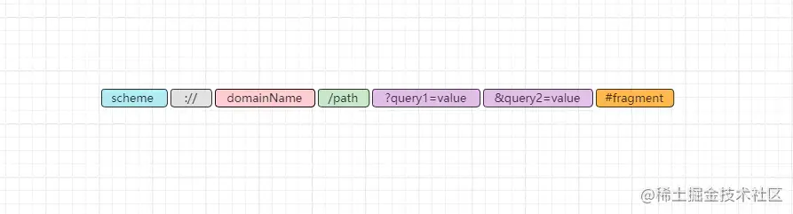
 我们依次分析看看：

- `scheme`：表示使用的协议类型，例如`http、https、ftp、chrome`等。
- `://`：协议类型与后续描述符之间的分隔符。
- `domainName`：网站域名，经`DNS`解析后会得到具体服务器`IP`。
- `/path`：请求路径，代表客户端请求的资源所在位置，不同层级目录之间用`/`区分。
- `?query1=value`：请求参数，`?`后面表示请求的参数，采用`K-V`键值对形式。
- `&query2=value`：多个请求参数，不同的参数之间用`&`分割。
- `#fragment`：表示所定位资源的一个锚点，浏览器可根据这个锚点跳转对应的资源位置。

> PS：锚点也被成为片段标识符，`#`部分之后的内容，即锚点不会被发送到服务器，锚点的作用仅是在浏览器解析时，跳转指定的位置显示。

对比完整的`URL`，常用的`URL`中除开用户名及密码外，还存在一点不同，即`host:port`主机IP+端口变为了`domainName`域名，那为什么又要这样做呢？

> ①`IP`不方便记忆，对于普通用户而言，一串数字远比不了“拼音缩写”，好比`www.baidu.com`任何人都能记住，但`14.215.177.38`却不行。
>  ②服务器的`IP`是动态多变，当网关宕机后换机部署时，`IP`又不相同了，但域名却是固定的，就算服务器`IP`再怎么变，域名都不会更换。

用户请求的域名又是如何变成具体`IP`的呢？这里面就得提及另一个概念：`DNS`解析。

#### 1.2.1、DNS域名解析系统

  在计算机网络中，每个主机都存在一个`IP`地址，但由于`IP`是一串数字不方便人类记忆，因此出现了一种协议名为`DNS`，它可以把生涩的`IP`地址转换为便于人类记忆的域名，例如百度的：`www.baidu.com`。

  `DNS(Domain Name System)`中文的意思是域名系统，每个互联网企业`WEB`网站都可以看作是它自己在网上的门户，那么每个网站的域名就类似于“门牌号”，通常情况下，为了方便正常人记忆，域名都会使用公司的名称或简称，例如`www.taobao.com、www.baidu.com、www.jd.com`等，因此当你要访问一个`Web`网站，但又不知道其确切域名时，那么你首先可以输入其公司名称试试看。

> 趣事：因为一个公司域名大部分情况下都是由其名称或简称构成，因此有些人会大量注册域名，然后再高价转卖给这些公司，以此牟利。比如美图秀秀的`Boss`蔡文胜，就以转卖域名为起点，从而跃身百亿富豪。

因特网最开始仅由几百台计算机组成，因此最初的域名与`IP`映射关系都是被保存在本地的`Hosts.txt`文件中，每台因特网中的机器都从服务器上下载`Hosts`文件，然后发送请求时就从本地查询`IP`信息，但随着接入因特网的设备越来越多，因此原有的这种方式无法满足日益增长的因特网需求。

毕竟全球的设备都在不断的接入因特网，上网时都在使用域名访问，不过世界上并不存在一台`DNS`服务器可以映射所有的`IP`，所以域名系统最终被设计成了一个：**带有层次结构的分布式`K-V`数据库**，整个`DNS`由很多服务器共同组成的，大体结构如下：
 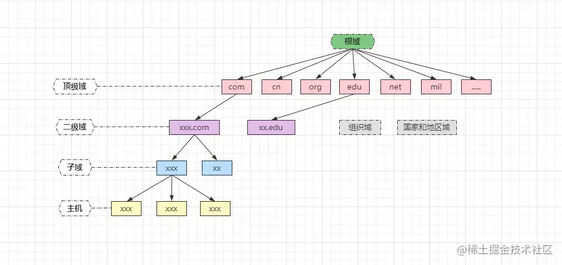

> PS：比如`www.baidu.com`，实际上完整的域名为：`www.baidu.com.`，根域则是最后的`.`，系统做了兼容，不需要用户手动写出。

因特网上的域名服务系统也是按照域名的层次来划分的，每一个域名服务器都只对域名体系中的一部分进行管辖，`DNS`服务器主要分为三类：

- ①根域名服务器
- ②`TLD`顶级域名服务器
- ③授权域名（子域）服务器

除此之外，还存在一种本地`DNS`服务器，但这个并不归纳在域名系统的分层结构中，不过本地`DNS`服务器却是`DNS`至关重要的一环。

##### DNS域名查询

`DNS`中主要分为递归查询、迭代查询两种方式：

- ①全递归查询：

> 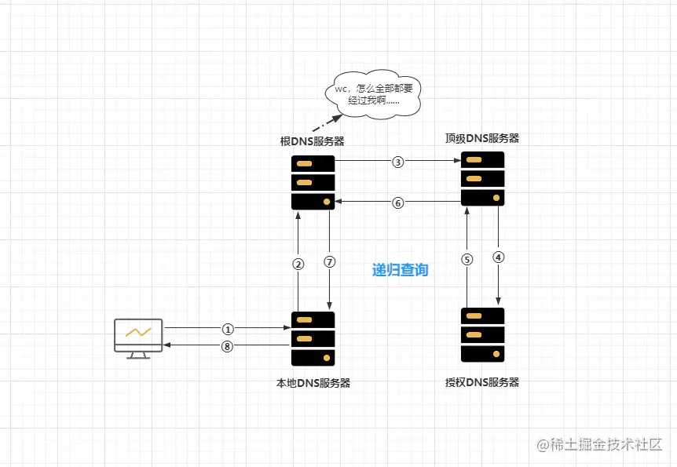
>  递归查询的意思是指：客户端只需发出一次请求，就能得到相应的解析结果。

- ②先递归+后迭代查询：

> 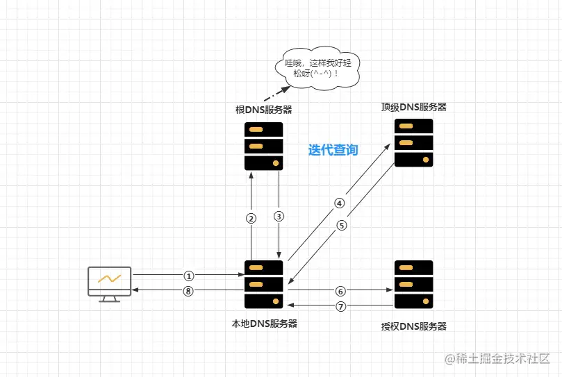
>  迭代查询的意思是指：客户端需经过多次请求查询，才能得到相应的解析结果。

当然，上述过程无论是迭代还是递归查询，对于上层`DNS`服务器而言，全球的访问压力都足以让其瘫痪，因此`DNS`中还存在一个重要的概念：`DNS`缓存：

- 本地`DNS`/非授权服务器缓存：各大运营商或大公司都有自己的`DNS`服务器，一般部署在距离用户较近地方，代替用户访问核心`DNS`系统，同时这些`DNS`服务器可以缓存之前的查询结果，下次出现相同的`DNS`解析请求时，可直接返回已缓存的`IP`。

- 本地计算机

  ```
  DNS
  ```

  缓存：计算机本地缓存主要分为

  操作系统缓存

  与

  浏览器缓存

  两种：

  - 浏览器缓存一般会有时间限制，如`Chrome`浏览器默认是`1min`，一分钟内请求该域名，都会直接从本地缓存中获取`IP`。
  - 操作系统缓存是指本地的`hosts`文件，在浏览器中无法获取映射`IP`时，会尝试从`hosts`文件中获取。

> 注意：主机和本地域名服务器之间的查询方式是递归查询，本地域名服务器和其他域名服务器之间的查询方式是迭代查询，防止根域名服务器压力过大，也就是代表着：一般情况下`DNS`解析请求都采用**先递归+后迭代方式**。

当用户在浏览器向一个域名发出请求后，`DNS`解析请求具体查询过程如下：

- ①客户端输入域名准备访问网站。
- ②先查询「浏览器的`DNS`缓存」，命中直接向`IP`发起访问，未命中继续往下。
- ③继续查询「`OS`的`hosts`文件」，如果仍然未命中，则向「本地域名服务器」发起「递归查询」请求。
- ④「本地域名服务器」先查询自身缓存，未命中则向「根域名服务器」进行「迭代查询」：
  - A.「根域名服务器」返回「顶级域名服务器」的地址
  - B.「本地域名服务器」再根据地址向「顶级域名服务器」发起查询
  - C.「顶级域名服务器」返回负责该「域名」的「授权域名服务器」地址
  - D.「本地域名服务器」再根据地址向「授权域名服务器」发起查询
  - E.「授权域名服务器」返回「域名」的具体`IP`地址
- ⑤「本地域名服务器」将`IP`返回给客户端并将「域名/`IP`映射」缓存起来。
- ⑥「浏览器」得到`IP`后，向其发出具体的「用户请求」，并将「域名/`IP`映射」缓存。

至此`URL`这块的内容已经分析明白了，接着继续往下看看。

### 1.3、HTTP报文的组成结构

  浏览器访问服务器的过程中，解析域名得到具体`IP`后，会将用户的请求组装成`HTTP`报文，`HTTP`报文主要分为请求报文与应答（响应）报文两类。

#### 1.3.1、请求报文

  用户请求服务器时，发送的报文被称为请求报文，大体结构如下：
 
 请求报文主要由**请求行、请求头、空行、请求主体**四部分组成。

##### 请求行

请求行也被称为起始行，主要包含**请求方法、资源路径以及协议版本**三部分，具体如下：

```java
GET /index.html HTTP/1.1
```

注意：**报文中每个不同的部位之间必须要用`SP`空格隔开，末尾需要有一个`CRLF`回车换行符，遵循`ABNF`语法规范。**

##### 请求头

不管是请求头亦或是响应头，都可以算是`HTTP`报文中最复杂的内容，因为其中可选字段是非常多的，一般来说头部字段遵循如下规范：

- 每个字段名与字段值以`K-V`键值对形式传递。
- 字段名不区分字母的大小写。
- 字段名中不允许出现非法字符，如空格、`/、&、^、_、@、}.....`
- 字段名与字段值之间必须以`:`分割。

> 后续《`HTTP`报文字段》章节再详细分析。

##### 空行

必须存在，主要作用是用于区分请求头部和请求主体，也就是一个`CRLF`回车换行符，用于告知服务器剩下的报文中不再含有头信息。

##### 请求主体

也被称为`HTTP`实体，在请求报文中被称为请求主体，这里主要描述用户的请求数据，可以是二进制数据，也可以是请求参数等等。

#### 1.3.2、应答报文

  服务器响应用户请求时，返回的报文被称为应答报文，大体结构如下：
 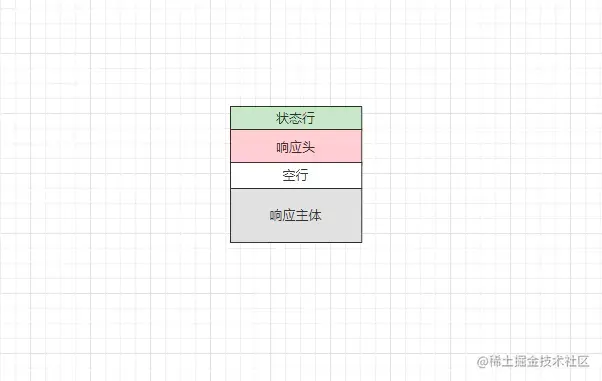
 应答报文主要由**状态行、响应头、空行、响应主体**四部分组成。

##### 状态行

应答报文中的状态行主要由**协议版本、状态码、状态描述**三部分构成，如下：

```java
HTTP/1.1 200 OK
```

响应状态码也被称为`HTTP`状态，同样存在多种，因此放在后续分析。

##### 响应头

和请求头类似，遵循相同的字段规范，唯一不同点在于字段类型不同。

##### 空行

作用与请求报文中的空行类似，主要用于分割响应头和响应主体，用于通知客户端剩下的报文中没有响应头信息。

##### 响应主体

根据用户请求中的资源路径，返回对应的资源数据，可以是`HTML、XML、JSON、String、Bytes`等各种数据类型。

#### 1.3.3、HTTP报文字段

  在前面分析报文头部时，提到头部存在很多可选字段，而`HTTP`报文字段主要可分为五大类：

- 请求报文字段：支持`HTTP`请求的报文字段，用于请求头中。
- 应答报文字段：支持`HTTP`响应的报文字段，用于响应头中。
- 实体首部字段：描述`HTTP`实体内容的报文字段，可应用在请求主体与响应主体中。
- 通用报文字段：同时支持`HTTP`请求与响应的字段，即可用于请求头，也可用于响应头。
- 其他报文字段：并非在`HTTP`协议中定义的报文字段，但实际过程中经常使用的字段。

##### 请求报文字段

客户端请求目标服务器时，可在请求报文头部中添加的字段：

- ```
  Accept
  ```

  ：代表客户端支持的数据类型，可选项如下：

  - 文本类型：
    - `text/html`：希望服务器返回`HTML`类型的数据。
    - `text/plain`：希望服务器返回普通文本类型的数据。
    - `text/css`：希望服务器返回`CSS`类型的数据。
    - `application/xml`：希望服务器返回`XML`类型的数据。
    - `application/json`：希望服务器返回`JSON`类型的数据。
  - 图片类型：
    - `iamge/jpeg`：表示希望返回`.jpg`格式的图片。
    - `image/gif`：表示希望返回`.gif`格式的图片。
    - `image/png`：表示希望返回`.png`格式的图片。
    - `image/webp`：表示希望返回`.webp`格式的图片。
  - 视频类型：
    - `video/mpeg`：希望服务器返回视频数据。
    - `video/quicktime`：希望服务器返回`MAC`电脑的视频类型数据。
  - 字节类型：
    - `application/octet-stream`：希望返回字节流数据。
    - `application/zip`：希望返回`ZIP`压缩字节数据。
  - `*/*`：表示接受所有类型的数据返回。
  - `Accept`字段可设置多个值，服务器会依次进行匹配，会返回最先匹配到的数据类型。
  - 也可以通过参数`q`来设置权重，权重越高，优先级越高，取值范围`0.000~1`，默认为`1`。
  - 例如`text/html,application/xml;q=0.9,*/*`，优先匹配`HTML`数据，当服务器先匹配到`XML`数据时，因`HTML`权重高一些，因此会依然继续匹配`HTML`数据。

- `Accept-Charset`：表示客户端支持的字符集，如`GB2312,ISO-8859-1,UTF-8`等。

- ```
  Accept-Encoding
  ```

  ：表示客户端支持的内容编码格式，常用格式如下：

  - `gzip`：由`gzip`压缩算法生成的压缩数据编码格式。
  - `compress`：由`compress`压缩算法生成的压缩数据编码格式。
  - `deflate`：由`zlib+deflate`压缩算法生成的压缩数据编码格式。
  - `identity`：默认的编码格式，表示不压缩数据。

- `Accept-Language`：表示客户端支持的语言语种，如`zh-cn,en,zh`等。

- `Authorization`：表示客户端的认证信息。

- `Host`：表示客户端访问的目标资源所在的主机，即域名，如`www.baidu.com`。

- `Referer`：资源引用链，也称为防盗链，表示获取资源的请求来自哪个页面。

- `If-Match`：实体标记，该值与请求的目标资源`ETag`值一致时，服务器才受理该请求。

- `If-Modified-Since`：效验客户端本地资源的时效性，如果本地的缓存资源没有超时则不处理请求。

- `If-None-Match`：和`If-Match`作用相反，该值与`ETag`值不一致时才处理请求。

- `If-Range`：`If-Match`的升级版，访问的资源`ETag`值或时间一致时，服务器处理此请求。

- `If-Unmodified-Since`：`If-None-Match`的升级版，与`If-Range`作用相反。

- `Max-Forwards`：最大传输逐跳数，也就是请求允许被转发的最大次数，转发一次就`-1`。

- `Proxy-Authorization`：客户端提供给代理服务器的认证信息。

- `Range`：表示获取部分资源，如`Range:bytes=50-800`，代表获取第`50~800`字节之间的数据。

- `User-Agent`：客户端程序的信息，一般情况为当前浏览器的简略信息。

- `TE`：传输编码的优先级。

- `..........`

##### 应答报文字段

客户端请求服务器后，服务器响应客户端时，应答报文中可出现的字段：

- `Accept-Ranges`：表示服务器是否接受按字节范围获取数据的请求。
- `Age`：表示服务器创建响应资源的时间。
- `ETag`：实体的标识，资源的匹配信息。
- `Location`：告诉客户端资源的重定向位置/（`URL`）路径。
- `Proxy-Authenticate`：将代理服务器需要的认证信息返回给客户端。
- `Retry-After`：请求失败后，告诉客户端多久后重试。
- `Server`：告知客户端目前服务端的`HTTP`服务器信息，一般为`Nginx`。
- `WWW-Authenticate`：客户端请求资源失败时，告知其目标资源所需的认证方案，如`Basic、Digest`，一般配合`401`使用。
- `status`：客户端请求后的响应状态。
- `Vary`：代理服务器的缓存管理信息。

##### 实体首部字段

实体也就是指请求的目标资源，任何一个数据在`HTTP`协议中都可被称为`HTTP`实体：

- `Allow`：告知客户端所请求的资源支持的`HTTP`方法，如请求方法错误会以`405`状态返回。
- `Content-Encoding`：告知客户端资源（实体）数据所采用的编码方式。
- `Content-Language`：告知客户端资源所采用的自然语言，即`zh-ch、en-US`等。
- `Content-Length`：告知客户端资源的大小（字节长度）。
- `Content-MD5`：告知客户端资源的报文摘要。
- `Content-Location`：告知客户端资源所在的位置。
- `Content-Range`：告知客户端资源接受按字节区域获取的范围。
- `Content-Type`：告知客户端资源的数据类型。
- `Expires`：告知客户端资源的过期时间。
- `Last-Modified`：告知客户端资源最后一次的修改时间。

##### 通用报文字段

通用报文字段是指可用于请求报文、应答报文、实体首部等多处位置的共享字段：

- ```
  Cache-Control
  ```

  ：控制浏览器缓存的行为，常用选项如下：

  - `max-age=N`：请求到资源后将其缓存在本地，有效期为`N`秒。
  - `no-cache`：协商式缓存，请求到资源后缓存到本地，后续每次请求资源时先与服务器确认是否更新过，更新则重新请求，否则从缓存中读取资源。
  - `no-store`：禁用浏览器本地缓存，每次从服务器上获取资源。
  - `max-age=N,must-revalidate`：请求到资源后将其缓存，有效期为`N`秒，到期后再与服务器协商确认资源是否更新，未更新则延长有效期，否则重新获取。

- `Connection`：是否开启长连接，设为`Keep-Alive`代表开启长连接。

- `Date`：`HTTP`报文的创建时间，使用格林威治标准格式。

- `Pragma`：`1.1`版本之前的历史遗留字段，为了兼容而设计的。

- `Transfer-Encoding`：指定了报文主体传输时的编码格式，如`Transfer-Encoding: chunked`。

- `Upgrade`：用于检测协议版本，是否有其他更高的版本可用。

- `Via`：追踪客户端和服务端之间的报文的传输路径，一般在使用代理服务器时必须要用的字段。

- `Warning`：告知客户端一些与缓存相关的警告信息。

##### 其他报文字段

其他报文字段是指并非在`HTTP`协议中定义的字段，但依旧使用频率较为频繁的字段：

- `Cookie`：由于`HTTP`是一种无状态协议，因此通常使用`Cookie`也实现一些需要保持状态的功能，如身份`Token`、登录信息等，一般用于请求报文中。

- ```
  Set-Cookie
  ```

  ：一般用于应答报文中，实现服务器给客户端传递

  ```
  Cookie
  ```

  信息，常用属性如下：

  - `Key=Value`：往客户端的`Cookie`中写入值。

  - `expires=N`：设置客户端`Cookie`的有效期。

  - `domin`：指定`Cookie`生效的域名，只有请求该域名时才会携带`Cookie`。

  - `path`：指定`Cookie`生效的具体资源路径，只有访问该路径时才会携带。

  - `Secure`：设置该属性后，只有安全连接（`HTTPS`）情况下才会保存`Cookie`。

  - ```
    SameSite
    ```

    ：在跨域时是否携带

    ```
    Cookie
    ```

    ：

    - `Strict`：跨域时严禁携带本站`Cookie`。
    - `Lax`：默认值，通过`GET`方式访问之后可允许携带。
    - `None`：在设置了`Secure`属性情况下，所有请求都允许携带。

  - `HttpOnly`：使`Cookie`不能被`JS`脚本访问。

- ```
  Content-Disposition
  ```

  ：主要用于文件上传与下载时指定操作和名称：

  - 上传时：
    - `form-data`：以表单形式提交`multipart`数据。
  - 下载时：
    - `inline`：将文件内容直接在网页上显示。
    - `attachment`：下载文件时弹出对话框让用户确认下载。
  - `filename`：下载/上传时指定文件的名称。

> OK~，大致清楚`HTTP`重的报文字段后，接着再来看看`HTTP`状态码。

#### 1.3.4、HTTP状态码

  在咱们做程序开发时，通过`URL`访问某个网站，通常都会在开发者调试工具重看到各式各样的“数字”，例如常见的`200、403、404、500`等，这些数字在`HTTP`协议中专业称呼为：**HTTP状态码**。
 `RFC`中规定了状态码必须要为**三位数**，其中第一个数代表了响应状态的类别，`HTTP`中所有的状态码共被分为五大类别：

- `1xx/(Informational)`：信息性状态码，代表请求被成功接受，正在处理请求。
- `2xx/(Success)`：成功状态码，客户端的请求被成功处理并返回。
- `3xx/(Redirection)`：重定向状态码，请求的资源位置发生变动，需重新请求。
- `4xx/(ClientError)`：客户端错误状态码，客户端请求出现错误导致请求失败。
- `5xx/(ServerError)`：服务端错误状态码，请求的服务端内部错误导致请求无法处理。

牢记如上规则后，之后再看见状态码时，不管见没见过，都可以根据其首位数字推断出一个请求的大体状态，例如：

- `200`：以`2`开头，代表请求成功，服务端正常接受并处理了该请求。
- `301`：以`3`开头，代表请求的资源位置发生变动，请求会被重定向，重新请求新位置。
- `404`：以`4`开头，代表客户端出现错误，请求的路径不正确导致服务端无法定位资源。
- `500`：以`5`开头，代表服务端出现错误，服务端在处理请求的目标资源时，执行过程出现错误。
- `.......`

### 1.4、HTTP请求方法分类

  同时，`HTTP`协议中发送请求的方法存在多种，`HTTP/1.0`中提供了三个请求方法，`HTTP/1.1`中新增六个请求方法：

- `GET`：一般用于获取资源数据，如获取用户信息、商品信息、首页数据等。
- `POST`：一般用于传输/提交资源数据，如提交表单数据、提交字节数据等。
- `HEAD`：向服务器发送类似于`GET`方式的请求，但只要求返回头信息，不返回主体数据。
- `PUT`：一般用于修改数据，向指定路径上的资源提交最新数据并将其全量替换。
- `PATCH`：和`PUT`方法类似，`PUT`是全量更新，`PATCH`可以只修改部分数据。
- `DELETE`：一般用于删除资源/数据，如移除服务器上某文件资源等。
- `OPTIONS`：列出请求的目标资源所支持的请求方法，用来跨域请求。
- `TRACE`：追踪客户端请求/服务端响应路径，用于测试或诊断出错。
- `CONNECT`：在与代理服务器通信时建立连接隧道，使用隧道进行`TCP`通信。

其中最常用的是`GET/POST`两种方式，其他的方法相对比而言，正常业务用的频率并不高。

#### 面试题：HTTP中Get和Post方法的区别

- ①`HTTP`中功能的定义不同，`GET`用来获取数据，`POST`用于提交数据。
- ②传输数据的方式不同，`GET`直接在`URL`拼接参数显式传输，`POST`则是隐式传输。
- ③允许传输数据时的长度不同，`GET`通常情况下受到浏览器和服务器的限制，因此可传输的参数有限，而`POST`则没有限制。
- ④`GET`总体而言，执行的效率远高于`POST`方式，`GET`也是`form`表单的默认方法。
- ⑤支持的数据传输格式不同，`GET`仅支持`ASCII`字符，而`POST`支持整个`ISO10646`字符集。
- ⑥安全性不同，`GET`由于是显式传输，数据被放在`URL`中，因此安全性远低于`POST`方式。
- ⑦浏览器缓存方面支持性不同，`GET`请求的资源默认会被浏览器缓存，下次请求相同资源会直接从本地中读取，而`POST`请求的资源默认情况下不会缓存。
- ⑧一次请求产生的数据包数量不同，`GET`只会发出一个`TCP`包，`POST`会将头信息和主体信息分成两个包发送。
- ⑨当浏览器回退或前进时，`GET`方式获取的资源可直接使用，而`POST`则会重新请求服务器获取资源（因为`GET`可以从本地缓存中读取资源）。

### 1.5、HTTP中的其他常用核心知识

  在`HTTP`协议中，还存在一些其他常用技术，如长连接、隧道技术、代理技术、缓存技术等，接下来再来看看这些核心内容。

#### 1.5.1、持久连接/长连接

  前面曾谈到过：`HTTP`是基于“请求/响应”模型所构建的协议，每次请求时，客户端和服务端之间都要新建立一个连接，服务端响应完成后又会立马断开连接。这种方式带来的缺点很明显，频繁的创建/销毁`TCP`连接造成的开销较大，资源浪费较多。
 在`HTTP`中为了解决频繁创建/销毁`TCP`连接造成的开销，从而设计了一种`Keep-Alive`（长连接/持久连接）模式，开启这种模式的情况下，可以复用已建立的`TCP`连接，普通模式与长连接模式对比如下：
 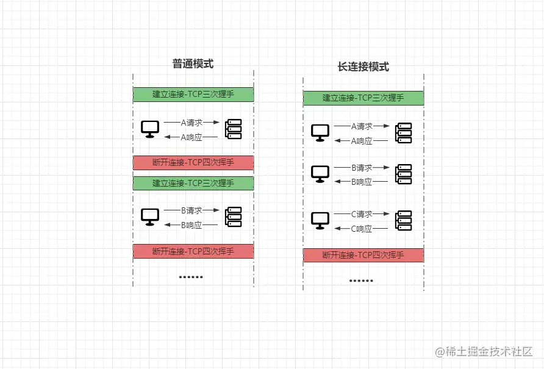
 长连接模式下，当一个客户端的请求与服务端建立连接后，这个连接并不会在服务端响应结果后立马关闭，而是会持续有效，后续新的请求获取服务器资源时，可以通过这个`TCP`连接发送多个请求与接收多个响应。

> `HTTP/1.0`中默认关闭，需要手动在请求头中添加`Connection: Keep-Alive`才可开启，`HTTP/1.1`默认开启，可以手动添加`Connection: close`关闭。

对于长连接模式，听起来确实很美好的样子，这点无可厚非，但这种模式对于服务器而言，会造成很大的并发压力，同时还存在一个经典问题：**队头阻塞**。

#### 1.5.2、HTTP队头阻塞

  因为`HTTP`协议事务处理机制中，要求对于请求的处理必须为“一求一应/一发一收”，所以`HTTP`本质上会将请求串行化，所有的请求会被放入到一个队列中依次交由服务器处理，那么假设前面的请求任务执行时间过长，最终就会导致后面的所有请求全部被阻塞，因此这个问题就被称为**队头阻塞**。

> 解决队头阻塞问题的方案有两种：**并发连接与域名分片**。

- 并发连接：

> 一个连接中的请求会被串行化后依次递交给服务器处理，那么假设我们客户端同时建立多个连接，是不是就会有多个串行化的通道呢？也就是多个队列，这答案是必然的，因此在客户端建立多个连接，可以增加队列数量，一个队列中的请求阻塞，并不会影响其他队列中的请求。
>
> > 不过在`RFC2616`中规定了一个客户端的并发连接不允许超过`2`个，但实际的浏览器设计中并不遵循该标准，如`Chrome`内核中默认允许一个域名下的并发连接值是`6`个，`Firefox`则是`8`个。

> 但就算是增加到了`6`个，万一其中`4`个连接中，都出现了执行时间过长的请求导致阻塞怎么办呢？哪此时可以多上几个域名，既采用**域名分片**方案。

- 域名分片：

> 前面提及过，一个域名可以支持多个并发连接，但如果开到了客户端的上限后，依旧无法满足需求会出现一定程度上的请求阻塞，此时我们可以多上几个域名，也就是可以多准备几个域名，然后域名配置的`IP`映射都指向同一台服务器，这样就可以支持更多的连接了，例如`www.baidu.com`：
>  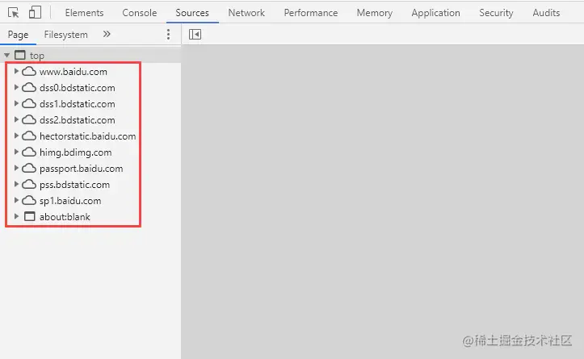
>  经过这个分析之后，你应该也大致清楚了为什么你做的网站访问速度慢的主要原因之一，因为你的请求出现了队头阻塞，服务器串行处理的速度过长，导致了你网页加载速度过慢。

#### 1.5.3、HTTP代理技术

  一般情况下，客户端和服务端之间的通信都是采用直连模式，即客户端解析域名后直接根据`IP`请求后端服务器，然后服务器处理客户端请求。但这种模式下，假设后端节点出现故障宕机，那么整个系统则会陷入瘫痪。同时这种模式，也无法解决部署后端节点的服务器性能瓶颈问题，因此为了确保系统更高的可用性和稳定拓展性，此时则可以加入 **`HTTP`代理**。
 `HTTP`代理大家听的次数应该也不算少，代理的主要含义是指：在客户端与服务端之间假设一个节点，从而能够满足开发过程中的更多需求，如动静分离、负载均衡、服务高可用、网站安全等，大体示意图如下：
 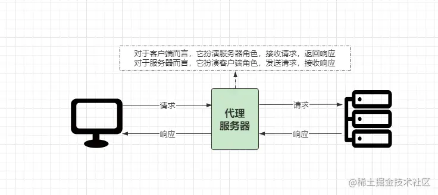
 代理服务器目前市面上也存在多种选择，如`Varnish、Squid、Nginx`等，这些代理服务器的工作模式又可被分为正向代理和反向代理。

##### 正向代理

  正向代理与反向代理，这也是面试过程中常遇的一个面试题，先来谈谈何谓正向代理。
 正向代理是指客户端可以感知到“代理角色”的存在，客户端发送请求时需要指定目标服务端，然后代理服务器会将客户端的请求发送到目标服务器处理，服务端处理完成后，代理服务器会接收响应结果并将其返回给客户端。

> 这样理解起来可能会存在些许抽象，那么例举生活中的例子：“竹子喊熊猫去楼下小卖部买包烟”，这个例子中“竹子”是客户端，“熊猫”是代理服务器，“小卖部”是服务端。
>  “竹子”显然知道有“代理人”的存在，并且明确指定了目标，但“小卖部”却无法知道具体要买烟的人是谁，这就可以理解为“正向代理”。

##### 反向代理

  反向代理的含义是指：代理服务器的存在对于客户端而言，是无法感知的。简单来说，就是指用户在访问代理服务器就跟直接访问服务器一样。
 当用客户端根据域名解析`IP`访问时，其实解析得到的是反向代理服务器所在的机器`IP`，当客户端请求发送到反向代理服务器时，代理服务器会将请求分发到具体的“服务端机器”上处理，服务端处理完成后会将数据返回给反向代理服务器，然后由代理服务器将结果响应给客户端。

> 在这种“反向代理”的过程中，客户端对于“代理服务器”是无感知的，并且具体处理请求的服务器对于用户而言也是“黑箱”的。当然，为了便于理解，咱们再举个例子讲解：
>  竹子创业做`xx`业务，需要一批货，竹子找到当地供应商熊猫，熊猫收到竹子的拿货需求后，转手交给了`X`工厂，工厂完成货物生产后，交给“供应商熊猫”，再由熊猫交给“创业者竹子”。

  上述案例里，竹子依旧是“客户端”，而熊猫依旧是“代理人”，工厂则是“服务端”，但这个过程中，“创业者竹子”是无法感知出“供应商熊猫”是代理人的角色，同时负责真正货物提供的“服务商工厂”对于竹子而言也是不可见的，这个案例就是一个典型的“反向代理”。

> **代理服务器这方面的内容会在下一篇中详细阐述。**

#### 1.5.4、HTTP隧道代理

  前面分析的正向代理也好，反向代理也罢，其实都属于普通代理，在此之外还存在一种叫做**隧道代理** 的概念。

为什么需要隧道代理的存在呢？因为之前的普通代理模式中，代理服务器是“中间人”的角色，此时假设需要传输`HTTPS`流量，因为`HTTPS`需要认证，但代理显然不可能有网站的私钥证书，最终就会导致客户端和代理之间的`TLS`无法建立，证书校验无法通过。

`HTTP tunnel`以及`CONNECT`机制就主要解决了这个问题，代理服务器不再作为中间人，不再改写浏览器的请求，通过`CONNECT`方法让客户端与任意目标服务器的`IP`和端口建立一条`TCP`连接，创建成功后，隧道代理在其中只负责将浏览器和服务器之间通信的数据原样透传，这样客户端就可以直接和远端服务器进行`TLS`握手并传输加密的数据[。](https://link.juejin.cn?target=https%3A%2F%2Fwww.zhihu.com%2Fquestion%2F21955083)

### 1.6、HTTP各版本中的缺陷与改进

- `HTTP/0.9`：仅支持`GET`方式的纯文本请求。

- ```
  HTTP/1.0
  ```

  ：

  - 特点：无状态、无连接，支持多类请求方式，任意数据都可以传输。
  - 缺点：每次请求时无法复用连接，需重新建立连接。

- ```
  HTTP/1.1
  ```

  ：

  - 改进：
    - 支持长连接（`Connection: keep-alive`）。
    - 支持管道化请求。
    - 支持缓存管理，分为强缓存和协商缓存两种。
    - 支持断点续传。
    - 支持一个`WEB`服务器创建多个站点（`Host`）。
    - 增加多个请求方法。
  - 不足：
    - 传输性能有限，请求会发生阻塞（队头阻塞）。

- ```
  HTTP/2.0
  ```

  ：

  - 改进：
    - 引入新的二进制协议，应用层与传输层之间数据支持二进制分帧。
    - 引入多路复用机制，提高连接可用性。
    - 优化请求头，使用`HPACK`头部压缩算法避免传输重复头。
    - 支持服务器主动向客户端推送资源。
  - 不足：
    - 因基于`TCP`协议构建，出现丢包时，整个会话需等待重传，后面数据会被阻塞。

- ```
  HTTP/3.0
  ```

  ：

  - 改进：
    - 抛弃`TCP`协议，转至基于`UDP`协议构建的`QUIC`协议（又称`HTTP/3.0`）。
    - 新增`0-RTT`机制：缓存当前回话上下文，下次恢复会话将缓存传给服务器验证后，即可传输数据。
    - 优化多路复用机制：会话的多个流间不存在依赖，丢包只需重发包，无需重传整个连接。
    - 针对移动端应用优化：由于之前基于`TCP`协议，因此对于移动端的`IP`多变而言，非常影响传输，`3.0`通过`ID`识别连接，`ID`不变，即可快速连接。
    - 更好的安全性：`3.0`中几乎所有报文都要经过认证，主体经过加密，有效防窃听、注入和篡改。
    - 提供向前纠错机制：每个数据包中携带部分其他数据包的数据，少量丢包可通过其他包的冗余数据直接恢复，无需丢包重传。

## 二、HTTPS协议

  由于`HTTP`协议是采用明文传输的方式，因此带来了很大的数据安全隐患，所以在最近几年的时间内，大部分平台都采用了`HTTPS`逐渐取代了`HTTP`，但`HTTPS`并不是一种全新的协议，而是建立在`HTTP`协议的基础之上，为其添加了一层`TLS/SSL`，从而实现数据的加密传输，确保足够的安全性，区别如下：
 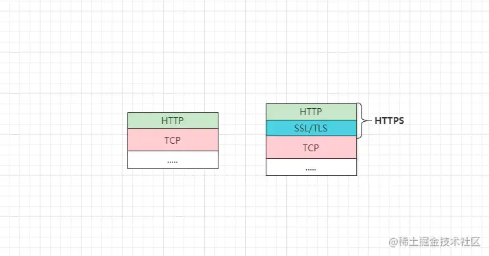
 相较于`HTTP`而言，`HTTPS`则拥有更高的安全性，例如数据加密传输、报文完整性效验、身份认证判断等。解决了`HTTP`协议中一直存在的安全问题，如明文传输数据会遭受窃听风险、不验证报文完整性会导致数据被篡改、不效验通信方身份会导致“他人”伪造通信对端劫持客户端等。

### 2.1、SSL与TLS加密层

  在`HTTPS`中最关键的是数据安全传输，而负责这块的则是`SSL/TLS`层，而该层中的功能实现主要依赖于三类加密算法：哈希散列加密、对称加密及非对称加密算法，其中常用的算法如下：

- 哈希散列加密算法：`MD5、SHA1、SHA256`等。
- 对称加密算法：`AES-CBC、AES-GCM、DES、3DES`等。
- 非对称加密算法：`RSA、DSA、ECC、DH`等。

> 上述简单了解了一些`SSL/TLS`基本内容后，再一步步的从0开始推导`HTTP→HTTPS`的演变过程。

在之前的`HTTP`协议中，数据都是明文传输的，如下：
 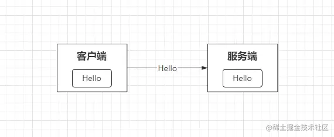
 前面提及过，这种明文传输的方式安全性很低，因此如果要提高安全性，最简单有效的方式就是对传输的数据进行加密，如`HTTPS`中的传输方式：
 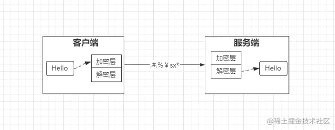
 在这个模型中，双方采用相同的密钥、加/解密算法处理数据，这种方式则被称为**对称加密**。

> [对称加密](https://link.juejin.cn?target=https%3A%2F%2Fbaike.baidu.com%2Fitem%2F%E5%AF%B9%E7%A7%B0%E5%8A%A0%E5%AF%86)：是指加密通信的双方加/解密的方式都是相同的，类似一个天平，两边都是“对称”的。

不过显然这种方式存在天然的弊端，因为通信的双方都采用相同的加密方式，一般服务端与客户端通信都是`1-N`的模式，那么一个客户端的加密方式被“破解”，就会导致所有客户端的数据都能够通过这种方式解密，从而被窃取真实数据。

> 此时为了防止“第三者”破解加密数据又该怎么办呢？对于每个客户端通信采用不同的加密算法，但这显然不可能，因为性能够好、加密性够强的算法就那么些，而客户端理论上是无穷尽的，因此没有那么多的加密算法来满足这个方案。

既然没有那么多的加密算法，那能不能换个思路呢？给每个客户端发送不同的密钥，每个客户端都采用不同的密钥加密数据，然后再放在网络上传输，这样是不是就解决了原本的问题呢？答案是`Yes`，不过此刻又引出了一个新的问题：**又该如何向每个客户端发送不同的密钥呢？**

> 因为客户端与服务端之间加密通信，那必然需要双方各持相同的密钥后，才能够解密对方的数据，所以通信的密钥必然是在一端生成后发送给另一端的，此时又该如何保证传输密钥时，密钥不会被“第三者”窃取呢？因为毕竟密钥被窃取后，所谓的安全性也自然成了空谈。

- 熊猫：嗯？等等！传输密钥不安全，加个密不就好啦？
- 竹子：确实如此，但，如何确保密钥的加密方式不被破解呢？
- 熊猫：简单啊，采用不同的加密方式传输密钥不就好啦？
- 竹子：嗯，对，那么用何种方式确保发送给每个客户端的密钥加密方式不同呢？
- 熊猫：用不同的密...钥.....啊.....
- 熊猫：完了，芭比Q了，进死循环出不来了。

确实，如果再以对称加密的思维去思考这个问题，确实进死胡同无解了，此时我们得换种思考方式，即切换到大名鼎鼎的**非对称加密**方式去解决这个问题。

> [非对称加密](https://link.juejin.cn?target=https%3A%2F%2Fbaike.baidu.com%2Fitem%2F%E9%9D%9E%E5%AF%B9%E7%A7%B0%E5%8A%A0%E5%AF%86%2F9874417)：对称加密算法在加/解密时采用的密钥都是相同的，而非对称加密算法则恰巧相反，非对称加密方式中存在两个密钥：公钥、私钥。
>  如果用公钥加密的数据，只有用对应的私钥才能解密；如果用私钥加密的数据，那只有用对应的公钥才能解密。因为加/解密使用两个不同的密钥，最终则被称为：非对称加密。

采用非对称加密方式的服务端，会首先生成两个密钥，将其一把作为公钥发送给所有客户端，另一把则当作私钥仅自己保存：
 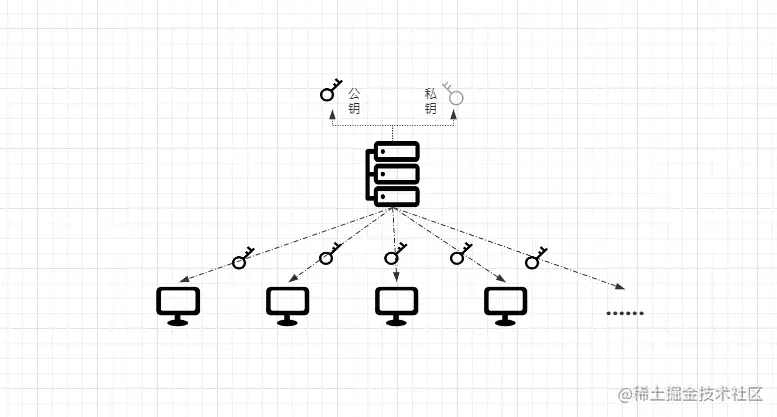
 但其实非对称加密也存在一个经典的问题，也就是依旧无法避免“第三者”介入，先上图：
 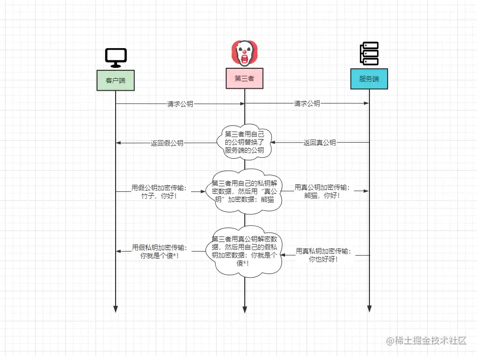
 先仔细观察上图中的步骤，万一“第三者”将服务端返回的“真公钥”替换成了自己的“假公钥”，从而最终导致了数据的泄露又该怎么办呢？

> 其实这本质上是两个问题：
>  ①数据遭受篡改。这个问题发生的原因是：客户端没有效验数据完整性，因此对于对端发送的数据无条件信任，最终就导致了客户端无法区分数据究竟是第三者发出来的，还是真正的服务端返回的。
>  ②第三者将公钥掉包。这个问题的主要原因在于：客户端没有效验通信对端，即服务端的身份，因此无法区分传回的究竟是服务端，还是第三者的公钥。
>  要解决上述中的两个问题，那必须从问题的根源「客户端」着手解决，该怎么解决呢？可以引入「数字签名、数字证书」的概念。
>  其中数字签名主要防止了数据被篡改问题，数据证书解决了公钥被掉包问题。

不过在讲述具体如何解决的流程之前，我认为有必要先讲述清楚「数字签名、数字证书」的概念，「数字签名、数字证书」是从权威的第三方机构中申请的，这类机构被称为`CA`机构申请流程一般为：

- ①服务端先在本地生成一对密钥，然后携带公钥、网站信息、企业信息等数据去`CA`机构申请；
- ②`CA`机构根据提交的信息核实身份后，会通过单向的哈希算法（如`MD5`）对这些信息进行加密，加密后的内容被称为“信息摘要”，因为单向哈希算法的不可逆特性，所以只要被加密的内容发生了丁点改变，加密后得到的内容也会存在天差地别，因此可以有效防止信息被篡改；
- ③紧接着`CA`机构会通过自己的密钥对“信息摘要”进行再次加密，加密后的内容被称为「数字签名」，而「申请信息、服务器公钥、数字签名」组合在一起，最终被称为「数字证书」。

而客户端一般在加密通信前，会先向服务端获取公钥，服务器则会将「数字证书」返回给客户端，客户端拿到证书后，会首先通过`CA`机构的公钥解密证书中的「数字签名」，能够解密成功则代表该证书来自于值得信赖的权威机构，最终就得到了`CA`哈希后的“信息摘要”，然后客户端会使用与`CA`机构相同的`Hash`算法对「数字证书」中的「申请信息、服务器公钥」再次生成一份“摘要”，最后拿着生成的“信息摘要”与解密后的“信息摘要”对比，如果一致则代表数据未被篡改过，最终客户端就可以使用证书中的公钥进行加密通信，流程如下：
 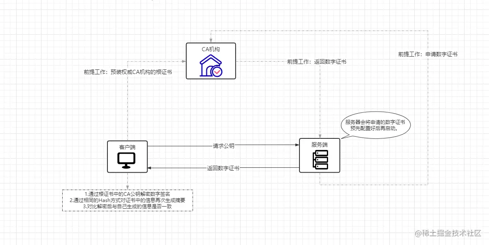

> 注意：客户端`OS`与浏览器中都会提前预装`CA`机构的根证书，这些根证书中已包含了`CA`公钥、当前`CA`机构使用的`Hash`算法等。

  由于数字签名是采用单向哈希算法，生成的“信息摘要”是不可逆的，当服务器返回的证书内容被篡改后，客户端在生成摘要比对时，结果肯定不匹配，因此客户端会拒绝连接。
 但仅这样也无法避免公钥被掉包，也就是“第三者”也去`CA`机构申请证书，然后在中间直接将整个证书替换成自己的，最终客户端获取的依旧是“第三者”的公钥，所以为了解决这个问题，`CA`机构颁发的数字证书中，还会涵盖网站信息（如域名、所有者等），当证书被掉包后，客户端发现返回的证书与请求的网站信息并不同，那么依旧会拒绝连接。

> 为什么会有第三者呢？因为网络传输数据的通信链路是不可预计的，因此数据会经过很多节点的中转，同时在实际开发过程中也有不少请求需要走代理，也包括会存在网络攻击者，因此多方面的原因都有可能导致“第三者”介入。

经过上述一系列手段后，解决了非对称加密传输公钥时的不安全问题，但非对称加密方式，由于加/解密过程复杂，因此性能会比对称加密要低不少，因此在`HTTPS`中是非对称加密与对称加密混合使用的模式，其中数据是对称加密方式传输的，而对称加密的密钥是通过非对称加密方式传输的。

### 2.2、HTTPS工作原理

  上面叭叭一大堆，各位看到这里难免有些头大，所以接下来结合完整的`HTTPS`流程梳理一下，先上图：
 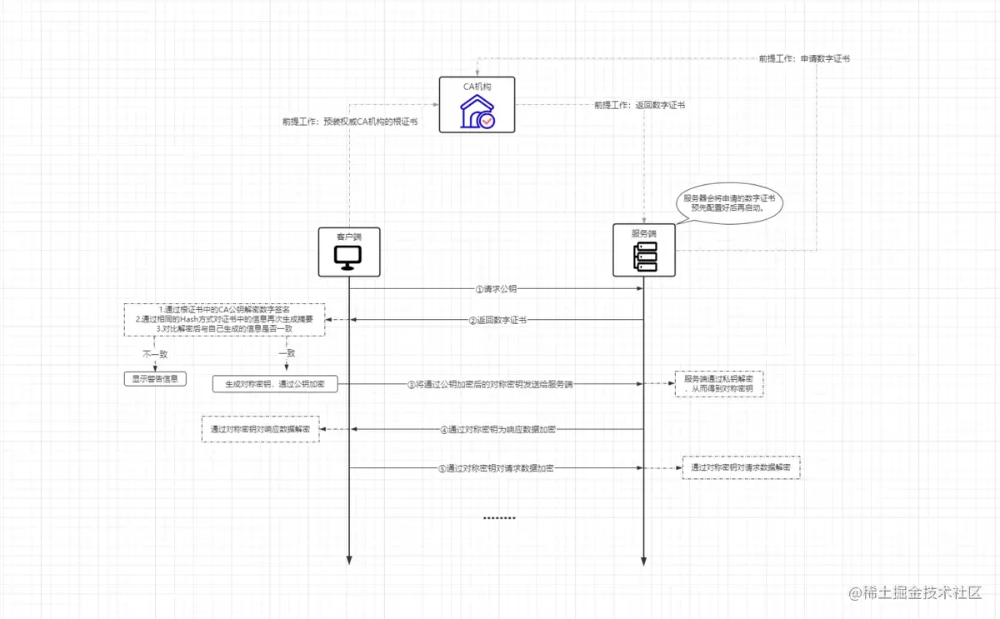

- ①客户端先向服务端请求公钥，其实就是与服务端`443`端口建立连接的过程。
- ②服务端接收到请求后，会将数字证书返回给客户端。
- ③客户端收到证书后，会经过图中的几步效验操作，确认证书合法后，会先生成一个对称密钥，然后通过证书中的公钥对其加密，并发给服务端。
- ④服务端收到公钥加密后的对称密钥后，通过自己的私钥对其解密。
- ⑤最终客户端、服务端都拥有了一把对称密钥，接下来则通过对称密钥传输数据。

> 整个`HTTPS`的大体逻辑如上，但实际生成对称密钥的过程却并非如此，在`HTTPS`中是需要经过`RSA`握手的步骤。

### 2.3、TLS层的握手过程

  前面谈及的过程其实简化了很多，主要是为了便于理解`HTTPS`的整体流程，但实际`HTTPS`远比前面所赘述的流程复杂很多，接下来则详细阐述一下其中的`TLS`握手过程。

> `TLS/1.2`之前的版本都是采用`RSA`算法进行密钥交换，但`TLS/1.2`及之后的版本中主要采用`ECDHE`算法实现。

一般而言，`TLS`层在交换密钥时都会经历多个步骤，其中可分为`11`个小阶段，`4`次握手阶段，如下：
 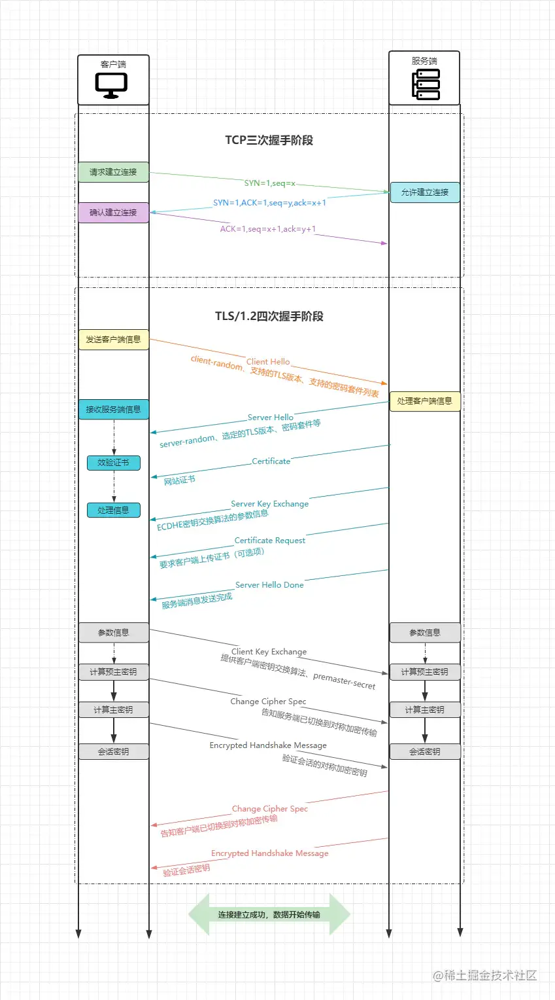
 下面我们通过`Wireshark`抓包工具实际分析一下具体过程。

#### 2.3.1、TLS第一次握手

##### ①客户端：Client Hello

在`TLS`一次全新的握手流程中，客户端会首先发出一条`Client Hello`的信息，并会附带传递一些客户端的信息，如下：

```json
json

 体验AI代码助手
 代码解读
复制代码Handshake Protocol: Client Hello 
  Handshake Type: Client Hello (1) 
  Length: 223 
  Version: TLS 1.2 (0x0303) 
  Random: bh21b273g32de8b0e4f13de22d33f24e6a671e62f82hgc2fdh1f2hbabe4326 
  Session ID Length: 0 
  Cipher Suites Length: 92 
  Cipher Suites (46 suites) 
    Cipher Suite: TLS_ECDHE_RSA_WITH_AES_256_GCM_SHA256 (0xc030) 
    Cipher Suite: TLS_ECDHE_ECDSA_WITH_AES_128_GCM_SHA256 (0xc02c) 
    Cipher Suite: TLS_ECDHE_RSA_WITH_AES_128_CBC_SHA (0xc028) 
    ... 
```

- `Length`：报文长度。
- `Version`：客户端支持的最佳`TLS`版本号。
- `Random`：随机数，后续用于生成对称密钥，为了区分则称为`client-random`。
- `Session ID`：第一次握手时该值为空，后续请求中会有会话`ID`(用于恢复)。
- `Cipher Suites`：客户端支持的密码套件，优先级从高到低排序。

解读密码套件：
 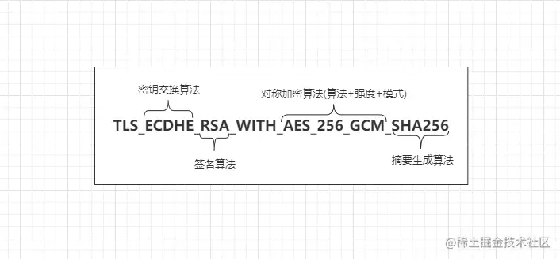
 套件由密钥交换算法+签名算法+对称加密算法+摘要生成算法四部分组成，其中：

- `ECDHE`为密钥交换算法，用于`TLS`握手阶段。
- `RSA`为签名算法，用于效验数字证书阶段时的身份验证。
- `AES`为对称加密算法，长度及为`256`位，分组模式为`GCM`，用于数据传输阶段。
- `SHA256`为摘要生成算法，用于消息认证及产生随机数（稍后分析）。

#### 2.3.2、TLS第二次握手

##### ②服务端：Server Hello

服务端收到客户端的`Client Hello`信息后，会给予一个`Server Hello`的信息响应：

```json
json

 体验AI代码助手
 代码解读
复制代码Handshake Protocol: Server Hello 
    Handshake Type: Server Hello (2) 
    Length: 89 
    Version: TLS 1.2 (0x0303) 
    Random: 21ds544sda21vcsqaaa124dsac2za2bc6472c45b54c0a21c666d2sda2q14514d555f6f 
    Session ID Length: 32 
    Session ID: 676fb1435152124ef4ce41af4cb77s5w13aa1c2e6w7c3e5c45da16cdf414f22c2 
    Cipher Suite: TLS_ECDHE_ECDSA_WITH_AES_256_GCM_SHA384 (0xc02c) 
```

在服务端响应的`Server Hello`信息中，主要会确认自己是否支持`TLS`版本、从客户端支持的密码套件中选择一套以及也会生成一个随机数`server-random`。

##### ③服务端：Certificate

在响应了客户端信息后，紧接着服务端会将自己的数字证书发给客户端：

```json
json

 体验AI代码助手
 代码解读
复制代码Handshake Protocol: Certificate 
    Handshake Type: Certificate (11) 
    Length: 2781 
    Certificates Length: 2778 
    Certificates (2778 bytes) 
        Certificate Length: 1407 
        Certificate: 证书1....
        Certificate Length: 1365 
        Certificate: 证书2....
        .......
```

客户端收到服务端的这个响应后，会先去验证证书的证实有效性，如果有效则继续，如果证书无效则会发出警告信息并中断`TCP`连接，例如`www.baidu.com`的证书如下：
 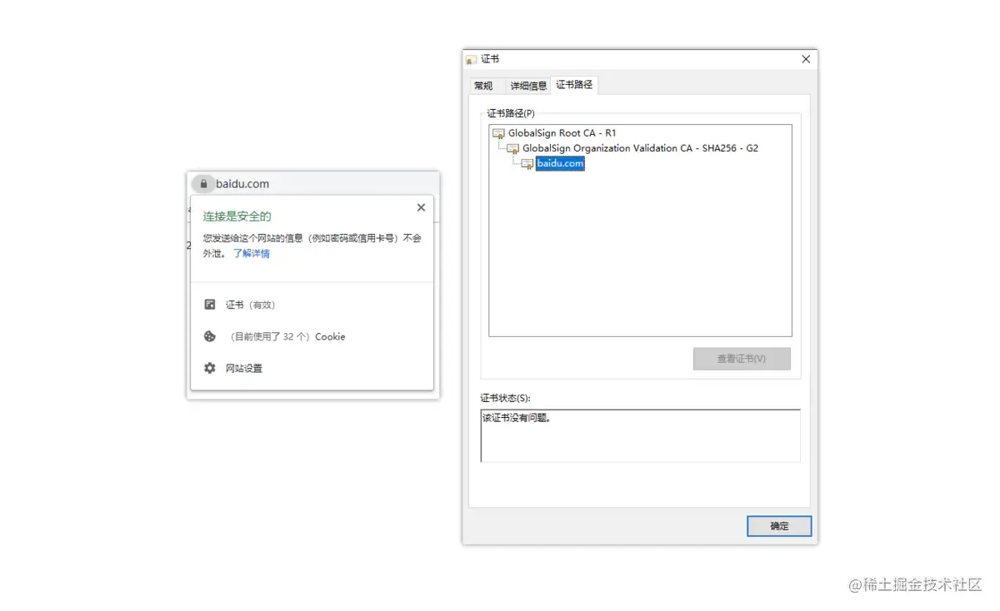

##### ④服务端：Server Key Exchange

向客户端发送了数字证书后，紧接着服务端会通过一条`Server Key Exchange`消息，将密钥交换算法需要用到的数据/参数携带上去，并向客户端发送：

```json
json

 体验AI代码助手
 代码解读
复制代码Handshake Protocol: Server Key Exchange 
    Handshake Type: Server Key Exchange (12) 
    Length: 329 
    EC Diffie-Hellman Server Params 
        Curve Type: named_curve (0x03) 
        Named Curve: secp256r1 (0x0017) 
        Pubkey Length: 65 
        Pubkey: 6615dc2a1a2a4d482efc777cf1d804d...
        Signature Algorithm: rsa_pkcs1_sha512 (0x0601) 
            Signature Hash Algorithm Hash: SHA512 (6) 
            Signature Hash Algorithm Signature: RSA (1) 
        Signature Length: 256 
        Signature: 5a1dc12ds152b4a7445t2....
```

上面即是`ECDHE`密钥交换算法的消息内容，不同的密钥交换算法，其具体的内容也会不同，这些内容发送给客户端的主要目的是：**提供给客户端计算主密钥需要的另一个值：“预主密钥(`premaster secret`)”**。

##### ⑤服务端：Certificate Request

`Certificate Request`这个消息是服务端要求客户端上报证书，这一步是可选的，因为`HTTPS`可以选择双向验证，对于安全性要求高的场景会用到，默认是不发送这条信息的。

##### ⑥服务端：Server Hello Done

在传输完上述中的所有信息后，服务端最后会发送一条`Server Hello Done`的信息，通知客户端`Server Hello`阶段结束，即告知客户端“第二次握手”完成。

#### 2.3.3、TLS第三次握手

##### ⑦客户端：Client Key Exchange

在第二次握手阶段，客户端根据服务端发来的信息：公钥、算法、参数等生成了第三个随机数`premaster secret`（预主密钥），`Client Key Exchange`这条信息就是将该值通过公钥加密，然后传给服务端：

```json
json

 体验AI代码助手
 代码解读
复制代码Handshake Protocol: Client Key Exchange 
    Handshake Type: Client Key Exchange (16) 
    Length: 66 
    EC Diffie-Hellman Client Params 
        Pubkey Length: 65 
        Pubkey: o1deca231a1x123eeq12c6bb786.....
```

服务端收到该消息后，会通过自己的私钥解密，然后得到第三个随机数，到此刻为止，客户端和服务端之间都各自拥有了三个随机数：`client-random、server-random、premaster secret`，两边再根据相同的算法计算，就可以生成一个密钥，后续的应用层的数据传输就是通过该密钥作为对称密钥进行加密传输。

##### ⑧客户端：Change Cipher Spec

`Change Cipher Spec`这条消息是一条事件消息：

```json
json

 体验AI代码助手
 代码解读
复制代码TLSv1.2 Record Layer: Change Cipher Spec Protocol: Change Cipher Spec 
    Content Type: Change Cipher Spec (20) 
    Version: TLS 1.2 (0x0303) 
    Length: 1 
    Change Cipher Spec Message
```

表示通知服务端密钥已经计算出来了，后续的数据传输都会通过前面协商出的密钥进行加密传输，代表后续切换到对称加密模式。

##### ⑨客户端：Encrypted Handshake Message

`Encrypted Handshake Message`这条消息作用是：**用于测试对称密钥是否能够正常工作**：

```json
json

 体验AI代码助手
 代码解读
复制代码TLSv1.2 Record Layer: Handshake Protocol: Encrypted Handshake Message 
    Content Type: Handshake (22) 
    Version: TLS 1.2 (0x0303) 
    Length: 60 
    Handshake Protocol: Encrypted Handshake Message 
```

这是客户端第一条通过对称密钥加密传输的信息，如果服务端接受后，也能够通过计算出的密钥解开，即代表前面协商计算出的对称密钥没有问题。

#### 2.3.4、TLS第四次握手

##### ⑩服务端：Change Cipher Spec

和客户端的`Change Cipher Spec`消息作用相同：

```json
json

 体验AI代码助手
 代码解读
复制代码TLSv1.2 Record Layer: Change Cipher Spec Protocol: Change Cipher Spec 
    Content Type: Change Cipher Spec (20) 
    Version: TLS 1.2 (0x0303) 
    Length: 1 
```

用于通知客户端：我已计算出对称密钥，后续通信采用加密模式。

##### ⑪服务端：Encrypted Handshake Message

服务端的第一条加密信息，用于测试客户端计算出的密钥是否可以解开加密数据：

```json
json

 体验AI代码助手
 代码解读
复制代码TLSv1.2 Record Layer: Handshake Protocol: Encrypted Handshake Message 
    Content Type: Handshake (22) 
    Version: TLS 1.2 (0x0303) 
    Length: 40 
    Handshake Protocol: Encrypted Handshake Message 
```

至此，客户端和服务端双方能够正常加密通信，`TLS`握手阶段结束。

#### 2.3.5、TLS1.2之前及TLS1.3中的握手区别

其实`TLS/1.2`版本对比之前的`TLS`版本，握手过程中唯一不同点在于：采用的密钥交换算法不同，在之前的版本中都采用`RSA`算法生成对称密钥，而`1.2`版本中用的是`ECDHE`算法。

在`TLS/1.3`版本中，主要是缩减了`TLS`握手的次数，从原本的“四次握手”缩减到了三次握手，同时也减少了整个握手流程中的步骤，如下：
 
 从图中可以明显看出，客户端计算出第三个随机数后，并未将其传回给服务端，服务端这边也是自己通过已有的参数计算得到的，然后双方之间再根据三个随机数计算出最终的对称密钥，最后再发一条测试信息，能够正常加解密则代表密钥可用，从而完成了整个握手流程。

#### 2.3.6、HTTPS中对于TLS握手的优化

由于`TLS`握手过程比较繁杂，因此在`HTTPS`中也有一些优化策略，如会话复用，而会话复用即恢复会话，主要有两种方式，一种是`Session-ID`，另一种则是`Session Ticket`，先聊聊`Session-ID`。

在`TLS`握手的第一步`Client Hello`中，会附带`session id`值，如果是新的客户端第一次建立连接时，该值为空，但如果是之前建立过安全连接的客户端，那么在这个信息中会附带上次的`ID`，如果上次在服务端中存储的`Session`还未过期，那么则会直接复用上次的会话，并不需要再次经过复杂的握手步骤建立连接。

> 但这种方式的缺陷也很明显，一方面是对服务端会造成比较大的存储压力，第二方面则是如果服务端做了负载均衡，那么还需要解决`session`一致性的问题。

因此在这种方式之外，`TLS/1.3`版本中，出现了另外一种策略：`Session Ticket`。这种方式的原理时，在握手完成并建立加密通信成功后，会将当前的通信对称密钥、加密方法等会话信息，通过`Session Ticket`发送给客户端保存。通过这种方式，因为会话信息是存储在客户端，所以不管请求被分发给哪台机器，当服务器将其解密后，如果会话未过期的情况下，那最终都能够获取上次会话的信息，这样就无需重新生成密钥了，而且还能大大减轻服务器的存储压力。

## 三、总结

  到目前为止，整体的篇幅已经较长了，因此对于一些其他内容就不再展开赘述，如`HTTP/2.0`及后续版本新特性的详细内容、`HTTPS`证书链、证书吊销、`HTTPS`接入优化等。

最后再附上`HTTP`与`HTTPS`的对比：

| 对比项   | HTTP                    | HTTPS                                  |
| -------- | ----------------------- | -------------------------------------- |
| 默认端口 | 80                      | 443                                    |
| 传输模式 | 不安全的明文传输        | 安全的加密传输                         |
| 使用成本 | 免费且谁都能用          | 需要花钱购买证书并核实身份             |
| 连接状态 | 无状态协议              | 有状态协议                             |
| 握手过程 | TCP三次握手             | TCP三次握手+TLS四次握手（TLS/1.3三次） |
| 传输性能 | 基于TCP报文传输速度较快 | 数据传输需要加/解密，性能略低          |
| 资源标识 | URL上显示http://        | URL显示为https://                      |
| 资源开销 | 仅维持自身开销即可      | 建立在`HTTP`基础上，还需增加额外开销   |