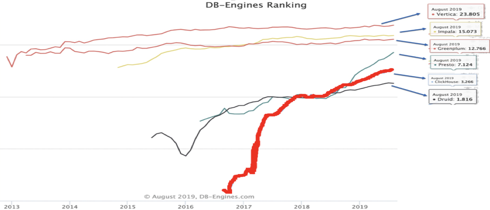
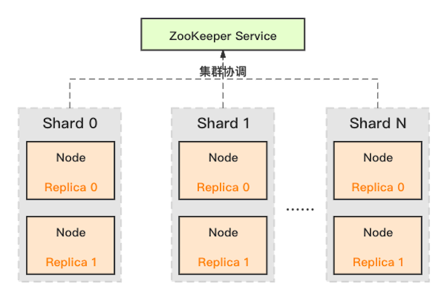
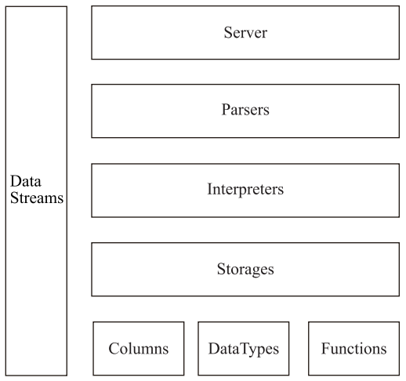
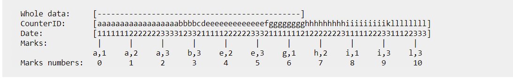
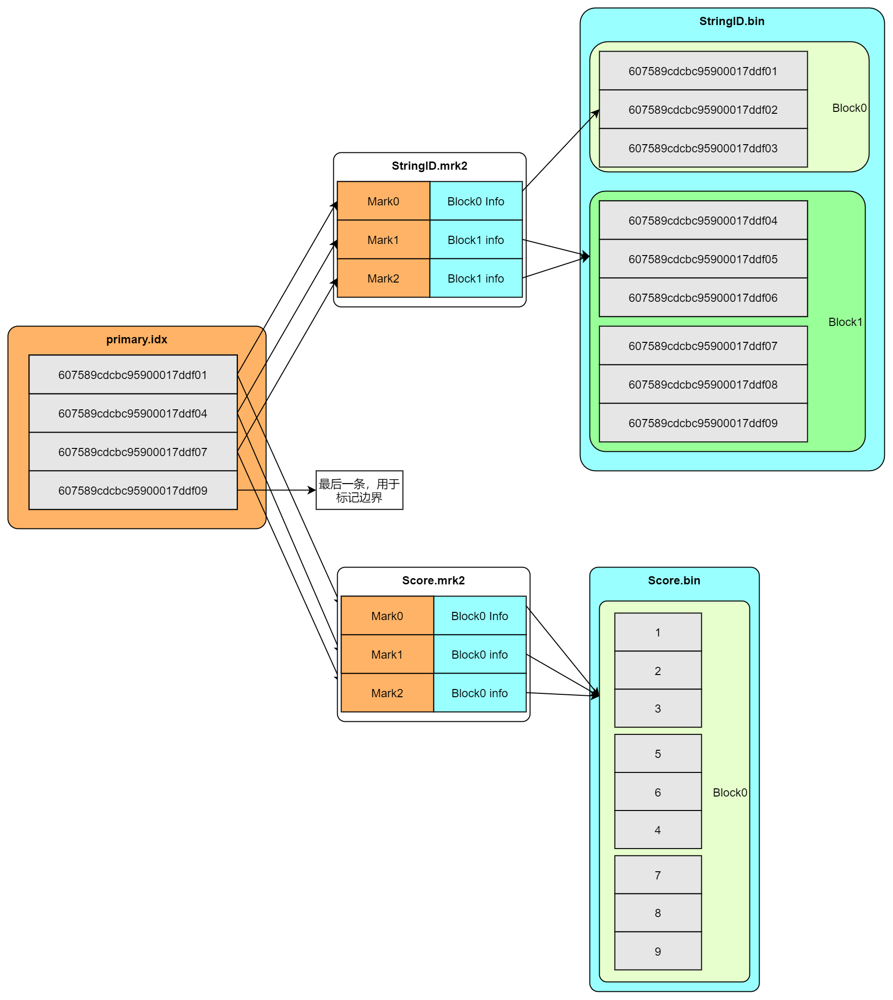
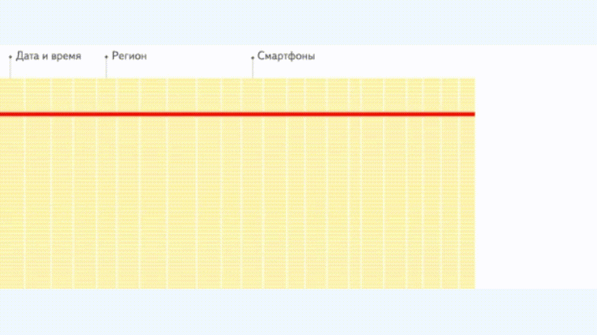
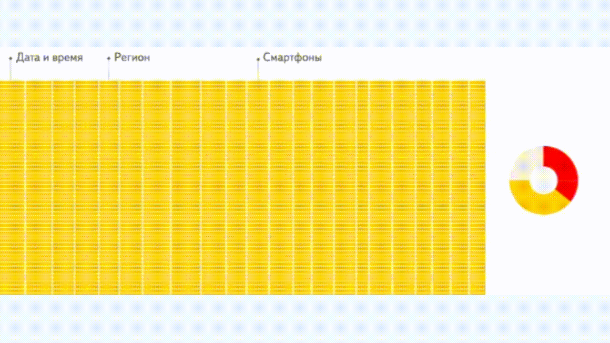

# ClickHouse

> <font color='red'> **<u>注意!!!</u>** </font>**<u>本文自互联网整理，本人对ClickHouse本身并没有丰富的使用经验。如果有错误，还希望指正。</u>**

`ClickHouse`背后的研发团队是来自俄罗斯的`Yandex`公司。这是一家俄罗斯本土的互联网企业，于2011年在纳斯达克上市，它的核心产品是搜索引擎。根据最新的数据显示，`Yandex`占据了本国47%以上的搜索市场，是现今世界上最大的俄语搜索引擎。搜索引擎的营收主要来源与流量和广告业务。

而在采集数据的过程中，一次页面`click`（点击），会产生一个`event`（事件）。至此，整个系统的逻辑就十分清晰了，那就是基于页面的点击事件流，面向数据仓库进行`OLAP`分析。所以`ClickHouse`的全称是`ClickStream`，`DataWareHouse`，简称`ClickHouse`


### 作者总结

我们知道，CK最重要的特性是：快。ClickHouse并不是说用领先时代的实现，来完成了哪些不可思议的快速查询。他主要的特点在我个人看来，有以下几点：

1. 虽然他的查询速度快，但是作为MPP架构，他管理了数据，查询快一般会导致导入数据就会有损失。换句话来说，他使用了大量的索引来加速查询。各种索引。
2. 这个产品，很务实。他尽可能的使用了能使用的一切努力，甚至金手指来实现加速。甚至有些优化是花了大量的精力来做百尺竿头更进一步。
3. 专精与某一个特定的领域一直深挖。没有为了PPT而写产品， 做一个大而全，然后为了全，抛弃了一切，包括性能。

## 介绍

**ClickHouse是一款MPP架构的列式存储数据库。**主要用于数据分析（OLAP）领域。目前国内各个大厂纷纷跟进大规模使用：

- 今日头条内部用ClickHouse来做用户行为分析，内部一共几千个ClickHouse节点，单集群最大1200节点，总数据量几十PB，日增原始数据300TB左右。
- 腾讯内部用ClickHouse做游戏数据分析，并且为之建立了一整套监控运维体系。
- 携程内部从18年7月份开始接入试用，目前80%的业务都跑在ClickHouse上。每天数据增量十多亿，近百万次查询请求。
- 快手内部也在使用ClickHouse，存储总量大约10PB， 每天新增200TB， 90%查询小于3S。
- 阿里内部专门孵化了相应的云数据库ClickHouse，并且在包括手机淘宝流量分析在内的众多业务被广泛使用。 

在国外，Yandex内部有数百节点用于做用户点击行为分析，CloudFlare、Spotify等头部公司也在使用。

在开源的短短几年时间内，ClickHouse就俘获了诸多大厂的“芳心”，并且在Github上的活跃度超越了众多老牌的经典开源项目，如Presto、Druid、Impala、Geenplum等；其受欢迎程度和社区火热程度可见一斑。

而这些现象背后的重要原因之一就是它的极致性能，极大地加速了业务开发速度，本文尝试解读ClickHouse存储层的设计与实现，剖析它的性能奥妙。



## 整体架构

ClickHouse 采用了典型的分组式的分布式架构



- Shard ：集群内划分为多个分片或分组（Shard 0 … Shard N），通过 Shard 的线性扩展能力，支持海量数据的分布式存储计算。
- Node ：每个 Shard 内包含一定数量的节点（Node，即进程），同一 Shard 内的节点互为副本，保障数据可靠。ClickHouse 中副本数可按需建设，且逻辑上不同 Shard 内的副本数可不同。互为副本的replica之间通过专有复制协议保持最终一致性。
- ZooKeeper Service ：集群所有节点对等，节点间通过 ZooKeeper 服务进行分布式协调。

### 细节架构



这里也可以理解成实现的模块组织结构。

#### Column与Field

Column和Field是ClickHouse数据基础的映射单元。内存中的一列数据由一个Column对象表示。Column对象分为接口和实现两个部分，在IColumn接口对象中，定义了对数据进行各种关系运算的方法。

> 比如 IntColumn可以有平方差这类的方法，但是StringColumn就不存在这样的方法。不同的属性类型的列，有不同的聚合、计算方式。

在大多数场合，ClickHouse都会以整列的方式操作数据，但凡事也有例外。如果需要操作单个具体的数值 ( 也就是单列中的一行数据 )，则需要使用Field对象，Field对象代表一个单值。与Column对象的泛化设计思路不同，Field对象使用了聚合的设计模式。在Field对象内部聚合了Null、UInt64、String和Array等13种数据类型及相应的处理逻辑。

#### DataType

数据的序列化和反序列化工作由DataType负责。IDataType接口定义了许多正反序列化的方法，它们成对出现。IDataType也使用了泛化的设计模式，具体方法的实现逻辑由对应数据类型的实例承载。DataType虽然负责序列化相关工作，但它并不直接负责数据的读取，而是转由从Column或Field对象获取。

#### Block与Block流

ClickHouse内部的数据操作是面向Block对象进行的，并且采用了流的形式。Block对象可以看作数据表的子集。Block对象的本质是由数据对象、数据类型和列名称组成的三元组，即Column、DataType及列名称字符串。仅通过Block对象就能完成一系列的数据操作。Block并没有直接聚合Column和DataType对象，而是通过ColumnWithTypeAndName对象进行间接引用。Block流操作有两组顶层接口：IBlockInputStream负责数据的读取和关系运算，IBlockOutputStream负责将数据输出到下一环节。IBlockInputStream接口定义了读取数据的若干个read虚方法，而具体的实现逻辑则交由它的实现类来填充。IBlockInputStream接口总共有60多个实现类，这些实现类大致可以分为三类：

- 类用于处理数据定义的DDL操作
- 第二类用于处理关系运算的相关操作
- 第三类则是与表引擎呼应，每一种表引擎都拥有与之对应的BlockInputStream实现

IBlockOutputStream的设计与IBlockInputStream如出一辙。这些实现类基本用于表引擎的相关处理，负责将数据写入下一环节或者终目的地。

#### Table

在数据表的底层设计中并没有所谓的Table对象，它直接使用IStorage接口指代数据表。表引擎是ClickHouse的一个显著特性，不同的表引擎由不同的子类实现。IStorage接口负责数据的定义、查询与写入。IStorage负责根据AST查询语句的指示要求，返回指定列的原始数据。后续的加工、计算和过滤则由下面介绍的部分进行。

#### Parser与Interpreter

Parser分析器负责创建AST对象；而Interpreter解释器则负责解释AST，并进一步创建查询的执行管道。它们与IStorage一起，串联起了整个数据查询的过程。Parser分析器可以将一条SQL语句以递归下降的方法解析成AST语法树的形式。不同的SQL语句，会经由不同的Parser实现类解析。Interpreter解释器的作用就像Service服务层一样，起到串联整个查询过程的作用，它会根据解释器的类型，聚合它所需要的资源。首先它会解析AST对象；然后执行"业务逻辑" ( 例如分支判断、设置参数、调用接口等 )；终返回IBlock对象，以线程的形式建立起一个查询执行管道。

#### Functions 与Aggregate Functions

ClickHouse主要提供两类函数—普通函数（Functions）和聚合函数（Aggregate Functions）。普通函数由IFunction接口定义，拥有数十种函数实现，采用向量化的方式直接作用于一整列数据。聚合函数由IAggregateFunction接口定义，相比无状态的普通函数，聚合函数是有状态的。以COUNT聚合函数为例，其AggregateFunctionCount的状态使用整型UInt64记录。聚合函数的状态支持序列化与反序列化，所以能够在分布式节点之间进行传输，以实现增量计算。

#### Cluster与Replication

ClickHouse的集群由分片 ( Shard ) 组成，而每个分片又通过副本 ( Replica ) 组成。这种分层的概念，在一些流行的分布式系统中十分普遍。这里有几个与众不同的特性。ClickHouse的1个节点只能拥有1个分片，也就是说如果要实现1分片、1副本，则至少需要部署2个服务节点。分片只是一个逻辑概念，其物理承载还是由副本承担的。

## 数据存储

ClickHouse从OLAP场景需求出发，定制开发了一套全新的高效列式存储引擎，并且实现了数据有序存储、[主键索引](https://www.zhihu.com/search?q=主键索引&search_source=Entity&hybrid_search_source=Entity&hybrid_search_extra={"sourceType"%3A"article"%2C"sourceId"%3A98135840})、稀疏索引、数据Sharding、数据Partitioning、TTL、主备复制等丰富功能。以上功能共同为ClickHouse极速的分析性能奠定了基础。

### 文件结构

在 ClickHouse 中，每个表都对应文件系统中的一个目录，目录中不同的文件保存了表数据与相关的属性信息，例如我们创建如下的表，并写入一些数据：

```sql
CREATE TABLE id_test
(
    `ID` Int64,
    `StringID` FixedString(24)
)
ENGINE = MergeTree
ORDER BY (ID, StringID)
SETTINGS min_rows_for_wide_part = 0, min_bytes_for_wide_part = 0；

insert into id_test values(1,'1')(2,'2')

```

执行成功后会在文件系统中创建如下的目录结构：

```
id_test
    ├── all_1_1_0
    │   ├── ID.bin
    │   ├── ID.mrk2
    │   ├── StringID.bin
    │   ├── StringID.mrk2
    │   ├── checksums.txt
    │   ├── columns.txt
    │   ├── count.txt
    │   └── primary.idx
    ├── detached
    └── format_version.txt
```

说明：

- id_test：每个表在文件系统都对应于一个目录，以表名命名。

- all_1_1_0：如果对表进行了分区，那么每个分区的都会有相应的目录，本例没有进行分区，所以只有一个目录。

- checksums.txt：校验文件，二进制存储了各文件的大小、哈希等，用于快速校验存储的正确性。

- columns.txt：列名以及数据类型，本例该文件的内容为：

  ```
  columns format version: 1
  2 columns:
  `ID` Int64
  `StringID` FixedString(24)
  ```

- count.txt：记录数据的总行数，本例中文件内容为 2 （只写入了两行数据）。

- primary.idx：主键索引文件，用于存放稀疏索引的数据。通过查询条件与稀疏索引能够快速的过滤无用的数据，减少需要加载的数据量。

- {column}.bin：列数据的存储文件，以`列名+bin`为文件名，默认设置采用 lz4 压缩格式。每一列都会有单独的文件（新版本需要指定 SETTINGS min_rows_for_wide_part = 0, min_bytes_for_wide_part = 0 参数来强制跳过 Compact format）。

- {column}.mrk2：列数据的标记信息，记录了数据块在 bin 文件中的偏移量。标记文件首先与列数据的存储文件对齐，记录了某个压缩块在 bin 文件中的相对位置；其次与索引文件对齐，记录了稀疏索引对应数据在列存储文件中的位置。clickhouse 将首先通过索引文件定位到标记信息，再根据标记信息直接从.bin 数据文件中读取数据。

## 数据计算

### 索引

ClickHouse 通过将数据排序并建立稀疏索引的方式来加速数据的定位与查询；ClickHouse 的稀疏索引就像是目录只记录开始位置，一条索引记录就能标记大量的数据，而且数据量越大这种优势就会越明显。例如，MergeTree 默认的索引粒度(index_granularity)为 8192，标记 1 亿条数据只需要 12208 条索引。**索引少占用的空间就小，所以对 ClickHouse 而言，primary.idx 中的数据是可以常驻内存。**



> 这里使用(CounterID,Date)两个字段作为索引，当需要查询 CounterID in ('a', 'h')时，服务器会定位到 mark [0,3) 和 mark [6,8)；当需要查询 CounterID in ('a', 'h') and Date = 3 时，服务器会定位到 mark [1,3) 和 mark [7,8)；当需要查询 Date=3 的时候，服务器会定位到 mark [1,10]。

稀疏索引无法精确的找到数据，只能定位到大概范围，但作为一个旨在处理海量数据的系统而言，这些性能浪费是可以忽略的。

<u>上述分析可知，索引的性能会受到索引字段数据分布的影响，设计表的时候需要充分考虑业务数据的实际情况，避免使用区分度很低的字段做索引。同时索引粒度（index_granularity）也是一个重要的属性，ClickHouse 默认 8192，这个值在大多数的情况下都能提供良好的性能。</u>

可以通过更改建表语句： index_granularity = x 来更改默认的步长。

#### Block块

简单的解释就是：ClickHouse 会根据 index_granularity 的设置将数据分成多个 granule，每个 granule 中索引列的第一个记录将作为索引写入到 `primary.idx`；其他非索引列也会用相同的策略生成一条 mark 数据写入相应的*.mrk2 文件中，并与主键索引一一对应，用于快速定位数据。

*.bin 文件内容是压缩存放的，为了保证读写的效率，压缩的粒度有两个参数控制：max_compress_block_size（默认 1MB）和 min_compress_block_size（默认 64k），简单的算法描述如下：

> 假设每次写入的数据大小为 x：

1. 如果 x<64KB，会等待下一批数据，直到累计的总量>64 的时候，生成一个压缩块。
2. 如果 64KB<x<1MB，则直接生成一个压缩块。
3. 如果 x>1MB，则按照 1MB 进行分割，成为多个压缩块。

这就导致一个 granule 的数据也可能存放在多个压缩块中，同时一块压缩可能存有多个 granule 的数据。这就需要 mark 记录既要保存某个 granlue 与压缩块的对应关系，还保存其在压缩块中的相对位置。

### 数据加载



在 ClickHouse 的查询过程中，理想的情况下可以通过查询条件，利用预设的分区信息，一级索引，二级索引，将需要加载的数据 mark 缩至最少，尽可能减少数据扫描的范围；通过 SQL 分析得到必须的数据列，根据 mark 范围，将必须的数据加载进内存，进行后续的处理。

以SQL为例：

```sql
select 
	StringID,
	avg(Score) 
from id_test 
where 
	StringID between '607589cdcbc95900017ddf03' and '607589cdcbc95900017ddf06' 
group by StringID;
```

简化的 ClickHouse 数据加载过程如下：

1. 根据条件 StringID 与一级索引，确定 mark 范围：

> mark0 [607589cdcbc95900017ddf01, 607589cdcbc95900017ddf04)
>
> mark1 [607589cdcbc95900017ddf04, 607589cdcbc95900017ddf07)

1. 通过 sql 定位到需要加载 StringID 列和 Score 列的数据，根据步骤 1 得到的 mark 范围，需要从 StringID.bin 与 Score.bin 中加载 mark0 和 mark1 的数据。通过分析 Score.mrk2 和 StringID.mrk2 的内容，得到 mark0 和 mark1 对应的压缩 block 在 *.bin 文件中的偏移信息。将 Score.bin 以及 StringID.bin 中相应压缩 block 的数据读取出来并解压；根据 sql 的条件进行精确的过滤。
2. 对数据进行后续处理，本例需要根据 StringID 进行聚合并计算 Score 的平均值，这一步基本上全部在内存中完成。

## 特性

### 列式存储

与行存将每一行的数据连续存储不同，列存将每一列的数据连续存储。

相比于行式存储，列式存储在分析场景下有着许多优良的特性。

1）如前所述，分析场景中往往需要读大量行但是少数几个列。在行存模式下，数据按行连续存储，所有列的数据都存储在一个block中，不参与计算的列在IO时也要全部读出，读取操作被严重放大。而列存模式下，只需要读取参与计算的列即可，极大的减低了IO cost，加速了查询。

2）同一列中的数据属于同一类型，压缩效果显著。列存往往有着高达十倍甚至更高的压缩比，节省了大量的存储空间，降低了存储成本。

3）更高的压缩比意味着更小的data size，从磁盘中读取相应数据耗时更短。

4）自由的压缩算法选择。不同列的数据具有不同的数据类型，适用的压缩算法也就不尽相同。可以针对不同列类型，选择最合适的压缩算法。

5）高压缩比，意味着同等大小的内存能够存放更多数据，系统cache效果更好。

官方数据显示，通过使用列存，在某些分析场景下，能够获得100倍甚至更高的加速效应。





### 数据有序存储

ClickHouse支持在建表时，指定将数据按照某些列进行sort by。

排序后，保证了相同sort key的数据在磁盘上连续存储，且有序摆放。在进行等值、范围查询时，where条件命中的数据都紧密存储在一个或若干个连续的Block中，而不是分散的存储在任意多个Block， 大幅减少需要IO的block数量。另外，连续IO也能够充分利用操作系统page cache的预取能力，减少page fault。

### 主键索引

ClickHouse支持主键索引，它将每列数据按照index granularity（默认8192行）进行划分，每个index granularity的开头第一行被称为一个mark行。主键索引存储该mark行对应的primary key的值。

对于where条件中含有primary key的查询，通过对主键索引进行二分查找，能够直接定位到对应的index granularity，避免了全表扫描从而加速查询。

但是值得注意的是：ClickHouse的主键索引与MySQL等数据库不同，它并不用于去重，即便primary key相同的行，也可以同时存在于数据库中。要想实现去重效果，需要结合具体的表引擎ReplacingMergeTree、CollapsingMergeTree、VersionedCollapsingMergeTree实现，我们会在未来的文章系列中再进行详细解读。

### 稀疏索引

ClickHouse支持对任意列创建任意数量的稀疏索引。其中被索引的value可以是任意的合法SQL Expression，并不仅仅局限于对column value本身进行索引。之所以叫稀疏索引，是因为它本质上是对一个完整index granularity（默认8192行）的统计信息，并不会具体记录每一行在文件中的位置。目前支持的稀疏索引类型包括：

- minmax: 以index granularity为单位，存储指定表达式计算后的min、max值；在等值和范围查询中能够帮助快速跳过不满足要求的块，减少IO。
- set(max_rows)：以index granularity为单位，存储指定表达式的distinct value集合，用于快速判断等值查询是否命中该块，减少IO。
- ngrambf_v1(n, size_of_bloom_filter_in_bytes, number_of_hash_functions, random_seed)：将string进行ngram分词后，构建bloom filter，能够优化等值、like、in等查询条件。
- tokenbf_v1(size_of_bloom_filter_in_bytes, number_of_hash_functions, random_seed)： 与ngrambf_v1类似，区别是不使用ngram进行分词，而是通过标点符号进行词语分割。
- bloom_filter([false_positive])：对指定列构建bloom filter，用于加速等值、like、in等查询条件的执行。

### 数据Sharding

ClickHouse支持单机模式，也支持分布式集群模式。在分布式模式下，ClickHouse会将数据分为多个分片，并且分布到不同节点上。不同的分片策略在应对不同的SQL Pattern时，各有优势。ClickHouse提供了丰富的sharding策略，让业务可以根据实际需求选用。

1） random随机分片：写入数据会被随机分发到分布式集群中的某个节点上。

2） constant固定分片：写入数据会被分发到固定一个节点上。

3）column value分片：按照某一列的值进行hash分片。

4）自定义表达式分片：指定任意合法表达式，根据表达式被计算后的值进行hash分片。

数据分片，让ClickHouse可以充分利用整个集群的大规模并行计算能力，快速返回查询结果。

更重要的是，多样化的分片功能，为业务优化打开了想象空间。比如在hash sharding的情况下，JOIN计算能够避免数据shuffle，直接在本地进行local join； 支持自定义sharding，可以为不同业务和SQL Pattern定制最适合的分片策略；利用自定义sharding功能，通过设置合理的sharding expression可以解决分片间数据倾斜问题等。

另外，sharding机制使得ClickHouse可以横向线性拓展，构建大规模分布式集群，从而具备处理海量数据的能力。

### 数据TTL

在分析场景中，数据的价值随着时间流逝而不断降低，多数业务出于成本考虑只会保留最近几个月的数据，ClickHouse通过TTL提供了数据生命周期管理的能力。

ClickHouse支持几种不同粒度的TTL：

1） 列级别TTL：当一列中的部分数据过期后，会被替换成默认值；当全列数据都过期后，会删除该列。

2）行级别TTL：当某一行过期后，会直接删除该行。

3）分区级别TTL：当分区过期后，会直接删除该分区。

### 数据Partitioning

ClickHouse支持PARTITION BY子句，在建表时可以指定按照任意合法表达式进行数据分区操作，比如通过toYYYYMM()将数据按月进行分区、toMonday()将数据按照周几进行分区、对Enum类型的列直接每种取值作为一个分区等。

数据Partition在ClickHouse中主要有两方面应用：

- 在partition key上进行分区裁剪，只查询必要的数据。灵活的partition expression设置，使得可以根据SQL Pattern进行分区设置，最大化的贴合业务特点。
- 对partition进行TTL管理，淘汰过期的分区数据。

### 高吞吐写入能力

ClickHouse采用类LSM Tree的结构，数据写入后定期在后台Compaction。通过类LSM tree的结构，ClickHouse在数据导入时全部是顺序append写，写入后数据段不可更改，在后台compaction时也是多个段merge sort后顺序写回磁盘。顺序写的特性，充分利用了磁盘的吞吐能力，即便在HDD上也有着优异的写入性能。

官方公开benchmark测试显示能够达到50MB-200MB/s的写入吞吐能力，按照每行100Byte估算，大约相当于50W-200W条/s的写入速度。

### 有限支持delete、update

在分析场景中，删除、更新操作并不是核心需求。ClickHouse没有直接支持delete、update操作，而是变相支持了mutation操作，语法为`alter table delete where filter_expr`,`alter table update col=val where filter_expr`。

目前主要限制为删除、更新操作为异步操作，需要后台compation之后才能生效。

### 主备同步

ClickHouse通过主备复制提供了高可用能力，主备架构下支持无缝升级等运维操作。而且相比于其他系统它的实现有着自己的特色：

1）默认配置下，任何副本都处于active模式，可以对外提供查询服务；

2）可以任意配置副本个数，副本数量可以从0个到任意多个；

3）不同shard可以配置不提供副本个数，用于解决单个shard的查询热点问题；