# Doris

## 一、背景

> 本文大量引用文章：[Doris简史 - 为分析而生的11年](https://baijiahao.baidu.com/s?id=1633669902039812353&wfr=spider&for=pc), 这里仅做记录，请点击前往，已获得更好的体验。

### **2008 **Doris1**，“筑巢引凤”的重要基石**

早年，百度最主要的收入来源是广告。广告主需要通过报表服务来查看广告的展现、点击、消费等信息，并且能够需要通过不同维度来获得广告的消费情况，用以指导后续的广告的投放策略。

在 Doris1 诞生之前，百度使用 MySQL Sharding 方式来为广告主提供广告报表支持。随着百度本身流量的增加，广告流量也随之增加，已有的 MySQL Sharding 方案变得不再能够满足业务的需求。主要体现在以下几个方面：

> 第一，大规模数据导入会导致 MySQL 的读性能大幅降低，甚至还有锁表情况，在密集导入数据的情况下尤为明显。同时在数据导入时，MySQL 的查询性能大幅下降，导致页面打开很缓慢或者超时，用户体验很差；第二，MySQL 在大查询方面性能很差，因此只能从产品层面来限制用户的查询时间范围，用户体验很差；第三，MySQL 对数据量的支持是有限的。单表存储的数据有限，如果过大，查询就会变慢。对此的解决方案只有拆表、拆库、迁移数据。随着数据量的快速增长，已经无法维护。

当时数据存储和计算成熟的开源产品很少，Hbase 的导入性能只有大约2000条/秒，不能满足业务每小时新增的要求。而业务还在不断增长，来自业务的压力越来越大。在这种情况下，Doris1 诞生了，并且在2008年10月份跟随**百度凤巢系统**一起正式上线。

相比于 MySQL 的方案，Doris1 主要在如下几个方面进行了改进。

**首先，Doris1 的数据模型将数据分为 Key 列、Value 列。**比如一条数据的 Key 列包括：用户 ID、时间、地域、来源等等，Value 列包括：展现次数、点击次数、消费额等。**这样的数据模型下，所有 Key 列相同的数据 Value 列能够进行聚合，**<u>比如数据的时间维度最细粒度为小时，那同一小时多次导入的数据是能够被合并成一条的。</u>这样对于同样的查询来说，Doris1 需要扫描的数据条目相比 MySQL 就会降低很多。

**其次，Doris1 将 MySQL 逐条插入改成了批量更新，并且通过外围模块将同一批次数据进行排序以及预聚合。**这样一个批次中相同 Key 的数据能够被预先聚合，另外排序后的数据能够在查询的时候起到聚集索引的作用，提升查询时候的性能。

**最后，Doris1 提供了天表、月表这种类似物化视图的功能。**比如用户是想将数据按天进行汇聚展现，那么对于这种查询是可以通过天表来满足的。而天表相对于小时表数据量会小几倍，相应的查询性能也会提升几倍。

**通过 Doris1 的工作，完全解决了 MySQL Sharding 遇到的问题。并于2008年10月在凤巢系统一起上线，完美地支撑了广告统计报表需求。**

### 2009 Doris2，解“百度统计”燃眉之急

Doris1 由于当时时间紧、任务重，所以设计、实现的时候只为了能够满足凤巢的业务需求，并没有兼顾其他的应用需求。<u>由于 Doris1 方案对于凤巢成功的支持，百度统计同学开始基于 Doris1 打造 Doris2 系统，主要将 Doris1 进行通用化改造，包括支持自定义 schema 等，使 Doris 能够应用于其他产品。此外还进行一些优化以此来提升系统的查询、存储性能。</u>

**2009年 Doris2 研发完成后上线百度统计，并且成功支撑百度统计后续的快速增长，成功助力百度统计成为当时国内规模最大，性能、功能最强的统计平台。**由于在凤巢、百度统计上的成功，公司内部后续其他类似统计报表类的需求也都由 Doris2 进行支持，比如网盟、联盟等报表服务。

### 2010 Doris3 ，让查询再快一点

百度在2009-2011年发展迅猛，与之相伴的是广告数据量也随之大幅增长。随着业务数据量的不断增长，Doris2 系统的问题也逐渐成为业务发展的瓶颈。

- 因为 Doris2 通过规则将全部数据按照用户 ID 进行 Sharding，这虽然能够将全部数据分散到多台机器上，但是对于单一用户的数据还是全部落在一台机器上。随着单一用户数据量增多，一些查询请求无法快速计算得到结果。
- 其次，Doris2 在日常运维方面基本上都需要停服后手动操作，比如 Schema Change、集群扩缩容等，一方面用户体验很差，一方面还会增加集群运维的成本。
- 最后，Doris2 本身并不是高可用系统，机器故障等问题还是会影响服务的稳定性，并且需要人肉进行复杂的操作来恢复服务。

Doris3 的主要架构如下图所示，其中 DT（Data Transfer）负责数据导入、DS（Data Seacher）模块负责数据查询、DM（Data Master）模块负责集群元数据管理，数据则存储在 Armor 分布式 Key-Value 引擎中。Doris3 依赖 ZooKeeper 存储元数据，从而其他模块依赖 ZooKeeper 做到了无状态，进而整个系统能够做到无故障单点。

>  Doris 可灵活地支持支持二种划分方式:
>
> - Hash划分: 不采用分区方式, 整个Table作为一个分区, 指定分桶的数量
> - Range/List-Hash的组合数据分布: 即指定分区数量, 指定每个分区的分桶数量

#### 3.5.1 分区

大多数情况下，近期的数据被查询的可能性更大，将最近的数据放在一个分区之内，这样可以通过Doris的分区裁剪功能，最大限度地减少扫描数据量，从而提高查询性能。在实际应用中，用户一般选取时间列作为分区键，具体划分的粒度视数据量而定，单个分区原始数 据量建议维持在100G以内。

分桶列的选择，是在 查询吞吐 和 查询并发 之间的一种权衡：

- 如果选择多个分桶列，则数据分布更均匀。如果一个查询条件不包含所有分桶列的等值条件，那么该查询会触发所有分桶同时扫描，这样查询的吞吐会增加，单个查询的延迟随之降低。这个方式适合大吞吐低并发的查询场景。
- 如果仅选择一个或少数分桶列，则对应的点查询可以仅触发一个分桶扫描。此时，当多个点查询并发时，这些查询有较大的概率分别触发不同的分桶扫描，各个查询之间的IO影响较小（尤其当不同桶分布在不同磁盘上时），所以这种方式适合高并发的点查询场景。

#### 3.5.2 副本

每个 Tablet 的副本数量（replication_num）。默认为3，建议保持默认即可。在建表语句中，所有 Partition 中的 Tablet 副本数量统一指定。而在增加新分区时，可以单独指定新分区中 Tablet 的副本数量,最大副本数量取决于集群中独立 IP 的数量（注意不是 BE 数量）。Doris 中副本分布的原则是，不允许同一个 Tablet 的副本分布在同一台物理机上，而识别物理机即通过 IP。所以，即使在同一台物理机上部署了 3 个或更多 BE 实例，如果这些 BE 的 IP 相同，则依然只能设置副本数为 1。对于一些小，并且更新不频繁的维度表，可以考虑设置更多的副本数。这样在 Join 查询时，可以有更大的概率进行本地数据 Join。

Doris 会自动进行集群内的副本均衡（为了使数据分布均匀）。目前支持两种均衡策略，负载/分区。

负载均衡的主要思想是，对某些分片，先在低负载的节点上创建一个副本，然后再删除这些分片在高负载节点上的副本。

分区均衡的主要思想是，将每个分区的在各个 Backend 上的 replica 数量差（即 partition skew），减少到最小。因此只考虑副本个数，不考虑磁盘使用率。

#### 3.5.3 磁盘存储-Segment

##### a. Segment 信息

Tablet会按照一定大小（默认为 256MB）拆分为多个 Segment 文件。Segment 是列存的，Doris 高效的导入、查询离不开其存储结构精巧的设计。

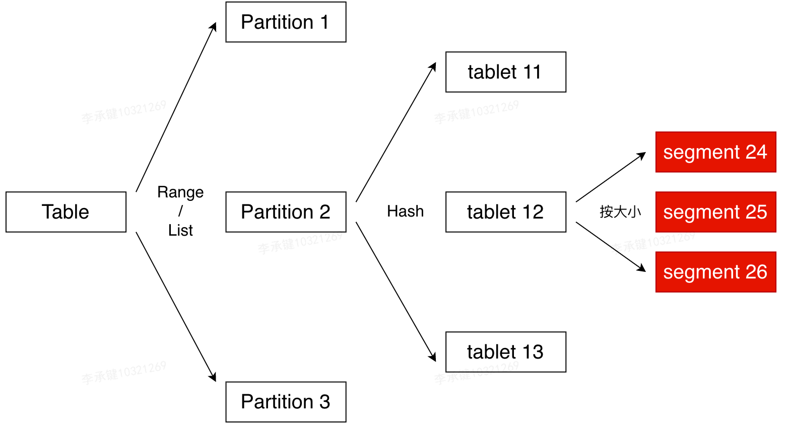

Segment 整体的文件格式分为数据区域，索引区域和 footer 三个部分，如下图所示：

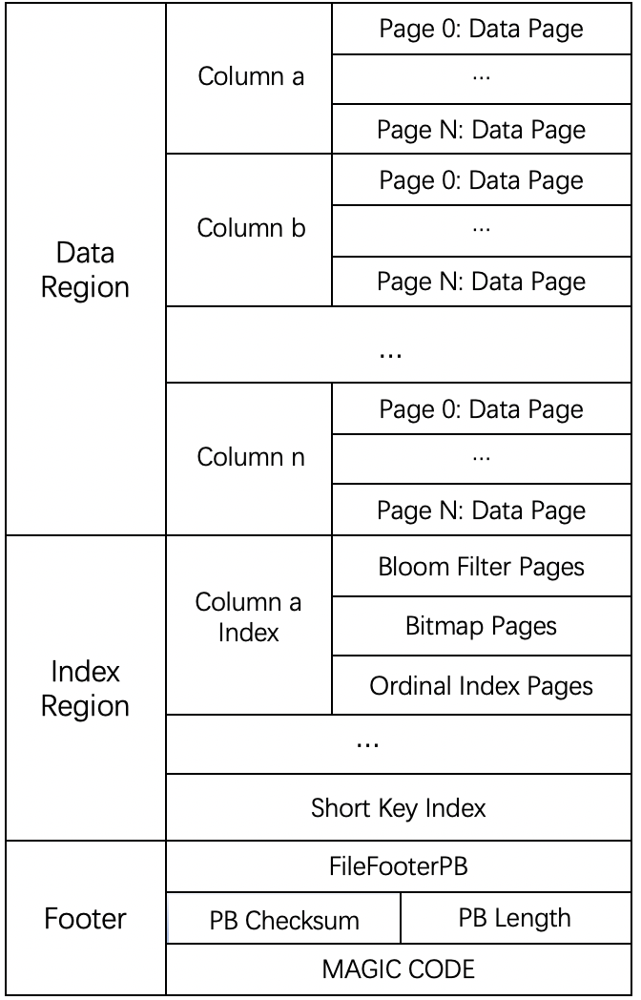

1. Data Region：用于存储各个列的数据信息，这里的数据是按需分page加载的
2. Index Region: doris中将各个列的index数据统一存储在Index Region，这里的数据会按照列粒度进行加载，所以跟列的数据信息分开存储
   - Ordinal Index Pages：针对每个列，都会按照page粒度，建立行号的稀疏索引。内容为这个page的起始行的行号到这个block的指针（包括offset和length）
   - Short Key Index：我们会每隔N行（可配置）生成一个short key的稀疏索引（即前缀索引），索引的内容为：short key->行号(ordinal)
   - bloom filter pages：针对每个bloom filter列,会在page粒度相应的生成一个bloom filter的page，保存在bloom filter pages区域
   - Column的其他索引：该格式设计支持其他的索引信息，比如bitmap索引，spatial索引等等，只需要将需要的数据写到现有的列数据后面，并且添加对应的元数据字段到FileFooterPB中
3. Footer信息
   - FileFooterPB:定义文件的元数据信息
   - 4个字节的footer PB内容的checksum
   - 4个字节的FileFooterPB消息长度，用于读取FileFooterPB
   - 8个字节的MAGIC CODE，之所以在末位存储，是方便不同的场景进行文件类型的识别

##### b. FileFooterPB 信息

Footer信息段在文件的尾部，存储了文件的整体结构，包括数据域的位置，索引域的位置等信息，其中有FileFooterPB，CheckSum，Length，MAGIC CODE 4个部分。重点介绍 FlieFooterPB 数据结构如下：主要包含了列的meta信息、索引的meta信息，Segment的short key索引信息、总行数。

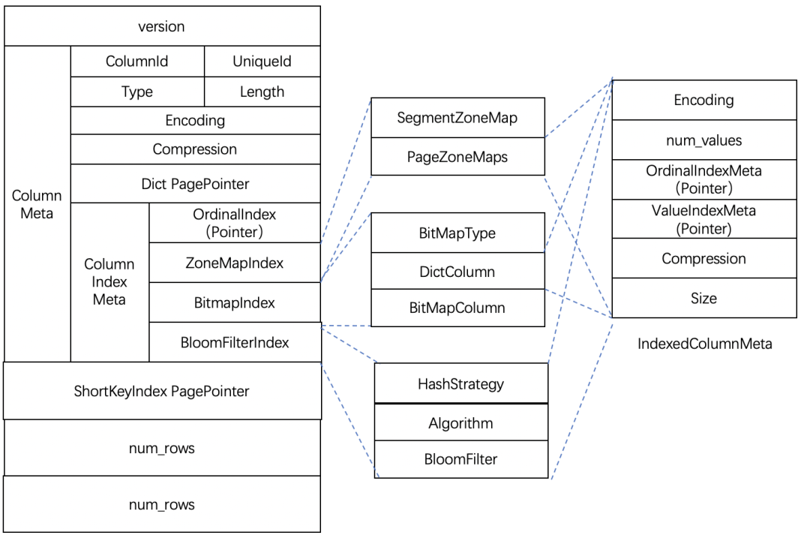

**列索引的meta信息:** ColumnId：当前列在schema中的序号，UniqueId：全局唯一的id，Type：列的类型信息，Length：列的长度信息，Encoding：编码格式，Compression：压缩格式，Dict PagePointer：字典信息

**列索引的meta信息**

- OrdinalIndex：存放列的稀疏索引meta信息
- ZoneMapIndex：存放ZoneMap索引的meta信息。SegmentZoneMap存放了全局的ZoneMap信息，内容包括了最大值、最小值、是否有空值、是否没有非空值，PageZoneMaps则存放了每个页面的ZoneMaps索引的meta信息
- BitMapIndex：存放BitMap索引的meta信息，内容包括了BitMap类型，字典meta信息，BitMap meta信息
- BloomFilterIndex：存放了BloomFilter索引信息

##### c. Ordinal Index（一级索引）

Ordinal Index索引提供了通过行号来查找Column Data Page数据页的物理地址。Ordinal Index能够将按列存储数据按行对齐，可以理解为一级索引。其他索引查找数据时，最终都要通过Ordinal Index查找Column Data Page的位置。

在一个segment中，**数据始终按照key（AGGREGATE KEY、UNIQ KEY 和 DUPLICATE KEY）排序顺序进行存储，即key的排序决定了数据存储的物理结构，决定了列数据的物理结构顺序。**在写入数据时，Column Data Page是由Ordinal index进行管理，Ordinal index记录了每个 Column Data Page 的位置offset、大小size和第一个数据项行号信息，即Ordinal。这样每个列具有按行信息进行快速扫描的能力。Ordinal index采用的稀疏索引结构，就像是一本书目录，记录了每个章节对应的页码。

Ordinal index元信息存储在 FileFooterPB 中的每个列的 OrdinalIndexMeta 中。具体结构如下图所示：

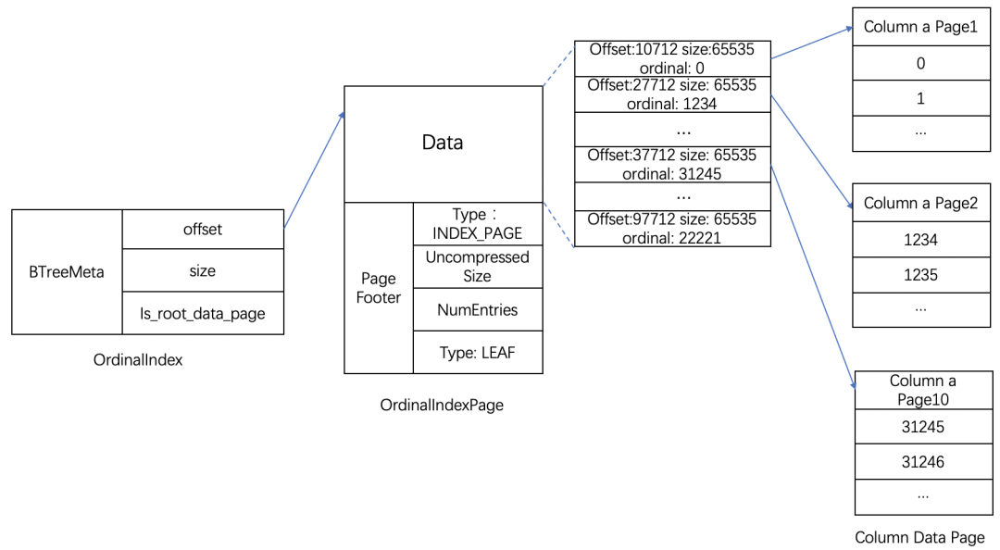

在OrdinalIndexMeta中存放了索引数据对应的root page地址，这里做了一些优化，当数据仅有一个page时，这里的地址可以直接指向唯一的数据page；当一个page放不下时，指向OrdinalIndex类型的二级结构索引page，索引数据中每个数据项对应了Column Data Page offset位置、size大小和ordinal行号信息。其中Ordinal index索引粒度与page粒度一致，默认64*1024字节。

##### d. Short Key Index（前缀索引）

**存储结构**

hort Key Index，是在key（AGGREGATE KEY、UNIQ KEY 和 DUPLICATE KEY）排序的基础上，实现的一种根据给定前缀列，快速查询数据的索引方式。这里Short Key Index索引也采用了稀疏索引结构，在数据写入过程中，每隔一定行数，会生成一个索引项。这个行数为索引粒度默认为1024行，可配置。该过程如下图所示：

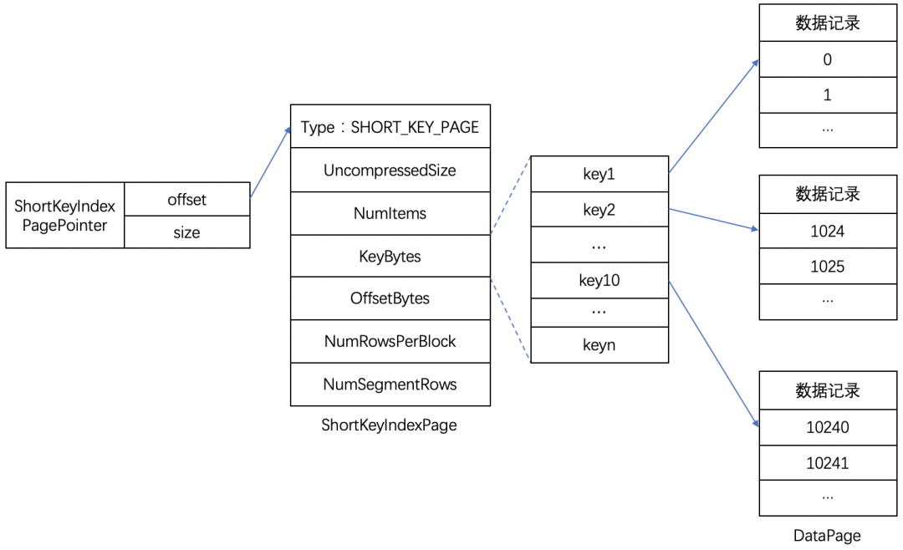

其中，KeyBytes中存放了索引项数据，OffsetBytes存放了索引项在KeyBytes中的偏移。

**索引生成规则**

<u>Short Key Index采用了前36个字节，作为这行数据的前缀索引。当遇到 VARCHAR 类型时，前缀索引会直接截断（即使没有达到 36 个字节，也会截断，不再往后继续）。</u>

##### e. ZoneMap Index索引

ZoneMap索引存储了Segment和每个列对应每个Page的统计信息。这些统计信息可以帮助在查询时提速，减少扫描数据量，统计信息包括了Min最大值、Max最小值、是否有空值、是否没有非空值的信息，存储结构如下图所示：

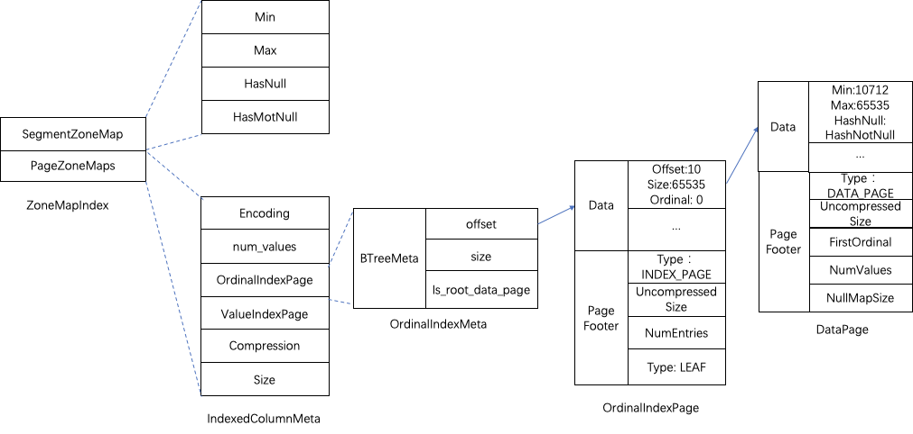

（注：部分单词编写有误，如 HashNull 等）

PageZoneMaps 对应了索引数据存放的Page信息 IndexedColumnMeta 结构，目前实现上没有进行压缩，编码方式为Plain。IndexedColumnMeta 中的 OrdinalIndexPage 指向索引数据 root page 的偏移和大小。这里同样做了优化二级Page优化，当仅有一个索引数据 DataPage 时，OrdinalIndexMeta 直接指向这个 DataPage ，有多个DataPage时，OrdinalIndexMeta 先指向 OrdinalIndexPage，OrdinalIndexPage 是一个二级Page结构，里面的数据项为索引数据 DataPage 的地址偏移offset，大小Size和ordinal信息。

**索引生成规则**
<u>Doris默认为key列开启 ZoneMap 索引</u>；当表的模型为DUPULCATE时，所有字段会开启ZoneMap索引。在列数据写入Page时，自动对数据进行比较，不断维护当前Segment的ZoneMap和当前Page的ZoneMap索引信息。

##### f. BloomFilter（布隆过滤器）

当一些字段不能利用Short Key Index并且字段存在区分度比较大时，Doris提供了BloomFilter索引。

BloomFilter的存储结构如下图所示：

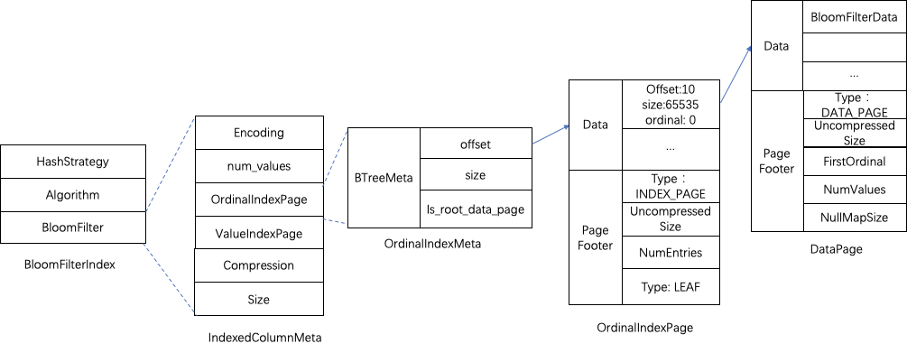

- BloomFilterIndex信息存放了生产的Hash策略、Hash算法和BloomFilter过对应的数据Page信息。Hash算法采用了HASH_MURMUR3，Hash策略采用了BlockSplitBloomFilter分块实现策略，期望的误判率fpp默认配置为0.05。
- BloomFilter索引数据对应数据Page的存放与 ZoneMapIndex 类似，做了二级Page的优化，这里不再详细阐述。

**索引生成规则**
BloomFilter按Page粒度生成，在数据写入一个完整的Page时，Doris会根据Hash策略同时生成这个Page的BloomFilter索引数据。目前bloom过滤器不支持tinyint/hll/float/double类型，其他类型均已支持。使用时需要在PROPERTIES中指定bloom_filter_columns要使用BloomFilter索引的字段。

##### g. Bitmap Index

在数据查询时，对于区分度不大，列的基数比较小的数据列，可以采用位图索引进行优化。比如，性别，婚姻，地理信息等。

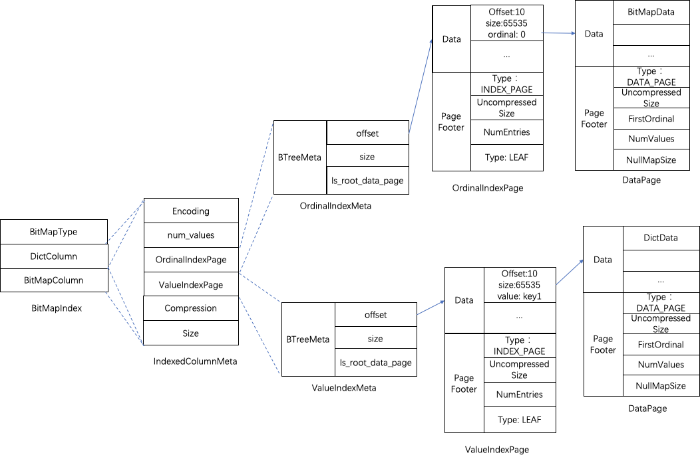

BitmapIndex 的meta信息同样存放在 FileFootPB 中，BitmapIndex 包含了三部分，BitMap的类型、字典信息 DictColumn、位图索引数据信息 BitMapColumn。其中 DictColumn、BitMapColumn 都对应IndexedColumnData 结构，分别存放了字典数据和索引数据的Page地址offset、大小size。这里同样做了二级page的优化，不再具体阐述

这里与其他索引存储结构有差异的地方是DictColumn字典数据进行了LZ4F压缩，在记录二级Page偏移时存放的是 Data Page 中的第一个值

Bitmap的索引是整个Segment中的Column字段的索引，而不是为每个Page单独生成一份。

**索引生成规则**
BitMap创建时需要通过 CREATE INDEX 进行创建。在写入数据时，会维护一个map结构记录下每个key值对应的行号，并采用Roaring位图对rowid进行编码。主要结构如下图：

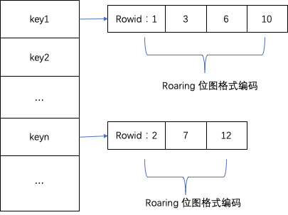

生成索引数据时，首先写入字典数据，将map结构的key值写入到 DictColumn 中。然后，key对应Roaring编码的rowid以字节方式将数据写入到 BitMapColumn 中。

##### h. 索引的查询流程

在查询一个Segment中的数据时，根据执行的查询条件，首先根据字段加索引的情况对数据进行过滤。然后在进行读取数据，整体的查询流程如下：

**核心思想是通过索引确定待查询数据的行号范围，然后用行号通过Ordinal Index查找到Column Data Page数据页的物理地址，最后批量读取每一列的Column Data Page的数据。**具体如下：

1. 首先会按照Segment的行数构建一个row_bitmap，用来记录那些数据需要进行读取，没有使用任何索引的情况下，需要读取所有数据。
2. 当查询条件中按前缀索引规则使用到了key时，会先进行ShortKey Index的过滤，可以在ShortKey Index中匹配到的ordinal行号范围（稀疏索引，不是精确的行号），合入到row_bitmap中。
3. 当查询条件中列字段存在BitMap Index索引时，会按照BitMap索引直接查出符合条件的ordinal行号，与row_bitmap求交过滤。这里的过滤是精确的，之后去掉该查询条件，这个字段就不会再进行后面索引的过滤。
4. 当查询条件中列字段存在BloomFilter索引并且条件为等值（eq，in，is）时，会按BloomFilter索引过滤，这里会走完所有索引，过滤每一个Page的BloomFilter，找出查询条件能命中的所有Page。将索引信息中的ordinal行号范围与row_bitmap求交过滤。
5. 当查询条件中列字段存在ZoneMap索引时，会按ZoneMap索引过滤，这里同样会走完所有索引，找出查询条件能与ZoneMap有交集的所有Page。将索引信息中的ordinal行号范围与row_bitmap求交过滤。
6. 生成好row_bitmap之后，批量通过每个Column的OrdinalIndex找到到具体的Data Page。
7. 批量读取每一列的Column Data Page的数据。在读取时，对于有null值的page，根据null值位图判断当前行是否是null，如果为null进行直接填充即可。

### 3.6 数据导入

导入就是将原始数据按照Doris相应的模型进行清洗转换并加载，导入成功后，用户即可通过 Mysql 客户端查询数据。Doris提供了多种导入方式，用户可以根据数据量大小、导入频率等要求选择最适合自己业务需求的导入方式。

- Frontend（FE）：在导入流程中主要负责导入规划生成和导入任务的调度工作
- Backend（BE）：在导入流程中主要负责数据的 ETL 和存储
- Broker：Broker 为一个独立的无状态进程。封装了文件系统接口，提供 Doris 读取远端存储系统中文件的能力
- Label：所有导入作业都有一个 Label。Label 在一个数据库内唯一，可由用户指定或系统自动生成，用于标识一个导入作业。相同的 Label 仅可用于一个成功的导入作业（如果 Label 对应的导入作业失败，则可以重复使用）
- MySQL 协议/HTTP 协议：Doris 提供两种访问协议接口。 MySQL 协议和 HTTP 协议。部分导入方式使用 MySQL 协议接口提交作业，部分导入方式使用 HTTP 协议接口提交作业
- Rowset：Rowset是Tablet中一次数据变更的数据集合，数据变更包括了数据导入、删除、更新等。Rowset按版本信息进行记录。每次变更会生成一个版本。
- Segment：表示Rowset中的数据分段。多个Segment构成一个Rowset。

#### 3.6.1 基本流程

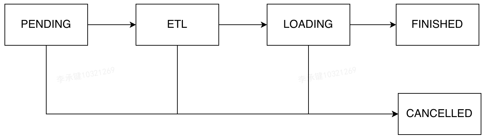

一个导入作业主要经过上面4个阶段。

**PENDING（非必须）**: 该阶段只有 Broker Load 才有。Broker Load 被用户提交后会短暂停留在这个阶段，直到被 FE 中的 Scheduler 调度。 其中 Scheduler 的调度间隔为5秒。

**ETL（非必须）**： 该阶段在版本 0.10.0(包含) 之前存在，主要是用于将原始数据按照用户声明的方式进行变换，并且过滤不满足条件的原始数据。在 0.10.0 后的版本，ETL 阶段不再存在，其中数据 transform 的工作被合并到 LOADING 阶段。

**LOADING**： 该阶段在版本 0.10.0（包含）之前主要用于将变换后的数据推到对应的 BE 存储中。在 0.10.0 后的版本，该阶段先对数据进行清洗和变换，然后将数据发送到 BE 存储中。当所有导入数据均完成导入后，进入等待生效过程，此时 Load job 依旧是 LOADING。

**FINISHED**： 在 Load job 涉及的所有数据均生效后，Load job 的状态变成 FINISHED。FINISHED 后导入的数据均可查询。

**CANCELLED**: 在作业 FINISH 的之前，作业都可能被取消并进入 CANCELLED 状态。如用户手动取消，或导入出现错误等。CANCELLED 也是 Load Job 的最终状态，不可被再次执行。

#### 3.6.2 Label和原子性

Doris 对所有导入方式提供原子性保证。既保证同一个导入作业内的数据，原子生效。不会出现仅导入部分数据的情况。

<u>用户可以通过 Label 机制（Label 生成策略需满足，每一批次数据唯一且固定的原则），来保证 Label 对应的数据最多被导入一次，即At-Most-Once 语义。程序自身保证 At-Least-Once：外部系统需要保证自身的 At-Least-Once，这样就可以保证导入流程的 Exactly-Once。</u>

#### 3.6.3 同步和异步

同步导入方式即用户创建导入任务，Doris 同步执行导入，执行完成后返回用户导入结果。用户可直接根据创建导入任务命令返回的结果同步判断导入是否成功。<u>同步类型的导入方式有: Stream load，Insert。</u>

异步导入方式即用户创建导入任务后，Doris 直接返回创建成功。创建成功不代表数据已经导入。导入任务会被异步执行，用户在创建成功后，需要通过轮询的方式发送查看命令查看导入作业的状态。如果创建失败，则可以根据失败信息，判断是否需要再次创建。<u>异步类型的导入方式有：Broker load，Spark load。</u>

#### 3.6.4 整体写入流程

整体的数据写入流程如下图所示：

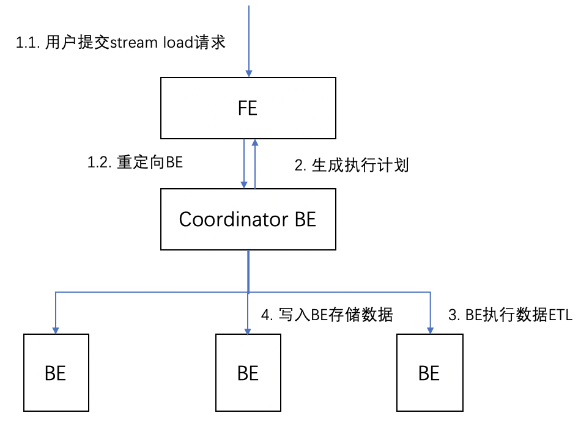

FE接收用户的写入请求，并随机选出BE作为Coordinator BE。将用户的请求重定向到这个BE上。

Coordinator BE负责接收用户的数据写入请求，同时请求FE生成执行计划并调度、管理导入任务LoadJob和导入事务。

Coordinator BE调度执行导入计划，执行对数据校验、清理。

数据写入到BE的存储层中。在这个过程中会先写入到内存中，写满一定数据后按照存储层的数据格式写入到物理磁盘上。

##### a. 数据分发与写入

数据在经过清洗过滤后，会通过Open/AddBatch请求分批量的将数据发送给存储层的BE节点上。在一个BE上支持多个LoadJob任务同时并发写入执行。LoadChannelMgr负责管理了这些任务，并对数据进行分发。数据分发和写入过程如下图所示：

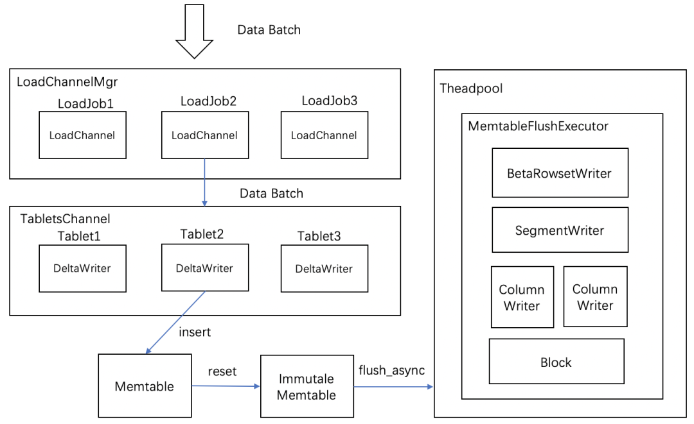

1. 每次导入任务LoadJob会建立一个LoadChannel来执行，LoadChannel维护了一次导入的通道，LoadChannel可以将数据分批量写入操作直到导入完成。
2. LoadChannel会创建一个TabletsChannel执行具体的导入操作。一个TabletsChannel对应多个Tablet。一次数据批量写入操作中，TabletsChannel将数据分发给对应Tablet，由DeltaWriter将数据写入到Tablet，便开始了真正的写入操作。
3. DeltaWriter主要负责不断接收新写入的批量数据，完成单个Tablet的数据写入。由于新增的数据可以是增量Delta部分，因此叫做DeltaWriter。DeltaWriter数据写入采用了类LSM树的结构，将数据先写到Memtable中，当Memtable数据写满后，会异步flush生成一个Segment进行持久化，同时生成一个新的Memtable继续接收新增数据导入，这个flush操作由MemtableFlushExecutor执行器完成。
4. Memtable中采用了跳表的结构对数据进行排序，排序规则使用了按照schema的key的顺序依次对字段进行比较。这样保证了写入的每一个Segment中的数据是有序的。如果当前模型为非DUP模型（AGG模型和UNIQUE模型）时，还会对相同key的数据进行聚合。

在物理存储层面的写入，由RowsetWriter完成。RowsetWriter中又分为SegmentWriter、ColumnWriter、PageBuilder、IndexBuilder等子模块。

1. 其中RowsetWriter从整体上完成一次导入LoadJob任务的写入，一次导入LoadJob任务会生成一个Rowset，一个Rowset表示一次导入成功生效的数据版本。实现上由RowsetWriter负责完成Rowset的写入。
2. SegmentWriter负责实现Segment的写入。一个Rowset可以由多个Segment文件组成。
3. ColumnWriter被包含在SegmentWriter中，Segment的文件是完全的列存储结构，Segment中包含了各个列和相关的索引数据，每个列的写入由ColumnWriter负责写入。
4. 在文件存储格式中，数据和索引都是按Page进行组织，ColumnWriter中又包含了生成数据Page的PageBuilder和生成索引Page的IndexBuilder来完成Page的写入。
5. 最后，FileWritableBlock来负责具体的文件的读写。

##### b. Rowset 发布

在数据导入完成时，DeltaWriter会将新生成的Rowset进行发布。发布即将这个版本的Rowset设置为可见状态，表示导入数据已经生效能够被查询。而版本信息表示Rowset生效的次序，一次导入会生成一个Rowset，每次导入成功会按序增加版本。

### 3.7 多版本和Compaction

#### 3.7.1 多版本

为了获得更高的导入吞吐量，Doris的数据更新是按照batch来更新的。为了在数据更新时不影响数据查询以及保证更新的原子性，Doris采用了MVCC（Multi-Version Concurrency Control）的方式，所以在数据更新时每个batch都需要指定一个verison。数据的版本化虽然可以解决读写冲突和更新的原子性，但是也带来了以下问题：

1. 存储成本。 多版本意味着我们需要存储多份数据，但是由于聚合后的数据一般比较小，所以这个问题还好。
2. 查询时延。 如果有很多版本，那么查询时需要遍历的版本数据就会很多，查询时延自然就会增大。

为了解决这两个问题，常见的思路就是及时删除不需要的、过期的数据，以及将小的文件Merge为大的文件。

#### 3.7.2 Compaction

连续版本的Rowset合并的过程称为Compaction（就是将小的文件Merge为大的文件），合并过程中会对数据进行压缩操作。Compaction是在后台并发和异步执行的，Compaction后对于aggregation key模型和unique key模型分散在不同Rowset但相同key的数据进行合并，达到了预计算的效果。同时减少了Rowset文件数量，提升了查询效率。

Rowset的版本信息中设计了有两个字段first、second来表示Rowset合并后的版本范围。当未合并的cumulative rowset的版本first和second相等。Compaction时相邻的Rowset会进行合并，生成一个新的Rowset，版本信息的first，second也会进行合并，变成一个更大范围的版本。

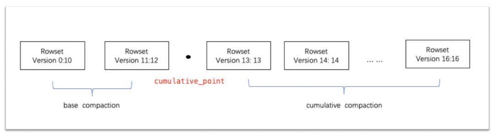

如上图所示，Compaction任务分为两种，base compaction和cumulative compaction。cumulative_point是分割两种策略关键。可以这样理解，cumulative_point右边是从未合并过的增量Rowset，其每个Rowset的first与second版本相等；cumulative_point左边是合并过的Rowset，first版本与second版本不等。base compaction和cumulative compaction任务流程基本一致，差异仅在选取要合并的InputRowset逻辑有所不同。

**Compaction合并整体流程**

1. 计算cumulative_point

2. 选择compaction的需要合并的InputRowsets集合：

   **base compaction选取条件：**

   当存在大于5个的非cumulative的rowset，将所有非cumulative的rowset进行合并；

   版本first为0的base rowset与其他非cumulative的磁盘比例小于10:3时，合并所有非cumulative的rowset进行合并；

   其他情况，不进行合并。

   **cumulative compaction选取条件：**

   选出Rowset集合的segment数量需要大于等于5并且小于等于1000（可配置），进行合并；

   当输出Rowset数量小于5时，但存在删除条件版本大于Rowset second版本时，进行合并（让删除的Rowset快速合并进来）；

   当累计的base compaction和cumulative compaction都时间大于1天时，进行合；

   其他情况不合并。

3. 执行compaction。Compaction执行基本可以理解为读取流程加写入流程。这里会将待合并的inputRowsets开启Reader，然后通过next_row_with_aggregation读取记录。写入到输出的RowsetWriter中，生产新的OutputRowset，这个Rowset的版本为InputRowsets版本全集范围。

4. 更新cumulative_point，将cumulative compaction的产出的OutputRowset交给后续的base compaction流程。

### 3.8 查询引擎

Doris 的查询引擎是基于 MPP 的火山模型，是从早期版本的 Apache Impala 演化而来，真正的MPP执行框架，相对于一些分布式 Gette-Setter 框架，最显著的区别在于其实现了 Exchange 节点。在 Doris 中，一个SQL语句会先生成一个逻辑执行计划，然后根据数据的分布，形成一个物理执行计划。物理执行计划会有多个 Fragment，而 Fragment 直接的数据传输则是由 Exchange 节点完成的。有了 Exchange 节点，最大的收益是整个查询框架拥有了数据 Reshuffle 的能力，通过这个能力，查询的计算节点不在局限于数据的存储节点，从而能够更好的利用多节点资源进行并行数据处理。

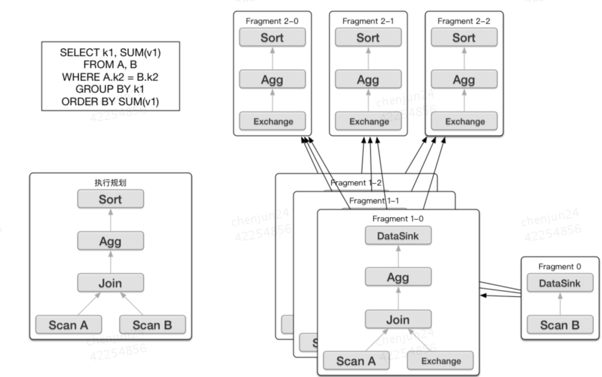

# 引用

1. [Doris简史 - 为分析而生的11年](https://baijiahao.baidu.com/s?id=1633669902039812353&wfr=spider&for=pc)
