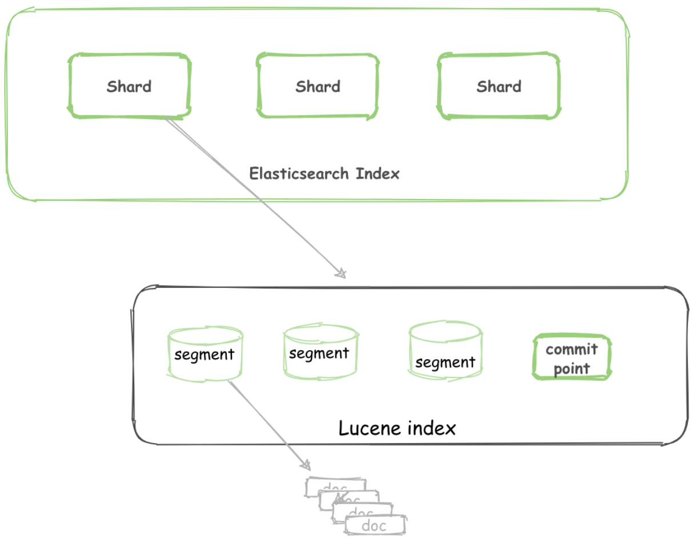
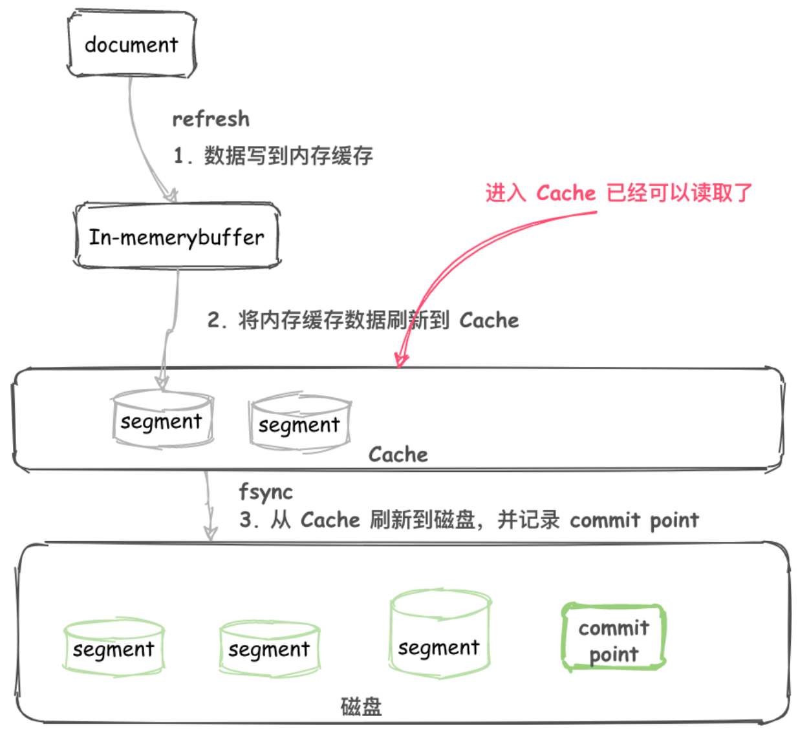
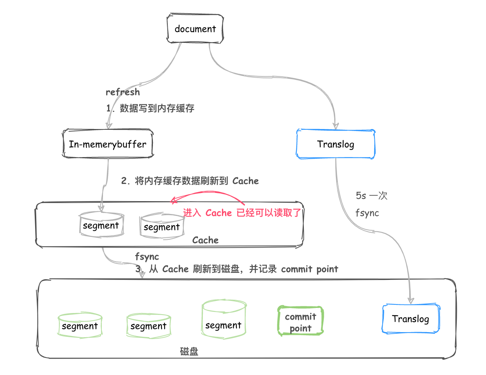
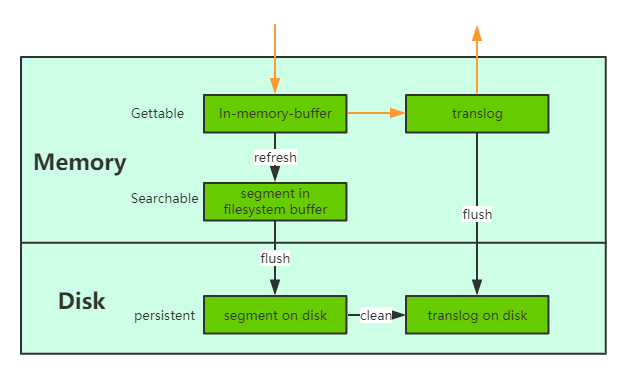

## ES基本概念

ES 是使用 Java 编写的一种开源搜索引擎，它在内部使用 Lucene 做索引与搜索，通过对 Lucene 的封装，隐藏了 Lucene 的复杂性，取而代之的提供一套简单一致的 RESTful API。

然而，Elasticsearch 不仅仅是 Lucene，并且也不仅仅只是一个全文搜索引擎。

它可以被下面这样准确的形容：

- 一个分布式的实时文档存储，每个字段可以被索引与搜索。
- 一个分布式实时分析搜索引擎。
- 能胜任上百个服务节点的扩展，并支持 PB 级别的结构化或者非结构化数据。

官网对 Elasticsearch 的介绍是 Elasticsearch 是一个分布式、可扩展、近实时的搜索与数据分析引擎。

### 集群(Cluster)

ES 的集群搭建很简单，不需要依赖第三方协调管理组件，自身内部就实现了集群的管理功能。

ES 集群由一个或多个 Elasticsearch 节点组成，每个节点配置相同的 cluster.name 即可加入集群，默认值为 “elasticsearch”。

确保不同的环境中使用不同的集群名称，否则最终会导致节点加入错误的集群。

一个 Elasticsearch 服务启动实例就是一个节点(Node)。节点通过 node.name 来设置节点名称，如果不设置则在启动时给节点分配一个随机通用唯一标识符作为名称。

#### 节点角色

每个节点既可以是候选主节点也可以是数据节点，通过在配置文件 ../config/elasticsearch.yml 中设置即可，默认都为 true。

```yml
node.master: true  //是否候选主节点 
node.data: true    //是否数据节点
```

数据节点负责数据的存储和相关的操作，例如对数据进行增、删、改、查和聚合等操作，所以数据节点(Data 节点)对机器配置要求比较高，对 CPU、内存和 I/O 的消耗很大。<u>通常随着集群的扩大，需要增加更多的数据节点来提高性能和可用性。</u>

**候选主节点可以被选举为主节点(Master 节点)，集群中只有候选主节点才有选举权和被选举权，其他节点不参与选举的工作。**

<u>主节点负责创建索引、删除索引、跟踪哪些节点是群集的一部分，并决定哪些分片分配给相关的节点、追踪集群中节点的状态等，稳定的主节点对集群的健康是非常重要的。</u>

一个节点既可以是候选主节点也可以是数据节点，但是由于数据节点对 CPU、内存核 I/O 消耗都很大。所以如果某个节点既是数据节点又是主节点，那么可能会对主节点产生影响从而对整个集群的状态产生影响。因此为了提高集群的健康性，我们应该对 Elasticsearch 集群中的节点做好角色上的划分和隔离。可以使用几个配置较低的机器群作为候选主节点群。

**虽然对节点做了角色区分，但是用户的请求可以发往任何一个节点，并由该节点负责分发请求、收集结果等操作，而不需要主节点转发。**<u>这种节点可称之为协调节点，协调节点是不需要指定和配置的，集群中的任何节点都可以充当协调节点的角色。</u>

#### 脑裂现象

同时如果由于网络或其他原因导致集群中选举出多个 Master 节点，使得数据更新时出现不一致，这种现象称之为脑裂，即集群中不同的节点对于 Master 的选择出现了分歧，出现了多个 Master。

“脑裂”问题可能有以下几个原因造成：

- 网络问题：集群间的网络延迟导致一些节点访问不到 Master，认为 Master 挂掉了从而选举出新的 Master，并对 Master 上的分片和副本标红，分配新的主分片。
- 节点负载：主节点的角色既为 Master 又为 Data，访问量较大时可能会导致 ES 停止响应(假死状态)造成大面积延迟，此时其他节点得不到主节点的响应认为主节点挂掉了，会重新选取主节点。
- 内存回收：主节点的角色既为 Master 又为 Data，当 Data 节点上的 ES 进程占用的内存较大，引发 JVM 的大规模内存回收，造成 ES 进程失去响应。

为了避免脑裂现象的发生，我们可以从原因着手通过以下几个方面来做出优化措施：

- 适当调大响应时间，减少误判。通过参数 discovery.zen.ping_timeout 设置节点状态的响应时间，默认为 3s，可以适当调大。如果 Master 在该响应时间的范围内没有做出响应应答，判断该节点已经挂掉了。调大参数(如 6s，discovery.zen.ping_timeout:6)，可适当减少误判。

- 选举触发。我们需要在候选集群中的节点的配置文件中设置参数 discovery.zen.munimum_master_nodes 的值。这个参数表示在选举主节点时需要参与选举的候选主节点的节点数，默认值是 1，官方建议取值(master_eligibel_nodes/2)+1，其中 master_eligibel_nodes 为候选主节点的个数。这样做既能防止脑裂现象的发生，也能最大限度地提升集群的高可用性，因为只要不少于 discovery.zen.munimum_master_nodes 个候选节点存活，选举工作就能正常进行。当小于这个值的时候，无法触发选举行为，集群无法使用，不会造成分片混乱的情况。

- 角色分离。即是上面我们提到的候选主节点和数据节点进行角色分离，这样可以减轻主节点的负担，防止主节点的假死状态发生，减少对主节点“已死”的误判。

### 分片(Shards)

ES 支持 PB 级全文搜索，当索引上的数据量太大的时候，ES 通过水平拆分的方式将一个索引上的数据拆分出来分配到不同的数据块上，拆分出来的数据库块称之为一个分片。<u>每个分片可以有一个主分片和多个副本分片，**每个分片副本都是一个具有完整功能的lucene实例。**分片可以分配在不同的服务器上，同一个分片的不同副本不能分配在相同的服务器上。</u>



**在一个多分片的索引中写入数据时，通过路由来确定具体写入哪一个分片中，<u>所以在创建索引的时候需要指定分片的数量，并且分片的数量一旦确定就不能修改。</u>**分片的数量和下面介绍的副本数量都是可以通过创建索引时的 Settings 来配置，ES 默认为一个索引创建 5 个主分片, 并分别为每个分片创建一个副本。

lucene索引的读写会占用很多的系统资源，因此，分片数不能设置过大；所以，在创建索引时，合理配置分片数是非常重要的。一般来说，我们遵循一些原则：

1. 控制每个分片占用的硬盘容量不超过ES的最大JVM的堆空间设置，因此，如果索引的总容量在500G左右，那分片大小在16个左右即可；当然，最好同时考虑原则2。
2. 考虑一下node数量，一般一个节点有时候就是一台物理机，如果分片数过多，大大超过了节点数，很可能会导致一个节点上存在多个分片，一旦该节点故障，即使保持了1个以上的副本，同样有可能会导致数据丢失，集群无法恢复。所以， 一般都设置分片数不超过节点数的3倍。

#### 副本(Replicas)

副本就是对分片的 Copy，每个主分片都有一个或多个副本分片，当主分片异常时，副本可以提供数据的查询等操作。主分片和对应的副本分片是不会在同一个节点上的，所以副本分片数的最大值是 N-1(其中 N 为节点数)。

<u>对文档的新建、索引和删除请求都是写操作，**必须在主分片上面完成之后才能被复制到相关的副本分片**</u>。ES 为了提高写入的能力这个过程是并发写的，同时为了解决并发写的过程中数据冲突的问题，ES 通过乐观锁的方式控制，每个文档都有一个 _version (版本)号，当文档被修改时版本号递增。<u>一旦所有的副本分片都报告写成功才会向协调节点报告成功，协调节点向客户端报告成功。</u>


## ES 原理

### 写入

为了支持对海量数据的存储和查询，Elasticsearch引入分片的概念，一个索引被分成多个分片，在进行写操作时，ES会根据传入的routing参数<u>(或mapping中设置的_routing, 如果参数和设置中都没有则默认使用_id)</u>, 按照公式

```
shard_num = hash(\routing) % num_primary_shards
```

计算出文档要分配到的分片，在从集群元数据中找出对应主分片的位置，将请求路由到该分片进行文档写操作。
es接收数据请求时先存入内存中，默认每隔一秒会从内存buffer中将数据写入filesystem cache，这个过程叫做refresh；

当一个文档写入Lucene后是不能被立即查询到的，Elasticsearch提供了一个refresh操作，会定时地调用lucene的reopen(新版本为openIfChanged)为内存中新写入的数据生成一个新的segment，此时被处理的文档均可以被检索到。<u>refresh操作的时间间隔由refresh_interval参数控制，默认为1s</u>。 当然还可以在写入请求中带上refresh表示写入后立即refresh，另外还可以调用refresh API显式refresh。

**<u>插入的新文档必须等待`fsync`操作将segment强制写入磁盘后, 才可以提供搜索.而 `fsync`操作的代价很大, 使得搜索不够实时，所以出现refresh操作。</u>**

1. 将数据写入buffer(内存缓冲区);
2. 不等buffer空间被占满, 而是每隔一定时间(默认1s), 其中的数据就作为新的index segment被commit到文件系统的cache(缓存)中;
3. index segment 一旦被写入cache(缓存), 就立即打开该segment供搜索使用;
4. 清空当前buffer缓冲区, 等待接收新的文档.

优化的地方: 过程2和过程3。segment进入操作系统的缓存中就可以提供搜索, 这个写入和打开新segment的轻量过程被称为refresh.



### 数据存储可靠性

#### 引入translog

当一个文档写入Lucence后是存储在内存中的，即使执行了refresh操作仍然是在文件系统缓存中，如果此时服务器宕机，那么这部分数据将会丢失。**为此ES增加了translog， 当进行文档写操作时会先将文档写入Lucene，然后写入一份到translog，写入translog是落盘的**，如果对可靠性要求不是很高，也可以设置异步落盘，可以提高性能，由配置

- index.translog.durability
- index.translog.sync_interval控制。

这样就可以防止服务器宕机后数据的丢失。由于translog是追加写入，因此性能比较好。<u>与传统的分布式系统不同，这里是先写入Lucene再写入translog，原因是写入Lucene可能会失败，为了减少写入失败回滚的复杂度，因此先写入Lucene。</u>



#### flush操作

另外每30分钟或当translog达到一定大小(由index.translog.flush_threshold_size控制，默认512mb), <u>ES会触发一次flush操作，此时ES会先执行refresh操作将buffer中的数据生成segment，然后调用lucene的commit方法将所有内存中的segment fsync到磁盘。</u>此时lucene中的数据就完成了持久化，会清空translog中的数据(6.x版本为了实现sequenceIDs,不删除translog) 。


#### 多副本机制

另外ES有多副本机制，一个分片的主副分片不能分片在同一个节点上，进一步保证数据的可靠性。

### Lucene段合并操作

> 如果对这里需要比较深入的研究，可以阅读文档：[Lucene学习总结之五：Lucene段合并(merge)过程分析](https://www.iteye.com/blog/forfuture1978-609197)

由于refresh默认间隔为1s中，因此会产生大量的小segment，为此ES会运行一个任务检测当前磁盘中的segment，对这些零散的segment进行merge(归并)操作, 尽量让索引中只保有少量的、体积较大的segment文件。这个过程由独立的merge线程负责, 不会影响新segment的产生。对符合条件的segment进行合并操作，减少lucene中的segment个数，提高查询速度，降低负载。


不仅如此，merge过程也是文档删除和更新操作后，旧的doc真正被删除的时候。用户还可以手动调用_forcemerge API来主动触发merge，以减少集群的segment个数和清理已删除或更新的文档。更新的流程大致为：

1. 选择一些有相似大小的segment, merge成一个大的segment;
2. 将新的segment刷新到磁盘上;
3. 更新commit文件: 写一个新的commit point, 包括了新的segment, 并删除旧的segment;
4. 打开新的segment, 完成搜索请求的转移;
5. 删除旧的小segment.

#### 优化merge的配置项

segment的归并是一个非常消耗系统CPU和磁盘IO资源的任务, 所以ES对归并线程提供了限速机制, 确保这个任务不会过分影响到其他任务。 segment合并；索引节点粒度配置，segment默认最小值2M，不过有时候合并会拖累写入速率。

**配置合适的段大小**

```BASH
PUT /_all/_settings { "index.merge.policy.floor_segment":"10mb" }
```

**配置归并线程的数目**

推荐设置为CPU核心数的一半, 如果磁盘性能较差, 可以适当降低配置, 避免发生磁盘IO堵塞，所以我们需要降低每个索引并发访问磁盘的线程数。这个设置允许 max_thread_count + 2 个线程同时进行磁盘操作，也就是设置为 1 允许三个线程。

```bash
PUT /_all/_settings { "index.merge.scheduler.max_thread_count" : "1" }
```

**其他配置**

```
# 优先归并小于此值的segment, 默认是2MB:
index.merge.policy.floor_segment
 
# 一次最多归并多少个segment, 默认是10个: 
index.merge.policy.max_merge_at_once
 
#如果堆栈经常有很多merge，则可以调整配置，默认是10个，其应该大于等于index.merge.policy.max_merge_at_once。
index.merge.policy.segments_per_tier
 
# 一次直接归并多少个segment, 默认是30个 
index.merge.policy.max_merge_at_once_explicit 
 
# 大于此值的segment不参与归并, 默认是5GB. optimize操作不受影响,可以考虑适当降低此值 
index.merge.policy.max_merged_segment
```

### 数据恢复

flush操作大致是对下面三个操作的一个事务过程：

- 将translog中的记录刷到磁盘上
- 更新commit point信息
- 清空translog文件

上面详细的描述了触发Flush操作的条件，简单来说就是：<u>每隔30分钟；或者translog文件的大小达到上限(默认为512MB)</u>。一些关于Flush的详细相关配置为:

```yml

# 发生多少次操作(累计多少条数据)后进行一次flush, 默认是unlimited: 
index.translog.flush_threshold_ops
 
# 当translog的大小达到此预设值时, 执行一次flush操作, 默认是512MB: 
index.translog.flush_threshold_size
 
# 每隔多长时间执行一次flush操作, 默认是30min:
index.translog.flush_threshold_period
 
# 检查translog、并执行一次flush操作的间隔. 默认是5s: ES会在5-10s之间进行一次操作: 
index.translog.sync_interval
```

数据的故障恢复:

1. 增删改操作成功的标志: segment被成功刷新到Primary Shard和其对应的Replica Shard的磁盘上, 对应的操作才算成功。
2. translog文件中存储了上一次flush(即上一个commit point)到当前时间的所有数据的变更记录. —— 即translog中存储的是还没有被刷到磁盘的所有最新变更记录。
3. ES发生故障, 或重启ES时, 将根据磁盘中的commit point去加载已经写入磁盘的segment, 并重做translog文件中的所有操作, 从而保证数据的一致性。

<u>为了保证不丢失数据, 就要保护translog文件的安全。Elasticsearch 2.0之后, **每次写请求(如index、delete、update、bulk等)完成时, 都会触发fsync将translog中的segment刷到磁盘, 然后才会返回200 OK的响应**;或者也可以默认每隔5s就将translog中的数据通过fsync强制刷新到磁盘。</u>

提高数据安全性的同时, 降低了一点性能.频繁地执行fsync操作, 可能会产生阻塞导致部分操作耗时较久。如果允许部分数据丢失, 可设置异步刷新translog来提高效率.优化如下：

```
PUT /_all/_settings
{
    "index.translog.durability": "async",
    "index.translog.flush_threshold_size":"1024mb",
    "index.translog.sync_interval": "120s"
}
```
