团队内部要分享HBase的知识，之前研究了一段时间，知识比较零散，这一次就系统化的整理一番，之后在想到Hbase的时候，看着一篇就够了。

### 概览

#### 特性

Hbase是一种NoSQL数据库，这意味着它不像传统的RDBMS数据库那样支持SQL作为查询语言。Hbase是一种分布式存储的数据库，技术上来讲，它更像是分布式存储而不是分布式数据库，它缺少很多RDBMS系统的特性，比如列类型，辅助索引，触发器，和高级查询语言等待。那Hbase有什么特性呢？如下：

- 强读写一致，但是不是“最终一致性”的数据存储，这使得它非常适合高速的计算聚合
- 自动分片，通过Region分散在集群中，当行数增长的时候，Region也会自动的切分和再分配
- 自动的故障转移
- Hadoop/HDFS集成，和HDFS开箱即用，不用太麻烦的衔接
- 丰富的“简洁，高效”API，Thrift/REST API，Java API
- 块缓存，布隆过滤器，可以高效的列查询优化
- 操作管理，Hbase提供了内置的web界面来操作，还可以监控JMX指标

#### 什么时候用Hbase？

Hbase不适合解决所有的问题：

- 首先数据库量要足够多，如果有十亿及百亿行数据，那么Hbase是一个很好的选项，如果只有几百万行甚至不到的数据量，RDBMS是一个很好的选择。因为数据量小的话，真正能工作的机器量少，剩余的机器都处于空闲的状态
- 其次，如果你不需要辅助索引，静态类型的列，事务等特性，一个已经用RDBMS的系统想要切换到Hbase，则需要重新设计系统。
- 最后，保证硬件资源足够，每个HDFS集群在少于5个节点的时候，都不能表现的很好。因为HDFS默认的复制数量是3，再加上一个NameNode。

Hbase在单机环境也能运行，但是请在开发环境的时候使用。

### 内部应用

- 存储业务数据:车辆GPS信息，司机点位信息，用户操作信息，设备访问信息。。。
- 存储日志数据:架构监控数据（登录日志，中间件访问日志，推送日志，短信邮件发送记录。。。），业务操作日志信息
- 存储业务附件：UDFS系统存储图像，视频，文档等附件信息

不过在公司使用的时候，一般不使用原生的Hbase API，使用原生的API会导致访问不可监控，影响系统稳定性，以致于版本升级的不可控。

### Hbase架构

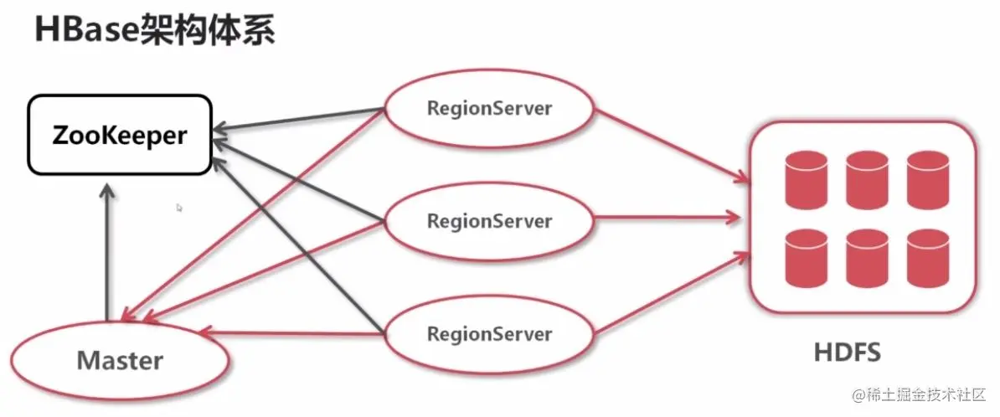

- Zookeeper，作为分布式的协调。RegionServer也会把自己的信息写到ZooKeeper中。
- HDFS是Hbase运行的底层文件系统
- RegionServer，理解为数据节点，存储数据的。
- Master RegionServer要实时的向Master报告信息。Master知道全局的RegionServer运行情况，可以控制RegionServer的故障转移和Region的切分。

#### 架构细化

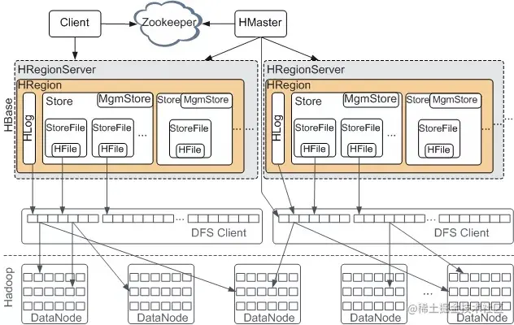

- HMaster是Master Server的实现，负责监控集群中的RegionServer实例，同时是所有metadata改变的接口，在集群中，通常运行在NameNode上面，[这里有一篇更细的HMaster介绍](https://link.juejin.cn?target=http%3A%2F%2Fblog.zahoor.in%2F2012%2F08%2Fhbase-hmaster-architecture%2F)
  - HMasterInterface暴露的接口，Table(createTable, modifyTable, removeTable, enable, disable),ColumnFamily (addColumn, modifyColumn, removeColumn),Region (move, assign, unassign)
  - Master运行的后台线程：LoadBalancer线程，控制region来平衡集群的负载。CatalogJanitor线程，周期性的检查hbase:meta表。
- HRegionServer是RegionServer的实现，服务和管理Regions，集群中RegionServer运行在DataNode
  - HRegionRegionInterface暴露接口：Data (get, put, delete, next, etc.)，Region (splitRegion, compactRegion, etc.)
  - RegionServer后台线程：CompactSplitThread，MajorCompactionChecker，MemStoreFlusher，LogRoller
- Regions，代表table，Region有多个Store(列簇)，Store有一个Memstore和多个StoreFiles(HFiles)，StoreFiles的底层是Block。

#### 存储设计

在Hbase中，表被分割成多个更小的块然后分散的存储在不同的服务器上，这些小块叫做Regions，存放Regions的地方叫做RegionServer。Master进程负责处理不同的RegionServer之间的Region的分发。在Hbase实现中HRegionServer和HRegion类代表RegionServer和Region。HRegionServer除了包含一些HRegions之外，还处理两种类型的文件用于数据存储

- HLog， 预写日志文件，也叫做WAL(write-ahead log)
- HFile 真实的数据存储文件

##### HLog

- MasterProcWAL：HMaster记录管理操作，比如解决冲突的服务器，表创建和其它DDLs等操作到它的WAL文件中，这个WALs存储在MasterProcWALs目录下，它不像RegionServer的WALs，HMaster的WAL也支持弹性操作，就是如果Master服务器挂了，其它的Master接管的时候继续操作这个文件。

- WAL记录所有的Hbase数据改变，如果一个RegionServer在MemStore进行FLush的时候挂掉了，WAL可以保证数据的改变被应用到。如果写WAL失败了，那么修改数据的完整操作就是失败的。

  - 通常情况，每个RegionServer只有一个WAL实例。在2.0之前，WAL的实现叫做HLog
  - WAL位于*/hbase/WALs/*目录下
  - MultiWAL: 如果每个RegionServer只有一个WAL，由于HDFS必须是连续的，导致必须写WAL连续的，然后出现性能问题。MultiWAL可以让RegionServer同时写多个WAL并行的，通过HDFS底层的多管道，最终提升总的吞吐量，但是不会提升单个Region的吞吐量。

- WAL的配置：

  ```xml
  xml
  
   体验AI代码助手
   代码解读
  复制代码// 启用multiwal
  <property>
    <name>hbase.wal.provider</name>
    <value>multiwal</value>
  </property>
  ```

[Wiki百科关于WAL](https://link.juejin.cn?target=https%3A%2F%2Fen.wikipedia.org%2Fwiki%2FWrite-ahead_logging)

##### HFile

HFile是Hbase在HDFS中存储数据的格式，它包含多层的索引，这样在Hbase检索数据的时候就不用完全的加载整个文件。索引的大小(keys的大小，数据量的大小)影响block的大小，在大数据集的情况下，block的大小设置为每个RegionServer 1GB也是常见的。

> 探讨数据库的数据存储方式，其实就是探讨数据如何在磁盘上进行有效的组织。因为我们通常以如何高效读取和消费数据为目的，而不是数据存储本身。

###### Hfile生成方式

起初，HFile中并没有任何Block，数据还存在于MemStore中。

Flush发生时，创建HFile Writer，第一个空的Data Block出现，初始化后的Data Block中为Header部分预留了空间，Header部分用来存放一个Data Block的元数据信息。

而后，位于MemStore中的KeyValues被一个个append到位于内存中的第一个Data Block中：

**注**：如果配置了Data Block Encoding，则会在Append KeyValue的时候进行同步编码，编码后的数据不再是单纯的KeyValue模式。Data Block Encoding是HBase为了降低KeyValue结构性膨胀而提供的内部编码机制。

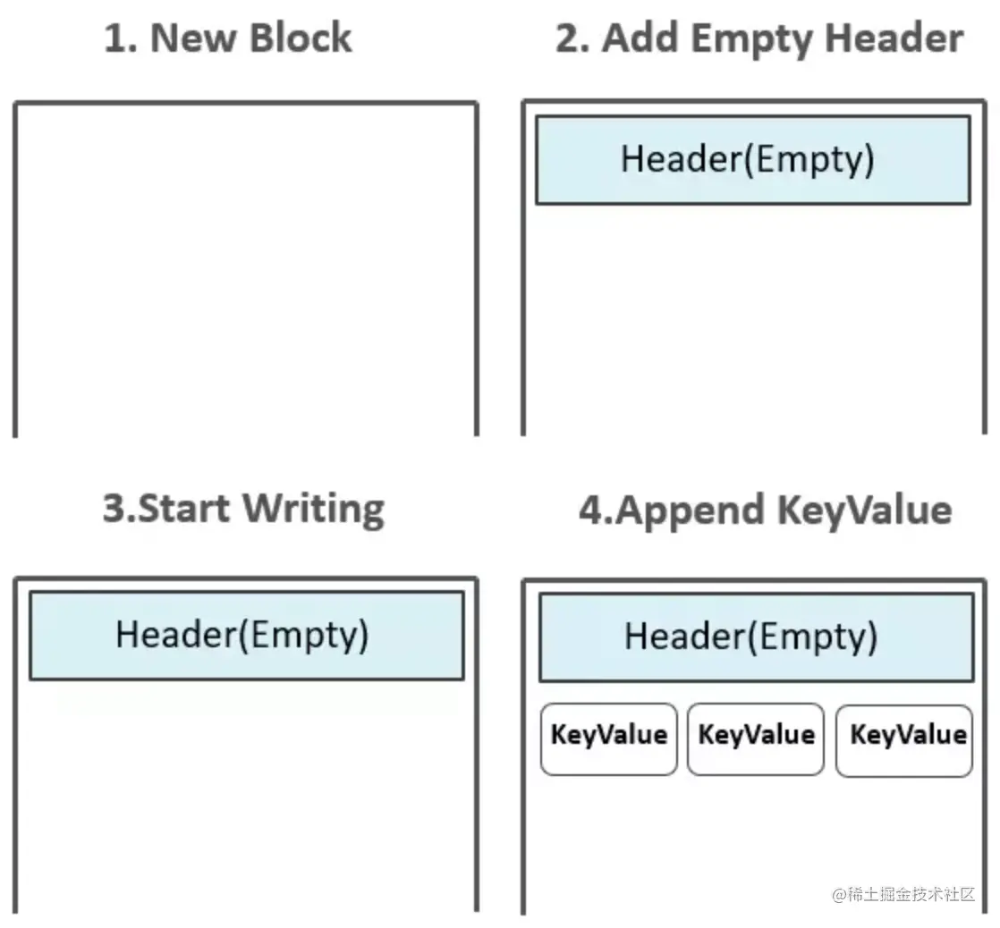

###### 读写简流程

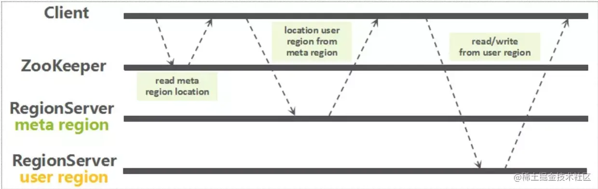

### Hbase单机模式安装

这一次来部署一个单机版的Hbase，单独的Hbase daemon(Master，RegionServers和ZooKeeper)运行在同一个JVM进程中，然后持久化存储到文件系统中。这是最简单的部署，但是却能帮助我们更好的理解Hbase。安装完成之后，我们在演示一下hbase命令行的用法。


#### 环境

- CentOS 7
- Hbase 1.2.8

#### 安装单机

1. 确保安装了jdk，在Linux上使用自带的包管理器直接安装就好，使用二进制也是一个不错的选择，我用的是CentOS

```
 体验AI代码助手
 代码解读
复制代码yum install java-1.8.0-openjdk* -y
```

1. 下载Hbase的二进制包，下载地址位于[mirror.bit.edu.cn/apache/hbas…](https://link.juejin.cn?target=http%3A%2F%2Fmirror.bit.edu.cn%2Fapache%2Fhbase%2Fhbase-1.2.8%2F%EF%BC%8C%E7%84%B6%E5%90%8E%E8%A7%A3%E5%8E%8B%E5%88%B0%E7%B3%BB%E7%BB%9F%E7%9A%84%E7%9B%AE%E5%BD%95%E3%80%82)

```bash
bash

 体验AI代码助手
 代码解读
复制代码tar -xf hbase-1.2.8-bin.tar.gz
cd hbase-1.2.8
```

1. 配置hbase的环境变量，修改JAVA_HOME。注意看下自己的JAVA_HOME在什么位置

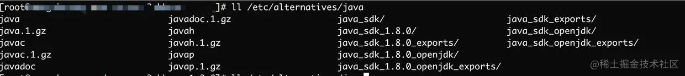

```javascript
javascript

 体验AI代码助手
 代码解读
复制代码vim conf/hbase-env.sh
// 注意这个是在CentOS上的java位置
export JAVA_HOME=/etc/alternatives/java_sdk_1.8.0/
```

1. 配置onf/hbase-site.xml，这个是Hbase的主配置文件，你可以指定hbase和ZooKeeper数据写入的目录，当然也可以指定hbase的根目录在哪个位置。

我将hbase的目录放在hadoop用户家目录的hbase目录下。我们不用事先创建好hbase的data目录，hbase会自动帮我们创建好的，如果已经存在了data目录，hbase会将存在的目录进行迁移。

```xml
xml

 体验AI代码助手
 代码解读
复制代码useradd -s /sbin/nologin -m hadoop

vim conf/hbase-site.xml
<configuration>
  <property>
    <name>hbase.rootdir</name>
    <value>file:///home/hadoop/hbase</value>
  </property>
  <property>
    <name>hbase.zookeeper.property.dataDir</name>
    <value>/home/hadoop/zookeeper</value>
  </property>
  <property>
    <name>hbase.unsafe.stream.capability.enforce</name>
    <value>false</value>
    <description>
      Controls whether HBase will check for stream capabilities (hflush/hsync).

      Disable this if you intend to run on LocalFileSystem, denoted by a rootdir
      with the 'file://' scheme, but be mindful of the NOTE below.

      WARNING: Setting this to false blinds you to potential data loss and
      inconsistent system state in the event of process and/or node failures. If
      HBase is complaining of an inability to use hsync or hflush it's most
      likely not a false positive.
    </description>
  </property>
</configuration>
```

1. Hbase二进制包下有start-hbase脚本，可以方便的启动hbase，如果我们的配置是正确的，那么会正常启动。

```shell
shell

 体验AI代码助手
 代码解读
复制代码./bin/start-hbase.sh
```

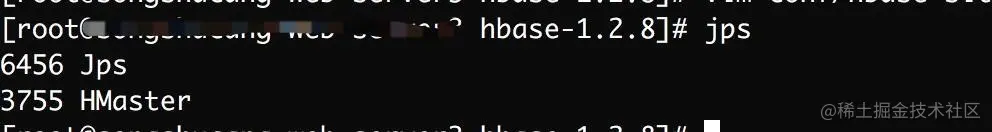

如果启动之后，可以打开[http://localhost:16010查看Hbase的Web](https://link.juejin.cn?target=http%3A%2F%2Flocalhost%3A16010%E6%9F%A5%E7%9C%8BHbase%E7%9A%84Web) UI

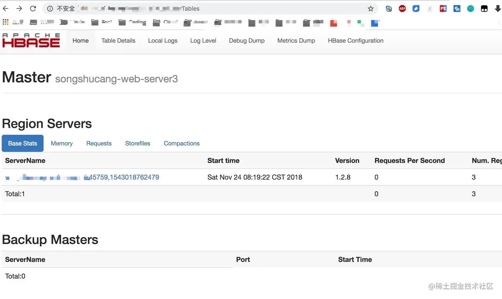

#### 使用Hbase

我们可以先用Hbase提供的命令行工具，位于hbase的/bin/目录下

1. 连接Hbase

```bash
bash

 体验AI代码助手
 代码解读
复制代码./hbase shell
```

1. 查看帮助信息, 敲

```shell
shell

 体验AI代码助手
 代码解读
复制代码>help
```

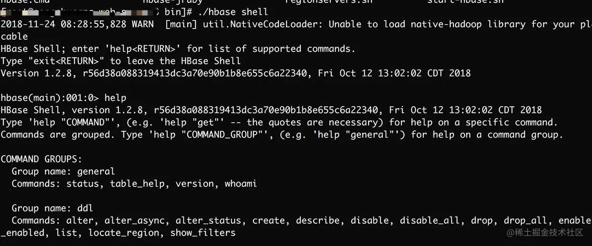

1. 创建一个表，必须要指定表名称和列簇名

```ruby
ruby

 体验AI代码助手
 代码解读
复制代码hbase(main):003:0> create 'test', 'cf'
0 row(s) in 1.6320 seconds

=> Hbase::Table - test
```

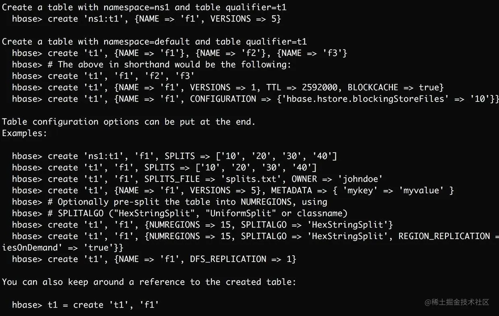

1. 列出关于你的表的信息,list 'sometable'

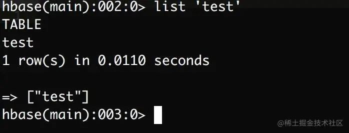

1. 查看表更为详细的信息，使用describe命令

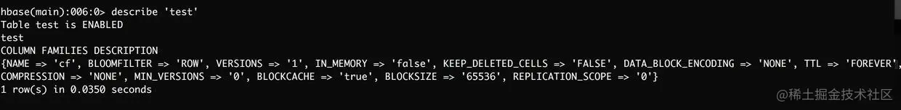

1. 把数据放到表中

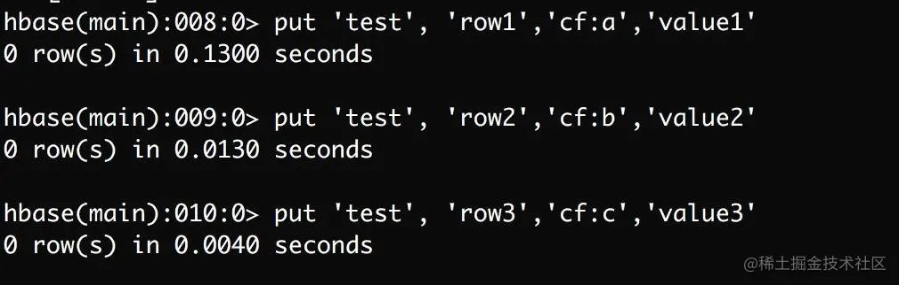

1. 查看表中的所有数据

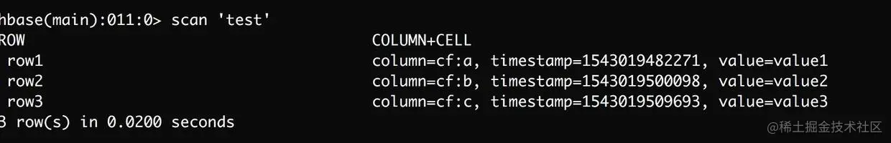

1. 获取单行的数据

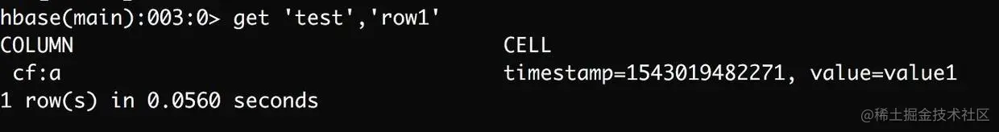

1. 其余的命令可以自行尝试
2. 退出shell，使用`quit`

这里演示了下单机版的hbase如何安装，了解hbase shell的基本用法，关于Hbase更深入的东西，可以了解下官方文档。

### Hbase数据模型

在Hbase中，有一些术语需要提前了解。如下：

- Table：Hbase的table由多个行组成
- Row：一个行在Hbase中由一个或多个有值的列组成。Row按照字母进行排序，因此行健的设计非常重要。这种设计方式可以让有关系的行非常的近，通常行健的设计是网站的域名反转，比如(org.apache.www, org.apache.mail, org.apache.jira)，这样的话所有的Apache的域名就很接近。
- Column：列由列簇加上列的标识组成，一般是“列簇：列标识”，创建表的时候不用指定列标识
- Column Family：列簇在物理上包含了许多的列与列的值，每个列簇都有一些存储的属性可配置。例如是否使用缓存，压缩类型，存储版本数等。在表中，每一行都有相同的列簇，尽管有些列簇什么东西也没有存。
- Column Qualifier：列簇的限定词，理解为列的唯一标识。但是列标识是可以改变的，因此每一行可能有不同的列标识
- Cell：Cell是由row，column family,column qualifier包含时间戳与值组成的，一般表达某个值的版本
- Timestamp：时间戳一般写在value的旁边，代表某个值的版本号，默认的时间戳是你写入数据的那一刻，但是你也可以在写入数据的时候指定不同的时间戳

HBase 是一个稀疏的、分布式、持久、多维、排序的映射，它以行键（row key），列键（column key）和时间戳（timestamp）为索引。

Hbase在存储数据的时候，有两个SortedMap，首先按照rowkey进行字典排序，然后再对Column进行字典排序。

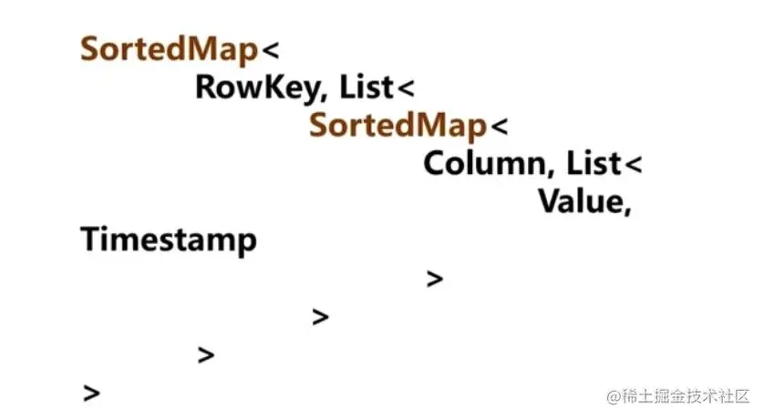

#### 测试数据

```shell
shell

 体验AI代码助手
 代码解读
复制代码create 'user','info','ship';

put 'user', '524382618264914241', 'info:name', 'zhangsan'
put 'user', '524382618264914241', 'info:age',30
put 'user', '524382618264914241', 'info:height',168
put 'user', '524382618264914241', 'info:weight',168
put 'user', '524382618264914241', 'info:phone','13212321424'
put 'user', '524382618264914241', 'ship:addr','beijing'
put 'user', '524382618264914241', 'ship:email','sina@sina.com'
put 'user', '524382618264914241', 'ship:salary',3000

put 'user', '224382618261914241', 'info:name', 'lisi'
put 'user', '224382618261914241', 'info:age',24
put 'user', '224382618261914241', 'info:height',158
put 'user', '224382618261914241', 'info:weight',128
put 'user', '224382618261914241', 'info:phone','13213921424'
put 'user', '224382618261914241', 'ship:addr','chengdu'
put 'user', '224382618261914241', 'ship:email','qq@sina.com'
put 'user', '224382618261914241', 'ship:salary',5000

put 'user', '673782618261019142', 'info:name', 'zhaoliu'
put 'user', '673782618261019142', 'info:age',19
put 'user', '673782618261019142', 'info:height',178
put 'user', '673782618261019142', 'info:weight',188
put 'user', '673782618261019142', 'info:phone','17713921424'
put 'user', '673782618261019142', 'ship:addr','shenzhen'
put 'user', '673782618261019142', 'ship:email','126@sina.com'
put 'user', '673782618261019142', 'ship:salary',8000

put 'user', '813782218261011172', 'info:name', 'wangmazi'
put 'user', '813782218261011172', 'info:age',19
put 'user', '813782218261011172', 'info:height',158
put 'user', '813782218261011172', 'info:weight',118
put 'user', '813782218261011172', 'info:phone','12713921424'
put 'user', '813782218261011172', 'ship:addr','xian'
put 'user', '813782218261011172', 'ship:email','139@sina.com'
put 'user', '813782218261011172', 'ship:salary',10000

put 'user', '510824118261011172', 'info:name', 'yangyang'
put 'user', '510824118261011172', 'info:age',18
put 'user', '510824118261011172', 'info:height',188
put 'user', '510824118261011172', 'info:weight',138
put 'user', '510824118261011172', 'info:phone','18013921626'
put 'user', '510824118261011172', 'ship:addr','shanghai'
put 'user', '510824118261011172', 'ship:email','199@sina.com'
put 'user', '510824118261011172', 'ship:salary',50000
```

### Hbase表(Schema)设计要点

只要是数据库都存在，模式设计的问题，关系型中有模式设计的范式，Hbase作为列式存储数据库，其模式设计也非常重要。

设计时需要关注的属性，如何设计这些属性等

#### Hbase与关系型数据库对比

| 属性     | Hbase                | RDBMS                  |
| -------- | -------------------- | ---------------------- |
| 数据类型 | 只有字符串           | 丰富的数据类型         |
| 数据操作 | 增删改查，不支持join | 各种各样的函数与表连接 |
| 存储模式 | 基于列式存储         | 基于表结构和行式存储   |
| 数据保护 | 更新后仍然保留旧版本 | 替换                   |
| 可伸缩性 | 轻易增加节点         | 需要中间层，牺牲性能   |

#### Hbase设计时要考虑的因素

Hbase关键概念：表，rowkey，列簇，时间戳

- 这个表应该有多少列簇
- 列簇使用什么数据
- 每个列簇有有多少列
- 列名是什么，尽管列名不必在建表时定义，但读写数据是要知道的
- 单元应该存放什么数据
- 每个单元存储多少时间版本
- 行健(rowKey)结构是什么，应该包含什么信息

#### 设计要点

##### 行健设计

关键部分，直接关系到后续服务的访问性能。如果行健设计不合理，后续查询服务效率会成倍的递减。

- 避免单调的递增行健，因为Hbase的行健是有序排列的，这样可能导致一段时间内大部分写入集中在某一个Region上进行操作，负载都在一台节点上。可以设计成： [metric_type][event_timestamp]，不同的metric_type可以将压力分散到不同的region上
- 行健短到可读即可，因为查询短键不必长键性能好多少，所以设计时要权衡长度。
- 行健不能改变，**唯一可以改变的方式是先删除后插入**

##### 列簇设计

列簇是一些列的集合，一个列簇的成员有相同的前缀，以冒号(:)作为分隔符。

- 现在Hbase不能很好处理2~3个以上的列簇，所以尽可能让列簇少一些，如果表有多个列簇，列簇A有100万行数据，列簇B有10亿行，那么列簇A会分散到很多的Region导致扫描列簇A的时候效率底下。
- 列簇名的长度要尽量小，一个为了节省空间，另外加快效率，比如d表示data，v表示value

##### 列簇属性配置

- HFile数据块，默认是64KB，数据库的大小影响数据块索引的大小。数据块大的话一次加载进内存的数据越多，扫描查询效果越好。但是数据块小的话，随机查询性能更好

```javascript
javascript

 体验AI代码助手
 代码解读
复制代码> create 'mytable',{NAME => 'cf1', BLOCKSIZE => '65536'}
```

- 数据块缓存，数据块缓存默认是打开的，如果一些比较少访问的数据可以选择关闭缓存

```javascript
javascript

 体验AI代码助手
 代码解读
复制代码> create 'mytable',{NAME => 'cf1', BLOCKCACHE => 'FALSE'}
```

- 数据压缩，压缩会提高磁盘利用率，但是会增加CPU的负载，看情况进行控制

```javascript
javascript

 体验AI代码助手
 代码解读
复制代码> create 'mytable',{NAME => 'cf1', COMPRESSION => 'SNAPPY'}
```

Hbase表设计是和需求相关的，但是遵守表设计的一些硬性指标对性能的提升还是很有帮助的，这里整理了一些设计时用到的要点。

### Java API操作

Hbase有多种不同的客户端，如REST客户端，Thift客户端，ORM框架Kundera等等。 Hbase也提供了Java的API来操作表与列簇等信息，它的shell就是对Java的API做了一层封装。

Hbase的Java API提供了很多高级的特性：

- 元数据管理，列簇的数据压缩，region分隔
- 创建，删除，更新，读取 rowkey

我们还是直接看代码这样理解的更容易

#### 环境

- Hbase 0.98
- Java 1.8
- Zookeeper 3.4.6
- Mac OS

#### 案例

Hbase的客户端版本不一致实验结果很容易出现问题，尽量采用同样的版本。因为服务端实验的是Hbase0.98，客户端也用0.98，另外由于Hadoop 2.x的版本现对于1.x做了很大的提升，建议采用Hbase-hadoop 2.x的客户端。

```xml
xml

 体验AI代码助手
 代码解读
复制代码       <dependency>
            <groupId>org.apache.hbase</groupId>
            <artifactId>hbase-client</artifactId>
            <version>0.98.24-hadoop2</version>
        </dependency>
```

##### 建立连接

1. 直接新建HTable("tableName")，但是这种每次创建表的时候因为都要查询.meta表，来判断表是不是存在，导致创建表的过程会有点慢，所以不建议每个请求都创建一个Htable
2. 使用HTablePool，它和HTable的创建方式很像，但是如果采用连接池的话，它就不会给每个请求都单独创建一个Htable了。

在创建Htable或者HtablePool的时候都可以指定更详细的配置信息。

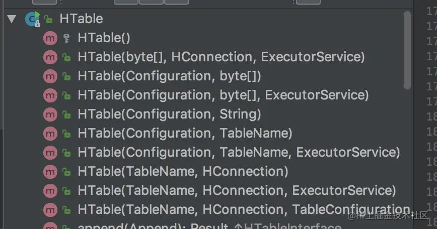

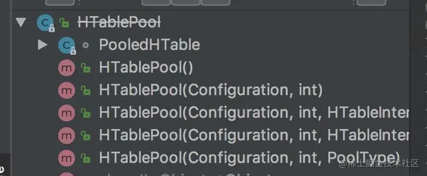

```java
HTablePool hTablePool = new HTablePool();
hTablePool.getTable("user");
```

##### 增删改查

rowkey是代表Hbase中表的唯一一个行，同时像列簇 ，时间戳等用来定位表中的部分数据，Java的API对Hbas的CURD提供了如下的类：

- Put
- Get
- Delete
- Scan
- Increment

我们详细的讨论几个类，剩余的可以举一反三。

##### 写数据

当写请求收到的时候，默认数据同步的写到Hlog中和MemStore，同时在两个地方写是为了保证数据的持久性，Memstore最终会持久化到磁盘中的Hfile中。每次MemStore进行Flush的时候，就会创建一个新的Hfile。

Put类用于向Hbase的表中存储数据，存储数据时，Put的实例必须要指定Rowkey 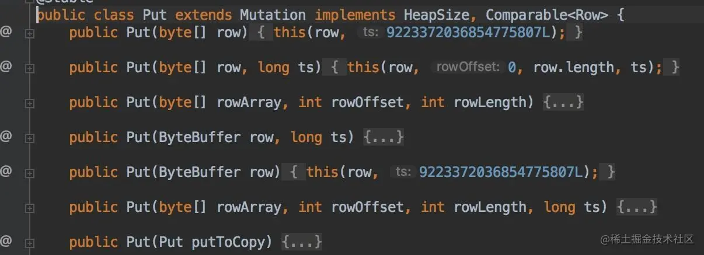

创建完Put实例后，再向其中添加数据 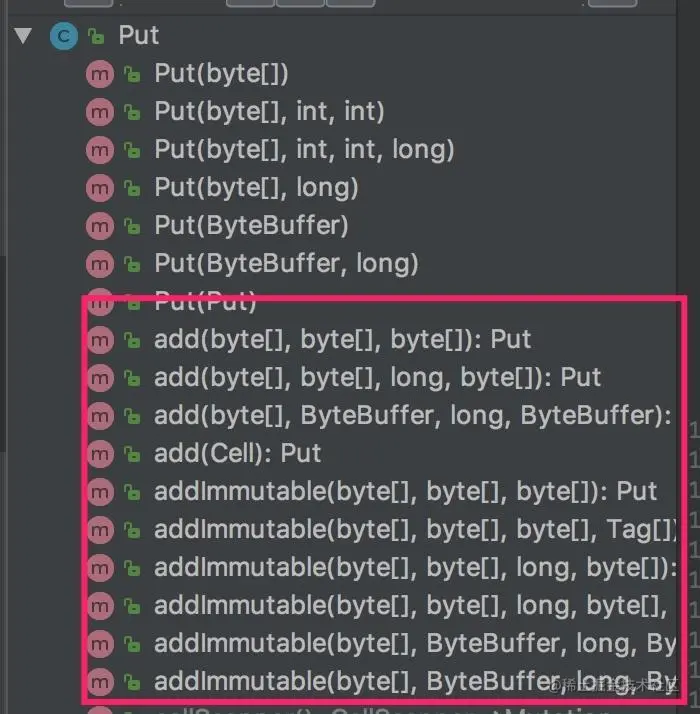

```java

    public void put() throws IOException {
        // 获取默认的配置
        Configuration conf = HBaseConfiguration.create();
        // 获取Table实例 
        HTable table = new HTable(conf, "tab1");
        // 创建Put实例，并且指定rowKey 
        Put put = new Put(Bytes.toBytes("row-1"));
        // 添加一个 column，值为 "Hello"，在 "cf1:greet" 列中
        put.add(Bytes.toBytes("cf1"), Bytes.toBytes("greet"), Bytes.toBytes("Hello"));
        // 添加一个 column，值为 "John"，在 "cf1:person" 列中
        put.add(Bytes.toBytes("cf1"), Bytes.toBytes("person"), Bytes.toBytes("John"));
        table.put(put); 
        table.close();
    }
```

数据也可以批量的进行插入：

// table对象可以传入List参数 table.put(final List puts)

执行结果： 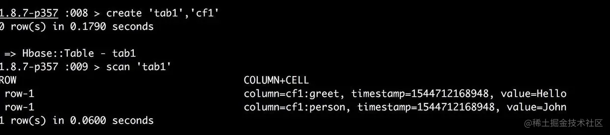

##### 读数据

Hbase使用LRU缓存读取数据。Htable对象使用下面的方法读取数据

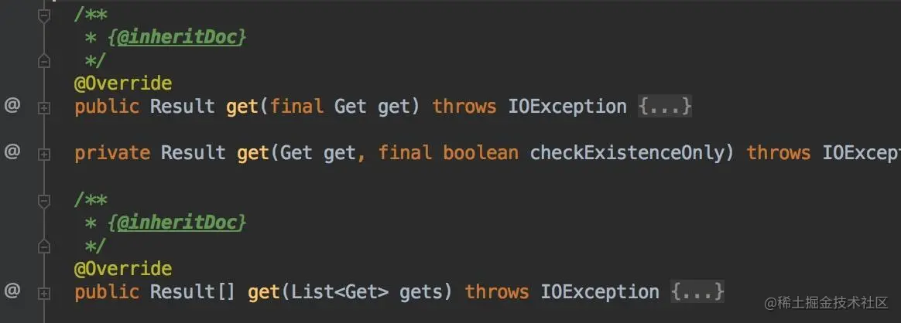

而Get实例的构造方法和Put很像，构造方法要指定一个rowkey。

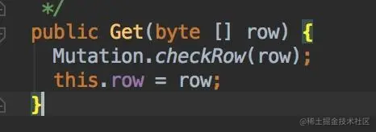

如果要查找特定的cell，就是特定列的数据，可以采用额外的方法进行更加精细的调控。

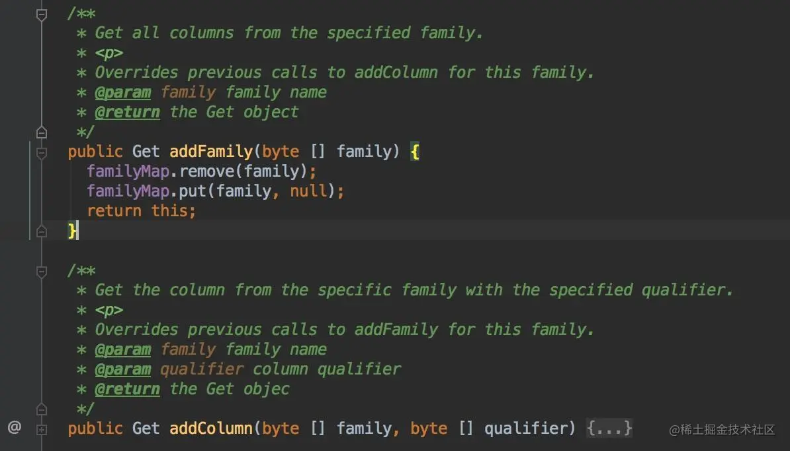

看一下如下的案例代码：

```java
public void get() throws IOException {
        // 获取默认的配置
        Configuration conf = HBaseConfiguration.create();
        // 获取Table实例
        HTable table = new HTable(conf, "tab1");
        // 创建Put实例，并且指定rowKey
        Get get = new Get(Bytes.toBytes("row-1"));
        //
        get.addColumn(Bytes.toBytes("cf1"), Bytes.toBytes("greet"));
        // 添加一个 column，值为 "John"，在 "cf1:person" 列中
        Result result = table.get(get);
        byte[] value = result.getValue(Bytes.toBytes("cf1"), Bytes.toBytes("greet"));
        System.out.println("获取到的值" + new String(value));
        table.close();
    }
```

执行结果 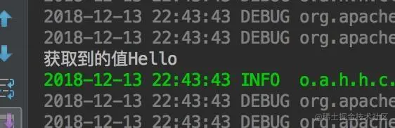

##### 更新数据

更新数据与写数据基本一致，只是在Put实例赋值的时候，在相同的列上设置不同的值，操作的时候就会更新为新的值。

代码如下：

```java
public void update() throws IOException {
        Configuration conf = HBaseConfiguration.create();
        // 获取Table实例
        HTable table = new HTable(conf, "tab1");
        // 创建Put实例，并且指定rowKey
        Put put = new Put(Bytes.toBytes("row-1"));
        // 添加一个 column，值为 "Hello"，在 "cf1:greet" 列中
        put.add(Bytes.toBytes("cf1"), Bytes.toBytes("greet"), Bytes.toBytes("Good Morning"));
        // 添加一个 column，值为 "John"，在 "cf1:person" 列中
//        put.add(Bytes.toBytes("cf1"), Bytes.toBytes("person"), Bytes.toBytes("John"));
        table.put(put);
        table.close();
    }
```

执行结果： 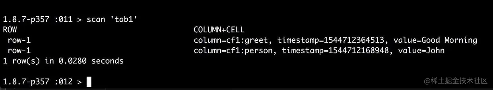

##### 删除数据

Delete命令只是标记当前的数据为删除状态，而不是立刻的删除，也就是先进行逻辑删除。实际上的删除是在Hfile进行压缩的时候，这些被标记的记录就会被删除掉。

Delete对象与Put和Get也很像

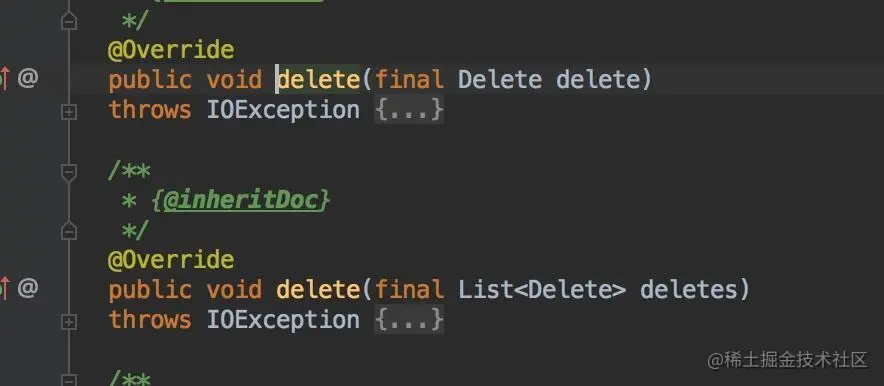

构造Delete实例 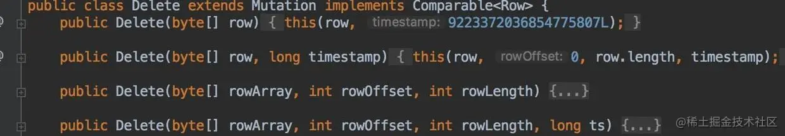

如果想要进行更加详细的指定，可以再指定具体的列等信息 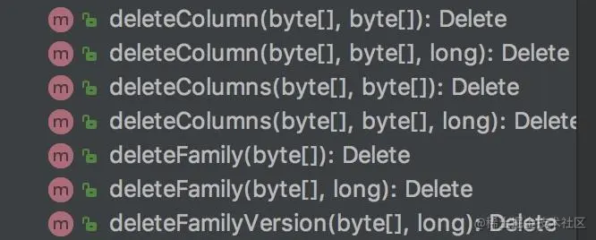

看下面的案例代码：

```java
 public void delete() throws IOException {
        Configuration conf = HBaseConfiguration.create();
        // 获取Table实例
        HTable table = new HTable(conf, "tab1");
        // 创建Delete实例，并且指定rowKey
        Delete delete = new Delete(Bytes.toBytes("row-1"));
        // 删除 column "cf1:greet" 
        delete.deleteColumn(Bytes.toBytes("cf1"), Bytes.toBytes("greet"));
        
        table.delete(delete);
        table.close();
    }
```

执行结果:连续执行两次删除

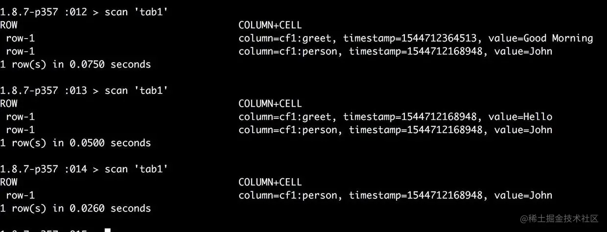

### 操作优化

一个系统上线之后，开发和调优将一直贯穿系统的生命周期中，HBase也不列外。这里主要说一些Hbase的调优

#### Hbase查询优化

作为NoSQL数据库，增删改查是其最基本的功能，其中查询是最常用的一项。

##### 设置Scan缓存

HBase中Scan查询可以设置缓存，方法是setCaching()，这样可以有效的减少服务端与客户端的交互，更有效的提升扫描查询的性能。

```java

   /**
   * Set the number of rows for caching that will be passed to scanners.
   * If not set, the default setting from {@link HTable#getScannerCaching()} will apply.
   * Higher caching values will enable faster scanners but will use more memory.
   * @param caching the number of rows for caching
   * 设置scanners缓存的行数
   */
  public void setCaching(int caching) {
    this.caching = caching;
  }
```

##### 显示的指定列

当使用Scan或者GET获取大量的行时，最好指定所需要的列，因为服务端通过网络传输到客户端，数据量太大可能是瓶颈。如果能有效过滤部分数据，能很大程度的减少网络I/O的花费。

```java
  /**
   * Get all columns from the specified family.
   * <p>
   * Overrides previous calls to addColumn for this family.
   * @param family family name
   * @return this
   * 获取指定列簇的所有列
   */
  public Scan addFamily(byte [] family) {
    familyMap.remove(family);
    familyMap.put(family, null);
    return this;
  }

  /**
   * Get the column from the specified family with the specified qualifier.
   * <p>
   * Overrides previous calls to addFamily for this family.
   * @param family family name
   * @param qualifier column qualifier
   * @return this
   * 获取指定列簇的特定列
   */
  public Scan addColumn(byte [] family, byte [] qualifier) {
    NavigableSet<byte []> set = familyMap.get(family);
    if(set == null) {
      set = new TreeSet<byte []>(Bytes.BYTES_COMPARATOR);
    }
    if (qualifier == null) {
      qualifier = HConstants.EMPTY_BYTE_ARRAY;
    }
    set.add(qualifier);
    familyMap.put(family, set);
    return this;
  }
```

一般用: scan.addColumn(...)

##### 关闭ResultScanner

如果在使用table.getScanner之后，忘记关闭该类，它会一直和服务端保持连接，资源无法释放，从而导致服务端的某些资源不可用。

所以在用完之后，需要执行关闭操作，这点与JDBS操作MySQL类似

scanner.close()

##### 禁用块缓存

如果批量进行全表扫描，默认是有缓存的，如果此时有缓存，会降低扫描的效率。

scan.setCacheBlocks(true|false);

对于经常读到的数据，建议使用默认值，开启块缓存

##### 缓存查询结果

对于频繁查询HBase的应用场景，可以考虑在应用程序和Hbase之间做一层缓存系统，新的查询先去缓存查，缓存没有再去查Hbase。

#### 写入优化

写也是Hbase常有的操作之一，并且Hbase在写入操作上有着其他NoSQL无法比拟的优势，下面讲如何优化写入操作

##### 关闭写WAL日志

一般为了保证系统的高可用性，WAL日志默认是开启状态，WAL主要用于灾难恢复的，如果应用可以容忍一定的数据丢失风险，可以在写数据的时候，关闭写WAL。

**风险：** 当RegionServer宕机时，写入的数据出现丢失，且无法恢复

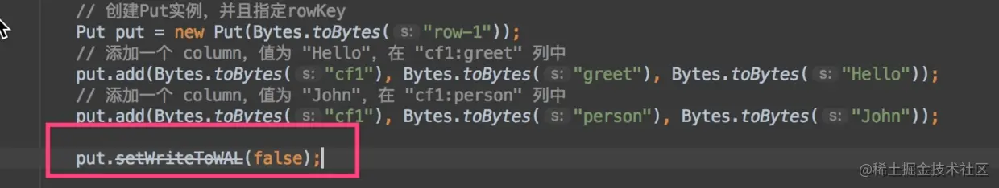

##### 设置AutoFlush

Htable有一个属性是AutoFlush，该属性用于支持客户端的批量更新，默认是true，当客户端每收到一条数据，立刻发送到服务端，如果设置为false，当客户端提交put请求时候，先将该请求在客户端缓存，到达阈值的时候或者执行hbase.flushcommits()，才向RegionServer提交请求。

**风险** 在请求未发送到RegionServer之前客户端崩溃，数据也会丢失

```lua
lua

 体验AI代码助手
 代码解读
复制代码        table.setAutoFlush(false);
        table.setWriteBufferSize( 12 * 1024 * 1024 );
```

##### 预创建Region

一般表刚开始只有一个Region，插入该表的数据都会保存在此Region中，插入该表的所有塑化剂都会保存在该Region中，当到达一定的阈值时，才发生分裂。 这样开始时刻针对该表的写操作都集中在某台服务器上，造成这台服务器的压力很紧张，同时对整个集群资源的浪费

建议刚开始的时候预创建Region，可以使用Hbase自带的RegionSplitter

##### 延迟日志flush

默认写入操作，首先写入WAL，并且在1S内写入HDFS，这个时间默认是1S，可以通过参数配置

hbase.regionserver.optionallogflushinterval

可以配置大一点的值，比如5s，这段时间数据会保留在内存中，直到RegionServer周期性的执行flush操作。

### Scan的重要参数

Scan是操作Hbase中非常常用的一个操作，虽然前面的Hbase API操作简单的介绍了Scan的操作，但不够详细，由于Scan非常常用，关于其详细的整理也是很有必要的。

##### Scan

HBase中的数据表通过划分成一个个的Region来实现数据的分片，每一个Region关联一个RowKey的范围区间，而每一个Region中的数据，按RowKey的字典顺序进行组织。

正是基于这种设计，使得HBase能够轻松应对这类查询："指定一个RowKey的范围区间，获取该区间的所有记录"， 这类查询在HBase被称之为Scan。

1 . 构建Scan，指定startRow与stopRow，如果未指定的话会进行全表扫描 2 . 获取ResultScanner 3 . 遍历查询结果 4 . 关闭ResultScanner

```java
 public void stringFilter() throws IOException {
        Configuration conf = HBaseConfiguration.create();
        // 获取Table实例
        HTable table = new HTable(conf, "user");

        // 构建Scan
        Scan scan = new Scan();
        scan = scan.setStartRow(Bytes.toBytes("startRowxxx")).setStopRow(Bytes.toBytes("StopRowxxx"));
        RowFilter filter = new RowFilter(
                CompareFilter.CompareOp.EQUAL,
                new BinaryComparator(Bytes.toBytes("224382618261914241"))
        );

        scan.setFilter(filter);
        
        // 获取resultScanner
        ResultScanner scanner = table.getScanner(scan);
        Result result = null;
        
        // 处理结果
        while ((result = scanner.next()) != null) {
            byte[] value = result.getValue(Bytes.toBytes("ship"), Bytes.toBytes("addr"));
            if (value == null || value.length == 0) {
                continue;
            }
            System.out.println(
                    new String(value)
            );
            System.out.println("hello World");
        }
    
        // 关闭ResultScanner
        scanner.close();
        table.close();
    }
```

其它的设置参数

##### Caching: 设置一次RPC请求批量读取的Results数量

下面的示例代码设定了一次读取回来的Results数量为100：

```ini
ini

 体验AI代码助手
 代码解读
复制代码scan.setCaching(100);
```

Client每一次往RegionServer发送scan请求，都会批量拿回一批数据(由Caching决定过了每一次拿回的Results数量)，然后放到本次的Result Cache中：

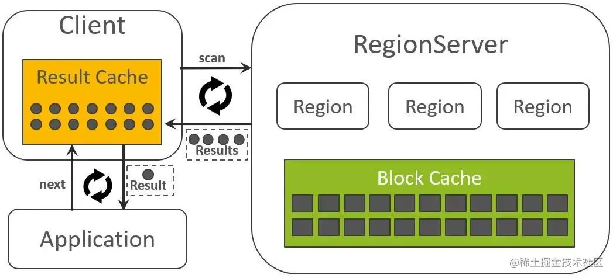

应用每一次读取数据时，都是从本地的Result Cache中获取的。如果Result Cache中的数据读完了，则Client会再次往RegionServer发送scan请求获取更多的数据。

##### Batch: 设置每一个Result中的列的数量

下面的示例代码设定了每一个Result中的列的数量的限制值为3：

```ini
ini

 体验AI代码助手
 代码解读
复制代码scan.setBatch(3);
```

该参数适用于一行数据过大的场景，这样，一行数据被请求的列会被拆成多个Results返回给Client。

举例说明如下：

假设一行数据中共有十个列： {Col01，Col02，Col03，Col04，Col05，Col06，Col07，Col08，Col09, Col10} 假设Scan中设置的Batch为3，那么，这一行数据将会被拆成4个Results返回：

```rust
rust

 体验AI代码助手
 代码解读
复制代码Result1 -> {Col01，Col02，Col03}
Result2 -> {Col04，Col05，Col06}
Result3 -> {Col07，Col08，Col09}
Result4 -> {Col10}
```

关于Caching参数，我们说明了是Client每一次从RegionServer侧获取到的Results的数量，上例中，一行数据被拆成了4个Results，这将会导致Caching中的计数器被减了4次。结合Caching与Batch，我们再列举一个稍复杂的例子：

假设，Scan的参数设置如下：

final byte[] start = Bytes.toBytes("Row1"); final byte[] stop = Bytes.toBytes("Row5"); Scan scan = new Scan(); scan.withStartRow(start).withStopRow(stop); scan.setCaching(10); scan.setBatch(3);

待读取的数据RowKey与所关联的列集如下所示：

Row1:  {Col01，Col02，Col03，Col04，Col05，Col06，Col07，Col08，Col09，Col10}
 Row2:  {Col01，Col02，Col03，Col04，Col05，Col06，Col07，Col08，Col09，Col10，Col11}
 Row3:  {Col01，Col02，Col03，Col04，Col05，Col06，Col07，Col08，Col09，Col10}

再回顾一下Caching与Batch的定义：

Caching:  影响一次读取返回的Results数量。

Batch:  限定了一个Result中所包含的列的数量，如果一行数据被请求的列的数量超出Batch限制，那么这行数据会被拆成多个Results。

那么， Client往RegionServer第一次请求所返回的结果集如下所示：

Result1   ->   Row1:  {Col01，Col02，Col03} Result2   ->   Row1:  {Col04，Col05，Col06} Result3   ->   Row1:  {Col07，Col08，Col09} Result4   ->   Row1:  {Col10} Result5   ->   Row2:  {Col01，Col02，Col03} Result6   ->   Row2:  {Col04，Col05，Col06} Result7   ->   Row2:  {Col07，Col08，Col09} Result8   ->   Row2:  {Col10，Col11} Result9   ->   Row3:  {Col01，Col02，Col03} Result10  ->   Row3:  {Col04，Col05，Col06}

##### Limit: 限制一次Scan操作所获取的行的数量

同SQL语法中的limit子句，限制一次Scan操作所获取的行的总量：

scan.setLimit(10000);

注意：Limit参数是在2.0版本中新引入的。但在2.0.0版本中，当Batch与Limit同时设置时，似乎还存在一个BUG，初步分析问题原因应该与BatchScanResultCache中的numberOfCompletedRows计数器逻辑处理有关。因此，暂时不建议同时设置这两个参数。

##### CacheBlock: RegionServer侧是否要缓存本次Scan所涉及的HFileBlocks

scan.setCacheBlocks(true);

e) Raw Scan:  是否可以读取到删除标识以及被删除但尚未被清理的数据

scan.setRaw(true);

##### MaxResultSize:  从内存占用量的维度限制一次Scan的返回结果集

下面的示例代码将返回结果集的最大值设置为5MB：

scan.setMaxResultSize(5 * 1024 * 1024);

##### Reversed Scan: 反向扫描

普通的Scan操作是按照字典顺序从小到大的顺序读取的，而Reversed Scan则恰好相反：

scan.setReversed(true);

##### 带Filter的Scan

Filter可以在Scan的结果集基础之上，对返回的记录设置更多条件值，这些条件可以与RowKey有关，可以与列名有关，也可以与列值有关，还可以将多个Filter条件组合在一起，等等。

最常用的Filter是SingleColumnValueFilter，基于它，可以实现如下类似的查询：

"返回满足条件{列I:D的值大于等于10}的所有行"

示例代码如下：

Filter丰富了HBase的查询能力，但使用Filter之前，需要注意一点：Filter可能会导致查询响应时延变的不可控制。因为我们无法预测，为了找到一条符合条件的记录，背后需要扫描多少数据量，如果在有效限制了Scan范围区间(通过设置StartRow与StopRow限制)的前提下，该问题能够得到有效的控制。这些信息都要求使用Filter之前应该详细调研自己的业务数据模型。

作者：AI贺贺
链接：https://juejin.cn/post/6844903777347043336
来源：稀土掘金
著作权归作者所有。商业转载请联系作者获得授权，非商业转载请注明出处。