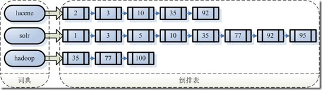

# Lucene

> 本人不太懂Lucene，全文基于网上的总结文档。算是一个抄袭文档，请勿以此为准。

## Lucene是什么

> Lucene是一个高效的，基于Java的全文检索库。

Lucene总的来说是：

- 一个高效的，可扩展的，全文检索库。
- 全部用Java实现，无须配置。
- 仅支持纯文本文件的索引(Indexing)和搜索(Search)。
- 不负责由其他格式的文件抽取纯文本文件，或从网络中抓取文件的过程。

### 基本概念

文档(Document)：以文本形式存在的存储对象。

文档集合(Document Collection)：若干文档构成的集合。

文档编号(Document ID)：在搜索引擎内部，会将文档集合内每个文档赋予一个唯一的内部编号。

单词编号(Word ID)：搜索引擎内部以唯一的编号来表征某个单词

单词词典(Lexicon)：单词词典是由文档集合中出现过的所有单词构成的字符串集合，单词词典内每条索引项记载单词本身的一些信息以及指向“倒排列表”的指针。

倒排列表(PostingList)：倒排列表记载了出现过某个单词的所有文档的文档列表及单词在该文档中出现的位置信息，每条记录称为一个倒排项(Posting)。

倒排文件(Inverted File)：所有单词的倒排列表往往顺序地存储在磁盘的某个文件里，这个文件即被称之为倒排文件，倒排文件是存储倒排索引的物理文件。

## 全文检索的基本原理

我们生活中的数据总体分为两种：**结构化数据**和**非结构化数据**。

- **结构化数据：**指具有固定格式或有限长度的数据，如数据库，元数据等。
- **非结构化数据：**指不定长或无固定格式的数据，如邮件，word文档等。

当然有的地方还会提到第三种，半结构化数据，如XML，HTML等，当根据需要可按结构化数据来处理，也可抽取出纯文本按非结构化数据来处理。**非结构化数据又一种叫法叫全文数据。**

按照数据的分类，搜索也分为两种：

- **对结构化数据的搜索**：如对数据库的搜索，用SQL语句。再如对元数据的搜索，如利用windows搜索文件名
- **对非结构化数据的搜索**：如利用windows的搜索也可以搜索文件内容，Linux下的grep命令，再如用Google和百度搜索大量数据。

<u>对非结构化数据也即对全文数据的搜索主要有两种方法：</u>

一种是**顺序扫描法(Serial Scanning)：**所谓顺序扫描，比如要找内容包含某一个字符串的文件，就是一个文档一个文档的看，对于每一个文档，从头看到尾，如果此文档包含此字符串，则此文档为我们要找的文件，接着看下一个文件，直到扫描完所有的文件。Linux下的grep命令也是这一种方式。但对于小数据量的文件，这种方法还是最直接，最方便的。

对非结构化数据顺序扫描很慢，对结构化数据的搜索却相对较快（由于结构化数据有一定的结构可以采取一定的搜索算法加快速度），那么把我们的非结构化数据想办法弄得有一定结构不就行了吗？这部分从非结构化数据中提取出的然后重新组织的信息，我们称之**索引**。**这种先建立索引，再对索引进行搜索的过程就叫全文检索(Full-text Search)。**

全文检索大体分两个过程，**索引创建**和**搜索索引**:

- 索引创建：将现实世界中所有的结构化和非结构化数据提取信息，创建索引的过程。
- 搜索索引：就是得到用户的查询请求，搜索创建的索引，然后返回结果的过程。

于是全文检索就存在三个重要问题：

**<u>索引里面究竟存些什么？如何创建索引？如何对索引进行搜索？</u>**

### 索引里究竟存了些什么

之所以需要索引，是因为: 我们明知，我们需要查询的数据，就这些这些文件(document)里，但是我们不知道，在哪些文件(document)里。<u>于是如果索引总能够保存从字符串到文件的映射，则会大大提高搜索速度。由于从字符串到文件的映射是文件到字符串映射的反向过程，于是保存这种信息的索引称为**反向索引** 。</u>



<u>左边保存的是一系列字符串，称为**词典** 。</u>

<u>每个字符串都指向包含此字符串的文档(Document)链表，此文档链表称为**倒排表** (Posting List)。</u>

大家需要关注一个点：虽然从索引中查询数据比较快，但是建立索引的过程是比较消耗资源的。的确，加上索引的过程，全文检索不一定比顺序扫描快，尤其是在数据量小的时候更是如此。但是这里面的区别是：，顺序扫描是每次都要扫描，而创建索引的过程仅仅需要一次，之后就不需要再次创建索引了。**这也是全文搜索相对于顺序扫描的优势之一：一次索引，多次使用。**

### 如何创建索引

#### 分词

> 国内分词组件，一般会把真个分词的过程，通过组件一次完成。下面说的一般是国外的分词组件。

##### 文档被分词组件解析成词元(Token)

对于外文一般做文档分词相对比较容易，国内目前针对不同的场景，也提出了比较多的比价优秀的分词组件。

<u>经过分词后得到的结果称之为词元。</u>

##### 词元(Token)被进一步解析成词根(Item)

对于英语，语言处理组件(Linguistic Processor) 一般做以下几点：

1. 变为小写(Lowercase) 。

2. 将单词缩减为词根形式，如“cars ”到“car ”等。这种操作称为：stemming 。

3. 将单词转变为词根形式，如“drove ”到“drive ”等。这种操作称为：lemmatization 。

#### 利用词元建立索引

1. 利用词根建立一个字典。
2. 按照字典序把词根排序。
3. 合并相同的词根形成带有Frequency的文档倒排表。

### 索引搜索

#### 解析输入语句

这个比较复杂，后面单独说。

#### 对查询的词汇做词法、语法、语言分析并处理

> 这里算是解析输入的含义。

**词法分析主要用来识别单词和关键字:** 如果在词法分析中发现不合法的关键字，则会出现错误

**语法分析主要是根据查询语句的语法规则来形成一棵语法树:** 如果发现查询语句不满足语法规则，则会报错。

**语言处理同索引过程中的语言处理几乎相同:** 单词变成词根。

#### 搜索文档

按照正确的语法，搜索符合诉求的全部文档。通过语法分别对索引链表做合并或者过滤处理。

#### 对结果文档排序

虽然在上一步，我们得到了想要的文档，然而对于查询结果应该按照与查询语句的相关性进行排序，越相关者越靠前。

- <u>找出词对文档的重要性的过程称为计算词的权重的过程。</u>

- <u>判断词之间的关系从而得到文档相关性的过程应用一种叫做向量空间模型的算法。</u>

##### 权重计算

计算词的权重(term weight)有两个参数，第一个是词(Term)，第二个是文档(Document)。词的权重(Term weight)表示此词(Term)在此文档中的重要程度，越重要的词(Term)有越大的权重(Term weight)，因而在计算文档之间的相关性中将发挥更大的作用。

影响一个词(Term)在一篇文档中的重要性主要有两个因素：

- Term Frequency (tf)：即此Term在此文档中出现了多少次。tf 越大说明越重要。
- Document Frequency (df)：即有多少文档包含次Term。df 越大说明越不重要。

第一点比较好理解，解释一下第二点：在一篇英语文档中，this出现的次数更多，就说明越重要吗？不是的，有越多的文档包含此词(Term), 说明此词(Term)太普通，不足以区分这些文档，因而重要性越低。

> 这也如我们程序员所学的技术，对于程序员本身来说，这项技术掌握越深越好（掌握越深说明花时间看的越多，tf越大），找工作时越有竞争力。然而对于所有程序员来说，这项技术懂得的人越少越好（懂得的人少df小），找工作越有竞争力。人的价值在于不可替代性就是这个道理。
>
>  -- 有意思

**<u>实现全文检索系统的人会有自己的实现，Lucene就与此稍有不同。lucene没有使用上面的实现方式。而是使用的空间向量。</u>**

##### 向量空间模型的算法

**图片**

把文档看作一系列词(Term)，每一个词(Term)都有一个权重(Term weight)，不同的词(Term)根据自己在文档中的权重来影响文档相关性的打分计算。于是所有此文档中词(term)的权重(term weight) 看作一个向量:

```java
Document = {term1, term2, …… ,term N}
Document Vector = {weight1, weight2, …… ,weight N}
```

同样查询语句看作一个简单的文档，也用向量来表示：

```java
Query = {term1, term 2, …… , term N}
Query Vector = {weight1, weight2, …… , weight N}
```

由此也就返回了正确的文档排序结果。

## Lucene的索引文件

### 数据存储规则

Lucene为了使的信息的存储占用的空间更小，访问速度更快，采取了一些特殊的技巧。

#### 前缀规则

Lucene在反向索引中，要保存词典(Term Dictionary)的信息，所有的词(Term)在词典中是按照字典顺序进行排列的，然而词典中包含了文档中的几乎所有的词，并且有的词还是非常的长的，这样索引文件会非常的大，所谓前缀后缀规则，**即当某个词和前一个词有共同的前缀的时候，后面的词仅仅保存前缀在词中的偏移(offset)，以及除前缀以外的字符串(称为后缀)。**<u>而且字典顺序排序的情况下，前缀的重合率大大提高。</u>

#### 差值规则

Lucene的反向索引中，需要保存很多整型数字的信息，比如文档ID号，比如词(Term)在文档中的位置等等。

由上面介绍，我们知道，整型数字是以VInt的格式存储的。随着数值的增大，每个数字占用的Byte的个数也逐渐的增多。所谓差值规则(Delta)就是先后保存两个整数的时候，后面的整数仅仅保存和前面整数的差即可。

**图片**

#### 跳表

为了提高查找的性能，Lucene在很多地方采取的跳跃表的数据结构。

跳跃表(Skip List)是如图的一种数据结构，有以下几个基本特征：

- 元素是按顺序排列的，在Lucene中，或是按字典顺序排列，或是按从小到大顺序排列。
- 跳跃是有间隔的(Interval)，也即每次跳跃的元素数，间隔是事先配置好的，如图跳跃表的间隔为3。
- 跳跃表是由层次的(level)，每一层的每隔指定间隔的元素构成上一层，如图跳跃表共有2层。

**图片**

### 文件存储规则

| 名词           | 解释                                                         |
| -------------- | ------------------------------------------------------------ |
| 索引(Index)    | 在Lucene中一个索引是放在一个文件夹中的，同一文件夹中的所有的文件构成一个Lucene索引。 |
| 段(Segment)    | 一个索引可以包含多个段，段与段之间是独立的，添加新文档可以生成新的段，不同的段可以合并。 |
| 文档(Document) | 文档是我们建索引的基本单位，不同的文档是保存在不同的段中的，一个段可以包含多篇文档。新添加的文档是单独保存在一个新生成的段中，随着段的合并，不同的文档合并到同一个段中。 |
| 域(Field)      | 一篇文档包含不同类型的信息，可以分开索引，比如标题，时间，正文，作者等，都可以保存在不同的域里。 |
| 词(Term)       | 词是索引的最小单位                                           |

> Lucene的索引结构中，即保存了正向信息，也保存了反向信息。
>
> - 所谓正向信息：按层次保存了从索引，一直到词的包含关系：索引(Index) –> 段(segment) –> 文档(Document) –> 域(Field) –> 词(Term)。也即此索引包含了那些段，每个段包含了那些文档，每个文档包含了那些域，每个域包含了那些词。
> - 所谓反向信息：保存了词典到倒排表的映射：词(Term) –> 文档(Document)

#### 段的数据信息

一个索引(Index)可以同时存在多个segments_N，然而当我们要打开一个索引的时候，我们必须要选择一个来打开，一般选择N最大的那个段打开。

段内存储的数据格式是：

1. Format：索引文件格式的版本号。当用某个版本号的IndexReader读取另一个版本号生成的索引的时候，会因为此值不同而报错。
2. Version：索引的版本号，记录了IndexWriter将修改提交到索引文件中的次数。其初始值大多数情况下从索引文件里面读出，仅仅在索引开始创建的时候，被赋予当前的时间，已取得一个唯一值。其初始值之所最初取一个时间，是因为我们并不关心IndexWriter将修改提交到索引的具体次数，而更关心到底哪个是最新的。<u>IndexReader中常比较自己的version和索引文件中的version是否相同来判断此IndexReader被打开后，还有没有被IndexWriter更新。</u>
3. NameCount：下一个新段(Segment)的段名。
4. SegCount:段(Segment)的个数。

#### 段的元数据信息

- SegName:段名，所有属于同一个段的文件都有以段名作为文件名。
- SegSize: 此段中包含的文档数。此文档数是包括已经删除的文档的<u>。Lucene的段中包含了所有被索引过的文档，而被删除的文档是保存在.del文件中的，在搜索的过程中，是先从段中读到了被删除的文档，然后再用.del中的标志，将这篇文档过滤掉。</u>
- DelGen:

## 引用

https://www.cnblogs.com/forfuture1978/archive/2009/12/14/1623594.html

https://blog.csdn.net/forfuture1978/category_604866.html


