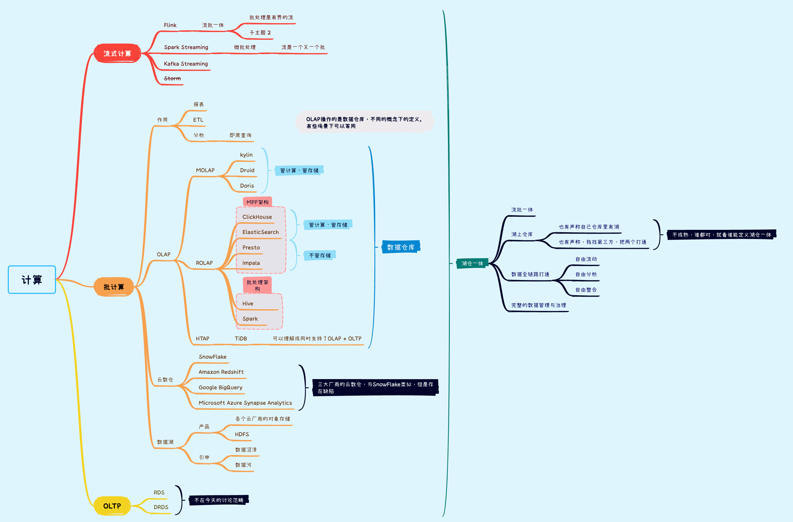

# OLAP

**On-line Analytical Processing****，联机分析处理**是在基于数据仓库多维模型的基础上实现的面向分析的各类操作的集合。可以比较下其与传统的OLTP（On-line Transaction Processing，联机事务处理）的区别来看一下它的特点：

| **数据处理类型** | **OLTP**       | **OLAP**            |
| ---------------- | -------------- | ------------------- |
| **面向对象**     | 业务开发人员   | 分析决策人员        |
| **数据模型**     | 关系模型       | 多维模型            |
| **操作数据量**   | 几条或者几十条 | 百万千万条记录      |
| **操作类型**     | 增删改查       | 查询为主            |
| **主要衡量指标** | 事务吞吐量     | 查询响应速度（QPS） |

## 一、OLAP简单介绍

### 1.1 OLAP的基本操作

　　我们已经知道OLAP的操作是以查询——也就是数据库的SELECT操作为主，但是查询可以很复杂，比如基于关系数据库的查询可以多表关联，可以使用COUNT、SUM、AVG等聚合函数。OLAP正是基于多维模型定义了一些常见的面向分析的操作类型是这些操作显得更加直观。

OLAP的多维分析操作包括：钻取（Drill-down）、上卷（Roll-up）、切片（Slice）、切块（Dice）以及旋转（Pivot）。

- **钻取**：维的层次变化，从粗粒度到细粒度，汇总数据下钻到明细数据。如通过季度销售数据钻取每个月的销售数据
- **上卷**：钻取的逆，向上钻取。从细粒度到粗粒度，细粒度数据到不同维层级的汇总。eg. 通过每个月的销售数据汇总季度、年销售数据
- **切片**：特定维数据（剩余维两个）。
- **切块**：维区间数据（剩余维三个）。
- **旋转**：维位置互换（数据行列互换），通过旋转可以得到不同视角的数据。

### 1.2 OLAP分类

OLAP 是一种让用户可以用从不同视角方便快捷的分析数据的计算方法。主流的 OLAP 可以分为3类：多维 OLAP ( Multi-dimensional OLAP )、关系型 OLAP ( Relational OLAP ) 和混合 OLAP ( Hybrid OLAP ) 三大类。

#### 1.2.1 MOLAP

MOLAP的典型代表是：Druid，Kylin，Doris，MOLAP一般会根据用户定义的数据维度、度量（也可以叫指标）在数据写入时生成预聚合数据；Query查询到来时，实际上查询的是预聚合的数据而不是原始明细数据，在查询模式相对固定的场景中，这种优化提速很明显。

MOLAP 的优点和缺点都来自于其数据预处理 ( pre-processing ) 环节。数据预处理，将原始数据按照指定的计算规则预先做聚合计算，这样避免了查询过程中出现大量的即时计算，提升了查询性能。

但是这样的预聚合处理，需要预先定义维度，会限制后期数据查询的灵活性；如果查询工作涉及新的指标，需要重新增加预处理流程，损失了灵活度，存储成本也很高；同时这种方式不支持明细数据的查询，仅适用于聚合型查询（如：sum，avg，count）。

但高性能并不是没有代价的。首先，MOLAP需要进行预计算，这会花去很多时间。如果每次写入增量数据后均要进行全量预计算，显然是低效率的，因此支持仅对增量数据进行迭代计算非常重要。其次，如果业务发生需求变更，需要进行预定模型之外新的查询操作，现有的MOLAP实例就无能为力了，只能重新进行建模和预计算。

因此，MOLAP 适用于查询场景相对固定并且对查询性能要求非常高的场景。如广告主经常使用的广告投放报表分析。

#### 1.2.2 ROLAP

ROLAP的典型代表是：Presto，Impala，GreenPlum，Clickhouse，Elasticsearch，Hive，Spark SQL，Flink SQL

数据写入时，ROLAP并未使用像MOLAP那样的预聚合技术；ROLAP收到Query请求时，会先解析Query，生成执行计划，扫描数据，执行关系型算子，在原始数据上做过滤(Where)、聚合(Sum, Avg, Count)、关联(Join)，分组（Group By)、排序（Order By）等，最后将结算结果返回给用户，整个过程都是即时计算，没有预先聚合好的数据可供优化查询速度，拼的都是资源和算力的大小。

ROLAP 不需要进行数据预处理 ( pre-processing )，因此查询灵活，可扩展性好。这类引擎使用 MPP 架构 ( 与Hadoop相似的大型并行处理架构，可以通过扩大并发来增加计算资源 )，可以高效处理大量数据。

但是当数据量较大或 query 较为复杂时，查询性能也无法像 MOLAP 那样稳定。所有计算都是即时触发 ( 没有预处理 )，因此会耗费更多的计算资源，带来潜在的重复计算。

因此，ROLAP 适用于对查询模式不固定、查询灵活性要求高的场景。如数据分析师常用的数据分析类产品，他们往往会对数据做各种预先不能确定的分析，所以需要更高的查询灵活性。

#### 1.2.3 HOLAP

混合 OLAP，是 MOLAP 和 ROLAP 的一种融合。当查询聚合性数据的时候，使用MOLAP 技术；当查询明细数据时，使用 ROLAP 技术。在给定使用场景的前提下，以达到查询性能的最优化。

顺便提一下，国内外有一些闭源的商业OLAP引擎，没有在这里归类和介绍，主要是因为使用的公司不多并且源码不可见、资料少，很难分析学习其中的源码和技术点。

## 二、OLAP引擎的对比

我们花一些篇幅来介绍和对比一下目前大数据业内非常流行的几个OLAP引擎，它们是Hive、SparkSQL、FlinkSQL、Clickhouse、Elasticsearch、Druid、Kylin、Presto、Impala、Doris。可以说目前没有一个引擎能在数据量，灵活程度和性能上做到完美，用户需要根据自己的需求进行选型。

### 2.1 查询能力对比

这里可能有朋友有疑问：Hive，SparkSQL，FlinkSQL这些它们要么查询速度慢，要么QPS上不去，怎么能算是OLAP引擎呢？其实OLAP的定义中并没有关于查询执行速度和QPS的限定。进一步来说，这里引出了衡量OLAP特定业务场景的两个重要的指标：

- 查询速度：Search Latency（常用Search Latency Pct99来衡量）
- 查询并发能力：QPS

如果根据不同的查询场景、再按照查询速度与查询并发能力这两个指标来划分以上所列的OLAP引擎，这些OLAP引擎的能力划分如下：

**场景一：简单查询**

简单查询指的是点查、简单聚合查询或者数据查询能够命中索引或物化视图（物化视图指的是物化的查询中间结果，如预聚合数据）。这样的查询经常出现在【在线数据服务】的企业应用中，如阿里生意参谋、腾讯的广点通、京东的广告业务等，它们共同的特点是对外服务、面向B端商业客户（通常是几十万的级别）；并发查询量(QPS)大；对响应时间要求高，一般是ms级别（可以想象一下，如果广告主查询页面投放数据，如果10s还没有结果，很伤害体验）；查询模式相对固定且简单。从下图可知，这种场景最合适的是Elasticsearch、Doris、Druid、Kylin这些。

**场景二：复杂查询**

复杂查询指的是复杂聚合查询、大批量数据SCAN、复杂的查询（如JOIN）。在ad-hoc场景中，经常会有这样的查询，往往用户不能预先知道要查询什么，更多的是探索式的。这里也根据QPS和查询耗时分几种情况，如下图所示，根据业务的需求来选择对应的引擎即可。有一点要提的是FlinkSQL和SparkSQL虽然也能完成类似需求，但是它们目前还不是开箱即用，需要做周边生态建设，这两种技术目前更多的应用场景还是在通过操作灵活的编程API来完成流式或离线的计算上。

复杂查询指的是复杂聚合查询、大批量数据SCAN、复杂的查询（如JOIN）。在ad-hoc场景中，经常会有这样的查询，往往用户不能预先知道要查询什么，更多的是探索式的。这里也根据QPS和查询耗时分几种情况，如下图所示，根据业务的需求来选择对应的引擎即可。有一点要提的是FlinkSQL和SparkSQL虽然也能完成类似需求，但是它们目前还不是开箱即用，需要做周边生态建设，这两种技术目前更多的应用场景还是在通过操作灵活的编程API来完成流式或离线的计算上。

### 2.2 执行模型对比

 

Scatter-Gather执行模型：单节点汇聚，无法完成大表join及高基数聚合，Elasticsearch是此模型。

MapReduce：任务之间需要等待中间数据落盘，有磁盘IO的消耗，Hive是此模型。

MPP：MPP学名是大规模并行计算（**Massively Parallel Processing**），流水线执行无需等待，数据内存传输，无磁盘IO消耗，Doris、Druid

## 三、MPP架构

### 3.1 计算架构分类

MPP是系统架构角度的一种服务器分类方法。目前商用的服务器分类大体有三种：

#### 3.1.1 SMP（对称多处理器结构）

**即对称多处理器结构，就是指服务器的多个CPU对称工作，无主次或从属关系。**<u>SMP服务器的主要特征是共享，系统中的所有资源（如CPU、内存、I/O等）都是共享的。</u>也正是由于这种特征，导致了SMP服务器的主要问题，即扩展能力非常有限。

#### 3.1.2 NUMA（非一致存储访问结构）

**即非一致存储访问结构。这种结构就是为了解决SMP扩展能力不足的问题，利用NUMA技术，可以把几十个CPU组合在一台服务器内。**

<u>NUMA的基本特征是拥有多个CPU模块，节点之间可以通过互联模块进行连接和信息交互，所以，每个CPU可以访问整个系统的内存（这是与MPP系统的重要区别）。</u>但是访问的速度是不一样的，因为CPU访问本地内存的速度远远高于系统内其他节点的内存速度，这也是非一致存储访问NUMA的由来。

这种结构也有一定的缺陷，由于访问异地内存的时延远远超过访问本地内存，因此，当CPU数量增加时，系统性能无法线性增加。

#### 3.1.3 MPP

即大规模并行处理结构。MPP的系统扩展和NUMA不同，**MPP是由多台SMP服务器通过一定的节点互联网络进行连接，协同工作，完成相同的任务，从用户的角度来看是一个服务器系统。**<u>每个节点只访问自己的资源，所以是一种完全无共享（Share Nothing）结构。</u>

MPP结构扩展能力最强，理论可以无限扩展。由于MPP是多台SPM服务器连接的，每个节点的CPU不能访问另一个节点内存，所以也不存在异地访问的问题。
我们今天的主角是MPP，**因为随着分布式、并行化技术成熟应用，MPP引擎逐渐表现出强大的高吞吐、低时延计算能力，有很多采用MPP架构的引擎都能达到“亿级秒开”。**

每个节点内的CPU不能访问另一个节点的内存，节点之间的信息交互是通过节点互联网络实现的，这个过程称为数据重分配。

但是MPP服务器需要一种复杂的机制来调度和平衡各个节点的负载和并行处理过程。

目前，一些基于MPP技术的服务器往往通过系统级软件（如数据库）来屏蔽这种复杂性。举个例子，Teradata就是基于MPP技术的一个关系数据库软件（这是最早采用MPP架构的数据库），基于此数据库来开发应用时，不管后台服务器由多少节点组成，开发人员面对的都是同一个数据库系统，而无需考虑如何调度其中某几个节点的负载。

### 3.2 MPP 架构

#### 3.2.1 MPP架构特征

- 任务并行执行;
- 数据分布式存储(本地化);
- 分布式计算;
- 高并发，单个节点并发能力大于300用户;
- 横向扩展，支持集群节点的扩容;
- Shared Nothing（完全无共享）架构。

**NUMA和MPP区别**

二者有许多相似之处，首先NUMA和MPP都是由多个节点组成的；其次每个节点都有自己的CPU，内存，I/O等；都可以都过节点互联机制进行信息交互。

那它们的区别是什么呢，首先是节点互联机制不同，NUMA的节点互联是在同一台物理服务器内部实现的，MPP的节点互联是在不同的SMP服务器外部通过I/O实现的。

其次是内存访问机制不同，在NUMA服务器内部，任何一个CPU都可以访问整个系统的内存，但异地内存访问的性能远远低于本地内存访问，因此，在开发应用程序时应该尽量避免异地内存访问。而在MPP服务器中，每个节点只访问本地内存，不存在异地内存访问问题。

**批处理架构和MPP架构**

相同点：批处理架构与MPP架构都是分布式并行处理，将任务并行的分散到多个服务器和节点上，在每个节点上计算完成后，将各自部分的结果汇总在一起得到最终的结果。

不同点：批处理架构和MPP架构的不同点可以举例来说：我们执行一个任务，首先这个任务会被分成多个task执行，对于MapReduce来说，这些tasks被随机的分配在空闲的Executor上；而对于MPP架构的引擎来说，每个处理数据的task被绑定到持有该数据切片的指定Executor上。

|      | 批处理                                                       | MPP                                                          |
| ---- | ------------------------------------------------------------ | ------------------------------------------------------------ |
| 优点 | 对于批处理架构来说，如果某个Executor执行过慢，那么这个Executor会慢慢分配到更少的task执行，批处理架构有个推测执行策略，推测出某个Executor执行过慢或者有故障，则在接下来分配task时就会较少的分配给它或者直接不分配，这样就不会因为某个节点出现问题而导致集群的性能受限。 | MPP架构不需要将中间数据写入磁盘，因为一个单一的Executor只处理一个单一的task，因此可以简单直接将数据`stream`到下一个执行阶段。这个过程称为`pipelining`，它提供了很大的性能提升。 |
| 缺点 | 任何事情都是有代价的，对于批处理而言，它的优势也造成了它的缺点，会将中间结果写入到磁盘中，这严重限制了处理数据的性能 | 对于MPP架构来说，因为task和Executor是绑定的，如果某个Executor执行过慢或故障，将会导致整个集群的性能就会受限于这个故障节点的执行速度(所谓木桶的短板效应)，所以MPP架构的最大缺陷就是——短板效应。 另一点，集群中的节点越多，则某个节点出现问题的概率越大，而一旦有节点出现问题，对于MPP架构来说，将导致整个集群性能受限，所以一般实际生产中MPP架构的集群节点不易过多。 |

### 3.3 MPP架构的OLAP引擎

采用MPP架构的OLAP引擎有很多，下面只选择常见的几个引擎对比下。

采用MPP架构的OLAP引擎分为两类，**一类：是自身不存储数据，只负责计算的引擎；一类：是自身既存储数据，也负责计算的引擎。**

#### 3.3.1 只负责计算，不负责存储的引擎

**1、Impala**
Apache Impala是采用MPP架构的查询引擎，本身不存储任何数据，直接使用内存进行计算，兼顾数据仓库，具有实时，批处理，多并发等优点。

提供了类SQL（类Hsql）语法，在多用户场景下也能拥有较高的响应速度和吞吐量。它是由Java和C++实现的，Java提供的查询交互的接口和实现，C++实现了查询引擎部分。

Impala支持共享Hive Metastore，但没有再使用缓慢的 Hive+MapReduce 批处理，而是通过使用与商用并行关系数据库中类似的分布式查询引擎（由 Query Planner、Query Coordinator 和 Query Exec Engine 三部分组成），可以直接从 HDFS 或 HBase 中用 SELECT、JOIN 和统计函数查询数据，从而大大降低了延迟。

Impala经常搭配存储引擎Kudu一起提供服务，这么做最大的优势是查询比较快，并且支持数据的Update和Delete。

**2、Presto**
Presto是一个分布式的采用MPP架构的查询引擎，本身并不存储数据，但是可以接入多种数据源，并且支持跨数据源的级联查询。Presto是一个OLAP的工具，擅长对海量数据进行复杂的分析；但是对于OLTP场景，并不是Presto所擅长，所以不要把Presto当做数据库来使用。

Presto是一个低延迟高并发的内存计算引擎。需要从其他数据源获取数据来进行运算分析，它可以连接多种数据源，包括Hive、RDBMS（Mysql、Oracle、Tidb等）、Kafka、MongoDB、Redis等。

#### 3.3.2 既负责计算，又负责存储的引擎

**1、ClickHouse**
ClickHouse是近年来备受关注的开源列式数据库，主要用于数据分析（OLAP）领域。

它自包含了存储和计算能力，完全自主实现了高可用，而且支持完整的SQL语法包括JOIN等，技术上有着明显优势。相比于hadoop体系，以数据库的方式来做大数据处理更加简单易用，学习成本低且灵活度高。

ClickHouse在计算层做了非常细致的工作，竭尽所能榨干硬件能力，提升查询速度。它实现了单机多核并行、分布式计算、向量化执行与SIMD指令、代码生成等多种重要技术。

ClickHouse从OLAP场景需求出发，定制开发了一套全新的高效列式存储引擎，并且实现了数据有序存储、主键索引、稀疏索引、数据Sharding、数据Partitioning、TTL、主备复制等丰富功能。以上功能共同为ClickHouse极速的分析性能奠定了基础。

**2、Doris**
Doris是百度主导的，根据Google Mesa论文和Impala项目改写的一个大数据分析引擎，是一个海量分布式 KV 存储系统，其设计目标是支持中等规模高可用可伸缩的 KV 存储集群。

Doris可以实现海量存储，线性伸缩、平滑扩容，自动容错、故障转移，高并发，且运维成本低。部署规模，建议部署4-100+台服务器。

Doris3 的主要架构：DT（Data Transfer）负责数据导入、DS（Data Seacher）模块负责数据查询、DM（Data Master）模块负责集群元数据管理，数据则存储在 Armor 分布式 Key-Value 引擎中。Doris3 依赖 ZooKeeper 存储元数据，从而其他模块依赖 ZooKeeper 做到了无状态，进而整个系统能够做到无故障单点。

**3、Druid**
Druid是一个开源、分布式、面向列式存储的实时分析数据存储系统。

Druid的关键特性如下：

- 亚秒级的OLAP查询分析：采用了列式存储、倒排索引、位图索引等关键技术；
- 在亚秒级别内完成海量数据的过滤、聚合以及多维分析等操作；
- 实时流数据分析：Druid提供了实时流数据分析，以及高效实时写入；
- 实时数据在亚秒级内的可视化；
- 丰富的数据分析功能：Druid提供了友好的可视化界面；
- SQL查询语言；
- 高可用性与高可拓展性：Druid工作节点功能单一，不相互依赖；Druid集群在管理、容错、灾备、扩容都很容易；

# 引用

1. [关于OLAP数仓，这大概是史上最全面的总结！](https://blog.csdn.net/u011598442/article/details/107011053/)
2. [常见开源OLAP技术架构对比](https://www.cnblogs.com/luxiaoxun/p/15405789.html)
3. [MPP架构、常见OLAP引擎分析](https://blog.csdn.net/qq_32727095/article/details/120494840)
