## SnowFlake 架构

## 引入

首先，在几年前，19年的时候，我就听说这个公司，但是当时的他们，还只是一个战国的诸侯之一，而且他并没有使用什么领先于时代的技术。如果真的有，就是他把计算与存储的彻底分离。但是当时市面上已经有不少的OLAP产品这么做了。但是云原生在当时是一个更值得大家关注的地方。大家都在问，云原生可以做什么，而不是云原生数据仓库。

用我个人的视角，来给大家描述一下领先时代的技术。他改革了软件技术的一个痛点，或者说使用一个前所未有的理论。我可以简单的举几个例子：

> 1. MapReduce/BigTable/GFS，他让数据分析成为现实，没有分析不了的数据，只有不知道怎么分析的数据。

> 2. K8S，一己之力改革了运维。

后面他上市了，他起飞了。但是依旧没有对各大海内外互联网公司产生什么影响，比如： 他好厉害，我要挖人，抄他，然后让我的公司也拥有这个能力。所以我看了下他的护城河是什么，下面给大家描述一下他的技术之外的护城河。或者说，他解决了用户哪些头疼的东西：

### 提供你真的想要的计费标准

Snowflake的计费模型基于两种资源消耗度量：**算力使用量（usage of compute）** 以及 **存储空间（datastorage）。**

- 基于算力来收费的逻辑主要是：基于运行query 或者 service（比如利用Snowpipe导入数据）所消耗的credits来计算。不同snowflake软件版本会有功能的区分。计算集群运行时，会有一个credits的消耗率，基于这个特定的消耗率，<u>当前运行时所有credits消耗量会被实时统计（精确到秒），而不是预测或者估算。</u>

- 基于存储来收费的逻辑主要是这么几个组成部分：<u>1、每月存储的字节数；2、跨region甚至是跨云厂商的数据迁移</u>。得益于[自动压缩技术](https://www.zhihu.com/search?q=自动压缩技术&search_source=Entity&hybrid_search_source=Entity&hybrid_search_extra={"sourceType"%3A"answer"%2C"sourceId"%3A2504420272})，最终统计账单时，存储费用是基于压缩后的数据来计算。

Snowflake提供的收费可以用物美价廉来形容，下面会讲到，存储如果使用亚马逊云S3存储，压缩后的数据成本每TB都在30美元以下。如果你依旧觉得不便宜，你要知道，云上提供了一个能力： replication。这基本上就是说：我保证你的数据不会丢。

而且，snowFlake目前基本上支持了所有公有云的对接： 你可以从几乎所有所牛逼的云厂商load数据。

> 大家可以去看看各大云厂商，计费标准比双十一满减都复杂。只不过是把服务器搬到了他们平台，然后疯狂卖自己的中间件。大家应该听过一个有意思的话：亚马逊云只会服务好那些每年花费10万以下的用户，对于支出超过100万的用户，他们已经被深度绑定了，他们离不开你，让他们来求亚马逊云。

> **<u>其实，还有一个问题。这个问题，至关重要：用户并不完全信任公有云。</u>**

### 加钱就加量

这句本来在现实世界中是道德正义的。但是在软件开发中，是不讲道理的。

> 无数的理论、书籍(经验)、架构、技术其实都在对抗这种不平等，指数级的价格付出换来的只有量级的结果提升。而这样，往往还被大家接受，真正不能接受的是： 加资源还不如不加。

snowflake的用户可以开启任意数量的virtual warehosue, 加多少钱，我就给多少的性能提升： 加一倍价格，我就给一倍的提速。

> 在此之前，大家的一般共识都是： 业务发展初期，我买服务。后期如果发展起来了，我自建服务。两头省钱。但是都很难受： 买服务贵，自建服务不稳定，而且服务能力跟不上，往往需要的相应需要时间。

其实这里，大家的想法就很大胆了：既然这样，我也不用切了，从头到尾都是你。实际上的原因是： 随着大数据平台技术进入深水区，用户也开始分流，越来越多的中小用户不再自研或自建数据平台，开始拥抱全托管型（通常也是云原生）的数据产品。Snowflake作为这一领域的典型产品，得到普遍认可。面向未来，后续仅会有少量超大规模头部公司采用自建（开源+改进）的模式。

### 只在服务的地方收费

Snowflake为用户提供了真正的资源弹性。基于consumption-based pricing model, 用户的使用消耗会精确到秒级，结合准实时的自动启停能力，snowflake可以帮助用户规避那些不应该承担的资源开销。每个worklaod可以独占一部分计算资源，并保证弹性的同时不影响其他job的运行。

系统可以帮你停掉不使用的virtual warehosue，或者也可以通过人工触发、基于自定义规则。挂起后，就可以暂停没有查询的空闲virtual warehosue的计费。

其实这里面隐含了一个特性，或者对绝大部分用户来说痛点的地方： 我不需要预估容量了。我的资源使用率很高，不够了再加。

> 这样你就觉得你很值。

如果你想自己搭建服务，会产生一个问题： 如果容量预估不准(业务发展过快或者过慢，你无法精准预估，不现实)，我的资源浪费了。那些云厂商典型的： 管生不管养。或者云原生计费也出现了，但是受限制很大。希望后面发展好一点。

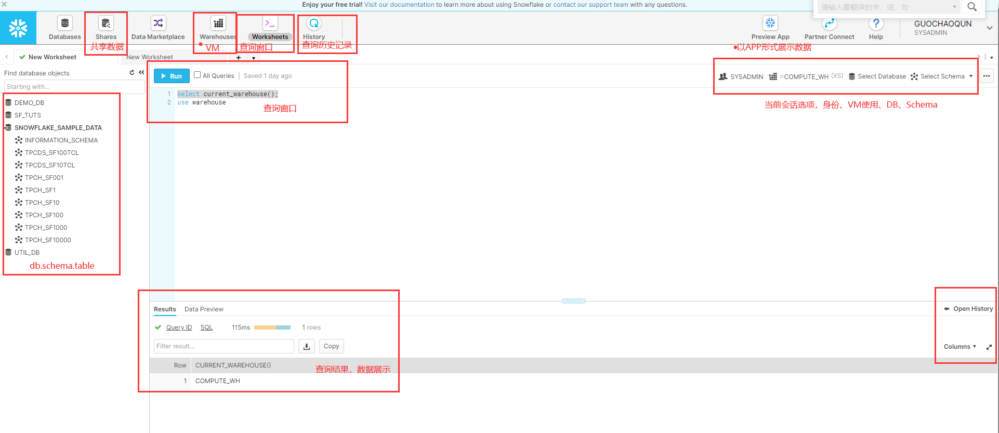

### 端到端的安全

Snowflake使用了加密性强的AES 256位加密，其分层密钥模型植根于AWS CloudHSM。加密密钥会key rotation并rekeying（“重新加密”），以确保密钥完成整个NIST 800-57加密密钥管理生命周期。加密和密钥管理对用户完全透明，不需要用户配置或管理。

Snowflake秘钥层次结构（如图5所示）有四个级别：根秘钥、帐户秘钥、表秘钥和文件秘钥。每层（父）密钥加密，即将下面的（子）密钥层包装起来。每个帐户键对应一个用户帐户，每个表秘钥对应一个数据库表，每个文件秘钥对应一个表文件。

分层密钥模型是很好的安全实践，因为它们限制了每个密钥保护的数据量。如图5中的框所示，每一层都缩小了它下面的键的范围。Snowflake的分层密钥模型确保了多租户体系结构中用户数据的隔离，因为每个用户帐户都有一个单独的帐户密钥。

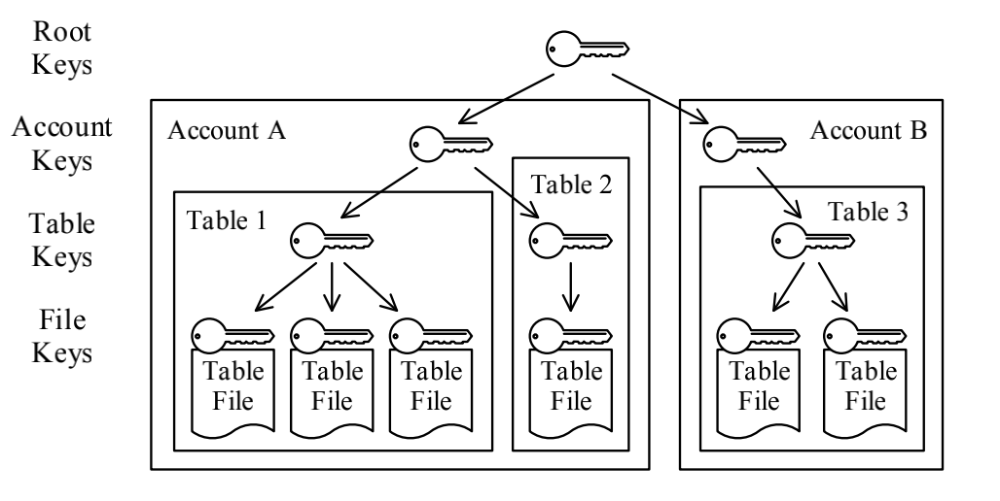

> 国内这块其实做的并不算好。不过也可以理解，安全这个词汇，甚至说：隐私，都是从国外传递进来的。但是这个的确很重要。
>
> 这样保证了数据，直接给你，你也没办法。
>
> > 再次写于4年后，2025年。从今天来看，国内关于隐私的处理，已经很棒了。得益于宏观立法、科学普及，围观层面：用户对隐私的关注。
> >
> > 目前，已经不分内外了。

除数据加密外，Snowflake还通过以下方式保护用户数据：

1.通过访问S3时运用隔离存储策略。

2.用户帐户中基于角色的访问控制，用于对数据库对象进行细粒度的访问控制。

3.加密的数据导入和导出，云提供商（Amazon）也不知道数据的具体内容。

4.用于安全访问控制的双因素和联合身份验证。

### 多供应商 - 多云数仓

大多数商业公司在使用“公有云”时，很怕的一个点是vendor-lockin（供应商锁定）。如果迁移到了一家云厂商后，如果哪一天因为“费用太高”、“功能不够丰富”等原因想迁移出来，是否会很难？如果难度过高（比如所有的应用程序全部需要重构），那就等于被锁死了。公有云或许会标榜自己的产品没有vendor-lockin，会很容易迁移，但事实真的如此么？在巨大的利益面前，公有云的利益 和 客户的利益，其实有点零和博弈的意思。

snowFlake站在了博弈的平衡点。

> 当然，国外的云厂商相对比较开放，他们允许竞争产品在自家平台上拔剑互砍，这需要诺大的勇气。也需要自信。国内，这两年也是摸着AWS过河，算是慢慢开放了。

说到云计算生态，简单从几个参与方组成的市场切入聊聊。如果站在更高的整个市场去看“云计算&基础架构“的生态，是有以下几个方面参与的：

1. 公有云
2. 3rd-party供应商（开源社区算在这部分里） 
3. 用户

不同的结合方式，又衍生出3条路：

1. 直接使用公有云
2. 通过第三方平台使用多云
3. 自建基础设施

第二条路，经过多年的验证，比第一条路要好很多。其主要好处在以下几个方面：

- <u>对用户而言，第三方平台专注于自身的SaaS，用户是对SaaS付费，而非IaaS</u>。正如上面所说的，如果是用第三方，不需要关心服务器本身等问题，而完全专注于服务。
- <u>选择第二条路，其实打破了公有云和开源社区的矛盾。</u>很大程度上避免了：你开源，我赚钱的问题。前几年，多个开源产品愤而更改开源协议，就是因为无法接受公有云的吃相。
- <u>回到“云数仓”领域，公有云的“云数仓”是有可能发生vendor-lockin的</u>，比如：数据存储格式不开放、使用api不同、管理api不同、平台化UI使用习惯 等等都是潜在的风险，对用户的风险高，用户轻易不敢把自己的生命交给path1这条路径。 3rd-party的云数仓相对好一些，3rd-party因为自己所处在生态的定位，没有动力赚取计算资源费用，因此对用户风险适中，用户一定程度上可以信赖。 自建机房固然技术依赖上是安全的，但大多数公司承受不了基础架构的维护成本，这也是“公有云”发展的根因。

从架构图及有限的文档看，snowflake是能做到在不同公有云部署的。但我认为multi-cloud并不仅仅是能使用多个云，好还能在multi-cloud间“无缝切换”。比如我今天底层使用aws，明天就可以一键在azure上setup整套服务。如果服务是stateless的，multi-cloud无缝切换或许是可能且容易落地的。但回到数仓领域，“无缝切换”就比较有挑战了。公有云除开存储、计算，另外一个比较昂贵的资源即“公网带宽“。

如下图，如果cloud1的计算服务挂了，从cloud2的计算资源访问cloud1的存储，会产生大量的跨公网带宽开销。

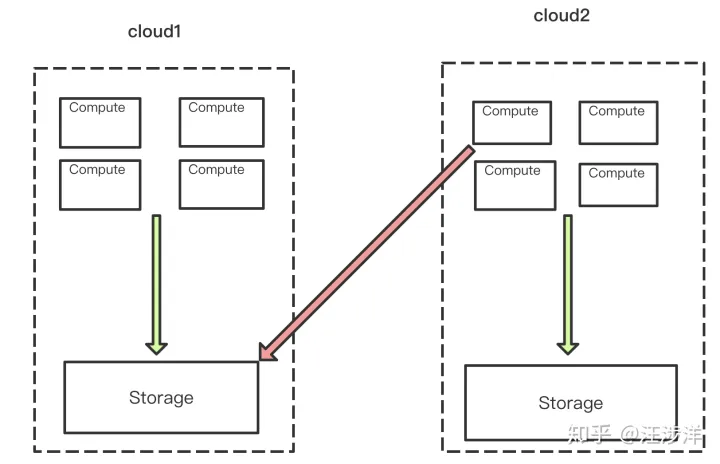

一个解决方案是使用多云间的vpn，某种程度可以降低些跨公网带宽费用。但在数据仓库领域，如果sql scan的数据量巨大，vpn channel的带宽会成为query performance的瓶颈。

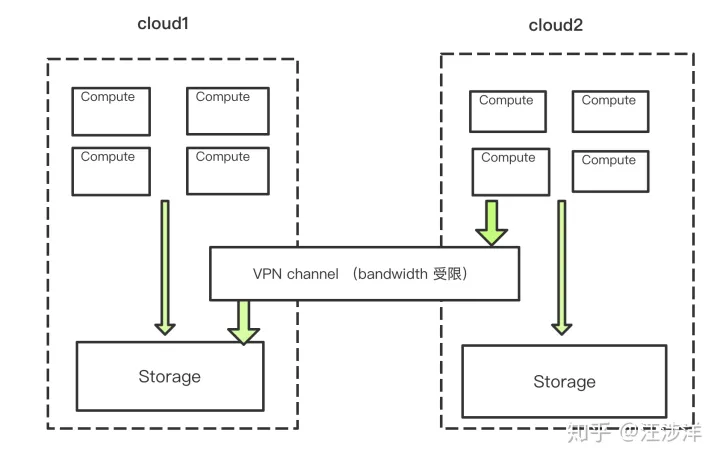

另一个解决方案是存储层同步。则数据服务的“无缝切换”的downtime取决于数据insync的延迟。保持数据insync，可以从写入时就做“双写”，也可以设定一个cloud为master，另一个cloud为slave，从master到slave做“异步同步”。做到了存储层同步，服务“无缝切换”理论上也是能达到的，唯一的缺点就在于cost了（数据在多个cloud间冗余的成本）。

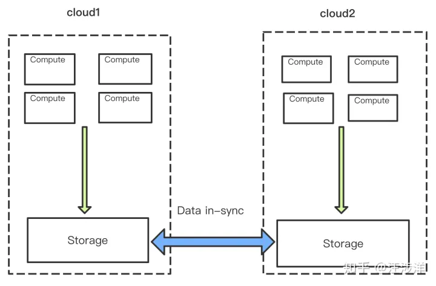

***综上，\***snowflake等类似的3rd-party供应商的“云数仓”确实能做到跨多云（因为在同一套云数仓技术栈内，接口、sql方言、admin-api、存储层format都是统一的），但目前只是有限的“多云数仓”，未能达到多云间服务的“无缝切换”。

**那么理论上**，跨云的“无缝切换“真的可能么？

multi-cloud migration基本的常识是，在stateless层面是比较容易做的，而在stateful层面会面临挑战。stateful在大数据尤其有挑战，因为大数据的状态非常多。大数据一般可划分为“存储&计算”这两层。

## 架构

### 虚拟仓库(VW - Virtual Warehouse)

计算层由许多的Virtual Warehouse组成，其本质就是处理数据的虚拟机节点。计算层和存储层在设计上是分离的，通过缓存Cache机制保证资源利用的最优和减少计算层和存储层不必要的交互。Virtual Warehouse(VW)层包含集群的EC2实例，组成VW的单个EC2实例称为工作节点。虚拟仓库构建在Amazon EC2虚拟机组成的弹性集群之上，负责执行用户的查询请求。Snowflake使用抽象的T-shirt尺寸的概念来定义VMs的算力，即：用户不知道也不关心一个VM中有多少个EC2实例，这样的抽象使得Snowflake独立于底层的云平台来提供服务和进行定价。

我们可以抽取一些关键词：

- <u>虚拟仓库层由EC2实例集群组成。每个这样的集群通过一个称为虚拟仓库（VW）的抽象呈现给用户。</u>
- <u>每个虚拟仓库都是一个MPP（大规模并行处理）计算集群，该集群由Snowflake从云提供商分配的多个计算节点组成。</u>
- <u>在以VW为虚拟分布式集群，可以添加多个资源相同的 EC2实例计算节点。</u>

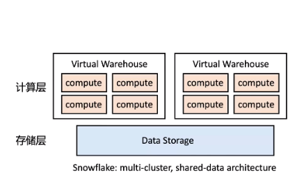

另一个与弹性有关的重要结果是，通常可以用大致相同的价格获得更好的性能表现。例如，在具有4个节点的系统上，数据加载需要15小时，而在具有32个节点的系统上，数据加载可能只需要2小时。由于计算时间是付费的，所以总体成本非常相似，但用户体验却截然不同。因此，我们相信弹性是Snowflake架构最大的优点和区别之一，因为需要一种新颖的设计来利用云的独特功能。

#### 隔离

每个查询只在一个VW上运行。工作节点不会在VW之间共享，从而使查询具有强大性能隔离。

提交新查询时，相应VW中的每个worker节点（或者如果优化器检测到一个小查询，则为节点的子集）生成一个新的worker进程。每个工作进程只在其查询时间内工作。worker进程本身，即使有update语句，不会对外部可见造成影响，因为表文件是不可变的。因此，worker故障很容易被控制，并且通过重试来解决。不过，Snowflake目前不支持部分重试，因此非常大的、长时间运行的查询是一个值得关注的领域和未来的工作。

每个用户可以在任何给定的时间运行多个VW，而每个VW又可以运行多个并发查询。每个VW都可以访问相同的共享表，而无需物理复制数据。

共享的无限存储意味着用户可以共享和集成所有数据，这是数据仓库的核心原则之一。同时，用户受益于私有计算资源，避免了不同工作和组织的干扰，这也是数据集市的原因之一。这种弹性和隔离使得一些新的使用策略成为可能。对于Snowflake用户来说，通常有几个VM用于来自不同组织的查询，通常是连续运行的，并按需定期启动VM，例如批量加载。

### 执行引擎（ Execution Engine）

为了给用户提供最好的性价比，提升每个节点的执行效率，Snowflake自己实现了先进的SQL执行引擎，该引擎构建于列式的（Columnar）、向量化的（Vectorized）和基于推的（Push-based）。

- 列式（Columnar）：因为列式存储和执行能更有效地使用CPU缓存和SIMD指令，以及更多的(轻量级)压缩机会，因此，列式存储和执行优先于行式状存储和执行。
- 向量化（Vectorized）：向量化执行意味着，与MapReduce相比，Snowflake避免了中间结果的物化。相反，数据以流水线pipeline的方式处理，以几千行的列格式批量处理。 这种方式节省了I/O，大大提高了缓存效率。
- 逻辑下推（Push-based）：基于推的执行指的是关系操作符将其结果推给其下游操作符，而不是等待这些操作符拉出数据，基于推送的执行提高了缓存效率，中间结果共享和流水线pipeline处理成为可能，使得Snowflake不仅仅处理Tree数据，还可以处理DAG(有向无环图)数据。

#### 本地缓存（Local Caching ）

<u>每个工作节点在本地磁盘上维护了一个表数据的缓存，这个缓存是表文件的集合，即：节点过去访问过的S3对象。</u> 准确地说，这些缓存只保存了文件头和文件的各个列，因为查询操作会只下载它们需要的列。**缓存使用了简单的LRU缓存淘汰策略。为了提高命中率并避免在VW的工作节点上冗余缓存单个表文件，查询优化器将输入的文件集合分配给工作节点时，对表的文件名采用一致性哈希算法。** 这样，后续访问相同的表文件或并发查询，将会在同一个工作节点上执行。<u>但是一致性哈希算法是lazy的，当工作节点发生变化时（节点故障或者VW大小被调整），缓存数据不会立即洗牌，而是依赖LRU策略淘汰缓存内容。这种解决方案分摊了在多个查询中替换缓存内容的成本，从而获得了更好的可用性。</u>

保存 过去 24 小时内执行的每个查询的 结果。这些可跨虚拟仓库使用，因此返回给一个用户的查询结果可供系统上执行同一查询的任何其他用户使用，前提是基础数据未更改。为什么VW默认设置是10分钟后不操作自动挂起，很大原因是因为挂起VW会自动情况缓存，为了更好的应用缓存数据来提高效率，所以设置了10分钟为挂起阈值，以防过于短暂的闲置引起 VW 挂起，导致缓存被清理从而使得效率更低；

#### 文件窃取（File Stealing）

倾斜处理在云数据仓库中也特别重要，由于虚拟化问题或网络争用，一些节点的执行速度可能比其他节点慢得多。 Snowflake在扫描时处理这个问题。 <u>当一个工作进程完成扫描它的一组输入文件时，它就会向其对等进程请求额外的文件，这种技术我们称之为文件窃取File Stealing。 当对等端发现文件窃取的请求到达时，它的输入文件集合中还剩下很多文件没有处理，那么它就会在当前查询的持续时间和范围内，传输剩余文件的所有权给请求进程。 然后请求者直接从存储层S3下载文件，而不是从这个对等点下载。</u>

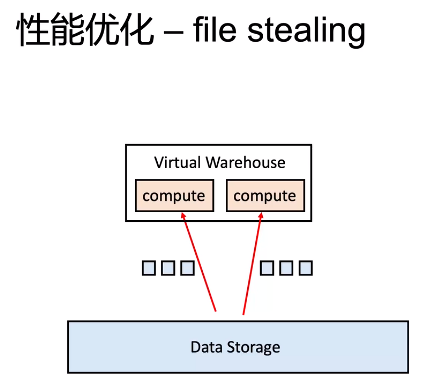

以上面为例，如果左边的实力速度远大于右边，左边处理完成了，右边才处理到第一个或者第二个文件（底层是文件），那么左边会请求右边的实例：我来帮你。

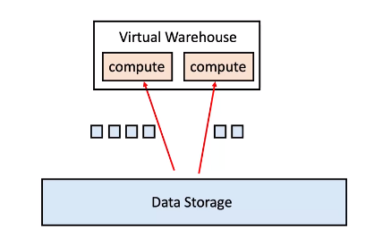

#### 剪枝（Pruning）

对一个指定的查询，限制相关数据的访问是查询处理最重要的方面之一。通常，限制数据访问是通过索引（以B+树或类似的数据结构）。

虽然这种方法被证明对事务处理非常有效，但它也会给像Snowflake这样的系统带来很多问题。 首先，无论是由于存储介质(S3)，还是由于压缩文件的数据格式，它严重依赖随机访问，这是一个问题。其次，维护索引会显著增加数据量和数据加载时间。 最后，用户需要显式地创建索引——这与Snowflake的纯服务方法非常不一致。 即便有了优化顾问的帮助，维护索引也可能是一个复杂、昂贵和有风险的过程。

最近出现了一种用于大规模数据处理的替代技术：基于min-max的剪枝，也称为小物化聚合(small materialized aggregates)、区域映射(zone maps)和数据跳过(data skipping)。在这里，对一个给定的数据块Chunk(记录集、文件、块等)，系统维护其的分布信息，特别是数据块Chunk中的最小值和最大值。 根据查询谓词的不同，对一个给定的查询，可以使用这些值来决定一个给定的数据块可能不是必要的。例如，假设文件f1和f2分别包含值3.. 5和4.. 6，如果一个查询有一个谓词WHERE x >= 6，我们知道只需要访问f2。与传统索引技术不同，这种元数据通常比实际数据小几个数量级，从而导致较小的存储开销和快速的访问。

剪枝很好地符合Snowflake的设计原则：不依赖于用户输入；良好的可扩展性；易维护。 更重要的是，它可以很好地处理大数据块的顺序访问，并且在加载、查询优化和查询执行时间方面有很少的开销。

在优化器和执行计划方面，Snowflake放弃了索引（我猜想因为选择了S3作为底层存储，毕竟是对象存储，不能像传统数据库那样的方式来实现ACID，自然索引也不例外），失去了一些自主可控力，也收获一些别的能力。比如文中提到的“执行计划搜索空间的减少”，还有更容易实现的MVCC机制，time-travel功能等。传统索引更适合于事务处理，而分析处理更注重大块数据的拖取和计算，良好的文件编码格式（orc，parquet等）和充分的压缩，以及文中提到的文件级别的剪枝优化（min-max，data skipping，zone map等），这些文件级别的剪枝优化占用空间很小，且都可以下推到文件上快速过滤数据，反而比传统面向TP的全局索引更适合于AP处理（这是我收益很大的地方，固化的思路以为所有数据库场景都需要索引，在自己工作中也在设想全局索引的方案，这给我很大的启发）。

### S3对象存储

**S3无限容量+数据多副本+分布式强一致等，还给Snowflake带来更多红利。**

相比于本地存储，S3虽然具有更高的访问延迟。但是，S3是一个对象存储，具有一个相对简单的基于HTTP的PUT/GET/DELETE接口。对象（即文件）只能完全写入。甚至不可能将数据附加到文件的末尾。文件的确切大小需要在PUT请求中前就确定。并且，S3支持对部分（范围）文件的GET请求。

表被水平地划分成大的、不可变的文件，这些文件相当于传统数据库系统中的块或页。在每个文件中，每个属性或列的值都被分组在一起并进行了大量压缩，这是一种普遍采取的方案。每个表文件都有一个表头，其中包含文件中每列的偏移量，以及其他元数据。因为S3允许对部分文件执行GET请求，所以查询只需要下载文件头和它们需要的列。

<u>Snowflake不仅在表数据上使用S3。当本地磁盘空间耗尽时，它还使用S3存储由查询（例如，大量连接）生成的临时数据，以及大型查询结果。将temp数据溢出到S3，系统可以计算任意大的查询，而不会出现内存不足或磁盘不足的错误。</u>将查询结果存储在S3中，实现了客户端交互新方式并简化查询处理，因为它消除了对传统数据库系统中的服务端游标的需要。

元数据，例如catalog信息，由S3文件、统计信息、锁、事务日志等组成，存储在可伸缩的事务KV存储中，这也是云服务的一部分。

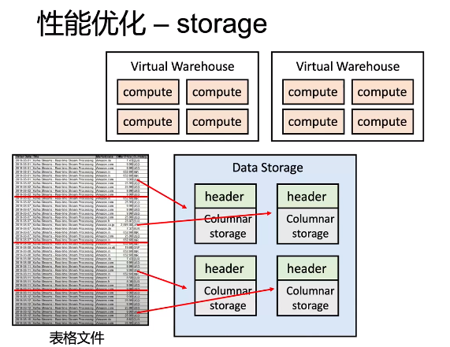

## 横向对比

### 云数仓

目前的云数仓产品：

Amazon Redshift、Google BigQuery和Microsoft Azure Synapse Analytics。

他们都相对很可靠而且相对主流。他们在成本或技术细节上虽然有所不同，但是都具有高度可扩展性等共同特征。例如，<u>它们都采用了大规模并行处理(massively parallel processing，MPP)的方式，来同时处理多项操作的存储结构。这样既加速了存储和计算资源的扩缩容，又实现了以数据列格式的存储，所带来的更好的压缩和查询特性。它们即便在发生中断或故障时，也能保证可靠的数据复制、备份、以及快速检索。</u>

此外，与部署在本地的数据仓库相比，云端方案更具有商业智能上的可扩展性，能够加速分析操作，快速上线，提供数据的集成、可观察性，以及整个生态系统。但是你也看到了，基本上是那么几家都只支持本。

### 数据湖

> 本小结几乎全部copy这个文档：[数据湖（Data Lake） 总结][https://zhuanlan.zhihu.com/p/91165577]

<u>数据湖是一种在系统或存储库中以自然格式存储数据的方法，它有助于以各种模式和结构形式配置数据，通常是对象块或文件。</u>数据湖的主要思想是对企业中的所有数据进行统一存储，从原始数据（源系统数据的精确副本）转换为用于报告、可视化、分析和机器学习等各种任务的目标数据。数据湖中的数据包括结构化数据（关系数据库数据），半结构化数据（CSV、XML、JSON等），非结构化数据（电子邮件，文档，PDF）和二进制数据（图像、音频、视频），从而形成一个容纳所有形式数据的集中式数据存储。

<u>数据湖从本质上来讲，是一种企业数据架构方法，物理实现上则是一个数据存储平台，用来集中化存储企业内海量的、多来源，多种类的数据，并支持对数据进行快速加工和分析。</u>从实现方式来看，目前Hadoop是最常用的部署数据湖的技术，但并不意味着数据湖就是指Hadoop集群。为了应对不同业务需求的特点，MPP数据库+Hadoop集群+传统数据仓库这种“混搭”架构的数据湖也越来越多出现在企业信息化建设规划中。

**数据湖的就是原始数据保存区**. 虽然这个概念国内谈的少，但**绝大部分互联网公司都已经有了**。国内一般把整个HDFS叫做数据仓库（广义），即存放所有数据的地方，而国外一般叫数据湖（data lake）

### 湖仓一体

#### 单向湖，或者叫数据沼泽（data swamp ）

搭建数据湖容易，但是让数据湖发挥价值是很难。最终数据湖只是一直往里面灌数据，而应用场景极少，没有输出或者极少输出，形成**单向湖**。

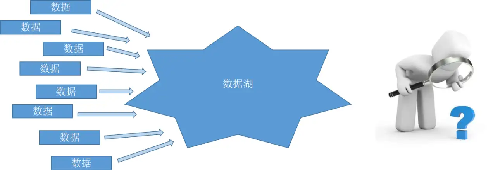

企业的业务是实时在变化的，这代表着沉积在数据湖中的数据定义、数据格式实时都在发生的转变，企业的大型数据湖对企业数据治理（Data Governance）提升了更高的要求。大部分使用数据湖的企业在数据真的需要使用的时候，往往因为数据湖中的数据质量太差而无法最终使用。数据湖，被企业当成一个大数据的垃圾桶，最终数据湖成为臭气熏天，存储在Hadoop当中的数据成为无人可以清理的数据沼泽.

湖仓一体并不是简单的说，支持了数据湖和数据仓库，其主要的要求是： 全量数据的单一存储。也可以这么说：所有的数据，都在这里。你想做要的任何对于数据的操作，我都支持：OLAP、OLTP、ML、ETL、流处理 等等一体化全量支持。

Snowflake 是新生代的云上数仓的主导者之一，算是云数仓的主要推动者，目前已经实现了基于多公有云架构的云上数仓服务。Snowflake 是完全建立在云上的企业级数据仓库解决方案。Snowflake 是云原生的，因为它针对并基于云环境进行了根本性的重新设计，处理引擎和其他大部分组件都是从新开始开发的。Snowflake 通过提供高度分布式和可扩展的计算能力扰乱了数据仓库市场。

Databricks，是属于 Spark 的商业化公司，一直致力于提供基于 Spark 的云服务，打造了Delta Lake， 已将其能力大幅扩展至传统数据仓库的方向。Databricks正在打造Data Lakehouse，一种新颖的数据湖仓概念。

通过以上分析可以看出，Databricks 最初主要是一家数据湖公司，但一直在添加数仓功能。Snowflake 则是反过来的，作为一家数仓起家的公司，却一直忙于拥抱数据湖功能。

#### 数据河（Data River）

> 数据只有流动起来才可以产生价值。基于IOTA架构的数据河与数据湖组建企业内部的可流动的大数据水系，用数据驱动整个企业精益成长。
> 如何让大数据的水保持清亮不会成为数据沼泽？中国有句谚语：“流水不腐，户枢不蠹”。数据只有流动起来，才可以不成为数据沼泽，湖泊只是暂存数据河流的基地。数据流动就意味着所有的数据产生，最终要有它的耕种者和使用者。要让数据有效流动起来，就要建立有效的“数据河”（Data River）。

数据河（Data River）就是在由源头产生清晰干净的有效数据（去ETL化，数据源头业务就像生态水源一样，不让污水流下去），通过各个河流网，流向各个数据消费端的架构。

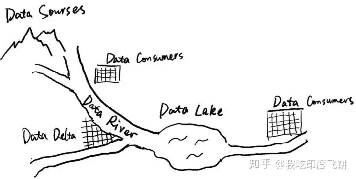

#### 湖仓一体化的主要特征

湖仓一体化，说起来简单，细究起来还是需要满足一些基本的条件：

- 通过低成本的方式实现全量数据单一存储；
- 提供高性能的数据引擎；
- 支持存算分离，满足架构的敏捷性需求，通过可插拔存储框架实现架构的可扩展性；
- 支持事务，保证事务的一致性；
- 支持数据治理，提供数据质量保证。

同时，还要支持多种的工作负载场景，比如批流一体，批处理、即席查询、数据分析(BI)、机器学习(ML)等，实现多样化工作负载。只有具备以上这些特性，才可以说是一套真正的湖仓一体。

### 湖仓一体化的不同路径

通过上面的分析可以看出，从各家技术企业的原始积累出发，湖仓一体化也会有不同的路径，主要有两种方式：

- 在数据仓库上支持数据湖 ，一般是通过在数仓中建外部表来实现，谈论的是数据仓库如何更加灵活，以数仓为核心，支持访问数据湖。以Snowflake为代表的，还包括阿里云的MaxCompute、亚马逊的Redshift；
- 在数据湖中支持数仓能力 ，一般是通过功能性开发，比如多版本并发控制、自适应schema、提供文件级事务等等，来实现传统数仓的功能。以Databricks为代表。

体现在架构图上，第一种方式在数据仓旁边建立数据湖并实现湖仓的数据交互和联通；第二种方式需要在数据湖上构建数仓的服务层，强化数据治理和数据服务的提供。**这两种方式没有优劣之分，适合自己才是最好的，需要根据自身的技术栈和数据需求进行选择和甄别。**

无论哪种方式，都有一些共性的问题需要解决，比如不同数据域数据打通的问题、元数据一致性的问题、不同数据引擎交叉引用的问题和数据开发工具缺乏的问题。

目前多数企业还没有选择湖仓一体化架构，多数采用的是传统数仓架构，有的是已经构建了初步的数据湖系统。对于数据湖来说，适合还没形成完善的数据价值体系体系，在趋势的感召下，开始尝试数据汇聚，把组织范围内的数据统一汇聚到数据湖中，实现数据集约管理的初衷。这类用户很快就会发觉数据治理和数据管理会是一个比较麻烦的问题，需要在数据湖上面构建一层数据治理和管理服务层。对于传统数仓用户来说，如果采用数仓系统支持湖仓一体化，直接挂接一个数据湖就可以启动了，后续就是关注两域数据的数据打通和元数据的一致性问题。

此外还有大量的使用了传统Hadoop体系的大数据平台用户，重点关注数据源的扩展和数据治理体系的完善，在认清全量数据的基础上，再考虑启动湖仓一体化的时机和关键节点。

https://dzone.com/articles/databricks-vs-snowflake-the-definitive-guide

https://jiagoushi.pro/data-lakes-and-warehouses-databricks-and-snowflake

## 引用

https://pages.cs.wisc.edu/~remzi/Classes/739/Spring2004/Papers/p215-dageville-snowflake.pdf 论文