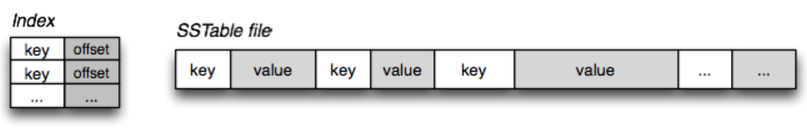
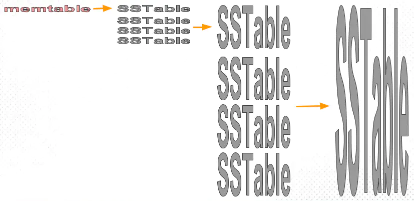
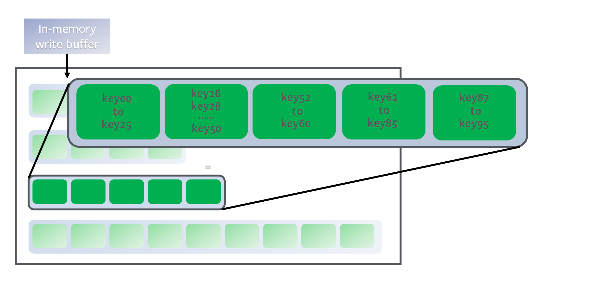
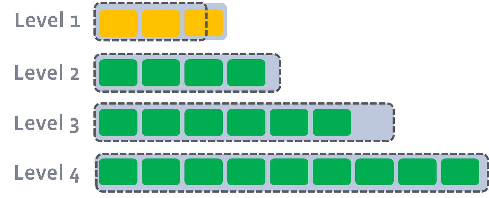
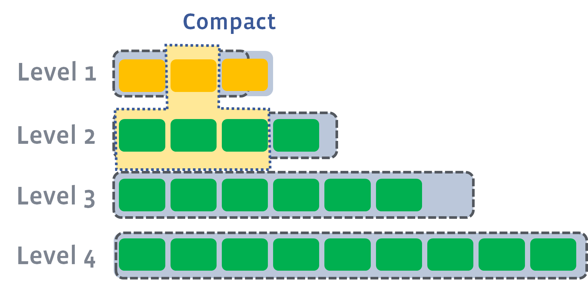
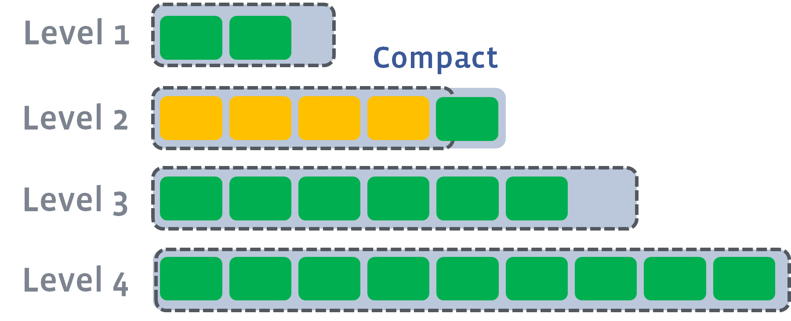
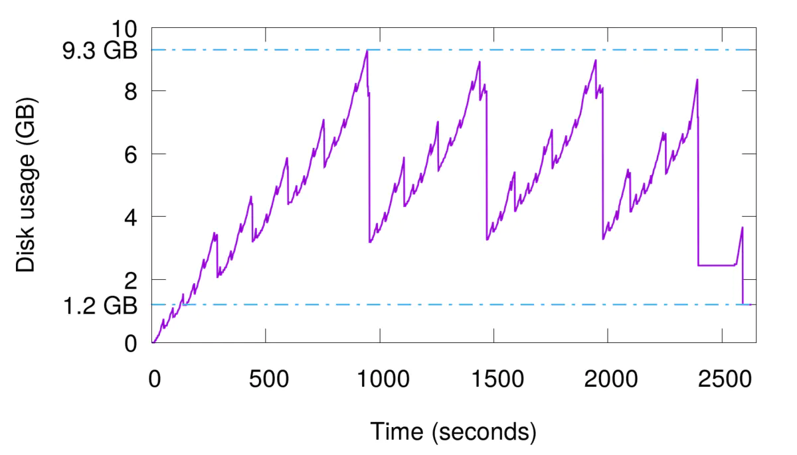
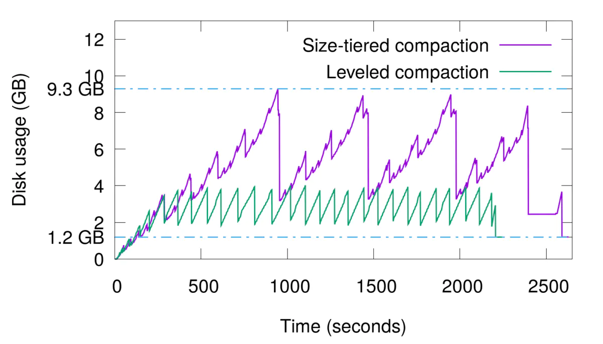

# LSM

> Log Structured Merge Trees(LSM) 

## 背景

如果我们对写操作的吞吐量敏感，我们最好怎么做？LSM被设计来提供比传统的B+树或者ISAM更好的写操作吞吐量，通过消去随机的本地更新操作来达到这个目标。一个好的办法是简单的将数据添加到文件。这个策略经常被使用在日志或者堆文件，因为他们是完全顺序的，所以可以提供非常好的写操作性能，大约等于磁盘的理论速度，也就是200~300 MB/s。

因为简单和高效，基于日志的策略在大数据之间越来越流行，同时他们也有一些缺点，**从日志文件中读一些数据将会比写操作需要更多的时间。**

如果想要简单的查询日志：

1. 数据是被整体访问，像大部分数据库的WAL(write-ahead log) 
2. 知道明确的offset，比如在Kafka中。

但是如果需要更复杂的读场景（比如按key或者range）提供高效的性能，通常有4个方法可以完成这个，它们分别是：

1. 二分查找: 将文件数据有序保存，使用二分查找来完成特定key的查找。
2. 哈希：用哈希将数据分割为不同的bucket。
3. B+树：使用B+树 或者 ISAM 等方法，可以减少外部文件的读取。
4. 外部文件： 将数据保存为日志，并创建一个hash或者查找树映射相应的文件。

**所有的方法都可以有效的提高了读操作的性能（最少提供了O(log(n)) )，但是，却丢失了日志文件超好的写性能。**<u>上面这些方法，都强加了总体的结构信息在数据上，数据被按照特定的方式放置，所以可以很快的找到特定的数据，但是却对写操作不友善，让写操作性能下降。</u>更糟糕的是，当我们需要更新hash或者B+树的结构时，需要同时更新文件系统中特定的部分，这就是上面说的比较慢的随机读写操作。**这种随机的操作要尽量减少**。

## 2. 简介

> 注意，本节通篇copy自RockDB的官方文档：[文件结构](https://rocksdb.org.cn/doc/Leveled-Compaction.html)。为了获得更好的体验，请点击前往。
>
> 本文只作为学习、回顾使用。不会发布或者用于商业用途。

**LSM树的核心特点是利用顺序写来提高写性能**，<u>但因为分层(此处分层是指的分为内存和文件两部分)的设计会稍微降低读性能，</u>但是通过牺牲小部分读性能换来高性能写，使得LSM树成为非常流行的存储结构。

### 2.1 数据结构

#### 2.1.1. MemTable

<u>**MemTable是在内存中的数据结构，用于保存最近更新的数据，会按照Key有序地组织这些数据**，</u>LSM树对于具体如何组织有序地组织数据并没有明确的数据结构定义，例如Hbase使跳跃表来保证内存中key的有序。

因为数据暂时保存在内存中，内存并不是可靠存储，如果断电会丢失数据，因此通常会通过WAL(Write-ahead logging，预写式日志)的方式来保证数据的可靠性。

#### 2.1.2. Immutable MemTable

当 MemTable达到一定大小后，会转化成Immutable MemTable。Immutable MemTable是将转MemTable变为SSTable的一种中间状态。写操作由新的MemTable处理，在转存过程中不阻塞数据更新操作。

#### 2.1.3. SSTable(Sorted String Table)

**有序键值对集合，是LSM树组在磁盘中的数据结构。**<u>为了加快SSTable的读取，可以通过建立key的索引以及布隆过滤器来加快key的查找。</u>

这里需要关注一个重点，LSM树(Log-Structured-Merge-Tree)正如它的名字一样，LSM树会将所有的数据插入、修改、删除等操作记录(注意是操作记录)保存在内存之中，当此类操作达到一定的数据量后，再批量地顺序写入到磁盘当中。这与B+树不同，B+树数据的更新会直接在原数据所在处修改对应的值，但是LSM数的数据更新是日志式的，当一条数据更新是直接append一条更新记录完成的。这样设计的目的就是为了顺序写，不断地将Immutable MemTable flush到持久化存储即可，而不用去修改之前的SSTable中的key，保证了顺序写。

因此当MemTable达到一定大小flush到持久化存储变成SSTable后，在不同的SSTable中，可能存在相同Key的记录，当然最新的那条记录才是准确的。这样设计的虽然大大提高了写性能，但同时也会带来一些问题：

1. 冗余存储，对于某个key，实际上除了最新的那条记录外，其他的记录都是冗余无用的，但是仍然占用了存储空间。因此需要进行Compact操作(合并多个SSTable)来清除冗余的记录。
2. 读取时需要从最新的倒着查询，直到找到某个key的记录。最坏情况需要查询完所有的SSTable，这里可以通过前面提到的索引/布隆过滤器来优化查找速度。

### 2.2 Compact策略

Compact操作是十分关键的操作，否则SSTable数量会不断膨胀。在Compact策略上，主要介绍两种基本策略：size-tiered和leveled。

不过在介绍这两种策略之前，先介绍三个比较重要的概念，事实上不同的策略就是围绕这三个概念之间做出权衡和取舍。

1. **读放大:** <u>读取数据时实际读取的数据量大于真正的数据量。</u>例如在LSM树中需要先在MemTable查看当前key是否存在，不存在继续从SSTable中寻找。
2. **写放大:** <u>写入数据时实际写入的数据量大于真正的数据量。</u>例如在LSM树中写入时可能触发Compact操作，导致实际写入的数据量远大于该key的数据量。
3. **空间放大:** <u>数据实际占用的磁盘空间比数据的真正大小更多。</u>上面提到的冗余存储，对于一个key来说，只有最新的那条记录是有效的，而之前的记录都是可以被清理回收的。

#### 2.2.1 size-tiered 策略

size-tiered策略保证每层SSTable的大小相近，同时限制每一层SSTable的数量。每层限制SSTable为N，当每层SSTable达到N后，则触发Compact操作合并这些SSTable，并将合并后的结果写入到下一层成为一个更大的sstable。

由此可以看出，当层数达到一定数量时，最底层的单个SSTable的大小会变得非常大。并且size-tiered策略会导致空间放大比较严重。即使对于同一层的SSTable，每个key的记录是可能存在多份的，只有当该层的SSTable执行compact操作才会消除这些key的冗余记录。

#### 2.2.2 leveled策略

leveled策略也是采用分层的思想，每一层限制总文件的大小。

但是跟size-tiered策略不同的是，<u>leveled会将每一层切分成多个大小相近的SSTable。这些SSTable是这一层是**全局有序**的，意味着一个key在每一层至多只有1条记录，不存在冗余记录。</u>之所以可以保证全局有序，是因为合并策略和size-tiered不同，接下来会详细提到。

每一层都是一个排序结果，因为每个SST文件中的key都是排好序的（参考[基于块的表格式](https://rocksdb.org.cn/doc/.html))。如果需要定位一个key，我们先二分查找所有文件的起始和结束key，定位哪个文件有这个key，然后二分查找具体的文件，来定位key的位置。总的来说，就是在该层的所有key里面进行二分查找。

下面可以通过几张图片来模拟一下整个compact的过程。假设存在以下这样的场景:

<u>当L0的文件数量到达level0_file_num_compaction_trigger，压缩(compaction)就会被触发，L0的文件会被合并进L1。通常我们需要把所有L0的文件都选上，因为他们通常会有交集：</u>

<u>L1的总大小超过L1本身大小限制：</u>

<u>此时会从L1中选择至少一个文件，然后把它跟L2***有交集的部分(非常关键)***进行合并。生成的文件会放在L2:</u>

如上图所示，此时L1第二SSTable的key的范围覆盖了L2中前三个SSTable，那么就需要将L1中第二个SSTable与L2中前三个SSTable执行Compact操作。

<u>如果L2合并后的结果仍旧超出L5的阈值大小，需要重复之前的操作 —— 选至少一个文件然后把它合并到下一层:</u>

然后会继续循环往复往下compact。

需要注意的是，***多个不相干的合并是可以并发进行的\***：

<u>leveled策略相较于size-tiered策略来说，每层内key是不会重复的，即使是最坏的情况，除开最底层外，其余层都是重复key，按照相邻层大小比例为10来算，冗余占比也很小。**因此空间放大问题得到缓解。但是写放大问题会更加突出**。</u>举一个最坏场景，如果LevelN层某个SSTable的key的范围跨度非常大，覆盖了LevelN+1层所有key的范围，那么进行Compact时将涉及LevelN+1层的全部数据。

## 3. Compaction策略的影响

> 注意，本节通篇copy自RockDB的官方文档：[LSM Tree-Based存储引擎的compaction策略（feat. RocksDB）](https://www.jianshu.com/p/e89cd503c9ae?utm_campaign=hugo)。为了获得更好的体验，请点击前往。
>
> 本文只作为学习、回顾使用。不会发布或者用于商业用途。

### 3.1 空间放大

就是指存储引擎中的数据实际占用的磁盘空间比数据的真正大小偏多的情况。例如，数据的真正大小是10MB，但实际存储时耗掉了25MB空间，那么空间放大因子（space amplification factor）就是2.5。

为什么会出现空间放大呢？很显然，LSM-based存储引擎中数据的增删改都不是in-place的，而是需要等待compaction执行到对应的key才算完。也就是说，一个key可能会同时对应多个value（删除标记算作特殊的value），而只有一个value是真正有效的，其余那些就算做空间放大。另外，在compaction过程中，原始数据在执行完成之前是不能删除的（防止出现意外无法恢复），所以同一份被compaction的数据最多可能膨胀成原来的两倍，这也算作空间放大的范畴。

#### 3.1.1 size-tiered compaction

下面用Cassandra的size-tiered compaction策略举两个例子，以方便理解。每层SST个数的阈值仍然采用默认值4。重复写入一个400万条数据的集合（约1.2GB大，保证unique key），共重复写入15次来模拟数据更新，时间与磁盘占用的曲线图如下。

最高会占用多达9.3GB磁盘空间，放大因子为7.75。虽然中途也会触发compaction，但是最低只能压缩到3.5GB左右，仍然有近3倍的放大。这是因为重复key过多，就算每层compaction过后消除了本层的空间放大，但key重复的数据仍然存在于较低层中，始终有冗余。只有手动触发了full compaction（即图中2500秒过后的最后一小段），才能完全消除空间放大，但我们也知道full compaction是极耗费性能的。

#### 3.1.2 Leveled compaction

持续更新实验，磁盘占用量的峰值大幅降低，从原来的9.3GB缩减到了不到4GB。

### 3.2 写放大

> 注意，这里写的写入50G数据，是指磁盘的写入总量。并不是说全部占用磁盘数量。中间可能会经历删除等操作。

但是鱼与熊掌不可兼得，空间放大并不是唯一掣肘的因素。仍然以size-tiered compaction的第一个实验为例，写入的总数据量约为9GB大，但是查看磁盘的实际写入量，会发现写入了50个G的数据。这就叫**写放大**（write amplification）问题。

写放大又是怎么产生的呢？下面的图能够说明。

可见，这是由compaction的本质决定的：同一份数据会不断地随着compaction过程向更高的层级重复写入，有多少层就会写多少次。但是，我们的leveled compaction的写放大要严重得多，同等条件下实际写入量会达到110GB，是size-tiered compaction的两倍有余。这是因为Ln层SST在合并到Ln+1层时是一对多的，故重复写入的次数会更多。在极端情况下，我们甚至可以观测到数十倍的写放大。

写放大会带来两个风险：一是更多的磁盘带宽耗费在了无意义的写操作上，会影响读操作的效率；二是对于闪存存储（SSD），会造成存储介质的寿命更快消耗，因为闪存颗粒的擦写次数是有限制的。在实际使用时，必须权衡好空间放大、写放大、读放大三者的优先级。

## 引用：

https://www.zhihu.com/question/19887265

https://zhuanlan.zhihu.com/p/181498475

https://blog.csdn.net/las723/article/details/93767240

https://www.jianshu.com/p/e89cd503c9ae?utm_campaign=hugo

