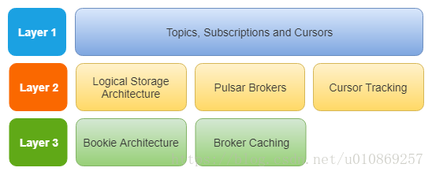
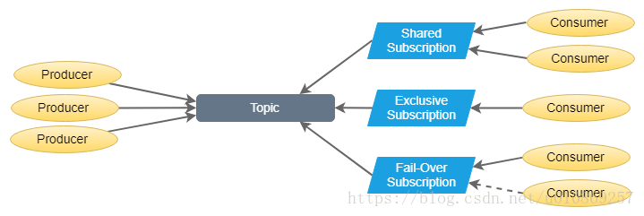
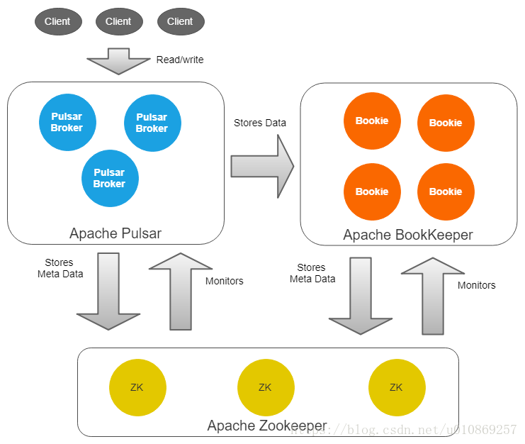
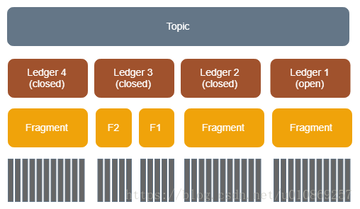
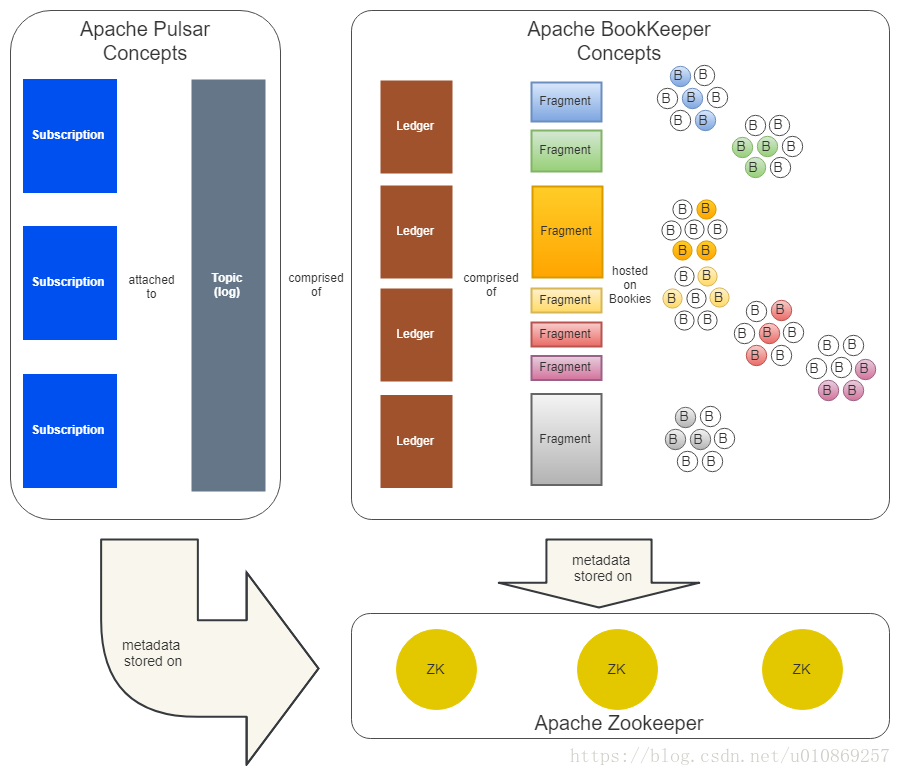
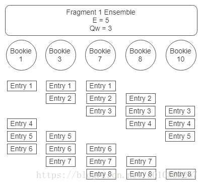
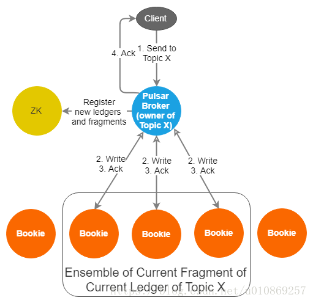
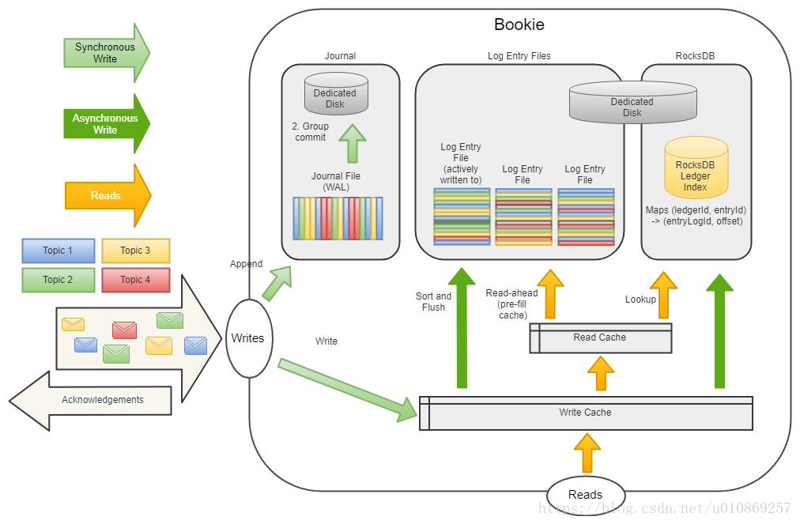
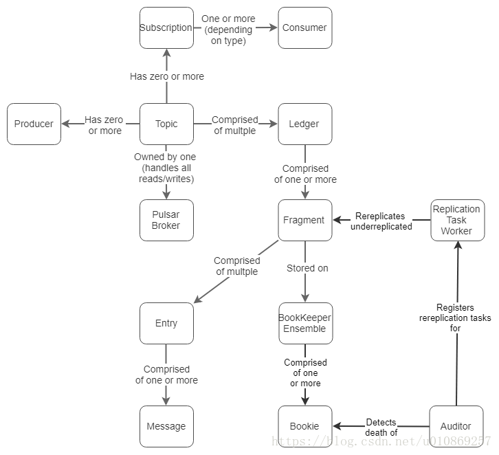

# Pulsar

Pulsar 是由 Yahoo 于 2016 年开源并捐赠给 [Apache](https://so.csdn.net/so/search?q=Apache&spm=1001.2101.3001.7020) 基金会的一款消息中间件，采用分层分片架构。**是 Apache 软件基金会顶级项目，集消息、存储、轻量化函数式计算为一体，采用计算与存储分离架构设计，支持多租户、持久化存储、多机房跨区域数据复制，具有强一致性、高吞吐、低延时及高可扩展性等流数据存储特性。**

在这篇文章中，我们将介绍Apache Pulsar的设计，这篇文章不适合想要了解如何使用Apache Pulsar的读者，适合想要了解Apache Pulsar是如何工作的读者。
**设计核心**

- 保证不丢失消息(使用正确的配置且不是整个数据中心故障)
- 强顺序性保证
- 可预测的读写延迟

Apache Pulsar选择一致性而不是可用性就像Bookkeeper和Zookeeper一样。Apache Pulsar尽一切努力保持一致性。

这篇文章中不会介绍跨机房复制相关的内容，我们只关注一个集群。

## 多层抽象

Apache Pulsar在上层具有高级别的Topic(主题)和Subscription(订阅)的概念，在底层数据存储在二进制文件中，这些数据交叉分布在多个服务器上的多个Topic。在其中包含很多的细节部分。我个人认为把它分成不同的抽象层更容易理解Apache Pulsar的架构设计，所以这就是我在这篇文章中要做的事情。

接下来我们一层一层的进行分析

图1.分层抽象

## 第一层 - Topic、Subscription和Cursors

我们将要简要介绍Topic(主题)、Subsription(订阅)和Cursors(游标)的基本概念，不会包含深层次的消息传递方式。

图2.Topic和Subscription
消息存储在Topic中。逻辑上一个Topic是日志结构，每个消息都在这个日志结构中有一个偏移量。Apache Pulsar使用游标来跟踪偏移量。生产者将消息发送到一个指定的Topic，Apache Pulsar保证消息一旦被确认就不会丢失(正确的配置和非整个集群故障的情况下)。

消费者通过订阅来消费Topic中的消息。订阅是游标(跟踪偏移量)的逻辑实体，并且还根据不同的订阅类型提供一些额外的保证

- Exclusive(独享) - 一个订阅只能有一个消息者消费消息
- Shared(共享) - 一个订阅中同时可以有多个消费者，多个消费者共享Topic中的消息
- Fail-Over(灾备) - 一个订阅同时只有一个消费者，可以有多个备份消费者。一旦主消费者故障则备份消费者接管。不会出现同时有两个活跃的消费者。

一个Topic可以添加多个订阅。订阅不包含消息的数据，只包含元数据和游标。

Apache Pulsar通过允许消费者将Topic看做在消费者消费确认后删除消息的队列，或者消费者可以根据游标的回放来提供队列和日志的语义。在底层都使用日志作为存储模型。

如果没有对Topic设置数据保留策略（目前通过其命名空间，后面会提供Topic级别的设置），一旦一个Topic的所有订阅的游标都已经成功消费到一个偏移量时，此偏移量前面的消息就会被自动删除。也就是说需要该Topic的所有订阅上得到消费确认。

但是，如果Topic设置了数据保留策略，已经消费确认的消息超过保留策略阈值(Topic的消息存储大小、Topic中消息保留的时间)后会被删除。

消费者可以以单条或者累积的方式确认消息。累积确认会有更好的吞吐量，但是在消息消费失败后会引入重复的消息处理。注意，累积消费不适用于共享模式的订阅，因为累积确认是基于偏移量的。但是在客户端API中支持批量确认，这样会减少RPC调用次数来提高在共享模式下订阅竞争消费的吞吐量。

最后，有一些类似于kafka Topic的分区(Partition)。区别在于Apache Pulsar中的分区也是Topic。就像kafka一样，生产者可以轮询、hash或者明确指定分区来发送消息。

以上都是对上层概念的一些介绍，下面我们将进行深入的研究。

## 第二层 - 逻辑存储模型

现在该介绍Apache Bookkeeper了。我将在Apache Pulsar的背景下讨论Bookkeeper，尽管Bookkeeper是一个通用的分布式日志存储解决方案。

首先，Bookkeeper将数据存储至集群中的节点上，每个Bookkeeper节点称为Bookie。其次，Pulsar和Bookkeeper都使用Apache Zookeeper来存储元数据和监控节点健康状况。

图3.Apache Pulsar、Bookkeeper和Zookeeper

一个Topic实际上是一个ledgers流。Ledger本身就是一个日志。所以一系列的子日志(Ledgers)组成了一个父日志(Topic)。

Ledgers追加到一个Topic，条目(消息或者一组消息)追加到Ledgers。Ledger一旦关闭是不可变的。Ledger作为最小的删除单元，也就是说我们不能删除单个条目而是去删除整个Ledger。

Ledgers本身也被分解为多个Fragment。Fragment是Bookkeeper集群中最小的分布单元

图4.条目存储在底层

Topic是Pulsar中的概念。Ledger和Fragment是Bookkeeper中的概念，尽管Pulsar知道且使用Ledgers和Fragment。

每个Ledger(由一个或多个Fragment组成)可以跨多个Bookkeeper节点(Bookies)进行复制，以实现数据容灾和提升读取性能。每个Fragment都在一组不同的Bookies中复制(存在足够的Bookies)。

图5.Apache Pulsar、Bookkeeper和Zookeeper协同工作

每个Ledger有三个关键配置：

Ensemble Size (E)
Write Quorum Size (Qw)
Ack Quorum Size (Qa)

这些配置可以应用到Topic级别，然后pulsar会在Topic使用的Bookkeeper Ledgers/Fragments上设置。

注意：Ensemble表示将要写入的实际的Bookies数量，以下用E表示。E表示Pulsar需要使用的Bookies数量。请注意，在配置时您至少需要E个bookies才能正常的使用。默认情况下，从可用的bookies列表中随机选取E个bookies(每个bookie在Zookeeper中注册自己)。

通过将Bookies标记为属于特定机架，还可以选择配置机架感知。机架可以是逻辑结构(例如：云环境中的可用区域)。通过机架感知策略，Pulsar Broker的Bookkeeper客户端将尝试从不同的机架选择Bookies。也可以自定义策略是定制化Bookies的选择。

Ensemble Size (E) 决定了Pulsar写入Ledger可用的Bookies池的大小。每个Fragment可能有不同的Bookies列表，Broker将在创建Fragment时选择一组Bookies，E的数量是一致的。必有足够的Bookies数量(> E)。

Write Quorum (Qw) 是Pulsar将要写入的实际的Bookies数量。可以等于或者小于E。

图6.E = 3 Qw = 3

当Qw小于E时，以条带化的方式分配读/写即每个Bookie只提供读写请求的子集。因此可以提升吞吐量，将次延迟。

图7.条带化

Ack Quorum (Qa) 是确认写入Bookies的数量，Pulsar Broker将确认发送给客户端。为了一致性，Qa应该是：(Qw + 1) / 2 或者更大。

在实践中：
(Qa == Qw) 或
(Qa == Qw - 1) —> 这样避免单节点响应缓慢而改善写入延迟。

最终，每个Bookie必须都接受写入。如果我们总是等待所有Bookies做出响应，我们可能因为因为单个Bookie响应缓慢带来的整体延迟上升。Pulsar毕竟承诺有可预测的延迟。

当创建一个新的Topic或者Ledger滚动时会创建一个新的Ledger。Ledger在以下这些情况会发生滚动并创建新的Ledger：

- 已达到Ledger的大小或时间限制。
- Ledger的所有权(Pulsar Broker的所有权)发生变化(稍后会详细介绍)。

以下情况会创建新的Fragment：

- 创建新的Ledger。
- 当前Fragment使用Bookies发生写入错误或超时。

当一个Bookies无法服务写入操作时，Pulsar Broker会创建一个新的Fragment，并确保写入的Bookies数量达到Qw(Write Quorum)值，会不断的重试直到消息被持久化。

通过前面的介绍我们可以得到以下认识：

1. 增加E以优化延迟和吞吐量。增加Qw牺牲吞吐量实现冗余。增加Qa提升数据的容灾但会增加延迟和单一节点响应慢导致的延迟增加。
2. E和Qw不是Bookies的列表。它们支持表明可为给定的Ledger服务的Bookies池有多大。Pulsar将在创建新的Ledger或Fragment时使用E和Qw。每个Fragment都有一组固定的Bookies且不可变。
3. 添加一个新的Bookies不意味着需要手动Rebalance。这些新的Bookies将自动成为Fragment的候选人。加入集群后，将在创建新的Fragment/Ledger后立即写入新的Bookies。每个Fragment都可以存储在不同的Bookies的子集中！我们不需要明确将Topic或Ledger分配指定的Bookies。

我们停下来总结一下。相对于kafka，这是一个非常不同且复杂的模型。对于kafka，每个Partition副本都完整的存储在kafka节点上。Partition以及Partition副本由一系列的Segment和索引文件组成。

kafka模型的有点在于简单快捷。所有读写都是顺序的。不好的是，单个节点必须有足够的磁盘空间来处理副本，因此非常大的副本可能会迫使你是用非常大的磁盘。第二个缺点是，在集群扩展时必须做Rebalance。这个过程是比较痛苦的，需要良好的计划和执行来保证没有任何故障的情况下分散节点的存储压力。

回到Pulsar + Bookkeeper模型。Topic中的数据分布在多个Bookies上。Topic被分割成Ledgers，Ledgers被分割成Fragments分布在Fragment使用的Bookies上。当需要做集群扩展时，只需添加更多Bookies，它们就会在创建新的Fragment时开始在的Bookies上写入数据，不再需要kafka的Rebalance操作。但是，读取和写入现在在Bookies之间跳跃。我们很快将看到Pulsar是如何管理的。

但现在每个Pulsar Broker都需要跟踪每个Topic所包含的Ledgers和Fragments。这个元数据存储在Zookeeper中，如果丢失了将会遇到非常严重的问题。

在存储层中，我们往Bookkeeper集群中均匀的写入一个Topic的数据。我们避免了将Topic或者副本的数据整体写到一个特定节点的缺陷，这避免了痛苦的Rebalance。

## 第二层 - Pulsar Broker 和 Topic 所有权

同样在第二层抽象层，我们有Pulsar Brokers。Pulsar Broker是无状态的，没有不能丢失的持久化状态。它们与存储层分开。Bookeeper集群本身并不执行复制，每个Bookies只是一个跟随者被领导者人知做什么，领导人是Pulsar Broker。每个Topic都由一个Pulsar Broker拥有，该Broker提供Topic的所有读写操作。

当Pulsar Broker接收到写入请求时，它会对当前Topic的当前Fragment使用的Bookies执行写入。（这一段需要确认一下）。

在通常情况下，当前的Ledger中将有一个Fragment。一旦Broker承认写入(满足Qa)，Pulsar Broker将向生产者客户端发送确认。

只有在所有之前消息都已经通过确认时(满足Qa)才能发送确认。如果对于给定的消息，Bookie响应错误或者根本没有响应，则Broker将在新的Bookies上创建新的Fragment(不包含有问题的Bookie)。

图8.一个Topic在一个Broker上的读取和写入

请注意，Broker只会等待Bookies的Qa确认。

读取也是通过拥有此Topic的Broker。作为给定Topic的单一入口点，Broker知道那些偏移量已经安全的保存到Bookkeeper中。它只需要从一个Bookie读取即可进行读取。我们将在第3层中看到它如何利用缓存从其内存缓存中提供读操作而不需要将读取发送到Bookkeeper。

图9.只需要对一个Bookie进行读取

Pulsar Broker的健康状态由Zookeeper监控。当Broker不可用时(Zookeeper认为)，会发生所有权变更。新的Broker成为Topic的所有者，所有客户端连接都会被重定向到此Broker。此Topic的读写将由新的所有者提供服务。

Bookkeeper有一个非常重要的功能成为Fencing。Fencing保证了Bookkeeper只有一个编写器(Pulsar Broker)可以写入Ledger。

工作原理如下：

1. Topic X 的当前拥有者(B1)不可用(通过Zookeeper)。
2. 其他Broker(B2)将Topic X 的当前Ledger状态从OPEN修改为IN_RECOVERY。
3. B2向Ledger的当前Fragment的Bookies发送fence信息并等待(Qw-Qa) + 1个Bookies响应。收到此响应数后Ledger将变成fenced。如果旧的Broker仍然处于活跃状态则无法再进行写入，因为无法获得Qa确认(由于fencing导致异常响应)。
4. B2然后从Fragment的Bookies获得他们最后确认的条目是什么。它需要最新条目的ID，然后从该点开始向前读。它确保从哪一点开始的所有条数(可能以前未向Pulsar Broker承认)都会被复制到Qw Bookies。一旦B2无法读取并复制任何条目，Ledger将完全恢复。
5. B2将Ledger的状态更改为CLOSED。
6. B2现在可以创建新的Ledger并接受写入请求。

这种架构的伟大之处在于，通过让领导人(Pulsar Broker)没有状态，Bookkeeper的fencing特性可以很好的处理脑裂问题。没有脑裂，没有分歧，没有数据丢失。

## 第二层 - Cursor跟踪

每个Subscription都存储一个Cursor。Cursor是日志中的当前偏移量。Subscription将其Cursor存储至Bookkeeper的Ledger中。这使Cursor跟踪可以像Topic一样进行扩展。

## 第三层 - Bookie 存储

Ledgers和Fragments是在Zookeeper中维护和跟踪的逻辑结构。物理上数据不存储在Ledgers和Fragments对应的文件中。Bookkeeper中存储的实现是可拔插的，Pulsar默认使用名称为DbLedgerStorage的存储实现。

当在Bookie上写入数据时，首先将该消息写入日志文件，这是一个预写日志(WAL),它可以帮助Bookkeeper在发生故障时避免数据丢失。它与关系型数据库持久化保证的机制相同。

写入操作也会写入缓存。写入的缓存会在内存中做积累并定期进行排序和刷盘。对写入进行排序以便将同一Ledger的条目放在一起，从而提高读取性能。如果条目以严格的时间顺序写入，在读取时无法利用磁盘的高效顺序操作。通过聚合和排序，我们实现了Ledger级别的时间顺序，这是我们关心的。

写入缓存还将条目写入RocksDB，存储每个条目的位置索引。它只是将(LedgerId，EntryId)映射到(EntryLogId，文件中的偏移量)。

由于写入缓存具有最新的消息，因此在读取时尝试读取写缓存，如果没有命中尝试读取读缓存。如果两者都没有命中，则会从RocksDB中查找条目的位置，然后在日志文件中读取该条目并且会更新到读缓存中以便后续请求命中缓存。这两层缓存意味着读取通常可以在内存中完成。

Bookkeeper容许将磁盘IO做读写分离。写入都按顺序写入日志文件可以存储在专用的磁盘上，并且可以批量刷盘以获得搞得吞吐量。除此之外从写入操作来看没有其他的同步磁盘IO操作，数据都是写入到内存的缓存区。

写缓存通过异步的方式批量将条目写入到日志文件和RocksDB，因此，一个磁盘用于同步写入日志文件，另一个磁盘用于异步写入条目和读取操作，

在读取的一边，读取操作由Read Cache或Log Entry文件和RocksDB提供。

还要考虑到写入会占满入口网络带宽，读取会占满出口网络带宽，但是他们不会相互影响。

优雅的实现了磁盘和网络中读和写的隔离。

图10.DbLedgerStorage(Apache Pulsar默认使用)架构的Bookie

## 第三层 - Pulsar Broker 缓存

每个Topic都有一个所属的Broker，所以读写都是通过该Broker进行的。这样提供了很多的好处。

首先，Broker可以将日志的尾部缓存在内存中，这意味着Broker可以不需要Bookkeeper的情况下为读取尾部数据的操作提供服务。这比避免了网络的开销以及Bookie上可能的磁盘读取。

Broker也知道Last Add Confirmed条目的ID。这样可以跟踪那条消息是最后一个安全持久化的消息。

当Broker的缓存中没有消息时将从消息所在的Fragment使用的一个Bookie请求数据。这样可能必须承担额外的网络开销和可能的磁盘读取成本。

因此，我们从高层次描述了消息的逻辑和物理结构以及Pulsar集群中的不同参与者以及它们的关系。有很多细节尚未涵盖，我们会在其他文章中做更详细的解析。

接下来我们将介绍Apache Pulsar集群中如何确保在节点故障后消息可以得到充分的复制。

## 数据恢复协议

当一个Bookie故障时，所有的在这个Bookie的含有Fragments的Ledgers现在都处于复制中。恢复是重新复制Fragments的过程，以确保每个Ledgers维护的副本数达到Qw。

有两种类型的恢复方法：手动或自动。两者复制的协议是相同的，但自动恢复使用内置的失败节点检查机制来执行要执行的重复复制任务。手动过程需要手动干预。

我们将专注于自动恢复模式。

自动恢复可以在一组专用的服务器或者在Bookies上通过AutoRecoveryMain运行。其中一个自动恢复的过程被选为Auditor。Autitor的作用是检查不可用的Bookie然后做一下操作：

1. 读取Zookeeper上完整的Ledgers清单，找到托管在失败的Bookie上的Ledger。
2. 对于每个Ledger，它将在Zookeeper中的 /underreplicated znode节点上创建重新复制任务。

如果Auditor节点出现故障，则另一个节点将晋升为Auditor。Auditor是AutoRecoveryMain进行中的一个线程。

AutoRecoveryMain进程还有运行复制任务的Worker线程。每个Worker都是监听不同的znode节点以发现新的复制任务。

发现任务时会尝试锁定。如果无法锁定就会执行后面的任务。

如果获得锁，那么：

1. 扫描Ledgers，查找不属于当前Bookie的Fragment。
2. 对于每个匹配的Fragment，它将另一个Bookie的数据复制到它自己的Bookie，用新的集合更新Zookeeper并将Fragment标识为Fully Replicated。

如果Ledgers仍然存在副本数不足的Fragment，则释放锁。如果所有Fragment都已经Fully Replicated，则从/underreplicated删除重复复制任务。

如果一个Fragment没有结束条目ID，则复制任务将等待并再次检查，如果Fragment仍然没有结束条目ID，则它会在重新复制Fragment之前对分类账进行fence操作(Bookkeeper Fencing)。

所以，使用自动恢复模式Pulsar集群能够完全复制详细数据以确保每个Ledger有足够的副本数。系统管理员要确保报数适量的Bookies。

## Zookeeper

Pulsar和Bookeeper都需要Zookeeper。如果Pulsar节点失去所有的Zookeeper节点的可见性，那么它将停止接受读写操作并重新启动。这是一种保护措施避免集群形成不一致的状态。

这意味着如果Zookeeper发生故障，一切都变得不可用，Pulsar节点的缓存也将被清除。因此在恢复服务时所有的读取操作都发送到Bookkeeper，理论上可能存在延迟峰值。

## 结束语

- 每个Topic都有一个归属的Broker。
- 每个Topic在逻辑上分解为Ledgers、Fragments和Entries。
- Fragments分布在Bookie集群中。Topic与Bookie并不耦合。
- Fragments可以跨多个Bookies带状分布。
- 当Pulsar Broker不可用时，该Broker持有的Topic所有权将转移至其他的Broker。Fencing机制避免了同一个Topic当前的Ledger同时有两个所有者(Broker)。
- 当Bookie不可用时，自动恢复(如果启用)将自动进行数据重新复制到其他的Bookies。如果禁用，则可以手动启动此过程。
- Broker缓存尾部消息日志，可以非常高效的为尾部读取操作提供服务。
- Bookies使用Journal提供持久化保证。该日志可用于故障恢复时恢复尚未写入Entry Log文件的数据。
- 所有Topic的的条目都保存在Entry Log文件中。查找索引保存在RocksDB中。
- Bookies读取逻辑如下：Write Cache -> Read Cache -> Log Entry Files(RocksDB 作为索引)
- Bookies可以通过单独的磁盘做IO读写分离。
- Zookeeper存储Pulsar和Bookkeeper的所有元数据。如果Zookeeper不可用整个Pulsar将不可用。
- 存储可以单独扩展。如果存储是瓶颈，那么只需要添加更多的Bookies，他们会自动承担负载不需要Rebalance。

