# Rabbit MQ

RabbitMQ是目前非常热门的一款消息中间件，不管是互联网大厂还是中小企业都在大量使用。作为一名合格的开发者，有必要对RabbitMQ有所了解，本文是RabbitMQ快速入门文章，主要内容包括RabbitMQ是什么、RabbitMQ核心概念、常用交换器类型、用Docker安装RabbitMQ等。

RabbitMQ是使用Erlang语言来编写的，并且RabbitMQ是基于AMQP协议的。Erlang语言在数据交互方面性能优秀，有着和原生Socket一样的延迟，这也是RabbitMQ高性能的原因所在。可谓“人如其名”，RabbitMQ像兔子一样迅速。

## AMQP

> AMQP协议算是消息队列里无法绕开的一个协议，通过阅读该协议来学习消息队列以及自有协议设计。该协议的阅读体验非常好，协议本身没有过于复杂，规范里也会解释各个地方的设计思路。
>
> 本文也通过学习一下几个引用的AMQP来归纳。为了获得更好的体验，可点击前往。
>
> - [AMQP 0.9.1 规范](https://www.rabbitmq.com/resources/specs/amqp0-9-1.pdf)
> - [AMQP 0.9.1 完整的中文翻译](http://www.blogjava.net/qbna350816/archive/2016/08/12/431554.html)
> - [RabbitMQ 对于 AMQP 0.9.1 的勘误](https://www.rabbitmq.com/amqp-0-9-1-errata.html)
> - [RabbitMQ 对与 AMQP 0.9.1 的扩展](https://www.rabbitmq.com/extensions.html)
> - [AMQP 1.0 最终版](http://www.amqp.org/specification/1.0/amqp-org-download)
> - [AMQP 1.0 PDF](https://www.amqp.org/sites/amqp.org/files/amqp.pdf)

AMQP（Advanced Message Queuing Protocol，高级消息队列协议）是一个进程间传递**异步消息**的**网络协议**。

### AMQ模型

AMQP在一致性客户端和消息中间件(也称为"brokers")之间创建了全功能的互操作。为了完全实现消息中间件的互操作性，需要充分定义网络协议和消息代理服务的功能语义。

因此，AMQP通过如下来定义了网络协议(AMQP是协议！)和服务端服务：

1. <u>一套确定的消息交换功能，也就是“高级消息交换协议模型”。AMQP模型包括一套用于路由和存储消息的功能模块，以及一套在这些模块之间交换消息的规则。</u>
2. <u>一个网络线级协议（数据传输格式），AMQP促使客户端可使用AMQ模型来与服务器交互．</u>

我们需要明确定义服务器语义，因为所有服务器实现都应该与这些语义保持一致性，否则就无法进行互操作.  因此AMQ 模型定义了一系列模块化组件和标准规则来进行协作. 有三种类型的组件可以连接服务器处理链来创建预期的功能:

1. <u>**"交换器(exchange)" ：接收来自发布者应用程序的消息，并基于任意条件(通常是消息属性和内容）将这些消息路由到消息队列(message queues).**</u>
2. <u>**"消息队列(message queue)"：存储消息直到它们可以被消费客户端应用程序(或多线程应用程序)安全处理．**</u>
3. <u>**"绑定(binding)":定义了消息队列与交换器之间的关系，并提供了消息路由条件．**</u>

使用这些模型我们可以很容易地模拟经典的存储转发队列和面向消息中间件的主题订阅概念. 我们还可以表示更为复杂的概念，例如：基于内容的路由，工作负载分配和按需消息队列。

> 大致上讲， AMQP 服务器类似与邮件服务器, 每个交换器都扮演了消息传送代理,每个消息队列都作为邮箱，而绑定则定义了每个传送代理中的路由表.发布者发送消息给独立的传送代理,然后传送代理再路由消息到邮箱中.消费者从邮箱中收取消息. 相比较而言，在AMQP之前的许多中间件系统中，发布者直接发送消息到独立收件箱(在存储转发队列的情况下),或者发布到邮件列表中 (在主题订阅的情况下).

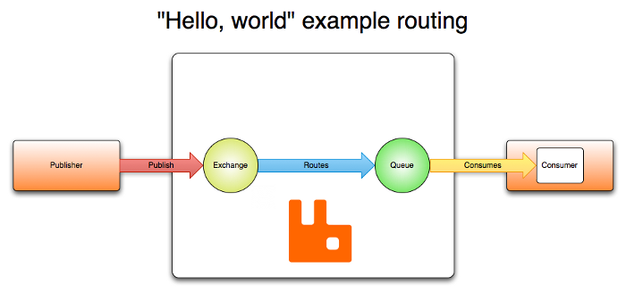

### AMQP 高级消息队列协议

<u>AMQP协议是具有现代特征的二进制协议: 它是多通道的, 协商的，异步的，安全的，便携的，自然的，高效的.</u> 其协议主要分成两层：

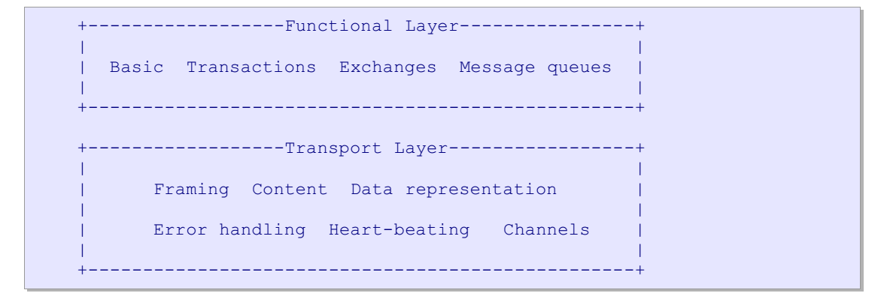

**功能层( functional layer)定义了一系列命令(分成功能独立的逻辑类)，可为应用程序做有用工作。** 

**传输层，将这些方法从应用程序应用搬到服务器并返回，它同时会处理通道复用，帧同步, 内容编码,心跳检测, 以及数据表示和错误处理.**

AMQP传输层是由以下需求驱动的:

- 紧凑。能够快速封包和解包
- 可以携带任意大小的消息，没有明显的限制
- 同一个连接可以承载多个通道（Channel）
- 长时间存活，没有显著的限制
- 允许异步命令流水线
- 容易扩展。易于处理新需求、或者变更需求
- 向前兼容
- 使用强大的断言模型，可修复
- 对编程语言保持中立
- 适合代码生成过程

在设计过程中，希望能够支持不同的消息架构：

- 先存后发模型。有多个Writer，只有一个Reader
- 分散工作负载。有多个Writer和多个Reader
- 发布订阅模型，多个Writer和多个reader
- 基于消息内容的路由，多个Writer，多个Reader
- 队列文件传输，多个Writer，多个Reader
- 两个节点之间点对点连接
- 市场数据（Market data）分发。多个数据源，多个Reader

#### AMQP 是一个可编程的协议

AMQP 0-9-1 是一个可编程协议，某种意义上说AMQP的实体和路由规则是由应用本身定义的，而不是由消息代理定义。包括像声明队列和交换机，定义他们之间的绑定，订阅队列等等关于协议本身的操作。

这虽然能让开发人员自由发挥，但也需要他们注意潜在的定义冲突。当然这在实践中很少会发生，如果发生，会以配置错误（misconfiguration）的形式表现出来。

应用程序（Applications）声明AMQP实体，定义需要的路由方案，或者删除不再需要的AMQP实体。

#### AMQP 是可扩展的

AMQP 0-9-1 拥有多个扩展点：

- 定制化交换机类型 可以让开发者们实现一些开箱即用的交换机类型以提供尚未很好覆盖的路由方案，例如 geodata-based routing。
- 交换机和队列的声明中可以包含一些消息代理能够用到的额外属性 例如 RabbitMQ 中的 per-queue message TTL 即是使用该方式实现。
- 特定消息代理的协议扩展 例如 RabbitMQ 所实现的扩展。
- 新的 AMQP 0-9-1 方法类可被引入
- 消息代理可以被其他的插件扩展 例如 RabbitMQ 的管理前端 和 已经被插件化的 HTTP API。

这些特性使得 AMQP 0-9-1 模型更加灵活，并且能够适用于解决更加宽泛的问题。

### AMQP 的架构

下面的图显示了整体AMQ模型：

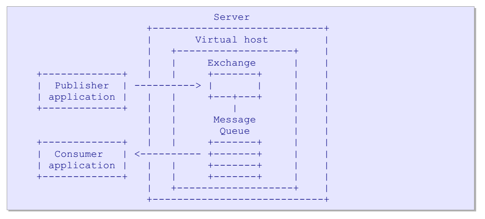

AMQP提供了运行时程序语义，主要有两方面：

1. 运行时通过该协议可创建任意的交换器和消息队列类型的能力（有些是在标准中定义的，但可以添加其他作为服务器扩展）。

2. 运行时通过协议包装交换器和消息队列来创建任何需要的消息处理系统的能力．

#### 消息队列(Message Queue)

消息队列用于在内存或磁盘上存储消息, 并将它们依次投递给一个或多个消费者应用程序.消息队列是消息存储和分发的实体. 每个消息队列是完全独立的。<u>消息队列有多个属性:**私有的或共享的, 持久的或临时的,客户端命名的或服务器端命名的等等．**</u>

通过选择希望的属性，我们可以使用消息队列来实现传统的中间件实体，如：

 共享存储转发队列：它可以持有消息，并以round-robin方式在消费者之间分发消息.存储转发队列通常是在多个消费者之间是持久化的．

 私有回复队列：它可以持有消息，并把消息转发给单个消费者. 回复队列通常是临时的，服务端命名的，且对于某个消费者来说是私有的．

 私有订阅队列：它可持有来自不同订阅源的消息，并将它们转发给单个消费者.

订阅队列通常是临时的，服务器端命名的，并对于某个消费者来说是私有的． 

#### 交换器(Exchange)

<u>**交换器接收来自生产者应用程序的消息，并将它们按照事先约定的规则路由到消息队列中。** 这些预先约定的规则或条件称为绑定， **交换器会与路由引擎匹配**。也就是说，他们会检查消息，并使用他们的绑定表来决定如何将这些消息转发到消息队列或其他交换器中。**交换器永远不会存储信息。“交换器”一词是指一类算法或算法实例。**</u>

更确切的说，我们谈到了交换器类型和交换器实例．

AMQP定义了许多交换器类型，它们覆盖了常见消息路由分发的基础类型. AMQP服务器提供了这些交换器的默认实例.使用AMQP的应用程序可额外创建它们自己的交换器实例.交换器类型是命名的，这样创建交换器的应用程序就可以告知服务器他们使用的交换器类型。交换器实现也可以是命名的，这样应用程序可指定如何绑定队列来发布消息。

交换器是一个虚拟主机内的消息路由Agent。用于处理消息的路由信息（一般是Routing-Key），然后将其发送到消息队列或者内部服务中。交换器可能是持久化的、临时的、自动删除的。交换器把消息路由到消息队列时可以是并行的。这会创建一个消息的多个实例。

##### **`Direct`** 交换器

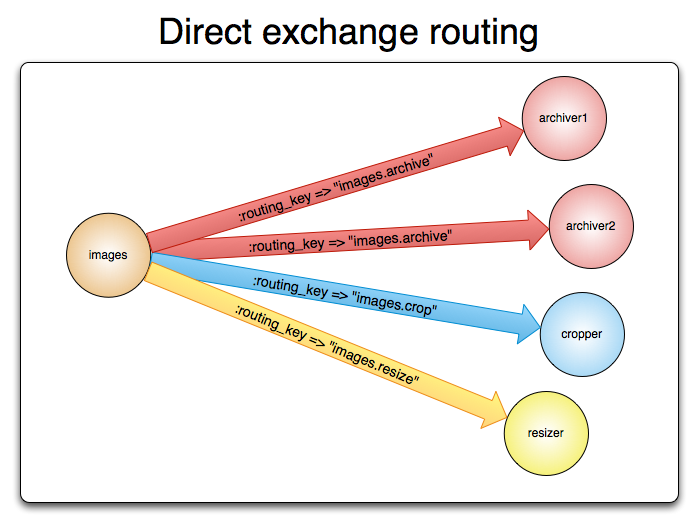

直连型交换机（direct exchange）是根据消息携带的路由键（routing key）将消息投递给对应队列的。直连交换机用来处理消息的单播路由（unicast routing）（尽管它也可以处理多播路由）。下边介绍它是如何工作的：

- 将一个队列绑定到某个交换机上，同时赋予该绑定一个路由键（routing key）
- 当一个携带着路由键为`R`的消息被发送给直连交换机时，交换机会把它路由给绑定值同样为`R`的队列。

直连交换机经常用来循环分发任务给多个工作者（workers）。当这样做的时候，我们需要明白一点，在AMQP 0-9-1中，消息的负载均衡是发生在消费者（consumer）之间的，而不是队列（queue）之间。

##### `Fanout` 交换器

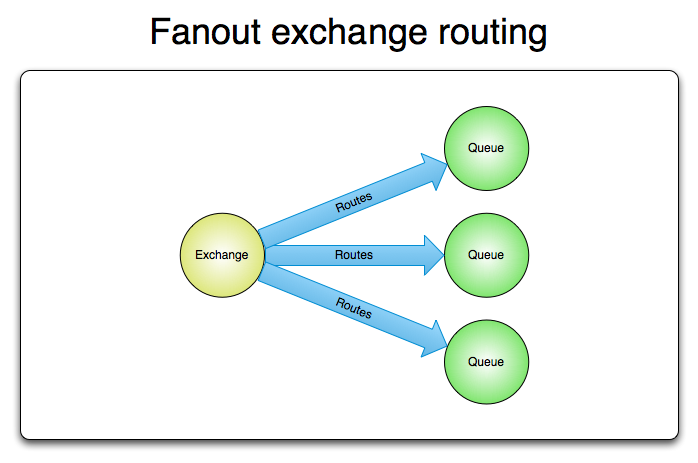

**扇型交换机（funout exchange）将消息路由给绑定到它身上的所有队列，而不理会绑定的路由键。**如果 N 个队列绑定到某个扇型交换机上，当有消息发送给此扇型交换机时，交换机会将消息的拷贝分别发送给这所有的 N 个队列。扇型用来交换机处理消息的广播路由（broadcast routing）。

##### **`Topic`** 交换器

主题交换机（topic exchanges）通过对消息的路由键和队列到交换机的绑定模式之间的匹配，将消息路由给一个或多个队列。主题交换机经常用来实现各种分发/订阅模式及其变种。主题交换机通常用来实现消息的多播路由（multicast routing）。

主题交换机拥有非常广泛的用户案例。无论何时，当一个问题涉及到那些想要有针对性的选择需要接收消息的 多消费者/多应用（multiple consumers/applications） 的时候，主题交换机都可以被列入考虑范围。

使用案例：

- 分发有关于特定地理位置的数据，例如销售点
- 由多个工作者（workers）完成的后台任务，每个工作者负责处理某些特定的任务
- 股票价格更新（以及其他类型的金融数据更新）
- 涉及到分类或者标签的新闻更新（例如，针对特定的运动项目或者队伍）
- 云端的不同种类服务的协调
- 分布式架构/基于系统的软件封装，其中每个构建者仅能处理一个特定的架构或者系统。

##### **`Headers`** 交换器

<u>有时消息的路由操作会涉及到多个属性，此时使用消息头就比用路由键更容易表达，头交换机（headers exchange）就是为此而生的。**头交换机使用多个消息属性来代替路由键建立路由规则。通过判断消息头的值能否与指定的绑定相匹配来确立路由规则。**</u>

我们可以绑定一个队列到头交换机上，并给他们之间的绑定使用多个用于匹配的头（header）。这个案例中，消息代理得从应用开发者那儿取到更多一段信息，换句话说，它需要考虑某条消息（message）是需要部分匹配还是全部匹配。上边说的“更多一段消息”就是 "x-match" 参数。当 "x-match" 设置为 “any” 时，消息头的任意一个值被匹配就可以满足条件，而当 "x-match" 设置为 “all” 的时候，就需要消息头的所有值都匹配成功。

头交换机可以视为直连交换机的另一种表现形式。头交换机能够像直连交换机一样工作，不同之处在于头交换机的路由规则是建立在头属性值之上，而不是路由键。路由键必须是一个字符串，而头属性值则没有这个约束，它们甚至可以是整数或者哈希值（字典）等。

#### 路由键 （Routing Key）

在一般情况下，交换器会检查消息的属性，如，它的header字段，body内容，并使用这些和其他来源中的数据来决定如何消息路由。在大多数简单情况下，交换器会检查某个单一的键字段，我们称之为“路由键”。

<u>路由键是一个虚拟地址，该虚拟地址可用来决定如何路由消息。</u>

对于点对点的路由，路由键通常是消息队列的名称。

对于主题发布订阅路由，路由键通常是topic层次结构值。

在更复杂的情况下，路由键可以是消息header字段和/或消息内容的组合体。

#### Consumer消费者

消息如果只是存储在队列里是没有任何用处的。被应用消费掉，消息的价值才能够体现。在 AMQP 0-9-1 模型中，有两种途径可以达到此目的：

1）将消息投递给应用 (“push API”)
2）应用根据需要主动获取消息 (“pull API”)

使用 push API，应用（application）需要明确表示出它在某个特定队列里所感兴趣的，想要消费的消息。如是，我们可以说应用注册了一个消费者，或者说订阅了一个队列。一个队列可以注册多个消费者，也可以注册一个独享的消费者（当独享消费者存在时，其他消费者即被排除在外）。

<u>每个消费者（订阅者）都有一个叫做消费者标签的标识符。它可以被用来退订消息。消费者标签实际上是一个字符串。</u>

#### 消息机制

##### 消息确认

消费者应用(Consumer applications, 用来接受和处理消息的应用)在处理消息的时候偶尔会失败或者有时会直接崩溃掉。而且网络原因也有可能引起各种问题。这就给我们出了个难题，AMQP 代理在什么时候删除消息才是正确的？AMQP 0-9-1 规范给我们两种建议：

- **自动确认模式**：<u>当消息代理（broker）将消息发送给应用后立即删除。（使用 AMQP 方法：basic.deliver 或 basic.get-ok）)</u>
- **显式确认模式**：<u>待应用（application）发送一个确认回执（acknowledgement）后再删除消息。（使用 AMQP 方法：basic.ack）</u>

<u>如果一个消费者在尚未发送确认回执的情况下挂掉了，那 AMQP 代理会将消息重新投递给另一个消费者。如果当时没有可用的消费者了，消息代理会死等下一个注册到此队列的消费者，然后再次尝试投递。</u>

##### 拒绝消息

当一个消费者接收到某条消息后，处理过程有可能成功，有可能失败。应用可以向消息代理表明，本条消息由于 “拒绝消息（Rejecting Messages）” 的原因处理失败了（或者未能在此时完成）。

<u>当拒绝某条消息时，应用可以告诉消息代理如何处理这条消息——**销毁它或者重新放入队列。**</u>

<u>当此队列只有一个消费者时，请确认不要由于拒绝消息并且选择了重新放入队列的行为而引起消息在同一个消费者身上无限循环的情况发生。</u>

在 AMQP 中，basic.reject 方法用来执行拒绝消息的操作。但 basic.reject 有个限制：你不能使用它拒绝多个带有确认回执（acknowledgements）的消息。但是如果你使用的是 RabbitMQ，那么你可以使用被称作 negative acknowledgements（也叫 nacks）的 AMQP 0-9-1 扩展来解决这个问题。

##### 预取消息

在多个消费者共享一个队列的案例中，明确指定在收到下一个确认回执前每个消费者一次可以接受多少条消息是非常有用的。这可以在试图批量发布消息的时候起到简单的负载均衡和提高消息吞吐量的作用。**注意，RabbitMQ 只支持通道级的预取计数，而不是连接级的或者基于大小的预取。**

##### 消息属性

AMQP 模型中的消息（Message）对象是带有属性（Attributes）的。有些属性及其常见，以至于 AMQP 0-9-1 明确的定义了它们，并且应用开发者们无需费心思思考这些属性名字所代表的具体含义。例如：

- Content type（内容类型）
- Content encoding（内容编码）
- Routing key（路由键）
- Delivery mode (persistent or not)
- 投递模式（持久化 或 非持久化）
- Message priority（消息优先权）
- Message publishing timestamp（消息发布的时间戳）
- Expiration period（消息有效期）
- Publisher application id（发布应用的 ID）

<u>有些属性是被 AMQP 代理所使用的，但是大多数是开放给接收它们的应用解释器用的。有些属性是可选的也被称作消息头（headers）。</u>他们跟 HTTP 协议的 X-Headers 很相似。消息属性需要在消息被发布的时候定义。

##### 消息主体

AMQP 的消息除属性外，也含有一个有效载荷 - Payload（消息实际携带的数据），它被 AMQP 代理当作不透明的字节数组来对待。

消息代理不会检查或者修改有效载荷。消息可以只包含属性而不携带有效载荷。它通常会使用类似 JSON 这种序列化的格式数据，为了节省，协议缓冲器和 MessagePack 将结构化数据序列化，以便以消息的有效载荷的形式发布。AMQP 及其同行者们通常使用 “content-type” 和 “content-encoding” 这两个字段来与消息沟通进行有效载荷的辨识工作，但这仅仅是基于约定而已。

##### 消息持久化

消息能够以持久化的方式发布，AMQP 代理会将此消息存储在磁盘上。如果服务器重启，系统会确认收到的持久化消息未丢失。

<u>**简单地将消息发送给一个持久化的交换机或者路由给一个持久化的队列，并不会使得此消息具有持久化性质：它完全取决与消息本身的持久模式（persistence mode）。**将消息以持久化方式发布时，会对性能造成一定的影响（就像数据库操作一样，健壮性的存在必定造成一些性能牺牲）。</u>

####  消息流（Message Flow）

下面的图展示了通过AMQ模块服务器的消息流：

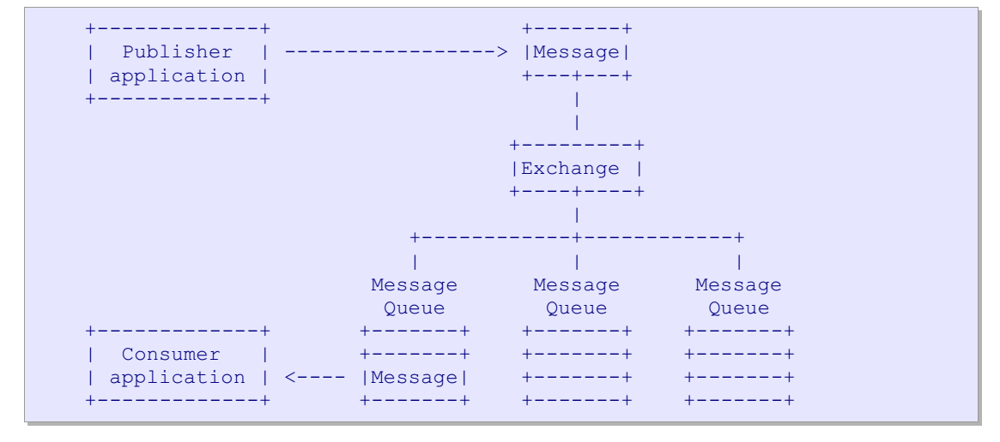

### 生命周期

#### 消息的生命周期

一个AMQP消息由一组属性和不透明的内容组成。一个新消息是由生产者应用程序通过使用AMQP client API来创建的.生产者将“内容”附着在消息中，并对其设置一些消息“属性”。然后，生产者将消息发送到服务器上的交换器中。 

当消息到达服务器时,交换器通常会将消息路由到存在于服务器上的消息队列中.<u>如果消息不能路由,交换器会默默地丢弃或者将其返回给生产者. 生产者可以选择如何来处理未路由消息．</u>

<u>单个消息可存在于多个消息队列(message queue). 服务器可以不同方式进行处理,如通过拷贝消息或通过引用计数器等. 这不影响互操作性。然而，当一个消息被路由到多个消息队列时，它在每个消息队列上都是一样的。没有独特的标识符来区分不同的副本。</u>

当消息到达消息队列时，消息队列会通过AMQP，立即尝试将消息传递给消费者应用程序.如果不行,消息队列会存储消息(按发布者要求存储在内存或磁盘中)，并等待消费者准备好.<u>如果没有消费者，消息队列通过AMQP将消息返回给生产者(再次地，如果生产者对此有要求的话).</u>

当消息队列把消息投递给消费者后，它会从内部缓冲区中删除消息.这有可能立即发生，也有可能在消费者应答它已成功处理之后删除.消费者可选择如何以及何时来应答消息.同样地， 消费者也可以拒绝消息(一个否定应答).

生产者消息和消费者应答可以组成事务. 当一个应用程序同时扮演两种角色时，通常它会做混合工作:发送消息和发送应答,然后提交或回滚事务.

在这个过程中，**生产者只能把所有消息发到一个单点（交换器），而不能直接把消息发到某个消息队列(message-queue)中。**

#### 交换器(exchange)的生命周期

每个AMQP服务端都会自己创建一些交换器，这些不能被销毁。AMQP程序也可以创建其自己的交换器。<u>AMQP并不使用 `create` 这个方法，而是使用 `declare` 方法来表示：如果不存在，则创建，存在了则继续。</u>程序可以创建交换器用于私有使用，并在任务完成后销毁它们。虽然AMQP提供了销毁交换器的方法，但一般来讲程序不需要销户它。

#### 队列(queue)的生命周期

队列分为两种，

- **持久化消息队列**：由很多消费者共享。当消费者都退出后，队列依然存在，并会继续收集消息。
- **临时消息队列：**临时消息队列对于消费者是私有和绑定的。当消费者断开连接，则消息队列被删除。

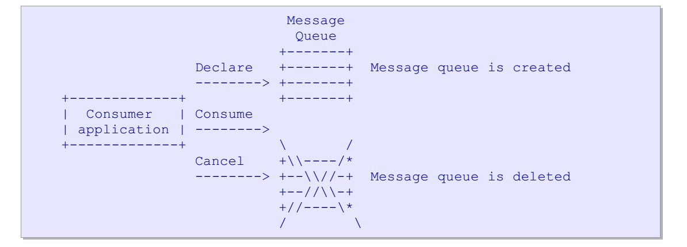

### AMQP命令架构

中间件复杂度很高，所以设计协议时的挑战是要驯服其复杂性。AMQP采用方法是基于类来建立传统API模型。类中包含方法，并定义了方法明确应该做什么。

AMQP中有两种不同的方式进行对话：

- 同步请求-响应。一个节点发送请求，另一个阶段发送响应。适用于性能不重要的方法。**发送同步请求时，该节点直到收到回复后，才能发送下一个请求**
- 异步通知。一个节点发送数据，但是不期待回复。一般用于性能很重要的地方。异步请求会尽可能快的发送消息，不等待确认。只在需要的时候在更上层（比如消费者层）实现限流等功能。AMQP中可以没有确认，要么成功，要么就会收到关闭Channel或者连接的异常。如果需要明确的追踪成功或者失败，那么应该使用事务。

> 这里就很协议了，写的很抽象。基本上就是在表达：这里需要下面单独的解释一下，到底是指什么意思。

AMQP 0-9-1 由许多方法（methods）构成。方法即是操作，这跟面向对象编程中的方法没半毛钱关系。AMQP 的方法被分组在类（class）中。这里的类仅仅是对 AMQP 方法的逻辑分组而已。在 [AMQP 0-9-1 参考](https://www.rabbitmq.com/amqp-0-9-1-reference.html) 中有对 AMQP 方法的详细介绍。

让我们来看看交换机类，有一组方法被关联到了交换机的操作上。这些方法如下所示：

- exchange.declare
- exchange.declare-ok
- exchange.delete
- exchange.delete-ok

（请注意，RabbitMQ 网站参考中包含了特用于 RabbitMQ 的交换机类的扩展，这里我们不对其进行讨论）

以上的操作来自逻辑上的配对：exchange.declare 和 exchange.declare-ok，exchange.delete 和 exchange.delete-ok. 这些操作分为 “请求 - requests”（由客户端发送）和 “响应 - responses”（由代理发送，用来回应之前提到的“请求”操作）。

如下的例子：客户端要求消息代理使用 exchange.declare 方法声明一个新的交换机：


如上图所示，exchange.declare 方法携带了好几个参数。这些参数可以允许客户端指定交换机名称、类型、是否持久化等等。

操作成功后，消息代理使用 exchange.declare-ok 方法进行回应：

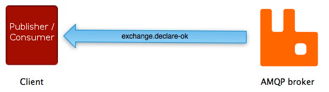

exchange.declare-ok 方法除了通道号之外没有携带任何其他参数。

AMQP 队列类的配对方法 - queue.declare 方法和 queue.declare-ok 有着与其他配对方法非常相似的一系列事件：


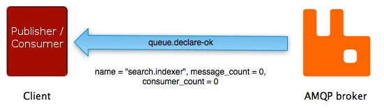

不是所有的 AMQP 方法都有与其配对的"另一半"。许多（basic.publish 是最被广泛使用的）都没有相对应的“响应”方法，另外一些（如 basic.get）有着一种以上与之对应的"响应"方法。

#### AMQP中的类

#### Connection类

**AMQP是一个长连接协议。Connection被设计为长期使用的，可以携带多个Channel。**Connection的生命周期是：

1. 客户端打开到服务端的TCP/IP连接，发送协议头。这是客户端发送的数据里，唯一不能被解析为方法的数据。
2. 服务端返回其协议版本、属性（比如支持的安全机制列表）。 `the Start method`
3. 客户端选择安全机制 `Start-Ok`
4. 服务端开始认证过程, 它使用[SASL](https://link.zhihu.com/?target=https%3A//www.wikiwand.com/zh/%E7%AE%80%E5%8D%95%E8%AE%A4%E8%AF%81%E4%B8%8E%E5%AE%89%E5%85%A8%E5%B1%82)的质询-响应模型（challenge-response model）。它向客户端发送一个质询 `Secure`
5. 客户端向服务端发送一个认证响应`Secure-Ok`。比如，如果使用 `plain` 认证机制，则响应会包含登录名和密码
6. 客户端重复质询`Secure`或转到协商步骤，发送一系列参数，如最大帧大小 `Tune`
7. 客户端接受，或者调低这些参数 `Tune-Ok`
8. 客户端正式打开连接，并选择一个Vhost `Open`
9. 服务端确认VHost有效 `Open-Ok`
10. 客户端可以按照预期使用连接
11. 当一个节点打算结束连接 `Close`
12. 另一个节点需要结束握手 `Close-Ok`
13. 服务端和客户端关闭Socket连接。

<u>如果在发送或者收到 `Open` 或者 `Open-Ok` 之前，某一个节点发现了一个错误，则必须直接关闭Socket，且不发送任何数据。</u>

#### Channel类

<u>**AMQP是一个多通道协议。**Channel提供了一种方式，在比较重的TCP/IP连接上建立多个轻量级的连接。</u>这会让协议对防火墙更加友好，因为端口使用是可预知的。它也意味着很容易支持流量调整和其他QoS特性。

<u>Channels相互是独立的，可以同步执行不同的功能。可用带宽会在当前活动之间共享。</u>

**这里期望也鼓励多线程客户端程序应该使用 `每个线程一个channel` 的模型。**不过，一个客户端在一个或多个AMQP服务端上打开多个连接也是可以的。

Channel的生命周期为：

1. 客户端打开一个新通道 `Open`
2. 服务端确认新通道准备就绪 `Open-Ok`
3. 客户端和服务端按预期来使用通道.
4. 一个节点关闭了通道 `Close`
5. 另一个节点对通道关闭进行握手 `Close-Ok`

#### Exchange类

**Exchange类能够让应用操作服务端的交换器。这个类能够让程序自己设置路由，而不是通过某些配置。**<u>不过大部分程序并不需要这个级别的复杂度，过去的中间件也不只支持这个语义。</u>

Exchange的生命周期为：

1. 客户端让服务端确保该exchange存在`Declare`。客户端可以细化为：“如果交换器不存在则进行创建” 或 “如果交换器不存在，警告我，不需要创建”
2. 客户端向Exchange发消息
3. 客户端也可以选择删掉Exchange `Delete`

#### Queue类

**该类用于让程序管理服务端上的消息队列。几乎所有的消费者应用都是基本步骤，至少要验证使用的消息队列是否存在。**

一个持久化消息队列的生命周期非常简单：

1. 客户端断言这个消息队列存在 `Declare`（设置 `passive` 参数）
2. 服务端确认消息队列存在 `Declare-Ok`
3. 客户端消息队列中读消息

一个临时消息队列的生命周期会更有趣些：

1. 客户端创建消息队列 `Declare`(不提供队列名称，服务器会分配一个名称)。服务端确认 `Declare-Ok`
2. 客户端在消息队列上启动一个消费者
3. 客户端取消消费，可以是显式取消，也可以是通过关闭通道或者连接连接隐式取消的
4. 当最后一个消费者从消息队列中消失的时候，在过了**礼貌性超时后(翻译的也是很神奇)**，服务端会删除消息队列

AMQP实现了Topic订阅的分发模型。这可以让订阅在合作的订阅者间进行负载均衡。涉及到额外的绑定阶段的生命周期：

1. 客户端创建一个队列`Declare`，服务端确认`Declare-Ok`
2. 客户端绑定消息队列到一个topic exchange上`Bind`，服务端确认`Bind-Ok`
3. 客户端像之前一样使用消息队列。

#### **Basic类**

Basic实现本规范中描述的消息功能。支持如下语义：

- 从客户端→服务端发消息。**异步**`Publish`
- 开始或者停止消费`Consume`，`Cancel`
- 从服务端到客户端发消息。**异步**`Deliver`，`Return`
- 确认消息`Ack`，`Reject`
- 同步的从消息队列中读取消息`Get`

#### **事务类**

AMQP支持两种类型的事务：

1. **自动事务：**每个发布的消息和应答都处理为独立事务．
2. **服务端本地事务：**服务器会缓存发布的消息和应答，并会根据需要由client来提交它们．

Transaction 类(“tx”) 使应用程序可访问第二种类型，即服务器事务。这个类的语义是：

1. 应用程序要求服务端事务，在需要的每个channel里`Select`
2. 应用程序做一些工作`Publish`， `Ack`
3. 应用程序提交或回滚工作`Commit`，`Roll-back`
4. 应用程序正常工作，循环往复。

**事务包含发布消息和ack，不包含分发。所以，回滚并不能重入队列或者重新分发任何消息。客户端有权在事务中确认这些消息。**

### AMQP传输架构

AMQP是一个二进制协议。有不同类型的帧`frame` 构成。帧会携带协议的方法以及其他信息。所有的帧都有相同的基本结构，即：帧头，payload，帧尾。payload格式取决于帧的类型。

我们假设使用的是面向流的可靠网络层（比如TCP/IP）。单个Socket连接上可以有多个独立的控制线程，也就是通道`Channel`。不同的通道共享一个连接，每个通道上的帧都是按严格的顺序排列，这样可以用一个状态机来解析协议。

传输层（wire-level）的格式被设计为扩展性强、且足够通用，可以用于任何更高层的协议（不仅仅是AMQP）。我们假设AMQP是会被扩展、优化的。

主要涉及这几个部分：**数据类型、协议协商、分帧方式、帧细节、方法帧、内容帧、心跳帧、错误处理、通道与连接的关闭。**

#### 数据类型

AMQP的数据类型用于方法帧中，他们有

- 整数（1-8个字节），表示大小，数量，范围等。全都是无符号整数
- Bits。用于表示为开/关值，会被封包为字节。
- 短字符串。用于存放短的文本属性。最多255字节，解析时不用担心缓冲区溢出。
- 长字符串：用于存放二进制数据块
- 字段表（Field Table），用于存放键值对、

#### 协议协商

客户端连接时，和服务端协商可接受的配置。当两个节点达成一致后，连接才能继续使用。通过协商，可以让我们断言假设和前提条件。主要协商这几方面的信息

- 实现的协议和版本。服务端可能会在同一端口提供多种协议的支持
- 加密参数和验证
- 最大帧尺寸、Channel的数量、某些操作的限制。

如果协商达成一致，双方会根据协商预分配缓冲区避免死锁。传入的帧如果满足协商条件，则认为其实安全的。如果超过了，那么另一方必须断开连接。

#### 分帧方式

TCP/IP是流协议。没有内置的分帧机制。现有的协议一般有这几种方式进行分帧：

- 每个连接只发送一个帧。简单，但是慢。
- 在流中加入分隔符来分帧。简单，但是解析较慢（因为需要不断的读取，去寻找分隔符）
- 计算帧的尺寸，并在每个帧之前发送尺寸。简单且快速。也是AMQP的选择

#### 帧细节

所有的帧都由一个头(header,7个字节),任意大小的负载(payload),和一个检测错误的帧结束（frame-end）字节组成:

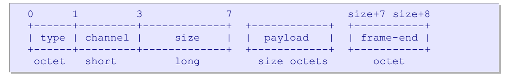

要读取一个帧，我们必须:

1. 读取header,检查帧类型(frame type)和通道(channel).

2. 根据帧类型，我们读取负载并进行处理.

3. 读取帧结束字节.

在实际实现中，如果性能很关键的话，我们应该使用读前缓冲（read-ahead buffering）”或“收集读取（gathering reads）”，以避免为了读一个帧而做三次独立的系统调用。

##### 方法帧

方法帧可以携带高级协议命令(我们称之为方法(methods)).一个方法帧携带一个命令. 方法帧负载有下面的格式:

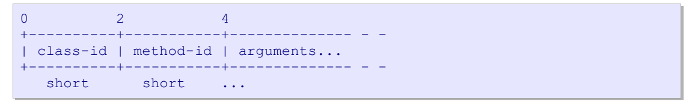

处理方式：

1. 读取方法帧的payload
2. 解包为结构
3. 检查方法在当前上下文中是否允许
4. 检查参数是否有效
5. 执行方法。

方法帧是由AMQP数据字段组成。编码代码可以直接从协议规范中生成，速度非常快。

##### 内容帧

内容是端到端直接发送的应用数据。内容由一系列属性和二进制数据组成。其中一系列的属性组成了 ”内容帧的帧头“。而二进制数据，可以是任意大小，它可能被拆分成多个块发送，每个块是一个 `content-body帧`

一些方法（比如 `Basic.Publish`，`Basic.Deliver`）是会携带内容的。当一个节点发送像这样的方法帧时，它总是会遵循一个内容头帧(conent header frame)和零个或多个内容体帧(content body frame)的形式。一个内容帧的帧头如下结构：


我们将内容体放置在不同的帧中(并不包含在方法中)，因此AMQP可支持零拷贝技术，这样其内容就不需要编组或编码. 我们将内容属性安放在它们自己的帧中，以便收件人可以有选择地丢弃他们不想处理的内容。

> ???????

##### 心跳帧

心跳是一种设计用来撤销(undo)TCP/IP功能的技术,也就是说在长时间超时后，它有能力通过关闭broker物理连接来进行恢复．在某些情景下，我们需要快速知道节点连接是否断开了，或者是由于什么原因不能响应了.因为心跳可以在较低水平上进行，我们在传输层次上按节点交换的特定帧类型来处理，而不是按类方法.

##### 错误处理

AMQP使用异常来处理错误.任何操作错误(未找到消息队列，访问权限不足)都会导致一个通道异常.

 任何结构化的错误(无效参数，坏序列的方法.)都会导致一个连接异常.异常会关闭通道或连接，同时也会向客户端应用返回响应码和响应文本.

<u>我们使用了类似于HTTP等协议和其它大多数协议中的三位回复代码和文字回复文本方案.</u>

##### 关闭通道和连接

连接或通道，对于客户端来说，当其发送Open时则被认为是“打开”的，对于服务器端来说，当其发送Open-Ok时则被认为是打开的。基于这一点，一个希望关闭通道或连接的对等体也必须使用握手协议来这样做。可出于任何原因，可能会正常地或异常地关闭一个通道或连接-因此必须仔细小心。

对于突然或意外关闭，并不能得到快速探测，因此当发生异常时，我们可能会丢失错误回复代码。

正确的设计是对于所有关闭必须进行握手，使我们关闭后对方知道相应的情况。当一个节点决定关闭一个通道或连接时，它发送一个Close方法。接收节点必须使用Close-Ok来响应Close,然后双方可以关闭他们的通道或连接。<u>请注意，如果节点忽略了关闭，当两个节点同时发送Close时,可能会发生死锁。</u>

## RabbitMQ的一些特征

### 消息分发机制

**RabbitMQ 分发消息默认采用的轮训分发。**

但是在某种场景下这种策略并不是很好，当有两个消费者在处理任务时，其中有个消费者 处理任务的速度非常快，而另外一个消费者处理速度却很慢，这个时候我们还是采用轮训分发就会导致这处理速度快的这个消费者很大一部分时间处于空闲状态。我们可以通过修改消息分发德默认机制，来达到优化目的；

**通过设置参数 `channel.basicQos(1);`实现不公平分发策略使得能者多劳；** 在Spring中， RabbitListenerContainerFactory也可以通过配置：prefetchCount来配置不公平分发策略。

### 消息的确认机制

> 详情可以看官网文档：[Consumer Acknowledgements and Publisher Confirms](https://www.rabbitmq.com/confirms.html)

#### 发送端

RabbitMQ通过 publisher confirm 机制来实现的消息发送端确认。生产者将信道设置成confirm(确认)模式，一旦信道进入confirm 模式，所有在该信道上⾯面发布的消息都会被指派一个唯一的ID(从 1 开始)，一旦消息被投递到所有匹配的队列之后 (如果消息和队列是持久化的，那么确认消息会在消息持久化后发出)，RabbitMQ 就会发送一个确认(Basic.Ack)给生产者(包含消息的唯一ID)，这样生产者就知道消息已经正确送达了。

#### 消费端

这里比较简单，即客户端显式ACK。

但是，因为目前大家都喜欢通过Spring boot来使用Rabbitmq的客户端。所以一定要注意一些默认配置是否符合大家的预期。这里就不展开了，详细内容，大家可以参考文档：[Spring AMQP](https://docs.spring.io/spring-amqp/reference/html/), 这份文档，足够大家了解目前Spring给大家提供了哪些配置。如果对配置尤其感兴趣，可以前往具体章节：[4.1.17. Message Listener Container Configuration](https://docs.spring.io/spring-amqp/reference/html/#containerAttributes)

### 事务

Spring 提供了对RabbitMQ原生的事务的平台性支持。

具体AMQP的事务实现逻辑，可以自行探索。具体涉及两块逻辑：1、消费消息的事务性；2、消息发送的事务性。

## RabbitMQ的特征、高级特性

### 过期时间TTL


### 死信队列


### 延迟队列


### 高可用


## RabbitMQ的实现原理

### @RabbitListener生效的过程

#### 生成Endpoint

我们需要解释一下Spring是怎么一步步在上下文里面生成这个业务逻辑的。

**@RabbitListener的处理器是RabbitListenerAnnotationBeanPostProcessor**

RabbitListenerAnnotationBeanPostProcessor实现了BeanPostProcessor， 具体可以自行前往查询作用。这里简单介绍一下：该接口我们也叫后置处理器，作用是在Bean对象在实例化和[依赖注入](https://so.csdn.net/so/search?q=依赖注入&spm=1001.2101.3001.7020)完毕后，在显示调用初始化方法的前后添加我们自己的逻辑。注意是Bean实例化完毕后及依赖注入完成后触发的。

```java
public interface BeanPostProcessor {

	/**
	 * 实例化、依赖注入完毕，在调用显示的初始化之前完成一些定制的初始化任务
	 */
	@Nullable
	default Object postProcessBeforeInitialization(Object bean, String beanName) throws BeansException {
		return bean;
	}

	/**
	 * 实例化、依赖注入、初始化完毕时执行 
	 */
	@Nullable
	default Object postProcessAfterInitialization(Object bean, String beanName) throws BeansException {
		return bean;
	}
}
```

RabbitListenerAnnotationBeanPostProcessor使用的是 `org.springframework.amqp.rabbit.annotation.RabbitListenerAnnotationBeanPostProcessor#postProcessAfterInitialization`方法。 其主要的执行逻辑是：

1. 先查询出全部带有RabbitListener注解的方法。
2. 对每一个方法，执行具体的Listener过程。

这里查询标有@RabbitListener的方法，可以看到他有三种条件，都会被过滤出来：

1. 方法标有@RabbitListener
2. 类标有@RabbitListener, 然后在方法上加@RabbitHandler注解。这种方式下，具体的消费消息的执行逻辑是在@RabbitHandler里面执行的。
3. 标有@RabbitListeners， 这是一个组合注解，可以合并多个@RabbitListener。

```java
public class RabbitListenerAnnotationBeanPostProcessor
		implements BeanPostProcessor, Ordered, BeanFactoryAware, BeanClassLoaderAware, EnvironmentAware,
		SmartInitializingSingleton {

	@Override
	public Object postProcessAfterInitialization(final Object bean, final String beanName) throws BeansException {
		Class<?> targetClass = AopUtils.getTargetClass(bean);
        // 这里
		final TypeMetadata metadata = this.typeCache.computeIfAbsent(targetClass, this::buildMetadata);
		for (ListenerMethod lm : metadata.listenerMethods) {
			for (RabbitListener rabbitListener : lm.annotations) {
                // 这里对每一个方法，执行具体的Listener过程。
				processAmqpListener(rabbitListener, lm.method, bean, beanName);
			}
		}
		if (metadata.handlerMethods.length > 0) {
			processMultiMethodListeners(metadata.classAnnotations, metadata.handlerMethods, bean, beanName);
		}
		return bean;
	}

	protected Collection<Declarable> processAmqpListener(RabbitListener rabbitListener, Method method, Object bean,
			String beanName) {
		Method methodToUse = checkProxy(method, bean);
		MethodRabbitListenerEndpoint endpoint = new MethodRabbitListenerEndpoint();
		endpoint.setMethod(methodToUse);
		return processListener(endpoint, rabbitListener, bean, methodToUse, beanName);
	}

    // 这里比较长
    protected Collection<Declarable> processListener(MethodRabbitListenerEndpoint endpoint,
			RabbitListener rabbitListener, Object bean, Object target, String beanName) {

		final List<Declarable> declarables = new ArrayList<>();
		endpoint.setBean(bean);
		endpoint.setMessageHandlerMethodFactory(this.messageHandlerMethodFactory);
		endpoint.setId(getEndpointId(rabbitListener));
		List<Object> resolvedQueues = resolveQueues(rabbitListener, declarables);
		if (!resolvedQueues.isEmpty()) {
			if (resolvedQueues.get(0) instanceof String) {
				endpoint.setQueueNames(resolvedQueues.stream()
						.map(o -> (String) o)
						.collect(Collectors.toList()).toArray(new String[0]));
			}
			else {
				endpoint.setQueues(resolvedQueues.stream()
						.map(o -> (Queue) o)
						.collect(Collectors.toList()).toArray(new Queue[0]));
			}
		}
		endpoint.setConcurrency(resolveExpressionAsStringOrInteger(rabbitListener.concurrency(), "concurrency"));
		endpoint.setBeanFactory(this.beanFactory);
		endpoint.setReturnExceptions(resolveExpressionAsBoolean(rabbitListener.returnExceptions()));
		resolveErrorHandler(endpoint, rabbitListener);
		String group = rabbitListener.group();
		if (StringUtils.hasText(group)) {
			Object resolvedGroup = resolveExpression(group);
			if (resolvedGroup instanceof String) {
				endpoint.setGroup((String) resolvedGroup);
			}
		}
		String autoStartup = rabbitListener.autoStartup();
		if (StringUtils.hasText(autoStartup)) {
			endpoint.setAutoStartup(resolveExpressionAsBoolean(autoStartup));
		}

		endpoint.setExclusive(rabbitListener.exclusive());
		String priority = resolveExpressionAsString(rabbitListener.priority(), "priority");
		if (StringUtils.hasText(priority)) {
			try {
				endpoint.setPriority(Integer.valueOf(priority));
			}
			catch (NumberFormatException ex) {
				throw new BeanInitializationException("Invalid priority value for " +
						rabbitListener + " (must be an integer)", ex);
			}
		}

		resolveExecutor(endpoint, rabbitListener, target, beanName);
		resolveAdmin(endpoint, rabbitListener, target);
		resolveAckMode(endpoint, rabbitListener);
		resolvePostProcessor(endpoint, rabbitListener, target, beanName);
		resolveMessageConverter(endpoint, rabbitListener, target, beanName);
		resolveReplyContentType(endpoint, rabbitListener);
		RabbitListenerContainerFactory<?> factory = resolveContainerFactory(rabbitListener, target, beanName);

        // 这里是具体的注册过程。
		this.registrar.registerEndpoint(endpoint, factory);
		return declarables;
	}

}
```

**将每一个加@RabbitListener注解的方法构造一个`MethodRabbitListenerEndpoint`。**在方法`processListener()`方法中，做了这么几件事情：

1. 读取@RabbitListener注解中的值， 设置到`endpoint`中中去。
2. 属性设置完成后，调用了`RabbitListenerEndpointRegistrar`类的`registerEndpoint()`方法

```java
public class RabbitListenerEndpointRegistrar implements BeanFactoryAware, InitializingBean {
    
    private final List<AmqpListenerEndpointDescriptor> endpointDescriptors =
			new ArrayList<AmqpListenerEndpointDescriptor>();
    
	public void registerEndpoint(RabbitListenerEndpoint endpoint,
			@Nullable RabbitListenerContainerFactory<?> factory) {
		Assert.notNull(endpoint, "Endpoint must be set");
		Assert.hasText(endpoint.getId(), "Endpoint id must be set");
		Assert.state(!this.startImmediately || this.endpointRegistry != null, "No registry available");
		// Factory may be null, we defer the resolution right before actually creating the container
		AmqpListenerEndpointDescriptor descriptor = new AmqpListenerEndpointDescriptor(endpoint, factory);
		synchronized (this.endpointDescriptors) {
			if (this.startImmediately) { // Register and start immediately
				this.endpointRegistry.registerListenerContainer(descriptor.endpoint, // NOSONAR never null
						resolveContainerFactory(descriptor), true);
			}
			else {
				this.endpointDescriptors.add(descriptor);
			}
		}
	}
}
```

<u>这里根据startImmediately看是否需要立刻注册endpoint，或者先将其添加到一个List，稍后统一注册。</u> 因为立即注册和稍后统一注册的核心逻辑是一样的，这里我们讲一下，统一注册，是怎么注册的。

---

#### 注册MessageListenerContainer

<u>对于统一注册的实现，`RabbitListenerAnnotationBeanPostProcessor`类除了实现`BeanPostProcessor`以外，还实现了`SmartInitializingSingleton`接口，所以当`RabbitListenerAnnotationBeanPostProcessor`这个`bean`实例化完成之后会调用它的`afterSingletonsInstantiated()`方法:</u>

```java
public class RabbitListenerAnnotationBeanPostProcessor
		implements BeanPostProcessor, Ordered, BeanFactoryAware, BeanClassLoaderAware, EnvironmentAware,
		SmartInitializingSingleton {

	@Override
	public void afterSingletonsInstantiated() {
		this.registrar.setBeanFactory(this.beanFactory);

		if (this.beanFactory instanceof ListableBeanFactory) {
			Map<String, RabbitListenerConfigurer> instances =
					((ListableBeanFactory) this.beanFactory).getBeansOfType(RabbitListenerConfigurer.class);
			for (RabbitListenerConfigurer configurer : instances.values()) {
				configurer.configureRabbitListeners(this.registrar);
			}
		}

		if (this.registrar.getEndpointRegistry() == null) {
			if (this.endpointRegistry == null) {
				Assert.state(this.beanFactory != null,
						"BeanFactory must be set to find endpoint registry by bean name");
				this.endpointRegistry = this.beanFactory.getBean(
						RabbitListenerConfigUtils.RABBIT_LISTENER_ENDPOINT_REGISTRY_BEAN_NAME,
						RabbitListenerEndpointRegistry.class);
			}
			this.registrar.setEndpointRegistry(this.endpointRegistry);
		}

		if (this.defaultContainerFactoryBeanName != null) {
			this.registrar.setContainerFactoryBeanName(this.defaultContainerFactoryBeanName);
		}

		// Set the custom handler method factory once resolved by the configurer
		MessageHandlerMethodFactory handlerMethodFactory = this.registrar.getMessageHandlerMethodFactory();
		if (handlerMethodFactory != null) {
			this.messageHandlerMethodFactory.setMessageHandlerMethodFactory(handlerMethodFactory);
		}

        // 执行逻辑
		// Actually register all listeners
		this.registrar.afterPropertiesSet();

		// clear the cache - prototype beans will be re-cached.
		this.typeCache.clear();
	}

}
```

因为之前已经将所有的endpoint添加到了`RabbitListenerEndpointRegistrar`类中的一个List中了，所以这里调用`RabbitListenerEndpointRegistrar`类的`afterPropertiesSet()`方法进行统一注册：

```java
public class RabbitListenerEndpointRegistrar implements BeanFactoryAware, InitializingBean {

	@Override
	public void afterPropertiesSet() {
		registerAllEndpoints();
	}

	protected void registerAllEndpoints() {
		Assert.state(this.endpointRegistry != null, "No registry available");
		synchronized (this.endpointDescriptors) {
			for (AmqpListenerEndpointDescriptor descriptor : this.endpointDescriptors) {
				if (descriptor.endpoint instanceof MultiMethodRabbitListenerEndpoint && this.validator != null) {
					((MultiMethodRabbitListenerEndpoint) descriptor.endpoint).setValidator(this.validator);
				}
				this.endpointRegistry.registerListenerContainer(// NOSONAR never null
						descriptor.endpoint, resolveContainerFactory(descriptor));
			}
			this.startImmediately = true;  // trigger immediate startup
		}
	}

}
```

可以看到，核心的注册逻辑是在这里的：`endpointRegistry.registerListenerContainer(descriptor.endpoint, resolveContainerFactory(descriptor))`, 基本上可以理解成是一个一个的注册`endpoint`。

```java
public class RabbitListenerEndpointRegistry implements DisposableBean, SmartLifecycle, ApplicationContextAware,
		ApplicationListener<ContextRefreshedEvent> {

    public void registerListenerContainer(RabbitListenerEndpoint endpoint, RabbitListenerContainerFactory<?> factory) {
		registerListenerContainer(endpoint, factory, false);
	}
       
	public void registerListenerContainer(RabbitListenerEndpoint endpoint, RabbitListenerContainerFactory<?> factory,
				boolean startImmediately) {
		Assert.notNull(endpoint, "Endpoint must not be null");
		Assert.notNull(factory, "Factory must not be null");

		String id = endpoint.getId();
		Assert.hasText(id, "Endpoint id must not be empty");
		synchronized (this.listenerContainers) {
			Assert.state(!this.listenerContainers.containsKey(id),
					"Another endpoint is already registered with id '" + id + "'");\
            // 这里关联到了MessageListenerContainer
			MessageListenerContainer container = createListenerContainer(endpoint, factory);
			this.listenerContainers.put(id, container);
			if (StringUtils.hasText(endpoint.getGroup()) && this.applicationContext != null) {
				List<MessageListenerContainer> containerGroup;
				if (this.applicationContext.containsBean(endpoint.getGroup())) {
					containerGroup = this.applicationContext.getBean(endpoint.getGroup(), List.class);
				}
				else {
					containerGroup = new ArrayList<MessageListenerContainer>();
					this.applicationContext.getBeanFactory().registerSingleton(endpoint.getGroup(), containerGroup);
				}
				containerGroup.add(container);
			}
			if (this.contextRefreshed) {
				container.lazyLoad();
			}
			if (startImmediately) {
				startIfNecessary(container);
			}
		}
	}      
            
}
```

这里面核心的事情有两件：

1. 创建了一个对象`MessageListenerContainer`
2. 把这个`MessageListenerContainer`注册到Spring上下文里面去了.

可见，注册endpoint，实际上就是RabbitListenerContainerFactory将每一个endpoint都创建成MessageListenerContainer（具体创建过程，由RabbitListenerContainerFactory类自己去完成），然后根据startImmediately参数判断是否调用startIfNecessary()方法立即启动MessageListenerContainer。

> 当然，在最后一步，我们看到了是否需要立即启动，逻辑也是一样的，我们后面再讲是怎么启动的。这里面调用的是：`org.springframework.amqp.rabbit.listener.AbstractMessageListenerContainer#start`, 但是实际上MessageListenerContainer实现了`SmartLifecycle`接口，所以在`spring context refresh`的最后一步会去调用`start()`方法。后面再讲。

**MessageListenerContainer的创建**

顺着`createListenerContainer(endpoint, factory);`方法往下走:

```java

	@Override
	public C createListenerContainer(RabbitListenerEndpoint endpoint) {
		//1.
        C instance = createContainerInstance();
		//。。。 设置instance， 忽略掉
        
        //2. 
        applyCommonOverrides(endpoint, instance);

        //3. 
		initializeContainer(instance, endpoint);

		if (this.containerCustomizer != null) {
			this.containerCustomizer.configure(instance);
		}

		return instance;  
	}

```

这里面有至关重要的两步：

1. <u>创建`MessageListenerContainer`</u>
2. <u>做一些初始化的setup工作（创建了 MessageListener）</u>

我们需要一个一个的展开说一下，创建container最后调用到类`SimpleRabbitLisenerContainerFactory`：

```
public class SimpleRabbitListenerContainerFactory
		extends AbstractRabbitListenerContainerFactory<SimpleMessageListenerContainer> {

	@Override
	protected SimpleMessageListenerContainer createContainerInstance() {
		return new SimpleMessageListenerContainer();
	}
}
```

#### 创建MessageListener

初始化的Setup工作，实际上会创建MessageListener， 中间的过程就不展开了，这里写一下调用链：

1. `org.springframework.amqp.rabbit.config.BaseRabbitListenerContainerFactory#applyCommonOverrides`
2. `org.springframework.amqp.rabbit.listener.AbstractRabbitListenerEndpoint#setupListenerContainer`
3. `org.springframework.amqp.rabbit.listener.AbstractRabbitListenerEndpoint#setupMessageListener`
4. `org.springframework.amqp.rabbit.listener.AbstractRabbitListenerEndpoint#createMessageListener`

所以这里我们看到方法里创建了MessageListener，并将其设置到MessageListenerContainer里面去。createMessageListener()方法有两个实现，实际调用的是MethodRabbitListenerEndpoint类里面的实现：

```java
public class MethodRabbitListenerEndpoint extends AbstractRabbitListenerEndpoint {


	@Override
	protected MessagingMessageListenerAdapter createMessageListener(MessageListenerContainer container) {
		Assert.state(this.messageHandlerMethodFactory != null,
				"Could not create message listener - MessageHandlerMethodFactory not set");
		MessagingMessageListenerAdapter messageListener = createMessageListenerInstance();
		messageListener.setHandlerAdapter(configureListenerAdapter(messageListener));
		String replyToAddress = getDefaultReplyToAddress();
		if (replyToAddress != null) {
			messageListener.setResponseAddress(replyToAddress);
		}
		MessageConverter messageConverter = getMessageConverter();
		if (messageConverter != null) {
			messageListener.setMessageConverter(messageConverter);
		}
		if (getBeanResolver() != null) {
			messageListener.setBeanResolver(getBeanResolver());
		}
		return messageListener;
	}
}
```

> 关键代码是：
>
> ```java
> 		MessagingMessageListenerAdapter messageListener = createMessageListenerInstance();
> 		messageListener.setHandlerAdapter(configureListenerAdapter(messageListener));
> ```

看到setHandlerMethod(configureListenerAdapter(messageListener))这一行，这里创建并设置了一个HandlerAdapter，这个HandlerAdapter能够调用我们加了@RabbitListener注解的方法。

---

#### 启动消费者

通过前面，我们知道了：

1. 读取@RabbitListener注解中的值， 设置到`endpoint`中中去。然后去注册`endpoint`。
2. 在注册阶段，会在`endpointRegistry`把每一个`endpoint`都注册成一个`MessageListenerContainer`。
3. 创建MessageListener，并将其设置到MessageListenerContainer里面去。

到目前为止，消费者，还是没有启动起来，但是我们需要的很多对象都已经ready了。所以我们看一下消费者是在哪里开启消费的。 `RabbitListenerEndpointRegistry`实现了`SmartLifecycle`接口，所以在`spring context refresh`的最后一步会去调用`start()`方法：

```java
public abstract class AbstractMessageListenerContainer extends RabbitAccessor
		implements MessageListenerContainer, ApplicationContextAware, BeanNameAware, DisposableBean,
		ApplicationEventPublisherAware {

	@Override
	public void start() {

		try {
			logger.debug("Starting Rabbit listener container.");
			configureAdminIfNeeded();
			checkMismatchedQueues();
            // 链路
			doStart();
		}

    
}
```

实际的执行器是SimpleMessageListenerContainer的doStart()方法：

```java
	protected void doStart() {
		Assert.state(!this.consumerBatchEnabled || getMessageListener() instanceof BatchMessageListener
				|| getMessageListener() instanceof ChannelAwareBatchMessageListener,
				"When setting 'consumerBatchEnabled' to true, the listener must support batching");
		checkListenerContainerAware();
		super.doStart();
		synchronized (this.consumersMonitor) {
			if (this.consumers != null) {
				throw new IllegalStateException("A stopped container should not have consumers");
			}
			int newConsumers = initializeConsumers();
			if (this.consumers == null) {
				logger.info("Consumers were initialized and then cleared " +
						"(presumably the container was stopped concurrently)");
				return;
			}
			if (newConsumers <= 0) {
				if (logger.isInfoEnabled()) {
					logger.info("Consumers are already running");
				}
				return;
			}
			Set<AsyncMessageProcessingConsumer> processors = new HashSet<AsyncMessageProcessingConsumer>();
			for (BlockingQueueConsumer consumer : this.consumers) {
				AsyncMessageProcessingConsumer processor = new AsyncMessageProcessingConsumer(consumer);
				processors.add(processor);
				getTaskExecutor().execute(processor);
				if (getApplicationEventPublisher() != null) {
					getApplicationEventPublisher().publishEvent(new AsyncConsumerStartedEvent(this, consumer));
				}
			}
			waitForConsumersToStart(processors);
		}
	}
```

关键性代码有两个点：

> 1. int newConsumers = initializeConsumers();
>
>    这个方法创建了BlockingQueueConsumer，数量等于concurrentConsumers参数的配置。
>
> 2. getTaskExecutor().execute(processor)
>
>    前面用BlockingQueueConsumer创建了AsyncMessageProcessingConsumer（实现了Runnable接口），这里获取到Executor来执行，每一个MessageListenerContainer都有各自的Executor。

```java
	private final class AsyncMessageProcessingConsumer implements Runnable {

		private static final int ABORT_EVENT_WAIT_SECONDS = 5;

		private final BlockingQueueConsumer consumer;

		private final CountDownLatch start;

		private volatile FatalListenerStartupException startupException;

		private int consecutiveIdles;

		private int consecutiveMessages;


		@Override // NOSONAR - complexity - many catch blocks
		public void run() { // NOSONAR - line count
            // ...

			try {
				initialize();
				while (isActive(this.consumer) || this.consumer.hasDelivery() || !this.consumer.cancelled()) {
					mainLoop();
				}
			}
            // ...
        }
        
        
		private void mainLoop() throws Exception { // NOSONAR Exception
			try {
				boolean receivedOk = receiveAndExecute(this.consumer); // At least one message received
				if (SimpleMessageListenerContainer.this.maxConcurrentConsumers != null) {
					checkAdjust(receivedOk);
				}
            }
            // ...
        }
        
        	private boolean receiveAndExecute(final BlockingQueueConsumer consumer) throws Exception { // NOSONAR

		PlatformTransactionManager transactionManager = getTransactionManager();
		if (transactionManager != null) {
			try {
				if (this.transactionTemplate == null) {
					this.transactionTemplate =
							new TransactionTemplate(transactionManager, getTransactionAttribute());
				}
				return this.transactionTemplate
						.execute(status -> { // NOSONAR null never returned
							RabbitResourceHolder resourceHolder = ConnectionFactoryUtils.bindResourceToTransaction(
									new RabbitResourceHolder(consumer.getChannel(), false),
									getConnectionFactory(), true);
							// unbound in ResourceHolderSynchronization.beforeCompletion()
							try {
								return doReceiveAndExecute(consumer);
							}
							catch (RuntimeException e1) {
								prepareHolderForRollback(resourceHolder, e1);
								throw e1;
							}
							catch (Exception e2) {
								throw new WrappedTransactionException(e2);
							}
						});
			}
			catch (WrappedTransactionException e) { // NOSONAR exception flow control
				throw (Exception) e.getCause();
			}
		}

		return doReceiveAndExecute(consumer);

	}
    
    private boolean doReceiveAndExecute(BlockingQueueConsumer consumer) throws Exception { //NOSONAR

		for (int i = 0; i < this.batchSize; i++) {

			logger.trace("Waiting for message from consumer.");
			Message message = consumer.nextMessage(this.receiveTimeout);
			if (message == null) {
				break;
			}

			else {
				messages = debatch(message);
				if (messages != null) {
					break;
				}
				try {
                    // 逻辑处理点
					executeListener(channel, message);
				}
                // ....
            }
        }
				
		if (messages != null) {
			executeWithList(channel, messages, deliveryTag, consumer);
		}

		return consumer.commitIfNecessary(isChannelLocallyTransacted());

	}
        
```

<u>SimpleMessageListenerContainer接收消息的实现方案是：**用一个BlockingQueue保存rabbitmq发过来还未来得及处理的消息，然后向Executor提交执行Runnable，Runnable中循环从BlockingQueue里面取消息。**</u>

> 关键代码：
>
> executeListener(channel, message)， 这个方法是我们执行业务逻辑代码的入口。

这里我们也知道消费者是怎么启动起来消费的了。

---

#### Consumer调用业务代码

那么消费者是如何调用到@RabbitListener方法的呢？我们通过`executeListener(channel, message);`继续往下看：

前面的执行链我就一笔带过：

1. `org.springframework.amqp.rabbit.listener.AbstractMessageListenerContainer#executeListener`
2. `org.springframework.amqp.rabbit.listener.AbstractMessageListenerContainer#doExecuteListener`
3. `org.springframework.amqp.rabbit.listener.AbstractMessageListenerContainer#invokeListener`
4. `org.springframework.amqp.rabbit.listener.AbstractMessageListenerContainer#actualInvokeListener`
5. `org.springframework.amqp.rabbit.listener.AbstractMessageListenerContainer#doInvokeListener)`

```java
public abstract class AbstractMessageListenerContainer extends RabbitAccessor
		implements MessageListenerContainer, ApplicationContextAware, BeanNameAware, DisposableBean,
		ApplicationEventPublisherAware {
        
	protected void doInvokeListener(ChannelAwareMessageListener listener, Channel channel, Object data) {

		Message message = null;
		RabbitResourceHolder resourceHolder = null;
		Channel channelToUse = channel;
		boolean boundHere = false;
		try {
			if (!isExposeListenerChannel()) {
				// We need to expose a separate Channel.
				resourceHolder = getTransactionalResourceHolder();
				channelToUse = resourceHolder.getChannel();
				/*
				 * If there is a real transaction, the resource will have been bound; otherwise
				 * we need to bind it temporarily here. Any work done on this channel
				 * will be committed in the finally block.
				 */
				if (isChannelLocallyTransacted() &&
						!TransactionSynchronizationManager.isActualTransactionActive()) {
					resourceHolder.setSynchronizedWithTransaction(true);
					TransactionSynchronizationManager.bindResource(this.getConnectionFactory(),
							resourceHolder);
					boundHere = true;
				}
			}
			else {
				// if locally transacted, bind the current channel to make it available to RabbitTemplate
				if (isChannelLocallyTransacted()) {
					RabbitResourceHolder localResourceHolder = new RabbitResourceHolder(channelToUse, false);
					localResourceHolder.setSynchronizedWithTransaction(true);
					TransactionSynchronizationManager.bindResource(this.getConnectionFactory(),
							localResourceHolder);
					boundHere = true;
				}
			}
			// Actually invoke the message listener...
			try {
				if (data instanceof List) {
					listener.onMessageBatch((List<Message>) data, channelToUse);
				}
				else {
					message = (Message) data;
					listener.onMessage(message, channelToUse);
				}
			}
			catch (Exception e) {
				throw wrapToListenerExecutionFailedExceptionIfNeeded(e, data);
			}
		}
		finally {
			cleanUpAfterInvoke(resourceHolder, channelToUse, boundHere); // NOSONAR channel not null here
		}
	}

}
```

这里就是我们之前说的比较重要的`MessageListener`， 之所以说重要，就是在这里重要。

> 关键性代码：

实际上这份代码，会被之前说的`MessagingMessageListenerAdapter`代理，内部的执行逻辑如下：

1. `org.springframework.amqp.rabbit.listener.adapter.MessagingMessageListenerAdapter#onMessage`
2. `org.springframework.amqp.rabbit.listener.adapter.MessagingMessageListenerAdapter#invokeHandlerAndProcessResult`
3. `org.springframework.amqp.rabbit.listener.adapter.MessagingMessageListenerAdapter#invokeHandler`

到这里，我们终于见到了HandlerAdapter， 这个HandlerAdapter，其最终的执行链路还有几步，我们都贴上去：

1. `org.springframework.amqp.rabbit.listener.adapter.HandlerAdapter#invoke`
2. `org.springframework.amqp.rabbit.listener.adapter.DelegatingInvocableHandler#invoke`
3. `org.springframework.messaging.handler.invocation.InvocableHandlerMethod#invoke`
4. `org.springframework.messaging.handler.invocation.InvocableHandlerMethod#doInvoke`

```java
	protected Object doInvoke(Object... args) throws Exception {
		try {
			return getBridgedMethod().invoke(getBean(), args);
		}
		catch (IllegalArgumentException ex) {
			assertTargetBean(getBridgedMethod(), getBean(), args);
			String text = (ex.getMessage() != null ? ex.getMessage() : "Illegal argument");
			throw new IllegalStateException(formatInvokeError(text, args), ex);
		}
		catch (InvocationTargetException ex) {
			// Unwrap for HandlerExceptionResolvers ...
			Throwable targetException = ex.getTargetException();
			if (targetException instanceof RuntimeException) {
				throw (RuntimeException) targetException;
			}
			else if (targetException instanceof Error) {
				throw (Error) targetException;
			}
			else if (targetException instanceof Exception) {
				throw (Exception) targetException;
			}
			else {
				throw new IllegalStateException(formatInvokeError("Invocation failure", args), targetException);
			}
		}
	}
```

这里通过getBridgedMethod()方法拿到的就是@RabbitListener注解的方法了，这是在刚开始处理@RabbitListener注解时就已经保存下来的，然后就可以利用反射来调用这个方法，这样就完成了接收并处理消息的整个流程。

#### 创建和管理Connnetion、Channel

#####  创建Connnection

1. `org.springframework.amqp.rabbit.listener.SimpleMessageListenerContainer.AsyncMessageProcessingConsumer#run`
2. `org.springframework.amqp.rabbit.listener.SimpleMessageListenerContainer.AsyncMessageProcessingConsumer#initialize`
3. `org.springframework.amqp.rabbit.listener.BlockingQueueConsumer#start`
4. `org.springframework.amqp.rabbit.connection.ConnectionFactoryUtils#getTransactionalResourceHolder(org.springframework.amqp.rabbit.connection.ConnectionFactory, boolean)`
5. `org.springframework.amqp.rabbit.connection.ConnectionFactoryUtils#getTransactionalResourceHolder(org.springframework.amqp.rabbit.connection.ConnectionFactory, boolean, boolean)`
6. `org.springframework.amqp.rabbit.connection.ConnectionFactoryUtils#doGetTransactionalResourceHolder`

> 关键代码：
>
> ```java
> if (channel == null && connection == null) {
> 				connection = resourceFactory.createConnection();
> 				if (resourceHolder == null) {
> 					/*
> 					 * While creating a connection, a connection listener might have created a
> 					 * transactional channel and bound it to the transaction.
> 					 */
> 					resourceHolder = (RabbitResourceHolder) TransactionSynchronizationManager
> 							.getResource(connectionFactory);
> 					if (resourceHolder != null) {
> 						channel = resourceHolder.getChannel();
> 						resourceHolderToUse = resourceHolder;
> 					}
> 				}
> 				resourceHolderToUse.addConnection(connection);
> 			}
> ```
>
> 这里会先创建一个connection。然后创建一个channel。
>
> 也会把connection交给`org.springframework.amqp.rabbit.connection.RabbitResourceHolder`类缓存当前connection。后面的使用如果查询到，会直接用，不用重新建立connection了。

但是创建Channel的过程又会深入一点：

在代码块：

```java
			if (channel == null) {
				channel = resourceFactory.createChannel(connection);
			}
			resourceHolderToUse.addChannel(channel, connection);

```

会创建Channel， 具体的过程如下：

1. `org.springframework.amqp.rabbit.connection.ConnectionFactoryUtils.RabbitResourceFactory#createChannel`
2. `org.springframework.amqp.rabbit.connection.CachingConnectionFactory.ChannelCachingConnectionProxy#createChannel`
3. `org.springframework.amqp.rabbit.connection.CachingConnectionFactory#getChannel`
4. `org.springframework.amqp.rabbit.connection.CachingConnectionFactory#getCachedChannelProxy`
5. `org.springframework.amqp.rabbit.connection.CachingConnectionFactory#createBareChannel`
6. `org.springframework.amqp.rabbit.connection.CachingConnectionFactory#doCreateBareChannel`
7. `org.springframework.amqp.rabbit.connection.CachingConnectionFactory.ChannelCachingConnectionProxy#createBareChannel`
8. `org.springframework.amqp.rabbit.connection.SimpleConnection#createChannel`
9. `com.rabbitmq.client.impl.AMQConnection#createChannel()`

这里我们就看到了，Spring调用到了 rabbitmq的client的创建channel的代码了。

**那么Spring是怎么管理的呢， 是通过类： `RabbitResourceHolder`来管理的。 我们后面会看到各种获取Channel等操作都是通过这个 `RabbitResourceHolder`来获取的。**代码在上面。

> 也需要注意的是，我们在执行的过程中，做了一些重要的工作。在CachingConnectionFactory里面，做了代理工作：
>
> ```java
> 	private ChannelProxy getCachedChannelProxy(ChannelCachingConnectionProxy connection,
> 			LinkedList<ChannelProxy> channelList, boolean transactional) { //NOSONAR LinkedList for addLast()
> 
> 		Channel targetChannel = createBareChannel(connection, transactional);
> 		if (logger.isDebugEnabled()) {
> 			logger.debug("Creating cached Rabbit Channel from " + targetChannel);
> 		}
> 		getChannelListener().onCreate(targetChannel, transactional);
> 		Class<?>[] interfaces;
> 		if (ConfirmType.CORRELATED.equals(this.confirmType) || this.publisherReturns) {
> 			interfaces = new Class<?>[] { ChannelProxy.class, PublisherCallbackChannel.class };
> 		}
> 		else {
> 			interfaces = new Class<?>[] { ChannelProxy.class };
> 		}
> 		return (ChannelProxy) Proxy.newProxyInstance(ChannelProxy.class.getClassLoader(),
> 				interfaces, new CachedChannelInvocationHandler(connection, targetChannel, channelList,
> 						transactional));
> 	}
> 
> ```
>
> 具体的代理工作，可以自行前往查询。`CachedChannelInvocationHandler`

##### 创建Channel

1. `org.springframework.amqp.rabbit.listener.SimpleMessageListenerContainer.AsyncMessageProcessingConsumer#run`
2. `org.springframework.amqp.rabbit.listener.SimpleMessageListenerContainer.AsyncMessageProcessingConsumer#initialize`
3. `org.springframework.amqp.rabbit.listener.BlockingQueueConsumer#start`

```java
	public void start() throws AmqpException {
		if (logger.isDebugEnabled()) {
			logger.debug("Starting consumer " + this);
		}

		this.thread = Thread.currentThread();

		try {
			this.resourceHolder = ConnectionFactoryUtils.getTransactionalResourceHolder(this.connectionFactory,
					this.transactional);
			this.channel = this.resourceHolder.getChannel();
			ClosingRecoveryListener.addRecoveryListenerIfNecessary(this.channel); // NOSONAR never null here
		}
		catch (AmqpAuthenticationException e) {
			throw new FatalListenerStartupException("Authentication failure", e);
		}
		this.deliveryTags.clear();
		this.activeObjectCounter.add(this);

		passiveDeclarations();
		setQosAndCreateConsumers();
	}
```

---

### SimpleRabbitListenerContainerFactory - DirectRabbitListenerContainerFactory


Channel的作用


## 引用

1. [RabbitMQ（一）：RabbitMQ快速入门](https://www.cnblogs.com/sgh1023/p/11217017.html)
2. [AMQP](https://amqp.org)
3. [Consumer Acknowledgements and Publisher Confirms](https://www.rabbitmq.com/confirms.html)
3. [Spring AMQP](https://docs.spring.io/spring-amqp/reference/html/)
