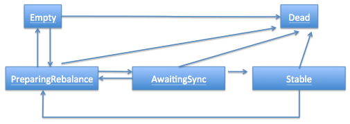
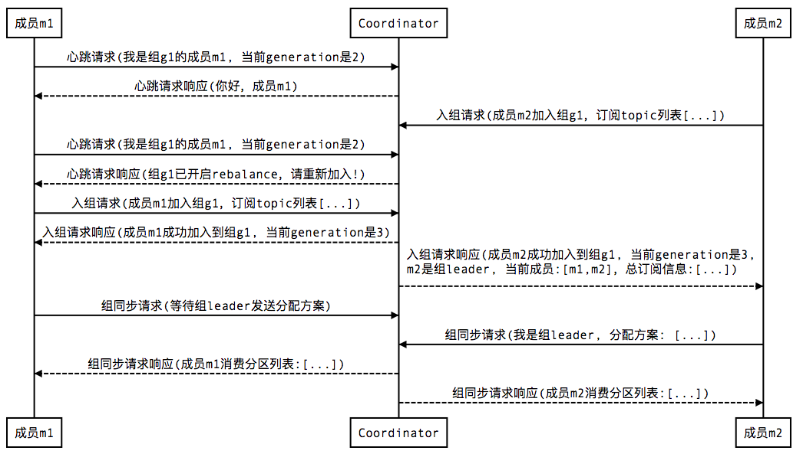
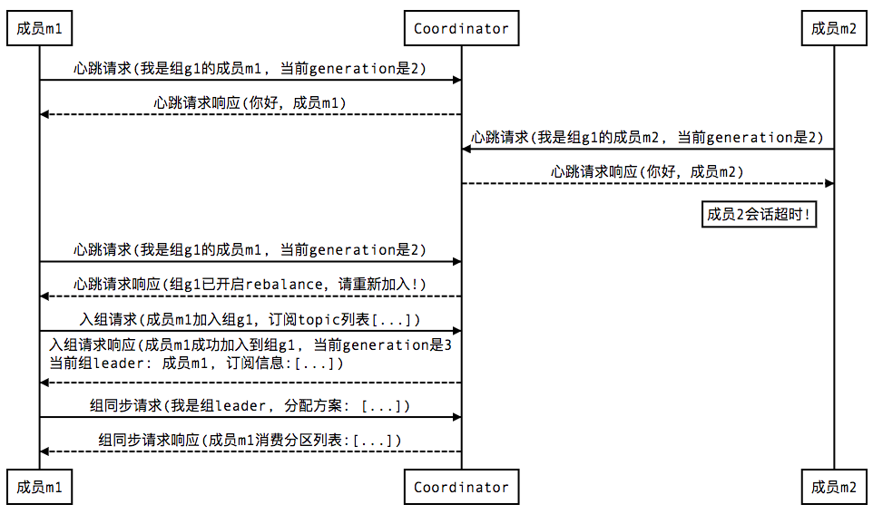
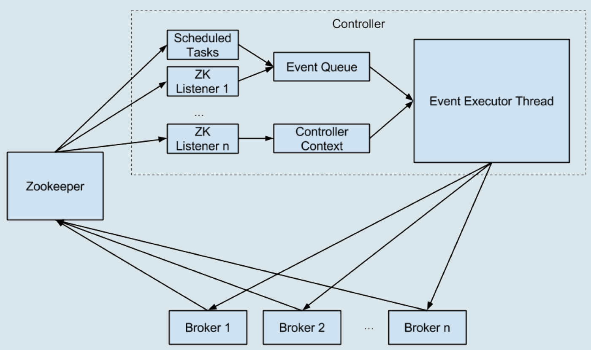

## 1. Kafka架构


如上图所示，一个典型的 Kafka 集群中包含若干 Producer（可以是 web 前端产生的 Page View，或者是服务器日志，系统 CPU、Memory 等），若干 broker（Kafka 支持水平扩展，一般 broker 数量越多，集群吞吐率越高），若干 Consumer Group，以及一个[ Zookeeper ](http://zookeeper.apache.org/)集群。Kafka 通过 Zookeeper 管理集群配置，选举 leader，以及在 Consumer Group 发生变化时进行 rebalance。Producer 使用 push 模式将消息发布到 broker，Consumer 使用 pull 模式从 broker 订阅并消费消息。

### 1.1 Topic & Partition

Topic 在逻辑上可以被认为是一个 queue，每条消费都必须指定它的 Topic，可以简单理解为必须指明把这条消息放进哪个 queue 里。为了使得 Kafka 的吞吐率可以线性提高，<u>物理上把 Topic 分成一个或多个 Partition，每个 Partition 在物理上对应一个文件夹，该文件夹下存储这个 Partition 的所有消息和索引文件。</u> 若创建 topic1 和 topic2 两个 topic，且分别有 13 个和 19 个分区，则整个集群上会相应会生成共 32 个文件夹（本文所用集群共 8 个节点，此处 topic1 和 topic2 replication-factor 均为 1），如下图所示。


每个日志文件都是一个 log entrie 序列，每个 log entrie 包含一个 4 字节整型数值（值为 N+5），1 个字节的"magic value"，4 个字节的 CRC 校验码，其后跟 N 个字节的消息体。每条消息都有一个当前 Partition 下唯一的 64 字节的 offset，它指明了这条消息的起始位置。

这个 log entries 并非由一个文件构成，而是分成多个 segment，每个 segment 以该 segment 第一条消息的 offset 命名并以“.kafka”为后缀。另外会有一个索引文件，它标明了每个 segment 下包含的 log entry 的 offset 范围，如下图所示。


因为每条消息都被 append 到该 Partition 中，属于顺序写磁盘，因此效率非常高（经验证，顺序写磁盘效率比随机写内存还要高，这是 Kafka 高吞吐率的一个很重要的保证）。


对于传统的 message queue 而言，一般会删除已经被消费的消息，**而 Kafka 集群会保留所有的消息，无论其被消费与否**。当然，因为磁盘限制，不可能永久保留所有数据（实际上也没必要），因此 Kafka 提供两种策略删除旧数据。一是基于时间，二是基于 Partition 文件大小。例如可以通过配置 $KAFKA_HOME/config/server.properties，让 Kafka 删除一周前的数据，也可在 Partition 文件超过 1GB 时删除旧数据，配置如下所示。

```properties
# The minimum age of a log file to be eligible for deletion
log.retention.hours=168
# The maximum size of a log segment file. When this size is reached a new log segment will be created.
log.segment.bytes=1073741824
# The interval at which log segments are checked to see if they can be deleted according to the retention policies
log.retention.check.interval.ms=300000
# If log.cleaner.enable=true is set the cleaner will be enabled and individual logs can then be marked for log compaction.
log.cleaner.enable=false
```

**<u>这里要注意，因为 Kafka 读取特定消息的时间复杂度为 O(1)，即与文件大小无关，所以这里删除过期文件与提高 Kafka 性能无关。</u>**选择怎样的删除策略只与磁盘以及具体的需求有关。

另外，<u>Kafka 会为每一个 Consumer Group 保留一些 metadata 信息——当前消费的消息的 position，也即 offset。</u> **<u>这个 offset 由 Consumer 控制。正常情况下 Consumer 会在消费完一条消息后递增该 offset。</u>** *当然，Consumer 也可将 offset 设成一个较小的值，重新消费一些消息。因为 offet 由 Consumer 控制，所以 Kafka broker 是无状态的，它不需要标记哪些消息被哪些消费过，也不需要通过 broker 去保证同一个 Consumer Group 只有一个 Consumer 能消费某一条消息，因此也就不需要锁机制，这也为 Kafka 的高吞吐率提供了有力保障。*

### 1.2 Producer 消息路由

<u>Producer 发送消息到 broker 时，会根据 Paritition 机制选择将其存储到哪一个 Partition。</u>如果 Partition 机制设置合理，所有消息可以均匀分布到不同的 Partition 里，这样就实现了负载均衡。如果一个 Topic 对应一个文件，那这个文件所在的机器 I/O 将会成为这个 Topic 的性能瓶颈，<u>而有了 Partition 后，不同的消息可以并行写入不同 broker 的不同 Partition 里，极大的提高了吞吐率。</u>

> 可以在 $KAFKA_HOME/config/server.properties 中通过配置项 num.partitions 来指定新建 Topic 的默认 Partition 数量，也可在创建 Topic 时通过参数指定，同时也可以在 Topic 创建之后通过 Kafka 提供的工具修改。

**<u>在发送一条消息时，可以指定这条消息的 key，Producer 根据这个 key 和 Partition 机制来判断应该将这条消息发送到哪个 Parition。</u>** Paritition 机制可以通过指定 Producer 的 paritition. class 这一参数来指定，该 class 必须实现 kafka.producer.Partitioner 接口。本例中如果 key 可以被解析为整数则将对应的整数与 Partition 总数取余，该消息会被发送到该数对应的 Partition。（每个 Parition 都会有个序号, 序号从 0 开始）

```java
import kafka.producer.Partitioner;
import kafka.utils.VerifiableProperties;
 
public class JasonPartitioner<T> implements Partitioner {
 
   public JasonPartitioner(VerifiableProperties verifiableProperties) {}
 
   @Override
   public int partition(Object key, int numPartitions) {
       try {
           int partitionNum = Integer.parseInt((String) key);
           return Math.abs(Integer.parseInt((String) key) % numPartitions);
       } catch (Exception e) {
           return Math.abs(key.hashCode() % numPartitions);
       }
   }
}
```

如果将上例中的类作为 partition.class，并通过如下代码发送 20 条消息（key 分别为 0，1，2，3）至 topic3（包含 4 个 Partition）。

```java
 
public void sendMessage() throws InterruptedException{
　　for(int i = 1; i <= 5; i++){
　　      List messageList = new ArrayList<KeyedMessage<String, String>>();
　　      for(int j = 0; j < 4; j++）{
　　          messageList.add(new KeyedMessage<String, String>("topic2", j+"", "The " + i + " message for key " + j));
　　      }
　　      producer.send(messageList);
   }
　　producer.close();
}
```

则 key 相同的消息会被发送并存储到同一个 partition 里，而且 key 的序号正好和 Partition 序号相同。（Partition 序号从 0 开始，本例中的 key 也从 0 开始）。下图所示是通过 Java 程序调用 Consumer 后打印出的消息列表。


### Consumer Group

**<u>使用 Consumer high level API 时，同一 Topic 的一条消息只能被同一个 Consumer Group 内的一个 Consumer 消费，但多个 Consumer Group 可同时消费这一消息。</u>**


这是 Kafka 用来实现一个 Topic 消息的广播（发给所有的 Consumer）和单播（发给某一个 Consumer）的手段。一个 Topic 可以对应多个 Consumer Group。如果需要实现广播，只要每个 Consumer 有一个独立的 Group 就可以了。要实现单播只要所有的 Consumer 在同一个 Group 里。用 Consumer Group 还可以将 Consumer 进行自由的分组而不需要多次发送消息到不同的 Topic。

实际上，Kafka 的设计理念之一就是同时提供离线处理和实时处理。根据这一特性，可以使用 Storm 这种实时流处理系统对消息进行实时在线处理，同时使用 Hadoop 这种批处理系统进行离线处理，还可以同时将数据实时备份到另一个数据中心，只需要保证这三个操作所使用的 Consumer 属于不同的 Consumer Group 即可。下图是 Kafka 在 Linkedin 的一种简化部署示意图。


下面这个例子更清晰地展示了 Kafka Consumer Group 的特性。首先创建一个 Topic (名为 topic1，包含 3 个 Partition)，然后创建一个属于 group1 的 Consumer 实例，并创建三个属于 group2 的 Consumer 实例，最后通过 Producer 向 topic1 发送 key 分别为 1，2，3 的消息。结果发现属于 group1 的 Consumer 收到了所有的这三条消息，同时 group2 中的 3 个 Consumer 分别收到了 key 为 1，2，3 的消息。如下图所示。


## 2. 高可用保证

### 2.1 为何需要 Replication

在 Kafka 在 0.8 以前的版本中，是没有 Replication 的，一旦某一个 Broker 宕机，则其上所有的 Partition 数据都不可被消费，这与 Kafka 数据持久性及 Delivery Guarantee 的设计目标相悖。同时 Producer 都不能再将数据存于这些 Partition 中。

- 如果 Producer 使用同步模式则 Producer 会在尝试重新发送`message.send.max.retries`（默认值为 3）次后抛出 Exception，用户可以选择停止发送后续数据也可选择继续选择发送。而前者会造成数据的阻塞，后者会造成本应发往该 Broker 的数据的丢失。
- 如果 Producer 使用异步模式，则 Producer 会尝试重新发送`message.send.max.retries`（默认值为 3）次后记录该异常并继续发送后续数据，这会造成数据丢失并且用户只能通过日志发现该问题。同时，Kafka 的 Producer 并未对异步模式提供 callback 接口。

由此可见，在没有 Replication 的情况下，一旦某机器宕机或者某个 Broker 停止工作则会造成整个系统的可用性降低。随着集群规模的增加，整个集群中出现该类异常的几率大大增加，因此对于生产系统而言 Replication 机制的引入非常重要。

### 2.2 为何需要 Leader Election

> 注意：本文所述 Leader Election 主要指 Replica 之间的 Leader Election。

引入 Replication 之后，同一个 Partition 可能会有多个 Replica，而这时需要在这些 Replication 之间选出一个 Leader，**<u>Producer 和 Consumer 只与这个 Leader 交互，其它 Replica 作为 Follower 从 Leader 中复制数据。</u>**

<u>因为需要保证同一个 Partition 的多个 Replica 之间的数据一致性（其中一个宕机后其它 Replica 必须要能继续服务并且即不能造成数据重复也不能造成数据丢失）</u>。如果没有一个 Leader，所有 Replica 都可同时读 / 写数据，那就需要保证多个 Replica 之间互相（N×N 条通路）同步数据，数据的一致性和有序性非常难保证，大大增加了 Replication 实现的复杂性，同时也增加了出现异常的几率。而引入 Leader 后，只有 Leader 负责数据读写，Follower 只向 Leader 顺序 Fetch 数据（N 条通路），系统更加简单且高效。

### 2.3 如何将所有 Replica 均匀分布到整个集群

为了更好的做负载均衡，Kafka 尽量将所有的 Partition 均匀分配到整个集群上。一个典型的部署方式是一个 Topic 的 Partition 数量大于 Broker 的数量。同时为了提高 Kafka 的容错能力，也需要将同一个 Partition 的 Replica 尽量分散到不同的机器。实际上，如果所有的 Replica 都在同一个 Broker 上，那一旦该 Broker 宕机，该 Partition 的所有 Replica 都无法工作，也就达不到 HA 的效果。同时，如果某个 Broker 宕机了，需要保证它上面的负载可以被均匀的分配到其它幸存的所有 Broker 上。

Kafka 分配 Replica 的算法如下：

1. <u>将所有 Broker（假设共 n 个 Broker）和待分配的 Partition 排序</u>
2. <u>将第 i 个 Partition 分配到第（i mod n）个 Broker 上</u>
3. <u>将第 i 个 Partition 的第 j 个 Replica 分配到第（(i + j) mode n）个 Broker 上</u>

### 2.4 Data Replication

Kafka 的 Data Replication 需要解决如下问题：

- 怎样 Propagate 消息
- 在向 Producer 发送 ACK 前需要保证有多少个 Replica 已经收到该消息
- 怎样处理某个 Replica 不工作的情况
- 怎样处理 Failed Replica 恢复回来的情况

#### 2.4.1 Propagate 消息

Producer 在发布消息到某个 Partition 时，先通过 ZooKeeper 找到该 Partition 的 Leader，然后无论该 Topic 的 Replication Factor 为多少（也即该 Partition 有多少个 Replica），**Producer 只将该消息发送到该 Partition 的 Leader。**Leader 会将该消息写入其本地 Log。每个 Follower 都从 Leader pull 数据。这种方式上，Follower 存储的数据顺序与 Leader 保持一致。Follower 在收到该消息并写入其 Log 后，向 Leader 发送 ACK。一旦 Leader 收到了 ISR 中的所有 Replica 的 ACK，该消息就被认为已经 commit 了，Leader 将增加 HW 并且向 Producer 发送 ACK。

为了提高性能，每个 Follower 在接收到数据后就立马向 Leader 发送 ACK，而非等到数据写入 Log 中。因此，对于已经 commit 的消息，Kafka 只能保证它被存于多个 Replica 的内存中，而不能保证它们被持久化到磁盘中，也就不能完全保证异常发生后该条消息一定能被 Consumer 消费。但考虑到这种场景非常少见，可以认为这种方式在性能和数据持久化上做了一个比较好的平衡。在将来的版本中，Kafka 会考虑提供更高的持久性。

Consumer 读消息也是从 Leader 读取，只有被 commit 过的消息（offset 低于 HW 的消息）才会暴露给 Consumer。


#### 2.4.2 ACK 前需要保证有多少个备份

和大部分分布式系统一样，Kafka 处理失败需要明确定义一个 Broker 是否“活着”。对于 Kafka 而言，Kafka 存活包含两个条件:

-  <u>一是它必须维护与 ZooKeeper 的 session（这个通过 ZooKeeper 的 Heartbeat 机制来实现）。</u>
- <u>二是 Follower 必须能够及时将 Leader 的消息复制过来，不能“落后太多”。</u>

**<u>Leader 会跟踪与其保持同步的 Replica 列表，该列表称为 ISR（即 in-sync Replica）。如果一个 Follower 宕机，或者落后太多，Leader 将把它从 ISR 中移除。</u>**这里所描述的“落后太多”指 Follower 复制的消息落后于 Leader 后的条数超过预定值（该值可在 $KAFKA_HOME/config/server.properties 中通过`replica.lag.max.messages`配置，其默认值是 4000）或者 Follower 超过一定时间（该值可在 $KAFKA_HOME/config/server.properties 中通过`replica.lag.time.max.ms`来配置，其默认值是 10000）未向 Leader 发送 fetch 请求。

Kafka 的复制机制既不是完全的同步复制，也不是单纯的异步复制: 

- 完全同步复制要求所有能工作的 Follower 都复制完，这条消息才会被认为 commit，这种复制方式极大的影响了吞吐率（高吞吐率是 Kafka 非常重要的一个特性）。
- 而异步复制方式下，Follower 异步的从 Leader 复制数据，数据只要被 Leader 写入 log 就被认为已经 commit，这种情况下如果 Follower 都复制完都落后于 Leader，而如果 Leader 突然宕机，则会丢失数据。

而 Kafka 的这种使用 ISR 的方式则很好的均衡了确保数据不丢失以及吞吐率。Follower 可以批量的从 Leader 复制数据，这样极大的提高复制性能（批量写磁盘），极大减少了 Follower 与 Leader 的差距。

需要说明的是，Kafka 只解决 fail/recover，不处理“Byzantine”（“拜占庭”）问题。一条消息只有被 ISR 里的所有 Follower 都从 Leader 复制过去才会被认为已提交。这样就避免了部分数据被写进了 Leader，还没来得及被任何 Follower 复制就宕机了，而造成数据丢失（Consumer 无法消费这些数据）。而对于 Producer 而言，它可以选择是否等待消息 commit，这可以通过`request.required.acks`来设置。这种机制确保了只要 ISR 有一个或以上的 Follower，一条被 commit 的消息就不会丢失。

#### 2.4.3 Producer 设置可靠性

与此同时，当producer向leader发送数据时，可以通过request.required.acks参数来设置数据可靠性的级别：

-  1：这意味着producer在replication中的leader已成功收到的数据并得到确认后发送下一条message，如果leader宕机了，则会丢失数据。

-  0：这意味着producer无需等待来自broker的确认而继续发送下一批消息，这种情况下数据传输效率最高，但是数据可靠性确是最低的。
-  -1：producer需要等待replication中的所有follower都确认接收到数据后才算一次发送完成，可靠性最高，但是这样也不能保证数据不丢失，比如当replication中只有leader时，这样就变成了acks=1的情况。      

### 2.5 Leader Election 算法

上文说明了 Kafka 是如何做 Replication 的，另外一个很重要的问题是当 Leader 宕机了，怎样在 Follower 中选举出新的 Leader。因为 Follower 可能落后许多或者 crash 了，所以必须确保选择“最新”的 Follower 作为新的 Leader。**<u>一个基本的原则就是，如果 Leader 不在了，新的 Leader 必须拥有原来的 Leader commit 过的所有消息。</u>**这就需要作一个折衷，如果 Leader 在标明一条消息被 commit 前等待更多的 Follower 确认，那在它宕机之后就有更多的 Follower 可以作为新的 Leader，但这也会造成吞吐率的下降。

一种非常常用的选举 leader 的方式是“Majority Vote”（“少数服从多数”），但 Kafka 并未采用这种方式。这种模式下，如果我们有 2f+1 个 Replica（包含 Leader 和 Follower），那在 commit 之前必须保证有 f+1 个 Replica 复制完消息，为了保证正确选出新的 Leader，fail 的 Replica 不能超过 f 个。<u>因为在剩下的任意 f+1 个 Replica 里，至少有一个 Replica 包含有最新的所有消息。这种方式有个很大的优势，系统的 latency 只取决于最快的几个 Broker，而非最慢那个。</u>Majority Vote 也有一些劣势，<u>为了保证 Leader Election 的正常进行，它所能容忍的 fail 的 follower 个数比较少。</u>如果要容忍 1 个 follower 挂掉，必须要有 3 个以上的 Replica，如果要容忍 2 个 Follower 挂掉，必须要有 5 个以上的 Replica。也就是说，在生产环境下为了保证较高的容错程度，必须要有大量的 Replica，而大量的 Replica 又会在大数据量下导致性能的急剧下降。这就是这种算法更多用在[ZooKeeper ](http://zookeeper.apache.org/)这种共享集群配置的系统中而很少在需要存储大量数据的系统中使用的原因。例如 HDFS 的 HA Feature 是基于[ majority-vote-based journal ](http://blog.cloudera.com/blog/2012/10/quorum-based-journaling-in-cdh4-1)，但是它的数据存储并没有使用这种方式。

实际上，Leader Election 算法非常多，比如 ZooKeeper 的[ Zab ](http://web.stanford.edu/class/cs347/reading/zab.pdf), [Raft ](https://ramcloud.stanford.edu/wiki/download/attachments/11370504/raft.pdf)和[ Viewstamped Replication ](http://pmg.csail.mit.edu/papers/vr-revisited.pdf)。而 Kafka 所使用的 Leader Election 算法更像微软的[ PacificA ](http://research.microsoft.com/apps/pubs/default.aspx?id=66814)算法。

**<u>Kafka 在 ZooKeeper 中动态维护了一个 ISR（in-sync replicas），这个 ISR 里的所有 Replica 都跟上了 leader，只有 ISR 里的成员才有被选为 Leader 的可能。在这种模式下，对于 f+1 个 Replica，一个 Partition 能在保证不丢失已经 commit 的消息的前提下容忍 f 个 Replica 的失败。</u>**在大多数使用场景中，这种模式是非常有利的。事实上，为了容忍 f 个 Replica 的失败，Majority Vote 和 ISR 在 commit 前需要等待的 Replica 数量是一样的，但是 ISR 需要的总的 Replica 的个数几乎是 Majority Vote 的一半。

虽然 Majority Vote 与 ISR 相比有不需等待最慢的 Broker 这一优势，但是 Kafka 作者认为 Kafka 可以通过 Producer 选择是否被 commit 阻塞来改善这一问题，并且节省下来的 Replica 和磁盘使得 ISR 模式仍然值得。


**<u>Leader 维护着一组 ISR （In-Sync-Replica）列表，表示认为处于正常同步状态的 Follower 集合。Kafka 依据 replica.lag.time.max.ms 参数来判定一个 Replica 是否仍属于 ISR，如果 Follower 较长时间未与 Leader 保持同步，则 Leader 会考虑将这个 Follower 从 ISR 中踢走。</u>**

除非设置 unclean.leader.election.enable，则新的 Leader 总是从 ISR 中选举得出。<u>min.insync.replicas 决定着每个 topic 能接受的最少 ISR 个数，如果存活 ISR 个数太少，生产消息侧会报异常。</u>

Producer 可以配置 request.required.acks 来决定消息的持久性程度，0 可以认为是 Fire and Forget，1 是收到 Leader 的 ack，而 all 是收到所有 ISR 的 ack。

**<u>一旦 Producer 生产的消息同步给了所有 ISR，便可以将这条消息的下标设置为 HW（High Watermark），小于 HW 下标的消息视为 "Committed"。消费者只能看到大于 HW 的消息。</u>**

#### 2.5.1 如何处理所有 Replica 都不工作

上文提到，在 ISR 中至少有一个 follower 时，Kafka 可以确保已经 commit 的数据不丢失，但如果某个 Partition 的所有 Replica 都宕机了，就无法保证数据不丢失了。这种情况下有两种可行的方案：

- 等待 ISR 中的任一个 Replica“活”过来，并且选它作为 Leader
- 选择第一个“活”过来的 Replica（不一定是 ISR 中的）作为 Leader

**<u>这就需要在可用性和一致性当中作出一个简单的折衷。</u>**如果一定要等待 ISR 中的 Replica“活”过来，那不可用的时间就可能会相对较长。<u>而且如果 ISR 中的所有 Replica 都无法“活”过来了，或者数据都丢失了，这个 Partition 将永远不可用。选择第一个“活”过来的 Replica 作为 Leader，而这个 Replica 不是 ISR 中的 Replica，那即使它并不保证已经包含了所有已 commit 的消息，它也会成为 Leader 而作为 consumer 的数据源（前文有说明，所有读写都由 Leader 完成）</u>。Kafka0.8.* 使用了第二种方式。根据 Kafka 的文档，在以后的版本中，Kafka 支持用户通过配置选择这两种方式中的一种，从而根据不同的使用场景选择高可用性还是强一致性。

#### 2.5.2 如何选举 Leader

最简单最直观的方案是，所有 Follower 都在 ZooKeeper 上设置一个 Watch，一旦 Leader 宕机，其对应的 ephemeral znode 会自动删除，此时所有 Follower 都尝试创建该节点，而创建成功者（ZooKeeper 保证只有一个能创建成功）即是新的 Leader，其它 Replica 即为 Follower。

但是该方法会有 3 个问题：

- split-brain 这是由 ZooKeeper 的特性引起的，虽然 ZooKeeper 能保证所有 Watch 按顺序触发，但并不能保证同一时刻所有 Replica“看”到的状态是一样的，这就可能造成不同 Replica 的响应不一致
- herd effect 如果宕机的那个 Broker 上的 Partition 比较多，会造成多个 Watch 被触发，造成集群内大量的调整
- ZooKeeper 负载过重 每个 Replica 都要为此在 ZooKeeper 上注册一个 Watch，当集群规模增加到几千个 Partition 时 ZooKeeper 负载会过重。

Kafka 0.8.* 的 Leader Election 方案解决了上述问题，它在所有 broker 中选出一个 controller，所有 Partition 的 Leader 选举都由 controller 决定。controller 会将 Leader 的改变直接通过 RPC 的方式（比 ZooKeeper Queue 的方式更高效）通知需为为此作为响应的 Broker。同时 controller 也负责增删 Topic 以及 Replica 的重新分配。

### 2.6 broker failover 过程简介

1. Controller 在 ZooKeeper 的`/brokers/ids`节点上注册 Watch。一旦有 Broker 宕机（本文用宕机代表任何让 Kafka 认为其 Broker die 的情景，包括但不限于机器断电，网络不可用，GC 导致的 Stop The World，进程 crash 等），其在 ZooKeeper 对应的 Znode 会自动被删除，ZooKeeper 会 fire Controller 注册的 Watch，Controller 即可获取最新的幸存的 Broker 列表。
2. Controller 决定 set_p，该集合包含了宕机的所有 Broker 上的所有 Partition。
3. 对 set_p 中的每一个 Partition： 
   1. 从`/brokers/topics/[topic]/partitions/[partition]/state`读取该 Partition 当前的 ISR。
   2. 决定该 Partition 的新 Leader。如果当前 ISR 中有至少一个 Replica 还幸存，则选择其中一个作为新 Leader，新的 ISR 则包含当前 ISR 中所有幸存的 Replica。否则选择该 Partition 中任意一个幸存的 Replica 作为新的 Leader 以及 ISR（该场景下可能会有潜在的数据丢失）。如果该 Partition 的所有 Replica 都宕机了，则将新的 Leader 设置为 -1。
   3. 将新的 Leader，ISR 和新的`leader_epoch`及`controller_epoch`写入`/brokers/topics/[topic]/partitions/[partition]/state`。注意，该操作只有 Controller 版本在 3.1 至 3.3 的过程中无变化时才会执行，否则跳转到 3.1。

4. 直接通过 RPC 向 set_p 相关的 Broker 发送 LeaderAndISRRequest 命令。Controller 可以在一个 RPC 操作中发送多个命令从而提高效率。 Broker failover 顺序图如下所示。


## 3. Kafka Consumer

很多时候，客户程序只是希望从 Kafka 读取数据，不太关心消息 offset 的处理。同时也希望提供一些语义，例如同一条消息只被某一个 Consumer 消费（单播）或被所有 Consumer 消费（广播）。因此，Kafka High Level Consumer 提供了一个从 Kafka 消费数据的高层抽象，从而屏蔽掉其中的细节并提供丰富的语义。

### 3.1 Consumer Group

High Level Consumer 将从某个 Partition 读取的最后一条消息的 offset 存于 ZooKeeper 中（[Kafka 从 0.8.2 版本](https://archive.apache.org/dist/kafka/0.8.2.0/RELEASE_NOTES.html)开始同时支持将 offset 存于 Zookeeper 中与[将offset 存于专用的Kafka Topic 中](https://issues.apache.org/jira/browse/KAFKA-1012)）。这个offset 基于客户程序提供给Kafka 的名字来保存，这个名字被称为Consumer Group。Consumer Group 是整个Kafka 集群全局的，而非某个Topic 的。每一个High Level Consumer 实例都属于一个Consumer Group，若不指定则属于默认的Group。ZooKeeper 中Consumer 相关节点如下图所示：


很多传统的Message Queue 都会在消息被消费完后将消息删除，一方面避免重复消费，另一方面可以保证Queue 的长度比较短，提高效率。而如上文所述，Kafka 并不删除已消费的消息，为了实现传统Message Queue 消息只被消费一次的语义，Kafka 保证每条消息在同一个Consumer Group 里只会被某一个Consumer 消费。与传统Message Queue 不同的是，Kafka 还允许不同Consumer Group 同时消费同一条消息，这一特性可以为消息的多元化处理提供支持。


### 3.2 Consumer Group Rebalance

#### Consumer Group 和Partition

Kafka 保证同一 Consumer Group 中只有一个 Consumer 会消费某条消息，实际上，Kafka 保证的是稳定状态下每一个 Consumer 实例只会消费某一个或多个特定 Partition 的数据，**<u>而某个 Partition 的数据只会被某一个特定的 Consumer 实例所消费。也就是说 Kafka 对消息的分配是以 Partition 为单位分配的，而非以每一条消息作为分配单元。</u>** 这样设计的劣势是无法保证同一个 Consumer Group 里的 Consumer 均匀消费数据，优势是每个 Consumer 不用都跟大量的 Broker 通信，减少通信开销，同时也降低了分配难度，实现也更简单。<u>另外，因为同一个 Partition 里的数据是有序的，这种设计可以保证每个 Partition 里的数据可以被有序消费。</u>

如果某 Consumer Group 中 Consumer（每个 Consumer 只创建 1 个 MessageStream）数量少于 Partition 数量，则至少有一个 Consumer 会消费多个 Partition 的数据，如果 Consumer 的数量与 Partition 数量相同，则正好一个 Consumer 消费一个 Partition 的数据。而如果 Consumer 的数量多于 Partition 的数量时，会有部分 Consumer 无法消费该 Topic 下任何一条消息。


{}
如下例所示，如果 topic1 有 0，1，2 共三个 Partition，当 group1 只有一个 Consumer(名为 consumer1) 时，该 Consumer 可消费这 3 个 Partition 的所有数据。


增加一个Consumer（consumer2）后，其中一个Consumer（consumer1）可消费2 个Partition 的数据（Partition 0 和Partition 1），另外一个Consumer(consumer2) 可消费另外一个Partition（Partition 2）的数据。


再增加一个Consumer（consumer3）后，每个Consumer 可消费一个Partition 的数据。consumer1 消费partition0，consumer2 消费partition1，consumer3 消费partition2。


再增加一个Consumer（consumer4）后，其中3 个Consumer 可分别消费一个Partition 的数据，另外一个Consumer（consumer4）不能消费topic1 的任何数据。


此时关闭consumer1，其余3 个Consumer 可分别消费一个Partition 的数据。


接着关闭consumer2，consumer3 可消费2 个Partition，consumer4 可消费1 个Partition。


再关闭consumer3，仅存的consumer4 可同时消费topic1 的3 个Partition。


{}

#### 避免冲平衡

为什么说重平衡为人诟病呢？**因为重平衡过程中，消费者无法从kafka消费消息，这对kafka的TPS影响极大，而如果kafka集内节点较多，比如数百个，那重平衡可能会耗时极多。数分钟到数小时都有可能，而这段时间kafka基本处于不可用状态。**所以在实际环境中，应该尽量避免重平衡发生。****

1. **消费暂停（Stop-The-World）**
   - **所有消费者在重平衡期间必须暂停消费**，直到新分区分配方案完成。
   - 若重平衡频繁发生，**系统吞吐量会显著下降**（可能下降 50% 以上）。
2. **重复消费风险**
   - 重平衡前消费者可能未提交偏移量（Offset），导致新分配的消费者重复消费消息。
   - 尤其在处理事务性业务时，可能引发数据不一致。
3. **资源开销**
   - **协调者（Coordinator）需处理大量网络请求**：消费者需重新加入组（`JoinGroup`）、同步分配方案（`SyncGroup`）等。
   - 消费者组规模越大，重平衡耗时越长（从几百毫秒到秒级）。
4. **状态管理复杂性**
   - 消费者需重新初始化状态（如缓存、连接池），可能影响业务逻辑。

#### 3.2.1 触发Rebalance的场景

当kafka遇到如下四种情况的时候，kafka会触发Rebalance机制：

1. 消费组成员发生了变更，比如有新的消费者加入了消费组组或者有消费者宕机
2. 消费者无法在指定的时间之内完成消息的消费
3. 消费组订阅的Topic发生了变化
4. 订阅的Topic的partition发生了变化

#### 3.2.2 为什么超时消费会触发Rebalance

针对上文的第二个原因有如下两个疑问

- **消费者默认消费超时的时间是多少**
- **消息消费超时的时候会发生什么**

于是笔者在Test-Group分组下创建了8个消费者线程，提交消息改为手动提交，并且消费完成一批消息后，让笔者让消费线程睡眠15秒

```java
public void consume() {
    try {
        while (true) {
            ConsumerRecords<String, String> records = consumer.poll(Duration.ofMillis(1000));
            for (ConsumerRecord<String, String> record : records) {
                System.out.printf("id = %d , partition = %d , offset = %d, key = %s, value = %s%n", id, record.partition(), record.offset(), record.key(), record.value());
            }
            try {
                TimeUnit.SECONDS.sleep(15);
            } catch (InterruptedException e) {
                e.printStackTrace();
            }
            //手动提交offset
            consumer.commitSync();
        }
    } finally {
        consumer.close();
    }
}
```

多消费者运行代码如下

```java
public static void main(String[] args) throws InterruptedException {
    for (int i = 0; i < 8; i++) {
        final int id = i;
        new Thread() {
            @Override
            public void run() {
                new ReblanceConsumer(id).consume();
            }
        }.start();
    }
    TimeUnit.SECONDS.sleep(Long.MAX_VALUE);
}
```

运行过程中，消费者抛出了如下消费者消费异常

> [Consumer clientId=client-5, groupId=Test-Group] This member will leave the group because consumer poll timeout has expired. This means the time between subsequent calls to poll() was longer than the configured max.poll.interval.ms, which typically implies that the poll loop is spending too much time processing messages. You can address this either by increasing max.poll.interval.ms or by reducing the maximum size of batches returned in poll() with max.poll.records.

在手动提交offset的时候抛出了如下异常

> Commit cannot be completed since the group has already rebalanced and assigned the partitions to another member. This means that the time between subsequent calls to poll() was longer than the configured max.poll.interval.ms, which typically implies that the poll loop is spending too much time message processing. You can address this either by increasing max.poll.interval.ms or by reducing the maximum size of batches returned in poll() with max.poll.records.

在这一节，笔者只介绍第一个异常(第二个异常笔者将在Generation机制中介绍)：

抛出第一个异常的原因是消费超时，导致消费线程长时间无法向Coordinator节点发送心跳，Coordinator节点以为Consumer已经宕机，Coordinator于是将Consumer节点从消费组中剔除，并触发了Rebalance机制。

其实这和Consumer的心跳发送机制也有关系。在大多数[中间件](https://cloud.tencent.com/product/message-queue-catalog?from_column=20065&from=20065)的设计中都会分离业务线程和心跳发送线程，目的就是避免业务线程长时间执行业务流程，导致长时间无法发送心跳。但是kafka却没有这样做，kafka的目的可能是为了实现简单。如果消费者消费业务确实需要非常长时间，我们可以通过参数max. poll. interval. ms配置，它代表消费两次poll最大的时间间隔，比如将其配置成60s。

```java
props.put("max.poll.interval.ms", "60000");
```

或者我们可以减少consumer每次从broker拉取的数据量，consumer默认拉取500条，我们可以将其修改了50条

```java
props.put("max.poll.records", "50");
```

Kafka在后续的新版本中修正了Consumer的心跳发送机制，将心跳发送的任务交给了专门的HeartbeatThread。那么max.poll.interval.ms参数还有意义么？该参数其实还是有意义，因为即使心跳发送正常，那也只能证明Consumer是存活状态，但是Consumer可能处于假死状态，比如Consumer遇到了死锁导致长时间等待超过了poll设定的时间间隔max.poll.interval.ms。

#### 3.2.3 重平衡过程

rebalance本质上是一种协议，规定了一个consumer group下的所有consumer如何达成一致来分配订阅topic的每个分区。比如某个group下有20个consumer，它订阅了一个具有100个分区的topic。正常情况下，Kafka平均会为每个consumer分配5个分区。这个分配的过程就叫rebalance。

Kafka新版本consumer默认提供了两种分配策略：range和round-robin。当然Kafka采用了可插拔式的分配策略，你可以创建自己的分配器以实现不同的分配策略。实际上，由于目前range和round-robin两种分配器都有一些弊端，Kafka社区已经提出第三种分配器来实现更加公平的分配策略，只是目前还在开发中。我们这里只需要知道consumer group默认已经帮我们把订阅topic的分区分配工作做好了就行了。

简单举个例子，假设目前某个consumer group下有两个consumer： A和B，当第三个成员加入时，kafka会触发rebalance并根据默认的分配策略重新为A、B和C分配分区，如下图所示：


#### 3.2.4 谁来执行rebalance和consumer group管理？

Kafka提供了一个角色：coordinator来执行对于consumer group的管理。坦率说kafka对于coordinator的设计与修改是一个很长的故事。最新版本的coordinator也与最初的设计有了很大的不同。这里我只想提及两次比较大的改变。

**<u>首先是0.8版本的coordinator</u>**，那时候的coordinator是依赖zookeeper来实现对于consumer group的管理的。Coordinator监听zookeeper的`/consumers/<group>/ids`的子节点变化以及`/brokers/topics/<topic>`数据变化来判断是否需要进行rebalance。group下的每个consumer都自己决定要消费哪些分区，并把自己的决定抢先在zookeeper中的`/consumers/<group>/owners/<topic>/<partition>`下注册。很明显，这种方案要依赖于zookeeper的帮助，而且每个consumer是单独做决定的，没有那种“大家属于一个组，要协商做事情”的精神。

**<u>基于这些潜在的弊端，0.9版本的kafka改进了coordinator的设计</u>**，提出了group coordinator——每个consumer group都会被分配一个这样的coordinator用于组管理和位移管理。这个group coordinator比原来承担了更多的责任，比如组成员管理、位移提交保护机制等。当新版本consumer group的第一个consumer启动的时候，它会去和kafka server确定谁是它们组的coordinator。之后该group内的所有成员都会和该coordinator进行协调通信。显而易见，这种coordinator设计不再需要zookeeper了，性能上可以得到很大的提升。后面的所有部分我们都将讨论最新版本的coordinator设计。

#### 3.2.5 如何确定coordinator？

上面简单讨论了新版coordinator的设计，那么consumer group如何确定自己的coordinator是谁呢？ 简单来说分为两步：

- 确定consumer group位移信息写入__consumers_offsets的哪个分区。具体计算公式：__

  > consumers_offsets partition# = Math.abs(groupId.hashCode() % groupMetadataTopicPartitionCount)  注意：groupMetadataTopicPartitionCount由offsets.topic.num.partitions指定，默认是50个分区。

- 该分区leader所在的broker就是被选定的coordinator

#### 3.2.6 Rebalance Generation

JVM GC的分代收集就是这个词(严格来说是generational)，我这里把它翻译成“届”好了，它表示了rebalance之后的一届成员，主要是用于保护consumer group，隔离无效offset提交的。比如上一届的consumer成员是无法提交位移到新一届的consumer group中。**<u>我们有时候可以看到ILLEGAL_GENERATION的错误，就是kafka在抱怨这件事情。</u>** **<u>每次group进行rebalance之后，generation号都会加1，表示group进入到了一个新的版本，</u>**如下图所示： Generation 1时group有3个成员，随后成员2退出组，coordinator触发rebalance，consumer group进入Generation 2，之后成员4加入，再次触发rebalance，group进入Generation 3.


#### 3.2.7 协议(protocol)

前面说过了， rebalance本质上是一组协议。group与coordinator共同使用它来完成group的rebalance。目前kafka提供了5个协议来处理与consumer group coordination相关的问题：

- <u>Heartbeat请求：consumer需要定期给coordinator发送心跳来表明自己还活着</u>
- <u>LeaveGroup请求：主动告诉coordinator我要离开consumer group</u>
- <u>SyncGroup请求：group leader把分配方案告诉组内所有成员</u>
- <u>JoinGroup请求：成员请求加入组</u>
- DescribeGroup请求：显示组的所有信息，包括成员信息，协议名称，分配方案，订阅信息等。通常该请求是给管理员使用

Coordinator在rebalance的时候主要用到了前面4种请求。

#### 3.2.8 liveness

consumer如何向coordinator证明自己还活着？ 通过定时向coordinator发送Heartbeat请求。如果超过了设定的超时时间，那么coordinator就认为这个consumer已经挂了。一旦coordinator认为某个consumer挂了，那么它就会开启新一轮rebalance，并且在当前其他consumer的心跳response中添加“REBALANCE_IN_PROGRESS”，告诉其他consumer：不好意思各位，你们重新申请加入组吧！

#### 3.2.9 Rebalance过程

终于说到consumer group执行rebalance的具体流程了。很多用户估计对consumer内部的工作机制也很感兴趣。下面就跟大家一起讨论一下。当然我必须要明确表示，rebalance的前提是coordinator已经确定了。

总体而言，rebalance分为2步：

1. **<u>Join， 顾名思义就是加入组。</u>**这一步中，所有成员都向coordinator发送JoinGroup请求，请求入组。一旦所有成员都发送了JoinGroup请求，coordinator会从中选择一个consumer担任leader的角色，并把组成员信息以及订阅信息发给leader。

   > 注意leader和coordinator不是一个概念。leader负责消费分配方案的制定。

2. **<u>Sync，这一步leader开始分配消费方案，即哪个consumer负责消费哪些topic的哪些partition。</u>**一旦完成分配，leader会将这个方案封装进SyncGroup请求中发给coordinator，非leader也会发SyncGroup请求，只是内容为空。coordinator接收到分配方案之后会把方案塞进SyncGroup的response中发给各个consumer。这样组内的所有成员就都知道自己应该消费哪些分区了。

#### 3.2.10 consumer group状态机

和很多kafka组件一样，group也做了个状态机来表明组状态的流转。coordinator根据这个状态机会对consumer group做不同的处理，如下图所示(完全是根据代码注释手动画的，多见谅吧)




简单说明下图中的各个状态：

- **Dead**：组内已经没有任何成员的最终状态，组的元数据也已经被coordinator移除了。这种状态响应各种请求都是一个response： UNKNOWN_MEMBER_ID
- **Empty**：组内无成员，但是位移信息还没有过期。这种状态只能响应JoinGroup请求
- **PreparingRebalance**：组准备开启新的rebalance，等待成员加入
- **AwaitingSync**：正在等待leader consumer将分配方案传给各个成员
- **Stable**：rebalance完成！可以开始消费了~

#### 3.2.11 rebalance场景剖析

上面详细阐述了consumer group是如何执行rebalance的，可能依然有些云里雾里。这部分对其中的三个重要的场景做详尽的时序展开，进一步加深对于consumer group内部原理的理解。由于图比较直观，所有的描述都将以图的方式给出，不做过多的文字化描述了。

**1 新成员加入组(member join)** 

****


**2 组成员崩溃(member failure)**

前面说过了，组成员崩溃和组成员主动离开是两个不同的场景。因为在崩溃时成员并不会主动地告知coordinator此事，coordinator有可能需要一个完整的session.timeout周期才能检测到这种崩溃，这必然会造成consumer的滞后。可以说离开组是主动地发起rebalance；而崩溃则是被动地发起rebalance。okay，直接上图： 



**3 组成员主动离组（member leave group)**


**4 提交位移(member commit offset)**

 

#### 3.2.12 默认Rebalance 策略

**<u>主要有三种rebalance的策略：range()、round-robin(轮询)、sticky(粘性)。</u>**

Kafka 提供了消费者客户端参数partition.assignment.strategy 来设置消费者与订阅主题之间的分区分配策略。默认情况为range分配策略。

假设一个主题有10个分区(0-9)，现在有三个consumer消费：

**<u>range策略</u>**

range策略就是按照分区序号排序(范围分配)，假设 n＝分区数／消费者数量 = 3， m＝分区数%消费者数量 = 1，那么前 m 个消费者每个分配 n+1 个分区，后面的（消费者数量－m ）个消费者每个分配 n 个分区。

> 比如分区0~3给一个consumer，分区4~6给一个consumer，分区7~9给一个consumer。


**<u>round-robin策略就是轮询分配</u>**

比如分区0、3、6、9给一个consumer，分区1、4、7给一个consumer，分区2、5、8给一个consumer


**<u>sticky策略</u>**

sticky策略初始时分配策略与round-robin类似，但是在rebalance的时候，需要保证如下两个原则:

- 分区的分配要尽可能均匀 。
- 分区的分配尽可能与上次分配的保持相同。

当两者发生冲突时，第一个目标优先于第二个目标 。这样可以最大程度维持原来的分区分配的策略。比如对于第一种range情况的分配，如果第三个consumer挂了，那么重新用sticky策略分配的结果如下：


### 3.3 Consumer Group的位移管理

#### 3.3.1 诞生背景

- 老版本的Kafka会把位移信息保存在Zookeeper中，当Consumer重启后，自动从Zk中读取位移信息。这种设计使Kafka Broker不需要保存位移数据，可减少Broker端需要持有的状态空间，有利于实现高伸缩性。
- Zookeeper不适用于高频的写操作，这令zk集群性能严重下降，在新版本中将消费者的位移数据作为一条条普通的Kafka消息，提交至内部主题（_consumer_offsets）中保存。实现高持久性和高频写操作。


这些`__consumer_offsets-xxx`就是Kafka的位移主题，Kafka将 Consumer 的位移数据作为一条条普通的 Kafka 消息，提交到 __consumer_offsets 中。

#### 3.3.2 位移offset

针对 Consumer Group，Kafka需要记录当前分区当前消费组消费的位置，这个位置我们称之为位移（Offset）。**Kafka消费位移是记录下一条要消费的消息的位移**，而不是目前最新消费消息的位移。

**Consumer 需要向 Kafka 汇报自己的位移数据，这个汇报过程被称为提交位移（Committing Offsets）。**

因为 Consumer 能够同时消费多个分区的数据，所以位移的提交实际上是在分区粒度上进行的，即 **Consumer 需要为分配给它的每个分区提交各自的位移数据**。

如果提交了位移x，那么认为所有小于位移x的消息都已经被消费。**位移提交的语义保障是由消费者来负责的，Kafka 只会“无脑”地接受消费者提交的位移**。对位移提交的管理直接影响了Consumer 所能提供的消息语义保障。

#### 3.3.3 位移主题

- 位移主题是一个普通主题，同样可以被手动创建，修改，删除。
- 位移主题的消息格式是kafka定义的，不可以被手动修改，若修改格式不正确，kafka将会崩溃。

**<u>位移主题Key</u>**

> 位移主题的 Key 中应该保存 3 部分内容：<Group ID，主题名，分区号 >

**<u>位移主题Value</u>**

位移主题的Value也就是消息体有三种：

1. 位移信息与一些元数据信息(比如时间戳等)
2. 用于保存 Consumer Group 信息的消息。
3. 用于删除 Group 过期位移甚至是删除 Group 的消息。它有个专属的名字：tombstone 消息，即墓碑消息，也称 delete mark。一旦某个 Consumer Group 下的所有 Consumer 实例都停止了，而且它们的位移数据都已被删除时，Kafka 会向位移主题的对应分区写入 tombstone 消息，表明要彻底删除这个 Group 的信息。

**<u>位移主题的创建</u>**

- 当Kafka集群中的第一个Consumer程序启动时，Kafka会自动创建位移主题。也可以手动创建
- **分区数**依赖于Broker端的**offsets.topic.num.partitions**的取值，默认为50 ；
- **副本数**依赖于Broker端的**offsets.topic.replication.factor**的取值，默认为3；

#### 3.3.5 自动提交位移&手动提交位移

Consumer 端有个参数叫 **enable.auto.commit**，如果值是 true，则 Consumer 在后台默默地为你定期提交位移，提交间隔由一个专属的参数 **auto.commit.interval.ms** 来控制.

如果你选择的是自动提交位移，那么就可能存在一个问题：只要 Consumer 一直启动着，它就会无限期地向位移主题写入消息。

假设 Consumer 当前消费到了某个主题的最新一条消息，位移是 100，之后该主题没有任何新消息产生，故 Consumer 无消息可消费了，所以位移永远保持在 100。由于是自动提交位移，位移主题中会不停地写入位移 =100 的消息。显然 Kafka 只需要保留这类消息中的最新一条就可以了，之前的消息都是可以删除的。这就要求 Kafka 必须要有针对位移主题消息特点的消息删除策略，否则这种消息会越来越多，最终撑爆整个磁盘。

#### 3.3.6 Compact 策略

Kafka 是怎么删除位移主题中的过期消息的呢？答案就是 Compaction.

**Kafka 使用 Compact 策略来删除位移主题中的过期消息，避免该主题无限期膨胀。**

> 对于同一个 Key 的两条消息 M1 和 M2，如果 M1 的发送时间早于 M2，那么 M1 就是过期消息。


Kafka 提供了专门的后台线程定期地巡检待 Compact 的主题，看看是否存在满足条件的可删除数据。这个后台线程叫 Log Cleaner。很多实际生产环境中都出现过位移主题无限膨胀占用过多磁盘空间的问题，如果你的环境中也有这个问题，我建议你去检查一下 Log Cleaner 线程的状态，通常都是这个线程挂掉了导致的。

### 3.4 控制器 Controller

**控制器组件（Controller），是 Apache Kafka 的核心组件。它的主要作用是在 Apache ZooKeeper 的帮助下管理和协调整个 Kafka 集群**。集群中任意一台 Broker 都能充当控制器的角色，但是，在运行过程中，只能有一个 Broker 成为控制器，行使其管理和协调的职责。换句话说，每个正常运转的 Kafka 集群，在任意时刻都有且只有一个控制器。官网上有个名为 activeController 的 JMX 指标，可以帮助我们实时监控控制器的存活状态。这个 JMX 指标非常关键，你在实际运维操作过程中，一定要实时查看这个指标的值。下面，我们就来详细说说控制器的原理和内部运行机制。

在开始之前，我先简单介绍一下 Apache ZooKeeper 框架。要知道，**控制器是重度依赖 ZooKeeper 的**，因此，我们有必要花一些时间学习下 ZooKeeper 是做什么的。

**Apache ZooKeeper 是一个提供高可靠性的分布式协调服务框架**。它使用的数据模型类似于文件系统的树形结构，根目录也是以“/”开始。该结构上的每个节点被称为 znode，用来保存一些元数据协调信息。

如果以 znode 持久性来划分，**znode 可分为持久性 znode 和临时 znode**。持久性 znode 不会因为 ZooKeeper 集群重启而消失，而临时 znode 则与创建该 znode 的 ZooKeeper 会话绑定，一旦会话结束，该节点会被自动删除。

ZooKeeper 赋予客户端监控 znode 变更的能力，即所谓的 Watch 通知功能。一旦 znode 节点被创建、删除，子节点数量发生变化，抑或是 znode 所存的数据本身变更，ZooKeeper 会通过节点变更监听器 (ChangeHandler) 的方式显式通知客户端。

依托于这些功能，ZooKeeper 常被用来实现**集群成员管理、分布式锁、领导者选举**等功能。Kafka 控制器大量使用 Watch 功能实现对集群的协调管理。我们一起来看一张图片，它展示的是 Kafka 在 ZooKeeper 中创建的 znode 分布。你不用了解每个 znode 的作用，但你可以大致体会下 Kafka 对 ZooKeeper 的依赖。


掌握了 ZooKeeper 的这些基本知识，现在我们就可以开启对 Kafka 控制器的讨论了。

#### 控制器是如何被选出来的？

你一定很想知道，控制器是如何被选出来的呢？我们刚刚在前面说过，每台 Broker 都能充当控制器，那么，当集群启动后，Kafka 怎么确认控制器位于哪台 Broker 呢？

实际上，Broker 在启动时，会尝试去 ZooKeeper 中创建 /controller 节点。Kafka 当前选举控制器的规则是：**第一个成功创建 /controller 节点的 Broker 会被指定为控制器**。

#### 控制器是做什么的？

我们经常说，控制器是起协调作用的组件，那么，这里的协调作用到底是指什么呢？我想了一下，控制器的职责大致可以分为 5 种，我们一起来看看。

1.**主题管理（创建、删除、增加分区）**

这里的主题管理，就是指控制器帮助我们完成对 Kafka 主题的创建、删除以及分区增加的操作。换句话说，当我们执行**kafka-topics 脚本**时，大部分的后台工作都是控制器来完成的。关于 kafka-topics 脚本，我会在专栏后面的内容中，详细介绍它的使用方法。

2.**分区重分配**

分区重分配主要是指，**kafka-reassign-partitions 脚本**（关于这个脚本，后面我也会介绍）提供的对已有主题分区进行细粒度的分配功能。这部分功能也是控制器实现的。

3.**Preferred 领导者选举**

Preferred 领导者选举主要是 Kafka 为了避免部分 Broker 负载过重而提供的一种换 Leader 的方案。在专栏后面说到工具的时候，我们再详谈 Preferred 领导者选举，这里你只需要了解这也是控制器的职责范围就可以了。

4.**集群成员管理（新增 Broker、Broker 主动关闭、Broker 宕机）**

这是控制器提供的第 4 类功能，包括自动检测新增 Broker、Broker 主动关闭及被动宕机。这种自动检测是依赖于前面提到的 Watch 功能和 ZooKeeper 临时节点组合实现的。

比如，控制器组件会利用**Watch 机制**检查 ZooKeeper 的 /brokers/ids 节点下的子节点数量变更。目前，当有新 Broker 启动后，它会在 /brokers 下创建专属的 znode 节点。一旦创建完毕，ZooKeeper 会通过 Watch 机制将消息通知推送给控制器，这样，控制器就能自动地感知到这个变化，进而开启后续的新增 Broker 作业。

侦测 Broker 存活性则是依赖于刚刚提到的另一个机制：**临时节点**。每个 Broker 启动后，会在 /brokers/ids 下创建一个临时 znode。当 Broker 宕机或主动关闭后，该 Broker 与 ZooKeeper 的会话结束，这个 znode 会被自动删除。同理，ZooKeeper 的 Watch 机制将这一变更推送给控制器，这样控制器就能知道有 Broker 关闭或宕机了，从而进行“善后”。

5.**数据服务**

控制器的最后一大类工作，就是向其他 Broker 提供数据服务。控制器上保存了最全的集群元数据信息，其他所有 Broker 会定期接收控制器发来的元数据更新请求，从而更新其内存中的缓存数据。

#### 控制器保存了什么数据？

接下来，我们就详细看看，控制器中到底保存了哪些数据。我用一张图来说明一下。


怎么样，图中展示的数据量是不是很多？几乎把我们能想到的所有 Kafka 集群的数据都囊括进来了。这里面比较重要的数据有：

- 所有主题信息。包括具体的分区信息，比如领导者副本是谁，ISR 集合中有哪些副本等。
- 所有 Broker 信息。包括当前都有哪些运行中的 Broker，哪些正在关闭中的 Broker 等。
- 所有涉及运维任务的分区。包括当前正在进行 Preferred 领导者选举以及分区重分配的分区列表。

值得注意的是，这些数据其实在 ZooKeeper 中也保存了一份。每当控制器初始化时，它都会从 ZooKeeper 上读取对应的元数据并填充到自己的缓存中。有了这些数据，控制器就能对外提供数据服务了。这里的对外主要是指对其他 Broker 而言，控制器通过向这些 Broker 发送请求的方式将这些数据同步到其他 Broker 上。

#### 控制器故障转移（Failover）

我们在前面强调过，在 Kafka 集群运行过程中，只能有一台 Broker 充当控制器的角色，那么这就存在**单点失效**（Single Point of Failure）的风险，Kafka 是如何应对单点失效的呢？答案就是，为控制器提供故障转移功能，也就是说所谓的 Failover。

**故障转移指的是，当运行中的控制器突然宕机或意外终止时，Kafka 能够快速地感知到，并立即启用备用控制器来代替之前失败的控制器**。这个过程就被称为 Failover，该过程是自动完成的，无需你手动干预。

接下来，我们一起来看一张图，它简单地展示了控制器故障转移的过程。


最开始时，Broker 0 是控制器。当 Broker 0 宕机后，ZooKeeper 通过 Watch 机制感知到并删除了 /controller 临时节点。之后，所有存活的 Broker 开始竞选新的控制器身份。Broker 3 最终赢得了选举，成功地在 ZooKeeper 上重建了 /controller 节点。之后，Broker 3 会从 ZooKeeper 中读取集群元数据信息，并初始化到自己的缓存中。至此，控制器的 Failover 完成，可以行使正常的工作职责了。

#### 控制器内部设计原理

在 Kafka 0.11 版本之前，控制器的设计是相当繁琐的，代码更是有些混乱，这就导致社区中很多控制器方面的 Bug 都无法修复。控制器是多线程的设计，会在内部创建很多个线程。比如，控制器需要为每个 Broker 都创建一个对应的 Socket 连接，然后再创建一个专属的线程，用于向这些 Broker 发送特定请求。如果集群中的 Broker 数量很多，那么控制器端需要创建的线程就会很多。另外，控制器连接 ZooKeeper 的会话，也会创建单独的线程来处理 Watch 机制的通知回调。除了以上这些线程，控制器还会为主题删除创建额外的 I/O 线程。

比起多线程的设计，更糟糕的是，这些线程还会访问共享的控制器缓存数据。我们都知道，多线程访问共享可变数据是维持线程安全最大的难题。为了保护数据安全性，控制器不得不在代码中大量使用**ReentrantLock 同步机制**，这就进一步拖慢了整个控制器的处理速度。

鉴于这些原因，社区于 0.11 版本重构了控制器的底层设计，最大的改进就是，**把多线程的方案改成了单线程加事件队列的方案**。我直接使用社区的一张图来说明。



从这张图中，我们可以看到，社区引入了一个**事件处理线程**，统一处理各种控制器事件，然后控制器将原来执行的操作全部建模成一个个独立的事件，发送到专属的事件队列中，供此线程消费。这就是所谓的单线程 + 队列的实现方式。

值得注意的是，这里的单线程不代表之前提到的所有线程都被“干掉”了，控制器只是把缓存状态变更方面的工作委托给了这个线程而已。

这个方案的最大好处在于，控制器缓存中保存的状态只被一个线程处理，因此不再需要重量级的线程同步机制来维护线程安全，Kafka 不用再担心多线程并发访问的问题，非常利于社区定位和诊断控制器的各种问题。事实上，自 0.11 版本重构控制器代码后，社区关于控制器方面的 Bug 明显少多了，这也说明了这种方案是有效的。

针对控制器的第二个改进就是，**将之前同步操作 ZooKeeper 全部改为异步操作**。ZooKeeper 本身的 API 提供了同步写和异步写两种方式。之前控制器操作 ZooKeeper 使用的是同步的 API，性能很差，集中表现为，**当有大量主题分区发生变更时，ZooKeeper 容易成为系统的瓶颈**。新版本 Kafka 修改了这部分设计，完全摒弃了之前的同步 API 调用，转而采用异步 API 写入 ZooKeeper，性能有了很大的提升。根据社区的测试，改成异步之后，ZooKeeper 写入提升了 10 倍！

除了以上这些，社区最近又发布了一个重大的改进！之前 Broker 对接收的所有请求都是一视同仁的，不会区别对待。这种设计对于控制器发送的请求非常不公平，因为这类请求应该有更高的优先级。

举个简单的例子，假设我们删除了某个主题，那么控制器就会给该主题所有副本所在的 Broker 发送一个名为**StopReplica**的请求。如果此时 Broker 上存有大量积压的 Produce 请求，那么这个 StopReplica 请求只能排队等。如果这些 Produce 请求就是要向该主题发送消息的话，这就显得很讽刺了：主题都要被删除了，处理这些 Produce 请求还有意义吗？此时最合理的处理顺序应该是，**赋予 StopReplica 请求更高的优先级，使它能够得到抢占式的处理。**


## Kafka 事务机制与 Exactly Once 语义实现原理


##  高性能的关键

### 宏观架构层面

#### 利用 Partition 实现并行处理

Kafka 是一个 Pub-Sub 的消息系统，无论是发布还是订阅，都须指定 Topic。每个 Topic 都包含一个或多个 Partition，不同 Partition 可位于不同节点。同时 Partition 在物理上对应一个本地文件夹，每个 Partition 包含一个或多个 Segment，每个 Segment 包含一个数据文件和一个与之对应的索引文件。在逻辑上，可以把一个 Partition 当作一个非常长的数组，可通过这个“数组”的索引（offset）去访问其数据。

一方面，由于不同 Partition 可位于不同机器，因此可以充分利用集群优势，实现机器间的并行处理。另一方面，由于 Partition 在物理上对应一个文件夹，即使多个 Partition 位于同一个节点，也可通过配置让同一节点上的不同 Partition 置于不同的 disk drive 上，从而实现磁盘间的并行处理，充分发挥多磁盘的优势。

利用多磁盘的具体方法是，将不同磁盘 mount 到不同目录，然后在 server.properties 中，将 log.dirs 设置为多目录（用逗号分隔）。Kafka 会自动将所有 Partition 尽可能均匀分配到不同目录也即不同目录（也即不同 disk）上。

注：虽然物理上最小单位是 Segment，但 Kafka 并不提供同一 Partition 内不同 Segment 间的并行处理。因为对于写而言，每次只会写 Partition 内的一个 Segment，而对于读而言，也只会顺序读取同一 Partition 内的不同 Segment。

#### ISR 实现可用性与数据一致性的动态平衡

ISR，也即 In-sync Replica。每个 Partition 的 Leader 都会维护这样一个列表，该列表中，包含了所有与之同步的 Replica（包含 Leader 自己）。每次数据写入时，只有 ISR 中的所有 Replica 都复制完，Leader 才会将其置为 Commit，它才能被 Consumer 所消费。

这种方案，与同步复制非常接近。但不同的是，这个 ISR 是由 Leader 动态维护的。如果 Follower 不能紧“跟上”Leader，它将被 Leader 从 ISR 中移除，待它又重新“跟上”Leader 后，会被 Leader 再次加加 ISR 中。每次改变 ISR 后，Leader 都会将最新的 ISR 持久化到 Zookeeper 中。

至于如何判断某个 Follower 是否“跟上”Leader，不同版本的 Kafka 的策略稍微有些区别。

- 对于 0.8.* 版本，如果 Follower 在 replica.lag.time.max.ms 时间内未向 Leader 发送 Fetch 请求（也即数据复制请求），则 Leader 会将其从 ISR 中移除。如果某 Follower 持续向 Leader 发送 Fetch 请求，但是它与 Leader 的数据差距在 replica.lag.max.messages 以上，也会被 Leader 从 ISR 中移除。
- 从 0.9.0.0 版本开始，replica.lag.max.messages 被移除，故 Leader 不再考虑 Follower 落后的消息条数。另外，Leader 不仅会判断 Follower 是否在 replica.lag.time.max.ms 时间内向其发送 Fetch 请求，同时还会考虑 Follower 是否在该时间内与之保持同步

#### 使用 ISR 方案的原因

- 由于 Leader 可移除不能及时与之同步的 Follower，故与同步复制相比可避免最慢的 Follower 拖慢整体速度，也即 ISR 提高了系统可用性。
- ISR 中的所有 Follower 都包含了所有 Commit 过的消息，而只有 Commit 过的消息才会被 Consumer 消费，故从 Consumer 的角度而言，ISR 中的所有 Replica 都始终处于同步状态，从而与异步复制方案相比提高了数据一致性。
- ISR 可动态调整，极限情况下，可以只包含 Leader，极大提高了可容忍的宕机的 Follower 的数量。与 Majority Quorum 方案相比，容忍相同个数的节点失败，所要求的总节点数少了近一半。

### 高效使用磁盘

#### 顺序写磁盘

Kafka 的整个设计中，Partition 相当于一个非常长的数组，而 Broker 接收到的所有消息顺序写入这个大数组中。同时 Consumer 通过 Offset 顺序消费这些数据，并且不删除已经消费的数据，从而避免了随机写磁盘的过程。

由于磁盘有限，不可能保存所有数据，实际上作为消息系统 Kafka 也没必要保存所有数据，需要删除旧的数据。而这个删除过程，并非通过使用“读 - 写”模式去修改文件，而是将 Partition 分为多个 Segment，每个 Segment 对应一个物理文件，通过删除整个文件的方式去删除 Partition 内的数据。这种方式清除旧数据的方式，也避免了对文件的随机写操作。

通过如下代码可知，Kafka 删除 Segment 的方式，是直接删除 Segment 对应的整个 log 文件和整个 index 文件而非删除文件中的部分内容。

```java
 
 /**
  * Delete this log segment from the filesystem.
  *
  * @throws KafkaStorageException if the delete fails.
  */
 def delete() {
   val deletedLog = log.delete()
   val deletedIndex = index.delete()
   val deletedTimeIndex = timeIndex.delete()
   if(!deletedLog && log.file.exists)
     throw new KafkaStorageException("Delete of log " + log.file.getName + " failed.")
   if(!deletedIndex && index.file.exists)
     throw new KafkaStorageException("Delete of index " + index.file.getName + " failed.")
   if(!deletedTimeIndex && timeIndex.file.exists)
     throw new KafkaStorageException("Delete of time index " + timeIndex.file.getName + " failed.")
 }
```

#### 充分利用 Page Cache

使用 Page Cache 的好处如下

- I/O Scheduler 会将连续的小块写组装成大块的物理写从而提高性能
- I/O Scheduler 会尝试将一些写操作重新按顺序排好，从而减少磁盘头的移动时间
- 充分利用所有空闲内存（非 JVM 内存）。如果使用应用层 Cache（即 JVM 堆内存），会增加 GC 负担
- 读操作可直接在 Page Cache 内进行。如果消费和生产速度相当，甚至不需要通过物理磁盘（直接通过 Page Cache）交换数据
- 如果进程重启，JVM 内的 Cache 会失效，但 Page Cache 仍然可用

Broker 收到数据后，写磁盘时只是将数据写入 Page Cache，并不保证数据一定完全写入磁盘。从这一点看，可能会造成机器宕机时，Page Cache 内的数据未写入磁盘从而造成数据丢失。但是这种丢失只发生在机器断电等造成操作系统不工作的场景，而这种场景完全可以由 Kafka 层面的 Replication 机制去解决。如果为了保证这种情况下数据不丢失而强制将 Page Cache 中的数据 Flush 到磁盘，反而会降低性能。也正因如此，Kafka 虽然提供了 flush.messages 和 flush.ms 两个参数将 Page Cache 中的数据强制 Flush 到磁盘，但是 Kafka 并不建议使用。

从上图可以看到，该Broker 每秒通过网络从Producer 接收约35MB 数据，虽然有Follower 从该Broker Fetch 数据，但是该Broker 基本无读磁盘。这是因为该Broker 直接从Page Cache 中将数据取出返回给了Follower。

#### 支持多Disk Drive

Broker 的 log.dirs 配置项，允许配置多个文件夹。如果机器上有多个 Disk Drive，可将不同的 Disk 挂载到不同的目录，然后将这些目录都配置到 log.dirs 里。Kafka 会尽可能将不同的 Partition 分配到不同的目录，也即不同的 Disk 上，从而充分利用了多 Disk 的优势。

### 零拷贝

Kafka 中存在大量的网络数据持久化到磁盘（Producer 到 Broker）和磁盘文件通过网络发送（Broker 到 Consumer）的过程。这一过程的性能直接影响 Kafka 的整体吞吐量。

#### 传统模式下的四次拷贝与四次上下文切换

以将磁盘文件通过网络发送为例。传统模式下，一般使用如下伪代码所示的方法先将文件数据读入内存，然后通过 Socket 将内存中的数据发送出去。

这一过程实际上发生了四次数据拷贝。首先通过系统调用将文件数据读入到内核态 Buffer（DMA 拷贝），然后应用程序将内存态 Buffer 数据读入到用户态 Buffer（CPU 拷贝），接着用户程序通过 Socket 发送数据时将用户态 Buffer 数据拷贝到内核态 Buffer（CPU 拷贝），最后通过 DMA 拷贝将数据拷贝到 NIC Buffer。同时，还伴随着四次上下文切换，如下图所示。


#### sendfile 和 transferTo 实现零拷贝

而 Linux 2.4+ 内核通过 sendfile 系统调用，提供了零拷贝。数据通过 DMA 拷贝到内核态 Buffer 后，直接通过 DMA 拷贝到 NIC Buffer，无需 CPU 拷贝。这也是零拷贝这一说法的来源。除了减少数据拷贝外，因为整个读文件 - 网络发送由一个 sendfile 调用完成，整个过程只有两次上下文切换，因此大大提高了性能。零拷贝过程如下图所示。


从具体实现来看，Kafka 的数据传输通过TransportLayer 来完成，其子类PlaintextTransportLayer 通过[ Java NIO ](http://www.jasongj.com/java/nio_reactor/)的 FileChannel 的 transferTo 和 transferFrom 方法实现零拷贝，如下所示。

```
 
   @Override
   public long transferFrom(FileChannel fileChannel, long position, long count) throws IOException {
       return fileChannel.transferTo(position, count, socketChannel);
   }
```

**注：** transferTo 和 transferFrom 并不保证一定能使用零拷贝。实际上是否能使用零拷贝与操作系统相关，如果操作系统提供 sendfile 这样的零拷贝系统调用，则这两个方法会通过这样的系统调用充分利用零拷贝的优势，否则并不能通过这两个方法本身实现零拷贝。

### 减少网络开销

#### 批处理

批处理是一种常用的用于提高 I/O 性能的方式。对 Kafka 而言，批处理既减少了网络传输的 Overhead，又提高了写磁盘的效率。

Kafka 0.8.1 及以前的 Producer 区分同步 Producer 和异步 Producer。同步 Producer 的 send 方法主要分两种形式。一种是接受一个 KeyedMessage 作为参数，一次发送一条消息。另一种是接受一批 KeyedMessage 作为参数，一次性发送多条消息。而对于异步发送而言，无论是使用哪个 send 方法，实现上都不会立即将消息发送给 Broker，而是先存到内部的队列中，直到消息条数达到阈值或者达到指定的 Timeout 才真正的将消息发送出去，从而实现了消息的批量发送。

Kafka 0.8.2 开始支持新的 Producer API，将同步 Producer 和异步 Producer 结合。虽然从 send 接口来看，一次只能发送一个 ProducerRecord，而不能像之前版本的 send 方法一样接受消息列表，但是 send 方法并非立即将消息发送出去，而是通过 batch.size 和 linger.ms 控制实际发送频率，从而实现批量发送。

由于每次网络传输，除了传输消息本身以外，还要传输非常多的网络协议本身的一些内容（称为 Overhead），所以将多条消息合并到一起传输，可有效减少网络传输的 Overhead，进而提高了传输效率。


#### 数据压缩降低网络负载

Kafka 从 0.7 开始，即支持将数据压缩后再传输给 Broker。除了可以将每条消息单独压缩然后传输外，Kafka 还支持在批量发送时，将整个 Batch 的消息一起压缩后传输。数据压缩的一个基本原理是，重复数据越多压缩效果越好。因此将整个 Batch 的数据一起压缩能更大幅度减小数据量，从而更大程度提高网络传输效率。

Broker 接收消息后，并不直接解压缩，而是直接将消息以压缩后的形式持久化到磁盘。Consumer Fetch 到数据后再解压缩。因此 Kafka 的压缩不仅减少了 Producer 到 Broker 的网络传输负载，同时也降低了 Broker 磁盘操作的负载，也降低了 Consumer 与 Broker 间的网络传输量，从而极大得提高了传输效率，提高了吞吐量。

#### 高效的序列化方式

Kafka 消息的 Key 和 Payload（或者说 Value）的类型可自定义，只需同时提供相应的序列化器和反序列化器即可。因此用户可以通过使用快速且紧凑的序列化 - 反序列化方式（如 Avro，Protocal Buffer）来减少实际网络传输和磁盘存储的数据规模，从而提高吞吐率。这里要注意，如果使用的序列化方法太慢，即使压缩比非常高，最终的效率也不一定高。
