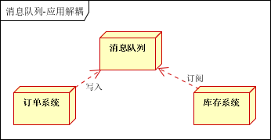
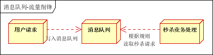

### 关于消息队列的使用

#### 一、消息队列概述
消息队列中间件是分布式系统中重要的组件，主要解决应用解耦，异步消息，流量削锋等问题，实现高性能，高可用，可伸缩和最终一致性架构。目前使用较多的消息队列有ActiveMQ，RabbitMQ，ZeroMQ，Kafka，MetaMQ，RocketMQ

#### 二、消息队列应用场景
以下介绍消息队列在实际应用中常用的使用场景。异步处理，应用解耦，流量削锋和消息通讯四个场景。

##### 2.1异步处理
景说明：用户注册后，需要发注册邮件和注册短信。传统的做法有两种 

1. 串行的方式
2. 并行方式

a、串行方式：将注册信息写入数据库成功后，发送注册邮件，再发送注册短信。以上三个任务全部完成后，返回给客户端。

b、并行方式：将注册信息写入数据库成功后，发送注册邮件的同时，发送注册短信。以上三个任务完成后，返回给客户端。与串行的差别是，并行的方式可以提高处理的时间

假设三个业务节点每个使用50毫秒钟，不考虑网络等其他开销，则串行方式的时间是150毫秒，并行的时间可能是100毫秒。

因为CPU在单位时间内处理的请求数是一定的，假设CPU1秒内吞吐量是100次。则串行方式1秒内CPU可处理的请求量是7次（1000/150）。并行方式处理的请求量是10次（1000/100）

小结：如以上案例描述，传统的方式系统的性能（并发量，吞吐量，响应时间）会有瓶颈。如何解决这个问题呢？

引入消息队列，将不是必须的业务逻辑，异步处理。改造后的架构如下：

按照以上约定，用户的响应时间相当于是注册信息写入数据库的时间，也就是50毫秒。注册邮件，发送短信写入消息队列后，直接返回，因此写入消息队列的速度很快，基本可以忽略，因此用户的响应时间可能是50毫秒。因此架构改变后，系统的吞吐量提高到每秒20 QPS。比串行提高了3倍，比并行提高了两倍。

##### 2.2应用解耦
场景说明：用户下单后，订单系统需要通知库存系统。传统的做法是，订单系统调用库存系统的接口。如下图：

传统模式的缺点：假如库存系统无法访问，则订单减库存将失败，从而导致订单失败，订单系统与库存系统耦合

如何解决以上问题呢？引入应用消息队列后的方案，如下图：

订单系统：用户下单后，订单系统完成持久化处理，将消息写入消息队列，返回用户订单下单成功

库存系统：订阅下单的消息，采用拉/推的方式，获取下单信息，库存系统根据下单信息，进行库存操作

假如：在下单时库存系统不能正常使用。也不影响正常下单，因为下单后，订单系统写入消息队列就不再关心其他的后续操作了。实现订单系统与库存系统的应用解耦

##### 2.3流量削锋

流量削锋也是消息队列中的常用场景，一般在秒杀或团抢活动中使用广泛。

应用场景：秒杀活动，一般会因为流量过大，导致流量暴增，应用挂掉。为解决这个问题，一般需要在应用前端加入消息队列。

* a、可以控制活动的人数

* b、可以缓解短时间内高流量压垮应用

用户的请求，服务器接收后，首先写入消息队列。假如消息队列长度超过最大数量，则直接抛弃用户请求或跳转到错误页面。
秒杀业务根据消息队列中的请求信息，再做后续处理

##### 2.4日志处理
日志处理是指将消息队列用在日志处理中，比如Kafka的应用，解决大量日志传输的问题。架构简化如下

日志采集客户端，负责日志数据采集，定时写受写入Kafka队列

Kafka消息队列，负责日志数据的接收，存储和转发

日志处理应用：订阅并消费kafka队列中的日志数据

##### 2.5消息通讯
消息通讯是指，消息队列一般都内置了高效的通信机制，因此也可以用在纯的消息通讯。比如实现点对点消息队列，或者聊天室等

点对点通讯：

客户端A和客户端B使用同一队列，进行消息通讯。

聊天室通讯：

客户端A，客户端B，客户端N订阅同一主题，进行消息发布和接收。实现类似聊天室效果。

以上实际是消息队列的两种消息模式，点对点或发布订阅模式。模型为示意图，供参考。

#### 三、消息中间件示例
##### 3.1电商系统

消息队列采用高可用，可持久化的消息中间件。比如Active MQ，Rabbit MQ，Rocket Mq。

（1）应用将主干逻辑处理完成后，写入消息队列。消息发送是否成功可以开启消息的确认模式。（消息队列返回消息接收成功状态后，应用再返回，这样保障消息的完整性）

（2）扩展流程（发短信，配送处理）订阅队列消息。采用推或拉的方式获取消息并处理。

（3）消息将应用解耦的同时，带来了数据一致性问题，可以采用最终一致性方式解决。比如主数据写入数据库，扩展应用根据消息队列，并结合数据库方式实现基于消息队列的后续处理。

##### 3.2日志收集系统

### 四、JMS消息服务
讲消息队列就不得不提JMS 。JMS（JAVA Message Service，java消息服务）API是一个消息服务的标准/规范，允许应用程序组件基于JavaEE平台创建、发送、接收和读取消息。它使分布式通信耦合度更低，消息服务更加可靠以及异步性。

在EJB架构中，有消息bean可以无缝的与JM消息服务集成。在J2EE架构模式中，有消息服务者模式，用于实现消息与应用直接的解耦。

##### 4.1消息模型
在JMS标准中，有两种消息模型

- P2P（Point to Point）
- Publish/Subscribe(Pub/Sub)

##### 4.1.1 P2P模式

P2P模式包含三个角色：消息队列（Queue），发送者(Sender)，接收者(Receiver)。每个消息都被发送到一个特定的队列，接收者从队列中获取消息。队列保留着消息，直到他们被消费或超时。

P2P的特点: 

- 每个消息只有一个消费者（Consumer）(即一旦被消费，消息就不再在消息队列中)
- 发送者和接收者之间在时间上没有依赖性，也就是说当发送者发送了消息之后，不管接收者有没有正在运行，它不会影响到消息被发送到队列
- 接收者在成功接收消息之后需向队列应答成功
- 如果希望发送的每个消息都会被成功处理的话，那么需要P2P模式。

##### 4.1.2 Pub/Sub模式

包含三个角色主题（Topic），发布者（Publisher），订阅者（Subscriber） 多个发布者将消息发送到Topic，系统将这些消息传递给多个订阅者。

Pub/Sub的特点:

- 每个消息可以有多个消费者
- 发布者和订阅者之间有时间上的依赖性。针对某个主题（Topic）的订阅者，它必须创建一个订阅者之后，才能消费发布者的消息
- 为了消费消息，订阅者必须保持运行的状态
- 为了缓和这样严格的时间相关性，JMS允许订阅者创建一个可持久化的订阅。这样，即使订阅者没有被激活（运行），它也能接收到发布者的消息。
- 如果希望发送的消息可以不被做任何处理、或者只被一个消息者处理、或者可以被多个消费者处理的话，那么可以采用Pub/Sub模型。

##### 4.2 消息消费
在JMS中，消息的产生和消费都是异步的。对于消费来说，JMS的消息者可以通过两种方式来消费消息。

**<u>（1）同步</u>**

<u>订阅者或接收者通过receive方法来接收消息，receive方法在接收到消息之前（或超时之前）将一直阻塞；</u>

**<u>（2）异步</u>**

<u>订阅者或接收者可以注册为一个消息监听器。当消息到达之后，系统自动调用监听器的onMessage方法。</u>

**<u>JNDI</u>**

Java命名和目录接口,是一种标准的Java命名系统接口。可以在网络上查找和访问服务。通过指定一个资源名称，该名称对应于数据库或命名服务中的一个记录，同时返回资源连接建立所必须的信息。

JNDI在JMS中起到查找和访问发送目标或消息来源的作用。
